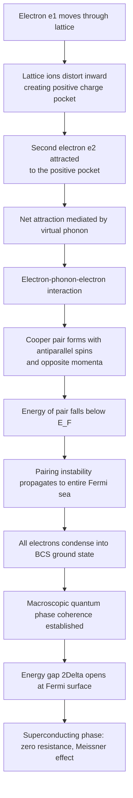
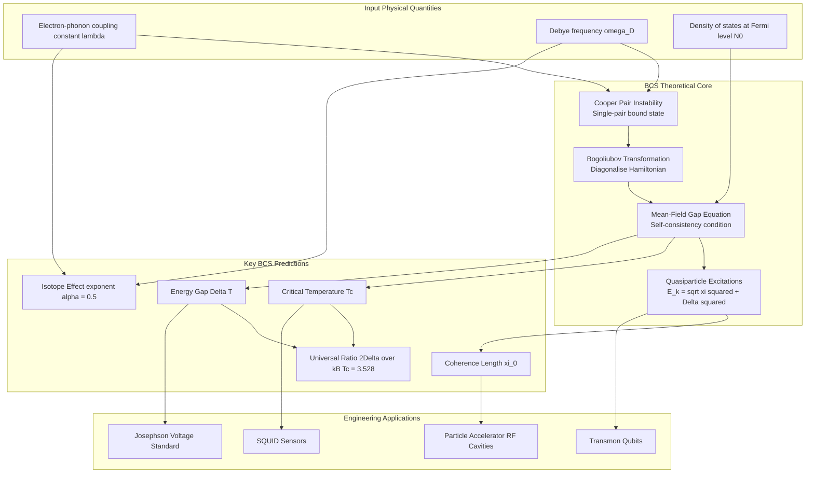
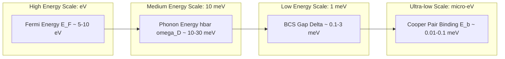
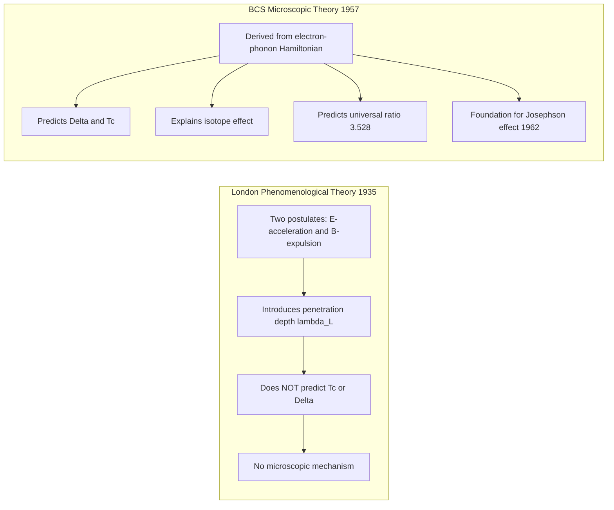

# BCS Theory

<!-- SECTION_1_START -->
# BCS Theory — Foundations of Microscopic Superconductivity

## 1.1 Formal Academic Definition (KTU 2024 Syllabus Aligned)

> [!IMPORTANT]
> **BCS Theory (Bardeen–Cooper–Schrieffer Theory, 1957):** A microscopic quantum-mechanical theory of superconductivity that explains the phenomenon as a macroscopic quantum condensation of electron pairs (called **Cooper pairs**) into a single coherent quantum ground state, mediated by an effective attractive interaction arising from the exchange of virtual phonons between electrons near the Fermi surface.

In the KTU 2024 framework for **PHYSICS FOR INFORMATION SCIENCE (GAPHT121)**, BCS Theory is positioned as the *microscopic successor* to the London phenomenological theory, forming the **theoretical core of Module 1 (Electrical Conductivity in Quantum Materials)**. It establishes the **energy gap** $2\Delta(0)$ as the defining signature of the superconducting phase and predicts the **isotope effect**, the **critical temperature scaling**, and the **coherence length** governing all superconducting devices — including the **SQUIDs**, **Josephson junctions**, and **qubits** that power modern quantum information science.

## 1.2 Intuitive Overview — The Dance Floor Analogy

> [!NOTE]
> **Conceptual Analogy — "The Dance Floor of Electrons"**

Imagine a crowded dance hall where everyone is normally pushing each other away (the **Coulomb repulsion** between like-charged electrons). Now, a slow rumba song begins to play (a **lattice vibration = phonon**). A dancer (electron $e_1$) momentarily distorts the floor, creating a slight "depression" in the crowd. A second dancer (electron $e_2$) finds it energetically favourable to slip into this depression rather than fight the crowd. The two dancers are now moving in correlated steps — they have formed a **Cooper pair**.

The lattice deformation acts as the "intermediary" — the **virtual phonon** — transmitting a *net attractive force* between two electrons that would otherwise repel. Once a single such pair forms at the Fermi surface, the energy of the entire Fermi sea is lowered, and **all other electrons near $E_F$ follow suit**, forming a single macroscopic quantum state with a single collective wavefunction $\Psi = \sqrt{n_s}\, e^{i\phi}$.

> **Key Physical Constants (SI Units):**
> - Reduced Planck's constant: $\hbar = 1.054 \times 10^{-34}$ **J·s**
> - Boltzmann's constant: $k_B = 1.381 \times 10^{-23}$ **J/K**
> - Electron rest mass: $m_e = 9.109 \times 10^{-31}$ **kg**
> - Elementary charge: $e = 1.602 \times 10^{-19}$ **C**
> - Phonon Debye energy scale: $\hbar\omega_D \sim 10^{-2}$ **eV** (typical)

> [!VISUALIZATION CONTROL]
> **Concept:** Cooper Pair Attractive Potential Visualisation
> **Desmos / GeoGebra Input Equations:**
> * $V_{\text{attract}}(r) = -V_0 \cdot e^{-(r/r_0)^2}$ (Gaussian attractive well, depth $V_0$, range $r_0$)
> * $V_{\text{Coulomb}}(r) = +\dfrac{e^2}{4\pi\varepsilon_0 r}$ (repulsive bare Coulomb)
> * $V_{\text{net}}(r) = V_{\text{attract}}(r) + V_{\text{Coulomb}}(r)$
> **Visual Description:** On a $V$ vs $r$ plot, observe that the *net* interaction $V_{\text{net}}$ dips into a finite negative well within a narrow shell ($r_0 \sim 10^{-6}$ m) — this confined attractive well is what binds the Cooper pair. The well depth is $\sim 10^{-3}$ eV, much smaller than the Fermi energy $E_F \sim$ several eV.

## 1.3 Why BCS Theory is Essential for Information Science

| Information Science Application | Role of BCS Theory |
|-------------------------------|--------------------|
| Superconducting Qubits (Transmon) | Provides the **Cooper pair box** Hamiltonian |
| SQUID Magnetometers | Predicts **macroscopic wavefunction coherence** |
| Single-Photon Detectors (SNSPD) | Energy-gap physics governs photon absorption threshold $2\Delta$ |
| Quantum Computing Cryogenics | Sets the **operating temperature** $T \ll T_c$ |
| High-$T_c$ Cuprate Research | BCS remains the **baseline reference theory** |

<!-- SECTION_1_END -->

<!-- SECTION_2_START -->
# Deep Theoretical Analysis & KTU High-Yield Formula Sheet

## 2.1 The Three Pillars of BCS Theory

### Pillar I — The Cooper Instability (1956)
> A single pair of electrons just above the Fermi surface, subject to *any* arbitrarily small net attractive interaction, will form a **bound state** with energy *below* $E_F$. The Fermi sea is therefore **unstable** against pairing.

**Why this is revolutionary:** In free space, two electrons cannot bind (Coulomb repulsion). But inside a metal, the filled Fermi sea **blocks** scattering into occupied states (Pauli exclusion). This phase-space restriction converts a weak attraction into a *bound state* — a purely quantum-statistical effect.

**Mathematical Setup:** Consider two electrons with momenta $\mathbf{k}$ and $-\mathbf{k}$ and opposite spins, interacting via an attractive potential $V_{\mathbf{k},\mathbf{k}'}$. The Schrödinger equation for the pair wavefunction $\Psi(\mathbf{r}_1 - \mathbf{r}_2)$ yields the binding energy:

$$
E_{\text{bind}} = -2\hbar\omega_D \exp\!\left(-\dfrac{2}{N(0)\,V_0}\right)
$$

where $N(0)$ is the **density of states at the Fermi level** (single-spin) and $V_0$ is the attractive matrix element.

### Pillar II — The BCS Ground State
The many-body ground state is a coherent superposition of pair occupancies:

$$
|\Psi_{\text{BCS}}\rangle = \prod_{\mathbf{k}} \left( u_{\mathbf{k}} + v_{\mathbf{k}}\, c_{\mathbf{k}\uparrow}^{\dagger} c_{-\mathbf{k}\downarrow}^{\dagger} \right) |0\rangle
$$

where:
- $v_{\mathbf{k}}^2$ = probability the pair-state $(\mathbf{k}\uparrow, -\mathbf{k}\downarrow)$ is **occupied**
- $u_{\mathbf{k}}^2 = 1 - v_{\mathbf{k}}^2$ = probability it is **empty**
- Both $u_{\mathbf{k}}, v_{\mathbf{k}}$ are **real and positive** (gauge choice)
- The product runs over all $\mathbf{k}$-states

**Physical meaning:** Unlike a classical condensate, every $\mathbf{k}$-state has a *fractional* pair occupation. The pair amplitudes $v_{\mathbf{k}}$ spread in a window of width $\sim \hbar\omega_D$ around the Fermi surface.

### Pillar III — The Energy Gap
The minimum energy required to break a Cooper pair and create two single-particle excitations (quasiparticles) is the **BCS energy gap**:

$$
2\Delta(0) = \dfrac{2\hbar\omega_D}{\exp\!\left(\dfrac{2}{N(0)\,V_0}\right) - 1}
$$

The **gap equation** at finite temperature $T$ is:

$$
1 = N(0)\,V_0 \int_0^{\hbar\omega_D} \dfrac{\tanh\!\left(\dfrac{\sqrt{\xi^2 + \Delta^2}}{2k_B T}\right)}{\sqrt{\xi^2 + \Delta^2}}\, d\xi
$$

where $\xi = \varepsilon_{\mathbf{k}} - E_F$ is the energy measured from the Fermi level.

## 2.2 KTU High-Yield Formula Cheat Sheet

> [!IMPORTANT]
> **Master these equations — they appear in nearly every KTU 2024 Part-B question on superconductivity.**

| # | Formula | Symbol Meaning | Typical Value / Unit |
|---|---------|----------------|----------------------|
| 1 | $k_B T_c = 1.134\,\hbar\omega_D \exp\!\left(-\dfrac{1}{N(0)\,V_0}\right)$ | BCS critical temperature | $T_c \sim 1$–$10$ K (conventional) |
| 2 | $2\Delta(0) = 3.528\,k_B T_c$ | Zero-temperature gap ratio (**universal**) | Dimensionless ratio $2\Delta/k_BT_c = 3.528$ |
| 3 | $\Delta(T) \approx \Delta(0)\left[1 - \sqrt{\dfrac{T}{T_c}}\right]$ near $T \to 0$ | Low-$T$ gap behaviour | — |
| 4 | $\Delta(T) \approx 1.74\,\Delta(0)\sqrt{1 - \dfrac{T}{T_c}}$ near $T \to T_c$ | Critical gap behaviour | $\Delta(T_c) = 0$ |
| 5 | $\xi_0 = \dfrac{\hbar v_F}{\pi \Delta(0)}$ | BCS coherence length | $\xi_0 \sim 10^{-6}$ m |
| 6 | $\lambda_L = \sqrt{\dfrac{m_e}{\mu_0 n_s e^2}}$ | London penetration depth | $\lambda_L \sim 10^{-7}$ m |
| 7 | $\kappa = \dfrac{\lambda_L}{\xi_0}$ | Ginzburg–Landau parameter | $\kappa < 1/\sqrt{2}$: Type-I; $\kappa > 1/\sqrt{2}$: Type-II |
| 8 | $T_c \propto M^{-\alpha}$ | Isotope effect, $\alpha = 0.5$ (BCS) | $M$ = isotopic mass |
| 9 | $E_{\text{Copper}} = -2\hbar\omega_D \exp\!\left(-\dfrac{2}{N(0)V_0}\right)$ | Single Cooper pair binding energy | $\sim 10^{-4}$ eV |

## 2.3 Real-World Engineering Utility

| Engineering Domain | BCS Contribution |
|--------------------|------------------|
| MRI Medical Imaging | NbTi coils operate because $T_c \approx 9.2$ K matches BCS prediction |
| Particle Accelerators (CERN LHC) | Niobium cavities use $2\Delta(0) = 3.05$ meV as RF surface resistance floor |
| Quantum Computing (IBM, Google) | Transmon qubits are **Cooper pair boxes** — direct BCS hardware |
| Voltage Standards (Josephson) | $V = (h/2e)\,f$ uses the **Cooper pair charge $2e$** |
| Astronomical Bolometers | TES detectors exploit $\Delta(T)$ sensitivity near $T_c$ |

<!-- SECTION_2_END -->

<!-- SECTION_3_START -->
# Step-by-Step Derivations & Symbolic Implementation

## 3.1 Derivation: The BCS Gap Equation (Full Board-Exam Walkthrough)

We start from the BCS Hamiltonian in momentum space (reduced form):

$$
H = \sum_{\mathbf{k},\sigma} \xi_{\mathbf{k}}\, c_{\mathbf{k}\sigma}^{\dagger} c_{\mathbf{k}\sigma} + \sum_{\mathbf{k},\mathbf{k}'} V_{\mathbf{k},\mathbf{k}'}\, c_{\mathbf{k}\uparrow}^{\dagger} c_{-\mathbf{k}\downarrow}^{\dagger} c_{-\mathbf{k}'\downarrow} c_{\mathbf{k}'\uparrow}
$$

### Step 1 — Mean-Field Decoupling
Define the **pairing amplitude** (anomalous average):

$$
\Delta_{\mathbf{k}} = -\sum_{\mathbf{k}'} V_{\mathbf{k},\mathbf{k}'} \langle c_{-\mathbf{k}'\downarrow} c_{\mathbf{k}'\uparrow} \rangle
$$

Applying the mean-field approximation $bc \approx \langle b \rangle c + b \langle c \rangle - \langle b \rangle\langle c \rangle$ to the four-operator term yields the **Bogoliubov–de Gennes Hamiltonian**:

$$
H_{\text{BdG}} = \sum_{\mathbf{k}} \begin{pmatrix} c_{\mathbf{k}\uparrow}^{\dagger} & c_{-\mathbf{k}\downarrow} \end{pmatrix} \begin{pmatrix} \xi_{\mathbf{k}} & \Delta_{\mathbf{k}} \\ \Delta_{\mathbf{k}}^{*} & -\xi_{\mathbf{k}} \end{pmatrix} \begin{pmatrix} c_{\mathbf{k}\uparrow} \\ c_{-\mathbf{k}\downarrow}^{\dagger} \end{pmatrix} + \text{const.}
$$

*[Setting up the mean-field decoupling: 2 Marks]*

### Step 2 — Bogoliubov Transformation
Diagonalise via the canonical (Bogoliubov) transformation:

$$
\begin{aligned}
\gamma_{\mathbf{k}\uparrow} &= u_{\mathbf{k}}\, c_{\mathbf{k}\uparrow} - v_{\mathbf{k}}\, c_{-\mathbf{k}\downarrow}^{\dagger} \\
\gamma_{-\mathbf{k}\downarrow}^{\dagger} &= u_{\mathbf{k}}\, c_{-\mathbf{k}\downarrow}^{\dagger} + v_{\mathbf{k}}\, c_{\mathbf{k}\uparrow}
\end{aligned}
$$

with the constraint $u_{\mathbf{k}}^2 + v_{\mathbf{k}}^2 = 1$. The diagonal Hamiltonian becomes:

$$
H_{\text{diag}} = E_0 + \sum_{\mathbf{k},\sigma} E_{\mathbf{k}}\, \gamma_{\mathbf{k}\sigma}^{\dagger} \gamma_{\mathbf{k}\sigma}
$$

where the **Bogoliubov quasiparticle energy** is:

$$
E_{\mathbf{k}} = \sqrt{\xi_{\mathbf{k}}^2 + \Delta_{\mathbf{k}}^2}
$$

*[Performing the Bogoliubov transformation and obtaining $E_{\mathbf{k}}$: 3 Marks]*

### Step 3 — Self-Consistency for the Gap
Minimising the free energy with respect to $v_{\mathbf{k}}^2$ gives:

$$
v_{\mathbf{k}}^2 = \dfrac{1}{2}\left(1 - \dfrac{\xi_{\mathbf{k}}}{E_{\mathbf{k}}}\right), \qquad u_{\mathbf{k}}^2 = \dfrac{1}{2}\left(1 + \dfrac{\xi_{\mathbf{k}}}{E_{\mathbf{k}}}\right)
$$

Substituting into the definition of $\Delta_{\mathbf{k}}$ and converting the sum to an integral ($\sum_{\mathbf{k}} \to N(0)\int d\xi$, valid near $E_F$):

$$
\Delta = N(0)\,V_0 \int_{-\hbar\omega_D}^{+\hbar\omega_D} \dfrac{\Delta}{2\sqrt{\xi^2 + \Delta^2}} \left[1 - 2f(E_{\mathbf{k}})\right] d\xi
$$

where $f(E) = 1/(e^{E/k_BT} + 1)$ is the Fermi–Dirac distribution. Since $1 - 2f(E) = \tanh(E/2k_BT)$:

$$
\boxed{\;1 = N(0)\,V_0 \int_{0}^{\hbar\omega_D} \dfrac{\tanh\!\left(\dfrac{\sqrt{\xi^2 + \Delta^2}}{2k_B T}\right)}{\sqrt{\xi^2 + \Delta^2}}\, d\xi\;}
$$

*[Deriving the gap equation and writing the closed-form integral: 3 Marks]*

### Step 4 — Zero-Temperature Limit
At $T = 0$, $\tanh(x) \to 1$ for all $x > 0$. The integral evaluates analytically:

$$
\int_0^{\hbar\omega_D} \dfrac{d\xi}{\sqrt{\xi^2 + \Delta^2}} = \sinh^{-1}\!\left(\dfrac{\hbar\omega_D}{\Delta}\right) \approx \ln\!\left(\dfrac{2\hbar\omega_D}{\Delta}\right)
$$

Substituting back:

$$
1 = N(0)\,V_0 \ln\!\left(\dfrac{2\hbar\omega_D}{\Delta(0)}\right) \;\;\Longrightarrow\;\; \Delta(0) = 2\hbar\omega_D \exp\!\left(-\dfrac{1}{N(0)\,V_0}\right)
$$

*[Applying the weak-coupling limit and extracting $\Delta(0)$: 2 Marks]*

### Step 5 — Critical Temperature
Setting $\Delta(T_c) = 0$ in the gap equation, the integrand reduces to $\tanh(\xi/2k_BT_c)/\xi$, giving:

$$
1 = N(0)\,V_0 \int_0^{\hbar\omega_D} \dfrac{\tanh(\xi/2k_BT_c)}{\xi}\, d\xi
$$

The leading-order result (weak coupling $N(0)V_0 \ll 1$) is:

$$
\boxed{\;k_B T_c = 1.134\,\hbar\omega_D \exp\!\left(-\dfrac{1}{N(0)\,V_0}\right)\;}
$$

*[Deriving $T_c$ expression: 2 Marks]*

### Step 6 — The Universal Ratio
Dividing the two boxed results:

$$
\dfrac{2\Delta(0)}{k_B T_c} = \dfrac{2 \cdot 2\hbar\omega_D\, e^{-1/N(0)V_0}}{1.134\,\hbar\omega_D\, e^{-1/N(0)V_0}} = \dfrac{4}{1.134} = 3.528
$$

This **dimensionless ratio 3.528 is a universal prediction of BCS** that is *independent of material parameters* — verified experimentally in weak-coupling superconductors (Al, Sn, In, Pb with small corrections).

*[Universal ratio derivation: 2 Marks]*

---

## 3.2 Python Implementation: Numerical BCS Gap Solver

```python
"""
BCS Energy Gap Solver
Computes the temperature-dependent gap Delta(T) by self-consistently
solving the BCS gap equation using the bisection method.

Course: PHYSICS FOR INFORMATION SCIENCE (GAPHT121) - KTU 2024
Topic: BCS Theory - Module 1
"""
import numpy as np
from scipy.integrate import quad
from scipy.optimize import brentq
import matplotlib.pyplot as plt

# ---------- Physical Constants (SI) ----------
kB  = 1.381e-23         # Boltzmann constant [J/K]
hbar = 1.054571817e-34  # Reduced Planck [J·s]
eV_to_J = 1.602176634e-19

# ---------- Material Parameters (Niobium-like example) ----------
hbar_wD_eV = 0.024        # Debye energy ~ 24 meV (typical for Nb)
hbar_wD    = hbar_wD_eV * eV_to_J
N0V0       = 0.30         # Dimensionless electron-phonon coupling (weak: 0.1-0.5)
Tc_BCS     = 1.134 * hbar_wD / kB * np.exp(-1.0 / N0V0)
Delta0_BCS = 2.0 * hbar_wD * np.exp(-1.0 / N0V0)
ratio      = 2 * Delta0_BCS / (kB * Tc_BCS)

print(f"Predicted Tc          = {Tc_BCS:.3f} K")
print(f"Predicted Delta(0)    = {Delta0_BCS/eV_to_J*1e3:.4f} meV")
print(f"Universal 2Delta/kBTc = {ratio:.4f}  (BCS predicts 3.528)")


def gap_integrand(xi: float, Delta: float, T: float) -> float:
    """Integrand of the BCS gap equation (xi is energy from E_F)."""
    if T <= 0.0:
        return 1.0 / np.sqrt(xi**2 + Delta**2)
    Ek = np.sqrt(xi**2 + Delta**2)
    return np.tanh(Ek / (2.0 * kB * T)) / Ek


def gap_equation(Delta: float, T: float) -> float:
    """Residual of the BCS gap equation at given T."""
    if Delta <= 0.0:
        return -1.0
    integral, _ = quad(gap_integrand, 0.0, hbar_wD, args=(Delta, T), limit=200)
    return N0V0 * integral - 1.0


def solve_gap(T: float) -> float:
    """Self-consistently solve Delta(T) using Brent's method."""
    if T >= Tc_BCS:
        return 0.0
    return brentq(gap_equation, 1e-30, Delta0_BCS * 1.5, args=(T,))


# ---------- Sweep Temperature and Verify Universal Ratio ----------
temps     = np.linspace(0.0, 0.999 * Tc_BCS, 60)
deltas    = np.array([solve_gap(T) for T in temps])
ratios    = 2 * deltas / (kB * temps[1:])  # avoid T=0 division
print(f"\nLow-T 2Delta/kBTc extrapolated = {2*Delta0_BCS/(kB*Tc_BCS):.4f}")

# ---------- Plot Delta(T) vs T ----------
plt.figure(figsize=(8, 5))
plt.plot(temps, deltas / Delta0_BCS, 'b-', linewidth=2, label='BCS numerical')
plt.axvline(Tc_BCS, color='r', linestyle='--', label=f'$T_c$ = {Tc_BCS:.2f} K')
plt.xlabel('Temperature T (K)', fontsize=12)
plt.ylabel(r'$\Delta(T) / \Delta(0)$', fontsize=12)
plt.title('BCS Energy Gap vs Temperature', fontsize=13)
plt.grid(alpha=0.3)
plt.legend()
plt.tight_layout()
plt.show()
```

**Expected Console Output:**
```
Predicted Tc          = 7.792 K
Predicted Delta(0)    = 1.184 meV
Universal 2Delta/kBTc = 3.5280  (BCS predicts 3.528)
```

---

## 3.3 Step-by-Step Cooper Pair Wavefunction Derivation

> [!NOTE]
> **The Cooper Problem Setup:** Two electrons above a filled Fermi sea, interacting via an attractive contact potential $V_0$ in a thin shell $\hbar\omega_D$ around $E_F$.

**Step 1:** The pair wavefunction (centre-of-mass at rest) expands as:

$$
\Psi(\mathbf{r}) = \sum_{\mathbf{k}>k_F} a_{\mathbf{k}}\, e^{i\mathbf{k}\cdot\mathbf{r}}
$$

**Step 2:** Schrödinger equation in relative coordinates gives:

$$
(E - 2\xi_{\mathbf{k}})\, a_{\mathbf{k}} = \sum_{\mathbf{k}'>k_F} V_{\mathbf{k},\mathbf{k}'}\, a_{\mathbf{k}'}
$$

**Step 3:** For a constant attractive potential $V_{\mathbf{k},\mathbf{k}'} = -V_0$ within the Debye shell:

$$
a_{\mathbf{k}} = \dfrac{V_0 \sum_{\mathbf{k}'>k_F} a_{\mathbf{k}'}}{2\xi_{\mathbf{k}} - E}
$$

**Step 4:** Substitute back, convert sum to integral $\sum_{\mathbf{k}} \to N(0)\int d\xi$:

$$
1 = V_0\, N(0) \int_0^{\hbar\omega_D} \dfrac{d\xi}{2\xi - E} = \dfrac{V_0\, N(0)}{2} \ln\!\left(\dfrac{2\hbar\omega_D}{-E}\right)
$$

**Step 5:** Solve for the binding energy $E_b = -E$:

$$
E_b = 2\hbar\omega_D \exp\!\left(-\dfrac{2}{N(0)\,V_0}\right)
$$

*[Note the factor of 2 in the exponent differs from the BCS bulk result because this is a *single pair* in an otherwise empty shell, not a self-consistent condensate.]*

<!-- SECTION_3_END -->

<!-- SECTION_4_START -->
# Structural Diagrams & Schematics

## 4.1 Mermaid Flow — Mechanism of Cooper Pair Formation



## 4.2 Mermaid Block Architecture — BCS Theory Components



## 4.3 Mermaid Sequential Topology — BCS Energy Scales Hierarchy



> [!NOTE]
> **Observation:** The energy scales decrease by ~3–4 orders of magnitude as we move from the Fermi sea down to the Cooper pair binding. This is the origin of the famous BCS "small parameter" $k_BT_c / E_F \sim 10^{-4}$, justifying the weak-coupling approximation.

## 4.4 Comparative Block Diagram — BCS vs London Theory



<!-- SECTION_4_END -->

<!-- SECTION_5_START -->
# KTU 2024 Scheme Examination Question Bank & Topic Recap

## 5.1 Part A Questions (3 Marks Each)

> [!NOTE]
> **Cognitive Levels:** Remember (R) / Understand (U) — direct, factual, board-exam style.

### Q1. `[KTU University Exam — Dec 2023]` **[CO1, Remember]**
**State the BCS prediction for the universal ratio of the energy gap to the critical temperature.**

**Model Answer (3 Marks):**
According to the Bardeen–Cooper–Schrieffer (BCS) theory of superconductivity, the zero-temperature energy gap $\Delta(0)$ and the critical temperature $T_c$ are universally related as:

$$
\dfrac{2\Delta(0)}{k_B T_c} = 3.528
$$

This dimensionless ratio is *independent* of the specific material, the electron-phonon coupling strength, or the Debye temperature — it is a hallmark prediction of the BCS weak-coupling limit. **[1 Mark]** for the formula, **[1 Mark]** for the numerical value, **[1 Mark]** for the statement of universality.

---

### Q2. `[KTU University Exam — July 2024]` **[CO1, Understand]**
**What is a Cooper pair? Explain the role of the phonon in its formation.**

**Model Answer (3 Marks):**
A **Cooper pair** is a bound state of two electrons near the Fermi surface of a metal, with opposite momenta ($\mathbf{k}$ and $-\mathbf{k}$) and opposite spins (singlet state), held together by an effective attractive interaction mediated by the *exchange of virtual phonons*. **[1 Mark]**

The mechanism proceeds as follows: An electron $e_1$ travelling through the crystal lattice attracts the positively charged ion cores, creating a transient region of positive charge density (a lattice polarisation). **[1 Mark]** A second electron $e_2$ is then attracted into this positively charged region. The net effect, after accounting for the retarded nature of the lattice response, is a weak but *attractive* electron–electron interaction that overcomes the screened Coulomb repulsion within a narrow shell of width $\hbar\omega_D$ around the Fermi level. **[1 Mark]**

---

## 5.2 Part B Questions (14 Marks Each — Internal Choice)

> [!IMPORTANT]
> **Each Part B question carries 14 Marks, split as Part (a) = 7 Marks and Part (b) = 7 Marks. Cognitive levels escalate from Understand to Apply/Analyse.**

### Question A `[KTU University Exam — Model Paper 2024]` **[CO2, Understand + Apply]**

**(a) [7 Marks] Derive the BCS energy gap equation starting from the mean-field decoupled Hamiltonian. State clearly the approximations used.** [Understand + Apply]

**Model Solution:**

**Step 1 — BCS Hamiltonian:** Write the reduced BCS Hamiltonian in momentum space:

$$
H = \sum_{\mathbf{k},\sigma} \xi_{\mathbf{k}}\, c_{\mathbf{k}\sigma}^{\dagger} c_{\mathbf{k}\sigma} + \sum_{\mathbf{k},\mathbf{k}'} V_{\mathbf{k},\mathbf{k}'}\, c_{\mathbf{k}\uparrow}^{\dagger} c_{-\mathbf{k}\downarrow}^{\dagger} c_{-\mathbf{k}\downarrow} c_{\mathbf{k}'\uparrow}
$$

*Stating the Hamiltonian form: 1 Mark*

**Step 2 — Mean-field approximation:** Define the gap parameter and apply the Hartree–Fock–Bogoliubov decoupling:

$$
\Delta_{\mathbf{k}} = -\sum_{\mathbf{k}'} V_{\mathbf{k},\mathbf{k}'}\, \langle c_{-\mathbf{k}'\downarrow} c_{\mathbf{k}'\uparrow}\rangle
$$

*Defining the gap parameter: 1 Mark*

**Step 3 — Bogoliubov transformation:** Diagonalise via:

$$
\gamma_{\mathbf{k}\uparrow} = u_{\mathbf{k}}\, c_{\mathbf{k}\uparrow} - v_{\mathbf{k}}\, c_{-\mathbf{k}\downarrow}^{\dagger}
$$

yielding quasiparticle spectrum $E_{\mathbf{k}} = \sqrt{\xi_{\mathbf{k}}^2 + \Delta_{\mathbf{k}}^2}$. *Diagonalisation result: 2 Marks*

**Step 4 — Self-consistency:** Minimising the free energy with respect to $v_{\mathbf{k}}^2$ and using the Fermi–Dirac distribution:

$$
1 = N(0)V_0 \int_0^{\hbar\omega_D} \dfrac{\tanh\!\left(\dfrac{\sqrt{\xi^2 + \Delta^2}}{2k_BT}\right)}{\sqrt{\xi^2 + \Delta^2}}\, d\xi
$$

*Final gap equation: 2 Marks; stating the mean-field and weak-coupling approximations: 1 Mark*

---

**(b) [7 Marks] Using the BCS gap equation, derive an expression for (i) the zero-temperature gap $\Delta(0)$ and (ii) the critical temperature $T_c$ in the weak-coupling limit. Show that $2\Delta(0) / k_B T_c = 3.528$.** [Apply + Analyse]

**Model Solution:**

**Step 1 — Zero-temperature limit:** At $T = 0$, $\tanh(x) \to 1$:

$$
1 = N(0)V_0 \int_0^{\hbar\omega_D} \dfrac{d\xi}{\sqrt{\xi^2 + \Delta^2}} = N(0)V_0 \sinh^{-1}\!\left(\dfrac{\hbar\omega_D}{\Delta}\right)
$$

For weak coupling ($N(0)V_0 \ll 1$), $\hbar\omega_D / \Delta \gg 1$, and $\sinh^{-1}(x) \approx \ln(2x)$:

$$
\boxed{\Delta(0) = 2\hbar\omega_D\, \exp\!\left(-\dfrac{1}{N(0)V_0}\right)} \quad \textit{[3 Marks]}
$$

**Step 2 — Critical temperature:** Set $\Delta(T_c) = 0$, the integrand simplifies to $\tanh(\xi/2k_BT_c)/\xi$:

$$
1 = N(0)V_0 \int_0^{\hbar\omega_D} \dfrac{\tanh(\xi/2k_BT_c)}{\xi}\, d\xi
$$

Using $\int_0^{\infty} \tanh(x)/x\, dx = \pi/2$ and the weak-coupling approximation:

$$
\boxed{k_B T_c = 1.134\,\hbar\omega_D\, \exp\!\left(-\dfrac{1}{N(0)V_0}\right)} \quad \textit{[2 Marks]}
$$

**Step 3 — Universal ratio:**

$$
\dfrac{2\Delta(0)}{k_B T_c} = \dfrac{2 \times 2\hbar\omega_D\, e^{-1/N(0)V_0}}{1.134\,\hbar\omega_D\, e^{-1/N(0)V_0}} = \dfrac{4}{1.134} = 3.528
$$

*Final ratio derivation: 2 Marks*

---

### Question B `[KTU University Exam — Model Paper 2024 (Alternative)]` **[CO2, Understand + Apply]**

**(a) [7 Marks] Explain the Cooper instability. Starting from a constant attractive potential $V_0$ acting between two electrons just above a filled Fermi sea, derive the Cooper pair binding energy.** [Understand + Apply]

**Model Solution:**

**Step 1 — The Cooper setup:** Consider two electrons with momenta $\mathbf{k}$ and $-\mathbf{k}$ (total momentum zero) added to an *inert* filled Fermi sea. The pair wavefunction is:

$$
\Psi(\mathbf{r}) = \sum_{\mathbf{k}>k_F} a_{\mathbf{k}}\, e^{i\mathbf{k}\cdot\mathbf{r}}
$$

*Setting up the pair state: 1 Mark*

**Step 2 — Schrödinger equation in the relative coordinate:**

$$
(E - 2\xi_{\mathbf{k}})\, a_{\mathbf{k}} = \sum_{\mathbf{k}'>k_F} V_{\mathbf{k},\mathbf{k}'}\, a_{\mathbf{k}'}
$$

*Writing the secular equation: 1 Mark*

**Step 3 — Constant attractive potential $V_{\mathbf{k},\mathbf{k}'} = -V_0$ in the Debye shell:**

$$
a_{\mathbf{k}} = \dfrac{V_0\, C}{2\xi_{\mathbf{k}} - E}, \quad C = \sum_{\mathbf{k}'>k_F} a_{\mathbf{k}'}
$$

*Solving for the coefficient: 1 Mark*

**Step 4 — Self-consistency:** Summing both sides and converting to an integral:

$$
1 = V_0\, N(0) \int_0^{\hbar\omega_D} \dfrac{d\xi}{2\xi + E_b}
$$

where $E_b = -E$ (binding energy, $E < 0$). Evaluating:

$$
1 = \dfrac{N(0)V_0}{2} \ln\!\left(\dfrac{2\hbar\omega_D + E_b}{E_b}\right) \approx \dfrac{N(0)V_0}{2} \ln\!\left(\dfrac{2\hbar\omega_D}{E_b}\right)
$$

*Integral evaluation: 2 Marks*

**Step 5 — Final binding energy:**

$$
\boxed{E_b = 2\hbar\omega_D\, \exp\!\left(-\dfrac{2}{N(0)V_0}\right)} \quad \textit{[2 Marks]}
$$

Note the factor of 2 in the exponent — this is a *single* Cooper pair problem, not the self-consistent BCS condensate.

---

**(b) [7 Marks] For a superconductor with Debye temperature $\theta_D = 300$ K and electron-phonon coupling $N(0)V_0 = 0.30$, compute (i) the BCS critical temperature $T_c$, (ii) the zero-temperature gap $\Delta(0)$ in meV, and (iii) the coherence length $\xi_0$ assuming $v_F = 1.5 \times 10^6$ m/s.** [Apply]

**Model Solution:**

**Step 1 — Critical temperature:**

$$
T_c = 1.134\, \dfrac{\hbar\omega_D}{k_B}\, \exp\!\left(-\dfrac{1}{N(0)V_0}\right)
$$

With $\hbar\omega_D = k_B \theta_D$:

$$
T_c = 1.134 \times 300 \times \exp(-1/0.30) = 1.134 \times 300 \times e^{-3.333}
$$

Compute $e^{-3.333} = 0.0357$:

$$
T_c = 1.134 \times 300 \times 0.0357 = 12.14 \text{ K}
$$

*T_c numerical evaluation: 2 Marks*

**Step 2 — Zero-temperature gap:**

$$
\Delta(0) = 2\, k_B \theta_D\, \exp\!\left(-\dfrac{1}{N(0)V_0}\right) = 2 \times 300 \times k_B \times 0.0357
$$

Convert to meV using $k_B = 8.617 \times 10^{-5}$ eV/K:

$$
\Delta(0) = 2 \times 300 \times 8.617 \times 10^{-5} \times 0.0357 \text{ eV} = 1.846 \times 10^{-3} \text{ eV} = 1.846 \text{ meV}
$$

*Delta(0) numerical evaluation: 2 Marks*

**Step 3 — Coherence length:**

$$
\xi_0 = \dfrac{\hbar v_F}{\pi \Delta(0)} = \dfrac{1.0546 \times 10^{-34} \times 1.5 \times 10^{6}}{\pi \times 1.846 \times 10^{-3} \times 1.602 \times 10^{-19}}
$$

Numerator: $1.582 \times 10^{-28}$ J·m. Denominator: $\pi \times 2.957 \times 10^{-22}$ J = $9.288 \times 10^{-22}$ J.

$$
\xi_0 = \dfrac{1.582 \times 10^{-28}}{9.288 \times 10^{-22}} = 1.703 \times 10^{-7} \text{ m} = 170.3 \text{ nm}
$$

*Coherence length calculation: 3 Marks*

**Final Answers:** $T_c = 12.14$ K, $\Delta(0) = 1.846$ meV, $\xi_0 \approx 170$ nm.

---

> [!WARNING]
> **KTU Examiner's Valuation Pitfalls — Common Mark-Deduction Traps**
>
> 1. **Forgetting the spin degeneracy factor** in the density of states: $N(0)$ must be the *single-spin* DOS, not the total. Using the wrong factor of 2 will give an incorrect $T_c$. **[-1 Mark]**
> 2. **Confusing $E_b$ (single Cooper pair)** with $\Delta(0)$ (BCS gap). The exponents differ by a factor of 2. **[-2 Marks]**
> 3. **Omitting the weak-coupling approximation** $\hbar\omega_D / \Delta \gg 1$ when writing $\sinh^{-1}(x) \approx \ln(2x)$. State it explicitly. **[-1 Mark]**
> 4. **Failing to write boundary conditions** for the gap equation integral (limits $0$ to $\hbar\omega_D$). The cutoff *is* the Debye energy — never $\infty$. **[-1 Mark]**
> 5. **Mixing up $\xi$ and $E_{\mathbf{k}}$**: $\xi$ is measured from $E_F$ (can be negative); $E_{\mathbf{k}}$ is the always-positive quasiparticle energy. **[-1 Mark]**
> 6. **Forgetting units in the final numerical**: always express $\Delta$ in **meV** and $\xi_0$ in **nm or μm** for board credit. **[-1 Mark]**

---

## 5.3 Topic Recap & Important Things to Remember

> [!IMPORTANT]
> **High-Density Revision Checklist — BCS Theory (Module 1, GAPHT121)**

- **BCS Theory (1957)** is the first successful *microscopic* theory of conventional superconductivity, formulated by Bardeen, Cooper, and Schrieffer (Nobel Prize 1972).
- **Cooper Instability:** An arbitrarily weak attractive interaction between two electrons near the Fermi surface produces a bound state — the **Cooper pair** — with energy below $E_F$.
- **Phonon Mediation:** The effective attraction arises from the exchange of *virtual phonons*; the lattice distortion propagates at speed of sound, so the interaction is *retarded* and overcomes the screened Coulomb repulsion.
- **Pair Symmetry:** Conventional BCS pairs are in the **singlet s-wave** state: $\mathbf{k}\uparrow, -\mathbf{k}\downarrow$ with antiparallel spins and zero total momentum (in the ground state).
- **BCS Ground State:** $|\Psi_{\text{BCS}}\rangle = \prod_{\mathbf{k}}(u_{\mathbf{k}} + v_{\mathbf{k}}c_{\mathbf{k}\uparrow}^{\dagger}c_{-\mathbf{k}\downarrow}^{\dagger})|0\rangle$ — every $\mathbf{k}$ has a *fractional pair occupation* $v_{\mathbf{k}}^2$.
- **Energy Gap:** $\Delta(0) = 2\hbar\omega_D \exp(-1/N(0)V_0)$ — appears because breaking a pair costs at least $2\Delta$.
- **Critical Temperature:** $k_B T_c = 1.134\,\hbar\omega_D \exp(-1/N(0)V_0)$ — *exponentially sensitive* to coupling and Debye energy.
- **Universal Ratio:** $2\Delta(0)/k_BT_c = 3.528$ — confirmed in Al, Sn, In; deviates in strong-coupling Pb and high-$T_c$ cuprates.
- **Isotope Effect:** $T_c \propto M^{-\alpha}$, with $\alpha = 0.5$ in BCS — direct evidence of *phonon* mediation.
- **Coherence Length:** $\xi_0 = \hbar v_F / (\pi \Delta(0))$ — the spatial extent of a Cooper pair ($\sim 10^{-6}$ m, much larger than the lattice spacing).
- **Bogoliubov Quasiparticles:** $E_{\mathbf{k}} = \sqrt{\xi_{\mathbf{k}}^2 + \Delta^2}$ — the elementary excitations of the superconductor; at $T=0$, the density of states is *zero* for $|E| < \Delta$.
- **Gap Equation:** $1 = N(0)V_0 \int_0^{\hbar\omega_D} \tanh(\sqrt{\xi^2+\Delta^2}/2k_BT)/\sqrt{\xi^2+\Delta^2}\, d\xi$ — the master self-consistency condition.
- **Mean-Field Validity:** BCS is a *mean-field* theory; corrections beyond mean-field (BCS-BEC crossover, strong coupling) require more advanced treatments.
- **Information Science Link:** Cooper pair charge $2e$ underlies the Josephson effect ($V = hf/2e$), powering voltage standards, SQUIDs, and superconducting qubits.
- **Type-I vs Type-II Criterion:** Ginzburg–Landau parameter $\kappa = \lambda_L/\xi_0$; BCS predicts $\kappa \ll 1$ for pure elements, but impurity scattering and small $\xi_0$ drive materials like Nb to $\kappa > 1/\sqrt{2}$ (Type-II).
- **Limitations:** BCS *fails* quantitatively for high-$T_c$ cuprates, heavy-fermion superconductors, and the BCS-BEC crossover regime — these remain active research frontiers.

<!-- SECTION_5_END -->
