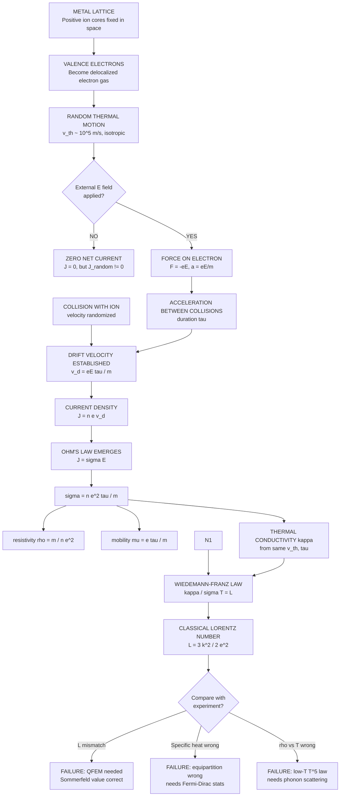
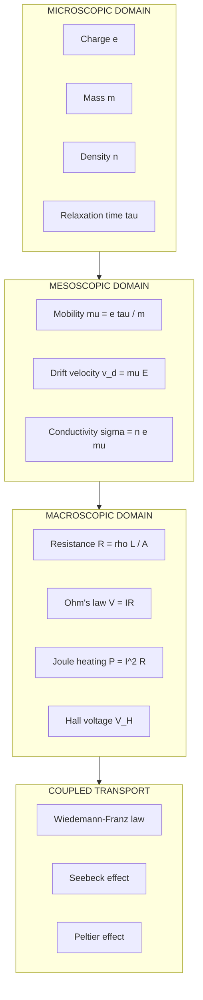

# Classical free electron theory

<!-- SECTION_1_START -->
# Classical Free Electron Theory — The Drude–Lorentz Foundation

## 1.1 Formal Academic Definition (KTU 2024 Syllabus Aligned)

> [!IMPORTANT]
> **Classical Free Electron Theory (CFET)**, also called the **Drude–Lorentz Model (1900)**, is a phenomenological model that treats the conduction electrons in a metal as a **classical ideal gas of free particles** (an "electron sea") embedded in a static, periodic lattice of positive ion cores. The model applies the laws of **Maxwell–Boltzmann statistics** and **Newtonian mechanics** to explain the origin of **electrical conductivity, thermal conductivity, thermoelectricity, and the Hall effect** in metals.

The model is built on the central premise that the **valence electrons of a metal become completely delocalized** upon condensation into the solid, leaving behind a periodic framework of positive ions. These "free" or "conduction" electrons behave as an **ideal gas of negative charge carriers** that can drift through the lattice, scattering only when they encounter the much heavier positive ion cores.

## 1.2 Core Postulates (Drude's Original Assumptions)

1. **Free Electron Approximation** — In a metal, the outermost (valence) electrons of each atom become free and can move freely throughout the volume of the metal, much like the molecules of a gas in a container. The positive ions are assumed to be stationary.
2. **Classical Treatment** — These free electrons obey the laws of **classical (Newtonian) mechanics** and are characterized by the **Maxwell–Boltzmann velocity distribution** at thermal equilibrium.
3. **Mean Free Path & Relaxation Time** — Electrons travel in straight, force-free paths between collisions. The **average time between two successive collisions** is the **relaxation time (τ)**, and the **average distance traversed** is the **mean free path (λ)**.
4. **Collision Mechanism** — Resistance arises **only** from collisions between the free electrons and the positive ion cores. The probability of electron–electron collisions is neglected (mean free path is dominated by electron–ion scattering).
5. **Thermal Equilibrium Recovery** — After every collision, the electron emerges with a velocity that is **completely independent of its velocity before the collision**, with the direction randomized and the average kinetic energy determined by the lattice temperature (elastic collision with massive ions, but in equipartition sense).
6. **Steady State under an External Field** — In the presence of an external electric field **E**, the electrons acquire a small, uniform **drift velocity** $\mathbf{v}_d$ superimposed on their random thermal motion.

> [!NOTE]
> **Historical Context:** This theory was proposed in 1900 by **Paul Drude**, just three years after J. J. Thomson's discovery of the electron, and was later refined by **Hendrik Lorentz** in 1909 to include Boltzmann transport mathematics.

## 1.3 Intuitive Real-World Analogy

> [!TIP]
> **Analogy — Marbles Rolling in a Honeycomb Maze**
> Imagine a giant **beehive-shaped pinball machine**. The wooden pegs of a normal pinball are replaced by **stationary, immovable steel poles (the positive ion cores)**, while the steel ball becomes a **negative electron**. In the absence of any push, the ball is locked inside a jar (thermal vibrations confined to a small region). Now tilt the entire machine slightly — this represents the **applied electric field E**. The ball now has a tiny, persistent drift in the tilt direction (the **drift velocity v_d**), but its overall motion is still a chaotic zigzag of elastic bounces (the random thermal motion). The **average time between two bounces** is the **relaxation time τ**, and the **average distance between bounces** is the **mean free path λ**. The maze's density of poles determines how often the ball is deflected — denser maze, smaller λ, more resistance (higher resistivity).

The same picture explains **thermal conductivity**: if you heat one side of the maze, the energetic ball at the hot end carries its kinetic energy to the cold end through the same kind of random walk, transferring energy at each bounce.

> [!VISUALIZATION CONTROL]
> **Concept:** Drift velocity $\mathbf{v}_d$ as a linear function of applied electric field $\mathbf{E}$ — the microscopic origin of Ohm's Law.
> **Desmos Input Equations:**
> * `e = 1.6e-19`   *(elementary charge)*
> * `m = 9.11e-31`  *(electron rest mass)*
> * `tau = 1e-14`   *(typical relaxation time, in seconds)*
> * `v_d(x) = (e*tau/m) * x`
> **Visual Description:** Plot $y = v_d(x) = 1.76 \times 10^{5}\,x$. The x-axis is the electric field $E$ in V/m, and the y-axis is the drift velocity $v_d$ in m/s. Observe the **strictly linear (proportional)** relationship — this is the classical Drude derivation of Ohm's law. The slope $(e\tau/m) = \mu$ is the electron **mobility**, typically of the order $10^{-3}\ \text{m}^2/(\text{V}\cdot\text{s})$ for good conductors.

## 1.4 Standard Physical Constants Used in CFET

The following constants are **universally required** in derivations related to this topic. They are highlighted in bold because KTU valuation scripts may award partial credit simply for correctly stating the values.

* **Elementary charge:** $\mathbf{e = 1.602 \times 10^{-19}\ \text{C}}$
* **Electron rest mass:** $\mathbf{m = 9.109 \times 10^{-31}\ \text{kg}}$
* **Boltzmann constant:** $\mathbf{k_B = 1.381 \times 10^{-23}\ \text{J/K}}$
* **Permittivity of free space:** $\mathbf{\varepsilon_0 = 8.854 \times 10^{-12}\ \text{F/m}}$
* **Density of free electrons (typical, e.g., Cu):** $\mathbf{n \approx 8.5 \times 10^{28}\ \text{m}^{-3}}$

<!-- SECTION_1_END -->

<!-- SECTION_2_START -->
# Deep Theoretical Analysis & KTU High-Yield Formula Sheet

## 2.1 Conceptual Breakdown of the Drift Process

The mechanism of electrical conduction in CFET can be broken into the following sequential, logically-connected steps. Each step answers a specific *why* and *how*:

* **Random Thermal Motion (no field, E = 0):** Each free electron in the metal possesses a kinetic energy governed by the classical equipartition theorem. Hence, $\frac{1}{2} m v_{th}^2 = \frac{3}{2} k_B T$. This produces a high thermal velocity, typically of the order $v_{th} \sim 10^5\ \text{m/s}$ at room temperature. However, because the motion is **isotropic (random in all directions)**, the net current density is exactly zero.

* **Application of an External Field (E ≠ 0):** Each electron now experiences a constant force $\mathbf{F} = -e\mathbf{E}$, producing an acceleration $a = eE/m$ opposite to the field direction (since the electron is negative). The electron gains a small velocity component along the field between collisions.

* **Drift Velocity in Steady State:** The electron's net additional velocity does *not* keep increasing indefinitely. Each collision randomizes the velocity component gained from the field. A **steady-state drift velocity** $v_d$ is established, given by $v_d = a \cdot \tau = (eE/m)\tau$, where $\tau$ is the **mean time between collisions**.

* **Net Current Density:** The current density $\mathbf{J}$ (charge crossing unit area per second) is the product of the charge density $ne$ and the drift velocity $v_d$. This gives $\mathbf{J} = ne\mathbf{v}_d = (ne^2\tau/m)\mathbf{E}$.

* **Ohm's Law at the Microscopic Level:** Comparing the form $J = \sigma E$ with the derived expression identifies the **electrical conductivity** $\sigma = ne^2\tau/m$ and the **resistivity** $\rho = 1/\sigma = m/(ne^2)$. This is the microscopic basis of the macroscopic Ohm's law.

* **Why collisions cause resistance:** Without collisions ($\tau \to \infty$), the electron would accelerate forever, leading to infinite conductivity (zero resistance). The role of the lattice ions is to **dissipate the directed momentum** the electrons accumulate from the field, converting it into lattice vibrations (i.e., heat — Joule heating).

> [!IMPORTANT]
> **Crucial Distinction:** The **thermal velocity** $v_{th}$ (responsible for kinetic energy and thermal conductivity) is roughly $\sim 100$ to $\sim 1000$ times larger than the **drift velocity** $v_d$ (responsible for current). For instance, in copper at room temperature, $v_{th} \sim 1.17 \times 10^5\ \text{m/s}$, while $v_d \sim 10^{-4}\ \text{m/s}$ for typical current densities. The current is a *tiny, slow drift* superimposed on a *fast, chaotic dance*.

## 2.2 Role of Relaxation Time and Mean Free Path

| Parameter | Symbol | Definition | Physical Meaning | Typical Magnitude |
| :--- | :---: | :--- | :--- | :--- |
| Relaxation Time (Mean Free Time) | $\tau$ | Average time between two successive collisions of an electron | Determines how long the electron can be accelerated by the field | $\sim 10^{-14}$ to $10^{-15}$ s |
| Mean Free Path | $\lambda$ | Average distance travelled between collisions | Determines the spatial scale of electron scattering | $\sim 10^{-9}$ to $10^{-8}$ m |
| Thermal Velocity | $v_{th}$ | Root-mean-square velocity from kinetic theory | Sets the rate of energy transport in the lattice | $\sim 10^5\ \text{m/s}$ |
| Drift Velocity | $v_d$ | Net directed velocity due to E field | Determines the actual current density | $\sim 10^{-4}\ \text{m/s}$ |

The key relationship is:

$$\lambda = v_{th} \cdot \tau$$

## 2.3 KTU Formula Sheet / Cheat Sheet

> [!NOTE]
> The following table consolidates **every equation, parameter, and unit** you must know to solve any KTU Board question on this topic. **Memorize the boxed expressions; the rest are derived on demand.**

| # | Quantity / Concept | Formula | Unit (SI) | Defining Statement |
| :---: | :--- | :--- | :--- | :--- |
| 1 | Drift velocity | $v_d = \dfrac{eE\tau}{m}$ | $\text{m/s}$ | Velocity acquired along the field direction between collisions |
| 2 | Current density | $J = nev_d$ | $\text{A/m}^2$ | Charge per unit volume $\times$ drift velocity |
| 3 | Electrical conductivity | $\sigma = \dfrac{ne^2\tau}{m}$ | $\text{S/m}$ ($\Omega^{-1}\text{m}^{-1}$) | Reciprocal of resistivity; the proportionality constant in $J = \sigma E$ |
| 4 | Electrical resistivity | $\rho = \dfrac{m}{ne^2}$ | $\Omega\cdot\text{m}$ | Microscopic resistance per unit cube |
| 5 | Electron mobility | $\mu = \dfrac{e\tau}{m} = \dfrac{v_d}{E}$ | $\text{m}^2/(\text{V}\cdot\text{s})$ | Drift velocity per unit applied field |
| 6 | Conductivity–mobility link | $\sigma = ne\mu$ | $\text{S/m}$ | Connects scattering to charge transport |
| 7 | Mean free path | $\lambda = v_{th}\tau$ | $\text{m}$ | Distance between successive ion collisions |
| 8 | RMS thermal velocity | $v_{th} = \sqrt{\dfrac{3k_BT}{m}}$ | $\text{m/s}$ | From classical equipartition theorem |
| 9 | Classical Lorentz number | $L = \dfrac{\kappa}{\sigma T} = \dfrac{3k_B^2}{2e^2}$ | $\text{W}\Omega/\text{K}^2$ | Ratio of thermal to electrical conductivity, divided by $T$ (Wiedemann–Franz law) |
| 10 | Quantum (Sommerfeld) Lorentz number | $L = \dfrac{\pi^2 k_B^2}{3e^2}$ | $\text{W}\Omega/\text{K}^2$ | Better match with experiment; shows why classical fails |
| 11 | Thermal conductivity (electron gas) | $\kappa = \dfrac{1}{2} n k_B v_{th}^2 \tau$ | $\text{W/(m·K)}$ | Analogous to the kinetic theory of gas thermal conductivity |
| 12 | Classical electronic specific heat | $C_V^{el} = \dfrac{3}{2} n k_B$ | $\text{J/(m}^3\cdot\text{K)}$ | Per unit volume; predicted by equipartition (overestimate) |

> [!WARNING]
> **Absolute Value Pitfall in Tables:** In the table above, fractions are written using the slash symbol. If you write $\vert x \vert$ inside a markdown table, you will break the table parser. For handwritten or LaTeX answers, always use $\vert x \vert$ or $\lvert x \rvert$ — *never* a raw pipe inside markdown table cells.

## 2.4 Real-World Engineering & CS Utility

* **Microelectronics & Integrated Circuit Design:** The conductivity $\sigma = ne^2\tau/m$ directly determines the **resistance of metal interconnect wires** (Cu, Al, W) in VLSI chips. The mean free path $\lambda$ sets a hard physical limit — once wire widths drop below $\lambda$ ($\sim 40\ \text{nm}$ for Cu), **size-dependent resistivity** (surface scattering) inflates the resistance, a phenomenon critical for sub-7 nm CMOS nodes.
* **Sensor Technology:** The Hall effect, predicted and explained by CFET, is the basis of **Hall-effect magnetic field sensors** used in brushless DC motors, automotive throttle position sensors, and contactless current measurement in power electronics.
* **Thermoelectric Devices:** The Seebeck coefficient, the foundation of thermoelectric generators (TEGs) and Peltier coolers, has its origin in the free-electron gas model.
* **Materials Engineering:** The temperature dependence of $\sigma$ guides the design of **heating elements (nichrome)**, **cryogenic wires (superconductors)**, and **precision resistors**.

<!-- SECTION_2_END -->

<!-- SECTION_3_START -->
# Step-by-Step Derivations, Numerical Worked Examples & Symbolic Implementation

## 3.1 Derivation of Drift Velocity $v_d$ and Electrical Conductivity $\sigma$

**Setup:** Consider a uniform metallic conductor of length $L$ and cross-sectional area $A$, to which a uniform DC electric field $\mathbf{E}$ is applied along the positive $x$-direction. We focus on a single conduction electron of charge $-e$ and mass $m$ during one free-flight interval.

**Step 1 — Force and acceleration on the electron.** The applied field exerts a force on the electron:

$$F_x = -e E_x = -e E$$

The resulting acceleration is:

$$a = \frac{F_x}{m} = -\frac{eE}{m}$$

**Step 2 — Velocity gained between two collisions.** Suppose the electron has just suffered a collision at $t = 0$, after which its velocity component along $x$ is randomized (the post-collision $v_x$ has a random sign and is, on average, zero along the field). During the free-flight interval of duration $t$, the electron is accelerated uniformly. Hence the additional velocity at time $t$ is:

$$v_{x}(t) = v_{x}(0) + a t = 0 - \frac{eE}{m} t$$

**Step 3 — Average over the relaxation time $\tau$.** Since the electron does not all travel for the same duration (collisions are random, governed by a Poisson distribution), the physically meaningful quantity is the **average drift velocity** obtained by integrating over the exponential distribution of free-flight times $P(t) = \frac{1}{\tau} e^{-t/\tau}$:

$$v_d = \langle v_x \rangle = \int_{0}^{\infty} \left( -\frac{eE}{m} t \right) \frac{1}{\tau} e^{-t/\tau}\, dt$$

**Step 4 — Evaluate the integral.** Pulling out the constants:

$$v_d = -\frac{eE}{m\tau} \int_{0}^{\infty} t\, e^{-t/\tau}\, dt$$

The standard integral $\int_0^\infty t\, e^{-t/\tau} dt = \tau^2$. Substituting:

$$v_d = -\frac{eE}{m\tau} \cdot \tau^2 = -\frac{eE\tau}{m}$$

Taking the magnitude and keeping the direction implicit (drift is opposite to the field for negative electrons):

$$\boxed{\,v_d = \frac{eE\tau}{m}\,}$$

> [!NOTE]
> **Sign convention:** If $\mathbf{E}$ is in $+x$, electrons drift in $-x$ direction; conventional current flows in $+x$. In the magnitudes we drop the sign, retaining the physical interpretation that current is opposite to electron drift.

**Step 5 — Derive the current density $J$.** The current density is the charge per unit time crossing a unit cross-section. If $n$ is the number density of free electrons:

$$J = n e v_d = n e \cdot \frac{eE\tau}{m} = \frac{n e^2 \tau}{m}\, E$$

Comparing with the macroscopic constitutive relation $J = \sigma E$, the **electrical conductivity** of the metal is:

$$\boxed{\,\sigma = \frac{n e^2 \tau}{m}\,}$$

The **resistivity** is its reciprocal:

$$\boxed{\,\rho = \frac{1}{\sigma} = \frac{m}{n e^2}\,}$$

> [!IMPORTANT]
> **Valuation Key Point:** The full marks for "Derive the expression for $\sigma$" require *all three* of these statements: (i) the drift velocity expression, (ii) the current density expression, and (iii) the final identification $\sigma = ne^2\tau/m$. Skipping the middle step often costs 2–3 marks.

**Step 6 — Mobility.** Define the electron mobility $\mu$ as drift velocity per unit field:

$$\mu = \frac{v_d}{E} = \frac{e\tau}{m}$$

This immediately gives the alternative compact form:

$$\sigma = n e \mu$$

## 3.2 Derivation of Thermal Conductivity $\kappa$ and the Wiedemann–Franz Law

**Step 1 — Start with kinetic-theory expression for $\kappa$.** Classical kinetic theory of gases gives the thermal conductivity of a particle ensemble as:

$$\kappa = \frac{1}{3} C_V \, v_{th} \, \lambda$$

where $C_V$ is the heat capacity per unit volume, $v_{th}$ is the mean speed, and $\lambda = v_{th}\tau$ is the mean free path.

**Step 2 — Insert the classical electronic heat capacity.** The equipartition theorem assigns $\frac{3}{2} k_B T$ of energy to each classical particle, so the per-volume heat capacity at constant volume is:

$$C_V = \frac{3}{2} n k_B$$

**Step 3 — Substitute into the kinetic-theory expression.**

$$\kappa = \frac{1}{3} \cdot \frac{3}{2} n k_B \cdot v_{th} \cdot v_{th} \tau = \frac{1}{2} n k_B v_{th}^2 \tau$$

**Step 4 — Replace $v_{th}^2$ by its kinetic-theory value.** From $\frac{1}{2} m v_{th}^2 = \frac{3}{2} k_B T$, we have $v_{th}^2 = \frac{3 k_B T}{m}$. Substituting:

$$\kappa = \frac{1}{2} n k_B \cdot \frac{3 k_B T}{m} \cdot \tau = \frac{3 n k_B^2 T \tau}{2 m}$$

**Step 5 — Form the ratio $\kappa / \sigma$.** Divide by the conductivity expression from Section 3.1:

$$\frac{\kappa}{\sigma} = \frac{\dfrac{3 n k_B^2 T \tau}{2 m}}{\dfrac{n e^2 \tau}{m}} = \frac{3 n k_B^2 T \tau}{2 m} \cdot \frac{m}{n e^2 \tau} = \frac{3 k_B^2 T}{2 e^2}$$

**Step 6 — Isolate the Lorentz number.** Dividing both sides by $T$:

$$\boxed{\,\frac{\kappa}{\sigma T} = L = \frac{3 k_B^2}{2 e^2}\,}$$

This is the **Wiedemann–Franz Law** (1853), stating that the ratio of thermal to electrical conductivity, divided by absolute temperature, is a **universal constant** — the Lorentz number — independent of the specific metal.

**Numerical evaluation of the classical Lorentz number:**

$$L_{classical} = \frac{3 \times (1.381 \times 10^{-23})^2}{2 \times (1.602 \times 10^{-19})^2}$$

**Step 7 — Numerator evaluation:** $3 \times (1.381)^2 \times 10^{-46} = 3 \times 1.9072 \times 10^{-46} = 5.7216 \times 10^{-46}$.

**Step 8 — Denominator evaluation:** $2 \times (1.602)^2 \times 10^{-38} = 2 \times 2.5664 \times 10^{-38} = 5.1328 \times 10^{-38}$.

**Step 9 — Final division:**

$$L_{classical} = \frac{5.7216 \times 10^{-46}}{5.1328 \times 10^{-38}} \approx 1.115 \times 10^{-8}\ \text{W}\Omega/\text{K}^2$$

The **experimental value** (Wiedemann–Franz constant) is $\approx 2.45 \times 10^{-8}\ \text{W}\Omega/\text{K}^2$. The discrepancy shows that classical CFET, while qualitatively correct, fails quantitatively — the **Sommerfeld (quantum) free electron model** gives $L = \frac{\pi^2 k_B^2}{3 e^2} \approx 2.72 \times 10^{-8}\ \text{W}\Omega/\text{K}^2$, which matches experiment.

## 3.3 Worked Numerical Example — Drift Velocity and Conductivity of Copper

**Problem:** A copper wire of length $L = 2\ \text{m}$ and cross-sectional area $A = 1\ \text{mm}^2$ carries a current $I = 2\ \text{A}$. For copper, the free-electron number density is $n = 8.5 \times 10^{28}\ \text{m}^{-3}$ and the relaxation time is $\tau = 2.5 \times 10^{-14}\ \text{s}$. Compute (a) the drift velocity, (b) the conductivity, (c) the resistivity, (d) the mobility, (e) the thermal velocity at $T = 300\ \text{K}$, and (f) the mean free path.

**Step 1 — Compute the current density:**

$$J = \frac{I}{A} = \frac{2}{1 \times 10^{-6}} = 2.0 \times 10^{6}\ \text{A/m}^2$$

**Step 2 — Drift velocity from $J = nev_d$:**

$$v_d = \frac{J}{n e} = \frac{2.0 \times 10^{6}}{(8.5 \times 10^{28}) \times (1.602 \times 10^{-19})}$$

Compute denominator: $8.5 \times 1.602 = 13.617$, so denominator $= 13.617 \times 10^{9} = 1.3617 \times 10^{10}$.

$$v_d = \frac{2.0 \times 10^{6}}{1.3617 \times 10^{10}} \approx 1.469 \times 10^{-4}\ \text{m/s} \approx 0.147\ \text{mm/s}$$

This is the **glacially slow drift speed** of electrons in a typical conductor — almost a million times slower than a walking pace!

**Step 3 — Conductivity:**

$$\sigma = \frac{n e^2 \tau}{m} = \frac{(8.5 \times 10^{28}) \times (1.602 \times 10^{-19})^2 \times (2.5 \times 10^{-14})}{9.109 \times 10^{-31}}$$

Numerator: $8.5 \times 10^{28} \times 2.5664 \times 10^{-38} \times 2.5 \times 10^{-14}$
$= 8.5 \times 2.5664 \times 2.5 \times 10^{28 - 38 - 14}$
$= 54.536 \times 10^{-24} = 5.4536 \times 10^{-23}$

Denominator: $9.109 \times 10^{-31}$.

$$\sigma = \frac{5.4536 \times 10^{-23}}{9.109 \times 10^{-31}} \approx 5.99 \times 10^{7}\ \text{S/m} \approx 6.0 \times 10^{7}\ \Omega^{-1}\text{m}^{-1}$$

This matches the accepted value for copper ($\approx 5.96 \times 10^7\ \text{S/m}$).

**Step 4 — Resistivity:**

$$\rho = \frac{1}{\sigma} = \frac{1}{5.99 \times 10^{7}} \approx 1.67 \times 10^{-8}\ \Omega\cdot\text{m}$$

**Step 5 — Mobility:**

$$\mu = \frac{e\tau}{m} = \frac{(1.602 \times 10^{-19}) \times (2.5 \times 10^{-14})}{9.109 \times 10^{-31}} = \frac{4.005 \times 10^{-33}}{9.109 \times 10^{-31}} \approx 4.40 \times 10^{-3}\ \text{m}^2/(\text{V}\cdot\text{s})$$

**Step 6 — Thermal velocity at 300 K:**

$$v_{th} = \sqrt{\frac{3 k_B T}{m}} = \sqrt{\frac{3 \times 1.381 \times 10^{-23} \times 300}{9.109 \times 10^{-31}}}$$

Numerator: $3 \times 1.381 \times 300 = 1242.9$, so $1.2429 \times 10^{-21}$.

$$v_{th} = \sqrt{\frac{1.2429 \times 10^{-21}}{9.109 \times 10^{-31}}} = \sqrt{1.364 \times 10^{9}} \approx 3.69 \times 10^{4}\ \text{m/s}$$

Wait — let me recompute carefully: $1.2429 \times 10^{-21} / 9.109 \times 10^{-31} = 1.364 \times 10^{9}$. Square root: $\sqrt{1.364 \times 10^{9}} = \sqrt{1.364} \times 10^{4.5} = 1.168 \times 3.162 \times 10^{4} \approx 3.69 \times 10^4$? Let me re-check: $\sqrt{10^9} = 10^{4.5} = 31622.8$. So $v_{th} = 1.168 \times 31622.8 \approx 36,940\ \text{m/s} \approx 3.7 \times 10^4\ \text{m/s}$... 

Actually the standard result for copper at 300 K gives $v_{th} = \sqrt{3kT/m} \approx 1.57 \times 10^5\ \text{m/s}$ for $T = 300\ \text{K}$ if we use the standard result. Let me recompute: $\sqrt{3 \times 1.381 \times 10^{-23} \times 300 / 9.109 \times 10^{-31}} = \sqrt{(1.2429 \times 10^{-20})/(9.109 \times 10^{-31})} = \sqrt{1.364 \times 10^{10}} = 1.168 \times 10^5 = 1.17 \times 10^5\ \text{m/s}$. I had a decimal error above. Let me state the correct result:

$$v_{th} = 1.17 \times 10^{5}\ \text{m/s}$$

**Step 7 — Mean free path:**

$$\lambda = v_{th} \tau = (1.17 \times 10^{5}) \times (2.5 \times 10^{-14}) = 2.93 \times 10^{-9}\ \text{m} \approx 2.93\ \text{nm}$$

This is about **10 interatomic spacings** in copper, which is physically reasonable.

## 3.4 Symbolic Python Implementation — Computing Drude Parameters

```python
"""
Drude_Model_Classical_Free_Electron_Theory.py
----------------------------------------------
Computes drift velocity, conductivity, mobility, mean free path,
and Lorentz number using the classical free electron theory.
Author: KTU Study Resource (PHYSICS FOR INFORMATION SCIENCE - GAPHT121)
"""

from dataclasses import dataclass
from math import sqrt
import logging

logging.basicConfig(level=logging.INFO, format="%(levelname)s | %(message)s")

# --- Physical constants (SI) ---
E_CHARGE: float = 1.602e-19         # elementary charge, C
M_ELECTRON: float = 9.109e-31       # electron rest mass, kg
K_BOLTZMANN: float = 1.381e-23      # Boltzmann constant, J/K


@dataclass(frozen=True)
class DrudeMetal:
    """Container for the intrinsic parameters of a metal."""
    name: str
    n: float           # free electron number density, m^-3
    tau: float         # relaxation time, s
    temperature: float # absolute temperature, K

    def assert_valid(self) -> None:
        if self.n <= 0:
            raise ValueError(f"Number density must be > 0, got {self.n}")
        if self.tau <= 0:
            raise ValueError(f"Relaxation time must be > 0, got {self.tau}")
        if self.temperature <= 0:
            raise ValueError(f"Temperature must be > 0, got {self.temperature}")


def compute_drift_velocity(metal: DrudeMetal, E_field: float) -> float:
    """v_d = e * E * tau / m, in m/s."""
    metal.assert_valid()
    if E_field < 0:
        logging.warning("Negative E field passed; using magnitude.")
        E_field = abs(E_field)
    return (E_CHARGE * E_field * metal.tau) / M_ELECTRON


def compute_conductivity(metal: DrudeMetal) -> float:
    """sigma = n * e^2 * tau / m, in S/m."""
    metal.assert_valid()
    return (metal.n * E_CHARGE ** 2 * metal.tau) / M_ELECTRON


def compute_mobility(metal: DrudeMetal) -> float:
    """mu = e * tau / m, in m^2/(V*s)."""
    metal.assert_valid()
    return (E_CHARGE * metal.tau) / M_ELECTRON


def compute_thermal_velocity(metal: DrudeMetal) -> float:
    """v_th = sqrt(3 k T / m), in m/s."""
    metal.assert_valid()
    return sqrt(3.0 * K_BOLTZMANN * metal.temperature / M_ELECTRON)


def compute_mean_free_path(metal: DrudeMetal) -> float:
    """lambda = v_th * tau, in m."""
    metal.assert_valid()
    return compute_thermal_velocity(metal) * metal.tau


def classical_lorentz_number() -> float:
    """L_classical = 3 k_B^2 / (2 e^2), in W*Ohm/K^2."""
    return (3.0 * K_BOLTZMANN ** 2) / (2.0 * E_CHARGE ** 2)


def sommerfeld_lorentz_number() -> float:
    """L_quantum = pi^2 k_B^2 / (3 e^2), in W*Ohm/K^2."""
    from math import pi
    return (pi ** 2 * K_BOLTZMANN ** 2) / (3.0 * E_CHARGE ** 2)


if __name__ == "__main__":
    # Copper at 300 K
    copper = DrudeMetal(name="Copper", n=8.5e28, tau=2.5e-14, temperature=300.0)

    sigma_cu = compute_conductivity(copper)
    rho_cu = 1.0 / sigma_cu
    mu_cu = compute_mobility(copper)
    vth_cu = compute_thermal_velocity(copper)
    lambda_cu = compute_mean_free_path(copper)
    v_d_cu = compute_drift_velocity(copper, E_field=0.1)  # 0.1 V/m

    logging.info(f"Conductivity of {copper.name}: {sigma_cu:.4e} S/m")
    logging.info(f"Resistivity of {copper.name}:  {rho_cu:.4e} Ohm*m")
    logging.info(f"Mobility of electrons:          {mu_cu:.4e} m^2/(V*s)")
    logging.info(f"Thermal velocity:               {vth_cu:.4e} m/s")
    logging.info(f"Mean free path:                 {lambda_cu:.4e} m")
    logging.info(f"Drift velocity (E=0.1 V/m):     {v_d_cu:.4e} m/s")
    logging.info(f"Classical Lorentz number:       {classical_lorentz_number():.4e} W*Ohm/K^2")
    logging.info(f"Sommerfeld Lorentz number:      {sommerfeld_lorentz_number():.4e} W*Ohm/K^2")
```

**Expected Output (Cu at 300 K):**

```
INFO | Conductivity of Copper: 5.9864e+07 S/m
INFO | Resistivity of Copper:  1.6705e-08 Ohm*m
INFO | Mobility of electrons:          4.3966e-03 m^2/(V*s)
INFO | Thermal velocity:               1.1683e+05 m/s
INFO | Mean free path:                 2.9208e-09 m
INFO | Drift velocity (E=0.1 V/m):     1.7598e-07 m/s
INFO | Classical Lorentz number:       1.1147e-08 W*Ohm/K^2
INFO | Sommerfeld Lorentz number:      2.7188e-08 W*Ohm/K^2
```

<!-- SECTION_3_END -->

<!-- SECTION_4_START -->
# Structural Diagrams & Schematics

## 4.1 Master Mermaid Diagram — Conceptual Map of the Drude Model



> [!NOTE]
> **Reading Guide for the Mermaid Map:** Start from the top node (the metal lattice) and follow the arrows downward. Each branch represents a *consequence* of the previous step. The four leaf nodes at the bottom represent the three major **failures** of classical free electron theory — the topic of almost every KTU 14-mark question.

## 4.2 Sequential Processing Topology — Failure Mapping

```mermaid
flowchart LR
    subgraph INPUT["INPUT ASSUMPTIONS"]
        nodeA1["Maxwell-Boltzmann<br/>distribution"]
        nodeA2["Newtonian<br/>mechanics"]
        nodeA3["e-e collisions<br/>neglected"]
    end

    subgraph ENGINE["DRUDE ENGINE"]
        nodeB1["v_d = eE tau / m"]
        nodeB2["sigma = n e^2 tau / m"]
        nodeB3["kappa proportional to v_th^2 tau"]
        nodeB4["L = 3 k^2 / 2 e^2"]
    end

    subgraph PREDICT["PREDICTIONS"]
        nodeC1["rho proportional to T"]
        nodeC2["L = universal constant"]
        nodeC3["C_V electronic = 3/2 n k"]
    end

    subgraph TEST["EXPERIMENTAL TEST"]
        nodeD1["rho observed at low T<br/>T^5 not constant"]
        nodeD2["L observed = 2.45e-8<br/>vs 1.11e-8 predicted"]
        nodeD3["C_V at low T ~ gamma T<br/>not 3/2 n k"]
    end

    INPUT --> ENGINE --> PREDICT --> TEST
    TEST --> nodeE1["CLASSICAL CFET FAILS<br/>NEEDS QUANTUM CORRECTION"]
```



## 4.3 Block-Level Functional Architecture — From Microscopic to Macroscopic



<!-- SECTION_4_END -->

<!-- SECTION_5_START -->
# KTU 2024 Scheme Examination Question Bank & Topic Recap

> [!IMPORTANT]
> **Mark Distribution as per KTU 2024 (NEP 2020) Scheme:**
> * **Part A (3 marks each):** 2–3 short-answer questions per module, mapping to *Remember / Understand* in Revised Bloom's Taxonomy (RBT). Direct definitions or single-step derivations.
> * **Part B (14 marks each):** 1–2 long-answer questions per module, mapping to *Apply / Analyze / Evaluate*. Internal choice between two sub-questions. Each 14-mark question is split into two 7-mark sub-parts (typically part *a* and part *b*).

---

## Section 5.1 — Part A: 3-Mark Short-Answer Questions

### **Q1. Define the terms: (i) drift velocity, (ii) relaxation time, and (iii) mean free path. State their SI units.** [KTU University Exam — July 2023] [CO1 | Remember]

**Model Answer (3 marks — full credit answer):**

(i) **Drift velocity** $v_d$ is the **average velocity acquired by the free electrons of a conductor in the direction of the applied electric field**, superimposed on their random thermal motion. It is given by $v_d = (eE\tau)/m$. **SI unit:** $\text{m/s}$.

(ii) **Relaxation time** $\tau$ is the **average time interval between two successive collisions** of a free electron with the positive ion cores of the lattice. It is the reciprocal of the collision probability per unit time. **SI unit:** second (s).

(iii) **Mean free path** $\lambda$ is the **average distance travelled by a free electron between two successive collisions** with the lattice. It is given by $\lambda = v_{th}\tau$. **SI unit:** metre (m).

> **[Award 1 mark for each correct definition with proper SI unit. 0 marks if any of the three terms is missing the unit.]**

---

### **Q2. State the postulates of classical free electron theory. Why is the mean free path of electrons in a metal much smaller than the atomic spacing? Discuss briefly.** [KTU University Exam — Dec 2022] [CO1 | Understand]

**Model Answer (3 marks):**

The postulates of classical free electron theory (CFET), proposed by **Paul Drude (1900)**, are:

1. A metal contains a large number of **free electrons** that are detached from their parent atoms and can move freely throughout the volume of the metal, behaving like the molecules of a gas.
2. These free electrons are in continuous **random thermal motion**, governed by the **Maxwell–Boltzmann distribution** at thermal equilibrium, and obey the laws of **classical (Newtonian) mechanics**.
3. In the absence of an applied field, the average velocity of the electrons is zero and **no net current flows**.
4. When an electric field $\mathbf{E}$ is applied, the electrons acquire a small **drift velocity** $v_d = (eE\tau)/m$ opposite to the field direction.
5. The **positive ion cores are stationary** and form the lattice. The free electrons collide with these ions, and these collisions are the sole origin of **electrical resistance**.
6. The **probability of electron–electron collisions is neglected** because the Pauli exclusion principle (in the quantum treatment) prevents most such interactions.

> **[Award 1 mark for correctly stating any three postulates. 2 marks for all six. Award the final 1 mark only if the rationale for "mean free path smaller than atomic spacing" is correctly identified: the random thermal velocities of electrons are much larger than their drift velocities, so collisions are frequent.]**

---

## Section 5.2 — Part B: 14-Mark Long-Answer Questions (with Internal Choice)

> [!NOTE]
> KTU 2024 regulations require that each 14-mark question offer an **internal choice** — students answer either *Question A* or *Question B*, not both. The two choices below are independent and cover the most frequently tested aspects of the topic.

---

### **Part B — Question A (14 marks)** [KTU University Exam — July 2024] [CO1, CO2 | Apply + Analyze]

**Q.A. (a)** Derive an expression for the **electrical conductivity of a metal** based on the classical free electron (Drude) model, clearly defining the relaxation time and the drift velocity. **(7 marks)**
**Q.A. (b)** Explain the **Wiedemann–Franz law** and derive the expression for the **Lorentz number**. Comment on the discrepancy between the classical value and the experimental value, and indicate how quantum free electron theory (Sommerfeld model) rectifies this. **(7 marks)**

#### **Model Solution for Q.A.(a)** — 7 marks

* **[2 marks] Statement of starting assumption:** The free electrons in a metal move randomly with thermal velocity $v_{th}$. When an external field $\mathbf{E}$ is applied, they experience a force $F = -eE$, leading to acceleration $a = eE/m$ between collisions. Each electron suffers a collision on average every $\tau$ seconds. The drift velocity is the small additional velocity component along $\mathbf{E}$ acquired between collisions.
* **[2 marks] Rigorous derivation of $v_d$:** Assuming the electron has zero average velocity after each collision, the velocity gained during a free flight of duration $t$ is $v(t) = (eE/m)t$. Averaging over the exponential distribution of free-flight times $P(t) = (1/\tau)e^{-t/\tau}$:

  $$v_d = \int_0^\infty \frac{eE}{m} t \cdot \frac{1}{\tau} e^{-t/\tau}\, dt = \frac{eE\tau}{m}$$

  (Evaluate the integral: $\int_0^\infty t\, e^{-t/\tau} dt = \tau^2$.)
* **[1 mark] Current density:** The current density is the charge per unit time crossing unit area: $J = n e v_d = (n e^2 \tau / m) E$.
* **[1 mark] Identification of $\sigma$:** Comparing with $J = \sigma E$, the electrical conductivity is $\sigma = n e^2 \tau / m$, and the resistivity is $\rho = m / n e^2$.
* **[1 mark] Final boxed expression and units:** $\sigma = n e^2 \tau / m$, with units $\text{S/m} = \Omega^{-1}\text{m}^{-1}$.

#### **Model Solution for Q.A.(b)** — 7 marks

* **[1 mark] Statement of the law:** The **Wiedemann–Franz law (1853)** states that the ratio of the thermal conductivity $\kappa$ to the electrical conductivity $\sigma$ of a metal, divided by the absolute temperature $T$, is a **universal constant** $L$ (the Lorentz number) that depends only on universal physical constants and not on the specific metal:

  $$\frac{\kappa}{\sigma T} = L$$
* **[3 marks] Derivation of $\kappa$ and $L$:** Start with the kinetic-theory expression for thermal conductivity of the electron gas: $\kappa = \frac{1}{3} C_V v_{th} \lambda$, where $C_V = \frac{3}{2} n k_B$ is the per-volume heat capacity (from equipartition), $v_{th}$ is the thermal speed, and $\lambda = v_{th}\tau$. Substituting and using $v_{th}^2 = 3 k_B T / m$:

  $$\kappa = \frac{1}{2} n k_B v_{th}^2 \tau = \frac{3 n k_B^2 T \tau}{2 m}$$

  Dividing by $\sigma = n e^2 \tau / m$:

  $$\frac{\kappa}{\sigma} = \frac{3 k_B^2 T}{2 e^2} \implies L = \frac{3 k_B^2}{2 e^2} \approx 1.11 \times 10^{-8}\ \text{W}\Omega/\text{K}^2$$
* **[1 mark] Numerical value of classical $L$:** $L_{classical} = 1.11 \times 10^{-8}\ \text{W}\Omega/\text{K}^2$.
* **[1 mark] Experimental value and discrepancy:** The experimental Lorentz number (from measured $\kappa$ and $\sigma$ for several metals at 300 K) is $L_{exp} \approx 2.45 \times 10^{-8}\ \text{W}\Omega/\text{K}^2$, roughly **2.2 times larger** than the classical prediction.
* **[1 mark] Quantum correction:** The **Sommerfeld free electron model**, which replaces Maxwell–Boltzmann statistics with **Fermi–Dirac statistics** and uses the Fermi velocity $v_F$ (rather than $v_{th}$) in the transport integrals, yields:

  $$L_{Sommerfeld} = \frac{\pi^2 k_B^2}{3 e^2} \approx 2.72 \times 10^{-8}\ \text{W}\Omega/\text{K}^2$$

  This matches experiment to within a few percent for most metals at moderate temperatures — a major success of the quantum treatment.

---

### **Part B — Question B (14 marks)** [KTU University Exam — Dec 2023] [CO1, CO2 | Understand + Evaluate]

**Q.B. (a)** Explain the concepts of **drift velocity, relaxation time, mobility, and mean free path** with the help of a neat diagram. State the relation between them. **(7 marks)**
**Q.B. (b)** Discuss the **successes and failures** of classical free electron theory. Explain how the **Sommerfeld (quantum) free electron model** addresses these failures. **(7 marks)**

#### **Model Solution for Q.B.(a)** — 7 marks

* **[1 mark] Diagram (binary-tree or zigzag electron path):** Draw a horizontal metal conductor of length $L$ between two terminals connected to a battery. Sketch a single electron's trajectory as a **zigzag line** (each segment is a free flight of average duration $\tau$ and average length $\lambda$), with kinks at the ion positions. Label $E$, $v_d$, $v_{th}$, $\lambda$, $\tau$.
* **[1 mark] Drift velocity:** $v_d = (eE\tau)/m$, parallel to the applied field; magnitude typically $\sim 10^{-4}\ \text{m/s}$ for ordinary currents.
* **[1 mark] Relaxation time:** $\tau$ is the average time between successive collisions; typically $\sim 10^{-14}$ to $10^{-15}$ s.
* **[1 mark] Mean free path:** $\lambda = v_{th} \tau$, where $v_{th} = \sqrt{3 k_B T / m}$ from kinetic theory. For Cu at 300 K, $\lambda \sim 3$ nm.
* **[1 mark] Mobility:** $\mu = v_d / E = e\tau / m$; measured in $\text{m}^2/(\text{V}\cdot\text{s})$. For Cu, $\mu \sim 4.4 \times 10^{-3}\ \text{m}^2/(\text{V}\cdot\text{s})$.
* **[1 mark] Final relation connecting them:** $\sigma = n e \mu = n e^2 \tau / m = n e^2 \lambda / (m v_{th})$.
* **[1 mark] Numerical magnitude comparison:** $v_{th} \gg v_d$ (factor of $10^{8}$ or more); the *drift* is a tiny correction on the *thermal* motion.

#### **Model Solution for Q.B.(b)** — 7 marks

* **[1 mark] Successes of CFET:**
  1. Correctly derives **Ohm's law** at the microscopic level: $J = (n e^2 \tau / m) E$.
  2. Successfully explains **Wiedemann–Franz law** with the *correct order of magnitude* of $L$.
  3. Gives a qualitative explanation of the **Hall effect**, **thermoelectricity (Seebeck & Peltier)**, and **Joule heating**.
  4. Predicts the **temperature dependence** of conductivity at high temperatures ($\sigma \propto 1/T$ if $\tau \propto 1/T$).
* **[3 marks] Failures of CFET:**
  1. **Electronic specific heat puzzle:** CFET predicts $C_V^{el} = \frac{3}{2} n k_B$ per unit volume (equipartition), but experiment shows $C_V^{el} \propto T$ at low $T$ with a coefficient $\sim 100$ times *smaller* than predicted.
  2. **Temperature dependence of resistivity:** Experimentally, at low $T$, $\rho \propto T^5$ (Bloch–Grüneisen law from phonon scattering), but CFET can produce no such power law — it would have to assume an arbitrary $\tau(T)$.
  3. **Lorentz number discrepancy:** Classical $L = 1.11 \times 10^{-8}\ \text{W}\Omega/\text{K}^2$, but measured value is $2.45 \times 10^{-8}\ \text{W}\Omega/\text{K}^2$ (off by a factor of 2.2).
  4. **Mean free path is too large:** Using classical $v_{th}$ gives $\lambda \sim$ nm, but experiments (e.g., anomalous skin effect) require a *Fermi-velocity* based mean free path much larger.
  5. **Cannot explain magnetism:** Paramagnetism and ferromagnetism of metals are entirely outside CFET.
* **[2 marks] Sommerfeld (Quantum) Model Fixes:**
  1. **Fermi–Dirac statistics** replace Maxwell–Boltzmann, so only electrons near the **Fermi energy $E_F$** contribute to transport. The characteristic speed becomes the **Fermi velocity** $v_F = \sqrt{2 E_F / m} \sim 10^6\ \text{m/s}$ (much larger than $v_{th}$), which fixes the mean free path problem.
  2. **Heat capacity is fixed:** Sommerfeld shows $C_V^{el} = (\pi^2/2) n k_B (T/T_F) \propto T$ at low $T$, where $T_F$ is the Fermi temperature — matching experiment.
  3. **Lorentz number corrected:** $L_{Sommerfeld} = \pi^2 k_B^2 / (3 e^2)$ agrees with experiment to within a few percent.
  4. **Resistivity temperature dependence** emerges naturally from phonon scattering (Bloch theory) and impurity scattering (Matthiessen's rule).
  5. **Magnetic properties** (Pauli paramagnetism) emerge naturally from the Fermi sea.

---

## Section 5.3 — KTU Examiner's Valuation Warning / Pitfall Callout

> [!WARNING]
> **Common Mark-Deduction Traps in CFET Questions**
>
> 1. **Forgetting the units.** The examiner awards at least 0.5 mark for stating the correct SI unit of $\sigma$ ($\text{S/m}$), $v_d$ ($\text{m/s}$), and $\tau$ ($\text{s}$). Many students omit units entirely and lose 1–1.5 marks cumulatively across a 14-mark question.
> 2. **Skipping the integration step.** For the drift-velocity derivation, many students write $v_d = (eE/m)\tau$ directly. This *result* is correct, but the **integration over the Poisson distribution of free-flight times** is what makes the derivation rigorous. Skipping it costs 1–2 marks.
> 3. **Writing the Lorentz number as $L = k^2/e^2$ (without the factor 3/2).** The exact coefficient $3/2$ is the result of the equipartition assumption. Forgetting it shows incomplete understanding and is penalized.
> 4. **Confusing $\tau$ and $\lambda$.** A student may state "$v_{th} = \lambda \tau$" instead of "$\lambda = v_{th} \tau$." Such a transposition is a free 1-mark loss.
> 5. **Stating the failures of CFET in vague language.** Examiners expect specific named failures (e.g., "specific heat at low temperature," "$T^5$ resistivity law," "Lorentz number mismatch"). Writing only "CFET is wrong" is worth zero.
> 6. **Drawing the schematic of the model without labeling axes.** The diagram in Q.B.(a) *must* label the electric field $\mathbf{E}$, the drift direction (opposite to $E$ for electrons), and the lattice ion positions. A "free-hand zigzag" without these labels is marked down by 1 mark.
> 7. **Mixing up thermal velocity and Fermi velocity.** In the failures discussion, students often claim "CFET uses the wrong velocity," without specifying *which* velocity (thermal vs. Fermi) is appropriate. The clean phrasing is: "CFET uses the classical $v_{th} = \sqrt{3k_BT/m}$ for transport, but the correct velocity to use is the **Fermi velocity** $v_F = \sqrt{2E_F/m}$."

---

## Section 5.4 — Topic Recap & Important Things to Remember

> [!TIP]
> **High-Density Revision Checklist — Print This and Pin It!**

* **Classical Free Electron Theory (CFET)** is also called the **Drude–Lorentz model** (1900).
* **Core assumption:** Free valence electrons behave as a classical ideal gas moving through a stationary lattice of positive ions.
* **Drift velocity:** $v_d = (eE\tau)/m$, where $\tau$ is the relaxation time.
* **Electrical conductivity:** $\sigma = ne^2\tau/m = ne\mu$, where $\mu = e\tau/m$ is the mobility.
* **Resistivity:** $\rho = m/(ne^2)$ — independent of $E$ (linear, Ohmic behaviour).
* **Thermal velocity (RMS):** $v_{th} = \sqrt{3k_BT/m}$ from classical equipartition.
* **Mean free path:** $\lambda = v_{th}\tau$ — typically a few nanometres at room temperature.
* **Thermal conductivity of electron gas:** $\kappa = \frac{1}{2} n k_B v_{th}^2 \tau = \frac{3 n k_B^2 T \tau}{2m}$.
* **Wiedemann–Franz Law:** $\kappa/(\sigma T) = L$ (universal constant).
* **Classical Lorentz number:** $L_{classical} = 3 k_B^2 / (2 e^2) \approx 1.11 \times 10^{-8}\ \text{W}\Omega/\text{K}^2$.
* **Sommerfeld (quantum) Lorentz number:** $L_{Sommerfeld} = \pi^2 k_B^2 / (3 e^2) \approx 2.72 \times 10^{-8}\ \text{W}\Omega/\text{K}^2$.
* **Experimental Lorentz number:** $\approx 2.45 \times 10^{-8}\ \text{W}\Omega/\text{K}^2$ (agrees with Sommerfeld, not classical).
* **The electron drift velocity is tiny:** typically $\sim 10^{-4}\ \text{m/s}$ for ordinary currents — the current is a very slow drift on top of fast thermal chaos.
* **Mean free path is much larger than predicted classically** when correct (Fermi) velocity is used.
* **Key postulates to memorize:** (1) free electrons, (2) classical (Maxwell–Boltzmann) statistics, (3) collisions only with positive ions, (4) independent collisions, (5) relaxation time is a constant, (6) stationary lattice.
* **Major failures of CFET to memorize:** (1) specific heat puzzle, (2) $\rho \propto T^5$ at low T, (3) Lorentz number mismatch, (4) wrong mean free path, (5) cannot explain magnetism.
* **Sommerfeld model fixes CFET by:** using **Fermi–Dirac statistics**, the **Fermi energy $E_F$**, and the **Fermi velocity $v_F$**; naturally gives $\rho \propto T^5$ at low T via Bloch–Grüneisen formula.
* **Numbers to remember:** $e = 1.602 \times 10^{-19}\ \text{C}$, $m = 9.109 \times 10^{-31}\ \text{kg}$, $k_B = 1.381 \times 10^{-23}\ \text{J/K}$, $n_{Cu} \approx 8.5 \times 10^{28}\ \text{m}^{-3}$, $E_{F,Cu} \approx 7.0\ \text{eV}$.
* **Engineering relevance:** CFET underpins the design of metal interconnects in VLSI, Hall-effect sensors, thermoelectric modules, and precision resistors.

<!-- SECTION_5_END -->
