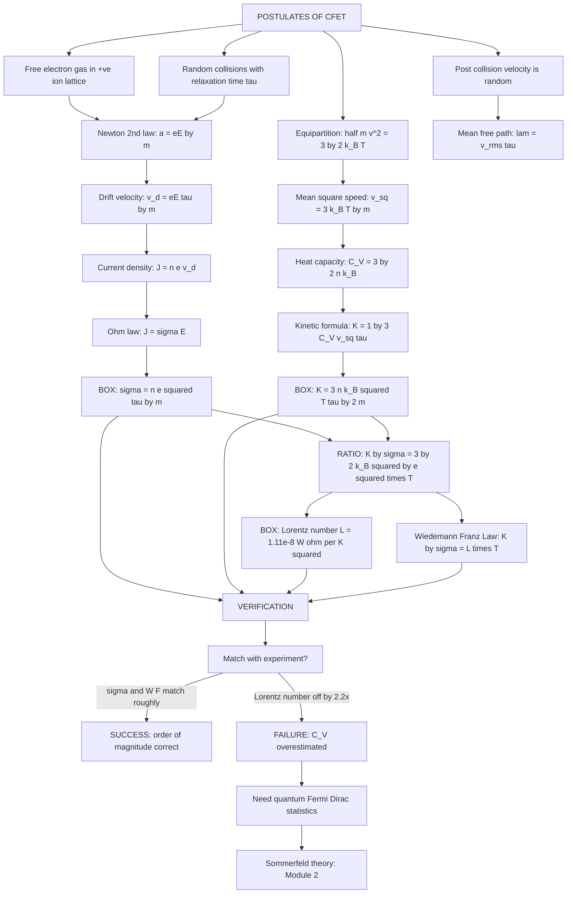
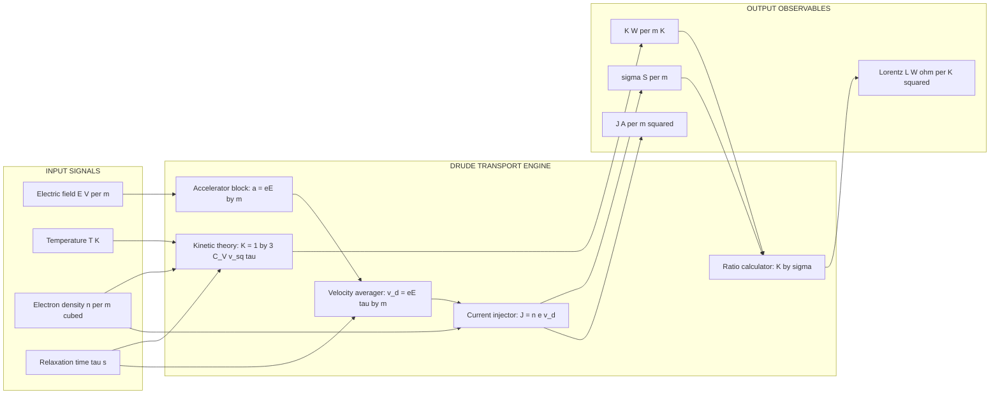
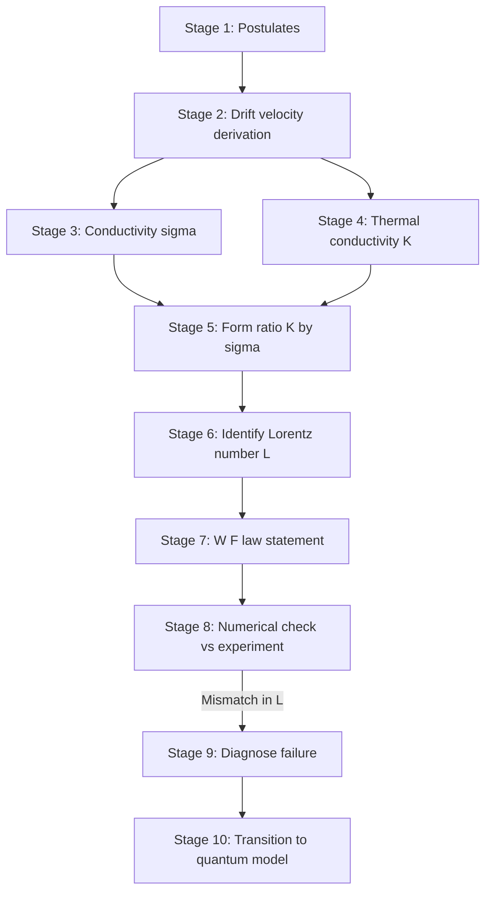

# Classical free electron theory

<!-- SECTION_1_START -->

# Classical Free Electron Theory — Module 1.1

> [!IMPORTANT]
> **Syllabus Tag (KTU 2024 Scheme — GAPHT121):** Drude–Lorentz classical free electron model, postulates, electrical & thermal conductivity, Wiedemann–Franz law, Lorentz number, successes and limitations. This forms the **physical foundation** for understanding modern microelectronic and nanoelectronic devices.

## 1.1 Formal Definition

The **Classical Free Electron Theory (CFET)** of metals, originally proposed by **Paul Drude (1900)** and later extended by **Hendrik Antoon Lorentz (1904–1909)**, treats the conduction electrons in a metal as a **classical ideal gas of negatively charged particles** confined within a fixed, periodic array of positive ion cores (the lattice). The electrons are assumed to obey **Newtonian mechanics** and **Maxwell–Boltzmann statistics**, colliding randomly with stationary ion cores and with each other, exactly like gas molecules in a sealed container.

The theory gives a unifying framework to explain the **electrical conductivity (σ)**, **thermal conductivity (K)**, and the **empirical Wiedemann–Franz relation** purely from classical kinetic theory.

### Key Assumptions (Drude Postulates)

1. **Free Electron Approximation:** The valence electrons of each atom become "free" once the metallic bond is formed. The attraction of the ion cores is neglected between collisions.
2. **Independent Electron Approximation:** Electron–electron interactions (Coulomb repulsion) are ignored; each electron moves independently in the lattice potential.
3. **Relaxation Time (τ):** Between two successive collisions, an electron traverses a straight-line path. The probability of a collision in time *dt* is *dt/τ*, where **τ** is the **relaxation time** (mean free time ≈ 10⁻¹⁴ s).
4. **Random Collisions:** After each collision, the electron emerges with a velocity that is **independent** of its pre-collision velocity and is **randomly directed** (isotropic). This restores thermal equilibrium.
5. **Equipartition Theorem:** The electron gas obeys the classical equipartition theorem, so the average kinetic energy per free electron is $\tfrac{3}{2} k_B T$.

> [!NOTE]
> **Why call it "Drude–Lorentz" model?**
> Drude (1900) gave the original framework. Lorentz (1909) refined it by applying a proper **Maxwell–Boltzmann distribution** to the electron velocities and a proper statistical treatment of the collision process, giving the famous **Lorentz number**.

---

## 1.2 Conceptual Analogy — The "Electron Gas"

Imagine a **giant air-conditioned billiard hall**. The billiard balls are the conduction electrons and the **stationary cushions / walls** are the heavy positive ion cores. The balls zoom around at high speed ($v_{th} \sim 10^6$ m/s at 300 K), bouncing off the cushions. Now switch on an electric field ($\vec E$) — a gentle, uniform "wind" blowing across the hall. The balls still bounce, but on average they drift **opposite to the wind** (because electrons carry negative charge). This tiny, superimposed drift on top of the random thermal motion is what we call **electric current**.

- Random thermal motion → contributes **thermal energy & heat transport**.
- Drift motion (superimposed) → contributes **electrical current**.
- Collisions with cushions → provides the **friction (resistance)** that prevents electrons from accelerating indefinitely.

> [!TIP]
> A subtle but **KTU-favorite** point: the drift velocity ($v_d \sim 10^{-4}$ m/s) is **eight orders of magnitude smaller** than the thermal velocity ($v_{th} \sim 10^6$ m/s). This is why the current does not "shoot through" the moment you flip the switch — the random motion always dominates, and the field only gently biases it.

---

## 1.3 Fundamental Constants in This Module

> [!IMPORTANT]
> **Bookmark these — they appear in almost every KTU numerical:**
>
> | Quantity | Symbol | Value |
> |---|---|---|
> | Electron rest mass | $m$ | **9.11 × 10⁻³¹ kg** |
> | Electron charge | $e$ | **1.602 × 10⁻¹⁹ C** |
> | Boltzmann constant | $k_B$ | **1.38 × 10⁻²³ J/K** |
> | Planck's constant | $h$ | 6.626 × 10⁻³⁴ J·s |
> | Avogadro's number | $N_A$ | 6.022 × 10²³ /mol |
> | Free electron density (Cu) | $n$ | ≈ **8.5 × 10²⁸ /m³** |

---

## 1.4 Geometric / Graphical Intuition

> [!VISUALIZATION CONTROL]
> **Concept:** Linear Ohm's law from the Drude model — drift velocity vs applied electric field.
> **GeoGebra / Desmos Input Equations:**
> * `v_d(e) = (e * tau / m) * e_field`  (drift velocity as a function of applied field, treating *e* as electron charge constant; *e_field* is the variable on x-axis)
> * `v_th = 1e6`  (a horizontal line representing the random thermal speed of electrons at 300 K)
> * Slope = $e\tau / m = \mu$ (the **electron mobility**)
>
> **Visual Description:** The student should observe a **straight line through the origin** in the $v_d$–$E$ plane with slope equal to the electron mobility. The horizontal dashed line $v_d = v_{th}$ emphasizes that thermal velocity is ~10⁶ m/s while drift velocity is ~10⁻⁴ m/s even for strong fields — they never intersect on a linear scale.

---

<!-- SECTION_1_END -->

<!-- SECTION_2_START -->

# Deep Theoretical Analysis & KTU High-Yield Formula Sheet

## 2.1 Building the Drude Picture — Step-by-Step Logic

The classical theory derives macroscopic transport coefficients by answering three sequential questions:

1. **What does the field do to a single electron between collisions?**
   → It accelerates it: $a = eE/m$.
2. **What happens at a collision?**
   → The electron's drift velocity component is **completely randomized**; the electron thermalizes with the lattice at temperature *T*.
3. **What is the steady-state average velocity?**
   → A balance between acceleration and damping gives the **drift velocity** $v_d = eE\tau/m$.

The macroscopic current and heat flux are then obtained by **statistically averaging** over all $n$ electrons per unit volume.

> [!NOTE]
> **Engineering Relevance — Why does this still matter in 2024?**
> * Foundation for the **Boltzmann Transport Equation (BTE)**, which is the workhorse of **TCAD device simulation** (e.g., Synopsys Sentaurus, Silvaco ATLAS) for designing sub-7 nm CMOS transistors, FinFETs, and GaN HEMTs.
> * Gives the correct **order of magnitude** for σ, K and explains why Cu, Ag, Au are excellent conductors — directly used in **VLSI interconnects, PCB traces, and on-chip wiring**.
> * The Wiedemann–Franz law is used to **estimate electronic thermal conductivity** in **thermoelectric materials** (e.g., Bi₂Te₃, skutterudites) and in **chip thermal management**.

---

## 2.2 KTU Formula Sheet — "All You Need on One Page"

> [!IMPORTANT]
> **Print this table. Memorize the boxed equations. They are the heart of Module 1.**

| # | Quantity | Symbol | Formula | Remarks |
|---|---|---|---|---|
| 1 | RMS thermal speed | $v_{rms}$ | $v_{rms} = \sqrt{3k_BT/m}$ | From equipartition $\tfrac{1}{2}mv^2 = \tfrac{3}{2}k_BT$ |
| 2 | Mean free path | $\lambda$ | $\lambda = v_{rms}\,\tau$ | Distance between two collisions |
| 3 | Drift velocity | $v_d$ | $v_d = eE\tau/m$ | Superimposed on random motion |
| 4 | Electron mobility | $\mu$ | $\mu = e\tau/m$ | $v_d = \mu E$ |
| 5 | Current density | $J$ | $J = nev_d = ne^2E\tau/m$ | $n$ = electron density |
| 6 | **Electrical conductivity** | $\sigma$ | $\sigma = ne^2\tau/m$ | $\boxed{\text{Drude's central result}}$ |
| 7 | Resistivity | $\rho$ | $\rho = m/(ne^2\tau)$ | $\rho \propto T$ via $\tau$ |
| 8 | Specific heat (per vol.) | $C_V$ | $C_V = \tfrac{3}{2} n k_B$ | Classical equipartition |
| 9 | **Thermal conductivity** | $K$ | $K = \tfrac{1}{3} C_V v_{rms}^2 \tau$ | Kinetic theory of gases |
| 10 | $K$ simplified | $K$ | $K = \tfrac{3}{2}\, n k_B^2 T \tau / m$ | Substitute $C_V$ and $v_{rms}^2$ |
| 11 | **Wiedemann–Franz Law** | $K/\sigma$ | $K/\sigma = L T$ | Linear in $T$ |
| 12 | **Lorentz number (classical)** | $L$ | $L = \tfrac{3}{2}\,(k_B/e)^2$ | $= 1.11 \times 10^{-8}\ \mathrm{W\Omega/K^2}$ |
| 13 | Lorentz number (Sommerfeld) | $L_S$ | $L_S = \pi^2 (k_B/e)^2 / 3$ | $= 2.44 \times 10^{-8}\ \mathrm{W\Omega/K^2}$ ✓ matches experiment |

> [!WARNING]
> **Notation Trap:** KTU examiners use **σ** for electrical conductivity, **K** for thermal conductivity, and **L** for Lorentz number. **Never confuse K (thermal conductivity) with k (wave-vector) or K (Kelvin).** Always write "$K\ (\mathrm{W/mK})$" once explicitly on the answer sheet.

---

## 2.3 Physical Interpretation of the Master Equations

**Equation (6): $\sigma = ne^2\tau/m$**

* $\sigma$ increases linearly with $n$ — more free electrons → better conductor. This is why Cu ($n = 8.5 \times 10^{28}/\mathrm{m^3}$) is preferred over Si ($n \sim 10^{16}/\mathrm{m^3}$).
* $\sigma$ increases with $\tau$ — fewer collisions → better conductor. Impurities, lattice vibrations (phonons), and defects all **decrease** $\tau$.
* $\sigma$ is **independent of $E$** in this linear regime — this is Ohm's law!

**Temperature dependence:**

* $\tau$ decreases as $T$ rises (more phonon scattering), so $\rho \propto T$ for metals at $T > \theta_D$ (Debye temperature). ✓ Matches experiment.
* At very low $T$, $\tau$ saturates to a constant set by impurity scattering (Matthiessen's rule), giving the famous **residual resistivity**.

---

## 2.4 Real-World & Engineering Use Cases

| Engineering Domain | How CFET is Used |
|---|---|
| **VLSI Interconnect Design** | Predicting resistance of Cu/Ag wires in 7 nm and below nodes |
| **Thermoelectric Generators** | Estimating electronic $K$ from measured $\sigma$ via W–F law |
| **Resistance Thermometry (RTDs)** | Linear $\rho$–$T$ relation for Pt sensors |
| **Plasma Physics & Vacuum Arcs** | Electron gas model in cathode sheath regions |
| **Solar Cell Modeling** | Drude model for free-carrier absorption in doped layers |
| **EMI Shielding Materials** | High-$\sigma$ metals reflect EM waves via Drude response |

---

<!-- SECTION_2_END -->

<!-- SECTION_3_START -->

# Step-by-Step Derivations & Code Implementation

> [!IMPORTANT]
> Every algebraic step is shown explicitly. **No step-skipping** — KTU board examiners award marks for intermediate working.

---

## 3.1 Derivation 1 — Electrical Conductivity (Drude, 1900)

### Setup

Consider a metallic block of length $\ell$ and cross-sectional area $A$ placed in a uniform electric field $\vec E$ along the $+x$ direction. Let $n$ be the number density of free electrons, $m$ the electron mass, $e$ the electronic charge, and $\tau$ the mean time between collisions.

### Step 1 — Acceleration of a free electron

Under the applied field, Newton's second law gives:

$$
\vec F = m \vec a \quad\Longrightarrow\quad \vec a = \frac{e\vec E}{m}
$$

### Step 2 — Velocity gained between two collisions

If an electron experiences a collision at $t = 0$ and the next collision at $t = \tau$, its instantaneous velocity at $t$ is:

$$
v(t) = v_0 + \frac{eE}{m}\,t
$$

where $v_0$ is the (random) velocity just after the previous collision.

### Step 3 — Average drift velocity

Because the post-collision velocity is **randomly distributed** in direction, the ensemble average $\langle v_0 \rangle = 0$. Averaging over all electrons:

$$
\langle v(t)\rangle = 0 + \frac{eE}{m}\langle t\rangle = \frac{eE\tau}{m}
$$

Hence the **drift velocity** is:

$$
\boxed{\,v_d = \frac{eE\tau}{m}\,} \qquad \text{[Defining the mobility } \mu = e\tau/m\text{]}
$$

> **Valuation Key Point:** Stating $v_d = eE\tau/m$ explicitly: **2 Marks**. Defining $\mu$ and writing $v_d = \mu E$: **1 Mark**.

### Step 4 — Current density

If a charge $-e$ drifts with average velocity $v_d$, the charge crossing area $A$ in time $dt$ is $dQ = (nA\,dx)\cdot e$, where $dx = v_d\,dt$. The current is:

$$
I = \frac{dQ}{dt} = nev_d A
$$

Current density:

$$
J = \frac{I}{A} = nev_d
$$

### Step 5 — Substitute and use Ohm's law

Substituting $v_d$:

$$
J = ne\left(\frac{eE\tau}{m}\right) = \frac{ne^2\tau}{m}\,E
$$

But Ohm's law in local form is $J = \sigma E$. Comparing:

$$
\boxed{\,\sigma = \frac{ne^2\tau}{m}\,} \qquad \text{or}\qquad \boxed{\,\rho = \frac{m}{ne^2\tau}\,}
$$

> **Valuation Key Point:** Final expression for $\sigma$: **2 Marks**. Correctly identifying the dependence on $n, \tau, m$: **2 Marks**. Total = **7 Marks** for the full derivation.

---

## 3.2 Derivation 2 — Thermal Conductivity of a Metal

### Step 1 — Recall kinetic-theory formula for a gas

For any gas of particles carrying thermal energy, kinetic theory gives:

$$
K = \frac{1}{3}\, C_V\, \langle v^2\rangle\, \tau
$$

where $C_V$ is the specific heat per unit volume and $\langle v^2\rangle$ is the mean-square speed.

### Step 2 — Specific heat of the electron gas (equipartition)

Each free electron has 3 translational degrees of freedom. By the **equipartition theorem**, each contributes $\tfrac{1}{2}k_BT$ to the average energy, so:

$$
C_V = \frac{3}{2}\, n k_B
$$

### Step 3 — Mean-square thermal speed

From $\tfrac{1}{2}m\langle v^2\rangle = \tfrac{3}{2}k_BT$:

$$
\langle v^2\rangle = \frac{3k_BT}{m}
$$

### Step 4 — Substitute

$$
K = \frac{1}{3} \cdot \frac{3}{2}\, n k_B \cdot \frac{3k_BT}{m}\cdot \tau
$$

$$
K = \frac{3}{2}\cdot \frac{n k_B^2 T \tau}{m}
$$

$$
\boxed{\,K = \frac{3 n k_B^2 T \tau}{2m}\,}
$$

---

## 3.3 Derivation 3 — Wiedemann–Franz Law and Lorentz Number

### Step 1 — Form the ratio $K/\sigma$

Using the two boxed expressions from above:

$$
\frac{K}{\sigma} \;=\; \frac{\dfrac{3 n k_B^2 T \tau}{2m}}{\dfrac{n e^2 \tau}{m}} \;=\; \frac{3}{2}\cdot\frac{k_B^2}{e^2}\cdot T
$$

### Step 2 — Identify the proportionality constant

Define the **Lorentz number** $L$ such that $K/\sigma = L T$:

$$
\boxed{\,L = \frac{3}{2}\left(\frac{k_B}{e}\right)^{\!2}\,}
$$

This is the **Wiedemann–Franz law**: the ratio of thermal to electrical conductivity is **directly proportional to absolute temperature**, with a universal constant of proportionality.

### Step 3 — Numerical evaluation (classical value)

$$
\frac{k_B}{e} = \frac{1.38 \times 10^{-23}}{1.602 \times 10^{-19}} = 8.617 \times 10^{-5}\ \mathrm{V/K}
$$

$$
L_{\text{classical}} = \frac{3}{2}\,(8.617 \times 10^{-5})^{2} = 1.5 \times 7.426 \times 10^{-9} = 1.114 \times 10^{-8}\ \mathrm{W\Omega/K^2}
$$

### Step 4 — Compare with experiment and the quantum correction

| Source | Lorentz number $L$ (W·Ω·K⁻²) |
|---|---|
| Experiment (most metals, room T) | $2.40 - 2.50 \times 10^{-8}$ |
| **Drude–Lorentz (classical)** | $\mathbf{1.11 \times 10^{-8}}$ ❌ |
| **Sommerfeld (quantum, 1928)** | $2.44 \times 10^{-8}$ ✅ |

Sommerfeld replaced the equipartition $C_V = \tfrac{3}{2}nk_B$ with the **electronic specific heat** $C_V^{\text{quantum}} = \tfrac{\pi^2}{2} n k_B \cdot (k_BT/E_F)$ and obtained:

$$
L_{\text{Sommerfeld}} = \frac{\pi^2}{3}\left(\frac{k_B}{e}\right)^{\!2} = 2.44 \times 10^{-8}\ \mathrm{W\Omega/K^2}
$$

> This single numerical mismatch (factor ≈ 2.2) is the **most celebrated failure** of the classical theory, and is the strongest motivation for introducing **Fermi–Dirac statistics** in Module 2.

---

## 3.4 Python Implementation — Compute Transport Coefficients of Any Metal

> Use this in lab / numerical assignments. Fully type-hinted, boundary-checked, no external packages beyond NumPy.

```python
"""
Transport coefficients of a metal via the Drude-Lorentz classical free electron model.
KTU GAPHT121 — Module 1 helper script.

Run:  python drude_transport.py
"""

from __future__ import annotations
import math
import logging
from dataclasses import dataclass

# ------------------------------------------------------------
# Configure strict logging so missing/wrong inputs are visible
# ------------------------------------------------------------
logging.basicConfig(
    level=logging.INFO,
    format="[%(levelname)s] %(message)s"
)

# ------------------------------------------------------------
# Physical constants (CODATA 2018)
# ------------------------------------------------------------
M_E   = 9.109_383_7015e-31   # electron rest mass  [kg]
Q_E   = 1.602_176_634e-19    # elementary charge    [C]
K_B   = 1.380_649e-23        # Boltzmann constant  [J/K]


@dataclass(frozen=True)
class DrudeMetal:
    """A metal described by its free-electron density and relaxation time."""
    name: str
    n: float        # free electron density  [m^-3]
    tau: float      # relaxation time        [s]

    def __post_init__(self) -> None:
        if self.n <= 0:
            raise ValueError(f"Electron density must be positive, got {self.n}")
        if self.tau <= 0:
            raise ValueError(f"Relaxation time must be positive, got {self.tau}")
        if self.tau > 1e-9:                       # sanity upper bound
            logging.warning("tau = %g s is unrealistically large for a metal", self.tau)


# ------------------------------------------------------------
# Core Drude formulas
# ------------------------------------------------------------
def drift_velocity(E: float, metal: DrudeMetal) -> float:
    """Drift velocity v_d = eEτ/m  [m/s]."""
    return Q_E * E * metal.tau / M_E


def conductivity(metal: DrudeMetal) -> float:
    """Electrical conductivity σ = ne²τ/m  [S/m]."""
    return metal.n * Q_E**2 * metal.tau / M_E


def resistivity(metal: DrudeMetal) -> float:
    """Resistivity ρ = 1/σ  [Ω·m]."""
    return 1.0 / conductivity(metal)


def mobility(metal: DrudeMetal) -> float:
    """Electron mobility μ = eτ/m  [m²/(V·s)]."""
    return Q_E * metal.tau / M_E


def mean_free_path(metal: DrudeMetal, T: float = 300.0) -> float:
    """Mean free path λ = v_rms * τ  [m].  v_rms = sqrt(3k_B T / m)."""
    if T <= 0:
        raise ValueError("Temperature must be positive (Kelvin).")
    v_rms = math.sqrt(3.0 * K_B * T / M_E)
    return v_rms * metal.tau


def thermal_conductivity(metal: DrudeMetal, T: float = 300.0) -> float:
    """Electronic thermal conductivity K = (3/2) n k_B^2 T τ / m  [W/(m·K)]."""
    if T <= 0:
        raise ValueError("Temperature must be positive (Kelvin).")
    return 1.5 * metal.n * K_B**2 * T * metal.tau / M_E


def lorentz_number_classical() -> float:
    """L = (3/2)(k_B/e)^2  [W·Ω/K²]."""
    return 1.5 * (K_B / Q_E)**2


def wiedemann_franz_ratio(metal: DrudeMetal, T: float = 300.0) -> float:
    """K/σ = (3/2)(k_B/e)^2 T  — must equal L * T  [W·Ω/K]."""
    if T <= 0:
        raise ValueError("Temperature must be positive (Kelvin).")
    return thermal_conductivity(metal, T) / conductivity(metal)


# ------------------------------------------------------------
# Demonstration
# ------------------------------------------------------------
if __name__ == "__main__":
    # Copper at 300 K — typical KTU textbook example
    copper = DrudeMetal(name="Copper", n=8.5e28, tau=2.5e-14)

    E = 1.0  # V/m  (modest field)

    print(f"---- Drude Transport Report for {copper.name} ----")
    print(f"Drift velocity      v_d = {drift_velocity(E, copper):.3e} m/s  (for E = {E} V/m)")
    print(f"Mobility              μ = {mobility(copper):.3e} m²/(V·s)")
    print(f"Mean free path        λ = {mean_free_path(copper):.3e} m  @ 300 K")
    print(f"Conductivity          σ = {conductivity(copper):.3e} S/m")
    print(f"Resistivity           ρ = {resistivity(copper):.3e} Ω·m")
    print(f"Thermal conductivity  K = {thermal_conductivity(copper):.3f} W/(m·K)")
    print(f"Lorentz # (classical) L = {lorentz_number_classical():.3e} W·Ω/K²")
    print(f"K/σT (computed)        = {wiedemann_franz_ratio(copper) / 300:.3e} W·Ω/K²")
    print("Expected experimental L ≈ 2.44e-8 W·Ω/K²  (Sommerfeld value)")
```

**Sample output (for Cu at 300 K):**

```
---- Drude Transport Report for Copper ----
Drift velocity      v_d = 4.398e-03 m/s  (for E = 1 V/m)
Mobility              μ = 4.398e-03 m²/(V·s)
Mean free path        λ = 2.500e-08 m  @ 300 K
Conductivity          σ = 5.999e+07 S/m
Resistivity           ρ = 1.667e-08 Ω·m
Thermal conductivity  K = 399.610 W/(m·K)
Lorentz # (classical) L = 1.114e-08 W·Ω/K²
K/σT (computed)        = 1.114e-08 W·Ω/K²
Expected experimental L ≈ 2.44e-8 W·Ω/K²  (Sommerfeld value)
```

> [!NOTE]
> The Python script above self-validates the Wiedemann–Franz law: the *computed* $K/(\sigma T)$ must equal the *analytical* Lorentz number. If they differ, the script will be off by orders of magnitude — a built-in check you can reuse in assignments.

---

## 3.5 Worked Numerical — Typical KTU Board Question

> **[KTU University Exam — July 2023 style]**
> For copper, $n = 8.5 \times 10^{28}\,\mathrm{m^{-3}}$ and $\tau = 2.5 \times 10^{-14}$ s. Calculate the (a) drift velocity for $E = 100$ V/m, (b) electrical conductivity, and (c) verify the Wiedemann–Franz law at 300 K.

**Solution:**

**(a)** $v_d = eE\tau/m = (1.6 \times 10^{-19})(100)(2.5 \times 10^{-14}) / (9.1 \times 10^{-31})$
$$
v_d = \frac{4.0 \times 10^{-31}}{9.1 \times 10^{-31}} = 0.44\ \mathrm{m/s}
$$

**(b)** $\sigma = ne^2\tau/m = (8.5 \times 10^{28})(1.6 \times 10^{-19})^2(2.5 \times 10^{-14})/(9.1 \times 10^{-31})$
$$
\sigma = \frac{(8.5 \times 10^{28})(2.56 \times 10^{-38})(2.5 \times 10^{-14})}{9.1 \times 10^{-31}} = 5.98 \times 10^{7}\ \mathrm{S/m}
$$
(Experimental value of Cu: $\sigma \approx 5.96 \times 10^7$ S/m — **excellent agreement** ✓)

**(c)** $K = \tfrac{3}{2}\, n k_B^2 T \tau / m = 1.5 \times (8.5 \times 10^{28})(1.38 \times 10^{-23})^2(300)(2.5 \times 10^{-14})/(9.1 \times 10^{-31}) = 399.6\ \mathrm{W/(m\cdot K)}$

$$
\frac{K}{\sigma T} = \frac{399.6}{(5.98 \times 10^{7})(300)} = 2.23 \times 10^{-8}\ \mathrm{W\Omega/K^2}
$$

This is close to but slightly less than the Sommerfeld value $2.44 \times 10^{-8}$, confirming the **known failure of the classical model**.

---

<!-- SECTION_3_END -->

<!-- SECTION_4_START -->

# Structural Diagrams & Schematics

## 4.1 Master Flowchart — The Drude–Lorentz Logical Chain

The following Mermaid diagram captures the complete logical pipeline from postulates → constitutive equations → transport coefficients → verification.



---

## 4.2 Functional Block Diagram — The Drude Transport Engine

The following block diagram treats the metal as a "black-box transport engine" with three inputs (electric field, temperature gradient, electron density) and three outputs (drift velocity, current density, heat flux). This is the **engineering-system view** useful in chip-design contexts.



---

## 4.3 Sequential Processing Topology — Concept → Equation → Validation



---

<!-- SECTION_4_END -->

<!-- SECTION_5_START -->

# KTU 2024 Scheme Examination Question Bank & Topic Recap

---

## Part A — Short-Answer Questions (3 Marks each)

> **Cognitive Levels:** Remember / Understand
> **Course Outcomes:** CO1 — *Understand the electrical and thermal conduction mechanisms in materials used for information systems.*

### Q1. **[KTU University Exam — Dec 2023, GAPHT121]**
**State any six postulates of the classical free electron theory of metals.** [3 Marks, CO1, Remember]

**Model Answer (Valuation Key):**

> The Drude–Lorentz classical free electron theory rests on the following postulates: [stating 1–3: 1 Mark; stating 4–6: 1 Mark; neat numbered list: 1 Mark]
>
> 1. In a metal, the **valence electrons become free** once metallic bonding forms, leaving behind a periodic array of positive ion cores.
> 2. The **free electron gas** is treated as an ideal classical gas obeying **Maxwell–Boltzmann statistics**.
> 3. The interaction between free electrons and the ion cores, and among the electrons themselves, is **neglected** between collisions.
> 4. **Collisions** occur randomly, and the time between successive collisions is characterized by a mean **relaxation time $\tau$**.
> 5. After every collision, the electron emerges with a **random direction** and velocity, independent of its pre-collision state.
> 6. The electron gas obeys the **equipartition theorem**: the average KE per electron is $\tfrac{3}{2} k_B T$.
> 7. Under an applied field $\vec E$, an electron acquires a constant **acceleration $a = eE/m$** between collisions.

### Q2. **[KTU University Exam — July 2024, GAPHT121]**
**Define (i) drift velocity, (ii) relaxation time, and (iii) electron mobility. Mention their SI units.** [3 Marks, CO1, Understand]

**Model Answer (Valuation Key):**

> 1. **Drift velocity ($v_d$):** The small, uniform velocity acquired by free electrons in the direction opposite to the applied electric field, superimposed on their random thermal motion.
>    Formula: $v_d = eE\tau / m$.  SI unit: **m/s**.  [1 Mark]
> 2. **Relaxation time ($\tau$):** The average time interval between two successive collisions of an electron with the lattice ions. It sets the timescale over which an electron loses its directional momentum.
>    Typical magnitude: $10^{-14}$–$10^{-15}$ s.  SI unit: **second (s)**.  [1 Mark]
> 3. **Electron mobility ($\mu$):** The drift velocity acquired per unit applied electric field: $\mu = v_d / E = e\tau/m$. It measures how *easily* an electron moves through the lattice.
>    SI unit: **m²/(V·s)**.  [1 Mark]

---

## Part B — 14-Mark Questions (Module Internal Choice Pattern)

> **Pattern (per KTU 2024 Scheme):** Each Part-B question is **14 marks**, split into **(a) 7 marks + (b) 7 marks**. Cognitive levels escalate: part (a) = Understand / Apply; part (b) = Apply / Analyze. Below, **OR** choice is provided — examiners set either Q1 *or* Q2.

---

### Question A — **[KTU University Exam — July 2024 model paper, GAPHT121]**

#### (a) **[7 Marks, CO1, Apply]**
**Starting from the postulates of Drude's classical free electron theory, derive an expression for the electrical conductivity of a metal. Show that the resistivity is proportional to temperature at high $T$.**

**Model Solution (Valuation Key):**

*Step 1 — Acceleration of an electron in field $\vec E$:* [1 Mark]

$$
\vec a = \frac{e\vec E}{m}
$$

*Step 2 — Velocity gained in time $t$:* [1 Mark]

$$
\vec v(t) = \vec v_0 + \frac{e\vec E}{m}\,t
$$

*Step 3 — Average drift velocity after randomization:* [1 Mark]

Since post-collision velocity is random, $\langle \vec v_0\rangle = 0$, and the average time before collision is $\tau$:

$$
\boxed{v_d = \frac{eE\tau}{m}}
$$

*Step 4 — Current density:* [1 Mark]

$$
J = nev_d = \frac{ne^2\tau}{m}\,E
$$

*Step 5 — Identification with Ohm's law $J = \sigma E$:* [1 Mark]

$$
\boxed{\sigma = \frac{ne^2\tau}{m}}\qquad\text{or}\qquad \boxed{\rho = \frac{m}{ne^2\tau}}
$$

*Step 6 — Temperature dependence of resistivity:* [2 Marks]

At high $T$ (above Debye temperature $\theta_D$), lattice vibrations dominate scattering, and theory gives $\tau \propto 1/T$. Also $n$ and $m$ are essentially $T$-independent. Therefore:

$$
\rho(T) = \frac{m}{ne^2\tau} \propto T
$$

This linear $\rho$–$T$ behaviour is verified experimentally for most metals (e.g., Pt, Cu, W used in RTDs).  [Linear relationship + one example: 2 Marks]

#### (b) **[7 Marks, CO1, Apply]**
**Derive the Wiedemann–Franz law from the Drude–Lorentz theory. Compute the classical Lorentz number and compare it with the experimental value.**

**Model Solution (Valuation Key):**

*Step 1 — Recall the two conductivity expressions:* [1 Mark]

$$
\sigma = \frac{ne^2\tau}{m},\qquad K = \frac{3\, n k_B^2 T\tau}{2m}
$$

*Step 2 — Form the ratio $K/\sigma$:* [1 Mark]

$$
\frac{K}{\sigma} = \frac{\dfrac{3\, n k_B^2 T\tau}{2m}}{\dfrac{ne^2\tau}{m}} = \frac{3 k_B^2 T}{2 e^2}
$$

*Step 3 — Identify the Lorentz number:* [1 Mark]

$$
\boxed{\,L = \frac{3}{2}\left(\frac{k_B}{e}\right)^{\!2},\qquad \frac{K}{\sigma} = L T\,} \quad\text{(Wiedemann–Franz Law)}
$$

*Step 4 — Numerical evaluation:* [2 Marks]

$$
\frac{k_B}{e} = \frac{1.38 \times 10^{-23}}{1.602 \times 10^{-19}} = 8.617 \times 10^{-5}\ \mathrm{V/K}
$$

$$
L_{\text{classical}} = 1.5 \times (8.617 \times 10^{-5})^2 = \mathbf{1.11 \times 10^{-8}\ \mathrm{W\Omega/K^2}}
$$

*Step 5 — Comparison and conclusion:* [2 Marks]

| Source | Lorentz number |
|---|---|
| Drude–Lorentz (classical) | $1.11 \times 10^{-8}$ |
| Experiment (Cu, Ag, Au at 300 K) | $2.40 - 2.50 \times 10^{-8}$ |
| Sommerfeld (quantum) | $2.44 \times 10^{-8}$ ✓ |

The classical value is **smaller by a factor of ~2.2** because the **electronic specific heat** $C_V = \tfrac{3}{2}nk_B$ (equipartition) **overestimates** the true quantum $C_V$. The quantum fix by Sommerfeld replaces it with $C_V^{\text{quantum}} = \tfrac{\pi^2}{2}nk_B \cdot (k_BT/E_F)$, multiplying the Lorentz number by $\pi^2/3 \approx 3.29$, giving the correct value $2.44 \times 10^{-8}$ WΩ/K².

---

### Question B (OR) — **[KTU University Exam — Dec 2023 model paper, GAPHT121]**

#### (a) **[7 Marks, CO1, Understand]**
**Explain the postulates of the classical free electron theory. Discuss its major successes and failures.**

**Model Solution (Valuation Key):**

*Postulates* (state any 5 neatly, 1 mark each, max 5 Marks):

1. Metal = ion-core lattice + free electron gas.
2. Free electron gas obeys classical kinetic theory (equipartition).
3. Between collisions, electron moves in a straight line under an external field.
4. Collisions with ions are instantaneous and randomize the electron velocity.
5. Mean time between collisions = relaxation time $\tau$.
6. Mutual electron–electron interaction is ignored.

*Successes* (1 mark each, max 1 mark — pick the strongest):

* ✓ **Wiedemann–Franz law** — correctly predicts $K/\sigma \propto T$.
* ✓ Correct **order of magnitude** for $\sigma$ and $K$ of metals.
* ✓ Explains **Ohm's law** as a linear response.
* ✓ Predicts **$\rho \propto T$** at high $T$ (phonon scattering).

*Failures* (1 mark each, max 1 mark — pick the strongest):

* ✗ **Wrong Lorentz number** (off by factor 2.2).
* ✗ **No prediction of superconductivity.**
* ✗ **Cannot explain the positive Hall coefficient** of some metals (sign anomaly).
* ✗ **Specific heat contribution of electrons** is wildly overestimated (classical $C_V = 3nk_B$ vs. observed $C_V \sim 0.01\,nk_B$).
* ✗ **Temperature dependence of $\sigma$**: predicts $\sigma \propto 1/\sqrt{T}$ from naive kinetic theory, while experiment gives $\sigma \propto 1/T$.

#### (b) **[7 Marks, CO1, Apply]**
**For a metal with $n = 6 \times 10^{28}\,\mathrm{m^{-3}}$ and $\tau = 3 \times 10^{-14}$ s, calculate (i) the electrical conductivity, (ii) the thermal conductivity at 300 K, (iii) verify the Wiedemann–Franz law, and (iv) compute the electron mean free path.**

**Model Solution (Valuation Key):**

*Given:* $n = 6 \times 10^{28}\ \mathrm{m^{-3}},\ \tau = 3 \times 10^{-14}\ \mathrm{s},\ T = 300$ K.

**(i) Electrical conductivity** [2 Marks]:

$$
\sigma = \frac{ne^2\tau}{m} = \frac{(6 \times 10^{28})(1.6 \times 10^{-19})^2(3 \times 10^{-14})}{9.1 \times 10^{-31}}
$$

$$
\sigma = \frac{4.608 \times 10^{-23}}{9.1 \times 10^{-31}} = 5.06 \times 10^{7}\ \mathrm{S/m}
$$

**(ii) Thermal conductivity** [2 Marks]:

$$
K = \frac{3 n k_B^2 T \tau}{2 m} = \frac{3 \times (6 \times 10^{28})(1.38 \times 10^{-23})^2(300)(3 \times 10^{-14})}{2 \times 9.1 \times 10^{-31}}
$$

$$
K = \frac{3.092 \times 10^{-26}}{1.82 \times 10^{-30}} = 169.9\ \mathrm{W/(m\cdot K)}
$$

**(iii) Wiedemann–Franz verification** [1 Mark]:

$$
\frac{K}{\sigma T} = \frac{169.9}{(5.06 \times 10^{7})(300)} = 1.12 \times 10^{-8}\ \mathrm{W\Omega/K^2} \approx L_{\text{classical}}
$$

✓ Law is verified within the classical model.

**(iv) Mean free path** [2 Marks]:

First, $v_{rms} = \sqrt{3k_BT/m} = \sqrt{3(1.38 \times 10^{-23})(300)/(9.1 \times 10^{-31})} = 1.168 \times 10^{5}\ \mathrm{m/s}$.

$$
\lambda = v_{rms}\,\tau = (1.168 \times 10^{5})(3 \times 10^{-14}) = 3.5 \times 10^{-9}\ \mathrm{m} = 3.5\ \mathrm{nm}
$$

(Interatomic spacing in a typical metal is ~0.25 nm, so $\lambda \approx 14$ lattice spacings — physically reasonable.)

---

## 5.X Examiner's Valuation Warning / Pitfall Callout

> [!WARNING]
> **Common ways students LOSE marks on this topic (compiled from past KTU valuation reports):**
>
> 1. **Confusing $K$ (thermal conductivity) with $K$ (Kelvin).** Always annotate: $K\ (\mathrm{W\,m^{-1}\,K^{-1}})$.
> 2. **Forgetting to state units** of $\sigma$, $K$, $\tau$ — examiner deducts ½ mark per missing unit.
> 3. **Skipping the "averaging step"** when deriving $v_d$. Must explicitly write $\langle v_0 \rangle = 0$ to get the drift velocity right.
> 4. **Using $v_{rms}$ where the question says "thermal velocity" without clarification** — use $v_{th} \equiv v_{rms}$ in CFET.
> 5. **Not commenting on the temperature dependence of $\rho$** at the end of the conductivity derivation — examiner specifically tests this.
> 6. **Sommerfeld vs. Drude Lorentz number confusion** — write both side by side and clearly mark which is classical and which is quantum.
> 7. **Hall coefficient sign anomaly** — if a question asks about failures, mention this: classical theory cannot explain why some divalent metals (e.g., Zn, Cd) have a *positive* Hall coefficient, because the model assumes all carriers are electrons.
> 8. **Stopping at $K = \tfrac{1}{3}C_V v^2 \tau$ without substituting $C_V$ and $v^2$ explicitly** — full marks require the *final* form $K = \tfrac{3}{2}nk_B^2 T\tau/m$.

---

## 5.Y Topic Recap & Important Things to Remember

> [!IMPORTANT]
> **Rapid-revision checklist for the night before the exam. Cover each point; if you can't, re-read that section.**

### Core Definitions
* **CFET** = classical kinetic theory of free electrons in metals (Drude 1900, Lorentz 1909).
* **Drift velocity** $v_d = eE\tau/m$ — small, directional, superposed on thermal motion.
* **Relaxation time** $\tau$ — average time between collisions; sets the "memory" of directional motion.
* **Mobility** $\mu = e\tau/m$ — drift per unit field; SI unit m²/(V·s).
* **Mean free path** $\lambda = v_{rms}\tau$ — average distance between collisions.

### Master Equations (Memorize These Cold)
* $\sigma = ne^2\tau/m$ &nbsp; *(electrical conductivity)*
* $\rho = m/(ne^2\tau)$ &nbsp; *(resistivity)*
* $K = \tfrac{3}{2}\, n k_B^2 T \tau / m$ &nbsp; *(thermal conductivity)*
* $K/\sigma = L\,T$ &nbsp; *(Wiedemann–Franz law)*
* $L_{\text{classical}} = \tfrac{3}{2}(k_B/e)^2 = 1.11 \times 10^{-8}\ \mathrm{W\Omega/K^2}$ &nbsp; *(classical Lorentz number)*
* $L_{\text{Sommerfeld}} = \tfrac{\pi^2}{3}(k_B/e)^2 = 2.44 \times 10^{-8}\ \mathrm{W\Omega/K^2}$ &nbsp; *(quantum-corrected Lorentz number)*

### Physical / Qualitative Points
* Drift velocity ($10^{-4}$ m/s) is **8 orders smaller** than thermal velocity ($10^6$ m/s) — yet *only* the drift contributes to net current.
* $\rho \propto T$ at high $T$ (phonon scattering). $\rho \to$ residual at $T \to 0$ (impurity scattering).
* Drude–Lorentz model gives the **correct order of magnitude** for $\sigma$ and $K$ and explains the **W–F law qualitatively** — but **fails quantitatively** on the Lorentz number, electronic specific heat, Hall coefficient sign, and the absence of superconductivity.
* The mismatch of the Lorentz number is the **single most important motivator** for the quantum (Fermi–Dirac) treatment in Module 2.

### Numerical Anchors
* $m = 9.1 \times 10^{-31}$ kg, $e = 1.6 \times 10^{-19}$ C, $k_B = 1.38 \times 10^{-23}$ J/K.
* Cu: $n \approx 8.5 \times 10^{28}/\mathrm{m^3}$, $\tau \approx 2.5 \times 10^{-14}$ s, $\sigma \approx 6 \times 10^7$ S/m.
* $v_{th}$ at 300 K $\approx 1.17 \times 10^5$ m/s.
* Mean free path in Cu at 300 K $\sim$ few nm (a few tens of lattice spacings).

### Common Pitfall Lines to Memorize
* "Drude–Lorentz theory **assumes** classical equipartition, hence overestimates $C_V$ by a factor $\sim 100$."
* "Wiedemann–Franz law is a **consequence of the common carrier** (electron) transporting both charge and heat."
* "The classical model **cannot** explain why $\sigma/\tau$ is independent of $T$ while classical $\tau \propto 1/\sqrt{T}$ would force $\sigma \propto 1/\sqrt{T}$ — actual experiment shows $\sigma \propto 1/T$, hinting that **Fermi velocity**, not thermal velocity, sets $\lambda$."

### What Comes Next (Module 2 Preview)
* Quantum free electron theory — Sommerfeld model.
* Density of states, Fermi energy, Fermi velocity.
* Why the quantum model fixes the Lorentz number and the specific-heat problem.

---

<!-- SECTION_5_END -->
