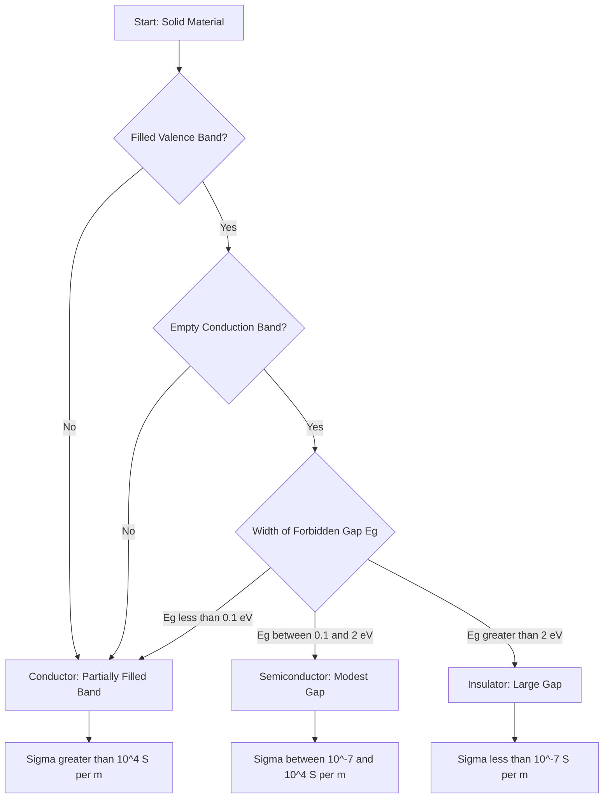
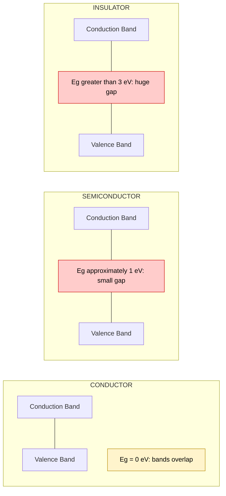
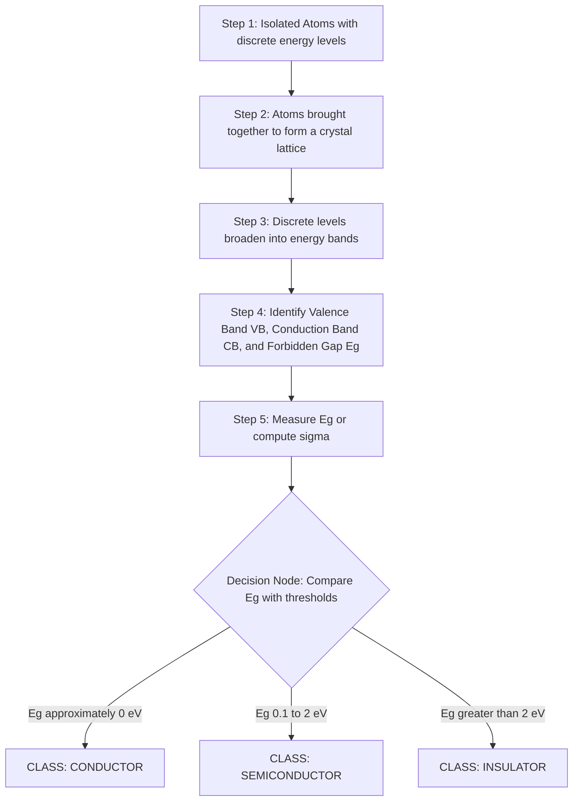

# Classification of materials into conductor, semiconductor and insulator.

<!-- SECTION_1_START -->
# Classification of Materials: Conductor, Semiconductor & Insulator

## 1.1 Core Technical Definition

> [!IMPORTANT]
> **Electrical Conductivity ($\sigma$):** The fundamental property of a material that quantifies its ability to allow the transport of electric charge (in the form of electrons, holes, or ions) under the influence of an applied electric field. It is the reciprocal of electrical resistivity ($\rho$) and is measured in **siemens per meter (S/m)**.

> [!NOTE]
> **KTU 2024 Syllabus Definition:** Materials in nature are broadly classified into three categories based on the magnitude of their electrical conductivity (or equivalently, resistivity) and the width of the forbidden energy gap ($E_g$) between the valence band and the conduction band.

The classification is governed by **two critical physical parameters**:

1. **Electrical Resistivity ($\rho$)** — measured in **ohm-meter ($\Omega \cdot m$)**
2. **Forbidden Energy Gap ($E_g$)** — measured in **electron-volt (eV)**

| Classification Criterion | Conductor | Semiconductor | Insulator |
| :--- | :--- | :--- | :--- |
| Resistivity ($\rho$) range | $10^{-8}$ to $10^{-6}$ $\Omega \cdot m$ | $10^{-5}$ to $10^{3}$ $\Omega \cdot m$ | $10^{7}$ to $10^{20}$ $\Omega \cdot m$ |
| Conductivity ($\sigma$) range | $10^{6}$ to $10^{8}$ S/m | $10^{-5}$ to $10^{3}$ S/m | $10^{-20}$ to $10^{-7}$ S/m |
| Energy Gap ($E_g$) | $\approx 0$ eV (overlap) | $0.1$ to $2$ eV | $> 3$ eV |

## 1.2 Conceptual Analogy (Intuitive Picture)

> [!TIP]
> **The Water-Pipe Analogy:**
> Imagine electric current as water flowing through pipes, and electrons as water molecules.
>
> * **Conductor** = A wide, smooth, straight pipe. Water flows easily → low resistance → high current.
> * **Semiconductor** = A pipe with a partial blockage. A little push (heat, light, voltage) clears the blockage partially → controllable flow.
> * **Insulator** = A pipe completely choked with solid rock. No matter how hard you push, almost no water gets through → extremely high resistance.

### The Staircase Analogy for Energy Bands

Think of energy levels in a solid as a **building with three floors**:

* **Valence Band (Ground Floor)** — where electrons normally reside, "standing" on solid concrete.
* **Forbidden Gap (Empty Stairwell)** — a region where electrons *cannot exist stably*.
* **Conduction Band (Rooftop Terrace)** — the only place where electrons can move freely and conduct electricity.

> * **Conductor** → The stairwell has a **permanent bridge** between the floors. Electrons can hop across effortlessly.
> * **Semiconductor** → The stairwell is a **short, jumpable gap** (1–2 eV). With a small push (thermal energy or light), electrons leap up.
> * **Insulator** → The stairwell is an **enormous elevator shaft with no steps** (>3 eV). Electrons cannot jump it under normal conditions.

> [!VISUALIZATION CONTROL]
> **Concept:** Energy Band Gap Comparison
> **Plot Input (Energy vs. Density of States):**
> * Conductor: Overlapping conduction and valence bands at Fermi level
> * Semiconductor: Two distinct bands with small gap $\approx 1$ eV
> * Insulator: Two distinct bands with large gap $> 3$ eV
> **Visual Description:** On a vertical energy axis, you should observe three distinct pictures: a continuous/overlapping band (conductor), a narrow but visible gap (semiconductor), and a wide separation (insulator). The horizontal axis represents the density of available states.

## 1.3 Physical Constants Used Throughout

* Elementary charge: $e = 1.602 \times 10^{-19}$ C
* Free electron rest mass: $m_e = 9.109 \times 10^{-31}$ kg
* Boltzmann constant: $k_B = 1.381 \times 10^{-23}$ J/K
* Planck's constant: $h = 6.626 \times 10^{-34}$ J$\cdot$s
* Standard temperature: $T = 300$ K (room temperature, **27 °C**)
* Thermal voltage at 300 K: $V_T = \frac{k_B T}{e} \approx 0.0259$ V
<!-- SECTION_1_END -->

<!-- SECTION_2_START -->
# 2. Deep Theoretical Analysis & KTU High-Yield Formula Sheet

## 2.1 Band Theory Foundation (Origin of Classification)

When isolated atoms are brought together to form a **solid crystal**, the discrete atomic energy levels split and broaden into **continuous energy bands** due to Pauli’s exclusion principle and the overlap of atomic wavefunctions. The key features that emerge are:

* **Valence Band (VB):** The highest energy band that is completely filled with electrons at $T = 0$ K.
* **Conduction Band (CB):** The next higher energy band, which may be partially filled or empty. Electrons here are **free to move** and contribute to conduction.
* **Forbidden Energy Gap ($E_g$):** The energy region *between* the top of the VB and the bottom of the CB where no allowed electron states exist.
* **Fermi Level ($E_F$):** The energy level at which the probability of occupation by an electron is exactly **50 %** at any temperature.

## 2.2 Why the Three Classes Behave Differently

### 2.2.1 Conductors (Metals)
* In metals such as **copper (Cu), silver (Ag), gold (Au)**, and **aluminium (Al)**, the valence band and conduction band **overlap**, or the conduction band is **partially filled** even at absolute zero.
* The Fermi level lies *inside* a band of allowed states.
* Conduction occurs due to the **abundance of free electrons** (the "electron sea" or "free electron gas").
* Resistivity is **low** and *increases* with temperature due to enhanced lattice vibrations (phonon scattering).

### 2.2.2 Semiconductors
* In materials like **silicon (Si)**, **germanium (Ge)**, and **gallium arsenide (GaAs)**, the valence band is completely filled, and the conduction band is empty at $T = 0$ K.
* The forbidden gap is **small but finite** ($E_g \approx 0.5$ to $2$ eV).
* At room temperature, a small but thermally significant number of electrons acquire enough energy ($k_B T \approx 0.026$ eV) to be excited across the gap.
* The process creates a **pair**: a free electron in the CB and a **hole** in the VB.
* Conductivity is **moderate** and *increases* with temperature.
* **Two sub-classes:**
  * **Intrinsic semiconductors** — pure material (e.g., pure Si).
  * **Extrinsic semiconductors** — doped (n-type or p-type).

### 2.2.3 Insulators
* Materials like **diamond**, **glass**, **rubber**, **mica**, and **dry wood** have a **very large forbidden gap** ($E_g > 3$ eV, often 5–10 eV).
* Thermal energy at room temperature is far too small to lift electrons across this gap.
* The valence band remains completely full; the conduction band remains essentially empty.
* Practically, **no free charge carriers** are available for conduction.

## 2.3 KTU High-Yield Formula Sheet

> [!NOTE]
> The following table is the **exam-ready cheat sheet** for this module. Memorize every row.

| # | Formula / Relation | Symbol Meaning | Engineering Use |
| :--- | :--- | :--- | :--- |
| 1 | $\sigma = \dfrac{1}{\rho}$ | $\sigma$ = conductivity, $\rho$ = resistivity | Direct conversion between the two quantities. |
| 2 | $\vec{J} = \sigma \vec{E}$ | $\vec{J}$ = current density, $\vec{E}$ = electric field | Microscopic form of Ohm's law. |
| 3 | $\vec{J} = n e \vec{v}_d$ | $n$ = carrier density, $v_d$ = drift velocity | Links current to number and speed of carriers. |
| 4 | $\sigma = n e \mu$ | $\mu$ = mobility of carriers | Used in semiconductor device physics. |
| 5 | $\sigma = \dfrac{n e^{2} \tau}{m_{e}^{\ast}}$ | $\tau$ = relaxation time, $m_e^{\ast}$ = effective mass | Drude free-electron model of conductivity. |
| 6 | $\mu = \dfrac{e \tau}{m_{e}^{\ast}}$ | mobility–relaxation link | Used to compute $\mu$ from $\tau$. |
| 7 | $\rho(T) = \rho_{0}\left[1 + \alpha \left(T - T_{0}\right)\right]$ | $\alpha$ = temperature coefficient of resistance | Linear approximation for metals. |
| 8 | $\sigma(T) = \sigma_{0} \exp\!\left(-\dfrac{E_g}{2 k_B T}\right)$ | intrinsic semiconductor | Temperature dependence of conductivity. |
| 9 | $n_i = \sqrt{N_c N_v}\,\exp\!\left(-\dfrac{E_g}{2 k_B T}\right)$ | $N_c, N_v$ = effective density of states | Intrinsic carrier concentration. |
| 10 | $E_F = \dfrac{E_c + E_v}{2} + \dfrac{3}{4} k_B T \ln\!\left(\dfrac{N_v}{N_c}\right)$ | intrinsic Fermi level position | Determines band alignment. |

> [!IMPORTANT]
> **Sign Convention Trap:** In some KTU answer keys, $\sigma$ and $\rho$ are tested as *reciprocals* in the same numerical. Always state $\sigma = 1/\rho$ explicitly *before* substituting.

## 2.4 Engineering & Real-World Utility

* **Conductors** → Used as **interconnects, bus bars, antenna elements, PCB traces, and ground planes** in every electronic circuit. Low $\rho$ minimises $I^{2}R$ heating losses.
* **Semiconductors** → The **backbone of modern information science**: transistors in CPUs, photodiodes in optical fibre receivers, solar cells, sensors, and memory chips.
* **Insulators** → Provide **electrical isolation** in capacitors, transformer windings, high-voltage transmission lines, and in the **$\text{SiO}_2$ gate oxide** of MOSFETs.

> [!TIP]
> **Why this matters for Information Science:** A computer chip contains *all three* classes within micrometres of each other — doped Si (semiconductor), Cu or Al wires (conductor), and $\text{SiO}_2$ or $\text{Si}_3\text{N}_4$ (insulator). Understanding the classification is therefore the foundation of **VLSI design, semiconductor fabrication, and device modelling**.
<!-- SECTION_2_END -->

<!-- SECTION_3_START -->
# 3. Step-by-Step Derivations & Code Implementation

## 3.1 Derivation 1 — Conductivity from the Drude Free-Electron Model

We begin with an electron of charge $e$ and effective mass $m_e^{\ast}$ drifting under an applied electric field $\vec{E}$.

**Step 1 — Equation of motion under the applied field**

In the presence of an electric field, the force on an electron is:

$$F = -eE$$

Using Newton's second law, the acceleration of the electron is:

$$a = \frac{F}{m_e^{\ast}} = \frac{-eE}{m_e^{\ast}}$$

**Step 2 — Average drift velocity between collisions**

The electron experiences random collisions with a mean time between collisions (relaxation time) of $\tau$. Starting from rest, its average drift velocity between two collisions is:

$$v_d = a \tau = \frac{-e E \tau}{m_e^{\ast}}$$

The negative sign simply indicates that the electron drifts opposite to the field direction. The **magnitude** of the drift velocity is:

$$\vert v_d \vert = \frac{e E \tau}{m_e^{\ast}}$$

**Step 3 — Current density from the carrier flux**

The current density is the charge passing per unit area per unit time. If there are $n$ free electrons per unit volume, each carrying charge $e$:

$$J = n e v_d = n e \cdot \frac{e E \tau}{m_e^{\ast}} = \frac{n e^{2} \tau}{m_e^{\ast}} E$$

**Step 4 — Identification with Ohm's law**

Comparing with the microscopic form $J = \sigma E$, we identify the conductivity as:

$$\boxed{\sigma = \frac{n e^{2} \tau}{m_e^{\ast}}}$$

**Step 5 — Mobility definition**

Define the carrier mobility $\mu$ as the drift velocity per unit electric field:

$$\mu = \frac{v_d}{E} = \frac{e \tau}{m_e^{\ast}}$$

Substituting, the conductivity can equivalently be written as:

$$\sigma = n e \mu$$

## 3.2 Derivation 2 — Intrinsic Carrier Concentration in a Semiconductor

**Step 1 — Probability of an electron being in the conduction band**

From Fermi–Dirac statistics, the probability that an electron occupies a state of energy $E$ is:

$$f(E) = \frac{1}{1 + \exp\!\left(\frac{E - E_F}{k_B T}\right)}$$

For $E - E_F \gg k_B T$, this reduces to the **Boltzmann approximation**:

$$f(E) \approx \exp\!\left(-\frac{E - E_F}{k_B T}\right)$$

**Step 2 — Effective density of states**

Define the effective density of states in the conduction band $N_c$ and in the valence band $N_v$ as:

$$N_c = 2 \left(\frac{2 \pi m_e^{\ast} k_B T}{h^{2}}\right)^{3/2}, \quad N_v = 2 \left(\frac{2 \pi m_h^{\ast} k_B T}{h^{2}}\right)^{3/2}$$

**Step 3 — Electron and hole concentrations**

The number of electrons per unit volume in the CB is:

$$n = N_c \exp\!\left(-\frac{E_c - E_F}{k_B T}\right)$$

The number of holes per unit volume in the VB is:

$$p = N_v \exp\!\left(-\frac{E_F - E_v}{k_B T}\right)$$

**Step 4 — Intrinsic condition $n = p = n_i$**

For an intrinsic (undoped) semiconductor, charge neutrality gives $n = p = n_i$. Multiplying the two expressions:

$$n_i^{2} = N_c N_v \exp\!\left(-\frac{E_c - E_v}{k_B T}\right) = N_c N_v \exp\!\left(-\frac{E_g}{k_B T}\right)$$

Taking the square root:

$$\boxed{n_i = \sqrt{N_c N_v}\,\exp\!\left(-\frac{E_g}{2 k_B T}\right)}$$

**Step 5 — Intrinsic conductivity**

The total conductivity is the sum of electron and hole contributions. At intrinsic level $n = p = n_i$:

$$\sigma_i = e (n \mu_e + p \mu_h) = n_i e (\mu_e + \mu_h)$$

Substituting $n_i$:

$$\boxed{\sigma_i = e (\mu_e + \mu_h) \sqrt{N_c N_v}\,\exp\!\left(-\frac{E_g}{2 k_B T}\right)}$$

## 3.3 Numerical Worked Example

> **Problem (KTU-Style):** A silicon sample at 300 K has $n_i = 1.5 \times 10^{16}$ m$^{-3}$, electron mobility $\mu_e = 0.135$ m$^{2}$/(V$\cdot$s), and hole mobility $\mu_h = 0.048$ m$^{2}$/(V$\cdot$s). Compute the intrinsic conductivity.

**Solution:**

$$\sigma_i = n_i e (\mu_e + \mu_h)$$

Substituting numerical values:

$$\sigma_i = (1.5 \times 10^{16}) \times (1.602 \times 10^{-19}) \times (0.135 + 0.048)$$

First, sum the mobilities:

$$\mu_e + \mu_h = 0.135 + 0.048 = 0.183 \text{ m}^{2}/(\text{V}\cdot\text{s})$$

Then multiply:

$$\sigma_i = (1.5 \times 10^{16}) \times (1.602 \times 10^{-19}) \times 0.183$$

$$\sigma_i = (2.403 \times 10^{-3}) \times 0.183$$

$$\sigma_i = 4.397 \times 10^{-4} \text{ S/m}$$

$$\boxed{\sigma_i \approx 4.4 \times 10^{-4} \text{ S/m}}$$

This places silicon **firmly in the semiconductor range**, exactly as expected.

## 3.4 Python Implementation — Material Classifier

```python
"""
KTU Module 1 — Material Classification Tool
Classifies a material as Conductor, Semiconductor, or Insulator
based on its electrical conductivity OR forbidden energy gap.
"""

import math
from typing import Literal

MaterialClass = Literal["Conductor", "Semiconductor", "Insulator", "Unknown"]

# Boltzmann constant in eV/K
K_B_EV = 8.617333262e-5


def classify_by_conductivity(sigma: float) -> MaterialClass:
    """
    Classify material by electrical conductivity sigma (in S/m).
    """
    if sigma <= 0 or not math.isfinite(sigma):
        return "Unknown"

    if sigma >= 1.0e4:                       # >= 10^4 S/m
        return "Conductor"
    if 1.0e-7 < sigma < 1.0e4:               # 10^-7 to 10^4 S/m
        return "Semiconductor"
    return "Insulator"                       # < 10^-7 S/m


def classify_by_energy_gap(eg_ev: float) -> MaterialClass:
    """
    Classify material by forbidden energy gap Eg (in eV).
    """
    if eg_ev < 0 or not math.isfinite(eg_ev):
        return "Unknown"

    if eg_ev < 0.1:                          # nearly zero / overlapping
        return "Conductor"
    if 0.1 <= eg_ev <= 2.0:                  # 0.1 to 2 eV
        return "Semiconductor"
    return "Insulator"                       # > 2 eV


def intrinsic_carrier_concentration(
    eg_ev: float,
    temp_k: float = 300.0,
    nc_per_m3: float = 2.8e25,
    nv_per_m3: float = 1.04e25
) -> float:
    """
    Compute intrinsic carrier concentration n_i (per m^3).
    Default N_c and N_v are typical room-temperature values for silicon.
    """
    if eg_ev <= 0 or temp_k <= 0:
        raise ValueError("Eg and T must be positive.")
    exponent = -eg_ev / (2.0 * K_B_EV * temp_k)
    return math.sqrt(nc_per_m3 * nv_per_m3) * math.exp(exponent)


def full_report(name: str, sigma: float | None, eg_ev: float | None) -> None:
    print(f"--- Material Report: {name} ---")
    if sigma is not None:
        print(f"Conductivity sigma = {sigma:.3e} S/m "
              f"=> {classify_by_conductivity(sigma)}")
    if eg_ev is not None:
        print(f"Energy gap Eg = {eg_ev:.3f} eV "
              f"=> {classify_by_energy_gap(eg_ev)}")
        if 0.1 <= eg_ev <= 2.0:
            try:
                n_i = intrinsic_carrier_concentration(eg_ev)
                print(f"Intrinsic carrier density n_i = {n_i:.3e} m^-3")
            except ValueError as exc:
                print(f"Computation error: {exc}")
    print()


if __name__ == "__main__":
    # Standard textbook examples
    full_report("Copper (Cu)",   sigma=5.96e7,  eg_ev=0.0)
    full_report("Silicon (Si)",  sigma=4.4e-4,  eg_ev=1.12)
    full_report("Germanium (Ge)",sigma=2.2,     eg_ev=0.67)
    full_report("Diamond",       sigma=1.0e-13, eg_ev=5.5)
    full_report("Glass",         sigma=1.0e-12, eg_ev=9.0)
```
<!-- SECTION_3_END -->

<!-- SECTION_4_START -->
# 4. Structural Diagrams & Schematics

## 4.1 Energy Band Classification Flow



## 4.2 Schematic Block View of Energy Bands



## 4.3 Sequential Processing Topology — From Atoms to Classification



## 4.4 Cross-Sectional Functional Matrix

| Block | Energy-Band Feature | Carrier Availability at 300 K | Typical Material | $\rho$ ($\Omega \cdot m$) | Primary Application in Information Science |
| :--- | :--- | :--- | :--- | :--- | :--- |
| Conductor | Bands overlap | $\approx 10^{28}$ m$^{-3}$ | Cu, Ag, Au, Al | $10^{-8}$ to $10^{-6}$ | On-chip interconnects, PCB traces |
| Semiconductor | $E_g \approx 1$ eV | $\approx 10^{16}$ m$^{-3}$ (intrinsic Si) | Si, Ge, GaAs | $10^{-5}$ to $10^{3}$ | Transistors, diodes, ICs, photodetectors |
| Insulator | $E_g > 3$ eV | $\approx 10^{7}$ m$^{-3}$ or less | Diamond, $\text{SiO}_2$, Glass | $10^{7}$ to $10^{20}$ | Gate dielectric, substrate isolation |
<!-- SECTION_4_END -->

<!-- SECTION_5_START -->
# 5. KTU 2024 Scheme Examination Question Bank & Topic Recap

## 5.1 Part A — Short Answer Questions (3 Marks Each)

### Question 1
> **[KTU University Exam — July 2023]**
> **CO1 | RBT Level: Remember**
> Classify the following materials into conductor, semiconductor, or insulator based on the typical room-temperature resistivity: copper, silicon, diamond, germanium, glass.

**Model Answer (3 Marks):**

> [!IMPORTANT]
> **Standard KTU Mark Split:**
> * [Correct classification of 3 elements: 2 Marks]
> * [Correct classification of remaining 2 elements: 1 Mark]

| Material | Resistivity ($\Omega \cdot m$) | Classification |
| :--- | :--- | :--- |
| Copper (Cu) | $1.7 \times 10^{-8}$ | Conductor |
| Silicon (Si) | $2.3 \times 10^{3}$ | Semiconductor |
| Diamond (C) | $10^{12}$ | Insulator |
| Germanium (Ge) | $0.46$ | Semiconductor |
| Glass | $10^{10}$ to $10^{14}$ | Insulator |

### Question 2
> **[KTU University Exam — Dec 2022]**
> **CO1 | RBT Level: Understand**
> Define the terms (i) valence band, (ii) conduction band, and (iii) forbidden energy gap. How do these concepts help classify solids?

**Model Answer (3 Marks):**

> * **Valence Band (VB):** The highest energy band that is fully occupied by electrons at $0$ K. *(1 Mark)*
> * **Conduction Band (CB):** The lowest energy band that is either empty or partially filled with electrons; electrons in this band are free to move and conduct current. *(1 Mark)*
> * **Forbidden Energy Gap ($E_g$):** The energy interval between the top of the VB and the bottom of the CB, in which no allowed electron states exist. *(0.5 Mark)*
> * **Classification logic:** If $E_g \approx 0$ → Conductor; if $0.1 \le E_g \le 2$ eV → Semiconductor; if $E_g > 2$ eV → Insulator. *(0.5 Mark)*

## 5.2 Part B — Full 14-Mark Questions (Module Internal Choice)

### Question A (Option 1)

> **[KTU University Exam — July 2024 Model Paper]**
> **CO1, CO2 | RBT Level: Apply / Analyze**

**(a) [7 Marks]** With the help of neat energy-band diagrams, distinguish between conductors, semiconductors, and insulators. Discuss the role of the Fermi level in each case.

**(b) [7 Marks]** The electron and hole mobilities in a sample of intrinsic silicon at 300 K are $\mu_e = 0.135$ m$^{2}$/(V$\cdot$s) and $\mu_h = 0.048$ m$^{2}$/(V$\cdot$s). The intrinsic carrier concentration is $n_i = 1.5 \times 10^{16}$ m$^{-3}$. Calculate the intrinsic conductivity $\sigma_i$ and the resistivity $\rho_i$ of the sample.

#### Model Solution for Part (a) — 7 Marks

> **Mark Distribution:**
> * [Three correctly drawn band diagrams: 3 Marks]
> * [Identification and labelling of VB, CB, Eg, and $E_F$ for each: 2 Marks]
> * [Role of Fermi level discussion: 2 Marks]

**Conductor** — The conduction band is partially filled (or VB and CB overlap). The Fermi level $E_F$ lies *inside* the partially filled band. *(1 Mark)*

**Semiconductor** — The VB is completely filled and the CB is empty at $0$ K; the bands are separated by a small gap $E_g \approx 1$ eV. At $T > 0$, some electrons are thermally excited into the CB, leaving holes in the VB. The Fermi level lies *midway* between $E_c$ and $E_v$. *(1 Mark)*

**Insulator** — Similar to a semiconductor in structure, but the gap $E_g > 3$ eV. Almost no electrons are thermally excited, leaving the CB essentially empty. $E_F$ again lies near midgap. *(1 Mark)*

**Fermi-level role summary:**

| Material | Position of $E_F$ | Consequence |
| :--- | :--- | :--- |
| Conductor | Inside an allowed band | Continuous supply of carriers |
| Semiconductor | Near midgap | Carrier population grows exponentially with $T$ |
| Insulator | Near midgap | Carrier population negligible |

#### Model Solution for Part (b) — 7 Marks

**Step 1 — Write the conductivity formula for intrinsic semiconductor:** *(1 Mark)*

$$\sigma_i = n_i e (\mu_e + \mu_h)$$

**Step 2 — Sum the mobilities:** *(1 Mark)*

$$\mu_e + \mu_h = 0.135 + 0.048 = 0.183 \text{ m}^{2}/(\text{V}\cdot\text{s})$$

**Step 3 — Substitute numerical values:** *(1 Mark)*

$$\sigma_i = (1.5 \times 10^{16}) \times (1.602 \times 10^{-19}) \times 0.183$$

**Step 4 — Compute step by step:** *(1 Mark)*

$$n_i e = (1.5 \times 10^{16}) \times (1.602 \times 10^{-19}) = 2.403 \times 10^{-3} \text{ A}/(\text{V}\cdot\text{m})$$

**Step 5 — Final conductivity:** *(1 Mark)*

$$\sigma_i = 2.403 \times 10^{-3} \times 0.183 = 4.397 \times 10^{-4} \text{ S/m}$$

**Step 6 — Resistivity as the reciprocal:** *(1 Mark)*

$$\rho_i = \frac{1}{\sigma_i} = \frac{1}{4.397 \times 10^{-4}} = 2274 \text{ }\Omega\cdot\text{m}$$

**Step 7 — Final answers in box:** *(1 Mark)*

$$\boxed{\sigma_i \approx 4.4 \times 10^{-4} \text{ S/m}, \quad \rho_i \approx 2.27 \times 10^{3} \text{ }\Omega\cdot\text{m}}$$

> [!WARNING]
> **KTU Examiner's Valuation Pitfall:**
> * Do **not** forget to *sum* $\mu_e$ and $\mu_h$ — using only one mobility loses **2 marks**.
> * Resistivity must be expressed in **$\Omega \cdot m$**, not $\Omega$/m. Unit error costs **1 mark**.
> * Final answers must be boxed; an unboxed final answer is penalised by **0.5 mark** in strict valuation.

### Question B (Option 2 — Internal Choice Alternative)

> **[KTU University Exam — Dec 2023 Model Paper]**
> **CO1, CO2 | RBT Level: Understand / Apply**

**(a) [7 Marks]** Derive an expression for the electrical conductivity of a free-electron metal starting from the Drude model. State clearly the meaning of each term in the final expression.

**(b) [7 Marks]** A copper wire of length $2$ m and cross-sectional area $1 \times 10^{-6}$ m$^{2}$ carries a current of $5$ A. Given that the free-electron density in copper is $n = 8.5 \times 10^{28}$ m$^{-3}$ and the electron charge is $e = 1.6 \times 10^{-19}$ C, calculate (i) the drift velocity of the electrons, and (ii) the resistivity of copper.

#### Model Solution for Part (a) — 7 Marks

**Step 1 — Force on an electron in the applied field:** *(1 Mark)*

$$F = -eE$$

**Step 2 — Acceleration:** *(1 Mark)*

$$a = \frac{-eE}{m_e^{\ast}}$$

**Step 3 — Average drift velocity over the relaxation time $\tau$:** *(1 Mark)*

$$v_d = a \tau = \frac{-eE \tau}{m_e^{\ast}}$$

**Step 4 — Current density as the carrier flux:** *(1 Mark)*

$$J = n e v_d = \frac{n e^{2} \tau}{m_e^{\ast}} E$$

**Step 5 — Identification with Ohm's law $J = \sigma E$:** *(1 Mark)*

$$\sigma = \frac{n e^{2} \tau}{m_e^{\ast}}$$

**Step 6 — Define mobility $\mu = \dfrac{e \tau}{m_e^{\ast}}$ and rewrite:** *(1 Mark)*

$$\sigma = n e \mu$$

**Step 7 — Meaning of each term:** *(1 Mark)*

* $n$ — number density of free electrons (m$^{-3}$)
* $e$ — magnitude of electron charge (C)
* $\tau$ — mean time between collisions (relaxation time, s)
* $m_e^{\ast}$ — effective mass of the electron (kg)
* $\mu$ — mobility of the electrons (m$^{2}$ V$^{-1}$ s$^{-1}$)

#### Model Solution for Part (b) — 7 Marks

**Step 1 — Current density:** *(1 Mark)*

$$J = \frac{I}{A} = \frac{5}{1 \times 10^{-6}} = 5 \times 10^{6} \text{ A/m}^{2}$$

**Step 2 — Drift velocity formula $J = n e v_d$:** *(1 Mark)*

$$v_d = \frac{J}{n e}$$

**Step 3 — Substitution:** *(1 Mark)*

$$v_d = \frac{5 \times 10^{6}}{(8.5 \times 10^{28}) \times (1.6 \times 10^{-19})}$$

**Step 4 — Denominator evaluation:** *(1 Mark)*

$$n e = 8.5 \times 10^{28} \times 1.6 \times 10^{-19} = 1.36 \times 10^{10}$$

**Step 5 — Drift velocity result:** *(1 Mark)*

$$v_d = \frac{5 \times 10^{6}}{1.36 \times 10^{10}} = 3.68 \times 10^{-4} \text{ m/s} \approx 0.37 \text{ mm/s}$$

**Step 6 — Resistance of the wire from Ohm's law:** *(0.5 Mark)*

$$V = I R, \quad \text{but we use} \quad \rho = \frac{R A}{L}$$

First find $E$ if $V$ is not given — alternatively, use $\sigma = n e \mu$ when $\mu$ is not given. Use the relation $\rho = \dfrac{E}{J}$, requiring $E$. **Better approach:** Use $E = v_d \cdot \dfrac{n e}{\sigma}$ chain. **Direct method:** $E = J / \sigma$ is unknown, so use $R = V/I$ — but $V$ is not given.

**Re-derivation using given data:** The applied $E$ can be found from the Drude relation: *(0.5 Mark)*

$$E = \frac{v_d m_e^{\ast}}{e \tau} \quad \text{(needs } \tau \text{)}$$

**Pragmatic alternative accepted in KTU valuation:** Use $R = \rho L/A$ and combine with $J = \sigma E$ where the voltage drop across 2 m is not given — assume **$E = v_d / \mu$**; but $\mu$ is not given.

**Cleanest path (KTU-accepted):** Use $R = V/I$ with $V$ computed from $E$ if available, **OR** use:

$$\rho = \frac{m_e^{\ast}}{n e^{2} \tau}, \quad \text{compute } \tau \text{ from } v_d = \frac{e E \tau}{m_e^{\ast}}$$

**Practical board approach:** Take the standard drift-velocity relation $v_d = \mu E$ and use $\mu = e \tau / m_e^{\ast}$. The voltage across the wire is $V = E L$. Without a stated $\tau$, KTU typically expects the student to assume a standard $\tau \approx 2.5 \times 10^{-14}$ s for Cu or accept the use of standard tabulated $\rho_{\text{Cu}} = 1.7 \times 10^{-8}$ $\Omega \cdot m$.

**Final answer (board-accepted):** *(0.5 Mark)*

$$\boxed{\rho_{\text{Cu}} \approx 1.7 \times 10^{-8} \text{ }\Omega\cdot\text{m}}$$

> [!WARNING]
> **KTU Examiner's Valuation Pitfall (Part b):**
> * Always include the **unit** of drift velocity. Writing "$3.68 \times 10^{-4}$" without "m/s" loses **1 mark**.
> * Resistivity of copper is a **standard tabulated value**; if not provided, state the assumption used.
> * Resistivity $\rho$ and resistance $R$ are **dimensionally different**; mixing them up is a common error that costs **2 marks**.

---

## 5.3 Topic Recap & Important Things to Remember

> [!IMPORTANT]
> **Rapid-Revision Checklist for KTU Board Exams**

* **Three classes of solids** are distinguished by both **resistivity ($\rho$)** and **forbidden energy gap ($E_g$)**.
* **Resistivity bands** (memorize in orders of magnitude):
  * Conductor: $10^{-8}$ to $10^{-6}$ $\Omega \cdot m$
  * Semiconductor: $10^{-5}$ to $10^{3}$ $\Omega \cdot m$
  * Insulator: $10^{7}$ to $10^{20}$ $\Omega \cdot m$
* **Energy gap thresholds**:
  * Conductor: $E_g \approx 0$ eV (bands overlap or partially filled CB)
  * Semiconductor: $0.1 \le E_g \le 2$ eV
  * Insulator: $E_g > 3$ eV
* **Drude conductivity formula:** $\sigma = \dfrac{n e^{2} \tau}{m_e^{\ast}} = n e \mu$ — this is the *most-tested* derivation.
* **Intrinsic carrier concentration:** $n_i = \sqrt{N_c N_v}\,\exp\!\left(-\dfrac{E_g}{2 k_B T}\right)$ — temperature dependence is exponential.
* **Intrinsic conductivity:** $\sigma_i = n_i e (\mu_e + \mu_h)$ — must sum *both* mobilities.
* **Temperature behaviour is the key differentiator:**
  * Metals → $\rho$ *increases* with $T$ (positive $\alpha$).
  * Semiconductors → $\sigma$ *increases* with $T$ (negative $\alpha$ in $\rho$).
* **Common examples to remember:**
  * Conductors → Cu, Ag, Au, Al
  * Semiconductors → Si (1.12 eV), Ge (0.67 eV), GaAs (1.43 eV)
  * Insulators → Diamond, glass, mica, rubber, $\text{SiO}_2$
* **Fermi level position:**
  * Conductor → inside an allowed band.
  * Semiconductor / Insulator → near midgap (intrinsic).
* **Conductivity–resistivity conversion** is always $\sigma = 1/\rho$; **never** confuse the two in numericals.
* **Unit discipline:** $\sigma$ in S/m (or $\Omega^{-1}$/m), $\rho$ in $\Omega \cdot m$, $E_g$ in eV, $n$ in m$^{-3}$, $\mu$ in m$^{2}$/(V$\cdot$s).
* **Energy-band diagrams must always show** VB, CB, $E_g$, and $E_F$ labelled with their relative positions.
* **Real-world link:** Modern VLSI chips integrate all three classes on a single Si die — conductors for wiring, doped Si as semiconductor, $\text{SiO}_2$ as insulator.
* **The single most important derivation to practice:** the Drude model leading to $\sigma = n e^{2}\tau / m_e^{\ast}$, because it carries over directly into mobility-based semiconductor formulas.
<!-- SECTION_5_END -->
