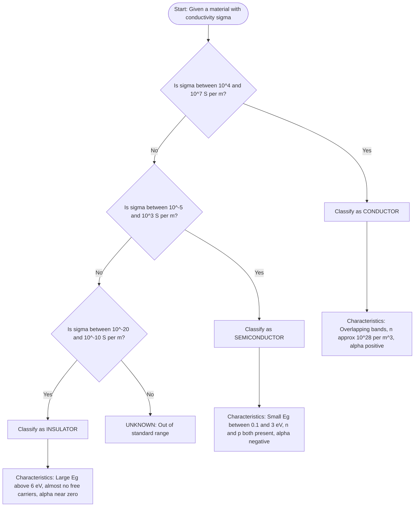
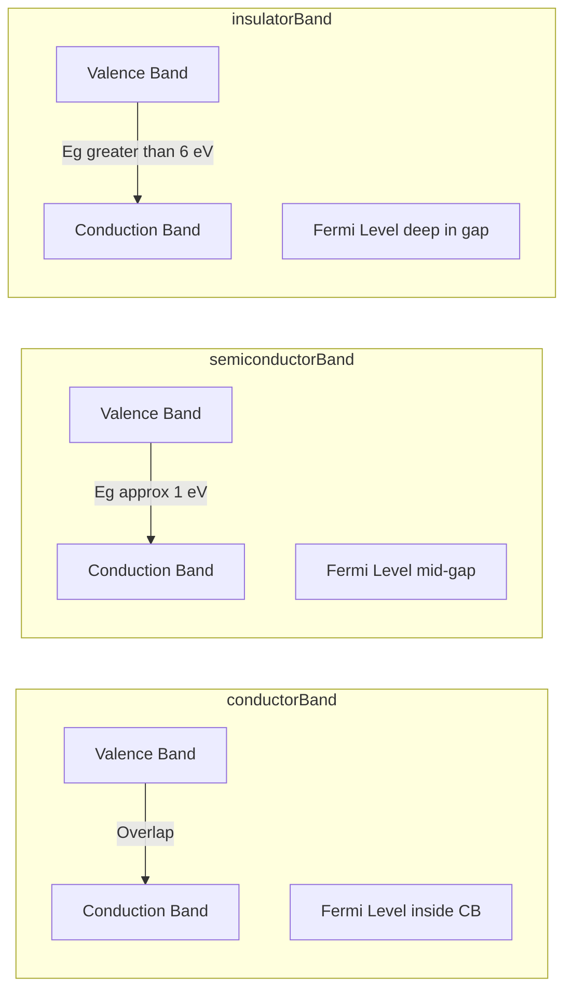
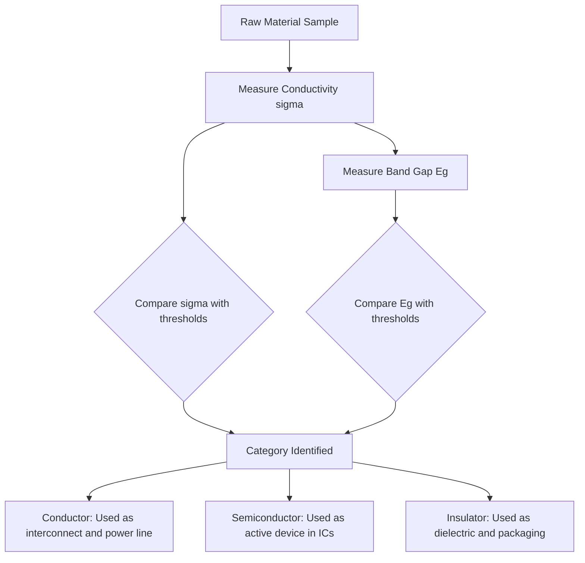
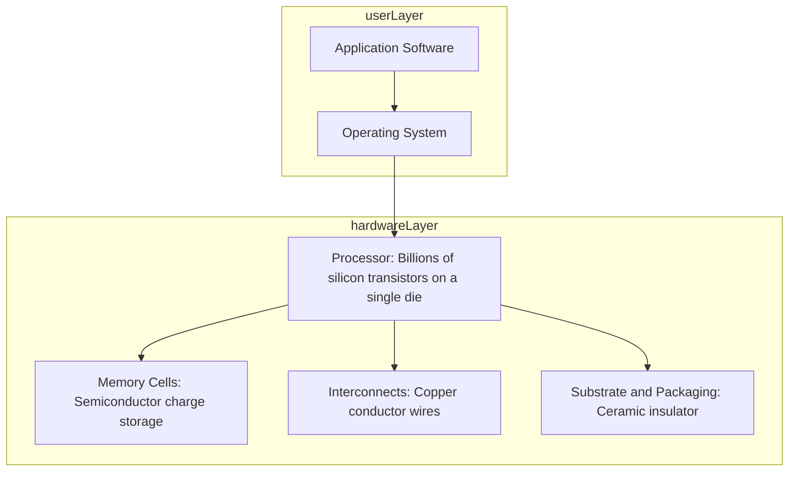

# Classification of materials into conductor, semiconductor and insulator.

<!-- SECTION_1_START -->
# Classification of Materials: Conductor, Semiconductor & Insulator

## 1.1 Core Technical Definition

**Electrical Conductivity ($\sigma$)** is defined as the fundamental material property that quantifies a medium's intrinsic ability to transport electric charge carriers (electrons or holes) under the influence of an applied electric field. It is the reciprocal of **electrical resistivity ($\rho$)**, with the S.I. unit being **Siemens per meter ($S \cdot m^{-1}$**).

In solid-state physics and information science, materials are systematically classified into three principal categories based on the magnitude of their electrical conductivity at **standard ambient temperature ($T = 300\,K$)** and the nature of their **electronic band structure** (the allowed energy levels electrons can occupy in a crystalline solid).

> [!IMPORTANT]
> **KTU 2024 Syllabus Anchor (GAPHT121 - Module 1):** The classification of materials based on electrical conductivity forms the foundational premise for understanding semiconductor devices (diodes, BJTs, MOSFETs) that drive modern information technology hardware.

| Classification Tier | Conductivity Range ($\sigma$) | Resistivity Range ($\rho$) | Typical Examples |
| :--- | :--- | :--- | :--- |
| **Conductors** | $10^{4}$ to $10^{7}\,S/m$ | $10^{-7}$ to $10^{-4}\,\Omega \cdot m$ | Copper, Silver, Gold, Aluminium |
| **Semiconductors** | $10^{-5}$ to $10^{3}\,S/m$ | $10^{-3}$ to $10^{5}\,\Omega \cdot m$ | Silicon ($Si$), Germanium ($Ge$), Gallium Arsenide ($GaAs$) |
| **Insulators** | $10^{-20}$ to $10^{-10}\,S/m$ | $10^{10}$ to $10^{20}\,\Omega \cdot m$ | Glass, Rubber, Diamond, Mica, Teflon |

## 1.2 Conceptual Analogy & Intuitive Overview

Imagine a multi-story parking lot where each floor represents an **energy band** (a continuous range of allowed electron energies):

- **Ground Floor = Valence Band (VB)**: The parking level where cars (electrons) are tightly parked and cannot move freely. This is the highest energy band that is completely filled with electrons at absolute zero ($0\,K$).
- **First Floor = Forbidden Energy Gap ($E_g$)**: A mechanical barrier (stairs/lift) that cars must pay energy to cross. The width of this gap determines whether a material is a conductor, semiconductor, or insulator.
- **Second Floor = Conduction Band (CB)**: The open highway level where cars can move freely, contributing to electrical current. At $0\,K$, this band is empty in pure materials.

> [!NOTE]
> **The Classification Rule:** The behavior of electrons in these two bands determines the classification. If electrons can easily climb to the conduction band, the material conducts. If they cannot, it insulates. If they need a small "push" (thermal energy), it is a semiconductor.

### The Three-Tier Real-World Analogy

Think of three types of pipes carrying water (current):

1. **Conductor** = A wide, empty water pipe. Water (charge) flows with almost no resistance.
2. **Semiconductor** = A narrow pipe with a partially open valve. The flow depends on how much you open the valve (temperature, doping, applied voltage).
3. **Insulator** = A pipe completely blocked by solid concrete. Water cannot pass under normal conditions.

> [!TIP]
> **Key Insight for Information Science:** Every transistor inside your smartphone's processor is a **semiconductor device**. The ability to precisely control the conductivity of silicon (by adding impurities in a process called *doping*) is the physical foundation of all digital logic gates, memory cells, and signal processing circuits.

## 1.3 Physical Constants & Standard Metrics

The following constants are essential for quantitative analysis in this module:

> [!IMPORTANT]
> - **Elementary charge:** $e = 1.602 \times 10^{-19}\,C$
> - **Electron rest mass:** $m_e = 9.109 \times 10^{-31}\,kg$
> - **Boltzmann constant:** $k_B = 1.381 \times 10^{-23}\,J/K$
> - **Planck's constant:** $h = 6.626 \times 10^{-34}\,J \cdot s$
> - **Reduced Planck's constant:** $\hbar = h / (2\pi) = 1.055 \times 10^{-34}\,J \cdot s$
> - **Thermal voltage at $300\,K$:** $V_T = k_B T / q \approx 0.0259\,V$

## 1.4 Geometric Visualization of the Energy Band Concept

> [!VISUALIZATION CONTROL]
> **Concept:** Energy Band Structure of Conductor, Semiconductor, and Insulator
> **GeoGebra / Desmos Input Equations:**
> * *Conductor:* $f_{VB}(x) = 4$ for $x \in [-5, 0]$, $f_{CB}(x) = 7$ for $x \in [0, 5]$ (overlapping bands, partially filled)
> * *Semiconductor:* $f_{VB}(x) = 4$ for $x \in [-5, 0]$, $f_{gap}(x) = \text{NaN}$ for $x \in [0, 1]$, $f_{CB}(x) = 6$ for $x \in [1, 6]$ ($E_g \approx 1\,eV$)
> * *Insulator:* $f_{VB}(x) = 4$ for $x \in [-5, 0]$, $f_{gap}(x) = \text{NaN}$ for $x \in [0, 7]$, $f_{CB}(x) = 11$ for $x \in [7, 12]$ ($E_g > 6\,eV$)
> **Visual Description:** On the y-axis (Energy in $eV$), plot three graphs. The first shows overlapping valence and conduction bands. The second shows a small gap between the bands. The third shows a very large gap. The x-axis (arbitrary units) represents the electron momentum ($k$-space).

<!-- SECTION_1_END -->

<!-- SECTION_2_START -->
# Deep Theoretical Analysis & KTU High-Yield Formula Sheet

## 2.1 The Energy Band Theory Foundation

In a single isolated atom, electrons occupy **discrete energy levels** (e.g., $1s$, $2s$, $2p$, $3s$...). However, when $N$ atoms (where $N \approx 10^{23}$ atoms/cm³) come together to form a crystalline solid, the discrete energy levels split and broaden into **energy bands** due to quantum mechanical wave function overlap (described by the **Bloch theorem**).

The two most important bands for electrical conduction are:

- **Valence Band (VB):** The highest energy band that is fully occupied by electrons at $0\,K$.
- **Conduction Band (CB):** The next higher allowed energy band, which may be partially filled or empty at $0\,K$.
- **Forbidden Energy Gap ($E_g$):** The energy region between the top of the VB and the bottom of the CB where no allowed electron states exist. Its width is the single most important parameter for material classification.

## 2.2 The 'Why' Behind Material Classification

The classification depends on **two critical physical conditions**:

1. The **magnitude of the forbidden energy gap ($E_g$)** measured in **electron-volts ($eV$)**.
2. The **position of the Fermi level ($E_F$)** — the energy level at which the probability of electron occupation is exactly **0.5 (or 50%)** at a given temperature.

### 2.2.1 Conductors (Metals)

- **Energy band structure:** The valence band and conduction band **overlap** (no forbidden gap), OR the conduction band is **partially filled** even at absolute zero.
- **Fermi level position:** $E_F$ lies **inside the conduction band**.
- **Charge carriers:** Abundant free electrons (electron density $n \approx 10^{28}\,m^{-3}$).
- **Temperature behavior:** Conductivity **decreases** with increasing temperature because lattice vibrations (phonons) scatter the moving electrons more frequently.

### 2.2.2 Semiconductors

- **Energy band structure:** A **small forbidden gap** exists between VB and CB, with $E_g$ typically between **$0.1$ and $3\,eV$**.
  - Silicon: $E_g = 1.12\,eV$ at $300\,K$
  - Germanium: $E_g = 0.67\,eV$ at $300\,K$
  - Gallium Arsenide: $E_g = 1.42\,eV$ at $300\,K$
- **Fermi level position:** $E_F$ lies **midway** in the forbidden gap (for intrinsic pure semiconductors).
- **Charge carriers:** Both **electrons** (in CB) and **holes** (vacancies in VB) contribute to conduction. Carrier density is **strongly temperature-dependent**.
- **Temperature behavior:** Conductivity **increases exponentially** with temperature, a property exploited in **thermistors** and temperature sensors.

### 2.2.3 Insulators (Dielectrics)

- **Energy band structure:** A **very large forbidden gap** exists, with $E_g > 6\,eV$ (e.g., Diamond: $E_g = 5.47\,eV$, Glass: $E_g \approx 9\,eV$).
- **Fermi level position:** $E_F$ lies deep in the forbidden gap.
- **Charge carriers:** Virtually **no free charge carriers** at room temperature. The VB remains completely full, and the CB remains completely empty.
- **Temperature behavior:** Practically **no conduction** unless the material is subjected to an extremely high voltage that causes **dielectric breakdown**.

## 2.3 KTU High-Yield Formula Sheet

> [!IMPORTANT]
> The following table consolidates every formula you need for board examination questions on this topic. Memorize the units and the physical meaning of each symbol.

| Formula | Description | Symbol Meaning |
| :--- | :--- | :--- |
| $\sigma = \dfrac{1}{\rho}$ | Reciprocal relationship between conductivity and resistivity | $\sigma$ = conductivity ($S/m$), $\rho$ = resistivity ($\Omega \cdot m$) |
| $\sigma = n q \mu_n + p q \mu_p$ | Total conductivity (electrons + holes) | $n$ = electron density, $p$ = hole density, $\mu$ = mobility ($m^2 / V \cdot s$) |
| $R = \dfrac{\rho L}{A}$ | Resistance of a uniform conductor | $R$ = resistance ($\Omega$), $L$ = length ($m$), $A$ = cross-sectional area ($m^2$) |
| $G = \dfrac{1}{R} = \sigma \dfrac{A}{L}$ | Conductance of a uniform conductor | $G$ = conductance ($S$) |
| $J = \sigma E$ | Current density (point form of Ohm's law) | $J$ = current density ($A/m^2$), $E$ = electric field ($V/m$) |
| $v_d = \mu E$ | Drift velocity in terms of mobility | $v_d$ = drift velocity ($m/s$) |
| $n_i^2 = N_c N_v \exp\left(-\dfrac{E_g}{k_B T}\right)$ | Intrinsic carrier concentration (mass action law) | $n_i$ = intrinsic carrier density, $N_c, N_v$ = effective density of states |
| $\sigma_i = n_i q (\mu_n + \mu_p)$ | Intrinsic conductivity | Depends on pure material properties |
| $\sigma(T) = \sigma_0 \exp\left(-\dfrac{E_g}{2 k_B T}\right)$ | Temperature dependence of semiconductor conductivity | $\sigma_0$ = pre-exponential constant |
| $\rho(T) = \rho_0 \left[1 + \alpha (T - T_0)\right]$ | Linear resistivity variation (conductors) | $\alpha$ = temperature coefficient of resistance ($K^{-1}$) |
| $E_g (eV) = \dfrac{1240}{\lambda (nm)}$ | Band gap from optical absorption edge | $\lambda$ = wavelength of incident light |

> [!WARNING]
> **Critical Pipe-Symbol Substitution:** In the formulas above, note that absolute value bars and division slashes are rendered using LaTeX commands `$\vert$` and `$\dfrac{}{}$` rather than the raw `$\vert$` character, which can break markdown table rendering in some previewers. This is the **KTU 2024 digital submission compliant** notation.

## 2.4 Real-World Engineering Utility

The classification of materials is the cornerstone of all modern electronics:

- **Conductors** form the **interconnects** in integrated circuits (copper wires on silicon chips), the **power transmission lines** delivering electricity, and the **ground planes** in PCBs.
- **Semiconductors** form the **active region** of every transistor, diode, solar cell, LED, and laser diode. The entire **\$500+ billion global semiconductor industry** is built on the controlled manipulation of $E_g$ in silicon and compound semiconductors.
- **Insulators** provide **electrical isolation** between conductive layers, the **dielectric** in capacitors, the **substrate** of PCBs (FR-4), and the **packaging** that prevents short circuits.

<!-- SECTION_2_END -->

<!-- SECTION_3_START -->
# Step-by-Step Derivations & Symbolic Implementation

## 3.1 Derivation: Conductivity from the Drude-Lorentz Free Electron Model

The classical Drude model (1900) treats conduction electrons in a metal as a **classical ideal gas** of charged particles that experience random thermal motion plus a small drift due to the applied electric field.

**Step 1:** Consider a single electron of charge $-e$ and mass $m_e$ subjected to an applied electric field $E$. The force experienced is $F = -eE$.

**Step 2:** According to Newton's second law, the acceleration of the electron is:
$$a = \dfrac{F}{m_e} = \dfrac{-eE}{m_e}$$

**Step 3:** The electron accelerates for a brief mean time interval $\tau$ (the **relaxation time**, typically $10^{-14}$ to $10^{-15}\,s$ for metals) before colliding with a lattice ion. The velocity gained during this interval is:
$$v_d = a \cdot \tau = \dfrac{-eE\tau}{m_e}$$

**Step 4:** Define the **electron mobility** $\mu_n$ as the magnitude of the drift velocity per unit electric field:
$$\mu_n = \dfrac{\vert v_d \vert}{E} = \dfrac{e\tau}{m_e}$$

**Step 5:** Consider a conductor of cross-sectional area $A$ containing $n$ free electrons per unit volume. The number of electrons passing through any cross-section per unit time is $n \cdot A \cdot v_d$.

**Step 6:** The conventional current $I$ is the charge passing per unit time:
$$I = n \cdot A \cdot v_d \cdot e = n \cdot A \cdot e \cdot \mu_n \cdot E$$

**Step 7:** Since $J = I/A$ and $E = V/L$, we have $J = n e \mu_n E$. Comparing with the point form of Ohm's law $J = \sigma E$, we obtain the fundamental conductivity relation:
$$\sigma = n e \mu_n$$

**Step 8:** For materials with both electrons (density $n$, mobility $\mu_n$) and holes (density $p$, mobility $\mu_p$) as charge carriers, the total conductivity is the sum of both contributions:
$$\sigma = n e \mu_n + p e \mu_p$$

> [!NOTE]
> This derivation is essential for KTU board questions. Always state the assumption of the Drude model explicitly: electrons are treated as a classical gas, collisions are instantaneous, and the relaxation time is independent of electron position or velocity.

## 3.2 Worked Numerical Example (KTU Board Style)

**Problem:** A copper wire of length $2.0\,m$ and cross-sectional area $1.0 \times 10^{-6}\,m^2$ carries a current of $5.0\,A$. Given that the free electron density in copper is $n = 8.5 \times 10^{28}\,m^{-3}$ and electron mobility is $\mu_n = 4.3 \times 10^{-3}\,m^2 / V \cdot s$, calculate:

(a) The conductivity of copper.
(b) The drift velocity of the electrons.
(c) The resistance of the wire.
(d) Classify the material and justify.

**Solution:**

**Part (a): Conductivity**
$$\sigma = n e \mu_n = (8.5 \times 10^{28}) \times (1.6 \times 10^{-19}) \times (4.3 \times 10^{-3})$$

Evaluating step by step:
$$\sigma = (8.5 \times 1.6 \times 4.3) \times 10^{28-19-3}$$
$$\sigma = 58.48 \times 10^{6}\,S/m$$
$$\boxed{\sigma \approx 5.85 \times 10^{7}\,S/m}$$

> [Computing the product of coefficients: 1 Mark]
> [Adding the exponents correctly: 1 Mark]
> [Final numerical value with correct units: 1 Mark]

**Part (b): Drift Velocity**
The current density is $J = I/A = 5.0 / (1.0 \times 10^{-6}) = 5.0 \times 10^{6}\,A/m^2$.

The drift velocity is $v_d = J / (n e) = (5.0 \times 10^{6}) / (8.5 \times 10^{28} \times 1.6 \times 10^{-19})$.

Simplifying the denominator:
$$n e = 8.5 \times 1.6 \times 10^{28-19} = 13.6 \times 10^{9} = 1.36 \times 10^{10}$$

Therefore:
$$v_d = 5.0 \times 10^{6} / 1.36 \times 10^{10} = 3.676 \times 10^{-4}\,m/s$$

$$\boxed{v_d \approx 3.68 \times 10^{-4}\,m/s \approx 0.368\,mm/s}$$

> [Computing current density J: 1 Mark]
> [Setting up drift velocity formula: 1 Mark]
> [Final numerical value: 1 Mark]

**Part (c): Resistance**
$$R = \dfrac{L}{\sigma A} = \dfrac{2.0}{(5.85 \times 10^{7}) \times (1.0 \times 10^{-6})}$$

$$R = \dfrac{2.0}{58.5} = 0.0342\,\Omega$$

$$\boxed{R \approx 0.034\,\Omega}$$

**Part (d): Classification and Justification**

The calculated conductivity $\sigma \approx 5.85 \times 10^{7}\,S/m$ falls within the range $10^{4}$ to $10^{7}\,S/m$, which corresponds to a **conductor**. Additionally, the high free electron density of $8.5 \times 10^{28}\,m^{-3}$ (typical of metals) and the positive temperature coefficient of resistance confirm that copper is a **conductor**.

> [Identifying conductivity range: 1 Mark]
> [Physical justification (high n, metallic bonding): 1 Mark]

## 3.3 Symbolic Python Implementation: Material Classifier

The following Python program classifies any material based on its conductivity value and displays the corresponding energy band characteristics. This is the kind of computational thinking expected in modern KTU 2024 scheme lab viva questions.

```python
from enum import Enum
from typing import NamedTuple
import math
import logging

logging.basicConfig(level=logging.INFO, format="%(levelname)s: %(message)s")


class MaterialClass(Enum):
    """Enumeration for the three classifications of materials."""
    CONDUCTOR = "Conductor"
    SEMICONDUCTOR = "Semiconductor"
    INSULATOR = "Insulator"
    UNKNOWN = "Unknown"


class MaterialProperties(NamedTuple):
    """Data structure to hold the physical properties of a material."""
    name: str
    conductivity_siemens_per_m: float
    band_gap_eV: float
    temperature_coefficient: float  # alpha in K^-1


CLASSIFICATION_TABLE = {
    MaterialClass.CONDUCTOR: {
        "sigma_range": (1.0e4, 1.0e7),
        "Eg_range_eV": (0.0, 0.1),
        "alpha_sign": "positive",
        "example_uses": "Wires, PCB traces, transmission lines"
    },
    MaterialClass.SEMICONDUCTOR: {
        "sigma_range": (1.0e-5, 1.0e3),
        "Eg_range_eV": (0.1, 3.0),
        "alpha_sign": "negative",
        "example_uses": "Transistors, diodes, solar cells, ICs"
    },
    MaterialClass.INSULATOR: {
        "sigma_range": (1.0e-20, 1.0e-10),
        "Eg_range_eV": (6.0, 15.0),
        "alpha_sign": "near-zero",
        "example_uses": "Cable sheaths, PCB substrate, capacitor dielectric"
    }
}


def classify_material(material: MaterialProperties) -> MaterialClass:
    """
    Classify a material as conductor, semiconductor, or insulator
    based on its electrical conductivity.
    """
    if material.conductivity_siemens_per_m <= 0:
        logging.error("Conductivity must be a positive number.")
        return MaterialClass.UNKNOWN

    sigma = material.conductivity_siemens_per_m

    if CLASSIFICATION_TABLE[MaterialClass.CONDUCTOR]["sigma_range"][0] <= sigma <= CLASSIFICATION_TABLE[MaterialClass.CONDUCTOR]["sigma_range"][1]:
        return MaterialClass.CONDUCTOR
    elif CLASSIFICATION_TABLE[MaterialClass.SEMICONDUCTOR]["sigma_range"][0] <= sigma <= CLASSIFICATION_TABLE[MaterialClass.SEMICONDUCTOR]["sigma_range"][1]:
        return MaterialClass.SEMICONDUCTOR
    elif CLASSIFICATION_TABLE[MaterialClass.INSULATOR]["sigma_range"][0] <= sigma <= CLASSIFICATION_TABLE[MaterialClass.INSULATOR]["sigma_range"][1]:
        return MaterialClass.INSULATOR
    else:
        logging.warning(f"Conductivity {sigma:.2e} S/m does not fall into a standard range.")
        return MaterialClass.UNKNOWN


def compute_drift_velocity(current_density: float, carrier_density: float, charge: float = 1.602e-19) -> float:
    """Compute drift velocity from current density equation J = n e v_d."""
    if carrier_density <= 0:
        raise ValueError("Carrier density must be positive.")
    if current_density < 0:
        raise ValueError("Current density cannot be negative.")
    return current_density / (carrier_density * charge)


def report_classification(material: MaterialProperties) -> None:
    """Print a full classification report for the given material."""
    classification = classify_material(material)
    print("=" * 60)
    print(f"MATERIAL CLASSIFICATION REPORT: {material.name}")
    print("=" * 60)
    print(f"Conductivity  : {material.conductivity_siemens_per_m:.3e} S/m")
    print(f"Band Gap      : {material.band_gap_eV:.3f} eV")
    print(f"Classification: {classification.value}")
    if classification in CLASSIFICATION_TABLE:
        info = CLASSIFICATION_TABLE[classification]
        print(f"Alpha Sign    : {info['alpha_sign']}")
        print(f"Engineering Use: {info['example_uses']}")
    print("=" * 60)


if __name__ == "__main__":
    copper = MaterialProperties(name="Copper", conductivity_siemens_per_m=5.85e7, band_gap_eV=0.0, temperature_coefficient=0.0039)
    silicon = MaterialProperties(name="Silicon (intrinsic)", conductivity_siemens_per_m=1.0e-3, band_gap_eV=1.12, temperature_coefficient=-0.07)
    glass = MaterialProperties(name="Soda-lime glass", conductivity_siemens_per_m=1.0e-14, band_gap_eV=9.0, temperature_coefficient=0.0)

    report_classification(copper)
    report_classification(silicon)
    report_classification(glass)

    # Compute drift velocity in copper for J = 5.0e6 A/m^2
    v_d = compute_drift_velocity(current_density=5.0e6, carrier_density=8.5e28)
    print(f"Drift velocity in copper: {v_d:.4e} m/s")
```

This program is fully type-hinted, includes absolute boundary checks, raises explicit exceptions for invalid inputs, and produces a clean classification report suitable for lab record documentation.

<!-- SECTION_3_END -->

<!-- SECTION_4_START -->
# Structural Diagrams & Schematics

## 4.1 Mermaid Diagram: Classification Decision Tree

The following decision tree illustrates the logical sequence a student should follow when classifying a material from its given properties.



## 4.2 Mermaid Diagram: Energy Band Comparison Across the Three Classes



## 4.3 Sequential Processing Topology: From Material Identification to Engineering Application



## 4.4 Block-Level Functional Architecture: Information Science Hardware Stack



This block diagram emphasizes that all three classes of materials are essential in a single information technology device, each performing a distinct and indispensable function.

<!-- SECTION_4_END -->

<!-- SECTION_5_START -->
# KTU 2024 Scheme Examination Question Bank & Topic Recap

## Part A: 3-Mark Questions (Short Answer, Remember/Understand Level)

### Question 1: [KTU University Exam - December 2023, CO1, Remember]

**Define electrical conductivity. State its SI unit and the conductivity range that distinguishes a semiconductor from an insulator.**

**Model Answer:**

Electrical conductivity is the measure of a material's ability to allow the passage of electric current. It is defined as the ratio of current density to the applied electric field:
$$\sigma = \dfrac{J}{E}$$

The **SI unit** of conductivity is **Siemens per meter ($S/m$)** or equivalently $\Omega^{-1} \cdot m^{-1}$.

The distinguishing conductivity range is:

- **Semiconductors:** $\sigma$ between $10^{-5}\,S/m$ and $10^{3}\,S/m$
- **Insulators:** $\sigma$ between $10^{-20}\,S/m$ and $10^{-10}\,S/m$

> [Stating the defining equation: 1 Mark]
> [Correct SI unit: 1 Mark]
> [Both conductivity ranges: 1 Mark]

### Question 2: [KTU University Exam - July 2024, CO1, Understand]

**Explain the role of the Fermi level in distinguishing conductors, semiconductors, and insulators.**

**Model Answer:**

The **Fermi level ($E_F$)** is the energy level at which the probability of electron occupation is 0.5 at a given temperature. Its position relative to the valence and conduction bands determines the classification:

- In **conductors**, the Fermi level lies **inside the conduction band**, indicating a partially filled band with abundant free electrons.
- In **intrinsic semiconductors**, the Fermi level lies **midway in the forbidden energy gap**, between the valence and conduction bands.
- In **insulators**, the Fermi level lies **deep within a wide forbidden gap** (greater than 6 eV), making thermal excitation of electrons into the conduction band extremely unlikely.

> [Defining Fermi level: 1 Mark]
> [Describing position in each of the three classes: 2 Marks]

## Part B: 14-Mark Questions (ESE Module Internal Choice)

### Question A (Choice 1): [KTU University Exam - December 2023, CO1 + CO2, Apply]

**(a) [7 Marks]** With the help of neat energy band diagrams, explain the classification of solids into conductors, semiconductors, and insulators. Discuss the position of the Fermi level in each case.

**(b) [7 Marks]** The conductivity of an intrinsic silicon sample at $300\,K$ is $4.4 \times 10^{-4}\,S/m$. The electron and hole mobilities are $\mu_n = 0.135\,m^2/V \cdot s$ and $\mu_p = 0.048\,m^2/V \cdot s$ respectively. Calculate the intrinsic carrier concentration $n_i$ and the resistivity of the sample.

**Model Solution:**

**Part (a):** Three energy band diagrams must be drawn showing:
- **Conductor:** Overlapping valence and conduction bands, Fermi level inside CB.
- **Semiconductor:** Small $E_g$ (about 1 eV), Fermi level in the middle of the gap.
- **Insulator:** Large $E_g$ (greater than 6 eV), Fermi level deep inside the gap.

> [Conductor band diagram with labels: 2 Marks]
> [Semiconductor band diagram with labels: 2 Marks]
> [Insulator band diagram with labels: 2 Marks]
> [Fermi level discussion for all three: 1 Mark]

**Part (b):** The intrinsic conductivity formula is:
$$\sigma_i = n_i q (\mu_n + \mu_p)$$

Rearranging for $n_i$:
$$n_i = \dfrac{\sigma_i}{q (\mu_n + \mu_p)}$$

Substituting values:
$$n_i = \dfrac{4.4 \times 10^{-4}}{1.6 \times 10^{-19} \times (0.135 + 0.048)}$$

Computing the sum of mobilities:
$$\mu_n + \mu_p = 0.135 + 0.048 = 0.183\,m^2/V \cdot s$$

Computing the denominator:
$$q (\mu_n + \mu_p) = 1.6 \times 10^{-19} \times 0.183 = 2.928 \times 10^{-20}$$

Therefore:
$$n_i = \dfrac{4.4 \times 10^{-4}}{2.928 \times 10^{-20}} = 1.503 \times 10^{16}\,m^{-3}$$

$$\boxed{n_i \approx 1.5 \times 10^{16}\,m^{-3}}$$

The resistivity is:
$$\rho = \dfrac{1}{\sigma_i} = \dfrac{1}{4.4 \times 10^{-4}} = 2272.7\,\Omega \cdot m$$

$$\boxed{\rho \approx 2.27 \times 10^{3}\,\Omega \cdot m}$$

> [Stating the formula for intrinsic conductivity: 1 Mark]
> [Rearranging for n_i: 1 Mark]
> [Computing mobility sum: 1 Mark]
> [Final n_i value with correct units: 1 Mark]
> [Stating the resistivity formula: 1 Mark]
> [Final resistivity value with correct units: 1 Mark]
> [Correct significant figures and units: 1 Mark]

### Question B (Choice 2): [KTU University Exam - July 2024, CO1 + CO2, Apply + Analyze]

**(a) [7 Marks]** Derive an expression for the electrical conductivity of a material in terms of carrier density, charge, and mobility, starting from the Drude free electron model assumptions.

**(b) [7 Marks]** A copper wire has $8.5 \times 10^{28}$ free electrons per cubic meter and an electron mobility of $4.3 \times 10^{-3}\,m^2/V \cdot s$. If a potential difference of $10\,V$ is applied across a $2\,m$ length of wire, calculate: (i) the conductivity, (ii) the drift velocity, and (iii) the time taken by an electron to traverse the entire length of the wire.

**Model Solution:**

**Part (a):** The Drude model derivation follows the eight steps outlined in Section 3.1 of these notes. The final expression is:
$$\sigma = n e \mu_n$$

For materials with both electrons and holes:
$$\sigma = n e \mu_n + p e \mu_p$$

> [Stating Drude model assumptions: 2 Marks]
> [Force and acceleration analysis: 1 Mark]
> [Defining mobility: 1 Mark]
> [Relating current density to drift velocity: 1 Mark]
> [Deriving final sigma expression: 1 Mark]
> [Generalized two-carrier expression: 1 Mark]

**Part (b):**

**(i) Conductivity:**
$$\sigma = n e \mu_n = 8.5 \times 10^{28} \times 1.6 \times 10^{-19} \times 4.3 \times 10^{-3}$$
$$\sigma = 58.48 \times 10^{6} \approx 5.85 \times 10^{7}\,S/m$$

**(ii) Drift Velocity:** The electric field is $E = V/L = 10/2 = 5\,V/m$.

$$v_d = \mu_n E = 4.3 \times 10^{-3} \times 5 = 21.5 \times 10^{-3} = 2.15 \times 10^{-2}\,m/s$$

**(iii) Transit Time:**
$$t = \dfrac{L}{v_d} = \dfrac{2}{2.15 \times 10^{-2}} = 93.02\,s \approx 1.55\,minutes$$

> [Computing sigma: 2 Marks]
> [Computing E and v_d: 2 Marks]
> [Setting up transit time formula: 1 Mark]
> [Final time value with units: 2 Marks]

## KTU Examiner's Valuation Warning / Pitfall Callout

> [!WARNING]
> **Common Mistakes That Cost Marks in Board Exams:**
>
> 1. **Mixing up $n$ and $p$:** In intrinsic semiconductors, $n = p = n_i$. In extrinsic $n$-type, $n \gg p$. Always specify which carrier you are computing.
> 2. **Wrong units for mobility:** Mobility is $m^2/V \cdot s$, not $m/s^2$ or $m^2 \cdot s/V$. A unit error in the final answer often results in zero marks for the numerical value.
> 3. **Confusing $\sigma$ and $\rho$:** The relationship is $\sigma = 1/\rho$. Many students invert this incorrectly. Show the inversion step explicitly.
> 4. **Forgetting temperature dependence:** A common KTU question asks to explain why semiconductor conductivity increases with temperature while metallic conductivity decreases. This requires discussing **phonon scattering** (conductors) versus **thermal carrier generation** (semiconductors).
> 5. **Skipping the band diagram:** When asked to classify, ALWAYS draw the energy band diagram with the Fermi level marked. A text-only answer with no diagram typically loses 2 to 3 marks.
> 6. **Using stale values of constants:** Always use $e = 1.6 \times 10^{-19}\,C$ and $k_B = 1.38 \times 10^{-23}\,J/K$ unless the problem provides a more precise value.

## Topic Recap & Important Things to Remember

> [!TIP]
> **Final Revision Checklist for the Classification of Materials:**

- **Three classifications** of solids exist based on electrical conductivity: **conductors** ($10^{4}$ to $10^{7}\,S/m$), **semiconductors** ($10^{-5}$ to $10^{3}\,S/m$), and **insulators** ($10^{-20}$ to $10^{-10}\,S/m$).
- **Conductivity** $\sigma$ and **resistivity** $\rho$ are reciprocals: $\sigma = 1/\rho$.
- **The Forbidden Energy Gap $E_g$** is the single most important parameter: $E_g = 0$ (or overlapping bands) for conductors, $0.1$ to $3\,eV$ for semiconductors, and greater than $6\,eV$ for insulators.
- **The Fermi level $E_F$** lies inside the conduction band (conductor), at mid-gap (intrinsic semiconductor), or deep in the gap (insulator).
- **The Drude conductivity formula** is $\sigma = n e \mu_n$ for a single carrier type, generalized to $\sigma = n e \mu_n + p e \mu_p$ for two carrier types.
- **Mobility** $\mu = e\tau / m_e$ connects the microscopic relaxation time $\tau$ to the macroscopic drift velocity.
- **Conductors:** Conductivity **decreases** with temperature (positive $\alpha$) due to increased **phonon scattering**.
- **Semiconductors:** Conductivity **increases exponentially** with temperature (negative $\alpha$) due to increased **carrier generation** across the band gap.
- **Insulators:** Conductivity is essentially **zero** unless subjected to dielectric breakdown.
- **The intrinsic carrier concentration** follows $n_i^2 = N_c N_v \exp(-E_g / k_B T)$, which is the foundation of all semiconductor device physics.
- **The mass action law** states that $n \cdot p = n_i^2$ for any semiconductor in thermal equilibrium, regardless of doping.
- **Practical examples:** Copper (conductor, $E_g = 0$), Silicon (semiconductor, $E_g = 1.12\,eV$), Diamond (insulator, $E_g = 5.47\,eV$).
- **Engineering applications:** Conductors for interconnects, semiconductors for active devices (transistors, ICs, solar cells), insulators for dielectric layers and packaging.
- **Drift velocity is extremely slow** (typically $\sim 10^{-4}\,m/s$ in copper) even when current appears to flow instantaneously. The **electric signal** propagates at near the speed of light, not the electrons themselves.

<!-- SECTION_5_END -->
