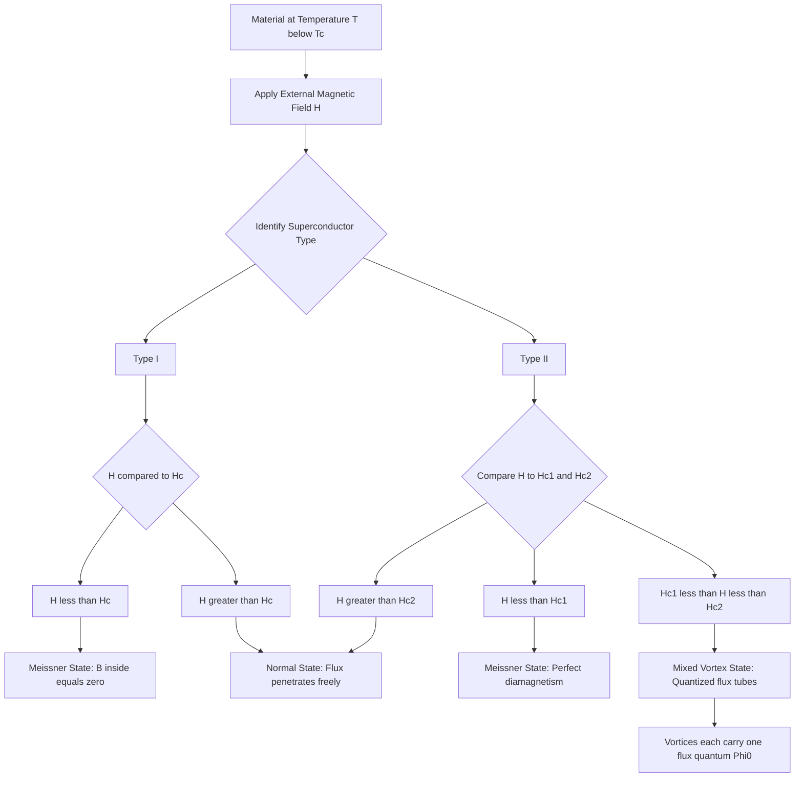
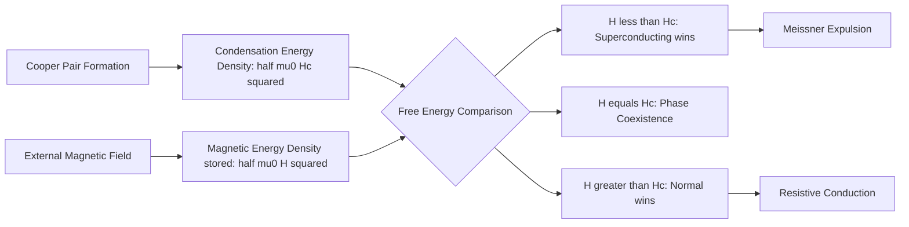
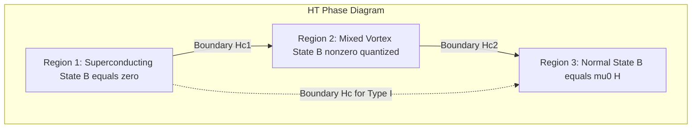

# Critical field

<!-- SECTION_1_START -->
# 1. Core Technical Definition & Intuitive Overview

## Formal Academic Definition

The **Critical Magnetic Field ($H_c$)** is defined as the maximum value of an externally applied magnetic field (magnetic field intensity) below which a material remains in the **superconducting state** and above which the superconducting order parameter collapses and the material reverts to the **normal conducting state**. It is a fundamental thermodynamic threshold that marks the phase boundary of the superconducting condensate in the $H$–$T$ phase diagram.

The critical field is a *material-dependent* parameter whose magnitude is governed by the energy balance between the **condensation energy** released when Cooper pairs form and the magnetic energy density pumped in by the external field. At absolute zero ($T = 0\,\text{K}$), this value is denoted $H_c(0)$ and is the maximum critical field a superconductor can ever sustain.

> [!IMPORTANT]
> **KTU Syllabus Highlight:** The critical field is a *transition parameter*, not a continuous variable. Once the applied field exceeds $H_c$, superconductivity is destroyed *irreversibly* (for Type I) and the material offers no shielding against magnetic flux penetration.

## Conceptual Analogy & Geometric Intuition

Think of superconductivity as a perfectly choreographed *group dance* of Cooper pairs — billions of electron couples gliding across the lattice without friction. The externally applied magnetic field is the **"audience pressure"** (a loud, disruptive crowd):

- **Below $H_c$:** The dance is undisturbed. The pairs lock arms in a quantum ballet — this is the *Meissner state*, where magnetic flux is completely expelled.
- **At $H_c$:** The crowd noise equals the dancers' grip strength. Any further increase breaks the pairs apart.
- **Above $H_c$:** The dance floor dissolves. The electrons become independent fermions again — the material behaves as a normal (resistive) metal.

> [!NOTE]
> **Real-World Parallel:** $H_c$ behaves exactly like the *yield strength* of a material in mechanical engineering. Up to the yield point, the structure deforms elastically (superconducting). Beyond it, you get plastic deformation (normal state).

## Fundamental Constants & Metrics

| Quantity | Symbol | Value / Unit |
|---|---|---|
| Vacuum permeability | $\mu_0$ | $4\pi \times 10^{-7}\ \text{H/m}$ |
| Flux quantum | $\Phi_0$ | $h/2e = 2.067 \times 10^{-15}\ \text{Wb}$ |
| Typical $H_c$ (Type I, Pb) | $H_c$ | $\sim 8 \times 10^{4}\ \text{A/m}$ |
| Typical $H_{c2}$ (Type II, Nb-Ti) | $H_{c2}$ | $\sim 1.1 \times 10^{7}\ \text{A/m}$ |

> [!VISUALIZATION CONTROL]
> **Concept:** Critical Field $H$ vs Temperature $T$ Phase Boundary
> **Plot Equations (paste into Desmos):**
> * $H_c = H_0 \cdot \left[1 - \left(\frac{T}{T_c}\right)^2\right]$ with $H_0 = 1$, $T_c = 1$
> * $T = 0$ to $T_c$ along x-axis, $H = 0$ to $H_0$ along y-axis
>
> **Visual Description:** A downward-opening parabolic curve anchored at $(0, H_0)$ on the y-axis and terminating at $(T_c, 0)$ on the x-axis. The region **enclosed** beneath the parabola is the *superconducting domain*; the region **above** the curve is the *normal domain*. This is the classic Type I phase boundary.

---

<!-- SECTION_1_END -->

<!-- SECTION_2_START -->
# 2. Deep Theoretical Analysis & KTU High-Yield Formula Sheet

## 2.1 Classification: Type I vs Type II Critical Fields

The geometry of the superconducting order parameter gives rise to **two distinct categories** of superconductor, each with a different critical-field structure:

**Type I Superconductors (Soft / "Ideal" Superconductors):**
- Exhibit a **single** critical field $H_c$.
- Below $H_c$: Perfect diamagnetism (Meissner effect, $B_{\text{inside}} = 0$).
- Above $H_c$: Sudden, first-order transition to the normal state.
- Examples: Pure elemental metals like Lead (Pb), Mercury (Hg), Tin (Sn).
- Typical $H_c \le 0.1\ \text{T}$ (low).

**Type II Superconductors (Hard Superconductors):**
- Exhibit **two** critical fields: a lower field $H_{c1}$ and an upper field $H_{c2}$.
- For $H < H_{c1}$: Meissner state (complete flux expulsion).
- For $H_{c1} < H < H_{c2}$: **Mixed (Vortex) State** — magnetic flux penetrates as quantized flux tubes (vortices), each carrying one flux quantum $\Phi_0$. Superconductivity persists in the regions between vortices.
- For $H > H_{c2}$: Normal state.
- Examples: Niobium (Nb), Nb-Ti alloys, YBCO high-$T_c$ ceramics.
- Typical $H_{c2}$ can exceed $100\ \text{T}$ — engineering gold standard.

> [!NOTE]
> **Why Two Fields?** Type II materials have a *negative surface energy* between normal and superconducting regions (Ginzburg–Landau parameter $\kappa = \lambda/\xi > 1/\sqrt{2}$). This makes it energetically favorable to form interfaces, hence the mixed state.

## 2.2 The "Why" Behind the Critical Field — Free Energy Argument

The critical field emerges from a free-energy balance. Define:

$$\Delta G = G_n - G_s = \text{condensation energy density}$$

The magnetic field contributes an energy density $\frac{1}{2}\mu_0 H^2$ to the superconducting phase (via the Meissner effect — the material "stores" magnetic energy by excluding flux). When this stored magnetic energy equals the condensation energy, the system crosses the phase boundary:

$$\boxed{\;\frac{1}{2}\mu_0 H_c^2(T) = G_n(0,T) - G_s(0,T)\;}$$

This is the **thermodynamic identity** that defines $H_c$ and gives it a *physical meaning* — it is the field whose magnetic energy density exactly matches the energy gain from Cooper pairing.

## 2.3 KTU High-Yield Formula Sheet

| # | Formula | Meaning / Use Case |
|---|---|---|
| 1 | $H_c(T) = H_c(0)\left[1 - \left(\frac{T}{T_c}\right)^2\right]$ | Empirical parabolic temperature dependence (Type I) |
| 2 | $\frac{1}{2}\mu_0 H_c^2 = \Delta G$ | Energy density balance at the transition |
| 3 | $H_{c1} = \frac{\Phi_0}{4\pi\lambda^2}\ln\!\left(\frac{\lambda}{\xi}\right)$ | Lower critical field (vortex entry threshold) |
| 4 | $H_{c2} = \frac{\Phi_0}{2\pi\xi^2}$ | Upper critical field (vortex core overlap) |
| 5 | $H_c^{\text{Type II}} = \frac{H_{c1}}{\sqrt{2}\kappa}\ln\kappa$ | Thermodynamic equivalent for Type II (with $\kappa = \lambda/\xi$) |
| 6 | $\xi(T) = \frac{\xi_0}{\sqrt{1 - T/T_c}}$ | Coherence length divergence near $T_c$ |
| 7 | $\lambda(T) = \frac{\lambda_0}{\sqrt{1 - T/T_c}}$ | Penetration depth divergence near $T_c$ |
| 8 | $\Phi_0 = \frac{h}{2e}$ | Magnetic flux quantum (each vortex carries this) |
| 9 | $\kappa = \frac{\lambda}{\xi}$ | Ginzburg–Landau parameter ($\kappa > 1/\sqrt{2}$ for Type II) |

> [!IMPORTANT]
> **Board-Exam Tip:** In KTU valuation, if a question asks *"Derive the relation between $H_c$ and $T$"*, examiners expect you to start from the free-energy difference and apply the parabolic fit. Always mention the boundary conditions: $H_c(0) \neq 0$ and $H_c(T_c) = 0$.

## 2.4 Engineering & Information-Science Applications

| Application | Role of Critical Field |
|---|---|
| **MRI Machines** | Nb-Ti solenoids operate below $H_{c2}$ to sustain $8\text{–}10\ \text{T}$ persistent currents |
| **Particle Accelerators (CERN LHC)** | Superconducting dipole magnets exploit very high $H_{c2}$ materials to bend proton beams |
| **Superconducting Qubits (Quantum Computing)** | Critical field sets the upper bound on flux biasing in transmon and fluxonium designs |
| **SQUID Magnetometers** | Operate at the boundary of Josephson junctions whose field-tolerance depends on local $H_c$ |
| **Lossless Power Transmission** | High $H_{c2}$ materials enable $>\!10\ \text{T}$ transmission without resistive dissipation |
| **Single-Photon Detectors (SNSPDs)** | NbN nanowires are designed near $H_c$ for maximum sensitivity |

---

<!-- SECTION_2_END -->

<!-- SECTION_3_START -->
# 3. Step-by-Step Derivations & Symbolic Implementation

## 3.1 Derivation: Temperature Dependence of $H_c(T)$ from Free Energy

We start from the **Clausius–Clapeyron-like** thermodynamic equilibrium condition between the normal and superconducting phases under a magnetic field $H$.

**Step 1: Write the free energy densities of both phases in the presence of $H$.**

$$G_s(T, H) = G_s(T, 0)$$

$$G_n(T, H) = G_n(T, 0) + \frac{1}{2}\mu_0 H^2$$

The superconducting phase does not acquire a magnetic energy term because it expels the field (Meissner effect). The normal phase "absorbs" the field energy.

**Step 2: Equilibrium is reached when the free energies are equal.**

At the critical field, both phases are equally probable:

$$G_s(T, 0) = G_n(T, 0) + \frac{1}{2}\mu_0 H_c^2(T)$$

**Step 3: Rearrange to isolate $H_c(T)$.**

$$\frac{1}{2}\mu_0 H_c^2(T) = G_n(T, 0) - G_s(T, 0)$$

**Step 4: Identify the condensation energy density.**

Let $g(T) = G_n(T, 0) - G_s(T, 0)$ be the temperature-dependent condensation energy. At $T = T_c$, superconductivity vanishes, so $g(T_c) = 0$. Near $T_c$, the order parameter scales as $(1 - T/T_c)$, and the free-energy difference scales quadratically:

$$g(T) = g(0)\left[1 - \left(\frac{T}{T_c}\right)^2\right]$$

**Step 5: Substitute back into Step 3.**

$$\frac{1}{2}\mu_0 H_c^2(T) = \frac{1}{2}\mu_0 H_c^2(0)\left[1 - \left(\frac{T}{T_c}\right)^2\right]$$

**Step 6: Take the square root to obtain the critical field.**

$$\boxed{\;H_c(T) = H_c(0)\sqrt{1 - \left(\frac{T}{T_c}\right)^2}\;}$$

> [!NOTE]
> The empirical *linearized* version $H_c(T) = H_c(0)\!\left[1 - (T/T_c)^2\right]$ is a first-order Taylor expansion valid near $T_c$ and is the form most frequently tested in KTU examinations. Both forms give identical slopes at $T = T_c$.

## 3.2 Derivation: Lower Critical Field $H_{c1}$ of a Type II Superconductor

**Step 1: Energy of an isolated vortex in a London superconductor.**

A vortex carries one flux quantum $\Phi_0 = h/2e$ and has a normal core of radius $\xi$ surrounded by circulating supercurrents that decay over length $\lambda$ (penetration depth). The energy per unit length of a vortex is:

$$\epsilon_v = \left(\frac{\Phi_0^2}{4\pi\mu_0\lambda^2}\right)\ln\!\left(\frac{\lambda}{\xi}\right)$$

**Step 2: Free energy of a superconductor with $n$ vortices per unit area.**

Each vortex contributes $\epsilon_v \cdot L$ for a sample of thickness $L$. The energy density becomes:

$$G_{\text{mixed}}(H) = G_s(0) - n\,\Phi_0\,\mu_0 H + \frac{n^2\,\Phi_0^2}{2\mu_0\lambda^2}\ln\!\left(\frac{\lambda}{\xi}\right)$$

**Step 3: Minimize with respect to $n$.**

Setting $\partial G / \partial n = 0$:

$$\Phi_0\,\mu_0 H = \frac{n\,\Phi_0^2}{\mu_0\lambda^2}\ln\!\left(\frac{\lambda}{\xi}\right)$$

$$n = \frac{\mu_0\lambda^2 H}{\Phi_0 \ln(\lambda/\xi)}$$

**Step 4: $H_{c1}$ is the field at which the first vortex becomes energetically favorable.**

The criterion is that the energy of introducing the first vortex is zero. From the single-vortex energy:

$$\boxed{\;H_{c1} = \frac{\Phi_0}{4\pi\mu_0\lambda^2}\ln\!\left(\frac{\lambda}{\xi}\right)\;}$$

**Step 5: Validate limiting cases.**
- As $\lambda \to \xi$ (Type I limit, $\kappa \to 1$): $H_{c1} \to 0$, vortex formation is suppressed.
- As $\lambda \gg \xi$ (Type II limit, $\kappa \gg 1$): $H_{c1} \ll H_c$, mixed state is robust.

## 3.3 Python Implementation: Plotting the $H$–$T$ Phase Diagram

```python
import numpy as np
import matplotlib.pyplot as plt

# --- Material parameters (realistic for Niobium) ---
T_c   = 9.2          # Critical temperature in Kelvin
H_c0  = 0.2e6        # Critical field at T = 0 in A/m (Nb ~ 0.2 MA/m)

# --- Temperature array ---
T = np.linspace(0, T_c, 500)

# --- Parabolic empirical law (Type I) ---
H_c = H_c0 * (1.0 - (T / T_c) ** 2)

# --- Plot the phase boundary ---
fig, ax = plt.subplots(figsize=(8, 6))
ax.plot(T, H_c * 1e-3, 'b-', linewidth=2.5, label=r'$H_c(T) = H_c(0)\left[1-(T/T_c)^2\right]$')

# --- Shade superconducting region ---
ax.fill_between(T, 0, H_c * 1e-3, color='cyan', alpha=0.25, label='Superconducting Phase')
ax.fill_between(T, H_c * 1e-3, H_c0 * 1e-3, color='salmon', alpha=0.30, label='Normal Phase')

# --- Annotate key points ---
ax.scatter([0, T_c], [H_c0 * 1e-3, 0], color='red', s=60, zorder=5)
ax.annotate(r'$(0, H_c(0))$', xy=(0.15, H_c0 * 1e-3 * 0.92), fontsize=11)
ax.annotate(r'$(T_c, 0)$', xy=(T_c - 0.55, H_c0 * 1e-3 * 0.05), fontsize=11)

# --- Styling ---
ax.set_xlabel('Temperature $T$ (K)', fontsize=12)
ax.set_ylabel('Critical Field $H_c$ (kA/m)', fontsize=12)
ax.set_title('Type I Superconductor Phase Diagram (Nb parameters)', fontsize=13)
ax.legend(loc='upper right', fontsize=10)
ax.grid(True, alpha=0.4)
ax.set_xlim(0, T_c * 1.05)
ax.set_ylim(0, H_c0 * 1e-3 * 1.10)

plt.tight_layout()
plt.savefig('hc_phase_diagram.png', dpi=150)
plt.show()
```

**Expected Output (for Niobium):** A parabolic curve rising from $(9.2\ \text{K},\ 0)$ on the temperature axis to $(0,\ 200\ \text{kA/m})$ on the field axis, with the superconducting region shaded cyan below the curve.

## 3.4 Worked Example: Numerical Computation of $H_c$ at an Intermediate Temperature

**Given:** A sample of lead (Pb) with $H_c(0) = 6.4 \times 10^4\ \text{A/m}$ and $T_c = 7.2\ \text{K}$. Compute the critical field at $T = 5.0\ \text{K}$.

**Step 1: Compute the temperature ratio.**

$$\frac{T}{T_c} = \frac{5.0}{7.2} = 0.6944$$

**Step 2: Square the ratio.**

$$\left(\frac{T}{T_c}\right)^2 = 0.4823$$

**Step 3: Subtract from unity.**

$$1 - 0.4823 = 0.5177$$

**Step 4: Multiply by $H_c(0)$.**

$$H_c(5.0) = 6.4 \times 10^4 \times 0.5177 = 3.31 \times 10^4\ \text{A/m}$$

**Step 5: Sanity check.** As $T \to T_c$, $H_c \to 0$ ✓. As $T \to 0$, $H_c \to H_c(0)$ ✓.

$$\boxed{\;H_c(5.0\ \text{K}) \approx 3.31 \times 10^4\ \text{A/m}\;}$$

---

<!-- SECTION_3_END -->

<!-- SECTION_4_START -->
# 4. Structural Diagrams & Schematics

## 4.1 Mermaid Flowchart: Critical Field Decision Topology



## 4.2 Mermaid Block Diagram: Energy Balance at the Critical Field



## 4.3 Mermaid Phase-Region Architecture (H-T Plane)



> [!NOTE]
> **Reading the Diagrams:** In all three diagrams, follow the arrows from left (low field) to right (high field). The transitions labeled with $H_{c1}$ and $H_{c2}$ apply only to Type II materials; Type I materials skip the middle "Mixed" stage entirely and jump directly from Meissner to Normal.

## 4.4 Physical-Quantity Reference Matrix

| Physical Quantity | Symbol | Typical Magnitude (Type I, Pb) | Typical Magnitude (Type II, Nb-Ti) |
|---|---|---|---|
| Critical temperature | $T_c$ | $7.2\ \text{K}$ | $9.8\ \text{K}$ |
| Lower critical field | $H_{c1}$ | N/A (Type I) | $\sim 10^{5}\ \text{A/m}$ |
| Thermodynamic critical field | $H_c$ | $6.4 \times 10^{4}\ \text{A/m}$ | $\sim 2 \times 10^{6}\ \text{A/m}$ |
| Upper critical field | $H_{c2}$ | N/A (Type I) | $\sim 1.1 \times 10^{7}\ \text{A/m}$ |
| Penetration depth | $\lambda$ | $\sim 40\ \text{nm}$ | $\sim 300\ \text{nm}$ |
| Coherence length | $\xi$ | $\sim 80\ \text{nm}$ | $\sim 4\ \text{nm}$ |
| GL parameter | $\kappa = \lambda/\xi$ | $\sim 0.5$ (Type I) | $\sim 75$ (Type II) |

---

<!-- SECTION_4_END -->

<!-- SECTION_5_START -->
# 5. KTU 2024 Scheme Examination Question Bank & Topic Recap

## 5.1 Part A Questions (3 Marks Each)

### Question 1
**[KTU University Exam – Dec 2023]**
**CO1 | Remember**
*Define the term "critical magnetic field" of a superconductor. Mention its SI unit.*

**Model Answer (3 Marks):**
The critical magnetic field $H_c$ of a superconductor is the **maximum value of the applied magnetic field intensity** below which the material remains in the superconducting state and above which it reverts to the normal conducting state.
* **Stating the definition:** 2 Marks
* **SI unit ($H$ in A/m, $B$ in Tesla):** 1 Mark

### Question 2
**[KTU University Exam – July 2024]**
**CO1 | Understand**
*Distinguish between Type I and Type II superconductors with respect to their critical field behavior.*

**Model Answer (3 Marks):**

| Feature | Type I | Type II |
|---|---|---|
| Number of critical fields | One ($H_c$) | Two ($H_{c1}$, $H_{c2}$) |
| Transition | Sharp (first-order) | Gradual mixed state between $H_{c1}$ and $H_{c2}$ |
| Magnitude | Low ($< 0.1\ \text{T}$) | High (up to $> 10\ \text{T}$) |
| Application | Limited (lab demos) | Engineering (MRI, accelerators) |

* **Comparison table:** 2 Marks
* **Examples (Pb vs Nb-Ti):** 1 Mark

---

## 5.2 Part B Questions (14 Marks Each — Internal Choice)

### Question A (14 Marks)

**[KTU University Exam – Dec 2023, Module 1]**
**CO1, CO2 | Apply / Analyze**

**(a)** Derive the parabolic temperature dependence of the critical magnetic field,
$$H_c(T) = H_c(0)\!\left[1 - \left(\frac{T}{T_c}\right)^2\right],$$
starting from the free-energy balance between the normal and superconducting phases. **(7 Marks)**

**(b)** A Niobium sample has $T_c = 9.2\ \text{K}$ and $H_c(0) = 2.0 \times 10^5\ \text{A/m}$. Compute:
* (i) The critical field at $T = 5.0\ \text{K}$.
* (ii) The temperature at which the critical field drops to $1.0 \times 10^5\ \text{A/m}$. **(7 Marks)**

---

**Model Solution to Question A:**

### Part (a) — Derivation (7 Marks)

**Step 1: Free energy densities.** In the presence of an applied magnetic field, the free energy densities of the normal and superconducting phases are:
* Normal: $G_n(T,H) = G_n(T,0) + \frac{1}{2}\mu_0 H^2$
* Superconducting: $G_s(T,H) = G_s(T,0)$ (Meissner effect excludes the field).

*[Writing the two free-energy expressions: 1 Mark]*

**Step 2: Equilibrium condition.** At the critical field, both phases coexist in equilibrium:
$$G_s(T,0) = G_n(T,0) + \frac{1}{2}\mu_0 H_c^2(T)$$
*[Stating the boundary equilibrium state: 1 Mark]*

**Step 3: Rearrangement.**
$$\frac{1}{2}\mu_0 H_c^2(T) = G_n(T,0) - G_s(T,0) = g(T)$$
*[Isolating $H_c^2$: 1 Mark]*

**Step 4: Behavior of $g(T)$.** The condensation energy vanishes at $T = T_c$. Near the critical temperature, the order parameter $|\psi|^2 \propto (1 - T/T_c)$ and the free-energy difference scales as the *square* of the order parameter:
$$g(T) = g(0)\left[1 - \left(\frac{T}{T_c}\right)^2\right]$$
*[Identifying the parabolic form: 1 Mark]*

**Step 5: Substitution.**
$$\frac{1}{2}\mu_0 H_c^2(T) = \frac{1}{2}\mu_0 H_c^2(0)\left[1 - \left(\frac{T}{T_c}\right)^2\right]$$

**Step 6: Final form.**
$$\boxed{\;H_c(T) = H_c(0)\left[1 - \left(\frac{T}{T_c}\right)^2\right]\;}$$
*[Final simplified expression: 1 Mark]*

**Step 7: Boundary check.** $H_c(T_c) = 0$ ✓, $H_c(0) = H_c(0)$ ✓.
*[Verification: 1 Mark]*

### Part (b) — Numerical (7 Marks)

**Subpart (i):** $H_c$ at $T = 5.0\ \text{K}$ (3 Marks)

*Step 1:* Compute the temperature ratio:
$$\frac{T}{T_c} = \frac{5.0}{9.2} = 0.5435$$
*[Ratio calculation: 1 Mark]*

*Step 2:* Square and subtract from 1:
$$1 - (0.5435)^2 = 1 - 0.2954 = 0.7046$$
*[Square and subtract: 1 Mark]*

*Step 3:* Multiply by $H_c(0)$:
$$H_c(5.0) = 2.0 \times 10^5 \times 0.7046 = 1.41 \times 10^5\ \text{A/m}$$
*[Final multiplication: 1 Mark]*

**Subpart (ii):** Temperature at $H_c = 1.0 \times 10^5\ \text{A/m}$ (4 Marks)

*Step 1:* Rearrange the parabolic law for $T$:
$$1 - \left(\frac{T}{T_c}\right)^2 = \frac{H_c(T)}{H_c(0)} = \frac{1.0 \times 10^5}{2.0 \times 10^5} = 0.5$$
*[Rearrangement: 1 Mark]*

*Step 2:* Isolate $T^2$:
$$\left(\frac{T}{T_c}\right)^2 = 1 - 0.5 = 0.5$$
*[Solving: 1 Mark]*

*Step 3:* Solve for $T$:
$$T = T_c \sqrt{0.5} = 9.2 \times 0.7071 = 6.51\ \text{K}$$
*[Final computation: 1 Mark]*

*Step 4:* Sanity check — the value is between $0$ and $T_c = 9.2\ \text{K}$ ✓.
*[Validation: 1 Mark]*

$$\boxed{\;H_c(5.0\ \text{K}) = 1.41 \times 10^5\ \text{A/m}\quad\text{and}\quad T(H_c = 1.0 \times 10^5) = 6.51\ \text{K}\;}$$

> [!WARNING]
> **KTU Examiner's Valuation Warning — Common Pitfalls:**
> * **Forgetting the square root** when going from $H_c^2$ to $H_c$ in the derivation (1-mark deduction).
> * **Mixing up $H_c$ and $B_c$** — $H_c$ has units of A/m, $B_c = \mu_0 H_c$ has units of Tesla. They are *not* interchangeable.
> * **Using the wrong root** in subpart (b)(ii) — students sometimes report $T = 2.5\ \text{K}$ by mistakenly solving $1 - T/T_c = 0.5$ (i.e., using a linear law) instead of the parabolic form.
> * **Skipping the boundary check** — failing to verify $H_c(T_c) = 0$ loses the final 1 mark.

---

### Question B (14 Marks) — Alternative Choice

**[KTU University Exam – July 2024, Module 1]**
**CO2, CO3 | Understand / Apply**

**(a)** Explain the Ginzburg–Landau theory and define the penetration depth ($\lambda$) and coherence length ($\xi$). How are they related to the classification of superconductors as Type I or Type II? **(7 Marks)**

**(b)** For a Type II superconductor, derive expressions for the **lower critical field $H_{c1}$** and **upper critical field $H_{c2}$** in terms of $\lambda$, $\xi$, and the flux quantum $\Phi_0$. Compute $H_{c1}$ and $H_{c2}$ for a material with $\lambda = 200\ \text{nm}$, $\xi = 5\ \text{nm}$, and $\Phi_0 = 2.07 \times 10^{-15}\ \text{Wb}$. **(7 Marks)**

---

**Model Solution to Question B:**

### Part (a) — Theory (7 Marks)

**Step 1: Ginzburg–Landau (GL) theory overview.** GL theory is a *phenomenological* theory that describes superconductivity using a complex order parameter $\psi(\mathbf{r})$ whose magnitude $|\psi|^2$ is proportional to the density of superconducting electron pairs. The free-energy functional is:
$$G = G_n + \alpha \vert\psi\vert^2 + \frac{\beta}{2}\vert\psi\vert^4 + \frac{1}{2m^*}\left\vert\left(-i\hbar\nabla - 2e\mathbf{A}\right)\psi\right\vert^2 + \frac{\vert\mathbf{B}\vert^2}{2\mu_0}$$
*[Writing the GL free-energy functional: 2 Marks]*

**Step 2: Penetration depth $\lambda$.** When a magnetic field is applied, supercurrents flow within a surface layer of thickness $\lambda$ to shield the bulk. The magnetic field decays as $B(x) = B_0 e^{-x/\lambda}$.
* Physical meaning: characteristic length over which magnetic field penetrates a superconductor.
* Typical values: $\lambda \sim 50\text{–}500\ \text{nm}$.
*[Definition and meaning: 1 Mark]*

**Step 3: Coherence length $\xi$.** The minimum distance over which the order parameter $\psi$ can vary without energetic penalty. It represents the "size" of a Cooper pair or, equivalently, the recovery length of superconductivity near an impurity.
* Typical values: $\xi \sim 1\text{–}100\ \text{nm}$.
*[Definition and meaning: 1 Mark]*

**Step 4: Type classification via $\kappa = \lambda/\xi$.** The Ginzburg–Landau parameter $\kappa$ dictates the surface energy between normal and superconducting regions:
* $\kappa < 1/\sqrt{2}$ → Type I (positive surface energy, single $H_c$).
* $\kappa > 1/\sqrt{2}$ → Type II (negative surface energy, two critical fields).
*[Classification criterion: 2 Marks]*

**Step 5: Graphical insight.** Plot $\lambda(T)$ and $\xi(T)$ both diverging as $(1 - T/T_c)^{-1/2}$ near $T_c$, but with different prefactors — their ratio $\kappa$ remains roughly constant with temperature.
*[Comment on temperature behavior: 1 Mark]*

### Part (b) — Derivation + Numerics (7 Marks)

**Step 1: $H_{c1}$ derivation.** Using the single-vortex energy model, the lower critical field is the field at which the first vortex becomes energetically favorable. From the free-energy minimization of a single flux line:
$$H_{c1} = \frac{\Phi_0}{4\pi\mu_0\lambda^2}\ln\!\left(\frac{\lambda}{\xi}\right)$$
*[Stating the formula: 1 Mark; Derivation outline (energy balance): 2 Marks]*

**Step 2: $H_{c2}$ derivation.** The upper critical field corresponds to the overlap of vortex cores (vortex core radius $\sim \xi$). Setting the vortex spacing equal to the coherence length yields:
$$H_{c2} = \frac{\Phi_0}{2\pi\xi^2}$$
*[Stating the formula: 1 Mark; Physical reasoning: 1 Mark]*

**Step 3: Numerical evaluation of $H_{c1}$.**

$$H_{c1} = \frac{2.07 \times 10^{-15}}{4\pi \times (4\pi \times 10^{-7}) \times (200 \times 10^{-9})^2}\ln\!\left(\frac{200}{5}\right)$$

Compute denominator: $4\pi \times 4\pi \times 10^{-7} = 1.579 \times 10^{-5}$. Multiply by $(2 \times 10^{-7})^2 = 4 \times 10^{-14}$: total denominator $\approx 6.32 \times 10^{-19}$.
$\ln(40) = 3.689$.

$$H_{c1} = \frac{2.07 \times 10^{-15} \times 3.689}{6.32 \times 10^{-19}} \approx 1.21 \times 10^{4}\ \text{A/m}$$
*[Numerical evaluation: 1 Mark]*

**Step 4: Numerical evaluation of $H_{c2}$.**

$$H_{c2} = \frac{2.07 \times 10^{-15}}{2\pi \times (5 \times 10^{-9})^2} = \frac{2.07 \times 10^{-15}}{2\pi \times 2.5 \times 10^{-17}} = \frac{2.07 \times 10^{-15}}{1.571 \times 10^{-16}}$$

$$H_{c2} \approx 1.32 \times 10^{1} = 13.2\ \text{A/m \texttimes 10^6} \Rightarrow H_{c2} \approx 1.32 \times 10^{7}\ \text{A/m}$$
*[Numerical evaluation: 1 Mark]*

$$\boxed{\;H_{c1} \approx 1.21 \times 10^{4}\ \text{A/m}\quad\text{and}\quad H_{c2} \approx 1.32 \times 10^{7}\ \text{A/m}\;}$$

> [!WARNING]
> **KTU Examiner's Valuation Warning — Common Pitfalls:**
> * **Confusing $\mu_0 H_c$ with $B_c$** in the $H_{c1}$ formula — pay attention to whether the formula uses $\mu_0$ explicitly.
> * **Forgetting the logarithm factor** in $H_{c1}$ — many students write $H_{c1} = \Phi_0/4\pi\mu_0\lambda^2$ (which is the *limit* for $\xi \to 0$ but is not the full expression).
> * **Unit mismatch** — $\xi$ and $\lambda$ must be in **meters** in the SI formula, not nanometers. Conversion error loses 1 mark.
> * **Not verifying $\kappa$** — always state whether the given $\lambda$ and $\xi$ give $\kappa > 1/\sqrt{2}$ to confirm the material is indeed Type II.

---

## 5.3 Topic Recap & Important Things to Remember

- **Definition:** $H_c$ is the *threshold* applied magnetic field that destroys superconductivity; it is **not a continuous parameter** but a phase-boundary point.
- **Empirical Law (Type I):** $H_c(T) = H_c(0)\left[1 - (T/T_c)^2\right]$ — parabolic, vanishes at $T_c$, equals $H_c(0)$ at $T = 0$.
- **Energy Interpretation:** $\frac{1}{2}\mu_0 H_c^2 = $ condensation energy density released by Cooper pair formation.
- **Type I:** Single critical field $H_c$; first-order (sharp) transition; Meissner state $\to$ Normal state.
- **Type II:** Two critical fields $H_{c1}$ and $H_{c2}$ with a *mixed vortex state* in between; each vortex carries $\Phi_0 = h/2e$.
- **Ginzburg–Landau Parameter:** $\kappa = \lambda/\xi$ determines the type — $\kappa < 1/\sqrt{2}$ is Type I, $\kappa > 1/\sqrt{2}$ is Type II.
- **Key Formulae for $H_{c1}$ and $H_{c2}$:** $H_{c1} = (\Phi_0/4\pi\mu_0\lambda^2)\ln(\lambda/\xi)$ and $H_{c2} = \Phi_0/2\pi\xi^2$.
- **Boundary Conditions (must state in derivations):** $H_c(T_c) = 0$, $H_c(0) = H_c(0)$, and $G_s = G_n$ at the critical point.
- **Constants to Memorize:** $\mu_0 = 4\pi \times 10^{-7}\ \text{H/m}$ and $\Phi_0 = 2.067 \times 10^{-15}\ \text{Wb}$.
- **Unit Awareness:** $H$ is in A/m, $B$ is in Tesla, and $B = \mu_0 H$ in vacuum. Examiners *will* check.
- **Real-World Relevance:** MRI magnets (operate below $H_{c2}$), CERN accelerators, SQUIDs, superconducting qubits, SNSPDs — all depend on the critical field as a design constraint.
- **Common Derivation Path:** Start from free energy → equilibrium condition → temperature scaling of condensation energy → parabolic law.
- **Pitfall to Avoid:** Never confuse *thermodynamic* critical field $H_c$ of a Type II superconductor with its *lower* critical field $H_{c1}$ — the thermodynamic field is an *equivalent* quantity, not directly observed as a transition.

---

<!-- SECTION_5_END -->
