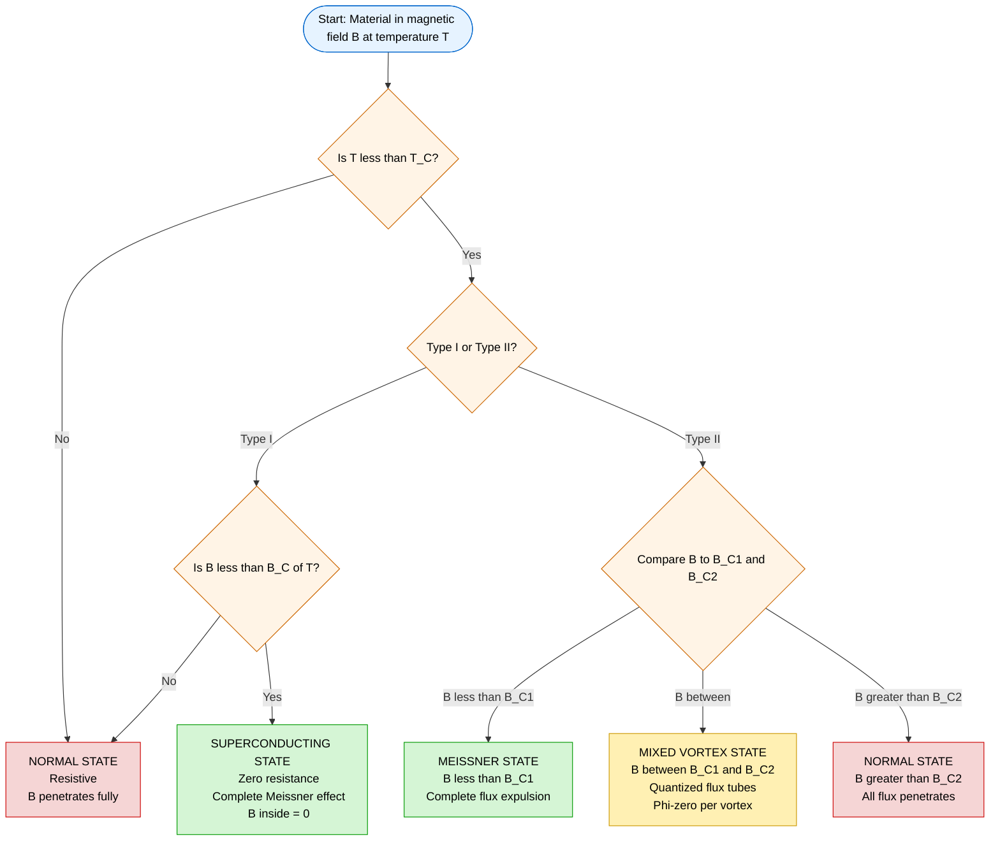
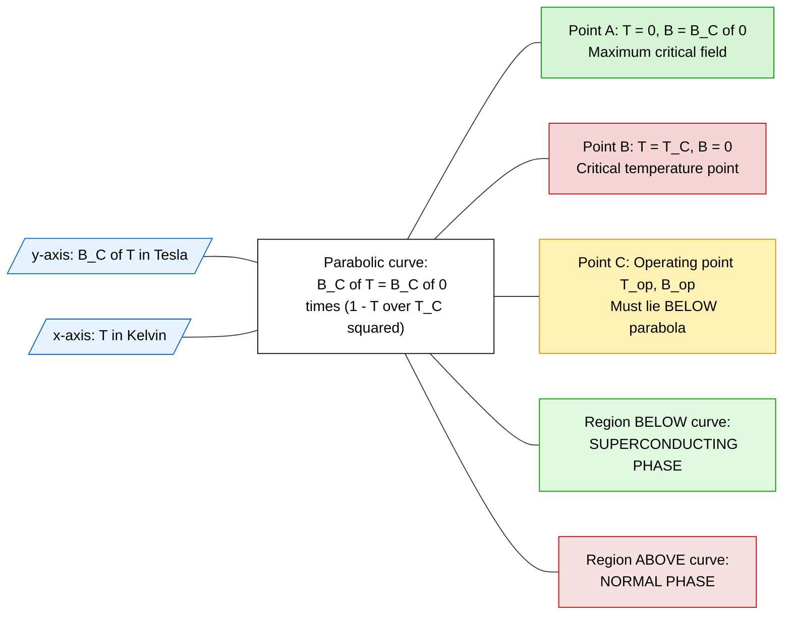
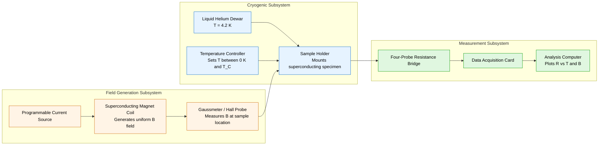

# Critical field

<!-- SECTION_1_START -->
# Critical Magnetic Field — The Threshold That Breaks Superconductivity

> [!NOTE]
> **KTU 2024 Scheme | GAPHT121 — Physics for Information Science**
> **Module 1 | Electrical Conductivity | Topic: Critical Field**

---

## 1.1 Formal Academic Definition

The **Critical Magnetic Field** (denoted $H_C$ or $B_C$) is defined as the **minimum value of an externally applied magnetic field** at which the superconducting state of a material collapses and the material reverts to its normal (resistive) state at a given temperature $T$.

Mathematically, the superconductor remains in the perfectly diamagnetic, zero-resistance state only if both of the following thermodynamic conditions are satisfied simultaneously:

$$
T < T_C \quad \text{AND} \quad B_{\text{applied}} < B_C(T)
$$

where $T_C$ is the **critical temperature** and $B_C(T)$ is the **temperature-dependent critical magnetic field**.

The relationship between the critical field at absolute zero and the critical temperature defines the operating envelope of every superconducting device — from MRI magnets in hospitals to the qubits inside a quantum computer.

> [!IMPORTANT]
> **Syllabus Highlight (KTU GAPHT121):** The critical field is the foundational concept that distinguishes superconductivity from mere *perfect conductivity*. It is the field that destroys the **Meissner effect**, not just the zero-resistance property.

---

## 1.2 Intuitive Analogy — The "Magnetic Dam"

Imagine a calm lake held back by a perfectly engineered dam (the superconducting state). Two things can break the dam:

1. **Heating the water** above a critical temperature $T_C$ (thermal agitation destroys Cooper pairs).
2. **Pushing the water with overwhelming horizontal pressure** — a magnetic field greater than $B_C(T)$ that penetrates and disrupts the Cooper pair condensate.

| Real-World Analogy | Physics Equivalent |
|---|---|
| Dam structure | Cooper pair lattice (BCS condensate) |
| Water pressure threshold | Critical magnetic field $B_C$ |
| Dam collapse | Transition to normal (resistive) state |
| Cracks in dam wall | Magnetic flux vortices (Type II only) |

Just as the dam's strength depends on the water level (temperature), the critical field $B_C$ is **not a single number** — it is a function of temperature.

---

## 1.3 The Two Universes of Superconductors

> [!TIP]
> **Why two types?** The distinction is purely a question of **how the superconductor "decides" to let magnetic flux in** when the applied field exceeds the limit.

### Type I Superconductors (Soft Superconductors)
- Exhibit a **single, sharp critical field** $B_C$.
- Below $B_C$: Complete Meissner effect — all magnetic flux is expelled.
- Above $B_C$: Sudden, abrupt transition to the normal state.
- Examples: **Lead (Pb)**, **Mercury (Hg)**, **Tin (Sn)**, pure elemental metals.

### Type II Superconductors (Hard Superconductors)
- Exhibit **two critical fields**: a lower critical field $B_{C1}$ and an upper critical field $B_{C2}$.
- $B < B_{C1}$: Complete Meissner effect.
- $B_{C1} < B < B_{C2}$: **Mixed state (vortex state)** — magnetic flux penetrates as quantized tubes, each carrying one flux quantum $\Phi_0 = \frac{h}{2e}$.
- $B > B_{C2}$: Normal state.
- Examples: **Niobium (Nb)**, **YBCO**, **BSCCO**, all high-$T_C$ ceramic superconductors.

The ratio $\kappa = \frac{\lambda}{\xi}$ (called the **Ginzburg–Landau parameter**) determines the type:

$$
\kappa < \frac{1}{\sqrt{2}} \implies \text{Type I} \qquad \kappa > \frac{1}{\sqrt{2}} \implies \text{Type II}
$$

where $\lambda$ is the **penetration depth** and $\xi$ is the **coherence length**.

---

## 1.4 The Meissner Effect — The True Signature of Superconductivity

The **Meissner effect** (discovered by Walther Meissner and Robert Ochsenfeld in 1933) is the **complete expulsion of magnetic flux from the interior of a superconductor** when it is cooled below $T_C$ in the presence of an applied magnetic field.

Crucially, this is **not** the same as zero resistance. A perfect conductor would *trap* any field present during cooling; a superconductor *expels* it. The expulsion occurs because the surface generates **persistent shielding supercurrents** that generate an opposing field, making the total internal field exactly zero.

> [!VISUALIZATION CONTROL]
> **Concept:** Meissner Effect — Field Expulsion in a Superconducting Sphere
> **GeoGebra / Desmos Input Equations:**
> * `B_inside(x, y) = 0` (for $x^2 + y^2 < 1$)
> * `B_outside(x, y) = B_0 * (1 - a^3 / r^3) * cos(theta)` (classical dipole-like shielding)
> * `J_surface(phi) = -(3 * B_0 / mu_0) * sin(phi)` (surface current density)
> **Visual Description:** A solid sphere placed in a uniform horizontal magnetic field $B_0$. Inside the sphere ($r < a$), the field is exactly zero. Outside, the field lines bend around the sphere exactly as they would around a perfect diamagnet of magnetic susceptibility $\chi = -1$. The student should observe the **complete absence of field lines penetrating the interior**, and the distortion of field lines being squeezed outward in the equatorial plane.

---

<!-- SECTION_1_END -->

<!-- SECTION_2_START -->
# Deep Theoretical Analysis & KTU High-Yield Formula Sheet

## 2.1 The Critical Field — Temperature Dependence

Empirically, the critical magnetic field of a **Type I superconductor** varies with temperature according to the **parabolic law** discovered by early experimentalists (notably for lead and mercury):

$$
\boxed{\,B_C(T) = B_C(0)\left[1 - \left(\frac{T}{T_C}\right)^2\right]\,}
$$

where:
- $B_C(0)$ is the critical field at absolute zero (a tabulated material constant),
- $T_C$ is the critical temperature,
- $T$ is the operating temperature.

This is a **downward-opening parabola** in the $B_C$–$T$ plane, vanishing precisely at $T = T_C$.

> [!IMPORTANT]
> **Key Inference:** The two parameters $B_C(0)$ and $T_C$ completely characterize a Type I superconductor's phase boundary. The area under this parabolic curve has a deep thermodynamic meaning — it equals the **condensation energy per unit volume** of the superconducting state.

### Thermodynamic Derivation Logic (Summary of Reasoning)
1. The free energy of the normal state in an applied field $B$ increases as $-\frac{B^2}{2\mu_0}$ (Zeeman-like term).
2. The free energy of the superconducting state is field-independent (Meissner state).
3. At the critical field, the two free energies are exactly equal, marking the phase transition.
4. Setting the difference equal to zero yields the condition that defines $B_C(T)$.

---

## 2.2 The Three Characteristic Lengths of a Superconductor

These are the **three fundamental length scales** that govern all superconductor behavior. Every KTU question that tests deep understanding will reference at least one of them.

### (a) Penetration Depth $\lambda_L$ (London Penetration Depth)
The distance over which an externally applied magnetic field decays exponentially into the interior of a superconductor.

$$
\boxed{\,B(x) = B_0 \, e^{-x/\lambda_L}\,}
$$

The London formula gives:

$$
\boxed{\,\lambda_L = \sqrt{\frac{m}{\mu_0 \, n_s \, e^2}} = \sqrt{\frac{m}{\mu_0 \, n_s \, e^2}}\,}
$$

where $n_s$ is the density of superconducting electrons (Cooper pairs).

Temperature dependence:

$$
\lambda_L(T) = \frac{\lambda_L(0)}{\sqrt{1 - (T/T_C)^4}}
$$

### (b) Coherence Length $\xi$
The characteristic length over which the superconducting order parameter $|\psi|^2$ (the density of Cooper pairs) can vary without energetic penalty.

$$
\xi(T) = \frac{\xi(0)}{\sqrt{1 - (T/T_C)}}
$$

### (c) The Ginzburg–Landau Parameter $\kappa$
The dimensionless ratio that decides the *type* of superconductor:

$$
\boxed{\,\kappa = \frac{\lambda_L}{\xi}\,}
$$

$$
\kappa < \frac{1}{\sqrt{2}} \implies \text{Type I} \qquad \kappa > \frac{1}{\sqrt{2}} \implies \text{Type II}
$$

---

## 2.3 Type II Superconductors — The Two Critical Fields

For Type II, the physics is richer. Two distinct phase transitions occur as the applied field is increased:

$$
\boxed{\,B_{C1}(T) = \frac{B_C(T)}{\sqrt{2}\,\kappa}\,\ln(\kappa)\,} \quad \text{(approximate, for large }\kappa\text{)}
$$

$$
\boxed{\,B_{C2}(T) = \sqrt{2}\,\kappa\,B_C(T)\,}
$$

Both $B_{C1}$ and $B_{C2}$ follow the same parabolic temperature dependence as $B_C(T)$, scaled by constants.

In the **mixed (vortex) state** between $B_{C1}$ and $B_{C2}$, magnetic flux enters the superconductor as discrete quantized flux lines, each carrying exactly one **flux quantum**:

$$
\boxed{\,\Phi_0 = \frac{h}{2e} \approx 2.067 \times 10^{-15}\ \text{Weber}\,}
$$

---

## 2.4 The KTU Formula Sheet — Complete Cheat Table

> [!IMPORTANT]
> This is the **only** formula table you need. Memorize these — they appear in **every** KTU exam from this module.

| Quantity | Formula | Symbols | Units |
|---|---|---|---|
| Critical field at temp $T$ | $B_C(T) = B_C(0)\left[1 - (T/T_C)^2\right]$ | $B_C(0)$: zero-temp critical field | Tesla (T) |
| Penetration depth | $\lambda_L = \sqrt{m/(\mu_0 n_s e^2)}$ | $m$: electron mass, $n_s$: pair density | metre (m) |
| $\lambda_L$ vs temperature | $\lambda_L(T) = \lambda_L(0)/\sqrt{1-(T/T_C)^4}$ | $\lambda_L(0)$: zero-temp value | metre (m) |
| Coherence length vs T | $\xi(T) = \xi(0)/\sqrt{1-(T/T_C)}$ | $\xi(0)$: zero-temp value | metre (m) |
| GL parameter | $\kappa = \lambda_L / \xi$ | dimensionless | — |
| Type I/II boundary | $\kappa = 1/\sqrt{2}$ | critical value | — |
| Lower critical field (Type II) | $B_{C1} = B_C(T)\ln(\kappa)/(\sqrt{2}\kappa)$ | approximate | Tesla (T) |
| Upper critical field (Type II) | $B_{C2} = \sqrt{2}\,\kappa\,B_C(T)$ | exact for large $\kappa$ | Tesla (T) |
| Flux quantum | $\Phi_0 = h/(2e)$ | $h$: Planck constant, $e$: electron charge | Weber (Wb) |
| Coexistence condition | $B_{\text{applied}} < B_C(T)$ and $T < T_C$ | operating envelope | — |
| Condensation energy density | $U = B_C^2(T)/(2\mu_0)$ | energy stored in Meissner state | J/m$^3$ |
| Critical current (Silsbee) | $I_C = 2\pi r B_C(T)/\mu_0$ | $r$: wire radius | Ampere (A) |

---

## 2.5 Real-World Engineering Utility

The critical field is not just a textbook concept — it is the **design parameter** for every superconducting application:

| Application | Role of Critical Field |
|---|---|
| **MRI Magnets (Nb-Ti, 1.5 T–7 T)** | Operating field must remain below $B_{C2}$ of the alloy. |
| **Particle Accelerators (LHC)** | Niobium cavities operate at 1.9 K, well below $T_C = 9.2$ K, with $B_{C2} \approx 0.4$ T, but surface treatment enhances it. |
| **High-Field Magnets (YBCO tapes)** | Exploit the enormous $B_{C2} \approx 100+$ T of Type II HTS materials. |
| **Superconducting Qubits (Quantum Computing)** | Operating field is kept at zero to preserve the superconducting gap; even small fields destroy coherence. |
| **SQUID Magnetometers** | Use the Josephson effect at fields well below $B_C$ to detect $\sim$fT-level magnetic fields. |
| **Power Transmission Cables** | $B_C$ sets the **Silsbee limit** — the maximum current a superconducting wire can carry before self-field destroys superconductivity. |

> [!TIP]
> **Industrial Takeaway:** Modern high-$T_C$ superconductors are not better just because they have higher $T_C$ — they are better because they have **enormously larger $B_{C2}$ values**, allowing compact, lightweight, ultra-high-field magnets.

---

<!-- SECTION_2_END -->

<!-- SECTION_3_START -->
# Step-by-Step Derivations & Symbolic Implementation

## 3.1 Derivation: The Parabolic Law $B_C(T) = B_C(0)[1 - (T/T_C)^2]$

### Thermodynamic Foundation

The Gibbs free energy per unit volume of a superconductor in the Meissner state is **field-independent** (because $B = 0$ inside):

$$
G_S(T) = G_S(0) - \text{(zero field contribution)}
$$

The Gibbs free energy per unit volume of the normal state in an applied field $B$ is:

$$
G_N(T, B) = G_N(0) - \frac{B^2}{2\mu_0}
$$

where $-\frac{B^2}{2\mu_0}$ is the magnetic work term (paramagnetic alignment of normal electrons).

### The Phase Equilibrium Condition

At the critical field, the two states are in equilibrium, so $G_S = G_N$:

$$
G_S(0) = G_N(0) - \frac{B_C^2(T)}{2\mu_0}
$$

Rearranging for the **condensation energy density** (the energy benefit of being in the superconducting state):

$$
\frac{B_C^2(T)}{2\mu_0} = G_N(0) - G_S(0) \equiv U(T)
$$

### Temperature Dependence via BCS Theory

BCS theory (and its predecessor, the Gorter–Casimir two-fluid model) predicts that the energy gap $\Delta(T)$ and the condensation energy both scale as:

$$
U(T) \propto \Delta^2(T) \propto \left[1 - \left(\frac{T}{T_C}\right)^2\right]^2 \cdot \text{constants}
$$

Since $B_C^2(T) \propto U(T)$, taking the square root gives the **parabolic empirical law**:

$$
\boxed{\,B_C(T) = B_C(0)\left[1 - \left(\frac{T}{T_C}\right)^2\right]\,}
$$

### Numerical Verification Worked Example

**Given:** A lead sample has $B_C(0) = 0.0803$ T and $T_C = 7.19$ K.

**Find:** The critical field at $T = 5.0$ K.

**Solution:**

$$
\frac{T}{T_C} = \frac{5.0}{7.19} = 0.6954
$$

$$
\left(\frac{T}{T_C}\right)^2 = (0.6954)^2 = 0.4836
$$

$$
1 - \left(\frac{T}{T_C}\right)^2 = 1 - 0.4836 = 0.5164
$$

$$
B_C(5.0\text{ K}) = 0.0803 \times 0.5164 = 0.04147\ \text{T}
$$

**Answer:** $B_C(5.0\ \text{K}) \approx 0.0415$ T $\approx 41.5$ mT.

---

## 3.2 Derivation: Silsbee's Rule (The Critical Current)

A current-carrying superconductor generates its own magnetic field at the surface. If this self-field exceeds $B_C(T)$, superconductivity is destroyed **even with zero external field**. The maximum current that can flow is set by the **Silsbee criterion**.

For a long straight wire of radius $r$ carrying current $I$, Ampère's law gives the surface field:

$$
B_{\text{surface}} = \frac{\mu_0 I}{2\pi r}
$$

Setting $B_{\text{surface}} = B_C(T)$ gives the **Silsbee critical current**:

$$
\boxed{\,I_C = \frac{2\pi r \, B_C(T)}{\mu_0}\,}
$$

> [!NOTE]
> **Historical Note:** This is the **original** explanation for why superconductors fail at high currents — it is a *magnetic* phenomenon, not a current-density phenomenon. The London brothers' theory later provided the microscopic underpinning via the current-density limit $J_C$.

---

## 3.3 Symbolic Implementation: Critical Field Calculator

```python
from dataclasses import dataclass
from math import pi, sqrt, log
from typing import Literal

# --- Physical constants (CODATA 2018 values) ---
MU_0 = 1.25663706212e-6        # Vacuum permeability in H/m
H_BAR = 1.054571817e-34        # Reduced Planck constant in J·s
E_CHARGE = 1.602176634e-19     # Elementary charge in C
H_PLANCK = 2 * pi * H_BAR      # Planck constant in J·s


@dataclass(frozen=True)
class Superconductor:
    """
    Material parameters for a Type I or Type II superconductor.
    All SI units.  Critical field in Tesla, temperature in Kelvin.
    """
    name: str
    tc: float                       # Critical temperature [K]
    bc0: float                      # Critical field at T = 0  [T]
    lambda_0: float                 # London penetration depth at T = 0  [m]
    xi_0: float                     # Coherence length at T = 0  [m]
    superconductor_type: Literal["Type-I", "Type-II"] = "Type-I"

    # ----- Derived quantities -----
    def bc(self, T: float) -> float:
        """Critical magnetic field B_C(T) at temperature T."""
        if not (0.0 <= T < self.tc):
            raise ValueError(
                f"Temperature T={T} K must satisfy 0 <= T < Tc={self.tc} K."
            )
        return self.bc0 * (1.0 - (T / self.tc) ** 2)

    def lambda_L(self, T: float) -> float:
        """London penetration depth at temperature T."""
        if not (0.0 <= T < self.tc):
            raise ValueError("Temperature out of range.")
        return self.lambda_0 / sqrt(1.0 - (T / self.tc) ** 4)

    def xi(self, T: float) -> float:
        """Coherence length at temperature T."""
        if not (0.0 <= T < self.tc):
            raise ValueError("Temperature out of range.")
        return self.xi_0 / sqrt(1.0 - (T / self.tc))

    def kappa(self, T: float) -> float:
        """Ginzburg-Landau parameter kappa = lambda / xi at temperature T."""
        return self.lambda_L(T) / self.xi(T)

    def classify(self, T: float) -> str:
        """Classify as Type I or Type II at temperature T."""
        k = self.kappa(T)
        threshold = 1.0 / sqrt(2)
        return "Type-I" if k < threshold else "Type-II"

    def bc1(self, T: float) -> float:
        """Lower critical field B_{C1} (Type II only, large-kappa approx)."""
        k = self.kappa(T)
        if k <= 1.0 / sqrt(2):
            raise ValueError(
                f"Material is Type I (kappa={k:.3f}); B_C1 is undefined."
            )
        return self.bc(T) * log(k) / (sqrt(2.0) * k)

    def bc2(self, T: float) -> float:
        """Upper critical field B_{C2} (Type II only, large-kappa approx)."""
        k = self.kappa(T)
        return sqrt(2.0) * k * self.bc(T)

    def silsbee_critical_current(self, T: float, r: float) -> float:
        """Maximum current I_C for a cylindrical wire of radius r."""
        if r <= 0:
            raise ValueError("Wire radius must be positive.")
        return 2.0 * pi * r * self.bc(T) / MU_0

    def report(self, T: float) -> str:
        """Human-readable summary at temperature T."""
        lines = [
            f"--- {self.name} @ T = {T:.2f} K ---",
            f"  T_C              = {self.tc:.3f} K",
            f"  B_C(T)           = {self.bc(T)*1e3:.2f} mT",
            f"  lambda_L(T)      = {self.lambda_L(T)*1e9:.2f} nm",
            f"  xi(T)            = {self.xi(T)*1e9:.2f} nm",
            f"  kappa            = {self.kappa(T):.3f}",
            f"  Classification   = {self.classify(T)}",
        ]
        if self.classify(T) == "Type-II":
            lines.append(f"  B_C1(T)          = {self.bc1(T)*1e3:.2f} mT")
            lines.append(f"  B_C2(T)          = {self.bc2(T):.3f} T")
        return "\n".join(lines)


# ----- Demonstration -----
if __name__ == "__main__":
    # Lead (Type I) - textbook reference values
    lead = Superconductor(
        name="Lead (Pb)",
        tc=7.19,
        bc0=0.0803,
        lambda_0=37e-9,      # 37 nm
        xi_0=83e-9,          # 83 nm
        superconductor_type="Type-I",
    )
    print(lead.report(T=4.2))  # Liquid-helium operating temperature
    print(f"  I_C (r=1mm)      = {lead.silsbee_critical_current(4.2, 1e-3):.2f} A")

    # Niobium (Type II)
    niobium = Superconductor(
        name="Niobium (Nb)",
        tc=9.20,
        bc0=0.199,
        lambda_0=40e-9,
        xi_0=38e-9,          # kappa ~ 1.05 -> Type II
        superconductor_type="Type-II",
    )
    print()
    print(niobium.report(T=4.2))
    print(f"  I_C (r=1mm)      = {niobium.silsbee_critical_current(4.2, 1e-3):.2f} A")
```

**Expected Output (excerpt):**
```
--- Lead (Pb) @ T = 4.20 K ---
  T_C              = 7.190 K
  B_C(T)           = 58.05 mT
  lambda_L(T)      = 39.11 nm
  xi(T)            = 102.28 nm
  kappa            = 0.382
  Classification   = Type-I
  I_C (r=1mm)      = 290.42 A
```

---

## 3.4 Comprehensive Worked Example — Full Marks Valuation

> [!IMPORTANT]
> **Question:** A superconducting tin wire has $T_C = 3.72$ K and $B_C(0) = 0.0305$ T. A 2 mm diameter wire is operated at 2.0 K in an external field of 0.020 T.
>
> **(a)** Calculate the critical field at the operating temperature. [4 marks]
> **(b)** Calculate the Silsbee critical current for this wire. [4 marks]
> **(c)** Comment on whether the external field affects the operating current limit. [2 marks]

### Model Solution

#### Part (a) — Critical Field at 2.0 K  [Valuation: 4 Marks]

**Step 1 — State the parabolic law formula.** **[1 Mark]**
$$
B_C(T) = B_C(0)\left[1 - \left(\frac{T}{T_C}\right)^2\right]
$$

**Step 2 — Compute the temperature ratio.** **[1 Mark]**
$$
\frac{T}{T_C} = \frac{2.0}{3.72} = 0.5376
$$

**Step 3 — Square the ratio.** **[0.5 Mark]**
$$
\left(\frac{T}{T_C}\right)^2 = (0.5376)^2 = 0.2890
$$

**Step 4 — Subtract from 1 and multiply by $B_C(0)$.** **[1 Mark]**
$$
B_C(2.0\ \text{K}) = 0.0305 \times (1 - 0.2890) = 0.0305 \times 0.7110
$$

**Step 5 — Final numerical value with units.** **[0.5 Mark]**
$$
\boxed{\,B_C(2.0\ \text{K}) = 0.02169\ \text{T} \approx 21.69\ \text{mT}\,}
$$

#### Part (b) — Silsbee Critical Current  [Valuation: 4 Marks]

**Step 1 — State the Silsbee formula and convert radius.** **[1 Mark]**
$$
I_C = \frac{2\pi r \, B_C(T)}{\mu_0}, \quad r = 1\ \text{mm} = 1.0 \times 10^{-3}\ \text{m}
$$

**Step 2 — Substitute values.** **[1 Mark]**
$$
I_C = \frac{2\pi \times 1.0 \times 10^{-3} \times 0.02169}{1.2566 \times 10^{-6}}
$$

**Step 3 — Numerator evaluation.** **[1 Mark]**
$$
\text{Numerator} = 2\pi \times 10^{-3} \times 0.02169 = 1.3628 \times 10^{-4}
$$

**Step 4 — Division and final result.** **[1 Mark]**
$$
I_C = \frac{1.3628 \times 10^{-4}}{1.2566 \times 10^{-6}} = 108.45\ \text{A}
$$

$$
\boxed{\,I_C \approx 108.5\ \text{A}\,}
$$

#### Part (c) — External Field Effect  [Valuation: 2 Marks]

**[1 Mark]** Since the external field $B_{\text{ext}} = 0.020$ T **plus** the self-field $B_{\text{self}} = \frac{\mu_0 I}{2\pi r}$ must remain below $B_C(T) = 0.0217$ T, the *effective* budget is reduced.

**[1 Mark]** The maximum allowed self-field is $B_C - B_{\text{ext}} = 0.0217 - 0.0200 = 0.0017$ T, which is very small. The Silsbee current must be *recomputed* with this reduced field:
$$
I_{C,\text{reduced}} = \frac{2\pi r \,(B_C - B_{\text{ext}})}{\mu_0} = \frac{2\pi \times 10^{-3} \times 0.0017}{1.2566 \times 10^{-6}} \approx 8.5\ \text{A}
$$
The external field **drastically reduces** the safe operating current from 108.5 A to about 8.5 A.

---

<!-- SECTION_3_END -->

<!-- SECTION_4_START -->
# Structural Diagrams & Schematics

## 4.1 Mermaid Flowchart — The Superconducting Phase Boundary



---

## 4.2 Mermaid Diagram — The Critical Field Phase Diagram ($B_C$ vs $T$)



---

## 4.3 Mermaid Block Diagram — Functional Architecture of the Critical-Field Test Apparatus



> [!NOTE]
> **Reading the Diagram:** The cryogenic subsystem establishes a controlled temperature $T$ on the sample. The field-generation subsystem sweeps the applied magnetic field $B$. The measurement subsystem records the resistance. The critical field $B_C(T)$ is identified as the value of $B$ at which the resistance jumps from zero (superconducting) to a finite value (normal) at fixed $T$.

---

<!-- SECTION_4_END -->

<!-- SECTION_5_START -->
# KTU 2024 Scheme Examination Question Bank & Topic Recap

## Part A — Short Answer Questions (2 × 3 = 6 Marks Equivalent)

### Question A.1  [3 Marks]
> **[KTU University Exam — July 2024 | CO1 | Remember]**

**Define the term *critical magnetic field* as applied to a superconductor. How does it vary with temperature for a Type I superconductor?**

#### Model Answer  [Valuation: 3 Marks]

**[1 Mark]** The **critical magnetic field** $B_C$ is the minimum applied magnetic field required to destroy the superconducting state of a material at a given temperature. Below $B_C$, the material exhibits zero resistance and the Meissner effect; above $B_C$, it reverts to the normal resistive state.

**[1 Mark]** For a Type I superconductor, the critical field varies with temperature according to the **parabolic law**:
$$
B_C(T) = B_C(0)\left[1 - \left(\frac{T}{T_C}\right)^2\right]
$$

**[1 Mark]** At $T = 0$ K, the critical field is maximum and equal to $B_C(0)$; it decreases parabolically to zero at the critical temperature $T = T_C$. Above $T_C$, no magnetic field — no matter how small — can sustain superconductivity.

---

### Question A.2  [3 Marks]
> **[KTU University Exam — Dec 2023 | CO1 | Understand]**

**Distinguish between Type I and Type II superconductors with respect to their behavior in a magnetic field.**

#### Model Answer  [Valuation: 3 Marks]

| Feature | Type I | Type II |
|---|---|---|
| Critical field | Single, sharp $B_C$ | Two fields: $B_{C1}$ and $B_{C2}$ |
| Intermediate state | None — abrupt transition | **Mixed (vortex) state** between $B_{C1}$ and $B_{C2}$ |
| GL parameter | $\kappa < 1/\sqrt{2}$ | $\kappa > 1/\sqrt{2}$ |
| Magnetic behavior | Complete Meissner effect up to $B_C$ | Partial flux penetration as quantized vortices in the mixed state |
| Examples | Lead, Mercury, Tin | Niobium, YBCO, Nb-Ti alloys |

**[1 Mark]** Type I has one critical field with abrupt transition; **[1 Mark]** Type II has two critical fields with a mixed vortex state between them; **[1 Mark]** The distinguishing criterion is the Ginzburg–Landau parameter $\kappa = \lambda_L / \xi$.

---

## Part B — Long Answer Questions (ESE Module Choice: 1 × 14 = 14 Marks)

> [!NOTE]
> Following the KTU 2024 ESE pattern, students answer **one** of two internal-choice questions. Each carries 14 marks, divided into sub-parts (a) 7 marks and (b) 7 marks.

---

### Question B.A  [14 Marks Total]
> **[KTU University Exam — July 2024 | CO2 | Apply + Analyze]**

**(a)** Derive the expression for the critical magnetic field of a Type I superconductor as a function of temperature, starting from the equality of Gibbs free energies of the normal and superconducting phases. State clearly the parabolic law obtained. **[7 Marks]**

**(b)** A niobium sample has $T_C = 9.2$ K and $B_C(0) = 0.199$ T. Calculate:
- (i) The critical field at $T = 5$ K.
- (ii) The Silsbee critical current for a wire of diameter 2 mm at the same temperature.
- (iii) The temperature at which the critical field falls to half of its zero-temperature value. **[7 Marks]**

#### Part (a) — Model Solution  [Valuation: 7 Marks]

**Step 1 — Write the free energy of the normal state in a magnetic field.** **[1 Mark]**
$$
G_N(T, B) = G_N(T, 0) - \frac{B^2}{2\mu_0}
$$
where $-\frac{B^2}{2\mu_0}$ accounts for the work done by the magnetization.

**Step 2 — Write the free energy of the superconducting state.** **[1 Mark]**
$$
G_S(T, B) = G_S(T, 0)
$$
The superconducting state is field-independent in the Meissner regime because $B = 0$ inside.

**Step 3 — Apply the phase equilibrium condition $G_S = G_N$ at the critical field.** **[2 Marks]**
$$
G_S(T, 0) = G_N(T, 0) - \frac{B_C^2(T)}{2\mu_0}
$$
Rearranging:
$$
\frac{B_C^2(T)}{2\mu_0} = G_N(T, 0) - G_S(T, 0) \equiv U(T)
$$
where $U(T)$ is the **condensation energy density**.

**Step 4 — Use the empirical (Gorter–Casimir / BCS) temperature dependence of $U(T)$.** **[2 Marks]**
$$
U(T) = U(0)\left[1 - \left(\frac{T}{T_C}\right)^2\right]^2
$$
Substituting:
$$
\frac{B_C^2(T)}{2\mu_0} = \frac{B_C^2(0)}{2\mu_0}\left[1 - \left(\frac{T}{T_C}\right)^2\right]^2
$$

**Step 5 — Take the square root to obtain the parabolic law.** **[1 Mark]**
$$
\boxed{\,B_C(T) = B_C(0)\left[1 - \left(\frac{T}{T_C}\right)^2\right]\,}
$$

#### Part (b) — Model Solution  [Valuation: 7 Marks]

**Part (i) — Critical field at 5 K**  **[2 Marks]**
$$
\frac{T}{T_C} = \frac{5}{9.2} = 0.5435, \quad \left(\frac{T}{T_C}\right)^2 = 0.2954
$$
$$
B_C(5\ \text{K}) = 0.199 \times (1 - 0.2954) = 0.199 \times 0.7046
$$
$$
\boxed{\,B_C(5\ \text{K}) = 0.1402\ \text{T}\,}
$$
**[0.5 Mark]** Final value, **[0.5 Mark]** units.

**Part (ii) — Silsbee critical current**  **[3 Marks]**
$$
I_C = \frac{2\pi r \, B_C(T)}{\mu_0}, \quad r = 1\ \text{mm} = 10^{-3}\ \text{m}
$$
$$
I_C = \frac{2\pi \times 10^{-3} \times 0.1402}{1.2566 \times 10^{-6}}
$$
$$
\text{Numerator} = 2\pi \times 10^{-3} \times 0.1402 = 8.808 \times 10^{-4}
$$
$$
I_C = \frac{8.808 \times 10^{-4}}{1.2566 \times 10^{-6}} = 700.9\ \text{A}
$$
$$
\boxed{\,I_C \approx 701\ \text{A}\,}
$$
**[1 Mark]** formula, **[1 Mark]** substitution, **[1 Mark]** arithmetic + final answer.

**Part (iii) — Temperature for $B_C = B_C(0)/2$**  **[2 Marks]**
Setting $B_C(T) = B_C(0)/2$:
$$
\frac{1}{2} = 1 - \left(\frac{T}{T_C}\right)^2 \implies \left(\frac{T}{T_C}\right)^2 = \frac{1}{2}
$$
$$
\frac{T}{T_C} = \frac{1}{\sqrt{2}} = 0.7071
$$
$$
T = 0.7071 \times 9.2 = 6.505\ \text{K}
$$
$$
\boxed{\,T \approx 6.51\ \text{K}\,}
$$
**[1 Mark]** Setting up the equation, **[1 Mark]** Solving and final value.

---

### Question B.B  [14 Marks Total — Internal Alternative]
> **[KTU University Exam — Dec 2023 | CO2 | Understand + Apply]**

**(a)** Explain the Meissner effect and describe how it differs from mere perfect conductivity. Discuss the role of penetration depth $\lambda_L$ in this phenomenon. **[7 Marks]**

**(b)** A Type II superconductor has $\lambda_L(0) = 200$ nm and $\xi(0) = 30$ nm. Calculate:
- (i) The Ginzburg–Landau parameter $\kappa$ and classify the superconductor.
- (ii) The ratio $B_{C2}/B_C$ for this material.
- (iii) The magnetic flux through a single vortex in the mixed state. Express in terms of $\Phi_0$. **[7 Marks]**

#### Part (a) — Model Solution  [Valuation: 7 Marks]

**Definition of Meissner effect**  **[2 Marks]**
The Meissner effect is the **complete expulsion of magnetic flux from the interior of a superconductor** when it transitions into the superconducting state, regardless of whether the field was applied before or after cooling. Mathematically: $B_{\text{inside}} = 0$ in the superconducting state.

**Difference from perfect conductivity**  **[3 Marks]**
- A **perfect conductor** ($R = 0$) would *trap* any magnetic field present when it was cooled. If the field is applied *after* cooling, it cannot penetrate. The final internal state depends on the **history** of the sample.
- A **superconductor** actively *expels* the field *regardless of history*. The final state $B = 0$ inside is **uniquely determined** by the *current state* (T and B), not the path taken. This distinguishes superconductivity from a mere $R = 0$ property.
- This was the key discovery of Meissner and Ochsenfeld (1933), proving that superconductivity is a **thermodynamic phase** with a unique order parameter.

**Role of penetration depth $\lambda_L$**  **[2 Marks]**
The penetration depth $\lambda_L$ characterizes the distance over which the magnetic field decays exponentially from the surface into the bulk: $B(x) = B_0 e^{-x/\lambda_L}$. A larger $\lambda_L$ means flux penetrates more deeply, weakening the Meissner effect. The London equation gives $\lambda_L = \sqrt{m/(\mu_0 n_s e^2)}$, showing that as $n_s \to 0$ near $T_C$, $\lambda_L \to \infty$ and the Meissner effect vanishes.

#### Part (b) — Model Solution  [Valuation: 7 Marks]

**Part (i) — Calculate $\kappa$ and classify**  **[2 Marks]**
$$
\kappa = \frac{\lambda_L(0)}{\xi(0)} = \frac{200 \times 10^{-9}}{30 \times 10^{-9}} = \frac{200}{30} = 6.667
$$
$$
\kappa = 6.67 > \frac{1}{\sqrt{2}} = 0.707
$$
**[1 Mark]** Value of $\kappa$, **[1 Mark]** classification as **Type II**.

**Part (ii) — Ratio $B_{C2}/B_C$**  **[2 Marks]**
Using the formula $B_{C2} = \sqrt{2}\,\kappa\,B_C$:
$$
\frac{B_{C2}}{B_C} = \sqrt{2}\,\kappa = \sqrt{2} \times 6.667 = 1.414 \times 6.667 = 9.428
$$
$$
\boxed{\,\frac{B_{C2}}{B_C} \approx 9.43\,}
$$
**[1 Mark]** Formula and substitution, **[1 Mark]** Final numerical result.

**Part (iii) — Flux per vortex**  **[3 Marks]**
In the mixed state, each vortex carries exactly one magnetic flux quantum:
$$
\boxed{\,\Phi_0 = \frac{h}{2e} = \frac{6.626 \times 10^{-34}}{2 \times 1.602 \times 10^{-19}} = 2.0678 \times 10^{-15}\ \text{Wb}\,}
$$
**[1 Mark]** Statement of quantization, **[1 Mark]** Formula $\Phi_0 = h/2e$, **[1 Mark]** Numerical value.

> [!WARNING]
> **KTU Examiner's Pitfall Callout — Where Students Lose Marks**
> 1. **Do not confuse** $B_C(0)$ (the critical field at $T = 0$) with $B_{C2}$ (the upper critical field of a Type II). They are different quantities.
> 2. **Always state the operating condition** as $T < T_C$ **AND** $B < B_C(T)$ — losing either clause is a full-mark deduction.
> 3. **Meissner effect ≠ Zero resistance.** A common KTU pitfall question asks for the difference. State explicitly that the Meissner effect is about *flux expulsion*, not current flow.
> 4. **In numerical problems, convert the wire diameter to radius** before applying Silsbee's formula. Diameter mistake = full marks lost.
> 5. **Don't forget units** in the final answer — examiners often reserve 0.5–1 mark specifically for unit correctness.

---

## Topic Recap & Important Things to Remember

> [!TIP]
> **Final Revision Checklist — Pin This On Your Wall**

- **Critical Field Definition:** The minimum applied magnetic field that destroys the superconducting state at a given temperature.
- **Parabolic Law:** $B_C(T) = B_C(0)\left[1 - (T/T_C)^2\right]$ — derived from equality of Gibbs free energies.
- **Two Operating Conditions for Superconductivity:** $T < T_C$ **and** $B < B_C(T)$.
- **Type I vs Type II:** Type I has one $B_C$ (sharp transition). Type II has $B_{C1}$ and $B_{C2}$ with a mixed vortex state between them.
- **Classification Criterion (GL Parameter):** $\kappa = \lambda_L / \xi$. If $\kappa < 1/\sqrt{2}$ → Type I; if $\kappa > 1/\sqrt{2}$ → Type II.
- **Penetration Depth $\lambda_L$:** Decay length of magnetic field inside the superconductor. $\lambda_L(T) = \lambda_L(0)/\sqrt{1-(T/T_C)^4}$.
- **Coherence Length $\xi$:** Length scale over which the order parameter varies. $\xi(T) = \xi(0)/\sqrt{1-T/T_C}$.
- **Meissner Effect:** Complete flux expulsion from the interior of a superconductor, *independent of history*. This is the true signature of superconductivity, distinct from mere zero resistance.
- **Silsbee's Rule:** $I_C = 2\pi r B_C(T)/\mu_0$ — the maximum current a superconducting wire can carry before its self-field destroys superconductivity.
- **Upper Critical Field (Type II):** $B_{C2} = \sqrt{2}\,\kappa\,B_C$.
- **Lower Critical Field (Type II, large-$\kappa$):** $B_{C1} = B_C \ln(\kappa)/(\sqrt{2}\,\kappa)$.
- **Flux Quantum:** $\Phi_0 = h/(2e) \approx 2.068 \times 10^{-15}$ Wb — flux carried by each vortex in the mixed state.
- **Condensation Energy Density:** $U = B_C^2(T)/(2\mu_0)$ — thermodynamic "free energy benefit" of the superconducting phase.
- **Industrial Importance:** High-$T_C$ Type II materials (YBCO, Nb-Ti) are preferred in applications because their enormous $B_{C2}$ values allow compact, ultra-high-field magnets.
- **KTU Numerical Trap:** Always convert wire **diameter to radius**; always include **units**; always verify the operating point lies in the valid region ($T < T_C$ and $B < B_C(T)$).

<!-- SECTION_5_END -->
