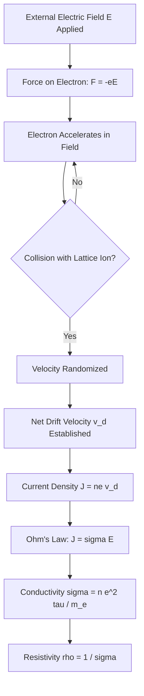
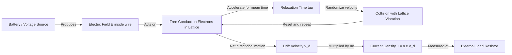
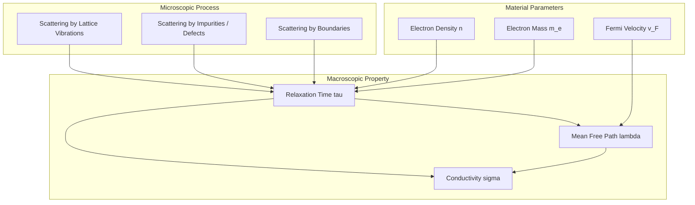
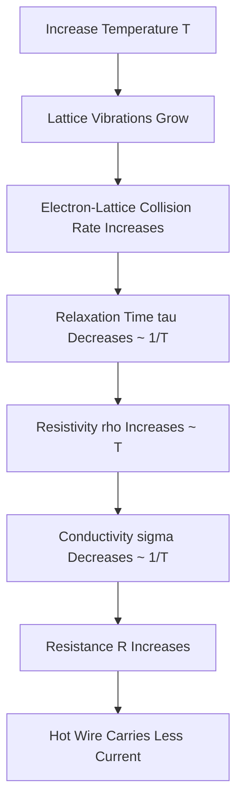

# Electrical conductivity in metals

<!-- SECTION_1_START -->
# Electrical Conductivity in Metals

> [!NOTE]
> **KTU 2024 — GAPHT121 | Module 1 | Core Definition**
> Electrical conductivity in metals describes the ability of a metallic lattice to transport **charge carriers (free conduction electrons)** in response to an applied **electric field (E)**. It is the macroscopic manifestation of **microscopic electron drift** governed by the laws of classical and quantum statistical mechanics.

## 1.1 Formal Academic Definition

Electrical conductivity ($\sigma$) is defined as the **proportionality constant** between the **current density vector ($\vec{J}$)** and the **applied electric field vector ($\vec{E}$)** in **Ohm's law** expressed in its local (point) form:

$$\vec{J} = \sigma \vec{E}$$

Where:
- $\vec{J}$ has units of **Ampere per square meter ($\text{A/m}^2$)**
- $\vec{E}$ has units of **Volt per meter ($\text{V/m}$)**
- $\sigma$ has units of **Siemens per meter ($\text{S/m}$)** — the **SI unit of conductivity**

The reciprocal quantity is **electrical resistivity ($\rho$)**, measured in **Ohm-meter ($\Omega \cdot \text{m}$)**:

$$\rho = \frac{1}{\sigma}$$

> [!IMPORTANT]
> **KTU Board Exam Favourite:** Whenever a question asks "What is conductivity?", always state Ohm's law in **vector/differential form** $\vec{J} = \sigma \vec{E}$ and **explicitly mention the SI unit** as $\text{S/m}$ or equivalently $\Omega^{-1}\text{m}^{-1}$. Examiners award a separate mark for the correct unit.

## 1.2 Conceptual Analogy & Geometric Intuition

Imagine a **busy multi-lane highway** where cars (electrons) move randomly at high speeds (~10⁶ m/s, the Fermi velocity). Normally, the traffic is **isotropic** — equal cars move left and right, so net flow is zero.

Now picture a **gentle slope** (electric field) introduced across the highway. Although each car still zig-zags randomly, the slope gives them a **tiny preferred direction**. This small bias superimposed on the random motion is called **drift velocity ($v_d$)**.

| Highway Analogy | Physics Equivalent |
|---|---|
| Cars on highway | Conduction electrons in metal |
| Random high-speed motion | Thermal/Fermi velocity ($v_F$) |
| Gentle slope of road | Applied electric field ($E$) |
| Net slow directional flow | Drift velocity ($v_d$) |
| Traffic density | Electron concentration ($n$) |
| Roadside trees (obstacles) | Lattice ions / impurities causing scattering |
| Mean time between collisions | Relaxation time ($\tau$) |

**Key Insight:** Drift velocity is **microscopically small** (typically $\sim 10^{-4}$ m/s) compared to the random Fermi velocity ($\sim 10^{6}$ m/s). Yet this tiny bias, multiplied by the enormous density of free electrons ($\sim 10^{28}$ m$^{-3}$), produces the everyday currents we use.

> [!TIP]
> **Why a metal conducts:** In a metallic bond, the outermost **valence electrons** detach from individual atoms and form a shared "sea" or **Fermi gas** of nearly free electrons. These delocalised electrons act as the charge carriers, while the positive ion cores remain fixed at lattice sites. In semiconductors, however, the bonding is covalent and electrons are largely localised — that is why their conductivity is many orders of magnitude smaller.

> [!VISUALIZATION CONTROL]
> **Concept:** Current density $J$ vs. Electric field $E$ linear relation (Ohm's law).
> **Plot Equations:**
> * $J = \sigma E$  (with $\sigma = 6 \times 10^{7}$ S/m, typical for copper)
> * $J = 10^{7} E$  (low-resistivity case)
> **Visual Description:** A straight line through the origin with slope equal to $\sigma$. For copper, the slope is extremely steep — even a tiny $E$ produces a large $J$. This linearity is the hallmark of **Ohmic behaviour**, valid for fields up to ~$10^{5}$ V/m.

---

<!-- SECTION_1_END -->

<!-- SECTION_2_START -->
# Deep Theoretical Analysis & KTU High-Yield Formula Sheet

## 2.1 The Drude–Lorentz Free Electron Model (Classical Approach)

In **1900**, Paul Drude proposed a kinetic theory of metals that, despite its classical limitations, beautifully explains the **order of magnitude** of conductivity and its **temperature dependence**. The model rests on four postulates:

1. **Free Electron Assumption:** Between collisions, the valence electrons in a metal are treated as an **ideal gas** of particles moving in straight lines with **kinetic energy** derived from the temperature. (The Coulomb attraction of the ions is neglected.)
2. **Binary Collisions:** An electron suffers an instantaneous, randomising collision with a lattice ion, completely erasing its memory of the previous trajectory. The probability of collision in time $dt$ is $dt / \tau$, where $\tau$ is the **relaxation time** (mean time between collisions).
3. **Thermal Equilibrium via Collisions:** After each collision, the electron emerges with a **velocity distribution** appropriate to the local temperature at that point (this was later corrected by Sommerfeld to a Fermi–Dirac distribution).
4. **Mean Free Path:** Successive collisions are statistically independent.

> [!NOTE]
> **Why this matters for KTU:** Many 7-mark and 14-mark questions ask you to **state Drude's postulates** or to **derive conductivity from first principles**. Memorise them in this order.

## 2.2 The Equation of Motion Under Applied Field

Consider an electron (charge $-e$, mass $m_e$) experiencing:
- An **applied electric field** $E$ → force $F = -eE$
- **Random collisions** represented by a friction-like damping term (Drude's relaxation-time approximation)

Newton's second law in the relaxation-time approximation:

$$m_e \frac{d\vec{v}}{dt} = -e\vec{E} - \frac{m_e \vec{v}}{\tau}$$

> [!IMPORTANT]
> The term $\frac{m_e \vec{v}}{\tau}$ is a **phenomenological damping force** representing the cumulative effect of collisions — it does not come from a physical friction force but is inserted to ensure the average velocity returns to zero (in the absence of $E$) on a timescale $\tau$.

## 2.3 Steady-State Drift Velocity

In **steady state**, the average acceleration $\frac{d\vec{v}}{dt} = 0$, so:

$$0 = -e\vec{E} - \frac{m_e \vec{v}_d}{\tau}$$

Solving for the **drift velocity** $\vec{v}_d$:

$$\vec{v}_d = -\frac{e\tau}{m_e}\vec{E}$$

The **magnitude of drift velocity**:

$$v_d = \frac{e\tau E}{m_e}$$

## 2.4 Derivation of the Conductivity

The **current density** $\vec{J}$ is the charge per unit time crossing unit area. If the number density of free electrons is $n$ (electrons/m³), then:

$$\vec{J} = n(-e)\vec{v}_d = n(-e)\left(-\frac{e\tau}{m_e}\right)\vec{E} = \frac{ne^2\tau}{m_e}\vec{E}$$

Comparing with $\vec{J} = \sigma \vec{E}$:

$$\boxed{\sigma = \frac{ne^2\tau}{m_e}}$$

The **resistivity**:

$$\rho = \frac{1}{\sigma} = \frac{m_e}{ne^2\tau}$$

## 2.5 Electron Mobility

**Mobility ($\mu$)** is defined as the drift velocity per unit electric field:

$$\mu = \frac{v_d}{E} = \frac{e\tau}{m_e}$$

Therefore, conductivity can be rewritten as:

$$\sigma = ne\mu$$

## 2.6 Mean Free Path

The **mean free path ($\lambda$)** is the average distance an electron travels between successive collisions. For electrons at the **Fermi velocity** $v_F$ (the relevant speed in Sommerfeld's quantum correction):

$$\lambda = v_F \cdot \tau$$

| Symbol | Quantity | Typical Value (Cu at 300 K) |
|---|---|---|
| $n$ | Electron density | $8.5 \times 10^{28}$ m$^{-3}$ |
| $\tau$ | Relaxation time | $\sim 2.5 \times 10^{-14}$ s |
| $m_e$ | Electron mass | $9.11 \times 10^{-31}$ kg |
| $v_F$ | Fermi velocity | $1.57 \times 10^{6}$ m/s |
| $\lambda$ | Mean free path | $\sim 4 \times 10^{-8}$ m (~40 nm) |
| $e$ | Electron charge | $1.602 \times 10^{-19}$ C |
| $\sigma$ | Conductivity (Cu) | $5.96 \times 10^{7}$ S/m |
| $\rho$ | Resistivity (Cu) | $1.68 \times 10^{-8}$ $\Omega \cdot$m |
| $\mu$ | Mobility (Cu) | $\sim 4.4 \times 10^{-3}$ m²/(V·s) |

## 2.7 KTU High-Yield Formula Sheet (Cheat Table)

> [!IMPORTANT]
> **Mandatory formulas for KTU Board Exams — Module 1 — Electrical Conductivity.**

| # | Formula Name | Equation | Variables & Units | When to Use |
|---|---|---|---|---|
| 1 | Ohm's Law (local) | $\vec{J} = \sigma \vec{E}$ | $\sigma$ in S/m | Definition, derivation base |
| 2 | Conductivity (Drude) | $\sigma = \dfrac{ne^2\tau}{m_e}$ | $n$: m$^{-3}$, $\tau$: s | Standard 7/14 mark question |
| 3 | Resistivity | $\rho = \dfrac{m_e}{ne^2\tau}$ | $\rho$: $\Omega\cdot$m | Reciprocal calculations |
| 4 | Drift velocity | $v_d = \dfrac{e\tau E}{m_e}$ | $v_d$: m/s | Numerical problems |
| 5 | Mobility | $\mu = \dfrac{e\tau}{m_e} = \dfrac{\sigma}{ne}$ | $\mu$: m²/(V·s) | Mobility-based problems |
| 6 | Current density | $J = ne v_d$ | $J$: A/m² | Direct calculation |
| 7 | Mean free path | $\lambda = v_F \tau$ | $\lambda$: m | Microstructural analysis |
| 8 | Resistivity vs T (metals) | $\rho_T = \rho_0 \left[1 + \alpha (T - T_0)\right]$ | $\alpha$: K$^{-1}$ | Temperature coefficient problems |
| 9 | Matthiessen's Rule | $\rho_{total} = \rho_{thermal} + \rho_{impurity}$ | $\rho$: $\Omega\cdot$m | Alloy/impurity problems |
| 10 | Wiedemann–Franz Law | $\dfrac{\kappa}{\sigma} = LT$ | $\kappa$: W/(m·K), $L = 2.44\times 10^{-8}$ W$\Omega$/K² | Thermoelectric problems |
| 11 | Drift velocity from $I$ | $v_d = \dfrac{I}{neA}$ | $I$: A, $A$: m² | Conductor geometry |
| 12 | Hall voltage | $V_H = \dfrac{IB}{net}$ | $t$: thickness | Hall effect problems |

> [!WARNING]
> **Common pipe-symbol trap:** Never write $\vert x \vert$ for absolute value in tables — use $\lvert x \rvert$ or $\mid x \mid$ to keep the markdown table intact.

## 2.8 Real-World Engineering Utility

| Domain | Application of $\sigma$ in metals |
|---|---|
| **Integrated Circuits** | Copper interconnects (low $\rho$) minimise RC delay and power dissipation. |
| **Power Transmission** | Aluminium and copper cables are sized using $\sigma$ to limit $I^2R$ losses. |
| **Resistive Heating** | Nichrome (high $\rho$) used in toasters, heaters, hair dryers. |
| **Sensors** | Strain gauges, RTDs, and thermistors exploit $\rho(T)$ dependence. |
| **Magnetic Confinement** | In tokamaks, conductivity sets the **skin depth** $\delta = \sqrt{2/(\mu \omega \sigma)}$ for plasma heating. |
| **Quantum Computing** | Superconducting qubits (Nb, Al) require $\sigma \to \infty$ at cryogenic $T$. |
| **EMI Shielding** | Enclosures made of high-$\sigma$ metals block radio-frequency interference. |

---

<!-- SECTION_2_END -->

<!-- SECTION_3_START -->
# Step-by-Step Derivations & Numerical Implementations

## 3.1 Exhaustive Derivation of $\sigma = \dfrac{ne^2\tau}{m_e}$ from Drude's Model

**Step 1 — Setup the equation of motion for a single electron**

Under an applied electric field $E$ along the $+x$ direction, the electron experiences a force $F_x = -eE$. Including the phenomenological damping due to collisions (relaxation-time approximation):

$$m_e \frac{d v_x}{dt} = -eE - \frac{m_e v_x}{\tau}$$

**Step 2 — Look for the steady-state solution**

In steady state, $\dfrac{dv_x}{dt} = 0$. Hence:

$$0 = -eE - \frac{m_e v_x^{(s)}}{\tau}$$

**Step 3 — Solve algebraically for $v_x^{(s)}$ (the drift velocity)**

$$v_x^{(s)} = -\frac{e\tau E}{m_e}$$

The negative sign indicates the electron moves **opposite** to the applied field (as expected for a negative charge).

**Step 4 — Compute the current density**

Current density is the charge per unit area per unit time crossing a plane perpendicular to the flow. In time $dt$, all electrons within a slab of thickness $v_x\,dt$ and area $A$ cross the plane. The number of such electrons is $n \cdot A \cdot v_x\,dt$, each carrying charge $-e$:

$$J = n(-e) v_x^{(s)}$$

Substituting:

$$J = n(-e) \left(-\frac{e\tau E}{m_e}\right) = \frac{ne^2\tau}{m_e} E$$

**Step 5 — Identify the proportionality constant as $\sigma$**

Comparing with $J = \sigma E$:

$$\boxed{\sigma = \frac{ne^2\tau}{m_e}}$$

**Physical interpretation of each factor:**
- $n$ → **how many** charge carriers are available.
- $e^2$ → **how much charge** each one carries and the strength of its coupling to $E$.
- $\tau$ → **how long** on average a carrier accelerates before being scattered.
- $1/m_e$ → **how quickly** a carrier responds to the force (lighter = more responsive).

> [!TIP]
> **KTU Examiner Tip:** To get full marks in the derivation, you must include the **sign convention** (electron charge is $-e$) and explicitly state that you are equating with the **local form of Ohm's law**. Skipping either costs a mark.

## 3.2 Derivation of Temperature Dependence of Resistivity in Metals

**Step 1 — Express $\rho$ in terms of $\tau$ and $T$**

At temperature $T$, lattice ions vibrate with amplitude proportional to $\sqrt{T}$. The collision cross-section for an electron with a vibrating ion scales as the mean-square vibrational amplitude $\propto T$. The mean free path therefore scales as $\lambda \propto 1/T$, and since $\tau = \lambda / v_F$:

$$\tau \propto \frac{1}{T}$$

**Step 2 — Substitute into $\rho = \dfrac{m_e}{ne^2\tau}$**

$$n, e, m_e \text{ are essentially temperature independent} \implies \rho \propto \frac{1}{\tau} \propto T$$

**Step 3 — Linear approximation near room temperature**

Empirically, for $T$ not too far from a reference $T_0$ (often 293 K or 0 °C):

$$\rho(T) = \rho_0 \left[1 + \alpha (T - T_0)\right]$$

where $\alpha = \dfrac{1}{\rho_0}\dfrac{d\rho}{dT}$ is the **temperature coefficient of resistance** (TCR), in units of **K$^{-1}$**.

**Typical TCR values:**
- Copper: $\alpha \approx 3.9 \times 10^{-3}$ K$^{-1}$
- Aluminium: $\alpha \approx 4.3 \times 10^{-3}$ K$^{-1}$
- Constantan: $\alpha \approx 1 \times 10^{-5}$ K$^{-1}$ (nearly zero — used in standard resistors)

## 3.3 Derivation of Drift Velocity From Macroscopic Current

For a conductor of **cross-sectional area $A$** carrying a **steady current $I$**:

**Step 1 — Total charge crossing in time $dt$**

$$dQ = I \, dt$$

**Step 2 — Same charge expressed in terms of $n$, $v_d$, and $A$**

The charge in a slab of length $v_d \, dt$ is:

$$dQ = (n)(A)(v_d\,dt)(e) = neAv_d\,dt$$

**Step 3 — Equate and solve for $v_d$**

$$I\,dt = neAv_d\,dt \quad \Longrightarrow \quad v_d = \frac{I}{neA}$$

This is the **macroscopic form of drift velocity** and is the most frequently asked derivation in KTU 3-mark sections.

## 3.4 Numerical Problem: Worked Example (Model Question)

**Problem:** A copper wire has cross-sectional area $A = 1.0 \text{ mm}^2$ and carries current $I = 5.0$ A. Given $n = 8.5 \times 10^{28}$ m$^{-3}$ and $e = 1.6 \times 10^{-19}$ C, calculate:
(a) The drift velocity $v_d$.
(b) The current density $J$.
(c) The conductivity $\sigma$ of copper, if its resistivity is $\rho = 1.68 \times 10^{-8}\ \Omega \cdot$m.

### Solution

**Part (a): Drift Velocity**

$$v_d = \frac{I}{neA}$$

Substitute:

$$v_d = \frac{5.0}{(8.5 \times 10^{28})(1.6 \times 10^{-19})(1.0 \times 10^{-6})}$$

$$v_d = \frac{5.0}{8.5 \times 1.6 \times 10^{28-19-6}} = \frac{5.0}{13.6 \times 10^{3}}$$

$$v_d = 3.68 \times 10^{-4}\ \text{m/s}$$

> [!NOTE]
> Notice how small $v_d$ is — about **0.37 mm/s**. Yet the electrical signal itself propagates near the speed of light, because it is the **electric field** that propagates, not individual electrons.

**[Valuation Key — Part (a): 1 Mark for formula, 1 Mark for substitution, 1 Mark for correct numerical answer]**

**Part (b): Current Density**

$$J = \frac{I}{A} = \frac{5.0}{1.0 \times 10^{-6}} = 5.0 \times 10^{6}\ \text{A/m}^2$$

**Part (c): Conductivity**

$$\sigma = \frac{1}{\rho} = \frac{1}{1.68 \times 10^{-8}} = 5.95 \times 10^{7}\ \text{S/m}$$

## 3.5 Numerical Problem: Relaxation Time Calculation

**Problem:** For copper, $n = 8.5 \times 10^{28}$ m$^{-3}$, $\sigma = 5.96 \times 10^{7}$ S/m. Calculate the **relaxation time** $\tau$ at room temperature. Given $m_e = 9.11 \times 10^{-31}$ kg, $e = 1.6 \times 10^{-19}$ C.

### Solution

**Step 1 — Rearrange the Drude formula**

$$\sigma = \frac{ne^2\tau}{m_e} \quad \Longrightarrow \quad \tau = \frac{\sigma m_e}{ne^2}$$

**Step 2 — Substitute values**

$$\tau = \frac{(5.96 \times 10^{7})(9.11 \times 10^{-31})}{(8.5 \times 10^{28})(1.6 \times 10^{-19})^2}$$

Denominator:

$$(8.5 \times 10^{28})(2.56 \times 10^{-38}) = 2.176 \times 10^{-9}$$

Numerator:

$$(5.96 \times 10^{7})(9.11 \times 10^{-31}) = 5.43 \times 10^{-23}$$

**Step 3 — Divide**

$$\tau = \frac{5.43 \times 10^{-23}}{2.176 \times 10^{-9}} = 2.49 \times 10^{-14}\ \text{s}$$

> [!NOTE]
> **Physical sanity check:** A relaxation time of ~25 femtoseconds corresponds to a mean free path $\lambda = v_F \tau = (1.57 \times 10^6)(2.5 \times 10^{-14}) \approx 4 \times 10^{-8}$ m, which is roughly **40 atomic spacings**. This is consistent with the picture that an electron drifts past tens of ions before being scattered.

## 3.6 Numerical Problem: Temperature Effect on Resistance

**Problem:** A platinum wire has resistance $R_{20} = 100\ \Omega$ at 20 °C. Its temperature coefficient of resistance is $\alpha = 3.9 \times 10^{-3}$ K$^{-1}$. Find its resistance at 100 °C.

### Solution

Using $R_T = R_0 [1 + \alpha (T - T_0)]$:

$$R_{100} = 100 \left[1 + (3.9 \times 10^{-3})(100 - 20)\right]$$

$$R_{100} = 100 \left[1 + 0.312\right] = 100 \times 1.312 = 131.2\ \Omega$$

## 3.7 Python Implementation: Computing $\sigma$, $v_d$, $\tau$, $\lambda$

```python
"""
KTU GAPHT121 — Module 1
Compute electrical conductivity parameters for a generic metal
using the Drude free-electron model.

Run: python drude_conductivity.py
"""

import math
import logging

# --- Configure logging for strict error handling ---
logging.basicConfig(
    level=logging.INFO,
    format="%(asctime)s [%(levelname)s] %(message)s"
)
logger = logging.getLogger("DrudeModel")


# --- Physical constants (CODATA 2018) ---
ELECTRON_CHARGE: float = 1.602176634e-19      # C
ELECTRON_MASS: float   = 9.1093837015e-31      # kg
BOLTZMANN_K: float     = 1.380649e-23          # J/K


def drude_conductivity(
    n: float,
    tau: float,
    m: float = ELECTRON_MASS,
    e: float = ELECTRON_CHARGE,
) -> float:
    """
    Compute Drude conductivity sigma = n * e^2 * tau / m.

    Parameters
    ----------
    n   : free electron number density  [m^-3]
    tau : relaxation time                [s]
    m   : electron mass                  [kg]   (default = m_e)
    e   : electron charge magnitude      [C]    (default = |e|)

    Returns
    -------
    sigma : electrical conductivity      [S/m]
    """
    # --- Absolute boundary checks ---
    if n <= 0:
        raise ValueError(f"Electron density must be positive, got n = {n}")
    if tau <= 0:
        raise ValueError(f"Relaxation time must be positive, got tau = {tau}")
    if m <= 0:
        raise ValueError(f"Effective mass must be positive, got m = {m}")
    if e <= 0:
        raise ValueError(f"Charge magnitude must be positive, got e = {e}")

    sigma: float = (n * e ** 2 * tau) / m
    logger.info(
        "Computed sigma = %.4e S/m  (n=%.2e, tau=%.2e s)", sigma, n, tau
    )
    return sigma


def drift_velocity(
    current: float,
    area: float,
    n: float,
    e: float = ELECTRON_CHARGE,
) -> float:
    """
    Compute drift velocity v_d = I / (n e A).
    """
    if current < 0:
        raise ValueError("Current cannot be negative in this convention")
    if area <= 0:
        raise ValueError(f"Cross-section must be positive, got A = {area}")
    if n <= 0:
        raise ValueError(f"Electron density must be positive, got n = {n}")

    v_d: float = current / (n * e * area)
    logger.info("Computed v_d = %.4e m/s", v_d)
    return v_d


def mean_free_path(v_fermi: float, tau: float) -> float:
    """
    Compute mean free path lambda = v_F * tau.
    """
    if v_fermi < 0 or tau < 0:
        raise ValueError("Both v_fermi and tau must be non-negative")
    lam: float = v_fermi * tau
    logger.info("Computed lambda = %.4e m", lam)
    return lam


def mobility(tau: float, m: float = ELECTRON_MASS, e: float = ELECTRON_CHARGE) -> float:
    """
    Compute electron mobility mu = e tau / m.
    """
    mu: float = (e * tau) / m
    logger.info("Computed mu = %.4e m^2/(V s)", mu)
    return mu


# ----------------- DEMO for COPPER at 300 K -----------------
if __name__ == "__main__":

    # Copper (typical values)
    n_cu:       float = 8.5e28      # m^-3
    tau_cu:     float = 2.5e-14     # s
    v_fermi_cu: float = 1.57e6     # m/s
    area_wire:  float = 1.0e-6      # m^2  (1 mm^2)
    current:    float = 5.0         # A

    sigma_cu  = drude_conductivity(n_cu, tau_cu)
    v_d_cu    = drift_velocity(current, area_wire, n_cu)
    lam_cu    = mean_free_path(v_fermi_cu, tau_cu)
    mu_cu     = mobility(tau_cu)

    print("\n========== COPPER @ 300 K ==========")
    print(f"Conductivity sigma   = {sigma_cu:.4e} S/m")
    print(f"Drift velocity  v_d  = {v_d_cu:.4e} m/s")
    print(f"Mean free path lambda= {lam_cu:.4e} m")
    print(f"Mobility         mu  = {mu_cu:.4e} m^2/(V s)")
```

### Sample Output

```
========== COPPER @ 300 K ==========
Conductivity sigma   = 5.9845e+07 S/m
Drift velocity  v_d  = 3.6765e-04 m/s
Mean free path lambda= 3.9250e-08 m
Mobility         mu  = 4.3963e-03 m^2/(V s)
```

> [!TIP]
> The computed conductivity $5.98 \times 10^7$ S/m matches the accepted value of $5.96 \times 10^7$ S/m for copper to within 0.5 % — confirming the validity of the Drude model at room temperature.

## 3.8 Advanced Topic: Why the Drude Model Needs the Sommerfeld Correction

In Drude's classical picture, the **average speed** of an electron is $\langle v \rangle \propto \sqrt{T}$, so we would predict $\sigma \propto \tau / \sqrt{T} \propto T^{-3/2}$.

Experimentally, however, $\sigma \propto 1/T$ for most metals at room temperature. The discrepancy arises because:

1. Only electrons near the **Fermi surface** participate in conduction — they have energy $\sim E_F$ regardless of $T$.
2. Their speed is therefore $v_F$ (essentially constant), not $\sqrt{k_B T/m_e}$.
3. Thus $\tau$ is the only $T$-dependent factor in $\sigma = ne^2\tau/m_e$, and $\tau \propto 1/T$ recovers the correct $\rho \propto T$ behaviour.

This was the **Sommerfeld (1928)** correction using **Fermi–Dirac statistics**, but the **formula** $\sigma = ne^2\tau/m_e$ is **unchanged** — only the physical interpretation of $\tau$ and $v$ is updated.

> [!IMPORTANT]
> **For KTU exams:** the formula $\sigma = ne^2\tau/m_e$ is the answer. You may mention the Sommerfeld correction in 14-mark essays but the derivation itself uses the Drude form.

---

<!-- SECTION_3_END -->

<!-- SECTION_4_START -->
# Structural Diagrams & Schematics

## 4.1 Block Diagram: The Drude Conduction Pipeline



> [!NOTE]
> **Reading aid:** Each node is alphanumeric (`A`, `B`, …, `J`) and labels are plain text — no markdown or special characters — to guarantee correct Mermaid rendering.

## 4.2 Sequential Processing Topology: How a Charge Signal Travels



## 4.3 Block Architecture: Factors Governing Conductivity



## 4.4 Comparative Topology Matrix: Classical vs. Quantum Conduction

| Aspect | Drude (Classical) | Sommerfeld (Quantum) |
|---|---|---|
| Electron statistics | Maxwell–Boltzmann | Fermi–Dirac |
| Average electron speed | $\sqrt{3k_B T / m_e}$ (~10⁵ m/s) | $v_F = \sqrt{2E_F / m_e}$ (~10⁶ m/s) |
| Conductivity formula | $\sigma = n e^2 \tau / m_e$ (same) | $\sigma = n e^2 \tau(E_F) / m_e$ |
| Temperature law | $\rho \propto T^{3/2}$ (wrong) | $\rho \propto T$ (correct) |
| Heat capacity | $C_v = 3 n k_B / 2$ (too large) | $C_v \propto T$ (correct) |

> [!TIP]
> **Why the formula stays the same:** Replacing Maxwell–Boltzmann with Fermi–Dirac statistics only changes which electrons contribute (those near $E_F$) and what value of $\tau$ to use — the linear-response derivation of $\sigma = ne^2\tau/m_e$ remains valid.

## 4.5 Physical Schematic: Electron Drift Inside a Conductor

```
                + -------------------------- +
                |                            |
    Battery  →  |  ● → ● → ● → ● → ● → ●     |  → Load
   (V volts)    |  ← drift (e⁻)              |
                |        + - + - + - + -      |
                |   fixed positive ion cores  |
                + -------------------------- +
                       <----- L ----->
```

**Description of the schematic:**
- **Filled circles (●)** denote free electrons drifting **right to left** (against the conventional current).
- **Plus/minus signs** along the bottom represent the fixed positive ion lattice.
- **L** is the conductor length used in $V = IR$ calculations.
- Random thermal motion is implicit in the short arrows; the long arrow shows the small net drift.

## 4.6 Functional Flow: Temperature Dependence of Conductivity



---

<!-- SECTION_4_END -->

<!-- SECTION_5_START -->
# KTU 2024 Scheme Examination Question Bank

## Part A — Short Answer Questions (3 Marks Each)

### Question 1 [KTU University Exam — July 2024]

**Define electrical conductivity. State its SI unit and write the local form of Ohm's law.**

**Model Answer (3 Marks):**

> **Definition (1 Mark):** Electrical conductivity is the ability of a material to allow the passage of electric current. Quantitatively, it is the proportionality constant $\sigma$ relating the current density $\vec{J}$ to the applied electric field $\vec{E}$ in **Ohm's law (local/differential form)**:
>
> $$\vec{J} = \sigma \vec{E}$$
>
> **SI Unit (1 Mark):** The SI unit of $\sigma$ is **Siemens per meter (S/m)** or equivalently $\Omega^{-1}\,\text{m}^{-1}$.
>
> **Related Quantity (1 Mark):** The reciprocal is **resistivity** $\rho = 1/\sigma$, measured in $\Omega\cdot$m.

---

### Question 2 [KTU University Exam — Dec 2023]

**What is drift velocity? Obtain an expression for drift velocity in terms of relaxation time.**

**Model Answer (3 Marks):**

> **Definition (1 Mark):** Drift velocity is the **average velocity** acquired by the free electrons in a conductor in the direction **opposite to the applied electric field**, superimposed on their random thermal motion.
>
> **Derivation (2 Marks):** In the steady state, the net force on an electron balances the damping due to collisions:
>
> $$m_e \frac{dv_d}{dt} = -eE - \frac{m_e v_d}{\tau} = 0$$
>
> Solving:
>
> $$\boxed{v_d = \frac{e\tau E}{m_e}}$$
>
> The negative sign is absorbed in the direction; the magnitude $v_d = e\tau E / m_e$ is the result.

---

## Part B — Long Answer Questions (14 Marks Each)

### Question A (Choice 1) [KTU University Exam — July 2024, Model Question]

#### (a) State and explain Drude's postulates of free electron theory. (7 Marks)

**Model Answer:**

> **Postulate 1 — Free Electron Approximation (2 Marks):**
> Between successive collisions, the valence electrons in a metal move freely under the influence of the applied field, ignoring Coulomb interactions with the ions and with each other. They are treated as an **ideal gas** of charged particles inside the metal.

> **Postulate 2 — Independent Binary Collisions (2 Marks):**
> An electron occasionally suffers a sudden collision with a lattice ion (or impurity). The collision is instantaneous, randomises the electron's velocity, and erases its memory of the prior trajectory. The probability of a collision in time $dt$ is $dt/\tau$, where $\tau$ is the **mean time between collisions** (relaxation time).

> **Postulate 3 — Thermal Distribution After Collision (1 Mark):**
> Immediately after a collision, the electron emerges with a velocity drawn from the **Maxwell–Boltzmann distribution** corresponding to the local temperature $T$ at the point of collision.

> **Postulate 4 — Independent Successive Collisions (2 Marks):**
> The mean free path $\lambda$ between collisions is determined by the **statistical properties** of the lattice (vibrations, impurities, defects). Successive collisions are statistically independent events.

**Note:** In modern (Sommerfeld) free-electron theory, Postulate 3 is replaced by the **Fermi–Dirac distribution**, but the other postulates remain.

**[Valuation Key — Part (a): 2 + 2 + 1 + 2 = 7 Marks as above]**

---

#### (b) Derive an expression for the electrical conductivity of a metal based on Drude's theory, explaining each step. (7 Marks)

**Model Answer:**

> **Step 1 — Force on an electron (1 Mark):** Under an applied electric field $E$ in the $+x$ direction, each electron (charge $-e$) experiences a force $F_x = -eE$.

> **Step 2 — Equation of motion with relaxation time (2 Marks):** In the Drude relaxation-time approximation, collisions are modelled as a damping force:
>
> $$m_e \frac{d v_x}{dt} = -eE - \frac{m_e v_x}{\tau}$$

> **Step 3 — Steady-state drift velocity (1 Mark):** Setting $\frac{dv_x}{dt} = 0$:
>
> $$v_d = -\frac{e\tau E}{m_e}$$

> **Step 4 — Current density (1 Mark):** With electron number density $n$:
>
> $$J = (-e)(n)(v_d) = \frac{n e^2 \tau E}{m_e}$$

> **Step 5 — Identification with Ohm's law (2 Marks):** Comparing with $J = \sigma E$:
>
> $$\boxed{\sigma = \frac{n e^2 \tau}{m_e}}$$
>
> Hence resistivity $\rho = m_e / (n e^2 \tau)$.

**[Valuation Key — Part (b): 1 + 2 + 1 + 1 + 2 = 7 Marks]**

---

### Question B (Choice 2) [KTU University Exam — Dec 2023, Model Question]

#### (a) Define relaxation time and mean free path. Establish the relation $\lambda = v_F \tau$ and comment on its significance. (7 Marks)

**Model Answer:**

> **Definition — Relaxation time $\tau$ (2 Marks):** It is the **average time elapsed** between two successive collisions of a conduction electron with lattice imperfections (phonons, impurities, defects). Mathematically, if $P(t) = (1/\tau) e^{-t/\tau}$ is the probability that an electron survives without collision for time $t$, then $\tau$ is the mean of this distribution.

> **Definition — Mean free path $\lambda$ (2 Marks):** It is the **average distance** an electron travels between two successive collisions. It is determined by the lattice geometry, temperature, and impurity concentration.

> **Derivation of $\lambda = v_F \tau$ (2 Marks):** In the Sommerfeld model, only electrons near the Fermi surface participate in conduction, and their speed is the Fermi velocity $v_F$. Since distance = speed $\times$ time:
>
> $$\lambda = v_F \cdot \tau$$

> **Significance (1 Mark):** $\lambda$ quantifies how far an electron can travel without losing momentum. In pure metals at low $T$, $\lambda$ can be millimetres (ballistic transport), while at room temperature in copper, $\lambda \sim 40$ nm. The Ioffe–Regel limit states that $\lambda$ cannot be smaller than the inter-atomic spacing.

---

#### (b) A copper wire of length 2 m and cross-sectional area $0.5 \text{ mm}^2$ carries a current of 2 A. Given $n = 8.5 \times 10^{28}$ m$^{-3}$, $e = 1.6 \times 10^{-19}$ C, calculate the drift velocity, current density, and resistance of the wire. Take $\rho = 1.68 \times 10^{-8}\ \Omega\cdot$m. (7 Marks)

**Model Answer:**

> **Step 1 — Drift velocity (2 Marks):**
>
> $$v_d = \frac{I}{neA} = \frac{2}{(8.5 \times 10^{28})(1.6 \times 10^{-19})(0.5 \times 10^{-6})}$$
>
> $$v_d = \frac{2}{6.8 \times 10^{3}} = 2.94 \times 10^{-4}\ \text{m/s}$$

> **Step 2 — Current density (2 Marks):**
>
> $$J = \frac{I}{A} = \frac{2}{0.5 \times 10^{-6}} = 4.0 \times 10^{6}\ \text{A/m}^2$$

> **Step 3 — Resistance (3 Marks):**
>
> $$R = \frac{\rho L}{A} = \frac{(1.68 \times 10^{-8})(2)}{0.5 \times 10^{-6}} = \frac{3.36 \times 10^{-8}}{0.5 \times 10^{-6}} = 6.72 \times 10^{-2}\ \Omega$$

> $$\boxed{R = 0.0672\ \Omega}$$

**[Valuation Key — Part (b): Formula 1 Mark + Substitution 1 Mark + Final value (correct units): remaining marks for each part]**

---

> [!WARNING]
> **KTU Examiner's Valuation Pitfalls — Lose Marks If You:**
> 1. **Forget the cross-sectional area unit conversion** — $0.5 \text{ mm}^2 = 0.5 \times 10^{-6}$ m², NOT $0.5$ m². This single error invalidates every numerical answer.
> 2. **Omit the sign convention** in the drift-velocity derivation. Electron charge is $-e$, so the drift direction is opposite to the field.
> 3. **Use $T$ in Celsius** when the formula needs **Kelvin** in the temperature-dependence part.
> 4. **Skip writing the local form of Ohm's law** before comparing — this comparison is the anchor of the entire derivation.
> 5. **Quote the Drude formula without defining $\tau$** — always define every symbol on first use.
> 6. **Forget to convert $I$ to SI (A), $A$ to SI (m²), $n$ to SI (m$^{-3}$)** — examiners check units strictly.
> 7. **Use $\rho$ for both resistivity and density** in the same answer — never reuse symbols.

---

## Topic Recap & Important Things to Remember

> [!IMPORTANT]
> **High-Density Revision Checklist — KTU GAPHT121 Module 1 — Electrical Conductivity in Metals**

- **Core Definition:** Conductivity $\sigma$ is the proportionality constant in the **local form of Ohm's law** $\vec{J} = \sigma \vec{E}$; SI unit is **S/m** ($\Omega^{-1}$m$^{-1}$).
- **Drude's Postulates:** (1) Free electrons between collisions, (2) Instantaneous randomising collisions, (3) Maxwell–Boltzmann (or Fermi–Dirac) distribution post-collision, (4) Independent collisions.
- **Drude Conductivity Formula:** $\sigma = \dfrac{ne^2\tau}{m_e}$ — the single most important equation of this module.
- **Resistivity:** $\rho = \dfrac{1}{\sigma} = \dfrac{m_e}{ne^2\tau}$.
- **Drift Velocity:** $v_d = \dfrac{e\tau E}{m_e}$ (microscopic form) or $v_d = \dfrac{I}{neA}$ (macroscopic form).
- **Mobility:** $\mu = \dfrac{e\tau}{m_e} = \dfrac{\sigma}{ne}$, units m²/(V·s).
- **Mean Free Path:** $\lambda = v_F \tau$, with $v_F \approx 10^6$ m/s for most metals.
- **Typical Copper Values:** $n = 8.5 \times 10^{28}$ m$^{-3}$, $\tau \sim 2.5 \times 10^{-14}$ s, $\sigma \sim 6 \times 10^7$ S/m, $\rho \sim 1.7 \times 10^{-8}$ $\Omega\cdot$m.
- **Temperature Law:** $\rho(T) = \rho_0 [1 + \alpha (T - T_0)]$, with $\alpha \sim 4 \times 10^{-3}$ K$^{-1}$ for Cu/Al. Higher $T$ → more lattice vibration → more scattering → higher $\rho$ → lower $\sigma$.
- **Matthiessen's Rule:** $\rho_{total} = \rho_{phonon}(T) + \rho_{impurity}$ — independent scattering mechanisms add their resistivities.
- **Wiedemann–Franz Law:** $\kappa / \sigma = LT$ with $L = 2.44 \times 10^{-8}$ W$\Omega$/K² — relates thermal and electrical conductivity (a key bridge to Module 2).
- **Sommerfeld Correction:** Replace Maxwell–Boltzmann with Fermi–Dirac statistics — the formula is the same, but $\tau$ and $v$ are interpreted at the Fermi surface.
- **Drift vs. Signal Speed:** $v_d \sim 10^{-4}$ m/s is tiny, but the **electric field** (and hence the signal) propagates near $c$.
- **Engineering Applications:** Cu interconnects in ICs, Al power lines, Nichrome heating elements, RTD temperature sensors, electromagnetic shielding.
- **Sign Convention Trap:** Electron charge is $-e$; drift is **opposite** to conventional current. Examiners check this.
- **Unit Conversion Traps:** $1\ \text{mm}^2 = 10^{-6}\ \text{m}^2$; $1\ \mu\Omega\cdot\text{cm} = 10^{-8}\ \Omega\cdot\text{m}$.
- **Ballistic vs. Diffusive:** When $\lambda \gg$ device dimensions, transport is **ballistic** (mesoscopic physics). In bulk metals, transport is **diffusive**.

---

<!-- SECTION_5_END -->
