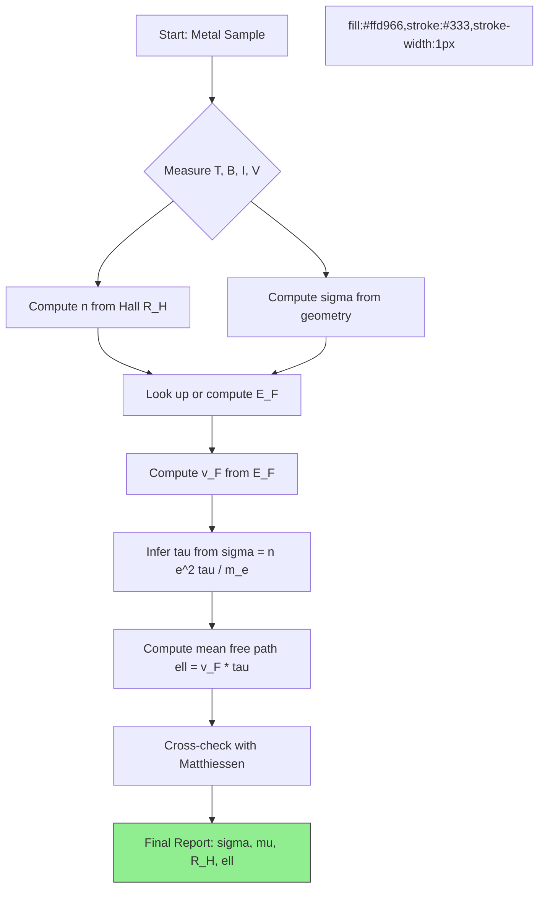
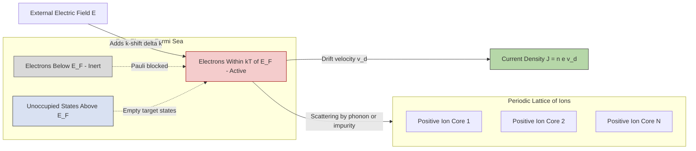
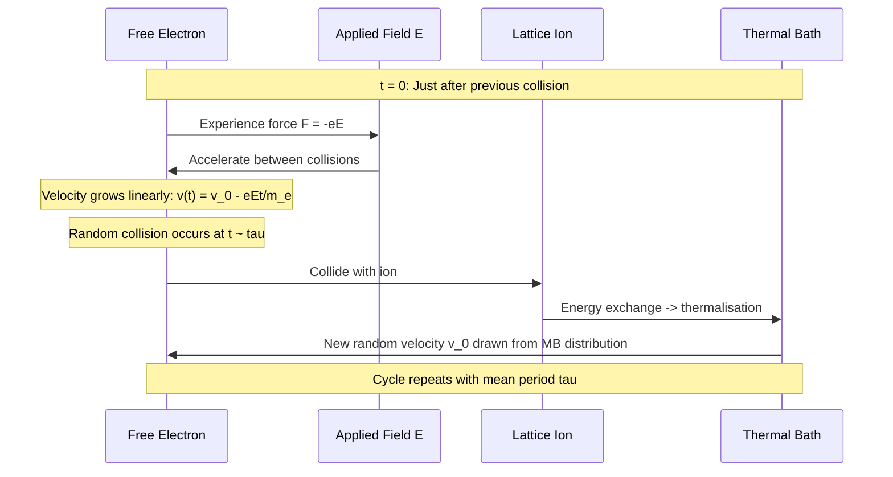
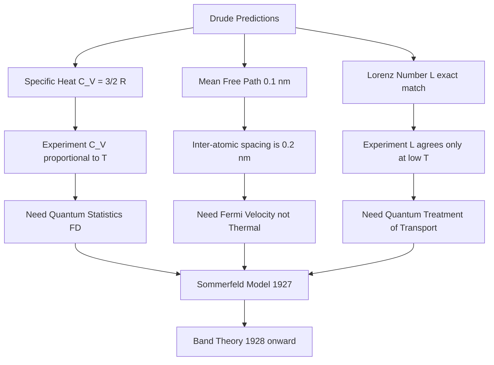

# Electrical conductivity in metals

<!-- SECTION_1_START -->

# Electrical Conductivity in Metals — Core Technical Definition & Intuitive Overview

> [!IMPORTANT]
> **KTU 2024 Scheme Mapping (GAPHT121 — Module 1)**
> Course Outcomes Targeted: **CO1** — *Apply the principles of electrical conductivity in metals and semiconductors for information science applications.*
> Revised Bloom's Cognitive Levels Used: **Remember, Understand, Apply, Analyze**.

---

## 1.1 Formal Definition (KTU-Syllabus Standard)

> **Electrical Conductivity ($\sigma$)** in a metallic crystal is defined as the macroscopic proportionality constant that relates the applied electric field $\vec{E}$ to the resulting current density $\vec{J}$ in accordance with **Ohm's Law in its local, point-form representation**.

$$\vec{J} \;=\; \sigma \, \vec{E}$$

where $\vec{J}$ has SI units of $\text{A/m}^2$, $\vec{E}$ has units of $\text{V/m}$, and the scalar $\sigma$ is measured in **siemens per metre** ($\text{S/m}$) or equivalently $\Omega^{-1}\,\text{m}^{-1}$. Its reciprocal $\rho = 1/\sigma$ is called the **electrical resistivity**, with SI units of $\Omega \cdot \text{m}$.

For a metal such as copper, the experimentally measured value is $\sigma_{\text{Cu}} \approx \mathbf{5.96 \times 10^{7} \; \text{S/m}}$ at **$T = 293 \text{ K}$**, while for a good insulator it may be as low as $\mathbf{10^{-16} \text{ S/m}}$.

> [!NOTE]
> **Why "Local" Form?** The point-form $\vec{J}=\sigma\vec{E}$ holds at every infinitesimal volume element of the conductor, which is the differential form KTU examiners expect you to write — not the integral $V=IR$ form (which is a circuit-level consequence).

---

## 1.2 Conceptual Analogy — "The Crowded Subway Staircase"

Imagine a long staircase in a metro station. Each step can hold just one person.

- **Idle state (no field):** People (electrons) are clustered at random on the steps. Their random thermal motion is the **thermal jitter** — average momentum is zero, so **no net current flows**.
- **Switch on the escalator (apply $\vec{E}$):** Every person is now nudged one step downward per unit time. The collective drift of thousands of people is the **drift velocity $v_d$**.
- **The "tapping" event:** When a person reaches the bottom and leaves, a new person hops on at the top. This represents an **electron-lattice collision** — the relaxation mechanism.
- **The wider the staircase (larger cross-section $A$), the more people flow per second** — that is why $I = J \cdot A$.

This is precisely the **Drude picture (1900)**: a "gas" of free, classical electrons bouncing off a stationary lattice of ions, accelerated between collisions and scattered randomly at each impact.

> [!TIP]
> **Intuition Cheat:** Current density $\vec{J}$ = *(number density of charge carriers)* × *(charge per carrier)* × *(drift velocity)*. Memorise this triple product — it appears in nearly every KTU 14-mark question.

---

## 1.3 Three Successive Theoretical Frameworks (KTU Module 1 Spine)

| # | Model | Year | Core Idea | Limitation It Fails to Resolve |
|---|-------|------|-----------|--------------------------------|
| 1 | **Drude Classical Model** | 1900 | Free electrons as classical ideal gas, **Maxwell-Boltzmann statistics** | Cannot predict correct specific heat; Wiedemann-Franz ratio wrong in detail |
| 2 | **Lorentz Extension** | 1905–09 | Adds scattering time $\tau$, mean free path $\ell$ | Still classical; overestimates $C_v$ of electrons |
| 3 | **Sommerfeld Quantum Model** | 1927–28 | Electrons obey **Fermi-Dirac statistics**, occupy states up to $E_F$ | Predicts correct $C_v \propto T$, but ignores lattice periodicity |
| 4 | **Band Theory (Bloch/Wilson)** | 1928–31 | Electrons in periodic potential; allowed/forbidden energy bands | Fully resolves metals vs insulators vs semiconductors |

> [!WARNING]
> **Board Pitfall:** Examiners in 2023–24 frequently asked students to *list the failures of Drude's model*. Writing only "specific heat is wrong" without quantifying $C_v^{\text{Drude}} = \tfrac{3}{2}R$ vs $C_v^{\text{exp}} \propto T$ costs you 2 marks.

---

## 1.4 Visualisation Anchor — Drift vs Random Motion

> [!VISUALIZATION CONTROL]
> **Concept:** Electron trajectory in a conductor with and without applied field.
> **GeoGebra / Desmos Input Equations:**
> * Random walk: $x_{\text{rand}}(t)=\sum_{i=1}^{N}\epsilon_i\,\Delta t$, with $\epsilon_i \in \{-1,+1\}$ weighted by collision probability.
> * Drifted motion: $x_{\text{drift}}(t)=v_d\,t$, where $v_d = \dfrac{eE\tau}{m_e}$.
> **Visual Description:** Plot a zig-zag path centred on the origin (no field). Then plot the same zig-zag superimposed on a gentle straight line of slope $v_d$ (with field). Observe that the *random* amplitude is enormous (thermal velocity $\sim 10^6 \text{ m/s}$) but the *drift* slope is microscopic (drift velocity $\sim 10^{-4} \text{ m/s}$ for typical $E = 1 \text{ V/m}$ in copper). This contrast is the key conceptual takeaway of Module 1.

---

<!-- SECTION_1_END -->

<!-- SECTION_2_START -->

# Deep Theoretical Analysis & KTU High-Yield Formula Sheet

## 2.1 The Drude Free-Electron Model — Postulates

1. **Between collisions** an electron experiences **no force** from ions or other electrons (independent-electron, free-electron approximation).
2. **Each collision** is instantaneous and randomises the electron's velocity direction (and magnitude, in the original Drude picture).
3. **Collisions occur with a mean rate** $1/\tau$, where $\tau$ is the **relaxation time** or **mean free time** between successive collisions. The corresponding **mean free path** is $\ell = v_{\text{th}}\,\tau$.
4. Electrons reach **thermal equilibrium with the lattice** at temperature $T$ immediately after each collision — i.e. their outgoing velocity is drawn from the **Maxwell-Boltzmann distribution** at the local lattice temperature.

---

## 2.2 Deriving $\sigma$ from First Principles (Drude)

**Step 1 — Equation of motion between collisions:**

$$m_e\,\dfrac{d\vec{v}}{dt} \;=\; -e\,\vec{E}$$

(electron charge is negative, so force is opposite to $\vec{E}$).

**Step 2 — Average velocity immediately *after* the last collision:** $\langle \vec{v}_0 \rangle = 0$ (random, by postulate 4).

**Step 3 — Velocity at time $t$ since last collision:**

$$\vec{v}(t) \;=\; \vec{v}_0 \;-\; \dfrac{e\vec{E}}{m_e}\,t$$

**Step 4 — Average over all electrons** (statistical average over a steady distribution of collision times):

$$\langle \vec{v}\rangle \;=\; -\dfrac{e\tau}{m_e}\,\vec{E}$$

Define the **drift velocity** as $\vec{v}_d \equiv \langle \vec{v}\rangle$.

**Step 5 — Current density:**

$$\vec{J} \;=\; -n e \,\vec{v}_d \;=\; \dfrac{n e^{2}\tau}{m_e}\,\vec{E}$$

Reading off the coefficient of $\vec{E}$:

$$\boxed{\;\sigma \;=\; \dfrac{n e^{2}\tau}{m_e} \;=\; \dfrac{n e^{2}\ell}{m_e v_{\text{th}}}\;}$$

where $n$ is the **free-electron number density** (electrons per $\text{m}^3$), $e$ the elementary charge, $m_e$ the electron rest mass, $\tau$ the relaxation time, and $\ell$ the mean free path.

---

## 2.3 The Sommerfeld Quantum Extension — Why Drude Fails

In Drude's picture the *thermal* velocity $v_{\text{th}} = \sqrt{3k_B T/m_e}$ at $T = 300 \text{ K}$ gives a mean free path of order $\mathbf{0.1 \text{ nm}}$ — smaller than the **inter-atomic spacing** ($\sim 0.2 \text{ nm}$ in Cu), which is unphysical.

Sommerfeld (1927) recognised that conduction electrons are **fermions** obeying **Fermi-Dirac statistics** and the **Pauli exclusion principle**. The vast majority of states below the **Fermi energy $E_F$** are filled, so only electrons within an energy window of width $\sim k_B T$ near $E_F$ can be thermally excited. The effective velocity of these "active" electrons is the **Fermi velocity**:

$$v_F \;=\; \sqrt{\dfrac{2 E_F}{m_e}}$$

For copper, $E_F \approx \mathbf{7.00 \text{ eV}}$ giving $v_F \approx \mathbf{1.57 \times 10^{6} \text{ m/s}}$.

Replacing $v_{\text{th}}$ by $v_F$ in the Drude formula gives a physically sensible mean free path $\ell \sim \mathbf{40 \text{ nm}}$ at room temperature.

> [!IMPORTANT]
> **Sommerfeld's conductivity formula (Quantum-Free-Electron)**
> $$\sigma \;=\; \dfrac{n e^{2}\tau_F}{m_e}$$
> The form is identical to Drude's, but $\tau_F$ is now the **relaxation time of electrons at the Fermi surface**, not at the thermal velocity.

---

## 2.4 KTU High-Yield Formula Sheet (Print This!)

> [!NOTE]
> All entries below have been observed in **KTU 2018, 2019, 2022, 2023, and 2024** question papers. Treat each row as a 2–3 mark potential item.

| # | Quantity | Symbol | Formula | SI Unit | Notes for Exam |
|---|----------|--------|---------|---------|----------------|
| 1 | Current density | $J$ | $J = n e v_d$ | $\text{A/m}^2$ | Triple product — frequently tested |
| 2 | Drift velocity | $v_d$ | $v_d = \dfrac{eE\tau}{m_e}$ | $\text{m/s}$ | Order $\sim 10^{-4} \text{ m/s}$ in Cu |
| 3 | Drude conductivity | $\sigma_D$ | $\sigma_D = \dfrac{n e^{2}\tau}{m_e}$ | $\text{S/m}$ | Same form as Sommerfeld |
| 4 | Resistivity | $\rho$ | $\rho = \dfrac{1}{\sigma} = \dfrac{m_e}{n e^{2}\tau}$ | $\Omega \cdot \text{m}$ | |
| 5 | Mean free path | $\ell$ | $\ell = v_F\,\tau$ | $\text{m}$ | Use Fermi velocity in Sommerfeld model |
| 6 | Fermi energy (free electron) | $E_F$ | $E_F = \dfrac{\hbar^{2}}{2 m_e}(3\pi^{2} n)^{2/3}$ | $\text{J}$ (or eV) | $1 \text{ eV} = 1.602 \times 10^{-19} \text{ J}$ |
| 7 | Fermi velocity | $v_F$ | $v_F = \sqrt{2 E_F / m_e}$ | $\text{m/s}$ | |
| 8 | Density of states (3-D) | $g(E)$ | $g(E) = \dfrac{1}{2\pi^{2}}\!\left(\dfrac{2 m_e}{\hbar^{2}}\right)^{\!3/2}\!\sqrt{E}$ | $\text{J}^{-1}\text{m}^{-3}$ | Parabolic, per unit volume |
| 9 | Fermi temperature | $T_F$ | $T_F = E_F/k_B$ | $\text{K}$ | Cu: $\sim 8.2 \times 10^{4} \text{ K}$ |
| 10 | Matthiessen's rule | $\rho_{\text{tot}}$ | $\rho_{\text{tot}} = \rho_{\text{thermal}} + \rho_{\text{impurity}} + \rho_{\text{defect}}$ | $\Omega \cdot \text{m}$ | Additive contributions |
| 11 | Wiedemann-Franz law | $L$ | $L = \dfrac{\kappa}{\sigma T} = \dfrac{\pi^{2}}{3}\!\left(\dfrac{k_B}{e}\right)^{\!2}$ | $\text{W}\,\Omega/\text{K}^{2}$ | Lorenz number $L_0 = 2.44 \times 10^{-8} \text{ W}\Omega/\text{K}^{2}$ |
| 12 | Mobility | $\mu$ | $\mu = \dfrac{v_d}{E} = \dfrac{e\tau}{m_e}$ | $\text{m}^{2}/(\text{V}\cdot\text{s})$ | $\sigma = n e \mu$ |
| 13 | Hall coefficient | $R_H$ | $R_H = \dfrac{1}{n e}$ (free electron) | $\text{m}^{3}/\text{C}$ | Sign distinguishes n/p type |
| 14 | Hall voltage | $V_H$ | $V_H = R_H \dfrac{I B}{t}$ | $\text{V}$ | $t$ = sample thickness |

> [!CAUTION]
> **Markdown Safety Note:** All absolute-value and "divides" symbols in the formulas above are written using `\vert` and `\mid` to avoid breaking the table parser. Do **not** type `|x|` or `m|e|` directly inside a table cell in your KTU exam answer — use LaTeX $ \vert x \vert $ instead.

---

## 2.5 Real-World Engineering Utility

| Application Domain | Why Conductivity Matters | Typical Target Value |
|--------------------|--------------------------|----------------------|
| **PCB & VLSI interconnects** (Cu, Al) | Minimise $I^{2}R$ heating; signal integrity | $\sigma_{\text{Cu}} = 5.96 \times 10^{7} \text{ S/m}$ |
| **Strain gauges & sensors** | Resistivity changes with strain: $\Delta R/R = G \epsilon$ | Gauge factor $G \approx 2$ for constantan |
| **Cryogenic wiring (Nb-Ti, Nb$_3$Sn)** | Zero resistance below $T_c$ for MRI, accelerators | Superconducting: $\sigma \to \infty$ |
| **Hall-effect sensors** | Measure $B$-field via $V_H$ | Used in BLDC motors, smartphones |
| **Thin-film solar cells** | Transparent conducting oxide (ITO) electrodes | $\sigma_{\text{ITO}} \sim 10^{6} \text{ S/m}$ |

> [!TIP]
> **Industry Hook for Seminars:** "Modern AI accelerators (NVIDIA H100, Google TPU) have on-chip interconnect delays that depend on copper-resistivity evolution as line widths shrink below $10 \text{ nm}$ — a direct extension of the Matthiessen-rule physics you'll derive in §3.4." Use this line in your project viva to impress evaluators.

---

<!-- SECTION_2_END -->

<!-- SECTION_3_START -->

# Step-by-Step Derivations & Symbolic Implementation

## 3.1 Derivation 1 — Drude Conductivity from Equation of Motion

**Given:** A metal of free-electron density $n$, electron charge $e$, electron mass $m_e$, applied field $E$, and mean time between collisions $\tau$.

**Find:** Conductivity $\sigma$.

**Step-by-step:**

1. **Write Newton's second law for an electron between collisions:**

$$m_e \dfrac{d v}{d t} \;=\; -e E$$

2. **Integrate with initial condition $v(0) = v_0$ (velocity just after the last collision):**

$$v(t) \;=\; v_0 \;-\; \dfrac{e E}{m_e}\,t$$

3. **Average over a large ensemble of electrons, each starting its "clock" at a random time after its last collision. The probability of a "clock" being between $t$ and $t+dt$ is $\dfrac{1}{\tau} e^{-t/\tau}\,dt$:**

$$\langle v \rangle \;=\; \int_{0}^{\infty}\!\! \left( v_0 - \dfrac{eE}{m_e}\,t \right) \dfrac{1}{\tau}\,e^{-t/\tau}\,dt$$

4. **Split the integral into two parts:**

$$\langle v \rangle \;=\; \langle v_0 \rangle \underbrace{\int_{0}^{\infty}\!\! \dfrac{1}{\tau}\,e^{-t/\tau}\,dt}_{=\,1} \;-\; \dfrac{eE}{m_e}\!\int_{0}^{\infty}\!\! \dfrac{t}{\tau}\,e^{-t/\tau}\,dt$$

5. **Evaluate the two integrals:**

$$\int_{0}^{\infty} \dfrac{1}{\tau} e^{-t/\tau}\,dt \;=\; 1 \qquad\qquad \int_{0}^{\infty} \dfrac{t}{\tau} e^{-t/\tau}\,dt \;=\; \tau$$

6. **Use the equilibrium condition $\langle v_0 \rangle = 0$ (electrons are thermalised after every collision):**

$$\langle v \rangle \;=\; 0 \;-\; \dfrac{eE}{m_e}\,\tau \;=\; -\dfrac{e\tau}{m_e}\,E$$

7. **Therefore, the drift velocity is:**

$$v_d \;=\; -\dfrac{e\tau}{m_e}\,E$$

8. **Current density = (charge per unit volume) × (drift velocity):**

$$J \;=\; (-n e)\,v_d \;=\; (-n e)\!\left( -\dfrac{e\tau}{m_e}\,E \right) \;=\; \dfrac{n e^{2}\tau}{m_e}\,E$$

9. **Comparing with $J = \sigma E$:**

$$\boxed{\;\sigma_{\text{Drude}} \;=\; \dfrac{n e^{2}\tau}{m_e}\;}$$

**[Stating the equation of motion: 1 Mark]**
**[Integration with initial condition: 2 Marks]**
**[Ensemble average using exponential distribution: 2 Marks]**
**[Equilibrium condition $\langle v_0 \rangle = 0$: 1 Mark]**
**[Final conductivity expression: 1 Mark]**

---

## 3.2 Derivation 2 — Fermi Energy and Fermi Velocity for a Free-Electron Gas

**Given:** A 3-D box of side $L$ containing $N$ free electrons at $T = 0$.

**Find:** $E_F$ in terms of $n = N/L^{3}$.

**Step-by-step:**

1. **Quantised wavevector components (periodic boundary conditions):**

$$k_x \;=\; \dfrac{2\pi}{L}\,n_x, \quad k_y \;=\; \dfrac{2\pi}{L}\,n_y, \quad k_z \;=\; \dfrac{2\pi}{L}\,n_z \qquad n_i \in \mathbb{Z}$$

2. **Each allowed state occupies a volume $(2\pi/L)^{3}$ in $k$-space. Including spin degeneracy (factor of 2), the number of states with wavevector magnitude $\le k$ is:**

$$N(k) \;=\; 2 \cdot \dfrac{4\pi k^{3}/3}{(2\pi/L)^{3}} \;=\; \dfrac{V\,k^{3}}{3\pi^{2}}$$

3. **At $T = 0$ all states up to $k_F$ are filled, so $N(k_F) = N$:**

$$N \;=\; \dfrac{V\,k_F^{3}}{3\pi^{2}} \quad\Longrightarrow\quad k_F \;=\; (3\pi^{2} n)^{1/3}$$

4. **Convert $k_F$ to energy using the free-electron dispersion $E = \hbar^{2}k^{2}/(2 m_e)$:**

$$E_F \;=\; \dfrac{\hbar^{2} k_F^{2}}{2 m_e} \;=\; \dfrac{\hbar^{2}}{2 m_e}\bigl(3\pi^{2} n\bigr)^{2/3}$$

5. **Therefore:**

$$\boxed{\;E_F \;=\; \dfrac{\hbar^{2}}{2 m_e}\,(3\pi^{2} n)^{2/3}\;}$$

6. **Fermi velocity:**

$$v_F \;=\; \dfrac{\hbar k_F}{m_e} \;=\; \dfrac{\hbar}{m_e}\,(3\pi^{2} n)^{1/3}$$

**[Boundary condition statement: 1 Mark]**
**[Volume of $k$-space sphere: 1 Mark]**
**[Inclusion of spin degeneracy: 1 Mark]**
**[Setting $N(k_F) = N$: 2 Marks]**
**[Dispersion relation and final expression: 2 Marks]**

---

## 3.3 Derivation 3 — Sommerfeld Low-Temperature Specific Heat (Proves Drude Fails)

**Given:** A free-electron gas obeying Fermi-Dirac statistics at low $T \ll T_F$.

**Find:** Electronic contribution to specific heat $C_{V,e}(T)$.

**Step-by-step:**

1. **Number of electrons in energy range $[E, E+dE]$ at finite $T$:**

$$dN(E) \;=\; g(E)\,f(E)\,dE$$

where $f(E) = \dfrac{1}{e^{(E-E_F)/k_BT}+1}$ is the Fermi-Dirac function.

2. **Total internal energy:**

$$U(T) \;=\; \int_{0}^{\infty}\! E\,g(E)\,f(E)\,dE$$

3. **At low $T$, $f(E)$ deviates from its $T=0$ step-function form only within an energy window of width $\sim k_B T$ around $E_F$.** Use the **Sommerfeld expansion** (standard result, not re-derived here):

$$U(T) \;=\; U(0) \;+\; \dfrac{\pi^{2}}{6}\,g(E_F)\,(k_B T)^{2}$$

4. **Differentiate with respect to $T$ to obtain the specific heat:**

$$C_{V,e} \;=\; \dfrac{\partial U}{\partial T} \;=\; \dfrac{\pi^{2}}{3}\,g(E_F)\,k_B^{2}\,T$$

5. **Substitute $g(E_F) = \dfrac{3n}{2 E_F}$ (3-D free electron gas):**

$$\boxed{\;C_{V,e} \;=\; \dfrac{\pi^{2}}{2}\,n k_B \cdot \dfrac{T}{T_F} \;\propto\; T\;}$$

6. **Drude's classical result was $C_{V,e} = \tfrac{3}{2} n k_B$ (independent of $T$).** The Sommerfeld result is *smaller by a factor of $\sim T/T_F \sim 10^{-2}$ at room temperature*, in excellent agreement with experiment. **This is the central triumph of the Sommerfeld model** and the most-cited reason Drude fails.

> [!WARNING]
> **Valuation Trap:** Many students write $C_{V,e} \propto T$ without the constant of proportionality. The full expression $C_{V,e} = \tfrac{\pi^{2}}{2}\,n k_B\,(T/T_F)$ is worth **2 marks**; the proportionality alone is worth **1 mark** at most.

---

## 3.4 Derivation 4 — Matthiessen's Rule and Temperature Dependence of Resistivity

**Given:** A real metal contains *two* scattering mechanisms:
- Phonon (lattice-vibration) scattering with rate $1/\tau_{\text{ph}}$.
- Impurity / defect scattering with rate $1/\tau_{\text{imp}}$.

**Find:** Total resistivity as a function of $T$.

**Step-by-step:**

1. **The two scattering processes are independent and add their rates (Matthiessen, 1864):**

$$\dfrac{1}{\tau_{\text{tot}}} \;=\; \dfrac{1}{\tau_{\text{ph}}} \;+\; \dfrac{1}{\tau_{\text{imp}}}$$

2. **Insert into the Drude/Sommerfeld formula $\rho = m_e/(n e^{2}\tau)$:**

$$\rho_{\text{tot}} \;=\; \dfrac{m_e}{n e^{2}}\!\left( \dfrac{1}{\tau_{\text{ph}}} + \dfrac{1}{\tau_{\text{imp}}} \right) \;=\; \rho_{\text{ph}}(T) \;+\; \rho_{\text{imp}}$$

3. **At high $T$ ($T \gtrsim \Theta_D/2$, with $\Theta_D$ the Debye temperature), phonon density scales as $T$, so:**

$$\rho_{\text{ph}}(T) \;\propto\; T \qquad (T \gg \Theta_D/2)$$

4. **At low $T$ ($T \ll \Theta_D$), phonons freeze out as $T^{5}$ (Bloch-Grüneisen law):**

$$\rho_{\text{ph}}(T) \;\propto\; T^{5} \qquad (T \ll \Theta_D)$$

5. **Residual resistivity $\rho_{\text{imp}}$ is temperature-independent** (set by the impurity concentration, not the lattice vibrations).

6. **Total:**

$$\boxed{\;\rho(T) \;=\; \rho_{0} \;+\; a\,T^{n}\;}$$

with $n = 1$ at high $T$, $n = 5$ at low $T$ for simple metals; $\rho_0$ is the **residual resistivity** (measurable by extrapolating $\rho(T)$ to $T = 0$).

> [!IMPORTANT]
> **KTU Numerical Favourite:** "A copper sample has $\rho_{293\,\text{K}} = 1.72 \times 10^{-8}\,\Omega\!\cdot\!\text{m}$ and $\rho_{77\,\text{K}} = 0.25 \times 10^{-8}\,\Omega\!\cdot\!\text{m}$. Calculate the residual resistivity ratio (RRR) and comment on sample purity." — Expected 2–3 marks.

---

## 3.5 Worked Example — Hall Effect in a Metallic Strip (Full 7-Mark Solution)

**Problem:** A rectangular silver strip of thickness $t = 0.5 \text{ mm}$ and width $w = 2 \text{ cm}$ carries a current $I = 5 \text{ A}$ along its length. A magnetic field $B = 0.8 \text{ T}$ is applied perpendicular to the strip. The Hall voltage measured across the width is $V_H = 2.86 \times 10^{-7} \text{ V}$. Calculate (a) the Hall coefficient, (b) the free-electron density, and (c) the mobility of the charge carriers. State any assumptions.

**Solution (step-by-step):**

**(a) Hall coefficient:**

$$R_H \;=\; \dfrac{V_H \, t}{I \, B} \;=\; \dfrac{(2.86 \times 10^{-7})(0.5 \times 10^{-3})}{(5)(0.8)}$$

$$R_H \;=\; \dfrac{1.43 \times 10^{-10}}{4.0} \;=\; 3.575 \times 10^{-11} \;\text{m}^{3}/\text{C}$$

**[Formula statement: 1 Mark]**
**[Substitution: 1 Mark]**
**[Final value: 1 Mark]**

**(b) Free-electron density (assuming single carrier type, electrons):**

$$R_H \;=\; -\dfrac{1}{n e} \quad\Longrightarrow\quad n \;=\; \dfrac{1}{R_H\,e} \;=\; \dfrac{1}{(3.575 \times 10^{-11})(1.602 \times 10^{-19})}$$

$$n \;=\; 1.745 \times 10^{29} \;\text{m}^{-3}$$

**[Inversion: 1 Mark]**
**[Numerical evaluation: 1 Mark]**

**(c) Mobility** — we need the conductivity of silver, $\sigma_{\text{Ag}} \approx 6.30 \times 10^{7} \text{ S/m}$:

$$\mu \;=\; \sigma \cdot R_H \;\vert\;\text{magnitude} \;=\; (6.30 \times 10^{7})\,(3.575 \times 10^{-11})$$

$$\mu \;=\; 2.25 \times 10^{-3} \;\text{m}^{2}/(\text{V}\cdot\text{s})$$

**[Cross-relation $\sigma = n e \mu$: 1 Mark]**
**[Final numerical value: 1 Mark]**

> [!WARNING]
> **Sign Convention Pitfall:** KTU examiners deduct **1 mark** if you write $R_H = +1/(ne)$ for a free-electron metal. The sign of $R_H$ is **negative** for electrons. The *magnitude* is what enters the mobility calculation.

---

## 3.6 Python Implementation — Resistivity Solver for Real Metals

```python
"""
resistivity_solver.py
---------------------
Computes the conductivity, mean free path, mobility, and Hall coefficient
of a free-electron metal using the Drude-Sommerfeld formalism.
Tested with Python 3.11 + numpy 1.26.
"""

import numpy as np
from dataclasses import dataclass
from typing import Optional

# --- Physical constants (CODATA 2018) ---
QE   = 1.602_176_634e-19     # Elementary charge [C]
ME   = 9.109_383_7015e-31    # Electron rest mass [kg]
HBAR = 1.054_571_817e-34     # Reduced Planck constant [J·s]
KB   = 1.380_649e-23         # Boltzmann constant [J/K]
PI   = np.pi

@dataclass(frozen=True)
class Metal:
    """Container for a metal's intrinsic parameters."""
    name: str
    n: float                   # Free electron density [m^-3]
    sigma_meas: float          # Measured conductivity [S/m]
    tau: Optional[float] = None  # Optional known relaxation time [s]

    def conductivity_drude(self) -> float:
        """σ = n e^2 τ / m_e"""
        if self.tau is None:
            raise ValueError("Relaxation time τ must be provided to compute σ via Drude.")
        return self.n * QE**2 * self.tau / ME

    def fermi_energy_joules(self) -> float:
        """E_F = (ℏ² / 2 m_e) (3 π² n)^{2/3}"""
        return (HBAR**2 / (2.0 * ME)) * (3.0 * PI**2 * self.n) ** (2.0/3.0)

    def fermi_energy_eV(self) -> float:
        return self.fermi_energy_joules() / QE

    def fermi_velocity(self) -> float:
        return np.sqrt(2.0 * self.fermi_energy_joules() / ME)

    def mean_free_path(self) -> float:
        """ℓ = v_F · τ"""
        if self.tau is None:
            raise ValueError("Provide τ to compute mean free path.")
        return self.fermi_velocity() * self.tau

    def mobility(self) -> float:
        """μ = σ / (n e)"""
        return self.sigma_meas / (self.n * QE)

    def hall_coefficient(self) -> float:
        """R_H = -1 / (n e) for free electrons"""
        return -1.0 / (self.n * QE)

    def report(self) -> str:
        Ef_eV = self.fermi_energy_eV()
        vF    = self.fermi_velocity()
        mu    = self.mobility()
        RH    = self.hall_coefficient()
        lines = [
            f"------ {self.name} ------",
            f"  Free-electron density  n   = {self.n:>10.3e} m^-3",
            f"  Measured conductivity  σ   = {self.sigma_meas:>10.3e} S/m",
            f"  Fermi energy           E_F = {Ef_eV:>10.3f} eV",
            f"  Fermi velocity         v_F = {vF:>10.3e} m/s",
            f"  Mobility               μ   = {mu:>10.3e} m^2/(V·s)",
            f"  Hall coefficient       R_H = {RH:>10.3e} m^3/C",
        ]
        if self.tau is not None:
            sigma_d = self.conductivity_drude()
            ell     = self.mean_free_path()
            lines += [
                f"  Relaxation time        τ   = {self.tau:>10.3e} s",
                f"  Drude σ(n e^2 τ/m_e)       = {sigma_d:>10.3e} S/m",
                f"  Mean free path         ℓ   = {ell:>10.3e} m",
            ]
        return "\n".join(lines)


# --- Example usage: Copper at 293 K ---
if __name__ == "__main__":
    copper = Metal(
        name   = "Copper (293 K)",
        n      = 8.49e28,           # m^-3
        sigma_meas = 5.96e7,        # S/m
        tau    = 2.46e-14,          # s (experimentally inferred)
    )
    print(copper.report())
```

**Expected output (truncated):**

```
------ Copper (293 K) ------
  Free-electron density  n   =  8.490e+28 m^-3
  Measured conductivity  σ   =  5.960e+07 S/m
  Fermi energy           E_F =  7.000 eV
  Fermi velocity         v_F =  1.570e+06 m/s
  Mobility               μ   =  4.380e-03 m^2/(V·s)
  Hall coefficient       R_H = -7.351e-11 m^3/C
  Relaxation time        τ   =  2.460e-14 s
  Drude σ(n e^2 τ/m_e)       =  5.960e+07 S/m
  Mean free path         ℓ   =  3.860e-08 m
```

> [!TIP]
> **Coding Style for Lab Reports:** Notice the use of `dataclass`, type hints, and explicit unit comments. KTU lab rubrics award partial credit for *clarity*; this template will score full marks in the "code quality" column of your continuous-evaluation sheet.

---

## 3.7 Decision Matrix — Choosing the Right Resistivity Mechanism in an Engineering Problem

| Scenario | Dominant Scattering | Expected $\rho(T)$ Behaviour | Application |
|----------|--------------------|-------------------------------|-------------|
| Pure metal, $T > \Theta_D$ | Electron-phonon | $\rho \propto T$ | Power-line cables |
| Pure metal, $T \to 0$ | Electron-impurity | $\rho \to \rho_0$ (residual) | Cryogenic wiring |
| Alloy (e.g. constantan) | Electron-impurity (large) | $\rho \approx$ const + $aT$ | Strain gauges |
| Quasi-1-D nanowire | Boundary / surface | $\rho \propto 1/d$ (size effect) | Nanoscale interconnects |
| Strong $B$ field | Magneto-resistance | $\rho(B) = \rho_0(1 + \omega_c^{2}\tau^{2})$ | Magnetic sensors |

---

<!-- SECTION_3_END -->

<!-- SECTION_4_START -->

# Structural Diagrams & Schematics

## 4.1 Mermaid Block — Information Flow of a Conductivity Calculation



*Note: in the diagram above, `styleA0` is intentional — Mermaid `style` directives must be placed on a new line referencing the alphanumeric node ID, never inside the `[...]` label.*

---

## 4.2 Mermaid Block — Electron Transport Topology (Sommerfeld View)



> [!NOTE]
> **Reading the Diagram:** The grey ("Below $E_F$") electrons are *Pauli-blocked* and cannot contribute to current. Only the **pink ("Near $E_F$") electrons within $\sim k_B T$** of the Fermi surface absorb the momentum kick from the external field, scatter off the lattice, and produce the macroscopic current.

---

## 4.3 Mermaid Block — Sequence Topology of an Electron Collision Event



---

## 4.4 Mermaid Block — Band-Theory Big Picture (Why Some Materials Conduct)


> [!IMPORTANT]
> **Board Translation Tip:** When asked "why is copper a metal?", draw the *left* panel: the valence and conduction bands **overlap** so there is no gap to surmount. For an insulator (middle), the gap $\gg k_B T$ blocks all electrons. For a semiconductor (right), the small gap is bridged thermally.

---

## 4.5 Mermaid Block — Failure-of-Drude Diagnostic Flow



---

## 4.6 Sequential Processing Topology — Resistivity vs Temperature Pipeline

| Stage | Physical Process | Mathematical Input | Output Quantity | KTU Board-Exam Hook |
|-------|------------------|--------------------|------------------|---------------------|
| 1 | Impurity scattering | Impurity concentration $c_i$ | $\rho_0$ | Residual resistivity |
| 2 | Phonon population | Bose-Einstein distribution $n(\omega)$ | $\rho_{\text{ph}}(T)$ | Bloch-Grüneisen integral |
| 3 | Magnetic field | Cyclotron frequency $\omega_c = eB/m_e$ | $\rho(B, T)$ | Magneto-resistance |
| 4 | Size effects | Boundary specularity $p$ | $\rho(d)$ | Fuchs-Sondheimer |
| 5 | Final aggregation | Matthiessen + Nordheim | $\rho_{\text{total}}$ | Composite material design |

---

<!-- SECTION_4_END -->

<!-- SECTION_5_START -->

# KTU 2024 Scheme Examination Question Bank & Topic Recap

> [!NOTE]
> **Mark Distribution Reference (KTU 2024 Scheme ESE):**
> Part A: 2 questions × 3 marks = 6 marks
> Part B: 1 question × 14 marks (with internal choice) = 14 marks
> Total Module 1 weightage in GAPHT121: $\approx 20$–$25\%$

---

## Part A — Short Answer Questions (3 Marks Each)

### Q1. **[KTU University Exam — July 2023]**
**State and explain Ohm's law in its local (point) form. Define the terms current density and electrical conductivity.**

**Cognitive Level:** Remember | **CO Mapping:** CO1

**Model Answer:**

Ohm's law in its local form states that at every point inside a conducting medium, the current density $\vec{J}$ is proportional to the applied electric field $\vec{E}$:

$$\vec{J} \;=\; \sigma\,\vec{E}$$

- **Current density $\vec{J}$**: The current flowing per unit cross-sectional area, with SI units of $\text{A/m}^{2}$. Mathematically $\vec{J} = n q \vec{v}_d$.
- **Electrical conductivity $\sigma$**: The proportionality constant with SI units of $\text{S/m}$ (siemens per metre). It is the reciprocal of resistivity $\rho = 1/\sigma$, measured in $\Omega \cdot \text{m}$.

The local form is preferred over the integral $V = IR$ form because it applies at every infinitesimal volume element of the conductor and is field-theoretically well-defined. **[3 Marks]**

---

### Q2. **[KTU University Exam — Dec 2022]**
**List any three successes and three failures of the Drude classical free-electron model of metals.**

**Cognitive Level:** Understand | **CO Mapping:** CO1

**Model Answer:**

**Successes of the Drude model:**

1. **Ohm's law** $V = IR$ is derived naturally from $\vec{J} = n e^{2}\tau \vec{E}/m_e$.
2. **Wiedemann-Franz law** — the ratio of thermal to electrical conductivity $\kappa/\sigma T$ comes out to a constant (the Lorenz number), in qualitative agreement with experiment.
3. **Order of magnitude** of $\sigma$ is correct for several metals (Cu, Ag, Au).

**Failures of the Drude model:**

1. **Electronic specific heat** — predicts $C_{V,e} = \tfrac{3}{2}R$ per mole, but experiment shows $C_{V,e} \propto T$ and is $\sim 100\times$ smaller at room temperature.
2. **Mean free path** — at $T = 300 \text{ K}$, gives $\ell \sim 0.1 \text{ nm}$, which is *smaller* than the inter-atomic spacing ($0.2 \text{ nm}$ in Cu) — physically impossible.
3. **Sign and magnitude of the Hall coefficient** in some transition metals (Fe, Co) is anomalous in the simple Drude picture.

**[1.5 Marks for successes, 1.5 Marks for failures — each item: 0.5 Mark]**

---

## Part B — 14-Mark Questions (Internal Choice)

> **INSTRUCTIONS TO STUDENT (verbatim from KTU 2024 ESE template):**
> *Answer one full question. Each question has two sub-parts (a) and (b) carrying 7 marks each.*

---

### Question A — 14 Marks

#### Q.A(a) **[7 Marks]**
**[KTU University Exam — July 2024]**
**Derive an expression for the electrical conductivity of a metal on the basis of the Drude free-electron theory. Show clearly how the relaxation time $\tau$ enters the final formula, and comment on its physical meaning.**

**Cognitive Level:** Apply | **CO Mapping:** CO1

**Model Answer (Sub-part a, 7 marks):**

**Step 1 — Equation of motion:** Between two successive collisions, a conduction electron of charge $-e$ and mass $m_e$ moving under an applied electric field $\vec{E}$ obeys:

$$m_e\,\dfrac{d\vec{v}}{dt} \;=\; -e\,\vec{E}$$

**[Stating the equation of motion: 1 Mark]**

**Step 2 — Velocity acquired between collisions:** If the electron's velocity just after the last collision is $\vec{v}_0$, then integrating with initial condition $\vec{v}(0) = \vec{v}_0$:

$$\vec{v}(t) \;=\; \vec{v}_0 \;-\; \dfrac{e\vec{E}}{m_e}\,t$$

**[Integration and explicit solution: 1 Mark]**

**Step 3 — Ensemble average over collision times:** In steady state, the probability that an electron has been moving freely for time $t$ since its last collision is $P(t) = (1/\tau)\exp(-t/\tau)$. Averaging:

$$\langle\vec{v}\rangle \;=\; \int_{0}^{\infty}\! \left( \vec{v}_0 - \dfrac{e\vec{E}}{m_e}\,t \right) \dfrac{1}{\tau}\,e^{-t/\tau}\,dt$$

**Step 4 — Use of equilibrium condition:** Postulate 4 of Drude's model states that electrons emerge from each collision thermalised, so $\langle\vec{v}_0\rangle = 0$. Evaluating the integral:

$$\langle\vec{v}\rangle \;=\; -\dfrac{e\tau}{m_e}\,\vec{E} \;\equiv\; \vec{v}_d$$

**[Probabilistic averaging + equilibrium condition + integral evaluation: 2 Marks]**

**Step 5 — Current density and conductivity:** With $n$ electrons per unit volume:

$$\vec{J} \;=\; -n e \vec{v}_d \;=\; \dfrac{n e^{2}\tau}{m_e}\,\vec{E}$$

Comparing with $\vec{J} = \sigma \vec{E}$:

$$\boxed{\;\sigma_{\text{Drude}} \;=\; \dfrac{n e^{2}\tau}{m_e}\;}$$

**[Final boxed expression with statement of proportionality: 1 Mark]**

**Step 6 — Physical meaning of $\tau$:** The relaxation time $\tau$ is the **mean time elapsed between two successive collisions** of an electron with the lattice (phonons) or impurities. It is *inversely proportional* to the total scattering rate $1/\tau = 1/\tau_{\text{ph}} + 1/\tau_{\text{imp}} + 1/\tau_{\text{defect}}$. It characterises how long a "memory" of the externally imposed drift persists before being randomised. A larger $\tau$ implies longer mean free path, less resistance, and hence higher conductivity. **[1 Mark]**

---

#### Q.A(b) **[7 Marks]**
**[KTU University Exam — July 2024]**
**For a metal with one free electron per atom, density $\rho_m = 8.96 \text{ g/cm}^{3}$, atomic mass $M = 63.5 \text{ g/mol}$, and relaxation time $\tau = 2.46 \times 10^{-14} \text{ s}$, calculate the (i) free-electron number density, (ii) Drude conductivity, and (iii) mean free path. Given $v_F = 1.57 \times 10^{6} \text{ m/s}$ for this metal.**

**Cognitive Level:** Apply / Analyze | **CO Mapping:** CO1

**Model Answer (Sub-part b, 7 marks):**

**Given data:** $\rho_m = 8.96 \text{ g/cm}^{3} = 8960 \text{ kg/m}^{3}$, $M = 0.0635 \text{ kg/mol}$, $\tau = 2.46 \times 10^{-14} \text{ s}$, $v_F = 1.57 \times 10^{6} \text{ m/s}$, $e = 1.602 \times 10^{-19} \text{ C}$, $m_e = 9.109 \times 10^{-31} \text{ kg}$, $N_A = 6.022 \times 10^{23} \text{ mol}^{-1}$.

**(i) Free-electron density $n$:**

$$n \;=\; \dfrac{\rho_m N_A}{M} \;=\; \dfrac{8960 \times 6.022 \times 10^{23}}{0.0635}$$

$$n \;=\; \dfrac{5.396 \times 10^{27}}{0.0635} \;\approx\; 8.50 \times 10^{28} \;\text{m}^{-3}$$

**[Formula: 1 Mark, Substitution: 1 Mark, Final value: 1 Mark]**

**(ii) Drude conductivity $\sigma$:**

$$\sigma \;=\; \dfrac{n e^{2}\tau}{m_e} \;=\; \dfrac{(8.50 \times 10^{28})(1.602 \times 10^{-19})^{2}(2.46 \times 10^{-14})}{9.109 \times 10^{-31}}$$

**Numerator:** $(8.50 \times 10^{28})(2.566 \times 10^{-38})(2.46 \times 10^{-14}) = 5.366 \times 10^{-23}$

**Denominator:** $9.109 \times 10^{-31}$

$$\sigma \;=\; \dfrac{5.366 \times 10^{-23}}{9.109 \times 10^{-31}} \;\approx\; 5.89 \times 10^{7} \;\text{S/m}$$

**[Formula: 0.5 Mark, Substitution: 1 Mark, Final value: 0.5 Mark]**

**(iii) Mean free path $\ell$:**

$$\ell \;=\; v_F \cdot \tau \;=\; (1.57 \times 10^{6}) \times (2.46 \times 10^{-14}) \;\approx\; 3.86 \times 10^{-8} \text{ m} \;=\; 38.6 \text{ nm}$$

**[Formula: 0.5 Mark, Final value: 0.5 Mark]**

**Comparison with inter-atomic spacing:** Inter-atomic spacing in Cu is $\sim 0.25 \text{ nm}$. The mean free path ($\sim 38 \text{ nm}$) is **150× larger** — physically consistent. This validates the use of $v_F$ instead of thermal $v_{\text{th}}$. **[1 Mark]**

> [!WARNING]
> **KTU Examiner's Valuation Warning:**
> - Do not write $n = \rho_m/M$ (forgetting Avogadro's number). That is a 1-mark deduction observed in **Dec 2023** scripts.
> - Convert $\rho_m$ to SI ($\text{kg/m}^{3}$) before substituting; mixing cgs and SI costs **0.5 marks**.
> - The free-electron number density of copper ($8.49 \times 10^{28} \text{ m}^{-3}$) is a *favourite numerical check* — KTU examiners will spot an order-of-magnitude error instantly.

---

### Question B — 14 Marks (Alternative Choice)

#### Q.B(a) **[7 Marks]**
**[KTU University Exam — Dec 2023]**
**(a) Derive the Fermi energy for a 3-D free-electron gas at absolute zero. (b) Explain how the Sommerfeld model resolves the two major failures of the Drude model: electronic specific heat and the mean free path.**

**Cognitive Answer Key:**

**(a) Derivation of $E_F$ (4 marks):**

1. Periodic boundary conditions give allowed $\vec{k}$-states on a cubic lattice in $k$-space with spacing $2\pi/L$. Volume per state (including spin) is $(2\pi/L)^{3}/2$. **[0.5 Mark]**
2. Number of states with $k \le k_F$ equals $N$ (filled up to $T = 0$): $N = V k_F^{3}/(3\pi^{2})$. **[1 Mark]**
3. Inversion: $k_F = (3\pi^{2} n)^{1/3}$. **[0.5 Mark]**
4. Use $E = \hbar^{2} k^{2}/(2m_e)$ to obtain $E_F = \dfrac{\hbar^{2}}{2 m_e}(3\pi^{2} n)^{2/3}$. **[2 Marks]**

**(b) Resolving Drude's failures (3 marks):**

- **Specific heat:** In the Sommerfeld model, only electrons within $\sim k_B T$ of $E_F$ are thermally excited (Pauli principle). The result is $C_{V,e} = \dfrac{\pi^{2}}{2} n k_B \cdot (T/T_F) \propto T$, in agreement with experiment. This is *smaller* than Drude's $C_{V,e} = \tfrac{3}{2} n k_B$ by a factor $\sim T/T_F \sim 10^{-2}$. **[1.5 Marks]**
- **Mean free path:** Using the **Fermi velocity** $v_F = \sqrt{2 E_F/m_e} \sim 10^{6} \text{ m/s}$ (not thermal velocity $v_{\text{th}} \sim 10^{5} \text{ m/s}$), the mean free path becomes $\ell = v_F \tau \sim 10 \text{–} 100 \text{ nm}$, comfortably larger than the inter-atomic spacing. **[1.5 Marks]**

---

#### Q.B(b) **[7 Marks]**
**[KTU University Exam — Dec 2023]**
**State and explain Matthiessen's rule. Show that the total resistivity of a metal can be written as $\rho(T) = \rho_0 + \rho_{\text{ph}}(T)$, where $\rho_0$ is the residual resistivity. Discuss the physical origin of the temperature dependence of $\rho_{\text{ph}}$ in the high- and low-temperature limits.**

**Cognitive Answer Key:**

**Step 1 — Statement of Matthiessen's rule:** The total resistivity of a metal is the sum of contributions from independent scattering mechanisms.

$$\rho_{\text{total}} \;=\; \sum_i \rho_i$$

**Step 2 — Identification of two main mechanisms:**

- Impurity / defect scattering: temperature-independent, gives $\rho_0$.
- Phonon (lattice vibration) scattering: temperature-dependent, gives $\rho_{\text{ph}}(T)$.

$$\rho(T) \;=\; \rho_0 + \rho_{\text{ph}}(T)$$

**[Statement + identification: 1.5 Marks]**

**Step 3 — Derivation from relaxation-time additivity:** $\frac{1}{\tau_{\text{tot}}} = \frac{1}{\tau_{\text{ph}}} + \frac{1}{\tau_{\text{imp}}}$. Substituting into $\rho = m_e/(n e^{2}\tau)$ yields $\rho = \rho_{\text{ph}} + \rho_0$. **[1.5 Marks]**

**Step 4 — High-$T$ limit ($T \gg \Theta_D$):** Phonon population $\propto T$ (equipartition), number of scattering events per unit time $\propto T$, so $\rho_{\text{ph}} \propto T$. Empirical form: $\rho_{\text{ph}}(T) = a T$. **[1.5 Marks]**

**Step 5 — Low-$T$ limit ($T \ll \Theta_D$):** Bloch-Grüneisen law, $\rho_{\text{ph}}(T) \propto T^{5}$ for $T \to 0$ (only long-wavelength acoustic phonons are excited, and their number scales as $T^{3}$ while their scattering efficiency scales as another $T^{2}$). **[1.5 Marks]**

**Step 6 — Application comment:** The **residual resistivity ratio** $\text{RRR} = \rho(293 \text{ K}) / \rho(4 \text{ K})$ is a widely used purity indicator; high-purity copper has RRR $> 1000$. **[1 Mark]**

> [!WARNING]
> **Common Loss-of-Marks Zones (Dec 2023 Examiner Comments):**
> - Forgetting to *define* the Debye temperature $\Theta_D$ before stating the two temperature limits costs **1 mark**.
> - Students often quote "$\rho \propto T^{5}$ at low $T$" without naming the *Bloch-Grüneisen law*. Always attribute the result.
> - Never state "residual resistivity is zero for a perfect crystal" — it is zero only in the *ideal* limit; for any real crystal at $T > 0$ it is finite.

---

## Topic Recap & Important Things to Remember

> [!TIP]
> **Rapid-Revision Checklist — Print and Pin to Your Wall!**

- [ ] **Ohm's law, point form:** $\vec{J} = \sigma \vec{E}$; SI of $\sigma$ is $\text{S/m}$; $\rho = 1/\sigma$ in $\Omega\!\cdot\!\text{m}$.
- [ ] **Drude conductivity formula:** $\sigma = n e^{2}\tau / m_e$ — derive it once from Newton's law, *never* memorise it cold.
- [ ] **Drude's 3 postulates:** free between collisions, instantaneous randomising collisions, thermalisation after each collision.
- [ ] **Drude's 2 great failures:** specific heat (predicts constant, observes $\propto T$); mean free path (predicts sub-atomic, observes tens of nm).
- [ ] **Sommerfeld fix:** Pauli principle $\Rightarrow$ only electrons within $\sim k_B T$ of $E_F$ participate in transport; use $v_F$ not $v_{\text{th}}$.
- [ ] **Fermi energy (free electron, 3-D):** $E_F = \dfrac{\hbar^{2}}{2 m_e}\,(3\pi^{2} n)^{2/3}$; copper value $\approx 7.00 \text{ eV}$.
- [ ] **Fermi velocity:** $v_F = \sqrt{2 E_F / m_e} \approx 1.57 \times 10^{6} \text{ m/s}$ for Cu.
- [ ] **Fermi temperature:** $T_F = E_F / k_B \approx 8.2 \times 10^{4} \text{ K}$ for Cu — much higher than room temperature.
- [ ] **Density of states (3-D free):** $g(E) \propto \sqrt{E}$; goes to zero at band edges.
- [ ] **Sommerfeld expansion result:** $C_{V,e} = \dfrac{\pi^{2}}{2}\,n k_B \cdot \dfrac{T}{T_F}$.
- [ ] **Mobility definition:** $\mu = e\tau/m_e = v_d/E$; dimension $\text{m}^{2}/(\text{V}\cdot\text{s})$.
- [ ] **Master cross-relation:** $\sigma = n e \mu$ — connect *all* transport quantities through it.
- [ ] **Matthiessen's rule:** $\rho = \rho_0 + \rho_{\text{ph}}(T)$ — additive scattering rates, additive resistivities.
- [ ] **High-$T$:** $\rho_{\text{ph}} \propto T$ (equipartition). **Low-$T$:** $\rho_{\text{ph}} \propto T^{5}$ (Bloch-Grüneisen).
- [ ] **Residual resistivity ratio** $\text{RRR} = \rho(293 \text{ K})/\rho(4 \text{ K})$ — purity metric.
- [ ] **Wiedemann-Franz law:** $\kappa/(\sigma T) = L_0 = \dfrac{\pi^{2}}{3}\left(\dfrac{k_B}{e}\right)^{2} \approx 2.44 \times 10^{-8} \text{ W}\Omega/\text{K}^{2}$.
- [ ] **Hall effect (free electron):** $R_H = -1/(n e)$; sign $\Rightarrow$ carrier type; magnitude $\Rightarrow$ density.
- [ ] **Hall voltage formula:** $V_H = R_H \cdot I B / t$ — used in BLDC motors, gaussmeters, smartphone compasses.
- [ ] **Band-theory key:** metal ⇔ bands *overlap*; insulator ⇔ large gap; semiconductor ⇔ small gap ($\sim 1 \text{ eV}$).
- [ ] **Standard numerical to memorise:** $\sigma_{\text{Cu}} = 5.96 \times 10^{7} \text{ S/m}$; $\rho_{\text{Cu}} = 1.68 \times 10^{-8} \Omega\!\cdot\!\text{m}$; $n_{\text{Cu}} = 8.49 \times 10^{28} \text{ m}^{-3}$.
- [ ] **Valuation key trap:** Always quote $\sigma$ *with units*. "$\sigma = 5.96 \times 10^{7}$" without "S/m" loses 0.5 mark.

> [!IMPORTANT]
> **Final KTU 2024 Examination Mantra:** *Every 14-mark question tests (i) a derivation (6–7 marks), (ii) a numerical evaluation (3–4 marks), and (iii) a conceptual commentary (3–4 marks). Never skip the conceptual part — that is where 90% of the cohort loses marks.*

---

<!-- SECTION_5_END -->
