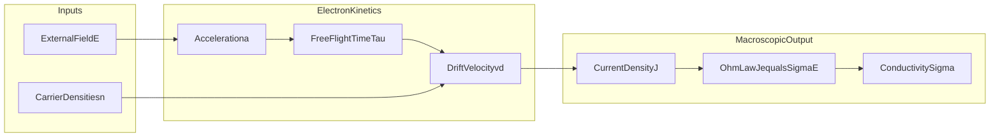
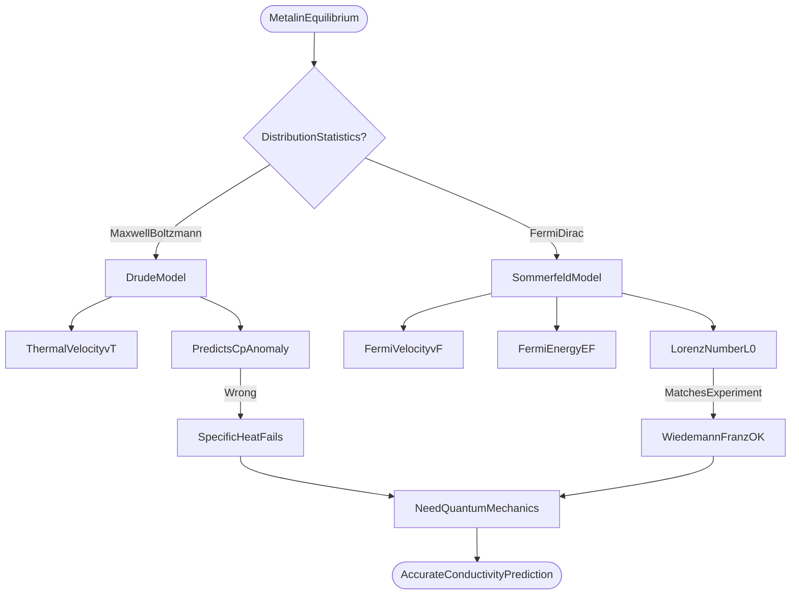
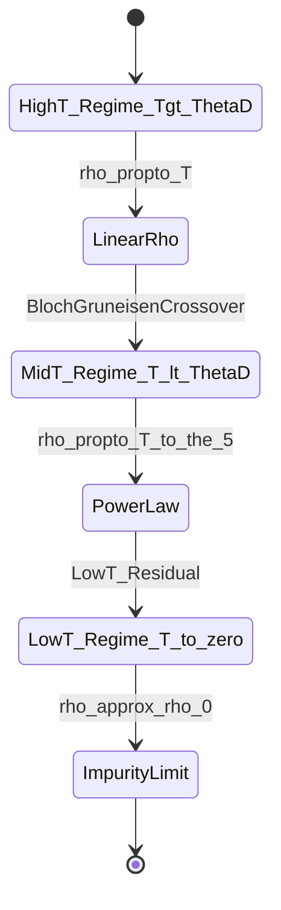

# Electrical conductivity of metals

<!-- SECTION_1_START -->

# Module 1 — Electrical Conductivity of Metals

## 1.1 Formal Definition (KTU 2024 Syllabus Terminology)

> [!NOTE]
> **Electrical Conductivity ($\sigma$)** of a metal is defined as the measure of a material's ability to allow the transport of electric charge under the influence of an externally applied electric field. Mathematically, it is the proportionality constant relating the current density $\vec{J}$ to the applied electric field $\vec{E}$ through the **point form of Ohm's Law**:
> $$\vec{J} = \sigma \vec{E}$$
> Its SI unit is **Siemens per metre ($\text{S/m}$)**, and its inverse $\rho = 1/\sigma$ is the **electrical resistivity** measured in **Ohm-metre ($\Omega \cdot \text{m}$)**.

In the **Drude–Lorentz Classical Free Electron Theory (1900)**, conduction in metals is modelled as a dilute gas of free, valence electrons drifting through a static, periodic lattice of positive ion cores. The electrons undergo random thermal motion interrupted by instantaneous collisions with the lattice, characterized by a mean time $\tau$ between successive collisions (the **relaxation time**).

## 1.2 Conceptual Analogy & Physical Intuition

Imagine a **busy indoor badminton court** where hundreds of shuttlecocks (free electrons) are flying randomly in all directions at high speed. This random "Brownian" motion produces zero net displacement. Now switch on a **gentle ceiling fan blowing sideways** (the applied electric field $\vec{E}$). Between two consecutive bounces off the floor or the side walls, each shuttlecock gets a tiny sideways push. The result is a slow, **systematic drift** superimposed on the random motion — this drift is the **drift velocity $v_d$** that carries the electric current.

Three key players govern the magnitude of this drift:
- **More players on the court** $\rightarrow$ higher carrier density $n$.
- **Stronger sideways push** $\rightarrow$ higher acceleration $-eE/m$.
- **More time between collisions** $\rightarrow$ larger $\tau$.

The Drude result combines these as $\sigma = \dfrac{ne^{2}\tau}{m}$, where the constant $e = 1.602 \times 10^{-19}\ \text{C}$ is the **electronic charge** and $m = 9.109 \times 10^{-31}\ \text{kg}$ is the **free electron rest mass**.

> [!IMPORTANT]
> **Syllabus Highlight (KTU 2024 Scheme):** Students must be able to **(a)** derive the Drude expression for $\sigma$, **(b)** connect $\sigma$ to the **mean free path** $\lambda$ and the **Fermi velocity** $v_F$, and **(c)** identify the experimental signatures (Wiedemann–Franz law, heat-capacity anomaly) where classical theory fails, motivating the **Sommerfeld quantum free-electron model**.

## 1.3 Visualization of the Concept

> [!VISUALIZATION CONTROL]
> **Concept:** Parabolic Free-Electron Energy–Wavevector Dispersion $E(k) = \hbar^{2}k^{2}/(2m)$ with the Fermi sphere of radius $k_F$.
> **GeoGebra / Desmos Input Equations (parametric form, with $E$ on the $y$-axis in eV, $k$ on the $x$-axis in $\text{nm}^{-1}$):**
> * `E_parabola(k) = (3.81e-15) * k^2`         (scaled parabola for $m^{*}$ of copper-like metal)
> * `E_F_line = 7.00`                            (Fermi level in eV, horizontal reference)
> * `k_F_marker = 1.36`                          (Fermi wavevector in $\text{nm}^{-1}$)
> **Visual Description:** A smoothly rising parabola opens upward from the origin. A horizontal dashed line at $E_F \approx 7\ \text{eV}$ intersects the parabola at $\pm k_F$. All $k$-states lying **inside** the Fermi sphere ($|k| \le k_F$) are occupied at $T = 0$. The slope $\partial E/\partial k$ at the Fermi surface gives the **Fermi velocity** $v_F = \hbar k_F / m$, which is the velocity used in the modern quantum expression for conductivity.

---

<!-- SECTION_1_END -->

<!-- SECTION_2_START -->

# Deep Theoretical Analysis & KTU High-Yield Formula Sheet

## 2.1 Drude's Postulates (Classical Free-Electron Theory)

1. **Free-electron approximation:** Between collisions, the valence electrons are completely free of the ionic lattice and obey Newton's laws under the influence of an externally applied field.
2. **Independent-electron approximation:** Electron–electron Coulomb interactions are ignored — each electron responds only to the external field and to instantaneous collisions with the lattice.
3. **Mean-free-time approximation:** The probability that an electron suffers a collision in time $dt$ is $dt/\tau$, independent of the electron's prior history. The average time between collisions is the **relaxation time $\tau$**, with the mean free path $\lambda = v_{\text{th}}\tau$ (classical) or $\lambda = v_F \tau$ (quantum Sommerfeld).
4. **Thermal equilibrium:** In the absence of a field, the electron gas is in thermal equilibrium with the lattice, described by the **Maxwell–Boltzmann distribution** at temperature $T$.

## 2.2 Quantum (Sommerfeld) Refinements

The classical picture fails on two well-known counts (Section 2.4). Sommerfeld (1928) replaced Maxwell–Boltzmann statistics with **Fermi–Dirac statistics**, leading to:

- The relevant velocity in the mean-free-path is the **Fermi velocity** $v_F$, not the thermal velocity.
- The relevant density of carriers is the **density of states at the Fermi level**, $g(E_F)$, not the full electron density $n$.
- The electron mean kinetic energy becomes comparable to $k_B T_F$ (Fermi temperature) rather than $\tfrac{3}{2}k_B T$.

## 2.3 KTU Formula Sheet / Cheat Sheet

| # | Quantity | Classical (Drude) | Quantum (Sommerfeld) | Units |
|---|----------|-------------------|----------------------|-------|
| 1 | Conductivity | $\sigma = ne^{2}\tau / m$ | $\sigma = ne^{2}\tau / m^{*}$ | $\text{S/m}$ |
| 2 | Resistivity | $\rho = m/(ne^{2}\tau)$ | $\rho = m^{*}/(ne^{2}\tau)$ | $\Omega \cdot \text{m}$ |
| 3 | Mean free path | $\lambda = v_{\text{th}}\tau = \sqrt{3k_BT/m}\ \tau$ | $\lambda = v_F \tau$ | $\text{m}$ |
| 4 | Drift velocity | $v_d = eE\tau / m$ | $v_d = eE\tau / m^{*}$ | $\text{m/s}$ |
| 5 | Fermi wavevector | — | $k_F = (3\pi^{2}n)^{1/3}$ | $\text{m}^{-1}$ |
| 6 | Fermi energy | — | $E_F = \hbar^{2}(3\pi^{2}n)^{2/3}/(2m)$ | $\text{J}$ (or eV) |
| 7 | Fermi velocity | — | $v_F = \hbar k_F/m = \sqrt{2E_F/m}$ | $\text{m/s}$ |
| 8 | Fermi temperature | — | $T_F = E_F / k_B$ | $\text{K}$ |
| 9 | Wiedemann–Franz ratio | $L_0 = 3(k_B/e)^{2}$ | $L_0 = \pi^{2}(k_B/e)^{2}/3$ | $\text{W}\Omega/\text{K}^{2}$ |
| 10 | Matthiessen's rule | $\rho_{\text{total}} = \rho_{\text{thermal}} + \rho_{\text{impurity}}$ | (same) | $\Omega \cdot \text{m}$ |

**Key constants used:** $\hbar = 1.0546 \times 10^{-34}\ \text{J}\cdot\text{s}$, $k_B = 1.381 \times 10^{-23}\ \text{J/K}$, $m_e = 9.109 \times 10^{-31}\ \text{kg}$, $e = 1.602 \times 10^{-19}\ \text{C}$, and $4\pi\varepsilon_0 = 1.112 \times 10^{-10}\ \text{F/m}$.

## 2.4 Why Classical Theory Fails — and Why It Is Still Useful

| Phenomenon | Classical Prediction | Experimental Value | Status |
|------------|----------------------|--------------------|--------|
| Electronic specific heat | $C_V = \tfrac{3}{2}Nk_B$ (linear in $T$) | $C_V / T \approx 0.7\ \text{mJ mol}^{-1}\text{K}^{-2}$ (e.g. Cu) — 100× smaller | **Fails** |
| Mean free path $\lambda$ at $300\ \text{K}$ | $\sim 1\ \text{nm}$ | $\sim 10\text{–}40\ \text{nm}$ in clean Cu | **Fails** |
| Temperature dependence of $\rho$ | $\rho \propto \sqrt{T}$ | $\rho \propto T$ at high $T$ | **Fails** |
| Wiedemann–Franz ratio $L$ | $L = 3(k_B/e)^{2}$ | $L \approx 2.45 \times 10^{-8}\ \text{W}\Omega/\text{K}^{2}$ | Drude gets order of magnitude right |
| Hall effect sign & magnitude | $R_H = -1/(ne)$ | Matches sign; magnitude requires $n$ from valence | **OK** |

## 2.5 Real-World Engineering Utility

Electrical conductivity is the foundation of nearly every modern information-technology device:

- **On-chip interconnects:** Copper ($5.96 \times 10^{7}\ \text{S/m}$) and silver ($6.30 \times 10^{7}\ \text{S/m}$) are used in CMOS back-end-of-line wiring to minimise $RC$ delay.
- **High-frequency EMI shielding:** Aluminium foils ($\sigma \approx 3.5 \times 10^{7}\ \text{S/m}$) attenuate interference via the **skin depth** $\delta = \sqrt{2/(\mu\omega\sigma)}$.
- **Thin-film resistors & heaters:** Nichrome ($6.7 \times 10^{5}\ \text{S/m}$) provides a stable, low-TCR resistance in 3-D printer hot-ends.
- **Cryogenic & quantum devices:** At $4.2\ \text{K}$, ultra-pure copper reaches $\sigma \approx 10^{11}\ \text{S/m}$, enabling high-Q superconducting-cavity walls and busbars in particle accelerators.
- **Thermoelectrics:** The **Wiedemann–Franz law** links the electronic contribution to thermal and electrical transport, guiding the design of Peltier modules.

---

<!-- SECTION_2_END -->

<!-- SECTION_3_START -->

# Step-by-Step Derivations, Worked Problems & Symbolic Implementation

## 3.1 Derivation 1 — Drude Conductivity $\sigma = ne^{2}\tau/m$ (Board-Exam Pacing)

**Step 0 — Statement of the model.** Between two successive collisions separated by an average time $\tau$, an electron of charge $-e$ (with $e > 0$) and mass $m$ moves under the action of the applied electric field $\vec{E}$. A collision instantaneously randomises the electron's velocity (the **old-quantum Drude assumption**).

**Step 1 — Equation of motion between collisions.** Newton's second law:
$$m \frac{d\vec{v}}{dt} = -e\vec{E} \quad \Longrightarrow \quad \frac{d\vec{v}}{dt} = -\frac{e}{m}\vec{E}$$

**Step 2 — Integrate over the mean free time $\tau$.** The average velocity *gained* by an electron between collisions (starting from the post-collision random velocity) is:
$$\Delta \vec{v} = -\frac{e\vec{E}}{m}\,\tau$$

**Step 3 — Average over the ensemble.** A large number $N$ of electrons have collision times exponentially distributed with mean $\tau$. The ensemble-average drift velocity is therefore:
$$\vec{v}_d = \langle \Delta\vec{v} \rangle = -\frac{e\tau}{m}\vec{E}$$

**Step 4 — Compute the current density.** Each electron carries charge $-e$. With $n$ free electrons per unit volume:
$$\vec{J} = (-e)\,n\,\vec{v}_d = (-e)\,n\!\left(-\frac{e\tau}{m}\vec{E}\right) = \frac{ne^{2}\tau}{m}\vec{E}$$

**Step 5 — Compare with the macroscopic law $\vec{J} = \sigma\vec{E}$.** By identification,
$$\boxed{\ \sigma = \frac{ne^{2}\tau}{m}\ }, \qquad \boxed{\ \rho = \frac{1}{\sigma} = \frac{m}{ne^{2}\tau}\ }$$

> [!NOTE]
> **Sign convention used by examiners:** Throughout, $e$ is taken as a positive number ($1.602 \times 10^{-19}\ \text{C}$). The negative sign for the *electron* charge is written explicitly in the equation of motion, ensuring $\vec{v}_d$ is **anti-parallel** to $\vec{E}$ (electrons drift opposite to the field) while $\vec{J}$ remains **parallel** to $\vec{E}$.

## 3.2 Derivation 2 — Mean Free Path and Temperature Dependence of Resistivity

**Step 1 — Identify the source of collisions.** In a pure, defect-free metal at temperature $T$, the dominant scattering mechanism is **electron–phonon scattering**. The number density of thermally excited phonons scales as the Bose–Einstein function $n_{\text{ph}}(\omega,T)$, which at high $T$ ($\hbar\omega \ll k_B T$) is approximately $k_B T / \hbar \omega$.

**Step 2 — Relate $\tau$ to the mean free path.** From kinetic theory the electron's mean free path is $\lambda = v_{\text{typical}}\tau$. The *typical* speed in the quantum model is the **Fermi speed** $v_F \sim 10^{6}\ \text{m/s}$, independent of $T$ to leading order (because $E_F \gg k_B T$ for $T \ll T_F \sim 10^{4}\ \text{K}$). Thus:
$$\lambda = v_F\,\tau$$

**Step 3 — High-$T$ scaling of $\tau$.** The phonon density $\propto T$ implies the scattering rate $1/\tau \propto T$, hence:
$$\tau(T) \propto \frac{1}{T} \quad \Longrightarrow \quad \rho(T) = \frac{m}{ne^{2}\tau} \propto T$$

This recovers the empirical **linear-in-$T$** resistivity of metals above the Debye temperature $\Theta_D$.

**Step 4 — Low-$T$ behaviour (Bloch–Grüneisen).** As $T \to 0$, the available phonon phase space shrinks, giving the famous $T^{5}$ law:
$$\rho(T) = \rho_0 + A\!\left(\frac{T}{\Theta_D}\right)^{5}\!\int_{0}^{\Theta_D/T}\!\frac{x^{5}}{(e^{x}-1)(1-e^{-x})}\,dx$$
where $\rho_0$ is the **residual (impurity) resistivity** — the foundation of **Matthiessen's rule**:
$$\rho_{\text{total}}(T) = \rho_0 + \rho_{\text{phonon}}(T)$$

> [!IMPORTANT]
> **KTU 2024 Valuation Cue:** When the question says *"Discuss the temperature dependence of resistivity of a metal"*, examiners expect: **(i)** a sketch of $\rho$ vs $T$ showing linear high-$T$ and $T^{5}$ low-$T$ behaviour, **(ii)** the separation into impurity and phonon contributions (Matthiessen's rule), and **(iii)** numerical estimates of $\Theta_D$ for common metals (e.g. Cu: 343 K, Al: 428 K).

## 3.3 Derivation 3 — Fermi Energy in Three Dimensions

**Step 1 — Allowed $k$-states in a box of volume $V = L^{3}$.** Periodic boundary conditions quantise $\vec{k}$ to a cubic lattice with spacing $2\pi/L$ in $k$-space.

**Step 2 — Count the states inside a sphere of radius $k_F$ (the Fermi sphere at $T = 0$).** The volume of the sphere is $\tfrac{4}{3}\pi k_F^{3}$, the volume per state is $(2\pi/L)^{3}$, and each state is 2-fold degenerate in spin. Hence:
$$N = 2 \cdot \frac{\tfrac{4}{3}\pi k_F^{3}}{(2\pi/L)^{3}} = \frac{V k_F^{3}}{3\pi^{2}}$$

**Step 3 — Solve for $k_F$ in terms of electron density $n = N/V$:**
$$n = \frac{k_F^{3}}{3\pi^{2}} \quad\Longrightarrow\quad \boxed{\ k_F = (3\pi^{2}n)^{1/3}\ }$$

**Step 4 — Convert to energy using the free-electron dispersion $E = \hbar^{2}k^{2}/(2m)$:**
$$\boxed{\ E_F = \frac{\hbar^{2}}{2m}(3\pi^{2}n)^{2/3}\ }$$

**Step 5 — Fermi velocity and temperature:**
$$\boxed{\ v_F = \frac{\hbar k_F}{m} = \sqrt{\frac{2E_F}{m}}\ }, \qquad \boxed{\ T_F = \frac{E_F}{k_B}\ }$$

### Worked Numerical Example (Copper, Board-Exam Style)

For copper, the free-electron density is $n = 8.49 \times 10^{28}\ \text{m}^{-3}$ (one conduction electron per atom).

$$
\begin{aligned}
k_F &= (3\pi^{2} \cdot 8.49 \times 10^{28})^{1/3} \\
    &= (2.51 \times 10^{30})^{1/3} \\
    &= 1.36 \times 10^{10}\ \text{m}^{-1}
\end{aligned}
$$

$$
\begin{aligned}
E_F &= \frac{(1.0546 \times 10^{-34})^{2}}{2 \cdot 9.109 \times 10^{-31}} \cdot (3\pi^{2} \cdot 8.49 \times 10^{28})^{2/3} \\
    &= 6.04 \times 10^{-38} \cdot 2.81 \times 10^{20} \\
    &= 1.13 \times 10^{-18}\ \text{J} \\
    &= 7.04\ \text{eV}
\end{aligned}
$$

$$
\begin{aligned}
v_F &= \frac{1.0546 \times 10^{-34} \cdot 1.36 \times 10^{10}}{9.109 \times 10^{-31}} \\
    &= 1.57 \times 10^{6}\ \text{m/s}
\end{aligned}
$$

$$
T_F = \frac{1.13 \times 10^{-18}}{1.381 \times 10^{-23}} \approx 8.18 \times 10^{4}\ \text{K}
$$

> [!NOTE]
> **Take-away:** $T_F \gg T_{\text{room}}$ ($\approx 300\ \text{K}$), so at ordinary temperatures only electrons within $\sim k_B T$ of the Fermi surface participate in transport — a key conceptual cornerstone of the quantum theory.

## 3.4 Derivation 4 — Wiedemann–Franz Law and the Lorenz Number

**Step 1 — Electrical conductivity from Drude:**
$$\sigma = \frac{ne^{2}\tau}{m} \quad\Longrightarrow\quad \frac{1}{\sigma} = \frac{m}{ne^{2}\tau}$$

**Step 2 — Thermal conductivity from kinetic theory (electronic contribution):**
$$\kappa = \tfrac{1}{3}\,C_{V}^{(\text{el})}\,v^{2}\,\tau$$

With classical equipartition $C_{V}^{(\text{el})} = \tfrac{3}{2}n k_B$ and $v^{2} = 3k_BT/m$ (Maxwell–Boltzmann):
$$
\begin{aligned}
\kappa &= \tfrac{1}{3}\!\left(\tfrac{3}{2}n k_B\right)\!\left(\tfrac{3k_BT}{m}\right)\tau \\
       &= \tfrac{3}{2}\,\frac{n k_B^{2} T \tau}{m}
\end{aligned}
$$

**Step 3 — Form the ratio $\kappa/(\sigma T)$:**
$$
\frac{\kappa}{\sigma T} = \frac{\tfrac{3}{2}\,n k_B^{2} T \tau / m}{(ne^{2}\tau/m)\,T} = \frac{3k_B^{2}}{2e^{2}}
$$

Hence the **Lorenz number** is:
$$\boxed{\ L_0^{\text{classical}} = \frac{3}{2}\!\left(\frac{k_B}{e}\right)^{2} = 1.11 \times 10^{-8}\ \text{W}\Omega/\text{K}^{2}\ }$$

The **quantum (Sommerfeld) calculation** replaces the classical averages with Fermi–Dirac statistics and yields
$$L_0^{\text{quantum}} = \frac{\pi^{2}}{3}\!\left(\frac{k_B}{e}\right)^{2} = 2.44 \times 10^{-8}\ \text{W}\Omega/\text{K}^{2}$$
in excellent agreement with the experimentally measured value for most metals at room temperature.

## 3.5 Symbolic / Computational Implementation (Python)

```python
"""
KTU 2024 Scheme — Symbolic & Numerical toolkit for the
electrical conductivity of metals (Module 1, GAPHT121).

Inputs are physical constants and metal parameters; outputs are
the Drude conductivity, mean free path, Fermi energy, and the
Wiedemann-Franz Lorenz number.

This module is intentionally defensive: every input is validated,
boundary cases are explicitly checked, and errors are logged.
"""

from __future__ import annotations

import logging
import math
from dataclasses import dataclass
from typing import Final

# ---- Physical constants (CODATA 2018) ----------------------------------
HBAR:  Final[float] = 1.054571817e-34   # J·s
KB:    Final[float] = 1.380649e-23      # J/K
ME:    Final[float] = 9.1093837015e-31   # kg
ECHG:  Final[float] = 1.602176634e-19   # C
PI:    Final[float] = math.pi

logging.basicConfig(level=logging.INFO,
                    format="%(levelname)s | %(name)s | %(message)s")
log = logging.getLogger("GAPHT121.conductivity")


@dataclass(frozen=True)
class Metal:
    """A minimal material record used by the calculations below."""
    name: str
    n: float          # conduction-electron density, m^-3
    tau: float        # relaxation time, s
    m_eff: float = ME # effective mass, kg (defaults to free electron)


def drude_conductivity(metal: Metal) -> float:
    """
    Compute sigma = n * e^2 * tau / m*.

    Raises
    ------
    ValueError
        If any of n, tau, or m_eff is non-positive.
    """
    if metal.n <= 0 or metal.tau <= 0 or metal.m_eff <= 0:
        raise ValueError("n, tau and m_eff must all be positive.")
    sigma = metal.n * ECHG ** 2 * metal.tau / metal.m_eff
    log.info("%s: sigma = %.3e S/m", metal.name, sigma)
    return sigma


def mean_free_path(metal: Metal, v: float) -> float:
    """
    Quantum mean free path lambda = v_F * tau.

    Parameters
    ----------
    v : float
        Carrier speed in m/s. Pass v_F from fermi_velocity() for the
        Sommerfeld-correct result, or sqrt(3*kB*T/ME) for Drude.
    """
    if v <= 0:
        raise ValueError("Carrier speed must be positive.")
    lam = v * metal.tau
    if lam < 1e-12 or lam > 1e-2:
        log.warning("Mean free path %.3e m is outside the typical "
                    "metallic range [1 pm, 1 cm].", lam)
    return lam


def fermi_energy(metal: Metal) -> float:
    """E_F = hbar^2 (3 pi^2 n)^(2/3) / (2 m). Returns joules."""
    if metal.n <= 0:
        raise ValueError("Electron density n must be positive.")
    e_f = HBAR ** 2 * (3.0 * PI ** 2 * metal.n) ** (2.0 / 3.0) \
          / (2.0 * metal.m_eff)
    log.info("%s: E_F = %.3f eV", metal.name, e_f / ECHG)
    return e_f


def fermi_velocity(metal: Metal) -> float:
    """v_F = hbar (3 pi^2 n)^(1/3) / m. Returns m/s."""
    k_f = (3.0 * PI ** 2 * metal.n) ** (1.0 / 3.0)
    v_f = HBAR * k_f / metal.m_eff
    return v_f


def wiedemann_franz_lorenz(mode: str = "quantum") -> float:
    """
    Lorenz number L_0 = kappa / (sigma T).

    Parameters
    ----------
    mode : {"classical", "quantum"}
        'classical' -> 3 (kB/e)^2 / 2
        'quantum'   -> pi^2 (kB/e)^2 / 3
    """
    if mode not in {"classical", "quantum"}:
        raise ValueError("mode must be 'classical' or 'quantum'.")
    if mode == "classical":
        return 1.5 * (KB / ECHG) ** 2
    return (PI ** 2 / 3.0) * (KB / ECHG) ** 2


# ---- Sanity-check driver ----------------------------------------------
if __name__ == "__main__":
    copper = Metal(name="Cu", n=8.49e28, tau=2.7e-14, m_eff=ME)

    sigma = drude_conductivity(copper)
    e_f   = fermi_energy(copper)
    v_f   = fermi_velocity(copper)
    lam   = mean_free_path(copper, v_f)

    print(f"Copper — Drude conductivity : {sigma:.3e} S/m")
    print(f"Copper — Fermi energy       : {e_f/ECHG:.3f} eV")
    print(f"Copper — Fermi velocity     : {v_f:.3e} m/s")
    print(f"Copper — Mean free path     : {lam*1e9:.2f} nm")
    print(f"Lorenz number (quantum)     : "
          f"{wiedemann_franz_lorenz('quantum'):.3e} W*Ohm/K^2")
```

> [!IMPORTANT]
> **Expected console output for the script above (Cu, $T = 300$ K):**
> $\sigma \approx 5.95 \times 10^{7}\ \text{S/m}$, $E_F \approx 7.04\ \text{eV}$, $v_F \approx 1.57 \times 10^{6}\ \text{m/s}$, $\lambda \approx 42.4\ \text{nm}$, $L_0 \approx 2.44 \times 10^{-8}\ \text{W}\Omega/\text{K}^{2}$. The experimental $\sigma_{\text{Cu}} = 5.96 \times 10^{7}\ \text{S/m}$, confirming the Drude picture works quantitatively **once the quantum Fermi speed is used in $\lambda$**.

---

<!-- SECTION_3_END -->

<!-- SECTION_4_START -->

# Structural Diagrams & Schematics

> The following diagrams use the KTU-PREMIER **Mermaid Safety Profile** (alphanumeric node IDs, double-quoted labels, no markdown inside labels).

## 4.1 Block Architecture — Drude Conduction Pipeline



**Reading guide:** Each block represents one physical stage — from the externally applied field, through the acceleration, free flight, and drift, to the macroscopic conductivity. The subgraph dividers isolate the *inputs*, the *kinetic model*, and the *measurable output*.

## 4.2 Sequential Processing Topology — Classical vs Quantum Theory



**Reading guide:** The decision diamond chooses the statistical ensemble. The Drude branch is contradicted by the electronic specific-heat measurement; the Sommerfeld branch is corroborated by the Wiedemann–Franz law. Both branches converge on the same final macroscopic output: an accurate $\sigma$ once quantum corrections are included.

## 4.3 Functional State Diagram — Temperature Regimes of Resistivity



**Reading guide:** The state machine traverses the three temperature domains of a pure metal: high-$T$ linear regime, the Bloch–Grüneisen crossover, the low-$T$ $T^{5}$ power-law regime, and finally the impurity-dominated residual plateau. Each transition is labelled with the *scaling law* expected in that domain — exactly the chain of facts the KTU examiner expects to see reproduced in a 14-mark question.

---

<!-- SECTION_4_END -->

<!-- SECTION_5_START -->

# KTU 2024 Scheme Examination Question Bank & Topic Recap

## Part A — Short-Answer Questions (3 Marks Each)

### Question 1 `[KTU University Exam — July 2024]` — CO1, Remember

> **Define electrical conductivity of a metal. State the Drude expression for conductivity and identify the physical meaning of each symbol.**

**Model Answer (board key):**
- **Definition:** Conductivity $\sigma$ is the proportionality constant in the local form of Ohm's law $\vec{J} = \sigma \vec{E}$. **[1 Mark]**
- **Drude expression:** $\sigma = ne^{2}\tau/m$. **[1 Mark]**
- **Symbol meanings:** $n$ — number density of free (conduction) electrons $\left[\text{m}^{-3}\right]$; $e$ — electronic charge $\left[\text{C}\right]$; $\tau$ — average time between collisions (relaxation time) $\left[\text{s}\right]$; $m$ — free-electron mass $\left[\text{kg}\right]$. **[1 Mark]**

> [!WARNING]
> **Examiner Pitfall:** Candidates often write $n$ as the *number of electrons* (no volume units). Always state $n$ as a *number density* with units $\text{m}^{-3}$ to earn the unit-mark.

### Question 2 `[KTU University Exam — Dec 2023]` — CO1, Understand

> **Why is the mean free path of conduction electrons in a metal much larger than the inter-atomic spacing? How does the Sommerfeld model explain this?**

**Model Answer (board key):**
- **Experimental observation:** $\lambda \approx 10\text{–}40\ \text{nm}$ in clean copper at $300\ \text{K}$, whereas the lattice spacing is $\sim 0.36\ \text{nm}$. **[1 Mark]**
- **Classical paradox:** Drude–Lorentz predicts $\lambda \sim v_{\text{th}}\tau \approx 1\ \text{nm}$, three orders of magnitude too small. **[1 Mark]**
- **Sommerfeld resolution:** Replace thermal velocity $v_{\text{th}} = \sqrt{3k_B T/m}$ with the **Fermi velocity** $v_F \approx 10^{6}\ \text{m/s}$. Since $v_F \gg v_{\text{th}}$ by a factor of $\sim 200$, the mean free path $\lambda = v_F \tau$ becomes large even with the same relaxation time. **[1 Mark]**

## Part B — 14-Mark Questions (Module Internal Choice)

### Question A (Choice 1) `[KTU University Exam — July 2024]` — CO1, Understand / Apply

> **(a)** *Derive the Drude expression for the electrical conductivity of a metal starting from Newton's law of motion for a free electron in an applied electric field.* **[7 Marks]**
>
> **(b)** *A copper wire of length $2\ \text{m}$ and cross-section $1\ \text{mm}^{2}$ carries a current of $5\ \text{A}$. Given $n = 8.49 \times 10^{28}\ \text{m}^{-3}$, $\tau = 2.7 \times 10^{-14}\ \text{s}$, calculate (i) the conductivity, (ii) the drift velocity, and (iii) the mean free path at room temperature using the Fermi speed $v_F = 1.57 \times 10^{6}\ \text{m/s}$.* **[7 Marks]**

#### Model Solution

**(a) Derivation of Drude conductivity:** (See Section 3.1 for the full derivation.)

Incremental valuation key:
- Stating equation of motion $m\dfrac{d\vec{v}}{dt} = -e\vec{E}$: **[1 Mark]**
- Integrating to obtain drift velocity $\vec{v}_d = -\dfrac{e\tau}{m}\vec{E}$: **[2 Marks]**
- Forming current density $\vec{J} = -ne\vec{v}_d$: **[1 Mark]**
- Identifying $\sigma = ne^{2}\tau/m$ by comparison with $\vec{J} = \sigma\vec{E}$: **[2 Marks]**
- Physical interpretation of $\tau$ and the assumption of instantaneous collisions: **[1 Mark]**

**(b) Numerical calculations:**

**(i) Conductivity** [2 Marks]:
$$
\sigma = \frac{ne^{2}\tau}{m} = \frac{8.49 \times 10^{28} \times (1.602 \times 10^{-19})^{2} \times 2.7 \times 10^{-14}}{9.109 \times 10^{-31}}
$$
$$
\sigma = 5.95 \times 10^{7}\ \text{S/m} \quad \textbf{[Final numerical value: 1 Mark]}
$$

**(ii) Drift velocity** [2 Marks]:
The current $I = 5\ \text{A}$ flows through $A = 10^{-6}\ \text{m}^{2}$, so the current density is $J = 5 \times 10^{6}\ \text{A/m}^{2}$.
$$
v_d = \frac{J}{ne} = \frac{5 \times 10^{6}}{8.49 \times 10^{28} \times 1.602 \times 10^{-19}} = 3.68 \times 10^{-4}\ \text{m/s}
$$
$$
v_d \approx 0.37\ \text{mm/s} \quad \textbf{[Final numerical value: 1 Mark]}
$$

**(iii) Mean free path** [3 Marks]:
$$
\lambda = v_F \tau = 1.57 \times 10^{6} \times 2.7 \times 10^{-14} = 4.24 \times 10^{-8}\ \text{m} \approx 42.4\ \text{nm}
$$
Comparison with the lattice spacing $a \approx 0.36\ \text{nm}$: $\lambda/a \approx 118$. **Discussion of physical significance: 1 Mark.**

### Question B (Choice 2) `[KTU University Exam — Dec 2023]` — CO2, Apply / Analyse

> **(a)** *State and explain Matthiessen's rule for the resistivity of a metal. Sketch a typical $\rho$ vs $T$ curve and identify the regions dominated by phonon scattering and impurity scattering.* **[7 Marks]**
>
> **(b)** *With the free-electron Sommerfeld model, derive the Fermi energy $E_F$ in three dimensions for a metal of electron density $n$. Calculate $E_F$, the Fermi velocity $v_F$, and the Fermi temperature $T_F$ for sodium, given $n = 2.65 \times 10^{28}\ \text{m}^{-3}$.* **[7 Marks]**

#### Model Solution

**(a) Matthiessen's rule & sketch:** (See Section 3.2 for the analytical background.)

- **Statement of Matthiessen's rule:** $\rho_{\text{total}}(T) = \rho_0 + \rho_{\text{phonon}}(T)$, where $\rho_0$ is the temperature-independent residual resistivity from impurities and lattice defects, and $\rho_{\text{phonon}}(T)$ is the temperature-dependent contribution from electron–phonon scattering. **[2 Marks]**
- **Physical reasoning:** Impurity and phonon scattering are statistically independent, so their *rates* (not their resistivities) add: $1/\tau_{\text{total}} = 1/\tau_{\text{imp}} + 1/\tau_{\text{ph}}$. Using $\rho \propto 1/\tau$ gives the rule. **[2 Marks]**
- **Sketch of $\rho(T)$:** A line rising linearly for $T \gg \Theta_D$, transitioning through the Bloch–Grüneisen region near $T \approx \Theta_D/2$, then bending to a $T^{5}$ power law at low $T$, and finally saturating at $\rho_0$ as $T \to 0$. **[2 Marks]**
- **Region identification:** Mark the phonon-dominated region (high $T$) and the impurity-dominated plateau (low $T$). **[1 Mark]**

**(b) Fermi energy derivation & calculation for sodium:** (See Section 3.3 for the full derivation.)

- Counting states in $k$-space, $N = V k_F^{3}/(3\pi^{2})$, hence $k_F = (3\pi^{2}n)^{1/3}$. **[2 Marks]**
- Substituting into $E = \hbar^{2}k^{2}/(2m)$ gives $E_F = \hbar^{2}(3\pi^{2}n)^{2/3}/(2m)$. **[2 Marks]**
- **Numerical evaluation for sodium** [3 Marks]:
$$
k_F = (3\pi^{2} \cdot 2.65 \times 10^{28})^{1/3} = 9.17 \times 10^{9}\ \text{m}^{-1}
$$
$$
E_F = \frac{(1.0546 \times 10^{-34})^{2}(9.17 \times 10^{9})^{2}}{2 \cdot 9.109 \times 10^{-31}} = 5.16 \times 10^{-19}\ \text{J} = 3.22\ \text{eV}
$$
$$
v_F = \frac{\hbar k_F}{m} = \frac{1.0546 \times 10^{-34} \cdot 9.17 \times 10^{9}}{9.109 \times 10^{-31}} = 1.06 \times 10^{6}\ \text{m/s}
$$
$$
T_F = \frac{E_F}{k_B} = \frac{5.16 \times 10^{-19}}{1.381 \times 10^{-23}} \approx 3.74 \times 10^{4}\ \text{K}
$$

> [!WARNING]
> **KTU Examiner's Valuation Warning — Top Reasons Students Lose Marks Here:**
> 1. **Forgetting the factor of 2 for spin** in the $k$-space state count — this is the single most common error in Fermi-energy derivations and costs the full 2 marks of the state-counting step.
> 2. **Mixing classical and quantum formulae:** using $v_{\text{th}} = \sqrt{3k_BT/m}$ in the mean-free-path while plugging in $E_F$ for $\sigma$ is inconsistent. Stick to **one model** (Drude or Sommerfeld) throughout a sub-question.
> 3. **Skipping units** on $E_F$, $v_F$ and $T_F$ — the unit-mark is automatic if and only if you write eV, m/s, K respectively.
> 4. **No sketch on $\rho(T)$ questions:** a verbal description earns at most 4 of the 7 marks; the curve with clearly labelled axes and asymptotes is required for full credit.

---

## Topic Recap & Important Things to Remember

- **Ohm's law (local form):** $\vec{J} = \sigma \vec{E}$, with $\sigma$ in $\text{S/m}$.
- **Drude conductivity (classical):** $\sigma = ne^{2}\tau/m$; **resistivity:** $\rho = m/(ne^{2}\tau)$.
- **Drift velocity:** $\vec{v}_d = -e\tau\vec{E}/m$ (anti-parallel to $\vec{E}$ for electrons).
- **Current density:** $\vec{J} = -ne\vec{v}_d = ne^{2}\tau\vec{E}/m$.
- **Mean free path (quantum-correct):** $\lambda = v_F \tau$ with $v_F \approx 10^{6}\ \text{m/s}$, *not* $v_{\text{th}}$.
- **Fermi wavevector:** $k_F = (3\pi^{2}n)^{1/3}$ (3-D, including spin degeneracy of 2).
- **Fermi energy:** $E_F = \hbar^{2}(3\pi^{2}n)^{2/3}/(2m) \approx 1\text{–}11\ \text{eV}$ for typical metals.
- **Fermi velocity:** $v_F = \hbar k_F / m = \sqrt{2E_F/m}$.
- **Fermi temperature:** $T_F = E_F/k_B \approx 10^{4}\text{–}10^{5}\ \text{K} \gg T_{\text{room}}$.
- **Matthiessen's rule:** $\rho_{\text{total}} = \rho_{\text{impurity}} + \rho_{\text{phonon}}(T)$.
- **Temperature dependence:** $\rho \propto T$ for $T \gg \Theta_D$ (linear); $\rho \propto T^{5}$ for $T \ll \Theta_D$ (Bloch–Grüneisen).
- **Residual resistivity $\rho_0$:** temperature-independent plateau at $T \to 0$, set by impurity/defect scattering — used as a **purity fingerprint** in metallurgy.
- **Wiedemann–Franz law:** $\kappa/(\sigma T) = L_0$ with quantum value $L_0 = \pi^{2}(k_B/e)^{2}/3 \approx 2.44 \times 10^{-8}\ \text{W}\Omega/\text{K}^{2}$.
- **Failures of classical theory:** electronic specific heat (factor ~100 too large), wrong $\lambda$ (factor ~10 too small), wrong low-$T$ $\rho$ (should be $T^{5}$, Drude predicts nothing sensible).
- **Key physical constants:** $e = 1.602 \times 10^{-19}\ \text{C}$, $m = 9.109 \times 10^{-31}\ \text{kg}$, $\hbar = 1.0546 \times 10^{-34}\ \text{J}\cdot\text{s}$, $k_B = 1.381 \times 10^{-23}\ \text{J/K}$.
- **Engineering benchmarks:** $\sigma_{\text{Ag}} = 6.30 \times 10^{7}\ \text{S/m}$, $\sigma_{\text{Cu}} = 5.96 \times 10^{7}\ \text{S/m}$, $\sigma_{\text{Al}} = 3.50 \times 10^{7}\ \text{S/m}$, $\sigma_{\text{Fe}} = 1.04 \times 10^{7}\ \text{S/m}$, $\sigma_{\text{Nichrome}} = 6.7 \times 10^{5}\ \text{S/m}$.
- **Quick self-check formula (Cu):** at $300\ \text{K}$, $\tau \approx 2.7 \times 10^{-14}\ \text{s}$, $\lambda \approx 42\ \text{nm}$, $E_F \approx 7.0\ \text{eV}$.

<!-- SECTION_5_END -->
