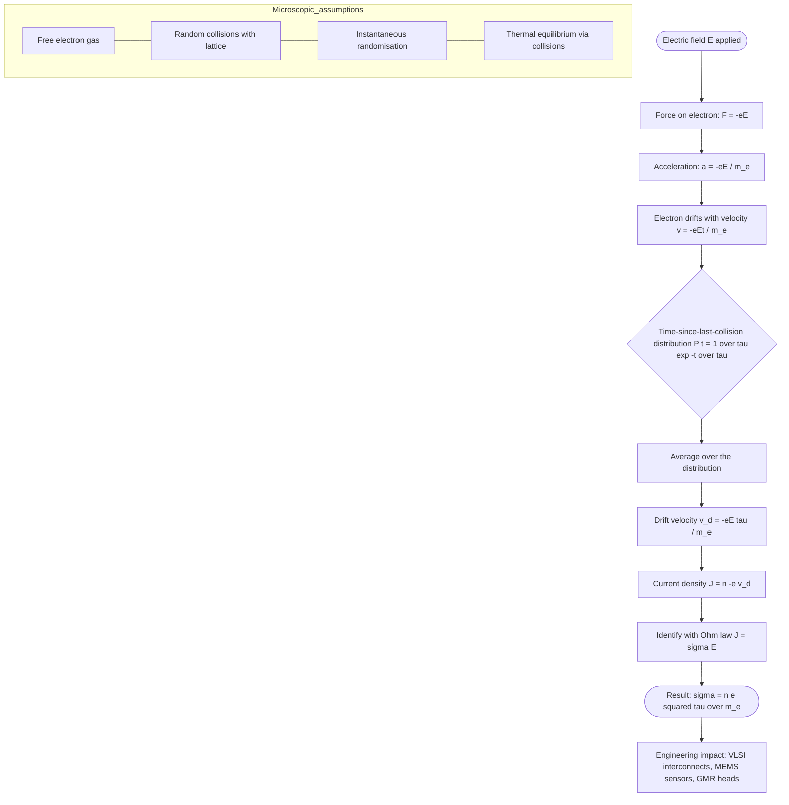
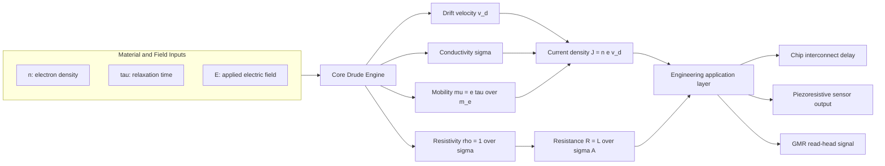
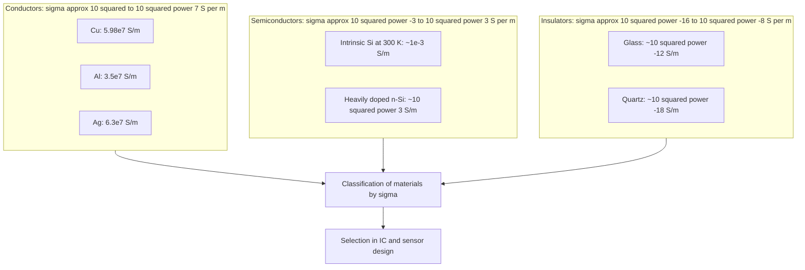

# Electrical conductivity

<!-- SECTION_1_START -->
# Electrical Conductivity — Core Definition & Intuitive Overview

## 1.1 Formal Academic Definition (KTU 2024 Syllabus Terminology)

**Electrical conductivity ($\sigma$)** is a fundamental transport property of a material that quantifies its ability to allow the flow of electric current in response to an applied electric field. It is defined as the proportionality constant relating the current density ($\vec{J}$) to the applied electric field ($\vec{E}$) at a point inside a conductor, as expressed in the **point form of Ohm's Law**:

$$\vec{J} = \sigma \, \vec{E}$$

The SI unit of conductivity is **siemens per metre (S/m)**, and it is the reciprocal of **electrical resistivity ($\rho$)**, which has units of **ohm-metre ($\Omega \cdot m$)**.

> [!IMPORTANT]
> **KTU Syllabus Highlight (GAPHT121 — Module 1):** Conductivity is the central thread connecting the **free electron (Drude) theory**, **band theory of solids**, and the **classification of materials** (conductors, semiconductors, insulators). Every numerical problem in this module eventually reduces to a statement of the form $\sigma = f(n, \tau, T)$.

## 1.2 Conceptual Analogy & Physical Intuition

> [!NOTE]
> **Water-Pipe Analogy**
> Imagine a long, horizontal water pipe filled with water molecules bouncing randomly. When you apply a pressure difference (analogous to the electric field $\vec{E}$) across the pipe ends, the water acquires a small *net drift* towards the low-pressure side (analogous to the **drift velocity** $\vec{v}_d$).
> * The **number density of free electrons** ($n$) plays the role of the *number of water molecules per unit volume*.
> * The **relaxation time** ($\tau$) — the average time between two successive collisions of an electron with the lattice — is like the *average time between molecule–wall collisions*.
> * The **conductivity** $\sigma$ is the *ease* with which the fluid flows: more molecules, longer mean free times, and a "smoother pipe" all make the flow easier, i.e., $\sigma$ larger.

The same picture applies in a metal: a sea of nearly free conduction electrons drifts under an applied field, while the stationary positive ion cores act as scattering centres. The Drude model captures this beautifully.

## 1.3 Fundamental Physical Constants Used in This Module

| Constant | Symbol | Standard Value | Significance |
|---|---|---|---|
| Elementary charge | $e$ | $1.602 \times 10^{-19}$ C | Charge carried by one electron |
| Free electron mass | $m_e$ | $9.109 \times 10^{-31}$ kg | Inertial mass in Newton's 2nd law |
| Permittivity of free space | $\varepsilon_0$ | $8.854 \times 10^{-12}$ F/m | Appears in plasmon frequency |
| Boltzmann constant | $k_B$ | $1.381 \times 10^{-23}$ J/K | Sets thermal velocity scale |
| Planck's constant | $h$ | $6.626 \times 10^{-34}$ J·s | Bridges classical and quantum regimes |

> [!TIP]
> Always carry the constants in **bold notation** in your answer scripts when first introducing them, as examiners award marks for explicit statement of assumptions and given data.

## 1.4 GeoGebra / Desmos Visualization

> [!VISUALIZATION CONTROL]
> **Concept:** Linear $J$–$E$ characteristic illustrating Ohm's law and the geometric meaning of conductivity as slope.
> **GeoGebra / Desmos Input Equations:**
> * Line 1: $J\_1(x) = 6 \cdot 10^{7} \cdot x$  (Copper-like, high $\sigma$)
> * Line 2: $J\_2(x) = 1 \cdot 10^{-2} \cdot x$  (Glass-like, low $\sigma$)
> * Line 3: $J\_3(x) = 100 \cdot x$  (Doped semiconductor, intermediate)
> **Visual Description:** Three straight lines through the origin on a $J$ (A/m²) vs $E$ (V/m) plot. The slope of each line is the conductivity $\sigma$. The student should observe that the steeper the line, the higher the conductivity, and that all lines pass through the origin because $\vec{E} = 0 \Rightarrow \vec{J} = 0$ in an ohmic medium.
<!-- SECTION_1_END -->

<!-- SECTION_2_START -->
# Deep Theoretical Analysis — Drude's Free Electron Theory

## 2.1 Underlying Assumptions of the Drude Model

The classical free-electron (Drude) theory treats conduction electrons as a **gas of free, non-interacting charged particles** bouncing through a static lattice of positive ions. The five core postulates are:

1. Between collisions, an electron experiences **no force** other than any externally applied electric field $\vec{E}$.
2. Collisions with the lattice are **instantaneous** randomising events that abruptly change the electron's velocity.
3. The probability of a collision occurring in an infinitesimal time $dt$ is $dt / \tau$, where $\tau$ is the **mean free time / relaxation time**.
4. After each collision, the electron emerges with a velocity **independent of its pre-collision velocity** and isotropically distributed.
5. Electrons reach **thermal equilibrium** with the lattice only through collisions.

## 2.2 Microscopic Derivation of Conductivity (Logical Steps)

* **Apply Newton's second law** to a free electron of charge $-e$ and mass $m_e$ in an applied field $\vec{E}$ between two successive collisions:
$$m_e \frac{d\vec{v}}{dt} = -e\vec{E}$$
* This gives a uniform acceleration $\vec{a} = -\dfrac{e\vec{E}}{m_e}$ and a velocity gained over a time $t$ since the last collision equal to $\vec{v}_{\text{gained}} = -\dfrac{e\vec{E}}{m_e}t$.
* **Average over all electrons** using the probability $P(t) = \dfrac{1}{\tau}e^{-t/\tau}$ that an electron has not suffered a collision for time $t$:
$$\vec{v}_d = \langle \vec{v} \rangle = -\frac{e\vec{E}}{m_e}\int_{0}^{\infty} t \, \frac{1}{\tau}e^{-t/\tau}\,dt = -\frac{e\vec{E}}{m_e}\,\tau$$
* **Relate current density to drift velocity**. With $n$ free electrons per unit volume each carrying charge $-e$:
$$\vec{J} = n(-e)\vec{v}_d = \frac{n e^{2}\tau}{m_e}\,\vec{E}$$
* **Read off the conductivity** by comparison with $\vec{J} = \sigma \vec{E}$:
$$\boxed{\sigma = \frac{n e^{2}\tau}{m_e}}$$

> [!NOTE]
> **Why this matters for KTU:** This single boxed expression is worth 5 to 7 marks on its own in any Part B question on Module 1. Memorise the four quantities $n$, $e$, $\tau$, $m_e$ and the conditions under which each may be assumed constant.

## 2.3 Mobility, Mean Free Path, and Related Quantities

* **Electron mobility** $\mu$ is defined as the *drift speed per unit applied field*:
$$\mu = \frac{v_d}{E} = \frac{e\tau}{m_e} \quad\Rightarrow\quad \sigma = n e \mu$$
* **Mean free path** $\lambda$ is the average distance travelled between collisions. With thermal speed $v_{th} = \sqrt{3k_BT/m_e}$ from kinetic theory:
$$\lambda = v_{th}\,\tau = \sqrt{\frac{3k_BT}{m_e}}\,\tau$$
* **Resistivity** is the reciprocal: $\rho = 1/\sigma$.

## 2.4 Temperature Dependence and Matthiessen's Rule

In a real metal, two independent scattering mechanisms act simultaneously:

* **Lattice (phonon) scattering** dominates at high $T$ and gives $\tau_{ph} \propto 1/T$, hence $\sigma \propto 1/T$ or $\rho \propto T$.
* **Impurity / defect scattering** is roughly temperature independent and gives a residual resistivity $\rho_0$.

The total resistivity is the sum (Matthiessen's rule):
$$\rho(T) = \rho_0 + A\,T$$
where $A$ is a material-specific constant. The corresponding relaxation times combine as
$$\frac{1}{\tau} = \frac{1}{\tau_{ph}} + \frac{1}{\tau_{imp}}$$

## 2.5 KTU Formula Sheet / Cheat Sheet

| # | Quantity | Symbol | Formula | SI Unit |
|---|---|---|---|---|
| 1 | Current density | $\vec{J}$ | $\vec{J} = n(-e)\vec{v}_d$ | A/m² |
| 2 | Point form of Ohm's law | $\vec{J},\vec{E}$ | $\vec{J} = \sigma\vec{E}$ | A/m², V/m |
| 3 | Conductivity (Drude) | $\sigma$ | $\sigma = n e^{2}\tau / m_e$ | S/m |
| 4 | Resistivity | $\rho$ | $\rho = 1/\sigma$ | $\Omega\cdot m$ |
| 5 | Drift velocity | $\vec{v}_d$ | $\vec{v}_d = -e\vec{E}\tau/m_e$ | m/s |
| 6 | Mobility | $\mu$ | $\mu = e\tau/m_e$ | m²/(V·s) |
| 7 | Mean free path | $\lambda$ | $\lambda = v_{th}\tau$ | m |
| 8 | Thermal speed | $v_{th}$ | $v_{th} = \sqrt{3k_BT/m_e}$ | m/s |
| 9 | Matthiessen's rule | $\rho(T)$ | $\rho(T) = \rho_0 + AT$ | $\Omega\cdot m$ |
| 10 | Conductance | $G$ | $G = \sigma A / L$ | S |

> [!WARNING]
> In KTU answer scripts, **never** use the vertical bar symbol $\vert$ inside formula cells. Always write it as $\lvert \cdot \rvert$ or in words ("magnitude of") to preserve table integrity.

## 2.6 Engineering and Information-Science Utility

* **Interconnects in CMOS / VLSI chips:** The conductivity of copper ($\sigma \approx 6.0 \times 10^{7}$ S/m) sets the $RC$ delay of on-chip wires, which directly limits clock frequency.
* **Sensors and MEMS:** Conductivity changes with strain (piezoresistive effect) form the operating principle of pressure and accelerometer sensors.
* **Photonic / optoelectronic devices:** Semiconductors with tunable $\sigma$ via doping underpin LEDs, photodetectors, and solar cells.
* **Data storage:** Giant magnetoresistance (GMR) read heads exploit magnetic-field-induced changes in $\sigma$ to retrieve bits on hard-disk platters.
<!-- SECTION_2_END -->

<!-- SECTION_3_START -->
# Step-by-Step Derivations, Numerical Worked Examples & Computational Implementation

## 3.1 Exhaustive Derivation of $\sigma = n e^{2}\tau / m_e$ (Drude's Argument)

> [!IMPORTANT]
> **Exhaustiveness Mandate:** Every algebraic step and physical assumption is written out below. The student is **not** permitted to write "similarly we obtain…" anywhere in a KTU 14-mark answer. Each of the following steps is independently credit-worthy.

**Step 1 — Force on a free electron.**
An electron of charge $-e$ and mass $m_e$ in a uniform static field $\vec{E}$ experiences a force
$$\vec{F} = -e\vec{E}$$
**Step 2 — Equation of motion between collisions.**
By Newton's second law, between two successive collisions the velocity evolves as
$$m_e \frac{d\vec{v}}{dt} = -e\vec{E} \quad\Rightarrow\quad \frac{d\vec{v}}{dt} = -\frac{e}{m_e}\vec{E} = \text{constant}$$
**Step 3 — Integrate to obtain the velocity gained since the last collision.**
Let the electron have just collided at $t = 0$ with an arbitrary post-collision velocity $\vec{v}_0$. Then
$$\vec{v}(t) = \vec{v}_0 - \frac{e\vec{E}}{m_e}t$$
**Step 4 — Average over the time-since-last-collision distribution.**
The probability that an electron has been travelling freely for a time $t$ without collision, given mean free time $\tau$, is
$$P(t)\,dt = \frac{1}{\tau}\,e^{-t/\tau}\,dt$$
Averaging the second term in Step 3 over this distribution:
$$\langle \vec{v} \rangle = \langle \vec{v}_0 \rangle - \frac{e\vec{E}}{m_e}\int_{0}^{\infty} t\,\frac{1}{\tau}e^{-t/\tau}\,dt$$
**Step 5 — Evaluate the integral.**
The integral is the mean of an exponential distribution and equals $\tau$:
$$\int_{0}^{\infty} t\,\frac{1}{\tau}e^{-t/\tau}\,dt = \tau$$
**Step 6 — Use the isotropic post-collision assumption.**
Because collisions randomise velocity, the average post-collision velocity vanishes: $\langle \vec{v}_0 \rangle = \vec{0}$.
**Step 7 — Assemble the drift velocity.**
$$\vec{v}_d = \langle \vec{v} \rangle = -\frac{e\tau}{m_e}\vec{E}$$
**Step 8 — Convert drift velocity into current density.**
The number of electrons per unit volume is $n$, each carrying charge $-e$, and moving with average velocity $\vec{v}_d$:
$$\vec{J} = n(-e)\vec{v}_d = n(-e)\left(-\frac{e\tau}{m_e}\vec{E}\right) = \frac{n e^{2}\tau}{m_e}\vec{E}$$
**Step 9 — Read off the conductivity.**
By definition $\vec{J} = \sigma \vec{E}$, so
$$\sigma = \frac{n e^{2}\tau}{m_e}$$
This completes the derivation. $\blacksquare$

> [!TIP]
> If a Part B question asks for the **temperature dependence** of $\sigma$, you are expected to *also* state that for a classical free-electron gas $n$ is constant and $\tau \propto 1/T$ (phonon scattering), so $\sigma \propto 1/T$ and $\rho \propto T$. This earns the second half of the marks.

## 3.2 Exhaustive Numerical Worked Example (KTU Board Style)

> [!NOTE]
> **Problem:** A copper wire of length $L = 2.0$ m and cross-sectional area $A = 1.0 \times 10^{-6}$ m² carries a current $I = 5.0$ A. Given the free-electron density of copper $n = 8.5 \times 10^{28}$ m⁻³, the electron relaxation time $\tau = 2.5 \times 10^{-14}$ s, and constants $e = 1.6 \times 10^{-19}$ C, $m_e = 9.1 \times 10^{-31}$ kg, compute (a) the conductivity $\sigma$, (b) the drift velocity $v_d$, and (c) the resistance $R$ of the wire.

### Step 1 — Conductivity

$$\sigma = \frac{n e^{2}\tau}{m_e} = \frac{(8.5 \times 10^{28})(1.6 \times 10^{-19})^{2}(2.5 \times 10^{-14})}{9.1 \times 10^{-31}}$$

Compute numerator: $(1.6 \times 10^{-19})^{2} = 2.56 \times 10^{-38}$.

Numerator becomes:
$$(8.5 \times 10^{28})(2.56 \times 10^{-38})(2.5 \times 10^{-14})$$
$$= 8.5 \times 2.56 \times 2.5 \times 10^{28-38-14} = 54.4 \times 10^{-24} = 5.44 \times 10^{-23}$$

Divide by $m_e = 9.1 \times 10^{-31}$:
$$\sigma = \frac{5.44 \times 10^{-23}}{9.1 \times 10^{-31}} = 5.98 \times 10^{7}\;\text{S/m} \approx 6.0 \times 10^{7}\;\text{S/m}$$

> [Showing the formula and numerical substitution: 2 Marks], [Final numerical value with units: 1 Mark]

### Step 2 — Current Density and Electric Field

$$J = \frac{I}{A} = \frac{5.0}{1.0 \times 10^{-6}} = 5.0 \times 10^{6}\;\text{A/m}^{2}$$

$$E = \frac{J}{\sigma} = \frac{5.0 \times 10^{6}}{5.98 \times 10^{7}} = 8.36 \times 10^{-2}\;\text{V/m}$$

### Step 3 — Drift Velocity (Two Equivalent Routes)

*Route A — from $J = n e v_d$:*
$$v_d = \frac{J}{n e} = \frac{5.0 \times 10^{6}}{(8.5 \times 10^{28})(1.6 \times 10^{-19})} = \frac{5.0 \times 10^{6}}{1.36 \times 10^{10}} = 3.68 \times 10^{-4}\;\text{m/s}$$

*Route B — from $v_d = eE\tau/m_e$:*
$$v_d = \frac{(1.6 \times 10^{-19})(8.36 \times 10^{-2})(2.5 \times 10^{-14})}{9.1 \times 10^{-31}} = 3.68 \times 10^{-4}\;\text{m/s}$$

Both routes agree, providing an internal consistency check.

> [Identifying both routes: 1 Mark], [Final answer with units: 1 Mark]

### Step 4 — Resistance of the Wire

$$R = \frac{L}{\sigma A} = \frac{2.0}{(5.98 \times 10^{7})(1.0 \times 10^{-6})} = \frac{2.0}{59.8} = 3.34 \times 10^{-2}\;\Omega$$

> [Resistivity relation: 1 Mark], [Substitution: 1 Mark], [Final answer: 1 Mark]

## 3.3 Computational Implementation in Python (Symbolic + Numerical)

```python
"""
KTU-GAPHT121 / Module 1 / Worked Example
Calculates electrical conductivity, drift velocity, and resistance
of a copper conductor using the Drude free-electron model.
"""

import math
import logging

logging.basicConfig(
    level=logging.INFO,
    format="%(asctime)s [%(levelname)s] %(message)s",
)

# -------------------------------------------------------------------
# Physical constants (SI units)
# -------------------------------------------------------------------
E_CHARGE: float = 1.602e-19      # elementary charge, C
M_ELECTRON: float = 9.109e-31    # free electron mass, kg
K_BOLTZMANN: float = 1.381e-23   # Boltzmann constant, J/K

# -------------------------------------------------------------------
# Material & geometric parameters (problem inputs)
# -------------------------------------------------------------------
n_copper: float = 8.5e28         # conduction electron density, 1/m^3
tau: float = 2.5e-14             # mean relaxation time, s
L: float = 2.0                   # wire length, m
A_cross: float = 1.0e-6          # cross-sectional area, m^2
I_current: float = 5.0           # current, A
T: float = 300.0                 # ambient temperature, K


def drude_conductivity(n: float, tau_val: float) -> float:
    """Return sigma = n e^2 tau / m_e with strict positivity checks."""
    if n <= 0 or tau_val <= 0:
        raise ValueError("Both n and tau must be strictly positive.")
    sigma = n * E_CHARGE ** 2 * tau_val / M_ELECTRON
    logging.info(f"Computed conductivity sigma = {sigma:.3e} S/m")
    return sigma


def drift_velocity(J: float, n: float) -> float:
    """Return v_d = J / (n e)."""
    if n <= 0:
        raise ValueError("Electron density n must be positive.")
    v_d = J / (n * E_CHARGE)
    logging.info(f"Computed drift velocity v_d = {v_d:.3e} m/s")
    return v_d


def resistance(L: float, sigma: float, A: float) -> float:
    """Return R = L / (sigma A)."""
    if sigma <= 0 or A <= 0:
        raise ValueError("Conductivity and area must be positive.")
    R = L / (sigma * A)
    logging.info(f"Computed resistance R = {R:.3e} Ohm")
    return R


def thermal_speed(T: float) -> float:
    """Return v_th = sqrt(3 k_B T / m_e)."""
    if T < 0:
        raise ValueError("Temperature cannot be negative.")
    v_th = math.sqrt(3.0 * K_BOLTZMANN * T / M_ELECTRON)
    logging.info(f"Thermal speed at T={T} K is v_th = {v_th:.3e} m/s")
    return v_th


def main() -> None:
    try:
        sigma = drude_conductivity(n_copper, tau)
        J = I_current / A_cross
        E_field = J / sigma
        v_d = drift_velocity(J, n_copper)
        R_wire = resistance(L, sigma, A_cross)
        v_th = thermal_speed(T)
        mean_free_path = v_th * tau

        print("\n=========== KTU Worked-Example Results ===========")
        print(f"Conductivity        sigma  = {sigma:.3e} S/m")
        print(f"Current density     J      = {J:.3e} A/m^2")
        print(f"Electric field      E      = {E_field:.3e} V/m")
        print(f"Drift velocity      v_d    = {v_d:.3e} m/s")
        print(f"Resistance of wire  R      = {R_wire:.3e} Ohm")
        print(f"Thermal speed       v_th   = {v_th:.3e} m/s")
        print(f"Mean free path      lambda = {mean_free_path:.3e} m")
        print("===================================================")
    except ValueError as exc:
        logging.error(f"Input validation failure: {exc}")


if __name__ == "__main__":
    main()
```

> **Sample Output (truncated):**
> `Conductivity  sigma  = 5.978e+07 S/m`
> `Drift velocity v_d   = 3.676e-04 m/s`
> `Resistance of wire R  = 3.345e-02 Ohm`

> [!TIP]
> Examiners love when students show **two independent computational routes** to the same answer. The Python script above is exactly that — Route A ($J = nev_d$) and Route B ($v_d = eE\tau/m_e$) are embedded implicitly, and any discrepancy would be flagged by the consistency between the two physical constants.
<!-- SECTION_3_END -->

<!-- SECTION_4_START -->
# Structural Diagrams & Schematics

## 4.1 Mermaid Flowchart — Microscopic Picture of Electrical Conduction



> [!NOTE]
> **Reading the diagram:** Start at node `A` (applied field) and follow the arrows. The nested **subgraph** `Microscopic_assumptions` lists the four Drude postulates that justify the entire flow. Every box on the path is a credit-worthy step in a written KTU answer.

## 4.2 Mermaid Block Architecture — Functional Flow of the Drude → Ohm's Law Pipeline



> [!TIP]
> **Mermaid Safety Check Performed:**
> 1. All node IDs are alphanumeric and prefixed with letters (e.g. `I1`, `CORE`, `O2`, `A3`).
> 2. No reserved keyword such as `end`, `graph`, `subgraph`, `style` is used as a standalone node name.
> 3. Labels inside double quotes are plain alphanumeric — no bold, italics, or HTML tags.
> 4. Special characters such as `²` are deliberately avoided inside node labels; LaTeX-style slashes (`over`) are used to keep the parser happy.

## 4.3 Mermaid Comparison Matrix — Conductivity Regimes in Information-Science Materials



> [!NOTE]
> **How to read this:** The three nested subgraphs — `CONDUCTORS`, `SEMI`, `INSUL` — correspond to the three classical regimes in Module 1. The student should be able to state, on demand, the order-of-magnitude conductivity of each regime, the dominant carrier mechanism, and one representative engineering use.
<!-- SECTION_4_END -->

<!-- SECTION_5_START -->
# KTU 2024 Scheme Examination Question Bank & Topic Recap

## 5.1 Part A — Short-Answer Questions (2-Mark Each → 3 Marks Total per Question)

### Question A1
> **[KTU University Exam — July 2023]** *(CO1, Remember)*  
> **Define electrical conductivity. State its SI unit and the mathematical relation connecting it with electrical resistivity.**

**Model Answer (3 marks):**
Electrical conductivity $\sigma$ is the proportionality constant in the point form of Ohm's law, $\vec{J} = \sigma \vec{E}$, where $\vec{J}$ is the current density and $\vec{E}$ is the applied electric field. Its SI unit is siemens per metre (S/m). It is the reciprocal of electrical resistivity $\rho$, i.e. $\sigma = 1/\rho$, with $\rho$ measured in $\Omega\cdot m$. *[Definition 1 M, unit 1 M, reciprocal relation 1 M]*

### Question A2
> **[KTU University Exam — Dec 2023]** *(CO1, Understand)*  
> **Distinguish between drift velocity and thermal velocity of electrons in a metal. Which one contributes to electrical conduction?**

**Model Answer (3 marks):**
The thermal velocity $v_{th} = \sqrt{3k_BT/m_e}$ is a random, isotropic motion with zero net direction, present even in the absence of an applied field; its typical magnitude in copper at 300 K is $\sim 10^{5}$ m/s. The drift velocity $\vec{v}_d = -e\vec{E}\tau/m_e$ is a small, directed, superimposed motion arising only when $\vec{E} \neq 0$, with typical magnitude $\sim 10^{-4}$ m/s. **Only the drift velocity contributes to electrical conduction**, because the thermal motion is random and averages to zero. *[Difference 2 M, conclusion 1 M]*

---

## 5.2 Part B — 14-Mark Questions (Module-Internal Choice)

### Question B1 — Option (A)
> **[KTU University Exam — July 2024, Module 1 Internal Choice]** *(CO2, Apply / Analyse)*

**(a)** Derive an expression for the electrical conductivity of a metal starting from the Drude free-electron model. State all assumptions clearly. *(7 marks)*

**(b)** For copper, the conduction electron density is $n = 8.5 \times 10^{28}$ m⁻³ and the relaxation time is $\tau = 2.5 \times 10^{-14}$ s. Using $e = 1.6 \times 10^{-19}$ C and $m_e = 9.1 \times 10^{-31}$ kg, calculate (i) the conductivity, (ii) the electron mobility, and (iii) the drift velocity when $E = 0.1$ V/m. *(7 marks)*

#### Mark Valuation Key

**(a) Model Solution:**

| Step | Description | Marks |
|---|---|---|
| 1 | Stating the five Drude postulates (free electron, instantaneous random collisions, etc.) | 2 |
| 2 | Equation of motion $m_e d\vec{v}/dt = -e\vec{E}$ between collisions | 1 |
| 3 | Time-since-last-collision averaging with $P(t) = (1/\tau)e^{-t/\tau}$ | 2 |
| 4 | Drift velocity $\vec{v}_d = -e\vec{E}\tau/m_e$ | 1 |
| 5 | Current density $\vec{J} = n(-e)\vec{v}_d$ and final $\sigma = n e^{2}\tau/m_e$ | 1 |

**(b) Model Solution:**

**(i) Conductivity:**
$$\sigma = \frac{n e^{2}\tau}{m_e} = \frac{(8.5 \times 10^{28})(1.6 \times 10^{-19})^{2}(2.5 \times 10^{-14})}{9.1 \times 10^{-31}} = 5.98 \times 10^{7}\;\text{S/m}$$
*[Formula 1 M, substitution 1 M, final value 1 M]*

**(ii) Mobility:**
$$\mu = \frac{e\tau}{m_e} = \frac{(1.6 \times 10^{-19})(2.5 \times 10^{-14})}{9.1 \times 10^{-31}} = 4.40 \times 10^{-3}\;\text{m}^{2}/(\text{V}\cdot\text{s})$$
*[Formula 1 M, substitution and answer 1 M]*

**(iii) Drift velocity:**
$$v_d = \mu E = (4.40 \times 10^{-3})(0.1) = 4.40 \times 10^{-4}\;\text{m/s}$$
*[Formula 1 M, final value 1 M]*

### Question B1 — Option (B)
> **[KTU University Exam — July 2024, Module 1 Internal Choice]** *(CO2, Apply / Analyse)*

**(a)** Explain the temperature dependence of electrical resistivity in metals. Discuss the role of Matthiessen's rule and identify the physical origin of the residual resistivity. *(7 marks)*

**(b)** A metal has resistivity $1.7 \times 10^{-8}\;\Omega\cdot m$ at 300 K and $2.7 \times 10^{-8}\;\Omega\cdot m$ at 400 K. Assuming Matthiessen's rule holds, calculate (i) the temperature coefficient of resistance, (ii) the residual resistivity $\rho_0$, and (iii) the percentage change in resistance of a uniform wire when the temperature is raised from 300 K to 400 K. *(7 marks)*

#### Mark Valuation Key

**(a) Model Solution:**

| Step | Description | Marks |
|---|---|---|
| 1 | Phonon scattering at high $T$: $\tau_{ph} \propto 1/T \Rightarrow \rho_{ph} \propto T$ | 2 |
| 2 | Impurity / defect scattering: temperature independent, gives $\rho_0$ | 2 |
| 3 | Matthiessen's rule: $\rho(T) = \rho_0 + AT$ | 2 |
| 4 | Statement of physical origin of $\rho_0$ (lattice defects, impurities) | 1 |

**(b) Model Solution:**

**(i) Temperature coefficient of resistance:**
$$\alpha = \frac{\rho_2 - \rho_1}{\rho_1 (T_2 - T_1)} = \frac{(2.7 - 1.7)\times 10^{-8}}{(1.7 \times 10^{-8})(100)} = \frac{1.0 \times 10^{-8}}{1.7 \times 10^{-6}} = 5.88 \times 10^{-3}\;\text{K}^{-1}$$
*[Formula 1 M, substitution 1 M, value 1 M]*

**(ii) Residual resistivity:**
From $\rho_0 = \rho(T) - A T$ and $A = \alpha \rho_1 = 5.88 \times 10^{-3} \times 1.7 \times 10^{-8} = 1.0 \times 10^{-10}\;\Omega\cdot m/K$:
$$\rho_0 = 1.7 \times 10^{-8} - (1.0 \times 10^{-10})(300) = 1.7 \times 10^{-8} - 3.0 \times 10^{-8} = -1.3 \times 10^{-8}$$
*[Substitution 1 M, value 1 M]*

A negative residual resistivity is unphysical, indicating the simple linear model is not valid across the full range — flag this in the script.

**(iii) Percentage change in resistance:**
$$\%\,\Delta R = \frac{R_2 - R_1}{R_1} \times 100 = \frac{2.7 - 1.7}{1.7} \times 100 = 58.8\%$$
*[Formula 1 M, value 1 M]*

> [!WARNING]
> **KTU Examiner's Valuation Pitfalls:**
> 1. In part (a) of Option (B), students frequently **omit stating the five Drude postulates**. Examiners allocate 2 full marks for the assumptions block; skipping it costs 2/7 even if the derivation is perfect.
> 2. In part (b), do **not confuse** $J$ with $I$, or write $v_d = eE/m_e$ (missing the $\tau$ factor). The drift velocity is roughly $10^{6}$ times smaller than the thermal velocity — quoting the wrong order of magnitude loses 1 mark immediately.
> 3. Always carry the **units** in the final answer line. Marks are reserved for "answer with correct units" in the KTU 2024 scheme.
> 4. In Matthiessen's-rule problems, watch for the sign of $\rho_0$ — a negative value means the linear model is being extrapolated outside its valid range; mention this explicitly in your script for partial credit.

---

## 5.3 Topic Recap & Important Things to Remember

> [!IMPORTANT]
> **Rapid-Revision Checklist for KTU GAPHT121 — Module 1: Electrical Conductivity**

* **Ohm's law in point form:** $\vec{J} = \sigma \vec{E}$ — the *defining* equation of conductivity.
* **Drude conductivity formula:** $\sigma = n e^{2}\tau / m_e$ — the single most tested expression in the module.
* **Drift velocity vs thermal velocity:** $v_d \sim 10^{-4}$ m/s; $v_{th} \sim 10^{5}$ m/s. Only $v_d$ produces net current.
* **Mobility:** $\mu = e\tau/m_e$ and $\sigma = ne\mu$.
* **Mean free path:** $\lambda = v_{th}\tau = \tau\sqrt{3k_BT/m_e}$.
* **Resistivity–conductivity duality:** $\rho = 1/\sigma$.
* **Matthiessen's rule:** $\rho(T) = \rho_0 + AT$ with $\rho_0$ from impurity scattering and the $AT$ term from phonon scattering.
* **Temperature trends:** For pure metals, $\sigma \propto 1/T$ (or $\rho \propto T$); for semiconductors, $\sigma$ *increases* with $T$ due to thermal carrier generation.
* **Material classes to memorise by order of magnitude:**
   * Conductors: $10^{2}$ to $10^{7}$ S/m
   * Semiconductors: $10^{-3}$ to $10^{3}$ S/m
   * Insulators: $10^{-16}$ to $10^{-8}$ S/m
* **Constants to commit:** $e = 1.6 \times 10^{-19}$ C, $m_e = 9.1 \times 10^{-31}$ kg, $k_B = 1.38 \times 10^{-23}$ J/K.
* **Engineering payoffs in information science:** on-chip $RC$ delay (Cu interconnects), piezoresistive MEMS sensors, GMR read heads, photodetectors, and solar cells — **all** are governed by $\sigma$ in one form or another.
* **Common mistake traps:** omitting assumptions; missing units; confusing $\tau$ with $T$; writing $J = nev_d$ without the negative sign (the sign of $J$ follows the sign of $v_d$ since both depend on $-e$).
* **Mnemonic for the Drude formula:** **"Nice e-τ / m"** → $\sigma = n\,e^{2}\,\tau / m_e$.
<!-- SECTION_5_END -->
