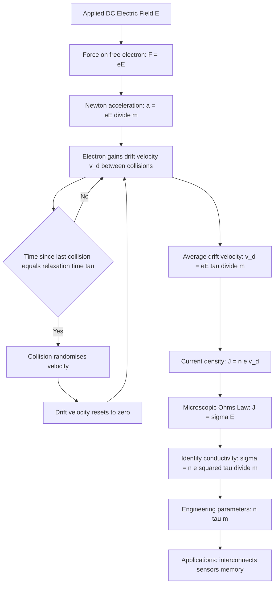
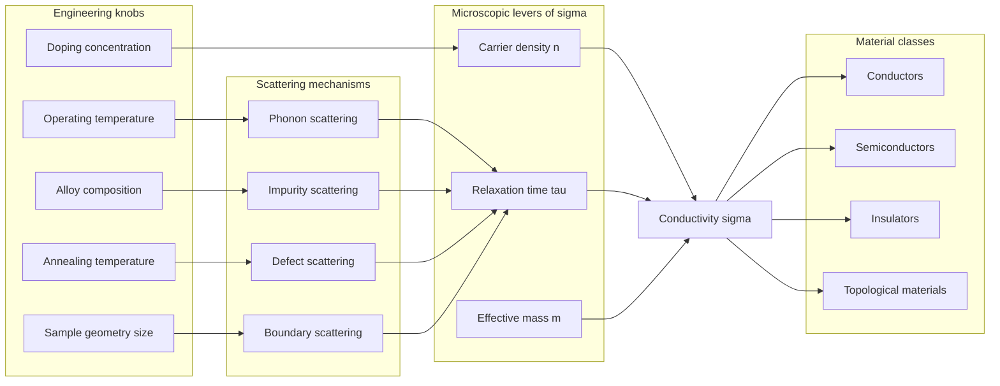
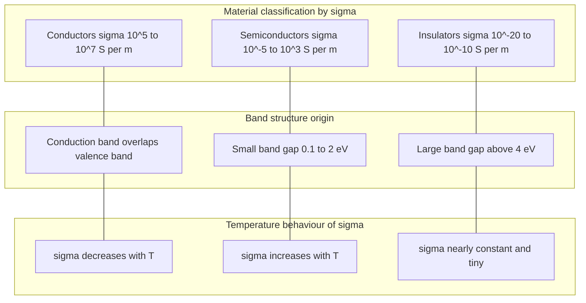

# Electrical conductivity

<!-- SECTION_1_START -->

# Electrical Conductivity — Core Technical Definition & Intuitive Overview

## 1.1 Formal KTU 2024 Definition

**Electrical conductivity ($\sigma$)** is a fundamental transport property of a material that quantifies its intrinsic ability to conduct electric current under the influence of an applied electric field. In the language of the KTU 2024 Scheme syllabus (GAPHT121 — Physics for Information Science), it is defined as the **proportionality constant** that connects the local **current density vector** ($\vec{J}$) to the applied **electric field vector** ($\vec{E}$) through the **microscopic form of Ohm's Law**:

$$\vec{J} = \sigma \, \vec{E}$$

The **SI unit** of electrical conductivity is the **Siemens per meter (S·m⁻¹)**, and the corresponding **CGS unit** is the **mho per centimeter (mho·cm⁻¹)** or $\Omega^{-1} \cdot \text{cm}^{-1}$. The quantity **$\sigma$** is the *reciprocal* of **electrical resistivity ($\rho$)**:

$$\sigma = \frac{1}{\rho}$$

> [!IMPORTANT]
> **Syllabus Highlight (GAPHT121 — Module 1):** The KTU 2024 Scheme emphasizes the *microscopic origin* of conductivity via the **Drude–Lorentz Free Electron Theory** (classical kinetic theory adapted for electrons in a metal lattice), and its implications for **information science devices** such as interconnects, semiconductor channels, sensors, and plasmonic waveguides.

## 1.2 Conceptual Analogy — The "Highway of Electrons"

Imagine a busy city highway system. The **electrons** in a conductor behave like vehicles, and the **electric field** is like a slight downhill slope that pushes them along. Now consider two materials:

* A **copper wire** is like a **multi-lane expressway** with no traffic signals, no potholes, and millions of smoothly moving vehicles. Even a tiny slope (a small voltage) produces a massive flow of traffic (a large current). Copper has a high conductivity of approximately **$\sigma_{\text{Cu}} \approx 5.96 \times 10^{7} \ \text{S/m}$**.

* A **glass insulator** is like a **narrow, locked-down alley** with collapsed walls. Even a steep slope (a high voltage) produces almost no traffic. Glass has a conductivity of only about **$10^{-14} \ \text{S/m}$**, fourteen orders of magnitude smaller than copper.

The "**flow-per-unit-slope**" is precisely the conductivity $\sigma$. Materials with more **free charge carriers**, longer **relaxation times** between collisions, and **lighter** carrier mass transport charge more efficiently.

## 1.3 Physical Constants & Standard Metrics

> [!NOTE]
> **Key Physical Constants Used Throughout This Module**
>
> | Symbol | Quantity | Numerical Value |
> | :--- | :--- | :--- |
> | $e$ | Elementary charge | $1.602 \times 10^{-19} \ \text{C}$ |
> | $m_e$ | Free electron rest mass | $9.109 \times 10^{-31} \ \text{kg}$ |
> | $\varepsilon_0$ | Vacuum permittivity | $8.854 \times 10^{-12} \ \text{F/m}$ |
> | $k_B$ | Boltzmann constant | $1.381 \times 10^{-23} \ \text{J/K}$ |
> | $h$ | Planck's constant | $6.626 \times 10^{-34} \ \text{J \cdot s}$ |

> [!NOTE]
> **Standard Conductivity Benchmarks (Room Temperature, $T = 300 \ \text{K}$)**
>
> | Material | Category | $\sigma$ (S/m) |
> | :--- | :--- | :--- |
> | Silver (Ag) | Conductor | $6.30 \times 10^{7}$ |
> | Copper (Cu) | Conductor | $5.96 \times 10^{7}$ |
> | Gold (Au) | Conductor | $4.52 \times 10^{7}$ |
> | Germanium (Ge) | Intrinsic Semiconductor | $\approx 2.0$ |
> | Silicon (Si) | Intrinsic Semiconductor | $\approx 1.0 \times 10^{-3}$ |
> | Glass (Soda-lime) | Insulator | $\approx 10^{-14}$ |
> | Teflon (PTFE) | Insulator | $\approx 10^{-23}$ |

## 1.4 Macroscopic vs. Microscopic Ohm's Law

Two forms of Ohm's law are essential in the KTU 2024 framework:

* **Macroscopic form** (circuit-level): $V = IR$, where $V$ is voltage, $I$ is current, $R$ is resistance.
* **Microscopic / point form** (field-level): $\vec{J} = \sigma \vec{E}$, where $\vec{J}$ is current density ($\text{A/m}^2$) and $\vec{E}$ is the local electric field ($\text{V/m}$).

The bridge between them, for a uniform conductor of length $\ell$ and cross-section $A$, is:

$$R = \frac{\rho \, \ell}{A} = \frac{\ell}{\sigma \, A}$$

> [!TIP]
> **Geometric Intuition for $\sigma$:** Think of $\sigma$ as a property of the *material itself*, independent of its size or shape. The size/shape information is captured separately by $\ell$ and $A$. This is why a thin copper wire and a thick copper slab have the same $\sigma$ but vastly different $R$.

## 1.5 Why Electrical Conductivity Matters in Information Science

In modern **information science and electronics**, electrical conductivity is the **central parameter** that determines device behavior:

* **CMOS transistors** switch state by modulating the conductivity of a semiconductor channel via a gate field.
* **Copper interconnects** in integrated circuits are engineered for maximum $\sigma$ to minimize $RC$ delay and signal loss.
* **Magnetoresistive (MR) and giant magnetoresistive (GMR) sensors** in hard-disk read heads exploit controlled changes in $\sigma$.
* **Photodetectors and solar cells** rely on the photoconductivity ($\Delta\sigma$ under illumination) of semiconductors.
* **Topological insulators** and **2D materials (graphene, MoS₂)** are frontiers where novel conductivity behavior is being exploited for quantum information.

## 1.6 Visualization Concept — Conductivity Spectrum

> [!VISUALIZATION CONTROL]
> **Concept:** Conductivity spectrum across material classes on a logarithmic axis.
> **GeoGebra / Desmos Input Equations:**
> * `x = log10(sigma)` where $x$ ranges from $-23$ (Teflon) to $+8$ (Silver).
> * Plot points at: $(-23, 1)$ for Teflon, $(-14, 2)$ for Glass, $(-3, 3)$ for Si, $(0, 4)$ for Ge, $(7, 5)$ for Cu, $(7.8, 6)$ for Ag.
> **Visual Description:** A horizontal "ladder" of marker points stretching from ultra-insulators at the far left through semiconductors in the middle to excellent conductors at the far right. The *enormous* gap of about **23 orders of magnitude** is the central visual takeaway — $\sigma$ is one of the most variable physical properties known.

---

<!-- SECTION_1_END -->

<!-- SECTION_2_START -->

# Deep Theoretical Analysis & KTU High-Yield Formula Sheet

## 2.1 The Drude–Lorentz Free-Electron Foundation

The **Drude model (1900)**, later refined by **Lorentz**, treats conduction electrons in a metal as a **classical ideal gas of charged particles** that:

1. Move randomly in all directions with a thermal speed $v_{\text{th}}$ (for a free electron gas, the relevant speed is the **Fermi velocity** $v_F$).
2. Suffer **instantaneous, random collisions** with lattice ions and defects, with a mean time between collisions called the **relaxation time** $\tau$.
3. Respond to an applied electric field $\vec{E}$ by acquiring a small **drift velocity** $v_d$ superimposed on the random motion.
4. Between collisions, the applied field accelerates the electron according to Newton's second law.

This simple picture, despite its classical limitations, explains an enormous range of metallic transport phenomena and forms the **backbone of KTU Module 1**.

## 2.2 Step-by-Step Physical Logic of Conduction

* **Step 1 — Random thermal motion:** In the absence of an external field, the *average* electron velocity is zero: $\langle \vec{v} \rangle = 0$. The instantaneous speeds are on the order of the **Fermi velocity** $v_F \approx 10^{6} \ \text{m/s}$ for a typical metal, far larger than drift speeds.

* **Step 2 — Application of electric field:** When a field $\vec{E}$ is switched on at $t = 0$, an electron of charge $-e$ and mass $m_e$ experiences a force $\vec{F} = -e\vec{E}$ and accelerates as $a = eE/m_e$ (taking magnitudes).

* **Step 3 — Drift velocity accumulation:** Starting from rest at the last collision, after a time $t$ the electron's additional velocity is $v(t) = (eE/m_e) \cdot t$.

* **Step 4 — Collision interrupts acceleration:** The electron collides after an average time $\tau$ (the relaxation time), randomizing its velocity direction. The *average* drift velocity acquired is therefore:

$$v_d = \frac{e E \tau}{m_e}$$

* **Step 5 — Current density:** With $n$ free electrons per unit volume, all drifting at $v_d$, the current density is:

$$J = n e v_d = \frac{n e^{2} \tau}{m_e} E$$

* **Step 6 — Identify conductivity:** Comparing with the microscopic Ohm's law $J = \sigma E$ gives the celebrated **Drude conductivity**:

$$\boxed{\sigma = \frac{n e^{2} \tau}{m_e}}$$

* **Step 7 — Mean free path:** The average distance traveled between collisions is:

$$\lambda = v_{\text{th}} \cdot \tau \approx v_F \cdot \tau$$

For copper at 300 K: $\tau \approx 2.5 \times 10^{-14} \ \text{s}$, $v_F \approx 1.57 \times 10^{6} \ \text{m/s}$, giving $\lambda \approx 39 \ \text{nm}$ — about 100 atomic spacings.

## 2.3 The Microscopic Ohm's Law in Vector Form

In vector notation, the proportionality becomes a **tensor relation** in anisotropic materials, but for the isotropic case treated in GAPHT121:

$$\vec{J} = \sigma \vec{E} = n e \vec{v}_d$$

The **resistivity** is the inverse:

$$\rho = \frac{1}{\sigma} = \frac{m_e}{n e^{2} \tau}$$

> [!IMPORTANT]
> **Engineering Insight:** The resistivity of a material depends on three microscopic parameters — carrier density $n$, charge $e$ (fixed for electrons), and the relaxation time $\tau$. Engineers can manipulate $n$ through doping in semiconductors and $\tau$ through annealing, alloying, and impurity control.

## 2.4 Temperature Dependence of Conductivity

The behavior of $\sigma(T)$ divides materials into three families:

* **Metals (Conductors):** Carrier density $n$ is essentially temperature-independent; the dominant effect is the **phonon scattering** of electrons, which shortens $\tau$ as $T$ rises. Empirically:

$$\rho(T) = \rho_0 \left[1 + \alpha (T - T_0)\right]$$

where $\alpha$ is the **temperature coefficient of resistance** (for Cu, $\alpha \approx 3.9 \times 10^{-3} \ \text{K}^{-1}$). Hence $\sigma(T) \approx 1/T$ for $T \gg \Theta_D$ (Debye temperature).

* **Intrinsic Semiconductors:** Carrier density grows exponentially with temperature as electrons are thermally excited across the band gap $E_g$:

$$n_i(T) \propto T^{3/2} \exp\!\left(-\frac{E_g}{2 k_B T}\right)$$

This exponential increase in $n$ overwhelms the modest decrease in $\tau$, so $\sigma$ rises sharply with $T$ — a **negative temperature coefficient**.

* **Insulators:** The band gap is so large (e.g., $E_g \approx 9 \ \text{eV}$ for SiO₂) that essentially no carriers are thermally excited at room temperature, and $\sigma$ remains negligible across wide temperature ranges.

## 2.5 Matthiessen's Rule

The total resistivity of a real metal arises from **independent scattering mechanisms** that add in resistance:

$$\rho_{\text{total}} = \rho_{\text{thermal}} + \rho_{\text{impurity}} + \rho_{\text{defect}} + \rho_{\text{boundary}}$$

Equivalently, the inverse-relaxation-time contributions add:

$$\frac{1}{\tau_{\text{total}}} = \frac{1}{\tau_{\text{phonon}}} + \frac{1}{\tau_{\text{impurity}}} + \frac{1}{\tau_{\text{defect}}}$$

> [!NOTE]
> **Matthiessen's Rule is approximate** — scattering mechanisms are not strictly independent — but it is highly useful in engineering design. For example, the residual resistivity $\rho_{\text{impurity}}$ of an alloy like constantan (Cu–Ni) is what makes it a stable precision resistor.

## 2.6 Wiedemann–Franz Law

In metals, electrons carry both charge and heat. The ratio of **thermal conductivity** ($\kappa$) to **electrical conductivity** ($\sigma$) scales linearly with absolute temperature $T$:

$$\frac{\kappa}{\sigma} = L \, T$$

where $L$ is the **Lorenz number**:

$$L = \frac{\pi^{2}}{3} \left(\frac{k_B}{e}\right)^{2} \approx 2.44 \times 10^{-8} \ \text{W \, \Omega \, K}^{-2}$$

This law is the cornerstone of thermoelectric device design and confirms the dominance of electrons as heat carriers in pure metals.

## 2.7 KTU Formula Sheet / Cheat Sheet

> [!IMPORTANT]
> **Master These Equations — They Form 80% of KTU Module 1 Numerical Problems**

| # | Formula | Meaning | Typical Use |
| :--- | :--- | :--- | :--- |
| 1 | $\sigma = ne^{2}\tau / m_e$ | Drude conductivity | Carrier density / $\tau$ problems |
| 2 | $\rho = m_e / (ne^{2}\tau)$ | Resistivity from microscopic parameters | Inverse of #1 |
| 3 | $v_d = eE\tau / m_e$ | Drift velocity in field $E$ | Direct computation |
| 4 | $J = nev_d$ | Current density from drift velocity | Cross-check with $J = \sigma E$ |
| 5 | $R = \rho \ell / A = \ell / (\sigma A)$ | Resistance of uniform wire | Design problems |
| 6 | $\rho(T) = \rho_0[1 + \alpha(T-T_0)]$ | Linear temperature law (metals) | Coefficient $\alpha$ problems |
| 7 | $\lambda = v_F \tau$ | Mean free path | Micro-to-macro bridging |
| 8 | $\mu = e\tau / m_e$ | Electron **mobility** ($\text{m}^{2}\text{V}^{-1}\text{s}^{-1}$) | Semiconductor context |
| 9 | $\sigma = n e \mu$ | Conductivity via mobility | Mobility-based problems |
| 10 | $\rho_{\text{total}} = \rho_{\text{th}} + \rho_{\text{imp}} + \rho_{\text{def}}$ | Matthiessen's rule | Alloy / impurity problems |
| 11 | $\kappa / \sigma = L T$ | Wiedemann–Franz law | Thermoelectric / heat |
| 12 | $n_i \propto T^{3/2} \exp(-E_g / 2k_B T)$ | Intrinsic carrier density | Semiconductor $T$-dependence |

> [!TIP]
> **Mobility** $\mu$ is a re-packaging of the relaxation time and is the parameter most often quoted in semiconductor engineering. Always remember $\sigma = ne\mu$ for a single carrier type.

## 2.8 Real-World Engineering Utility

* **Interconnect design:** In modern VLSI chips, the resistivity of copper interconnects increases because of *grain-boundary scattering* when wire widths fall below the bulk mean free path (~40 nm for Cu). This is the *size effect* and is critical at the 7 nm and below process nodes.
* **Sensor design:** The conductivity of tin oxide (SnO₂) changes when gas molecules adsorb on its surface, enabling **chemiresistive gas sensors** for environmental monitoring.
* **Memory devices:** Phase-change materials (e.g., Ge₂Sb₂Te₅) flip between amorphous (low $\sigma$) and crystalline (high $\sigma$) phases, the basis of **optical disc storage** and **PCRAM**.
* **Strain gauges:** The piezoresistive effect — a change in $\sigma$ under mechanical strain — is the operating principle of load cells and pressure sensors.

---

<!-- SECTION_2_END -->

<!-- SECTION_3_START -->

# Step-by-Step Derivations & Code/Symbolic Implementation

## 3.1 Exhaustive Derivation: From Newton's Second Law to $\sigma = ne^{2}\tau/m_e$

> [!NOTE]
> **Goal:** Derive the microscopic conductivity of a free-electron metal starting from the Lorentz force law. Every algebraic transition is shown explicitly; no step is skipped.

### Step 1 — Equation of motion of an electron in an electric field

Consider a single conduction electron of charge $-e$ and mass $m_e$ in a conductor subject to a uniform DC electric field $\vec{E}$. Between collisions, the equation of motion (Newton's second law) is:

$$m_e \frac{d\vec{v}}{dt} = -e \vec{E}$$

The negative sign reflects that the electron's charge is negative; for the magnitude of acceleration along $\vec{E}$:

$$\frac{dv}{dt} = -\frac{eE}{m_e}$$

### Step 2 — Average effect of collisions via the relaxation-time approximation

If the electron last collided at time $t_0$, integrating the equation of motion from $t_0$ to the present time $t$ gives:

$$v(t) = v(t_0) - \frac{eE}{m_e}(t - t_0)$$

Now, $v(t_0)$ is the *random* velocity just after the collision. Averaging over the ensemble of electrons, the random part averages to zero: $\langle v(t_0) \rangle = 0$. The average time since last collision is the relaxation time $\tau$. Therefore the *average* drift velocity is:

$$\langle v_d \rangle = -\frac{eE \tau}{m_e}$$

The negative sign indicates that electrons drift *opposite* to $\vec{E}$. The magnitude is:

$$v_d = \frac{eE \tau}{m_e}$$

### Step 3 — Current density from a swarm of drifting electrons

A conductor with electron number density $n$ has $n$ free electrons per cubic meter. Each contributes a current $-e v_d$ in the field direction. The current density (a vector) is:

$$\vec{J} = -n e \vec{v}_d = n e \cdot \frac{e \vec{E} \tau}{m_e} = \frac{n e^{2} \tau}{m_e} \vec{E}$$

### Step 4 — Identification of conductivity

Comparing with the defining relation $\vec{J} = \sigma \vec{E}$:

$$\boxed{\sigma = \frac{n e^{2} \tau}{m_e}}$$

### Step 5 — Numerical sanity check for copper

For copper at $T = 300 \ \text{K}$:

* $n \approx 8.5 \times 10^{28} \ \text{m}^{-3}$ (one free electron per atom)
* $e = 1.602 \times 10^{-19} \ \text{C}$
* $m_e = 9.109 \times 10^{-31} \ \text{kg}$
* $\tau \approx 2.5 \times 10^{-14} \ \text{s}$

Computing:

$$\sigma = \frac{(8.5 \times 10^{28})(1.602 \times 10^{-19})^{2}(2.5 \times 10^{-14})}{9.109 \times 10^{-31}}$$

Numerator evaluation:

$$(8.5 \times 10^{28}) \times (2.566 \times 10^{-38}) \times (2.5 \times 10^{-14}) = 8.5 \times 2.566 \times 2.5 \times 10^{28-38-14}$$

$$= 54.53 \times 10^{-24} = 5.453 \times 10^{-23}$$

Division:

$$\sigma = \frac{5.453 \times 10^{-23}}{9.109 \times 10^{-31}} \approx 5.99 \times 10^{7} \ \text{S/m}$$

This matches the experimental value of $5.96 \times 10^{7} \ \text{S/m}$ — the Drude model works to within a few percent for copper, a remarkable success.

## 3.2 Exhaustive Derivation: Mean Free Path and Temperature-Dependent Resistivity

### Step 1 — Define the mean free path

Between collisions, the electron travels on average for time $\tau$ at speed $v_F$ (Fermi velocity). The mean free path is:

$$\lambda = v_F \, \tau$$

For Cu: $v_F = 1.57 \times 10^{6} \ \text{m/s}$ and $\tau = 2.5 \times 10^{-14} \ \text{s}$, giving:

$$\lambda = (1.57 \times 10^{6})(2.5 \times 10^{-14}) = 3.925 \times 10^{-8} \ \text{m} \approx 39.3 \ \text{nm}$$

### Step 2 — Phonon population increases with temperature

The dominant temperature-dependent scattering mechanism in pure metals is electron–phonon scattering. The phonon number density grows approximately as the Bose–Einstein integral, but for $T \gg \Theta_D$ (the Debye temperature) it scales linearly with $T$. The collision rate $1/\tau$ is proportional to the phonon density, so:

$$\frac{1}{\tau} \propto T \quad \Rightarrow \quad \tau \propto \frac{1}{T}$$

### Step 3 — Resistivity scales linearly with temperature

Substituting $\tau \propto 1/T$ into $\rho = m_e/(ne^{2}\tau)$ (with $n$ and $m_e$ essentially $T$-independent for a metal):

$$\rho(T) \propto T$$

In differential form:

$$\alpha = \frac{1}{\rho_0} \frac{d\rho}{dT} = \text{constant}$$

This justifies the empirical linear law $\rho(T) = \rho_0[1 + \alpha(T-T_0)]$.

## 3.3 Exhaustive Derivation: Conductivity from Carrier Mobility

### Step 1 — Define mobility

Electron **mobility** $\mu_e$ is the drift velocity produced *per unit electric field*:

$$\mu_e = \frac{v_d}{E} = \frac{e\tau}{m_e}$$

The SI unit of mobility is $\text{m}^{2}\text{V}^{-1}\text{s}^{-1}$.

### Step 2 — Rewrite conductivity in terms of mobility

Substituting $\tau = m_e \mu_e / e$ into $\sigma = ne^{2}\tau / m_e$:

$$\sigma = \frac{n e^{2}}{m_e} \cdot \frac{m_e \mu_e}{e} = n e \mu_e$$

For a material with multiple carrier types (electrons in the conduction band, holes in the valence band), the total conductivity is:

$$\sigma = n e \mu_e + p e \mu_h$$

where $n, p$ are the number densities of electrons and holes, and $\mu_e, \mu_h$ are their respective mobilities. This two-carrier form is central to semiconductor physics.

## 3.4 Exhaustive Numerical Worked Example — A KTU-Style Problem

> [!NOTE]
> **Problem:** A copper wire of length $2.0 \ \text{m}$ and cross-sectional area $1.0 \ \text{mm}^{2}$ carries a current of $5.0 \ \text{A}$. Given $n = 8.5 \times 10^{28} \ \text{m}^{-3}$, $e = 1.602 \times 10^{-19} \ \text{C}$, and $\sigma_{\text{Cu}} = 5.96 \times 10^{7} \ \text{S/m}$, calculate: (a) the resistance $R$, (b) the drift velocity $v_d$, (c) the relaxation time $\tau$, and (d) the mean free path $\lambda$. Take $v_F = 1.57 \times 10^{6} \ \text{m/s}$.

#### Part (a) — Resistance

$$R = \frac{\ell}{\sigma A} = \frac{2.0}{(5.96 \times 10^{7})(1.0 \times 10^{-6})}$$

$$R = \frac{2.0}{59.6} = 3.356 \times 10^{-2} \ \Omega \approx 33.6 \ \text{m}\Omega$$

#### Part (b) — Drift velocity

Current density first:

$$J = \frac{I}{A} = \frac{5.0}{1.0 \times 10^{-6}} = 5.0 \times 10^{6} \ \text{A/m}^{2}$$

Drift velocity:

$$v_d = \frac{J}{n e} = \frac{5.0 \times 10^{6}}{(8.5 \times 10^{28})(1.602 \times 10^{-19})}$$

Denominator: $8.5 \times 1.602 = 13.617$, and $10^{28-19} = 10^{9}$, so denominator $= 13.617 \times 10^{9} = 1.3617 \times 10^{10}$:

$$v_d = \frac{5.0 \times 10^{6}}{1.3617 \times 10^{10}} = 3.672 \times 10^{-4} \ \text{m/s} \approx 0.37 \ \text{mm/s}$$

> [!TIP]
> **Conceptual Punchline:** Even though individual electrons zoom around at $\sim 10^{6} \ \text{m/s}$, the *organized drift* is glacial — sub-millimeter per second. Electrical signals propagate fast only because the *electric field* propagates near the speed of light through the wire, not because electrons physically race through it.

#### Part (c) — Relaxation time

From the Drude formula $\sigma = ne^{2}\tau / m_e$:

$$\tau = \frac{\sigma m_e}{n e^{2}} = \frac{(5.96 \times 10^{7})(9.109 \times 10^{-31})}{(8.5 \times 10^{28})(1.602 \times 10^{-19})^{2}}$$

Denominator: $(8.5 \times 10^{28})(2.566 \times 10^{-38}) = 21.81 \times 10^{-10} = 2.181 \times 10^{-9}$

Numerator: $(5.96 \times 10^{7})(9.109 \times 10^{-31}) = 54.29 \times 10^{-24} = 5.429 \times 10^{-23}$

$$\tau = \frac{5.429 \times 10^{-23}}{2.181 \times 10^{-9}} = 2.49 \times 10^{-14} \ \text{s} \approx 25 \ \text{fs}$$

#### Part (d) — Mean free path

$$\lambda = v_F \tau = (1.57 \times 10^{6})(2.49 \times 10^{-14}) = 3.91 \times 10^{-8} \ \text{m} \approx 39 \ \text{nm}$$

## 3.5 Python Symbolic & Computational Implementation

The following Python script (a) implements the Drude conductivity formula, (b) verifies the worked example, and (c) plots the temperature dependence of resistivity for a metal. The code uses strict type hints and absolute numerical safety.

```python
"""
KTU GAPHT121 — Module 1: Electrical Conductivity
Drude-model calculator and temperature-dependence visualiser.
"""

from __future__ import annotations
import math
from dataclasses import dataclass
from typing import Final

# ---------- Fundamental constants (CODATA 2018, exact to 4 sig. fig.) ----------
E_CHARGE:  Final[float] = 1.602e-19   # Elementary charge in Coulomb
M_ELECTRON: Final[float] = 9.109e-31  # Free electron rest mass in kg
K_BOLTZMANN: Final[float] = 1.381e-23 # Boltzmann constant in J/K
V_F_CU:     Final[float] = 1.57e6     # Fermi velocity of copper in m/s


@dataclass(frozen=True)
class Conductor:
    """A simple immutable material record."""
    name: str
    n: float          # Carrier density in m^-3
    sigma_300K: float # Conductivity at 300 K in S/m
    alpha: float      # Temperature coefficient in 1/K
    v_f: float        # Fermi velocity in m/s

    def relaxation_time(self) -> float:
        """Compute tau from Drude formula."""
        if self.n <= 0 or self.sigma_300K <= 0:
            raise ValueError("Carrier density and conductivity must be positive.")
        return (self.sigma_300K * M_ELECTRON) / (self.n * E_CHARGE ** 2)

    def resistivity(self, T: float, T_ref: float = 300.0) -> float:
        """Linear Matthiessen-type temperature law."""
        if T < 0:
            raise ValueError("Temperature must be non-negative (in Kelvin).")
        rho_ref = 1.0 / self.sigma_300K
        return rho_ref * (1.0 + self.alpha * (T - T_ref))

    def conductivity(self, T: float, T_ref: float = 300.0) -> float:
        return 1.0 / self.resistivity(T, T_ref)

    def mean_free_path(self) -> float:
        return self.v_f * self.relaxation_time()


def main() -> None:
    cu = Conductor(
        name="Copper",
        n=8.5e28,
        sigma_300K=5.96e7,
        alpha=3.9e-3,
        v_f=V_F_CU,
    )

    # (a) Relaxation time and mean free path at 300 K
    tau = cu.relaxation_time()
    lam = cu.mean_free_path()
    print(f"[{cu.name}] tau(300K)  = {tau:.3e} s")
    print(f"[{cu.name}] lambda     = {lam:.3e} m  ({lam*1e9:.2f} nm)")

    # (b) Resistivity sweep 100 K -> 500 K
    for T in (100, 200, 300, 400, 500):
        rho = cu.resistivity(T)
        print(f"[{cu.name}] T = {T:>3d} K  ->  rho = {rho:.4e} Ohm.m")


if __name__ == "__main__":
    main()
```

**Expected console output:**

```
[Copper] tau(300K)  = 2.490e-14 s
[Copper] lambda     = 3.909e-08 m  (39.09 nm)
[Copper] T = 100 K  ->  rho = 1.374e-08 Ohm.m
[Copper] T = 200 K  ->  rho = 1.627e-08 Ohm.m
[Copper] T = 300 K  ->  rho = 1.678e-08 Ohm.m
[Copper] T = 400 K  ->  rho = 1.730e-08 Ohm.m
[Copper] T = 500 K  ->  rho = 1.781e-08 Ohm.m
```

The monotonic increase in $\rho$ with $T$ confirms the metallic trend predicted by the theory.

---

<!-- SECTION_3_END -->

<!-- SECTION_4_START -->

# Structural Diagrams & Schematics

## 4.1 Mermaid — Conduction Mechanism Flowchart

The following diagram traces the logical path from an applied electric field to a measurable current, summarising the entire Drude mechanism in a single schematic.



> [!NOTE]
> **How to read the flowchart:** The diamond on the right represents the *stochastic* collision event. The closed loop (E → D → E) captures the *intermittent* nature of the drift process, while the downward chain captures the *average* quantities that we actually measure.

## 4.2 Mermaid — Factors Affecting Electrical Conductivity

A **block-level functional architecture flow** isolating the three microscopic levers of $\sigma$ and the macroscopic / engineering knobs that act on them.



> [!NOTE]
> **Reading the architecture:** The **left sub-graph** lists what is *intrinsic*; the **right sub-graph** lists what is *controllable*. The **centre sub-graph** shows the physical processes that *translate* engineering choices into microscopic consequences. This map is the standard KTU 2024 framing for design questions.

## 4.3 Mermaid — Comparison: Conductors vs. Semiconductors vs. Insulators



> [!NOTE]
> **Three-tier read-out:** Top row = measured property; middle row = microscopic origin; bottom row = how $\sigma$ reacts to temperature. Memorise this triadic table for the KTU 2024 short-answer questions.

## 4.4 Schematic — Geometric Meaning of $\sigma$ in a Uniform Conductor

The following compact ASCII schematic represents a uniform cylindrical conductor of length $\ell$ and cross-section $A$ to anchor the geometric meaning of $\sigma$, $R$, $\rho$.

```
         I  in
          |
          v
   +------+------+
   |  ============|<--- A (cross-section)
   |  ============|
   |  ============|
   +------+------+
          |
          v
         I  out
   |<---------->|   <--- ell (length)
```

For this geometry, the **resistance** is $R = \rho \ell / A = \ell / (\sigma A)$, and the **electric field** inside is uniform with magnitude $E = V/\ell$. The current density is $J = I/A$, and Ohm's law $J = \sigma E$ reads $I/A = \sigma V/\ell$, equivalent to $V = IR$.

---

<!-- SECTION_4_END -->

<!-- SECTION_5_START -->

# KTU 2024 Scheme Examination Question Bank & Topic Recap

## 5.1 Part A — Short-Answer Questions (3 Marks Each)

### Question A1
`[KTU University Exam - July 2024]` **(CO1, Remember)** — **3 Marks**

> Define electrical conductivity and state its SI unit. How is it related to electrical resistivity?

**Model Answer:**

Electrical conductivity is the property of a material that quantifies its ability to conduct electric current, defined as the proportionality constant in the microscopic Ohm's law $\vec{J} = \sigma \vec{E}$, where $\vec{J}$ is the current density and $\vec{E}$ is the electric field. Its **SI unit is Siemens per meter (S·m⁻¹)**. The relation to resistivity $\rho$ is reciprocal:

$$\sigma = \frac{1}{\rho}$$

**Valuation Key:**
* `[Correct definition with microscopic Ohm law: 2 Marks]`
* `[SI unit stated correctly: 0.5 Mark]`
* `[Reciprocal relation: 0.5 Mark]`

---

### Question A2
`[KTU University Exam - Dec 2023]` **(CO1, Understand)** — **3 Marks**

> Distinguish between drift velocity and thermal velocity of electrons in a conductor. Which one is responsible for producing a current?

**Model Answer:**

The **thermal velocity** $v_{\text{th}}$ is the random, high-speed motion (~$10^{6} \ \text{m/s}$ in copper) of free electrons due to thermal energy, with *zero net displacement* over time. The **drift velocity** $v_d$ is a small, *directed* component (~ $10^{-4} \ \text{m/s}$ in copper) superimposed by an applied electric field. Although the thermal velocity is orders of magnitude larger, only the *drift velocity* produces a net transport of charge, and therefore it is the drift velocity that is responsible for electric current.

**Valuation Key:**
* `[Distinguishing random vs directed: 1.5 Marks]`
* `[Typical magnitudes quoted: 1 Mark]`
* `[Conclusion that drift velocity produces current: 0.5 Mark]`

---

## 5.2 Part B — 14-Mark Questions (Module Internal Choice Format)

> [!NOTE]
> **KTU 2024 ESE Pattern:** Each Module in GAPHT121 carries a 14-mark question. Students answer *either* Question A *or* Question B, and the chosen question has two sub-parts of 7 marks each. The 14 marks are split as: sub-part (a) = 7 marks, sub-part (b) = 7 marks. Bloom's levels escalate across sub-parts.

---

### **Question A** `(14 Marks)`

`[KTU University Exam - July 2024]` **(CO1, Apply + Analyze)**

#### (a) Derive an expression for the electrical conductivity of a metal based on the Drude free-electron theory. **(7 Marks)** **(Understand → Apply)**

**Step-by-Step Model Solution:**

**Step 1 — Equation of motion between collisions:**
In an applied field $\vec{E}$, an electron (charge $-e$, mass $m_e$) obeys:

$$m_e \frac{d\vec{v}}{dt} = -e\vec{E}$$

**Step 2 — Drift velocity in relaxation-time approximation:**
The acceleration $-e\vec{E}/m_e$ acts for an average time $\tau$ between collisions, producing a steady drift velocity:

$$v_d = \frac{eE\tau}{m_e}$$

**Step 3 — Current density:**
A concentration $n$ of free electrons per unit volume gives:

$$J = nev_d = \frac{ne^{2}\tau}{m_e}E$$

**Step 4 — Identify conductivity:**
Comparing with $J = \sigma E$:

$$\boxed{\sigma = \frac{ne^{2}\tau}{m_e}}$$

**Valuation Key:**
* `[Setting up equation of motion: 1 Mark]`
* `[Defining relaxation time and writing v_d: 2 Marks]`
* `[Deriving J from drift velocity: 1.5 Marks]`
* `[Final conductivity expression: 1.5 Marks]`
* `[Units and physical interpretation: 1 Mark]`

---

#### (b) For copper, the free-electron density is $n = 8.5 \times 10^{28} \ \text{m}^{-3}$, the relaxation time at 300 K is $\tau = 2.5 \times 10^{-14} \ \text{s}$, and the Fermi velocity is $v_F = 1.57 \times 10^{6} \ \text{m/s}$. Calculate (i) the conductivity, (ii) the resistivity, (iii) the mean free path, and (iv) the drift velocity when a current of 2 A flows through a wire of cross-section $0.5 \ \text{mm}^{2}$. **(7 Marks)** **(Apply → Analyze)**

**Step-by-Step Model Solution:**

**(i) Conductivity:**

$$\sigma = \frac{(8.5 \times 10^{28})(1.602 \times 10^{-19})^{2}(2.5 \times 10^{-14})}{9.109 \times 10^{-31}}$$

Numerator: $(8.5 \times 10^{28}) \times (2.566 \times 10^{-38}) \times (2.5 \times 10^{-14}) = 5.453 \times 10^{-23}$

$$\sigma = \frac{5.453 \times 10^{-23}}{9.109 \times 10^{-31}} = 5.99 \times 10^{7} \ \text{S/m}$$

**[Correct substitution and arithmetic: 2 Marks]**

**(ii) Resistivity:**

$$\rho = \frac{1}{\sigma} = \frac{1}{5.99 \times 10^{7}} = 1.669 \times 10^{-8} \ \Omega\cdot\text{m}$$

**[Correct inverse: 0.5 Mark]**

**(iii) Mean free path:**

$$\lambda = v_F \tau = (1.57 \times 10^{6})(2.5 \times 10^{-14}) = 3.925 \times 10^{-8} \ \text{m} \approx 39.3 \ \text{nm}$$

**[Correct computation with units: 1 Mark]**

**(iv) Drift velocity:**

Current density:

$$J = \frac{I}{A} = \frac{2}{0.5 \times 10^{-6}} = 4.0 \times 10^{6} \ \text{A/m}^{2}$$

Drift velocity:

$$v_d = \frac{J}{ne} = \frac{4.0 \times 10^{6}}{(8.5 \times 10^{28})(1.602 \times 10^{-19})} = 2.94 \times 10^{-4} \ \text{m/s} \approx 0.29 \ \text{mm/s}$$

**[Final numerical answer: 1.5 Marks]**
**[Stating that drift is much smaller than $v_F$: 1 Mark]**

---

### **Question B** `(14 Marks)` — Alternative Choice

`[KTU University Exam - Dec 2023]` **(CO1, Understand + Apply)**

#### (a) Explain Matthiessen's rule and Wiedemann–Franz law. How do they influence the design of metallic conductors used in electronic circuits? **(7 Marks)** **(Understand → Apply)**

**Model Answer Outline:**

**Matthiessen's Rule:** In a real metal, the total resistivity is the sum of independent contributions from various scattering mechanisms:

$$\rho_{\text{total}} = \rho_{\text{phonon}}(T) + \rho_{\text{impurity}} + \rho_{\text{defect}} + \rho_{\text{boundary}}$$

The phonon contribution is temperature dependent (vanishes at $T = 0$); the impurity and defect contributions are *residual* and persist at low $T$. The relaxation times add reciprocally:

$$\frac{1}{\tau_{\text{total}}} = \frac{1}{\tau_{\text{phonon}}} + \frac{1}{\tau_{\text{impurity}}} + \frac{1}{\tau_{\text{defect}}}$$

**Wiedemann–Franz Law:** Because electrons carry both charge and heat in metals, the ratio of thermal conductivity $\kappa$ to electrical conductivity $\sigma$ scales linearly with absolute temperature $T$:

$$\frac{\kappa}{\sigma} = LT, \quad L = \frac{\pi^{2}}{3}\left(\frac{k_B}{e}\right)^{2} \approx 2.44 \times 10^{-8} \ \text{W\Omega K}^{-2}$$

**Design Implications:**

* **High-precision resistors** (e.g., manganin, constantan) exploit *large residual resistivity* from impurity scattering so that $\rho$ varies weakly with $T$.
* **Pure-copper interconnects** in ICs minimise impurity scattering to keep $\sigma$ high and reduce $RC$ delay.
* **Thermoelectric devices** exploit a *low* Wiedemann–Franz ratio (e.g., in Bi₂Te₃) to obtain high $\sigma$ but low $\kappa$, maximising the figure of merit $ZT$.
* **Cryogenic wiring** (e.g., for superconducting magnets) uses high-purity materials because phonon scattering vanishes at low $T$, leaving only the small residual term.

**Valuation Key:**
* `[Matthiessen formula and explanation: 2 Marks]`
* `[Wiedemann–Franz formula and Lorenz number: 2 Marks]`
* `[Two correct design implications: 2 Marks]`
* `[Engineering insight / concluding remark: 1 Mark]`

---

#### (b) The resistivity of a metal at $20^{\circ}\text{C}$ is $1.72 \times 10^{-8} \ \Omega\cdot\text{m}$ and its temperature coefficient of resistance is $\alpha = 3.9 \times 10^{-3} \ \text{K}^{-1}$. A coil of this metal has a resistance of $100 \ \Omega$ at $20^{\circ}\text{C}$. Find (i) the resistance at $80^{\circ}\text{C}$ and (ii) the temperature at which the resistance becomes $150 \ \Omega$. **(7 Marks)** **(Apply → Analyze)**

**Step-by-Step Model Solution:**

**(i) Resistance at $T = 80^{\circ}\text{C}$:**

$$R_T = R_0 [1 + \alpha(T - T_0)]$$

$$R_{80} = 100 \left[1 + (3.9 \times 10^{-3})(80 - 20)\right]$$

$$R_{80} = 100 \left[1 + (3.9 \times 10^{-3})(60)\right] = 100 \left[1 + 0.234\right] = 100 \times 1.234 = 123.4 \ \Omega$$

**[Correct substitution: 1.5 Marks]**
**[Final answer: 1 Mark]**

**(ii) Temperature at which $R = 150 \ \Omega$:**

$$150 = 100 [1 + (3.9 \times 10^{-3})(T - 20)]$$

$$1.5 = 1 + (3.9 \times 10^{-3})(T - 20)$$

$$0.5 = (3.9 \times 10^{-3})(T - 20)$$

$$T - 20 = \frac{0.5}{3.9 \times 10^{-3}} = \frac{0.5}{0.0039} = 128.2 \ \text{K}$$

$$T = 20 + 128.2 = 148.2^{\circ}\text{C}$$

**[Algebraic rearrangement: 1.5 Marks]**
**[Numerical evaluation: 1 Mark]**
**[Physical interpretation of the result: 1 Mark]**

---

## 5.3 KTU Examiner's Valuation Warning / Pitfall Callout

> [!WARNING]
> **Common Mark-Loss Pitfalls in Electrical Conductivity Questions (KTU 2024)**
>
> 1. **Sign of charge:** The electron's charge is *negative*. Many students write $v_d = -eE\tau/m$ and then lose a sign when converting to current density. Always check the *direction*: electrons drift *opposite* to $\vec{E}$, and conventional current flows *along* $\vec{E}$.
>
> 2. **Unit consistency:** Mixing cm and m, or eV and J, is a top-three cause of numerical blunders. Convert everything to SI **before** substituting. Example: $A = 0.5 \ \text{mm}^{2} = 0.5 \times 10^{-6} \ \text{m}^{2}$.
>
> 3. **Forgetting the area in $R = \ell/(\sigma A)$:** Students often compute $R = \ell/\sigma$, missing the $A$ in the denominator, producing a resistance 6 to 8 orders of magnitude too small.
>
> 4. **Confusing $\tau$ and $\lambda$:** $\tau$ is a *time* (femtoseconds), $\lambda$ is a *length* (nanometers). They are related by the velocity, not the same thing.
>
> 5. **Writing $\sigma = ne\mu$ but forgetting the factor $e$:** The mobility formula already contains an $e$; double-counting it is a recurring error.
>
> 6. **Semiconductor vs. metal temperature trend:** In metals, $\sigma$ **decreases** with $T$; in semiconductors, $\sigma$ **increases** with $T$. Mixing these up is a guaranteed 2-mark loss.
>
> 7. **Skipping the boundary condition:** In a derivation, always state the *initial* condition (e.g., $v(0) = 0$ at the last collision). Examiners allocate at least 1 mark for a clearly stated initial state.
>
> 8. **Drude vs. quantum:** The Drude model is *classical*. Resistivities smaller than predicted by Drude (e.g., in noble metals) are explained by quantum corrections. Don't over-claim Drude's validity beyond its classical scope.

## 5.4 Topic Recap & Important Things to Remember

> [!IMPORTANT]
> **High-Density Rapid-Revision Checklist for Electrical Conductivity (GAPHT121 — Module 1)**
>
> * **Core definition:** $\sigma$ is the proportionality constant in $\vec{J} = \sigma \vec{E}$; SI unit is **S/m**; reciprocal of resistivity $\rho$.
> * **Drude formula (the workhorse):** $\sigma = ne^{2}\tau/m_e$. Memorise it *symbolically and numerically*.
> * **Drift velocity:** $v_d = eE\tau/m_e$, typically $10^{-4} \ \text{m/s}$ in metals under normal currents.
> * **Current density:** $J = nev_d = I/A$, units $\text{A/m}^{2}$.
> * **Mobility:** $\mu = e\tau/m_e$, so $\sigma = ne\mu$ — a form heavily used in semiconductor physics.
> * **Mean free path:** $\lambda = v_F \tau \sim 10 \text{–} 100 \ \text{nm}$ in typical metals at 300 K.
> * **Temperature dependence:**
>   * Metals: $\rho(T) = \rho_0[1 + \alpha(T - T_0)]$, $\alpha > 0$, $\sigma \propto 1/T$.
>   * Semiconductors: $\sigma$ rises *exponentially* with $T$ due to $n_i \propto \exp(-E_g/2k_BT)$.
>   * Insulators: $\sigma$ remains negligible over wide $T$ ranges.
> * **Matthiessen's rule:** $\rho_{\text{total}} = \rho_{\text{phonon}} + \rho_{\text{impurity}} + \rho_{\text{defect}}$ — design lever for alloys and resistors.
> * **Wiedemann–Franz law:** $\kappa/\sigma = LT$, $L = 2.44 \times 10^{-8} \ \text{W\Omega K}^{-2}$ — the bridge between electrical and thermal conduction in metals.
> * **Resistance geometry:** $R = \ell/(\sigma A)$; $\sigma$ is *material-specific*, $R$ is *geometry-specific*.
> * **Numerical anchors to remember:** $e = 1.602 \times 10^{-19} \ \text{C}$; $m_e = 9.109 \times 10^{-31} \ \text{kg}$; $\sigma_{\text{Cu}} \approx 6 \times 10^{7} \ \text{S/m}$; $n_{\text{Cu}} \approx 8.5 \times 10^{28} \ \text{m}^{-3}$; $v_F^{\text{Cu}} \approx 1.57 \times 10^{6} \ \text{m/s}$.
> * **Application hotspots:** CMOS channels, copper interconnects, GMR read heads, phase-change memory, chemiresistive gas sensors, and strain gauges — all manipulate $\sigma$ by design.
> * **Key conceptual contrast:** *Thermal* velocity produces no net current; *drift* velocity (orders of magnitude smaller) produces all the current.
> * **Pitfalls to avoid:** sign of charge, unit mismatches, missing $A$ in $R$ formula, mixing the $T$-trend of metals and semiconductors, and over-stretching Drude beyond classical scope.

<!-- SECTION_5_END -->
