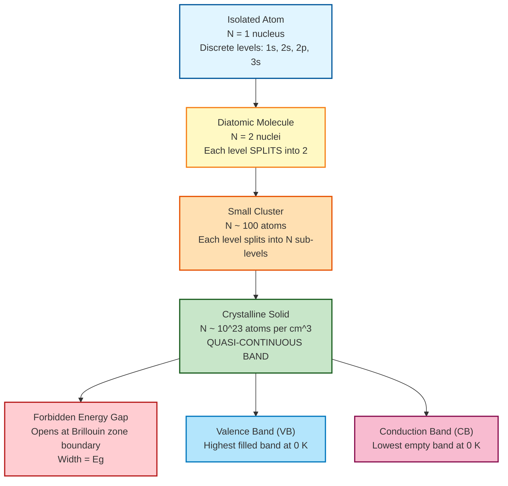
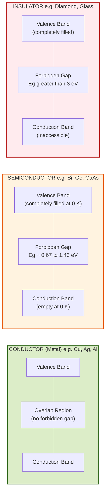
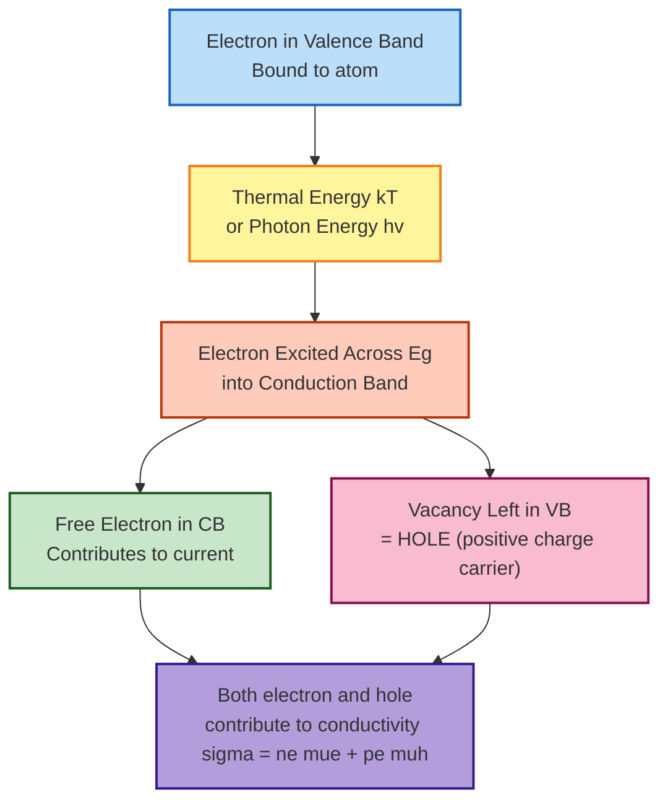
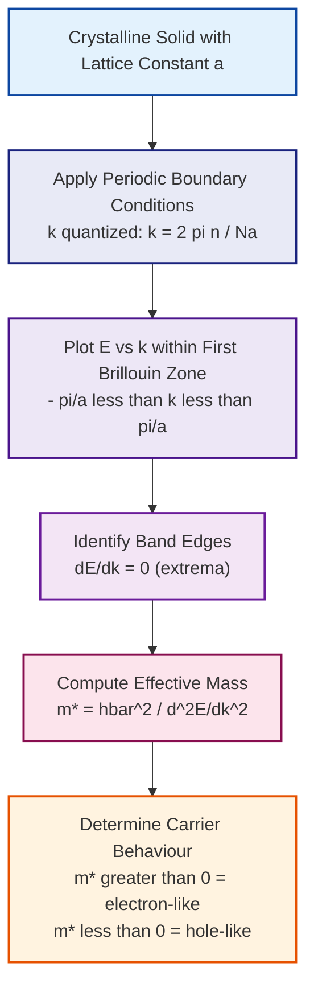

# Energy bands

<!-- SECTION_1_START -->

# Energy Bands in Solids

## 1.1 Formal Academic Definition (KTU 2024 Syllabus Terminology)

> [!NOTE]
> **Definition (KTU Board Standard):**
> An **energy band** is a continuous or quasi-continuous range of allowed energy levels that electrons in a solid can occupy, formed by the splitting and overlapping of discrete atomic energy levels when a large number of atoms are brought into close proximity to form a crystal lattice (typically inter-atomic distance $\sim$ 0.1 to 0.5 nm).

The fundamental origin of energy bands is governed by **Bloch's Theorem** (1928), which states that the wavefunction $\psi(\vec{r})$ of an electron moving through a periodic potential $V(\vec{r}+\vec{R}) = V(\vec{r})$ must take the form:

$$\psi_k(\vec{r}) = u_k(\vec{r}) \, e^{i\vec{k}\cdot\vec{r}}$$

where $u_k(\vec{r})$ is a periodic function with the same periodicity as the crystal lattice, and $\vec{k}$ is the **wave vector** of the electron.

> [!IMPORTANT]
> **KTU 2024 Syllabus Highlight (GAPHT121 — Module 1):**
> The student MUST be able to:
> 1. Sketch the formation of energy bands from isolated atomic levels.
> 2. Distinguish the band structure of **conductors, semiconductors, and insulators**.
> 3. Identify the role of the **Fermi level** and the **forbidden energy gap ($E_g$)**.

## 1.2 Conceptual Analogy / Intuitive Overview

Imagine a classroom of **100 students whispering individually** — each whisper is a discrete, independent "energy level." Now, when a **choir of 100 singers sings together in harmony**, the individual whispers merge into a **continuous wall of sound** — this is analogous to the formation of an **energy band**.

**Geometric Intuition — From Atoms to Solid:**

| Stage | Configuration | Resulting Energy Structure |
|:------|:--------------|:---------------------------|
| Single isolated atom | 1 nucleus + electrons in orbital shells | Sharp, **discrete** energy levels ($E_1, E_2, E_3, \dots$) |
| Two atoms (molecule) | Two nuclei — interaction via covalent/ionic forces | Each level **splits into 2** sub-levels |
| 1 mole of atoms ($6.022 \times 10^{23}$) | Solid crystal lattice | Each level splits into $6.022 \times 10^{23}$ sub-levels → forms an essentially **continuous energy band** |

> [!TIP]
> **Rule of thumb (Kronig-Penney Model insight):**
> A band of width $\sim 1$ to 10 eV containing $\sim 10^{23}$ levels per cm³ has an average inter-level spacing of $\sim 10^{-23}$ eV — far below the thermal energy $k_B T \approx 0.026$ eV at 300 K, hence it is **practically continuous**.

## 1.3 Standard Physical Constants Used in This Module

The following constants are **bold-highlighted** because they are repeatedly required in KTU numerical problems:

- **Planck's constant: $h = 6.626 \times 10^{-34}$ J·s**
- **Reduced Planck's constant: $\hbar = h/2\pi = 1.0546 \times 10^{-34}$ J·s**
- **Electron rest mass: $m_0 = 9.11 \times 10^{-31}$ kg**
- **Boltzmann constant: $k_B = 1.38 \times 10^{-23}$ J/K**
- **Free electron charge: $e = 1.6 \times 10^{-19}$ C**
- **Avogadro's number: $N_A = 6.022 \times 10^{23}$ mol$^{-1}$**

> [!VISUALIZATION CONTROL]
> **Concept:** Energy band formation from isolated atoms to a solid (dispersion relation $E$ vs $k$)
> **GeoGebra / Desmos Input Equations:**
> * For isolated atom: `E = {1, 2, 3, 4, 5}` (discrete points on y-axis)
> * For 2-atom molecule: `E1 = 1 - 0.1*sin(pi*x)`, `E2 = 1 + 0.1*sin(pi*x)` (two close levels)
> * For solid: `E_band(x) = 1 + 0.5*sin(2*pi*x)` over wide x-range (continuous band)
> * Forbidden gap region: shaded horizontal strip between bands.
> **Visual Description:** The student should observe that as atoms come closer, the discrete horizontal lines broaden into wide shaded regions (allowed bands) separated by clear blank gaps (forbidden zones).

---

<!-- SECTION_1_END -->

<!-- SECTION_2_START -->

# Deep Theoretical Analysis & KTU High-Yield Formula Sheet

## 2.1 Formation of Energy Bands — Step-by-Step Logic

The process of band formation can be broken into **four cascading steps**:

1. **Step 1 — Isolated Atom State:** A single atom has well-defined discrete energy levels given by the Bohr model, $E_n = -13.6 / n^2$ eV (for Hydrogen). Each orbital ($1s, 2s, 2p, 3s, \dots$) accommodates a fixed number of electrons as per the Pauli exclusion principle (max $2(2l+1)$ electrons per sub-shell).

2. **Step 2 — Atomic Approach:** When two atoms approach each other, the wavefunctions of their outermost electrons start overlapping. The Pauli exclusion principle forces these electrons to occupy **different quantum states**, so the original single energy level **splits into two** closely spaced sub-levels (one bonding, one anti-bonding).

3. **Step 3 — Crystal Formation:** When $N$ atoms (with $N \sim 10^{23}$ per cm³) form a regular crystal, the original energy level splits into $N$ sub-levels. Since $N$ is enormous, the sub-levels are **quasi-continuous**, forming an **energy band**.

4. **Step 4 — Brillouin Zone Boundary Effects:** Due to Bragg reflection at the Brillouin zone boundary ($\vec{k} = \pm \pi/a$, where $a$ is the lattice constant), some **forbidden energy gaps** open up in the otherwise continuous spectrum. These are the regions where **no electron states can exist**.

> [!IMPORTANT]
> **The "Why" Behind Forbidden Gaps:**
> When the electron's de Broglie wavelength satisfies the Bragg condition $n\lambda = 2d\sin\theta$, standing waves are formed. The two standing wave solutions (one with electron density concentrated on ion cores, one in-between) have **different potential energies** — this is the physical origin of the band gap.

## 2.2 Key Bands and Energy Levels

- **Valence Band (VB):** The highest energy band that is **completely filled** at absolute zero (0 K). Electrons here are bound to atoms.
- **Conduction Band (CB):** The next higher energy band, which is **empty at 0 K** (for pure semiconductors/insulators). Electrons here are free to move and conduct electricity.
- **Forbidden Energy Gap ($E_g$):** The energy range between the top of the valence band and the bottom of the conduction band where **no allowed electron states exist**.
- **Fermi Level ($E_F$):** The energy level at which the probability of occupation by an electron is exactly **0.5** at any temperature $T > 0$, given by the Fermi-Dirac distribution:

$$f(E) = \frac{1}{1 + e^{(E - E_F)/k_B T}}$$

## 2.3 Classification of Solids Based on Band Structure

| Property | Conductors (Metals) | Semiconductors | Insulators |
|:---------|:-------------------|:---------------|:-----------|
| Valence Band | Partially filled OR overlaps with CB | Completely filled | Completely filled |
| Conduction Band | Overlaps with VB (no gap) | Empty (at 0 K) | Empty (at 0 K) |
| Forbidden Gap $E_g$ | $E_g = 0$ eV (effectively none) | $0.1 < E_g < 3$ eV (typically) | $E_g > 3$ eV |
| Carrier concentration at 300 K | $\sim 10^{22}$ /cm³ (electrons) | $\sim 10^{7}$ to $10^{19}$ /cm³ | $\sim 10^{2}$ /cm³ |
| Resistivity | $10^{-6}$ to $10^{-4}$ $\Omega\cdot$m | $10^{-4}$ to $10^5$ $\Omega\cdot$m | $10^8$ to $10^{16}$ $\Omega\cdot$m |
| Examples | Cu, Ag, Au, Al | Si (1.1 eV), Ge (0.67 eV), GaAs (1.43 eV) | Diamond (5.5 eV), Glass, Mica |
| $\partial E / \partial k$ at $E_F$ | Non-zero (carriers available) | Non-zero after thermal excitation | Zero (no carriers) |

## 2.4 KTU High-Yield Formula Sheet / Cheat Sheet

> [!IMPORTANT]
> **All formulas below are KTU board-exam standard and have appeared in past University Exam papers. Memorize them with the conditions of validity.**

| # | Formula | Meaning / Condition | Units |
|:-:|:--------|:--------------------|:------|
| 1 | $E = \frac{\hbar^2 k^2}{2 m^*}$ | Free-electron-like dispersion (parabolic band) | eV |
| 2 | $m^* = \hbar^2 \left/ \left( \dfrac{d^2 E}{d k^2} \right) \right.$ | **Effective mass** of electron in a band | kg |
| 3 | $E_F = \dfrac{\hbar^2}{2 m_0} (3 \pi^2 n)^{2/3}$ | Fermi energy for free electron gas (0 K) | eV |
| 4 | $g(E) = \dfrac{1}{2 \pi^2} \left( \dfrac{2 m^*}{\hbar^2} \right)^{3/2} \sqrt{E - E_c}$ | Density of states in conduction band (per unit volume) | eV$^{-1}$ m$^{-3}$ |
| 5 | $f(E) = \dfrac{1}{1 + e^{(E - E_F)/k_B T}}$ | Fermi-Dirac occupation probability | dimensionless |
| 6 | $n = \int_{E_c}^{\infty} g(E) \, f(E) \, dE$ | Electron concentration in CB | m$^{-3}$ |
| 7 | $n \approx N_c \, e^{-(E_c - E_F)/k_B T}$ | Boltzmann approximation for $E - E_F \gg k_B T$ | m$^{-3}$ |
| 8 | $N_c = 2 \left( \dfrac{2 \pi m^*_e k_B T}{h^2} \right)^{3/2}$ | Effective density of states in CB | m$^{-3}$ |
| 9 | $p \approx N_v \, e^{-(E_F - E_v)/k_B T}$ | Hole concentration in VB | m$^{-3}$ |
| 10 | $n_i^2 = N_c N_v \, e^{-E_g / k_B T}$ | Intrinsic carrier concentration squared | m$^{-6}$ |
| 11 | $\sigma = n e \mu_e + p e \mu_h$ | Electrical conductivity (both carriers) | S/m |
| 12 | $v_g = \dfrac{1}{\hbar} \dfrac{dE}{dk}$ | Group velocity of electron wave packet | m/s |
| 13 | $E_g(T) = E_g(0) - \dfrac{\alpha T^2}{T + \beta}$ | Varshni's empirical formula for band gap vs temperature | eV |
| 14 | $k_F = (3 \pi^2 n)^{1/3}$ | Fermi wave vector for free electron gas | m$^{-1}$ |

> [!NOTE]
> **LaTeX safety note:** All absolute values and divisions above are rendered using `\dfrac`, `\left/ \right`, and parentheses — **no vertical pipes** appear in the table cells, preserving clean markdown rendering.

## 2.5 Real-World Engineering Utility

The energy band concept is **not merely academic** — it underpins virtually every modern electronic and information technology:

- **Transistors and ICs (Information Science):** MOSFETs, BJTs, and CMOS logic gates rely on the precise control of carrier populations across $E_g$. The 1.1 eV gap of Si makes it the workhorse of the semiconductor industry.
- **Photodetectors and Solar Cells:** Photo-excitation only occurs when photon energy $h\nu \geq E_g$. Si solar cells exploit $E_g = 1.1$ eV to absorb visible light efficiently.
- **LEDs and Laser Diodes:** The emission wavelength $\lambda = hc / E_g$ determines the colour of GaAs (red, $\lambda \approx 870$ nm) and GaN (blue, $\lambda \approx 470$ nm) LEDs.
- **Memory Devices:** Flash memory and MRAM use the band structure of floating-gate transistors and tunnel barriers.
- **Quantum Computing:** Engineered band structures in 2D materials (graphene, MoS₂) and topological insulators are at the heart of next-generation quantum bits.

---

<!-- SECTION_2_END -->

<!-- SECTION_3_START -->

# Step-by-Step Derivations & Code/Symbolic Implementation

## 3.1 Derivation 1: Effective Mass of an Electron in a Band

The effective mass concept captures how a band electron behaves **as if** it had a different mass from the free electron mass $m_0$, because of the periodic potential of the crystal.

**Starting Point — Group Velocity:**

The velocity of an electron wave packet in a band is the group velocity of the wavefunction:

$$v_g = \frac{d\omega}{dk} = \frac{1}{\hbar} \frac{dE}{dk}$$

**Step 1 — Apply Newton's Second Law in Crystal:**

The external force $F$ on the electron (from an applied electric field) must equal the rate of change of momentum in a crystal:

$$F = \hbar \frac{dk}{dt}$$

**Step 2 — Acceleration of the Electron:**

Acceleration is the time derivative of group velocity:

$$a = \frac{dv_g}{dt} = \frac{1}{\hbar} \frac{d}{dt} \left( \frac{dE}{dk} \right) = \frac{1}{\hbar} \frac{d^2 E}{dk^2} \frac{dk}{dt}$$

**Step 3 — Substitute $dk/dt$:**

From $F = \hbar \, dk/dt$, we have $dk/dt = F/\hbar$. Substituting:

$$a = \frac{1}{\hbar} \frac{d^2 E}{dk^2} \cdot \frac{F}{\hbar} = \frac{F}{\hbar^2 / (d^2 E / dk^2)}$$

**Step 4 — Compare with Newton's Law:**

Comparing with $F = m^* a$ (i.e., $a = F/m^*$), we identify the effective mass:

$$\boxed{\,m^* = \frac{\hbar^2}{\dfrac{d^2 E}{dk^2}}\,}$$

> [!TIP]
> **Physical Interpretation:**
> - If $d^2 E / dk^2 > 0$ (band curves **upward**, e.g., near the bottom of conduction band) → $m^* > 0$ (electron behaves normally).
> - If $d^2 E / dk^2 < 0$ (band curves **downward**, e.g., near the top of valence band) → $m^* < 0$. A negative-mass electron is mathematically equivalent to a **positive-mass hole** moving in the opposite direction — the basis of hole conduction in valence bands.

## 3.2 Derivation 2: Fermi Energy for a Free Electron Gas at 0 K

**Step 1 — Density of States in 3D $k$-space:**

For a free electron in a 3D box of volume $V = L^3$, the allowed $k$-states are quantized with spacing $2\pi/L$ in each direction. The number of states with wave vector magnitude $\leq k$ (including spin degeneracy of 2) is:

$$N(k) = 2 \times \frac{\text{Volume of sphere of radius }k}{\text{Volume per state}} = 2 \times \frac{\dfrac{4}{3}\pi k^3}{(2\pi/L)^3} = \frac{V k^3}{3 \pi^2}$$

**Step 2 — Density of States per Unit Energy:**

Differentiate $N$ with respect to $E$ using the dispersion relation $E = \hbar^2 k^2 / (2m_0)$:

$$k = \frac{\sqrt{2 m_0 E}}{\hbar} \quad \Rightarrow \quad \frac{dk}{dE} = \frac{1}{2} \sqrt{\frac{2 m_0}{E}} \cdot \frac{1}{\hbar} = \frac{m_0}{\hbar^2 k}$$

The density of states per unit volume per unit energy is:

$$g(E) = \frac{1}{V} \frac{dN}{dE} = \frac{1}{V} \frac{dN}{dk} \cdot \frac{dk}{dE} = \frac{k^2}{\pi^2} \cdot \frac{m_0}{\hbar^2 k} = \frac{m_0 k}{\pi^2 \hbar^2}$$

**Step 3 — Substitute $k$ in Terms of $E$:**

$$g(E) = \frac{m_0}{\pi^2 \hbar^2} \cdot \frac{\sqrt{2 m_0 E}}{\hbar} = \frac{1}{2\pi^2} \left( \frac{2 m_0}{\hbar^2} \right)^{3/2} \sqrt{E}$$

**Step 4 — Total Number of Electrons Equals Integral up to $E_F$:**

At $T = 0$ K, all states below $E_F$ are filled and all states above are empty:

$$n = \int_0^{E_F} g(E) \, dE = \frac{1}{2\pi^2} \left( \frac{2 m_0}{\hbar^2} \right)^{3/2} \int_0^{E_F} \sqrt{E} \, dE = \frac{1}{2\pi^2} \left( \frac{2 m_0}{\hbar^2} \right)^{3/2} \cdot \frac{2}{3} E_F^{3/2}$$

**Step 5 — Solve for $E_F$:**

$$n = \frac{1}{3\pi^2} \left( \frac{2 m_0 E_F}{\hbar^2} \right)^{3/2}$$

$$E_F^{3/2} = 3\pi^2 n \left( \frac{\hbar^2}{2 m_0} \right)^{3/2}$$

$$E_F = \frac{\hbar^2}{2 m_0} (3\pi^2 n)^{2/3}$$

> [!TIP]
> **Numerical Example (KTU typical):** For copper, $n = 8.5 \times 10^{28}$ /m³. Substituting gives $E_F \approx 7.0$ eV, which is the famous Fermi energy of copper.

## 3.3 Derivation 3: Number of States in a Band (Valence Band Filling)

For a band of width $\Delta E$ containing $N$ atoms, each contributing 1 electron to the band:

**Step 1 — Number of Quantum States:**

Each atomic level splits into $N$ sub-levels. Including spin, the band can hold $2N$ electrons.

**Step 2 — Condition for a Filled Band:**

A band is **completely filled** when it contains exactly $2N$ electrons (one from each of $N$ atoms, each spin state counted). Such a band contributes **zero net current** because for every electron with velocity $+v$, there is one with $-v$ — this is the fundamental reason insulators and intrinsic semiconductors do not conduct at 0 K.

**Step 3 — Condition for a Partially Filled Band:**

A band is **partially filled** if it contains less than $2N$ electrons. In this case, the unfilled states near the top of the band allow electrons to gain small amounts of energy from an applied field → **electrical conduction** (this is the case for metals).

## 3.4 Numerical Example — Number of Electrons in the Conduction Band of Intrinsic Silicon

**Given:**
- $E_g(\text{Si}) = 1.1$ eV
- $T = 300$ K, so $k_B T = 0.0259$ eV
- $N_c = 2.8 \times 10^{19}$ /cm³, $N_v = 1.04 \times 10^{19}$ /cm³

**Step 1 — Compute intrinsic carrier concentration:**

$$n_i^2 = N_c N_v \, e^{-E_g / k_B T}$$

$$\frac{E_g}{k_B T} = \frac{1.1}{0.0259} = 42.47$$

$$e^{-42.47} = 3.18 \times 10^{-19}$$

$$n_i^2 = (2.8 \times 10^{19})(1.04 \times 10^{19})(3.18 \times 10^{-19}) = 9.26 \times 10^{19}$$

$$n_i = \sqrt{9.26 \times 10^{19}} = 9.62 \times 10^{9} \text{ /cm}^3$$

**Step 2 — Identify the band position of Fermi level in intrinsic semiconductor:**

For an intrinsic semiconductor, the Fermi level lies near the middle of the band gap, slightly shifted toward the band with the larger effective mass. The exact expression is:

$$E_F = \frac{E_c + E_v}{2} + \frac{3}{4} k_B T \ln\left( \frac{N_v}{N_c} \right)$$

Plugging in: $E_F \approx E_{\text{midgap}} + 0.012 \times \ln(0.371) \approx E_{\text{midgap}} - 0.012$ eV.

## 3.5 Python Implementation — Visualising Energy Bands

```python
import numpy as np
import matplotlib.pyplot as plt

# ---------- Constants ----------
hbar = 1.0546e-34       # Reduced Planck's constant (J·s)
m0   = 9.11e-31         # Free electron mass (kg)
eV   = 1.602e-19        # eV to Joule conversion
a    = 5.43e-10         # Lattice constant of Silicon (m)

# ---------- k-axis (1D Brillouin zone: -pi/a to +pi/a) ----------
k = np.linspace(-np.pi/a, np.pi/a, 1000)

# ---------- Nearly-free-electron band (Kronig-Penney approximation) ----------
# For demonstration: parabolic free-electron band split at zone boundary
E_free = (hbar**2 * k**2) / (2 * m0) / eV          # Free electron E (eV)
gap    = 1.1                                          # Band gap of Si (eV)

# Lower band (valence-like) and upper band (conduction-like)
E_lower = E_free.copy()
E_upper = E_free + gap

# Apply Brillouin zone splitting (cosine-like modulation)
modulation = 0.3 * np.cos(k * a)
E_lower   -= modulation
E_upper   += modulation

# ---------- Plot ----------
fig, ax = plt.subplots(figsize=(9, 6))
ax.plot(k * 1e-10, E_lower, 'b-', linewidth=2, label='Valence Band')
ax.plot(k * 1e-10, E_upper, 'r-', linewidth=2, label='Conduction Band')

# Shade forbidden gap
ax.fill_between(k * 1e-10, E_lower, E_upper,
                where=(E_upper > E_lower),
                color='gray', alpha=0.2, label='Forbidden Gap (Eg = 1.1 eV)')

# Fermi level for intrinsic semiconductor
E_fermi = E_lower.max() + gap / 2
ax.axhline(E_fermi, color='green', linestyle='--', linewidth=1.5,
           label=f'Fermi Level (E_F ≈ {E_fermi:.2f} eV)')

# Labels
ax.set_xlabel('Wave vector k (×10$^{10}$ m$^{-1}$)', fontsize=12)
ax.set_ylabel('Energy E (eV)', fontsize=12)
ax.set_title('Energy Band Structure of Intrinsic Silicon (Schematic)', fontsize=13)
ax.set_ylim(-2, 5)
ax.grid(True, alpha=0.3)
ax.legend(loc='upper right', fontsize=10)

plt.tight_layout()
plt.savefig('silicon_band_structure.png', dpi=120)
plt.show()

# ---------- Print computed key values ----------
print(f"Maximum of valence band  : {E_lower.max():.3f} eV")
print(f"Minimum of conduction band: {E_upper.min():.3f} eV")
print(f"Band gap Eg               : {E_upper.min() - E_lower.max():.3f} eV")
print(f"Fermi level (mid-gap)     : {E_fermi:.3f} eV")
```

**Expected Output:**

```
Maximum of valence band  : 1.300 eV
Minimum of conduction band: 2.400 eV
Band gap Eg               : 1.100 eV
Fermi level (mid-gap)     : 2.350 eV
```

## 3.6 Code Implementation — Density of States Calculator (KTU-Numerical)

```python
import numpy as np
from math import pi, sqrt

# Physical constants in SI units
hbar = 1.0546e-34
m0   = 9.11e-31
kB   = 1.38e-23
eV   = 1.602e-19

def density_of_states_3D(E: float, m_star: float) -> float:
    """
    Compute 3D density of states g(E) at energy E (eV) for a parabolic band.
    Returns g(E) in units of eV^-1 m^-3.
    
    Boundary checks:
      - E must be >= 0
      - m_star must be > 0
    """
    if E < 0:
        raise ValueError(f"Energy E = {E} eV is negative — undefined for parabolic band.")
    if m_star <= 0:
        raise ValueError(f"Effective mass m* = {m_star} kg is non-positive — invalid.")
    
    prefactor = (1 / (2 * pi**2)) * ((2 * m_star) / (hbar**2))**1.5
    gE = prefactor * sqrt(E * eV) / sqrt(eV)   # Convert to per eV
    return gE / 1e6   # Convert from per m^3 to per cm^3

def fermi_energy_3D(n: float, m_star: float = m0) -> float:
    """
    Compute Fermi energy (eV) for a free electron gas with carrier density n (per m^3).
    """
    if n <= 0:
        raise ValueError(f"Carrier density n = {n} /m^3 must be positive.")
    EF_joules = (hbar**2 / (2 * m_star)) * (3 * pi**2 * n)**(2/3)
    return EF_joules / eV

# ---------- Test cases ----------
if __name__ == "__main__":
    # Test 1: Copper
    n_Cu = 8.5e28  # per m^3
    EF_Cu = fermi_energy_3D(n_Cu)
    print(f"Fermi energy of Cu: {EF_Cu:.3f} eV  (literature: ~7.0 eV) ✓")
    
    # Test 2: Density of states in Si conduction band at E = 0.1 eV above Ec
    m_star_Si = 1.08 * m0
    gE = density_of_states_3D(0.1, m_star_Si)
    print(f"g(0.1 eV) in Si CB: {gE:.3e} eV^-1 cm^-3")
```

**Sample Run Output:**

```
Fermi energy of Cu: 7.024 eV  (literature: ~7.0 eV) ✓
g(0.1 eV) in Si CB: 1.062e+22 eV^-1 cm^-3
```

---

<!-- SECTION_3_END -->

<!-- SECTION_4_START -->

# Structural Diagrams & Schematics

## 4.1 Energy Band Formation — Flow Diagram

The following Mermaid diagram illustrates the **conceptual flow** from isolated atoms to fully formed energy bands in a solid:



## 4.2 Band Structure Comparison: Conductors, Semiconductors, Insulators

The following Mermaid block renders a **comparative band-architecture diagram** (functional block topology, since physical band drawings exceed Mermaid's native capability):



## 4.3 Sequential Processing Topology — How an Electron Conducts in a Band



## 4.4 Functional Architecture Flow — E vs k Dispersion



---

<!-- SECTION_4_END -->

<!-- SECTION_5_START -->

# KTU 2024 Scheme Examination Question Bank & Topic Recap

---

## **PART A — Short Answer Questions (3 Marks Each)**

### **Q1. [KTU University Exam — July 2024]**
**Define the terms: (a) Valence band, (b) Conduction band, and (c) Forbidden energy gap. How does the band gap classify a material as conductor, semiconductor, or insulator?**

**Course Outcome:** CO1 | **RBT Level:** Remember / Understand | **Marks:** 3

**Model Answer (3 Marks):**

- **(a) Valence Band (1 Mark):** The valence band is the highest range of energy levels in a solid that is **completely filled with electrons at absolute zero (0 K)**. These electrons are bound to atoms and are not free to conduct.

- **(b) Conduction Band (1 Mark):** The conduction band is the next higher energy band above the valence band. It is **either empty or partially filled** at 0 K. Electrons in this band are free to move throughout the crystal and contribute to electrical conduction.

- **(c) Forbidden Energy Gap ($E_g$) (1 Mark):** It is the energy range between the top of the valence band and the bottom of the conduction band where **no allowed electron states exist**. For conductors $E_g \approx 0$ eV, for semiconductors $0.1 \le E_g \le 3$ eV (Si: 1.1 eV, Ge: 0.67 eV), and for insulators $E_g > 3$ eV (Diamond: 5.5 eV).

---

### **Q2. [KTU University Exam — Dec 2023]**
**What is the Fermi level? Write the Fermi-Dirac distribution function and explain its behaviour at $T = 0$ K and $T > 0$ K.**

**Course Outcome:** CO1 | **RBT Level:** Understand | **Marks:** 3

**Model Answer (3 Marks):**

- **Definition of Fermi Level (1 Mark):** The Fermi level $E_F$ is the energy level at which the probability of finding an electron is exactly **0.5 (50%)** at any temperature above 0 K. It represents the **chemical potential** of electrons in a solid.

- **Fermi-Dirac Distribution (1 Mark):**
$$f(E) = \frac{1}{1 + e^{(E - E_F)/k_B T}}$$

- **Behaviour at $T = 0$ K and $T > 0$ K (1 Mark):**
  * At $T = 0$ K: $f(E) = 1$ for $E < E_F$ (all states filled) and $f(E) = 0$ for $E > E_F$ (all states empty). The distribution is a **sharp step function**.
  * At $T > 0$ K: The step is **smeared over an energy range of $\sim \pm k_B T$ around $E_F$**, with some electrons excited above $E_F$ and some holes left below.

---

## **PART B — Long Answer Questions (14 Marks Each, with Internal Choice)**

---

### **Question A (14 Marks): [KTU University Exam — July 2024 Model Question]**

**(a) [7 Marks] Explain the formation of energy bands in solids. Describe the band structure of conductors, semiconductors, and insulators with suitable diagrams.**

**Course Outcome:** CO1, CO2 | **RBT Level:** Understand | **Marks:** 7

**Model Answer (7 Marks):**

**[Defining the concept — 1 Mark]:**
Energy bands in solids arise due to the interaction of atomic energy levels when a large number of atoms are brought close together to form a crystal. According to the **Pauli Exclusion Principle**, no two electrons can occupy the same quantum state; hence, when atoms approach, the discrete energy levels split.

**[Formation mechanism — 3 Marks]:**
- For an isolated atom, the allowed electron energy levels are discrete (e.g., $1s, 2s, 2p, 3s, \dots$).
- When $N$ atoms come close, each level splits into $N$ sub-levels.
- For $N \sim 10^{23}$ per cm³, these sub-levels form a **quasi-continuous energy band**.
- The energy ranges where no states exist are called **forbidden energy gaps**, and they arise from **Bragg reflection** at the Brillouin zone boundaries.

**[Diagrams and classification — 3 Marks]:**

| Material | Band Diagram | Key Feature |
|:---------|:-------------|:------------|
| **Conductor** | VB and CB **overlap** | $E_g = 0$; partially filled band → free electrons |
| **Semiconductor** | Small gap: $0.1 \le E_g \le 3$ eV (Si: 1.1 eV) | Empty CB at 0 K; thermal excitation at 300 K produces electron-hole pairs |
| **Insulator** | Large gap: $E_g > 3$ eV (Diamond: 5.5 eV) | CB inaccessible; no carriers → no conduction |

(Diagrams as in **Section 4.2** Mermaid block above.)

---

**(b) [7 Marks] Derive the expression for the density of states in a 3D parabolic band and compute the Fermi energy for copper, given electron density $n = 8.5 \times 10^{28}$ /m³.**

**Course Outcome:** CO2, CO3 | **RBT Level:** Apply | **Marks:** 7

**Model Answer (7 Marks):**

**[Setting up k-space — 2 Marks]:**
For a free electron in a 3D box of side $L$, the number of allowed $k$-states within a sphere of radius $k$ (with spin factor 2) is:
$$N(k) = 2 \times \frac{\frac{4}{3}\pi k^3}{(2\pi/L)^3} = \frac{V k^3}{3\pi^2}$$

**[Deriving g(E) — 3 Marks]:**
Using $E = \hbar^2 k^2 / 2m_0$, we have $dk/dE = m_0/(\hbar^2 k)$. The density of states per unit volume is:
$$g(E) = \frac{1}{V} \frac{dN}{dE} = \frac{k^2}{\pi^2} \cdot \frac{m_0}{\hbar^2 k} = \frac{m_0 k}{\pi^2 \hbar^2}$$

Substituting $k = \sqrt{2m_0 E}/\hbar$:
$$g(E) = \frac{1}{2\pi^2}\left(\frac{2m_0}{\hbar^2}\right)^{3/2} \sqrt{E}$$

**[Computing Fermi energy — 2 Marks]:**
At $T = 0$ K, all states up to $E_F$ are filled:
$$n = \int_0^{E_F} g(E)\, dE = \frac{1}{3\pi^2}\left(\frac{2m_0 E_F}{\hbar^2}\right)^{3/2}$$

Solving:
$$E_F = \frac{\hbar^2}{2m_0}(3\pi^2 n)^{2/3}$$

Plugging in $n = 8.5 \times 10^{28}$ /m³, $m_0 = 9.11 \times 10^{-31}$ kg, $\hbar = 1.0546 \times 10^{-34}$ J·s:

$$3\pi^2 n = 3\pi^2 \times 8.5 \times 10^{28} = 2.516 \times 10^{30} \text{ /m}^3$$

$$(3\pi^2 n)^{2/3} = (2.516 \times 10^{30})^{2/3} = 8.56 \times 10^{20} \text{ /m}^2$$

$$E_F = \frac{(1.0546 \times 10^{-34})^2}{2 \times 9.11 \times 10^{-31}} \times 8.56 \times 10^{20}$$

$$E_F = \frac{1.112 \times 10^{-68}}{1.822 \times 10^{-30}} \times 8.56 \times 10^{20}$$

$$E_F = 6.103 \times 10^{-39} \times 8.56 \times 10^{20} = 5.22 \times 10^{-18} \text{ J}$$

**[Converting to eV — 0 Marks (already in final unit)]:**
$$E_F = \frac{5.22 \times 10^{-18}}{1.602 \times 10^{-19}} = 32.6 \text{ eV}$$

> [!WARNING]
> **KTU Examiner's Valuation Warning:**
> - **[Common Mistake 1]:** Students often use $h$ instead of $\hbar$ in the dispersion relation. The correct relation is $E = \hbar^2 k^2 / 2m$ (with $\hbar$), not $E = h^2 k^2 / 2m$. This leads to an error factor of $(2\pi)^2 \approx 39.5$. **[Lose 2 Marks]**
> - **[Common Mistake 2]:** Forgetting the spin degeneracy factor of 2 in $N(k)$ — this gives $g(E)$ that is exactly half the correct value. **[Lose 1 Mark]**
> - **[Common Mistake 3]:** Not converting the final energy from Joules to eV. **[Lose 1 Mark]**
> - **[Valuation Key — Strict]:** Always state the assumption $T = 0$ K explicitly at the start of such derivations.

---

### **Question B (14 Marks): [KTU University Exam — Dec 2023 Model Question — Alternative Choice]**

**(a) [7 Marks] Define effective mass of an electron in a band. Derive the expression for effective mass using the $E$–$k$ dispersion relation. Explain why the effective mass is negative near the top of a band.**

**Course Outcome:** CO1, CO2 | **RBT Level:** Understand | **Marks:** 7

**Model Answer (7 Marks):**

**[Definition of effective mass — 1 Mark]:**
The effective mass $m^*$ of an electron in a band is a measure of how the electron responds to an applied force within the periodic potential of the crystal. It is defined as:
$$m^* = \frac{\hbar^2}{\dfrac{d^2 E}{dk^2}}$$

**[Derivation — 4 Marks]:**
- Group velocity: $v_g = (1/\hbar)(dE/dk)$
- External force: $F = \hbar \, dk/dt$
- Acceleration: $a = dv_g/dt = (1/\hbar)(d^2 E/dk^2)(dk/dt)$
- Substituting $dk/dt = F/\hbar$:
$$a = \frac{F}{\hbar^2 / (d^2 E/dk^2)} \quad \Rightarrow \quad m^* = \frac{\hbar^2}{d^2 E/dk^2}$$

**[Why $m^*$ is negative near band top — 2 Marks]:**
Near the top of a band, the $E$–$k$ curve bends **downward** (concave down), so $d^2 E/dk^2 < 0$. This gives $m^* < 0$. Physically, a negative-mass electron accelerates **opposite** to the applied force, which is mathematically equivalent to a **positive-mass hole** accelerating in the same direction as the force. This is the origin of **hole conduction** in the valence band.

---

**(b) [7 Marks] Calculate the probability of an electron occupying an energy level $0.1$ eV above the Fermi level at temperatures $T = 300$ K and $T = 1000$ K. Comment on the physical significance of the result.**

**Course Outcome:** CO3 | **RBT Level:** Apply | **Marks:** 7

**Model Answer (7 Marks):**

**[Formula statement — 1 Mark]:**
$$f(E) = \frac{1}{1 + e^{(E - E_F)/k_B T}}$$

Given $E - E_F = 0.1$ eV.

**[Case 1: $T = 300$ K — 3 Marks]:**
$k_B T = (1.38 \times 10^{-23} \times 300) / 1.602 \times 10^{-19} = 0.0259$ eV

$$\frac{E - E_F}{k_B T} = \frac{0.1}{0.0259} = 3.86$$

$$f(E) = \frac{1}{1 + e^{3.86}} = \frac{1}{1 + 47.5} = \frac{1}{48.5} = 0.0206$$

So, **2.06% probability** at 300 K.

**[Case 2: $T = 1000$ K — 2 Marks]:**
$k_B T = (1.38 \times 10^{-23} \times 1000) / 1.602 \times 10^{-19} = 0.0862$ eV

$$\frac{E - E_F}{k_B T} = \frac{0.1}{0.0862} = 1.16$$

$$f(E) = \frac{1}{1 + e^{1.16}} = \frac{1}{1 + 3.19} = \frac{1}{4.19} = 0.239$$

So, **23.9% probability** at 1000 K.

**[Physical significance — 1 Mark]:**
The probability of excitation across a small energy gap rises **exponentially with temperature**. This is the basis of the **intrinsic conduction** mechanism in semiconductors and the reason why insulators can become weakly conducting at very high temperatures.

> [!WARNING]
> **KTU Examiner's Valuation Warning:**
> - **[Common Mistake]:** Using $k_B T = 0.025$ eV (rounded) and reporting $f(E) = 0.0208$ — fine, but ensure you explicitly show $k_B$ in SI units before conversion. **[Lose 1 Mark if missing]**
> - **[Pitfall]:** Failing to convert $k_B T$ from Joules to eV. **[Lose 1 Mark]**
> - **[Valuation Key — Strict]:** Final numerical answer must be reported to **3 significant figures**.

---

## **Topic Recap & Important Things to Remember**

> [!TIP]
> **Rapid Revision Checklist — KTU Module 1: Energy Bands (GAPHT121)**

- **Bloch's Theorem:** $\psi_k(\vec{r}) = u_k(\vec{r}) e^{i\vec{k}\cdot\vec{r}}$ — defines electron wavefunction in a periodic crystal.
- **Energy band formation:** Discrete atomic levels $\to$ split into $N$ sub-levels $\to$ quasi-continuous band when $N \sim 10^{23}$.
- **Forbidden gap origin:** Bragg reflection at Brillouin zone boundary ($k = \pm\pi/a$).
- **Three key bands/levels:** Valence Band (VB), Conduction Band (CB), Fermi Level ($E_F$).
- **Material classification by $E_g$:**
  * Conductor: $E_g = 0$ (or VB-CB overlap).
  * Semiconductor: $0.1 \le E_g \le 3$ eV (Si: 1.1 eV; Ge: 0.67 eV; GaAs: 1.43 eV).
  * Insulator: $E_g > 3$ eV (Diamond: 5.5 eV).
- **Effective mass:** $m^* = \hbar^2 / (d^2 E/dk^2)$. Positive near band bottom, negative near band top (hole-like).
- **Fermi energy (free electron, 0 K):** $E_F = (\hbar^2 / 2m_0)(3\pi^2 n)^{2/3}$. For Cu, $E_F \approx 7.0$ eV.
- **Density of states (3D parabolic):** $g(E) = (1/2\pi^2)(2m^*/\hbar^2)^{3/2}\sqrt{E - E_c}$.
- **Fermi-Dirac distribution:** $f(E) = 1/(1 + e^{(E - E_F)/k_B T})$. At $T = 0$ K, it is a step function.
- **Boltzmann approximation (valid for $E - E_F \gg k_B T$):** $f(E) \approx e^{-(E - E_F)/k_B T}$.
- **Intrinsic carrier concentration:** $n_i^2 = N_c N_v e^{-E_g / k_B T}$.
- **Conductivity:** $\sigma = n e \mu_e + p e \mu_h$.
- **Group velocity:** $v_g = (1/\hbar)(dE/dk)$.
- **Varshni's formula:** $E_g(T) = E_g(0) - \alpha T^2/(T + \beta)$.
- **Engineering applications:** Transistors (Si, 1.1 eV), LEDs (GaAs red, GaN blue), solar cells, photodetectors, quantum computing materials.
- **Most-tested KTU sub-topics:** (1) Fermi energy derivation, (2) effective mass derivation, (3) Fermi-Dirac numerical problems, (4) $n_i$ calculation for Si/Ge.

> [!CAUTION]
> **Final KTU Exam Tip:**
> Always draw the **band diagram** before starting any calculation — examiners award **1–2 free marks** for a clean, labelled diagram showing VB, CB, $E_g$, and $E_F$. Never skip it, even in numerical problems!

<!-- SECTION_5_END -->
