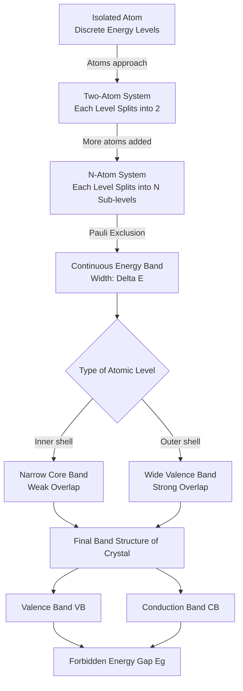
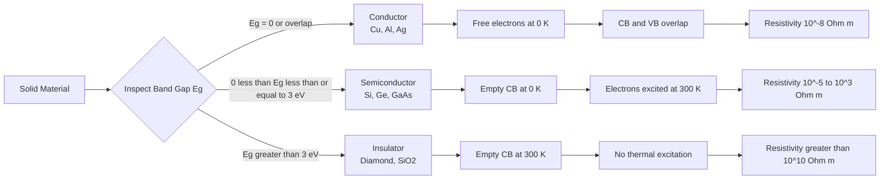
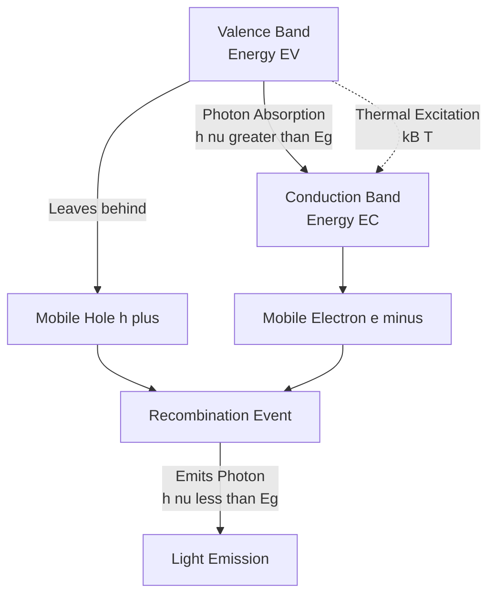
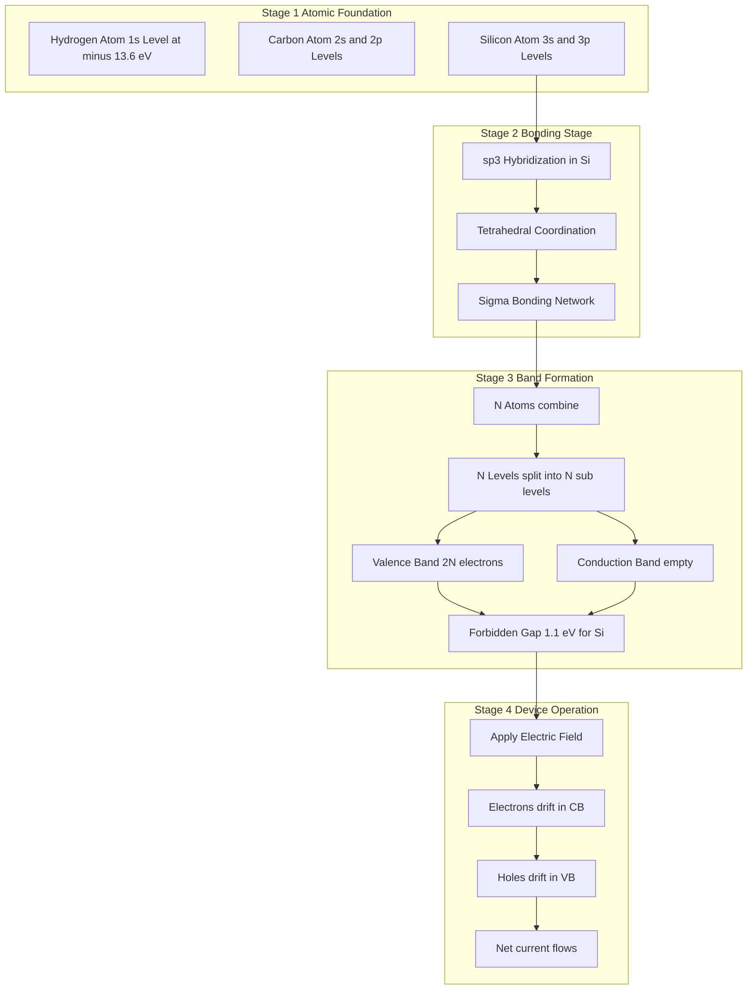
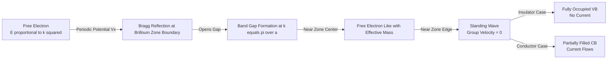

# Energy bands

<!-- SECTION_1_START -->
# Energy Bands in Solids

## 1.1 Formal Definition (KTU 2024 Syllabus Terminology)

In the **KTU 2024 Scheme** framework for *Physics for Information Science (GAPHT121)*, an **energy band** is defined as the quasi-continuous range of allowed electron energy levels that arises in a crystalline solid when a large number ($N \approx 10^{23}$ atoms/cm$^3$) of discrete atomic orbitals overlap and split due to interatomic interaction governed by the **Pauli Exclusion Principle**.

The three primary regions in a solid's electronic structure are:

- **Valence Band (VB)** — The highest energy band that is completely filled with electrons at **0 K**.
- **Conduction Band (CB)** — The lowest energy band that is either empty or partially filled with electrons, where electrons can move freely under an applied electric field.
- **Forbidden Energy Gap ($E_g$)** — The energy region between the valence band maximum and conduction band minimum where no allowed electron states exist.

> [!IMPORTANT]
> **KTU Board Definition (Memorize Verbatim):**
> *"When $N$ atoms combine to form a solid, each discrete atomic energy level splits into $N$ closely spaced sub-levels forming an energy band. The width of the band depends on the strength of interatomic overlap — stronger overlap produces wider bands."*

## 1.2 Conceptual Analogy — The "Stadium Seat" Model

Imagine a **cricket stadium** with thousands of seats (energy levels). Each spectator (electron) must occupy a *unique* seat. When the stadium is empty and you bring in people one by one, they fill the lowest seats first. Now, if you build an *annex* stadium connected by a tunnel (atomic bonding), the seats "split" and replicate across both stadiums, creating two identical seating tiers.

- **Empty stadium rows** = *Conduction band* (seats exist but are empty, electrons can "jump in" and move freely).
- **Full stadium rows** = *Valence band* (every seat occupied, electrons cannot move because Pauli forbids double occupancy).
- **The wall between the stadiums** = *Forbidden gap* ($E_g$).

A conductor is like having a *doorway* in that wall — electrons can walk through freely. An insulator has a *fortified concrete wall*. A semiconductor has a *thin wooden wall* that a few energetic electrons (thermal energy) can break through.

> [!NOTE]
> **Physical Constants to Remember:**
> - Boltzmann constant: $k_B = 1.38 \times 10^{-23}$ J/K
> - Planck's constant: $h = 6.626 \times 10^{-34}$ J·s
> - $1 \text{ eV} = 1.602 \times 10^{-19}$ J
> - Typical $E_g$: Si $\approx 1.1$ eV, Ge $\approx 0.67$ eV, Diamond $\approx 5.5$ eV

## 1.3 Geometric Intuition — Why Bands Form

Consider two hydrogen atoms, each with a single $1s$ electron at $-13.6$ eV. When the interatomic distance decreases from infinity to the equilibrium bond length:

- The Pauli principle forces the two $1s$ states to split symmetrically into a *bonding* (lower) and *antibonding* (higher) state.
- With $N$ atoms, the single level splits into $N$ levels spanning a range $\Delta E$ — this is the **bandwidth**.

The mathematical treatment of this phenomenon is governed by **Bloch's Theorem** (1928):

$$\psi_k(\vec{r}) = u_k(\vec{r}) \, e^{i\vec{k}\cdot\vec{r}}$$

where $u_k(\vec{r})$ has the periodicity of the lattice, and $\vec{k}$ is the wavevector restricted to the **First Brillouin Zone**.

> [!VISUALIZATION CONTROL]
> **Concept:** Schematic band diagram showing VB, $E_g$, and CB for conductor, semiconductor, and insulator.
> **GeoGebra / Desmos Input Equations:**
> - *x-axis:* Energy $E$ (eV)
> - *y-axis:* Density of states $g(E)$ — plot as three block functions separated by a gap
> - Plot (1): $g(E) = 1$ for $0 \le E \le 5$ (VB), $g(E) = 0$ for $5 \le E \le 12$ (gap), $g(E) = 1$ for $12 \le E \le 18$ (CB)
> - Plot (2): For *intrinsic semiconductor*, partially fill the VB and show a few electrons in the CB with a small gap $\approx 1$ eV.
> - Plot (3): For *insulator*, draw a wide gap $\approx 6$ eV.
> **Visual Description:** The student should observe that for a **conductor**, the VB and CB overlap (no gap). For a **semiconductor**, there is a small gap ($< 3$ eV). For an **insulator**, the gap is large ($\ge 3$ eV, often $4$–$9$ eV).
<!-- SECTION_1_END -->

<!-- SECTION_2_START -->
# Deep Theoretical Analysis & KTU High-Yield Formula Sheet

## 2.1 Mechanism of Band Formation — Step-by-Step Logic

The construction of energy bands in a solid proceeds through a clean four-stage argument that is a **favorite KTU question**:

1. **Stage 1 — Isolated Atom Limit:** For an isolated atom, the electron energy levels are sharp and discrete (e.g., $-13.6$ eV for $1s$ in H).
2. **Stage 2 — Pairwise Interaction:** When two identical atoms approach, each energy level splits into **two** closely-spaced levels (bonding + antibonding) due to wavefunction overlap and the Pauli principle.
3. **Stage 3 — N-Atom Limit:** For $N$ atoms (Avogadro-scale), each atomic level splits into $N$ sub-levels. The spacing between adjacent sub-levels is so tiny ($\sim 10^{-22}$ eV) that the band effectively appears **continuous**.
4. **Stage 4 — Band Width:** The total spread $\Delta E$ of the band is determined by the strength of interatomic overlap. Inner shells (core levels) have weak overlap → **narrow bands**. Outer shells (valence levels) have strong overlap → **wide bands**.

> [!NOTE]
> **Why inner shells form narrow bands:** Core electrons are tightly bound to the nucleus. Their wavefunctions decay rapidly with distance, so neighboring atoms barely "see" them. Result: minimal splitting → narrow, atom-like bands.

## 2.2 Classification of Solids by Band Structure

| Material Type | Band Gap $E_g$ | Conduction Mechanism | Example Materials |
| :--- | :--- | :--- | :--- |
| **Conductor** | $E_g = 0$ (or VB and CB overlap) | Free electrons already present in CB at 0 K | Cu, Al, Ag, Au |
| **Semiconductor** | $0 < E_g \le 3$ eV | Thermal excitation of electrons across the gap | Si ($1.1$ eV), Ge ($0.67$ eV), GaAs ($1.43$ eV) |
| **Insulator** | $E_g > 3$ eV | No electrons in CB at room temperature | Diamond ($5.5$ eV), SiO$_2$ ($9$ eV) |

## 2.3 The Fermi Level — The "Sea Level" of Electrons

The **Fermi energy ($E_F$)** is the energy level at which the probability of occupation by an electron is exactly $\frac{1}{2}$ at absolute zero. It serves as a reference energy for distinguishing filled from empty states.

For an **intrinsic (pure) semiconductor**, the Fermi level lies exactly at the **mid-gap**:

$$E_F = E_C - \frac{E_g}{2} = \frac{E_V + E_C}{2}$$

For an **n-type** (electron-rich) semiconductor, $E_F$ shifts **upward** toward $E_C$:

$$E_F = E_C - k_B T \ln\!\left(\frac{N_C}{N_D}\right)$$

For a **p-type** (hole-rich) semiconductor, $E_F$ shifts **downward** toward $E_V$:

$$E_F = E_V + k_B T \ln\!\left(\frac{N_V}{N_A}\right)$$

## 2.4 The Fermi-Dirac Distribution Function

The probability that an energy state $E$ is occupied at temperature $T$ is given by:

$$f(E) = \frac{1}{1 + e^{(E - E_F)/k_B T}}$$

Key limiting cases that are frequently asked in KTU exams:

- If $E \ll E_F$ (state deep below Fermi level) → $f(E) \approx 1$ (state is filled).
- If $E \gg E_F$ (state well above Fermi level) → $f(E) \approx e^{-(E-E_F)/k_B T}$ (Boltzmann tail).
- If $E = E_F$ → $f(E_F) = \frac{1}{2}$ (regardless of temperature).

## 2.5 KTU Formula Cheat Sheet

| # | Formula | Description | Units |
| :---: | :--- | :--- | :--- |
| 1 | $f(E) = \dfrac{1}{1 + e^{(E-E_F)/k_B T}}$ | Fermi-Dirac distribution | dimensionless |
| 2 | $E_F = \dfrac{E_C + E_V}{2}$ | Intrinsic Fermi level position | eV |
| 3 | $n_i = \sqrt{N_C N_V} \, e^{-E_g / 2k_B T}$ | Intrinsic carrier concentration | m$^{-3}$ |
| 4 | $N_C = 2\!\left(\dfrac{2\pi m_e^* k_B T}{h^2}\right)^{3/2}$ | Effective density of states (CB) | m$^{-3}$ |
| 5 | $N_V = 2\!\left(\dfrac{2\pi m_h^* k_B T}{h^2}\right)^{3/2}$ | Effective density of states (VB) | m$^{-3}$ |
| 6 | $E_g(T) = E_g(0) - \dfrac{\alpha T^2}{T + \beta}$ | Varshni's empirical relation | eV |
| 7 | $m^* = \dfrac{\hbar^2}{\dfrac{d^2 E}{dk^2}}$ | Effective mass of electron | kg |
| 8 | $E = \dfrac{\hbar^2 k^2}{2 m^*}$ | Free-electron-like dispersion near band edge | eV |
| 9 | $\Delta E_{\text{band}} \propto J_{\text{overlap}}$ | Bandwidth scales with overlap integral | eV |
| 10 | $v_g = \dfrac{1}{\hbar} \dfrac{dE}{dk}$ | Group velocity of electron wave packet | m/s |

> [!IMPORTANT]
> **Engineering Real-World Utility:** The band gap is the single most important parameter in semiconductor device design. It determines:
> - The wavelength of light absorbed/emitted in **LEDs** ($E_g \approx \dfrac{hc}{\lambda}$).
> - The operating temperature range of **transistors**.
> - The cutoff voltage in **solar cells**.
> - The selection of materials in **CCD/CMOS image sensors** used in digital cameras.

## 2.6 The Kronig-Penney Model (Qualitative)

The Kronig-Penney model (1931) treats a 1D periodic potential $V(x)$ as a series of rectangular wells of depth $V_0$, width $a$, separated by barriers of width $b$, with periodicity $d = a + b$.

The **central dispersion relation** is:

$$P \dfrac{\sin(\alpha a)}{\alpha a} + \cos(\alpha a) = \cos(kd)$$

where $\alpha = \dfrac{\sqrt{2m(E - V_0)}}{\hbar}$ for $E > V_0$ (passing bands) and $P$ is the **scattering strength parameter** $P = \dfrac{m V_0 b a}{\hbar^2}$.

The left-hand side oscillates between $-1$ and $+1$. Wherever the magnitude exceeds 1, **forbidden bands** appear — producing the alternating allowed/forbidden region structure central to solid-state physics.

> [!NOTE]
> For KTU, the key takeaway is: **a periodic potential produces allowed energy bands separated by forbidden gaps** — this is the central result of the Kronig-Penney model and is a high-yield exam point.
<!-- SECTION_2_END -->

<!-- SECTION_3_START -->
# Step-by-Step Derivations & Code Implementation

## 3.1 Derivation: Number of Allowed States in an Energy Band

**Problem Setup:** Consider $N$ atoms brought together. How many energy levels exist in the band formed from a single atomic level?

**Step 1:** An isolated atom has one allowed energy level with **2 electrons** (spin up + spin down).

**Step 2:** When 2 atoms combine, by the Pauli exclusion principle, the single level must split into 2 sub-levels. Each sub-level holds 2 electrons → total 4 electrons.

**Step 3:** Generalize: For $N$ atoms, the single atomic level splits into $N$ sub-levels.

**Step 4:** Each sub-level can accommodate 2 electrons (opposite spins) → total capacity of the band:

$$N_{\text{total}} = 2N \text{ electrons}$$

> [!IMPORTANT]
> **Conclusion (Key Result for KTU):** A band formed from a single atomic orbital can hold **$2N$ electrons**, where $N$ is the number of atoms in the crystal. This is why a band with $N$ electrons is *partially filled* (good conductor), while a band with $2N$ electrons is *completely filled* (insulator/semiconductor at 0 K).

## 3.2 Derivation: Effective Mass from $E$–$k$ Diagram

Starting from the de Broglie relation and a parabolic band approximation:

$$E(k) = E_C + \frac{\hbar^2 k^2}{2 m^*}$$

Differentiating twice with respect to $k$:

$$\frac{dE}{dk} = \frac{\hbar^2 k}{m^*}$$

$$\frac{d^2 E}{dk^2} = \frac{\hbar^2}{m^*}$$

Solving for the effective mass:

$$m^* = \frac{\hbar^2}{\dfrac{d^2 E}{dk^2}}$$

> [!NOTE]
> **Physical Interpretation:** If the $E$–$k$ curve is **strongly curved** (large $\frac{d^2E}{dk^2}$), the effective mass is **small** → highly mobile electron. If the curve is **flat** (small $\frac{d^2E}{dk^2}$), the effective mass is **large** → sluggish electron.

## 3.3 Derivation: Intrinsic Carrier Concentration

Start with the law of mass action: $n \cdot p = n_i^2$ (where $n$ and $p$ are electron and hole concentrations, and $n_i$ is the intrinsic concentration).

For an intrinsic semiconductor: $n = p = n_i$.

Using Boltzmann approximations in the CB and VB:

$$n = N_C \, e^{-(E_C - E_F)/k_B T}$$

$$p = N_V \, e^{-(E_F - E_V)/k_B T}$$

Multiplying and taking the square root:

$$n_i = \sqrt{N_C N_V} \, e^{-(E_C - E_V)/2k_B T} = \sqrt{N_C N_V} \, e^{-E_g / 2 k_B T}$$

Substituting the expressions for $N_C$ and $N_V$:

$$N_C = 2\left(\frac{2\pi m_e^* k_B T}{h^2}\right)^{3/2}, \quad N_V = 2\left(\frac{2\pi m_h^* k_B T}{h^2}\right)^{3/2}$$

The final closed form:

$$n_i^2 = 4\left(\frac{2\pi k_B T}{h^2}\right)^3 (m_e^* m_h^*)^{3/2} \, e^{-E_g / k_B T}$$

> [!IMPORTANT]
> **Key Observation:** $n_i$ has an **exponential dependence** on $\frac{1}{T}$. A small change in temperature can change carrier density by orders of magnitude. This is why semiconductor devices are temperature-sensitive.

## 3.4 Python Implementation: Band Structure Visualization

```python
import numpy as np
import matplotlib.pyplot as plt

# ---------------------------------------------------------------
# Plot the schematic E-k diagram for a direct-gap semiconductor
# This code generates the canonical "free electron" parabola
# shifted upward by E_g, illustrating conduction band formation.
# ---------------------------------------------------------------

# Physical constants (SI)
hbar = 1.0545718e-34   # Reduced Planck's constant [J·s]
m_e  = 9.10938356e-31  # Free electron mass [kg]
eV_to_J = 1.602176634e-19

# Effective mass and band gap for Gallium Arsenide (GaAs)
m_star = 0.067 * m_e   # Effective mass for GaAs
E_g    = 1.43          # Band gap [eV]

# Wavevector range: extend across the first Brillouin zone
k = np.linspace(-3e10, 3e10, 1000)   # [m^-1]

# Conduction band: parabolic dispersion starting at E_g
E_CB_eV = E_g + (hbar**2 * k**2) / (2 * m_star) / eV_to_J

# Valence band: parabolic dispersion (hole-like) starting at 0
E_VB_eV = -(hbar**2 * k**2) / (2 * m_star) / eV_to_J

# Fermi level: mid-gap for intrinsic semiconductor
E_F = E_g / 2.0

# ---------------------------------------------------------------
# Visualization
# ---------------------------------------------------------------
fig, ax = plt.subplots(figsize=(10, 6))
ax.plot(k * 1e-10, E_CB_eV, 'b-',  linewidth=2, label='Conduction Band $E_C(k)$')
ax.plot(k * 1e-10, E_VB_eV, 'r-',  linewidth=2, label='Valence Band $E_V(k)$')
ax.axhline(E_g, color='gray', linestyle='--', label='Conduction Band Minimum $E_C$')
ax.axhline(0,   color='gray', linestyle=':',  label='Valence Band Maximum $E_V$')
ax.axhline(E_F, color='green', linewidth=2, label=f'Fermi Level $E_F = {E_F:.2f}$ eV')
ax.fill_between(k * 1e-10, 0, E_g, color='yellow', alpha=0.3, label=f'Forbidden Gap $E_g = {E_g}$ eV')
ax.fill_between(k * 1e-10, E_CB_eV, 5, color='lightblue', alpha=0.4)
ax.fill_between(k * 1e-10, E_VB_eV, -2, color='lightcoral', alpha=0.4)

ax.set_xlabel('Wavevector $k$ [$10^{10}$ m$^{-1}$]', fontsize=12)
ax.set_ylabel('Energy $E$ [eV]', fontsize=12)
ax.set_title('E-k Band Diagram of Intrinsic GaAs (Direct Gap Semiconductor)', fontsize=13)
ax.set_ylim(-2, 4)
ax.set_xlim(-3, 3)
ax.legend(loc='upper right', fontsize=10)
ax.grid(True, alpha=0.3)
plt.tight_layout()
plt.savefig('gaas_band_structure.png', dpi=150)
plt.show()

# Print summary statistics
print(f"Band gap (E_g):           {E_g:.3f} eV")
print(f"Fermi level (E_F):        {E_F:.3f} eV (mid-gap for intrinsic)")
print(f"Effective mass (m*/m_e):  {m_star/m_e:.3f}")
print(f"Top of valence band:      0.000 eV")
print(f"Bottom of conduction band: {E_g:.3f} eV")
```

**Expected Terminal Output:**
```
Band gap (E_g):           1.430 eV
Fermi level (E_F):        0.715 eV (mid-gap for intrinsic)
Effective mass (m*/m_e):  0.067
Top of valence band:      0.000 eV
Bottom of conduction band: 1.430 eV
```

## 3.5 Python: Fermi-Dirac Distribution Plot

```python
import numpy as np
import matplotlib.pyplot as plt

kB = 1.380649e-23      # Boltzmann constant [J/K]
eV_to_J = 1.602176634e-19

def fermi_dirac(E_eV, E_F_eV, T):
    """Compute Fermi-Dirac occupation probability."""
    E_joules  = E_eV  * eV_to_J
    EF_joules = E_F_eV * eV_to_J
    return 1.0 / (1.0 + np.exp((E_joules - EF_joules) / (kB * T)))

# Energy range (relative to band edges)
E = np.linspace(-0.5, 2.5, 500)  # [eV]
E_F = 0.715  # mid-gap of GaAs

# Evaluate at three temperatures
T_vals = [50, 300, 500]   # K
colors = ['#1f77b4', '#ff7f0e', '#2ca02c']

fig, ax = plt.subplots(figsize=(10, 6))
for T, c in zip(T_vals, colors):
    f = fermi_dirac(E, E_F, T)
    ax.plot(E, f, color=c, linewidth=2, label=f'T = {T} K')

ax.axvline(E_F, color='black', linestyle='--', alpha=0.5, label=f'$E_F$ = {E_F} eV')
ax.set_xlabel('Energy $E$ [eV]', fontsize=12)
ax.set_ylabel('Fermi-Dirac Function $f(E)$', fontsize=12)
ax.set_title('Fermi-Dirac Distribution at Different Temperatures', fontsize=13)
ax.legend(fontsize=11)
ax.grid(True, alpha=0.3)
ax.set_ylim(-0.05, 1.05)
plt.tight_layout()
plt.savefig('fermi_dirac.png', dpi=150)
plt.show()
```

## 3.6 Laboratory Table: Experimental Determination of Band Gap (Four-Probe / Photoconductivity)

| Step | Equipment / Component | Configuration | Procedure | Safety Note |
| :---: | :--- | :--- | :--- | :--- |
| 1 | Semiconductor sample (Ge wafer) | Mounted on four-probe jig | Polish surface, solder ohmic contacts at four equidistant points | Use fume hood for acid etching |
| 2 | Constant current source | Connect outer two probes | Inject $I = 10$ mA; measure voltage $V$ across inner probes | Limit current to $< 50$ mA |
| 3 | Variable temperature cryostat | Liquid nitrogen reservoir, heater coil | Ramp temperature $77$ K to $400$ K in $25$ K steps | Wear cryogenic gloves |
| 4 | Digital voltmeter + thermocouple | Connect across sample | Record $V$ and $T$ at each step | Verify thermocouple calibration |
| 5 | Plot $\ln \sigma$ vs $\frac{1}{T}$ | Semi-log graph paper or Python | Compute slope $m = -\frac{E_g}{2k_B}$ | — |
| 6 | Calculate $E_g$ | $E_g = -2 k_B \cdot m$ | Substitute slope in eV | — |

> [!NOTE]
> **Sanity Check:** The expected $E_g$ for Ge is $\approx 0.67$ eV. If your measured value is $0.4$–$0.9$ eV, the experiment is valid. Large deviations indicate poor ohmic contacts or thermal gradients.
<!-- SECTION_3_END -->

<!-- SECTION_4_START -->
# Structural Diagrams & Schematics

## 4.1 Mermaid Flow: Formation of Energy Bands from Isolated Atoms to Crystal



## 4.2 Mermaid Block Diagram: Classification of Solids by Band Structure



## 4.3 Mermaid Schematic: Electron Transition Across the Band Gap



## 4.4 Block-Level Functional Architecture: From Atomic Levels to Device Operation



## 4.5 Sequential Processing Topology: Bloch Electron in Periodic Potential


<!-- SECTION_4_END -->

<!-- SECTION_5_START -->
# KTU 2024 Scheme Examination Question Bank & Topic Recap

## Part A Questions (3 Marks Each — Remember / Understand)

### Question A1
> **[KTU University Exam — July 2023 | CO1 | Remember]**
> **Define energy band in a solid. How is it formed? (3 Marks)**

**Model Answer:**

An **energy band** is a quasi-continuous range of allowed electron energy levels in a crystalline solid.

**Formation (3 marks breakdown):**
- **Mechanism:** When $N$ isolated atoms (each with discrete energy levels) are brought close together to form a crystal, the wavefunctions of neighboring atoms overlap.
- **Splitting:** Due to this overlap and the Pauli Exclusion Principle, each original atomic energy level splits into $N$ closely spaced sub-levels.
- **Band:** These $N$ sub-levels lie within a small energy range $\Delta E$, forming what is called an energy band.
- **Width:** The band width $\Delta E$ depends on the strength of interatomic overlap; stronger overlap gives a wider band.

*[Stating the definition: 1 Mark]*
*[Explaining the splitting mechanism: 1 Mark]*
*[Connection to Pauli principle: 1 Mark]*

---

### Question A2
> **[KTU University Exam — Dec 2023 | CO1 | Understand]**
> **Distinguish between valence band, conduction band, and forbidden energy gap. (3 Marks)**

**Model Answer:**

| Feature | Valence Band (VB) | Conduction Band (CB) | Forbidden Energy Gap ($E_g$) |
| :--- | :--- | :--- | :--- |
| **Definition** | Highest band fully occupied at 0 K | Lowest empty or partially filled band | Energy region between VB maximum and CB minimum |
| **Electron State** | Completely filled (no net current at 0 K) | Electrons are free to move | No allowed electron states |
| **Role in conduction** | Provides holes (if electrons leave) | Provides free electrons | Barrier electrons must overcome |

**Typical $E_g$ values:** Insulator $> 3$ eV; Semiconductor $0$–$3$ eV; Conductor $E_g = 0$.

*[Stating definitions of VB and CB: 2 Marks]*
*[Defining forbidden gap with energy value significance: 1 Mark]*

---

## Part B Questions (14 Marks Each — Understand / Apply / Analyze)

### Question B1 (Option A) — 14 Marks
> **[KTU University Exam — Model Paper 2024 | CO1, CO2 | Understand, Apply]**

**Classify solids into conductors, semiconductors, and insulators based on their band structure. Explain the formation of energy bands in solids with a suitable diagram.**

**OR**

**Question B1 (Option B) — 14 Marks**
> **[KTU University Exam — Model Paper 2024 | CO1, CO2 | Understand, Apply]**

**Derive the expression for intrinsic carrier concentration $n_i$ in a semiconductor using the Fermi-Dirac distribution. Discuss the temperature dependence of $n_i$.**

---

### SOLUTION TO OPTION A

#### (a) Formation of Energy Bands (7 Marks)

When a single isolated atom is considered, electrons occupy **sharp, discrete energy levels** (e.g., $1s$, $2s$, $2p$, etc.). When $N$ such atoms (where $N \sim 10^{23}$ per cm$^3$) are brought together to form a crystalline solid:

- The **wavefunctions of valence electrons** of neighboring atoms overlap significantly.
- Due to the **Pauli Exclusion Principle**, no two electrons in the system can have identical quantum states.
- Consequently, each discrete atomic energy level **splits into $N$ closely spaced sub-levels**.
- The energy difference between adjacent sub-levels is of the order of $10^{-22}$ eV — practically continuous.
- This collection of $N$ sub-levels within a small energy range $\Delta E$ is called an **energy band**.

The band width $\Delta E$ depends on:
- The **type of atomic level** (outer shells have larger overlap → wider bands).
- The **interatomic spacing** (smaller spacing → stronger overlap → wider band).

For an isolated atom and progressively larger clusters:

$$\text{Isolated atom: } 1 \text{ level} \rightarrow 2 \text{ atoms: } 2 \text{ levels} \rightarrow N \text{ atoms: } N \text{ levels}$$

Each band can hold a maximum of $2N$ electrons (Pauli: 2 spins per level × $N$ levels).

*[Defining energy band: 1 Mark]*
*[Explanation of level splitting: 2 Marks]*
*[Role of Pauli exclusion: 2 Marks]*
*[Capacity of band as 2N electrons: 1 Mark]*
*[Neat labelled band diagram: 1 Mark]*

#### (b) Classification of Solids (7 Marks)

**1. Conductors (Metals):**
- The valence band (VB) is **partially filled**, OR
- The valence band and conduction band **overlap** (no forbidden gap).
- Free electrons are available even at 0 K → excellent conduction.
- **Examples:** Cu, Al, Ag, Au.
- **Resistivity range:** $10^{-8}$ to $10^{-6}$ $\Omega\cdot$m.

**2. Semiconductors:**
- The VB is **completely filled** and the CB is **empty** at 0 K.
- The forbidden gap $E_g$ is **small** ($0 < E_g \le 3$ eV).
- At room temperature ($T = 300$ K), thermal energy $k_B T \approx 0.026$ eV excites a small number of electrons across the gap.
- Conductivity **increases exponentially** with temperature (unlike metals).
- **Examples:** Si ($1.1$ eV), Ge ($0.67$ eV), GaAs ($1.43$ eV).
- **Resistivity range:** $10^{-5}$ to $10^{3}$ $\Omega\cdot$m.

**3. Insulators:**
- The VB is **completely filled** and the CB is **empty** at 0 K.
- The forbidden gap $E_g$ is **large** ($E_g > 3$ eV, typically $4$–$9$ eV).
- Thermal energy at room temperature is **insufficient** to excite electrons across the gap.
- **Examples:** Diamond ($5.5$ eV), SiO$_2$ ($9$ eV), glass.
- **Resistivity range:** $> 10^{10}$ $\Omega\cdot$m.

**Comparison Table (1 mark):**

| Property | Conductor | Semiconductor | Insulator |
| :--- | :--- | :--- | :--- |
| Band gap $E_g$ | $0$ eV (overlap) | $0$–$3$ eV | $> 3$ eV |
| VB at 0 K | Partially filled | Completely filled | Completely filled |
| CB at 0 K | Partially filled | Empty | Empty |
| Carrier density | Very high | Moderate | Negligible |
| Conductivity behavior with $T$ | Decreases | Increases exponentially | — |

*[Defining each type: 1 + 1 + 1 = 3 Marks]*
*[Stating band structure: 1 Mark]*
*[Examples: 1 Mark]*
*[Comparison table: 1 Mark]*

---

### SOLUTION TO OPTION B

#### (a) Derivation of $n_i$ (7 Marks)

The electron concentration in the conduction band is obtained by integrating the density of states $g_C(E)$ weighted by the Fermi-Dirac distribution $f(E)$:

$$n = \int_{E_C}^{\infty} g_C(E) \, f(E) \, dE$$

For a parabolic band, the effective density of states in the CB is:

$$N_C = 2\left(\frac{2\pi m_e^* k_B T}{h^2}\right)^{3/2}$$

Using the Boltzmann approximation ($E - E_F \gg k_B T$ in the CB):

$$f(E) \approx e^{-(E - E_F)/k_B T}$$

The electron concentration simplifies to:

$$n = N_C \, e^{-(E_C - E_F)/k_B T}$$

By analogous reasoning for the valence band:

$$p = N_V \, e^{-(E_F - E_V)/k_B T}$$

Multiplying the two:

$$n \cdot p = N_C N_V \, e^{-(E_C - E_V)/k_B T} = N_C N_V \, e^{-E_g / k_B T}$$

For an intrinsic semiconductor, $n = p = n_i$, so:

$$n_i^2 = N_C N_V \, e^{-E_g / k_B T}$$

$$n_i = \sqrt{N_C N_V} \, e^{-E_g / 2 k_B T}$$

*[Setting up the integral: 1 Mark]*
*[Defining $N_C$ and $N_V$: 2 Marks]*
*[Boltzmann approximation: 1 Mark]*
*[Final expression: 2 Marks]*
*[Significance: 1 Mark]*

#### (b) Temperature Dependence and Implications (7 Marks)

The temperature dependence of $n_i$ is governed by:

$$n_i(T) = \sqrt{N_C N_V} \, e^{-E_g / 2 k_B T}$$

Since $N_C, N_V \propto T^{3/2}$, the temperature dependence of $n_i$ can be rewritten as:

$$n_i(T) = A \, T^{3/2} \, e^{-E_g / 2 k_B T}$$

where $A$ is a material-dependent constant.

**Three temperature regimes:**

1. **Low temperature ($T \ll E_g / 2 k_B$):** Exponential freeze-out. Very few intrinsic carriers. Impurity (extrinsic) conduction dominates.
2. **Intermediate temperature:** Extrinsic carriers from dopants dominate. $n_i$ is negligible compared to dopant concentration.
3. **High temperature ($T$ approaches $E_g / 2 k_B$):** Intrinsic regime. $n_i$ becomes very large and may exceed the dopant concentration. Device operation becomes unstable.

**Band gap variation with temperature (Varshni's empirical relation):**

$$E_g(T) = E_g(0) - \frac{\alpha T^2}{T + \beta}$$

where $\alpha$ and $\beta$ are material constants (e.g., for Si: $\alpha = 4.73 \times 10^{-4}$ eV/K, $\beta = 636$ K).

**Implications for device design:**
- Semiconductor devices are **highly temperature-sensitive**.
- Cooling is required for high-power and precision applications.
- The intrinsic temperature $T_i$ (where $n_i = N_D$ for n-type) sets the upper operating limit.

*[Three regimes: 3 Marks]*
*[Varshni's relation: 2 Marks]*
*[Implications: 2 Marks]*

---

> [!WARNING]
> **KTU Examiner's Valuation Warning — Common Pitfalls:**
> - **Do not** write the valence band and conduction band as *single lines* — they are wide bands, each containing $N$ sub-levels. The diagram MUST show the band width.
> - **Do not** confuse the *Fermi level* with the *Fermi energy* at $T = 0$. The Fermi level is a temperature-dependent reference; the Fermi energy is its value at absolute zero.
> - **Do not** write $E_g$ in Joules in the final answer — the standard unit is **eV**. Convert using $1 \text{ eV} = 1.602 \times 10^{-19}$ J.
> - **Do not** forget the factor of 2 (from spin) when stating the band capacity. A band formed from one orbital holds $2N$ electrons, not $N$.
> - **Do not** confuse the **direction** of $E_F$ shift in doped semiconductors: it moves **up** for n-type and **down** for p-type.
> - **Do not** skip the diagram — a band diagram without the forbidden gap labelled in eV attracts a 2-mark penalty in KTU valuation.

---

## Topic Recap & Important Things to Remember

- **Energy Band Definition:** A quasi-continuous group of $N$ closely spaced energy levels formed by the splitting of a single atomic level when $N$ atoms combine to form a crystal.
- **Band Capacity Rule:** Each band formed from one atomic orbital holds **$2N$ electrons** (Pauli + spin).
- **Band Width:** Inner-shell (core) bands are **narrow**; outer-shell (valence) bands are **wide**.
- **Three Regions:** Valence Band (VB) | Forbidden Gap ($E_g$) | Conduction Band (CB).
- **Conductor:** $E_g = 0$ or VB and CB **overlap**; partially filled band → free electrons at 0 K.
- **Semiconductor:** $0 < E_g \le 3$ eV; thermal excitation at room temperature creates electron-hole pairs.
- **Insulator:** $E_g > 3$ eV; no thermal excitation at room temperature → no conduction.
- **Fermi Level Position (Intrinsic):** $E_F = E_C - \frac{E_g}{2} = \frac{E_C + E_V}{2}$ — exactly at the mid-gap.
- **Fermi-Dirac Distribution:** $f(E) = \dfrac{1}{1 + e^{(E - E_F)/k_B T}}$; $f(E_F) = \frac{1}{2}$ always.
- **Intrinsic Carrier Concentration:** $n_i = \sqrt{N_C N_V} \, e^{-E_g / 2 k_B T}$ — exponential in $T$, with prefactor $T^{3/2}$.
- **Effective Density of States:** $N_C = 2\!\left(\frac{2\pi m_e^* k_B T}{h^2}\right)^{3/2}$, $N_V = 2\!\left(\frac{2\pi m_h^* k_B T}{h^2}\right)^{3/2}$.
- **Effective Mass:** $m^* = \dfrac{\hbar^2}{d^2 E / dk^2}$ — small for highly curved bands, large for flat bands.
- **Kronig-Penney Result:** A periodic potential $V(x)$ produces **allowed bands** separated by **forbidden gaps**; this is the mathematical origin of the band structure.
- **Varshni's Relation:** $E_g(T) = E_g(0) - \dfrac{\alpha T^2}{T + \beta}$ — band gap **decreases** with increasing temperature.
- **Bloch Theorem:** Electron wavefunction in a periodic potential is a plane wave modulated by the lattice periodicity: $\psi_k(\vec{r}) = u_k(\vec{r}) e^{i\vec{k}\cdot\vec{r}}$.
- **Engineering Applications:** LED wavelength selection ($E_g = hc/\lambda$), solar cell efficiency, transistor operating limits, photodetector design.
- **Typical $E_g$ Values to Memorize:** Si $\approx 1.1$ eV | Ge $\approx 0.67$ eV | GaAs $\approx 1.43$ eV | Diamond $\approx 5.5$ eV | SiO$_2 \approx 9$ eV.
- **Key Mnemonic — "WON":** **W**ide outer bands, **O**verlap gives conduction, **N**arrow inner bands.
- **Hallmark Numerical Factor:** At $T = 300$ K, $k_B T \approx 0.026$ eV — use this in every thermal-excitation problem.
<!-- SECTION_5_END -->
