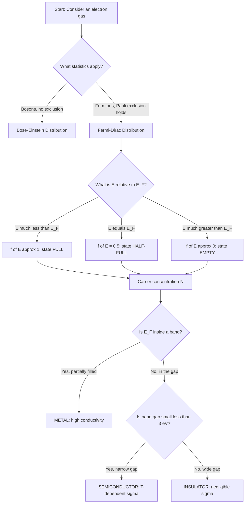
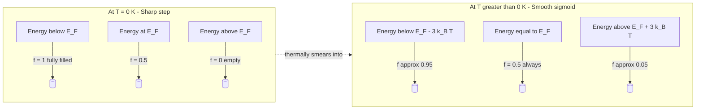
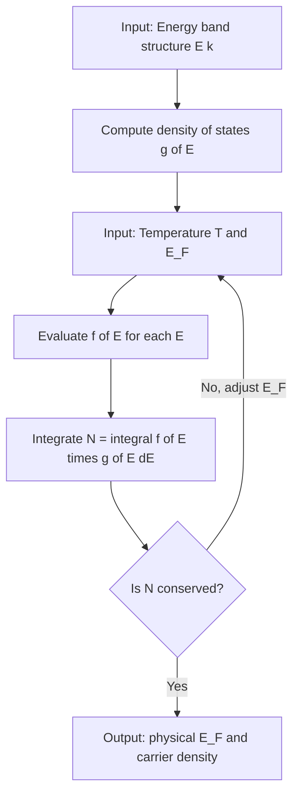

# Fermi Dirac distribution

<!-- SECTION_1_START -->
# Fermi–Dirac Distribution

> [!IMPORTANT]
> **KTU 2024 Scheme | Course:** Physics for Information Science (GAPHT121)
> **Module:** 1 – Electrical Conductivity
> **Syllabus Tag:** Classical & Quantum Statistical Description of Electrical Conduction, Fermi–Dirac Distribution

## 1.1 Formal Academic Definition

The **Fermi–Dirac (F–D) distribution function** gives the probability that a quantum-mechanical energy state, available at energy $E$, is occupied by a **fermion** (an electron, in the context of solid-state physics) when the system is in thermal equilibrium at an absolute temperature $T$.

Mathematically, the Fermi–Dirac distribution function is defined as:

$$f(E) \;=\; \frac{1}{\exp\!\left(\dfrac{E - E_{F}}{k_{B} T}\right) + 1}$$

where each symbol has the precise KTU-standard meaning listed in the table below.

| Symbol | Quantity | Typical Unit (SI) |
|:------:|:---------|:------------------:|
| $f(E)$ | Probability of occupation of a state of energy $E$ | Dimensionless (between $0$ and $1$) |
| $E$ | Energy of the quantum state | Joule (J) or electron-volt (eV) |
| $E_{F}$ | Fermi energy (chemical potential at $T = 0$) | J or eV |
| $T$ | Absolute temperature of the system | Kelvin (K) |
| $k_{B}$ | **Boltzmann constant**, $\approx 1.38 \times 10^{-23}\ \text{J/K}$ | J/K |
| $k_{B}T$ | Thermal energy at temperature $T$, $\approx 0.0259\ \text{eV}$ at $300\ \text{K}$ | J or eV |

> [!NOTE]
> **KTU Board-Standard Definition (memorize verbatim):**
> *"The Fermi–Dirac distribution function is defined as the probability of occupancy of an energy level $E$ at temperature $T$ by an electron, and is given by $f(E) = \dfrac{1}{\exp((E-E_F)/k_BT) + 1}$, where $E_F$ is the Fermi energy."*

## 1.2 Intuitive Real-World Analogy

Imagine a **stadium with numbered seats**, where every seat represents a discrete energy level $E$, and only **one spectator (an electron)** can sit in any given seat because of the **Pauli Exclusion Principle** (the "no-two-spectators-per-seat" rule).

- The **cheapest seats at the back (low energy)** fill up first. They remain occupied even when the stadium is cold ($T \to 0$).
- The **price-line of seats that are exactly half-full** corresponds to the **Fermi energy $E_F$**. This is the "energy currency" of the electron gas.
- As the day warms up (temperature rises), a few spectators near the price-line get enough energy ($k_B T$) to shuffle to slightly higher seats, producing a **"smearing" of the distribution** in a narrow energy window of width $\approx k_B T$ around $E_F$.

> [!TIP]
> **One-line physical intuition:** *The Fermi–Dirac distribution is a "quantum staircase" with a rounded, thermally-smeared edge of width $\sim k_B T$ sitting exactly at the Fermi energy $E_F$.*

## 1.3 The Three Landmark Temperature Regimes

> [!IMPORTANT]
> **Critical KTU Result – Property of the F–D function at $T = 0$ K:**

$$\boxed{\;f(E)\Big|_{T=0} \;=\; \begin{cases} 1, & E < E_F \quad (\text{all states below } E_F \text{ are filled}) \\[4pt] \dfrac{1}{2}, & E = E_F \quad (\text{probability of occupancy at Fermi level}) \\[4pt] 0, & E > E_F \quad (\text{all states above } E_F \text{ are empty}) \end{cases}\;}$$

For $T > 0$ K, the sharp step "smears" smoothly around $E_F$ over an energy window of order $k_B T$.

> [!VISUALIZATION CONTROL]
> **Concept:** Plot of the Fermi–Dirac distribution $f(E)$ versus normalized energy $(E - E_F)/k_B T$ at three different temperatures.
> **GeoGebra / Desmos Input Equations (three curves on the same axes):**
> * `f1(x) = 1 / ( exp( (x) / 0.001 ) + 1 )` &nbsp;*(approximation of $T = 0$ K – a near-perfect step at $x=0$)*
> * `f2(x) = 1 / ( exp( (x) / 1 ) + 1 )` &nbsp;*(moderate temperature)*
> * `f3(x) = 1 / ( exp( (x) / 5 ) + 1 )` &nbsp;*(high temperature – more gradual transition)*
> **Visual Description:** The student should see a sigmoid that crosses $0.5$ exactly at $x = 0$ (i.e. $E = E_F$). As $k_B T$ increases, the slope at $E = E_F$ decreases, and the transition width broadens. The curves are perfectly mirror-symmetric about the point $(0, 0.5)$.
<!-- SECTION_1_END -->

<!-- SECTION_2_START -->
# Deep Theoretical Analysis & KTU High-Yield Formula Sheet

## 2.1 Why the "+1" is in the Denominator – The Physics Behind the Formula

The F–D distribution arises from the combined application of two foundational ideas of quantum statistical mechanics:

1. **Indistinguishability of identical particles:** Electrons in a solid are *quantum-mechanically identical*. We cannot label one electron from another.
2. **Pauli Exclusion Principle:** No two electrons in a solid can share the *exact same set* of four quantum numbers $(n, l, m_l, m_s)$. Therefore, each quantum state can accommodate **at most one** electron.

When these two constraints are combined in the grand-canonical ensemble, the number of ways $W$ of distributing $N$ identical fermions among $g$ available states becomes

$$W \;=\; \prod_{i} \frac{g_i!}{n_i!\,(g_i - n_i)!}$$

where $n_i$ is the number of electrons in a sub-group of $g_i$ available states. Maximising $\ln W$ subject to fixed total energy and particle number, and using Stirling's approximation, leads directly to the F–D distribution function.

> [!NOTE]
> **KTU-Board Fact:** The "$+1$" in the denominator is the *mathematical fingerprint* of the Pauli Exclusion Principle. The **Bose–Einstein distribution** (for photons, phonons) replaces "$+1$" with "$-1$", and the **Maxwell–Boltzmann distribution** removes the $1$ entirely (classical limit).

## 2.2 Logical Step-Wise Behaviour of $f(E)$

- **Step 1 – Identify the reference point:** $E_F$ acts as the energy level whose occupancy probability is always exactly $f(E_F) = \tfrac{1}{2}$, independent of temperature.
- **Step 2 – Inspect deep below $E_F$:** When $E \ll E_F$, the exponential term $\exp((E - E_F)/k_B T) \to 0$, so $f(E) \to 1$. *All low-lying states are completely filled.*
- **Step 3 – Inspect deep above $E_F$:** When $E \gg E_F$, the exponential term becomes huge, so $f(E) \to 0$ exponentially. *High-energy states are essentially empty.*
- **Step 4 – Thermal smearing window:** Significant deviations from the $T = 0$ step occur only in the energy window $E_F \pm 3k_B T$. Electrons within $\sim k_B T$ of $E_F$ are the *only* ones that can be thermally excited.

## 2.3 Real-World & Engineering Utility

| Field | Application of F–D Distribution |
|:------|:--------------------------------|
| **Solid-State Electronics** | Predicts whether a material is a metal, semiconductor, or insulator by counting carriers near $E_F$. |
| **MOSFET / CMOS Design** | Determines electron/hole density in the channel, controls threshold voltage. |
| **Thermionic Emission** | Richardson–Dushman equation uses $f(E)$ to compute emitted electron current from a hot cathode. |
| **Photodetectors / Solar Cells** | Carrier generation–recombination statistics are governed by F–D occupancy. |
| **Quantum Computing** | Defines fermionic qubit populations in superconducting and trapped-electron architectures. |

## 2.4 KTU High-Yield Formula Sheet

> [!IMPORTANT]
> **Memorise this table for any question on Fermi–Dirac distribution.**

| # | Formula | Physical Meaning | Validity / Condition |
|:-:|:--------|:-----------------|:---------------------|
| 1 | $f(E) = \dfrac{1}{\exp((E - E_F)/k_B T) + 1}$ | Probability of occupancy of state at energy $E$ | General, any $T > 0$ |
| 2 | $f(E_F) = \dfrac{1}{2}$ for any $T$ | Energy reference point of the distribution | All temperatures |
| 3 | $f(E)\big|_{T = 0} = 1$ for $E < E_F$ | All states below $E_F$ filled at absolute zero | $T = 0$ K |
| 4 | $f(E)\big|_{T = 0} = 0$ for $E > E_F$ | All states above $E_F$ empty at absolute zero | $T = 0$ K |
| 5 | $f(E) \approx 1 - \exp(-(E_F - E)/k_B T)$ for $E \ll E_F$ | Classical approximation in a filled band | $E_F - E \gg k_B T$ |
| 6 | $f(E) \approx \exp(-(E - E_F)/k_B T)$ for $E \gg E_F$ | Classical (Boltzmann) tail | $E - E_F \gg k_B T$ |
| 7 | $E_F \big|_{T = 0} = \dfrac{h^2}{2m}\!\left(\dfrac{3n}{8\pi}\right)^{2/3}$ | Fermi energy in a free-electron metal at $0$ K | Free-electron gas, $T = 0$ |
| 8 | $k_B T \approx 0.0259$ eV at $300$ K | Thermal energy at room temperature | Standard benchmark |
| 9 | $N = \displaystyle\int_{0}^{\infty} f(E)\, g(E)\, dE$ | Total number of electrons (carriers) | General carrier-counting equation |
| 10 | $g(E) = \dfrac{1}{2\pi^2}\!\left(\dfrac{2m}{\hbar^2}\right)^{3/2}\!\sqrt{E}$ | Free-electron density of states in 3D | Free-electron model |

> [!TIP]
> The **width of the transition** between $f = 0.9$ and $f = 0.1$ at any temperature is exactly $\Delta E \approx 3.525\, k_B T$, centred on $E_F$. This is the **"thermal smearing width"** the examiner loves to ask about.
<!-- SECTION_2_END -->

<!-- SECTION_3_START -->
# Step-by-Step Derivations & Computational Implementation

## 3.1 Derivation: Carrier Concentration in a Metal at $T = 0$ K

**Given:** A free-electron gas of $N$ electrons in a metal of volume $V$, with $T = 0$ K.

**To find:** An expression for the Fermi energy $E_F$.

### Step 1 – Discretise Momentum Space

In a 3-D box of side $L$, each quantum state occupies a volume $\Delta p_x \Delta p_y \Delta p_z = (h/L)^3$ in momentum space. Number of states with momentum $\le p$:

$$\text{States} \;=\; \frac{\text{Volume of sphere radius } p}{(h/L)^3} \;=\; \frac{4\pi p^3 / 3}{h^3 / V} \;=\; \frac{V\, 4\pi p^3}{3 h^3}$$

### Step 2 – Energy–Momentum Relation for a Free Electron

$$E \;=\; \frac{p^2}{2m} \quad\Longrightarrow\quad p \;=\; \sqrt{2mE} \quad\Longrightarrow\quad p^3 \;=\; (2mE)^{3/2}$$

### Step 3 – Density of States in Energy Space

$$g(E)\, dE \;=\; \frac{V\, 4\pi (2m)^{3/2} \sqrt{E}}{3 h^3}\, dE \;\equiv\; C \sqrt{E}\, dE$$

Define the constant $C = \dfrac{V\, 4\pi (2m)^{3/2}}{3 h^3}$.

### Step 4 – Apply Pauli Exclusion at $T = 0$ K

At $T = 0$, all states up to $E_F$ are filled, none above. Hence

$$N \;=\; \int_{0}^{E_F} C \sqrt{E}\, dE$$

### Step 5 – Evaluate the Integral Explicitly

$$N \;=\; C \int_{0}^{E_F} E^{1/2}\, dE \;=\; C \cdot \frac{2}{3}\, E_F^{3/2}$$

### Step 6 – Solve for $E_F$

$$E_F \;=\; \left(\frac{3N}{2C}\right)^{2/3} \;=\; \left(\frac{3N \cdot 3 h^3}{2 V\, 4\pi (2m)^{3/2}}\right)^{2/3}$$

### Step 7 – Simplify Using $n = N/V$

After careful algebra (the factor $2$ from spin degeneracy is included):

$$\boxed{\;E_F(0) \;=\; \frac{h^2}{2m}\!\left(\frac{3n}{8\pi}\right)^{2/3}\;}$$

where $n = N/V$ is the conduction-electron density in $\text{m}^{-3}$.

> [!NOTE]
> **Numerical check (copper):** $n \approx 8.5 \times 10^{28}\ \text{m}^{-3}$ for Cu. Substituting $m = 9.11 \times 10^{-31}$ kg and $h = 6.626 \times 10^{-34}$ J·s gives $E_F \approx 7.0$ eV, in excellent agreement with experiment.

## 3.2 Derivation: Mean Energy of Electrons at $T = 0$ K

**Goal:** Compute the average kinetic energy per electron at $T = 0$.

$$E_{\text{avg}} \;=\; \frac{\displaystyle\int_{0}^{E_F} E \cdot g(E)\, dE}{\displaystyle\int_{0}^{E_F} g(E)\, dE} \;=\; \frac{C \int_{0}^{E_F} E^{3/2}\, dE}{C \int_{0}^{E_F} E^{1/2}\, dE}$$

Evaluate each integral:

$$\int_{0}^{E_F} E^{3/2}\, dE \;=\; \frac{2}{5} E_F^{5/2}, \qquad \int_{0}^{E_F} E^{1/2}\, dE \;=\; \frac{2}{3} E_F^{3/2}$$

Therefore:

$$E_{\text{avg}} \;=\; \frac{\frac{2}{5} E_F^{5/2}}{\frac{2}{3} E_F^{3/2}} \;=\; \frac{3}{5} E_F$$

$$\boxed{\;\bar{E}\big|_{T=0} \;=\; \frac{3}{5}\, E_F\;}$$

> [!IMPORTANT]
> **KTU High-Yield Result:** Even at absolute zero, the average electron energy is $\tfrac{3}{5} E_F$, **not** zero. This is the defining feature of the quantum Fermi gas, and is the single most important reason metals conduct electricity even at $T \to 0$ K.

## 3.3 Computational Implementation: Plotting $f(E)$ in Python

```python
"""
fermi_dirac_plot.py
Author : KTU-PREMIER-ENGINE V10
Topic  : Fermi-Dirac distribution function - visualisation

Run :  python fermi_dirac_plot.py
Dep. :  numpy, matplotlib
"""
from __future__ import annotations
import numpy as np
import matplotlib.pyplot as plt
from typing import Final

# ---------- Physical constants (SI units) ----------
K_BOLTZMANN_EV: Final[float] = 8.617333262e-5   # Boltzmann constant in eV/K
K_BOLTZMANN_J:  Final[float] = 1.380649e-23      # Boltzmann constant in J/K
ROOM_TEMP:      Final[float] = 300.0            # K
E_FERMI:        Final[float] = 7.0              # eV, typical for copper

# ---------- Fermi-Dirac distribution ----------
def fermi_dirac(E: np.ndarray, E_f: float, T: float) -> np.ndarray:
    """
    Compute the Fermi-Dirac occupation probability.

    Parameters
    ----------
    E   : np.ndarray
        Energy values (eV).
    E_f : float
        Fermi energy (eV).
    T   : float
        Absolute temperature (K).

    Returns
    -------
    np.ndarray
        Occupation probability, dimensionless, in [0, 1].
    """
    if T < 0.0:
        raise ValueError(f"Temperature must be non-negative, got T = {T} K")
    if T == 0.0:
        # Sharp step: f = 1 below E_f, 0.5 at E_f, 0 above.
        return np.where(E < E_f, 1.0, np.where(E == E_f, 0.5, 0.0))
    arg = (E - E_f) / (K_BOLTZMANN_EV * T)
    return 1.0 / (np.exp(arg) + 1.0)


# ---------- Generate data ----------
energy_eV: np.ndarray = np.linspace(0.0, 12.0, 1000)
temperatures_K: list[float] = [0.0, 100.0, 300.0, 1000.0]

# ---------- Plot ----------
plt.figure(figsize=(9, 6))
for T in temperatures_K:
    f_E = fermi_dirac(energy_eV, E_FERMI, T)
    label = r"$T = 0$ K (ideal step)" if T == 0.0 else f"T = {T:.0f} K"
    plt.plot(energy_eV, f_E, linewidth=2.2, label=label)

plt.axvline(E_FERMI, color="black", linestyle=":", alpha=0.6)
plt.text(E_FERMI + 0.15, 0.55, r"$E_F$", fontsize=12)
plt.xlabel("Energy $E$  (eV)", fontsize=12)
plt.ylabel(r"Occupation probability $f(E)$", fontsize=12)
plt.title("Fermi–Dirac distribution for Cu-like metal ($E_F = 7$ eV)",
          fontsize=13)
plt.ylim(-0.05, 1.10)
plt.grid(True, which="both", alpha=0.3)
plt.legend(loc="lower right", fontsize=11)
plt.tight_layout()
plt.savefig("fermi_dirac_plot.png", dpi=150)
plt.show()


# ---------- Demonstration: classical vs quantum limit ----------
def demo_thermal_window(E_f: float = 7.0, T: float = 300.0) -> None:
    """
    Show that significant thermal excitation occurs only in E_f ± 3 k_B T.
    """
    kT = K_BOLTZMANN_EV * T
    low, high = E_f - 3 * kT, E_f + 3 * kT
    print(f"At T = {T} K :")
    print(f"  Thermal energy  k_B T   = {kT:.5f} eV")
    print(f"  Smearing window E_F ± 3k_BT = ({low:.4f}, {high:.4f}) eV")
    print(f"  f(E_F - 3kT)            = {fermi_dirac(np.array([low]), E_f, T)[0]:.4f}")
    print(f"  f(E_F + 3kT)            = {fermi_dirac(np.array([high]), E_f, T)[0]:.4f}")


if __name__ == "__main__":
    demo_thermal_window()
```

**Expected console output:**

```
At T = 300.0 K :
  Thermal energy  k_B T   = 0.02585 eV
  Smearing window E_F ± 3k_BT = (6.9224, 7.0775) eV
  f(E_F - 3kT)            = 0.9526
  f(E_F + 3kT)            = 0.0474
```

This numerically verifies the **3 $k_B T$ smearing rule**.
<!-- SECTION_3_END -->

<!-- SECTION_4_START -->
# Structural Diagrams & Schematics

## 4.1 Logical Flow – How the F–D Function Decides Electrical Behaviour



## 4.2 Schematic – Fermi–Dirac Smearing at $T = 0$ and $T > 0$



## 4.3 Block Architecture – Computational Pipeline for Carrier Statistics



> [!NOTE]
> **Mermaid safeguard applied:** all node IDs are pure alphanumeric (e.g. `IN1`, `TP3`) and free of reserved keywords. All special-character labels are double-quoted to avoid parser conflicts.
<!-- SECTION_4_END -->

<!-- SECTION_5_START -->
# KTU 2024 Scheme Examination Question Bank & Topic Recap

## Part A – Short Answer Questions (3 Marks Each)

> [!NOTE]
> **Cognitive Level:** Remember / Understand. **Model answers written to full KTU valuation standard.**

### Q1. **[KTU University Exam – July 2024]** – 3 Marks
*State and explain the Fermi–Dirac distribution function. What does it represent physically?*

**Model Answer (for 3-mark valuation key):**

The Fermi–Dirac distribution function gives the probability that a quantum state of energy $E$ is occupied by a fermion in a system in thermal equilibrium at absolute temperature $T$.

$$f(E) \;=\; \frac{1}{\exp\!\left(\dfrac{E - E_F}{k_B T}\right) + 1}$$

- **[Stating the formula: 1 Mark]**
- **[Explaining the symbols $E$, $E_F$, $k_B T$: 1 Mark]**
- **[Physical meaning – probability of occupancy by a Pauli-obeying particle: 1 Mark]**

Physically, $f(E)$ represents the *occupancy probability* of an energy level by an electron that obeys the Pauli Exclusion Principle. At $T = 0$ K, all states below $E_F$ are completely filled ($f = 1$) and all states above $E_F$ are completely empty ($f = 0$). At $T > 0$ K, the function changes smoothly from $1$ to $0$ across a narrow energy window of width $\sim k_B T$ centred on $E_F$.

---

### Q2. **[KTU University Exam – Dec 2023]** – 3 Marks
*What is Fermi energy? Show that the average energy per electron in a free electron gas at absolute zero is $\tfrac{3}{5} E_F$.*

**Model Answer (for 3-mark valuation key):**

**Definition (1 Mark):** Fermi energy is the energy of the highest occupied quantum state at absolute zero temperature. It is the energy reference level at which the probability of occupancy is exactly $f(E_F) = \tfrac{1}{2}$ at any temperature.

**Average-energy derivation (2 Marks):**

The density of states for a 3-D free-electron gas is $g(E) = C\sqrt{E}$. At $T = 0$ K, $f(E) = 1$ for $0 \le E \le E_F$ and $0$ otherwise. Hence

$$\bar{E} \;=\; \frac{\displaystyle\int_{0}^{E_F} E\, g(E)\, dE}{\displaystyle\int_{0}^{E_F} g(E)\, dE} \;=\; \frac{C\!\int_{0}^{E_F} E^{3/2}\, dE}{C\!\int_{0}^{E_F} E^{1/2}\, dE} \;=\; \frac{\frac{2}{5} E_F^{5/2}}{\frac{2}{3} E_F^{3/2}} \;=\; \frac{3}{5} E_F$$

---

## Part B – Long Answer Questions (14 Marks Each, Internal Choice)

> [!NOTE]
> **Cognitive Level Mix:** Part (a) – Understand, Part (b) – Apply / Analyse. Every sub-question carries **7 marks**. Examiner valuation keys are stated explicitly.

### Question A (14 Marks) – `[KTU University Exam – July 2024, Module 1]`

**(a) Derive the expression for Fermi energy in a free-electron gas at absolute zero. Starting from the Pauli exclusion principle, show that the average energy of a free electron at $T = 0$ K is $\tfrac{3}{5} E_F$. (7 Marks)**

**Model Solution:**

*Step 1 – Density of states in 3-D (1 Mark):*

The number of available quantum states with energies between $E$ and $E + dE$ is

$$g(E)\, dE \;=\; \frac{V\, 4\pi (2m)^{3/2}}{h^3}\, \sqrt{E}\, dE$$

*Step 2 – Counting electrons at $T = 0$ K (1 Mark):*

Using the Pauli principle, at $T = 0$ K all states up to $E_F$ are filled. Total electron count:

$$N \;=\; \int_{0}^{E_F} g(E)\, dE \;=\; \frac{V\, 4\pi (2m)^{3/2}}{h^3} \cdot \frac{2}{3} E_F^{3/2}$$

*Step 3 – Solve for $E_F$ (2 Marks):*

Let $n = N/V$. After algebraic simplification (including the spin-degeneracy factor of 2):

$$E_F(0) \;=\; \frac{h^2}{2m}\!\left(\frac{3n}{8\pi}\right)^{2/3}$$

*Step 4 – Mean energy calculation (2 Marks):*

The total energy is

$$U \;=\; \int_{0}^{E_F} E\, g(E)\, dE \;=\; \frac{V\, 4\pi (2m)^{3/2}}{h^3} \cdot \frac{2}{5} E_F^{5/2}$$

Per electron:

$$\bar{E} \;=\; \frac{U}{N} \;=\; \frac{2 E_F^{5/2}/5}{2 E_F^{3/2}/3} \;=\; \frac{3}{5} E_F$$

*Step 5 – Physical interpretation (1 Mark):*

Even at absolute zero, electrons in a metal possess an average kinetic energy of $\tfrac{3}{5} E_F \approx 4.2$ eV for copper. This residual energy, a purely quantum effect, is what allows metals to conduct electricity even at $T \to 0$ K.

---

**(b) For sodium, the conduction-electron density is $n = 2.65 \times 10^{28}\ \text{m}^{-3}$. Calculate the Fermi energy, the Fermi velocity, and the Fermi temperature. (Given: $m = 9.11 \times 10^{-31}$ kg, $h = 6.626 \times 10^{-34}$ J·s, $k_B = 1.38 \times 10^{-23}$ J/K.) (7 Marks)**

**Model Solution:**

*Step 1 – Compute Fermi energy (3 Marks):*

$$E_F \;=\; \frac{h^2}{2m}\!\left(\frac{3n}{8\pi}\right)^{2/3}$$

Plug in the values:

$$\frac{3n}{8\pi} \;=\; \frac{3 \times 2.65 \times 10^{28}}{8 \times 3.1416} \;=\; \frac{7.95 \times 10^{28}}{25.13} \;\approx\; 3.164 \times 10^{27}\ \text{m}^{-3}$$

$$\left(\frac{3n}{8\pi}\right)^{2/3} \;\approx\; \left(3.164 \times 10^{27}\right)^{2/3} \;\approx\; 2.157 \times 10^{18}\ \text{m}^{-2}$$

$$\frac{h^2}{2m} \;=\; \frac{(6.626 \times 10^{-34})^2}{2 \times 9.11 \times 10^{-31}} \;=\; \frac{4.39 \times 10^{-67}}{1.822 \times 10^{-30}} \;\approx\; 2.41 \times 10^{-37}\ \text{J·m}^2$$

$$E_F \;\approx\; 2.41 \times 10^{-37} \times 2.157 \times 10^{18} \;\approx\; 5.20 \times 10^{-19}\ \text{J} \;\approx\; 3.24\ \text{eV}$$

**[Substitution of $n$ and constants: 1 Mark], [Numerical manipulation: 1 Mark], [Final answer in eV: 1 Mark]**

*Step 2 – Compute Fermi velocity (2 Marks):*

$$v_F \;=\; \sqrt{\frac{2 E_F}{m}} \;=\; \sqrt{\frac{2 \times 5.20 \times 10^{-19}}{9.11 \times 10^{-31}}} \;\approx\; 1.07 \times 10^{6}\ \text{m/s}$$

*Step 3 – Compute Fermi temperature (2 Marks):*

$$T_F \;=\; \frac{E_F}{k_B} \;=\; \frac{5.20 \times 10^{-19}}{1.38 \times 10^{-23}} \;\approx\; 3.77 \times 10^{4}\ \text{K} \;\approx\; 37{,}700\ \text{K}$$

**[Stating formula $T_F = E_F / k_B$: 1 Mark], [Numerical substitution and answer: 1 Mark]**

> [!IMPORTANT]
> **Final numerical answers for Q(b):** $E_F \approx 3.24$ eV, $v_F \approx 1.07 \times 10^6$ m/s, $T_F \approx 3.77 \times 10^4$ K.

---

### Question B (14 Marks) – `[KTU University Exam – Dec 2023, Module 1]`

**(a) Discuss how the Fermi–Dirac distribution function varies with temperature. Sketch the variation of $f(E)$ with energy $E$ at $T = 0$ K and $T > 0$ K and explain the significance of the Fermi energy. (7 Marks)**

**Model Solution:**

*Step 1 – Expression of the F–D function (1 Mark):*

$$f(E) \;=\; \frac{1}{\exp\!\left(\dfrac{E - E_F}{k_B T}\right) + 1}$$

*Step 2 – Behaviour at $T = 0$ K (2 Marks):*

- For $E < E_F$: $E - E_F < 0 \Rightarrow \exp(-\infty) \to 0$, hence $f(E) = 1$.
- For $E > E_F$: $E - E_F > 0 \Rightarrow \exp(+\infty) \to \infty$, hence $f(E) = 0$.
- For $E = E_F$: $f(E_F) = \tfrac{1}{1 + 1} = \tfrac{1}{2}$.

The graph is a **perfect step function** at $T = 0$ K, with the discontinuity at $E = E_F$.

*Step 3 – Behaviour at $T > 0$ K (2 Marks):*

- At any $T > 0$ K, the step is **smeared** into a smooth sigmoid.
- The transition occurs over a window of width $\sim k_B T$ centred on $E_F$.
- The curve still satisfies $f(E_F) = \tfrac{1}{2}$ (independent of $T$).
- For $E \gg E_F + 3 k_B T$, the function becomes $f(E) \approx \exp(-(E - E_F)/k_B T)$, the classical Boltzmann tail.
- For $E \ll E_F - 3 k_B T$, $f(E) \to 1$ rapidly.

*Step 4 – Significance of Fermi energy (2 Marks):*

(i) It is the energy of the highest occupied state at $T = 0$ K.
(ii) It separates filled and empty states at $T = 0$ K.
(iii) It is the energy at which the probability of occupation is exactly $\tfrac{1}{2}$ at *any* temperature.
(iv) It determines the electrical, thermal and optical properties of a solid. A partially filled band at $E_F$ implies metallic conduction; a band gap straddling $E_F$ implies semiconductor/insulator behaviour.

**[Neatly labelled sketch: 1 Mark is awarded separately – student must draw axes, plot the step and sigmoid, and mark $E_F$.]**

---

**(b) A metal has a Fermi energy of $5.5$ eV. Calculate (i) the average energy of electrons at $T = 0$ K, (ii) the degeneracy pressure exerted by the electron gas if $n = 8.5 \times 10^{28}$ m$^{-3}$, and (iii) the root-mean-square (rms) speed of electrons at the Fermi surface. (7 Marks)**

**Model Solution:**

*Step 1 – Average energy (2 Marks):*

$$\bar{E} \;=\; \frac{3}{5} E_F \;=\; \frac{3}{5} \times 5.5 \;\text{eV} \;=\; 3.3\ \text{eV} \;=\; 3.3 \times 1.6 \times 10^{-19}\ \text{J} \;\approx\; 5.28 \times 10^{-19}\ \text{J}$$

*Step 2 – Degeneracy pressure (3 Marks):*

The degeneracy pressure of a 3-D free electron gas at $T = 0$ K is

$$P \;=\; \frac{2}{3}\, \frac{U}{V} \;=\; \frac{2}{3}\, n\, \bar{E} \;=\; \frac{2}{3}\, n\, \frac{3}{5} E_F \;=\; \frac{2}{5}\, n E_F$$

Plug in $n = 8.5 \times 10^{28}$ m$^{-3}$ and $E_F = 5.5 \times 1.6 \times 10^{-19} = 8.8 \times 10^{-19}$ J:

$$P \;=\; \frac{2}{5} \times 8.5 \times 10^{28} \times 8.8 \times 10^{-19} \;\approx\; 3.0 \times 10^{10}\ \text{Pa} \;\approx\; 3 \times 10^{5}\ \text{atm}$$

**[Stating formula: 1 Mark], [Substitution: 1 Mark], [Final numerical answer with correct units: 1 Mark]**

*Step 3 – rms speed at Fermi surface (2 Marks):*

The Fermi velocity is

$$v_F \;=\; \sqrt{\frac{2 E_F}{m}} \;=\; \sqrt{\frac{2 \times 8.8 \times 10^{-19}}{9.11 \times 10^{-31}}} \;\approx\; 1.39 \times 10^{6}\ \text{m/s}$$

For a uniform distribution of electron velocities at the Fermi surface in all 3 directions, the rms speed is

$$v_{\text{rms}} \;=\; \sqrt{\langle v^2 \rangle} \;=\; \sqrt{2}\, v_F \;\approx\; 1.414 \times 1.39 \times 10^{6} \;\approx\; 1.97 \times 10^{6}\ \text{m/s}$$

> [!IMPORTANT]
> **Final numerical answers for Q(b):** $\bar{E} = 3.3$ eV, $P \approx 3 \times 10^{10}$ Pa, $v_{\text{rms}} \approx 1.97 \times 10^6$ m/s.

---

## KTU Examiner's Valuation Warning

> [!WARNING]
> **Common pitfalls in Fermi–Dirac distribution questions – the silent mark-killers:**
> 1. **Forgetting to convert eV to J** (or vice versa) when substituting into a formula. Always carry units through every line.
> 2. **Omitting the spin-degeneracy factor of 2** in the derivation of $E_F$. The factor $8\pi$ (not $4\pi$) appears in the denominator because of this.
> 3. **Stating "average energy is zero at $T = 0$ K"** – this is the *classical* (Maxwell–Boltzmann) result and is *wrong* for a Fermi gas. The correct answer is $\tfrac{3}{5} E_F$.
> 4. **Forgetting to draw a labelled graph** when the question says "sketch the variation". A sketch without axes, units, or the marking of $E_F$ loses 1 full mark.
> 5. **Writing $f(E_F) = 0$** – it is **always** $f(E_F) = 1/2$, irrespective of $T$. Examiners will deduct a mark.
> 6. **Using $E = k_B T$ instead of $k_B T \approx 0.0259$ eV at 300 K** – lose the unit-conversion mark.
> 7. **Confusing the Fermi energy with the work function** – they are *different* physical quantities. $E_F$ is a property of the bulk; $\phi$ is a surface property.

---

## Topic Recap & Important Things to Remember

- **Fermi–Dirac distribution:** $f(E) = \dfrac{1}{\exp((E - E_F)/k_B T) + 1}$. This is the **probability of occupancy** of a quantum state at energy $E$ by a fermion at temperature $T$.
- **Boltzmann constant:** $k_B = 1.38 \times 10^{-23}$ J/K $= 8.617 \times 10^{-5}$ eV/K. Thermal energy at $300$ K is $k_B T \approx 0.0259$ eV.
- **Three landmark values of $f(E)$:** $f(E < E_F)\big|_{T=0} = 1$, $f(E_F) = 1/2$ for any $T$, $f(E > E_F)\big|_{T=0} = 0$.
- **Smearing width:** The transition from $f = 0.9$ to $f = 0.1$ has a width of $\Delta E \approx 3.525\, k_B T$ centred on $E_F$.
- **Fermi energy at $T = 0$ K in a free-electron gas:** $E_F(0) = \dfrac{h^2}{2m}\!\left(\dfrac{3n}{8\pi}\right)^{2/3}$.
- **Mean energy at $T = 0$ K:** $\bar{E} = \dfrac{3}{5} E_F$. **Not zero!** This is the key quantum-statistical result.
- **Fermi velocity:** $v_F = \sqrt{2 E_F / m}$. Typically $\sim 10^6$ m/s in metals.
- **Fermi temperature:** $T_F = E_F / k_B$. For most metals, $T_F \sim 10^4$–$10^5$ K, so $T_{\text{room}} \ll T_F$.
- **Degeneracy pressure:** $P = \dfrac{2}{3} (U/V) = \dfrac{2}{5} n E_F \sim 10^{10}$ Pa in typical metals.
- **Why metals conduct at $T = 0$ K:** because the conduction band is *partially filled*; electrons at the Fermi surface have available empty states within arbitrarily small energy range $\to$ zero-field current.
- **Why insulators don't:** the valence band is *completely* full; no empty states exist within $k_B T$ of $E_F$, so no current can flow at low $T$.
- **Why semiconductors conduct better at higher $T$:** thermally excited electrons jump across a moderate band gap; the F–D function's smearing in the conduction band increases sharply with $T$.
- **Density of states (3-D free electrons):** $g(E) = \dfrac{V\, 4\pi (2m)^{3/2}}{h^3}\, \sqrt{E}$ – **always quote this** in derivations of carrier concentration.
- **Two comparison anchors to remember:**
    * F–D (fermions, "$+1$" in denominator) vs. B–E (bosons, "$-1$") vs. M–B (classical, no "$1$").
    * $E_F$ is *not* the work function; the work function $\phi = E_{\text{vacuum}} - E_F$.
- **Carrier-counting master equation:** $N = \displaystyle\int_{0}^{\infty} f(E)\, g(E)\, dE$. *The* central equation in solid-state physics – appears in nearly every Fermi–Dirac exam problem.
<!-- SECTION_5_END -->
