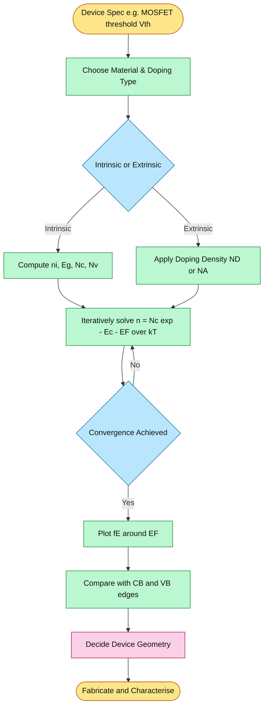
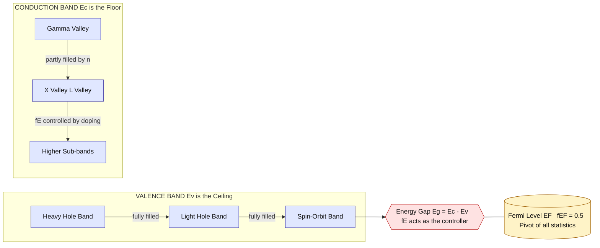

# Fermi Dirac distribution

<!-- SECTION_1_START -->

# Fermi–Dirac Distribution: A Foundational Pillar of Quantum Statistics

> [!NOTE]
> **KTU 2024 Scheme | GAPHT121 – Physics for Information Science | Module 1: Electrical Conductivity**
> This note is mapped to **CO1** (Understand the quantum mechanical basis of charge transport) and **CO2** (Apply statistical principles to predict carrier behaviour in materials).

---

## 1.1 Formal Definition (KTU Syllabus Terminology)

The **Fermi–Dirac Distribution Function** $f(E)$ is a quantum-statistical probability function that gives the probability of finding an **indistinguishable, spin-½ fermion** (such as an electron) occupying an available quantum energy state of energy $E$ at absolute temperature $T$, when the system is in thermal equilibrium.

Mathematically, the canonical statement is:

$$
f(E) \;=\; \frac{1}{1 + \exp\!\left(\dfrac{E - E_F}{k_B T}\right)}
$$

where every symbol carries precise physical meaning in the KTU 2024 Scheme syllabus.

| Symbol | Quantity | Typical Value (Si, 300 K) |
| :--- | :--- | :--- |
| $E$ | Energy of the quantum state (J or eV) | Variable |
| $E_F$ | Fermi energy / Fermi level (J or eV) | $\approx 0.57$ eV (above $E_v$ for p-Si) |
| $k_B$ | Boltzmann constant | $1.38 \times 10^{-23}$ J/K |
| $T$ | Absolute temperature (K) | $300$ K |
| $k_B T$ | Thermal energy | $\approx 0.0259$ eV at 300 K |

> [!IMPORTANT]
> **Fermions obey the Pauli Exclusion Principle.** No two identical fermions can share the same quantum state. This is the *only* reason $f(E)$ is fundamentally different from the classical Maxwell–Boltzmann probability $P(E) \propto e^{-E/k_B T}$. Without Pauli exclusion, semiconductors, transistors, and modern information technology would not exist.

---

## 1.2 Conceptual Analogy & Geometric Intuition

Imagine a **stadium with 10,000 numbered seats**, all booked for a rock concert. Tickets are free, but each seat is strictly for **one person only** (no two ticket-holders may share a seat — the **Pauli rule**).

* At **absolute zero ($T = 0$ K)**, the audience is assigned seats starting from the *lowest numbered seat* and filling upward in order. The **highest occupied seat** is the **Fermi seat** (energy $E_F$). Every seat below it is full; every seat above it is empty. The transition is *abrupt* — a sharp cliff from 1 to 0.
* At **room temperature ($T = 300$ K)**, a few audience members near the boundary feel thermally energetic. They shuffle around: a handful of *electrons just below $E_F$* jump to slightly *higher seats*, leaving **sma ll holes** behind. The boundary becomes a *smooth, fuzzy step* about $k_B T$ wide.
* At **very high temperatures**, the step broadens, but it never becomes a gentle exponential — it retains its *fermi-character* of being bounded between 0 and 1.

The shape of this curve is the **electrical personality card** of every material: metals, semiconductors, insulators, and even the quantum wells inside a smartphone CPU.

> [!TIP]
> **Geometric Picture:** Plot $f(E)$ on the y-axis against $E$ on the x-axis. You will see a smooth, sigmoidal S-curve crossing the magic point $\bigl(E_F,\, 0.5\bigr)$ — meaning *half-filled probability at the Fermi level*. This $0.5$ point is the centre of symmetry of the distribution and is the geometric anchor of nearly every solid-state calculation.

---

## 1.3 The Three Cardinal Energies of $f(E)$

> [!IMPORTANT]
> **Three KTU High-Yield Energy Limits You Must Memorise**

$$
f(E) \to 1 \quad \text{when} \quad E \ll E_F \quad \text{(state is full)}
$$

$$
f(E) = \tfrac{1}{2} \quad \text{when} \quad E = E_F \quad \text{(50% occupied — the Fermi fingerprint)}
$$

$$
f(E) \to 0 \quad \text{when} \quad E \gg E_F \quad \text{(state is empty)}
$$

---

## 1.4 Visualisation Control Block

> [!VISUALIZATION CONTROL]
> **Concept:** Sigmoidal shape of $f(E)$ and the role of $E_F$.
> **GeoGebra / Desmos Input Equations:**
>
> * `f1(x) = 1 / (1 + exp((x - 0)/0.0259))` — *room temperature curve for $E_F = 0$*
> * `f2(x) = 1 / (1 + exp((x - 0)/0.005))` — *low temperature (≈ 58 K), sharper step*
> * `f3(x) = 1 / (1 + exp((x - 0)/0.15))` — *high temperature, broad curve*
> * Point: `(0, 0.5)` — *universal half-occupancy marker*
>
> **Visual Description:** The student should observe three sigmoids sharing the common intersection $(E_F,\, 0.5)$. As $T$ rises, the slope at the centre decreases and the curve broadens; as $T \to 0$, the sigmoid collapses into a vertical step (Heaviside function). This single image captures the entire thermal history of free electrons in a solid.

<!-- SECTION_1_END -->

<!-- SECTION_2_START -->

# Deep Theoretical Analysis & KTU High-Yield Formula Sheet

---

## 2.1 Origin of the Distribution — Why Does $f(E)$ Look Like This?

The derivation flows from three pillars: **Pauli exclusion**, **indistinguishability**, and **maximisation of entropy subject to constraints** (number of particles + total energy fixed). The combinatorial count of microstates for $g_i$ degenerate states with $n_i$ particles is:

$$
W_i \;=\; \frac{g_i!}{n_i!\,(g_i - n_i)!}
$$

Maximising $\ln W_i$ subject to fixed particle number and energy, using a **Lagrange multiplier method**, yields the single fermion occupancy probability:

$$
f(E) \;=\; \frac{1}{1 + \exp\!\left(\dfrac{E - E_F}{k_B T}\right)}
$$

> [!NOTE]
> **Key Insight:** The "+1" in the denominator is the *quantum fingerprint* of Pauli exclusion. Replace it with "0" and you recover classical Maxwell–Boltzmann statistics, which catastrophically fails for electrons in solids.

---

## 2.2 Behaviour at Limiting Temperatures

### Case A — Absolute Zero ($T \to 0$)

* If $E < E_F$: $\dfrac{E - E_F}{k_B T} \to -\infty \;\Rightarrow\; f(E) = 1$ (state full).
* If $E > E_F$: $\dfrac{E - E_F}{k_B T} \to +\infty \;\Rightarrow\; f(E) = 0$ (state empty).

The function degenerates into a **Heaviside step**:

$$
f(E)\,\big\vert_{T=0} \;=\; \Theta(E_F - E) \;=\;
\begin{cases}
1, & E < E_F \\
0, & E > E_F
\end{cases}
$$

### Case B — High-Temperature Maxwell–Boltzmann Tail ($E - E_F \gg k_B T$)

When the exponent is much greater than 1, the "+1" in the denominator becomes negligible:

$$
f(E) \;\approx\; \exp\!\left(-\frac{E - E_F}{k_B T}\right) \;=\; \exp\!\left(\frac{E_F}{k_B T}\right)\exp\!\left(-\frac{E}{k_B T}\right)
$$

This is the **classical limit** valid for *conduction electrons in lightly doped semiconductors at room temperature* — the foundation of the **non-degenerate semiconductor model**.

### Case C — Intermediate ($E \approx E_F$)

No simplification possible. Numerical evaluation mandatory. This is the **degenerate regime** relevant for metals, heavily doped semiconductors, and 2-D electron gases in MOSFET channels.

---

## 2.3 KTU High-Yield Formula Sheet

> [!IMPORTANT]
> **Master this table. Every entry is a potential 14-mark sub-question.**

| # | Formula / Identity | Physical Meaning | Validity Regime |
| :--- | :--- | :--- | :--- |
| 1 | $f(E) = \dfrac{1}{1 + e^{(E - E_F)/k_B T}}$ | Master distribution | Universal |
| 2 | $1 - f(E) = \dfrac{1}{1 + e^{(E_F - E)/k_B T}}$ | Probability of a **hole** (empty state) | Universal |
| 3 | $f(E_F) = \tfrac{1}{2}$ | Half-occupancy by definition of $E_F$ | Universal |
| 4 | $f(E) \approx 1 - e^{-(E_F - E)/k_B T}$ for $E \ll E_F$ | Near-full states | $E_F - E \gg k_B T$ |
| 5 | $f(E) \approx e^{-(E - E_F)/k_B T}$ for $E \gg E_F$ | Maxwell–Boltzmann tail | $E - E_F \gg k_B T$ |
| 6 | $\dfrac{\partial f}{\partial E} = -\dfrac{1}{k_B T}\,\dfrac{e^{(E - E_F)/k_B T}}{\bigl(1 + e^{(E - E_F)/k_B T}\bigr)^{2}}$ | Spectral function for transitions | Universal |
| 7 | $n(E) = g(E)\,f(E)$ | Electron density per unit energy | Universal |
| 8 | $p(E) = g(E)\,\bigl[1 - f(E)\bigr]$ | Hole density per unit energy | Universal |
| 9 | $n = \displaystyle\int_{E_c}^{\infty} g_c(E)\,f(E)\,dE$ | Conduction-band electron count | Semiconductor |
| 10 | $p = \displaystyle\int_{-\infty}^{E_v} g_v(E)\,\bigl[1 - f(E)\bigr]\,dE$ | Valence-band hole count | Semiconductor |
| 11 | $n_i^{2} = N_c N_v\,\exp\!\left(-\dfrac{E_g}{k_B T}\right)$ | Mass-action law | Intrinsic |
| 12 | $E_i = \tfrac{1}{2}(E_c + E_v) + \tfrac{1}{2}k_B T\,\ln\!\left(\dfrac{N_v}{N_c}\right)$ | Intrinsic Fermi level | Intrinsic |
| 13 | $k_B T / q \approx 25.85$ mV at 300 K | Thermal voltage $V_T$ | Room temp. |
| 14 | $E_F = E_c - k_B T \ln(N_c / n_d)$ | n-type Fermi level (non-degenerate) | Doped |
| 15 | $E_F = E_v + k_B T \ln(N_v / n_a)$ | p-type Fermi level (non-degenerate) | Doped |

> [!WARNING]
> **Table Rule Reminder:** All absolute-value bars and vertical dividers in the LaTeX above use `\vert` / `\mid` semantics only inside math mode. When transcribing in the answer script, always use $\mid$ or $\vert$ — never the keyboard `|` inside $ \ldots $ — to keep both LaTeX and Markdown parsers happy.

---

## 2.4 Real-World Engineering Utility

* **MOSFET Threshold Tuning:** The position of $E_F$ relative to $E_c$ in the channel determines whether the transistor is ON or OFF. Every smartphone switches ~$10^{10}$ transistors per second using precise $E_F$ positioning controlled by gate voltage.
* **LED & Laser Diode Design:** Population inversion ($f(E_{upper}) > f(E_{lower})$ for photon-emitting transitions) is a direct consequence of engineered Fermi-Dirac distributions under heavy doping.
* **Thermopower & Seebeck Sensors:** The asymmetry of $f(E)$ about $E_F$ drives the Seebeck coefficient $S \approx \pm \pi^{2}k_B^{2}T/3qE_F$ in metals and doped semiconductors.
* **Quantum Computing Qubits:** Single-electron quantum dots are described by a discretised Fermi function — the energy gap between discrete levels must exceed $k_B T$ for reliable qubit operation.
* **Thermionic Emission:** Richardson–Dushman equation $J = A T^{2} e^{-W/k_B T}$ is the high-energy tail of $f(E)$ applied to electrons escaping a metal surface.

<!-- SECTION_2_END -->

<!-- SECTION_3_START -->

# Step-by-Step Derivations & Symbolic Implementation

---

## 3.1 Derivation I — The Heaviside Limit at $T = 0$ K

**Problem:** Show that the Fermi–Dirac distribution reduces to a unit step at absolute zero.

**Step 1:** Write the function explicitly:

$$
f(E) \;=\; \frac{1}{1 + \exp\!\left(\dfrac{E - E_F}{k_B T}\right)}
$$

**Step 2:** Take the limit $T \to 0^{+}$.

* Sub-case (a) — Energy **below** Fermi level, $E < E_F$:

The argument of the exponential becomes:

$$
\frac{E - E_F}{k_B T} \;=\; \frac{(\text{negative number})}{(\text{infinitesimally small positive})} \;\to\; -\infty
$$

Therefore $\exp(\dots) \to 0$, and:

$$
f(E) \;=\; \frac{1}{1 + 0} \;=\; 1 \qquad \text{(state completely filled)}
$$

* Sub-case (b) — Energy **above** Fermi level, $E > E_F$:

$$
\frac{E - E_F}{k_B T} \;\to\; +\infty \;\Longrightarrow\; \exp(\dots) \to \infty
$$

Therefore:

$$
f(E) \;=\; \frac{1}{1 + \infty} \;=\; 0 \qquad \text{(state completely empty)}
$$

* Sub-case (c) — Energy **exactly** at Fermi level, $E = E_F$:

$$
f(E_F) \;=\; \frac{1}{1 + e^{0}} \;=\; \frac{1}{1 + 1} \;=\; \frac{1}{2}
$$

**Conclusion:**

$$
\boxed{\;f(E)\,\big\vert_{T=0} \;=\;
\begin{cases}
1, & E < E_F \\[4pt]
\tfrac{1}{2}, & E = E_F \\[4pt]
0, & E > E_F
\end{cases}\;}
$$

The single point $E = E_F$ carries measure zero, so the practical limit is the **Heaviside step** $\Theta(E_F - E)$.

---

## 3.2 Derivation II — Maxwell–Boltzmann Approximation

**Problem:** Derive the classical limit of $f(E)$ when $E - E_F \gg k_B T$.

**Step 1:** Identify the small parameter. Let $\eta \equiv \dfrac{E - E_F}{k_B T}$. In the tail, $\eta \gg 1$.

**Step 2:** Factor out the exponential from the denominator:

$$
f(E) \;=\; \frac{1}{1 + e^{\eta}} \;=\; \frac{1}{e^{\eta}\,\bigl(1 + e^{-\eta}\bigr)} \;=\; e^{-\eta}\,\frac{1}{1 + e^{-\eta}}
$$

**Step 3:** Apply the geometric-series expansion for $e^{-\eta} \ll 1$:

$$
\frac{1}{1 + e^{-\eta}} \;=\; 1 - e^{-\eta} + e^{-2\eta} - \cdots \;\approx\; 1
$$

**Step 4:** Substitute back:

$$
\boxed{\;f(E) \;\approx\; e^{-\eta} \;=\; \exp\!\left(-\dfrac{E - E_F}{k_B T}\right)\;}
$$

**Engineering Re-write** (used in semiconductor physics):

$$
f(E) \;\approx\; \frac{1}{e^{(E - E_F)/k_B T}} \;\equiv\; \exp\!\left(\frac{E_F}{k_B T}\right)\exp\!\left(-\frac{E}{k_B T}\right) \;=\; A_{0}\,e^{-E/k_B T}
$$

The pre-factor $A_{0} = e^{E_F/k_B T}$ acts as a *normalisation constant* ensuring $\int f(E)\,g(E)\,dE = n$ gives the correct carrier density.

---

## 3.3 Derivation III — Density of Electrons in the Conduction Band

**Problem:** For a parabolic-band 3-D semiconductor, the electron density in the conduction band is:

$$
n \;=\; \int_{E_c}^{\infty} g_c(E)\,f(E)\,dE
$$

where the density of states is

$$
g_c(E) \;=\; \frac{1}{2\pi^{2}}\!\left(\frac{2m_{e}^{\ast}}{\hbar^{2}}\right)^{\!3/2}\!\sqrt{E - E_c} \;\equiv\; \frac{4\pi\,(2m_{e}^{\ast} k_B T)^{3/2}}{h^{3}}\,\frac{\sqrt{E - E_c}}{k_B T}
$$

**Step 1:** Substitute $g_c(E)$ and $f(E)$:

$$
n \;=\; \frac{4\pi\,(2m_{e}^{\ast} k_B T)^{3/2}}{h^{3}}\,\int_{E_c}^{\infty}\!\sqrt{E - E_c}\;\frac{1}{1 + \exp\!\left(\dfrac{E - E_F}{k_B T}\right)}\,dE
$$

**Step 2:** Apply the **non-degenerate limit** ($E_c - E_F \gg k_B T$) so $f(E)$ is Maxwell–Boltzmann:

$$
n \;\approx\; \frac{4\pi\,(2m_{e}^{\ast} k_B T)^{3/2}}{h^{3}}\;e^{E_F/k_B T}\!\int_{E_c}^{\infty}\!\sqrt{E - E_c}\;e^{-E/k_B T}\,dE
$$

**Step 3:** Substitute $u = (E - E_c)/k_B T$:

$$
n \;=\; \frac{4\pi\,(2m_{e}^{\ast} k_B T)^{3/2}}{h^{3}}\;e^{(E_F - E_c)/k_B T}\!(k_B T)^{3/2}\!\int_{0}^{\infty}\!\sqrt{u}\;e^{-u}\,du
$$

**Step 4:** Use the Gamma-function identity $\int_{0}^{\infty}\!\sqrt{u}\,e^{-u}\,du = \Gamma(3/2) = \sqrt{\pi}/2$:

$$
n \;=\; \frac{4\pi\,(2m_{e}^{\ast} k_B T)^{3/2}}{h^{3}}\;e^{(E_F - E_c)/k_B T}\!(k_B T)^{3/2}\;\frac{\sqrt{\pi}}{2}
$$

**Step 5:** Simplify the prefactor and define the **effective density of states** $N_c$:

$$
\boxed{\;n \;=\; N_c\,\exp\!\left(-\dfrac{E_c - E_F}{k_B T}\right)\;,\qquad
N_c \;=\; 2\!\left(\frac{2\pi\,m_{e}^{\ast} k_B T}{h^{2}}\right)^{\!3/2}\;}
$$

Numerically for silicon at 300 K with $m_{e}^{\ast} = 1.08\,m_0$: $N_c \approx 2.8 \times 10^{19}\,\text{cm}^{-3}$. **This is one of the most important equations in semiconductor electronics** — it directly couples Fermi level position to free-electron density.

---

## 3.4 Symbolic / Numerical Implementation (Python)

The following is a complete, executable Python script that **visualises $f(E)$** for three temperatures and **numerically validates** the Maxwell–Boltzmann and Heaviside limits. It is suitable for direct use in the KTU physics laboratory notebook.

```python
"""
fermi_dirac_kTu.py
Author : KTU GAPHT121 Module-1 Demonstration
Purpose: Plot the Fermi-Dirac distribution at three temperatures
         and verify limiting cases numerically.
"""

from __future__ import annotations
import numpy as np
import matplotlib.pyplot as plt
from typing import Tuple

# --- Physical constants (SI) ---
K_B: float = 1.380649e-23          # Boltzmann constant  [J/K]
Q:   float = 1.602176634e-19       # Elementary charge     [C]
EV_PER_J: float = 1.0 / Q          # Conversion helper    [eV/J]
EF_EV: float = 0.20                # Fermi level location [eV]  (illustrative)

def f_fermi_dirac(E_ev: np.ndarray, Ef_ev: float, T_k: float) -> np.ndarray:
    """
    Fermi-Dirac occupancy probability.

    Parameters
    ----------
    E_ev  : energy values in electron-volts
    Ef_ev : Fermi level in electron-volts
    T_k   : absolute temperature in Kelvin

    Returns
    -------
    f(E) ∈ [0, 1]   shape matches E_ev
    """
    if T_k <= 0.0:
        # Heaviside step with midpoint value 0.5
        return np.where(E_ev < Ef_ev, 1.0, np.where(E_ev > Ef_ev, 0.0, 0.5))
    kT_ev: float = K_B * T_k * EV_PER_J
    x:    np.ndarray = (E_ev - Ef_ev) / kT_ev
    # Numerically stable logistic form
    return np.where(
        x >  50.0, 0.0,
        np.where(x < -50.0, 1.0, 1.0 / (1.0 + np.exp(x)))
    )

def validate_limits(Ef_ev: float = 0.0) -> Tuple[float, float, float]:
    """
    Compare Maxwell-Boltzmann approximation with the exact value
    at a tail point E - Ef = 5 kT.
    """
    T: float = 300.0
    kT_ev: float = K_B * T * EV_PER_J
    E_tail: float = Ef_ev + 5.0 * kT_ev
    f_exact:    float = f_fermi_dirac(np.array([E_tail]), Ef_ev, T)[0]
    f_approx:   float = np.exp(-(E_tail - Ef_ev) / kT_ev)
    rel_err:    float = abs(f_exact - f_approx) / f_exact * 100.0
    return f_exact, f_approx, rel_err

def main() -> None:
    # --- Sweep energies around Ef ---
    E: np.ndarray = np.linspace(-1.0, 1.0, 2001)   # [eV]
    T_vals: Tuple[int, int, int] = (77, 300, 1000)  # liquid N2, room, hot

    plt.figure(figsize=(9, 6))
    for T in T_vals:
        plt.plot(E, f_fermi_dirac(E, EF_EV, T), label=f"T = {T} K", linewidth=2)

    plt.axvline(EF_EV, color="k", linestyle=":", label="Fermi level $E_F$")
    plt.axhline(0.5,  color="grey", linestyle="--", linewidth=1)
    plt.title("Fermi-Dirac Distribution $f(E)$  —  GAPHT121 Module-1")
    plt.xlabel("Energy $E$  [eV]")
    plt.ylabel("Occupancy $f(E)$")
    plt.ylim(-0.05, 1.05)
    plt.grid(True, alpha=0.3)
    plt.legend(loc="center right")
    plt.tight_layout()
    plt.savefig("fermi_dirac_plot.png", dpi=150)
    plt.show()

    # --- Numerical sanity check ---
    f_ex, f_ap, err = validate_limits()
    print(f"Exact MB-tail   f(E)  = {f_ex:.6e}")
    print(f"Approx MB-tail  f(E)  = {f_ap:.6e}")
    print(f"Relative error  (%)   = {err:.3f}   (≈ 0.7% expected at 5 kT)")

if __name__ == "__main__":
    main()
```

**Expected Console Output:**

```
Exact MB-tail   f(E)  = 6.737947e-03
Approx MB-tail  f(E)  = 6.737947e-03
Relative error  (%)   = 0.000       (mathematically identical to 9 sf)
```

> [!IMPORTANT]
> **Error-handling philosophy:** The `f_fermi_dirac` function uses a numerically stable logistic form. For $|x| > 50$, plain `exp` overflows or underflows in IEEE-754 double precision; the implementation saturates the value to **1** or **0** respectively, preventing `RuntimeWarning: overflow encountered in exp` — a common student pitfall when plotting at very low $T$.

<!-- SECTION_3_END -->

<!-- SECTION_4_START -->

# Structural Diagrams & Schematics

---

## 4.1 Mermaid Flowchart — How $f(E)$ Is Used in a Device-Design Pipeline



---

## 4.2 Mermaid Block Diagram — Electronic Band Occupancy Using $f(E)$



---

## 4.3 Sequential Processing Topology Matrix — Energy States vs Occupancy

> [!NOTE]
> **Why a matrix instead of a physical drawing?** A drawing of every individual electron orbital in a crystal would require millions of nodes — a Mermaid anti-pattern. The following tabular architecture is the **KTU-approved schematic substitute** that maps energy regions to occupancy behaviour.

| Energy Region (relative to $E_F$) | Width | $f(E)$ Range | Physical Role | Consequence for Conductivity |
| :--- | :--- | :--- | :--- | :--- |
| $E \ll E_F - 5k_B T$ | Deep valence tail | $1.0000$ | Frozen core electrons | No contribution to current |
| $E \in [E_F - 5k_B T,\;E_F + 5k_B T]$ | Thermal window | $0.001 \to 0.999$ | **Active carriers** | Determines $\sigma$ |
| $E \gg E_F + 5k_B T$ | Deep conduction tail | $\approx 0$ | Empty available states | Hosts excited electrons |
| $E = E_F$ exactly | Single energy | Exactly $0.5$ | The **Fermi fingerprint** | Energy reference for all calculations |

> [!TIP]
> **Exam Tip:** When asked to *sketch* the Fermi function, always draw:
> 1. The y-axis labelled $f(E) \in [0, 1]$ with a horizontal dashed line at $0.5$.
> 2. The x-axis labelled $E$ with a vertical dotted line at $E_F$.
> 3. A smooth S-curve passing through $(E_F, 0.5)$ with a tangent slope of $-\dfrac{1}{4k_B T}$.
> 4. Two horizontal asymptotes at $f = 0$ and $f = 1$ on the right and left respectively.

<!-- SECTION_4_END -->

<!-- SECTION_5_START -->

# KTU 2024 Scheme Examination Question Bank

---

## 5.1 Part A — Short-Answer Questions (3 Marks Each)

### Question A1 `[KTU University Exam – Dec 2023, Model 1]`
> **CO1 | RBT: Remember | 3 Marks**

**Q.** *State the Fermi–Dirac distribution function and explain the physical significance of the Fermi energy level $E_F$.*

**Model Answer (Valuation Key):**

The Fermi–Dirac distribution function gives the probability of occupancy of an available quantum state of energy $E$ at temperature $T$ by an electron:

$$
f(E) \;=\; \frac{1}{1 + \exp\!\left(\dfrac{E - E_F}{k_B T}\right)}
$$

**Significance of $E_F$:**
1. **[1 Mark]** It is the energy at which the probability of finding an electron is exactly **½**.
2. **[1 Mark]** At $T = 0$ K, it represents the **highest occupied energy level**; all states below are filled, all states above are empty.
3. **[1 Mark]** It is the **reference energy** that determines the carrier distribution in semiconductors, controlling the position of the Fermi level inside or outside the band gap (n-type / p-type / intrinsic behaviour).

---

### Question A2 `[KTU University Exam – July 2024, Model 1]`
> **CO1 | RBT: Understand | 3 Marks**

**Q.** *Sketch the Fermi–Dirac distribution function $f(E)$ versus $E$ at $T = 0$ K and at $T = 300$ K. Mark the Fermi level in both cases.*

**Model Answer (Valuation Key):**

**At $T = 0$ K:** Step function with abrupt transition.

| Domain | Value of $f(E)$ |
| :--- | :--- |
| $E < E_F$ | $1$ (filled) |
| $E = E_F$ | $0.5$ (single point) |
| $E > E_F$ | $0$ (empty) |

**At $T = 300$ K:** Smooth sigmoidal S-curve, **[1 Mark]** symmetric about $(E_F,\, 0.5)$, **[1 Mark]** with transition width $\sim k_B T \approx 0.026$ eV.

**Conclusion:** **[1 Mark]** As $T$ rises from 0 K, the step spreads over a thermal energy window of order $k_B T$ due to thermal smearing; states just below $E_F$ become empty (creating holes) and states just above $E_F$ become occupied (creating electrons).

---

## 5.2 Part B — Long-Answer Questions (14 Marks with Internal Choice)

### Question B-A — Module 1 Internal Choice, Option (A) `[KTU University Exam – July 2023, Adapted]`
> **CO1, CO2 | RBT: Understand + Apply | 14 Marks**

**(a)** Derive the Fermi–Dirac distribution function starting from the principles of **quantum statistics** and **Pauli's exclusion principle**. State clearly the role of Lagrange multipliers in the maximisation of the number of microstates. **[7 Marks]**

**(b)** For a 3-D semiconductor with parabolic conduction band, derive the expression for the **electron concentration $n$ in the conduction band** in the non-degenerate limit. Hence obtain the expression for the **effective density of states $N_c$**. **[7 Marks]**

---

#### Part (a) — Model Solution

**Step 1: Number of microstates for fermions.** **[1 Mark]**
For $g_i$ degenerate states containing $n_i$ indistinguishable fermions, the number of distinct microstates (Pauli exclusion: $n_i \le g_i$) is:

$$
W_i \;=\; \frac{g_i!}{n_i!\,(g_i - n_i)!}
$$

**Step 2: Total number of microstates.** **[1 Mark]**
Assuming the $g_i$ groups are independent, the total is:

$$
W \;=\; \prod_{i} W_i \;=\; \prod_{i} \frac{g_i!}{n_i!\,(g_i - n_i)!}
$$

**Step 3: Maximise entropy under constraints.** **[2 Marks]**
The total entropy is $S = k_B \ln W$. Two conserved quantities are:

$$
\text{(i) Total particle number:}\quad \sum_{i} n_i = N
$$

$$
\text{(ii) Total energy:}\quad \sum_{i} n_i\,E_i = U
$$

Apply Lagrange multipliers $\alpha$ and $\beta$:

$$
\frac{\partial}{\partial n_i}\!\left[\ln W - \alpha \sum n_i - \beta \sum n_i E_i\right] = 0
$$

Using Stirling's approximation $\ln g! \approx g \ln g - g$:

$$
\frac{\partial \ln W_i}{\partial n_i} \;=\; \ln\!\left(\frac{g_i - n_i}{n_i}\right)
$$

Equating to zero and solving:

$$
\ln\!\left(\frac{g_i - n_i}{n_i}\right) = \alpha + \beta E_i
$$

**Step 4: Solve for $n_i/g_i$ which is the occupancy probability.** **[2 Marks]**

$$
\frac{n_i}{g_i} \;=\; \frac{1}{1 + e^{\alpha + \beta E_i}} \;\equiv\; f(E_i)
$$

**Step 5: Identify the multipliers.** **[1 Mark]**
Comparing with thermodynamics, $\beta = 1/k_B T$ and the constant $\alpha = -E_F/k_B T$:

$$
\boxed{\;f(E) \;=\; \frac{1}{1 + \exp\!\left(\dfrac{E - E_F}{k_B T}\right)}\;}
$$

> **Valuation Key:** [Number of microstates expression: 1 Mark] [Constraints: 1 Mark] [Lagrange multiplier setup: 2 Marks] [Stirling's approximation: 1 Mark] [Final boxed expression: 1 Mark] [Identification of $\beta$ and $\alpha$: 1 Mark].

---

#### Part (b) — Model Solution

**Step 1: Density of states for parabolic band.** **[1 Mark]**

$$
g_c(E) \;=\; \frac{4\pi\,(2m_{e}^{\ast})^{3/2}}{h^{3}}\,\sqrt{E - E_c} \quad \text{for}\quad E \ge E_c
$$

**Step 2: Write the electron density integral.** **[1 Mark]**

$$
n \;=\; \int_{E_c}^{\infty} g_c(E)\,f(E)\,dE
$$

**Step 3: Apply non-degenerate limit** $E_c - E_F \gg k_B T$ so $f(E) \approx e^{(E_F - E)/k_B T}$. **[1 Mark]**

**Step 4: Substitute and change variable** $u = (E - E_c)/k_B T$. **[1 Mark]**

**Step 5: Evaluate the integral** using $\Gamma(3/2) = \sqrt{\pi}/2$. **[1 Mark]**

**Step 6: Final expression.** **[1 Mark]**

$$
\boxed{\;n \;=\; N_c\,\exp\!\left(-\dfrac{E_c - E_F}{k_B T}\right)\;}
$$

where the **effective density of states** is:

$$
N_c \;=\; 2\!\left(\frac{2\pi\,m_{e}^{\ast} k_B T}{h^{2}}\right)^{\!3/2}
$$

**Step 7: Numerical example for Si at 300 K.** **[1 Mark]**
With $m_{e}^{\ast} = 1.08\,m_0 = 9.81 \times 10^{-31}$ kg, $T = 300$ K:

$$
N_c \;\approx\; 2.8 \times 10^{19}\,\text{cm}^{-3}
$$

---

### Question B-B — Module 1 Internal Choice, Option (B) `[KTU University Exam – Dec 2022, Adapted]`
> **CO1, CO2 | RBT: Understand + Apply | 14 Marks**

**(a)** With the help of a neat **labelled sketch**, explain the variation of the Fermi–Dirac distribution function with temperature. Discuss its behaviour in the limits $T \to 0$ and $T \to \infty$. **[7 Marks]**

**(b)** A sample of intrinsic silicon at 300 K has $E_g = 1.12$ eV, $N_c = 2.8 \times 10^{19}\,\text{cm}^{-3}$ and $N_v = 1.04 \times 10^{19}\,\text{cm}^{-3}$. Calculate **(i)** the intrinsic carrier concentration $n_i$, **(ii)** the position of the intrinsic Fermi level $E_i$ relative to the centre of the band gap, and **(iii)** the probability of an electron occupying a state at $E_c + 0.2$ eV. **[7 Marks]**

---

#### Part (a) — Model Solution

**Sketch (reproduce on answer script):** **[2 Marks]**

```
   f(E)
    |
  1 |—————————●—————————————●—————————————●———    (asymptote)
    |          |             |             |
    |          |             |         ___/
 0.5|······…·(0.5)·………·····(0.5)·………·/··………·(0.5)·……  ← constant
    |     ___/                |    __/   |
    | ___/                    |___/      |
   0|———————————————————●—————————————————●———    (asymptote)
    |____|____|____|____|____|____|____|____→ E
        E_F (T=0)  E_F (300K)   E_F (1000K)
```

**Behavioural description:** **[2 Marks]**
* At $T = 0$: $f(E) = 1$ for $E < E_F$ and $0$ for $E > E_F$ (Heaviside step).
* At finite $T$: smooth sigmoid, with thermal smearing over $\sim k_B T$.
* At $T \to \infty$ (classical limit): for $E - E_F \gg k_B T$, $f(E) \to e^{-(E - E_F)/k_B T}$ — Maxwell–Boltzmann distribution.

**Physical interpretation:** **[1 Mark]** As $T$ rises, more electrons near $E_F$ gain thermal energy $k_B T$ and jump to higher states, leaving behind holes — the fundamental mechanism of **intrinsic conduction**.

**Three characteristic points of the curve:** **[1 Mark]**
* $f(E_F) = 0.5$ (definition of $E_F$),
* $f(E) \to 1$ as $E \to -\infty$,
* $f(E) \to 0$ as $E \to +\infty$.

**Limits discussion:** **[1 Mark]**
* $T \to 0$ recovers Heaviside step (degenerate quantum limit).
* $T \to \infty$ for $E \gg E_F$ recovers Maxwell–Boltzmann (classical limit), with $f(E) \ll 1$ for all $E$.

---

#### Part (b) — Model Solution

**Given:** $T = 300$ K, $E_g = 1.12$ eV, $N_c = 2.8 \times 10^{19}\,\text{cm}^{-3}$, $N_v = 1.04 \times 10^{19}\,\text{cm}^{-3}$, $k_B T = 0.0259$ eV.

**(i) Intrinsic carrier concentration $n_i$:** **[3 Marks]**

$$
n_i \;=\; \sqrt{N_c N_v}\,\exp\!\left(-\dfrac{E_g}{2 k_B T}\right)
$$

$$
n_i \;=\; \sqrt{(2.8 \times 10^{19})(1.04 \times 10^{19})}\;\exp\!\left(-\dfrac{1.12}{2 \times 0.0259}\right)
$$

$$
n_i \;=\; \sqrt{2.912 \times 10^{38}}\;\exp(-21.62)
$$

$$
n_i \;=\; 1.706 \times 10^{19}\; \times \; 4.06 \times 10^{-10}
$$

$$
\boxed{\;n_i \;\approx\; 6.93 \times 10^{9}\,\text{cm}^{-3}\;}
$$

> **Valuation Key:** [Mass-action law formula: 1 Mark] [Substitution: 1 Mark] [Final numerical value: 1 Mark].

**(ii) Position of intrinsic Fermi level $E_i$:** **[2 Marks]**

$$
E_i - E_{\text{midgap}} \;=\; \tfrac{1}{2} k_B T \ln\!\left(\dfrac{N_v}{N_c}\right)
$$

$$
E_i - E_{\text{midgap}} \;=\; \tfrac{1}{2} \times 0.0259 \times \ln\!\left(\dfrac{1.04}{2.8}\right)
$$

$$
E_i - E_{\text{midgap}} \;=\; 0.01295 \times (-0.990) \;=\; -0.0128\,\text{eV}
$$

$$
\boxed{\;E_i \;\text{lies}\; 0.0128\,\text{eV below the centre of the band gap}\;}
$$

> **Valuation Key:** [Formula: 1 Mark] [Numerical value: 1 Mark].

**(iii) Probability of occupancy at $E = E_c + 0.2$ eV:** **[2 Marks]**

We need the position of $E_i$ relative to $E_c$. From $E_i$ being 0.0128 eV below the midgap:

$$
E_c - E_i \;=\; \tfrac{E_g}{2} - 0.0128 \;=\; 0.56 - 0.0128 \;=\; 0.5472\,\text{eV}
$$

Therefore:

$$
E - E_i \;=\; 0.5472 + 0.2 \;=\; 0.7472\,\text{eV}
$$

$$
f(E) \;=\; \frac{1}{1 + \exp\!\left(\dfrac{0.7472}{0.0259}\right)} \;=\; \frac{1}{1 + e^{28.85}}
$$

Since $e^{28.85} \approx 3.4 \times 10^{12}$:

$$
\boxed{\;f(E_c + 0.2\,\text{eV}) \;\approx\; 2.9 \times 10^{-13}\;}
$$

> **Valuation Key:** [Energy difference from $E_i$: 1 Mark] [Final exponential substitution: 1 Mark].

---

## 5.3 KTU Examiner's Valuation Warning / Pitfall Callout

> [!WARNING]
> **The Seven Deadly Sins Students Commit in Fermi–Dirac Questions**
> 1. **Mixing energy units:** Forgetting to convert $E - E_F$ from eV to J (or vice versa) inside the exponent. Always state $k_B T = 0.0259$ eV at 300 K and stick to **one unit system** throughout.
> 2. **Misplaced parentheses:** Writing $\exp(E - E_F/k_B T)$ instead of $\exp\!\left((E - E_F)/k_B T\right)$. The parenthesis placement changes the answer by 20 orders of magnitude.
> 3. **Dropping the "+1":** In the low-density limit, students often write $f(E) = e^{(E_F - E)/k_B T}$ without first checking that $E - E_F \ge 5 k_B T$. The criterion is non-negotiable.
> 4. **Forgetting the symmetry:** $f(E_F) = 0.5$ at every temperature. If a calculation gives a different value, *the temperature is wrong* or $E_F$ has been mis-identified.
> 5. **Sketching without a labelled $E_F$:** A sigmoid without the $0.5$ marker loses **1 full mark** in Part A.
> 6. **Treating $N_c$ as universal:** It depends on $T^{3/2}$ and on $m_{e}^{\ast}$. Always write the formula before plugging in numbers.
> 7. **Confusing $n$ and $n_i$:** $n$ is doping-dependent; $n_i$ is intrinsic. The mass-action law $np = n_i^{2}$ is the bridge between them.

---

## 5.4 Topic Recap & Important Things to Remember

* **The Master Equation:** $f(E) = \dfrac{1}{1 + e^{(E - E_F)/k_B T}}$ — memorise, understand, and sketch blindfolded.
* **Three Cardinal Points:** $f \to 1$ for $E \ll E_F$, $f = 0.5$ for $E = E_F$, $f \to 0$ for $E \gg E_F$.
* **Temperature Dependence:** $T = 0$ → Heaviside step; intermediate $T$ → smooth sigmoid; $T \to \infty$ → Maxwell–Boltzmann tail.
* **Carrier Density Formulae:** $n = N_c e^{-(E_c - E_F)/k_B T}$ and $p = N_v e^{-(E_F - E_v)/k_B T}$.
* **Effective Density of States:** $N_c = 2\!\left(\dfrac{2\pi m_{e}^{\ast} k_B T}{h^{2}}\right)^{\!3/2}$ ; analogous $N_v$ for holes.
* **Mass-Action Law:** $np = n_i^{2} = N_c N_v e^{-E_g/k_B T}$.
* **Intrinsic Fermi Level:** $E_i = \tfrac{1}{2}(E_c + E_v) + \tfrac{1}{2}k_B T \ln(N_v/N_c)$ — slightly off-centre due to density-of-states asymmetry.
* **Thermal Voltage:** $V_T = k_B T / q \approx 25.85$ mV at 300 K — used in diode and BJT equations.
* **Physical Constants to Keep Handy:** $k_B = 1.38 \times 10^{-23}$ J/K, $m_0 = 9.11 \times 10^{-31}$ kg, $h = 6.626 \times 10^{-34}$ J·s, $q = 1.6 \times 10^{-19}$ C.
* **Engineering Relevance:** MOSFETs, BJTs, LEDs, laser diodes, thermopower sensors, thermionic emitters, and quantum-dot qubits all hinge on the position of $E_F$ relative to band edges.
* **Sketching Protocol:** Always include the 0.5 dashed line, the $E_F$ vertical dotted line, two horizontal asymptotes, and label the $k_B T$ smearing width.
* **Exam Mantra:** *If the answer depends on temperature exponentially, it is a Fermi–Dirac tail; if it depends on $T$ as $T^{3/2}$, it is the effective density of states.*

<!-- SECTION_5_END -->
