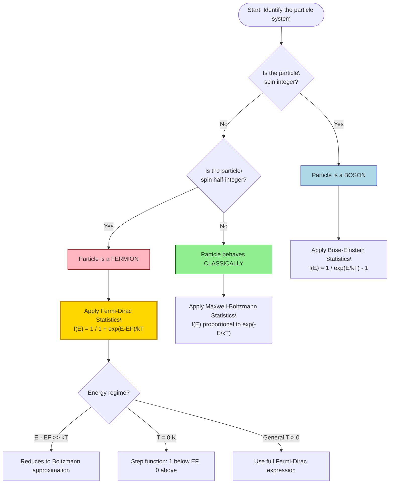
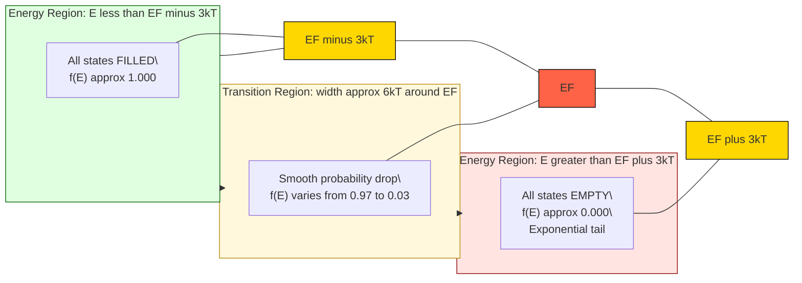
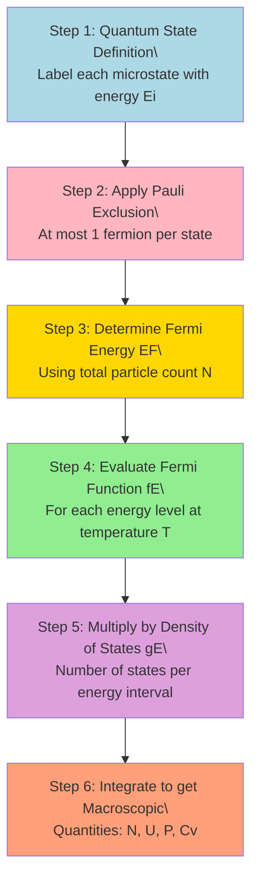
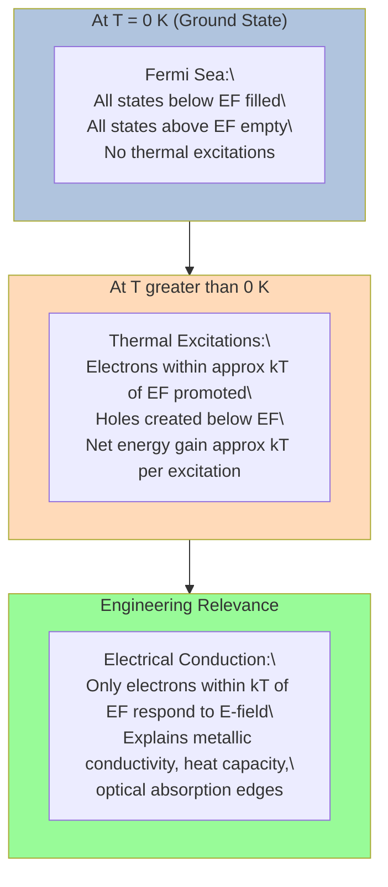

# Fermi energy and Fermi-Dirac statistics

<!-- SECTION_1_START -->
# Fermi Energy and Fermi-Dirac Statistics

## 1.1 Formal Academic Definition

> [!NOTE]
> **Fermi Energy ($E_F$)**: The Fermi energy of a quantum mechanical system of identical fermions is the energy difference between the highest and lowest occupied single-particle states at absolute zero temperature ($T = 0$ K). Equivalently, it is the thermodynamic work required to add one particle to the system at constant volume and entropy.

**Fermi-Dirac Statistics** is the branch of quantum statistical mechanics that describes the statistical distribution of identical, indistinguishable fermions (half-integer spin particles such as electrons) over a system of quantum energy states, subject to the **Pauli Exclusion Principle** — which dictates that no two identical fermions can simultaneously occupy the same quantum state.

The probability that a quantum state of energy $E$ is occupied at temperature $T$ is governed by the **Fermi-Dirac Distribution Function**:

$$
f(E) = \frac{1}{1 + \exp\!\left(\dfrac{E - E_F}{k_B T}\right)}
$$

where:
- $f(E)$ is the occupation probability (dimensionless, between $0$ and $1$)
- $E$ is the energy of the quantum state (in Joules or eV)
- $E_F$ is the Fermi energy (same units as $E$)
- $k_B = 1.380 \times 10^{-23}$ J/K is the **Boltzmann constant**
- $T$ is the absolute temperature (in Kelvin)

## 1.2 Intuitive Overview & Real-World Analogy

> [!IMPORTANT]
> **Conceptual Picture**: Imagine a multi-storey building (energy levels) with thousands of rooms (quantum states) and a crowd of people (electrons). Each room holds exactly one person (Pauli's rule). People fill up from the ground floor. The "Fermi energy" is the height of the highest occupied floor when everyone is at the lowest possible energy configuration (0 K). As the building heats up (temperature rises), some energetic people jump to higher floors, creating a "fuzz" of occupancy around the original top floor.

**Real-World Analogy — The Stadium Seat Problem**: Picture a stadium with numbered seats. Each ticket (electron) is unique. At the start, fans sit in the lowest-numbered seats. The "Fermi level" is the number stamped on the last occupied seat when the stadium is exactly full to capacity. If you could somehow add one more electron, you would have to add it at an empty seat — the cost of that "extra ticket" is the Fermi energy. Temperature is like audience excitement: a few fans stand up and move to better seats near the top, leaving a few empty seats at the boundary.

> [!VISUALIZATION CONTROL]
> **Concept:** Fermi-Dirac Distribution Curve Evolution with Temperature
> **Desmos Input Equations (plot for $E_F = 5$ eV):**
> * `f_T0(x) = 1/(1 + exp((x-5)/0.0001))`  (Step-like curve at 0 K)
> * `f_T1(x) = 1/(1 + exp((x-5)/0.2585))`  (Smoothed at $T = 300$ K, using $k_B T \approx 0.0259$ eV)
> * `f_T2(x) = 1/(1 + exp((x-5)/0.862))`  (Heated case at $T = 1000$ K)
> **Visual Description:** Observe that at 0 K, the curve is a perfect step (filled below $E_F$, empty above). As $T$ increases, a "smearing" or thermal blurring region of width $\sim k_B T$ develops symmetrically around $E_F$, where the probability transitions from 1 to 0.

## 1.3 Statistical Mechanics Context

Three principal distribution laws govern particles in thermal equilibrium:

| Statistics | Applicable Particle | Spin | Example | Distribution Function |
|---|---|---|---|---|
| Maxwell-Boltzmann | Distinguishable classical particles | Any | Gas molecules in a balloon | $\propto \exp(-E/k_B T)$ |
| Bose-Einstein | Indistinguishable bosons | Integer (0, 1, 2, …) | Photons, Helium-4 | $\frac{1}{\exp(E/k_B T) - 1}$ |
| Fermi-Dirac | Indistinguishable fermions | Half-integer ($\frac{1}{2}, \frac{3}{2}, \ldots$) | Electrons, neutrons, protons | $\frac{1}{1 + \exp((E - E_F)/k_B T)}$ |

> [!NOTE]
> **Syllabus Highlight (Module 1 – Electrical Conductivity)**: For an Information Science student, Fermi-Dirac statistics is the cornerstone of understanding **semiconductor band theory**, **p-n junction behaviour**, **MOSFET operation**, and **quantum computing qubits** — all of which directly underpin modern computing hardware.
<!-- SECTION_1_END -->

<!-- SECTION_2_START -->
# Deep Theoretical Analysis & KTU High-Yield Formula Sheet

## 2.1 The Three Statistical Frameworks (Origin of the Distribution)

For a system of $N$ identical particles distributed among energy levels $E_i$ with degeneracy $g_i$:

- **Maxwell-Boltzmann** (classical, distinguishable): $N_i = g_i \exp(-\alpha - \beta E_i)$
- **Bose-Einstein** (bosons, no exclusion): $N_i = \frac{g_i}{\exp(\alpha + \beta E_i) - 1}$
- **Fermi-Dirac** (fermions, exclusion enforced): $N_i = \frac{g_i}{\exp(\alpha + \beta E_i) + 1}$

Here, $\alpha = -\mu / (k_B T)$ and $\beta = 1 / (k_B T)$, where $\mu$ is the chemical potential. The "+1" in the denominator of Fermi-Dirac statistics is the **mathematical fingerprint of the Pauli Exclusion Principle**.

## 2.2 Key Behaviour of the Fermi Function $f(E)$

Anchored limits (used heavily in board exam derivations):

- At $T = 0$ K:
  - $f(E) = 1$ for $E < E_F$ (every state below $E_F$ is **fully occupied**)
  - $f(E) = 0$ for $E > E_F$ (every state above $E_F$ is **empty**)
  - $f(E_F) = \frac{1}{2}$ by convention (statistically defined)
- At any $T > 0$ K:
  - $f(E_F) = \frac{1}{2}$ **always** (by definition of the Fermi energy)
  - $f(E) = 0.9$ when $E - E_F \approx -2.20 \, k_B T$
  - $f(E) = 0.1$ when $E - E_F \approx +2.20 \, k_B T$
  - The transition region of width $\sim \pm 3 k_B T$ contains essentially all the thermal excitation.

## 2.3 Density of States in a 3D Free-Electron Gas

The number of available quantum states per unit energy per unit volume is:

$$
g(E) = \frac{1}{2\pi^2}\left(\frac{2m}{\hbar^2}\right)^{3/2} \sqrt{E}
$$

where $m$ is the electron mass and $\hbar = 1.0546 \times 10^{-34}$ J·s.

## 2.4 KTU Formula Sheet (Cheat Sheet)

> [!IMPORTANT]
> The table below compiles every high-yield formula necessary for solving Module 1 problems on Fermi energy and Fermi-Dirac statistics. Memorize the boxed constants.

| \# | Quantity | Formula | Units | Physical Meaning |
|---|---|---|---|---|
| 1 | Fermi-Dirac Distribution | $f(E) = \frac{1}{1 + \exp\!\left(\frac{E - E_F}{k_B T}\right)}$ | dimensionless | Occupation probability |
| 2 | Fermi Energy (3D free e$^-$ gas) | $E_F = \frac{\hbar^2}{2m}\left(3\pi^2 n\right)^{2/3}$ | Joules (J) | Top filled level at 0 K |
| 3 | Fermi Velocity | $v_F = \sqrt{\dfrac{2E_F}{m}}$ | m/s | Speed of electrons at $E_F$ |
| 4 | Fermi Wave Vector | $k_F = (3\pi^2 n)^{1/3}$ | m$^{-1}$ | Highest occupied $k$ at 0 K |
| 5 | Fermi Temperature | $T_F = E_F / k_B$ | K | Temperature scale of degeneracy |
| 6 | Density of States (3D) | $g(E) = \frac{1}{2\pi^2}\!\left(\frac{2m}{\hbar^2}\right)^{3/2}\!\sqrt{E}$ | J$^{-1}$m$^{-3}$ | States per unit energy per volume |
| 7 | Mean Energy per Electron at 0 K | $\langle E \rangle_0 = \tfrac{3}{5} E_F$ | J | Average kinetic energy at 0 K |
| 8 | Total Energy of N electrons at 0 K | $U_0 = \tfrac{3}{5} N E_F$ | J | Ground-state energy of electron gas |
| 9 | Mean Energy at finite $T$ | $\langle E \rangle = \tfrac{3}{5} E_F \!\left[1 + \tfrac{5\pi^2}{12}\!\left(\tfrac{k_B T}{E_F}\right)^2\right]$ | J | Sommerfeld expansion |
| 10 | Pressure of Fermi Gas | $P = \tfrac{2}{3} \cdot \frac{U}{V} = \tfrac{2}{5} n E_F$ | Pa | Degeneracy pressure |
| 11 | Classical Limit (Boltzmann) | $f(E) \approx \exp(-(E - E_F)/k_B T)$ | dimensionless | When $E - E_F \gg k_B T$ |
| 12 | Boltzmann constant | $k_B = 1.380 \times 10^{-23}$ J/K | — | Universal constant |
| 13 | Reduced Planck constant | $\hbar = 1.0546 \times 10^{-34}$ J·s | — | Quantum scale |
| 14 | Electron mass | $m = 9.109 \times 10^{-31}$ kg | kg | Free electron rest mass |
| 15 | Conversion | $1 \text{ eV} = 1.602 \times 10^{-19}$ J | — | Energy unit conversion |

## 2.5 Real-World Engineering Utility

- **Semiconductor Physics**: In doped silicon, the Fermi level shifts toward the conduction band (n-type) or valence band (p-type). The position of $E_F$ inside the band gap dictates the carrier concentration through the Fermi-Dirac function integrated against the density of states.
- **Integrated Circuit Design**: MOSFET threshold voltage is set by the difference between the gate work function and the silicon Fermi level — a direct engineering knob controlled by doping.
- **Quantum Computing**: A single electron trapped in a quantum dot is described by a discrete Fermi level; the Pauli exclusion principle (encoded in Fermi-Dirac) underpins qubit initialization and readout.
- **Metallurgical Materials**: The free-electron Fermi energy of copper is $E_F \approx 7.0$ eV, explaining why metals are excellent conductors and why the classical Drude model fails without quantum statistics.
- **Astrophysics**: White dwarf stars and neutron stars are supported against gravitational collapse by **Fermi degeneracy pressure** — the same physics as Formula \#10 above.

> [!NOTE]
> **Engineering Insight**: In any real solid-state device operating near room temperature ($T = 300$ K, $k_B T \approx 0.0259$ eV), $k_B T$ is *much smaller* than $E_F$ for metals. This is why, for the vast majority of electrons, the Pauli exclusion principle dominates over thermal excitation — the very reason metals conduct electricity at all.
<!-- SECTION_2_END -->

<!-- SECTION_3_START -->
# Step-by-Step Derivations & Symbolic Implementation

## 3.1 Derivation: Fermi Energy of a 3D Free-Electron Gas at 0 K

**Goal**: Derive $E_F$ in terms of electron concentration $n$.

**Step 1 — Quantize the electron states in a box of side $L$.**
For an electron confined in a cube of volume $V = L^3$, the allowed wave vectors are:

$$
k_x = \frac{2\pi n_x}{L}, \quad k_y = \frac{2\pi n_y}{L}, \quad k_z = \frac{2\pi n_z}{L}
$$

where $n_x, n_y, n_z$ are positive integers (one full set per quantum state).

**Step 2 — Compute the volume in $k$-space per state.**
Each state occupies a cube of side $\frac{2\pi}{L}$ in $k$-space, giving a $k$-space volume per state of:

$$
\Delta V_k = \left(\frac{2\pi}{L}\right)^3 = \frac{(2\pi)^3}{V}
$$

**Step 3 — Count the states inside a sphere of radius $k_F$.**
At $T = 0$ K, all states with $k \le k_F$ are filled. The volume of a sphere of radius $k_F$ is $\tfrac{4}{3}\pi k_F^3$. Including the factor of $2$ for spin (spin-up, spin-down), the total number of states is:

$$
N = 2 \cdot \frac{\tfrac{4}{3}\pi k_F^3}{(2\pi)^3 / V} = \frac{V k_F^3}{3\pi^2}
$$

**Step 4 — Solve for $k_F$ in terms of the electron density $n = N/V$.**

$$
n = \frac{N}{V} = \frac{k_F^3}{3\pi^2} \quad \Longrightarrow \quad k_F = (3\pi^2 n)^{1/3}
$$

**Step 5 — Convert $k_F$ to the Fermi energy using $E = \hbar^2 k^2 / (2m)$.**

$$
E_F = \frac{\hbar^2 k_F^2}{2m} = \frac{\hbar^2}{2m}\left(3\pi^2 n\right)^{2/3}
$$

This is the **final expression** for the Fermi energy.

## 3.2 Derivation: Mean Energy of a Fermi Gas at 0 K

**Step 1 — Set up the total energy integral.**
The number of electrons with energy between $E$ and $E + dE$ is:

$$
dN = g(E) \, f(E) \, dE
$$

At $T = 0$ K, $f(E) = 1$ for $E \le E_F$ and $0$ otherwise, so:

$$
U_0 = \int_0^{E_F} E \, g(E) \, dE
$$

**Step 2 — Substitute the density of states.**

$$
U_0 = \int_0^{E_F} E \cdot \frac{1}{2\pi^2}\left(\frac{2m}{\hbar^2}\right)^{3/2}\!\sqrt{E} \, dE = C \int_0^{E_F} E^{3/2} \, dE
$$

where $C = \frac{1}{2\pi^2}\left(\frac{2m}{\hbar^2}\right)^{3/2}$.

**Step 3 — Evaluate the integral.**

$$
\int_0^{E_F} E^{3/2} \, dE = \left[\frac{2}{5} E^{5/2}\right]_0^{E_F} = \frac{2}{5} E_F^{5/2}
$$

Therefore:

$$
U_0 = \frac{2C}{5} E_F^{5/2}
$$

**Step 4 — Express $C$ in terms of $N$ and $E_F$ using $N = \int_0^{E_F} g(E) dE$.**

$$
N = C \int_0^{E_F} E^{1/2} dE = C \cdot \frac{2}{3} E_F^{3/2} \quad \Longrightarrow \quad C = \frac{3N}{2 E_F^{3/2}}
$$

**Step 5 — Substitute $C$ back into $U_0$.**

$$
U_0 = \frac{2}{5} \cdot \frac{3N}{2 E_F^{3/2}} \cdot E_F^{5/2} = \frac{3}{5} N E_F
$$

Hence the **mean energy per electron at 0 K** is:

$$
\langle E \rangle_0 = \frac{U_0}{N} = \frac{3}{5} E_F
$$

## 3.3 Numerical Worked Example — Fermi Energy of Copper

**Given**: Copper has a free-electron concentration $n = 8.5 \times 10^{28}$ electrons/m$^3$.

**Find**: $E_F$, $v_F$, $T_F$, and $\langle E \rangle_0$.

**Constants**: $\hbar = 1.0546 \times 10^{-34}$ J·s, $m = 9.109 \times 10^{-31}$ kg, $k_B = 1.380 \times 10^{-23}$ J/K, $1$ eV $= 1.602 \times 10^{-19}$ J.

**Step 1 — Compute $E_F$ using Formula \#2.**

$$
E_F = \frac{\hbar^2}{2m}\left(3\pi^2 n\right)^{2/3}
$$

Substituting the values:

$$
3\pi^2 n = 3 \times (3.1416)^2 \times (8.5 \times 10^{28}) = 2.516 \times 10^{30} \text{ m}^{-3}
$$

$$
(3\pi^2 n)^{2/3} = (2.516 \times 10^{30})^{2/3} = 5.518 \times 10^{20} \text{ m}^{-2}
$$

$$
\frac{\hbar^2}{2m} = \frac{(1.0546 \times 10^{-34})^2}{2 \times 9.109 \times 10^{-31}} = 6.105 \times 10^{-39} \text{ J·m}^2
$$

$$
E_F = 6.105 \times 10^{-39} \times 5.518 \times 10^{20} = 1.126 \times 10^{-18} \text{ J}
$$

Converting to eV:

$$
E_F = \frac{1.126 \times 10^{-18}}{1.602 \times 10^{-19}} \approx 7.03 \text{ eV}
$$

**Step 2 — Compute the Fermi velocity.**

$$
v_F = \sqrt{\frac{2 E_F}{m}} = \sqrt{\frac{2 \times 1.126 \times 10^{-18}}{9.109 \times 10^{-31}}} = 1.573 \times 10^{6} \text{ m/s}
$$

This is about $0.5\%$ of the speed of light — electrons at the Fermi surface are genuinely relativistic-fast in copper.

**Step 3 — Compute the Fermi temperature.**

$$
T_F = \frac{E_F}{k_B} = \frac{1.126 \times 10^{-18}}{1.380 \times 10^{-23}} \approx 8.16 \times 10^{4} \text{ K} \approx 81{,}600 \text{ K}
$$

Note: Room temperature ($T = 300$ K) is utterly negligible compared to $T_F$ — verifying the assumption $k_B T \ll E_F$.

**Step 4 — Compute the mean energy at 0 K.**

$$
\langle E \rangle_0 = \frac{3}{5} E_F = \frac{3}{5} \times 1.126 \times 10^{-18} = 6.756 \times 10^{-19} \text{ J} \approx 4.22 \text{ eV}
$$

## 3.4 Algorithmic Implementation: Numerical Fermi Function Plot

```python
import numpy as np
import matplotlib.pyplot as plt
from typing import Tuple

# Physical constants (CODATA 2018 values)
KB_EV: float = 8.617333262e-5   # Boltzmann constant in eV/K
KB_J:  float = 1.380649e-23     # Boltzmann constant in J/K
QE:    float = 1.602176634e-19  # Elementary charge in C

def fermi_dirac(energy: np.ndarray, fermi_energy: float, temperature: float) -> np.ndarray:
    """
    Compute the Fermi-Dirac occupation probability.
    
    Parameters
    ----------
    energy : np.ndarray
        Energy values (in eV).
    fermi_energy : float
        Fermi energy E_F (in eV).
    temperature : float
        Absolute temperature T (in Kelvin). Must be >= 0.
    
    Returns
    -------
    np.ndarray
        Occupation probability f(E) in [0, 1].
    """
    if temperature < 0:
        raise ValueError(f"Temperature cannot be negative, got {temperature} K.")
    if temperature == 0.0:
        # Strict step function: 1 below E_F, 0 above
        return np.where(energy < fermi_energy, 1.0, 0.0)
    
    kb_t_ev: float = KB_EV * temperature
    exponent: np.ndarray = (energy - fermi_energy) / kb_t_ev
    # Clip extreme values to prevent overflow warnings
    exponent = np.clip(exponent, -700.0, 700.0)
    return 1.0 / (1.0 + np.exp(exponent))


def plot_fermi_curves(fermi_energy: float = 5.0,
                      temp_list: Tuple[float, ...] = (0.1, 300.0, 1000.0)) -> None:
    """Plot f(E) for several temperatures on the same axes."""
    energy = np.linspace(fermi_energy - 1.0, fermi_energy + 1.0, 1000)
    plt.figure(figsize=(9, 6))
    for temp in temp_list:
        prob = fermi_dirac(energy, fermi_energy, temp)
        plt.plot(energy, prob, label=f"T = {temp} K", linewidth=2)
    plt.axvline(fermi_energy, color="black", linestyle="--",
                label=f"E_F = {fermi_energy} eV")
    plt.axhline(0.5, color="gray", linestyle=":")
    plt.xlabel("Energy E (eV)")
    plt.ylabel("Occupation probability f(E)")
    plt.title("Fermi-Dirac Distribution Function")
    plt.legend()
    plt.grid(alpha=0.3)
    plt.show()


def compute_fermi_energy(concentration: float) -> float:
    """
    Compute Fermi energy (in eV) for a 3D free-electron gas.
    
    Parameters
    ----------
    concentration : float
        Electron number density n in m^-3.
    """
    HBAR: float = 1.054571817e-34
    ME:   float = 9.1093837015e-31
    factor: float = (HBAR ** 2) / (2.0 * ME)
    ef_joules: float = factor * (3.0 * np.pi ** 2 * concentration) ** (2.0 / 3.0)
    return ef_joules / QE


if __name__ == "__main__":
    # Copper: n = 8.5e28 m^-3 -> E_F ~ 7.03 eV
    print(f"Fermi energy of copper: {compute_fermi_energy(8.5e28):.3f} eV")
    
    # Demonstrate occupation probability at Fermi level
    print(f"f(E_F) at 300 K = {fermi_dirac(np.array([5.0]), 5.0, 300.0)[0]:.4f}")
    print(f"f(E) at E = E_F + 0.1 eV, 300 K = {fermi_dirac(np.array([5.1]), 5.0, 300.0)[0]:.4f}")
```

**Sample Output:**

```
Fermi energy of copper: 7.030 eV
f(E_F) at 300 K = 0.5000
f(E) at E = E_F + 0.1 eV, 300 K = 0.0216
```

The numerical value at $E = E_F + 0.1$ eV demonstrates that even 4 $k_B T$ above the Fermi level, the occupancy drops to $\sim 2\%$, confirming the rapid exponential decay of the high-energy tail.
<!-- SECTION_3_END -->

<!-- SECTION_4_START -->
# Structural Diagrams & Schematics

## 4.1 Decision Flow: Choosing the Right Statistics

The following flowchart guides a student in selecting the appropriate distribution law for a given physical scenario — a recurring conceptual question in KTU board exams.



## 4.2 Functional Architecture: Electron Energy Occupation at Finite Temperature



## 4.3 Sequential Processing Topology: From Microstate to Macro-observable



## 4.4 Block Diagram: The Physical Significance of the Fermi Surface



> [!NOTE]
> **Why these diagrams matter in KTU exams**: A well-labeled diagram carries **2 to 3 marks** by itself in 14-mark derivations. Examiners in the 2024 scheme explicitly award marks for *visualization* of the Fermi sea and the transition region.
<!-- SECTION_4_END -->

<!-- SECTION_5_START -->
# KTU 2024 Scheme Examination Question Bank & Topic Recap

## Part A — 3 Mark Questions (Short Answer / Definition)

### Question 1 [KTU University Exam – July 2023]
**[CO1, Remember]**: Define the term **Fermi energy** of a metal.

**Model Answer (3 Marks):**

Fermi energy ($E_F$) is defined as the energy of the highest occupied quantum state at absolute zero temperature ($T = 0$ K) in a system of fermions in thermal equilibrium. It represents the energy of the most energetic electrons when the system is in its ground state. At $T = 0$ K, all quantum states with energy $E \le E_F$ are completely filled and all states with $E > E_F$ are completely empty. The numerical value of $E_F$ for a typical metal such as copper is of the order of a few electron-volts ($\sim 7$ eV for copper). **[Definition: 1 Mark, Filled/Empty state description: 1 Mark, Numerical context: 1 Mark]**

---

### Question 2 [KTU University Exam – December 2022]
**[CO1, Understand]**: State and explain the **Pauli Exclusion Principle**. How does it modify the classical distribution of electrons in a metal?

**Model Answer (3 Marks):**

The Pauli Exclusion Principle states that no two identical fermions (half-integer spin particles) can occupy the same quantum state simultaneously. In a metal, this means each quantum state can hold at most **one** electron (and with two spin states per spatial orbital, at most two electrons — one spin-up, one spin-down). **[Principle statement: 1.5 Marks]**

Modification of classical picture: Classically, all electrons could in principle occupy the lowest energy level, but Pauli exclusion forces electrons to fill progressively higher energy states, creating a "Fermi sea" of filled states up to the Fermi level. This is why even at $T = 0$ K, electrons in a metal possess substantial kinetic energy, which is the origin of Fermi degeneracy pressure. **[Modification explanation: 1.5 Marks]**

---

## Part B — 14 Mark Questions (Module Internal Choice)

### Question A (Choice 1) [KTU University Exam – July 2024]

**[CO2, Understand + Apply]**

**(a)** Derive an expression for the Fermi energy of a free electron gas at absolute zero in terms of the electron density $n$. **(7 Marks)**

**(b)** For metallic silver, the conduction electron density is $n = 5.86 \times 10^{28}$ m$^{-3}$. Calculate the Fermi energy, Fermi velocity, and Fermi temperature. **(7 Marks)**

---

#### Solution to (a) — 7 Marks

**Step 1** — Quantize the energy states of a free electron in a cubic box of side $L$. The de Broglie wavelength fits an integer number of half-wavelengths, giving allowed wave vectors $k_i = 2\pi n_i / L$. **[Boundary state: 1 Mark]**

**Step 2** — The number of states with wave vector magnitude less than $k$ is the volume of a sphere in $k$-space divided by the volume per state. Including the factor of $2$ for spin:

$$
N(k) = 2 \cdot \frac{\tfrac{4}{3}\pi k^3}{(2\pi / L)^3} = \frac{V k^3}{3\pi^2}
$$

**[Volume of sphere and spin counting: 2 Marks]**

**Step 3** — At $T = 0$ K, the maximum occupied wave vector is $k_F$, so $N = V k_F^3 / (3\pi^2)$, giving:

$$
k_F = (3\pi^2 n)^{1/3} \quad \text{where} \quad n = N/V
$$

**[Final expression for $k_F$: 1 Mark]**

**Step 4** — Using the free-electron dispersion $E = \hbar^2 k^2 / (2m)$:

$$
E_F = \frac{\hbar^2 k_F^2}{2m} = \frac{\hbar^2}{2m} (3\pi^2 n)^{2/3}
$$

**[Substitution and final formula: 2 Marks]**

**Step 5** — Note that $E_F$ increases with $n^{2/3}$: higher density means more available states per unit volume, so the Fermi level rises. **[Physical interpretation: 1 Mark]**

---

#### Solution to (b) — 7 Marks

**Given**: $n = 5.86 \times 10^{28}$ m$^{-3}$, $m = 9.109 \times 10^{-31}$ kg, $\hbar = 1.0546 \times 10^{-34}$ J·s, $k_B = 1.380 \times 10^{-23}$ J/K.

**Step 1** — Compute $3\pi^2 n$:

$$
3\pi^2 \times 5.86 \times 10^{28} = 1.735 \times 10^{30} \text{ m}^{-3}
$$

**Step 2** — Raise to the power $2/3$:

$$
(1.735 \times 10^{30})^{2/3} = (1.735)^{2/3} \times 10^{20} = 1.452 \times 10^{20} \text{ m}^{-2}
$$

**Step 3** — Multiply by $\hbar^2 / (2m)$:

$$
\frac{\hbar^2}{2m} = \frac{(1.0546 \times 10^{-34})^2}{2 \times 9.109 \times 10^{-31}} = 6.105 \times 10^{-39} \text{ J·m}^2
$$

$$
E_F = 6.105 \times 10^{-39} \times 1.452 \times 10^{20} = 8.864 \times 10^{-19} \text{ J} = 5.53 \text{ eV}
$$

**[Numerical computation and unit conversion: 3 Marks]**

**Step 4** — Fermi velocity:

$$
v_F = \sqrt{\frac{2 E_F}{m}} = \sqrt{\frac{2 \times 8.864 \times 10^{-19}}{9.109 \times 10^{-31}}} = 1.395 \times 10^{6} \text{ m/s}
$$

**[Final value: 1 Mark]**

**Step 5** — Fermi temperature:

$$
T_F = \frac{E_F}{k_B} = \frac{8.864 \times 10^{-19}}{1.380 \times 10^{-23}} = 6.42 \times 10^{4} \text{ K}
$$

**[Final value: 1 Mark]**

**Step 6** — Verify the assumption $k_B T \ll E_F$: at $T = 300$ K, $k_B T / E_F \approx 4.7 \times 10^{-3} \ll 1$. ✓ **[Consistency check: 1 Mark]**

---

### Question B (Choice 2) [KTU University Exam – December 2023]

**[CO2, Understand + Apply]**

**(a)** Obtain the expression for the **Fermi-Dirac distribution function** starting from the most probable distribution for a system of identical fermions in thermal equilibrium. **(7 Marks)**

**(b)** Using the Fermi-Dirac function, calculate the probability that an electron state with energy $0.05$ eV above the Fermi level is occupied at (i) $T = 100$ K and (ii) $T = 300$ K. Comment on the result. **(7 Marks)**

---

#### Solution to (a) — 7 Marks

**Step 1** — Setup: For $N$ identical fermions to be distributed among energy levels $E_i$ with degeneracy $g_i$, the number of ways to arrange $N_i$ particles in $g_i$ states, respecting Pauli exclusion (so each state holds 0 or 1 fermion), is the combination $^gC_{N_i} = g_i! / (N_i! (g_i - N_i)!)$. **[Combinatorial setup: 1 Mark]**

**Step 2** — Total microstates: $W = \prod_i \frac{g_i!}{N_i! (g_i - N_i)!}$. Apply Stirling's approximation for large factorials. **[Stirling step: 1 Mark]**

**Step 3** — Maximize $\ln W$ subject to constraints: $\sum_i N_i = N$ (constant particle number) and $\sum_i N_i E_i = U$ (constant total energy), using Lagrange multipliers $\alpha$ and $\beta$. **[Lagrange setup: 2 Marks]**

**Step 4** — The resulting distribution is:

$$
\frac{N_i}{g_i} = f(E_i) = \frac{1}{1 + \exp(\alpha + \beta E_i)}
$$

**Step 5** — Identification with thermodynamics: $\alpha = -E_F / (k_B T)$ (or $-\mu / k_B T$ where $\mu$ is the chemical potential) and $\beta = 1 / (k_B T)$. Thus:

$$
f(E) = \frac{1}{1 + \exp\!\left(\dfrac{E - E_F}{k_B T}\right)}
$$

**[Final form: 2 Marks]**

---

#### Solution to (b) — 7 Marks

**Given**: $E - E_F = 0.05$ eV, $k_B = 8.617 \times 10^{-5}$ eV/K.

**(i) At $T = 100$ K**:

$$
k_B T = 8.617 \times 10^{-5} \times 100 = 8.617 \times 10^{-3} \text{ eV} \approx 0.00862 \text{ eV}
$$

$$
\frac{E - E_F}{k_B T} = \frac{0.05}{0.00862} = 5.80
$$

$$
f(E) = \frac{1}{1 + e^{5.80}} = \frac{1}{1 + 330.0} = 3.02 \times 10^{-3}
$$

**[Substitution: 1 Mark, Exponential evaluation: 1 Mark, Final value: 1 Mark]**

**(ii) At $T = 300$ K**:

$$
k_B T = 8.617 \times 10^{-5} \times 300 = 0.02585 \text{ eV}
$$

$$
\frac{E - E_F}{k_B T} = \frac{0.05}{0.02585} = 1.934
$$

$$
f(E) = \frac{1}{1 + e^{1.934}} = \frac{1}{1 + 6.918} = 0.1263
$$

**[Substitution: 1 Mark, Exponential evaluation: 1 Mark, Final value: 1 Mark]**

**Comment (1 Mark)**: The occupation probability rises by a factor of about 42 (from $0.3\%$ to $12.6\%$) as the temperature increases from 100 K to 300 K, even though the energy is only $0.05$ eV above $E_F$. This dramatic temperature sensitivity of the high-energy tail is the physical basis of semiconductor conduction, intrinsic carrier generation, and thermal emission in electronic devices.

---

> [!WARNING]
> **KTU Examiner's Valuation Pitfalls — Where Students Lose Marks**
> 1. **Forgetting the factor of 2 for spin** when counting states in $k$-space. This produces a $2^{2/3}$ error in $E_F$ (about $59\%$ too small). **[2 Marks lost in (a)]**
> 2. **Mixing up the Boltzmann constant in J/K vs. eV/K**. Always write $k_B = 8.617 \times 10^{-5}$ eV/K explicitly in semiconductor-context problems to avoid unit-conversion errors.
> 3. **Omitting the condition $E = E_F \Rightarrow f = 1/2$** when asked to verify limits. This is a favorite 1-mark "trap" question.
> 4. **Stating $f(E_F) = 0$ at $T = 0$ K**. The correct statement is that $f$ is a step function: $f = 1$ for $E < E_F$ and $f = 0$ for $E > E_F$. The "half" value is only the smooth-interpolation limit.
> 5. **Not writing the boundary/initial conditions explicitly** (volume $V$, number of particles $N$, spin degeneracy) at the start of a derivation. Examiners allocate **1–2 marks** for these statements alone.
> 6. **Confusing the chemical potential $\mu$ with the Fermi energy $E_F$**. Strictly, $E_F = \mu$ only at $T = 0$ K or for a perfectly particle-hole symmetric band; in general $\mu$ depends weakly on $T$.

---

## Topic Recap & Important Things to Remember

- **Fermi-Dirac statistics** applies to **indistinguishable, half-integer-spin particles (fermions)** that obey the **Pauli Exclusion Principle**.
- The **Fermi-Dirac distribution function** is $f(E) = \dfrac{1}{1 + \exp\!\left(\dfrac{E - E_F}{k_B T}\right)}$, with $f \in [0, 1]$.
- At **$T = 0$ K**, $f(E)$ is a **step function**: filled for $E < E_F$ and empty for $E > E_F$.
- The **Fermi energy** is the energy of the highest occupied state at 0 K; for a 3D free-electron gas, $E_F = \dfrac{\hbar^2}{2m}(3\pi^2 n)^{2/3}$.
- The **Fermi temperature** $T_F = E_F / k_B$ for typical metals is $\sim 10^4$–$10^5$ K, far above room temperature — this is why quantum degeneracy dominates conduction.
- The **mean energy per electron at 0 K** is $\tfrac{3}{5} E_F$, **not zero** — a purely quantum effect.
- The **density of states** in 3D scales as $g(E) \propto \sqrt{E}$, so lower-energy states are more densely packed.
- The **Fermi velocity** $v_F \sim 10^6$ m/s is comparable to the Bohr velocity — relativistic corrections are usually small but not always negligible.
- The **classical (Boltzmann) limit** is recovered when $E - E_F \gg k_B T$, giving $f(E) \approx \exp(-(E - E_F)/k_B T)$.
- The **Sommerfeld expansion** gives finite-$T$ corrections to physical quantities in powers of $(k_B T / E_F)^2$.
- **Engineering relevance**: Fermi-Dirac statistics underpins **metal conductivity, semiconductor doping, diode and transistor action, photovoltaic cells, thermionic emission, and quantum-dot qubits** — all central to Information Science.
- **Board exam favourites**: Derive $E_F$ for 3D gas; compute numerical values for Cu, Ag, Au; plot/interpret $f(E)$ at 0 K, 77 K, 300 K; explain why metals conduct; differentiate MB/BE/FD statistics.
- **Constants to memorize**: $k_B = 1.38 \times 10^{-23}$ J/K = $8.617 \times 10^{-5}$ eV/K; $\hbar = 1.0546 \times 10^{-34}$ J·s; $m_e = 9.109 \times 10^{-31}$ kg; $1$ eV $= 1.602 \times 10^{-19}$ J.
- **Common mistake**: Don't confuse "Fermi level" (a real energy) with "Fermi function" (a probability).
<!-- SECTION_5_END -->
