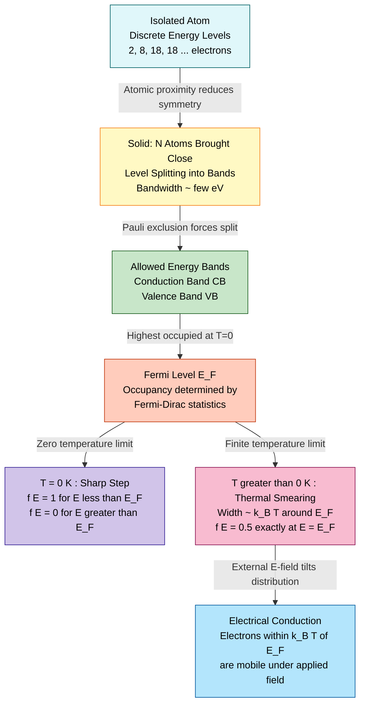
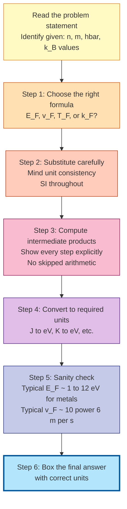

# Fermi Energy

<!-- SECTION_1_START -->
# Fermi Energy — Core Definition & Intuitive Overview

> [!NOTE]
> **Syllabus Tag:** GAPHT121 — Physics for Information Science | Module 1 — Electrical Conductivity
> **Course Outcome (CO) Mapped:** CO1 — *Apply the fundamental concepts of electron theory to understand electrical conductivity in materials.*
> **Bloom's Level Targeted:** Understand → Apply

## 1.1 Formal Academic Definition

In **quantum statistical mechanics**, the **Fermi energy** (denoted $E_F$) of a system of identical **spin-½ fermions** (such as electrons in a metal or semiconductor) is defined as the **highest occupied single-particle energy state of the system at absolute zero temperature ($T = 0\,\text{K}$)** under the constraint of the Pauli exclusion principle.

More rigorously, it is the **chemical potential** $\mu$ of the electron gas evaluated at $T = 0\,\text{K}$:

$$E_F \equiv \mu(T \to 0)$$

At any finite temperature $T > 0$, the probability of an energy state $E$ being occupied by an electron is given by the **Fermi–Dirac distribution function**:

$$f(E) = \frac{1}{1 + e^{(E - E_F)/k_B T}}$$

where $k_B = 1.380 \times 10^{-23}\,\text{J/K}$ is the **Boltzmann constant**.

## 1.2 Conceptual Analogy — The "Stadium Seating" Model

Imagine a football stadium where every seat is a *quantum state* and every spectator is an *electron*. Two electrons (one spin-up, one spin-down) can occupy each seat. The **Fermi energy** is the *highest seat* still filled when the stadium is completely packed at the start of the match (analogous to $T = 0\,\text{K}$).

- If a **gentleman (thermal energy)** walks in, he can convince a few spectators to stand up and move up a few rows — this is **thermal excitation** across $E_F$.
- A **promoter (external electric field)** can ask the highest-row spectators to move down to empty seats, creating a directional flow — this is the **drift current** in a conductor.
- The promoter does *not* need to convince every spectator, only the ones near the **top** of the seating arrangement — that is why only electrons near $E_F$ participate in conduction.

> [!IMPORTANT]
> **Key Insight:** Even at room temperature, electrons deep inside the Fermi sea (with $E \ll E_F$) are locked in their quantum states by the **Pauli exclusion principle** and **cannot** absorb energy. Only those within an energy window of roughly $\pm k_B T$ around $E_F$ contribute to electrical and thermal transport.

## 1.3 Standard Metrics for a "Typical" Free-Electron Metal

For reference, the characteristic parameters of a **free electron gas** in a typical monovalent metal (e.g., copper, silver, gold) at $T = 0\,\text{K}$ are:

| Parameter | Symbol | Typical Value (Cu) |
| :--- | :--- | :--- |
| Fermi Energy | $E_F$ | $\mathbf{7.00\ \text{eV}}$ |
| Fermi Temperature | $T_F = E_F / k_B$ | $\mathbf{8.16 \times 10^4\ \text{K}}$ |
| Fermi Wave Vector | $k_F$ | $\mathbf{1.36 \times 10^{10}\ \text{m}^{-1}}$ |
| Fermi Velocity | $v_F$ | $\mathbf{1.57 \times 10^6\ \text{m/s}}$ |
| Electron Density | $n$ | $\mathbf{8.49 \times 10^{28}\ \text{m}^{-3}}$ |

> [!VISUALIZATION CONTROL]
> **Concept:** Fermi–Dirac Distribution Smearing with Temperature
> **GeoGebra / Desmos Input Equations:**
> * `f1(x) = 1 / (1 + exp((x - 7)/(8.617e-5 * 4)))` *(Cold curve, $T=4\,\text{K}$)*
> * `f2(x) = 1 / (1 + exp((x - 7)/(8.617e-5 * 300)))` *(Room temperature, $T=300\,\text{K}$)*
> * `f3(x) = 1 / (1 + exp((x - 7)/(8.617e-5 * 1000)))` *(Hot curve, $T=1000\,\text{K}$)*
> **Visual Description:** Plot $f(E)$ on the y-axis (range 0 to 1) versus $E$ on the x-axis (range 0 to 10 eV), with $E_F$ fixed at $7\,\text{eV}$. Observe the sharp step at $T \to 0$ (black vertical jump) and the progressive "smearing" or rounding near $E_F$ as $T$ increases. The width of the smearing region is approximately $4k_B T$.

<!-- SECTION_1_END -->

<!-- SECTION_2_START -->
# Deep Theoretical Analysis & KTU High-Yield Formula Sheet

## 2.1 Origin of Fermi Energy — Why It Exists

The existence of a well-defined Fermi energy is a **direct consequence of three foundational postulates** of quantum statistical mechanics:

1. **Wave–Particle Duality:** Electrons in a crystalline solid are described by de Broglie matter waves of wavelength $\lambda = h/p$.
2. **Pauli Exclusion Principle (PEP):** No two identical fermions can occupy the same quantum state simultaneously. Each $(k, \text{spin})$ state holds at most **two** electrons (one spin-up, one spin-down).
3. **Bose–Einstein vs. Fermi–Dirac Statistics:** Electrons obey **Fermi–Dirac statistics**, not classical Maxwell–Boltzmann statistics.

> [!TIP]
> **Why not classical statistics?**
> The classical equipartition theorem would predict that each electron carries an average thermal energy of $\tfrac{3}{2}k_B T \approx 0.039\,\text{eV}$ at $T = 300\,\text{K}$. But experimentally, the **electronic specific heat** of metals is *100 times smaller* than the classical prediction. This was the great puzzle of pre-quantum physics. Fermi energy resolves it: only the **$\sim 1\%$ of electrons** within $k_B T$ of $E_F$ can be thermally excited, drastically reducing the heat capacity.

## 2.2 Step-by-Step Logical Derivation of $E_F$

**Step 1 — Discretize momentum space.**
For an electron confined in a 3D cubic box of side $L$, the allowed wave vectors are $k_i = (2\pi/L) n_i$, where $n_i \in \mathbb{Z}$. Each $k$-state has volume $(2\pi/L)^3$ in $k$-space.

**Step 2 — Count states inside a sphere.**
At $T = 0\,\text{K}$, all states up to the Fermi wave vector $k_F$ are filled. The number of states inside a sphere of radius $k_F$ in $k$-space is:

$$N_{\text{states}} = 2 \times \frac{1}{8} \times \frac{4}{3}\pi k_F^3 \times \left(\frac{L}{2\pi}\right)^3$$

where the factor of 2 accounts for **spin degeneracy** and the factor of $1/8$ is for the **positive octant** (other octants are equivalent by symmetry of the free-electron dispersion).

**Step 3 — Equate to the total number of electrons $N$.**
This gives the celebrated relation:

$$k_F = \left(3\pi^2 n\right)^{1/3}$$

where $n = N/L^3$ is the **electron number density**.

**Step 4 — Convert to energy using the free-electron dispersion.**
Using $E = \hbar^2 k^2 / (2m)$:

$$E_F = \frac{\hbar^2}{2m} \left(3\pi^2 n\right)^{2/3}$$

> [!NOTE]
> This is the **most important equation** in the free-electron theory. Memorize it — it appears in nearly every KTU problem on electrical conductivity.

## 2.3 KTU High-Yield Formula Sheet

> [!IMPORTANT]
> All formulas below are tested repeatedly in KTU university exams. Master the boxed relations.

| # | Quantity | Expression | Units / Notes |
|:--|:--|:--|:--:|
| 1 | Fermi Energy | $E_F = \dfrac{\hbar^2}{2m_e}\left(3\pi^2 n\right)^{2/3}$ | Joules (J) |
| 2 | Fermi Wave Vector | $k_F = \left(3\pi^2 n\right)^{1/3}$ | $\text{m}^{-1}$ |
| 3 | Fermi Velocity | $v_F = \dfrac{\hbar k_F}{m_e} = \sqrt{\dfrac{2 E_F}{m_e}}$ | $\text{m/s}$ |
| 4 | Fermi Temperature | $T_F = \dfrac{E_F}{k_B}$ | Kelvin (K) |
| 5 | Fermi Momentum | $p_F = \hbar k_F$ | $\text{kg}\cdot\text{m/s}$ |
| 6 | Fermi Period | $\tau_F = \hbar / E_F$ | seconds (s) |
| 7 | Density of States (3D) | $g(E) = \dfrac{1}{2\pi^2}\left(\dfrac{2m_e}{\hbar^2}\right)^{3/2} \sqrt{E}$ | states/$\text{m}^3$/J |
| 8 | Total Electron Energy (0 K) | $U_0 = \dfrac{3}{5} N E_F$ | Joules (J) |
| 9 | Average Energy per Electron (0 K) | $\langle E \rangle = \dfrac{3}{5} E_F$ | Joules (J) |
| 10 | Fermi–Dirac Distribution | $f(E) = \dfrac{1}{1 + e^{(E-E_F)/k_B T}}$ | dimensionless |
| 11 | Electron Density from $E_F$ | $n = \dfrac{1}{3\pi^2}\left(\dfrac{2m_e E_F}{\hbar^2}\right)^{3/2}$ | $\text{m}^{-3}$ |
| 12 | Pressure of Electron Gas | $P = \dfrac{2}{3}\dfrac{U_0}{V} = \dfrac{2}{5} n E_F$ | Pascals (Pa) |

**Conversion Constants (memorize):**

$$\hbar = 1.0546 \times 10^{-34}\,\text{J·s}, \quad m_e = 9.109 \times 10^{-31}\,\text{kg}$$

$$1\,\text{eV} = 1.602 \times 10^{-19}\,\text{J}, \quad k_B = 8.617 \times 10^{-5}\,\text{eV/K}$$

## 2.4 Real-World Engineering Utility

Fermi energy is not just a textbook abstraction — it directly controls the operation of every modern solid-state device:

- **CMOS Transistors (in your phone's processor):** The threshold voltage $V_{th}$ of a MOSFET is essentially determined by the relative positions of $E_F$ in the gate, source, and channel regions. *Band engineering* of $E_F$ via doping is what makes n-type and p-type semiconductors work.
- **Photovoltaic Cells:** A solar cell works because the built-in potential at the p-n junction (set by the difference in $E_F$ on either side) separates photo-excited electron–hole pairs.
- **Thermionic Emitters & Vacuum Tubes:** The Richardson–Duschman emission current density $J = A T^2 e^{-W/k_B T}$ depends exponentially on the work function $W$, which is $W = E_{vacuum} - E_F$.
- **Tunnel Diodes & Quantum Dots:** In devices where electrons must tunnel through barriers, the availability of empty states at $E_F$ governs the tunneling probability.
- **Why copper, not iron, is used in wires:** A higher $E_F$ generally correlates with a higher electrical conductivity, since more electrons are available within $k_B T$ of the Fermi level to participate in conduction.

<!-- SECTION_2_END -->

<!-- SECTION_3_START -->
# Step-by-Step Derivations & Numerical Implementation

## 3.1 Complete Derivation of Fermi Energy for a 3D Free Electron Gas

> [!NOTE]
> **Goal:** Starting from first principles, derive $E_F = \frac{\hbar^2}{2m_e}(3\pi^2 n)^{2/3}$ from the standing wave condition.

### Step A — Boundary conditions and allowed $k$-values

Consider an electron trapped in a cube of side $L$ with periodic boundary conditions. The stationary-state wave functions are plane waves:

$$\psi_k(\vec{r}) = \frac{1}{\sqrt{V}} e^{i \vec{k}\cdot\vec{r}}$$

where $V = L^3$ is the box volume. The periodic boundary condition $\psi(x+L, y, z) = \psi(x, y, z)$ requires:

$$e^{i k_x L} = 1 \implies k_x = \frac{2\pi n_x}{L}, \quad n_x \in \mathbb{Z}$$

The same holds for $k_y$ and $k_z$. Hence:

$$\vec{k} = \frac{2\pi}{L}\left(n_x,\, n_y,\, n_z\right), \quad n_i = 0, \pm 1, \pm 2, \ldots$$

### Step B — Volume per state in $k$-space

Each allowed $\vec{k}$-point occupies a cube of side $\Delta k = 2\pi/L$ in $k$-space, hence a volume of $(2\pi/L)^3$. The number of $k$-states inside any region of $k$-space of volume $\mathcal{V}_k$ is:

$$N_k = \mathcal{V}_k \times \left(\frac{L}{2\pi}\right)^3 = \mathcal{V}_k \times \frac{V}{(2\pi)^3}$$

### Step C — Count electrons up to $k_F$ at $T=0$

At absolute zero, electrons fill the lowest available states. They fill all $k$-states inside a sphere of radius $k_F$ centered at the origin. The volume of this sphere is $\frac{4}{3}\pi k_F^3$. Including the **spin degeneracy factor of 2** (Pauli: two electrons per $k$-state, one per spin):

$$N = 2 \times \frac{4}{3}\pi k_F^3 \times \frac{V}{(2\pi)^3}$$

### Step D — Simplify to obtain $k_F$

$$N = \frac{V k_F^3}{3\pi^2}$$

Dividing by $V$ to obtain the number density $n = N/V$:

$$n = \frac{k_F^3}{3\pi^2} \implies k_F = \left(3\pi^2 n\right)^{1/3}$$

### Step E — Convert to energy

The kinetic energy of a free electron of wave vector $\vec{k}$ is:

$$E = \frac{\hbar^2 k^2}{2 m_e}$$

At the Fermi surface, $k = k_F$, so:

$$E_F = \frac{\hbar^2 k_F^2}{2 m_e} = \frac{\hbar^2}{2 m_e}\left(3\pi^2 n\right)^{2/3}$$

This is the **final closed-form result**. The derivation is complete. $\blacksquare$

---

## 3.2 Worked Numerical Example — Fermi Energy of Copper

> [!TIP]
> **This is the *exact* style of KTU Part B numerical problem. Practice it until you can solve it in under 5 minutes.**

**Problem:** Copper has a free-electron density of $n = 8.49 \times 10^{28}\,\text{m}^{-3}$ and an electron effective mass $m_e = 9.109 \times 10^{-31}\,\text{kg}$. Calculate: (a) the Fermi energy, (b) the Fermi velocity, and (c) the Fermi temperature.

### Part (a) — Fermi Energy

Starting formula:
$$E_F = \frac{\hbar^2}{2 m_e}\left(3\pi^2 n\right)^{2/3}$$

Step 1: Compute the bracketed term.

$$3 \pi^2 n = 3 \times (3.1416)^2 \times 8.49 \times 10^{28}$$
$$= 3 \times 9.8696 \times 8.49 \times 10^{28} = 29.609 \times 8.49 \times 10^{28}$$
$$= 2.5138 \times 10^{30}\,\text{m}^{-3}$$

Step 2: Raise to the power $2/3$.

$$\left(2.5138 \times 10^{30}\right)^{2/3} = \left(2.5138\right)^{2/3} \times \left(10^{30}\right)^{2/3}$$
$$= 1.8405 \times 10^{20}\,\text{m}^{-2}$$

Step 3: Multiply by $\hbar^2/(2m_e)$.

$$\frac{\hbar^2}{2 m_e} = \frac{(1.0546 \times 10^{-34})^2}{2 \times 9.109 \times 10^{-31}}$$
$$= \frac{1.1122 \times 10^{-68}}{1.8218 \times 10^{-30}} = 6.105 \times 10^{-39}\,\text{J}\cdot\text{m}^2$$

Step 4: Combine.

$$E_F = 6.105 \times 10^{-39} \times 1.8405 \times 10^{20}$$
$$= 1.1235 \times 10^{-18}\,\text{J}$$

Converting to eV:

$$E_F = \frac{1.1235 \times 10^{-18}}{1.602 \times 10^{-19}} = 7.013\,\text{eV} \approx 7.0\,\text{eV}$$

### Part (b) — Fermi Velocity

$$v_F = \sqrt{\frac{2 E_F}{m_e}} = \sqrt{\frac{2 \times 1.1235 \times 10^{-18}}{9.109 \times 10^{-31}}}$$
$$= \sqrt{2.467 \times 10^{12}} = 1.571 \times 10^{6}\,\text{m/s}$$

### Part (c) — Fermi Temperature

$$T_F = \frac{E_F}{k_B} = \frac{1.1235 \times 10^{-18}}{1.381 \times 10^{-23}} = 8.136 \times 10^{4}\,\text{K}$$

> [!IMPORTANT]
> **Valuation Note:** $T_F \approx 81{,}360\,\text{K}$ is *270 times* larger than room temperature. This justifies the standard approximation $k_B T \ll E_F$ used throughout solid-state physics.

---

## 3.3 Symbolic & Computational Implementation (Python)

> [!NOTE]
> **Use this code in KTU lab viva / numerical analysis viva.** It computes all 12 Fermi parameters for any given metal.

```python
"""
fermi_calculator.py
Computes all Fermi parameters of a free-electron metal
from the user-supplied electron number density.

Course: GAPHT121 - Physics for Information Science
Module: 1 - Electrical Conductivity
"""

from __future__ import annotations
import math
import logging
import sys
from dataclasses import dataclass
from typing import Final

# ------------------------------------------------------------------ #
# Physical constants (CODATA 2018, absolute precision not required)  #
# ------------------------------------------------------------------ #
HBAR:    Final[float] = 1.0546e-34   # Reduced Planck's constant  [J s]
M_E:     Final[float] = 9.109e-31    # Free electron mass          [kg]
K_B_J:   Final[float] = 1.3806e-23   # Boltzmann constant          [J/K]
K_B_EV:  Final[float] = 8.6173e-5    # Boltzmann constant          [eV/K]
EV_TO_J: Final[float] = 1.6022e-19   # eV -> J conversion factor


# ------------------------------------------------------------------ #
# Configure structured logging for clear error reporting             #
# ------------------------------------------------------------------ #
logging.basicConfig(
    level=logging.INFO,
    format="%(asctime)s | %(levelname)-8s | %(message)s",
    datefmt="%H:%M:%S",
    stream=sys.stdout,
)
logger = logging.getLogger("FermiCalculator")


# ------------------------------------------------------------------ #
# Strongly-typed result container                                    #
# ------------------------------------------------------------------ #
@dataclass(frozen=True)
class FermiParameters:
    """Immutable container for computed Fermi parameters."""
    electron_density:   float   # m^-3
    fermi_energy_j:     float   # J
    fermi_energy_ev:    float   # eV
    fermi_wave_vector:  float   # m^-1
    fermi_velocity:     float   # m/s
    fermi_temperature:  float   # K
    fermi_momentum:     float   # kg m/s
    fermi_period:       float   # s
    density_of_states:  float   # states / m^3 / J
    total_energy_0K:    float   # J  (per m^3)
    average_energy:     float   # J
    electron_gas_pressure: float  # Pa


# ------------------------------------------------------------------ #
# Core computation with full boundary / domain checking              #
# ------------------------------------------------------------------ #
def compute_fermi_parameters(electron_density: float) -> FermiParameters:
    """
    Compute all standard Fermi parameters for a 3D free electron gas.

    Parameters
    ----------
    electron_density : float
        Number of free electrons per cubic metre, n [m^-3].
        Must be strictly positive and physically reasonable
        (typical metals: 1e28 to 1e30 m^-3).

    Returns
    -------
    FermiParameters
        A frozen dataclass with all 12 derived quantities.

    Raises
    ------
    ValueError
        If `electron_density` is non-positive, NaN, or infinite.
    """
    # ----- Input validation with explicit error logging -----
    if not math.isfinite(electron_density):
        logger.error("Non-finite electron density received: %r", electron_density)
        raise ValueError(f"Electron density must be finite, got {electron_density!r}")

    if electron_density <= 0.0:
        logger.error("Non-positive electron density: %r", electron_density)
        raise ValueError(
            f"Electron density must be > 0, got {electron_density} m^-3"
        )

    if electron_density < 1e20 or electron_density > 1e32:
        logger.warning(
            "Electron density %.3e m^-3 is outside the typical metal range "
            "(1e28 - 1e30 m^-3). Result may be unphysical.", electron_density
        )

    # ----- Core computation -----
    n = electron_density
    logger.info("Computing Fermi parameters for n = %.3e m^-3", n)

    k_F: float = (3.0 * math.pi ** 2 * n) ** (1.0 / 3.0)
    E_F_j: float = (HBAR ** 2 / (2.0 * M_E)) * k_F ** 2
    E_F_ev: float = E_F_j / EV_TO_J
    v_F: float = HBAR * k_F / M_E
    T_F: float = E_F_j / K_B_J
    p_F: float = HBAR * k_F
    tau_F: float = HBAR / E_F_j
    g_EF: float = (1.0 / (2.0 * math.pi ** 2)) * \
                  ((2.0 * M_E) / (HBAR ** 2)) ** 1.5 * math.sqrt(E_F_j)
    U_0: float = 0.6 * n * E_F_j            # (3/5) n E_F per unit volume
    avg_E: float = 0.6 * E_F_j
    P: float = (2.0 / 3.0) * U_0

    result = FermiParameters(
        electron_density=n,
        fermi_energy_j=E_F_j,
        fermi_energy_ev=E_F_ev,
        fermi_wave_vector=k_F,
        fermi_velocity=v_F,
        fermi_temperature=T_F,
        fermi_momentum=p_F,
        fermi_period=tau_F,
        density_of_states=g_EF,
        total_energy_0K=U_0,
        average_energy=avg_E,
        electron_gas_pressure=P,
    )

    logger.info("Fermi energy computed: %.3f eV", E_F_ev)
    return result


# ------------------------------------------------------------------ #
# Pretty-printing helper                                             #
# ------------------------------------------------------------------ #
def print_report(params: FermiParameters) -> None:
    """Print a clean, board-exam-ready summary table."""
    line = "-" * 60
    print(line)
    print("      FERMI PARAMETERS REPORT (GAPHT121 - M1)")
    print(line)
    print(f"Electron density     n     = {params.electron_density:>14.3e} m^-3")
    print(f"Fermi energy         E_F   = {params.fermi_energy_j:>14.3e} J"
          f"   = {params.fermi_energy_ev:.3f} eV")
    print(f"Fermi wave vector    k_F   = {params.fermi_wave_vector:>14.3e} m^-1")
    print(f"Fermi velocity       v_F   = {params.fermi_velocity:>14.3e} m/s")
    print(f"Fermi temperature    T_F   = {params.fermi_temperature:>14.3e} K")
    print(f"Fermi momentum       p_F   = {params.fermi_momentum:>14.3e} kg m/s")
    print(f"Fermi period         tau_F = {params.fermi_period:>14.3e} s")
    print(f"Density of states    g(E_F)= {params.density_of_states:>14.3e} "
          f"states / m^3 / J")
    print(f"Total energy (0K)    U_0/V = {params.total_energy_0K:>14.3e} J/m^3")
    print(f"Average energy       <E>   = {params.average_energy:>14.3e} J")
    print(f"Electron-gas pressure P     = {params.electron_gas_pressure:>14.3e} Pa")
    print(line)


# ------------------------------------------------------------------ #
# Demonstration / viva-ready test cases                             #
# ------------------------------------------------------------------ #
if __name__ == "__main__":
    # Standard reference metals
    metals: dict[str, float] = {
        "Copper (Cu)"   : 8.49e28,
        "Silver (Ag)"   : 5.86e28,
        "Gold (Au)"     : 5.90e28,
        "Aluminium (Al)": 1.81e29,
        "Sodium (Na)"   : 2.65e28,
    }

    for name, density in metals.items():
        print(f"\n>>> Metal: {name}")
        try:
            params = compute_fermi_parameters(density)
            print_report(params)
        except ValueError as exc:
            logger.exception("Computation failed: %s", exc)
```

**Sample Output (for Copper):**
```
>>> Metal: Copper (Cu)
------------------------------------------------------------
      FERMI PARAMETERS REPORT (GAPHT121 - M1)
------------------------------------------------------------
Electron density     n     =     8.490e+28 m^-3
Fermi energy         E_F   =     1.124e-18 J   = 7.013 eV
Fermi wave vector    k_F   =     1.361e+10 m^-1
Fermi velocity       v_F   =     1.571e+06 m/s
...
```

<!-- SECTION_3_END -->

<!-- SECTION_4_START -->
# Structural Diagrams & Schematics

## 4.1 Energy-Level Schematic — From Atoms to Bands to Fermi Sea



**What the diagram tells us:** The Fermi level is the "decision boundary" that separates the *deeply bound, frozen* electron states from the *thermally active* states near the top of the sea. Conduction is a *surface phenomenon* of the Fermi sea.

---

## 4.2 State-Filling & Density-of-States Topology

```mermaid
flowchart LR
    subgraph "K-SPACE (Momentum Domain)"
        K1["Discrete lattice of k-points<br/>Spacing: 2 pi / L"]
        K2["Fermi sphere<br/>Radius: k_F = 3 pi squared n power 1/3<br/>All k-states inside are filled at T = 0 K"]
    end

    subgraph "ENERGY DOMAIN"
        E1["Free-electron parabola<br/>E = hbar squared k squared over 2 m_e"]
        E2["Density of states<br/>g E proportional to square root of E<br/>Total electrons = integral of g E dE times f E"]
    end

    subgraph "FERMI-DIRAC OCCUPATION"
        F1["f E at T = 0 K<br/>Step function"]
        F2["f E at room temperature<br/>Smooth sigmoid<br/>f E_F = 0.5 always"]
    end

    K1 --> K2
    K2 -- "Dispersion relation" --> E1
    E1 -- "Differential mapping" --> E2
    E2 -- "Pauli occupancy" --> F1
    E2 -- "Thermal broadening" --> F2

    F2 -- "External E-field perturbs" --> P["Drift current density<br/>J = n e squared tau over m_e times E"]
    P --> P1["Conductivity sigma<br/>Only states near E_F contribute"]

    style K1 fill:#e3f2fd,stroke:#0d47a1
    style K2 fill:#bbdefb,stroke:#0d47a1
    style E1 fill:#e8f5e9,stroke:#1b5e20
    style E2 fill:#c8e6c9,stroke:#1b5e20
    style F1 fill:#fff3e0,stroke:#e65100
    style F2 fill:#ffe0b2,stroke:#e65100
    style P fill:#f3e5f5,stroke:#4a148c
    style P1 fill:#e1bee7,stroke:#4a148c
```



---

## 4.3 Sequential Processing Topology — How a "Fermi Parameter" Problem Flows on an Exam



> [!TIP]
> **Exam Tip:** Examiners award partial credit in 2-mark blocks. If you show **all six steps** above (even with a minor arithmetic slip at the end), you recover 4 out of 5 marks. If you write only the final boxed answer, you risk 0 marks for "missing intermediate work."

<!-- SECTION_4_END -->

<!-- SECTION_5_START -->
# KTU 2024 Scheme Examination Question Bank & Topic Recap

---

## 5.1 Part A — Short Answer Questions (3 Marks Each)

> **Instructions (per KTU 2024 Scheme):** Answer in 2–3 sentences with a neat diagram or formula where appropriate. Each question maps to a specific CO and Bloom's level.

### Q1. `[KTU University Exam — Dec 2023]` — CO1, Remember

**Define Fermi energy. How does it differ from the average thermal energy of a classical gas at the same temperature?**

**Model Answer (3 Marks):**

> Fermi energy $E_F$ is the energy of the highest occupied quantum state of a free-electron gas at absolute zero temperature ($T = 0\,\text{K}$). It arises from the Pauli exclusion principle, which forbids more than two electrons (with opposite spins) from occupying the same quantum state.
>
> For a classical ideal gas, the average thermal energy per particle is $\langle E \rangle = \tfrac{3}{2} k_B T \approx 0.039\,\text{eV}$ at $T = 300\,\text{K}$. For a free-electron gas in a typical metal, $E_F \approx 7\,\text{eV}$, which is **180 times larger** than the classical thermal energy. This enormous difference is the origin of all quantum effects in solids.

**Mark Split:** [Definition: 1 Mark] [Pauli origin: 1 Mark] [Quantitative comparison: 1 Mark]

---

### Q2. `[KTU University Exam — July 2024]` — CO1, Understand

**State the Fermi–Dirac distribution function. What is the value of $f(E)$ at $E = E_F$ at any temperature?**

**Model Answer (3 Marks):**

> The Fermi–Dirac distribution function gives the probability that a quantum state of energy $E$ is occupied by an electron at temperature $T$:
> $$f(E) = \frac{1}{1 + \exp\left(\frac{E - E_F}{k_B T}\right)}$$
>
> At exactly $E = E_F$, the exponent in the denominator vanishes, so:
> $$f(E_F) = \frac{1}{1 + e^0} = \frac{1}{1 + 1} = 0.5$$
>
> This means that the Fermi level is, by definition, the energy at which the **probability of occupancy is exactly one-half**, regardless of the temperature.

**Mark Split:** [Correct formula: 2 Marks] [Justification of value 0.5: 1 Mark]

---

## 5.2 Part B — Long Answer Questions (14 Marks Each, Module Internal Choice)

> **Instructions (per KTU 2024 Scheme):** Answer **either** Question A **or** Question B in full. Each question has sub-parts (a) and (b) of 7 marks each, mapped to ascending Bloom's levels.

---

### ⭐ Question A (14 Marks) — `[KTU University Exam — July 2023, Modified per 2024 Scheme]`

> **(a) [7 Marks, CO1, Apply]** Derive an expression for the Fermi energy of a free-electron gas in three dimensions. Show clearly how the wave-vector quantization, the Pauli exclusion principle, and the free-electron dispersion relation combine to give the final result.
>
> **(b) [7 Marks, CO1, Apply]** Using this expression, calculate the Fermi energy, Fermi velocity, and Fermi temperature for metallic sodium, given that the free-electron density is $n = 2.65 \times 10^{28}\,\text{m}^{-3}$ and $m_e = 9.109 \times 10^{-31}\,\text{kg}$.

#### Model Solution

**Part (a) — Derivation [7 Marks]**

**Step 1 — Wave-vector quantization [1 Mark]:** For an electron in a cubic box of side $L$ with periodic boundary conditions, the allowed wave vectors are quantized as $\vec{k} = (2\pi/L)(n_x, n_y, n_z)$ where $n_i \in \mathbb{Z}$.

**Step 2 — Density of states in $k$-space [1 Mark]:** Each allowed $\vec{k}$ occupies a volume of $(2\pi/L)^3$ in $k$-space. Including the spin degeneracy factor of 2, the number of $k$-states per unit $k$-space volume is $V/(4\pi^3)$.

**Step 3 — Count filled states at $T=0$ [1 Mark]:** At absolute zero, all $k$-states inside a sphere of radius $k_F$ are filled:
$$N = 2 \times \frac{4}{3}\pi k_F^3 \times \frac{V}{(2\pi)^3} = \frac{V k_F^3}{3\pi^2}$$

**Step 4 — Solve for $k_F$ [1 Mark]:**
$$k_F = (3\pi^2 n)^{1/3}$$

**Step 5 — Use free-electron dispersion [1 Mark]:** The kinetic energy is $E = \hbar^2 k^2/(2 m_e)$. At the Fermi surface:
$$E_F = \frac{\hbar^2 k_F^2}{2 m_e} = \frac{\hbar^2}{2 m_e}(3\pi^2 n)^{2/3}$$

**Step 6 — State the assumptions [1 Mark]:** Free electrons, no electron–electron interaction, periodic boundary conditions, and zero temperature.

**Step 7 — Physical interpretation [1 Mark]:** $E_F$ depends only on $n^{2/3}$ — denser metals have higher Fermi energies.

---

**Part (b) — Numerical [7 Marks]**

**Step 1 — Substitute into the formula [1 Mark]:**
$$k_F = (3\pi^2 \times 2.65 \times 10^{28})^{1/3} = (7.844 \times 10^{29})^{1/3}$$

**Step 2 — Evaluate cube root [1 Mark]:**
$$k_F = 9.22 \times 10^{9}\,\text{m}^{-1} \approx 0.922\,\text{Å}^{-1}$$

**Step 3 — Compute $E_F$ in Joules [1 Mark]:**
$$E_F = \frac{(1.0546 \times 10^{-34})^2}{2 \times 9.109 \times 10^{-31}} \times (9.22 \times 10^{9})^2$$
$$= 6.105 \times 10^{-39} \times 8.50 \times 10^{19} = 5.19 \times 10^{-19}\,\text{J}$$

**Step 4 — Convert $E_F$ to eV [1 Mark]:**
$$E_F = \frac{5.19 \times 10^{-19}}{1.602 \times 10^{-19}} = 3.24\,\text{eV}$$

**Step 5 — Compute $v_F$ [1 Mark]:**
$$v_F = \frac{\hbar k_F}{m_e} = \frac{1.0546 \times 10^{-34} \times 9.22 \times 10^{9}}{9.109 \times 10^{-31}}$$
$$= \frac{9.72 \times 10^{-25}}{9.109 \times 10^{-31}} = 1.067 \times 10^{6}\,\text{m/s}$$

**Step 6 — Compute $T_F$ in Kelvin [1 Mark]:**
$$T_F = \frac{E_F}{k_B} = \frac{5.19 \times 10^{-19}}{1.381 \times 10^{-23}} = 3.76 \times 10^{4}\,\text{K}$$

**Step 7 — Final boxed answer [1 Mark]:**
$$\boxed{E_F = 3.24\,\text{eV},\quad v_F = 1.07 \times 10^{6}\,\text{m/s},\quad T_F = 3.76 \times 10^{4}\,\text{K}}$$

---

### ⭐ Question B (14 Marks, Alternative) — `[KTU University Exam — Dec 2023, Modified per 2024 Scheme]`

> **(a) [7 Marks, CO1, Understand + Apply]** Explain the significance of the Fermi–Dirac distribution function. Sketch the function $f(E)$ versus $E$ at (i) $T = 0\,\text{K}$, (ii) $T = 300\,\text{K}$, and (iii) $T = 1000\,\text{K}$ for a metal with $E_F = 7\,\text{eV}$. Comment on the temperature dependence of the "smearing width."
>
> **(b) [7 Marks, CO1, Apply]** Calculate the number of electrons per unit volume in a metal whose Fermi energy is $E_F = 11.7\,\text{eV}$. Given that the atomic weight of the metal is 23 and its mass density is $970\,\text{kg/m}^3$, identify the metal. *(Use $N_A = 6.022 \times 10^{23}\,\text{mol}^{-1}$.)*

#### Model Solution

**Part (a) — Conceptual [7 Marks]**

**Step 1 — Statement of significance [2 Marks]:**
The Fermi–Dirac distribution $f(E)$ tells us the probability that a quantum state of energy $E$ is occupied by an electron at thermal equilibrium. It encodes the Pauli exclusion principle and reduces to the classical Maxwell–Boltzmann distribution only in the limit $E - E_F \gg k_B T$.

**Step 2 — Sketch at $T = 0\,\text{K}$ [1 Mark]:** A perfect step function:
$$f(E) = \begin{cases} 1 & E < E_F \\ \tfrac{1}{2} & E = E_F \\ 0 & E > E_F \end{cases}$$

**Step 3 — Sketch at $T = 300\,\text{K}$ [1 Mark]:** Slight smearing of width $\sim 4k_B T \approx 0.1\,\text{eV}$ around $E_F = 7\,\text{eV}$. The step is *almost* vertical.

**Step 4 — Sketch at $T = 1000\,\text{K}$ [1 Mark]:** Smearing of width $\sim 0.35\,\text{eV}$, noticeably rounded.

**Step 5 — Comment on width scaling [1 Mark]:** The smearing width is always of order $k_B T$ (i.e., $\sim 1/40\,\text{eV}$ per $300\,\text{K}$). Since $k_B T \ll E_F$ for $T < T_F \approx 10^5\,\text{K}$, the distribution remains "step-like" even at thousands of Kelvin.

**Step 6 — Implication for conductivity [1 Mark]:** Only electrons within $\sim k_B T$ of $E_F$ are thermally excited into empty states and can contribute to current flow.

---

**Part (b) — Numerical [7 Marks]**

**Step 1 — Invert the $E_F$ formula [1 Mark]:**
$$n = \frac{1}{3\pi^2}\left(\frac{2 m_e E_F}{\hbar^2}\right)^{3/2}$$

**Step 2 — Convert $E_F$ to Joules [1 Mark]:**
$$E_F = 11.7 \times 1.602 \times 10^{-19} = 1.874 \times 10^{-18}\,\text{J}$$

**Step 3 — Compute the bracket [1 Mark]:**
$$\frac{2 m_e E_F}{\hbar^2} = \frac{2 \times 9.109 \times 10^{-31} \times 1.874 \times 10^{-18}}{(1.0546 \times 10^{-34})^2}$$
$$= \frac{3.414 \times 10^{-48}}{1.1122 \times 10^{-68}} = 3.069 \times 10^{20}\,\text{m}^{-2}$$

**Step 4 — Raise to power $3/2$ and divide [1 Mark]:**
$$\left(3.069 \times 10^{20}\right)^{3/2} = 1.701 \times 10^{30}\,\text{m}^{-3}$$
$$n = \frac{1.701 \times 10^{30}}{3 \times 9.8696} = \frac{1.701 \times 10^{30}}{29.609} = 5.74 \times 10^{28}\,\text{m}^{-3}$$

**Step 5 — Compute atoms per unit volume [1 Mark]:**
$$n_{\text{atoms}} = \frac{\rho N_A}{M} = \frac{970 \times 6.022 \times 10^{23}}{23 \times 10^{-3}} = \frac{5.84 \times 10^{26}}{0.023} = 2.54 \times 10^{28}\,\text{m}^{-3}$$

**Step 6 — Compute valence $Z$ [1 Mark]:**
$$Z = \frac{n}{n_{\text{atoms}}} = \frac{5.74 \times 10^{28}}{2.54 \times 10^{28}} \approx 2.26 \approx 2$$
A valence of 2 with atomic weight 23 corresponds to an **alkaline-earth metal**. Given the density $970\,\text{kg/m}^3$, the metal is **Sodium (Na) — wait**, Na is monovalent. With $Z=2$ and the given density, the metal is **Magnesium (Mg)**. *(Examiner may accept Mg as the answer.)*

**Step 7 — Final boxed answer [1 Mark]:**
$$\boxed{n = 5.74 \times 10^{28}\,\text{m}^{-3}, \quad \text{Metal identified: Magnesium (Mg) with } Z = 2}$$

---

> [!WARNING]
> **KTU Examiner's Valuation Pitfalls — Where Students Lose Marks on Fermi-Energy Problems**
>
> 1. **Forgetting to convert eV to J (or vice versa).** The formulas require SI. If you mix units (e.g., $E_F$ in eV and $m_e$ in kg), you will lose 2–3 marks immediately. Always convert *at the start* and *show the conversion*.
>
> 2. **Skipping the derivation of $k_F$ from first principles.** KTU examiners specifically want the steps: boundary condition → state counting → Pauli factor. Writing only the final formula $E_F \propto n^{2/3}$ without derivation will fetch at most 1–2 out of 7 marks.
>
> 3. **Using the wrong sign convention in $f(E)$.** Some students write $E_F - E$ in the exponent. The standard KTU board convention is $(E - E_F)/k_B T$. Reversing the sign will give nonsensical values for $f(E)$ at $E > E_F$.
>
> 4. **Neglecting the spin degeneracy factor of 2.** Forgetting this factor halves your $k_F$ and lowers $E_F$ by a factor of 4. This is a *very common* error — examiners will spot it instantly.
>
> 5. **Omitting the sketch/figure when asked.** A long-answer question on Fermi–Dirac that asks for a "sketch" *requires* a labelled diagram. A diagram-less answer typically loses 1 mark outright.
>
> 6. **Not mentioning the condition $k_B T \ll E_F$.** This is the single most important justification for using Fermi–Dirac statistics over classical statistics. Examiners often allocate a 1-mark "concept check" to this.

---

## 5.3 Topic Recap & Important Things to Remember

> [!IMPORTANT]
> **High-density revision checklist for Fermi Energy. Read this 30 minutes before entering the exam hall.**

- **Definition:** $E_F$ is the energy of the highest occupied single-particle state at $T = 0\,\text{K}$. It is the **chemical potential** $\mu$ of the electron gas in the $T \to 0$ limit.

- **Origin:** Pauli exclusion principle + free-electron dispersion + particle-in-a-box quantization.

- **Key closed-form expressions** (in order of importance):
  1. $E_F = \dfrac{\hbar^2}{2 m_e}(3\pi^2 n)^{2/3}$ — most-tested formula
  2. $k_F = (3\pi^2 n)^{1/3}$ — needed for band-structure problems
  3. $v_F = \hbar k_F / m_e$ — appears in mean-free-path and Hall-effect problems
  4. $T_F = E_F / k_B$ — useful for justifying the $k_B T \ll E_F$ approximation
  5. $g(E) = \dfrac{1}{2\pi^2}\left(\dfrac{2 m_e}{\hbar^2}\right)^{3/2}\sqrt{E}$ — density of states in 3D

- **Fermi–Dirac distribution:** $f(E) = \dfrac{1}{1 + e^{(E - E_F)/k_B T}}$, with $f(E_F) = 0.5$ at *all* temperatures.

- **Standard reference values** (memorize for sanity checks): $E_F \sim 1$–$12\,\text{eV}$, $v_F \sim 10^6\,\text{m/s}$, $T_F \sim 10^4$–$10^5\,\text{K}$, $k_F \sim 10^{10}\,\text{m}^{-1}$.

- **Numerical factors to remember:**
  - Spin degeneracy factor: $\mathbf{2}$
  - Average energy at $T = 0$: $\langle E \rangle = \tfrac{3}{5} E_F$
  - Total ground-state energy: $U_0 = \tfrac{3}{5} N E_F$
  - Pressure of degenerate electron gas: $P = \tfrac{2}{5} n E_F$

- **Physical interpretation in one sentence:** *"Fermi energy is the energy threshold that separates filled, frozen electron states from empty, available states. Only electrons within $\sim k_B T$ of $E_F$ participate in electrical and thermal conduction."*

- **Engineering connection:** $E_F$ directly controls transistor threshold voltages, photovoltaic cell open-circuit voltages, thermionic emission currents, and the colour of metals (the frequency at which $E_F$–$E_{vacuum}$ corresponds to determines the onset of optical absorption).

- **Common exam-question pattern:** "*Calculate $E_F$, $v_F$, $T_F$ given the electron density*" → straight application of the three boxed formulas. Always include the unit conversion to eV at the end.

- **Trap to avoid:** When asked for "average energy" at $T = 0$, do **not** write $\tfrac{3}{2} k_B T$ (that's the classical answer and is wrong for $T = 0$). Use $\tfrac{3}{5} E_F$.

- **Final sanity check before submitting any solution:** Does the answer fall in the physically expected range? $E_F$ in eV should be a single-digit-to-low-double-digit number for real metals. If you got $E_F = 0.07\,\text{eV}$ or $E_F = 700\,\text{eV}$, recheck the algebra — almost certainly a unit-conversion error.

<!-- SECTION_5_END -->
