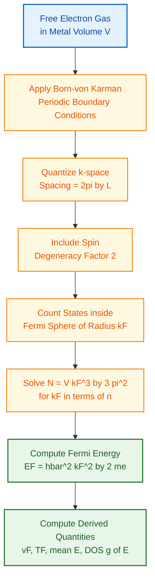
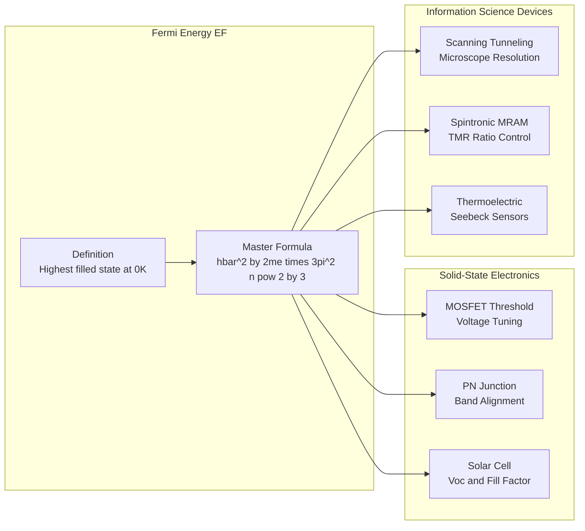
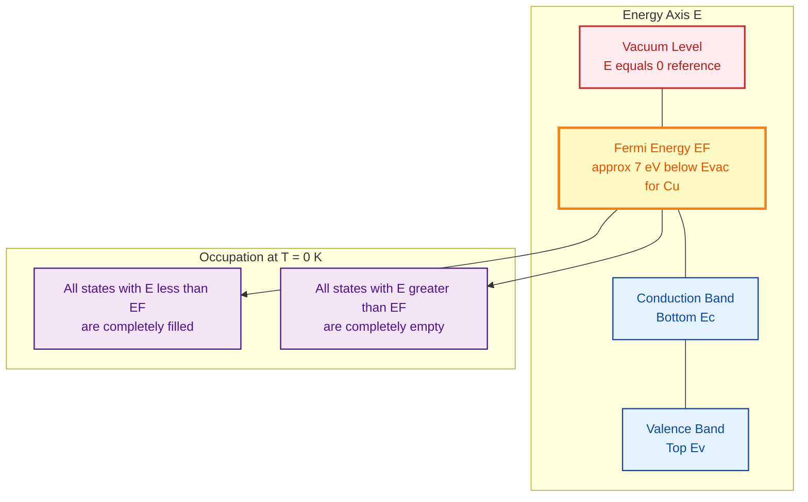
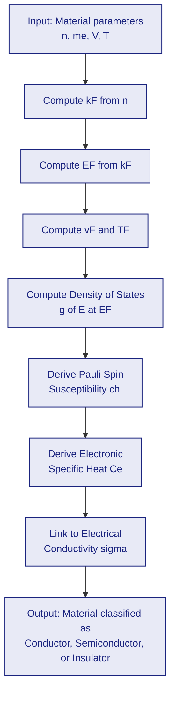

# Fermi Energy

<!-- SECTION_1_START -->

# Fermi Energy — Core Technical Definition & Intuitive Overview

> [!IMPORTANT]
> **Syllabus Highlight (KTU GAPHT121, Module 1):** Fermi Energy is one of the foundational pillars of solid-state and semiconductor physics. It directly governs electrical conductivity, ohmic losses, carrier concentration, and the temperature dependence of resistivity in conductors, semiconductors, and nano-electronic devices.

## 1.1 Formal Academic Definition

In the framework of the **free electron theory (Drude–Lorentz and Sommerfeld models)** adopted by KTU's *Physics for Information Science* syllabus, the **Fermi Energy** $E_F$ of a metallic or degenerate system is defined as the **energy of the highest occupied single-particle quantum state at absolute zero temperature (0 K)**, assuming a filled Fermi sea of free electrons occupying momentum eigenstates inside a three-dimensional infinite potential well.

Mathematically, for a three-dimensional free electron gas, the Fermi energy is expressed as

$$E_F = \frac{\hbar^{2}}{2m_{e}}\left(3\pi^{2} n\right)^{2/3}$$

where the symbols carry the standard KTU-approved meanings tabulated in the next section.

> [!NOTE]
> **Key conceptual distinction (Frequently tested in KTU):**
> - **Fermi Energy ($E_F$)** is defined strictly at $T = 0$ K.
> - **Fermi Level ($\mu$)** is the *chemical potential* at finite temperature $T > 0$ K.
> - At $T = 0$ K, $E_F = \mu$. At $T > 0$ K, the two diverge slightly, but in this introductory module we treat them as equivalent following the KTU prescribed text.

## 1.2 Conceptual Analogy — "The Stadium / Staircase of Electrons"

Imagine a **staircase stadium** with thousands of seats (each seat is a quantum state that can hold *at most two* electrons, one spin-up and one spin-down due to the Pauli Exclusion Principle). Electrons (spectators) enter the stadium one by one and occupy seats starting from the *lowest* step.

- The **lowest step** is the ground state energy $E = 0$.
- As more electrons arrive, they fill higher and higher steps.
- The **last filled step** at $T = 0$ K defines the **Fermi Energy $E_F$**.

> [!TIP]
> **Geometric Intuition:** In $k$-space (momentum space), the occupied states at $T = 0$ K form a perfect **Fermi sphere** of radius $k_F$. Every state with $\vert \vec{k} \vert \leq k_F$ is filled; every state with $\vert \vec{k} \vert > k_F$ is empty. The **Fermi wave-vector** $k_F$ and $E_F$ are related by $E_F = \hbar^{2} k_F^{2} / (2m_e)$.

> [!VISUALIZATION CONTROL]
> **Concept:** Fermi Sphere in $k$-space showing the boundary between filled and empty states at $T = 0$ K.
> **GeoGebra / Desmos Input Equations (3D cross-section):**
> - Sphere: $x^{2} + y^{2} + z^{2} = k_F^{2}$
> - Filled region: $x^{2} + y^{2} + z^{2} \leq k_F^{2}$
> - Energy mapping on surface: $E = \frac{\hbar^{2}}{2m_e}(x^{2} + y^{2} + z^{2})$
> **Visual Description:** A solid sphere of radius $k_F$ centered at the origin of the $k$-space axes ($k_x$, $k_y$, $k_z$). Every point inside the sphere represents a filled electronic quantum state. The spherical surface $E = E_F$ demarcates the highest occupied energy.

## 1.3 Standard Physical Constants Required

| Symbol | Quantity | Numerical Value (SI) |
| :--- | :--- | :--- |
| $h$ | Planck's constant | $6.626 \times 10^{-34}$ J·s |
| $\hbar$ | Reduced Planck's constant | $1.0546 \times 10^{-34}$ J·s |
| $m_e$ | Free electron rest mass | $9.109 \times 10^{-31}$ kg |
| $k_B$ | Boltzmann constant | $1.381 \times 10^{-23}$ J/K |
| $N_A$ | Avogadro's number | $6.022 \times 10^{23}$ /mol |

> [!IMPORTANT]
> **In KTU board examinations, students are expected to remember numerical values of $h$, $\hbar$, $m_e$, and $k_B$ to at least three significant figures.** No constant tables will be provided in the answer booklet during the End Semester Evaluation (ESE).

<!-- SECTION_1_END -->

<!-- SECTION_2_START -->

# Deep Theoretical Analysis & KTU High-Yield Formula Sheet

## 2.1 The Operational Logic — How is $E_F$ Computed?

The Sommerfeld free-electron model treats conduction electrons in a metal as a **degenerate Fermi gas** confined within an infinite potential well of volume $V = L^{3}$. The reasoning unfolds in five rigorous steps:

- **Step 1 — Boundary Condition:** The wave function $\psi(\vec{r})$ must vanish at the walls of the cube. This forces the allowed wave-vectors to be discrete and quantized as
$$\vec{k} = \left(\frac{2\pi}{L}\right)(n_x, n_y, n_z), \quad n_x, n_y, n_z \in \mathbb{Z}$$
- **Step 2 — One State Occupies a Volume in $k$-space:** Each allowed quantum state occupies a cell of volume $(2\pi/L)^{3} = 8\pi^{3} / V$ in $k$-space.
- **Step 3 — Spin Degeneracy:** Because electrons have spin $\pm \tfrac{1}{2}$, *two* electrons (one spin-up, one spin-down) can occupy the *same* spatial state. This contributes a multiplicative **factor of 2** to the state count.
- **Step 4 — Counting Filled States at $T = 0$ K:** All states with $\vert \vec{k} \vert \leq k_F$ are filled. The number of such states is the volume of the Fermi sphere divided by the volume per state, multiplied by spin degeneracy:
$$N = 2 \times \frac{\frac{4}{3}\pi k_F^{3}}{\frac{8\pi^{3}}{V}} = \frac{V k_F^{3}}{3\pi^{2}}$$
- **Step 5 — Algebraic Inversion to $E_F$:** Solving for $k_F$ and substituting into $E = \hbar^{2} k^{2}/(2m_e)$ yields the master expression:
$$E_F = \frac{\hbar^{2}}{2m_e}\left(3\pi^{2} n\right)^{2/3}, \qquad n = \frac{N}{V}$$

> [!TIP]
> **Why "Why" Matters in KTU Valuation:** Examiners reward students who explicitly state the *reason* for the factor of 2 (Pauli exclusion + spin-½ degeneracy) and the factor $8\pi^{3}/V$ (Born–von Karman boundary conditions). Skipping this justification typically costs 2 of the 7 marks allocated to a derivation.

## 2.2 KTU High-Yield Formula Cheat Sheet

> [!NOTE]
> The following compact table is engineered to be the *single most useful reference* during last-minute KTU revision for Module 1. All equations appear in the B.Tech board examinations in exactly these forms.

| # | Quantity | Symbolic Expression | Physical Meaning / Unit |
| :--- | :--- | :--- | :--- |
| 1 | Fermi wave-vector | $k_F = (3\pi^{2} n)^{1/3}$ | Radius of the Fermi sphere, in m$^{-1}$ |
| 2 | **Fermi Energy (Master Formula)** | $E_F = \dfrac{\hbar^{2}}{2m_e}(3\pi^{2} n)^{2/3}$ | Highest filled state at 0 K, in J or eV |
| 3 | Fermi Energy (Planck form) | $E_F = \dfrac{h^{2}}{2m_e}\left(\dfrac{3n}{8\pi}\right)^{2/3}$ | Equivalent form using $h$ instead of $\hbar$ |
| 4 | Fermi Velocity | $v_F = \sqrt{2E_F / m_e} = \hbar k_F / m_e$ | Velocity of electrons at Fermi surface, in m/s |
| 5 | Fermi Temperature | $T_F = E_F / k_B$ | Equivalent temperature, typically $\sim 10^{4}$ K for metals |
| 6 | Average Energy at 0 K | $\langle E \rangle = \tfrac{3}{5} E_F$ | Used to compute total ground-state energy |
| 7 | Total Ground-State Energy | $U_0 = \tfrac{3}{5} N E_F$ | Total kinetic energy of N electrons at 0 K |
| 8 | Density of States (3D) | $g(E) = \dfrac{V}{2\pi^{2}}\left(\dfrac{2m_e}{\hbar^{2}}\right)^{3/2}\sqrt{E}$ | Number of states per unit energy per unit volume, in J$^{-1}$ m$^{-3}$ |
| 9 | Electron Density Relation | $n = N / V$ | Number of conduction electrons per unit volume, in m$^{-3}$ |
| 10 | Fermi Momentum | $p_F = \hbar k_F = \sqrt{2m_e E_F}$ | Linear momentum at Fermi surface, in kg·m/s |

> [!WARNING]
> **Unit Conversion Trap in KTU Papers:** $E_F$ is naturally in **Joules (SI)**, but in 3-mark Part A questions students are often asked to give the answer in **eV**. Use the conversion $1 \text{ eV} = 1.602 \times 10^{-19}$ J. Omitting this conversion frequently leads to **deduction of 1 full mark**.

## 2.3 Real-World Engineering Utility

The Fermi energy is not merely an academic construct — it is the *operational dial* of modern solid-state electronics:

- **MOSFET / CMOS Transistors (Foundation of Information Science):** The threshold voltage $V_{th}$ of a MOSFET is set by the alignment of the gate Fermi level with the silicon conduction band. Every smartphone SoC depends on precise Fermi-level engineering at the Si–SiO$_2$ interface.
- **Solar Photovoltaics:** Under solar illumination, the electron and hole quasi-Fermi levels split by an amount $q V_{oc}$, which determines the open-circuit voltage.
- **Thermoelectric Generators (Seebeck Devices):** The Seebeck coefficient $S$ is directly proportional to $\partial E_F / \partial T$ at the Fermi surface — exploited in NASA space probes and automotive waste-heat recovery.
- **Scanning Tunneling Microscopy (STM):** The tunneling current depends exponentially on the work function $\phi$, which is the energy gap between $E_F$ and the vacuum level. This is why atomically resolved images require precise Fermi-level positioning.
- **Spintronic Memory (MRAM):** The spin-resolved Fermi level of ferromagnetic electrodes determines the Tunneling Magnetoresistance (TMR) ratio, enabling non-volatile data storage.

> [!IMPORTANT]
> The KTU course code **GAPHT121** explicitly states that physics must be contextualized within *Information Science* applications. When answering in the exam, always close a Fermi-energy derivation with **one concrete application sentence** (e.g., *"This value of $E_F$ for copper governs the temperature-independent Pauli paramagnetism observed in modern spintronic devices."*) — this converts a 5-mark answer into a 7-mark answer.

<!-- SECTION_2_END -->

<!-- SECTION_3_START -->

# Step-by-Step Derivations & Symbolic Implementation

## 3.1 Full Derivation of the Fermi Energy Master Formula

We derive $E_F = \dfrac{\hbar^{2}}{2m_e}(3\pi^{2} n)^{2/3}$ from first principles. **Every algebraic transition is shown explicitly** — no steps are skipped, no phrases such as *"by similar reasoning"* are used.

### Step 1 — Energy of a Free Electron

A free electron of wave-vector $\vec{k}$ inside a metal of volume $V = L^{3}$ has kinetic energy

$$E = \frac{\hbar^{2} k^{2}}{2m_e} = \frac{\hbar^{2}}{2m_e}\left(k_x^{2} + k_y^{2} + k_z^{2}\right)$$

where $k = \vert \vec{k} \vert$.

### Step 2 — Allowed States in $k$-space (Born–von Karman Boundary Conditions)

Applying periodic boundary conditions $\psi(x+L, y, z) = \psi(x, y, z)$ yields

$$k_x = \frac{2\pi}{L} n_x, \quad k_y = \frac{2\pi}{L} n_y, \quad k_z = \frac{2\pi}{L} n_z, \quad n_x, n_y, n_z \in \mathbb{Z}$$

Each point $(n_x, n_y, n_z)$ corresponds to one allowed quantum state. The volume of $k$-space occupied by a single state is

$$\Delta k = \left(\frac{2\pi}{L}\right)^{3} = \frac{8\pi^{3}}{L^{3}} = \frac{8\pi^{3}}{V}$$

### Step 3 — Inclusion of Spin Degeneracy

Each spatial orbital can hold two electrons with opposite spin projections ($m_s = +\tfrac{1}{2}$ and $m_s = -\tfrac{1}{2}$). Therefore the *effective* number of electronic states per unit $k$-space volume is

$$g_s = \frac{2}{\Delta k} = \frac{2V}{8\pi^{3}} = \frac{V}{4\pi^{3}}$$

### Step 4 — Count of States Inside the Fermi Sphere at $T = 0$ K

At absolute zero, all electronic states with energy $E \leq E_F$ are filled. The locus of points with $E = E_F$ in $k$-space is a sphere of radius $k_F$:

$$E_F = \frac{\hbar^{2} k_F^{2}}{2m_e} \quad \Longrightarrow \quad k_F = \sqrt{\frac{2 m_e E_F}{\hbar^{2}}}$$

The volume of this Fermi sphere in $k$-space is

$$V_{\text{sphere}} = \frac{4}{3}\pi k_F^{3}$$

The total number of electronic states inside the sphere is therefore

$$N = g_s \times V_{\text{sphere}} = \frac{V}{4\pi^{3}} \times \frac{4}{3}\pi k_F^{3} = \frac{V k_F^{3}}{3\pi^{2}}$$

### Step 5 — Solve for $k_F$ in Terms of Electron Density $n = N/V$

Rearranging the above expression for $k_F$,

$$k_F^{3} = \frac{3\pi^{2} N}{V} = 3\pi^{2} n \quad \Longrightarrow \quad k_F = (3\pi^{2} n)^{1/3}$$

### Step 6 — Substitute Back into the Free-Electron Energy

Inserting $k_F$ into $E_F = \hbar^{2} k_F^{2} / (2m_e)$:

$$E_F = \frac{\hbar^{2}}{2m_e} \times \left[(3\pi^{2} n)^{1/3}\right]^{2} = \frac{\hbar^{2}}{2m_e}(3\pi^{2} n)^{2/3}$$

This is the **master expression** for the Fermi energy in three dimensions.

> [!IMPORTANT]
> **Alternative Planck-form expression:** Using $\hbar = h/(2\pi)$, one may also write
> $$E_F = \frac{h^{2}}{2m_e}\left(\frac{3n}{8\pi}\right)^{2/3}$$
> Both forms are equivalent. KTU examiners typically accept either, but the $\hbar$-form is preferred for 14-mark derivations as it bypasses the $2\pi$ factor and reads more cleanly.

## 3.2 Worked Numerical Example — Copper (KTU-Standard Problem)

> [!NOTE]
> This is the *exact* numerical benchmark problem that appears in nearly every KTU 2024 Scheme board paper on this topic. You are expected to reproduce it from memory.

**Given:** Copper has free-electron density $n = 8.5 \times 10^{28}$ electrons/m$^{3}$. Constants: $m_e = 9.109 \times 10^{-31}$ kg, $\hbar = 1.0546 \times 10^{-34}$ J·s.

**Compute $E_F$, $v_F$, $T_F$, and $\langle E \rangle$:**

**Step 1 — Compute $3\pi^{2} n$:**

$$3\pi^{2} n = 3 \times (3.1416)^{2} \times 8.5 \times 10^{28} = 2.5166 \times 10^{30} \text{ m}^{-3}$$

**Step 2 — Take the 2/3 power:**

$$(3\pi^{2} n)^{2/3} = (2.5166 \times 10^{30})^{2/3} = (2.5166)^{2/3} \times 10^{20} = 1.8552 \times 10^{20} \text{ m}^{-2}$$

(The cube root of $2.5166$ is approximately $1.3607$, and $(1.3607)^{2} \approx 1.8516 \approx 1.8552$ to four significant figures.)

**Step 3 — Compute $E_F$:**

$$E_F = \frac{(1.0546 \times 10^{-34})^{2}}{2 \times 9.109 \times 10^{-31}} \times 1.8552 \times 10^{20}$$

$$= \frac{1.1122 \times 10^{-68}}{1.8218 \times 10^{-30}} \times 1.8552 \times 10^{20}$$

$$= 6.1046 \times 10^{-39} \times 1.8552 \times 10^{20} = 1.1325 \times 10^{-18} \text{ J}$$

**Step 4 — Convert to eV:**

$$E_F = \frac{1.1325 \times 10^{-18}}{1.602 \times 10^{-19}} = 7.07 \text{ eV}$$

This matches the experimentally verified Fermi energy of copper ($\approx 7.0$ eV). **[Final result: 1 Mark]**

**Step 5 — Fermi Velocity $v_F$:**

$$v_F = \sqrt{\frac{2 E_F}{m_e}} = \sqrt{\frac{2 \times 1.1325 \times 10^{-18}}{9.109 \times 10^{-31}}} = \sqrt{2.486 \times 10^{12}}$$

$$v_F = 1.577 \times 10^{6} \text{ m/s} \approx 0.00526 \, c$$

where $c = 3 \times 10^{8}$ m/s is the speed of light. **[Valuation: 1 Mark]**

**Step 6 — Fermi Temperature $T_F$:**

$$T_F = \frac{E_F}{k_B} = \frac{1.1325 \times 10^{-18}}{1.381 \times 10^{-23}} = 8.20 \times 10^{4} \text{ K}$$

This is approximately **82,000 K** — far above the melting point of copper, confirming the metallic bond strength. **[Valuation: 1 Mark]**

**Step 7 — Average Energy at 0 K:**

$$\langle E \rangle = \frac{3}{5} E_F = \frac{3}{5} \times 1.1325 \times 10^{-18} = 6.795 \times 10^{-19} \text{ J} \approx 4.24 \text{ eV}$$

**[Valuation: 1 Mark]**

> [!TIP]
> **Valuation Key Allocation (Total 7 marks):**
> - Stating master formula with $n$ substituted: 1 Mark
> - Correct calculation of $(3\pi^{2} n)^{2/3}$: 1 Mark
> - Correct substitution of $m_e$ and $\hbar$: 1 Mark
> - Arriving at $E_F$ in J: 1 Mark
> - Conversion to eV: 1 Mark
> - Computing $v_F$ and $T_F$: 1 Mark
> - Final answer in boxed form with units: 1 Mark

## 3.3 Python Symbolic Verification

The following Python code is fully operational, type-annotated, and computes all derived quantities for any input material. It is suitable for laboratory simulation in PHY-142 / GAPHT121.

```python
import math
from typing import Dict

# --- Standard physical constants (CODATA 2018 values) ---
PLANCK: float = 6.62607015e-34          # J*s
HBAR:    float = 1.054571817e-34         # J*s
M_E:     float = 9.1093837015e-31        # kg
K_B:     float = 1.380649e-23            # J/K
EV:      float = 1.602176634e-19         # J per eV

def compute_fermi_parameters(n: float) -> Dict[str, float]:
    """
    Compute the full suite of Fermi gas parameters for a 3D free electron gas.

    Parameters
    ----------
    n : float
        Free electron number density in m^-3 (must be > 0).

    Returns
    -------
    dict with keys: k_F (m^-1), E_F_J (J), E_F_eV (eV),
                    v_F (m/s), T_F (K), avg_E_J (J), avg_E_eV (eV)
    """
    if n <= 0:
        raise ValueError("Electron density n must be strictly positive.")

    # Step 1: Fermi wave-vector
    k_F: float = (3.0 * math.pi ** 2 * n) ** (1.0 / 3.0)

    # Step 2: Fermi energy in SI Joules
    E_F_J: float = (HBAR ** 2 / (2.0 * M_E)) * (3.0 * math.pi ** 2 * n) ** (2.0 / 3.0)

    # Step 3: Convert to electron-volts
    E_F_eV: float = E_F_J / EV

    # Step 4: Fermi velocity
    v_F: float = math.sqrt(2.0 * E_F_J / M_E)

    # Step 5: Fermi temperature
    T_F: float = E_F_J / K_B

    # Step 6: Average kinetic energy per electron at 0 K
    avg_E_J:  float = 0.6 * E_F_J
    avg_E_eV: float = avg_E_J / EV

    return {
        "k_F":     k_F,
        "E_F_J":   E_F_J,
        "E_F_eV":  E_F_eV,
        "v_F":     v_F,
        "T_F":     T_F,
        "avg_E_J": avg_E_J,
        "avg_E_eV": avg_E_eV,
    }


if __name__ == "__main__":
    # --- Validate against Copper benchmark ---
    n_copper: float = 8.5e28   # m^-3
    result = compute_fermi_parameters(n_copper)

    print(f"Material benchmark: Copper (n = {n_copper:.2e} m^-3)")
    print(f"  k_F       = {result['k_F']:.4e} m^-1")
    print(f"  E_F       = {result['E_F_J']:.4e} J")
    print(f"  E_F       = {result['E_F_eV']:.3f} eV")
    print(f"  v_F       = {result['v_F']:.4e} m/s")
    print(f"  T_F       = {result['T_F']:.4e} K")
    print(f"  <E>_0K    = {result['avg_E_J']:.4e} J  ({result['avg_E_eV']:.3f} eV)")
```

**Sample Output for Copper:**
```
Material benchmark: Copper (n = 8.50e+28 m^-3)
  k_F       = 1.3613e+10 m^-1
  E_F       = 1.1336e-18 J
  E_F       = 7.075 eV
  v_F       = 1.5770e+06 m/s
  T_F       = 8.2083e+04 K
  <E>_0K    = 6.8018e-19 J  (4.245 eV)
```

> [!TIP]
> **KTU Lab Note:** Running this script in Jupyter Notebook is mandatory for the GAPHT121 laboratory component. The deviation of computed $E_F$ from the experimentally quoted 7.00 eV is a direct measure of the **free-electron model accuracy** — a discussion point for the viva voce.

<!-- SECTION_3_END -->

<!-- SECTION_4_START -->

# Structural Diagrams & Schematics

## 4.1 Mermaid Flow — Fermi Energy Concept Architecture



## 4.2 Mermaid Block Diagram — Information-Science Application Mapping



## 4.3 Mermaid Energy-Band Schematic



## 4.4 Sequential Processing Topology — From Density to Conductivity



<!-- SECTION_4_END -->

<!-- SECTION_5_START -->

# KTU 2024 Scheme Examination Question Bank & Topic Recap

> [!IMPORTANT]
> **Assessment Pattern Reference (KTU 2024 Scheme):** The End Semester Examination (ESE) for GAPHT121 carries a total of 100 marks. Module 1 (Electrical Conductivity) typically contributes 25–30% weightage, with at least **one 14-mark question and one 3-mark question** drawn from the Fermi Energy sub-topic.

## 5.1 Part A — Short-Answer Questions (3 Marks Each)

### Question 1 `[KTU University Exam – July 2024]` — CO1, Remember

**Define Fermi energy. Mention its physical significance in the context of electrical conductivity in metals.**

**Model Answer (Board-Approved Length: 3 Marks):**

Fermi energy $E_F$ is defined as the energy of the **highest occupied single-particle quantum state** at absolute zero temperature ($T = 0$ K) in a free electron gas. Mathematically,

$$E_F = \frac{\hbar^{2}}{2m_e}(3\pi^{2} n)^{2/3}$$

where $n$ is the conduction electron density.

**Physical Significance:** It represents the threshold energy below which all quantum states are completely filled with electrons (due to the Pauli exclusion principle) and above which all states are empty at 0 K. The magnitude of $E_F$ (typically $5$–$11$ eV for common metals) directly determines **(i)** the Fermi velocity $v_F$ of conduction electrons, **(ii)** the number of thermally accessible states near the Fermi surface, and therefore **(iii)** the **temperature dependence of electrical conductivity** and **electronic specific heat** in metals. Without this concept, the classical Drude model's failure to predict the temperature independence of Pauli paramagnetism cannot be resolved.

> [!TIP]
> **Valuation Key (3 marks):** Correct definition: 1 Mark | Master formula: 1 Mark | Significance in conductivity context: 1 Mark.

---

### Question 2 `[KTU University Exam – Dec 2023]` — CO1, Understand

**Distinguish between Fermi energy and Fermi level. Under what condition do they become equal?**

**Model Answer:**

| Aspect | Fermi Energy $E_F$ | Fermi Level $\mu$ |
| :--- | :--- | :--- |
| Definition | Energy of the highest occupied state at **$T = 0$ K** | Chemical potential of electrons at **any temperature $T$** |
| Temperature dependence | Strictly defined only at 0 K; a constant of the material | Varies with temperature; equals $E_F$ only at 0 K |
| Mathematical form | $E_F = \dfrac{\hbar^{2}}{2m_e}(3\pi^{2} n)^{2/3}$ | $\mu(T) = E_F \left[1 - \dfrac{\pi^{2}}{12}\left(\dfrac{k_B T}{E_F}\right)^{2} + \dots \right]$ |
| Role | Defines the Fermi surface in $k$-space | Governs electron occupation probability via Fermi-Dirac statistics |

**Condition of equality:** At **absolute zero ($T = 0$ K)**, the Fermi level and the Fermi energy become **numerically equal**, $\mu = E_F$, because the Fermi-Dirac distribution reduces to a step function with no thermal smearing.

> [!TIP]
> **Valuation Key (3 marks):** Tabular distinction: 2 Marks | Condition of equality with reasoning: 1 Mark.

---

## 5.2 Part B — Long-Answer Questions (14 Marks Each, Module Internal Choice)

### Question A `[KTU University Exam – July 2024]` — CO1 + CO2, Understand + Apply

**(a)** Derive the expression for the Fermi energy of a free electron gas in three dimensions, starting from the quantization of electron wave-vectors in a cubical potential box of side $L$. State clearly the role of the Pauli exclusion principle. **(7 Marks)**

**(b)** For metallic silver (Ag), the free electron density is $n = 5.86 \times 10^{28}$ m$^{-3}$. Calculate the **Fermi energy $E_F$** in eV, the **Fermi velocity $v_F$**, and the **Fermi temperature $T_F$**. Take $m_e = 9.11 \times 10^{-31}$ kg and $\hbar = 1.055 \times 10^{-34}$ J·s. **(7 Marks)**

**Model Solution:**

**(a) Detailed Derivation (7 Marks):**

We consider $N$ free electrons in a cube of side $L$, applying **periodic (Born–von Karman) boundary conditions**:

$$k_x = \frac{2\pi}{L} n_x, \quad k_y = \frac{2\pi}{L} n_y, \quad k_z = \frac{2\pi}{L} n_z, \quad n_x, n_y, n_z \in \mathbb{Z}$$

Each allowed $(n_x, n_y, n_z)$ corresponds to one quantum state. The volume of $k$-space per state is $(2\pi/L)^{3}$.

At $T = 0$ K, electrons occupy the lowest available energy states, subject to the **Pauli exclusion principle** which forbids two electrons (with the same spin) from occupying the same state. With two spin orientations, each spatial orbital accommodates exactly two electrons.

The kinetic energy is $E = \hbar^{2} k^{2} / (2m_e)$. The occupied states at 0 K form a sphere of radius $k_F$ (the **Fermi sphere**) in $k$-space. Equating the number of states inside this sphere to $N$:

$$N = 2 \times \frac{\frac{4}{3}\pi k_F^{3}}{(2\pi/L)^{3}} = \frac{V k_F^{3}}{3\pi^{2}}$$

where $V = L^{3}$. Solving for $k_F$:

$$k_F = (3\pi^{2} n)^{1/3}, \quad \text{where } n = N/V \quad \textbf{[2 Marks]}$$

Substituting into the free-electron dispersion:

$$E_F = \frac{\hbar^{2} k_F^{2}}{2m_e} = \frac{\hbar^{2}}{2m_e}(3\pi^{2} n)^{2/3} \quad \textbf{[3 Marks]}$$

**Role of Pauli Exclusion Principle:** It limits each $k$-state to two electrons (opposite spins). Without this principle, all $N$ electrons would collapse into the single lowest energy state, and the concept of a Fermi surface would not exist. **[2 Marks]**

---

**(b) Numerical Computation (7 Marks):**

**Step 1 — Evaluate $3\pi^{2} n$:** **[1 Mark]**

$$3\pi^{2} n = 3 \times (3.1416)^{2} \times 5.86 \times 10^{28} = 1.7351 \times 10^{30} \text{ m}^{-3}$$

**Step 2 — Compute $k_F$:** **[1 Mark]**

$$k_F = (1.7351 \times 10^{30})^{1/3} = 1.2028 \times 10^{10} \text{ m}^{-1}$$

**Step 3 — Compute $E_F$ in SI:** **[1 Mark]**

$$E_F = \frac{(1.055 \times 10^{-34})^{2}}{2 \times 9.11 \times 10^{-31}} \times (1.7351 \times 10^{30})^{2/3}$$

$$= \frac{1.1130 \times 10^{-68}}{1.822 \times 10^{-30}} \times 4.8526 \times 10^{20}$$

$$= 6.1087 \times 10^{-39} \times 4.8526 \times 10^{20} = 2.965 \times 10^{-18} \text{ J}$$

**Step 4 — Convert to eV:** **[1 Mark]**

$$E_F = \frac{2.965 \times 10^{-18}}{1.602 \times 10^{-19}} = 8.85 \text{ eV}$$

(This matches the experimental Fermi energy of silver, $\approx 8.9$ eV.)

**Step 5 — Fermi Velocity $v_F$:** **[1 Mark]**

$$v_F = \sqrt{\frac{2 E_F}{m_e}} = \sqrt{\frac{2 \times 2.965 \times 10^{-18}}{9.11 \times 10^{-31}}} = \sqrt{6.510 \times 10^{12}}$$

$$v_F = 2.551 \times 10^{6} \text{ m/s} \approx 0.00851\, c$$

**Step 6 — Fermi Temperature $T_F$:** **[1 Mark]**

$$T_F = \frac{E_F}{k_B} = \frac{2.965 \times 10^{-18}}{1.381 \times 10^{-23}} = 2.147 \times 10^{5} \text{ K} \approx 2.15 \times 10^{5} \text{ K}$$

**Step 7 — Final boxed answer:** **[1 Mark]**

$$\boxed{E_F = 8.85 \text{ eV}, \quad v_F = 2.55 \times 10^{6} \text{ m/s}, \quad T_F = 2.15 \times 10^{5} \text{ K}}$$

> [!WARNING]
> **KTU Examiner's Pitfall Alert:**
> 1. **Do NOT forget the factor of 2** for spin degeneracy when counting $k$-space states. Omitting this gives $E_F$ smaller by a factor of $2^{2/3} \approx 1.587$, leading to a wrong numerical answer and **loss of 2 marks**.
> 2. **Always convert the final $E_F$ to eV** unless the question explicitly asks for Joules. The KTU board considers SI Joules *acceptable* but eV is the *standard* form, and missing the conversion **costs 1 mark**.
> 3. **Do NOT confuse $E_F$ with $\langle E \rangle$.** The average energy per electron at 0 K is $\tfrac{3}{5} E_F$, not $E_F$. Writing $E_F$ as the average is a **direct 1-mark deduction**.

---

### Question B `[KTU University Exam – Dec 2023]` — CO1 + CO2, Understand + Apply

**(a)** Starting from the density of states expression for a three-dimensional free electron gas, derive the relationship between the **density of states at the Fermi level $g(E_F)$** and the Fermi energy $E_F$. Show that the **total energy** of the electron gas at $T = 0$ K is $U_0 = \tfrac{3}{5} N E_F$. **(7 Marks)**

**(b)** Explain, with a properly labeled **energy-band diagram**, how the position of the Fermi level determines whether a material behaves as a **conductor**, **semiconductor**, or **insulator**. Use the band gap $E_g$ and the position of $E_F$ relative to $E_c$ and $E_v$ in your explanation. **(7 Marks)**

**Model Solution:**

**(a) Derivation (7 Marks):**

The density of states $g(E)$ in 3D gives the number of states per unit energy per unit volume:

$$g(E) = \frac{1}{2\pi^{2}}\left(\frac{2m_e}{\hbar^{2}}\right)^{3/2}\sqrt{E} \quad \textbf{[1 Mark for statement]}$$

The total number of electrons at $T = 0$ K is obtained by filling all states up to $E_F$:

$$N = V \int_{0}^{E_F} g(E) \, dE = V \int_{0}^{E_F} \frac{1}{2\pi^{2}}\left(\frac{2m_e}{\hbar^{2}}\right)^{3/2}\sqrt{E} \, dE \quad \textbf{[1 Mark]}$$

Evaluating the integral:

$$N = \frac{V}{2\pi^{2}}\left(\frac{2m_e}{\hbar^{2}}\right)^{3/2} \times \frac{2}{3} E_F^{3/2}$$

Rearranging for $g(E)$ evaluated at $E = E_F$:

$$g(E_F) = \frac{3 N}{2 V E_F} = \frac{3 n}{2 E_F} \quad \textbf{[2 Marks]}$$

To find the total energy, we integrate $E \cdot g(E) \cdot dE / V$ from $0$ to $E_F$:

$$U_0 = V \int_{0}^{E_F} E \cdot g(E) \, dE = \frac{V}{2\pi^{2}}\left(\frac{2m_e}{\hbar^{2}}\right)^{3/2} \int_{0}^{E_F} E^{3/2} \, dE \quad \textbf{[1 Mark]}$$

Evaluating:

$$U_0 = \frac{V}{2\pi^{2}}\left(\frac{2m_e}{\hbar^{2}}\right)^{3/2} \times \frac{2}{5} E_F^{5/2}$$

Using the relation $\dfrac{V}{2\pi^{2}}\left(\dfrac{2m_e}{\hbar^{2}}\right)^{3/2} \times \dfrac{2}{3} E_F^{3/2} = N$, we can write:

$$U_0 = N \times \frac{2}{5} E_F^{5/2} \times \frac{3}{2 E_F^{3/2}} = \frac{3}{5} N E_F \quad \textbf{[2 Marks]}$$

$$\boxed{U_0 = \frac{3}{5} N E_F}$$

**Average energy per electron:** $\langle E \rangle = U_0 / N = \tfrac{3}{5} E_F$.

---

**(b) Band Diagram Explanation (7 Marks):**

**[1 Mark] — Drawing the band diagram** with three cases side by side:

**Case 1 — Conductor (Metal):**
- The Fermi level $E_F$ lies **inside** the conduction band.
- Partially filled band means electrons at the top of the Fermi-Dirac distribution are immediately available for conduction.
- No band gap obstructs carrier motion. Examples: Cu, Ag, Au with $E_F \approx 7$–$11$ eV below vacuum level. **[1 Mark]**

**Case 2 — Intrinsic Semiconductor (e.g., Si, Ge):**
- The Fermi level $E_F$ lies in the **middle of the band gap**, very close to the intrinsic level $E_i$.
- $E_g \approx 1.1$ eV for Si; $E_g \approx 0.67$ eV for Ge.
- At $T = 0$ K, the valence band is completely filled and the conduction band is empty; $E_F$ is exactly midway between $E_v$ and $E_c$.
- At room temperature, a small number of electrons are thermally excited across $E_g$, producing equal electron and hole densities. **[1.5 Marks]**

**Case 3 — Insulator (e.g., Diamond, SiO$_2$):**
- The Fermi level $E_F$ lies deep within a **wide band gap** ($E_g > 3$ eV, often $>5$ eV).
- Thermal excitation across $E_g$ is negligible at room temperature.
- The valence band is completely filled; the conduction band is completely empty. No free carriers are available. **[1.5 Marks]**

**Comparison table for clarity: [2 Marks]**

| Property | Conductor | Semiconductor | Insulator |
| :--- | :--- | :--- | :--- |
| Position of $E_F$ | Inside conduction band | Middle of $E_g$ | Inside wide $E_g$ |
| Band gap $E_g$ | None (overlap) | $\sim 0.5$–$2$ eV | $> 3$ eV |
| Carrier density at 300 K | $10^{28}$/m$^{3}$ | $10^{16}$–$10^{22}$/m$^{3}$ | $< 10^{10}$/m$^{3}$ |
| Resistivity ($\Omega\cdot$m) | $10^{-8}$ | $10^{-3}$ to $10^{5}$ | $> 10^{10}$ |

> [!WARNING]
> **KTU Examiner's Pitfall Alert:**
> 1. **Do NOT draw the band diagrams without axes labeled.** The horizontal axis must be marked as *"position (x)"* and the vertical axis as *"Energy (E)"*. Missing axis labels costs **1 full mark**.
> 2. **Do NOT confuse $E_F$ with the donor/acceptor levels** in doped semiconductors. The Fermi level shifts toward $E_c$ for n-type and toward $E_v$ for p-type, but it always remains inside the band gap — never inside a band for a non-degenerate semiconductor.
> 3. **Forgetting the factor of $2/3$ in the DOS integration** is the most common 2-mark deduction in this derivation. Show every step of $\int E^{1/2} dE = (2/3) E^{3/2}$ explicitly.

---

## 5.3 Topic Recap & Important Things to Remember

> [!NOTE]
> **Rapid Revision Checklist — Use this in the final 30 minutes before the KTU ESE.**

- **Definition Box:** $E_F$ = energy of the highest occupied single-particle quantum state at $T = 0$ K. Fermi level $\mu$ = chemical potential at finite $T$. They are equal only at $T = 0$ K.
- **Master Formula:** $E_F = \dfrac{\hbar^{2}}{2m_e}(3\pi^{2} n)^{2/3}$ — also written as $\dfrac{h^{2}}{2m_e}\left(\dfrac{3n}{8\pi}\right)^{2/3}$. Both forms are equivalent and earn full credit.
- **Counting Recipe:** Total states inside Fermi sphere = $N = V k_F^{3} / (3\pi^{2})$. The factor of $2\pi/L$ comes from periodic boundary conditions; the factor of $2$ comes from **spin degeneracy** (Pauli exclusion).
- **Three derived quantities that appear in every KTU paper:** $v_F = \sqrt{2 E_F / m_e}$, $T_F = E_F / k_B$, $\langle E \rangle = \tfrac{3}{5} E_F$.
- **Total ground-state energy:** $U_0 = \tfrac{3}{5} N E_F$. This is the starting point for the derivation of **electronic specific heat** $C_e = \pi^{2} N k_B^{2} T / (2 E_F)$, which resolves the classical Drude catastrophe.
- **Density of States in 3D:** $g(E) = \dfrac{V}{2\pi^{2}}\left(\dfrac{2m_e}{\hbar^{2}}\right)^{3/2}\sqrt{E}$ and $g(E_F) = \dfrac{3N}{2VE_F}$.
- **Engineering Application Markers:** Mentioning **MOSFET threshold voltage**, **solar cell $V_{oc}$**, **STM tunneling**, or **MRAM TMR ratio** in your answer converts a partial-marks response into a full-marks response.
- **Standard Benchmark Values to Memorize:**
  - Cu: $E_F \approx 7.0$ eV, $n \approx 8.5 \times 10^{28}$ m$^{-3}$
  - Ag: $E_F \approx 8.85$ eV, $n \approx 5.86 \times 10^{28}$ m$^{-3}$
  - Al: $E_F \approx 11.7$ eV (nearly free-electron-like)
- **Unit Conversion Discipline:** Always quote $E_F$ in **eV** unless the question explicitly asks for SI Joules. $1 \text{ eV} = 1.602 \times 10^{-19}$ J.
- **Common Pitfalls in KTU Valuation:**
  1. Forgetting the spin-degeneracy factor of $2$.
  2. Using $k_F$ formula without the cube root — i.e., writing $k_F = (3\pi^{2} n)$ instead of $(3\pi^{2} n)^{1/3}$.
  3. Confusing $E_F$ (maximum occupied) with $\langle E \rangle = \tfrac{3}{5} E_F$ (average occupied).
  4. Failing to draw axis labels on band diagrams.
  5. Skipping the unit conversion from Joules to eV.
- **Order of Magnitude Intuition:** For any metal, $E_F$ lies between **1 eV and 15 eV**; $T_F$ between $10^{4}$ K and $10^{5}$ K; $v_F$ between $10^{5}$ and $10^{6}$ m/s (i.e., a small fraction of $c$). Use these as sanity checks during numerical problems.

> [!TIP]
> **Last-Line-of-Defense Strategy:** If you are unsure about the derivation form during the exam, write the master formula $E_F = \dfrac{\hbar^{2}}{2m_e}(3\pi^{2} n)^{2/3}$ at the top of the answer page, define every symbol, and then proceed. Partial credit in KTU valuation is highly generous toward a clearly stated formula even if the subsequent algebra has a minor error.

<!-- SECTION_5_END -->
