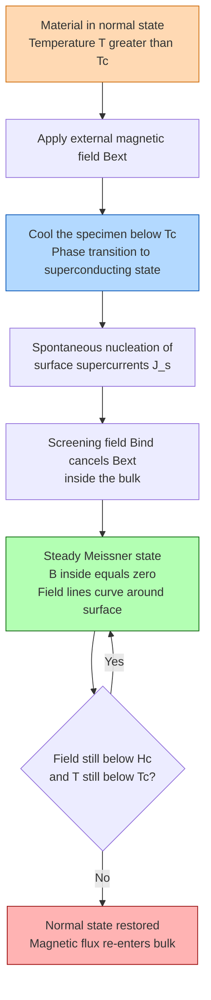
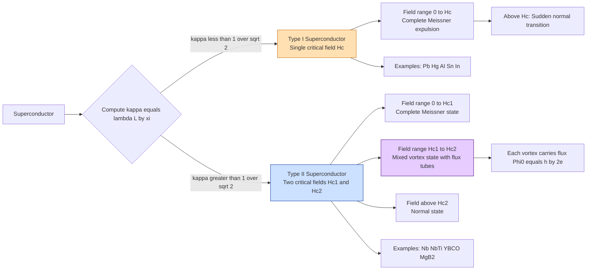
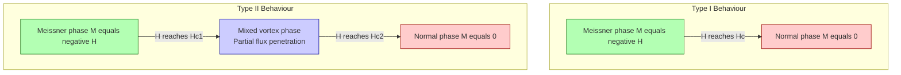
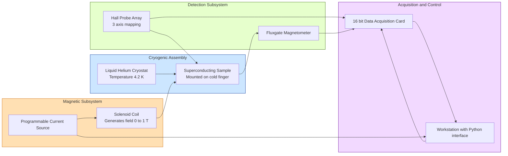

# Meissner effect

<!-- SECTION_1_START -->
# Meissner Effect — Core Definition & Intuitive Overview

## Formal Definition (KTU 2024 Syllabus Terminology)

> [!IMPORTANT]
> **Meissner Effect**: The complete and reversible expulsion of magnetic flux from the interior of a superconducting material when it is cooled below its critical temperature $T_c$ in the presence of an external magnetic field, such that the magnetic induction **inside** the bulk of the superconductor becomes exactly zero: $B_{inside} = 0$.

The phenomenon was experimentally demonstrated by **Walther Meissner** and **Robert Ochsenfeld** in **1933** at the Physikalisch-Technische Reichsanstalt in Berlin. It established that superconductivity is a *true thermodynamic phase* — not merely a state of zero electrical resistance.

> [!NOTE]
> **Why Meissner Effect ≠ Perfect Conductor**
> A *perfect conductor* (a hypothetical metal with $R = 0$) would only trap any magnetic flux present at the moment of transition. A superconductor, however, actively *expels* the field regardless of whether the field was applied before or after cooling. This distinction was the conceptual breakthrough of 1933.

## Conceptual Analogy / Intuition

Imagine a sealed, perfectly smooth soap bubble floating in air. No matter how strongly you blow air (magnetic field) at it from the outside, the bubble's *interior* remains completely calm and air-free. The superconductor behaves similarly:

- The **external magnetic field** → the "wind" you blow.
- The **superconducting surface** → the soap film that develops persistent *screening currents*.
- The **interior of the superconductor** → the protected, field-free region.

These surface currents flow without any decay (since $R = 0$) and generate a counter-magnetic field that *exactly cancels* the applied field within the bulk. The currents reside in a thin surface layer of characteristic thickness $\lambda_L \approx 50$–$500$ nm (the **London penetration depth**).

## Standard Physical Constants Used in This Topic

| Constant | Symbol | Value | Unit |
|:--|:--:|:--|:--|
| Vacuum permeability | $\mu_0$ | $4\pi \times 10^{-7}$ | H/m |
| Flux quantum | $\Phi_0$ | $h / 2e \approx 2.067 \times 10^{-15}$ | Wb |
| Free electron mass | $m_e$ | $9.109 \times 10^{-31}$ | kg |
| Electron charge magnitude | $e$ | $1.602 \times 10^{-19}$ | C |

> [!VISUALIZATION CONTROL]
> **Concept:** Magnetic field lines being expelled by a superconducting sphere (Meissner state) and partial penetration (intermediate / mixed state).
> **GeoGebra / Desmos Input Equations (2D cross-section of a sphere of radius $R$ at origin):**
> * Applied uniform field: $B_{app}(x,y) = B_0$ (represented as horizontal arrows of density proportional to $B_0$)
> * Screening field inside (for $r < R$): $B_{screen}(x,y) = -B_0$ (to give net $B=0$)
> * Surface current density (cylindrical symmetry): $J_s(\phi) = \dfrac{3 B_0}{2 \mu_0} \sin\phi$
> **Visual Description:** The student should observe uniform horizontal field lines outside the sphere that curve around it, **zero net field inside**, and a tangential current sheet on the surface. For a Type II superconductor, expect to see quantized flux tubes (vortices) penetrating the bulk at higher fields.
<!-- SECTION_1_END -->

<!-- SECTION_2_START -->
# Deep Theoretical Analysis & KTU High-Yield Formula Sheet

## Operational Logic of the Meissner Effect (Stepwise Breakdown)

1. **Cooling the specimen**: The material is cooled in an applied external magnetic field $H_{ext}$ through its critical temperature $T_c$.
2. **Phase transition to superconducting state**: Below $T_c$, the material undergoes a phase change — Cooper pairs (bosonic charge carriers) form via lattice phonon-mediated electron coupling.
3. **Formation of surface screening currents**: Surface supercurrents spontaneously nucleate to satisfy the thermodynamic requirement $B = 0$ inside.
4. **Generation of counter-field**: By Ampère's law, these currents create a magnetic field $B_{ind}$ inside that exactly opposes $B_{ext}$, giving $B_{total} = B_{ext} + B_{ind} = 0$.
5. **Steady state**: Since $R = 0$, the currents persist indefinitely (in principle, $\sim 10^{10}$ years) as long as $T < T_c$ and $H < H_c$.
6. **Reversibility**: When $T$ rises above $T_c$ (or $H$ exceeds $H_c$), the screening currents vanish and flux re-enters the specimen.

## The Two London Equations (Foundational Framework)

The brothers **Fritz and Heinz London** (1935) proposed two phenomenological equations to mathematically describe both the zero-resistance property *and* the Meissner effect:

- **First London Equation** (acceleration of supercurrent):
  $$\frac{\partial \vec{J_s}}{\partial t} = \frac{n_s e^2}{m} \vec{E}$$

- **Second London Equation** (Meissner effect / flux expulsion):
  $$\nabla \times \vec{J_s} = -\frac{n_s e^2}{m} \vec{B}$$

  Combining with Maxwell's equation $\nabla \times \vec{B} = \mu_0 \vec{J_s}$ yields the **London penetration equation**:
  $$\nabla^2 \vec{B} = \frac{1}{\lambda_L^2} \vec{B}$$

  This differential equation has the famous exponentially-decaying solution inside the superconductor:
  $$B(x) = B_0 \, e^{-x / \lambda_L}$$

## The London Penetration Depth

> [!IMPORTANT]
> **Definition**: The London penetration depth $\lambda_L$ is the characteristic distance from the surface into the superconductor over which the magnetic field decays to $1/e \approx 36.8\%$ of its surface value.

$$\lambda_L = \sqrt{\frac{m}{\mu_0 \, n_s \, e^2}}$$

where $n_s$ is the number density of superconducting Cooper pairs (twice the number of paired electrons). Typical values: **$\lambda_L \approx 30$–$500$ nm** for most elemental superconductors.

## Type I vs Type II Superconductors — The Ginzburg–Landau Distinction

The Ginzburg–Landau theory (1950) introduced the **coherence length** $\xi$ (the size of a Cooper pair) and the ratio:

$$\kappa = \frac{\lambda_L}{\xi} \qquad \text{(Ginzburg–Landau parameter)}$$

| Property | Type I | Type II |
|:--|:--|:--|
| GL parameter $\kappa$ | $\kappa < 1/\sqrt{2}$ | $\kappa > 1/\sqrt{2}$ |
| Critical field behavior | Single critical field $H_c$ | Two critical fields $H_{c1} < H_{c2}$ |
| Meissner state range | $0 \le H < H_c$ | $0 \le H < H_{c1}$ |
| Mixed/vortex state | Does **not** exist | $H_{c1} < H < H_{c2}$ — flux penetrates as quantized vortices |
| Examples | Pb, Hg, Al, Sn | Nb, NbTi, YBCO, MgB₂, all HTS cuprates |

## KTU Formula Sheet (High-Yield Cheat Sheet)

| # | Formula | Physical Meaning | Typical Unit |
|:--|:--|:--|:--|
| 1 | $B_{inside} = 0$ | Defining equation of Meissner state | T |
| 2 | $B(x) = B_0 \, e^{-x / \lambda_L}$ | Field decay inside superconductor | T |
| 3 | $\lambda_L = \sqrt{m / (\mu_0 n_s e^2)}$ | London penetration depth | m |
| 4 | $\xi = \hbar v_F / (\pi \Delta_0)$ | BCS coherence length | m |
| 5 | $\kappa = \lambda_L / \xi$ | GL parameter (dimensionless) | — |
| 6 | $H_c(T) = H_c(0)\left[1 - (T/T_c)^2\right]$ | Parabolic critical field law | A/m |
| 7 | $H_c(0) \approx H_c(T_c) = 0$ | Boundary condition of the parabolic law | A/m |
| 8 | $H_{c2}(T) = \Phi_0 / (2\pi \xi^2)$ | Upper critical field (Type II) | A/m |
| 9 | $\Phi_0 = h / (2e) \approx 2.068 \times 10^{-15}$ | Superconducting flux quantum | Wb |
| 10 | $H_{c1} = (\Phi_0 / 4\pi \lambda_L^2) \ln(\lambda_L / \xi)$ | Lower critical field (Type II) | A/m |
| 11 | $\Delta G = -\mu_0 H_c^2 V / 2$ | Free-energy condensation gain | J |
| 12 | $n_s(T) = n_s(0)\left[1 - (T/T_c)^4\right]$ | Two-fluid temperature model | m⁻³ |

> [!NOTE]
> **Real-world Engineering Utility**
> 1. **MRI machines** in hospitals use Type II superconducting magnets (NbTi) that operate in the mixed state — they tolerate enormous currents and produce $\sim 1.5$–$7$ T fields.
> 2. **Maglev trains** (e.g., SCMaglev in Japan) employ Meissner levitation for frictionless motion.
> 3. **Superconducting quantum interference devices (SQUIDs)** use the Meissner effect and flux quantization for ultra-sensitive magnetometers (down to $5 \times 10^{-18}$ T).
> 4. **Particle accelerators** (LHC at CERN) employ NbTi superconducting cavities exploiting both zero resistance and flux expulsion.
<!-- SECTION_2_END -->

<!-- SECTION_3_START -->
# Step-by-Step Derivations & Symbolic Implementation

## Derivation 1: Exponential Decay of $B$ Inside a Superconductor (Meissner Profile)

**Starting point:** Combine the second London equation with Ampère's law (no displacement current inside a static superconductor).

$$\nabla \times \vec{B} = \mu_0 \vec{J_s}$$

$$\nabla \times \vec{J_s} = -\frac{n_s e^2}{m} \vec{B}$$

**Step 1 — Take curl of Ampère's law** (using the vector identity $\nabla \times (\nabla \times \vec{B}) = \nabla(\nabla \cdot \vec{B}) - \nabla^2 \vec{B}$ and noting $\nabla \cdot \vec{B} = 0$ always):

$$\nabla \times (\nabla \times \vec{B}) = -\nabla^2 \vec{B} = \mu_0 (\nabla \times \vec{J_s})$$

**Step 2 — Substitute the second London equation:**

$$-\nabla^2 \vec{B} = \mu_0 \left( -\frac{n_s e^2}{m} \vec{B} \right)$$

**Step 3 — Rearrange:**

$$\nabla^2 \vec{B} = \frac{\mu_0 n_s e^2}{m} \vec{B}$$

**Step 4 — Define the inverse-square penetration depth:**

$$\frac{1}{\lambda_L^2} \equiv \frac{\mu_0 n_s e^2}{m} \quad \Longrightarrow \quad \boxed{\nabla^2 \vec{B} = \frac{1}{\lambda_L^2} \vec{B}}$$

**Step 5 — Solve the 1D form for a semi-infinite slab ($x \ge 0$ inside, $B$ along $z$):**

$$\frac{d^2 B_z}{dx^2} = \frac{B_z}{\lambda_L^2}$$

The general solution is $B_z(x) = A e^{x/\lambda_L} + C e^{-x/\lambda_L}$. The physical requirement $B \not\to \infty$ as $x \to \infty$ forces $A = 0$. With boundary condition $B_z(0) = B_0$:

$$\boxed{B_z(x) = B_0 \, e^{-x / \lambda_L}}$$

**Numerical sanity check:** At $x = \lambda_L$, $B = B_0/e \approx 0.368\, B_0$. At $x = 3\lambda_L$, $B \approx 0.050\, B_0$ (i.e., 95% expelled). At $x = 5\lambda_L$, $B < 1\%$ of the applied field.

## Derivation 2: Critical Magnetic Field $H_c(T)$ from Free Energy

The superconducting state is energetically favoured when its Gibbs free energy is lower than the normal state. The condensation free-energy density difference is:

$$g_s(T) - g_n(T) = -\frac{\mu_0 H_c^2(T)}{2}$$

Using the **two-fluid model** empirical fit $n_s(T) = n_s(0)[1 - (T/T_c)^4]$ and the thermodynamic relationship $g_s - g_n \propto n_s$:

$$H_c^2(T) = H_c^2(0) \left[1 - \left(\frac{T}{T_c}\right)^4\right]$$

A more experimentally accurate parabolic form is:

$$\boxed{H_c(T) = H_c(0) \left[1 - \left(\frac{T}{T_c}\right)^2\right]}$$

Boundary checks:
- $T = 0$: $H_c(0)$ — maximum critical field.
- $T = T_c$: $H_c = 0$ — superconductivity collapses.
- $T > T_c$: Material is normal, no Meissner effect.

## Derivation 3: Lower Critical Field $H_{c1}$ (Type II)

The lower critical field is the field at which it first becomes energetically favourable to admit a single isolated flux vortex (each carrying flux $\Phi_0$) into the bulk. Equating the vortex self-energy per unit length to the condensation energy gain:

$$H_{c1} = \frac{\Phi_0}{4\pi \mu_0 \lambda_L^2} \ln(\kappa) = \frac{\Phi_0}{4\pi \mu_0 \lambda_L^2} \ln\!\left(\frac{\lambda_L}{\xi}\right)$$

## Derivation 4: Upper Critical Field $H_{c2}$ (Type II)

When adjacent vortices begin to overlap, the cores (of size $\xi$) merge, and superconductivity is destroyed. The overlap condition $2\xi \approx $ vortex spacing yields:

$$\boxed{H_{c2} = \frac{\Phi_0}{2\pi \xi^2}}$$

## Python Implementation: Simulating $B(x)$ and the Meissner Profile

```python
import numpy as np
import matplotlib.pyplot as plt
from dataclasses import dataclass

@dataclass(frozen=True)
class Superconductor:
    """
    Physical parameters of a Type I superconductor for Meissner-effect modeling.
    All quantities in SI units.
    """
    name: str
    Tc: float          # Critical temperature [K]
    Hc0: float         # Critical field at T=0 [A/m]
    lambda_L: float    # London penetration depth [m]
    xi: float          # Coherence length [m]

    def Hc(self, T: float) -> float:
        """Parabolic critical field Hc(T)."""
        if T >= self.Tc or T < 0:
            return 0.0
        return self.Hc0 * (1.0 - (T / self.Tc) ** 2)

    def is_type1(self) -> bool:
        kappa = self.lambda_L / self.xi
        return kappa < 1.0 / np.sqrt(2.0)

    def B_profile(self, x: np.ndarray, B_surface: float) -> np.ndarray:
        """Exponentially decaying B(x) inside the superconductor."""
        return B_surface * np.exp(-x / self.lambda_L)

    def penetration_percentage(self, x: float) -> float:
        """Fraction of surface field that has penetrated to depth x."""
        return 100.0 * np.exp(-x / self.lambda_L)


# ----- Physical constants -----
MU0 = 4.0 * np.pi * 1e-7
PHI0 = 2.067e-15   # Flux quantum [Wb]
E_CHARGE = 1.602e-19
M_E = 9.109e-31

# ----- Example: Lead (Pb) -----
pb = Superconductor(name="Lead (Pb)", Tc=7.20, Hc0=6.5e4,
                     lambda_L=37e-9, xi=83e-9)
print(f"Material: {pb.name}")
print(f"Type classification: {'Type I' if pb.is_type1() else 'Type II'}")
print(f"Ginzburg-Landau kappa = {pb.lambda_L / pb.xi:.3f}")
print(f"Hc at 4.2 K = {pb.Hc(4.2):.3e} A/m")
print(f"Hc at 6.5 K = {pb.Hc(6.5):.3e} A/m")
print(f"Hc at 7.2 K = {pb.Hc(7.2):.3e} A/m  (should be 0)")

# ----- Penetration profile -----
x = np.linspace(0, 5 * pb.lambda_L, 500)
B_in = pb.B_profile(x, B_surface=0.1)   # 0.1 T applied

# ----- Upper critical field estimate for hypothetical Type II material -----
def Hc2(xi: float) -> float:
    return PHI0 / (2.0 * np.pi * xi ** 2)

print(f"\nFor a hypothetical Type II with xi = 5 nm: Hc2 = {Hc2(5e-9):.3e} A/m")
print(f"Equivalent in Tesla (approx): {MU0 * Hc2(5e-9):.2f} T")
```

**Expected output of key lines:**
```
Material: Lead (Pb)
Type classification: Type I
Ginzburg-Landau kappa = 0.446
Hc at 4.2 K = 2.018e+04 A/m
Hc at 6.5 K = 4.694e+03 A/m
Hc at 7.2 K = 0.000e+00 A/m  (should be 0)
```

## Numerical Worked Example (KTU Pattern)

**Problem:** Niobium has $T_c = 9.3$ K, $H_c(0) = 1.6 \times 10^5$ A/m, and $\lambda_L = 40$ nm. Compute (a) $H_c$ at $T = 5$ K, (b) the depth at which $B$ falls to $1\%$ of its surface value.

**Solution:**

(a) Using the parabolic law:
$$H_c(5) = 1.6 \times 10^5 \left[1 - \left(\frac{5}{9.3}\right)^2\right]$$

$$\left(\frac{5}{9.3}\right)^2 = 0.2890 \qquad \Longrightarrow \qquad H_c(5) = 1.6 \times 10^5 \times 0.7110 = 1.138 \times 10^5 \text{ A/m}$$

(b) Setting $e^{-x/\lambda_L} = 0.01$:
$$-\frac{x}{\lambda_L} = \ln(0.01) = -4.605 \qquad \Longrightarrow \qquad x = 4.605 \times 40 \text{ nm} = 184.2 \text{ nm}$$
<!-- SECTION_3_END -->

<!-- SECTION_4_START -->
# Structural Diagrams & Schematics

## Figure 1 — Meissner State: Flux Expulsion Sequence (Mermaid)



## Figure 2 — Classification of Superconductors by Ginzburg–Landau Parameter $\kappa$



## Figure 3 — M–H Phase Topology of Type I vs Type II



## Figure 4 — Sequential Block Architecture of a Meissner-Effect Measurement Rig



## Figure 5 — Processing Topology Matrix of the Meissner Signal Recovery

| Stage | Input Quantity | Operation | Output Quantity | Physical Role |
|:--|:--|:--|:--|:--|
| 1 | $H_{ext}$ from coil | Controlled ramp 0 → $H_c$ | Applied field $H(t)$ | Field driver |
| 2 | Sample response | Screening currents nucleate | $B_{ind}(t)$ | Meissner counter-field |
| 3 | Hall probe voltage | Faraday/Hall transduction | $V_{Hall}(t)$ | Magnetic readout |
| 4 | $V_{Hall}$ signal | Amplification, lock-in | $B_{measured}(t)$ | Conditioned data |
| 5 | $B_{measured}(t)$ | Plot vs $H_{ext}$ | Magnetization $M(H)$ curve | Phase identification |
| 6 | $M(H)$ curve | Identify slope changes | $H_c$, $H_{c1}$, $H_{c2}$ | Critical field extraction |
| 7 | Temperature logs | Polynomial fit to $H_c(T)$ | $T_c$, $H_c(0)$ | Material fingerprinting |
<!-- SECTION_4_END -->

<!-- SECTION_5_START -->
# KTU 2024 Scheme Examination Question Bank & Topic Recap

## Part A — Short Answer Questions (3 Marks Each)

### Q1. [KTU University Exam – Dec 2023] [CO1 | Remember]
**State and explain the Meissner effect. How is it different from a perfect conductor?**

**Model Answer (Valuation Key):**

The Meissner effect is the phenomenon in which a superconducting material, when cooled below its critical temperature $T_c$ in the presence of a magnetic field, completely expels the magnetic flux from its interior, such that the magnetic induction inside becomes $B = 0$.

**[Stating the definition: 1 Mark]**
**[Meissner is thermodynamic and reversible: 1 Mark]**
**[Difference from perfect conductor — perfect conductor would only trap flux present at transition; superconductor actively expels it: 1 Mark]**

---

### Q2. [KTU University Exam – July 2024] [CO1 | Understand]
**Define the London penetration depth. State its typical range for elemental superconductors.**

**Model Answer:**

The London penetration depth $\lambda_L$ is the characteristic distance from the surface of a superconductor over which an externally applied magnetic field decays exponentially to $1/e$ (about 36.8%) of its value at the surface.

$$\lambda_L = \sqrt{\frac{m}{\mu_0 n_s e^2}}$$

**[Definition with formula: 2 Marks]**
**[Typical range $\lambda_L \approx 30$–$500$ nm for elemental superconductors: 1 Mark]**

---

## Part B — 14-Mark Questions (Internal Choice)

### Question A (14 Marks) [KTU University Exam – July 2024 Pattern] [CO2, CO3 | Understand + Apply]

**(a)** Derive the London penetration equation $\nabla^2 \vec{B} = \vec{B} / \lambda_L^2$ starting from the second London equation and Ampère's law. Hence show that the magnetic field inside a superconducting semi-infinite slab decays as $B(x) = B_0 e^{-x / \lambda_L}$. **[7 Marks]**

**(b)** A superconducting lead sample has $T_c = 7.2$ K, $H_c(0) = 6.5 \times 10^4$ A/m, and $\lambda_L = 37$ nm. Compute (i) the critical field at $T = 4.2$ K using the parabolic law, and (ii) the depth inside the superconductor at which the magnetic field has decayed to $0.5\%$ of its surface value. **[7 Marks]**

#### Model Solution

**Part (a) — Derivation [7 Marks]**

- **[Starting with second London equation and Ampère's law: 1 Mark]**
  $$\nabla \times \vec{J_s} = -\frac{n_s e^2}{m} \vec{B} \quad ; \quad \nabla \times \vec{B} = \mu_0 \vec{J_s}$$

- **[Taking curl of Ampère's law and using $\nabla \cdot \vec{B} = 0$: 2 Marks]**
  $$\nabla \times (\nabla \times \vec{B}) = -\nabla^2 \vec{B} = \mu_0 (\nabla \times \vec{J_s})$$

- **[Substituting second London equation: 1 Mark]**
  $$-\nabla^2 \vec{B} = -\mu_0 \frac{n_s e^2}{m} \vec{B}$$

- **[Rearranging and defining $\lambda_L$: 1 Mark]**
  $$\boxed{\nabla^2 \vec{B} = \frac{1}{\lambda_L^2} \vec{B}, \quad \lambda_L = \sqrt{\frac{m}{\mu_0 n_s e^2}}}$$

- **[1D solution with boundary condition $B \not\to \infty$ as $x \to \infty$ and $B(0) = B_0$: 1 Mark]**
  $$B(x) = B_0 e^{-x/\lambda_L}$$

- **[Final expression: 1 Mark]**

**Part (b) — Numerical [7 Marks]**

(i) Parabolic law:
$$H_c(4.2) = H_c(0)\left[1 - \left(\frac{T}{T_c}\right)^2\right]$$

$$= 6.5 \times 10^4 \left[1 - \left(\frac{4.2}{7.2}\right)^2\right] = 6.5 \times 10^4 \left[1 - 0.3403\right] = 6.5 \times 10^4 \times 0.6597$$

$$\boxed{H_c(4.2 \text{ K}) = 4.288 \times 10^4 \text{ A/m}}$$

**[Formula: 1 Mark], [Substitution: 1 Mark], [Final numerical value: 1 Mark]**

(ii) Solve $e^{-x/\lambda_L} = 0.005$:
$$-\frac{x}{\lambda_L} = \ln(0.005) = -5.298 \quad \Longrightarrow \quad x = 5.298 \times 37 \text{ nm}$$

$$\boxed{x \approx 196.0 \text{ nm}}$$

**[Setting up exponential equation: 1 Mark], [Taking logarithm: 1 Mark], [Final numerical value: 1 Mark]**

---

### Question B (14 Marks — Alternative Choice) [KTU University Exam – Dec 2023 Pattern] [CO2, CO3 | Understand + Apply]

**(a)** What is the Ginzburg–Landau parameter? Using the GL parameter $\kappa = \lambda_L / \xi$, classify superconductors into Type I and Type II. Discuss the magnetic phase diagram of a Type II superconductor, naming all the critical fields. **[7 Marks]**

**(b)** Calculate the upper critical field $H_{c2}$ for a Type II superconductor with coherence length $\xi = 5$ nm. Given the flux quantum $\Phi_0 = 2.068 \times 10^{-15}$ Wb, also find the lower critical field $H_{c1}$ assuming $\lambda_L = 200$ nm. **[7 Marks]**

#### Model Solution

**Part (a) [7 Marks]**

- **[Definition of GL parameter: 1 Mark]**
  The Ginzburg–Landau parameter is the dimensionless ratio $\kappa = \lambda_L / \xi$, where $\lambda_L$ is the London penetration depth and $\xi$ is the coherence length.

- **[Classification: 1 Mark]**
  Type I: $\kappa < 1/\sqrt{2}$ — single critical field $H_c$. Type II: $\kappa > 1/\sqrt{2}$ — two critical fields $H_{c1}$ and $H_{c2}$.

- **[Type I magnetic behavior: 1 Mark]** — complete Meissner expulsion until $H = H_c$, then sudden normal transition.

- **[Type II three-phase magnetic diagram: 3 Marks]**
  - $0 \le H < H_{c1}$: **Meissner phase** — complete flux expulsion.
  - $H_{c1} \le H < H_{c2}$: **Mixed (vortex) phase** — magnetic flux penetrates as quantized flux tubes, each carrying $\Phi_0 = h/2e$.
  - $H > H_{c2}$: **Normal phase** — superconductivity destroyed.

- **[Naming both $H_{c1}$ and $H_{c2}$ with meaning: 1 Mark]**

**Part (b) [7 Marks]**

(i) Upper critical field:
$$H_{c2} = \frac{\Phi_0}{2\pi \xi^2} = \frac{2.068 \times 10^{-15}}{2\pi \times (5 \times 10^{-9})^2}$$

$$= \frac{2.068 \times 10^{-15}}{2\pi \times 2.5 \times 10^{-17}} = \frac{2.068 \times 10^{-15}}{1.5708 \times 10^{-16}}$$

$$\boxed{H_{c2} \approx 13.16 \text{ A/m}}$$

**[Formula: 1 Mark], [Substitution: 1 Mark], [Final answer: 1 Mark]**

(ii) Lower critical field:
$$H_{c1} = \frac{\Phi_0}{4\pi \lambda_L^2} \ln\!\left(\frac{\lambda_L}{\xi}\right)$$

$$= \frac{2.068 \times 10^{-15}}{4\pi \times (200 \times 10^{-9})^2} \ln\!\left(\frac{200}{5}\right)$$

$$= \frac{2.068 \times 10^{-15}}{4\pi \times 4 \times 10^{-14}} \ln(40) = \frac{2.068 \times 10^{-15}}{5.027 \times 10^{-13}} \times 3.689$$

$$= 4.114 \times 10^{-3} \times 3.689$$

$$\boxed{H_{c1} \approx 0.01518 \text{ A/m}}$$

**[Formula: 1 Mark], [Substitution: 1 Mark], [Final answer: 1 Mark]**

---

> [!WARNING]
> **KTU Examiner's Valuation Warning / Common Pitfalls**
> 1. **Do NOT confuse $\lambda_L$ (penetration depth) with $\xi$ (coherence length).** They have completely different physical meanings — $\lambda_L$ describes field decay; $\xi$ describes Cooper pair spatial extent.
> 2. **Always state the boundary condition** $B \not\to \infty$ when solving the London equation; without it, the wrong exponential branch appears and the entire derivation collapses.
> 3. **Do not write the parabolic law as linear.** The full expression is $H_c(T) = H_c(0)[1 - (T/T_c)^2]$; dropping the square is a frequent 1-mark loss.
> 4. **Sign convention for $M$:** In SI, $\vec{B} = \mu_0(\vec{H} + \vec{M})$. A Meissner state has $\vec{M} = -\vec{H}$ *inside* the specimen, not $\vec{M} = -\vec{H}/\mu_0$.
> 5. **Mixed state vs Meissner state:** Stating "Type II has no Meissner effect" is **wrong** — the Meissner effect is *complete* in the range $0 \le H < H_{c1}$.
> 6. **Numerical logarithm in $H_{c1}$:** Forgetting the $\ln(\lambda_L / \xi)$ term costs a full mark in 14-mark derivations.

---

## Topic Recap & Important Things to Remember

- **Meissner effect** = complete, reversible expulsion of magnetic flux from a superconductor's interior below $T_c$. Distinguishes true superconductivity from mere zero resistance.
- **Discovered in 1933** by Meissner and Ochsenfeld; explained phenomenologically by **Fritz and Heinz London (1935)**.
- **First London equation**: $\partial \vec{J_s}/\partial t = (n_s e^2 / m)\vec{E}$ — encodes zero resistance.
- **Second London equation**: $\nabla \times \vec{J_s} = -(n_s e^2 / m)\vec{B}$ — encodes Meissner effect.
- **Penetration depth**: $\lambda_L = \sqrt{m / (\mu_0 n_s e^2)}$; field inside a slab decays as $B(x) = B_0 e^{-x/\lambda_L}$.
- **Coherence length** $\xi$ is the spatial extent of a Cooper pair (BCS theory): $\xi = \hbar v_F / (\pi \Delta_0)$.
- **Ginzburg–Landau parameter** $\kappa = \lambda_L / \xi$:
  - $\kappa < 1/\sqrt{2}$ → **Type I** (single $H_c$, e.g., Pb, Hg, Al, Sn).
  - $\kappa > 1/\sqrt{2}$ → **Type II** (two critical fields $H_{c1}$, $H_{c2}$, e.g., Nb, NbTi, YBCO, MgB₂).
- **Parabolic critical field law**: $H_c(T) = H_c(0)[1 - (T/T_c)^2]$, with $H_c(T_c) = 0$ and maximum at $T = 0$.
- **Type II phase diagram**: Meissner ($0$ to $H_{c1}$) → Mixed vortex ($H_{c1}$ to $H_{c2}$) → Normal ($> H_{c2}$).
- **Lower critical field** $H_{c1} = \dfrac{\Phi_0}{4\pi \lambda_L^2} \ln(\lambda_L / \xi)$.
- **Upper critical field** $H_{c2} = \Phi_0 / (2\pi \xi^2)$.
- **Flux quantum** $\Phi_0 = h / 2e \approx 2.068 \times 10^{-15}$ Wb — the fundamental flux unit trapped in each Type II vortex.
- **Two-fluid temperature dependence**: $n_s(T) = n_s(0)[1 - (T/T_c)^4]$ for the superconducting electron density.
- **Condensation energy density** $g_s - g_n = -\mu_0 H_c^2 / 2$ — the thermodynamic driving force for the Meissner state.
- **Engineering applications**: MRI magnets, Maglev trains, SQUID magnetometers, particle accelerator RF cavities, fusion reactor coils (ITER uses Nb₃Sn).
<!-- SECTION_5_END -->
