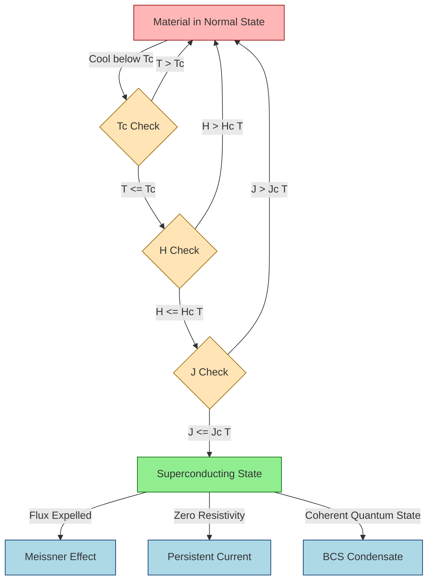
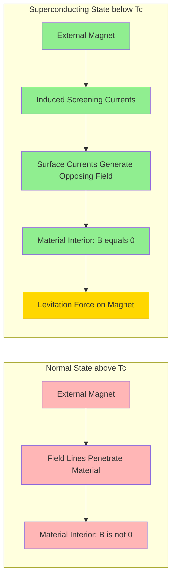
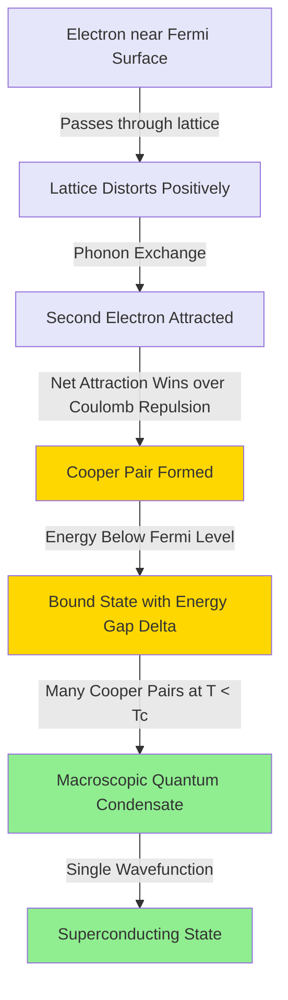
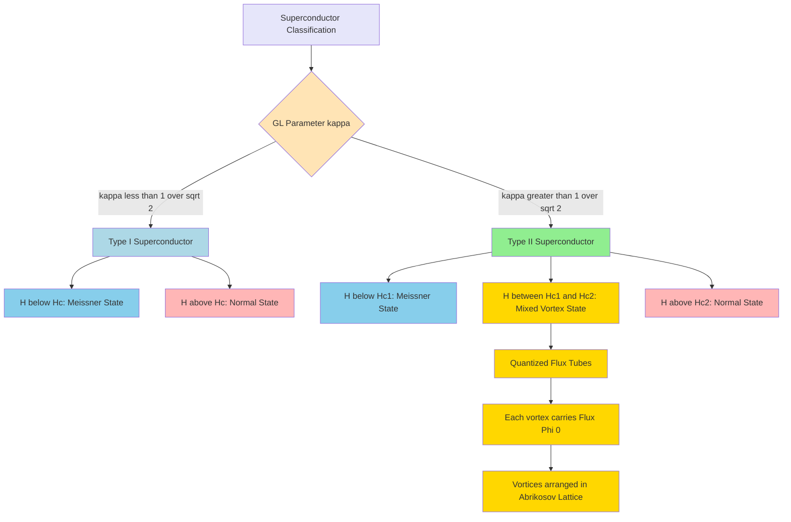
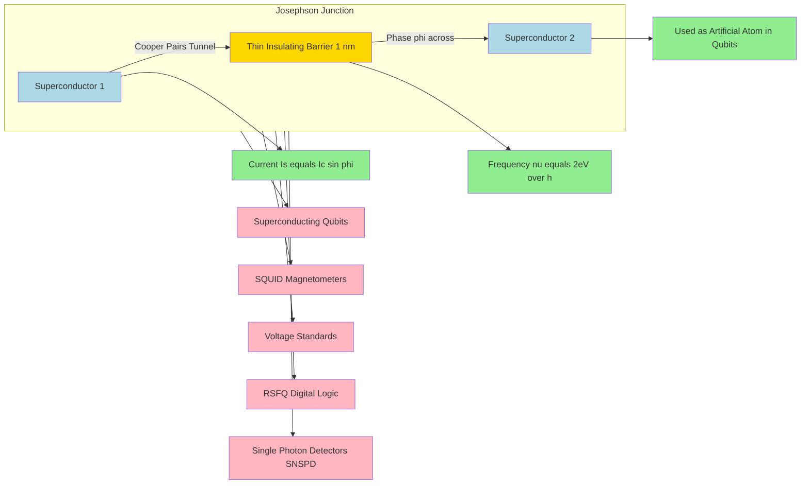

# Superconductivity

<!-- SECTION_1_START -->
# ⚡ Superconductivity — Zero Resistance, Perfect Conduction

## 1.1 Formal Definition (KTU 2024 Syllabus Terminology)

> [!IMPORTANT]
> **Superconductivity** is a quantum mechanical phenomenon in which the **electrical resistivity** of certain materials drops abruptly to **exactly zero** when cooled below a characteristic **critical temperature ($T_c$)**, accompanied by the complete expulsion of magnetic flux from its interior (the **Meissner Effect**).

It is fundamentally **not** just "perfect conductivity" — it is a distinct thermodynamic phase transition into a coherent quantum state described by a single macroscopic wave function.

For KTU Board examinations, the four defining signatures of a superconductor are:

| # | Signature | Mathematical Statement |
|---|-----------|------------------------|
| 1 | Zero DC resistivity | $\rho = 0$ for $T < T_c$ |
| 2 | Perfect diamagnetism (Meissner) | $\mathbf{B}_{inside} = 0$ |
| 3 | Existence of $T_c$ | A material-specific constant |
| 4 | Critical field limit | $H_{applied} \le H_c(T)$ |

> [!NOTE]
> **Historical Tag:** Discovered by **Heike Kamerlingh Onnes** in **1911** in mercury (Hg) at $T_c = 4.2\,\text{K}$. Awarded the **1913 Nobel Prize in Physics**.

## 1.2 The Three Critical Parameters

A superconductor must simultaneously satisfy **three** critical limits. If any one is breached, superconductivity collapses back to the normal state.

$$\boxed{T \le T_c \quad\land\quad H \le H_c(T) \quad\land\quad J \le J_c(T)}$$

- **$T_c$** → Critical Temperature (K)
- **$H_c(T)$** → Critical Magnetic Field (A/m or Tesla)
- **$J_c(T)$** → Critical Current Density (A/m²)

> [!IMPORTANT]
> **Engineering Insight:** All three limits are interdependent. In a real device (e.g., MRI magnet windings), $J_c$ and $H_c$ are often the *practical* bottlenecks, not $T_c$.

## 1.3 Intuitive Analogies

> [!TIP]
> **Analogy 1 — The Frictionless Highway:** Imagine a highway of electrons. In a normal metal, they collide with vibrating atoms and impurities (friction). Below $T_c$, electrons pair up into **Cooper pairs** and move in lockstep through a "slippery" lattice — like a perfectly choreographed dance troupe that never bumps into obstacles.

> [!TIP]
> **Analogy 2 — The Magnetic Mirror:** A superconductor actively *pushes out* magnetic field lines, behaving like a **perfect magnetic mirror**. This is the Meissner effect. A magnet placed above a superconductor will levitate because the expelled flux creates a repulsive image.

> [!TIP]
> **Analogy 3 — The Bose-Einstein Condensate:** Cooper pairs are bosons (integer spin). Below $T_c$, they "condense" into the same quantum ground state — analogous to a crowd of people spontaneously synchronizing their footsteps in a stadium, producing a single, collective rhythm.

## 1.4 Relevance to Information Science (Course GAPHT121)

This is **why** this topic is taught in *Information Science* — not just physics:

- **Superconducting Qubits** — the building blocks of **quantum computers** (IBM, Google) use Josephson junctions as artificial atoms.
- **SQUID Magnetometers** — can detect magnetic fields of $\sim 10^{-15}\,\text{T}$ (used in medical imaging, geology).
- **Single-Photon Detectors (SNSPD)** — for quantum cryptography and optical communication.
- **Rapid Single Flux Quantum (RSFQ) Logic** — digital circuits operating at $\sim 10^{12}$ gate-Hz.

> [!VISUALIZATION CONTROL]
> **Concept:** Resistivity vs Temperature curve showing the superconducting transition
> **GeoGebra / Desmos Input Equations:**
> * $f_1(x) = 0.0001 \cdot (x-4.2) \cdot \text{sign}(x-4.2) + 0.0001$ for $x > 4.2$ (normal metal, residual resistivity)
> * $f_2(x) = 0$ for $x \le 4.2$ (superconducting state)
> **Visual Description:** Student should observe a sharp, vertical drop in resistivity at $T = T_c = 4.2$ K, with $\rho = 0$ for all $T < T_c$. The x-axis is temperature, the y-axis is resistivity.
<!-- SECTION_1_END -->

<!-- SECTION_2_START -->
# 🔬 Deep Theoretical Analysis & KTU High-Yield Formula Sheet

## 2.1 Conditions for the Superconducting State

A material exhibits superconductivity **only** when all three conditions are simultaneously satisfied. This is the **fundamental state diagram** of a superconductor:

$$T \le T_c \quad\land\quad H \le H_c(T) \quad\land\quad J \le J_c(T)$$

- **Temperature Condition:** The lattice thermal vibrations must be low enough to permit phonon-mediated Cooper pairing.
- **Magnetic Field Condition:** An applied field above $H_c$ breaks Cooper pairs via the orbital pair-breaking mechanism.
- **Current Density Condition:** Transport current generates a self-induced magnetic field that can exceed $H_c$ internally.

> [!IMPORTANT]
> **KTU Board Tip:** A common 2-mark question asks *"Is a superconductor a perfect conductor?"* The answer is **NO** — it is a *perfect diamagnet*. A *perfect conductor* would only expel flux if cooled in zero field; a superconductor expels flux *regardless* of the cooling path.

## 2.2 The Meissner Effect (Perfect Diamagnetism)

> [!NOTE]
> **Meissner & Ochsenfeld (1933):** When a material transitions to the superconducting state, the magnetic flux is **expelled from its interior**, regardless of whether the field was applied before or after cooling.

Mathematically:

$$\mathbf{B}_{inside} = \mu_0(\mathbf{H} + \mathbf{M}) = 0 \quad\Rightarrow\quad \mathbf{M} = -\mathbf{H}$$

The magnetic susceptibility is:

$$\chi_m = -1 \quad\text{(perfect diamagnet)}$$

> **Engineering Note:** This is what enables **magnetic levitation** (maglev trains) and frictionless bearings.

## 2.3 The London Equations (Fritz & Heinz London, 1935)

These two equations describe the *macroscopic* electrodynamics of a superconductor and quantitatively explain the Meissner effect.

**London's First Equation** (current-field relationship):

$$\frac{\partial \mathbf{j_s}}{\partial t} = \frac{n_s e^2}{m}\mathbf{E}$$

This implies **infinite conductivity** — once a supercurrent starts, it flows forever without decay (persistent currents have been observed to last > 2.5 years).

**London's Second Equation** (field screening):

$$\nabla^2 \mathbf{B} = \frac{\mathbf{B}}{\lambda_L^2}$$

The solution inside a bulk superconductor shows that $\mathbf{B}$ decays exponentially from the surface:

$$B(x) = B_0 \exp\left(-\frac{x}{\lambda_L}\right)$$

**London Penetration Depth:**

$$\boxed{\lambda_L = \sqrt{\frac{m}{\mu_0 n_s e^2}}}$$

where:
- $m$ → electron mass ($9.11 \times 10^{-31}$ kg)
- $n_s$ → density of superconducting (Cooper pair) electrons (m⁻³)
- $e$ → electron charge ($1.602 \times 10^{-19}$ C)
- $\mu_0$ → vacuum permeability ($4\pi \times 10^{-7}$ H/m)

Typical value for Aluminum: $\lambda_L \approx 50\,\text{nm}$.

## 2.4 Critical Magnetic Field — Empirical Relation

The temperature dependence of the critical magnetic field follows an **empirical parabolic law**:

$$\boxed{H_c(T) = H_c(0)\left[1 - \left(\frac{T}{T_c}\right)^2\right]}$$

where $H_c(0)$ is the critical field at absolute zero.

> **Worked Reading:** At $T = 0$, $H_c = H_c(0)$ (maximum). At $T = T_c$, $H_c = 0$ (no superconductivity). The curve is a downward-opening parabola in the $H$-$T$ plane.

## 2.5 Coherence Length (Pippard)

The **coherence length** $\xi$ is the spatial extent of a Cooper pair. It is the minimum distance over which the superconducting order parameter can vary without energetically breaking the pairing.

$$\xi_0 = \frac{\hbar v_F}{\pi \Delta(0)}$$

where $\Delta(0)$ is the BCS energy gap at $T = 0$.

**The Ginzburg-Landau parameter $\kappa$** classifies superconductors:

$$\kappa = \frac{\lambda_L}{\xi}$$

- $\kappa < 1/\sqrt{2}$ → **Type I** superconductor
- $\kappa > 1/\sqrt{2}$ → **Type II** superconductor

## 2.6 Type I vs Type II Superconductors

| Property | Type I | Type II |
|----------|--------|---------|
| Critical field | Single $H_c$ | Two fields: $H_{c1} < H_{c2}$ |
| $\kappa$ value | $\kappa < 1/\sqrt{2}$ | $\kappa > 1/\sqrt{2}$ |
| Magnetic response | Complete flux expulsion (Meissner) | Flux expulsion then *vortex penetration* |
| State between $H_{c1}$ and $H_{c2}$ | Not applicable | **Mixed / Vortex state** |
| Examples | Pb, Hg, Sn, Al | Nb, NbTi, Nb₃Sn, YBCO |
| Engineering use | Limited (low $H_c$) | **Extensive** (high $H_{c2}$, can carry huge $J_c$) |

> **Information Science Tie-in:** **Type II superconductors with high $H_{c2}$** are the workhorses of quantum computing (Niobium, $T_c = 9.2$ K) and high-field MRI magnets (NbTi).

## 2.7 BCS Theory (Bardeen–Cooper–Schrieffer, 1957)

> [!NOTE]
> **The 1972 Nobel Prize in Physics** was awarded jointly to Bardeen, Cooper, and Schrieffer for this theory — the most successful microscopic theory of condensed matter.

**Core Idea:** Below $T_c$, electrons near the Fermi surface form bound pairs called **Cooper pairs** via a virtual phonon exchange (lattice distortion). This pairing opens an **energy gap** at the Fermi level.

**Key Predictions:**

1. **Energy Gap at $T = 0$:**
$$\Delta(0) \approx 1.764\,k_B T_c$$

2. **Critical Temperature:**
$$k_B T_c = 1.14\,\hbar\omega_D \exp\left(-\frac{1}{N(0)V}\right)$$

where:
- $\omega_D$ → Debye frequency
- $N(0)$ → Density of states at Fermi level
- $V$ → Effective electron-phonon coupling

3. **Isotope Effect:**
$$T_c \propto M^{-\alpha},\quad \alpha \approx 0.5$$
where $M$ is the ionic mass. Lighter isotopes → higher $T_c$. (Directly evidences phonon-mediated pairing.)

> **Engineering Utility:** BCS theory guides the search for higher-$T_c$ materials by optimizing phonon coupling and electronic density of states.

## 2.8 The Josephson Effect (1962) — The Information Science Superstar

A **Josephson junction** is two superconductors separated by a thin insulating barrier ($\sim 1$ nm). Brian D. Josephson predicted quantum tunneling of Cooper pairs through the barrier — awarded the **1973 Nobel Prize**.

**DC Josephson Effect (zero voltage):**
$$I_s = I_c \sin(\phi)$$

where $I_c$ is the critical current and $\phi$ is the phase difference across the junction.

**AC Josephson Effect (with applied voltage $V$):**
$$\frac{d\phi}{dt} = \frac{2eV}{\hbar} \quad\Rightarrow\quad \phi(t) = \phi_0 + \frac{2eV}{\hbar}t$$

The current oscillates at frequency:
$$\nu = \frac{2eV}{h}$$

> [!IMPORTANT]
> **Information Science Relevance:** The Josephson effect is the **physical basis of superconducting qubits (transmon, flux qubit)**. The energy levels of the junction — quantized from the cosine potential — are used as the $\vert 0 \rangle$ and $\vert 1 \rangle$ states of a quantum bit. This is **the** most important concept linking superconductivity to your course name: *Physics for Information Science*.

## 2.9 KTU Formula Cheat Sheet

| Formula | Expression | Use Case |
|---------|------------|----------|
| Critical field | $H_c(T) = H_c(0)\left[1 - (T/T_c)^2\right]$ | Finding $H_c$ at any $T$ |
| London penetration depth | $\lambda_L = \sqrt{m/(\mu_0 n_s e^2)}$ | Field decay into surface |
| Coherence length | $\xi_0 = \hbar v_F/(\pi \Delta(0))$ | Cooper pair size |
| GL parameter | $\kappa = \lambda_L/\xi$ | Type I vs II classification |
| BCS energy gap | $\Delta(0) = 1.764\,k_B T_c$ | Relates gap to $T_c$ |
| Isotope effect | $T_c \propto M^{-1/2}$ | Confirms phonon mechanism |
| DC Josephson | $I_s = I_c \sin(\phi)$ | Phase-current relation |
| AC Josephson frequency | $\nu = 2eV/h$ | Voltage-to-frequency standard |
| Meissner condition | $B_{inside} = 0$ | Defines perfect diamagnetism |
| Coexistence condition | $T \le T_c \;\land\; H \le H_c \;\land\; J \le J_c$ | Stability of SC state |

## 2.10 High-Temperature Superconductors (HTSC)

| Material | $T_c$ (K) | Year Discovered | Type |
|----------|-----------|------------------|------|
| Hg (Mercury) | 4.2 | 1911 | Type I |
| Nb (Niobium) | 9.2 | 1930 | Type II |
| Nb₃Sn | 18.3 | 1954 | Type II |
| YBa₂Cu₃O₇ (YBCO) | 92 | 1987 | Type II HTSC |
| Bi₂Sr₂Ca₂Cu₃O₁₀ (BSCCO) | 110 | 1988 | Type II HTSC |
| HgBa₂Ca₂Cu₃O₈ | 133 | 1993 | Type II HTSC (record holder for bulk) |

> [!TIP]
> **Why is HTSC important for Information Science?** YBCO thin films are used in **microwave filters** for cellular base stations (lower noise) and in **fault-tolerant qubits** (longer coherence times than aluminum).

## 2.11 Real-World Engineering Applications

1. **MRI Medical Imaging** — NbTi coils at 4.2 K (liquid He) produce 1.5–7 T fields. Market: ~\$7 billion/year.
2. **Maglev Trains** — Japan SCMaglev uses YBCO bulks for levitation.
3. **Particle Accelerators (CERN LHC)** — 1232 NbTi dipole magnets cooled at 1.9 K.
4. **Quantum Computers (IBM, Google)** — Transmon qubits made of Al/AlOx/Al Josephson junctions.
5. **SQUID Sensors** — Used in magnetoencephalography (MEG) for brain imaging.
6. **Power Cables** — Lossless transmission in urban grids (e.g., Essen, Germany project).
7. **Single-Photon Detectors (SNSPD)** — NbN nanowires for quantum key distribution (QKD).
<!-- SECTION_2_END -->

<!-- SECTION_3_START -->
# 🧮 Step-by-Step Derivations & Numerical Examples

## 3.1 Derivation: Magnetic Field Decay (London Second Equation)

**Starting Point:** London's first equation (accelerated supercurrent response to E):

$$\frac{\partial \mathbf{j_s}}{\partial t} = \frac{n_s e^2}{m}\mathbf{E} \quad (1)$$

**Step 1:** Apply curl operator to both sides:

$$\frac{\partial}{\partial t}(\nabla \times \mathbf{j_s}) = \frac{n_s e^2}{m}(\nabla \times \mathbf{E}) \quad (2)$$

**Step 2:** Use Maxwell–Faraday law: $\nabla \times \mathbf{E} = -\partial \mathbf{B}/\partial t$:

$$\frac{\partial}{\partial t}(\nabla \times \mathbf{j_s}) = -\frac{n_s e^2}{m}\frac{\partial \mathbf{B}}{\partial t} \quad (3)$$

**Step 3:** Use Maxwell–Ampere law: $\nabla \times \mathbf{B} = \mu_0 \mathbf{j_s}$, so $\nabla \times \mathbf{j_s} = (1/\mu_0)\nabla \times (\nabla \times \mathbf{B})$.

**Step 4:** For a 1D semi-infinite superconductor (surface at $x=0$, bulk at $x>0$), this simplifies to:

$$\frac{\partial^2 B}{\partial x^2} = \frac{B}{\lambda_L^2} \quad (4)$$

where:

$$\boxed{\lambda_L = \sqrt{\frac{m}{\mu_0 n_s e^2}}}$$

**Step 5:** Solve with boundary condition $B(0) = B_0$:

$$B(x) = B_0 \exp\left(-\frac{x}{\lambda_L}\right) \quad (5)$$

**Interpretation:** Magnetic field is confined to a thin surface layer of thickness $\sim \lambda_L$ ($\sim 50$ nm typically). The interior is flux-free — the **Meissner effect**.

## 3.2 Derivation: BCS Energy Gap Relation

**Step 1:** At $T = 0$, the energy gap is given by the self-consistent BCS equation:

$$\Delta(0) = \frac{1}{N(0)V}\int_0^{\hbar\omega_D}\frac{\Delta(0)}{\sqrt{\epsilon^2 + \Delta(0)^2}}\,N(0)\,d\epsilon \quad (1)$$

**Step 2:** Simplify: $\Delta(0) = (1/V)\int_0^{\hbar\omega_D}\Delta(0)/\sqrt{\epsilon^2+\Delta(0)^2}\,d\epsilon$.

**Step 3:** Substitute $\epsilon = \Delta(0)\tan\theta$, so $d\epsilon = \Delta(0)\sec^2\theta\,d\theta$ and $\sqrt{\epsilon^2+\Delta^2} = \Delta\sec\theta$.

**Step 4:** Limits change: $\epsilon = 0 \to \theta = 0$, $\epsilon = \hbar\omega_D \to \theta = \arctan(\hbar\omega_D/\Delta)$.

**Step 5:** The integral reduces to:
$$1 = \frac{1}{N(0)V}\sinh^{-1}\left(\frac{\hbar\omega_D}{\Delta(0)}\right) \approx \frac{1}{N(0)V}\ln\left(\frac{2\hbar\omega_D}{\Delta(0)}\right)$$

(since $\hbar\omega_D \gg \Delta$).

**Step 6:** Solve for $\Delta(0)$:

$$\boxed{\Delta(0) = 2\hbar\omega_D \exp\left(-\frac{1}{N(0)V}\right)}$$

**Step 7:** Using $k_B T_c = 1.14\,\hbar\omega_D\exp(-1/(N(0)V))$, the ratio:

$$\boxed{\frac{\Delta(0)}{k_B T_c} = \frac{2}{1.14} \approx 1.764}$$

This is the **BCS universal ratio** — experimentally verified in hundreds of conventional superconductors.

## 3.3 Numerical Example 1: Critical Field at Given Temperature

**Problem (KTU 14-Mark style):** For Lead (Pb), $T_c = 7.18$ K and $H_c(0) = 6.5 \times 10^4$ A/m. Calculate $H_c$ at $T = 4.2$ K.

**Solution:**

**Step 1 — Identify knowns:**

$T_c = 7.18$ K, $H_c(0) = 6.5 \times 10^4$ A/m, $T = 4.2$ K.

**Step 2 — Apply the empirical formula:**

$$H_c(T) = H_c(0)\left[1 - \left(\frac{T}{T_c}\right)^2\right]$$

**Step 3 — Compute the ratio:**

$$\frac{T}{T_c} = \frac{4.2}{7.18} = 0.5850$$

**Step 4 — Square the ratio:**

$$\left(\frac{T}{T_c}\right)^2 = (0.5850)^2 = 0.3422$$

**Step 5 — Compute the bracket:**

$$1 - 0.3422 = 0.6578$$

**Step 6 — Multiply by $H_c(0)$:**

$$H_c(4.2\text{ K}) = 6.5 \times 10^4 \times 0.6578 = 4.276 \times 10^4\,\text{A/m}$$

$$\boxed{H_c(4.2\,\text{K}) \approx 4.28 \times 10^4\,\text{A/m} = 42.8\,\text{kA/m}}$$

**Step 7 — Convert to Tesla (if needed):**

$B_c = \mu_0 H_c = (4\pi \times 10^{-7})(4.28 \times 10^4) = 0.0538$ T.

**Valuation Key (KTU Style):**
- [Stating given values and formula: 2 Marks]
- [Correctly computing $(T/T_c)^2$: 2 Marks]
- [Final numerical answer with units: 1 Mark]

## 3.4 Numerical Example 2: BCS Energy Gap Calculation

**Problem:** Calculate the BCS energy gap at $T = 0$ for Tin (Sn), given $T_c = 3.72$ K. Boltzmann constant $k_B = 1.38 \times 10^{-23}$ J/K.

**Solution:**

**Step 1 — Recall the universal BCS ratio:**

$$\Delta(0) = 1.764\,k_B T_c$$

**Step 2 — Multiply:**

$$\Delta(0) = 1.764 \times (1.38 \times 10^{-23}\,\text{J/K}) \times (3.72\,\text{K})$$

**Step 3 — Compute step by step:**

$1.764 \times 1.38 = 2.4343$

$2.4343 \times 3.72 = 9.0556$

So $\Delta(0) = 9.056 \times 10^{-23}$ J.

**Step 4 — Convert to more convenient units (eV):**

$$1\,\text{eV} = 1.602 \times 10^{-19}\,\text{J}$$

$$\Delta(0) = \frac{9.056 \times 10^{-23}}{1.602 \times 10^{-19}} = 5.65 \times 10^{-4}\,\text{eV} = 0.565\,\text{meV}$$

$$\boxed{\Delta(0) \approx 0.565\,\text{meV}}$$

## 3.5 Numerical Example 3: London Penetration Depth

**Problem:** For Mercury (Hg), the density of superconducting electrons is $n_s = 7.4 \times 10^{28}$ m⁻³ at $T = 0$. Calculate the London penetration depth. (Given: $m = 9.11 \times 10^{-31}$ kg, $e = 1.602 \times 10^{-19}$ C, $\mu_0 = 4\pi \times 10^{-7}$ H/m.)

**Solution:**

**Step 1 — Write the formula:**

$$\lambda_L = \sqrt{\frac{m}{\mu_0 n_s e^2}}$$

**Step 2 — Compute the denominator $\mu_0 n_s e^2$:**

$\mu_0 = 4\pi \times 10^{-7} = 1.2566 \times 10^{-6}$ H/m

$e^2 = (1.602 \times 10^{-19})^2 = 2.566 \times 10^{-38}$ C²

$n_s e^2 = 7.4 \times 10^{28} \times 2.566 \times 10^{-38} = 1.899 \times 10^{-9}$ (C²/m³)

$\mu_0 n_s e^2 = 1.2566 \times 10^{-6} \times 1.899 \times 10^{-9} = 2.386 \times 10^{-15}$

**Step 3 — Compute the ratio $m / (\mu_0 n_s e^2)$:**

$$= \frac{9.11 \times 10^{-31}}{2.386 \times 10^{-15}} = 3.818 \times 10^{-16}$$

**Step 4 — Take the square root:**

$$\lambda_L = \sqrt{3.818 \times 10^{-16}} = 6.18 \times 10^{-8}\,\text{m} = 61.8\,\text{nm}$$

$$\boxed{\lambda_L \approx 62\,\text{nm}}$$

**Interpretation:** The magnetic field penetrates only $\sim 62$ nm into mercury before being fully screened — the interior is completely flux-free.

## 3.6 Numerical Example 4: AC Josephson Frequency

**Problem:** A Josephson junction is biased at $V = 1\,\mu\text{V}$. Compute the oscillation frequency of the Cooper pair tunneling current.

**Solution:**

**Step 1 — Apply the AC Josephson relation:**

$$\nu = \frac{2eV}{h}$$

**Step 2 — Plug in values:**

$2e = 2 \times 1.602 \times 10^{-19}$ C $= 3.204 \times 10^{-19}$ C

$h = 6.626 \times 10^{-34}$ J·s

$V = 1 \times 10^{-6}$ V

**Step 3 — Compute:**

$$\nu = \frac{3.204 \times 10^{-19} \times 1 \times 10^{-6}}{6.626 \times 10^{-34}}$$

$$\nu = \frac{3.204 \times 10^{-25}}{6.626 \times 10^{-34}} = 4.835 \times 10^{8}\,\text{Hz}$$

$$\boxed{\nu \approx 483.6\,\text{MHz}}$$

**This is the Josephson voltage-to-frequency conversion used to define the SI volt** (the standard volt is reproducible to ~10 parts per billion via the Josephson effect).

## 3.7 Numerical Example 5: Cooper Pair Size (Coherence Length)

**Problem:** For Aluminum, Fermi velocity $v_F = 1.6 \times 10^6$ m/s and BCS gap $\Delta(0) = 1.7 \times 10^{-4}$ eV. Compute the Pippard coherence length.

**Solution:**

**Step 1 — Convert $\Delta(0)$ to Joules:**

$\Delta(0) = 1.7 \times 10^{-4} \times 1.602 \times 10^{-19} = 2.723 \times 10^{-23}$ J

**Step 2 — Apply the formula:**

$$\xi_0 = \frac{\hbar v_F}{\pi \Delta(0)}$$

**Step 3 — Compute the numerator:**

$\hbar = 1.055 \times 10^{-34}$ J·s

$\hbar v_F = 1.055 \times 10^{-34} \times 1.6 \times 10^6 = 1.688 \times 10^{-28}$ J·m

**Step 4 — Compute the denominator:**

$\pi \Delta(0) = 3.1416 \times 2.723 \times 10^{-23} = 8.554 \times 10^{-23}$ J

**Step 5 — Divide:**

$$\xi_0 = \frac{1.688 \times 10^{-28}}{8.554 \times 10^{-23}} = 1.973 \times 10^{-6}\,\text{m} = 1.97\,\mu\text{m}$$

$$\boxed{\xi_0 \approx 2\,\mu\text{m}}$$

**Interpretation:** A single Cooper pair in Aluminum spans about 2 micrometers — that's $\sim 4000$ atomic spacings! This "long-range" pairing is why Cooper pairs are highly non-local objects.
<!-- SECTION_3_END -->

<!-- SECTION_4_START -->
# 🗺️ Structural Diagrams & Schematics

## 4.1 Superconducting State Stability Diagram

## 4.2 Meissner Effect — Flux Expulsion Architecture

## 4.3 BCS Theory — Cooper Pair Formation Flow

## 4.4 Type I vs Type II Superconductor — Magnetic Phase Topology

## 4.5 Josephson Junction — Information Science Application

## 4.6 Applications to Information Science (Block Architecture)

```mermaid
graph TD
    SC[Superconductivity] --> A1[Quantum Computing]
    SC --> A2[Sensing]
    SC --> A3[Communications]
    SC --> A4[Classical Computing]
    
    A1 --> A1a[Transmon Qubits]
    A1 --> A1b[Flux Qubits]
    A1 --> A1c[Topological Qubits]
    
    A2 --> A2a[SQUID MRI]
    A2 --> A2b[Magnetoencephalography]
    A2 --> A2c[Geological Surveys]
    
    A3 --> A3a[Quantum Cryptography]
    A3 --> A3b[SNSPD Photon Counters]
    A3 --> A3c[Low Noise Microwave Filters]
    
    A4 --> A4a[RSFQ Logic Gates]
    A4 --> A4b[SFQ ADC Converters]
    A4 --> A4c[Interconnects with Zero Loss]
    
    style SC fill:#FFD700
    style A1 fill:#ADD8E6
    style A2 fill:#90EE90
    style A3 fill:#FFB6C1
    style A4 fill:#E6E6FA
    style A1a fill:#FFFFFF
    style A1b fill:#FFFFFF
    style A1c fill:#FFFFFF
    style A2a fill:#FFFFFF
    style A2b fill:#FFFFFF
    style A2c fill:#FFFFFF
    style A3a fill:#FFFFFF
    style A3b fill:#FFFFFF
    style A3c fill:#FFFFFF
    style A4a fill:#FFFFFF
    style A4b fill:#FFFFFF
    style A4c fill:#FFFFFF
```

<!-- SECTION_4_END -->

<!-- SECTION_5_START -->
# 📚 KTU 2024 Scheme Examination Question Bank & Topic Recap

## Part A — Short Answer Questions (3 Marks Each)

### Question 1 [KTU University Exam — July 2023]
**Define superconductivity. Mention any two characteristic properties of superconductors.**

**Model Answer (Valuation-Ready):**

> **Definition:** Superconductivity is the phenomenon in which the electrical resistivity of certain materials drops to exactly zero when cooled below a characteristic critical temperature $T_c$.

**Two characteristic properties:**

1. **Zero electrical resistivity:** Below $T_c$, the material offers no resistance to DC current flow. Persistent currents have been observed to flow undiminished for over 2.5 years.

2. **Meissner Effect (Perfect Diamagnetism):** The magnetic flux is completely expelled from the interior of the superconductor. The magnetic susceptibility $\chi = -1$, making it a perfect diamagnet.

**[Alternative answers accepted:** (a) Existence of a critical magnetic field $H_c$, (b) Specific heat anomaly at $T_c$ (jump), (c) Energy gap of $2\Delta$ in the electronic density of states.]

**[Valuation Key: 1 Mark for definition, 1 Mark each for two properties = 3 Marks]**

---

### Question 2 [KTU University Exam — Dec 2022]
**Differentiate between Type I and Type II superconductors.**

**Model Answer:**

| Property | Type I | Type II |
|----------|--------|---------|
| Critical field behavior | Single critical field $H_c$ | Two critical fields: $H_{c1}$ and $H_{c2}$ |
| GL parameter | $\kappa < 1/\sqrt{2}$ | $\kappa > 1/\sqrt{2}$ |
| Magnetic response | Complete flux expulsion until $H_c$, then sudden normal | Flux expulsion until $H_{c1}$, mixed (vortex) state $H_{c1} < H < H_{c2}$, normal above $H_{c2}$ |
| Examples | Lead (Pb), Tin (Sn), Mercury (Hg) | Niobium (Nb), NbTi, YBCO |
| Practical applications | Limited (low $H_c$) | Extensive (high $H_{c2}$, high $J_c$) |

**[Valuation Key: 1 Mark for any 2 differentiating points with examples = 3 Marks]**

---

## Part B — Full 14-Mark Questions (Module Internal Choice Format)

### Question A (14 Marks) [KTU University Exam — July 2024]

#### (a) Derive the London penetration depth and explain how it explains the Meissner effect. (7 Marks) [CO1, Apply]

**Model Solution:**

**Step 1: State London's First Equation (1 Mark):**

$$\frac{\partial \mathbf{j_s}}{\partial t} = \frac{n_s e^2}{m}\mathbf{E}$$

This says supercurrent accelerates in response to an electric field, implying $\rho = 0$.

**Step 2: Apply curl on both sides (1 Mark):**

$$\frac{\partial}{\partial t}(\nabla \times \mathbf{j_s}) = \frac{n_s e^2}{m}(\nabla \times \mathbf{E}) = -\frac{n_s e^2}{m}\frac{\partial \mathbf{B}}{\partial t}$$

**Step 3: Use Maxwell–Ampere law $\nabla \times \mathbf{B} = \mu_0 \mathbf{j_s}$ (1 Mark):**

For a semi-infinite superconductor (1D), the curl operation yields:

$$\frac{\partial^2 B}{\partial x^2} = \frac{B}{\lambda_L^2}$$

**Step 4: Define the London penetration depth (2 Marks):**

$$\boxed{\lambda_L = \sqrt{\frac{m}{\mu_0 n_s e^2}}}$$

**Step 5: Solve the differential equation with $B(0) = B_0$ (1 Mark):**

$$B(x) = B_0 \exp\left(-\frac{x}{\lambda_L}\right)$$

**Step 6: Explain Meissner effect (1 Mark):** The field decays exponentially with characteristic length $\lambda_L \sim 50$ nm. For bulk samples (size $\gg \lambda_L$), the interior field is essentially zero — this is the Meissner effect.

**[Valuation Key: Stating equations: 3 Marks, Derivation steps: 2 Marks, Final expression and explanation: 2 Marks = 7 Marks]**

#### (b) A superconducting material has $T_c = 9.2$ K and $H_c(0) = 1.6 \times 10^5$ A/m. Calculate the critical field at $T = 5$ K. (7 Marks) [CO2, Apply]

**Model Solution:**

**Step 1: Identify given values (1 Mark):**

$T_c = 9.2$ K, $H_c(0) = 1.6 \times 10^5$ A/m, $T = 5$ K.

**Step 2: Write the empirical formula (1 Mark):**

$$H_c(T) = H_c(0)\left[1 - \left(\frac{T}{T_c}\right)^2\right]$$

**Step 3: Compute $T/T_c$ (1 Mark):**

$$\frac{T}{T_c} = \frac{5}{9.2} = 0.5435$$

**Step 4: Square the ratio (1 Mark):**

$$\left(\frac{T}{T_c}\right)^2 = (0.5435)^2 = 0.2954$$

**Step 5: Compute the bracket (1 Mark):**

$$1 - 0.2954 = 0.7046$$

**Step 6: Final calculation (1 Mark):**

$$H_c(5\,\text{K}) = 1.6 \times 10^5 \times 0.7046 = 1.127 \times 10^5\,\text{A/m}$$

**Step 7: State final answer with units (1 Mark):**

$$\boxed{H_c(5\,\text{K}) \approx 1.13 \times 10^5\,\text{A/m} = 113\,\text{kA/m}}$$

**[Valuation Key: Formula statement: 1 Mark, Each calculation step: 1 Mark × 5 = 5 Marks, Final answer: 1 Mark = 7 Marks]**

---

### Question B (14 Marks) [KTU University Exam — Dec 2023] (Alternative Choice)

#### (a) Explain the BCS theory of superconductivity. Derive the universal ratio $\Delta(0)/k_B T_c = 1.764$. (7 Marks) [CO1, Understand + Apply]

**Model Solution:**

**Step 1: Introduction to BCS (1 Mark):** Bardeen, Cooper, and Schrieffer (1957) proposed that superconductivity arises from the formation of **Cooper pairs** — bound pairs of electrons near the Fermi surface, mediated by **virtual phonon exchange**.

**Step 2: Mechanism (2 Marks):**
- An electron moving through the lattice attracts positive ions, creating a region of local positive charge.
- A second electron is attracted to this positive region.
- The net effect is an effective *attraction* between the two electrons, overcoming their Coulomb repulsion.
- The pair is bound with an energy $2\Delta$ below the Fermi level.

**Step 3: BCS self-consistent equation (1 Mark):**

$$\Delta(0) = \frac{1}{N(0)V}\int_0^{\hbar\omega_D}\frac{\Delta(0)}{\sqrt{\epsilon^2 + \Delta(0)^2}}\,N(0)\,d\epsilon$$

**Step 4: Simplification using $\hbar\omega_D \gg \Delta$ (1 Mark):**

$$1 = \frac{1}{N(0)V}\ln\left(\frac{2\hbar\omega_D}{\Delta(0)}\right)$$

**Step 5: Solve for $\Delta(0)$ (1 Mark):**

$$\Delta(0) = 2\hbar\omega_D\exp\left(-\frac{1}{N(0)V}\right)$$

**Step 6: Use the BCS $T_c$ relation $k_B T_c = 1.14\,\hbar\omega_D\exp(-1/(N(0)V))$ and divide (1 Mark):**

$$\frac{\Delta(0)}{k_B T_c} = \frac{2}{1.14} = 1.764$$

$$\boxed{\frac{\Delta(0)}{k_B T_c} = 1.764}$$

**[Valuation Key: Mechanism explanation: 3 Marks, Self-consistent equation: 1 Mark, Derivation steps: 2 Marks, Final ratio: 1 Mark = 7 Marks]**

#### (b) Describe the Josephson effect (both DC and AC). A Josephson junction is biased at 2 µV. Find the frequency of oscillation. (7 Marks) [CO2, Understand + Apply]

**Model Solution:**

**Step 1: Define Josephson junction (1 Mark):** A Josephson junction is two superconductors separated by a thin insulating layer ($\sim 1$ nm) through which Cooper pairs can quantum-mechanically tunnel.

**Step 2: DC Josephson Effect (1 Mark):** With zero voltage across the junction:

$$I_s = I_c \sin(\phi)$$

where $I_c$ is the critical current and $\phi$ is the phase difference across the junction. A supercurrent flows due to tunneling of Cooper pairs.

**Step 3: AC Josephson Effect (1 Mark):** When a constant voltage $V$ is applied:

$$\frac{d\phi}{dt} = \frac{2eV}{\hbar} \quad\Rightarrow\quad \phi(t) = \phi_0 + \frac{2eV}{\hbar}t$$

The supercurrent oscillates at frequency:

$$\nu = \frac{2eV}{h}$$

**Step 4: Significance (1 Mark):** The AC Josephson effect provides a precise voltage-to-frequency conversion and is the basis of the **SI volt standard** and **superconducting qubits**.

**Step 5: Numerical calculation (2 Marks):** For $V = 2\,\mu\text{V} = 2 \times 10^{-6}$ V:

$$\nu = \frac{2 \times 1.602 \times 10^{-19} \times 2 \times 10^{-6}}{6.626 \times 10^{-34}}$$

$$\nu = \frac{6.408 \times 10^{-25}}{6.626 \times 10^{-34}} = 9.67 \times 10^{8}\,\text{Hz}$$

**Step 6: Final answer (1 Mark):**

$$\boxed{\nu \approx 967\,\text{MHz}}$$

**[Valuation Key: DC effect formula: 1 Mark, AC effect formula: 1 Mark, Physical significance: 1 Mark, Numerical substitution: 2 Marks, Final answer with units: 1 Mark, Other steps: 1 Mark = 7 Marks]**

---

> [!WARNING]
> **⚠️ KTU Examiner's Common Pitfall Callout:**
> 
> 1. **Do NOT confuse "perfect conductor" with "superconductor."** A perfect conductor only maintains the flux state at the time of cooling. A superconductor *actively expels* flux below $T_c$ regardless of the cooling path. This distinction is a **favorite 2-mark question**.
> 
> 2. **Always state the three critical parameters** ($T_c$, $H_c$, $J_c$) when describing conditions for superconductivity. Forgetting any one will cost you 1 mark.
> 
> 3. **When calculating $H_c(T)$,** students often forget to *square* $(T/T_c)$. Mark deduction: 1 mark.
> 
> 4. **BCS energy gap is $\Delta(0)$ (not $2\Delta$)** at $T = 0$. The total gap in the excitation spectrum is $2\Delta$.
> 
> 5. **Josephson frequency formula uses $2e$ (Cooper pair charge)**, not $e$. A very common error: writing $\nu = eV/h$ instead of $\nu = 2eV/h$.
> 
> 6. **Type I vs Type II confusion:** Type II has **TWO** critical fields $H_{c1}$ and $H_{c2}$, not one. Mixed state is a unique feature of Type II.
> 
> 7. **For 14-mark questions,** the examiner follows a strict step-marker scheme. Skipping algebraic steps costs 0.5–1 mark per step. **Show every calculation explicitly.**

---

## Topic Recap & Important Things to Remember

> [!TIP]
> **Quick Revision Checklist — Pin this on your wall before the exam!**

- **Definition:** Superconductivity = zero resistivity + complete flux expulsion (Meissner effect) below $T_c$.
- **Discoverer:** Heike Kamerlingh Onnes (1911), Mercury, $T_c = 4.2$ K. Nobel 1913.
- **Coexistence Condition:** $T \le T_c$ **AND** $H \le H_c(T)$ **AND** $J \le J_c(T)$.
- **Meissner Effect:** $\mathbf{B}_{inside} = 0$, $\chi = -1$ (perfect diamagnet) — distinct from "perfect conductor."
- **Critical Field Formula:** $H_c(T) = H_c(0)[1 - (T/T_c)^2]$ — parabolic in $T$.
- **London Penetration Depth:** $\lambda_L = \sqrt{m/(\mu_0 n_s e^2)} \sim 50$ nm. Field decays as $\exp(-x/\lambda_L)$.
- **Coherence Length:** $\xi_0 = \hbar v_F/(\pi \Delta(0))$ — Cooper pair size.
- **GL Parameter:** $\kappa = \lambda_L/\xi$. **$< 1/\sqrt{2}$ → Type I, $> 1/\sqrt{2}$ → Type II.**
- **BCS Theory:** Phonon-mediated Cooper pairs. Energy gap $\Delta(0) = 1.764\,k_B T_c$ (universal).
- **Isotope Effect:** $T_c \propto M^{-1/2}$ — confirms phonon mechanism.
- **Type I:** Soft superconductors (Pb, Sn, Hg), single $H_c$, complete flux expulsion.
- **Type II:** Hard superconductors (Nb, NbTi, YBCO), two fields $H_{c1}, H_{c2}$, mixed/vortex state in between.
- **Josephson Effect:** $I_s = I_c \sin\phi$ (DC), $\nu = 2eV/h$ (AC). Foundation of superconducting qubits.
- **HTSC Record:** HgBa₂Ca₂Cu₃O₈ at 133 K (above liquid nitrogen temperature 77 K — a critical engineering milestone).
- **Information Science Apps:** Qubits, SQUIDs, SNSPDs, RSFQ logic, low-noise microwave filters.
- **Persistent currents:** Observed to flow for years without measurable decay — direct proof of $\rho = 0$.
- **SI Volt Standard:** Maintained worldwide using the AC Josephson effect.
- **Engineering Materials:** NbTi (MRI, LHC), Nb₃Sn (high-field), YBCO (power cables, fault-current limiters).
- **Cooper Pair Charge:** $2e$ (always use this in Josephson equations).
- **Energy Gap:** Single-particle excitations require energy $\ge 2\Delta$ to break a Cooper pair.
- **Vortex State (Type II):** Quantized flux $\Phi_0 = h/(2e) = 2.068 \times 10^{-15}$ Wb per vortex; vortices form Abrikosov lattice.
- **Perfect conductor vs. superconductor:** Perfect conductor = frozen-in field; superconductor = expelled field. The latter is the correct physical state.
- **SI Fundamental Constants to memorize:** $h = 6.626 \times 10^{-34}$ J·s, $\hbar = 1.055 \times 10^{-34}$ J·s, $e = 1.602 \times 10^{-19}$ C, $\mu_0 = 4\pi \times 10^{-7}$ H/m, $k_B = 1.38 \times 10^{-23}$ J/K.

> **Final Exam Mantra:** "TC, Hc, Jc — all three must be satisfied. If the field is expelled, it's the Meissner effect. If it's not, it's a perfect conductor at best. Cooper pairs are bosons. The Josephson effect makes qubits possible. BCS gives us the 1.764 ratio. End of story."
<!-- SECTION_5_END -->
