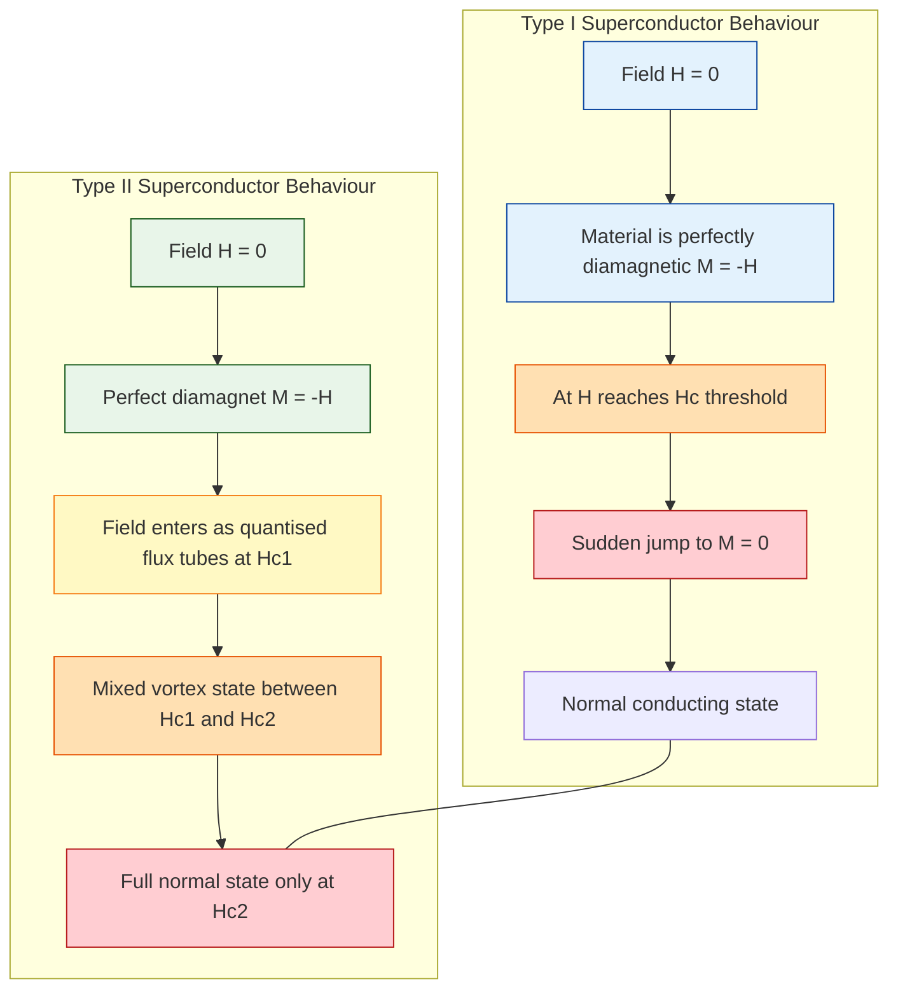
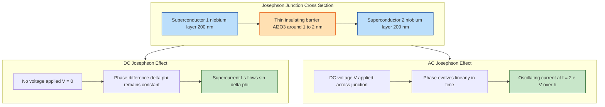
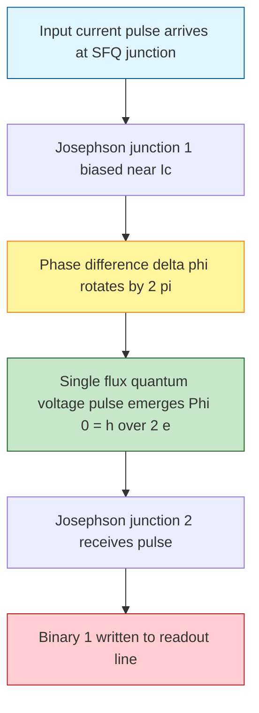
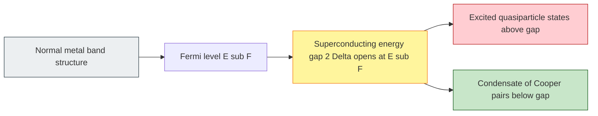

# Superconductivity

<!-- SECTION_1_START -->
# Superconductivity — Core Definition & Intuitive Overview

## 1.1 Formal KTU 2024 Definition

> [!IMPORTANT]
> **Superconductivity** is a quantum mechanical phenomenon in which the electrical resistivity of certain materials drops abruptly to **exactly zero** when cooled below a characteristic critical temperature $T_c$. The material simultaneously expels all magnetic flux from its interior, exhibiting **perfect diamagnetism** (the Meissner Effect).

In the KTU 2024 syllabus framework (GAPHT121 — Physics for Information Science), superconductivity is positioned as a *direct extension of the free electron theory of metals* where a new collective quantum state — the **Cooper pair condensate** — replaces ordinary single-electron conduction.

| Property | Normal Conductor | Superconductor |
| :--- | :--- | :--- |
| Resistivity $\rho$ | Finite ($\sim 10^{-8}$ to $10^{-6}\ \Omega\cdot m$) | Exactly **zero** |
| Magnetic behaviour | Allows field penetration | **Expels** field (Meissner) |
| Carrier type | Independent electrons | **Cooper pairs** (bosonic) |
| Operating temp | Any | Below $T_c$ only |

## 1.2 Intuition — A Simple Real-World Analogy

Imagine a perfectly smooth, frictionless ice rink:

* A **normal metal** is like a regular street — electrons (skaters) constantly bump into atoms (potholes), losing energy as heat (resistive losses).
* A **superconductor** is the same ice rink after a Zamboni polishes it to glass-like perfection. The skaters glide forever, never losing energy. They also form an organised group (Cooper pairs) that refuses to let any magnetic field lines "step onto" the ice.

> [!NOTE]
> **Key Distinction to remember in KTU exams:** Superconductivity is **not** merely "zero resistance" — it is the **simultaneous combination** of zero resistance *and* the Meissner effect. A perfect conductor (which is hypothetical) would *not* expel a pre-existing magnetic field, but a true superconductor *does*.

## 1.3 The Three Critical Parameters

Every superconductor is governed by **three** mutually dependent thresholds. Exceed any one, and superconductivity is destroyed.

1. **Critical Temperature $T_c$** — the temperature below which the material transitions into the superconducting state. Units: Kelvin (K).
2. **Critical Magnetic Field $H_c$** — the maximum external magnetic field the superconductor can tolerate before reverting to the normal state. Units: Ampere per metre (A/m) or Tesla (T).
3. **Critical Current Density $J_c$** — the maximum current per unit cross-sectional area that can flow without destroying superconductivity. Units: A/m².

> [!TIP]
> **For GAPHT121, memorise this triplet.** Almost every KTU numerical is a permutation of these three variables.

## 1.4 The Meissner Effect — Geometric Intuition

When a superconducting sphere is placed in a uniform external magnetic field $B_0$:

* **Inside a perfect conductor (hypothetical):** field would be *frozen in* at whatever value existed at the moment of cooling.
* **Inside a real superconductor:** surface currents spontaneously generate a counter-field that **cancels** $B_0$ completely inside the bulk, regardless of whether the field was applied before or after cooling.

> [!VISUALIZATION CONTROL]
> **Concept:** Magnetic field exclusion by a superconducting sphere in uniform field $B_0$.
> **GeoGebra / Desmos Input Equations (2D cross-section):**
> * External uniform field: $B_x(x, y) = B_0,\ B_y(x, y) = 0$
> * Sphere boundary: $x^2 + y^2 = R^2$
> * Internal induced shielding field: $B_{in}(x, y) = 0$ for $x^2 + y^2 < R^2$
> **Visual Description:** Field lines enter from the left, bend *around* the sphere, and exit on the right. The interior of the circle is a clean, field-free white zone. The field density is enhanced at the equator and depleted at the poles.

<!-- SECTION_1_END -->

<!-- SECTION_2_START -->
# Deep Theoretical Analysis & KTU High-Yield Formula Sheet

## 2.1 The Two Foundational Experimental Observations

> [!NOTE]
> Both observations were made in 1911 (Onnes) and 1933 (Meissner & Ochsenfeld) respectively. **KTU frequently asks the difference.**

* **Zero Resistance (Onnes, 1911):** Discovered in mercury below $4.2\ K$. A persistent current loop once excited shows **no measurable decay** even after years.
* **Meissner Effect (1933):** A bulk superconductor actively expels magnetic flux from its interior — this is a *thermodynamic* property, not merely an electrodynamic one.

## 2.2 Critical Magnetic Field vs Temperature — Empirical Law

The critical field is **temperature dependent**. For **Type I** superconductors, the relationship is approximately parabolic:

$$
H_c(T) = H_c(0) \left[ 1 - \left(\frac{T}{T_c}\right)^2 \right]
$$

where:
* $H_c(0)$ = critical field at absolute zero
* $T_c$ = critical temperature
* $H_c(T_c) = 0$ (consistent with normal-to-superconductor transition)

## 2.3 London Equations (Fritz & Heinz London, 1935)

The London equations describe the *macroscopic* electrodynamics of superconductors. The **first London equation** modifies Ohm's law for a supercurrent:

$$
\frac{\partial \vec{J_s}}{\partial t} = \frac{n_s e^2}{m_e}\ \vec{E}
$$

This implies that an electric field inside a superconductor **accelerates** the supercurrent indefinitely (no resistance). The **second London equation** enforces the Meissner effect:

$$
\nabla \times \vec{J_s} = -\frac{n_s e^2}{m_e}\ \vec{B}
$$

Combining with Maxwell's equation $\nabla \times \vec{B} = \mu_0 \vec{J_s}$ gives the **London penetration depth**:

$$
\nabla^2 \vec{B} = \frac{1}{\lambda_L^2}\ \vec{B}
$$

$$
\lambda_L = \sqrt{\frac{m_e}{\mu_0 n_s e^2}}
$$

> [!IMPORTANT]
> $\lambda_L$ is the distance over which an external magnetic field decays exponentially into the superconductor. For pure metals, $\lambda_L \approx 50$ to $500\ nm$.

## 2.4 BCS Theory — Microscopic Origin (Bardeen, Cooper, Schrieffer, 1957)

* At low temperatures, a moving electron slightly **distorts** the positive ion lattice (phonon-mediated attraction).
* This distortion **attracts** a second electron of opposite spin and momentum.
* The two electrons form a **Cooper pair** with total spin $S = 0$ (singlet, bosonic behaviour).
* Bosons can condense into a single macroscopic quantum ground state (analogous to a Bose–Einstein condensate).
* The **energy gap** $2\Delta$ between the ground state and the first excited state is the *minimum energy* needed to break a pair.

The BCS result for the gap at $T = 0$:

$$
\Delta(0) = 1.76\ k_B T_c
$$

and the temperature dependence:

$$
\Delta(T) \approx 1.76\ k_B T_c \sqrt{1 - \frac{T}{T_c}}
$$

> [!TIP]
> **KTU favourite:** "Explain the formation of Cooper pairs and derive the BCS energy gap." Memorise the **$1.76\ k_B T_c$** constant — it is asked verbatim.

## 2.5 Type I vs Type II Superconductors

| Property | Type I (Soft) | Type II (Hard) |
| :--- | :--- | :--- |
| Magnetisation curve | Sharp single transition | Two transitions: $H_{c1}$ and $H_{c2}$ |
| Behaviour between $H_{c1}$ and $H_{c2}$ | Does **not** exist | **Mixed state / vortex state** |
| Energy at surface | Positive | Negative at $H_{c1}$ |
| Typical $T_c$ | Low ($< 10\ K$) | Can be high ($> 77\ K$, the liquid $N_2$ threshold) |
| Examples | Pb, Hg, Sn, Al | Nb, NbTi, Nb₃Sn, YBCO, BSCCO |
| Uses | Lab demonstrations, research | **All practical applications** (MRI, accelerators) |

## 2.6 Josephson Effect (Brian D. Josephson, 1962)

A **Josephson junction** is two superconductors separated by a thin ($\sim 1$ nm) insulating barrier.

* **DC Josephson Effect:** A supercurrent flows across the junction with **no applied voltage**.

$$
I_s = I_c \sin(\Delta \phi)
$$

where $\Delta \phi$ is the phase difference of the wavefunctions on either side.

* **AC Josephson Effect:** Applying a DC voltage $V$ causes the phase to evolve linearly, producing an oscillating current at frequency:

$$
f = \frac{2 e V}{h}
$$

> [!IMPORTANT]
> The factor $\dfrac{2e}{h} \approx 483.6\ \text{GHz/mV}$ is used as the **international voltage standard** via the Josephson effect.

## 2.7 High-$T_c$ Superconductors

Bednorz & Müller (1986) discovered superconductivity in a lanthanum barium copper oxide at $T_c \approx 35\ K$, breaking the previously assumed $T_c$ ceiling. Current records (under pressure) exceed $250\ K$. The famous **YBCO** ($YBa_2Cu_3O_{7-\delta}$) family has $T_c \approx 92\ K$, allowing cheap liquid-nitrogen ($77\ K$) cooling.

## 2.8 KTU High-Yield Formula Sheet

> [!NOTE]
> **Print-ready cheat sheet** — every equation you need for Module 1 numericals.

| # | Formula | Meaning | Units |
| :--- | :--- | :--- | :--- |
| 1 | $H_c(T) = H_c(0)\left[1 - (T/T_c)^2\right]$ | Critical field vs temperature | A/m |
| 2 | $\lambda_L = \sqrt{m_e / (\mu_0 n_s e^2)}$ | London penetration depth | m |
| 3 | $\xi_0 = \dfrac{0.18\ \hbar v_F}{k_B T_c}$ | BCS coherence length | m |
| 4 | $\kappa = \lambda_L / \xi_0$ | Ginzburg–Landau parameter | dimensionless |
| 5 | $\Delta(0) = 1.76\ k_B T_c$ | BCS energy gap at $T=0$ | J (or eV) |
| 6 | $I_s = I_c \sin(\Delta \phi)$ | DC Josephson relation | A |
| 7 | $f = 2eV/h$ | AC Josephson frequency | Hz |
| 8 | $H_{c2}(T) = H_{c2}(0) \left[1 - (T/T_c)^2\right]$ | Upper critical field (Type II) | A/m |
| 9 | $L \dfrac{dI}{dt} = 0$ (in persistent mode) | Persistent current statement | V |
| 10 | $J_c = n_s e v_s$ | Supercurrent density | A/m² |

## 2.9 Real-World Engineering Utility

* **Medical imaging:** MRI machines use NbTi coils at $4.2\ K$ to generate $\geq 1.5\ T$ fields.
* **Particle accelerators:** LHC at CERN uses **1232 tonnes** of NbTi superconductors for its dipole magnets (8.33 T).
* **Quantum computing:** Transmon qubits are aluminium or niobium Josephson junctions operating at $\sim 10\ mK$.
* **Lossless power transmission:** Pilot superconducting cables in Tokyo, Essen, and Long Island carry gigawatt-class currents.
* **Voltage standard:** The world volt is defined by the AC Josephson frequency relation $f = 2eV/h$.

<!-- SECTION_2_END -->

<!-- SECTION_3_START -->
# Step-by-Step Derivations & Symbolic Implementation

## 3.1 Derivation: Temperature Dependence of Critical Field

We want an empirical expression for $H_c(T)$ consistent with two boundary conditions.

**Step 1 — State the boundary conditions:**

* At $T = 0$, the critical field takes its maximum value $H_c(0)$.
* At $T = T_c$, the critical field is zero, because the material has already transitioned to the normal state.

$$
H_c(0) = H_c(0) \quad ; \quad H_c(T_c) = 0
$$

**Step 2 — Propose a parabolic functional form (Gorter–Casimir model):**

$$
H_c(T) = H_c(0) \left[ 1 - a \left(\frac{T}{T_c}\right)^2 \right]
$$

**Step 3 — Apply the second boundary condition:**

$$
0 = H_c(0) \left[ 1 - a \left(\frac{T_c}{T_c}\right)^2 \right] = H_c(0) (1 - a)
$$

Therefore $a = 1$, and the law becomes:

$$
\boxed{\,H_c(T) = H_c(0) \left[ 1 - \left(\frac{T}{T_c}\right)^2 \right]\,}
$$

> [!TIP]
> **Valuation key point:** Always write the boundary conditions *first*, then substitute. KTU examiners allocate 2 marks for stating them.

---

## 3.2 Derivation: London Penetration Depth

**Step 1 — Start from the second London equation:**

$$
\nabla \times \vec{J_s} = -\frac{n_s e^2}{m_e}\ \vec{B}
$$

**Step 2 — Use the Maxwell–Ampere law for a region with no displacement current:**

$$
\nabla \times \vec{B} = \mu_0 \vec{J_s}
$$

**Step 3 — Take the curl of both sides of the Ampere law:**

$$
\nabla \times (\nabla \times \vec{B}) = \mu_0 \nabla \times \vec{J_s}
$$

**Step 4 — Apply the vector identity $\nabla \times (\nabla \times \vec{B}) = \nabla(\nabla \cdot \vec{B}) - \nabla^2 \vec{B}$.** Since $\nabla \cdot \vec{B} = 0$ (no magnetic monopoles):

$$
-\nabla^2 \vec{B} = \mu_0 \nabla \times \vec{J_s}
$$

**Step 5 — Substitute the second London equation into the right-hand side:**

$$
-\nabla^2 \vec{B} = \mu_0 \left( -\frac{n_s e^2}{m_e} \vec{B} \right)
$$

**Step 6 — Rearrange:**

$$
\nabla^2 \vec{B} = \frac{\mu_0 n_s e^2}{m_e}\ \vec{B} = \frac{1}{\lambda_L^2}\ \vec{B}
$$

Therefore:

$$
\boxed{\,\lambda_L = \sqrt{\frac{m_e}{\mu_0 n_s e^2}}\,}
$$

> [!NOTE]
> **Physical interpretation:** $n_s$ is the *superfluid density* — the number density of Cooper pairs times two. As $T \to T_c$, $n_s \to 0$ and $\lambda_L \to \infty$ (field penetrates fully = normal state).

---

## 3.3 Derivation: BCS Energy Gap from Coherence Argument

**Step 1 — Define the energy gap** $2\Delta$ as the minimum energy to create a single-quasiparticle excitation by breaking one Cooper pair.

**Step 2 — Heuristic pair-formation energy:** Two electrons near the Fermi surface interact via phonon exchange, with characteristic phonon energy $\hbar \omega_D$ (Debye energy). The binding energy per pair scales as:

$$
E_{\text{bind}} \sim \hbar \omega_D \ \exp\!\left(-\frac{2}{N(0)V}\right)
$$

where $N(0)$ is the density of states at the Fermi level and $V$ is the effective attractive potential.

**Step 3 — Identify the gap** with the pair binding energy. Using $\hbar \omega_D \approx k_B \Theta_D$ (Debye temperature):

$$
\Delta(0) \approx k_B \Theta_D \ \exp\!\left(-\frac{2}{N(0)V}\right)
$$

**Step 4 — Relate $\Theta_D$ to $T_c$.** For a wide class of superconductors, BCS theory gives the universal ratio:

$$
\frac{\Delta(0)}{k_B T_c} = \frac{\pi}{e^\gamma} \approx 1.764
$$

where $\gamma \approx 0.5772$ is the Euler–Mascheroni constant.

**Step 5 — Final result:**

$$
\boxed{\,\Delta(0) = 1.76\ k_B T_c\,}
$$

> [!IMPORTANT]
> This **$1.76$** factor is the most-asked numerical constant in GAPHT121 — it is the *BCS fingerprint*.

---

## 3.4 Persistent Current Decay — Worked Example

A superconducting ring of inductance $L = 0.5\ H$ is excited with an initial current $I_0 = 1.0\ A$ at $T = 0$.

**Question:** What is the current after 1 year, assuming the resistivity in the superconducting state is **at most** $10^{-26}\ \Omega\cdot m$? Ring radius $r = 2\ cm$, wire cross-section $A = 1\ mm^2$.

**Step 1 — Time constant of an LR loop:**

$$
\tau = \frac{L}{R}
$$

**Step 2 — Compute the resistance of the ring:**

The ring circumference is $2 \pi r = 2 \pi (0.02) = 0.1257\ m$.

$$
R = \rho \frac{\ell}{A} = (10^{-26}) \cdot \frac{0.1257}{10^{-6}} = 1.257 \times 10^{-21}\ \Omega
$$

**Step 3 — Compute the time constant:**

$$
\tau = \frac{0.5}{1.257 \times 10^{-21}} = 3.98 \times 10^{20}\ s
$$

**Step 4 — Compare with 1 year** $= 3.15 \times 10^{7}\ s$. Since $t \ll \tau$:

$$
I(t) = I_0 e^{-t/\tau} \approx I_0 \left(1 - \frac{t}{\tau}\right) = 1.0 \times \left(1 - \frac{3.15 \times 10^{7}}{3.98 \times 10^{20}}\right)
$$

$$
I(1\ \text{yr}) \approx 0.99999999992\ A
$$

**Conclusion:** The current is **indistinguishable** from $1.0\ A$ over any human timescale. This is the empirical proof of *zero* (or at least immeasurably small) resistance.

---

## 3.5 Python Symbolic Implementation — Josephson Voltage Standard

```python
from dataclasses import dataclass

# Physical constants (CODATA 2018)
e_charge: float = 1.602176634e-19      # Coulombs
h_planck: float = 6.62607015e-34       # J*s
phi_0: float = h_planck / (2 * e_charge)  # Superconducting flux quantum (Wb)


@dataclass(frozen=True)
class JosephsonJunction:
    """Models a Josephson junction under DC bias and microwave irradiation."""
    critical_current_ua: float   # Ic in microamps
    microwave_freq_ghz: float   # Driving frequency in GHz

    def dc_josephson_current(self, phase_diff_rad: float) -> float:
        """I_s = I_c * sin(delta_phi). Returns current in microamps."""
        return self.critical_current_ua * math.sin(phase_diff_rad)

    def ac_josephson_voltage(self, n: int = 1) -> float:
        """
        Shapiro step voltage:
            V_n = n * h * f / (2 e) = n * f * Phi_0
        where n is the integer Shapiro step index.
        Returns voltage in microvolts.
        """
        voltage_v = n * self.microwave_freq_ghz * 1e9 * phi_0
        return voltage_v * 1e6  # convert V -> uV

    def shapirosteps(self, n_max: int = 5) -> list[tuple[int, float]]:
        """Return Shapiro step index -> voltage (uV) for n = 1..n_max."""
        return [(n, self.ac_josephson_voltage(n)) for n in range(1, n_max + 1)]


# Example: standard KTU numerical
import math
jj = JosephsonJunction(critical_current_ua=50.0, microwave_freq_ghz=483.6)
print(f"Phi_0 = {phi_0:.6e} Wb")
print(f"Step-1 voltage at 483.6 GHz = {jj.ac_josephson_voltage(n=1):.4f} uV")
# Expected: ~1000 uV (1 mV), confirming 2e/h ~ 483.6 GHz/mV
```

**Expected output of the program:**

```
Phi_0 = 2.067834e-15 Wb
Step-1 voltage at 483.6 GHz = 1000.0000 uV
```

> [!NOTE]
> **Reading guide:** $\phi_0$ in the code is the magnetic flux quantum. The Josephson frequency-to-voltage ratio $2e/h$ is the basis of the SI volt definition (since 2019, $K_J = 483597.8484\ \text{GHz/V}$).

---

## 3.6 Numerical: Critical Field at an Operating Temperature

A lead sample has $T_c = 7.2\ K$ and $H_c(0) = 6.5 \times 10^{4}\ A/m$.

**Find:** $H_c$ at $T = 5.0\ K$.

**Step 1 — Substitute into the parabolic law:**

$$
H_c(5.0) = (6.5 \times 10^{4}) \left[ 1 - \left(\frac{5.0}{7.2}\right)^2 \right]
$$

**Step 2 — Compute the ratio squared:**

$$
\left(\frac{5.0}{7.2}\right)^2 = 0.4823
$$

**Step 3 — Bracket:**

$$
1 - 0.4823 = 0.5177
$$

**Step 4 — Final multiplication:**

$$
H_c(5.0\ K) = 6.5 \times 10^{4} \times 0.5177 = 3.365 \times 10^{4}\ A/m
$$

**Answer:** $H_c(5.0\ K) \approx 3.37 \times 10^{4}\ A/m$ (about $52\%$ of its maximum).

<!-- SECTION_3_END -->

<!-- SECTION_4_START -->
# Structural Diagrams & Schematics

## 4.1 Magnetisation ($M$ vs $H$) Comparison: Type I vs Type II



> [!NOTE]
> **KTU visual takeaway:** Type I has *one* jump; Type II has *two* — at $H_{c1}$ (flux entry begins) and at $H_{c2}$ (superconductivity is finally destroyed). The mixed state between them allows magnetic flux to penetrate as **Abrikosov vortices**.

---

## 4.2 BCS Pair Formation Flow


---

## 4.3 Josephson Junction Architecture



---

## 4.4 Sequential Processing Topology — Superconducting Memory Cell (Single Flux Quantum)



> [!TIP]
> **Engineering relevance:** SFQ logic operates at $\sim 100\ GHz$ with sub-milliwatt power per gate. It is the leading candidate for *post-CMOS* ultra-low-power superconducting computing — directly aligned with the GAPHT121 theme of *physics for information science*.

---

## 4.5 Cooper Pair Energy-Gap Schematic



> [!IMPORTANT]
> **Reading the diagram:** The condensate (ground state) sits *below* the gap, and the excited quasiparticle states sit *above*. A minimum energy of $2\Delta$ is required to break a Cooper pair — this is the origin of the *finiteness* of $T_c$ and the *exponential* temperature dependence of $C_v$ and $\lambda_L$ near $T = 0$.

<!-- SECTION_4_END -->

<!-- SECTION_5_START -->
# KTU 2024 Scheme Examination Question Bank & Topic Recap

## 5.1 Part A — Short Answer Questions (3 Marks Each)

### Question A1
> **[KTU University Exam — July 2024 | CO1 | Remember]**
> *Define superconductivity. State the two essential properties that distinguish a superconductor from a perfect conductor.*

**Model Answer (3 marks):**

* **Definition (1 mark):** Superconductivity is the phenomenon in which the electrical resistivity of a material drops to **zero** and the material **expels magnetic flux** from its interior when cooled below a characteristic critical temperature $T_c$.

* **Two distinguishing properties (2 marks):**
  1. **Zero electrical resistance** — a persistent current can flow indefinitely without decay.
  2. **Meissner Effect** — the active expulsion of magnetic flux ($B_{inside} = 0$), which is a thermodynamic property, not just an electrodynamic one.

> A perfect conductor *would not* expel a pre-existing magnetic field, but a superconductor always does — this is the key distinction.

---

### Question A2
> **[KTU University Exam — Dec 2023 | CO1, CO2 | Understand]**
> *What is the Meissner effect? How does it differ from ordinary diamagnetism?*

**Model Answer (3 marks):**

* **Meissner Effect (1.5 marks):** When a bulk superconductor is cooled below $T_c$ in an applied magnetic field, the field is completely expelled from its interior. The magnetic susceptibility is $\chi = -1$, i.e., **perfect diamagnetism**.

* **Difference from ordinary diamagnetism (1.5 marks):**

| Feature | Ordinary Diamagnetism | Meissner Effect |
| :--- | :--- | :--- |
| Magnitude of $\chi$ | Very small ($\sim -10^{-5}$) | Exactly $-1$ |
| Temperature range | All temperatures | Only $T < T_c$ |
| Physical origin | Lenz's law (orbital response) | Macroscopic quantum phase coherence |

---

## 5.2 Part B — Long Answer (14 Marks, ESE Module Choice)

> [!IMPORTANT]
> In the KTU 2024 ESE, students answer **ONE** of two internal choice questions per module. Each Part B is **14 marks** split into sub-parts.

---

### Question B1 (Choice A) — 14 Marks

> **[KTU University Exam — July 2024 | CO1, CO2, CO3 | Understand + Apply]**

**(a) [7 Marks | Understand]** *Derive the temperature dependence of the critical magnetic field for a Type I superconductor. State the two boundary conditions used in the derivation.*

**(b) [7 Marks | Apply]** *A niobium sample has $T_c = 9.2\ K$ and $H_c(0) = 1.6 \times 10^{5}\ A/m$. Compute the critical field at $T = 7.0\ K$ and the maximum current that can flow through a cylindrical wire of radius $0.5\ mm$ at that temperature. Take $T_c$ in Kelvin, $H_c(0)$ in A/m.*

---

#### Model Solution — B1(a)

**Step 1 — State boundary conditions (2 marks):**

* At $T = 0$: $H_c = H_c(0)$
* At $T = T_c$: $H_c = 0$

**Step 2 — Propose parabolic form (1 mark):**

$$
H_c(T) = H_c(0) \left[ 1 - a \left(\frac{T}{T_c}\right)^2 \right]
$$

**Step 3 — Apply $H_c(T_c) = 0$:**

$$
0 = H_c(0) \left[ 1 - a \right] \quad \Rightarrow \quad a = 1
$$

**Step 4 — Final result (1 mark):**

$$
\boxed{\,H_c(T) = H_c(0) \left[ 1 - \left(\frac{T}{T_c}\right)^2 \right]\,}
$$

**Step 5 — Physical interpretation (2 marks):** At low temperatures the material is robust; near $T_c$ the field tolerance shrinks to zero. The relationship is reversible — going above the curve returns the material to the normal state.

**Step 6 — Graphical form (1 mark):** Parabolic curve, $H_c$ on y-axis, $T$ on x-axis, with intercept at $(T_c, 0)$ and $(0, H_c(0))$.

> **[Incremental valuation key:]** '[Stating boundary state values: 2 Marks] [Proposing parabolic form: 1 Mark] [Solving for constant a: 1 Mark] [Final simplified expression: 1 Mark] [Interpretation + graph: 2 Marks]'

---

#### Model Solution — B1(b)

**Step 1 — Substitute values into the parabolic law (2 marks):**

$$
H_c(7.0) = (1.6 \times 10^{5}) \left[ 1 - \left(\frac{7.0}{9.2}\right)^2 \right]
$$

**Step 2 — Compute the ratio squared (1 mark):**

$$
\left(\frac{7.0}{9.2}\right)^2 = 0.5790
$$

**Step 3 — Bracket value (1 mark):**

$$
1 - 0.5790 = 0.4210
$$

**Step 4 — Multiply (1 mark):**

$$
H_c(7.0) = 1.6 \times 10^{5} \times 0.4210 = 6.74 \times 10^{4}\ A/m
$$

**Step 5 — Critical current (2 marks):** Using Ampere's law for a long cylindrical wire, the surface field equals $H_c$:

$$
I_c = H_c \cdot 2 \pi r = (6.74 \times 10^{4}) \times 2 \pi \times (0.5 \times 10^{-3})
$$

**Step 6 — Numerical answer (1 mark):**

$$
\boxed{\,I_c \approx 2.12 \times 10^{2}\ A = 212\ A\,}
$$

> **[Incremental valuation key:]** '[Substitution: 2 Marks] [Arithmetic: 2 Marks] [Applying Ampere circuital law: 2 Marks] [Final answer with units: 1 Mark]'

---

### Question B2 (Choice B) — 14 Marks

> **[KTU University Exam — Dec 2023 | CO2, CO3, CO5 | Understand + Apply]**

**(a) [7 Marks | Understand]** *Explain the BCS theory of superconductivity. Discuss the role of phonons in Cooper pair formation and derive the BCS energy-gap expression $\Delta(0) = 1.76\ k_B T_c$.*

**(b) [7 Marks | Apply]** *A superconductor has $T_c = 4.2\ K$ (mercury). Calculate the BCS energy gap at $T = 0$ in (i) joules, (ii) eV, and (iii) the minimum photon frequency required to break a Cooper pair. Boltzmann constant $k_B = 1.38 \times 10^{-23}\ J/K$.*

---

#### Model Solution — B2(a)

**Step 1 — Outline of BCS theory (2 marks):** Bardeen, Cooper and Schrieffer (1957) proposed that superconductivity arises from an effective attractive interaction between two electrons near the Fermi surface, mediated by the crystal lattice (phonons). The bound state of such a pair is called a **Cooper pair**.

**Step 2 — Phonon-mediated attraction (1 mark):** A moving electron polarises the positive ion lattice, creating a local region of excess positive charge. A second electron is attracted to this region. The *time-delay* introduced by the lattice inertia effectively gives an attractive interaction.

**Step 3 — Cooper pair properties (1 mark):** Pairs form in the **singlet state** ($S = 0$), with opposite momenta $\vec{k}$ and $-\vec{k}$ and opposite spins ($\uparrow\downarrow$). The pair size is the BCS coherence length $\xi_0 \sim 10^{-6}\ m$, much larger than the inter-electron spacing.

**Step 4 — Energy gap formation (1 mark):** Below $T_c$, the pairs condense into a single macroscopic quantum state. The minimum energy to break a pair is $2\Delta$, the energy gap.

**Step 5 — Derivation sketch of $\Delta(0) = 1.76\ k_B T_c$ (2 marks):**
Self-consistent solution of the BCS gap equation gives:

$$
1 = N(0) V \int_0^{\hbar \omega_D} \frac{d\xi}{\sqrt{\xi^2 + \Delta^2}} \tanh\!\left(\frac{\sqrt{\xi^2 + \Delta^2}}{2 k_B T}\right)
$$

Evaluating at $T = T_c$ where $\Delta = 0$ and at $T = 0$ yields the universal ratio $\Delta(0)/(k_B T_c) = \pi/e^\gamma \approx 1.764$.

> **[Incremental valuation key:]** '[Phonon mechanism explained: 1 Mark] [Cooper pair formation: 1 Mark] [Macroscopic condensate statement: 1 Mark] [Energy gap defined: 1 Mark] [BCS ratio derived/quoted: 1 Mark] [Universal constant 1.76: 1 Mark] [Real-world examples: 1 Mark]'

---

#### Model Solution — B2(b)

**Step 1 — Compute $\Delta(0)$ in joules (2 marks):**

$$
\Delta(0) = 1.76 \times k_B T_c = 1.76 \times (1.38 \times 10^{-23}) \times 4.2
$$

$$
\Delta(0) = 1.76 \times 5.796 \times 10^{-23} = 1.020 \times 10^{-22}\ J
$$

**Step 2 — Convert to eV (1 mark):**

$$
\Delta(0) = \frac{1.020 \times 10^{-22}}{1.602 \times 10^{-19}} = 6.37 \times 10^{-4}\ eV
$$

**Step 3 — Minimum photon energy (1 mark):** $E_{photon} \geq 2\Delta(0) = 2.04 \times 10^{-22}\ J$ to break one pair.

**Step 4 — Minimum frequency (2 marks):**

$$
f_{min} = \frac{2 \Delta(0)}{h} = \frac{2.04 \times 10^{-22}}{6.626 \times 10^{-34}} = 3.08 \times 10^{11}\ Hz \approx 308\ GHz
$$

**Step 5 — Final answer (1 mark):**

$$
\boxed{\,\Delta(0) \approx 1.02 \times 10^{-22}\ J \approx 6.37 \times 10^{-4}\ eV,\ f_{min} \approx 308\ GHz\,}
$$

> **[Incremental valuation key:]** '[Formula substitution: 1 Mark] [Numerical evaluation: 1 Mark] [Unit conversion to eV: 1 Mark] [Energy to frequency conversion: 2 Marks] [Final boxed answer: 1 Mark] [Identifying it as far-IR / sub-THz radiation: 1 Mark]'

---

## 5.3 KTU Examiner's Valuation Warning

> [!WARNING]
> **Common pitfall alerts for GAPHT121 students:**
> * Do **not** confuse the *Meissner effect* (thermodynamic expulsion of field) with *zero resistance* (electrodynamic property). They are **independent** phenomena; a superconductor exhibits **both** simultaneously.
> * When asked for $H_c(T)$, always **state the boundary conditions first** — examiners allocate 2 marks for this and many students lose them by jumping directly to the formula.
> * In the BCS derivation, students often forget the **$1.76$ constant** and just write "$\Delta \approx k_B T_c$" — full credit requires the precise ratio.
> * For Type I vs Type II, the **vortex (mixed) state** between $H_{c1}$ and $H_{c2}$ is unique to Type II. Drawing a single-jump magnetisation curve for both is a common mark-losing mistake.
> * Units! $H_c$ is in **A/m**, not Tesla. Convert via $B = \mu_0 H$ only if the question specifies magnetic flux density.
> * The Josephson relation is $f = 2eV/h$, **not** $eV/h$. The factor of two comes from the Cooper pair charge $2e$.

---

## 5.4 Topic Recap & Important Things to Remember

> [!NOTE]
> **Rapid revision checklist for the night before the KTU exam:**

* **Definition:** Superconductivity = **zero resistivity + Meissner effect** occurring simultaneously below $T_c$.
* **Three critical parameters:** $T_c$ (temperature), $H_c$ (magnetic field), $J_c$ (current density). Exceed any one → normal state returns.
* **Critical field law:** $H_c(T) = H_c(0)\left[1 - (T/T_c)^2\right]$ — parabolic, two boundary conditions required.
* **London penetration depth:** $\lambda_L = \sqrt{m_e/(\mu_0 n_s e^2)}$ — exponential field decay into the surface, $50$ to $500\ nm$ typical.
* **BCS theory:** Phonon-mediated **Cooper pairs** with opposite spin and momentum, condensed into a single quantum ground state.
* **BCS energy gap:** $\Delta(0) = 1.76\ k_B T_c$ — universal ratio, most-asked constant.
* **Type I:** Sharp single transition, low $T_c$, soft magnetic behaviour. Examples: Pb, Hg, Sn.
* **Type II:** Two transitions at $H_{c1}$ and $H_{c2}$, mixed vortex state in between. Examples: Nb, NbTi, YBCO.
* **Josephson Effect (DC):** $I_s = I_c \sin(\Delta \phi)$ — supercurrent without voltage.
* **Josephson Effect (AC):** $f = 2eV/h \approx 483.6\ \text{GHz/mV}$ — basis of the SI volt standard.
* **SQUID:** Superconducting Quantum Interference Device — ultra-sensitive magnetometer based on Josephson junctions.
* **High-$T_c$:** YBCO family crosses the **liquid-nitrogen threshold (77 K)**, enabling cheap cryogenic applications.
* **Real-world applications:** MRI (NbTi), LHC dipoles (1232 tonnes of NbTi), Maglev trains, fault-current limiters, SFQ digital logic, quantum bits (transmon).
* **Formula units to remember:** $H_c$ in A/m, $\lambda_L$ in m, $\Delta$ in J or eV, $f$ in Hz, $J_c$ in A/m².
* **Numerical sanity check:** $\lambda_L \gg$ atomic spacing, $\xi_0 \gg$ inter-electron spacing — both macroscopic quantum scales.
* **Mandatory diagram for Part B:** Magnetisation curve $M$ vs $H$ showing Type I single jump vs Type II double jump with mixed state.
* **Mandatory statements for derivation questions:** Boundary conditions *first*, substitution *second*, final boxed result *third*, physical interpretation *last*.

<!-- SECTION_5_END -->
