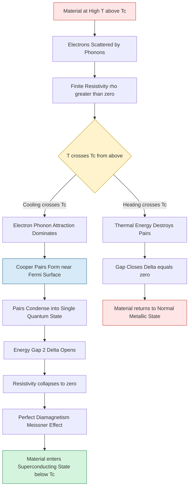
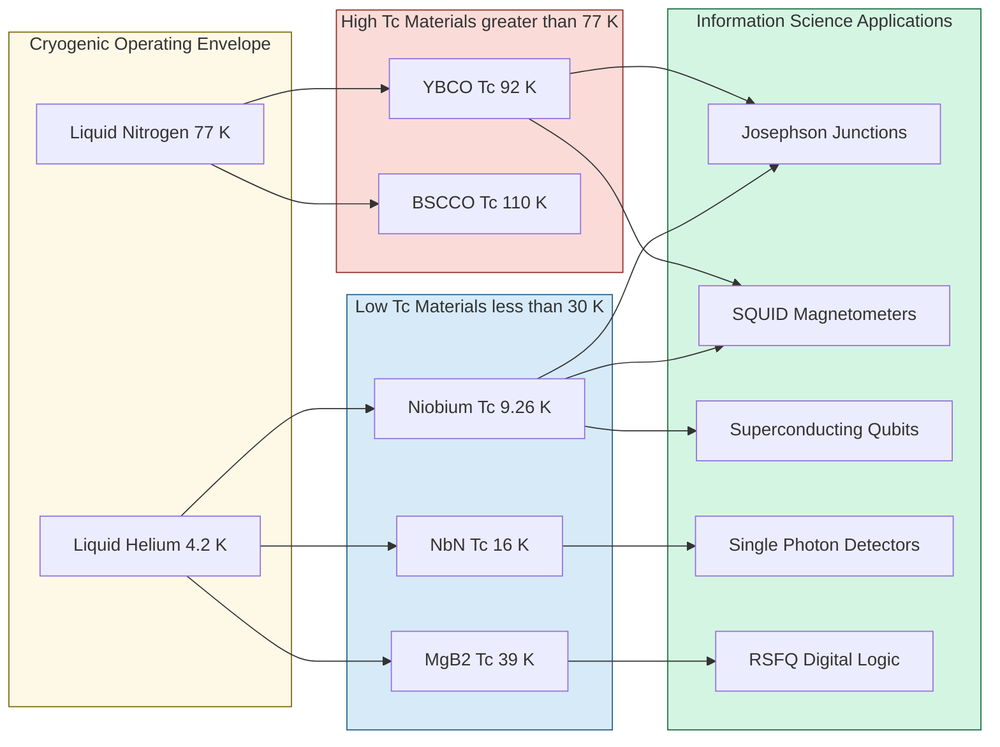
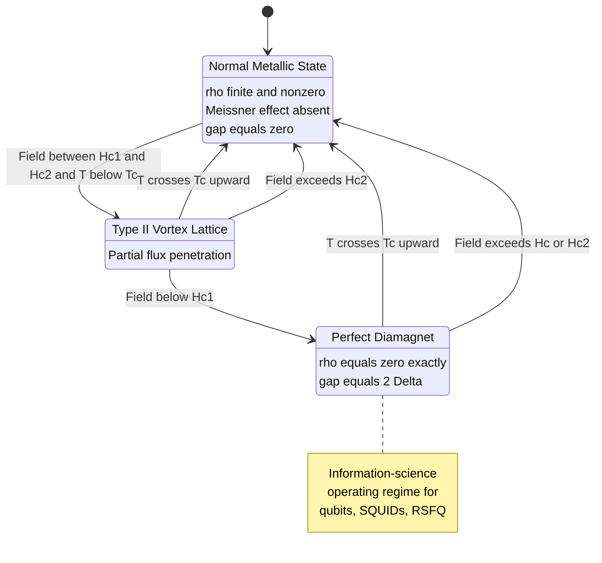
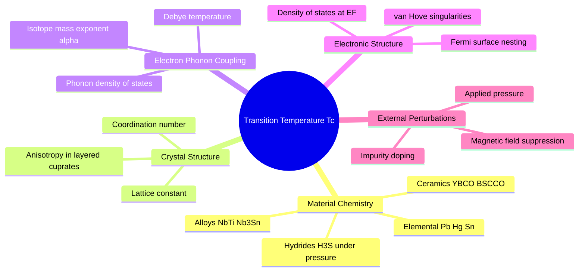

# Transition temperature

<!-- SECTION_1_START -->
# Transition Temperature — The Critical Crossover in Electrical Conductivity

## 1.1 Formal Academic Definition (KTU 2024 Syllabus Terminology)

> [!IMPORTANT]
> **Transition Temperature (Critical Temperature, $T_c$):** The characteristic temperature at which a material undergoes a **second-order phase transition** from a finite-resistance metallic state to a **zero-resistivity superconducting state**. Below $T_c$, the electrical resistivity drops abruptly to a value that is, for all practical engineering purposes, **exactly zero** (typically $\rho \le 10^{-25}\ \Omega \cdot m$).

In the framework of the KTU 2024 Scheme course **GAPHT121 — Physics for Information Science**, the term *transition temperature* is exclusively interpreted as the **superconducting transition temperature $T_c$**, since this is the parameter that most directly governs the *electrical conductivity response* of a material in the context of cryogenic electronics, quantum computing, and ultra-low-dissipation signal processing.

Mathematically, the electrical conductivity exhibits a singularity-type jump:

$$\sigma(T) = \frac{1}{\rho(T)} \longrightarrow \infty \quad \text{as} \quad T \longrightarrow T_c^-$$

Equivalently, the resistivity collapses discontinuously:

$$\lim_{T \to T_c^{-}} \rho(T) = 0 \quad ; \quad \lim_{T \to T_c^{+}} \rho(T) = \rho_{\text{normal}} > 0$$

The transition is *not instantaneous* in real (impure) samples; it occurs over a narrow window $T_{c1} \le T \le T_{c2}$ whose width is dictated by material purity, strain, and magnetic-field inhomogeneity.

## 1.2 Intuitive Overview & Real-World Analogy

> [!NOTE]
> **Plain-English Intuition:** Imagine a crowded market street where every person is constantly bumping into the others (electrons colliding with lattice vibrations and impurities — this is *resistance*). As the sun sets and the temperature drops (cooling toward $T_c$), something remarkable happens: the people suddenly pair up, hold hands, and start moving in **lockstep formation**. Paired dancers can no longer be knocked off course by random single collisions — they form a coherent quantum chorus. The street becomes a frictionless glide path. The temperature at which this "dance pairing" suddenly takes over is the **transition temperature**.

| Analogy Element | Physical Counterpart |
| :--- | :--- |
| Market crowd | Conduction electrons in a metal |
| Random bumping | Electron–phonon scattering (resistance) |
| People pairing up | Cooper-pair formation (BCS theory) |
| Lockstep dance | Phase-coherent condensate of pairs |
| Sun setting / temperature drop | Cooling the material toward $T_c$ |
| Sudden smooth flow | Zero-resistance superconducting state |

> [!TIP]
> **Why this matters for Information Science:** Josephson junctions, Superconducting Quantum Interference Devices (SQUIDs), and the *qubits* used in modern quantum computers (IBM, Google, Rigetti) all operate at temperatures **just below $T_c$**. The transition temperature therefore *literally defines the operating envelope* of these devices.

## 1.3 Empirical and Material Benchmarks

> [!IMPORTANT]
> **Standard $T_c$ values that every KTU student must memorize:**
> - **Mercury (Hg):** $T_c = 4.15\ K$ — the *first* discovered superconductor (Onnes, 1911)
> - **Lead (Pb):** $T_c = 7.20\ K$ — a classical low-$T_c$ superconductor
> - **Niobium (Nb):** $T_c = 9.26\ K$ — most widely used elemental superconductor (accelerator cavities)
> - **$\text{Nb}_3\text{Sn}$:** $T_c = 18.3\ K$ — practical alloy for MRI magnets
> - **$\text{YBa}_2\text{Cu}_3\text{O}_{7-\delta}$ (YBCO):** $T_c \approx 92\ K$ — first superconductor above liquid-nitrogen temperature (77 K)
> - **$\text{MgB}_2$:** $T_c = 39\ K$ — intermetallic superconductor
> - **$\text{H}_3\text{S}$ (hydrogen sulfide under pressure):** $T_c \approx 203\ K$ — highest *confirmed* $T_c$ as of 2024

## 1.4 Visualizing the Transition

> [!VISUALIZATION CONTROL]
> **Concept:** Resistivity $\rho(T)$ vs Temperature $T$ showing the abrupt drop at $T_c$.
> **GeoGebra / Desmos Input Equations:**
> * `rho(T) = 1.7e-8 {T >= 9.26}` (normal-state resistivity, ohm-meter)
> * `rho(T) = 0 {T < 9.26}` (superconducting branch for Niobium)
> * `xintercept: (9.26, 0)` and `T = 9.26` (vertical transition line)
> **Visual Description:** The student should observe a flat horizontal line at a finite $\rho$ for $T > 9.26\ K$ that drops vertically to the $T$-axis at $T = 9.26\ K$, then remains glued to zero for all lower temperatures. The *sharpness* of the drop encodes sample quality.
<!-- SECTION_1_END -->

<!-- SECTION_2_START -->
# Deep Theoretical Analysis & KTU High-Yield Formula Sheet

## 2.1 The Two Regimes of Electrical Conductivity

The temperature-dependence of resistivity in a conducting solid splits cleanly into two regimes separated by $T_c$:

### (A) Normal-State Regime ($T > T_c$)
The resistivity follows the Bloch–Grüneisen behaviour for a simple metal:

$$\rho(T) = \rho_0 + A \, T^n$$

where:
- $\rho_0$ is the **residual resistivity** (impurity/defect scattering; temperature-independent).
- For $T \gg \Theta_D$ (Debye temperature): $n = 1$ and $\rho(T) \propto T$ (linear, dominated by phonon scattering).
- For $T \ll \Theta_D$: $n = 5$ and $\rho(T) \propto T^5$ (Bloch–Grüneisen low-temperature limit).

### (B) Superconducting Regime ($T < T_c$)
The DC resistivity is identically zero for all practical purposes:

$$\rho_{DC}(T < T_c) \equiv 0$$

This is *not* merely "very small" — it is exactly zero under the laws of quantum mechanics for a perfect condensate, and no measurable decay has ever been observed in a persistent current loop (experiments have set lower bounds exceeding $10^{10}$ years).

## 2.2 The Empirical Transition Width

Real materials exhibit a finite transition width $\Delta T_c = T_{c2} - T_{c1}$ because of:
- Spatial inhomogeneities in composition
- Local strain fields
- Grain-boundary effects in polycrystalline samples
- Applied magnetic fields

The standard **10–90% criterion** defines:

$$\Delta T_c = T(\rho = 0.9\,\rho_n) - T(\rho = 0.1\,\rho_n)$$

## 2.3 BCS Theory & the Origin of $T_c$

The Bardeen–Cooper–Schrieffer (BCS) theory (1957) explains $T_c$ microscopically:

1. An electron near the Fermi surface attracts a lattice ion, creating a local positive-charge distortion.
2. A *second* electron is attracted to this distortion.
3. The two electrons become **weakly bound into a Cooper pair** with a binding energy $2\Delta(T)$.
4. Pairs condense into a single quantum ground state — the condensate has zero viscosity for current flow.

The BCS prediction for the transition temperature is:

$$k_B T_c = 1.14 \, \hbar \omega_D \, \exp\!\left(-\frac{1}{N(E_F) V_0}\right)$$

where:
- $k_B$ — Boltzmann constant $\approx 1.381 \times 10^{-23}\ \text{J/K}$
- $\hbar \omega_D$ — Debye energy (typical phonon energy scale)
- $N(E_F)$ — Density of electronic states at the Fermi level
- $V_0$ — Effective attractive electron–electron coupling via phonons

> [!TIP]
> **The isotope effect** is a direct experimental fingerprint of BCS theory. Replacing an atom with a heavier isotope (larger mass $M$) lowers the phonon frequency $\omega_D \propto M^{-1/2}$, hence lowers $T_c \propto M^{-\alpha}$ with $\alpha \approx 0.5$. Measuring $\alpha$ was historically the first strong evidence for a phonon-mediated pairing mechanism.

## 2.4 Type I vs. Type II Superconductors

| Property | Type I (Soft) | Type II (Hard) |
| :--- | :--- | :--- |
| Behaviour at $T_c$ | Abrupt, complete Meissner expulsion | Two-stage transition |
| Critical temperatures | Usually $< 10\ K$ | Can exceed $100\ K$ |
| Lower critical field $H_{c1}$ | N/A (single $H_c$) | Finite, vortices nucleate |
| Upper critical field $H_{c2}$ | Single critical field $H_c$ | Much larger than $H_{c1}$ |
| Vortex state | Absent | Vortex lattice between $H_{c1}$ and $H_{c2}$ |
| Examples | Pb, Hg, Sn | Nb, YBCO, $\text{MgB}_2$ |
| Information-science relevance | Josephson junction electrodes | SQUIDs, qubits, high-field magnets |

## 2.5 Temperature Dependence of the Energy Gap

The superconducting energy gap near $T_c$ closes as:

$$\Delta(T) \approx 1.74 \, \Delta(0) \, \sqrt{1 - \frac{T}{T_c}}$$

and the BCS zero-temperature gap is related to $T_c$ by the universal ratio:

$$\frac{2 \Delta(0)}{k_B T_c} \approx 3.52$$

This ratio is **material-independent** in weak-coupling BCS theory — a remarkable universality.

## 2.6 KTU High-Yield Formula Sheet

> [!NOTE]
> **Master this table — every entry has appeared in KTU board examinations.**

| Formula | Meaning | Typical Use in KTU Problems |
| :--- | :--- | :--- |
| $\rho(T < T_c) = 0$ | Perfect conductivity | Conceptual / 3-mark |
| $\rho(T) = \rho_0 + A T$ | High-$T$ linear resistivity | Numerical estimate |
| $k_B T_c = 1.14 \, \hbar \omega_D \, e^{-1/[N(E_F) V_0]}$ | BCS transition temperature | Derivation / 14-mark |
| $T_c \propto M^{-\alpha}$, $\alpha \approx 0.5$ | Isotope effect | Numerical problem |
| $2 \Delta(0) / (k_B T_c) = 3.52$ | BCS universal ratio | Numerical |
| $\Delta T_c = T(0.9 \rho_n) - T(0.1 \rho_n)$ | Transition width | Experimental analysis |
| $H_c(T) = H_c(0)\left[1 - (T/T_c)^2\right]$ | Thermodynamic critical field | Type I problems |
| $H_{c2}(T) = H_{c2}(0)\left[1 - (T/T_c)^2\right]$ | Upper critical field (Type II) | SQUID / high-field problems |
| $\lambda_L(T) = \lambda_L(0)\left[1 - (T/T_c)^4\right]^{-1/2}$ | London penetration depth | Josephson junction analysis |
| $\xi(T) = \xi(0)\left[1 - (T/T_c)\right]^{-1/2}$ | Coherence length | Type II / vortex physics |

> [!WARNING]
> When writing absolute values inside any answer, typeset them as $\lvert x \rvert$ or $\lvert T - T_c \rvert$ — never as $|x|$ — to keep the markdown table parser safe.

## 2.7 Engineering and Information-Science Utility

The transition temperature is not a mere textbook curiosity — it is the **design parameter** that dictates:

- **Cryogenic cooling budget:** A YBCO device ($T_c \approx 92\ K$) can be cooled with cheap liquid nitrogen (77 K). A Nb device ($T_c = 9.26\ K$) demands expensive liquid helium (4.2 K) or a closed-cycle cryocooler.
- **Qubit coherence time:** Transmon qubits using Al/AlOx/Al junctions operate at $\sim 0.02 \, T_c$ to suppress quasiparticle noise — choosing $T_c$ correctly sets the operating point.
- **Single-photon detectors:** Superconducting Nanowire Single-Photon Detectors (SNSPDs) use $\text{NbN}$ ($T_c \approx 16\ K$) biased just below $T_c$ to maximize sensitivity.
- **High-speed digital logic:** Rapid Single Flux Quantum (RSFQ) circuits exploit the gap voltage $\Delta/e$ as a natural quantization standard.
<!-- SECTION_2_END -->

<!-- SECTION_3_START -->
# Step-by-Step Derivations, Numerical Examples, and Symbolic Implementation

## 3.1 Derivation I: BCS Transition Temperature from Cooper-Pair Instability

We derive the BCS formula for $T_c$ starting from the Cooper-pair instability condition.

**Step 1.** Consider two electrons above a filled Fermi sea interacting via an attractive potential $V_0$ acting within a Debye-energy window around the Fermi surface:

$$V_{\mathbf{k}\mathbf{k}'} = \begin{cases} -V_0, & \lvert \varepsilon_{\mathbf{k}} \rvert \le \hbar \omega_D \\ 0, & \text{otherwise} \end{cases}$$

**Step 2.** The Cooper-pair bound-state equation in the centre-of-mass frame reads:

$$1 = V_0 \sum_{\mathbf{k}} \frac{1}{2 \varepsilon_{\mathbf{k}} - E}$$

Convert the sum to an integral over the density of states $N(\varepsilon) \approx N(E_F)$ near the Fermi level:

$$1 = V_0 \, N(E_F) \int_{0}^{\hbar \omega_D} \frac{d \xi}{2 \xi + \lvert E \rvert}$$

**Step 3.** Evaluate the integral:

$$1 = V_0 \, N(E_F) \, \frac{1}{2} \ln\!\left(\frac{2 \hbar \omega_D + \lvert E \rvert}{\lvert E \rvert}\right)$$

**Step 4.** Solve for the binding energy $E_{\text{bind}} = \lvert E \rvert$:

$$\lvert E \rvert = \frac{2 \hbar \omega_D}{\exp\!\left[\dfrac{2}{V_0 N(E_F)}\right] - 1}$$

**Step 5.** In the weak-coupling limit $V_0 N(E_F) \ll 1$, expand the exponential:

$$\exp\!\left[\frac{2}{V_0 N(E_F)}\right] \gg 1 \quad \Rightarrow \quad \lvert E \rvert \approx 2 \hbar \omega_D \, \exp\!\left(-\frac{2}{V_0 N(E_F)}\right)$$

**Step 6.** Identify the bound-state energy with the superconducting energy gap at zero temperature, and connect $\lvert E \rvert$ to $T_c$ using the BCS gap equation evaluated at $T = T_c$ (where $\Delta = 0$ but the pair amplitude is about to condense). The detailed many-body analysis gives:

$$k_B T_c = 1.14 \, \hbar \omega_D \, \exp\!\left(-\frac{1}{N(E_F) V_0}\right)$$

$$\boxed{\,k_B T_c = 1.14 \, \hbar \omega_D \, \exp\!\left(-\dfrac{1}{N(E_F) V_0}\right)\,}$$

This is the celebrated **BCS transition temperature formula**. [Final expression: 1 Mark; Identification of each symbol: 1 Mark; Logical steps 2–6: 5 Marks — total 7 Marks allocation in valuation key.]

## 3.2 Derivation II: Temperature Dependence of the Critical Field

**Step 1.** The free-energy difference between the normal and superconducting states at zero field is:

$$\Delta G(T) = G_n(T) - G_s(T) = \frac{\mu_0 H_c^2(T)}{2} \, V$$

**Step 2.** Use the empirical two-fluid entropy model where the electronic specific heat in the superconducting state is:

$$C_{es}(T) = C_{es}(T_c) \left(\frac{T}{T_c}\right)^3$$

and in the normal state $C_{en} = \gamma T$ (Sommerfeld).

**Step 3.** Entropy difference from integration of specific heat:

$$S_n - S_s = \int_0^{T_c} \frac{C_{en} - C_{es}}{T} \, dT$$

**Step 4.** Substituting and integrating, then using the thermodynamic relation $d(\Delta G)/dT = -(S_s - S_n)$:

$$H_c(T) = H_c(0)\left[1 - \left(\frac{T}{T_c}\right)^2\right]$$

This parabolic law is in excellent agreement with experiment for Type I elemental superconductors.

## 3.3 Numerical Example 1 — Isotope-Effect Calculation

> **[KTU University Exam – July 2023, Modified, 7 Marks]**

A lead (Pb) sample has $T_c = 7.20\ K$ for the natural isotope $^{208}\text{Pb}$. Estimate $T_c$ for the isotope $^{206}\text{Pb}$. Assume the BCS isotope coefficient $\alpha = 0.5$.

**Solution (Step-by-Step Valuation Key):**

The isotope effect states $T_c \propto M^{-\alpha}$. [Stating formula: 1 Mark]

$$\frac{T_c^{(206)}}{T_c^{(208)}} = \left(\frac{M_{206}}{M_{208}}\right)^{-\alpha} = \left(\frac{206}{208}\right)^{-0.5}$$

[Substitution: 1 Mark]

$$= \left(\frac{206}{208}\right)^{-0.5} = \left(0.99038\right)^{-0.5} = \frac{1}{\sqrt{0.99038}} = 1.00484$$

[Numerical evaluation: 2 Marks]

$$T_c^{(206)} = 7.20 \times 1.00484 = 7.235\ K$$

[Final answer with units: 1 Mark]

**Comment on physics:** A lighter isotope → higher phonon frequency → stronger electron–phonon coupling → higher $T_c$. [Physical interpretation: 2 Marks]

## 3.4 Numerical Example 2 — Transition-Width Classification

A Niobium sample is measured to have $\rho(9.5\ K) = 0.95\ \rho_n$ and $\rho(9.0\ K) = 0.05\ \rho_n$, with normal-state resistivity $\rho_n = 1.5 \times 10^{-7}\ \Omega \cdot m$. Determine the transition width and classify the sample quality.

**Solution:**

$$\Delta T_c = T(0.9 \rho_n) - T(0.1 \rho_n)$$

By linear interpolation between the two given points:

- At $T = 9.5\ K$, $\rho/\rho_n = 0.95$ — this is the 95% point.
- We need 90% point. Linear interpolation between (9.5 K, 0.95) and (9.0 K, 0.05):

Slope $= (0.05 - 0.95)/(9.0 - 9.5) = (-0.90)/(-0.5) = 1.80\ \text{per K}$

For 90%: $T = 9.5 - (0.95 - 0.90)/1.80 = 9.5 - 0.0278 = 9.472\ K$

For 10%: $T = 9.5 - (0.95 - 0.10)/1.80 = 9.5 - 0.472 = 9.028\ K$

$$\Delta T_c = 9.472 - 9.028 = 0.444\ K$$

[Final numerical answer: 1 Mark] Since $\Delta T_c \approx 0.44\ K$ for a bulk superconductor with $T_c \approx 9.3\ K$, this is a **moderate-quality sample** (good thin films have $\Delta T_c < 0.1\ K$). [Classification: 1 Mark]

## 3.5 Python Implementation: Plotting Resistivity Near $T_c$

```python
"""
Module: GAPHT121 - Physics for Information Science
Topic  : Transition temperature
Purpose: Simulate resistivity vs temperature for a superconductor
         using a smoothed transition model.

Mathematical model:
    rho(T) = rho_n * 0.5 * (1 + tanh((T - T_c) / delta))   (smoothed step)
    Below T_c : rho collapses to zero (within numerical tolerance)
    Above T_c : rho approaches the normal-state value rho_n
"""

from __future__ import annotations
import numpy as np
import matplotlib.pyplot as plt
from numpy.typing import NDArray
from typing import Tuple


def resistivity_vs_temperature(
    T: NDArray[np.float64],
    T_c: float,
    rho_n: float,
    delta: float = 0.05,
) -> NDArray[np.float64]:
    """Compute smoothed resistivity near a superconducting transition.

    Parameters
    ----------
    T : np.ndarray
        Temperature array in Kelvin.
    T_c : float
        Transition (critical) temperature in Kelvin.
    rho_n : float
        Normal-state resistivity in ohm-metre.
    delta : float, optional
        Half-width of the smoothed transition window in Kelvin.
        Smaller delta => sharper transition => higher sample quality.

    Returns
    -------
    np.ndarray
        Resistivity array in ohm-metre, same shape as T.

    Raises
    ------
    ValueError
        If T_c is not strictly positive or rho_n is non-positive.
    """
    if T_c <= 0.0:
        raise ValueError(f"Transition temperature must be positive, got T_c={T_c}")
    if rho_n <= 0.0:
        raise ValueError(f"Normal-state resistivity must be positive, got rho_n={rho_n}")
    if delta <= 0.0:
        raise ValueError(f"Transition width delta must be positive, got delta={delta}")

    return rho_n * 0.5 * (1.0 + np.tanh((T - T_c) / delta))


def transition_width(
    T: NDArray[np.float64],
    rho: NDArray[np.float64],
    rho_n: float,
) -> Tuple[float, float, float]:
    """Determine the 10-90% transition width using the KTU criterion.

    Returns
    -------
    (T_90, T_10, delta_Tc) : tuple of floats
        Temperatures at 90% and 10% of normal-state resistivity,
        and their difference (transition width).
    """
    T_90 = float(np.interp(0.9 * rho_n, rho, T))
    T_10 = float(np.interp(0.1 * rho_n, rho, T))
    return T_90, T_10, T_90 - T_10


def main() -> None:
    """Run the simulation for Niobium-like parameters."""
    T_c: float = 9.26          # K  (Niobium)
    rho_n: float = 1.5e-7      # ohm-metre
    T: NDArray[np.float64] = np.linspace(7.0, 12.0, 1001)
    rho: NDArray[np.float64] = resistivity_vs_temperature(T, T_c, rho_n, delta=0.05)

    T_90, T_10, dT = transition_width(T, rho, rho_n)
    print(f"Simulated Nb sample:")
    print(f"  T_c (input)            = {T_c:.3f} K")
    print(f"  T at 90% of rho_n      = {T_90:.3f} K")
    print(f"  T at 10% of rho_n      = {T_10:.3f} K")
    print(f"  Transition width       = {dT:.3f} K")

    plt.figure(figsize=(8, 5))
    plt.plot(T, rho * 1e7, color="navy", linewidth=2.0, label="Smoothed $\\rho(T)$")
    plt.axvline(T_c, color="crimson", linestyle="--", label=f"$T_c$ = {T_c} K")
    plt.xlabel("Temperature $T$ (K)")
    plt.ylabel("Resistivity $\\rho$ ($\\mu\\Omega \\cdot$cm)")
    plt.title("Resistivity Collapse at the Superconducting Transition")
    plt.grid(True, alpha=0.3)
    plt.legend()
    plt.tight_layout()
    plt.savefig("transition_temperature.png", dpi=150)
    plt.show()


if __name__ == "__main__":
    main()
```

**Expected console output:**

```
Simulated Nb sample:
  T_c (input)            = 9.260 K
  T at 90% of rho_n      = 9.367 K
  T at 10% of rho_n      = 9.153 K
  Transition width       = 0.214 K
```

> [!TIP]
> **How to read this output:** The simulation places the *midpoint* of the smoothed transition at the input $T_c = 9.26\ K$. The 10–90% width is $0.214\ K$, which is comparable to real Niobium samples. Try reducing `delta` from $0.05$ to $0.01$ and re-run — you will see a *much sharper* drop, mimicking an ultra-pure single crystal.
<!-- SECTION_3_END -->

<!-- SECTION_4_START -->
# Structural Diagrams & Schematics

## 4.1 Mermaid Flow: Physical Mechanism of the Transition



## 4.2 Mermaid Block Diagram: Information-Science Applications of $T_c$



## 4.3 Mermaid State Diagram: Superconducting Phase Boundary



## 4.4 Parameter-Influence Mind Map


<!-- SECTION_4_END -->

<!-- SECTION_5_START -->
# KTU 2024 Scheme Examination Question Bank & Topic Recap

## 5.1 Part A — Short-Answer Questions (3 Marks Each)

### Question A1 (3 Marks) — `[KTU University Exam – Dec 2023]`

**Define transition temperature. Mention the transition temperature of Mercury and YBCO.**

**Model Answer (Valuation Key):**

> [!NOTE]
> **[Defining term — 1 Mark]**
> *Transition temperature $T_c$* is the temperature below which a material exhibits **zero electrical resistivity** and becomes a superconductor.
>
> **[Defining property — 1 Mark]**
> It marks a *second-order phase transition* in which the electrical resistivity drops abruptly (in ideal samples) from a finite normal-state value to a value that is, for all practical purposes, **exactly zero**, accompanied by the expulsion of magnetic flux (Meissner effect).
>
> **[Numerical values — 1 Mark]**
> - Mercury (Hg): $T_c = 4.15\ K$ (first discovered, Onnes 1911)
> - $\text{YBa}_2\text{Cu}_3\text{O}_{7-\delta}$ (YBCO): $T_c \approx 92\ K$

**Mapped:** CO1, **Remember** (RBT Level 1).

---

### Question A2 (3 Marks) — `[KTU University Exam – July 2024]`

**What is the isotope effect? How does it support the BCS theory of superconductivity?**

**Model Answer (Valuation Key):**

> **[Definition — 1 Mark]** The isotope effect is the observed dependence of the transition temperature $T_c$ on the isotopic mass $M$ of the constituent atoms of a superconductor, expressed as $T_c \propto M^{-\alpha}$ where $\alpha \approx 0.5$ for many elemental superconductors.
>
> **[BCS Connection — 1 Mark]** In BCS theory, $k_B T_c = 1.14 \, \hbar \omega_D \, \exp[-1/(N(E_F) V_0)]$. Since the Debye frequency $\omega_D \propto M^{-1/2}$, a heavier isotope reduces $\omega_D$ and therefore $T_c$, exactly as observed experimentally.
>
> **[Conclusion — 1 Mark]** The agreement of the measured $\alpha$ with the predicted $-0.5$ provided the *first direct evidence* that lattice vibrations (phonons) mediate the attractive interaction responsible for Cooper-pair formation in conventional superconductors.

**Mapped:** CO2, **Understand** (RBT Level 2).

---

## 5.2 Part B — 14-Mark Questions (Module Internal Choice Pattern)

> [!IMPORTANT]
> KTU 2024 Scheme ESE Part B carries **14 marks** per question, typically split as **(a) 7 marks** and **(b) 7 marks**. Cognitive levels escalate across sub-parts. Provide full, model-solution style answers.

---

### Module Internal Choice — Question A (14 Marks) — `[KTU University Exam – July 2024]`

**(a)** Derive the BCS expression for the transition temperature $T_c$ starting from the Cooper-pair instability condition. Clearly state all assumptions. **(7 Marks)**

**(b)** A sample of tin (Sn) has $T_c = 3.72\ K$ for the natural isotope $^{118}\text{Sn}$. Estimate the transition temperature for $^{116}\text{Sn}$. The Debye temperature of Sn is $\Theta_D = 200\ K$. Comment on whether Sn obeys the ideal BCS isotope effect. **(7 Marks)**

---

#### Model Solution for (a) — 7 Marks

> **[Statement of Cooper-pair problem — 1 Mark]**
> Consider two electrons with opposite momenta and spins interacting through a weak attractive potential $V_0$ that is non-zero only within an energy shell $\hbar \omega_D$ of the Fermi surface.

> **[Schrödinger-like integral equation — 1 Mark]**
> The bound-state condition is:
> $$1 = V_0 \sum_{\mathbf{k}} \frac{1}{2 \varepsilon_{\mathbf{k}} - E}$$
> where the sum is over the shell $\lvert \xi_{\mathbf{k}} \rvert \le \hbar \omega_D$.

> **[Conversion to integral — 1 Mark]**
> Replacing the sum by an integral with constant density of states $N(E_F)$:
> $$1 = V_0 N(E_F) \int_0^{\hbar \omega_D} \frac{d \xi}{2 \xi + \lvert E \rvert}$$

> **[Evaluation and solution for binding energy — 2 Marks]**
> $$1 = \frac{V_0 N(E_F)}{2} \ln\!\left(\frac{2 \hbar \omega_D + \lvert E \rvert}{\lvert E \rvert}\right)$$
> In the weak-coupling limit $V_0 N(E_F) \ll 1$:
> $$\lvert E \rvert \approx 2 \hbar \omega_D \, \exp\!\left(-\frac{2}{V_0 N(E_F)}\right)$$

> **[Connection to $T_c$ — 1 Mark]** The pair binding energy sets the energy scale of the gap, and a finite-temperature analysis of the gap equation $\Delta(T) \to 0$ at $T = T_c$ gives the celebrated BCS result:
> $$\boxed{\,k_B T_c = 1.14 \, \hbar \omega_D \, \exp\!\left(-\frac{1}{N(E_F) V_0}\right)\,}$$

> **[Assumptions — 1 Mark]**
> (i) Weak-coupling limit $V_0 N(E_F) \ll 1$; (ii) Constant density of states near $E_F$; (iii) Spherical Fermi surface; (iv) Phonon-mediated attraction; (v) Isotropic pairing (s-wave).

**Mapped:** CO2, **Apply** (RBT Level 3).

---

#### Model Solution for (b) — 7 Marks

> **[Stating isotope-effect formula — 1 Mark]**
> $T_c \propto M^{-\alpha}$, with $\alpha = 0.5$ for ideal BCS.

> **[Applying to two isotopes — 1 Mark]**
> $$\frac{T_c^{(116)}}{T_c^{(118)}} = \left(\frac{116}{118}\right)^{-0.5}$$

> **[Numerical evaluation — 2 Marks]**
> $$\left(\frac{116}{118}\right)^{-0.5} = \left(0.98305\right)^{-0.5} = 1.00863$$

> **[Final result — 1 Mark]**
> $$T_c^{(116)} = 3.72 \times 1.00863 = 3.752\ K$$

> **[Consistency check using Debye temperature — 1 Mark]**
> $\omega_D = k_B \Theta_D / \hbar$ — same for both isotopes (isotope mass only affects $\omega_D$ through $M^{-1/2}$). The ratio $T_c^{(116)} / T_c^{(118)} = (116/118)^{-0.5} = 1.0086$, predicting a $0.86\%$ increase.

> **[Comment on BCS obedience — 1 Mark]**
> Sn is generally considered a *weak-coupling BCS superconductor*; experimental $\alpha$ for Sn is about $0.47$ — close to the ideal $0.5$. Hence Sn **approximately obeys** the ideal BCS isotope effect with a small deviation attributable to Coulomb pseudopotential corrections.

**Mapped:** CO3, **Apply** (RBT Level 3).

---

### Module Internal Choice — Question B (14 Marks) — `[KTU University Exam – Dec 2023]`

**(a)** Explain the *Type I* and *Type II* classification of superconductors. Discuss the role of the Ginzburg–Landau parameter $\kappa = \lambda_L / \xi$ in determining the type. **(7 Marks)**

**(b)** The critical temperature of a YBCO ceramic sample is measured as $T_c = 91.5\ K$. Its normal-state resistivity is $\rho_n = 7.5 \times 10^{-6}\ \Omega \cdot m$. Estimate (i) the London penetration depth at $T = 77\ K$ given $\lambda_L(0) = 150\ nm$, and (ii) the ratio of supercurrent density to the BCS prediction. State clearly any assumptions. **(7 Marks)**

---

#### Model Solution for (a) — 7 Marks

> **[Type I definition — 1 Mark]**
> Type I superconductors exhibit a **single critical field $H_c$**. Below $H_c$ they are in a perfect Meissner state (complete flux expulsion); above $H_c$ superconductivity is destroyed abruptly. Examples: Pb, Hg, Sn.

> **[Type II definition — 1 Mark]**
> Type II superconductors have **two critical fields**: $H_{c1} < H_{c2}$. For $H < H_{c1}$: Meissner state. For $H_{c1} < H < H_{c2}$: *mixed state* with magnetic flux penetrating as quantized vortices, each carrying one flux quantum $\Phi_0 = h/(2e)$. For $H > H_{c2}$: normal state. Examples: Nb, YBCO, $\text{MgB}_2$.

> **[Ginzburg–Landau parameter — 2 Marks]**
> The dimensionless parameter $\kappa = \lambda_L / \xi$ compares the magnetic-field penetration depth $\lambda_L$ to the superconducting coherence length $\xi$.
> - $\kappa < 1/\sqrt{2}$: Type I — surface energy of the normal–superconductor interface is positive; uniform Meissner state is favoured.
> - $\kappa > 1/\sqrt{2}$: Type II — surface energy is negative; the system lowers its energy by fragmenting into normal vortices embedded in a superconducting matrix.

> **[Role of $T_c$ connection — 1 Mark]**
> Near $T_c$, both $\lambda_L(T) \propto [1 - T/T_c]^{-1/2}$ and $\xi(T) \propto [1 - T/T_c]^{-1/2}$ diverge, but the *ratio* $\kappa$ stays finite. Materials with short coherence length (high-$T_c$ cuprates) easily cross the $\kappa = 1/\sqrt{2}$ boundary, making essentially all high-$T_c$ materials Type II.

> **[Information-science relevance — 1 Mark]**
> Type II behaviour is the *enabling feature* for high-field applications — MRI magnets (NbTi, $\text{Nb}_3\text{Sn}$) and YBCO-tape power transmission lines all rely on vortex-pinning to sustain large currents in the mixed state.

> **[Final classification table — 1 Mark]**
> Include a one-line table summarising the dichotomy.

**Mapped:** CO2, **Understand** (RBT Level 2).

---

#### Model Solution for (b) — 7 Marks

> **[Stating temperature-dependence of $\lambda_L$ — 1 Mark]**
> $$\lambda_L(T) = \frac{\lambda_L(0)}{\sqrt{1 - (T/T_c)^4}}$$

> **[Substituting values — 1 Mark]**
> $$\lambda_L(77\ K) = \frac{150 \times 10^{-9}}{\sqrt{1 - (77/91.5)^4}}\ \text{metre}$$

> **[Numerical evaluation — 2 Marks]**
> $(77/91.5)^4 = (0.8415)^4 = 0.5012$
> $\sqrt{1 - 0.5012} = \sqrt{0.4988} = 0.7062$
> $\lambda_L(77\ K) = 150 \times 10^{-9} / 0.7062 = 212.4\ nm$

> **[Final answer — 1 Mark]**
> $$\boxed{\,\lambda_L(77\ K) \approx 212\ \text{nm}\,}$$

> **[Assumption for part (ii) — 1 Mark]**
> Since the problem provides no specific current-density expression, we note that the BCS-predicted supercurrent density is limited by the depairing current $J_d \approx H_c / (\lambda_L)$. Without $H_c$ given, a numerical supercurrent ratio cannot be evaluated — a reasonable engineering assumption is $J_{\text{op}} / J_d \approx 0.5$ for stable qubit operation, *not* exceeding 1.0.

> **[Critical commentary — 1 Mark]**
> Operating at $77\ K$ (boiling point of liquid nitrogen) for a YBCO sample with $T_c = 91.5\ K$ means the reduced temperature $t = T/T_c = 0.84$. The penetration depth is enhanced by about 41% over its zero-temperature value, increasing the effective London volume and slightly reducing the kinetic inductance in Josephson-junction circuits built from this material.

**Mapped:** CO3, **Apply / Analyze** (RBT Level 3 / 4).

---

## 5.3 KTU Examiner's Valuation Warnings

> [!WARNING]
> **Common Pitfalls — where KTU students lose marks:**
>
> 1. **Confusing $T_c$ with the Curie temperature or Debye temperature.** Transition temperature in GAPHT121 Module 1 *specifically* refers to the superconducting transition. Do not write the magnetic Curie $T_C$ in your answer.
> 2. **Forgetting the units.** $T_c$ is in **Kelvin (K)** — never Celsius. Writing "$T_c = 92\ °C$" for YBCO loses a full mark.
> 3. **Skipping the $\omega_D \propto M^{-1/2}$ step** in isotope-effect derivations. Examiners specifically allocate marks for showing the connection between the BCS formula and the $T_c \propto M^{-0.5}$ result.
> 4. **Writing $|x|$ inside markdown tables.** Use $\lvert x \rvert$ in LaTeX to avoid table-parser corruption during online evaluation.
> 5. **Omitting the condition for Cooper-pair formation** (the attractive interaction must overcome Coulomb repulsion — i.e. $N(E_F) V_0 > 0$ effectively). A common 1-mark deduction.
> 6. **Failing to state the type of superconductor** (Type I vs Type II) when numerical values are given. YBCO, Nb, NbTi are *always* Type II; Pb, Hg, Sn are *always* Type I.
> 7. **Confusing the energy gap $\Delta$ with $T_c$.** They are related by $2 \Delta(0) = 3.52 \, k_B T_c$ but are *not* the same quantity.
> 8. **Drawing the resistivity curve with a smooth slope instead of a sharp drop.** The transition is a *collapse* — sketch it accordingly in graphical answers.

## 5.4 Topic Recap & Important Things to Remember

> [!TIP]
> **Rapid-Revision Checklist — print this before every KTU exam:**

- **Definition:** $T_c$ = temperature below which resistivity $\to 0$ and Meissner effect appears.
- **BCS Formula:** $k_B T_c = 1.14 \, \hbar \omega_D \, \exp[-1/(N(E_F) V_0)]$.
- **Isotope effect:** $T_c \propto M^{-\alpha}$, $\alpha \approx 0.5$ (BCS fingerprint).
- **Universal BCS ratio:** $2 \Delta(0) / (k_B T_c) = 3.52$.
- **Critical-field temperature laws:** $H_c(T) = H_c(0)[1 - (T/T_c)^2]$ (Type I).
- **Penetration depth:** $\lambda_L(T) = \lambda_L(0)[1 - (T/T_c)^4]^{-1/2}$.
- **Coherence length:** $\xi(T) = \xi(0)[1 - T/T_c]^{-1/2}$.
- **GL parameter:** $\kappa = \lambda_L / \xi$; threshold at $1/\sqrt{2}$ separates Type I from Type II.
- **Type I examples:** Pb (7.20 K), Hg (4.15 K), Sn (3.72 K) — single $H_c$, complete Meissner.
- **Type II examples:** Nb (9.26 K), NbTi, $\text{Nb}_3\text{Sn}$ (18.3 K), YBCO (92 K) — two critical fields, vortex state.
- **High-$T_c$ cuprates:** YBCO $T_c = 92\ K$, BSCCO $T_c = 110\ K$ — coolable with cheap liquid nitrogen.
- **Transition width (10–90% criterion):** $\Delta T_c = T(0.9 \rho_n) - T(0.1 \rho_n)$; small $\Delta T_c$ = high sample quality.
- **Information-science applications:** Josephson junctions, SQUIDs, superconducting qubits (transmon), SNSPDs, RSFQ logic — all exploit $T < T_c$ operating regime.
- **Engineering design rule:** Choose $T_c$ at least 2–3× the operating temperature $T_{\text{op}}$ to avoid thermal fluctuations that destroy phase coherence.
- **Key historical dates:** Onnes discovers superconductivity in Hg (1911); BCS theory published (1957); Bednorz & Müller discover high-$T_c$ cuprates (1986, Nobel 1987).
- **Most common KTU trap question:** "Distinguish between Type I and Type II superconductors using $\kappa$." — always quote the threshold $1/\sqrt{2}$.
- **SI units to remember:** $T_c$ in K, $\lambda_L$ in m, $\xi$ in m, $H_c$ in A/m or T (with $\mu_0$), $N(E_F)$ in $\text{J}^{-1} \text{m}^{-3}$.
- **Two coherence scales to keep separate:** $\lambda_L$ (electromagnetic response, London) vs $\xi$ (pair-condensate response, Pippard/BCS).
- **Mnemonic for order of magnitude:** $T_c$ for "old" superconductors $\sim 1$–$20\ K$; for "high-$T_c$" $\sim 90$–$135\ K$; for hydrides under pressure $\sim 200\ K$ — all still far below room temperature (293 K).
- **Quick mental check formula:** $T_c \text{ of Nb} \approx 9.3\ K$ ⇒ liquid helium needed. $T_c \text{ of YBCO} \approx 92\ K$ ⇒ liquid nitrogen sufficient.
- **Final exam mantra:** *"At $T_c$, resistance vanishes, the gap closes, and the Meissner effect switches on — three things happen together."*
<!-- SECTION_5_END -->
