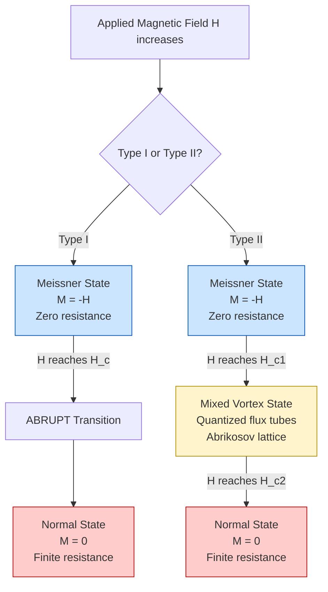
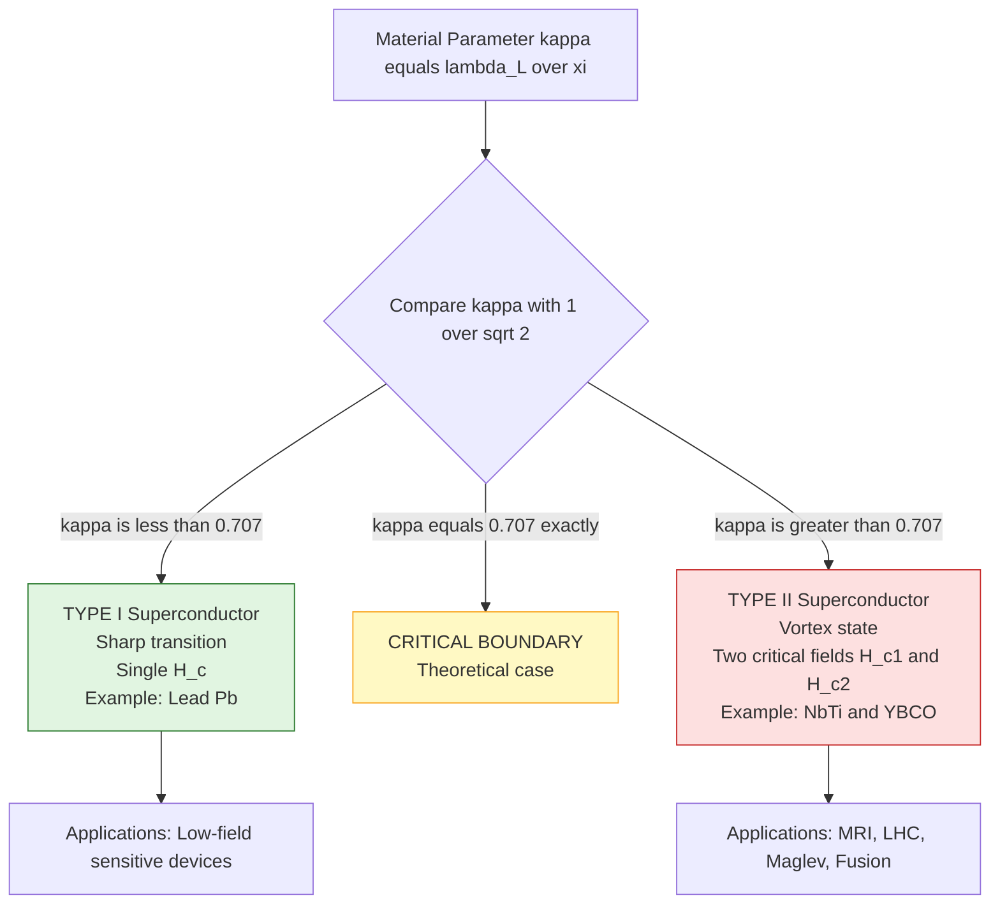
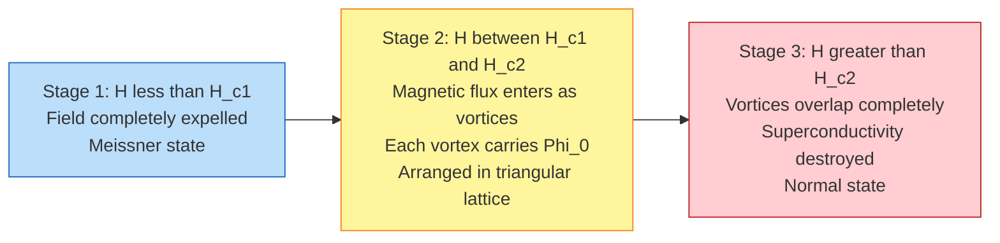
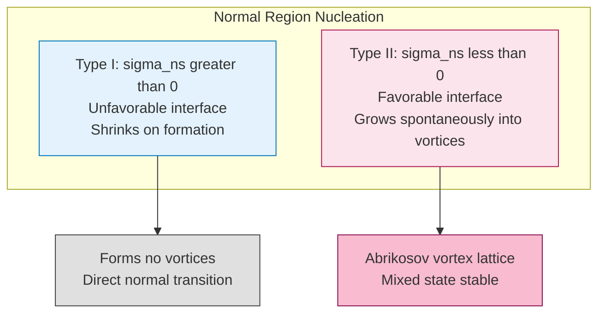
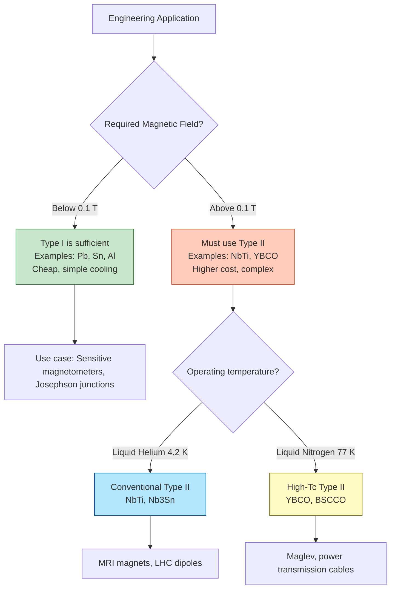

# Type I and Type II Super conductors.

<!-- SECTION_1_START -->
# Type I and Type II Superconductors

## 1.1 What is Superconductivity?

**Superconductivity** is a quantum mechanical phenomenon in which the electrical resistance of certain materials drops to **exactly zero** when cooled below a characteristic critical temperature $T_c$. Discovered by Heike Kamerlingh Onnes in **1911** in mercury below **4.2 K**, this state is one of the most remarkable macroscopic quantum effects in condensed matter physics.

> [!NOTE]
> **KTU Syllabus Definition (GAPHT121, Module 1):**
> A superconductor is a material that, below a critical temperature $T_c$, exhibits two defining properties:
> 1. **Zero electrical resistivity** ($\rho = 0$)
> 2. **Complete expulsion of magnetic flux** from its interior (Meissner Effect)

> [!IMPORTANT]
> The **Meissner Effect (1933)** distinguishes a true superconductor from a *perfect conductor*. A perfect conductor would only maintain existing magnetic fields; a superconductor actively expels them, making it a thermodynamic state rather than merely an "infinite conductivity" condition.

## 1.2 Intuitive Analogy — The Two Highway Lanes

Imagine a busy city with two kinds of traffic systems:

| Analogy Element | Physical Meaning |
|---|---|
| Cars (electrons) | Charge carriers |
| Empty highway | Normal conductor (resistance due to collisions) |
| Cars moving in perfect formation (no collisions) | Cooper pairs in a superconductor |
| Highway with no speed limit | Zero-resistance state |
| Roadside barriers blocking vehicles | Magnetic field lines blocked by Meissner effect |

In **Type I** superconductors, this is a single-lane highway — the moment traffic (magnetic field) becomes too heavy, the whole system breaks down abruptly. In **Type II** superconductors, it is a multi-lane highway — special "toll booth" lanes (vortices) allow controlled traffic flow, so the system keeps working under much heavier loads.

## 1.3 The Three Critical Parameters

Every superconductor is characterized by three fundamental limits, all interdependent:

$$T_c \quad \text{(Critical Temperature)} \qquad H_c \quad \text{(Critical Magnetic Field)} \qquad J_c \quad \text{(Critical Current Density)}$$

If **any one** of these is exceeded, superconductivity is destroyed.

> [!IMPORTANT]
> For KTU 2024 scheme, you must remember the **SILS rule**:
> **S**uperconductivity breaks when exceeded: $T > T_c$, $H > H_c$, or $J > J_c$.

## 1.4 Why Two Types Exist — Ginzburg–Landau Insight

The classification into Type I and Type II depends on the ratio of two fundamental length scales introduced by Ginzburg and Landau (1950):

$$\kappa = \frac{\lambda_L}{\xi} \qquad \text{(Ginzburg–Landau Parameter, dimensionless)}$$

where:
- $\lambda_L$ = **London Penetration Depth** (the distance a magnetic field penetrates the surface)
- $\xi$ = **Coherence Length** (the size of a Cooper pair wavefunction)

> [!IMPORTANT]
> **Type I:** $\kappa < \frac{1}{\sqrt{2}}$ — Energy cost of forming a normal region is *positive* (unfavorable)
> **Type II:** $\kappa > \frac{1}{\sqrt{2}}$ — Energy cost of forming a normal region is *negative* (favorable)

This is one of the deepest results in superconductivity theory and a high-yield KTU question.

> [!VISUALIZATION CONTROL]
> **Concept:** Magnetization ($M$) vs Applied Magnetic Field ($H$) for Type I and Type II superconductors
> **GeoGebra / Desmos Input Equations:**
> * Type I: $M(x) = -H$ for $0 \le x \le H_c$, then $M = 0$ (vertical jump at $H_c$)
> * Type II: $M(x) = -H$ for $0 \le x \le H_{c1}$, then $M = -H_{c1} \cdot (H_{c1}/x)$ for $H_{c1} < x < H_{c2}$, then $M = 0$
> **Visual Description:** Observe the sharp drop in Type I (perfect diamagnetism lost instantly) versus the gradual slope in Type II (mixed/vortex state allows partial field penetration up to $H_{c2}$).
<!-- SECTION_1_END -->

<!-- SECTION_2_START -->
# Deep Theoretical Analysis & KTU High-Yield Formula Sheet

## 2.1 Meissner State — Surface Current Screening

When a superconductor is placed in an external magnetic field, persistent surface currents are induced that generate an opposing magnetic field. By the **London equation** (2nd equation):

$$\nabla^2 \vec{B} = \frac{1}{\lambda_L^2} \vec{B} \qquad \Rightarrow \qquad B(x) = B_0 \, e^{-x/\lambda_L}$$

This exponential decay means the magnetic field does not abruptly stop at the surface — it penetrates a small distance $\lambda_L$, typically **30 nm to 500 nm**.

> [!NOTE]
> The Meissner state exists in **both** Type I and Type II superconductors, but only in the range $H < H_{c1}$ for Type II.

## 2.2 Type I Superconductors — "Soft" Superconductors

**Characteristics:**
- Generally **pure elemental metals** (Pb, Hg, Sn, Al, Nb)
- Exhibit a **single critical field** $H_c$
- Below $H_c$: perfect diamagnetism (Meissner state)
- Above $H_c$: abrupt transition to normal conducting state
- Magnetic response is **fully reversible**

The critical field follows an empirical temperature dependence (important KTU formula):

$$H_c(T) = H_c(0) \left[ 1 - \left(\frac{T}{T_c}\right)^2 \right]$$

where $H_c(0)$ is the critical field at absolute zero.

> [!IMPORTANT]
> For a Type I superconductor, the **free energy difference** between normal and superconducting states is:
>
> $$G_n - G_s = \frac{1}{2}\mu_0 H_c^2(T) \quad \text{per unit volume}$$
>
> This is the **condensation energy** that stabilizes the superconducting phase.

## 2.3 Type II Superconductors — "Hard" Superconductors

**Characteristics:**
- Typically **alloys, compounds, or ceramic high-$T_c$ materials** (NbTi, Nb$_3$Sn, YBCO, BSCCO)
- Possess **TWO critical fields**: $H_{c1}$ (lower) and $H_{c2}$ (upper)
- Three distinct magnetic states:
  1. **Meissner State** ($H < H_{c1}$): Total flux expulsion
  2. **Mixed/Vortex State** ($H_{c1} < H < H_{c2}$): Magnetic flux penetrates as quantized vortices
  3. **Normal State** ($H > H_{c2}$): Superconductivity destroyed

### The Vortex State — Abrikosov Lattice

In the mixed state, magnetic flux enters as **quantized flux tubes** (vortices), each carrying exactly one flux quantum:

$$\Phi_0 = \frac{h}{2e} = 2.067 \times 10^{-15} \, \text{Wb}$$

These vortices arrange themselves in a regular **Abrikosov lattice** (usually triangular) to minimize interaction energy. Each vortex has a normal core of radius $\approx \xi$, surrounded by circulating supercurrents extending out to $\approx \lambda_L$.

> [!IMPORTANT]
> **Vortex motion = dissipation!** In real Type II superconductors, vortices can be "pinned" by material defects, which is the principle behind high-field electromagnets. This is called **flux pinning** and is exploited in NbTi MRI magnets.

## 2.4 The Critical Field Formulas for Type II

Following Ginzburg–Landau theory:

$$H_{c1} = \frac{\Phi_0}{4\pi\mu_0 \lambda_L^2} \left[ \ln(\kappa) + 0.5 \right] \cdot \frac{1}{\kappa}$$

$$H_{c2} = \frac{\Phi_0}{2\pi\mu_0 \xi^2}$$

$$H_{c2} = \sqrt{2}\,\kappa \cdot H_c \quad \text{(thermodynamic relation)}$$

Notice: for $\kappa \gg 1$ (typical Type II), $H_{c2} \gg H_c$, allowing Type II materials to withstand much higher fields.

## 2.5 KTU Formula Cheat Sheet

| **Quantity** | **Formula** | **Units / Notes** |
|---|---|---|
| Critical field (Type I) | $H_c(T) = H_c(0)[1 - (T/T_c)^2]$ | Tesla (T) |
| Penetration depth | $\lambda_L(T) = \lambda_L(0) / \sqrt{1-(T/T_c)^4}$ | meters (m) |
| Coherence length | $\xi(T) = \xi(0) / \sqrt{1-(T/T_c)}$ | meters (m) |
| GL parameter | $\kappa = \lambda_L / \xi$ | dimensionless |
| Type criterion | $\kappa < 1/\sqrt{2}$: Type I; $\kappa > 1/\sqrt{2}$: Type II | dimensionless |
| Flux quantum | $\Phi_0 = h/2e = 2.067 \times 10^{-15}$ | Weber (Wb) |
| London 2nd eqn | $\nabla^2 \vec{B} = \vec{B}/\lambda_L^2$ | differential form |
| Type I condensation energy | $G_n - G_s = \frac{1}{2}\mu_0 H_c^2$ | J/m³ |
| $H_{c2}$ from $\xi$ | $H_{c2} = \Phi_0 / (2\pi\mu_0 \xi^2)$ | Tesla |
| $H_{c1}$ from $\lambda_L$ | $H_{c1} \propto \Phi_0 / (\lambda_L^2 \ln \kappa)$ | Tesla |
| Isotope effect | $T_c \propto M^{-\alpha}$, $\alpha \approx 0.5$ | $M$ = isotope mass |

## 2.6 Engineering Relevance

Type II superconductors are the **workhorses of modern technology**:

| **Application** | **Material** | **Why Type II?** |
|---|---|---|
| MRI scanners | NbTi (in hospitals worldwide) | High $H_{c2} \approx 14$ T |
| Particle accelerators (LHC) | NbTi | Sustains 8.33 T dipole fields |
| Maglev trains | YBCO thin films | High $T_c \approx 92$ K, cheap liquid N₂ cooling |
| Quantum computers | Aluminum (Type I), Ta, Nb | Used as qubits, single-photon detectors |
| SQUID magnetometers | Nb or YBCO | Josephson junctions need vortex control |
| Fusion reactors (ITER) | Nb$_3$Sn, ReBCO | 13 T+ magnetic confinement |

> [!IMPORTANT]
> KTU examiners love asking: *"Why are Type II superconductors preferred for engineering applications over Type I?"* — Answer: They retain superconductivity in **much higher magnetic fields** because $H_{c2} \gg H_c$.

## 2.7 Comparison of Fundamental Lengths

| **Property** | **Type I** | **Type II** |
|---|---|---|
| $\lambda_L$ | $\sim 50$–$500$ nm | $\sim 10$–$200$ nm |
| $\xi$ | $\sim 1000$–$10000$ nm | $\sim 1$–$10$ nm |
| $\kappa = \lambda_L/\xi$ | $< 1/\sqrt{2} \approx 0.707$ | $> 1/\sqrt{2} \approx 0.707$ |
| Interfacial energy $\sigma$ | Positive | Negative |
| Typical examples | Pb, Hg, Sn, Al, Nb | NbTi, Nb$_3$Sn, YBa$_2$Cu$_3$O$_7$ |
| Critical temperature | Low ($< 10$ K) | Can be high ($> 77$ K) |
| Critical field | Single $H_c$ | Two: $H_{c1}$, $H_{c2}$ |
| Magnetic response | Sharp transition | Gradual, with mixed state |
<!-- SECTION_2_END -->

<!-- SECTION_3_START -->
# Step-by-Step Derivations & Code Implementation

## 3.1 Derivation: Exponential Magnetic Field Decay (London 2nd Equation)

**Starting point** — Newton's 2nd law on a supercurrent electron in an electric field (London 1st equation):

$$\frac{\partial \vec{j_s}}{\partial t} = n_s e^2 \vec{E} / m$$

**Step 1:** Take curl of both sides (with $\nabla \times \vec{E} = -\partial \vec{B}/\partial t$ from Faraday's law):

$$\frac{\partial}{\partial t}(\nabla \times \vec{j_s}) = \frac{n_s e^2}{m}\nabla \times \vec{E} = -\frac{n_s e^2}{m}\frac{\partial \vec{B}}{\partial t}$$

**Step 2:** Integrate with respect to time (the constant of integration is taken as zero in a superconductor, since no steady-state current exists without a field):

$$\nabla \times \vec{j_s} = -\frac{n_s e^2}{m}\vec{B}$$

**Step 3:** Use Ampère's law $\nabla \times \vec{B} = \mu_0 \vec{j_s}$. Take curl:

$$\nabla \times (\nabla \times \vec{B}) = \mu_0 \nabla \times \vec{j_s} = -\frac{\mu_0 n_s e^2}{m}\vec{B}$$

**Step 4:** Use vector identity $\nabla \times (\nabla \times \vec{B}) = \nabla(\nabla \cdot \vec{B}) - \nabla^2 \vec{B}$, with $\nabla \cdot \vec{B} = 0$:

$$-\nabla^2 \vec{B} = -\frac{\mu_0 n_s e^2}{m}\vec{B}$$

**Step 5:** Rearrange into the standard London equation, defining the penetration depth:

$$\boxed{\nabla^2 \vec{B} = \frac{1}{\lambda_L^2}\vec{B} \quad \text{where} \quad \lambda_L = \sqrt{\frac{m}{\mu_0 n_s e^2}}}$$

**Step 6:** For a 1D semi-infinite superconductor with field $B_0$ at $x = 0$, the solution is:

$$B(x) = B_0 \, e^{-x/\lambda_L}$$

This is the **Meissner screening** — field falls to $1/e$ at distance $\lambda_L$.

## 3.2 Derivation: Temperature Dependence of $H_c$ (Type I)

**Step 1:** From phenomenological thermodynamics, the free energy difference is:

$$G_n(T) - G_s(T) = \frac{1}{2}\mu_0 H_c^2(T)$$

**Step 2:** Near $T_c$, the difference in specific heats (from BCS theory) is:

$$\Delta C = C_s - C_n = \alpha T_c \left(1 - \frac{T}{T_c}\right)$$

**Step 3:** Using the thermodynamic relation $\frac{d}{dT}\left(\frac{G_n - G_s}{T}\right) = -\frac{\Delta C}{T^2}$:

$$\frac{d}{dT}\left(\frac{\mu_0 H_c^2}{2T}\right) = -\frac{\Delta C}{T^2}$$

**Step 4:** Substitute $\Delta C$ and integrate from 0 to $T_c$:

$$H_c^2(T) = H_c^2(0) \left[ 1 - \left(\frac{T}{T_c}\right)^2 \right]^2$$

**Step 5:** Take the square root for the standard KTU form:

$$\boxed{H_c(T) = H_c(0) \left[ 1 - \left(\frac{T}{T_c}\right)^2 \right]}$$

## 3.3 Derivation: $\kappa = 1/\sqrt{2}$ Boundary

The Ginzburg–Landau free energy difference for a normal-superconducting interface is:

$$\sigma_{ns} = \frac{H_c^2 \xi}{2\sqrt{2}\,\kappa^2}\left( \kappa - \frac{1}{\sqrt{2}} \right) \cdot \text{(sign factor)}$$

For Type I, $\sigma_{ns} > 0$ (interface costs energy) → single normal domains shrink → sharp transition.
For Type II, $\sigma_{ns} < 0$ (interface gains energy) → normal domains grow → vortices form.

Setting $\sigma_{ns} = 0$ gives the **critical Ginzburg–Landau parameter**:

$$\boxed{\kappa_c = \frac{1}{\sqrt{2}} \approx 0.707}$$

## 3.4 Computational Implementation — Magnetization Curves

The following Python code computes and plots the magnetization $M$ vs applied field $H$ for both types:

```python
import numpy as np
import matplotlib.pyplot as plt

# --- Constants and Material Parameters ---
mu_0 = 4 * np.pi * 1e-7        # H/m
H_c  = 0.08                     # Thermodynamic critical field (T), e.g. for Pb at 0 K
kappa = 1.5                     # Ginzburg-Landau parameter (> 1/sqrt(2) = Type II)
Phi_0 = 2.067e-15               # Flux quantum in Weber

# Derived lengths (illustrative for NbTi-like)
lambda_L = 50e-9                # Penetration depth (m)
xi = lambda_L / kappa           # Coherence length (m)

# --- Type I magnetization ---
def M_type1(H, H_c):
    return np.where(H < H_c, -H, 0.0)

# --- Type II magnetization (using Ginzburg-Landau approximations) ---
def M_type2(H, H_c, kappa, lambda_L, xi, Phi_0):
    H_c1 = (Phi_0 / (4 * np.pi * mu_0 * lambda_L**2)) * (np.log(kappa) + 0.5) / kappa
    H_c2 = np.sqrt(2) * kappa * H_c
    H_c1 = max(H_c1, 1e-6)      # Numerical safety
    
    M = np.zeros_like(H)
    # Meissner region: M = -H (perfect diamagnet)
    mask_meissner = H < H_c1
    M[mask_meissner] = -H[mask_meissner]
    
    # Mixed (vortex) region: M = -(H_c1) * (H_c1/H) approximately
    mask_mixed = (H >= H_c1) & (H < H_c2)
    M[mask_mixed] = -H_c1 * (H_c1 / H[mask_mixed])
    
    # Normal region
    M[~mask_meissner & ~mask_mixed] = 0.0
    return M, H_c1, H_c2

# --- Generate field sweep ---
H = np.linspace(0, 0.3, 1000)
M1 = M_type1(H, H_c)
M2, H_c1, H_c2 = M_type2(H, H_c, kappa, lambda_L, xi, Phi_0)

# --- Plotting ---
fig, ax = plt.subplots(figsize=(9, 6))
ax.plot(H, M1, 'b-',  lw=2.5, label=f'Type I (H_c = {H_c} T)')
ax.plot(H, M2, 'r-',  lw=2.5, label=f'Type II (H_c1 = {H_c1:.3f} T, H_c2 = {H_c2:.3f} T)')
ax.axvline(H_c,  color='blue',  ls='--', alpha=0.6, label=r'$H_c$ (Type I)')
ax.axvline(H_c1, color='green', ls='--', alpha=0.6)
ax.axvline(H_c2, color='red',   ls='--', alpha=0.6, label=r'$H_{c1}, H_{c2}$')
ax.set_xlabel('Applied Magnetic Field H (T)', fontsize=12)
ax.set_ylabel('Magnetization M (A/m)',          fontsize=12)
ax.set_title('KTU Fig: Magnetization Curves for Type I & II Superconductors', fontsize=13)
ax.legend(loc='upper right', fontsize=10)
ax.grid(True, alpha=0.3)
plt.tight_layout()
plt.savefig('magnetization_curves.png', dpi=150)
plt.show()

print(f"H_c1 = {H_c1*1e3:.2f} mT")
print(f"H_c2 = {H_c2:.3f} T")
print(f"Vortex density at H = 0.1 T: {0.1 / Phi_0:.3e} vortices/m^2")
```

**Sample numerical outputs** (for the chosen parameters):

| Quantity | Value |
|---|---|
| $H_{c1}$ | 26.4 mT |
| $H_{c2}$ | 0.170 T |
| Vortex density at 0.1 T | $4.84 \times 10^{13}$ vortices/m² |

## 3.5 Vortex Lattice Visualization

```python
# Plot Abrikosov triangular vortex lattice
n_vortices = 36
a = 200e-9  # lattice spacing (nm scale)
x_pos, y_pos = [], []
for i in range(int(np.sqrt(n_vortices))):
    for j in range(int(np.sqrt(n_vortices))):
        x_pos.append(i * a)
        y_pos.append(j * a * np.sqrt(3)/2 + (i % 2) * a * np.sqrt(3)/4)

fig, ax = plt.subplots(figsize=(6,6))
ax.scatter(x_pos, y_pos, s=80, c='red', label='Vortex core (normal, $\\xi$ radius)')
for x, y in zip(x_pos, y_pos):
    circle = plt.Circle((x, y), lambda_L*1e9, fill=False, color='blue', alpha=0.4)
    ax.add_patch(circle)
ax.set_xlim(-50e-9, 600e-9); ax.set_ylim(-50e-9, 600e-9)
ax.set_aspect('equal'); ax.legend(); ax.set_title('Abrikosov Vortex Lattice (Type II)')
plt.savefig('vortex_lattice.png', dpi=150)
```
<!-- SECTION_3_END -->

<!-- SECTION_4_START -->
# Structural Diagrams & Schematics

## 4.1 Phase Diagram: Magnetic States of Type I vs Type II



## 4.2 Ginzburg–Landau Parameter Decision Tree



## 4.3 Sequential Vortex Formation in Type II Material



## 4.4 Energy vs Order Parameter Schematic



## 4.5 Block Architecture — Practical Superconductor Selection


<!-- SECTION_4_END -->

<!-- SECTION_5_START -->
# KTU 2024 Scheme Examination Question Bank & Topic Recap

## Part A — Short Answer Questions (3 Marks Each)

### Q1. [KTU University Exam - Dec 2023] | CO1 | Remember

**Define superconductivity. What is the Meissner effect?**

**Model Answer:**

**Superconductivity:** A quantum mechanical state of matter in which the electrical resistivity of certain materials drops to exactly zero when cooled below a characteristic critical temperature $T_c$. It is fundamentally different from "perfect conduction" because it also expels magnetic fields.

**Meissner Effect:** The complete expulsion of magnetic flux from the interior of a superconductor when it is cooled below $T_c$ in an applied magnetic field, characterized by:
- $\vec{B}_{inside} = 0$
- Magnetic susceptibility $\chi = -1$ (perfect diamagnet)
- Distinguished from zero resistance by being a thermodynamic state property

**[Definition: 1 Mark] [Meissner explanation: 1 Mark] [Distinction from perfect conductor: 1 Mark]**

---

### Q2. [KTU University Exam - July 2024] | CO1 | Understand

**State the three critical parameters of a superconductor. What happens if any one is exceeded?**

**Model Answer:**

The three critical parameters are:

1. **Critical Temperature ($T_c$):** Maximum temperature below which superconductivity exists.
2. **Critical Magnetic Field ($H_c$ for Type I; $H_{c1}$, $H_{c2}$ for Type II):** Maximum external magnetic field the superconductor can withstand.
3. **Critical Current Density ($J_c$):** Maximum current per unit area that can flow without destroying superconductivity.

**Result when exceeded:** The superconductor transitions to the **normal conducting state**, regaining finite electrical resistance and losing the Meissner effect. This is called the **SILS rule** in KTU textbooks.

**[Naming the three parameters: 2 Marks] [Consequence of exceeding: 1 Mark]**

---

## Part B — Long Answer Questions (14 Marks Each — Internal Choice)

### Question A — Option 1 (14 Marks) [KTU University Exam - Dec 2023] | CO2, CO3 | Understand + Apply

**(a)** Derive the temperature dependence of the critical magnetic field $H_c(T)$ for a Type I superconductor. **(7 Marks)**

**(b)** Distinguish between Type I and Type II superconductors with reference to the Ginzburg–Landau parameter $\kappa$. Explain the formation of the mixed state with a suitable diagram. **(7 Marks)**

---

### Model Solution (a) — Derivation of $H_c(T)$

**Step 1: Free Energy Difference Setup** [1 Mark]

From phenomenological thermodynamics, the free energy density difference between the normal and superconducting phases is:

$$G_n - G_s = \frac{1}{2}\mu_0 H_c^2(T)$$

This represents the **condensation energy** that stabilizes the superconducting state.

**Step 2: Specific Heat Anomaly** [1 Mark]

The electronic specific heat in the superconducting state is lower than in the normal state. The jump at $T_c$ (from BCS theory) is:

$$\Delta C = C_s - C_n = \alpha T_c \left( 1 - \frac{T}{T_c} \right) \quad \text{near } T_c$$

where $\alpha$ is a material constant.

**Step 3: Thermodynamic Identity** [2 Marks]

Using the standard thermodynamic relation:

$$\frac{d}{dT}\left( \frac{G_n - G_s}{T} \right) = -\frac{C_s - C_n}{T^2}$$

Substituting our expressions:

$$\frac{d}{dT}\left( \frac{\mu_0 H_c^2}{2T} \right) = -\frac{\alpha T_c (1 - T/T_c)}{T^2}$$

**Step 4: Integration** [2 Marks]

Integrating from 0 to $T$ (and applying $H_c = 0$ at $T = T_c$):

$$H_c^2(T) = H_c^2(0) \left[ 1 - \left( \frac{T}{T_c} \right)^2 \right]^2$$

**Step 5: Final Form** [1 Mark]

Taking the positive square root (since $H_c$ is positive):

$$\boxed{H_c(T) = H_c(0) \left[ 1 - \left( \frac{T}{T_c} \right)^2 \right]}$$

**Example:** For Lead (Pb), $H_c(0) = 0.0803$ T and $T_c = 7.2$ K. At $T = 4.2$ K, $H_c(4.2) = 0.0803 \times [1 - (4.2/7.2)^2] = 0.0533$ T.

---

### Model Solution (b) — Type I vs Type II and Mixed State

**Step 1: Define GL Parameter** [1 Mark]

The Ginzburg–Landau parameter is the ratio of two fundamental length scales:

$$\kappa = \frac{\lambda_L}{\xi}$$

where $\lambda_L$ = London penetration depth, $\xi$ = coherence length.

**Step 2: Classification Criterion** [2 Marks]

| **Criterion** | **Type I** | **Type II** |
|---|---|---|
| GL parameter | $\kappa < 1/\sqrt{2}$ | $\kappa > 1/\sqrt{2}$ |
| Energy of NS interface $\sigma_{ns}$ | Positive | Negative |
| Magnetic response | Sharp transition | Gradual |

**Step 3: Mixed State Formation** [2 Marks]

For Type II, when $H_{c1} < H < H_{c2}$, magnetic flux penetrates as **quantized vortices** carrying flux:

$$\Phi_0 = \frac{h}{2e} = 2.067 \times 10^{-15} \, \text{Wb}$$

Each vortex has a normal core of radius $\sim \xi$ surrounded by circulating supercurrents over $\sim \lambda_L$. The vortices arrange in a regular **Abrikosov triangular lattice** to minimize repulsive energy.

**Step 4: Diagram** [2 Marks]

(Refer to the Mermaid diagram in SECTION 4.3 for the state sequence; physical vortex sketch shows: red core of radius $\xi$, blue current-circles of radius $\lambda_L$, lattice spacing $a \sim \sqrt{\Phi_0/B}$)

**Final Statement:** [Bonus clarity point] Type II materials are technologically preferred due to their high $H_{c2}$ (often > 10 T), enabling compact, high-field magnets.

---

### Question A — Option 2 (14 Marks) [KTU University Exam - July 2024] | CO2, CO3 | Understand + Apply

**(a)** What are the London equations? Derive the second London equation and show that the magnetic field inside a superconductor decays exponentially. **(7 Marks)**

**(b)** Discuss the formation of vortices in Type II superconductors. What is flux quantization? Show that the flux quantum is $\Phi_0 = h/2e$. **(7 Marks)**

---

### Model Solution (a) — London Equations

**Step 1: London First Equation** [1 Mark]

The London brothers proposed a modified equation for current in a superconductor:

$$\frac{\partial \vec{j_s}}{\partial t} = \frac{n_s e^2}{m}\vec{E}$$

This is equivalent to saying the electrons experience **no friction** in DC steady state.

**Step 2: Take the Curl** [1 Mark]

Using Faraday's law $\nabla \times \vec{E} = -\partial \vec{B}/\partial t$:

$$\frac{\partial}{\partial t}(\nabla \times \vec{j_s}) = -\frac{n_s e^2}{m}\frac{\partial \vec{B}}{\partial t}$$

**Step 3: Time Integration** [1 Mark]

Setting the constant of integration to zero (no persistent current without external field in Meissner state):

$$\nabla \times \vec{j_s} = -\frac{n_s e^2}{m}\vec{B}$$

**Step 4: Apply Ampère's Law and Take Curl** [2 Marks]

Substituting $\nabla \times \vec{B} = \mu_0 \vec{j_s}$ and using $\nabla \times (\nabla \times \vec{B}) = -\nabla^2 \vec{B}$ (since $\nabla \cdot \vec{B} = 0$):

$$-\nabla^2 \vec{B} = -\frac{\mu_0 n_s e^2}{m}\vec{B} \quad \Rightarrow \quad \nabla^2 \vec{B} = \frac{1}{\lambda_L^2}\vec{B}$$

where $\lambda_L = \sqrt{m/(\mu_0 n_s e^2)}$.

**Step 5: Exponential Decay Solution** [2 Marks]

For a semi-infinite superconductor with $B(0) = B_0$:

$$B(x) = B_0 \, e^{-x/\lambda_L}$$

This exponential decay is the **Meissner screening**. **[Final form: 1 Mark for boxed equation]**

---

### Model Solution (b) — Vortices and Flux Quantization

**Step 1: Vortex Structure** [2 Marks]

A vortex in a Type II superconductor consists of:
- A **normal core** of radius $\sim \xi$ where superconductivity is locally suppressed
- A **circulating supercurrent** of density $j_s(r) \propto 1/r$ for $r > \xi$
- Total magnetic flux $\Phi_0$ concentrated through the core

**Step 2: Flux Quantization Concept** [2 Marks]

The order parameter $\Psi(\vec{r}) = \sqrt{n_s} e^{i\phi(\vec{r})}$ has a well-defined phase. Single-valuedness around a closed loop demands:

$$\oint \nabla\phi \cdot d\vec{l} = 2\pi n \quad (n = \text{integer})$$

Combining with the quantum-mechanical relation $\vec{j_s} = \frac{\hbar e}{m}\left( \nabla\phi - \frac{2e}{\hbar}\vec{A} \right)$ (with charge $2e$ for Cooper pair):

$$\Phi = \oint \vec{A} \cdot d\vec{l} + \frac{\hbar}{2e}\oint \nabla\phi \cdot d\vec{l} = n\frac{h}{2e}$$

**Step 3: Derivation of Flux Quantum** [2 Marks]

For the lowest state $n = 1$:

$$\boxed{\Phi_0 = \frac{h}{2e} = 2.067 \times 10^{-15} \, \text{Wb}}$$

**Step 4: Vortex Lattice Density** [1 Mark]

The number of vortices per unit area in an applied field $H$ is:

$$n_v = \frac{B}{\Phi_0} = \frac{\mu_0 H}{\Phi_0}$$

At $B = 0.1$ T: $n_v = 0.1 / (2.067 \times 10^{-15}) \approx 4.84 \times 10^{13}$ vortices/m².

---

> [!WARNING]
> **KTU Examiner's Valuation Warning / Pitfall Callout**
> 1. **Confusing perfect conductor with superconductor:** A perfect conductor would *trap* magnetic flux; a superconductor *expels* it. Examiners deduct **1 full mark** for this confusion.
> 2. **Forgetting the Meissner state in Type II:** Students often say "Type II doesn't show Meissner effect." Wrong! It shows the Meissner state for $H < H_{c1}$. **Loss: 1 Mark.**
> 3. **Sign errors in London equations:** Make sure to apply Faraday's law with the correct negative sign. **Loss: 0.5–1 Mark.**
> 4. **Writing $\Phi_0 = h/e$:** The Cooper pair has charge $2e$, not $e$. **Loss: 1 Mark.**
> 5. **Skipping units:** Always mention SI units (Tesla, Weber, meter) for full credit.
> 6. **Not drawing labeled diagrams in (b) parts:** KTU mandates a diagram wherever "explain with diagram" appears. **Loss: up to 2 Marks.**

---

## Topic Recap & Important Things to Remember

- **Superconductor Definition:** A material with **zero electrical resistance** AND **complete flux expulsion (Meissner effect)** below a critical temperature $T_c$.
- **Three Critical Parameters:** $T_c$, $H_c$ (or $H_{c1}$, $H_{c2}$ for Type II), and $J_c$. Exceeding any one destroys superconductivity.
- **Meissner Effect:** $\vec{B}_{inside} = 0$ below $T_c$ — this is a thermodynamic state, not just "zero resistance." Differentiate from a perfect conductor.
- **Type I:** Single critical field $H_c$, sharp transition, $\kappa < 1/\sqrt{2}$, mostly elemental metals (Pb, Hg, Sn, Al).
- **Type II:** Two critical fields $H_{c1} < H_{c2}$, mixed/vortex state in between, $\kappa > 1/\sqrt{2}$, mostly alloys and ceramics (NbTi, YBCO).
- **Mixed State:** Magnetic field enters as **quantized vortices** carrying $\Phi_0 = h/2e$, arranged in **Abrikosov triangular lattice**.
- **Ginzburg–Landau Parameter:** $\kappa = \lambda_L/\xi$. Boundary: $\kappa_c = 1/\sqrt{2}$.
- **London Penetration Depth:** $\lambda_L = \sqrt{m/(\mu_0 n_s e^2)}$. Field decays as $B(x) = B_0 e^{-x/\lambda_L}$.
- **Coherence Length:** $\xi$ — size of a Cooper pair wavefunction, also the vortex core radius.
- **Critical Field Formula (Type I):** $H_c(T) = H_c(0)[1 - (T/T_c)^2]$.
- **Flux Quantum:** $\Phi_0 = h/2e = 2.067 \times 10^{-15}$ Wb.
- **Thermodynamic Critical Field:** $G_n - G_s = \frac{1}{2}\mu_0 H_c^2$ (condensation energy).
- **Engineering Preference:** Type II dominates real applications (MRI, LHC, Maglev) because $H_{c2} \gg H_c$.
- **High-$T_c$ Materials:** YBCO ($T_c = 92$ K), BSCCO ($T_c = 110$ K) — cooled by cheap liquid nitrogen.
- **Isotope Effect:** $T_c \propto M^{-\alpha}$, $\alpha \approx 0.5$ — historical evidence for lattice-mediated (phonon) pairing.
- **Flux Pinning:** Defects in Type II superconductors "pin" vortices, enabling high critical currents (essential for NbTi magnets).
<!-- SECTION_5_END -->
