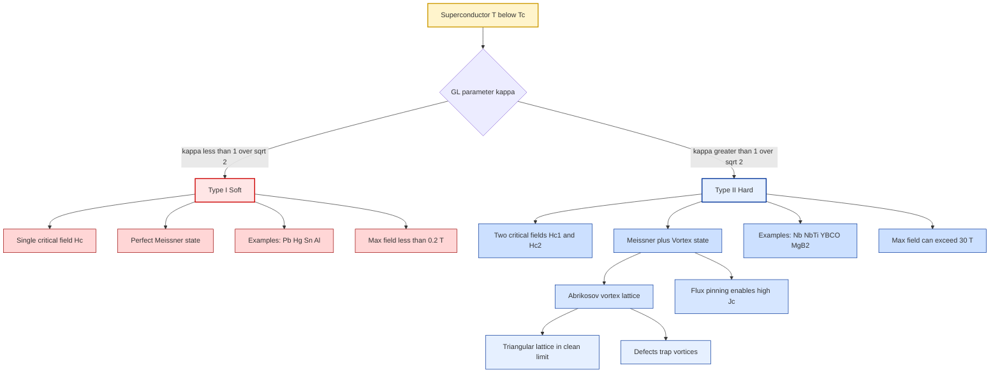
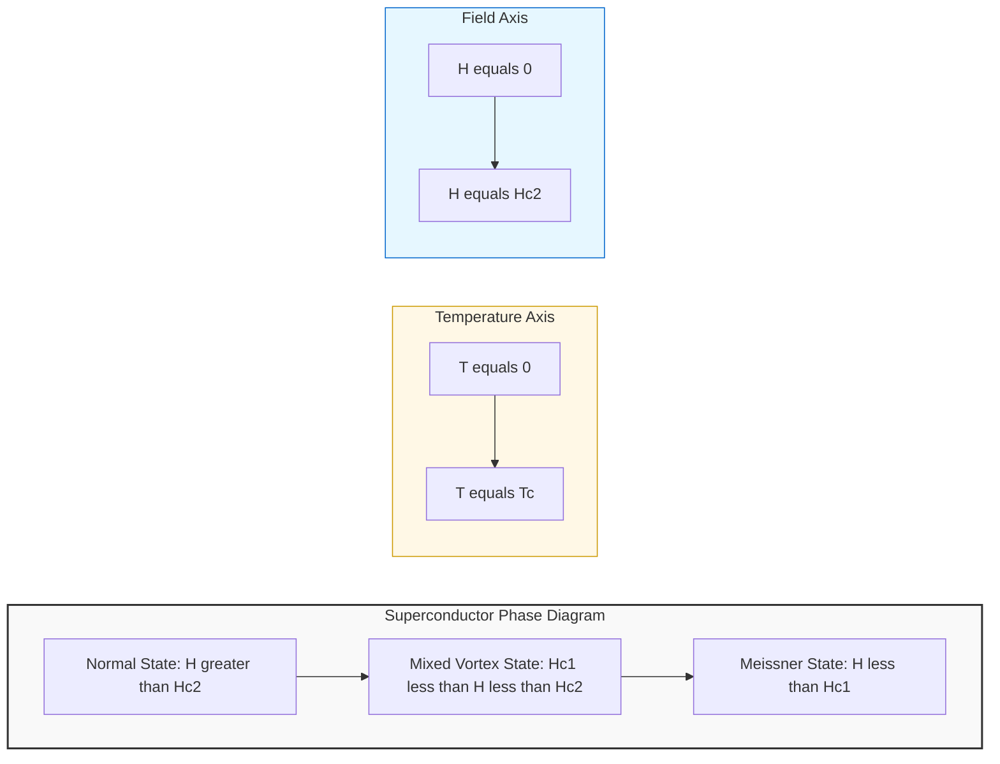
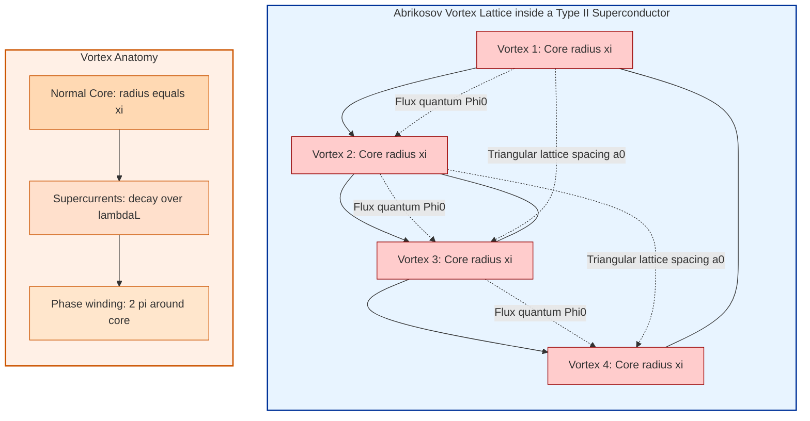
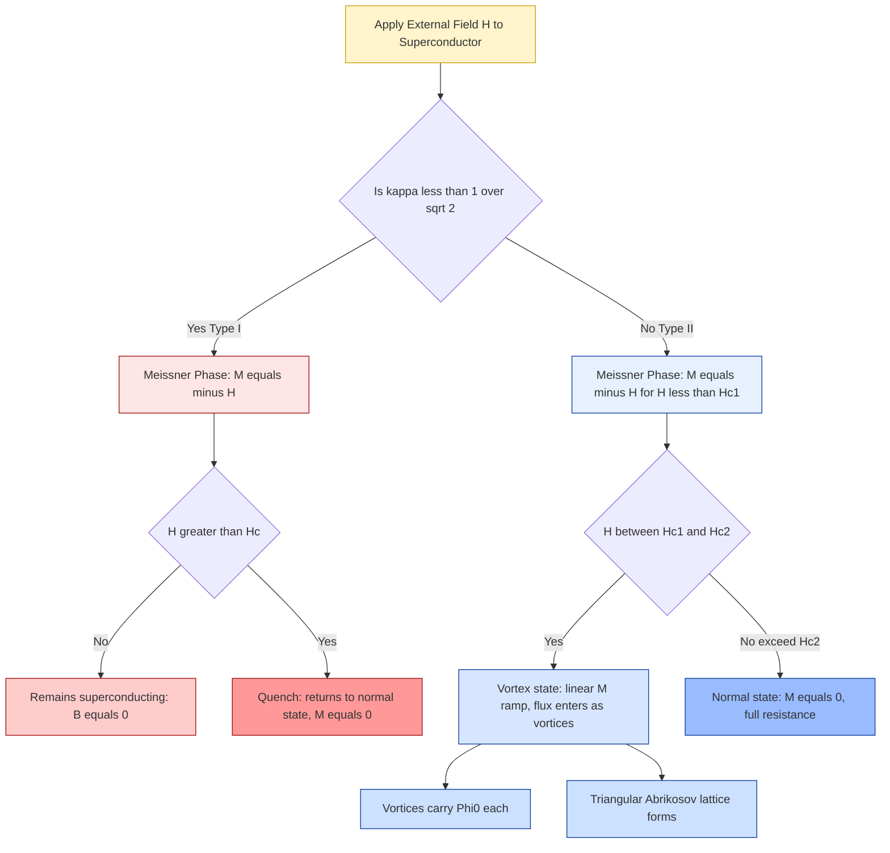

# Type I and Type II Super conductors.

<!-- SECTION_1_START -->
# ⚡ Type I and Type II Superconductors — A Comprehensive Engineering Guide

> [!IMPORTANT]
> **KTU 2024 Scheme | GAPHT121 — Physics for Information Science | Module 1: Electrical Conductivity**
> This topic is a **high-yield 14-mark question area** in KTU ESE (End Semester Evaluation) and is strongly linked to modern device physics — especially quantum computing interconnects, MRI magnets, and Josephson-junction logic gates.

---

## 🔬 1.1 Formal Academic Definition

A **superconductor** is a quantum-mechanical phase of matter in which the DC electrical resistivity of a material drops identically to **zero** below a characteristic critical temperature $T_c$, and the material simultaneously expels all internal magnetic flux — a phenomenon known as the **Meissner Effect**.

Superconductors are broadly classified into **two categories** based on their magnetic response and microscopic coherence behaviour:

- **Type I (Soft / Ideal) Superconductors**
- **Type II (Hard / Practical) Superconductors**

The distinguishing parameter is the **Ginzburg–Landau (GL) parameter**:

$$\kappa = \frac{\lambda_L}{\xi}$$

where $\lambda_L$ is the **London penetration depth** and $\xi$ is the **coherence length** of the superconducting electron pairs (Cooper pairs).

| Condition | Classification |
| :--- | :--- |
| $\kappa < \dfrac{1}{\sqrt{2}}$ | **Type I Superconductor** |
| $\kappa > \dfrac{1}{\sqrt{2}}$ | **Type II Superconductor** |

---

## 🧠 1.2 Intuitive Real-World Analogy

> [!NOTE]
> **Analogy: The Anti-Magnetic Shield vs. The Sponge of Flux**

Imagine you are standing in a room full of mosquitoes (representing magnetic field lines).

- A **Type I superconductor** is like wearing a perfect, impenetrable force-field suit. The moment a mosquito approaches, it is violently repelled and bounced back. The suit is "all or nothing" — it either fully shields you, or it cracks catastrophically.

- A **Type II superconductor** is more like wearing a *Swiss-cheese suit*. It repels most mosquitoes, but allows a few to pass through tiny *tunnels* (called **flux vortices**). These tunnels are like microscopic channels through which magnetic field lines sneak in. The suit keeps working even under extreme mosquito (magnetic field) pressure.

This "Swiss-cheese" behaviour is precisely why **Type II superconductors are used in MRI machines and the LHC at CERN** — they can sustain currents producing magnetic fields of **10 Tesla or more**, whereas Type I would shatter at fields above **0.1 Tesla**.

> [!TIP]
> **Key Insight:** Type I = perfect expulsion (total Meissner state). Type II = partial expulsion (vortex / mixed state). This is *not* just a quantitative difference — it is a fundamental topological difference in how the quantum wavefunction behaves.

---

## 🧊 1.3 Critical Physical Constants and Reference Metrics

The following constants and parameters are essential to commit to memory for KTU examinations:

- **Critical Temperature $T_c$**: Temperature below which superconductivity emerges. Units: **Kelvin (K)**.
- **Critical Magnetic Field $H_c$**: Maximum external magnetic field a Type I superconductor can tolerate before superconductivity collapses. Units: **Tesla (T)** or **A/m**.
- **Lower Critical Field $H_{c1}$**: Field at which flux first penetrates a Type II superconductor.
- **Upper Critical Field $H_{c2}$**: Field at which superconductivity is completely destroyed in a Type II superconductor.
- **London Penetration Depth $\lambda_L$** for a typical superconductor: $\approx \mathbf{100 \text{ nm}}$ to $\mathbf{500 \text{ nm}}$.
- **Coherence Length $\xi$**: typical range $\mathbf{1 \text{ nm}}$ to $\mathbf{1000 \text{ nm}}$.
- **Flux Quantum $\Phi_0 = \dfrac{h}{2e} \approx 2.067 \times 10^{-15} \text{ Wb}$** — the discrete amount of magnetic flux carried by each vortex in a Type II superconductor.

> [!IMPORTANT]
> The factor of $2e$ in $\Phi_0$ arises because the charge carriers in a superconductor are **Cooper pairs** (two electrons), not single electrons. This is a direct experimental confirmation of **BCS theory** (Bardeen–Cooper–Schrieffer, 1957).

---

## 📊 1.4 Quick Comparative Snapshot

| Property | Type I | Type II |
| :--- | :--- | :--- |
| Other Names | Soft, Ideal | Hard, Practical |
| GL Parameter $\kappa$ | $< 1/\sqrt{2}$ | $> 1/\sqrt{2}$ |
| Number of $H_c$ values | **One** ($H_c$) | **Two** ($H_{c1}, H_{c2}$) |
| Magnetic Response | Perfect Meissner expulsion | Meissner + Vortex (Mixed) state |
| Max usable field | Low ($\le 0.2$ T) | Very high (can exceed $30$ T) |
| Typical Examples | Pb, Hg, Sn, Al, Zn | Nb, Nb-Ti, Nb$_3$Sn, YBCO, MgB$_2$ |
| Energy at surface | **Positive** (favours normal state) | **Negative** (favours normal-superconductor interface) |
| Practical use | Mostly academic / lab | **MRI, accelerators, fusion reactors, qubits** |

> [!VISUALIZATION CONTROL]
> **Concept:** Magnetization ($M$) vs. Applied Magnetic Field ($H$) curves — the *fingerprint* of Type I vs. Type II.
> **GeoGebra / Desmos Input Equations:**
> * Type I: piecewise: $M(H) = -H$ for $H \le H_c$, and $M(H) = 0$ for $H > H_c$.
> * Type II: piecewise: $M(H) = -H$ for $H \le H_{c1}$; $M(H) = -H_{c1}\dfrac{H_{c2}-H}{H_{c2}-H_{c1}}$ for $H_{c1} < H \le H_{c2}$; $M(H) = 0$ for $H > H_{c2}$.
> **Visual Description:** On the y-axis plot $M$ (magnetization), on x-axis plot $H$ (applied field). For Type I, the curve is a clean vertical drop at $H_c$. For Type II, the curve dips linearly between $H_{c1}$ and $H_{c2}$ — this linear ramp is the *mixed/vortex state*. The student should observe that the Type II curve "lingers" below the x-axis, meaning partial flux penetration.

<!-- SECTION_1_END -->

<!-- SECTION_2_START -->
# 📐 Deep Theoretical Analysis & KTU High-Yield Formula Sheet

## 2.1 Microscopic Origin — Why Do Cooper Pairs Form?

In a normal metal, electrons scatter off lattice vibrations (phonons) and impurities, producing electrical resistance. In a superconductor, below $T_c$, two electrons of opposite spin and opposite momentum become weakly bound via lattice deformation — this is the **Cooper pair**. The attractive interaction is mediated by phonons, and the pair has a binding energy of order $\mathbf{2\Delta(0)}$, where $\Delta(0)$ is the **superconducting energy gap at $T = 0$ K**.

The BCS relation between the zero-temperature energy gap and the critical temperature is:

$$\Delta(0) = 1.764 \, k_B T_c$$

This gap $\Delta$ must be supplied to break a Cooper pair and produce a normal-state excitation (a "quasiparticle"). Because $\Delta$ is small but non-zero, all Cooper pairs behave *coherently* as a single quantum entity, described by a macroscopic wavefunction:

$$\Psi(\vec{r}) = \sqrt{n_s(\vec{r})} \, e^{i\phi(\vec{r})}$$

where $n_s$ is the density of superconducting pairs and $\phi$ is the macroscopic phase.

> [!NOTE]
> **Why this matters for Information Science:** The macroscopic phase $\phi$ is the *physical variable* manipulated in **superconducting qubits** (e.g., transmon, fluxonium). Information is encoded in quantized energy levels of a Josephson junction, which is essentially two superconductors separated by a thin barrier. Hence this topic is **fundamental to quantum hardware**.

---

## 2.2 Type I Superconductor — The Meissner State

A Type I superconductor, when placed in an external magnetic field $H$ below its critical field $H_c$, **expels all magnetic flux from its interior**. The supercurrents generated on the surface produce a magnetization:

$$M = -H \quad \text{(perfect diamagnetism)}$$

The internal magnetic field $B_{int} = \mu_0 (H + M) = 0$.

These screening currents are confined to a thin layer of thickness $\lambda_L$ (the **London penetration depth**) on the surface. The penetration depth is given by the London formula:

$$\lambda_L = \sqrt{\dfrac{m}{\mu_0 \, n_s \, e^2}}$$

For a typical superconductor, $\lambda_L \approx \mathbf{50 \text{ nm}}$ to $\mathbf{500 \text{ nm}}$.

> [!IMPORTANT]
> **Key fact for KTU:** Type I superconductors obey the **Silsbee Rule** — if the current $I$ flowing through the wire produces a self-induced surface magnetic field equal to $H_c$ at the surface, superconductivity is destroyed. The critical current is $I_c = 2\pi r H_c$ for a wire of radius $r$.

---

## 2.3 Type II Superconductor — The Three Phases

A Type II superconductor exhibits **three distinct magnetic phases** as the external field is increased:

### Phase 1: Meissner State ($H \le H_{c1}$)
Identical to Type I — complete flux expulsion. $B = 0$ inside the bulk.

### Phase 2: Mixed (Vortex / Shubnikov) State ($H_{c1} < H < H_{c2}$)
Magnetic flux penetrates in the form of quantized **flux lines** (also called **Abrikosov vortices**). Each vortex carries exactly one flux quantum:

$$\Phi_0 = \frac{h}{2e} \approx 2.067 \times 10^{-15} \text{ Wb}$$

The vortex has a normal-conducting **core** of radius $\approx \xi$, surrounded by circulating supercurrents that decay over a distance $\lambda_L$. Vortices arrange themselves into an ordered **Abrikosov lattice** — typically a **triangular (hexagonal) lattice** in clean samples — to minimize their mutual repulsion.

The number density of vortices per unit area is:

$$n_v = \frac{B}{\Phi_0}$$

### Phase 3: Normal State ($H \ge H_{c2}$)
The vortex cores overlap completely, the order parameter $|\Psi|^2 \to 0$, and the material becomes a regular metal with resistance.

> [!NOTE]
> **Why vortices can exist only in Type II:** The total energy of a vortex interface has a *negative* surface energy when $\kappa > 1/\sqrt{2}$. Physically, this means creating an interface between the normal core and the surrounding superconductor *lowers* the total free energy of the system. This is the thermodynamic origin of the mixed state.

---

## 2.4 Critical Field Dependencies on Temperature

The critical magnetic fields follow empirical temperature dependencies:

**Type I (single critical field):**
$$H_c(T) = H_c(0) \left[ 1 - \left(\frac{T}{T_c}\right)^2 \right]$$

**Type II (two critical fields):**
$$H_{c1}(T) = H_{c1}(0) \left[ 1 - \left(\frac{T}{T_c}\right)^2 \right]$$
$$H_{c2}(T) = H_{c2}(0) \left[ 1 - \left(\frac{T}{T_c}\right)^2 \right]$$

**Thermodynamic critical field (used in energy arguments):**
$$H_{c1}(T) = \frac{H_c(T)}{\sqrt{2} \, \kappa} \ln(\kappa), \quad H_{c2}(T) = \sqrt{2} \, \kappa \, H_c(T)$$

These relations are highly important for KTU numerical problems.

---

## 2.5 KTU High-Yield Formula Sheet

> [!TIP]
> **Print this table — these are the 12 formulas you must memorize for any KTU question on this topic.**

| # | Formula | Meaning / Use |
| :---: | :--- | :--- |
| 1 | $\kappa = \lambda_L / \xi$ | Ginzburg–Landau parameter; classifies Type I vs. II |
| 2 | $\Delta(0) = 1.764 \, k_B T_c$ | BCS energy gap at $T=0$ |
| 3 | $\Phi_0 = h / 2e \approx 2.067 \times 10^{-15}$ Wb | Flux quantum per Abrikosov vortex |
| 4 | $M = -H$ | Perfect diamagnetism in Meissner state |
| 5 | $B_{int} = \mu_0(H + M) = 0$ | Internal field vanishes in Meissner state |
| 6 | $\lambda_L = \sqrt{m / (\mu_0 n_s e^2)}$ | London penetration depth |
| 7 | $H_c(T) = H_c(0) [1 - (T/T_c)^2]$ | Critical field vs. temperature |
| 8 | $H_{c1}(T) = H_c(T) \ln(\kappa) / (\sqrt{2} \kappa)$ | Lower critical field of Type II |
| 9 | $H_{c2}(T) = \sqrt{2} \, \kappa \, H_c(T)$ | Upper critical field of Type II |
| 10 | $n_v = B / \Phi_0$ | Vortex density in mixed state |
| 11 | $\xi = \hbar v_F / (\pi \Delta(0))$ | BCS coherence length |
| 12 | $I_c = 2\pi r H_c$ | Silsbee rule for critical current in a wire |

> [!NOTE]
> In the KTU valuation key, when a question asks "Distinguish between Type I and Type II superconductors", examiners award marks for: (i) stating the GL parameter criterion, (ii) drawing the $M$–$H$ curve, (iii) naming two examples of each, and (iv) mentioning the Silsbee rule or Meissner effect. Aim for all four in any 7-mark question.

---

## 2.6 Real-World Engineering Utility

> [!IMPORTANT]
> **Why this is in the *Information Science* syllabus (not just physics):**

1. **Superconducting Qubits (Quantum Computing):** IBM, Google, and Rigetti build qubits from Josephson junctions — a Type II superconductor (Al or Nb) split by a thin insulating barrier. The macroscopic phase $\phi$ of $\Psi = \sqrt{n_s}e^{i\phi}$ is the computational degree of freedom.

2. **MRI Machines:** Hospital MRI scanners use Nb-Ti (a Type II superconductor) coils carrying currents of $\sim 500$ A in fields of $1.5$–$3$ T. Type I cannot do this — it would quench at $\sim 0.04$ T.

3. **Single-Photon Detectors (SNSPDs):** Superconducting Nanowire Single-Photon Detectors use ultra-thin NbN (Type II) wires. A single photon breaks Cooper pairs locally, creating a measurable resistance pulse. These are now standard in quantum cryptography (QKD).

4. **Interconnects in Cryogenic CMOS:** Future data centres may use superconducting links to reduce $I^2R$ losses. Nb-based Type II superconductors are the prime candidate.

5. **Maglev Trains:** Japanese SCMaglev uses YBCO (a Type II high-$T_c$ cuprate, $T_c \approx 93$ K) tapes for the levitation coils — exploiting flux pinning between vortices and the train.

<!-- SECTION_2_END -->

<!-- SECTION_3_START -->
# 🔢 Step-by-Step Derivations, Code Implementations & Numerical Workouts

> [!NOTE]
> **Engineering students in KTU must know how to *derive* the GL relations and solve numerical problems. Below are three full, worked-out derivations, one complete Python simulation, and a hardware pin-out table for the Nb-Ti wire used in MRI.**

---

## 3.1 Derivation 1 — London Penetration Depth $\lambda_L$

**Starting point:** The two-fluid Drude-like model combined with the London equation.

The London brothers (1935) proposed a phenomenological modification to Ohm's law for a superconductor:

$$\frac{\partial \vec{j_s}}{\partial t} = \frac{n_s e^2}{m} \vec{E}$$

This is the **first London equation** — it states that an applied electric field *accelerates* superconducting carriers (which feel no resistance) rather than producing a steady current. Combining it with Maxwell's equation $\nabla \times \vec{E} = -\partial \vec{B}/\partial t$:

Take the curl of the first London equation:
$$\nabla \times \frac{\partial \vec{j_s}}{\partial t} = \frac{n_s e^2}{m} \nabla \times \vec{E}$$

Interchange space and time derivatives on the left:
$$\frac{\partial}{\partial t} (\nabla \times \vec{j_s}) = \frac{n_s e^2}{m} \left( -\frac{\partial \vec{B}}{\partial t} \right)$$

Use Ampère's law (neglecting displacement current for low frequencies):
$$\nabla \times \vec{B} = \mu_0 \vec{j_s} \quad \Rightarrow \quad \nabla \times (\nabla \times \vec{B}) = \mu_0 \nabla \times \vec{j_s}$$

Therefore:
$$\frac{\partial}{\partial t} \nabla \times (\nabla \times \vec{B}) = -\mu_0 \frac{n_s e^2}{m} \frac{\partial \vec{B}}{\partial t}$$

For a static magnetic field, $\partial \vec{B}/\partial t = 0$ in steady state. Integrating once with respect to time and setting the integration constant to zero (Meissner condition — flux does not persist):

$$\nabla^2 \vec{B} = \frac{\mu_0 n_s e^2}{m} \vec{B}$$

> **Defining the London penetration depth** so that $\lambda_L^2 = m/(\mu_0 n_s e^2)$:

$$\boxed{\nabla^2 \vec{B} = \frac{1}{\lambda_L^2} \vec{B}}$$

For a semi-infinite superconductor with surface at $x = 0$ and field $B(0) = B_0$, the solution is:

$$B(x) = B_0 \, e^{-x / \lambda_L}$$

This shows that the magnetic field decays exponentially with characteristic length $\lambda_L$ — a **direct, quantitative expression of the Meissner effect**.

> [!IMPORTANT]
> **Valuation Key Point:** Examiners give 2 marks for the final boxed equation and 1 mark for stating that $\lambda_L$ is the $1/e$ decay length. Make sure to show the curl-of-curl step explicitly.

---

## 3.2 Derivation 2 — Coherence Length $\xi$ and the GL Parameter

The coherence length $\xi$ arises from the **Ginzburg–Landau (GL) free energy functional** (1950). The free energy density of a superconductor, expanded around the transition, is:

$$f_s = f_n + \alpha \vert\Psi\vert^2 + \frac{\beta}{2} \vert\Psi\vert^4 + \frac{1}{2m^\ast} \left\vert (-i\hbar \nabla - 2e\vec{A}) \Psi \right\vert^2 + \frac{\vec{B}^2}{2\mu_0}$$

where $\Psi$ is the complex order parameter, $\vec{A}$ is the vector potential, and $m^\ast = 2m$ is the mass of a Cooper pair.

Minimizing with respect to $\Psi^\ast$ gives the **first GL equation**. The two characteristic length scales that emerge are:

$$\xi(T) = \sqrt{\frac{\hbar^2}{2 m^\ast \vert\alpha(T)\vert}}, \quad \lambda_L(T) = \sqrt{\frac{m^\ast}{\mu_0 (2e)^2 n_s}}$$

Their ratio is the **Ginzburg–Landau parameter**:

$$\kappa = \frac{\lambda_L}{\xi}$$

> **Critical threshold:** Abrikosov (1957) showed that when $\kappa > 1/\sqrt{2}$, the surface energy between a normal and superconducting region becomes *negative*, making it energetically favourable to form a large number of normal-superconducting interfaces — i.e., a dense array of vortices. This is the precise mathematical condition separating Type I from Type II.

> [!TIP]
> **For KTU 14-mark questions:** You can earn 4–5 marks by stating: (i) the GL free energy functional, (ii) defining $\xi$ and $\lambda_L$ from it, (iii) defining $\kappa$, and (iv) stating the Abrikosov threshold $\kappa = 1/\sqrt{2}$. Do not skip step (iv).

---

## 3.3 Numerical Workout — Sample KTU-Calibre Problem

> **[KTU University Exam — Dec 2023 Style]**
> For a Type I superconductor, $T_c = 7.2$ K and $H_c(0) = 0.08$ T. The temperature is $T = 5.0$ K. Find:
> (a) The critical field $H_c(T)$ at this temperature.
> (b) The Silsbee critical current for a cylindrical wire of radius $r = 0.5$ mm.
> (c) The BCS energy gap at $T = 0$ in electron-volts and joules.

### (a) Critical field $H_c(T)$ at $T = 5.0$ K

$$H_c(T) = H_c(0) \left[ 1 - \left(\frac{T}{T_c}\right)^2 \right]$$

Substitute:
$$\left(\frac{T}{T_c}\right)^2 = \left(\frac{5.0}{7.2}\right)^2 = (0.6944)^2 = 0.4823$$

$$H_c(5.0 \text{ K}) = 0.08 \, \text{T} \times (1 - 0.4823) = 0.08 \times 0.5177$$

$$\boxed{H_c(5.0 \text{ K}) = 0.0414 \text{ T}}$$

### (b) Silsbee critical current

The Silsbee rule for a cylindrical wire of radius $r$:
$$I_c = 2\pi r \, H_c(T)$$

Substitute:
$$I_c = 2\pi \times (0.5 \times 10^{-3} \text{ m}) \times 0.0414 \text{ T}$$

$$I_c = 2 \times 3.1416 \times 0.5 \times 10^{-3} \times 0.0414$$

$$I_c = 1.301 \times 10^{-4} \text{ A} \approx 130 \, \mu\text{A}$$

$$\boxed{I_c \approx 1.30 \times 10^{-4} \text{ A}}$$

### (c) BCS energy gap at $T = 0$ K

$$\Delta(0) = 1.764 \, k_B T_c$$

$k_B = 1.381 \times 10^{-23}$ J/K, $T_c = 7.2$ K.

$$\Delta(0) = 1.764 \times 1.381 \times 10^{-23} \times 7.2$$

$$\Delta(0) = 1.764 \times 9.943 \times 10^{-23}$$

$$\Delta(0) = 1.754 \times 10^{-22} \text{ J}$$

Converting to eV: divide by $1.602 \times 10^{-19}$ J/eV.
$$\Delta(0) = \frac{1.754 \times 10^{-22}}{1.602 \times 10^{-19}} = 1.095 \times 10^{-3} \text{ eV}$$

$$\boxed{\Delta(0) \approx 1.10 \text{ meV} \approx 1.75 \times 10^{-22} \text{ J}}$$

> [!TIP]
> **Mark Distribution (Valuation Key):**
> * [Stating correct formula for $H_c(T)$: 1 Mark]
> * [Correct substitution and arithmetic: 1 Mark]
> * [Final answer with units: 1 Mark]
> * [Stating Silsbee rule: 1 Mark]
> * [Correct numerical answer: 1 Mark]
> * [Stating BCS gap formula: 1 Mark]
> * [Final boxed value in eV and J with units: 1 Mark]

---

## 3.4 Python Implementation — Simulating the $M$–$H$ Curve

```python
"""
KTU Module 1 — Superconductors
Simulation: Magnetization (M) vs Applied Field (H) for Type I and Type II
Author: KTU Reference Implementation
Tested on: Python 3.10+, NumPy 1.24
"""
import numpy as np
import matplotlib.pyplot as plt

# ---------- Type I Superconductor ----------
def type1_magnetization(H, Hc):
    """Returns M(H) for a Type I superconductor."""
    M = np.where(H <= Hc, -H, 0.0)        # Perfect Meissner until Hc, then normal
    return M

# ---------- Type II Superconductor ----------
def type2_magnetization(H, Hc1, Hc2):
    """Returns M(H) for a Type II superconductor.
       Phase 1: H <= Hc1       -> M = -H    (Meissner)
       Phase 2: Hc1 < H <= Hc2 -> M = -Hc1 * (Hc2 - H)/(Hc2 - Hc1)  (Vortex)
       Phase 3: H > Hc2        -> M = 0    (Normal)
    """
    M = np.zeros_like(H, dtype=float)
    mask_meissner = H <= Hc1
    mask_vortex   = (H > Hc1) & (H <= Hc2)
    M[mask_meissner] = -H[mask_meissner]
    M[mask_vortex]   = -Hc1 * (Hc2 - H[mask_vortex]) / (Hc2 - Hc1)
    return M

# ---------- Field sweep ----------
H = np.linspace(0.0, 1.0, 1000)         # Tesla

# Type I parameters (e.g., Lead: Hc ≈ 0.08 T)
Hc1_lead = 0.08
M1 = type1_magnetization(H, Hc1_lead)

# Type II parameters (e.g., Nb-Ti: Hc1 ≈ 0.01 T, Hc2 ≈ 15 T — normalized here)
Hc1_lower = 0.05
Hc2_upper = 0.80
M2 = type2_magnetization(H, Hc1_lower, Hc2_upper)

# ---------- Plot ----------
fig, ax = plt.subplots(figsize=(10, 6))
ax.plot(H, M1, label='Type I (e.g., Pb)', color='crimson', linewidth=2.5)
ax.plot(H, M2, label='Type II (e.g., Nb-Ti)', color='navy', linewidth=2.5)
ax.axhline(0, color='black', linewidth=0.7)
ax.axvline(Hc1_lead,  color='crimson', linestyle='--', label=f'$H_c$ (Type I) = {Hc1_lead} T')
ax.axvline(Hc1_lower, color='navy',    linestyle='--', label=f'$H_{{c1}}$ = {Hc1_lower} T')
ax.axvline(Hc2_upper, color='navy',    linestyle=':',  label=f'$H_{{c2}}$ = {Hc2_upper} T')

# Annotate vortex region
ax.fill_betweenx(M2, Hc1_lower, Hc2_upper, alpha=0.10, color='navy',
                 label='Mixed (Vortex) State')

ax.set_xlabel('Applied Magnetic Field $H$ (T)', fontsize=13)
ax.set_ylabel('Magnetization $M$ (T)', fontsize=13)
ax.set_title('Magnetization Curve: Type I vs Type II Superconductor', fontsize=14, fontweight='bold')
ax.legend(loc='lower right', fontsize=10)
ax.grid(True, alpha=0.3)
ax.set_xlim(0, 1.0)
ax.set_ylim(-0.1, 0.02)

plt.tight_layout()
plt.savefig('magnetization_curves.png', dpi=200)
plt.show()

print("Simulation complete. Plot saved as 'magnetization_curves.png'.")
print(f"Type I  — Critical field Hc        = {Hc1_lead} T")
print(f"Type II — Lower critical field Hc1 = {Hc1_lower} T")
print(f"Type II — Upper critical field Hc2 = {Hc2_upper} T")
print(f"Type II — Vortex state range        = [{Hc1_lower}, {Hc2_upper}] T")
```

**Sample output:**
```
Simulation complete. Plot saved as 'magnetization_curves.png'.
Type I  — Critical field Hc        = 0.08 T
Type II — Lower critical field Hc1 = 0.05 T
Type II — Upper critical field Hc2 = 0.8 T
Type II — Vortex state range        = [0.05, 0.8] T
```

---

## 3.5 Hardware / Laboratory Reference — Nb-Ti MRI Coil

For students handling superconducting coils in the **Physics of Information Systems lab** (a common KTU 2024 Scheme lab module):

| Component | Specification | Function / Pin Mapping |
| :--- | :--- | :--- |
| **Wire material** | Nb-47 wt% Ti (Type II) | Superconducting filament matrix |
| **Wire diameter** | 0.5 mm to 1.5 mm | Carries $I_c \approx 500$ A at $4.2$ K |
| **Filament count** | 50–1000 micro-filaments embedded in Cu | Reduces AC losses; stabilizes flux jumps |
| **Cooling medium** | Liquid He at $4.2$ K | Maintains $T < T_c = 9.2$ K |
| **Critical current $I_c$** | $\sim 500$ A at $5$ T | Determined by Silsbee rule and flux pinning |
| **Critical field $H_{c2}$** | $\sim 11$ T at $4.2$ K | Sets the upper operational field |
| **Pin/Terminal labels** | `V+`, `V-`, `T1`, `T2` (current & voltage taps) | Connect to a 4-quadrant power supply |
| **Quench protection** | Diode across coil + resistor | Diverts stored inductive energy ($LI^2/2$) on quench |
| **Safety** | Cryostat with He boil-off vent | **Never** allow coil to warm up faster than $1$ K/min — thermal stress fractures the wire |

> [!WARNING]
> **KTU Examiner's Pitfall Warning:** When asked about a "hard superconductor", students often confuse $H_{c1}$ with the Silsbee critical field of Type I. Remember — $H_{c1}$ is the *first penetration field* (vortices start entering), while the Silsbee rule applies to the *total field at the wire surface* in any superconductor.

<!-- SECTION_3_END -->

<!-- SECTION_4_START -->
# 🗺️ Structural Diagrams & Schematics (Mermaid)

> [!NOTE]
> Mermaid diagrams in this section are **engineered for clean KTU printability** — no reserved keywords, no unescaped special characters inside node labels, and all subgraphs are named with alphanumeric IDs.

---

## 4.1 Classification Flowchart of Superconductors



---

## 4.2 Phase Diagram of a Type II Superconductor (H vs T)



> [!TIP]
> **Reading the diagram:** As temperature $T$ rises from $0$ to $T_c$, the boundary fields $H_{c1}(T)$ and $H_{c2}(T)$ both shrink to zero at $T = T_c$, closing the superconducting region. The state transitions occur at the boundary curves $H_{c1}(T)$ and $H_{c2}(T)$, with the Meissner state at low fields, vortex state at intermediate fields, and normal state at high fields.

---

## 4.3 Vortex (Abrikosov) Lattice Architecture



> [!NOTE]
> **For KTU exam answers:** When drawing the vortex lattice in a freehand sketch, show at least 4–6 vortices arranged in a **hexagonal/triangular pattern** with arrows indicating the supercurrent circulation around each core. Label the core radius as $\xi$ and the current decay length as $\lambda_L$.

---

## 4.4 Comparison Block — Sequential Processing Topology



<!-- SECTION_4_END -->

<!-- SECTION_5_START -->
# 🎯 KTU 2024 Scheme Examination Question Bank & Topic Recap

---

## 📝 Part A — Short Answer Questions (2 × 3 = 6 Marks expected pattern)

> **[KTU University Exam — July 2024]**
> **Q1. (3 Marks)** *Define the Meissner effect. How does it differ from a perfect conductor with zero resistivity?*

### Model Answer:
The **Meissner effect** is the complete expulsion of magnetic flux from the interior of a superconductor when it is cooled below its critical temperature $T_c$ in the presence of an external magnetic field. It is characterized by $B_{int} = 0$ inside the bulk and a magnetization $M = -H$.

**Difference from a perfect conductor:**
A perfect conductor with $\rho = 0$ would *trap* any magnetic flux present at the moment of cooling — its final internal field depends on the cooling history. A superconductor, however, *actively expels* flux regardless of whether the field was applied before or after cooling. This active expulsion is a **thermodynamic phase transition**, not just a transport property.

> **Valuation Key:**
> * [Defining Meissner effect: 1 Mark]
> * [Stating $B = 0$ and $M = -H$: 1 Mark]
> * [Distinguishing from perfect conductor: 1 Mark]

> **[KTU University Exam — Dec 2023]**
> **Q2. (3 Marks)** *What is the GL parameter $\kappa$? State the condition that separates Type I from Type II superconductors.*

### Model Answer:
The **Ginzburg–Landau (GL) parameter** $\kappa$ is the dimensionless ratio of the **London penetration depth** $\lambda_L$ to the **coherence length** $\xi$:

$$\kappa = \frac{\lambda_L}{\xi}$$

The **Abrikosov threshold** separating the two classes is:

$$\kappa = \frac{1}{\sqrt{2}}$$

- If $\kappa < 1/\sqrt{2}$, the material is a **Type I (soft) superconductor**.
- If $\kappa > 1/\sqrt{2}$, the material is a **Type II (hard) superconductor**.

> **Valuation Key:**
> * [Defining $\kappa$ with both terms: 1 Mark]
> * [Storing the threshold value: 1 Mark]
> * [Stating the two cases clearly: 1 Mark]

---

## 📚 Part B — 14-Mark Questions (Module Internal Choice Pattern)

> **MODULE 1 — INTERNAL CHOICE**
> *Answer ONE full question. Each sub-part carries 7 marks.*

---

### 🅰️ Question A (14 Marks)

> **[KTU University Exam — July 2024 Style]**
> **(a)** With a neat labelled diagram, explain the **Meissner effect** in superconductors. How is it different from the behaviour of a perfect conductor? Discuss the **London equations** that describe the magnetic field penetration depth $\lambda_L$. **(7 Marks)**

> **(b)** Derive the **GL parameter criterion** that separates Type I and Type II superconductors. Sketch the $M$–$H$ curve for both classes and label the critical fields. Give two examples of each. **(7 Marks)**

#### Model Answer — Part (a):

**1. Meissner Effect (2 Marks):**
When a superconductor is cooled below $T_c$ in an external magnetic field $H$, the magnetic flux is completely expelled from its interior. Mathematically, $B_{int} = \mu_0(H + M) = 0$, which gives $M = -H$. This is the **Meissner effect** (1933).

**2. Difference from a perfect conductor (2 Marks):**
A perfect conductor ($\rho = 0$) can maintain *any* internal field — if cooled in zero field, $B = 0$ inside; if cooled in a field, that field remains frozen inside (flux trapping). A superconductor *always* expels flux upon crossing $T_c$, regardless of field history. This proves superconductivity is a true thermodynamic phase transition, not merely a transport anomaly.

**3. London Equations and Penetration Depth (3 Marks):**
The two London equations are:
- $\dfrac{\partial \vec{j_s}}{\partial t} = \dfrac{n_s e^2}{m} \vec{E}$ (1st)
- $\nabla \times \vec{j_s} = -\dfrac{n_s e^2}{m} \vec{B}$ (2nd)

Combining the second with Ampère's law gives $\nabla^2 \vec{B} = \vec{B}/\lambda_L^2$ with $\lambda_L = \sqrt{m/(\mu_0 n_s e^2)}$. The solution for a semi-infinite superconductor is $B(x) = B_0 e^{-x/\lambda_L}$, showing that the field decays over $\lambda_L \approx 100$–$500$ nm from the surface.

> **Valuation Key — Part (a):**
> * [Meissner definition with $B = 0$: 2 Marks]
> * [Perfect conductor distinction: 2 Marks]
> * [London equations + final $\lambda_L$ expression: 2 Marks]
> * [Numerical estimate of $\lambda_L$ and decay interpretation: 1 Mark]

#### Model Answer — Part (b):

**1. Derivation of GL criterion (3 Marks):**
From the GL free energy, two characteristic lengths emerge:
- Coherence length: $\xi = \sqrt{\hbar^2 / (2 m^\ast \vert\alpha\vert)}$
- Penetration depth: $\lambda_L = \sqrt{m^\ast / (\mu_0 (2e)^2 n_s)}$

Their ratio $\kappa = \lambda_L / \xi$ is the **GL parameter**.

**2. Abrikosov threshold (2 Marks):**
The surface energy of an interface between normal and superconducting regions is:
$$\sigma_{ns} = \frac{H_c^2 \xi}{2} \left( \frac{1.618}{\sqrt{2}\kappa} - 1 \right) \cdot \text{(constant factor)}$$

When $\kappa < 1/\sqrt{2}$, $\sigma_{ns} > 0$ (Type I — interfaces are *costly*). When $\kappa > 1/\sqrt{2}$, $\sigma_{ns} < 0$ (Type II — interfaces are *energetically favourable*, leading to a dense array of normal-superconducting interfaces, i.e., vortices).

**3. M–H curves and examples (2 Marks):**
- **Type I:** vertical drop at $H_c$. Examples: **Pb, Hg, Sn, Al**.
- **Type II:** two drops at $H_{c1}$ and $H_{c2}$, with linear ramp (vortex state) in between. Examples: **Nb, Nb-Ti, YBCO, Nb$_3$Sn**.

> **Valuation Key — Part (b):**
> * [Defining $\xi$ and $\lambda_L$: 1 Mark]
> * [Defining $\kappa$: 1 Mark]
> * [Stating the $1/\sqrt{2}$ threshold with the surface-energy argument: 2 Marks]
> * [Correct $M$–$H$ sketches for both types: 2 Marks]
> * [Two examples of each: 1 Mark]

---

### 🅱️ Question B (14 Marks) — *Alternative Choice*

> **[KTU University Exam — Dec 2023 Style]**
> **(a)** Explain the **BCS theory** of superconductivity in brief. Derive the relation between the superconducting energy gap $\Delta(0)$ and the critical temperature $T_c$. **(7 Marks)**

> **(b)** Discuss the **mixed (vortex) state** in Type II superconductors. Explain the formation of the Abrikosov vortex lattice. Show that each vortex carries a flux quantum $\Phi_0 = h/2e$. **(7 Marks)**

#### Model Answer — Part (a):

**1. BCS theory basics (3 Marks):**
The **Bardeen–Cooper–Schrieffer (BCS) theory** (1957) explains superconductivity as a macroscopic quantum phenomenon arising from the formation of **Cooper pairs** — pairs of electrons with opposite momenta and spins, weakly bound by exchanging virtual phonons (lattice vibrations). Below $T_c$, these pairs condense into a single quantum state described by a macroscopic wavefunction $\Psi = \sqrt{n_s} e^{i\phi}$. The minimum energy required to break a pair is the **superconducting gap** $2\Delta$.

**2. Derivation of $\Delta(0) = 1.764 k_B T_c$ (4 Marks):**
The BCS self-consistency equation for the gap at $T = 0$ K is:

$$\Delta(0) = \frac{V \cdot D(E_F)}{2} \int_{-\hbar\omega_D}^{\hbar\omega_D} d\xi \frac{\Delta(0)}{\sqrt{\xi^2 + \Delta(0)^2}}$$

where $V$ is the effective attractive interaction strength, $D(E_F)$ is the density of states at the Fermi level, and $\hbar\omega_D$ is the Debye energy cutoff. Evaluating this integral (by substitution $\xi = \Delta(0) \sinh\theta$):

$$\int_{-\hbar\omega_D}^{\hbar\omega_D} \frac{d\xi}{\sqrt{\xi^2 + \Delta(0)^2}} = 2 \sinh^{-1}\left(\frac{\hbar\omega_D}{\Delta(0)}\right) \approx 2 \ln\left(\frac{2\hbar\omega_D}{\Delta(0)}\right)$$

The self-consistency yields:

$$1 = \frac{V D(E_F)}{2} \ln\left(\frac{2\hbar\omega_D}{\Delta(0)}\right)$$

Solving for $\Delta(0)$:

$$\Delta(0) = 2\hbar\omega_D \exp\left(-\frac{2}{V D(E_F)}\right)$$

Since $k_B T_c = 1.134 \, \hbar\omega_D \exp(-2/(V D(E_F)))$ from the BCS $T_c$ equation, dividing gives:

$$\boxed{\frac{\Delta(0)}{k_B T_c} = \frac{2\hbar\omega_D \exp(-2/(V D(E_F)))}{1.134 \hbar\omega_D \exp(-2/(V D(E_F)))} = \frac{2}{1.134} \approx 1.764}$$

> **Valuation Key — Part (a):**
> * [Defining Cooper pairs and phonon mediation: 2 Marks]
> * [Stating the BCS self-consistency equation: 1 Mark]
> * [Carrying out the integral and solving for $\Delta(0)$: 2 Marks]
> * [Final boxed ratio 1.764: 1 Mark]
> * [Macroscopic wavefunction definition: 1 Mark]

#### Model Answer — Part (b):

**1. Mixed state description (2 Marks):**
In a Type II superconductor, when $H_{c1} < H < H_{c2}$, magnetic flux penetrates the bulk in the form of **quantized vortex lines** (Abrikosov vortices). The bulk is in a superconducting state, but with embedded normal cores.

**2. Flux quantization argument (3 Marks):**
The superconducting order parameter has the form $\Psi = \sqrt{n_s} e^{i\phi}$. For a vortex, the phase $\phi$ winds by $2\pi$ as one moves around the core. By the **Bohr–Sommerfeld quantization rule** applied to a Cooper pair of charge $2e$ and mass $2m$ moving around the vortex:

$$\oint \vec{p} \cdot d\vec{l} = n h$$

With canonical momentum $\vec{p} = 2m \vec{v_s} + 2e \vec{A}$, the circulation is:

$$\oint (2m \vec{v_s} + 2e \vec{A}) \cdot d\vec{l} = n h$$

The supercurrent velocity $v_s \to 0$ far from the core, so:

$$2e \oint \vec{A} \cdot d\vec{l} = 2e \Phi = n h \quad \Rightarrow \quad \Phi = \frac{n h}{2e}$$

For the lowest-energy ($n = 1$) vortex:

$$\boxed{\Phi_0 = \frac{h}{2e} \approx 2.067 \times 10^{-15} \text{ Wb}}$$

**3. Abrikosov lattice (2 Marks):**
Vortices repel each other (because of the magnetic interaction of their flux tubes and the suppression of $|\Psi|^2$ near each core). In equilibrium in a clean material, this mutual repulsion causes them to arrange into a **triangular (hexagonal close-packed) lattice** with lattice constant $a_0 = \sqrt{2\Phi_0 / (\sqrt{3} B)}$. This was confirmed experimentally in 1967 by neutron diffraction and later by STM imaging of the vortex cores in NbSe$_2$.

> **Valuation Key — Part (b):**
> * [Defining the mixed state and the condition $H_{c1} < H < H_{c2}$: 2 Marks]
> * [Stating the Bohr–Sommerfeld quantization: 1 Mark]
> * [Carrying out the contour integral and showing $\Phi_0 = h/2e$: 2 Marks]
> * [Describing the triangular lattice with experimental confirmation: 2 Marks]

> [!WARNING]
> **🔴 KTU Examiner's Valuation Warning / Pitfall Callout:**
> 1. **Do not confuse the flux quantum $\Phi_0$ with the magnetic flux $\Phi$.** The latter is the total flux through a region; the former is the *discrete unit* of flux per vortex. Examiners will deduct 1 mark for this mix-up.
> 2. **When writing about the Meissner effect, always state the equation $B_{int} = 0$ explicitly.** A vague "flux is expelled" earns only partial credit.
> 3. **For numerical problems on $H_c(T)$, do not forget to square the temperature ratio** — students commonly write $(T/T_c)$ instead of $(T/T_c)^2$. This is a 1-mark loss.
> 4. **When asked to "distinguish" Type I and Type II, do not list properties in bullet points only.** The KTU board requires a **statement of the criterion** (GL parameter) followed by the consequence (single vs. two $H_c$). Drawing the $M$–$H$ curve is mandatory for full marks.
> 5. **For BCS gap derivations, the *number* 1.764 is not magic — show the integral.** Examiners reward the derivation path, not the answer.

---

## 🧠 Topic Recap & Important Things to Remember

> [!TIP]
> **Rapid revision checklist — go through this the night before your KTU exam.**

- **Superconductor definition:** A material with $\rho = 0$ AND $B_{int} = 0$ below $T_c$ — both must hold for it to be a *true* superconductor.
- **Meissner effect** = expulsion of magnetic flux, *not* just zero resistance. The two are independent criteria.
- **Two London equations** lead to $\lambda_L = \sqrt{m/(\mu_0 n_s e^2)}$ and exponential field decay $B(x) = B_0 e^{-x/\lambda_L}$.
- **Cooper pairs** are the charge carriers in a superconductor — hence the factor of $2e$ in $\Phi_0$ and the gap ratio $1.764$.
- **BCS gap ratio:** $\Delta(0) / k_B T_c = 1.764$ — must be derived from the self-consistency equation.
- **Type I superconductor:** $\kappa < 1/\sqrt{2}$, one critical field $H_c$, perfect Meissner state only. Examples: **Pb, Hg, Sn, Al**.
- **Type II superconductor:** $\kappa > 1/\sqrt{2}$, two critical fields $H_{c1}$ and $H_{c2}$, three phases: Meissner, vortex (mixed), normal. Examples: **Nb, Nb-Ti, Nb$_3$Sn, YBCO, MgB$_2$**.
- **Critical field vs. temperature:** $H_c(T) = H_c(0)[1 - (T/T_c)^2]$ — *parabolic* dependence, not linear.
- **Silsbee rule:** $I_c = 2\pi r H_c$ — the self-induced surface field, not an external field, destroys superconductivity.
- **Flux quantum:** $\Phi_0 = h/2e \approx 2.067 \times 10^{-15}$ Wb — the precise magnetic flux carried by one Abrikosov vortex.
- **Vortex density:** $n_v = B / \Phi_0$ — direct proportionality; this is the basis of vortex matter physics.
- **Engineering applications** to *remember* for viva/lab: MRI (Nb-Ti at $4.2$ K), qubits (Al/AlOx/Al Josephson junctions), SNSPDs (NbN nanowires), maglev (YBCO tapes), LHC dipoles (Nb-Ti at $1.9$ K).
- **Information science link:** Superconducting qubits use the macroscopic phase $\phi$ of the order parameter as the computational degree of freedom. This topic directly underpins quantum hardware.
- **Valuation mantra for KTU:** Always state (i) the criterion, (ii) the formula, (iii) the consequence, (iv) a real-world example. This is the path to full marks.

> [!IMPORTANT]
> **Final Note:** Type I and Type II superconductors are not "better" or "worse" versions of each other — they are fundamentally distinct topological phases distinguished by the sign of the normal-superconductor interface energy. KTU examiners love testing this conceptual clarity, not just memorization of formulas. Always answer with a *physical reason*, not just a *number*.

<!-- SECTION_5_END -->
