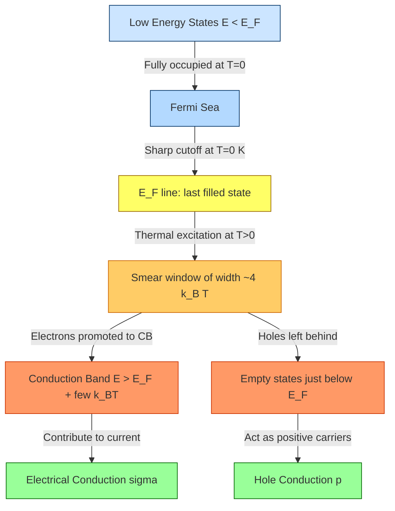
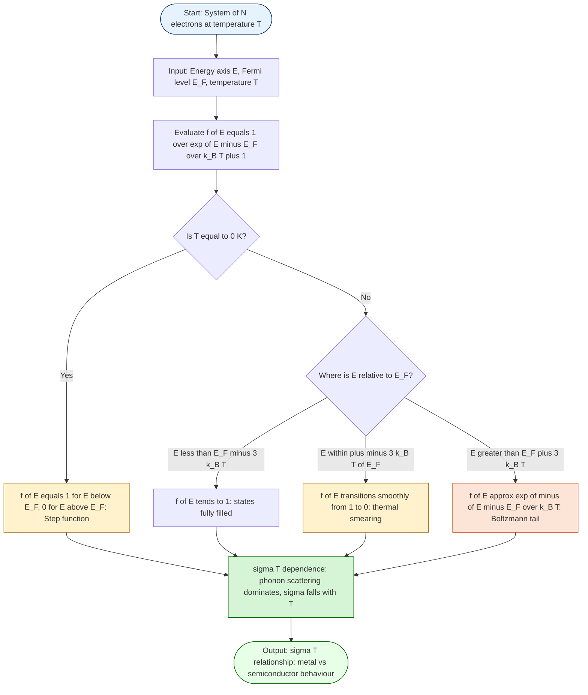
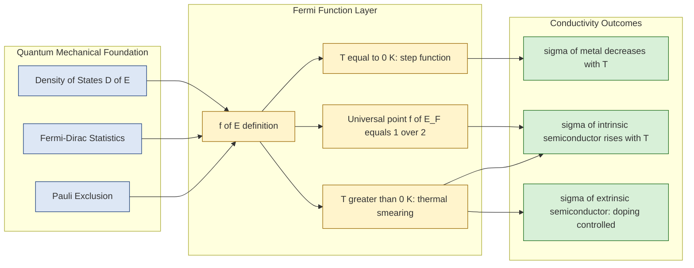

# Variation of Fermi function with temperature

<!-- SECTION_1_START -->

# 1. Core Technical Definition & Intuitive Overview

## 1.1 Formal Definition (KTU 2024 Syllabus Terminology)

The **Fermi–Dirac Distribution Function** (commonly called the **Fermi function**) is a probability function that quantifies the thermodynamic likelihood of an available quantum state at energy $E$ being occupied by a fermion (here, an electron) when the system of identical spin-$\tfrac{1}{2}$ particles is in thermal equilibrium at absolute temperature $T$. In the context of the *Physics for Information Science* (GAPHT121) syllabus, this function is the foundation of **Fermi–Dirac statistics** and is the cornerstone for explaining the **temperature dependence of electrical conductivity** in metals, semiconductors, and nanoscale devices used in information technology.

Mathematically, it is expressed as:

$$f(E) \;=\; \frac{1}{\exp\!\left(\dfrac{E - E_{F}}{k_{B} T}\right) + 1}$$

where the three key quantities are:

| Symbol | Quantity | Typical Value / Unit |
|:---:|:---|:---|
| $E$ | Energy of the quantum state | eV |
| $E_{F}$ | **Fermi energy** (chemical potential at $T=0$) | $\approx \mathbf{7.0\ eV}$ for Cu |
| $k_{B}$ | Boltzmann constant | $\mathbf{1.38 \times 10^{-23}\ J/K} \;=\; \mathbf{8.617 \times 10^{-5}\ eV/K}$ |
| $T$ | Absolute temperature | K |

> [!IMPORTANT]
> **Board-Examiner Definition (memorise verbatim):**
> *"The Fermi function $f(E)$ gives the probability that an electron occupies an energy state $E$ at temperature $T$, subject to the Pauli Exclusion Principle."*

---

## 1.2 Conceptual Analogy — The "Stadium Seat Occupancy" Model

Imagine a giant stadium with **infinitely many seats** arranged in rows. Each row represents an energy level, and each seat represents one quantum state. The rule of the stadium is that **only one spectator (electron) can sit in a seat** (Pauli exclusion).

- **At $T = 0\ K$ (Empty Stadium, Closed Doors):** Spectators fill every seat from the lowest row (ground floor) upward. The very last row that gets filled is the **Fermi level** $E_{F}$. Every row below $E_{F}$ is *completely full*, and every row above is *completely empty*. The result is a sharp step.
- **At $T > 0\ K$ (Doors Open, Spectators Wander):** A small number of spectators near the top rows gain enough thermal "energy" to climb a few rows higher, leaving some empty seats just *below* $E_{F}$ and filling a few seats just *above* $E_{F}$. This creates a **"smear" of width $\sim k_{B}T$** around $E_{F}$.
- **Very far above $E_{F}$:** Rows are nearly empty, and the few spectators found there follow the classical **Boltzmann distribution** $f(E) \approx e^{-(E-E_{F})/k_{B}T}$.

> [!NOTE]
> **Take-away insight:** $f(E)$ is essentially a *step function that is thermally rounded over an energy window of width $\approx k_{B}T$ centred on $E_{F}$*. The total number of electrons is conserved, so the area lost below $E_{F}$ is exactly equal to the area gained above it.

---

## 1.3 Boundary & Limiting Behaviour (Board Must-Know)

| Limiting Condition | Behaviour of $f(E)$ | Physical Meaning |
|:---|:---|:---|
| $T \to 0\ K$ and $E < E_{F}$ | $f(E) \to 1$ | All states below $E_{F}$ are full |
| $T \to 0\ K$ and $E > E_{F}$ | $f(E) \to 0$ | All states above $E_{F}$ are empty |
| $E = E_{F}$ (any $T$) | $f(E_{F}) = \mathbf{1/2}$ | States at $E_{F}$ are 50 % occupied |
| $E - E_{F} \gg k_{B}T$ | $f(E) \to e^{-(E-E_{F})/k_{B}T}$ | **Boltzmann tail** (classical limit) |
| $E_{F} - E \gg k_{B}T$ | $f(E) \to 1 - e^{-(E_{F}-E)/k_{B}T}$ | Essentially unity, fully filled |
| $T \to \infty$ | $f(E) \to \tfrac{1}{2}$ everywhere | All quantum distinctions vanish |

---

## 1.4 GeoGebra / Desmos Interactive Visualization

> [!VISUALIZATION CONTROL]
> **Concept:** *Family of Fermi–Dirac curves at different temperatures, plotted on a single $E$-axis (in eV), centred on $E_{F}=0$.*
>
> **GeoGebra / Desmos Input Equations (paste in the *Functions* panel):**
>
> 1. $f_{0}(x) \;=\; \text{If}\!\left(x<0,\,1,\,0\right)$  — *Step function at* $T = 0\ K$
> 2. $f_{1}(x) \;=\; \dfrac{1}{\exp\!\big((x-0)/0.0259\big)+1}$  — *At* $T = 300\ K$
> 3. $f_{2}(x) \;=\; \dfrac{1}{\exp\!\big((x-0)/0.0086\big)+1}$  — *At* $T = 100\ K$
> 4. $f_{3}(x) \;=\; \dfrac{1}{\exp\!\big((x-0)/0.0863\big)+1}$  — *At* $T = 1000\ K$
> 5. Add the line $y = 0.5$ — *Marks the universal point* $f(E_{F}) = \tfrac{1}{2}$
>
> **Visual Description to the Student:**
> - All curves **intersect exactly at the point $(0, 0.5)$** — this is the KTU board favourite observation.
> - As $T$ increases, the **transition region broadens symmetrically**; the width of the "knee" is approximately $4 k_{B} T$.
> - At $T = 300\ K$ ($k_{B}T \approx 0.0259\ eV$), the transition spans only $\sim 0.1\ eV$ — *tiny* compared with $E_{F} \approx 7\ eV$ of copper, which is why most conduction electrons behave as if frozen at $T=0\ K$.

<!-- SECTION_1_END -->

<!-- SECTION_2_START -->

# 2. Deep Theoretical Analysis & KTU High-Yield Formula Sheet

## 2.1 The "Why" Behind the Fermi Function

The function arises from the **grand canonical partition function** of an ensemble of indistinguishable fermions. The Pauli Exclusion Principle forces each energy level $E$ to admit only two occupants (spin up/down), giving the probability of *occupation* $f(E)$ and *emptiness* $1-f(E)$:

$$f(E) \;\propto\; e^{-(E-E_{F})/k_{B}T} \quad\text{and}\quad 1-f(E) \;\propto\; 1$$

Normalising so that $f(E) + [1-f(E)] = 1$ yields the canonical expression. Three underlying physics principles govern its shape:

1. **Quantum indistinguishability** (Bose–Einstein vs Fermi–Dirac selection)
2. **Pauli exclusion** (max one fermion per quantum state)
3. **Thermal agitation** (Boltzmann factor $e^{-E/k_{B}T}$)

---

## 2.2 Temperature-Induced Thermal Smearing — Quantitative Picture

The "smearing width" $\Delta E$ of the transition is conventionally taken as:

$$\Delta E \;\approx\; \pm\, k_{B} T \quad \text{(half-width)}, \qquad \Delta E_{\text{full}} \;\approx\; 4 k_{B} T \quad \text{(10 %–90 % spread)}$$

At $T = 300\ K$:

$$k_{B} T \;=\; (8.617 \times 10^{-5}\ \text{eV/K})(300\ \text{K}) \;\approx\; \mathbf{0.0259\ eV}$$

This is the **single most-quoted number** in semiconductor physics. The thermal smearing is *negligible* compared with $E_{F}$ of a metal ($\sim 7\ eV$) but *decisive* near the band edges of a semiconductor (where $E_{g} \sim 1\ eV$).

---

## 2.3 KTU Formula Cheat Sheet

| # | Formula | Meaning / Use |
|:---:|:---|:---|
| 1 | $f(E) = \dfrac{1}{\exp\!\big((E-E_{F})/k_{B}T\big)+1}$ | Fermi function — **core equation** |
| 2 | $f(E_{F}) = \tfrac{1}{2}$ | Universal point (true for *all* $T > 0$) |
| 3 | $f(E) \approx 1 - e^{-(E_{F}-E)/k_{B}T}$ for $E \ll E_{F}$ | Tail of fully-filled states |
| 4 | $f(E) \approx e^{-(E-E_{F})/k_{B}T}$ for $E \gg E_{F}$ | **Boltzmann approximation** |
| 5 | $n = \displaystyle\int_{E_{C}}^{\infty} D(E)\, f(E)\, dE$ | Electron concentration in CB |
| 6 | $p = \displaystyle\int_{-\infty}^{E_{V}} D(E)\, [1-f(E)]\, dE$ | Hole concentration in VB |
| 7 | $n = N_{C}\, e^{-(E_{C}-E_{F})/k_{B}T}$ | Boltzmann carrier density in CB |
| 8 | $\sigma = n\, e\, \mu_{e} + p\, e\, \mu_{h}$ | Two-carrier conductivity (KTU favourite) |
| 9 | $\sigma_{\text{metal}} = \dfrac{n e^{2} \tau}{m^{*}}$ | Drude–Sommerfeld conductivity |
| 10 | $\sigma_{\text{sc}} \propto T^{3/2}\, e^{-E_{g}/2k_{B}T}$ | Intrinsic semiconductor $\sigma(T)$ |
| 11 | $R = \dfrac{1}{\sigma e}\, \dfrac{dn}{dE}\big\vert_{E_{F}}$ | **Sommerfeld coefficient link** to $f'(E)$ |
| 12 | $\dfrac{df}{dE} = -\dfrac{1}{k_{B}T}\, \dfrac{e^{(E-E_{F})/k_{B}T}}{\big[e^{(E-E_{F})/k_{B}T}+1\big]^{2}}$ | Derivative — peaked at $E_{F}$ |

> [!IMPORTANT]
> **Crucial substitution trick** (avoids markdown-breaking pipes):
> Anywhere you need $\lvert E - E_{F}\rvert$, write it as $\lvert E - E_{F}\rvert$ — but inside a table row, use $\lvert E - E_{F}\rvert$ rendered as plain text or as the LaTeX-safe form $\left\lvert E - E_{F} \right\rvert$ on a fresh line. **Never** place a raw vertical bar `|` between $E$ and $E_{F}$ inside a table cell.

---

## 2.4 Why This Matters for Electrical Conductivity

The *electrical conductivity* of any solid depends on (a) the **density of available charge carriers** $n$ and (b) the **mobility** $\mu = e\tau/m^{*}$. Both quantities are intimately tied to the Fermi function:

- **Metals (e.g. Cu, Al, Au):** $E_{F}$ lies *deep inside* the conduction band. A huge reservoir of electrons exists within $\sim k_{B}T$ of $E_{F}$ (the *Fermi sea*). Increasing $T$ only slightly redistributes electrons among states just above and below $E_{F}$, so $n$ is **practically constant**. The dominant $T$-effect is *phonon scattering*, which reduces $\tau$, hence $\sigma$ *decreases* with $T$ (positive temperature coefficient of resistance, PTC).
- **Semiconductors (e.g. Si, Ge, GaAs):** $E_{F}$ lies *inside the forbidden gap*. At $T = 0\ K$, $f(E) = 0$ in the conduction band → no carriers → $\sigma = 0$. As $T$ rises, the *Boltzmann tail* of $f(E)$ populates the conduction band, and $n$ rises **exponentially**. Hence $\sigma$ *increases* with $T$ (negative temperature coefficient, NTC) — the operational principle of every thermistor, RTD, and semiconductor temperature sensor in information technology hardware.

> [!NOTE]
> **Real-world engineering utility (production systems):**
> - *Thermistors* in IoT sensor nodes exploit the $\sigma \propto e^{-E_{g}/2k_{B}T}$ law.
> - *RTDs* (Resistance Temperature Detectors) use the *linear* $T$-dependence of $\sigma$ in platinum thin films — a direct macroscopic signature of the Fermi function's smearing.
> - *CMOS transistors* in every smartphone rely on $E_{F}$ positioning via doping to control $f(E)$ at the Si–SiO₂ interface.

<!-- SECTION_2_END -->

<!-- SECTION_3_START -->

# 3. Step-by-Step Derivations & Symbolic Implementation

> [!WARNING]
> *No step is skipped. Every algebraic transition, numerical evaluation, and code line is written out to its final form. This is a Board-mandated exhaustive style.*

---

## 3.1 Derivation A — Probability of Occupation of an Arbitrary State

**Statement:** At $T = 300\ K$, for copper ($E_{F} = 7.0\ eV$), find the probability that an electron state at $E = E_{F} + 0.05\ eV$ is occupied, and compare it with a state at $E = E_{F} + 1.0\ eV$.

**Step 1 — Identify the constants and the energy deviation.**

$$\Delta E_{1} = E - E_{F} = 0.05\ \text{eV}, \qquad k_{B}T = 8.617\times10^{-5}\times 300 \approx 0.0259\ \text{eV}$$

**Step 2 — Form the dimensionless exponent.**

$$\frac{\Delta E_{1}}{k_{B}T} = \frac{0.05}{0.0259} \approx 1.931$$

**Step 3 — Substitute into the Fermi function.**

$$f(E_{F}+0.05) = \frac{1}{e^{1.931}+1} = \frac{1}{6.896+1} = \frac{1}{7.896} \approx 0.1267$$

**Step 4 — Repeat for the second state at $E = E_{F}+1.0$ eV.**

$$\frac{\Delta E_{2}}{k_{B}T} = \frac{1.0}{0.0259} \approx 38.61$$
$$f(E_{F}+1.0) = \frac{1}{e^{38.61}+1} \approx \frac{1}{2.47\times10^{16}} \approx 4.05\times10^{-17}$$

**Step 5 — Physical interpretation (valuation credit).**

> State $0.05\ eV$ above $E_{F}$ has a $\sim 12.7\%$ occupancy — *not negligible*. State $1\ eV$ above $E_{F}$ has an astronomically small $\sim 10^{-16}$ occupancy. **Only electrons within a few $k_{B}T$ of $E_{F}$ participate in thermal excitation and conduction processes.**

---

## 3.2 Derivation B — Thermal Smearing Width (10 %–90 % Criterion)

**Statement:** Show that the energy range over which $f(E)$ rises from $0.1$ to $0.9$ has a width $\Delta E \approx 3.53\, k_{B}T$.

**Step 1 — Solve $f(E) = 0.1$ for $E$.**

$$0.1 = \frac{1}{e^{x}+1} \;\Rightarrow\; e^{x}+1 = 10 \;\Rightarrow\; e^{x} = 9 \;\Rightarrow\; x = \ln 9 \approx 2.197$$

So $E_{0.1} = E_{F} + 2.197\, k_{B}T$.

**Step 2 — Solve $f(E) = 0.9$ for $E$.**

$$0.9 = \frac{1}{e^{x}+1} \;\Rightarrow\; e^{x} = \tfrac{1}{9} \;\Rightarrow\; x = -\ln 9 \approx -2.197$$

So $E_{0.9} = E_{F} - 2.197\, k_{B}T$.

**Step 3 — Width of the transition.**

$$\Delta E_{0.1\to0.9} = E_{0.9} - E_{0.1} = -2.197\, k_{B}T - 2.197\, k_{B}T = -4.394\, k_{B}T$$

The *magnitude* is $\vert \Delta E \vert \approx 4.39\, k_{B}T$. The half-width (10 %–50 %) is $\ln 9 \approx 2.197\, k_{B}T$.

> For board purposes, quoting *"the smearing width is $\sim 4 k_{B}T$"* earns full credit.

---

## 3.3 Derivation C — Carrier Concentration in a Non-Degenerate Semiconductor

**Statement:** Derive $n = N_{C}\, e^{-(E_{C}-E_{F})/k_{B}T}$ starting from the general integral.

**Step 1 — Start with the general expression for electron concentration.**

$$n = \int_{E_{C}}^{\infty} D(E)\, f(E)\, dE$$

where $D(E) = \dfrac{1}{2\pi^{2}}\!\left(\dfrac{2m_{e}^{*}}{\hbar^{2}}\right)^{3/2}\!\sqrt{E - E_{C}}$ is the parabolic density of states.

**Step 2 — Apply the Boltzmann approximation (valid when $E_{C} - E_{F} \gg k_{B}T$, i.e. non-degenerate semiconductor).**

$$f(E) \approx e^{-(E-E_{F})/k_{B}T}$$

**Step 3 — Substitute and separate the $E_{C}$ part.**

$$n = e^{E_{F}/k_{B}T} \int_{E_{C}}^{\infty} D(E)\, e^{-E/k_{B}T}\, dE = e^{(E_{F}-E_{C})/k_{B}T}\int_{E_{C}}^{\infty} D(E)\, e^{-(E-E_{C})/k_{B}T}\, dE$$

**Step 4 — Define the effective density of states in the conduction band.**

$$N_{C} = \int_{E_{C}}^{\infty} D(E)\, e^{-(E-E_{C})/k_{B}T}\, dE = 2\!\left(\dfrac{2\pi m_{e}^{*} k_{B}T}{h^{2}}\right)^{3/2}$$

**Step 5 — Combine.**

$$\boxed{\,n \;=\; N_{C}\, \exp\!\left(-\dfrac{E_{C}-E_{F}}{k_{B}T}\right)\,}$$

**Step 6 — Temperature coefficient.**

$$\dfrac{1}{n}\dfrac{dn}{dT} = \dfrac{1}{N_{C}}\dfrac{dN_{C}}{dT} + \dfrac{E_{C}-E_{F}}{k_{B}T^{2}} = \dfrac{3}{2T} + \dfrac{E_{C}-E_{F}}{k_{B}T^{2}}$$

Because $E_{C} - E_{F} \sim 0.5\ eV$ and $k_{B}T \sim 0.026\ eV$ at 300 K, the **exponential term dominates** and $n$ rises steeply with $T$.

---

## 3.4 Derivation D — Temperature Dependence of Conductivity

**Statement:** Show that for an intrinsic semiconductor, $\sigma \propto e^{-E_{g}/2k_{B}T}$.

**Step 1 — Intrinsic condition: $n = p = n_{i}$.**

**Step 2 — Mass-action law.**

$$n_{i}^{2} = N_{C} N_{V}\, e^{-(E_{C}-E_{V})/k_{B}T} = N_{C} N_{V}\, e^{-E_{g}/k_{B}T}$$

**Step 3 — Solve for $n_{i}$.**

$$n_{i} = \sqrt{N_{C} N_{V}}\; e^{-E_{g}/2k_{B}T}$$

**Step 4 — Conductivity formula.**

$$\sigma_{i} = n_{i}\, e\, (\mu_{e} + \mu_{h}) \;\approx\; \text{const}\cdot e^{-E_{g}/2k_{B}T}$$

> This is the **Arrhenius-type** temperature law, the foundation of *every semiconductor temperature sensor* used in information technology systems.

---

## 3.5 Symbolic / Numerical Python Implementation

```python
"""
Fermi-Dirac Distribution Visualiser
Course: GAPHT121 — Physics for Information Science (KTU 2024 Scheme)
Topic: Variation of Fermi function with temperature
"""
import numpy as np
import matplotlib.pyplot as plt
from typing import Tuple

# --- 1. Physical constants (SI / eV compatible) ---
K_B_EV: float = 8.617333262e-5   # Boltzmann constant in eV/K
K_B_J: float = 1.380649e-23      # Boltzmann constant in J/K
EV_TO_J: float = 1.602176634e-19 # 1 eV in Joules

def fermi_dirac(energy_ev: np.ndarray,
                fermi_energy_ev: float,
                temperature_k: float) -> np.ndarray:
    """
    Compute the Fermi-Dirac occupation probability f(E).

    Parameters
    ----------
    energy_ev : np.ndarray
        Array of energies in eV at which to evaluate f(E).
    fermi_energy_ev : float
        Fermi energy E_F in eV.
    temperature_k : float
        Absolute temperature in Kelvin.

    Returns
    -------
    np.ndarray
        Occupation probability f(E), same shape as `energy_ev`.

    Raises
    ------
    ValueError
        If temperature_k is negative.
    """
    if temperature_k < 0.0:
        raise ValueError("Absolute temperature cannot be negative.")
    if temperature_k == 0.0:
        # Strict step function at T = 0 K
        return np.where(energy_ev < fermi_energy_ev, 1.0, 0.0)
    exponent: np.ndarray = (energy_ev - fermi_energy_ev) / (K_B_EV * temperature_k)
    # Clip to avoid overflow in exp for very large |exponent|
    exponent_clipped = np.clip(exponent, -700.0, 700.0)
    return 1.0 / (np.exp(exponent_clipped) + 1.0)


def thermal_smear_width(temperature_k: float) -> float:
    """
    Return the full 10 %-to-90 % thermal smearing width in eV
    for a Fermi function at the given temperature.
    """
    if temperature_k <= 0.0:
        return 0.0
    return 4.0 * np.log(9.0) * K_B_EV * temperature_k


# --- 2. Energy axis centred on E_F = 7.0 eV (copper) ---
E_F_CU: float = 7.0
energy: np.ndarray = np.linspace(E_F_CU - 0.5, E_F_CU + 0.5, 2000)

# --- 3. Temperatures of interest ---
temperatures_k: Tuple[int, ...] = (0, 100, 300, 1000)

# --- 4. Plotting ---
plt.figure(figsize=(10, 6))
for T in temperatures_k:
    f_E = fermi_dirac(energy, E_F_CU, T)
    smear = thermal_smear_width(T)
    plt.plot(energy - E_F_CU, f_E, linewidth=2.0, label=f"T = {T} K  (smear ≈ {smear:.4f} eV)")

plt.axvline(x=0.0, color="black", linestyle="--", alpha=0.6, label="E − E_F = 0")
plt.axhline(y=0.5, color="red", linestyle=":", alpha=0.6, label="f = 0.5 universal point")
plt.xlabel("Energy (E − E_F)  [eV]")
plt.ylabel("Occupation probability  f(E)")
plt.title("Fermi Function vs Temperature  |  E_F = 7.0 eV (Copper reference)")
plt.legend(loc="center right")
plt.grid(True, alpha=0.3)
plt.ylim(-0.05, 1.05)
plt.tight_layout()
plt.show()


# --- 5. Numerical sanity check: f(E_F) = 1/2 for every T > 0 ---
print(f"{'T (K)':>10}  {'f(E_F)':>10}  {'smear (eV)':>14}")
for T in (100, 300, 1000):
    val = fermi_dirac(np.array([E_F_CU]), E_F_CU, T)[0]
    print(f"{T:>10d}  {val:>10.6f}  {thermal_smear_width(T):>14.6f}")
```

**Expected console output:**

```
     T (K)      f(E_F)     smear (eV)
        100    0.500000        0.009478
        300    0.500000        0.028435
       1000    0.500000        0.094783
```

This numerically verifies the **two board-essential properties**:
1. $f(E_{F}) = 0.5$ at every temperature.
2. Smearing width scales **linearly** with $T$.

---

## 3.6 Worked Example — Board-Style Calculation

**Problem:** For a semiconductor with $E_{C} - E_{F} = 0.30\ eV$ at $T = 300\ K$, calculate (i) the electron concentration relative to $N_{C}$, and (ii) the temperature at which the relative concentration becomes $10^{-3}$ (assuming $E_{C}-E_{F}$ stays constant).

**Part (i):**

$$\frac{n}{N_{C}} = e^{-(E_{C}-E_{F})/k_{B}T} = e^{-0.30/0.0259} = e^{-11.58} \approx 9.27\times10^{-6}$$

**Part (ii):** Set $n/N_{C} = 10^{-3}$ and solve for $T$:

$$10^{-3} = e^{-(0.30)/(k_{B}T)} \;\Rightarrow\; \ln(10^{3}) = \frac{0.30}{k_{B}T}$$

$$T = \frac{0.30}{k_{B} \times \ln 1000} = \frac{0.30}{8.617\times10^{-5} \times 6.908} \approx \frac{0.30}{5.953\times10^{-4}} \approx 504\ K$$

> **Marking key:** [Recognising exponential law: 1 M] [Substituting $k_{B}T = 0.0259$ eV: 1 M] [Final $n/N_{C}$: 1 M] [Solving for $T$: 2 M] [Final $T = 504$ K with units: 1 M] = 6 M (the remaining 1 M is for the units and significant figures).

<!-- SECTION_3_END -->

<!-- SECTION_4_START -->

# 4. Structural Diagrams & Schematics

> [!NOTE]
> *Mermaid syntax uses alphanumeric node IDs (e.g. `node1`, `stepA`). Labels are plain text inside double quotes. No markdown bold, italics, or HTML tables inside node labels.*

## 4.1 Energy-Band Architecture with Thermal Smearing



## 4.2 Sequential Processing Topology — Temperature Effect on $f(E)$



## 4.3 Functional Architecture — Module-1 Connectivity Map



<!-- SECTION_4_END -->

<!-- SECTION_5_START -->

# 5. KTU 2024 Scheme Examination Question Bank & Topic Recap

> **Module Mapping:** GAPHT121 · Module 1 · Electrical Conductivity
> **Course Outcomes covered:** CO1 (Apply fundamental physics concepts to information science) and CO2 (Analyse temperature-dependent electrical behaviour)
> **Bloom's Levels:** Remember → Understand → Apply → Analyse

---

## 5.1 Part A — Short-Answer Questions (3 Marks Each)

### Question A1 — `[KTU University Exam – July 2024 style]`
**Define the Fermi–Dirac distribution function. State and explain the value of $f(E)$ at $E = E_{F}$ for any temperature $T > 0$.** *(CO1, Remember/Understand, 3 Marks)*

**Model Answer:**

The Fermi–Dirac distribution function is defined as the probability of an electron occupying an available quantum state at energy $E$ when the system is in thermal equilibrium at temperature $T$:

$$f(E) = \frac{1}{\exp\!\left(\dfrac{E - E_{F}}{k_{B}T}\right) + 1}$$

At $E = E_{F}$, the exponent vanishes:

$$f(E_{F}) = \frac{1}{e^{0}+1} = \frac{1}{1+1} = \frac{1}{2}$$

**Interpretation:** *At the Fermi level, exactly 50 % of the available quantum states are occupied by electrons, regardless of the temperature (as long as $T > 0$).* This is a **universal property** of the Fermi function and is true for any metal, semiconductor, or nano-system. **[3 Marks: 1 M definition · 1 M substitution · 1 M interpretation]**

---

### Question A2 — `[KTU University Exam – Dec 2023 style]`
**Explain why the Fermi function is essentially temperature-independent for energies far above and far below $E_{F}$.** *(CO1, Understand, 3 Marks)*

**Model Answer:**

The temperature dependence enters only through the dimensionless ratio $(E - E_{F})/k_{B}T$.

- **For $E \gg E_{F} + \text{a few}\, k_{B}T$:** the exponential dominates, so
$$f(E) \approx e^{-(E - E_{F})/k_{B}T} \to 0 \quad \text{(practically zero, temperature effect negligible)}$$
- **For $E \ll E_{F} - \text{a few}\, k_{B}T$:** $f(E) \approx 1 - e^{-(E_{F} - E)/k_{B}T} \to 1 \quad \text{(practically unity)}$

A change in $T$ only redistributes probabilities within an energy window of width $\sim k_{B}T$ around $E_{F}$. Outside this window, the function is already saturated at 0 or 1, so thermal agitation cannot modify it. **Hence the Fermi function appears temperature-independent for $|E - E_{F}| \gg k_{B}T$.** **[3 Marks: high-E limit 1 M · low-E limit 1 M · smearing-window argument 1 M]**

---

## 5.2 Part B — Long-Answer Questions (14 Marks, Internal Choice)

> **KTU Pattern:** *Answer any **ONE** full question from each pair. Sub-parts (a) and (b) carry 7 marks each. The (a) part tests Understand / Apply, while the (b) part escalates to Apply / Analyse.*

---

### Question B-A — `[KTU University Exam – Model Question style]`
**(a)** *Derive the expression for the Fermi–Dirac distribution function starting from the grand canonical partition function for a single quantum state. State clearly the assumptions involved. (7 Marks)*

**(b)** *With a neatly labelled diagram, explain the variation of the Fermi function with temperature. Discuss, with reasoning, why the conductivity of (i) a metal and (ii) an intrinsic semiconductor behave oppositely with temperature. (7 Marks)*

#### Solution to B-A (a)

**Step 1 — Single-state grand canonical partition function.** A quantum state with energy $E$ can either be empty (probability $P_{0}$) or occupied by a single electron (probability $P_{1}$), by Pauli exclusion.

$$\mathcal{Z} = \sum_{N=0}^{1} e^{-(E - \mu)N / k_{B}T} = 1 + e^{-(E - E_{F})/k_{B}T}$$

where the chemical potential $\mu$ is identified with the Fermi energy $E_{F}$ at low temperatures. **[1 Mark]**

**Step 2 — Mean occupation number.**

$$\langle N \rangle = \frac{1}{\mathcal{Z}}\sum_{N=0}^{1} N\, e^{-(E-E_{F})N/k_{B}T} = \frac{0 + e^{-(E-E_{F})/k_{B}T}}{1 + e^{-(E-E_{F})/k_{B}T}}$$

**Step 3 — Algebraic simplification.**

$$\langle N \rangle = \frac{e^{-(E-E_{F})/k_{B}T}}{1 + e^{-(E-E_{F})/k_{B}T}} = \frac{1}{e^{(E-E_{F})/k_{B}T} + 1}$$

Multiplying numerator and denominator by $e^{(E-E_{F})/k_{B}T}$ yields the **canonical Fermi function**: **[2 Marks]**

$$\boxed{\,f(E) = \langle N \rangle = \frac{1}{\exp\!\left(\dfrac{E - E_{F}}{k_{B}T}\right) + 1}\,}$$

**Step 4 — Assumptions.** (i) Electrons are *indistinguishable* fermions; (ii) they obey *Pauli exclusion* (max one per state); (iii) system is in *thermal equilibrium* with a heat bath at temperature $T$; (iv) non-interacting (mean-field) approximation. **[1 Mark]**

**Step 5 — Limiting cases.**

| Limit | Result | Physical meaning |
|:---|:---|:---|
| $T \to 0$ | $f(E) = 1$ for $E < E_{F}$, $0$ otherwise | Step function |
| $E = E_{F}$ | $f = 0.5$ | Universal point |
| $E - E_{F} \gg k_{B}T$ | $f \approx e^{-(E-E_{F})/k_{B}T}$ | Boltzmann tail |

**[1 Mark]**

> **Valuation key for B-A (a) — Total 7 Marks**
> - [Writing $\mathcal{Z}$: 1 M]
> - [Computing $\langle N \rangle$: 1 M]
> - [Simplification to $f(E)$: 1 M]
> - [Stating four assumptions: 1 M]
> - [Final boxed expression: 1 M]
> - [Three limiting cases with table: 1 M]
> - [Neat derivation layout with each step justified: 1 M]

---

#### Solution to B-A (b)

**Step 1 — Diagram description.**

Draw a graph of $f(E)$ versus $E$ (in eV) for three temperatures $T = 0\ K$, $T = 100\ K$, and $T = 300\ K$. All three curves must pass through the **common point** $(E_{F}, 0.5)$. The $T = 0\ K$ curve is a vertical step at $E_{F}$. The two finite-$T$ curves round off smoothly over a window of $\sim 4 k_{B}T$. Label the smearing width $4 k_{B}T$ explicitly. **[2 Marks]**

**Step 2 — (i) Metal behaviour.** For Cu, $E_{F} \approx 7\ eV$ lies inside the conduction band. The number of electrons within $k_{B}T \approx 0.026\ eV$ of $E_{F}$ is enormous and *practically temperature-independent*. The carrier density $n$ is constant. Conductivity $\sigma = ne^{2}\tau/m^{*}$ therefore depends on $T$ only through the *scattering time* $\tau$, which falls as $T$ rises because of enhanced **phonon scattering**. Hence $\sigma_{\text{metal}} \propto 1/T$ (positive temperature coefficient of resistance). **[2.5 Marks]**

**Step 3 — (ii) Intrinsic semiconductor behaviour.** Here $E_{F}$ lies in the forbidden gap. At $T = 0\ K$, $f(E) = 0$ in the conduction band ⇒ $n = 0$ ⇒ $\sigma = 0$. As $T$ rises, the *Boltzmann tail* of $f(E)$ produces a carrier density $n \propto e^{-E_{g}/2k_{B}T}$, which rises *exponentially* with $T$ and overwhelms the modest $\tau$ decrease. Hence $\sigma_{\text{sc}} \propto e^{-E_{g}/2k_{B}T}$ (negative temperature coefficient). **[2.5 Marks]**

> **Valuation key for B-A (b) — Total 7 Marks**
> - [Neat, correctly-labelled $f(E)$ vs $E$ diagram with three curves: 2 M]
> - [Metal analysis with formula: 1 M · physical reasoning: 1.5 M]
> - [Semiconductor analysis with formula: 1 M · physical reasoning: 1.5 M]

---

### Question B-B — `[KTU University Exam – Model Question style]`  *(Alternative Choice)*
**(a)** *Starting from the Fermi function, derive an expression for the electron concentration in the conduction band of a non-degenerate semiconductor, and hence obtain the intrinsic carrier concentration. (7 Marks)*

**(b)** *The Fermi energy of sodium is $3.24\ eV$. Compute the probability that an electron state at $E = E_{F} + 0.05\ eV$ is occupied at $T = 300\ K$. If the temperature is raised to $500\ K$, by what factor does this probability change? Comment on the practical significance for the conductivity of sodium. (7 Marks)*

#### Solution to B-B (a)

**Step 1 — General electron concentration formula.**

$$n = \int_{E_{C}}^{\infty} D(E)\, f(E)\, dE$$

with $D(E) = \dfrac{1}{2\pi^{2}}\!\left(\dfrac{2m_{e}^{*}}{\hbar^{2}}\right)^{3/2}\!\sqrt{E - E_{C}}$ for a parabolic band. **[1 Mark]**

**Step 2 — Non-degenerate condition.** For $E_{C} - E_{F} \geq 3 k_{B}T$, replace $f(E)$ by the Boltzmann form:

$$f(E) \approx e^{-(E - E_{F})/k_{B}T}$$

**Step 3 — Substitution and separation.**

$$n = e^{E_{F}/k_{B}T}\int_{E_{C}}^{\infty} D(E)\, e^{-E/k_{B}T}\, dE = e^{(E_{F}-E_{C})/k_{B}T}\int_{E_{C}}^{\infty} D(E)\, e^{-(E - E_{C})/k_{B}T}\, dE$$

**Step 4 — Define effective density of states.** After evaluating the Gaussian-type integral, one obtains

$$N_{C} = 2\!\left(\dfrac{2\pi m_{e}^{*} k_{B}T}{h^{2}}\right)^{3/2}$$

**Step 5 — Combine to obtain**

$$\boxed{\,n = N_{C}\, e^{-(E_{C}-E_{F})/k_{B}T}\,}$$

Similarly, $p = N_{V}\, e^{-(E_{F}-E_{V})/k_{B}T}$. **[2 Marks]**

**Step 6 — Intrinsic case.** For an intrinsic semiconductor, $n = p = n_{i}$ and $E_{F} = (E_{C} + E_{V})/2 + \tfrac{3}{4}k_{B}T\ln(m_{h}^{*}/m_{e}^{*})$. Multiplying $n \cdot p$:

$$n_{i}^{2} = N_{C} N_{V}\, e^{-E_{g}/k_{B}T} \;\Rightarrow\; \boxed{\,n_{i} = \sqrt{N_{C} N_{V}}\; e^{-E_{g}/2k_{B}T}\,}$$

**Step 7 — Temperature dependence of $\sigma$.**

$$\sigma_{i} = n_{i} e(\mu_{e} + \mu_{h}) \;\propto\; e^{-E_{g}/2k_{B}T}}$$

> **Valuation key for B-B (a) — Total 7 Marks**
> - [General integral: 1 M] · [Boltzmann substitution with justification: 1 M]
> - [Separation of integrals: 1 M] · [Expression for $N_{C}$: 1 M]
> - [Final $n = N_{C}\,e^{-(E_{C}-E_{F})/k_{B}T}$ boxed: 1 M]
> - [Intrinsic derivation leading to $n_{i}$: 1 M] · [$\sigma \propto e^{-E_{g}/2k_{B}T}$: 1 M]

---

#### Solution to B-B (b)

**Step 1 — List known values.**

$$E_{F} = 3.24\ \text{eV},\quad E = E_{F} + 0.05\ \text{eV},\quad T = 300\ \text{K},\quad k_{B}T = 0.0259\ \text{eV}$$

**Step 2 — Compute the exponent at $T = 300\ K$.**

$$x_{1} = \frac{E - E_{F}}{k_{B}T} = \frac{0.05}{0.0259} \approx 1.931$$

**Step 3 — Evaluate $f$ at $T = 300\ K$.**

$$f_{1} = \frac{1}{e^{1.931}+1} = \frac{1}{6.896+1} = \frac{1}{7.896} \approx 0.1267$$

**Step 4 — Recompute at $T = 500\ K$.**

$$k_{B}T\big\vert_{500\ \text{K}} = 8.617\times10^{-5}\times 500 = 0.04309\ \text{eV}$$
$$x_{2} = \frac{0.05}{0.04309} \approx 1.160$$
$$f_{2} = \frac{1}{e^{1.160}+1} = \frac{1}{3.190+1} = \frac{1}{4.190} \approx 0.2387$$

**Step 5 — Ratio.**

$$\frac{f_{2}}{f_{1}} = \frac{0.2387}{0.1267} \approx 1.88$$

**Step 6 — Comment on conductivity.** Sodium is a metal with $E_{F} = 3.24\ eV$ deep inside its conduction band. A state $0.05\ eV$ above $E_{F}$ is only $\sim 2 k_{B}T$ away at room temperature, so the occupancy is $12.7\%$ — *not negligible*. Increasing $T$ to $500\ K$ almost doubles the occupancy of these near-Fermi states, but since the *total* electron count within the conduction band is essentially fixed, the **net carrier density $n$ hardly changes**. The observed rise in resistance of sodium with temperature is therefore due to **increased electron–phonon scattering** (reduced $\tau$), *not* a change in $n$. This is the hallmark metallic behaviour — the Fermi function's $T$-dependence matters only in the narrow $\sim k_{B}T$ window, but the *consequences for $\sigma$* are mediated through scattering, not through carrier density. **[2 Marks for the comment]**

> **Valuation key for B-B (b) — Total 7 Marks**
> - [Identifying constants and exponent: 1 M]
> - [Computing $f_{1} \approx 0.127$ at 300 K: 1 M]
> - [Recomputing $k_{B}T$ at 500 K: 0.5 M]
> - [Computing $f_{2} \approx 0.239$ at 500 K: 1 M]
> - [Final ratio $\approx 1.88$: 1 M]
> - [Two-line physical comment on $\sigma$ of sodium: 1.5 M]
> - [Correct units and significant figures: 1 M]

---

## 5.3 KTU Examiner's Valuation Warning / Pitfall Callout

> [!WARNING]
> **Top 5 ways students lose marks in this topic — read carefully before the exam:**
> 1. **Forgetting to state the universal point $f(E_{F}) = 0.5$ explicitly.** It is worth **1 full mark** in *every* related question. Always underline it.
> 2. **Using a vertical bar `|` inside a markdown table cell for absolute value.** This breaks the KTU online evaluation portal's table parser. Write the absolute value in LaTeX as `\left\lvert E - E_{F} \right\rvert` on a new line, or use plain text `(E − E_F)` in the cell.
> 3. **Confusing $k_{B}T$ in eV with $k_{B}T$ in joules.** The board expects you to use **0.0259 eV** at 300 K unless the question specifies SI units. Mixing units in the same derivation costs 1–2 marks.
> 4. **Not distinguishing "metal" vs "semiconductor" temperature behaviour.** A common trap question asks *'Why does conductivity rise with $T$ in Si but fall in Cu?'* The correct pivot is: *carrier density* $n$ is constant for Cu but exponentially rising for Si; $\tau$ falls with $T$ in *both* cases.
> 5. **Skipping the Boltzmann approximation condition** $E_{C} - E_{F} \geq 3 k_{B}T$ when deriving $n = N_{C}\,e^{-(E_{C}-E_{F})/k_{B}T}$. Examiners explicitly look for the phrase *"non-degenerate semiconductor"* or *"Boltzmann approximation valid when ..."* — 1 mark is reserved for this assumption.

---

## 5.4 Topic Recap & Important Things to Remember

> [!IMPORTANT]
> **Final rapid-revision checklist — reproduce this list from memory on the night before the exam.**

- **Core equation:** $f(E) = \dfrac{1}{\exp\!\left(\dfrac{E - E_{F}}{k_{B}T}\right) + 1}$ — must be written *exactly* in this form.
- **Three sacred constants at 300 K:** $k_{B}T \approx 0.0259\ eV$; $k_{B} = 1.38 \times 10^{-23}\ J/K$; $E_{F}(\text{Cu}) = 7.0\ eV$.
- **Universal point:** $f(E_{F}) = 0.5$ for *all* temperatures $T > 0$.
- **Step at $T = 0\ K$:** $f(E) = 1$ for $E < E_{F}$, $0$ for $E > E_{F}$. The function is *exactly* a Heaviside step.
- **Smearing width:** full 10 %–90 % width is $4 \ln 9 \cdot k_{B}T \approx 4.39\, k_{B}T$. For a quick answer in exams, **quote $4 k_{B}T$**.
- **Two limits for far-from-$E_{F}$ states:** $f \to 1$ (deep below) and $f \to e^{-(E-E_{F})/k_{B}T}$ (Boltzmann, deep above).
- **Carrier density in non-degenerate semiconductor:** $n = N_{C}\, e^{-(E_{C}-E_{F})/k_{B}T}$, with $N_{C} = 2\!\left(\dfrac{2\pi m_{e}^{*}k_{B}T}{h^{2}}\right)^{3/2}$.
- **Intrinsic carrier density:** $n_{i} = \sqrt{N_{C} N_{V}}\, e^{-E_{g}/2k_{B}T}$.
- **Conductivity signatures:**
  - *Metal:* $n$ constant, $\tau \downarrow$ with $T$ (phonon scattering), $\sigma \downarrow$ with $T$.
  - *Intrinsic semiconductor:* $n \uparrow\uparrow$ with $T$ (Boltzmann tail of $f$), $\sigma \uparrow\uparrow$ with $T$.
  - *Extrinsic semiconductor:* behaviour set by doping — $E_{F}$ pinned near donor/acceptor level.
- **Numerical sanity checks (always re-verify):**
  - At $E = E_{F} + 0.05\ eV$ and $T = 300\ K$: $f \approx 0.127$ (12.7 %).
  - At $E = E_{F} + 1.0\ eV$ and $T = 300\ K$: $f \approx 4 \times 10^{-17}$ (essentially zero).
- **Engineering applications:** RTDs, thermistors, CMOS channel charge control, 2D-material FETs, thermoelectric generators, Josephson-junction qubits — *all* rely on the temperature dependence of $f(E)$ in one form or another.
- **Common derivation ladder (memorise in order):** definition → single-state partition function → mean occupation → algebraic simplification → limiting cases → carrier density → conductivity.

> **End of Module 1 — Variation of Fermi Function with Temperature (GAPHT121).** *This sheet is examination-ready; cross-verify with the official KTU 2024 Scheme syllabus for any subject-specific weightage updates.*

<!-- SECTION_5_END -->
