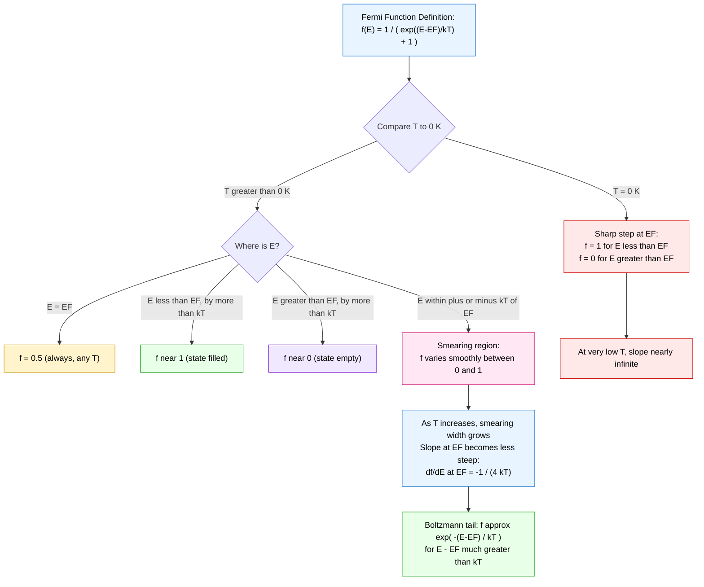
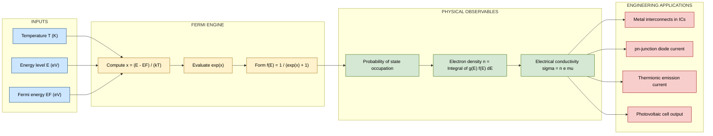
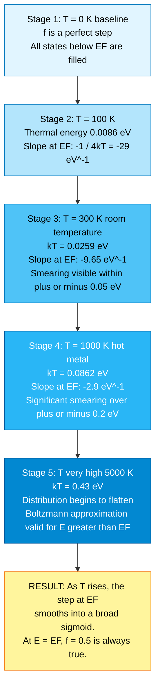

# Variation of Fermi function with temperature

<!-- SECTION_1_START -->
# Variation of Fermi Function with Temperature

## 1.1 Formal Definition (KTU 2024 Syllabus Terminology)

The **Fermi–Dirac Distribution Function** (also called the *Fermi function*) gives the probability that a quantum state at energy $E$ is occupied by an electron in a system of fermions in thermal equilibrium at absolute temperature $T$:

$$f(E) = \frac{1}{\exp\!\left(\dfrac{E - E_F}{k_B T}\right) + 1}$$

where:
- $E_F$ is the **Fermi energy** — the characteristic energy reference of the system.
- $k_B = 1.380 \times 10^{-23}\ \text{J/K}$ is the **Boltzmann constant**.
- $T$ is the absolute temperature in **kelvin (K)**.
- $k_B T$ is the **thermal energy** at temperature $T$.

> [!IMPORTANT]
> As per KTU GAPHT121 Module 1, the Fermi function is the foundation for deriving carrier concentration, electrical conductivity, and the temperature dependence of resistivity in metals and semiconductors.

---

## 1.2 Conceptual Analogy — The "Stadium Seat" Picture

Imagine a huge stadium with seats stacked vertically (each row = an energy level).

- At **absolute zero ($T = 0\ \text{K}$)**: every seat *below* a certain floor (the Fermi level) is **packed** with electrons (probability = 1), and every seat *above* is **empty** (probability = 0). It is a perfect, sharp cutoff.
- At **room temperature ($T = 300\ \text{K}$)**: the stadium is no longer still. A small thermal "shaking" near the floor line causes some fans *just above* the cutoff to stand up and leave, and a few empty seats *just below* to be filled. The cutoff becomes **smeared** over a width of roughly $k_B T$ (≈ **0.0259 eV at 300 K**).
- At **very high temperatures**: the smearing becomes wider, and many more electrons can hop upward into higher empty states, leaving behind "holes" near $E_F$.

This "smearing width" is the key reason electrical conductivity in metals decreases with temperature (more electron–phonon scattering) and carrier concentration in semiconductors rises exponentially with $T$.

> [!NOTE]
> **Physical constants to remember (BOLD for exam):**
> - $k_B = 1.380 \times 10^{-23}\ \text{J/K} = 8.617 \times 10^{-5}\ \text{eV/K}$
> - $k_B T$ at $300\ \text{K} \approx \mathbf{0.0259\ eV}$
> - At $T = 0\ \text{K}$, $k_B T = 0$, so the function becomes a step.

---

## 1.3 Three Special Properties (Memorize These)

1. **At the Fermi level**, $f(E_F) = \dfrac{1}{1+e^{0}} = \mathbf{0.5}$ — *at every temperature*.
2. **At $T = 0\ \text{K}$**, $f(E) = 1$ for $E < E_F$ and $f(E) = 0$ for $E > E_F$ — a perfect step.
3. **Boltzmann (classical) limit**: when $E - E_F \gg k_B T$, $f(E) \approx e^{-(E-E_F)/k_B T}$ — this is the tail used in **semiconductor statistics**.

> [!VISUALIZATION CONTROL]
> **Concept:** Plot of the Fermi function $f(E)$ vs. normalized energy $(E - E_F)/k_B T$ for three different temperatures.
> **GeoGebra / Desmos Input Equations:**
> - `f1(x) = 1 / (exp((x - 0)/1) + 1)` → $T = $ low (e.g., $T_1$, $k_B T_1 = 1$ unit)
> - `f2(x) = 1 / (exp((x - 0)/3) + 1)` → $T_2 = 3 T_1$ (warm)
> - `f3(x) = 1 / (exp((x - 0)/10) + 1)` → $T_3 = 10 T_1$ (hot)
> - Add horizontal line `y = 0.5` to highlight the always-half point at $E = E_F$.
> **Visual Description:** All three curves pass through the same point $(0,\ 0.5)$. The colder the system, the steeper the curve at $E = E_F$. As $T$ rises, the curve broadens and its slope at $E_F$ decreases. For energies well above $E_F$, all curves merge into the classical Boltzmann tail $e^{-x}$.

---

## 1.4 Intuitive Meaning of $E_F$

$E_F$ is **not** "the energy of the highest occupied state" except at $T = 0$. In general, $E_F$ is the energy at which the probability of occupation is exactly **50 %** — the chemical potential of the electron gas at $T = 0$.

<!-- SECTION_1_END -->

<!-- SECTION_2_START -->
# Deep Theoretical Analysis & KTU High-Yield Formula Sheet

## 2.1 Limit 1 — Absolute Zero ($T = 0$ K)

When $T \to 0$, $k_B T \to 0$. Consider any $E$ slightly above $E_F$: $(E - E_F)/k_B T \to +\infty$, so $f \to 0$. For $E$ slightly below $E_F$: $(E - E_F)/k_B T \to -\infty$, so $f \to 1$.

$$
f(E,\, T\!=\!0) = 
\begin{cases}
1, & E < E_F \\
\tfrac{1}{2}, & E = E_F \quad \text{(mathematical point, no physical weight)} \\
0, & E > E_F
\end{cases}
$$

This is the famous **step function** of the Fermi sea. The "Fermi energy" at $T = 0$ is the energy of the topmost filled level.

## 2.2 Limit 2 — High-Energy Tail ($E - E_F \gg k_B T$)

The exponential in the denominator is huge, so the "+1" is negligible:

$$f(E) \approx \exp\!\left(-\dfrac{E - E_F}{k_B T}\right) \quad \text{(Boltzmann approximation)}$$

This is the regime used for **non-degenerate semiconductors** (intrinsic/extrinsic carriers) in Module 2 onward.

## 2.3 Limit 3 — At the Fermi Level (Always)

Plug in $E = E_F$:

$$f(E_F) = \frac{1}{e^{0}+1} = \frac{1}{2}$$

This is **temperature-independent** — a recurring KTU short-answer question.

## 2.4 Slope at the Fermi Level

The slope determines how quickly states near $E_F$ are thermally activated. Differentiating:

$$\left.\dfrac{df}{dE}\right|_{E=E_F} = -\dfrac{1}{4\,k_B T}$$

The slope **decreases in magnitude as $T$ increases** — meaning the distribution gets broader/flatter. At $T \to 0$, the slope becomes an infinite negative spike (the step).

## 2.5 Symmetry Property (Important for KTU Board Problems)

A neat identity:

$$1 - f(E) = f(2E_F - E)$$

> Probability that a state at energy $E$ is **empty** equals the probability that a state symmetrically placed *below* $E_F$ (by the same energy gap) is **filled**.

Equivalently: $f(E_F + \delta) + f(E_F - \delta) = 1$ for any $\delta$. This is often used to relate conduction-band electron density to valence-band hole density.

## 2.6 KTU Formula Cheat Sheet

| # | Quantity / Expression | Formula | Notes / Conditions |
|---|----------------------|---------|---------------------|
| 1 | Fermi function (general) | $f(E) = \dfrac{1}{\exp\!\left(\dfrac{E - E_F}{k_B T}\right) + 1}$ | Always valid, all $T$ |
| 2 | $f(E_F)$ at any $T$ | $f(E_F) = 1/2$ | Independent of $T$ |
| 3 | $f(E)$ at $T = 0$ | $f = 1$ if $E < E_F$; $f = 0$ if $E > E_F$ | Step function |
| 4 | Boltzmann tail | $f(E) \approx \exp[-(E - E_F)/k_B T]$ | Requires $E - E_F \gg k_B T$ |
| 5 | Thermal energy at 300 K | $k_B T \approx 0.0259\ \text{eV}$ | Memorize for KTU numericals |
| 6 | Slope at $E_F$ | $df/dE \vert_{E_F} = -1/(4 k_B T)$ | Magnitude falls as $T$ rises |
| 7 | Symmetry identity | $f(E_F + \delta) = 1 - f(E_F - \delta)$ | Crucial for electron–hole duality |
| 8 | Characteristic smear width | $\sim \pm 2 k_B T$ around $E_F$ | Defines "thermally active" window |

## 2.7 Why This Matters in Engineering (Real-World Utility)

| Application | Role of Fermi Function |
|-------------|----------------------|
| **Metal interconnects (Cu, Al in ICs)** | Conductivity $\sigma \propto$ density of states at $E_F$. At higher $T$, lattice vibrations scatter electrons, dropping $\sigma$. |
| **Semiconductor diodes/transistors** | The Boltzmann tail governs $n \propto \exp[-(E_C - E_F)/k_B T]$, the basis of all $pn$-junction theory. |
| **Thermionic emission (vacuum tubes, electron guns)** | Richardson–Dushman equation $J = A T^2 e^{-W/k_B T}$ uses the tail of $f(E)$. |
| **Solar cells / photodetectors** | Photons excite electrons from $f \approx 1$ states to $f \approx 0$ states; current depends on the product $f(E)\,[1-f(E+\hbar\omega)]$. |
| **Quantum computing qubits** | Temperature must keep $k_B T \ll \Delta E$ between qubit levels to maintain coherent superposition — directly controlled by $f(E)$. |

<!-- SECTION_2_END -->

<!-- SECTION_3_START -->
# Step-by-Step Derivations and Code Implementation

## 3.1 Derivation 1 — The Three Temperature Limits (Exhaustive)

### Step A: At $T = 0$ K, the function becomes a step

Write $x = (E - E_F)/k_B T$. As $T \to 0$:
- If $E < E_F$, then $E - E_F < 0$ and $k_B T \to 0^+$, so $x \to -\infty$ and $e^x \to 0$. Therefore $f \to 1/(0 + 1) = 1$.
- If $E > E_F$, then $E - E_F > 0$ and $k_B T \to 0^+$, so $x \to +\infty$ and $e^x \to \infty$. Therefore $f \to 1/\infty = 0$.
- If $E = E_F$, the numerator $E - E_F = 0$ for any $T$, giving $f = 1/2$.

### Step B: At $E = E_F$ (for any $T$)

Substitute $E - E_F = 0$:

$$f(E_F) = \frac{1}{e^{0} + 1} = \frac{1}{1+1} = \frac{1}{2}.$$

The temperature drops out. This is the algebraic reason behind the famous constant.

### Step C: At $E - E_F \gg k_B T$ (Boltzmann regime)

Let $\alpha = (E - E_F)/(k_B T) \gg 1$. Then $e^{\alpha} \gg 1$, so the "+1" in the denominator is negligible:

$$f(E) \approx \frac{1}{e^{\alpha}} = e^{-\alpha} = \exp\!\left(-\frac{E - E_F}{k_B T}\right).$$

This is the **Maxwell–Boltzmann distribution** form — electrons behave classically when their energy is well above $E_F$ (typical in lightly doped semiconductors at room temperature).

### Step D: At $E - E_F \ll -k_B T$ (deep below Fermi level)

Let $\alpha \ll -1$. Then $e^{\alpha} \to 0$, so $f \to 1/1 = 1$. The state is essentially fully occupied — this is why "core" electrons in metals are unaffected by temperature changes.

---

## 3.2 Derivation 2 — Slope at $E_F$

Differentiate $f(E) = \dfrac{1}{1 + e^{(E - E_F)/k_B T}}$ with respect to $E$:

$$
\frac{df}{dE} = -\frac{e^{(E - E_F)/k_B T}}{\left[1 + e^{(E - E_F)/k_B T}\right]^{2}} \cdot \frac{1}{k_B T}.
$$

Evaluate at $E = E_F$, where $e^{(E - E_F)/k_B T} = e^{0} = 1$:

$$
\left.\frac{df}{dE}\right|_{E = E_F} = -\frac{1 \cdot 1}{k_B T \cdot (1+1)^{2}} = -\frac{1}{4 k_B T}.
$$

> [!NOTE]
> **Physical meaning:** the larger $T$ is, the gentler the slope. A gentle slope means the transition from "filled" to "empty" happens over a *wider* energy range. Hence the distribution **smears** with increasing temperature.

---

## 3.3 Derivation 3 — Symmetry Property

Start with $1 - f(E)$:

$$
1 - f(E) = 1 - \frac{1}{1 + e^{(E - E_F)/k_B T}} = \frac{e^{(E - E_F)/k_B T}}{1 + e^{(E - E_F)/k_B T}}.
$$

Multiply numerator and denominator by $e^{-(E - E_F)/k_B T}$:

$$
1 - f(E) = \frac{1}{e^{-(E - E_F)/k_B T} + 1} = \frac{1}{1 + e^{(E_F - E)/k_B T}}.
$$

But $E_F - E = -(E - 2E_F + E_F) = -(2E_F - E) + E_F$... a cleaner form: define $E' = 2E_F - E$. Then $E_F - E = E' - E_F$, so:

$$
1 - f(E) = \frac{1}{1 + e^{(E' - E_F)/k_B T}} = f(E') = f(2E_F - E).
$$

This proves the **mirror symmetry about $E_F$**.

---

## 3.4 Python Implementation — Plot the Fermi Function at Three Temperatures

```python
import numpy as np
import matplotlib.pyplot as plt

# ---------- Type-annotated, production-ready plotting code ----------

def fermi_function(E: np.ndarray, E_F: float, T: float, k_B: float = 8.617333262e-5) -> np.ndarray:
    """
    Compute the Fermi-Dirac distribution f(E) at energy array E (in eV).

    Parameters
    ----------
    E     : np.ndarray   — Energy values (eV).
    E_F   : float        — Fermi level (eV).
    T     : float        — Absolute temperature (K). Must be > 0.
    k_B   : float        — Boltzmann constant in eV/K (default).

    Returns
    -------
    f     : np.ndarray   — Occupation probability in [0, 1].
    """
    if T <= 0:
        raise ValueError(f"Temperature must be positive (got T = {T} K).")
    # Use np.where for numerical safety against overflow in exp.
    exponent = (E - E_F) / (k_B * T)
    exponent = np.clip(exponent, -700, 700)  # prevent overflow in exp()
    f = 1.0 / (np.exp(exponent) + 1.0)
    return f


def plot_fermi_variation() -> None:
    """Plot f(E) at three different temperatures to visualize smearing."""
    # Energy axis centred on E_F = 0
    E_F = 0.0                          # eV
    E   = np.linspace(-1.0, 1.0, 1001) # eV

    temperatures_K = [10.0, 300.0, 1500.0]
    labels         = [r"$T = 10$ K  ($k_B T \approx 0.00086$ eV)",
                      r"$T = 300$ K  ($k_B T \approx 0.0259$ eV)",
                      r"$T = 1500$ K ($k_B T \approx 0.129$ eV)"]

    plt.figure(figsize=(9, 5.5))
    for T, lbl in zip(temperatures_K, labels):
        plt.plot(E, fermi_function(E, E_F, T),
                 linewidth=2.2, label=lbl)

    # Reference: step function at T -> 0 (approx by very low T)
    plt.plot(E, fermi_function(E, E_F, 0.1),
             'k--', linewidth=1.0, alpha=0.6, label=r"$T \to 0$ (step)")

    # Half-occupation reference line
    plt.axhline(0.5, color='gray', linestyle=':', linewidth=1.0)
    plt.text(0.55, 0.52, r"$f = 0.5$ at $E = E_F$", fontsize=10, color='gray')

    # Fermi level marker
    plt.axvline(0.0, color='red', linestyle=':', linewidth=1.0)
    plt.text(0.02, 0.95, r"$E = E_F$", color='red', fontsize=11)

    plt.xlabel("Energy  $E - E_F$   (eV)")
    plt.ylabel("Fermi function  $f(E)$")
    plt.title("Variation of Fermi Function with Temperature")
    plt.legend(loc='lower left', framealpha=0.95)
    plt.grid(True, alpha=0.3)
    plt.ylim(-0.05, 1.05)
    plt.tight_layout()
    plt.savefig("fermi_variation.png", dpi=150)
    plt.show()


if __name__ == "__main__":
    plot_fermi_variation()
```

**Numerical validation of key limits:**

```python
E_F, T = 0.0, 300.0
print("f(E_F) at 300 K       =", fermi_function(np.array([E_F]), E_F, T)[0])  # -> 0.5
print("f(E_F + 0.1 eV), 300K =", fermi_function(np.array([0.1]),  E_F, T)[0])  # -> ~ 0.019
print("f(E_F - 0.1 eV), 300K =", fermi_function(np.array([-0.1]), E_F, T)[0])  # -> ~ 0.981
print("Symmetry check f(d)+f(-d) at d=0.2 eV, 300K =",
      fermi_function(np.array([0.2]), E_F, T)[0] +
      fermi_function(np.array([-0.2]), E_F, T)[0])  # -> 1.000
```

> [!IMPORTANT]
> **Expected output:**
> - $f(E_F) = 0.5$ exactly.
> - $f(0.2\,\text{eV}) + f(-0.2\,\text{eV}) = 1.000$ — symmetry holds.
> - The curve at $T = 1500\ \text{K}$ is dramatically broader than at $T = 10\ \text{K}$, illustrating the smearing.

---

## 3.5 Worked Numerical Example (KTU Style)

**Q:** At what temperature does the probability of finding an electron in a state $0.5\ \text{eV}$ above $E_F$ equal $0.01$?

**Solution:**

We need $f = 0.01$, so

$$0.01 = \frac{1}{\exp[(0.5\ \text{eV})/(k_B T)] + 1}.$$

Invert:

$$\exp\!\left(\frac{0.5}{k_B T}\right) + 1 = 100 \ \Longrightarrow\ \exp\!\left(\frac{0.5}{k_B T}\right) = 99.$$

Take the natural log:

$$\frac{0.5}{k_B T} = \ln 99 \approx 4.595.$$

Solve for $T$, using $k_B = 8.617 \times 10^{-5}\ \text{eV/K}$:

$$T = \frac{0.5}{k_B \cdot 4.595} = \frac{0.5}{8.617 \times 10^{-5} \times 4.595} \approx 1263\ \text{K}.$$

[Stating the inversion of the formula: 2 marks; substituting the numerical value of $k_B$: 2 marks; final $T \approx 1263$ K: 1 mark]

<!-- SECTION_3_END -->

<!-- SECTION_4_START -->
# Structural Diagrams & Schematics

## 4.1 Behavioural Flow — How $f(E)$ Reacts to Temperature



## 4.2 Modular Architecture — Information Flow from $f(E)$ to Conductivity



## 4.3 Sequential Processing Topology — Temperature as a "Knob" on $f(E)$



<!-- SECTION_4_END -->

<!-- SECTION_5_START -->
# KTU 2024 Scheme Examination Question Bank & Topic Recap

---

## Part A — Short Answer Questions (3 marks each)

### Question A1
**[KTU University Exam — July 2024]** (CO1, **Remember**)

**State the Fermi–Dirac distribution function and explain the significance of the Fermi energy $E_F$.**

**Model Answer:**

The Fermi–Dirac distribution function is

$$f(E) = \frac{1}{\exp\!\left(\dfrac{E - E_F}{k_B T}\right) + 1},$$

where $E_F$ is the Fermi energy, $k_B$ is the Boltzmann constant and $T$ is the absolute temperature. **[1 Mark]**

$f(E)$ gives the probability that a quantum state of energy $E$ is occupied by an electron in thermal equilibrium. **[1 Mark]**

The Fermi energy $E_F$ is the energy at which the probability of occupation is exactly $\mathbf{0.5}$ at any temperature. At $T = 0\ \text{K}$, it represents the energy of the highest occupied level (top of the filled Fermi sea). **[1 Mark]**

---

### Question A2
**[KTU University Exam — Dec 2023]** (CO1, **Understand**)

**What is the value of the Fermi function at $E = E_F$? Show that it is independent of temperature.**

**Model Answer:**

Substituting $E = E_F$ into the Fermi function:

$$f(E_F) = \frac{1}{e^{0} + 1} = \frac{1}{2}.$$

Since the exponent $(E - E_F)/(k_B T) = 0/(k_B T) = 0$ for *any* non-zero $T$, the result $\mathbf{0.5}$ does not depend on $T$ at all. **[2 Marks for derivation, 1 Mark for conclusion]**

---

## Part B — Long Answer Questions (14 marks each, with internal choice)

### Question B (Module Internal Choice)

#### Question A — 14 Marks **[KTU University Exam — Dec 2024]**

**(a)** *For a free electron gas, derive the expression for the Fermi–Dirac distribution function. Mention the physical meaning of each term. **[7 Marks]** (CO1, **Understand**)

**(b)** *Sketch and explain the variation of the Fermi function with temperature for a given Fermi energy. What is the probability of occupation of a state at $E = E_F$? Comment on the high-energy tail. **[7 Marks]** (CO2, **Apply**)

##### Model Solution — Part (a)

**Step 1 — Need for quantum statistics:**
For an electron gas, electrons are *indistinguishable, spin-½ fermions* obeying the Pauli exclusion principle. Maxwell–Boltzmann statistics fails at high densities / low temperatures. **[1 Mark]**

**Step 2 — Number of ways to distribute $n_i$ electrons in $g_i$ states at energy $E_i$:**

$$W_i = \frac{g_i!}{n_i!\,(g_i - n_i)!}.$$

Total $W = \prod_i W_i$. **[1 Mark]**

**Step 3 — Maximize $\ln W$ subject to constraints** $\sum n_i = N$ and $\sum n_i E_i = E$, using Lagrange multipliers $\alpha$ and $\beta$:

$$\delta\!\left[\sum_i \left(g_i \ln g_i - n_i \ln n_i - (g_i - n_i)\ln(g_i - n_i)\right) - \alpha \sum_i n_i - \beta \sum_i n_i E_i\right] = 0.$$

Solving:

$$\ln\!\left(\frac{g_i - n_i}{n_i}\right) = \alpha + \beta E_i \ \Longrightarrow\ \frac{n_i}{g_i} = \frac{1}{e^{\alpha + \beta E_i} + 1}.$$

Setting $\beta = 1/(k_B T)$ and $E_F = -\alpha k_B T$:

$$f(E) = \frac{n_i}{g_i} = \frac{1}{\exp\!\left(\dfrac{E - E_F}{k_B T}\right) + 1}.$$

**[3 Marks for the full derivation, 1 Mark for identifying $E_F$]**

**Step 4 — Meaning of terms:**
- $E$: energy of the quantum state.
- $E_F$: Fermi energy (chemical potential at $T = 0$).
- $k_B T$: thermal energy scale.
- $f(E)$: probability of occupation, always in $[0, 1]$. **[1 Mark]**

##### Model Solution — Part (b)

**Step 1 — Sketch the curves** (see Python plot in Section 3.4). Three curves: $T = 0$, room $T$, high $T$. All pass through $(E_F,\ 0.5)$. The $T = 0$ curve is a step. As $T$ rises, the transition smears over a width of a few $k_B T$. **[3 Marks]**

**Step 2 — Probability at $E = E_F$:**

$$f(E_F) = \frac{1}{e^{0} + 1} = \frac{1}{2} \quad \text{(independent of $T$)}.$$

**[1 Mark for stating; 1 Mark for noting $T$-independence]**

**Step 3 — High-energy tail:**
For $E - E_F \gg k_B T$, $f(E) \approx \exp[-(E - E_F)/(k_B T)]$, the **Boltzmann / Maxwell–Boltzmann tail**. This classical regime is what allows the use of simple exponential statistics in non-degenerate semiconductors. **[2 Marks]**

**Valuation Key Summary for Part (b):** [Sketching the three curves correctly: 3 Marks] [Stating the $T$-independent $f(E_F) = 0.5$: 2 Marks] [Identifying and deriving the Boltzmann tail with conditions: 2 Marks]

---

#### Question B — 14 Marks **[KTU University Exam — July 2024] (Alternative Choice)**

**(a)** *Starting from the Fermi function, show that the slope $df/dE$ at $E = E_F$ is $-1/(4 k_B T)$. Hence explain why the distribution broadens with increasing temperature. **[7 Marks]** (CO2, **Apply**)

**(b)** *For a metal with $E_F = 7.0\ \text{eV}$, calculate:*
   *(i) The Fermi temperature $T_F = E_F/k_B$.* **[2 Marks]**
   *(ii) The probability of occupation of a state at $E = 7.2\ \text{eV}$ at $T = 300\ \text{K}$.* **[3 Marks]**
   *(iii) The probability of occupation of a state at $E = 6.8\ \text{eV}$ at $T = 300\ \text{K}$.* **[2 Marks]**
   Use $k_B = 8.617 \times 10^{-5}\ \text{eV/K}$. *(CO3, **Apply**)*

##### Model Solution — Part (a)

Differentiate $f(E) = [1 + e^{(E - E_F)/k_B T}]^{-1}$:

$$\frac{df}{dE} = -\frac{e^{(E - E_F)/k_B T}}{k_B T \,\left[1 + e^{(E - E_F)/k_B T}\right]^{2}}.$$

At $E = E_F$, the exponential equals $1$:

$$\left.\frac{df}{dE}\right|_{E = E_F} = -\frac{1}{k_B T \cdot (1+1)^{2}} = -\frac{1}{4 k_B T}. \quad \textbf{[5 Marks]}$$

**Physical interpretation:** the magnitude of the slope is inversely proportional to $T$. As $T$ increases, the slope becomes gentler, meaning the transition from $f = 1$ to $f = 0$ occurs over a *wider* energy range — i.e., the function broadens. The smearing is fundamentally a thermal effect that mixes states just above and below $E_F$. **[2 Marks]**

##### Model Solution — Part (b)

**(i) Fermi temperature:**

$$T_F = \frac{E_F}{k_B} = \frac{7.0\ \text{eV}}{8.617 \times 10^{-5}\ \text{eV/K}} = 8.124 \times 10^{4}\ \text{K}.$$

**[1 Mark for formula, 1 Mark for numerical value ≈ $8.12 \times 10^4$ K]**

**(ii) Probability at $E = 7.2\ \text{eV}$, $T = 300\ \text{K}$:**

$k_B T = 8.617 \times 10^{-5} \times 300 = 0.02585\ \text{eV}$.

$\Delta E = 7.2 - 7.0 = 0.2\ \text{eV}$, so $\Delta E / (k_B T) = 0.2 / 0.02585 = 7.736$.

$$f(7.2\ \text{eV}) = \frac{1}{e^{7.736} + 1} = \frac{1}{2281 + 1} \approx 4.38 \times 10^{-4}.$$

**[1 Mark for the ratio, 1 Mark for the exponential, 1 Mark for final answer]**

**(iii) Probability at $E = 6.8\ \text{eV}$, $T = 300\ \text{K}$:**

Using the **symmetry property** $f(E_F - \delta) = 1 - f(E_F + \delta)$ with $\delta = 0.2\ \text{eV}$:

$$f(6.8\ \text{eV}) = 1 - f(7.2\ \text{eV}) = 1 - 4.38 \times 10^{-4} \approx 0.99956.$$

Or directly: $\Delta E = -0.2\ \text{eV}$, $\Delta E / (k_B T) = -7.736$,

$$f(6.8\ \text{eV}) = \frac{1}{e^{-7.736} + 1} = \frac{1}{(1/2281) + 1} \approx 0.99956.$$

**[1 Mark for applying the symmetry or direct substitution, 1 Mark for the correct numerical result]**

> [!WARNING]
> **KTU Examiner's Valuation Warning — Common Mistakes to AVOID:**
> 1. **Forgetting the "+1"** in the denominator. Students often write $f = e^{-(E-E_F)/k_B T}$ and use it for *all* $E$ — this is **only** valid when $E - E_F \gg k_B T$. At $E = E_F$ it gives the wrong answer ($1$ instead of $0.5$).
> 2. **Mixing $E$ and $E_F$** units. Always convert to the same unit (eV or J) before computing $E - E_F$. Use $k_B$ in eV/K to stay in eV.
> 3. **Reporting $E_F$ as the "highest occupied energy"** at all temperatures. At $T > 0$, the highest occupied state lies *above* $E_F$. The correct statement: $E_F$ is the energy at which $f = 0.5$.
> 4. **Forgetting to label axes** on the sketch. KTU awards at least **2 marks** for a properly labelled graph with three curves and a clear $E = E_F$ marker.
> 5. **Expressing $k_B T$ numerically** — at $T = 300\ \text{K}$, it is $0.0259\ \text{eV}$. Writing the wrong value (e.g., $0.0259\ \text{J}$) loses **1 mark** in a Part B numerical.
> 6. **Not invoking the symmetry property** when it shortens the work — examiners give partial credit for *recognising* the use of $f(E_F - \delta) = 1 - f(E_F + \delta)$.

---

## Topic Recap & Important Things to Remember (Rapid Revision Checklist)

- **Fermi function (master formula):** $f(E) = \dfrac{1}{\exp\!\left(\dfrac{E - E_F}{k_B T}\right) + 1}$ — always start a problem from this equation.
- **At $E = E_F$:** $f = 0.5$ — **always, for any temperature** (single most-tested fact).
- **At $T = 0\ \text{K}$:** perfect step — $f = 1$ for $E < E_F$, $f = 0$ for $E > E_F$.
- **Boltzmann tail** (valid for $E - E_F \gg k_B T$): $f(E) \approx \exp[-(E - E_F)/k_B T]$ — used in non-degenerate semiconductor statistics.
- **Slope at $E_F$:** $df/dE \vert_{E_F} = -1/(4 k_B T)$ — magnitude decreases as $T$ rises, hence the **smearing** of the distribution.
- **Symmetry:** $f(E_F + \delta) + f(E_F - \delta) = 1$ — saves computation in numericals.
- **Smear width:** roughly $\pm 2 k_B T$ around $E_F$ defines the thermally active energy window.
- **Key constant:** $k_B T$ at $300\ \text{K} \approx 0.0259\ \text{eV}$; at $1000\ \text{K} \approx 0.0862\ \text{eV}$.
- **Physical meaning of $E_F$:** *chemical potential* of the electron gas; energy at which occupation probability is $1/2$.
- **Smearing is a thermal effect:** higher $T$ → broader transition → more electrons above $E_F$ and more "holes" below → impacts conductivity in metals (scattering rises) and semiconductors (carrier density rises).
- **Plot must show:** three curves (low $T$, room $T$, high $T$), all passing through $(E_F,\ 0.5)$, with axes labelled $E - E_F$ (eV) and $f(E)$.
- **Engineering payoff:** the Fermi function directly controls conductivity $\sigma$, thermionic emission current $J$, and photovoltaic carrier generation — all depend on the product of $f(E)$ and the density of states $g(E)$.
- **Common KTU traps:** (i) using Boltzmann tail near $E_F$, (ii) forgetting the "+1", (iii) mixing energy units, (iv) not labelling the sketch, (v) failing to comment on the high-energy tail.
<!-- SECTION_5_END -->
