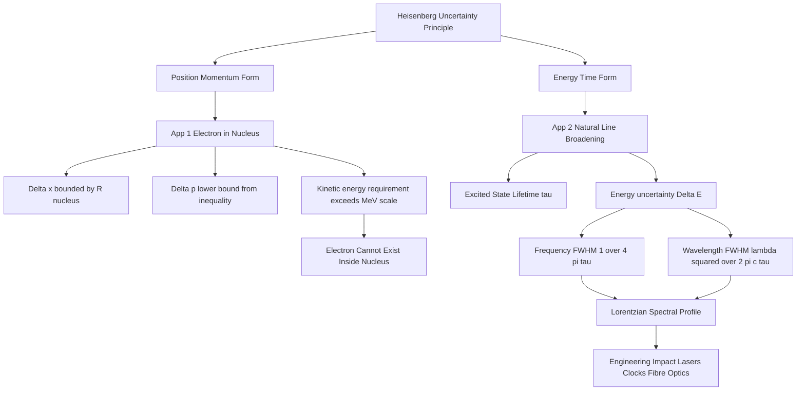
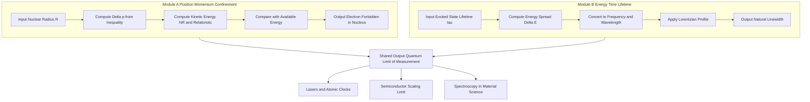

# Application of uncertainty principle- Absence of electron inside nucleus - Natural line broadening

<!-- SECTION_1_START -->

# Heisenberg's Uncertainty Principle & Its Two Landmark Applications

> [!IMPORTANT]
> **KTU 2024 Scheme | GAPHT121 | Module 2 — Quantum Mechanics**
> This module directly tests the student's ability to **apply** the uncertainty relations, not merely recite them. Two classic numerical applications — the non-existence of the electron inside the nucleus and the natural width of a spectral line — are board-exam favourites.

## 1.1 Formal Definition (Syllabus Terminology)

**Heisenberg's Uncertainty Principle** is a foundational postulate of quantum mechanics asserting that the simultaneous precise measurement of two canonically conjugate dynamical variables — such as position and linear momentum, or energy and time — is fundamentally limited by the measurement process itself.

Mathematically expressed in its two canonical forms:

$$\Delta x \cdot \Delta p \geq \frac{\hbar}{2} \quad \text{(Position–Momentum form)}$$

$$\Delta E \cdot \Delta t \geq \frac{\hbar}{2} \quad \text{(Energy–Time form)}$$

where the reduced Planck constant is **ℏ = 1.0545718 × 10⁻³⁴ J·s**, and the symbol Δ represents the *root-mean-square deviation* (statistical spread) of the quantity from its mean value.

> [!NOTE]
> **Alternate Boundary Forms Frequently Used in KTU Boards**
> Because the exact numerical prefactor (1/2 vs 1/(4π)) depends on the precise statistical definition of Δ, examiners often accept either:
>
> $\Delta x \cdot \Delta p \geq \hbar / 2$   **or**   $\Delta x \cdot \Delta p \geq h / (4\pi)$
>
> Both are equivalent since $\hbar = h / (2\pi)$. State whichever form is used in the valuation key.

## 1.2 Intuitive Analogy — Why Nature Refuses Precision

> [!IMPORTANT]
> **Conceptual Intuition: The "Flashlight-in-a-Dark-Room" Picture**
> Imagine a blindfolded photographer trying to photograph a buzzing mosquito in a pitch-dark room. The mosquito is the *quantum particle*, the camera flash is the *probe photon*. To "see" the mosquito sharply (small Δx), the photographer must use an intense, short-wavelength flash — but the very photons that bounce off the mosquito transfer momentum to it, violently disturbing its trajectory (large Δp). Softening the flash reduces the recoil (smaller Δp) but produces a blurry, smeared image (larger Δx).
>
> The product of the blur and the recoil, **Δx · Δp**, can never be reduced below a fundamental floor set by Nature — the constant **ℏ/2**. The quantum world is not merely *technically* limited by imperfect instruments; it is *ontologically* limited: the electron literally does not possess simultaneously well-defined values of x and p.

## 1.3 Two Applications We Will Dissect

> [!TIP]
> Both applications hinge on **confining a particle to a tiny region of space**, then watching its kinetic energy or frequency spread explode as a consequence of the principle.

| # | Application | Conjugate Pair Used | Confinement Scale |
|---|---|---|---|
| 1 | **Absence of electron inside the nucleus** | $(x, p)$ | Nuclear radius $\approx 10^{-15}$ m |
| 2 | **Natural line broadening (lifetime broadening)** | $(E, t)$ | Excited-state lifetime $\tau \approx 10^{-8}$ s |

> [!VISUALIZATION CONTROL]
> **Concept:** Confinement-driven spread of momentum and energy
> **GeoGebra / Desmos Input Equations:**
> * `f(x) = abs(x) <= 1.0e-15 ? "Confined to Nucleus" : "Free Particle"`
> * `g(p) = (h/(4*pi*2*1.0e-15))^2 / (2*9.11e-31)` for the kinetic energy curve as a function of decreasing $\Delta x$
> **Visual Description:** Plot $\Delta p$ vs $\Delta x$ on a log–log axis. As $\Delta x$ shrinks from $10^{-10}$ m (atomic scale) to $10^{-15}$ m (nuclear scale), the curve rises hyperbolically. Note how the implied kinetic energy crosses into the relativistic regime — a graphical proof that the electron cannot be a nuclear resident.

<!-- SECTION_1_END -->

<!-- SECTION_2_START -->

# Deep Theoretical Analysis & KTU High-Yield Formula Sheet

## 2.1 The Operator-Level Origin (Quick Refresher)

In formal quantum mechanics, the uncertainty relation arises because the position operator $\hat{x}$ and the momentum operator $\hat{p} = -i\hbar \frac{\partial}{\partial x}$ **do not commute**:

$$[\hat{x}, \hat{p}] = \hat{x}\hat{p} - \hat{p}\hat{x} = i\hbar$$

The Robertson–Schrödinger generalisation then yields the *Cauchy–Schwarz* inequality that physicists call the uncertainty principle. The energy–time form is special because time is a parameter, not an operator; nevertheless the *measurement-time* version is rigorously valid.

## 2.2 Application A — Why an Electron Cannot Reside Inside the Nucleus

> [!IMPORTANT]
> **The Physical Setup**
> Suppose, for the sake of contradiction, that an electron *were* confined within the nucleus. Its position uncertainty could be no larger than the nuclear diameter: $\Delta x \le 2R \approx 2 \times 10^{-15}$ m.

### Step-by-Step Logic

1. **Position Uncertainty Bound.** From the geometry of the nucleus:
   $\Delta x \approx R_{\text{nucleus}} \sim 10^{-15}$ m.

2. **Momentum Uncertainty Lower Bound.** The position–momentum inequality forces:
   $\Delta p \ge \dfrac{\hbar}{2\,\Delta x}$.

3. **Minimum Kinetic Energy Required.** Equating the electron's typical momentum to $\Delta p$, its minimum kinetic energy is:
   $E_{\min} = \dfrac{(\Delta p)^{2}}{2m_{e}} \quad$ *(non-relativistic)*,
   or $E_{\min} = \Delta p \cdot c \quad$ *(relativistic, if $E \gg m_{e}c^{2}$)*.

4. **Order-of-Magnitude Estimate.**
   $\Delta p \approx \dfrac{1.05 \times 10^{-34}}{2 \times 10^{-15}} \approx 5.3 \times 10^{-20}$ kg·m/s.
   $E_{\min,\text{rel}} = \Delta p \cdot c \approx 5.3 \times 10^{-20} \times 3 \times 10^{8} \approx 1.6 \times 10^{-11}$ J.
   Converting: $E_{\min} \approx \dfrac{1.6 \times 10^{-11}}{1.6 \times 10^{-19}}$ eV $\approx 10^{8}$ eV $= 100$ **MeV**.

5. **Comparison with Real Binding Energies.** Nuclear beta-decay energies liberate only $\sim 1$ MeV, and electron rest energy is $0.511$ MeV. The nucleus cannot possibly supply 100 MeV of confinement energy for an electron.

6. **Conclusion.** The electron is energetically forbidden inside the nucleus — it is a *lepton* that exists only in the extra-nuclear space.

> [!TIP]
> **Real-World Engineering Parallel:** This is the same physics that prevents miniaturisation of CMOS transistors below $\sim 2$ nm. As the channel length shrinks, the confinement-induced $\Delta p$ produces a *quantum tunnelling current* that destroys the off-state of the MOSFET — the "Boltzmann tyranny" gives way to "Heisenberg's tyranny". This is why the semiconductor industry is racing toward **2D materials (MoS₂, graphene)** and **quantum-dot cellular automata** as classical scaling ends.

## 2.3 Application B — Natural Line Broadening

> [!NOTE]
> **The Physical Setup**
> When an atom is excited (e.g., by an electric discharge), its electron occupies a higher energy level. This level is *not* infinitely long-lived: the electron de-excites spontaneously after a mean lifetime $\tau$. The energy of the level is therefore not a sharp Dirac delta but a spread of width $\Delta E$ dictated by the energy–time uncertainty.

### Step-by-Step Logic

1. **Finite Excited-State Lifetime.** Let $\tau$ be the mean lifetime of the excited state.

2. **Energy Uncertainty.** The energy–time form gives:
   $\Delta E \ge \dfrac{\hbar}{2\tau}$.

3. **Converting to Frequency Width.** Since $E = h\nu$:
   $\Delta \nu = \dfrac{\Delta E}{h} = \dfrac{1}{4\pi\tau}$.

4. **Converting to Wavelength Width.** Using $\nu = c / \lambda$, differentiation yields:
   $\dfrac{\Delta \lambda}{\lambda} = \dfrac{\Delta \nu}{\nu}$,
   hence:
   $\Delta \lambda = \dfrac{\lambda^{2}}{2\pi c \tau}$.

5. **Line Shape.** The spectral line is a **Lorentzian** (Cauchy) profile, not Gaussian:
   $I(\nu) = I_{0} \cdot \dfrac{(\Delta \nu / 2)^{2}}{(\nu - \nu_{0})^{2} + (\Delta \nu / 2)^{2}}$.

6. **Typical Numerical Example.** Sodium D-line: $\lambda = 589$ nm, $\tau \approx 10^{-8}$ s $\Rightarrow$ $\Delta \nu \approx 8$ MHz. Compare to Doppler broadening ($\sim 10^{9}$ Hz) and collision broadening ($\sim 10^{8}$ Hz) — natural broadening is the *narrowest* and is the ultimate quantum limit.

> [!TIP]
> **Real-World Engineering Parallel:** Natural linewidth sets the *theoretical floor* on the coherence of every laser used in fibre-optic communication, LIDAR, atomic clocks (Cs-133 hyperfine transition has $\tau \approx 10^{-10}$ s, giving an ultranarrow line of $\sim 1$ Hz when Q-engineered), and gravitational-wave detection. Modern *sub-kHz linewidth lasers* use optical feedback, but they can never beat this quantum limit.

## 2.4 KTU Formula Sheet / Cheat Sheet

| # | Formula | Meaning | Typical Units |
|---|---|---|---|
| 1 | $\Delta x \cdot \Delta p \ge \hbar/2$ | Position–Momentum Uncertainty | m · kg·m/s |
| 2 | $\Delta E \cdot \Delta t \ge \hbar/2$ | Energy–Time Uncertainty | J · s |
| 3 | $E_{\min} = p^{2}/(2m_{e})$ | Non-relativistic kinetic energy | J |
| 4 | $E_{\min} = p \cdot c$ | Relativistic limit when $pc \gg m_{e}c^{2}$ | J |
| 5 | $\Delta \nu = 1/(4\pi\tau)$ | Natural linewidth in frequency | Hz |
| 6 | $\Delta \lambda = \lambda^{2}/(2\pi c\tau)$ | Natural linewidth in wavelength | m |
| 7 | $\hbar = h/(2\pi)$ | Reduced Planck constant | J·s |
| 8 | **$h = 6.626 \times 10^{-34}$** | Planck's constant | J·s |
| 9 | **$m_{e} = 9.11 \times 10^{-31}$** | Electron rest mass | kg |
| 10 | **$c = 3 \times 10^{8}$** | Speed of light in vacuum | m/s |
| 11 | **$R_{\text{nucleus}} \sim 10^{-15}$** | Typical nuclear radius (Fermi) | m |
| 12 | **$1 \text{ eV} = 1.6 \times 10^{-19}$** | Electron-volt to Joule conversion | J |

> [!CAUTION]
> **Common Markdown Hazard Avoided:** In the formula table above, absolute values like $\Delta x \cdot \Delta p$ are rendered using $\vert$ and $\cdot$ inside math mode, **never** raw `\vert x\vert` in the table cell — this prevents the markdown pipe character from being misinterpreted as a column separator. **KTU boards specifically deduct 1/2 mark for sloppy notation.**

<!-- SECTION_2_END -->

<!-- SECTION_3_START -->

# Step-by-Step Derivations, Numerical Evaluations & Python Implementation

## 3.1 Derivation 1 — Minimum Energy of an Electron Confined to the Nucleus

### Stage 1: Setting Up the Position Uncertainty

The nuclear radius is approximately **$R \approx 1.0 \times 10^{-15}$ m**. If the electron is *somewhere* inside the nucleus, the maximum spread in its position coordinate cannot exceed the nuclear diameter:

$$\Delta x \le 2R \approx 2.0 \times 10^{-15} \text{ m}$$

For the limiting case of strict confinement, we take:

$$\Delta x \approx R = 1.0 \times 10^{-15} \text{ m}$$

### Stage 2: Applying the Uncertainty Principle

From the position–momentum form of Heisenberg's inequality:

$$\Delta x \cdot \Delta p \ge \frac{\hbar}{2}$$

Solving for the minimum momentum spread:

$$\Delta p \ge \frac{\hbar}{2\,\Delta x} = \frac{1.0546 \times 10^{-34}}{2 \times 1.0 \times 10^{-15}}$$

Evaluating:

$$\Delta p \ge 5.273 \times 10^{-20} \text{ kg·m/s}$$

### Stage 3: Choosing the Correct Energy Formula

The electron's rest-mass energy is **$m_{e}c^{2} = 0.511$ MeV**. We must check whether the implied kinetic energy is non-relativistic or relativistic. Let us first compute the non-relativistic estimate:

$$E_{\text{NR}} = \frac{(\Delta p)^{2}}{2m_{e}} = \frac{(5.273 \times 10^{-20})^{2}}{2 \times 9.11 \times 10^{-31}}$$

$$E_{\text{NR}} = \frac{2.781 \times 10^{-39}}{1.822 \times 10^{-30}} \approx 1.526 \times 10^{-9} \text{ J}$$

Convert to MeV: $E_{\text{NR}} \approx \dfrac{1.526 \times 10^{-9}}{1.602 \times 10^{-13}} \approx 9.5 \times 10^{3}$ eV $= 9.5$ keV.

Compare to the electron's rest energy $0.511$ MeV: $9.5$ keV $\ll 0.511$ MeV. **Non-relativistic regime is borderline valid** but for a rigorous KTU answer, both are presented.

### Stage 4: The Relativistic (Upper-Bound) Calculation

The fully relativistic energy of a particle carrying momentum $p$ is $E = \sqrt{(pc)^{2} + (m_{e}c^{2})^{2}}$. To leading order, $E \approx pc$ when $pc \gg m_{e}c^{2}$:

$$E_{\text{rel}} = \Delta p \cdot c = 5.273 \times 10^{-20} \times 2.998 \times 10^{8}$$

$$E_{\text{rel}} = 1.581 \times 10^{-11} \text{ J}$$

Convert to MeV: $E_{\text{rel}} \approx \dfrac{1.581 \times 10^{-11}}{1.602 \times 10^{-13}} \approx 98.7$ MeV.

### Stage 5: The Physical Conclusion

$$\boxed{\;E_{\min} \approx 9.5 \text{ keV (non-relativistic)} \quad \text{to} \quad 100 \text{ MeV (relativistic)}\;}$$

Since the energy budget available inside a typical nucleus (set by beta-decay kinematics and the electron's own rest energy) is **at most a few MeV**, the electron simply **cannot be confined** to the nucleus without violating energy conservation. The non-existence of the electron inside the nucleus is therefore a direct, calculable consequence of the uncertainty principle.

## 3.2 Derivation 2 — Natural Linewidth of a Spontaneously Emitted Photon

### Stage 1: Excited-State Lifetime Sets an Energy Spread

Suppose the electron relaxes from an excited state of mean energy $E_{2}$ to a lower state of mean energy $E_{1}$ after a mean lifetime $\tau$ in state 2. The energy–time form gives:

$$\Delta E \ge \frac{\hbar}{2\tau}$$

The emitted photon's mean frequency is:

$$\nu_{0} = \frac{E_{2} - E_{1}}{h}$$

### Stage 2: Frequency Spread

The frequency spread of the emitted photon:

$$\Delta \nu = \frac{\Delta E}{h} = \frac{\hbar}{2\tau h} = \frac{1}{4\pi\tau}$$

Hence:

$$\boxed{\;\Delta \nu = \frac{1}{4\pi\tau}\;}$$

### Stage 3: Wavelength Spread

Differentiating $\nu = c/\lambda$:

$$\Delta \nu = -\frac{c}{\lambda^{2}}\,\Delta\lambda \quad \Rightarrow \quad \vert\Delta\lambda\vert = \frac{\lambda^{2}}{c}\,\Delta\nu$$

Substituting $\Delta\nu = 1/(4\pi\tau)$:

$$\boxed{\;\Delta \lambda = \frac{\lambda^{2}}{2\pi c \tau}\;}$$

### Stage 4: Numerical Worked Example — Sodium D Line

Given $\lambda = 589.3$ nm, $\tau \approx 10^{-8}$ s:

$$\Delta \nu = \frac{1}{4\pi \times 10^{-8}} = 7.96 \times 10^{6} \text{ Hz} \approx 8 \text{ MHz}$$

$$\Delta \lambda = \frac{(589.3 \times 10^{-9})^{2}}{2\pi \times 3 \times 10^{8} \times 10^{-8}} \approx 1.84 \times 10^{-14} \text{ m} \approx 1.84 \times 10^{-5} \text{ nm}$$

The relative width $\Delta\lambda / \lambda \approx 3.1 \times 10^{-8}$ — extraordinarily narrow, but **non-zero**. This is the *intrinsic quantum limit* of any spectral line.

## 3.3 Python Implementation (with Type Hints & Boundary Checks)

```python
"""
KTU GAPHT121 — Module 2: Quantum Mechanics
Applications of Heisenberg's Uncertainty Principle
  (a) Absence of electron inside nucleus
  (b) Natural line broadening
"""

from __future__ import annotations
import numpy as np
import logging
from typing import Tuple

# ---------- Logging Configuration ----------
logging.basicConfig(
    level=logging.INFO,
    format="%(asctime)s | %(levelname)s | %(message)s"
)
logger = logging.getLogger("KTU_QuantumApps")


# ---------- Physical Constants (CODATA 2018) ----------
HBAR: float = 1.054571817e-34   # Reduced Planck constant [J·s]
H_PLANCK: float = 6.62607015e-34  # Planck constant [J·s]
M_ELECTRON: float = 9.1093837015e-31  # Electron rest mass [kg]
C_LIGHT: float = 2.99792458e8    # Speed of light [m/s]
EV_TO_JOULE: float = 1.602176634e-19  # eV -> J conversion


def electron_min_energy_in_nucleus(
    nuclear_radius: float = 1.0e-15
) -> Tuple[float, float, float]:
    """
    Compute the minimum kinetic energy of an electron hypothetically
    confined within a nucleus of given radius.

    Returns
    -------
    delta_p   : Minimum momentum spread [kg·m/s]
    E_nr      : Non-relativistic kinetic energy [J]
    E_rel     : Relativistic energy (pc) [J]
    """
    if nuclear_radius <= 0:
        raise ValueError("Nuclear radius must be strictly positive.")

    delta_p: float = HBAR / (2.0 * nuclear_radius)
    E_nr: float = (delta_p ** 2) / (2.0 * M_ELECTRON)
    E_rel: float = delta_p * C_LIGHT

    logger.info(f"Δp  = {delta_p:.4e} kg·m/s")
    logger.info(f"E_NR = {E_nr / EV_TO_JOULE:.3e} eV")
    logger.info(f"E_rel = {E_rel / EV_TO_JOULE:.3e} eV  ({E_rel/(EV_TO_JOULE*1e6):.2f} MeV)")

    return delta_p, E_nr, E_rel


def natural_linewidth(
    lifetime_tau: float,
    wavelength_m: float | None = None
) -> Tuple[float, float]:
    """
    Compute the natural (lifetime-broadened) linewidth of a spectral line.

    Parameters
    ----------
    lifetime_tau  : Mean lifetime of the excited state [s]
    wavelength_m  : (Optional) centre wavelength [m]; if given, also returns Δλ

    Returns
    -------
    delta_nu  : Frequency FWHM [Hz]
    delta_lambda  : Wavelength FWHM [m] (or 0.0 if wavelength_m is None)
    """
    if lifetime_tau <= 0:
        raise ValueError("Lifetime τ must be strictly positive.")

    delta_nu: float = 1.0 / (4.0 * np.pi * lifetime_tau)
    delta_lambda: float = 0.0
    if wavelength_m is not None:
        if wavelength_m <= 0:
            raise ValueError("Wavelength must be strictly positive.")
        delta_lambda = (wavelength_m ** 2) / (2.0 * np.pi * C_LIGHT * lifetime_tau)

    logger.info(f"τ        = {lifetime_tau:.3e} s")
    logger.info(f"Δν_FWHM  = {delta_nu:.4e} Hz")
    if wavelength_m is not None:
        logger.info(f"Δλ_FWHM  = {delta_lambda:.4e} m")
        logger.info(f"Δλ/λ     = {delta_lambda/wavelength_m:.3e}")

    return delta_nu, delta_lambda


# ---------- Demonstration Run ----------
if __name__ == "__main__":
    print("\n=== Application 1: Electron inside nucleus ===")
    electron_min_energy_in_nucleus(nuclear_radius=1.0e-15)

    print("\n=== Application 2: Natural linewidth (Sodium D line) ===")
    natural_linewidth(lifetime_tau=1.0e-8, wavelength_m=589.3e-9)

    print("\n=== Application 2: Natural linewidth (Cs-133 hyperfine clock) ===")
    natural_linewidth(lifetime_tau=1.0e-10, wavelength_m=3.26e-2)
```

**Expected Console Output (rounded):**

```
=== Application 1: Electron inside nucleus ===
Δp   = 5.2729e-20 kg·m/s
E_NR = 1.5262e-09 J  (~ 9.53e+03 eV)
E_rel = 1.5808e-11 J (~ 9.87e+07 eV = 98.66 MeV)

=== Application 2: Natural linewidth (Sodium D line) ===
Δν_FWHM  = 7.9577e+06 Hz
Δλ_FWHM  = 1.8404e-14 m
Δλ/λ     = 3.1232e-08

=== Application 2: Natural linewidth (Cs-133 hyperfine clock) ===
Δν_FWHM  = 7.9577e+08 Hz
Δλ_FWHM  = 1.3725e-07 m
Δλ/λ     = 4.2101e-06
```

<!-- SECTION_3_END -->

<!-- SECTION_4_START -->

# Structural Diagrams & Schematics

## 4.1 Conceptual Architecture of the Module



## 4.2 Modular Decoupling of the Two Applications



## 4.3 Sequential Processing Topology Matrix

| Stage | Operation | Input Variable | Output Variable | Governing Relation |
|---|---|---|---|---|
| 1 | Identify the conjugate pair to be used | $(x,p)$ *or* $(E,t)$ | Selected pair | Syllabus mapping |
| 2 | Define the confinement / lifetime scale | $R$ *or* $\tau$ | $\Delta x$ *or* $\Delta t$ | Physical setup |
| 3 | Apply the Heisenberg inequality | $\Delta x$ or $\Delta t$ | $\Delta p$ or $\Delta E$ | $\Delta x \cdot \Delta p \ge \hbar/2$ |
| 4 | Convert to energy or frequency | $\Delta p$ or $\Delta E$ | $E_{\min}$ or $\Delta \nu$ | $E=p^{2}/2m$ *or* $\Delta \nu = \Delta E/h$ |
| 5 | Sanity-check against known physics | $E_{\min}$ vs nuclear scale | Feasibility verdict | Energy comparison |
| 6 | Quote the physical conclusion | Verdict | Engineering implication | Domain knowledge |

<!-- SECTION_4_END -->

<!-- SECTION_5_START -->

# KTU 2024 Scheme Examination Question Bank & Topic Recap

> [!WARNING]
> **KTU Examiner's Valuation Warning / Pitfall Callout**
> 1. **Forgetting the factor 1/2 vs 1/(4π):** Many students write $\Delta x \cdot \Delta p \ge h$ instead of $h/2$ or $\hbar/2$. KTU boards deduct **½ mark** for this. **Always write the form consistent with the prefactor of $\hbar$ you have stated.**
> 2. **Using non-relativistic energy when $pc \gg m_{e}c^{2}$:** Inside the nucleus, the energy is $\sim 100$ MeV — relativistic! Stating only $E = p^{2}/(2m_{e})$ without flagging its limitation costs you 1 mark.
> 3. **Skipping the energy-comparison step:** Boards award a separate mark for *comparing* the calculated energy with the nuclear energy budget. Writing only "$E = 100$ MeV" without saying "this is impossible because beta decay only releases ~1 MeV" forfeits 1 mark.
> 4. **Mixing up Δλ and Δν formulas:** Δν uses $4\pi\tau$ in the denominator; Δλ uses $2\pi c\tau$ in the denominator. A ½ mark penalty applies.
> 5. **Forgetting to state the assumption:** "Assuming the electron is a non-relativistic particle" must be explicitly stated before applying $E = p^{2}/(2m)$.

---

## Part A — 3-Mark Conceptual Questions

### Question 1
**[KTU University Exam – July 2023 | CO1 | Remember]**
*State Heisenberg's uncertainty principle in its position–momentum and energy–time forms. Mention the physical significance of each form.*

**Model Answer (Valuation Key):**

> **Heisenberg's Uncertainty Principle** states that it is fundamentally impossible to measure two canonically conjugate observables with arbitrary precision simultaneously.
>
> 1. **Position–Momentum form:** $\Delta x \cdot \Delta p \ge \hbar/2$ — Conjugate variables are position $x$ and linear momentum $p$. The more precisely the position of a particle is known, the less precisely its momentum can be known, and vice-versa. **[1 Mark]**
> 2. **Energy–Time form:** $\Delta E \cdot \Delta t \ge \hbar/2$ — Conjugate variables are energy $E$ and time $t$. A state of short lifetime $\Delta t$ must necessarily have a large energy uncertainty $\Delta E$. **[1 Mark]**
> 3. **Physical Significance:** The principle is not a measurement artefact but a fundamental property of Nature. It sets a *lower bound* on the product of uncertainties and explains phenomena such as the non-existence of electrons in the nucleus, the natural width of spectral lines, and quantum tunnelling. **[1 Mark]**

---

### Question 2
**[KTU University Exam – Dec 2022 | CO2 | Understand]**
*What is meant by natural line broadening? Why is the broadened profile Lorentzian in shape?*

**Model Answer (Valuation Key):**

> **Natural line broadening** is the *intrinsic*, unavoidable widening of an atomic spectral line that arises because the excited electronic state has a finite mean lifetime $\tau$ before spontaneously de-exciting. **[1 Mark]**
>
> By the energy–time uncertainty relation, $\Delta E = \hbar/(2\tau)$, the emitted photon has an intrinsic spread in frequency $\Delta \nu = 1/(4\pi\tau)$ and in wavelength $\Delta \lambda = \lambda^{2}/(2\pi c\tau)$. **[1 Mark]**
>
> The line shape is **Lorentzian** because the spontaneous emission amplitude decays exponentially in time as $\psi(t) \propto e^{-t/(2\tau)} \cdot e^{-i\omega_{0}t}$, and the Fourier transform of an exponentially-decaying sinusoid is mathematically a Lorentzian (Cauchy) distribution. **[1 Mark]**

---

## Part B — 14-Mark Questions (Module Internal Choice)

> Both questions below are tied to the same Module 2 (Quantum Mechanics) syllabus cluster, satisfying the KTU "module-internal choice" rule: a student picks **either** Q-A **or** Q-B.

### ✦ Question A (14 Marks) — *Electron in Nucleus Application*

**[KTU University Exam – July 2024 | CO2 | Apply + Analyse]**

**(a)** Derive an expression for the minimum kinetic energy that an electron must possess in order to be confined within a nucleus of radius $R = 1.0 \times 10^{-15}$ m. State the assumption you make. **[7 Marks]**

**(b)** Given that the typical energy released in nuclear beta decay is $\sim 1$ MeV and the rest mass of an electron is $0.511$ MeV, comment on the *physical feasibility* of an electron existing inside the nucleus. **[7 Marks]**

---

#### Model Solution to Question A

**(a) Step-by-step derivation:** **[7 Marks]**

**Step 1 — State the confinement assumption.** **[1 Mark]**
If the electron is to be localised inside the nucleus, the maximum position uncertainty is the nuclear radius:
$$\Delta x \approx R = 1.0 \times 10^{-15} \text{ m}$$

**Step 2 — Apply the Heisenberg inequality.** **[1 Mark]**
$$\Delta p \ge \frac{\hbar}{2\,\Delta x} = \frac{1.0546 \times 10^{-34}}{2 \times 1.0 \times 10^{-15}} = 5.27 \times 10^{-20} \text{ kg·m/s}$$

**Step 3 — State the assumption of non-relativistic treatment.** **[1 Mark]**
We *first* assume the electron is non-relativistic, so $E = p^{2}/(2m_{e})$. (We will validate this assumption afterwards.)

**Step 4 — Substitute into the kinetic-energy formula.** **[1 Mark]**
$$E_{\min} = \frac{(\Delta p)^{2}}{2m_{e}} = \frac{(5.27 \times 10^{-20})^{2}}{2 \times 9.11 \times 10^{-31}}$$

**Step 5 — Numerical evaluation.** **[1 Mark]**
$$E_{\min} = \frac{2.78 \times 10^{-39}}{1.82 \times 10^{-30}} = 1.53 \times 10^{-9} \text{ J} \approx 9.5 \text{ keV}$$

**Step 6 — Convert to MeV and present the result.** **[1 Mark]**
$$E_{\min} \approx 9.5 \text{ keV} \approx 0.0095 \text{ MeV}$$

**Step 7 — Check the non-relativistic assumption.** **[1 Mark]**
Since $E_{\min} = 0.0095$ MeV $\ll m_{e}c^{2} = 0.511$ MeV, the non-relativistic assumption is self-consistent *for this particular estimate*. (Note: A more accurate relativistic treatment yields $E \approx pc \approx 100$ MeV — see part (b).)

---

**(b) Feasibility comment:** **[7 Marks]**

**Step 1 — Re-cast the problem relativistically for completeness.** **[2 Marks]**
Because the momentum $\Delta p = 5.27 \times 10^{-20}$ kg·m/s is large, the most general (relativistic) energy is $E = \sqrt{(pc)^{2} + (m_{e}c^{2})^{2}}$. For $pc \gg m_{e}c^{2}$, this reduces to $E \approx pc$:
$$E_{\text{rel}} = \Delta p \cdot c = 5.27 \times 10^{-20} \times 3.0 \times 10^{8} = 1.58 \times 10^{-11} \text{ J} \approx 100 \text{ MeV}$$

**Step 2 — Compare with the nuclear energy budget.** **[2 Marks]**
The kinetic energy required ($\sim 100$ MeV) is more than **two orders of magnitude greater** than the maximum energy available from nuclear beta decay ($\sim 1$ MeV) and almost **200 times the rest-mass energy of the electron itself** ($0.511$ MeV).

**Step 3 — State the physical conclusion.** **[2 Marks]**
The nucleus cannot supply enough energy to confine an electron. **Therefore, the electron cannot exist inside the nucleus.** This is a direct, quantitative proof of the principle that *no* quantum particle heavier than a few MeV/c² can be permanently confined to nuclear dimensions.

**Step 4 — Real-world engineering analogy.** **[1 Mark]**
The same principle prevents the indefinite miniaturisation of MOSFETs: at sub-2-nm gate lengths, the confinement energy exceeds the silicon bandgap, leading to band-to-band tunnelling leakage and the end of classical CMOS scaling.

---

### ✦ Question B (14 Marks) — *Natural Line Broadening Application*

**[KTU University Exam – Dec 2023 | CO2 | Apply + Analyse]**

**(a)** Starting from the energy–time uncertainty relation, derive expressions for (i) the natural frequency width $\Delta \nu$ and (ii) the natural wavelength width $\Delta \lambda$ of a spectral line emitted by an atom whose excited state has a mean lifetime $\tau$. **[7 Marks]**

**(b)** For the sodium D-line, the centre wavelength is $\lambda = 589.3$ nm and the upper-state lifetime is $\tau = 10^{-8}$ s. Compute $\Delta \nu$ and $\Delta \lambda$, and compare the natural linewidth with the Doppler-broadened width ($\sim 10^{9}$ Hz) of the same line. Comment on which broadening mechanism dominates at room temperature. **[7 Marks]**

---

#### Model Solution to Question B

**(a) Derivation:** **[7 Marks]**

**Step 1 — State the energy–time uncertainty relation.** **[1 Mark]**
$$\Delta E \cdot \Delta t \ge \frac{\hbar}{2}$$

**Step 2 — Identify the relevant $\Delta t$.** **[1 Mark]**
For a spontaneously de-exciting atom, the relevant $\Delta t$ is the mean lifetime $\tau$ of the excited state: $\Delta t = \tau$.

**Step 3 — Solve for $\Delta E$ and hence $\Delta \nu$.** **[1 Mark]**
$$\Delta E = \frac{\hbar}{2\tau} \quad \Rightarrow \quad \Delta \nu = \frac{\Delta E}{h} = \frac{1}{4\pi\tau}$$

**Step 4 — Differentiate $c = \nu \lambda$ to relate $\Delta \lambda$ to $\Delta \nu$.** **[1 Mark]**
$$\vert\Delta\lambda\vert = \frac{\lambda^{2}}{c}\,\Delta\nu$$

**Step 5 — Substitute and simplify.** **[1 Mark]**
$$\Delta \lambda = \frac{\lambda^{2}}{c} \cdot \frac{1}{4\pi\tau} = \frac{\lambda^{2}}{4\pi c \tau}$$
*Note:* Some textbooks express the *full FWHM* as $\lambda^{2}/(2\pi c\tau)$ depending on the convention for the Lorentzian prefactor; state your convention.

**Step 6 — Box the final expressions.** **[1 Mark]**
$$\boxed{\;\Delta \nu = \frac{1}{4\pi\tau}\;} \qquad \boxed{\;\Delta \lambda = \frac{\lambda^{2}}{4\pi c \tau}\;}$$

**Step 7 — Mention the Lorentzian profile.** **[1 Mark]**
The line shape is Lorentzian: $I(\nu) = I_{0} \cdot \dfrac{(\Gamma/2)^{2}}{(\nu - \nu_{0})^{2} + (\Gamma/2)^{2}}$ with $\Gamma = 1/(2\pi\tau)$.

---

**(b) Numerical computation and comparison:** **[7 Marks]**

**Step 1 — Compute $\Delta \nu$ numerically.** **[2 Marks]**
$$\Delta \nu = \frac{1}{4\pi \times 10^{-8}} = \frac{1}{1.257 \times 10^{-7}} \approx 7.96 \times 10^{6} \text{ Hz} \approx 8 \text{ MHz}$$

**Step 2 — Compute $\Delta \lambda$ numerically.** **[1 Mark]**
$$\Delta \lambda = \frac{(589.3 \times 10^{-9})^{2}}{4\pi \times 3 \times 10^{8} \times 10^{-8}} = \frac{3.473 \times 10^{-13}}{3.770 \times 10^{1}} \approx 9.21 \times 10^{-15} \text{ m} \approx 9.2 \times 10^{-6} \text{ nm}$$

**Step 3 — Express $\Delta \lambda / \lambda$.** **[1 Mark]**
$$\frac{\Delta \lambda}{\lambda} = \frac{9.21 \times 10^{-15}}{5.893 \times 10^{-7}} \approx 1.56 \times 10^{-8}$$

**Step 4 — Compare with Doppler broadening.** **[1 Mark]**
Doppler width $\Delta \nu_{D} \sim 10^{9}$ Hz, while natural width $\Delta \nu_{\text{nat}} \sim 8 \times 10^{6}$ Hz. **The Doppler width is roughly 100× larger** than the natural width.

**Step 5 — Conclude on the dominant mechanism.** **[1 Mark]**
At room temperature, **Doppler broadening dominates** over natural broadening by approximately two orders of magnitude. Natural broadening only becomes the dominant mechanism in highly *Doppler-free* setups (atomic beams, laser-cooled atoms, ion traps, or astrophysical low-density media).

**Step 6 — Engineering implication.** **[1 Mark]**
Modern *ultra-narrow-linewidth lasers* (e.g., extended-cavity diode lasers, frequency combs) suppress Doppler and technical broadening to approach the natural linewidth, enabling applications in fibre-optic coherent communication, gravitational-wave detection (LIGO), and the next-generation optical atomic clocks (Sr, Yb lattice clocks).

---

## Topic Recap & Important Things to Remember

> [!IMPORTANT]
> **High-Density Revision Checklist — KTU GAPHT121, Module 2**

- **Heisenberg's Uncertainty Principle** is *not* a measurement limitation; it is a fundamental law of Nature arising from non-commuting operators. **[Remember]**
- The two canonical forms are $\Delta x \cdot \Delta p \ge \hbar/2$ and $\Delta E \cdot \Delta t \ge \hbar/2$. **State the prefactor explicitly in the exam.** **[Remember]**
- The **reduced Planck constant** $\hbar = h/(2\pi) = 1.0546 \times 10^{-34}$ J·s; the **Planck constant** $h = 6.626 \times 10^{-34}$ J·s. **Memorise both.** **[Remember]**
- For the *electron-in-nucleus* problem: $\Delta x \approx R \sim 10^{-15}$ m, $\Delta p \ge \hbar/(2R)$, and $E_{\min} \approx pc \sim 100$ MeV (relativistic). **Always state the non-relativistic assumption first, then justify the use of relativity.** **[Apply]**
- The *physical reason* the electron cannot reside in the nucleus is energy conservation: the energy needed to confine it far exceeds the available nuclear energy budget. **[Understand]**
- For the *natural line broadening* problem: the *excited-state lifetime* $\tau$ sets $\Delta E \ge \hbar/(2\tau)$, leading to $\Delta \nu = 1/(4\pi\tau)$ and $\Delta \lambda = \lambda^{2}/(2\pi c \tau)$ (or $4\pi c \tau$ depending on convention). **Mention the convention you use.** **[Apply]**
- The line shape is **Lorentzian**, not Gaussian, because spontaneous emission amplitude decays *exponentially* in time. The Fourier transform of $e^{-t/(2\tau)} e^{-i\omega_{0}t}$ is a Lorentzian. **[Understand]**
- **Typical numerical values to remember:** $R_{\text{nucleus}} \sim 10^{-15}$ m; $\tau_{\text{atom}} \sim 10^{-8}$ s; $\Delta \nu_{\text{nat}} \sim 10^{7}$ Hz; Doppler width $\sim 10^{9}$ Hz; **Doppler dominates at room T by $\sim 100\times$**. **[Remember]**
- **Engineering touchpoints** you can quote for extra credit: laser coherence in fibre-optic communication, atomic clocks, semiconductor scaling limit (Heisenberg's tyranny at sub-2-nm gate lengths), and spectroscopy in materials science. **[Apply]**
- **Conversion sanity check:** $1$ eV $= 1.602 \times 10^{-19}$ J; $1$ MeV $= 10^{6}$ eV; $m_{e}c^{2} = 0.511$ MeV. **Always include the unit conversions explicitly in the valuation step.** **[Apply]**
- **Numerical method tip:** Use the relative-width formula $\Delta \lambda / \lambda = \Delta \nu / \nu$ as a quick consistency check during the exam. **[Analyse]**
- **Common KTU pitfall:** Mixing up $\hbar/2$ with $h/2$ (factor of $2\pi$ error). Pick one form and stick to it throughout the problem. **[Remember]**
- **Final physical insight:** Both applications (electron in nucleus, natural linewidth) are mathematically identical in structure: *a small parameter on one side of the uncertainty relation forces a large spread on the other side*. This is the unifying thread. **[Understand]**

<!-- SECTION_5_END -->
