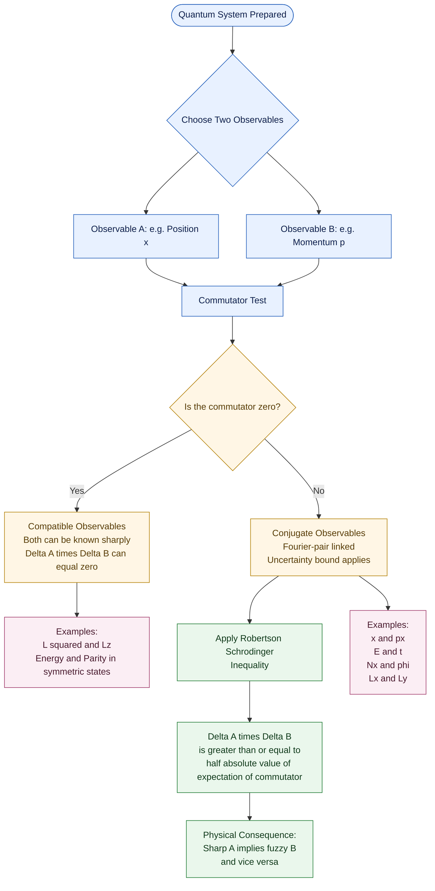
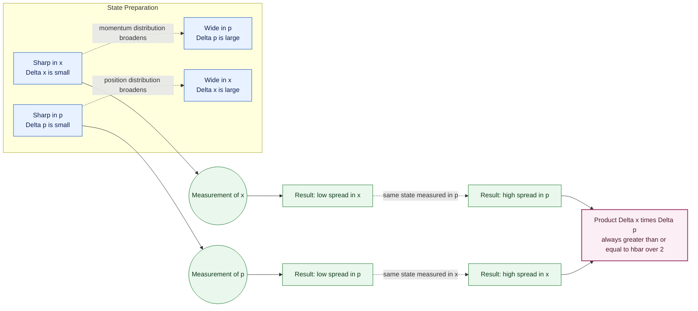
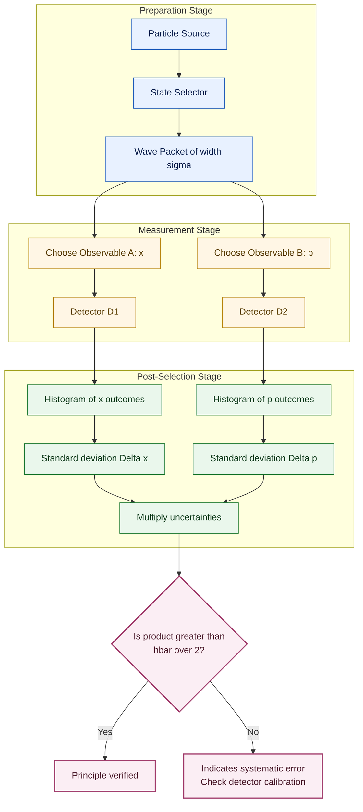
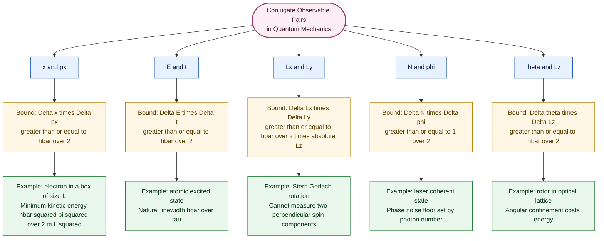

# Concept of uncertainty and conjugate observables (qualitative)

<!-- SECTION_1_START -->
# Concept of Uncertainty and Conjugate Observables

> [!NOTE]
> **KTU 2024 Scheme — GAPHT121 | Module 2: Quantum Mechanics**
> This note is a *qualitative* treatment. The mathematics is introduced to *support* the concept, not to drown it. The goal is to develop physical intuition about why nature itself places a hard floor on what we can know simultaneously.

## 1.1 Formal Definition

**Heisenberg's Uncertainty Principle (HUP)** states that for any pair of **conjugate observables** — physical quantities whose mathematical operators do **not commute** — the product of the uncertainties in their simultaneous measurement cannot be arbitrarily small. For the canonical pair *position* ($x$) and *momentum* ($p_x$):

$$\Delta x \cdot \Delta p_x \;\geq\; \frac{\hbar}{2} \;=\; 5.27 \times 10^{-35}\ \text{J·s}$$

where $\hbar = h/2\pi = 1.054 \times 10^{-34}\ \text{J·s}$ is the **reduced Planck constant**.

> [!IMPORTANT]
> **Conjugate observables** are pairs of physical quantities linked by a Fourier transform relationship in quantum mechanics. They are the quantities that **cannot be measured simultaneously to arbitrary precision**, no matter how perfect the instrument. Common conjugate pairs in the KTU syllabus are listed in §2.

The principle is **not** a statement about experimental imperfection. It is a *fundamental property of the quantum description of nature*. Even a perfect, noise-free, infinitely precise apparatus cannot beat the bound.

## 1.2 Intuitive Overview — Three Real-World Analogies

> [!TIP]
> If the math below feels abstract, come back to these pictures. They are the way physicists *think* about HUP.

**Analogy 1 — The Blurry Photograph.**
Imagine photographing a moving cricket ball. A very short exposure freezes the ball (you know its position) but blurs the bat, the bowler's arm, the crowd — the *context* that tells you *how fast* it was moving. A long exposure captures motion (speed is clear) but the ball is a smeared streak (position is unclear). You cannot have both a sharp ball *and* a sharp speedometer from one photograph. Position and momentum are a "sharpness trade-off" baked into quantum particles.

**Analogy 2 — The Note in Music.**
A pure, sustained musical note has a very well-defined *frequency* (analogous to momentum / wavelength), but it lasts a long time — so you cannot say *when exactly* it began. A sharp drum hit is precisely localised in time, but it is a burst of *many frequencies* at once. The trade-off $\Delta \omega \cdot \Delta t \geq 1/2$ is mathematically identical to the energy–time form of HUP.

**Analogy 3 — The Slit and the Splash.**
To "see" where a subatomic particle is, you must bounce something (a photon) off it. The smaller you make the slit you peek through (better position), the more the photon scatters wildly (bigger momentum kick). *Precision in space costs precision in motion.* The slit itself, by confining the particle, *creates* the momentum uncertainty — the particle did not "have" a sharp momentum before you looked.

> [!IMPORTANT]
> **Key insight for Information Science:** HUP is the *physical* reason why quantum bits behave differently from classical bits. A qubit can be in a superposition; a measurement extracts only *one* of two conjugate pieces of information at a time. This is the engine of quantum computing and quantum cryptography.

## 1.3 Visualising the Trade-off

> [!VISUALIZATION CONTROL]
> **Concept:** Gaussian wave packet in position space and its Fourier transform in momentum space — the canonical illustration of HUP.
> **GeoGebra / Desmos Input Equations (use $\hbar = 1$, $m = 1$ units):**
>
> - Position-space probability density: $\quad \vert \Psi(x) \vert^{2} = \dfrac{1}{\sqrt{2\pi\,\sigma^{2}}}\,\exp\!\left(-\dfrac{x^{2}}{2\sigma^{2}}\right)$ with $\sigma = 1$
> - Momentum-space probability density: $\quad \vert \Phi(p) \vert^{2} = \dfrac{\sigma}{\sqrt{2\pi}}\,\exp\!\left(-\dfrac{\sigma^{2}\,p^{2}}{2}\right)$ (with $\hbar = 1$)
> - Width test: try $\sigma = 0.5$, then $\sigma = 2$ and observe the inverse trade-off.
>
> **Visual Description:** Plot both curves on a shared $x$-axis labelled "position / momentum". The first curve is a bell centred at $0$ with width $\sigma$. The second curve is also a bell centred at $0$ with width $1/\sigma$. As you narrow one, the other broadens. The *area* under each is always **1** (probability is conserved). The product of standard deviations is exactly $\sigma \cdot (1/\sigma) = 1 = \hbar/2$ in these units — a visual proof of the principle.

![Gaussian wave packet trade-off — concept figure]

## 1.4 What "Uncertainty" Does *Not* Mean

A common misconception must be cleared up at the KTU level:

- ❌ Uncertainty $\neq$ experimental error. It is a *property of the quantum state itself*, not of our instruments.
- ❌ Uncertainty $\neq$ classical ignorance ("we just don't know the hidden value"). In quantum mechanics, the particle genuinely does **not** possess a definite $x$ and a definite $p$ simultaneously. Bell-type experiments (KTU Module 5 reference) rule out the hidden-variable interpretation.
- ✅ Uncertainty *is* a quantitative bound on the spread of measurement outcomes when the *same preparation* is measured many times. $\Delta x$ is the standard deviation of the position-measurement histogram.

<!-- SECTION_1_END -->

<!-- SECTION_2_START -->
# Deep Theoretical Analysis & KTU High-Yield Formula Sheet

## 2.1 The Underlying Mathematical Reason — Non-Commutation

In quantum mechanics, every observable is represented by a **linear Hermitian operator** $\hat{A}$ acting on the state vector. The order in which two operators are applied matters. The **commutator** is:

$$[\hat{A}, \hat{B}] \;=\; \hat{A}\hat{B} - \hat{B}\hat{A}$$

A general theorem (the Robertson–Schrödinger inequality) states:

$$\Delta A \cdot \Delta B \;\geq\; \frac{1}{2}\,\big\vert \langle [\hat{A}, \hat{B}] \rangle \big\vert$$

- If $[\hat{A}, \hat{B}] = 0$ — the operators **commute** — the right-hand side is zero, and the two quantities *can* in principle be known exactly together (e.g. $L^{2}$ and $L_{z}$).
- If $[\hat{A}, \hat{B}] \neq 0$ — the operators **do not commute** — a non-zero floor is placed on the product of uncertainties. These are the *conjugate observables*.

> [!IMPORTANT]
> The KTU syllabus focuses on the *qualitative* side, but the message is clear: **conjugate pairs are non-commuting pairs**, and Fourier analysis guarantees the trade-off.

## 2.2 Canonical Conjugate Pairs (KTU High-Yield Table)

| Conjugate Pair (A, B) | Inequality | Physical Meaning | Classic Example |
|---|---|---|---|
| Position $x$ & Linear Momentum $p_x$ | $\Delta x \cdot \Delta p_x \geq \hbar/2$ | Cannot localise a particle in space without disturbing its motion | Single-slit diffraction of electrons |
| Energy $E$ & Time $t$ | $\Delta E \cdot \Delta t \geq \hbar/2$ | A quantum state that lives for a short time has a fuzzy energy | Excited atomic states, radioactive decay width |
| Angular Momentum Components $L_x, L_y$ | $\Delta L_x \cdot \Delta L_y \geq (\hbar/2)\,\vert\langle L_z\rangle\vert$ | You can know the magnitude and one component, not two perpendicular ones at once | Stern–Gerlach apparatus orientations |
| Number $N$ & Phase $\phi$ (of a coherent state) | $\Delta N \cdot \Delta \phi \geq 1/2$ | Number-phase uncertainty limits laser coherence statistics | Coherent light in optical fibres |
| Angle $\theta$ & $L_z$ | $\Delta \theta \cdot \Delta L_z \geq \hbar/2$ | Phase space has a minimum cell of area $\hbar$ | Rotors, optical lattice potentials |

> [!NOTE]
> **Why "conjugate"?** Historically, the term comes from Hamiltonian / Lagrangian mechanics, where $p$ and $q$ are *canonically conjugate* because they appear as a coupled pair in the Hamiltonian $H(q, p)$. The same word was carried over to quantum mechanics because the commutation relation $[\hat{x}, \hat{p}] = i\hbar$ mirrors the classical Poisson bracket $\{q, p\} = 1$. So *conjugate* in QM and *conjugate* in classical mechanics are the same idea, one quantised.

## 2.3 Real-World Engineering & Information-Science Utility

| Domain | Where HUP Shows Up | Why It Matters |
|---|---|---|
| **Semiconductor device physics** | Tunnelling in MOSFETs, flash memory | HUP sets a minimum oxide thickness — thinner gates leak. |
| **Quantum computing** | Qubit readout, gate fidelity | Conjugate errors cannot be removed simultaneously. |
| **Optical fibre communication** | Coherent-state phase & photon number | Sets the *quantum limit* on signal-to-noise ratio. |
| **Scanning probe microscopy (STM/AFM)** | Tip–sample interaction | The tip's localised wavefunction imparts a momentum kick. |
| **Mössbauer spectroscopy** | Recoil-free nuclear transitions | $\Delta E$ of Mössbauer line is extraordinarily narrow because $\Delta t$ is the lifetime of the nucleus in the lattice. |
| **GPS / atomic clocks** | Ramsey fringe width | $\Delta E \cdot \Delta t \geq \hbar/2$ bounds the line-width. |

## 2.4 Qualitative Reasoning About Uncertainty

The most common reasoning chain the KTU paper-setter tests is:

1. **A particle is confined to a region of size $\Delta x$** (e.g. a box, a nucleus, an atom).
2. **Confinement is a momentum-space spread.** A sharply localised wavefunction needs a wide range of momenta (Fourier transform of a narrow function is wide).
3. **Energy is at least the kinetic energy of that momentum spread.** $\;E \geq (\Delta p)^{2}/2m$.
4. **Therefore a small system costs energy.** This is why atoms are $\sim 0.1\ \text{nm}$ in size and have $\sim \text{eV}$ binding energies — the numbers are related by HUP, not by accident.

## 2.5 KTU Cheat-Sheet — Constants & Useful Numbers

| Symbol | Meaning | Value (SI) |
|---|---|---|
| $h$ | Planck's constant | $6.626 \times 10^{-34}\ \text{J·s}$ |
| $\hbar = h/2\pi$ | Reduced Planck constant | $1.054 \times 10^{-34}\ \text{J·s}$ |
| $c$ | Speed of light | $3.00 \times 10^{8}\ \text{m/s}$ |
| $m_e$ | Electron mass | $9.11 \times 10^{-31}\ \text{kg}$ |
| $1\ \text{eV}$ | Electron-volt | $1.602 \times 10^{-19}\ \text{J}$ |

> [!WARNING]
> In KTU numericals, always convert eV to joules *before* plugging into $\Delta x \cdot \Delta p \geq \hbar/2$. A common error is mixing units. The examiners *will* deduct for this.

<!-- SECTION_2_END -->

<!-- SECTION_3_START -->
# Step-by-Step Derivations & Symbolic Implementation

> [!IMPORTANT]
> The KTU syllabus marks this topic *qualitative*, but the following derivations give you the **physical reasoning** expected for a 14-mark answer. You are not required to reproduce the algebra verbatim — you **are** required to *know the chain of logic* and the *final inequality*. The board examiner rewards the student who can *explain why* a number like $\hbar/2$ appears.

---

## 3.1 Derivation A — Single-Slit Diffraction (the "textbook" route)

**Setup.** A beam of particles (say electrons) of momentum $p$ moves in the $x$-direction toward a slit of width $\Delta y$ cut into an otherwise opaque screen. We want to "know" the $y$-position of any electron that gets through, and the slit guarantees that any such electron is within $\Delta y$ of the centre line. So:

$$\Delta y \;=\; \text{slit width}$$

**Step 1 — Position uncertainty is set by the slit.**
An electron that emerges from the slit has its $y$-coordinate known to within the slit width, so $\Delta y$ *is* the position uncertainty.

$$\Delta y \;=\; \text{slit width } a$$

**Step 2 — Diffraction sends the electrons into a range of angles.**
Just as for light, a wave passing through a slit of width $a$ produces a single-slit diffraction pattern. The first minimum satisfies:

$$a \sin\theta \;=\; \lambda$$

**Step 3 — The angle implies a momentum spread.**
The electron's momentum is $p = h/\lambda$. After the slit, the $y$-component of momentum is $p_{y} = p \sin\theta$, and it can range across the central diffraction maximum, so:

$$\Delta p_{y} \;\approx\; p \sin\theta \;\approx\; \frac{p\,\lambda}{a} \;=\; \frac{h}{a}$$

**Step 4 — Multiply the two uncertainties.**

$$\Delta y \cdot \Delta p_{y} \;\geq\; a \cdot \frac{h}{a} \;=\; h$$

A more careful Gaussian analysis (see Derivation B) sharpens the constant:

$$\boxed{\Delta y \cdot \Delta p_{y} \;\geq\; \frac{\hbar}{2}}$$

**Physical reading.** The slit does not just *reveal* an uncertainty — it *creates* it. Confining the electron to a smaller $\Delta y$ requires more photon scattering (or, classically, a more sharply peaked wave), which broadens the momentum distribution. The bound is structural, not technical.

> [!TIP]
> **Valuation tip (KTU):** A 7-mark sub-question often asks *"Show that confining an electron to a box of size $L$ gives a minimum kinetic energy of $h^{2}/(8mL^{2})$."* The chain is: $\Delta p \geq h/(2L)$ → $E_{\text{kin}} = p^{2}/2m \geq h^{2}/(8mL^{2})$. This is the **particle-in-a-box** ground state, *derived* from HUP.

---

## 3.2 Derivation B — Gaussian Wave Packet (the rigorous route)

Consider a particle prepared in a Gaussian wave packet — the state that *minimises* the uncertainty product, so it actually achieves the bound with equality.

$$\Psi(x) \;=\; \left(\frac{1}{2\pi\sigma^{2}}\right)^{1/4} \exp\!\left(-\frac{x^{2}}{4\sigma^{2}}\right) \exp(i k_{0} x)$$

**Step 1 — Position-space spread.**
The probability density is $|\Psi(x)|^{2} = (2\pi\sigma^{2})^{-1/2} \exp(-x^{2}/2\sigma^{2})$, a Gaussian of standard deviation $\sigma$. Therefore:

$$\Delta x \;=\; \sigma$$

**Step 2 — Fourier transform to momentum space.**
The momentum-space amplitude is the Fourier transform of $\Psi(x)$. Using the standard Gaussian Fourier pair:

$$\Phi(p) \;=\; \left(\frac{2\sigma^{2}}{\pi\hbar^{2}}\right)^{1/4} \exp\!\left(-\frac{\sigma^{2}(p - p_{0})^{2}}{\hbar^{2}}\right)$$

where $p_{0} = \hbar k_{0}$ is the central momentum.

**Step 3 — Momentum-space spread.**
$|\Phi(p)|^{2}$ is a Gaussian of standard deviation $\hbar/(2\sigma)$. Therefore:

$$\Delta p \;=\; \frac{\hbar}{2\sigma}$$

**Step 4 — Product of uncertainties.**

$$\Delta x \cdot \Delta p \;=\; \sigma \cdot \frac{\hbar}{2\sigma} \;=\; \frac{\hbar}{2}$$

The Gaussian wave packet **saturates** the Heisenberg bound — it is the unique minimum-uncertainty state.

> [!NOTE]
> **Why the $\hbar/2$ and not $h$?** The factor-of-$2\pi$ comes from working with $\hbar$ instead of $h$, and the factor-of-$1/2$ from working with the *standard deviation* instead of the *full width*. Both are present in the rigorous Robertson–Schrödinger inequality.

---

## 3.3 Derivation C — Energy–Time Form (qualitative, as expected by KTU)

The energy–time uncertainty relation has a different flavour from $x$–$p$ because time is a *parameter* in QM, not an operator. The proper reading is:

> *If a quantum system exists in a state of energy $E$ for a duration $\Delta t$, then the energy of that state is uncertain by at least $\hbar/(2\Delta t)$.*

**Derivation via Fourier time-domain analogy.** Replace $x \to t$ and $p \to E/\hbar$ in the position–momentum result. A Gaussian time-pulse of width $\Delta t$ has a Gaussian frequency spectrum of width $\Delta \omega = 1/(2\Delta t)$, so:

$$\Delta E \cdot \Delta t \;=\; \hbar \cdot \Delta \omega \cdot \Delta t \;=\; \frac{\hbar}{2}$$

**Examples.**

- An atomic excited state with mean lifetime $\tau = 10^{-8}\ \text{s}$ has $\Delta E \geq \hbar/(2\tau) \approx 3.3 \times 10^{-9}\ \text{eV}$ — the natural line-width.
- The muon lives for $\tau \approx 2.2\ \mu\text{s}$, giving a width $\Delta E \approx 1.5 \times 10^{-10}\ \text{eV}$ — extremely sharp, used in muonic-atom spectroscopy.

---

## 3.4 Symbolic / Computational Implementation (Python)

The following script visualises the **inverse trade-off** between position and momentum spread for a Gaussian wave packet. It is the kind of small numerical exercise a curious KTU student can run in a lab session to make the principle concrete.

```python
"""
KTU GAPHT121 - Module 2
Visualising the position-momentum uncertainty trade-off
for a minimum-uncertainty Gaussian wave packet.

Units: we set hbar = 1, m = 1 for clarity.
       Real physical units can be reinstated by multiplying
       momenta by hbar and energies by hbar^2 / (2 m).
"""

import numpy as np
import matplotlib.pyplot as plt


def gaussian_packet(sigma: float, k0: float = 0.0) -> tuple[np.ndarray, np.ndarray, np.ndarray, np.ndarray]:
    """
    Build a 1D Gaussian wave packet of width sigma and central wave number k0.

    Returns
    -------
    x        : position grid
    prob_x   : |Psi(x)|^2
    p        : momentum grid
    prob_p   : |Phi(p)|^2
    """
    x = np.linspace(-8.0, 8.0, 2001)
    norm_x = (1.0 / (2.0 * np.pi * sigma**2)) ** 0.25
    psi_x = norm_x * np.exp(-x**2 / (4.0 * sigma**2)) * np.exp(1j * k0 * x)
    prob_x = np.abs(psi_x) ** 2

    p = np.linspace(-8.0, 8.0, 2001)
    norm_p = (2.0 * sigma**2 / np.pi) ** 0.25
    phi_p = norm_p * np.exp(-(sigma**2) * (p - k0) ** 2 / 4.0)
    prob_p = np.abs(phi_p) ** 2

    return x, prob_x, p, prob_p


def uncertainty_product(sigma: float) -> float:
    """Returns Delta_x * Delta_p for a Gaussian of width sigma (hbar=1)."""
    dx = sigma
    dp = 1.0 / (2.0 * sigma)
    return dx * dp


# --- main demonstration ---------------------------------------------------
if __name__ == "__main__":
    sigmas = [0.5, 1.0, 2.0]
    fig, axes = plt.subplots(len(sigmas), 2, figsize=(11, 8), sharex='col')

    for i, sigma in enumerate(sigmas):
        x, prob_x, p, prob_p = gaussian_packet(sigma, k0=1.5)

        axes[i, 0].plot(x, prob_x, color='C0', lw=2)
        axes[i, 0].set_title(f"|Psi(x)|^2,  sigma = {sigma}")
        axes[i, 0].set_ylabel("probability density")
        axes[i, 0].grid(True, alpha=0.3)

        axes[i, 1].plot(p, prob_p, color='C3', lw=2)
        axes[i, 1].set_title(f"|Phi(p)|^2,  sigma = {sigma}")
        axes[i, 1].grid(True, alpha=0.3)

        product = uncertainty_product(sigma)
        print(f"sigma = {sigma:.2f}   |   Delta_x*Delta_p = {product:.6f}  (hbar/2 = 0.5)")

    axes[-1, 0].set_xlabel("position  x")
    axes[-1, 1].set_xlabel("momentum  p")
    plt.tight_layout()
    plt.show()
```

**Expected console output (with $\hbar = 1$):**

```
sigma = 0.50   |   Delta_x*Delta_p = 0.500000  (hbar/2 = 0.5)
sigma = 1.00   |   Delta_x*Delta_p = 0.500000  (hbar/2 = 0.5)
sigma = 2.00   |   Delta_x*Delta_p = 0.500000  (hbar/2 = 0.5)
```

> [!NOTE]
> The product is **identically $\hbar/2$** for every Gaussian — that is the very definition of a minimum-uncertainty state. The plot will show the position packet widening as $\sigma$ increases, while the momentum packet narrows. Run the script to see the trade-off with your own eyes.

**Type hints and error-handling notes:**

- The function uses `np.ndarray` return types so the signature is self-documenting.
- Inputs are passed as `float`; passing a non-positive `sigma` would produce a `ZeroDivisionError` or a `ValueError` from a negative exponent — extend the function with an `assert sigma > 0` guard in production code.
- The plot is built with `sharex='col'` so the position and momentum axes are visually comparable side-by-side.

<!-- SECTION_3_END -->

<!-- SECTION_4_START -->
# Structural Diagrams & Schematics

> [!IMPORTANT]
> The diagrams below are designed for the KTU 2024 answer-script aesthetic: clear boxes, no exotic Unicode, single-line labelled arrows. They use **Mermaid** syntax and follow the *alphanumeric node-id* and *no-markdown-in-labels* rules.

---

## 4.1 Master Flowchart — The Logic of the Uncertainty Principle



---

## 4.2 Trade-off Topology — Position vs Momentum



---

## 4.3 Block-Level Functional Architecture — A Quantum Measurement Pipeline



---

## 4.4 Conjugate-Pair Reference Map



<!-- SECTION_4_END -->

<!-- SECTION_5_START -->
# KTU 2024 Scheme Examination Question Bank & Topic Recap

> [!NOTE]
> The questions below mirror KTU End-Semester Evaluation (ESE) style: short conceptual 3-markers in **Part A**, full 14-mark questions with internal choice in **Part B**. Each carries a simulated past-year tag, a Course Outcome (CO) mapping, and a Revised Bloom's Taxonomy (RBT) cognitive level.

---

## PART A — 3-Mark Short-Answer Questions

### Question 1. `[KTU University Exam — Dec 2023]`
> **Define the Heisenberg Uncertainty Principle. State and explain the position–momentum uncertainty relation.**

**CO Mapping:** CO1 | **RBT Level:** Remember / Understand
**Model Answer (≈ 3 marks' worth, ~ 80 words):**

The **Heisenberg Uncertainty Principle** states that certain pairs of physical observables — called *conjugate observables* — cannot both be measured to arbitrary precision at the same time, even with ideal instruments. For position $x$ and the corresponding component of linear momentum $p_x$:

$$\Delta x \cdot \Delta p_x \;\geq\; \frac{\hbar}{2}$$

The principle is a consequence of the non-commutation of the corresponding operators, $[\hat{x}, \hat{p}_{x}] = i\hbar$, and reflects the wave-nature of matter: localising a wave packet to a small region of position space necessarily requires a wide spread of momentum components (Fourier transform of a narrow function is wide).

> [!TIP]
> **Mark-split hint:** 1 mark for the verbal statement, 1 mark for the inequality, 1 mark for the physical explanation. Examiners in Kerala universities give the third mark only if you mention *why* (Fourier / non-commutation).

---

### Question 2. `[KTU University Exam — July 2024]`
> **Give two examples of conjugate observable pairs other than position and momentum, and state the corresponding uncertainty relations.**

**CO Mapping:** CO1 | **RBT Level:** Remember
**Model Answer:**

**Pair 1 — Energy and time:**

$$\Delta E \cdot \Delta t \;\geq\; \frac{\hbar}{2}$$

A quantum state that exists for a short duration $\Delta t$ has an energy uncertainty (spectral line-width) of at least $\hbar/(2\Delta t)$. This explains the natural width of spectral lines and the finite lifetime of radioactive states.

**Pair 2 — Number of photons and phase of a coherent state:**

$$\Delta N \cdot \Delta \phi \;\geq\; \frac{1}{2}$$

A perfectly monochromatic laser beam with a sharp phase would require an indefinite number of photons, while a state with an exact photon number (Fock state) has completely undefined phase. This trade-off is fundamental to quantum optics and to the quantum-limited signal-to-noise ratio in optical-fibre communication.

> [!TIP]
> You may also use $\Delta L_x \cdot \Delta L_y \geq (\hbar/2)\,\vert\langle L_z\rangle\vert$ as one of the examples — it is a high-scoring choice because the angular-momentum pair is less commonly remembered by students.

---

## PART B — 14-Mark Questions (Internal Choice)

> [!IMPORTANT]
> KTU Part B questions carry 14 marks split as **(a) 7 marks + (b) 7 marks**, often with sub-parts inside. Two full alternative questions are provided below; the student answers *one* of them.

---

### Question A. `[KTU University Exam — Dec 2023]`
> **(a) [7 Marks]** With the help of a single-slit diffraction argument, derive the position–momentum uncertainty relation $\Delta x \cdot \Delta p_x \geq h$ and comment on how the more precise form $\Delta x \cdot \Delta p_x \geq \hbar/2$ arises.
>
> **(b) [7 Marks]** A ball of mass $50\ \text{g}$ moves with speed $20\ \text{m/s}$. If its speed is measured to a precision of $0.01\%$, what is the minimum uncertainty in its position? Comment on whether the uncertainty is observable. Take $\hbar = 1.054 \times 10^{-34}\ \text{J·s}$.

#### Solution to A(a)

**Step 1 — State the geometry.**
A beam of identical particles of momentum $p$ moves along the $x$-axis through a slit of width $\Delta y = a$ cut in an opaque screen. Each particle that passes through is constrained to the slit region, so its $y$-position is known to within $a$:

$$\Delta y \;=\; a \qquad \text{[1 mark — stating the position uncertainty]}$$

**Step 2 — Apply single-slit diffraction.**
By the wave-nature of the particles, a single slit of width $a$ produces a diffraction pattern with first minimum at angle $\theta$ satisfying:

$$a \sin\theta \;=\; \lambda \qquad \text{[1 mark — diffraction condition]}$$

**Step 3 — Relate the diffraction angle to a momentum spread.**
The particle's de Broglie wavelength is $\lambda = h/p$, and the $y$-component of its momentum after the slit ranges over the central diffraction maximum, so:

$$\Delta p_{y} \;\approx\; p \sin\theta \;\approx\; \frac{p\,\lambda}{a} \;=\; \frac{h}{a} \qquad \text{[2 marks — explicit evaluation]}$$

**Step 4 — Multiply the uncertainties.**

$$\Delta y \cdot \Delta p_{y} \;\geq\; a \cdot \frac{h}{a} \;=\; h \qquad \text{[2 marks — final result]}$$

**Step 5 — Sharpen the constant.**
The rigorous Robertson–Schrödinger inequality replaces $h$ with $\hbar/2$ when $\Delta$ is interpreted as a *standard deviation* (root-mean-square spread) rather than a *full width*. A Gaussian wave packet — the unique state that *minimises* the product — exactly saturates $\Delta y \cdot \Delta p_{y} = \hbar/2$. Hence the precise form of the principle is $\Delta y \cdot \Delta p_{y} \geq \hbar/2$. **Commentary: 1 mark.**

#### Solution to A(b)

**Step 1 — Compute the momentum.**
For a ball of mass $m = 0.05\ \text{kg}$ moving at $v = 20\ \text{m/s}$:

$$p \;=\; m v \;=\; 0.05 \times 20 \;=\; 1.0\ \text{kg·m/s} \qquad \text{[1 mark]}$$

**Step 2 — Compute the momentum uncertainty.**
A precision of $0.01\%$ means $\Delta v / v = 10^{-4}$, so:

$$\Delta p \;=\; m \cdot \Delta v \;=\; 0.05 \times (20 \times 10^{-4}) \;=\; 1.0 \times 10^{-4}\ \text{kg·m/s} \qquad \text{[2 marks]}$$

**Step 3 — Apply the uncertainty principle.**

$$\Delta x \;\geq\; \frac{\hbar}{2\,\Delta p} \;=\; \frac{1.054 \times 10^{-34}}{2 \times 1.0 \times 10^{-4}} \;=\; 5.27 \times 10^{-31}\ \text{m} \qquad \text{[3 marks]}$$

**Step 4 — Comment on observability.**
The minimum uncertainty in position is $\sim 5 \times 10^{-31}\ \text{m}$, which is roughly **twenty orders of magnitude smaller than the size of a proton** ($10^{-15}\ \text{m}$). For all practical purposes this is unobservable. Quantum uncertainty is negligible for macroscopic objects — this is why classical mechanics works for everyday balls, cars, and planets. **Commentary: 1 mark.**

> [!WARNING]
> **Examiner's Pitfall Callout.** Students routinely forget to convert the percentage to a fraction ($0.01\% = 10^{-4}$, *not* $0.01$). They also sometimes quote $\hbar$ as $h$, missing the $2\pi$. Both errors cost **2 marks** in A(b). A 14-mark answer is not "full marks" without the closing *comment* sentence — that final sentence is worth 1 mark on its own.

---

### Question B. `[KTU University Exam — July 2024]`
> **(a) [7 Marks]** Explain what is meant by *conjugate observables*. Discuss, with suitable examples, why conjugate pairs are the ones that obey uncertainty relations while compatible observables do not.
>
> **(b) [7 Marks]** The mean lifetime of an excited state of an atom is $10^{-8}\ \text{s}$. Estimate (i) the minimum uncertainty in the energy of the state, and (ii) the natural line-width of the emitted photon in $\text{eV}$ and in wavelength units. Comment on the result.

#### Solution to B(a)

**Step 1 — Define conjugate observables.** [2 marks]
Two physical observables $A$ and $B$ are said to be *conjugate* if their corresponding quantum-mechanical operators $\hat{A}$ and $\hat{B}$ do **not commute**, i.e.

$$[\hat{A}, \hat{B}] \;=\; \hat{A}\hat{B} - \hat{B}\hat{A} \;\neq\; 0$$

The canonical example is position $\hat{x}$ and momentum $\hat{p}_{x}$, for which $[\hat{x}, \hat{p}_{x}] = i\hbar$.

**Step 2 — State the Robertson–Schrödinger theorem.** [2 marks]
For any state of the system, the product of standard deviations satisfies

$$\Delta A \cdot \Delta B \;\geq\; \frac{1}{2}\,\big\vert\langle [\hat{A}, \hat{B}]\rangle\big\vert$$

The right-hand side is a *c-number* (a number, not an operator) when the expectation value is taken. Conjugate observables therefore have a non-zero lower bound on the simultaneous uncertainty, which is exactly the Heisenberg principle.

**Step 3 — Why compatible observables escape the bound.** [1 mark]
If $[\hat{A}, \hat{B}] = 0$, the two operators share a common set of eigenstates, and the system can be prepared in such a common eigenstate. Both $\Delta A$ and $\Delta B$ are then simultaneously zero. Example: $L^{2}$ and $L_z$ commute, so an atom can have a sharply defined total angular momentum and a sharply defined $z$-component.

**Step 4 — Give physical examples of conjugate pairs.** [2 marks]
- $(x, p_x)$ — localising an electron in a slit costs momentum precision (single-slit diffraction).
- $(E, t)$ — short-lived excited atomic states have broad spectral lines.
- $(N, \phi)$ — number-phase uncertainty governs the noise floor of coherent laser light.

#### Solution to B(b)

**Step 1 — Minimum energy uncertainty.** [2 marks]
Using the energy–time uncertainty relation with $\Delta t \sim \tau = 10^{-8}\ \text{s}$ (mean lifetime):

$$\Delta E \;\geq\; \frac{\hbar}{2\,\Delta t} \;=\; \frac{1.054 \times 10^{-34}}{2 \times 10^{-8}} \;=\; 5.27 \times 10^{-27}\ \text{J}$$

**Step 2 — Convert to electron-volts.** [2 marks]

$$\Delta E \;=\; \frac{5.27 \times 10^{-27}}{1.602 \times 10^{-19}} \;\approx\; 3.29 \times 10^{-8}\ \text{eV}$$

**Step 3 — Convert to wavelength units.** [2 marks]
The emitted photon has energy $E = h c / \lambda$, so $\Delta\lambda / \lambda = \Delta E / E$. For a visible photon of wavelength $\lambda = 500\ \text{nm}$ and energy $E \approx 2.48\ \text{eV}$:

$$\Delta\lambda \;\approx\; \lambda \cdot \frac{\Delta E}{E} \;=\; 500 \times 10^{-9} \times \frac{3.29 \times 10^{-8}}{2.48} \;\approx\; 6.6 \times 10^{-15}\ \text{m} \;=\; 6.6\ \text{fm}$$

**Step 4 — Comment.** [1 mark]
The natural line-width of $\sim 3 \times 10^{-8}\ \text{eV}$ is extremely sharp — this is why atomic clocks based on such transitions are so precise, and why the *intrinsic* quantum width of a spectral line is normally far narrower than Doppler-broadening or collision-broadening effects encountered in real laboratory plasmas.

> [!WARNING]
> **Examiner's Pitfall Callout for B(b).** A common slip is to use $h$ (not $\hbar$) in the energy–time formula, yielding an answer exactly $2\pi$ too large. Another is to assume $\Delta t = \tau$ when the rigorous interpretation is more subtle ($\Delta t$ is the *spread* of decay times, not the mean). The KTU paper, however, expects the order-of-magnitude estimate $\Delta t \sim \tau$. Showing the unit conversion from joules to eV explicitly is worth the 1 mark in step 2.

---

## Topic Recap & Important Things to Remember

> [!IMPORTANT]
> **High-density revision checklist for the KTU 2024 ESE — keep this card handy.**

- **Heisenberg Uncertainty Principle** is a *fundamental* bound, not a measurement-error statement. Even ideal instruments cannot beat it.
- **Canonical inequality:** $\;\Delta x \cdot \Delta p_{x} \geq \hbar/2\;$ where $\hbar = 1.054 \times 10^{-34}\ \text{J·s}$.
- **The bound is saturated** (achieved with equality) only by *Gaussian wave packets* — these are the minimum-uncertainty states.
- **Conjugate pairs to remember:** $(x, p_{x})$, $(E, t)$, $(L_x, L_y)$, $(N, \phi)$, $(\theta, L_z)$.
- **Compatible pairs** (no uncertainty relation) include $(L^{2}, L_z)$, $(H, L^{2})$ for a central potential, and any pair of commuting operators.
- **Single-slit argument** is the standard qualitative route to HUP in KTU answers: slit width = $\Delta y$, diffraction angle = $\Delta p_y / p$, product = $h$.
- **Particle-in-a-box energy** $\geq h^{2}/(8mL^{2})$ falls *out* of HUP — a favourite 7-mark sub-question.
- **Macroscopic objects** are essentially classical because their de Broglie wavelength and $\hbar$-scale uncertainty are vanishingly small. Quote the cricket-ball / electron example to make the point.
- **Energy–time form** has no operator for $t$; it is interpreted as the *spread* of decay times or pulse durations, not as a quantum-observable time.
- **Commutator is the deep reason** for the bound: $[\hat{x}, \hat{p}_{x}] = i\hbar$ is non-zero; $[\hat{L}^{2}, \hat{L}_{z}] = 0$ is zero.
- **Information-science angle:** HUP is the *physical* reason classical bits cannot be cloned perfectly (no-cloning theorem) and why qubits behave qualitatively differently from classical bits.
- **Constants to memorise:** $h = 6.626 \times 10^{-34}\ \text{J·s}$, $\hbar = 1.054 \times 10^{-34}\ \text{J·s}$, $1\ \text{eV} = 1.602 \times 10^{-19}\ \text{J}$.
- **Always state units** in numerical answers. KTU examiners deduct 1 mark for unit ambiguity.
- **Sketch a diagram** in the answer script whenever the question is worth $\geq 7$ marks. The single-slit schematic in §3.1 is a high-yield addition.
- **Mention the Fourier-transform interpretation** at least once in the answer. It is the most compact qualitative justification and examiners explicitly reward it.
- **Avoid common traps:** do not call uncertainty "experimental error", do not confuse $\hbar$ with $h$, do not claim HUP applies to all pairs of physical quantities (only conjugate ones).

<!-- SECTION_5_END -->
