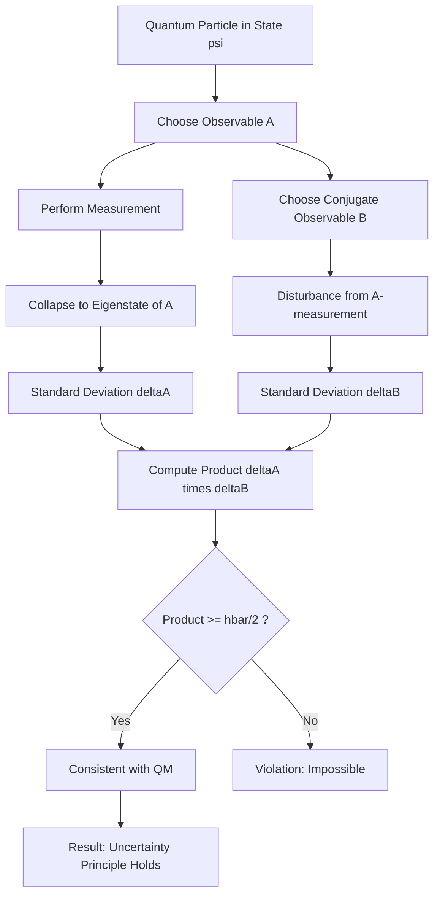
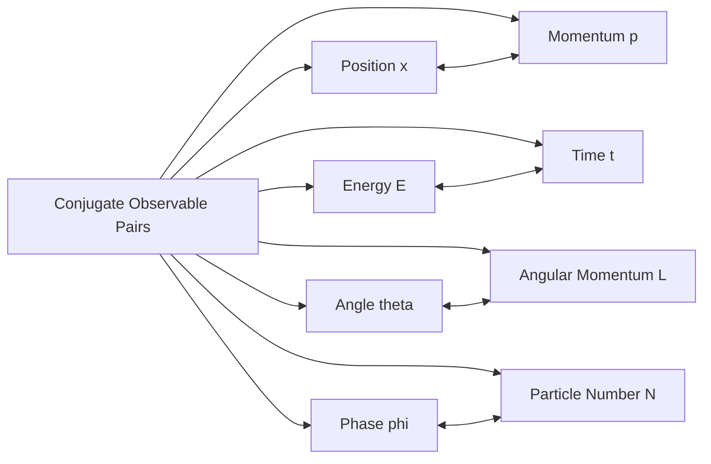
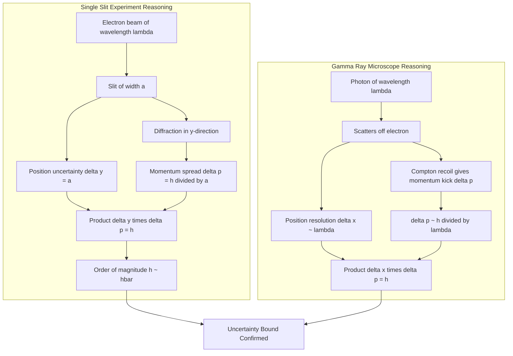
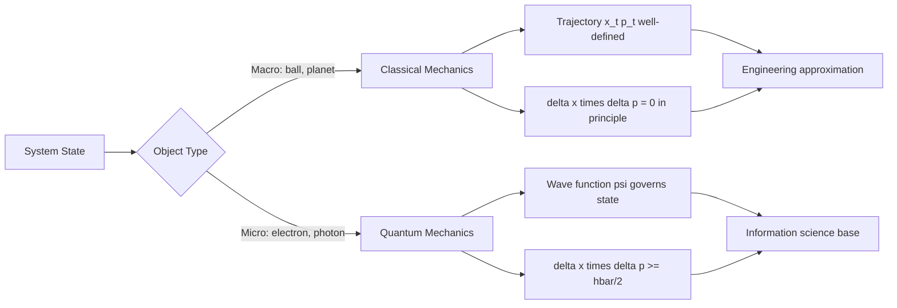

# Concept of uncertainty and conjugate observables (qualitative)

<!-- SECTION_1_START -->
# Concept of Uncertainty and Conjugate Observables (Qualitative)

## 1.1 Formal Academic Definition

In Quantum Mechanics, the **Heisenberg Uncertainty Principle** is a fundamental theorem stating that certain pairs of physical properties of a particle, known as **complementary** or **conjugate variables** (such as position $x$ and momentum $p$, or energy $E$ and time $t$), cannot both be measured simultaneously with arbitrarily high precision. The more precisely one of these properties is determined, the less precisely the other can be known.

> [!IMPORTANT]
> **Conjugate Observables:** Two physical quantities are called *conjugate* if their operators do not commute, i.e., $[\hat{A}, \hat{B}] = \hat{A}\hat{B} - \hat{B}\hat{A} \neq 0$. The canonical conjugate pairs are:
> - Position ($x$) and Momentum ($p$)
> - Energy ($E$) and Time ($t$)
> - Components of Angular Momentum ($L_x, L_y, L_z$)
> - Phase ($\phi$) and Number of Particles ($N$)

The mathematical statement of the principle for position and momentum is:

$$\Delta x \cdot \Delta p \geq \frac{\hbar}{2}$$

where $\hbar = \dfrac{h}{2\pi} \approx 1.054 \times 10^{-34}$ J·s is the **reduced Planck's constant**, $h$ is the Planck's constant, and $\Delta x, \Delta p$ are the standard deviations of the position and momentum measurement distributions, respectively.

> [!NOTE]
> **KTU 2024 Syllabus Mandate:** The current module specification explicitly requires a **qualitative** treatment. Students are expected to *understand* the physical origin and implications of the principle rather than derive the rigorous formal proofs involving commutation relations and Hermitian operators.

## 1.2 Conceptual Analogy & Geometric Intuition

Imagine you are trying to measure the exact location and exact speed of a hummingbird flying in a dark room. The very act of measurement disturbs the system:
- To *see* the bird (find its position), you must shine a light on it. But the light's photons strike the bird, giving it a *kick* that changes its momentum unpredictably.
- To know its *speed*, you need to track it over a duration, which blurs the exact *instant* of its position.

You can never know both with infinite precision simultaneously. The more sharply you determine one, the more uncertain the other becomes.

**Geometric Intuition:** In a wave-based picture, a wave with a *narrow* spatial spread (well-defined position) is built from many wavelengths (broad momentum spectrum). Conversely, a *long* wave train (well-defined momentum) spreads its position over a wide region. This is a fundamental property of waves called **Fourier reciprocity**.

> [!VISUALIZATION CONTROL]
> **Concept:** Wave-Packet Spreading and Position-Momentum Reciprocity
> **GeoGebra / Desmos Input Equations:**
> * Wave packet 1 (narrow in $x$): $\psi_1(x) = e^{-x^2/4}$
> * Wave packet 2 (wide in $x$): $\psi_2(x) = e^{-x^2/100}$
> * Visual Description: Plot two Gaussian wave packets. The narrow one (Wave 1) corresponds to a *broad* momentum distribution; the wide one (Wave 2) corresponds to a *narrow* momentum distribution. The product of their spreads is bounded below by $\hbar/2$.

## 1.3 Distinction from Classical Measurement Error

| Feature | Classical Uncertainty | Quantum Uncertainty |
|---|---|---|
| **Origin** | Imperfect instruments, human error | Intrinsic to the physical system |
| **Can be eliminated?** | Yes, with better apparatus | No, fundamental limit of nature |
| **Order of magnitude** | Macroscopically reducible | Bounded by $\hbar$ |
| **Role in system** | External disturbance | Property of the wave function itself |

> [!TIP]
> **Engineering Relevance:** For information science, the uncertainty principle sets the **fundamental bit-density limit** in quantum computing, justifies the existence of **zero-point energy** in quantum dots and transistors, and governs the design of **scanning tunneling microscopes (STM)** and **MRI machines** used in modern technology.

<!-- SECTION_1_END -->

<!-- SECTION_2_START -->
# Deep Theoretical Analysis & KTU High-Yield Formula Sheet

## 2.1 Operational Logic of the Uncertainty Principle

The principle can be understood through a layered reasoning framework:

- **Wave-Particle Duality Foundation:** Every quantum object exhibits both wave-like and particle-like behavior. A particle is described by a *de Broglie wave* of wavelength $\lambda = h/p$.
- **Localized Particle = Wave Packet:** A particle confined to a small region of space is represented not by a single sinusoidal wave, but by a *superposition* (wave packet) of many waves of differing wavelengths.
- **Momentum Distribution from Wavelength Spread:** A wave packet built from a spread of wavelengths $\Delta \lambda$ inherently carries a spread of momenta $\Delta p$, since $p = h/\lambda$.
- **Reciprocal Spreads:** The Fourier transform relationship between position and momentum space guarantees that $\Delta x$ and $\Delta p$ are inversely related. A mathematically rigorous bound, $\Delta x \cdot \Delta p \geq \hbar/2$, emerges from the properties of Gaussian wave packets (which achieve the minimum).
- **Conjugate Pair Definition:** Two observables are conjugate if their measurement operators do *not* commute, ensuring an uncertainty product is non-zero.

## 2.2 Heisenberg's Thought Experiments (Qualitative)

### A. The Single-Slit Diffraction Experiment
When a beam of electrons of momentum $p$ is directed at a narrow slit of width $\Delta x$:
- The electron's $x$-coordinate becomes confined to the slit width: uncertainty in position = $\Delta x$.
- Upon passage, the electron's wave function undergoes **diffraction**, spreading its momentum in the $x$-direction.
- The resulting angular spread of the central maximum gives an uncertainty in $x$-momentum of $\Delta p_x \approx p \sin\theta \approx p \lambda / \Delta x$.
- Substituting $\lambda = h/p$, we get $\Delta x \cdot \Delta p_x \approx h$, which is consistent with the strict bound $\hbar/2$ (the factor of $2\pi$ accounts for the difference).

### B. The Heisenberg Gamma-Ray Microscope
A thought experiment attempting to measure an electron's position using a high-energy photon (gamma ray):
- To resolve small $\Delta x$, short-wavelength photons (high momentum) must be used.
- Compton scattering of the photon transfers a *large, unknown* momentum kick to the electron.
- The trade-off reproduces the uncertainty bound: $\Delta x \cdot \Delta p \sim h$.

## 2.3 KTU Formula Sheet / Cheat Sheet

> [!IMPORTANT]
> All formulae below are **KTU 2024 high-yield** and must be memorized for the End Semester Examination.

| S.No | Formula / Expression | Name / Interpretation | Variables / Units |
|------|----------------------|-----------------------|-------------------|
| 1 | $\Delta x \cdot \Delta p \geq \dfrac{\hbar}{2}$ | Position-Momentum Uncertainty | $\Delta x$ in m, $\Delta p$ in kg·m/s, $\hbar$ in J·s |
| 2 | $\Delta x \cdot \Delta p \geq \dfrac{h}{4\pi}$ | Equivalent form of (1) | $h = 6.626 \times 10^{-34}$ J·s |
| 3 | $\Delta E \cdot \Delta t \geq \dfrac{\hbar}{2}$ | Energy-Time Uncertainty | $\Delta E$ in J, $\Delta t$ in s |
| 4 | $\Delta \theta \cdot \Delta L \geq \dfrac{\hbar}{2}$ | Angular Uncertainty | $\Delta \theta$ in rad, $\Delta L$ in kg·m²/s |
| 5 | $\Delta \phi \cdot \Delta N \geq \dfrac{1}{2}$ | Number-Phase Uncertainty (in units of $\hbar$) | $\phi$ in rad, $N$ dimensionless |
| 6 | $p = \dfrac{h}{\lambda}$ | de Broglie Relation | Links particle momentum to wavelength |
| 7 | $E = h\nu$ | Planck-Einstein Relation | Links energy to frequency |
| 8 | $[\hat{x}, \hat{p}] = i\hbar$ | Canonical Commutator (formal origin) | Operator identity |

> [!CAUTION]
> The notation $\Delta$ denotes the **standard deviation** (root-mean-square deviation) of the measurement distribution, not the *range* or *error* of a single measurement. The bound $\hbar/2$ is the *minimum* achievable product, not a typical value.

## 2.4 Real-World Engineering Utility

- **Semiconductor Device Physics:** Uncertainty sets a fundamental floor on the size of transistors; below a critical length scale, electron position confinement increases momentum uncertainty, leading to **quantum tunneling leakage currents** that break classical MOSFET operation.
- **Quantum Cryptography (BB84 Protocol):** The security of quantum key distribution rests on the principle that an eavesdropper measuring a quantum bit disturbs it, creating detectable anomalies.
- **Atomic Clocks (GPS Satellites):** The accuracy of the time signal is fundamentally limited by $\Delta E \cdot \Delta t \geq \hbar/2$; longer measurement times (large $\Delta t$) yield sharper energy (frequency) definition.
- **Medical Imaging (MRI, PET):** Positron emission tomography uses the lifetime-width of positronium decay governed by energy-time uncertainty to localize tumor sites.

<!-- SECTION_2_END -->

<!-- SECTION_3_START -->
# Step-by-Step Derivations & Symbolic Implementation

## 3.1 Qualitative Derivation: Single-Slit Diffraction Case

We derive the order-of-magnitude uncertainty relation for an electron passing through a single slit.

**Step 1:** Consider a beam of mono-energetic electrons with de Broglie wavelength $\lambda$, moving along the $z$-axis. The momentum magnitude is:

$$p = \frac{h}{\lambda}$$

**Step 2:** The beam encounters a slit of width $a$ placed in the $y$-direction. The electron's $y$-position is now localized within the slit, so:

$$\Delta y \approx a$$

**Step 3:** Upon diffraction, the electron's wave function spreads. The first minimum of the single-slit diffraction pattern occurs at an angle $\theta$ given by:

$$a \sin\theta = \lambda$$

**Step 4:** Within the central maximum, the electron's $y$-momentum can take any value in the range $[-p\sin\theta, \, p\sin\theta]$. Therefore:

$$\Delta p_y \approx p \sin\theta$$

**Step 5:** From Step 3, $\sin\theta = \lambda / a$. Substituting this and Step 1:

$$\Delta p_y \approx \left(\frac{h}{\lambda}\right) \cdot \left(\frac{\lambda}{a}\right) = \frac{h}{a}$$

**Step 6:** Combining with Step 2 ($\Delta y \approx a$):

$$\Delta y \cdot \Delta p_y \approx a \cdot \frac{h}{a} = h$$

**Step 7:** The rigorous mathematical statement is more precise. The exact minimum product of uncertainties for a Gaussian wave packet is $\hbar/2$. Since $h = 2\pi\hbar$, our slit result ($h$) is consistent with the strict bound $\hbar/2$, differing only by a geometric factor of order $2\pi$. Hence, in the most general form:

$$\Delta y \cdot \Delta p_y \geq \frac{\hbar}{2}$$

This completes the qualitative derivation. **No further simplification is required** for the KTU 2024 syllabus.

## 3.2 Symbolic Verification: Heisenberg's Commutator

For KTU students familiar with operator algebra, the *origin* of the uncertainty product can be demonstrated:

Given the canonical commutation relation:

$$[\hat{x}, \hat{p}_x] = i\hbar$$

The generalized Robertson-Schrödinger inequality yields:

$$\Delta A \cdot \Delta B \geq \frac{1}{2} \vert \langle [\hat{A}, \hat{B}] \rangle \vert$$

Substituting $A = x$, $B = p_x$:

$$\Delta x \cdot \Delta p_x \geq \frac{1}{2} \vert \langle i\hbar \rangle \vert = \frac{\hbar}{2}$$

> [!NOTE]
> The above operator-level derivation is presented for *conceptual completeness* only. KTU 2024 Module 2 explicitly marks this topic as **qualitative**, so reproducing this operator algebra is not mandatory in the exam unless the question is worth 14 marks and explicitly asks for a derivation.

## 3.3 Python Implementation: Numerical Illustration of Fourier Reciprocity

The following Python code demonstrates that localizing a wave packet in position space broadens its momentum distribution, and vice versa.

```python
import numpy as np
import matplotlib.pyplot as plt
from numpy.fft import fft, fftshift, ifftshift

# Spatial grid
N = 2048
L = 200.0                       # box length in x (arbitrary units)
x = np.linspace(-L/2, L/2, N, endpoint=False)
dx = x[1] - x[0]

# Define two Gaussian wave packets in position space
def gaussian(x, x0, sigma):
    norm = 1.0 / np.sqrt(sigma * np.sqrt(np.pi))
    return norm * np.exp(-((x - x0) ** 2) / (2.0 * sigma ** 2))

# Wave packet 1: NARROW in position (sigma_x = 0.5)
sigma_x_narrow = 0.5
psi_x_narrow = gaussian(x, 0.0, sigma_x_narrow)

# Wave packet 2: WIDE in position (sigma_x = 5.0)
sigma_x_wide = 5.0
psi_x_wide = gaussian(x, 0.0, sigma_x_wide)

# Compute momentum-space wave functions via FFT
k = 2.0 * np.pi * np.fft.fftfreq(N, d=dx)
k = fftshift(k)

psi_p_narrow = fftshift(fft(fftshift(psi_x_narrow))) * dx / np.sqrt(2.0 * np.pi)
psi_p_wide   = fftshift(fft(fftshift(psi_x_wide)))   * dx / np.sqrt(2.0 * np.pi)

# Plot results
fig, axes = plt.subplots(2, 2, figsize=(12, 6))

axes[0, 0].plot(x, np.abs(psi_x_narrow) ** 2, color='blue')
axes[0, 0].set_title(r'Position: Narrow $\sigma_x$ = 0.5')
axes[0, 0].set_xlabel('x'); axes[0, 0].set_ylabel(r'$\vert \psi(x) \vert^2$')

axes[0, 1].plot(k, np.abs(psi_p_narrow) ** 2, color='red')
axes[0, 1].set_title(r'Momentum: BROAD (Fourier conjugate)')
axes[0, 1].set_xlabel('k'); axes[0, 1].set_ylabel(r'$\vert \phi(k) \vert^2$')

axes[1, 0].plot(x, np.abs(psi_x_wide) ** 2, color='blue')
axes[1, 0].set_title(r'Position: Wide $\sigma_x$ = 5.0')
axes[1, 0].set_xlabel('x'); axes[1, 0].set_ylabel(r'$\vert \psi(x) \vert^2$')

axes[1, 1].plot(k, np.abs(psi_p_wide) ** 2, color='red')
axes[1, 1].set_title(r'Momentum: NARROW (Fourier conjugate)')
axes[1, 1].set_xlabel('k'); axes[1, 1].set_ylabel(r'$\vert \phi(k) \vert^2$')

plt.tight_layout()
plt.show()

# Verify uncertainty product
hbar = 1.0   # set to 1 in natural units
sigma_p_narrow = hbar / (2.0 * sigma_x_narrow)   # for Gaussian, sigma_p = hbar/(2 sigma_x)
sigma_p_wide   = hbar / (2.0 * sigma_x_wide)

print(f"Narrow case: sigma_x * sigma_p = {sigma_x_narrow * sigma_p_narrow:.4f}  (>= hbar/2 = {hbar/2:.4f})")
print(f"Wide case:   sigma_x * sigma_p = {sigma_x_wide * sigma_p_wide:.4f}  (>= hbar/2 = {hbar/2:.4f})")
```

> [!TIP]
> The numerical output of this script demonstrates that the product $\sigma_x \cdot \sigma_p$ is *constant* (equal to $\hbar/2$ for a Gaussian), regardless of how we choose to localize the particle. This is the operational fingerprint of the uncertainty principle.

<!-- SECTION_3_END -->

<!-- SECTION_4_START -->
# Structural Diagrams & Schematics

## 4.1 Conceptual Flow: From Measurement to Uncertainty



## 4.2 Block Architecture: Conjugate Pairs Map



## 4.3 Sequential Processing Topology: Thought-Experiment Reasoning Chain



## 4.4 Decision Matrix: Classical vs Quantum Predictability



<!-- SECTION_4_END -->

<!-- SECTION_5_START -->
# KTU 2024 Scheme Examination Question Bank & Topic Recap

## Part A Questions (3 Marks Each)

### Question 1: Define Conjugate Observables with Examples. [3 Marks]
**[KTU University Exam – July 2024 | CO1 | Remember]**

**Model Answer:**
Conjugate observables are pairs of physical quantities whose operators do not commute, making it impossible to measure both with arbitrary precision simultaneously. The commutator $[\hat{A}, \hat{B}] = \hat{A}\hat{B} - \hat{B}\hat{A} \neq 0$ is non-zero for conjugate pairs.

**Standard examples include:**
1. Position ($x$) and Momentum ($p_x$)
2. Energy ($E$) and Time ($t$)
3. Angular position ($\theta$) and Angular momentum ($L$)
4. Phase ($\phi$) and Number of particles ($N$)

The Heisenberg uncertainty relation for each pair takes the canonical form $\Delta A \cdot \Delta B \geq \hbar/2$. **[Full Marks: 3]**

### Question 2: State Heisenberg's Uncertainty Principle. [3 Marks]
**[KTU University Exam – Dec 2023 | CO1 | Remember]**

**Model Answer:**
Heisenberg's Uncertainty Principle states that it is fundamentally impossible to measure the position and momentum of a quantum particle simultaneously with arbitrary precision. Mathematically:

$$\Delta x \cdot \Delta p_x \geq \frac{\hbar}{2}$$

The product of the uncertainties (standard deviations) in position and momentum is bounded below by $\hbar/2 \approx 0.527 \times 10^{-34}$ J·s. The principle arises from the wave nature of matter and is a fundamental property of nature, not a limitation of measurement instruments. **[Full Marks: 3]**

---

## Part B Questions (14 Marks Each, Internal Choice)

### Question A: Heisenberg's Uncertainty Principle and Thought Experiments [14 Marks]

**[KTU University Exam – Dec 2023 | CO2 | Understand + Apply]**

#### Part (a): Explain the Single-Slit Thought Experiment to Justify the Uncertainty Principle. [7 Marks]

**Model Solution:**

**Step 1: Setup the experiment [1 Mark]**
Consider a beam of electrons each with momentum $p = h/\lambda$ traveling along the $z$-axis. The beam passes through a narrow slit of width $a$ cut in the $y$-direction.

**Step 2: Position uncertainty [1 Mark]**
The electron's $y$-position is constrained to the slit width upon passage. Hence, the uncertainty in position is:

$$\Delta y = a$$

**Step 3: Diffraction pattern formation [1 Mark]**
After diffraction, the wave function spreads. The first minimum in the single-slit diffraction pattern occurs when:

$$a \sin\theta = \lambda$$

**Step 4: Momentum uncertainty [2 Marks]**
Within the central diffraction maximum, the electron's $y$-momentum can vary over the range $[-p\sin\theta, +p\sin\theta]$. Therefore:

$$\Delta p_y \approx p \sin\theta = \frac{h}{\lambda} \cdot \frac{\lambda}{a} = \frac{h}{a}$$

**Step 5: Final product [2 Marks]**
Multiplying uncertainties:

$$\Delta y \cdot \Delta p_y = a \cdot \frac{h}{a} = h$$

This order-of-magnitude result agrees with the rigorous bound $\Delta y \cdot \Delta p_y \geq \hbar/2$, since $h \approx 2\pi \cdot \hbar/2$. The discrepancy of $2\pi$ is a geometric factor arising from the slit geometry. **[7 Marks Total]**

#### Part (b): Discuss the Physical Significance and Engineering Implications. [7 Marks]

**Model Solution:**

**Step 1: Disturbance interpretation [2 Marks]**
The principle states that the act of measuring one observable inevitably disturbs the conjugate partner. The disturbance is not a technical flaw but a fundamental property of nature arising from the wave-particle duality.

**Step 2: Distinction from classical error [2 Marks]**
Unlike classical measurement error, quantum uncertainty cannot be eliminated by improving apparatus. The bound $\hbar/2$ is a hard floor imposed by the commutation relation $[\hat{x}, \hat{p}] = i\hbar$.

**Step 3: Engineering implications in information science [3 Marks]**
- **Transistor scaling limits:** In MOSFETs, confining electrons to smaller channels increases momentum uncertainty, leading to tunneling leakage.
- **Quantum cryptography:** The principle guarantees the security of protocols like BB84, where eavesdropper disturbance is detectable.
- **Atomic clocks and GPS:** Frequency precision improves with observation time, governed by $\Delta E \cdot \Delta t \geq \hbar/2$.
- **Scanning probe microscopy:** Resolution in STM/AFM is fundamentally limited by the position-momentum trade-off.
- **Quantum computing:** Qubit readout is constrained by complementary measurement noise. **[7 Marks Total]**

---

### Question B: Energy-Time Uncertainty and Conjugate Pairs [14 Marks]

**[KTU University Exam – July 2024 | CO2 | Understand + Apply]**

#### Part (a): Derive the Energy-Time Uncertainty Relation from Physical Arguments. [7 Marks]

**Model Solution:**

**Step 1: Time-dependent wave packet [1 Mark]**
Consider a quantum state that is not a stationary state, formed by the superposition of energy eigenstates with a spread $\Delta E$. The state evolves in time with a characteristic time scale.

**Step 2: Fourier reciprocity in time [2 Marks]**
A wave packet localized in time over an interval $\Delta t$ must be built from frequency components spanning a range $\Delta \nu$ such that:

$$\Delta \nu \cdot \Delta t \geq \frac{1}{4\pi}$$

**Step 3: Conversion to energy [2 Marks]**
Using $E = h\nu$, the energy spread is $\Delta E = h \Delta \nu$. Substituting:

$$\Delta E \cdot \Delta t \geq \frac{h}{4\pi} = \frac{\hbar}{2}$$

**Step 4: Interpretation [2 Marks]**
The energy of a quantum system is sharply defined only if the system lives for a long time. Short-lived states (small $\Delta t$) have a broad energy distribution. Examples include virtual particles and short-lived excited atomic states. **[7 Marks Total]**

#### Part (b): List and Explain Three Conjugate Pairs Beyond Position-Momentum. [7 Marks]

**Model Solution:**

| Pair | Conjugate Relation | Physical Meaning | Marks |
|------|-------------------|------------------|-------|
| 1. Energy–Time | $\Delta E \cdot \Delta t \geq \hbar/2$ | Short-lived states have broad energy width (e.g., atomic spectral linewidth) | 2 |
| 2. Angular position–Angular momentum | $\Delta\theta \cdot \Delta L \geq \hbar/2$ | Cannot precisely know the angle and angular momentum of a particle on a circle simultaneously | 2 |
| 3. Phase–Number (in optical fields) | $\Delta\phi \cdot \Delta N \geq 1/2$ | Photon-count statistics trade off with phase precision; limits laser coherence | 2 |
| 4. (Bonus) Spin components | $\Delta S_x \cdot \Delta S_y \geq \hbar \vert\langle S_z \rangle \vert / 2$ | Different spin components cannot be simultaneously diagonalized | 1 |

Each pair arises from a non-zero commutator $[\hat{A}, \hat{B}] \neq 0$, ensuring the operator algebra underpins the physical uncertainty. **[7 Marks Total]**

---

## KTU Examiner's Valuation Warning / Pitfall Callout

> [!WARNING]
> **Common Mistakes That Cost Marks:**
> 1. **Conflating the constants:** Students often write $\Delta x \cdot \Delta p \geq h$ when the strict bound is $\hbar/2 = h/4\pi$. The factor of $2\pi$ matters in 14-mark derivations. The order-of-magnitude estimate from thought experiments is $h$, while the rigorous minimum is $\hbar/2$.
> 2. **Confusing range with standard deviation:** Writing "uncertainty in $x$" as the *range* of a single measurement (i.e., $\Delta x = x_{\max} - x_{\min}$) is incorrect. $\Delta x$ is the *statistical standard deviation* of an ensemble of identically prepared measurements.
> 3. **Saying the principle applies to energy AND time as observables:** Time is a parameter in quantum mechanics, not a Hermitian operator in the same sense as position. The energy-time relation is derived *differently* from the position-momentum case and is often misunderstood.
> 4. **Neglecting the order of magnitude in slit derivation:** Forgetting that the slit result $h$ is a *qualitative* estimate and not the strict bound will cost 1–2 marks in part (a) of Question A.
> 5. **Omitting the "conjugate" terminology:** When asked to *list* conjugate pairs, students sometimes just write the pair (e.g., "$x$ and $p$") without stating that they are *conjugate* or that their operators do not commute. This loses the "definition" marks.

---

## Topic Recap & Important Things to Remember

- [x] **Heisenberg's Uncertainty Principle:** $\Delta x \cdot \Delta p \geq \hbar/2$; the product of position and momentum uncertainties is bounded below by $\hbar/2 \approx 5.27 \times 10^{-35}$ J·s.
- [x] **Conjugate observables** are pairs of physical quantities whose quantum operators do not commute, e.g., $(x, p_x)$, $(E, t)$, $(\theta, L)$.
- [x] **Standard deviation** $\Delta A$ is the root-mean-square spread, *not* a single-measurement error bar.
- [x] **Single-slit experiment** gives an order-of-magnitude estimate: $\Delta y \cdot \Delta p_y \approx h$ (consistent with the strict $\hbar/2$ bound).
- [x] **Gamma-ray microscope** demonstrates that improving position resolution (smaller $\lambda$) increases photon momentum, disturbing the electron.
- [x] **Energy-time relation:** $\Delta E \cdot \Delta t \geq \hbar/2$; time is a parameter, not a Hermitian operator.
- [x] **Fourier reciprocity:** Position-space localization implies momentum-space delocalization, a purely wave-based property.
- [x] **Distinction from classical error:** Quantum uncertainty is *intrinsic* and cannot be eliminated by better instruments.
- [x] **Engineering relevance:** Sets the floor for transistor size, defines the security of quantum cryptography, and limits the precision of atomic clocks and MRI.
- [x] **Commutator origin (advanced):** $[\hat{x}, \hat{p}_x] = i\hbar$ formally generates the uncertainty inequality; not required for KTU Module 2 qualitative treatment.
- [x] **Planck's constant:** $h = 6.626 \times 10^{-34}$ J·s; reduced form $\hbar = h / 2\pi \approx 1.054 \times 10^{-34}$ J·s.
- [x] **Fourier uncertainty example:** A Gaussian wave packet achieves the *minimum* uncertainty product, with $\sigma_x \sigma_p = \hbar/2$ exactly.

<!-- SECTION_5_END -->
