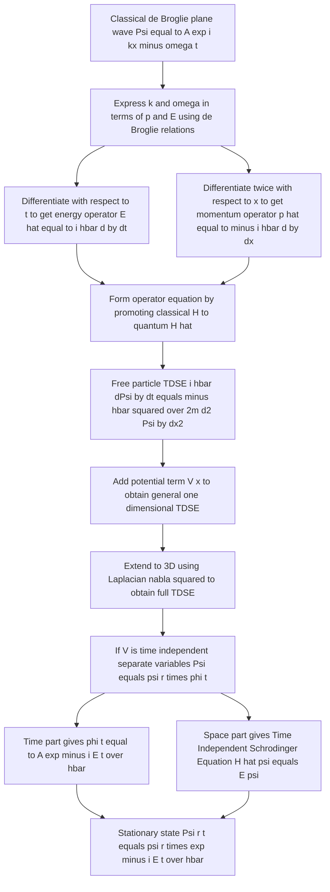
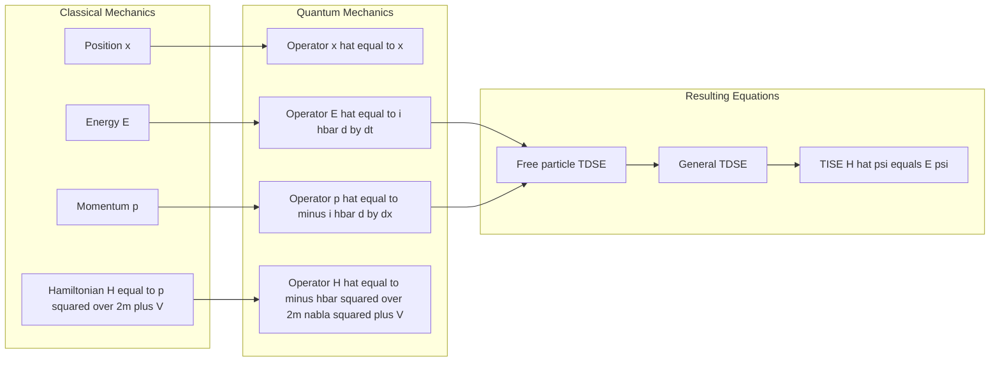
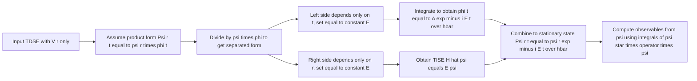
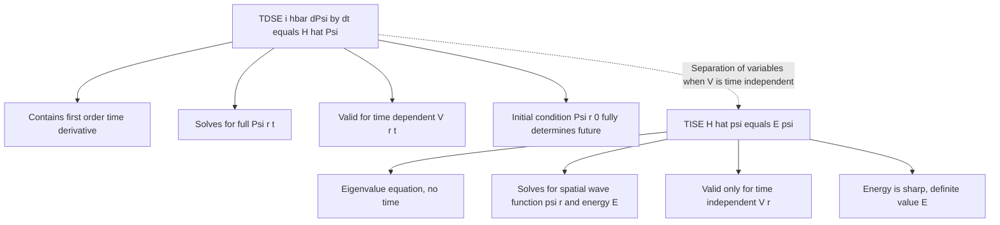

# Formulation of time dependent and time independent Schrodinger equations

<!-- SECTION_1_START -->
# Formulation of Time-Dependent & Time-Independent Schrödinger Equations

## 1.1 Formal Definition (KTU 2024 Syllabus Terminology)

The **Schrödinger equation** is the fundamental dynamical law of non-relativistic quantum mechanics. It governs the time evolution of the **wave function** $\Psi(\vec{r},t)$, which encodes the complete probabilistic state of a quantum particle. For a single particle of mass $m$ moving in a potential $V(\vec{r},t)$, the equation is the second-order partial differential equation:

$$
i\hbar\,\frac{\partial \Psi(\vec{r},t)}{\partial t} \;=\; \left[-\,\frac{\hbar^{2}}{2m}\,\nabla^{2} \;+\; V(\vec{r},t)\right]\Psi(\vec{r},t)
$$

> [!IMPORTANT]
> **Syllabus Highlight (GAPHT121 – Module 2):** The equation *cannot* be derived from classical mechanics; it is a *postulate* of quantum mechanics. Its correctness is judged by the agreement of its predictions with experiments (atomic spectra, tunneling, transistor behaviour).

The operator $\hat{H} = -\dfrac{\hbar^{2}}{2m}\nabla^{2} + V(\vec{r},t)$ is called the **Hamiltonian operator**, and the equation is often written compactly as $\hat{H}\Psi = i\hbar\,\partial\Psi/\partial t$.

When the potential is independent of time, $V(\vec{r})$, the wave function *separates* into a spatial part and a temporal phase, leading to the **Time-Independent Schrödinger Equation (TISE)**:

$$
-\frac{\hbar^{2}}{2m}\,\nabla^{2}\psi(\vec{r}) \;+\; V(\vec{r})\,\psi(\vec{r}) \;=\; E\,\psi(\vec{r})
$$

where $E$ is the *energy eigenvalue* and $\psi(\vec{r})$ the *stationary state*. The constant $\hbar = h/2\pi = 1.054 \times 10^{-34}\;\text{J}\cdot\text{s}$ is the **reduced Planck's constant** — the fundamental quantum of action.

## 1.2 Conceptual Analogy / Intuition

Think of the Schrödinger equation as the *quantum analogue* of **Newton's second law** ($F = ma$). Just as Newton's law lets you compute the future trajectory of a classical particle given the initial position and velocity, the Schrödinger equation lets you compute the *future wave function* $\Psi(\vec{r},t)$ given an initial wave function $\Psi(\vec{r},0)$.

**Real-world analogy — ripples on a vibrating drum:**
- When you strike a drum, the membrane vibrates as a *superposition* of standing-wave patterns (the eigenmodes).
- Each allowed pattern has a definite frequency $\omega$ — analogous to a *stationary state* with definite energy $E = \hbar\omega$.
- The drum-head displacement obeys a *wave equation*; similarly, $\Psi$ obeys the Schrödinger wave equation.
- The drum cannot vibrate at arbitrary frequencies — only at the *resonant* ones set by the boundary (the drum rim). Likewise, the Schrödinger equation restricts a quantum particle to a *discrete set of energies* when it is confined.

> [!NOTE]
> **Key Conceptual Distinction:** The Schrödinger equation gives a *complex-valued* wave function $\Psi$, not a directly observable field. The physically meaningful quantity is the probability density $\vert\Psi(\vec{r},t)\vert^{2}$, which Born interpreted as the chance of finding the particle near $\vec{r}$ at time $t$.

## 1.3 Essential Physical Constants (highlighted for KTU reference)

| Symbol | Quantity | Value |
| :---: | :--- | :--- |
| $h$ | Planck's constant | $6.626 \times 10^{-34}\;\text{J}\cdot\text{s}$ |
| $\hbar$ | Reduced Planck's constant $(h/2\pi)$ | $1.054 \times 10^{-34}\;\text{J}\cdot\text{s}$ |
| $m_{e}$ | Free electron mass | $9.109 \times 10^{-31}\;\text{kg}$ |
| $e$ | Elementary charge | $1.602 \times 10^{-19}\;\text{C}$ |

> [!VISUALIZATION CONTROL]
> **Concept:** Stationary-state wave functions and probability densities inside an infinite square well of width $a$.
> **GeoGebra / Desmos Input Equations:**
> * `f_1(x) = sqrt(2/a) * sin(pi*x/a)` (n=1 ground state)
> * `f_2(x) = sqrt(2/a) * sin(2*pi*x/a)` (n=2 first excited state)
> * `P_1(x) = (2/a) * (sin(pi*x/a))^2` (probability density, n=1)
> * `P_2(x) = (2/a) * (sin(2*pi*x/a))^2` (probability density, n=2)
> **Visual Description:** On the $x$-axis (position from $0$ to $a$), the student should see $\psi_{1}$ as a single hump going positive, $\psi_{2}$ as one positive and one negative lobe, and the corresponding $P_{n}$ curves showing two and three peaks respectively — all *vanishing* exactly at the walls $x=0$ and $x=a$.
<!-- SECTION_1_END -->

<!-- SECTION_2_START -->
# Deep Theoretical Analysis & KTU High-Yield Formula Sheet

## 2.1 Logical Roadmap: From de Broglie's Wave to the Schrödinger Equation

The formulation proceeds by elevating de Broglie's wave-particle duality into a *dynamical* law. The reasoning chain is:

1. **de Broglie Postulate (1924):** Every free particle of momentum $p$ and energy $E$ is associated with a plane wave
   $\Psi(\vec{r},t) = A\,e^{i(\vec{k}\cdot\vec{r} - \omega t)}$ whose wave vector and angular frequency are linked to mechanical quantities by
   $\vec{p} = \hbar\vec{k}$ and $E = \hbar\omega$.

2. **Frequency–Time Relation:** Differentiating the plane wave with respect to $t$ gives
   $i\hbar\,\dfrac{\partial \Psi}{\partial t} = E\,\Psi$, suggesting the *energy operator* $\hat{E} = i\hbar\,\partial/\partial t$.

3. **Wave-Number–Space Relation:** Differentiating twice with respect to $x$ gives
   $-\hbar^{2}\,\dfrac{\partial^{2}\Psi}{\partial x^{2}} = p^{2}\Psi$, suggesting the *momentum operator* $\hat{p}_{x} = -i\hbar\,\partial/\partial x$.

4. **Replace Classical Quantities with Operators:** The classical Hamiltonian of a particle in a potential $V(\vec{r})$ is
   $H = \dfrac{p^{2}}{2m} + V(\vec{r})$. Substituting $\hat{p}_{x} \rightarrow -i\hbar\,\partial/\partial x$ and $\hat{E}\rightarrow i\hbar\,\partial/\partial t$ converts it into a quantum equation of motion.

5. **Closure / Validation:** The resulting equation must be **linear in $\Psi$** (superposition principle) and **first-order in time** (state determines all future states). These two requirements, together with step 4, *uniquely fix* the Schrödinger equation.

> [!NOTE]
> **The "Why" behind the steps:** Quantum mechanics is built so that its predictions reduce to classical mechanics when $\hbar \rightarrow 0$ (correspondence principle). The Schrödinger equation is the *simplest* differential equation that satisfies linearity, hermiticity of the Hamiltonian, and correct classical limit.

## 2.2 KTU Formula Sheet / Cheat Sheet

| # | Equation | Name / Meaning | Domain |
| :---: | :--- | :--- | :--- |
| 1 | $E = \hbar\omega$ | Planck–Einstein relation | Energy ↔ frequency |
| 2 | $\vec{p} = \hbar\vec{k}$ | de Broglie relation | Momentum ↔ wave vector |
| 3 | $\hat{E} \equiv i\hbar\,\partial/\partial t$ | Energy operator | Time-domain |
| 4 | $\hat{p}_{x} \equiv -i\hbar\,\partial/\partial x$ | Momentum operator (1D) | Position-domain |
| 5 | $\hat{H} = -\dfrac{\hbar^{2}}{2m}\,\dfrac{d^{2}}{dx^{2}} + V(x)$ | Hamiltonian operator (1D) | Conservative systems |
| 6 | $i\hbar\,\dfrac{\partial \Psi}{\partial t} = \hat{H}\Psi$ | **Time-Dependent Schrödinger Eq. (TDSE)** | General $V(\vec{r},t)$ |
| 7 | $\Psi(\vec{r},t) = \psi(\vec{r})\,e^{-iEt/\hbar}$ | Separation ansatz | Time-independent $V$ |
| 8 | $-\dfrac{\hbar^{2}}{2m}\,\nabla^{2}\psi + V\psi = E\psi$ | **Time-Independent Schrödinger Eq. (TISE)** | Stationary states |
| 9 | $\displaystyle\int_{-\infty}^{\infty}\vert\Psi\vert^{2}\,dV = 1$ | Normalisation of $\Psi$ | Always required |
| 10 | $\langle x \rangle = \displaystyle\int \Psi^{*} x\,\Psi\, dx$ | Expectation value of position | Any state |
| 11 | $J = -\dfrac{i\hbar}{2m}\left(\Psi^{*}\nabla\Psi - \Psi\nabla\Psi^{*}\right)$ | Probability current density | Continuity eq. |
| 12 | $\dfrac{\partial \vert\Psi\vert^{2}}{\partial t} + \nabla\cdot\vec{J} = 0$ | Probability continuity | Conservation law |

> [!IMPORTANT]
> **Units Check (board exam favourite):** Verify that $[\hbar^{2}/(2m\,a^{2})] = \text{Joules}$ when $a$ is a length. This confirms the Hamiltonian operator has units of energy.

## 2.3 Engineering & Computational Relevance

The Schrödinger equation is the foundational tool behind nearly every modern electronic and information-science device:

* **Transistors & Integrated Circuits:** Band-structure calculations in silicon use the TISE for electrons in a periodic crystal potential $V(\vec{r})$ — this is what determines whether a material is a conductor, semiconductor, or insulator.
* **Semiconductor Lasers (LEDs, optical fibres):** Electron-hole recombination energies come directly from eigenvalues of the TISE in a quantum well.
* **Scanning Tunnelling Microscope (STM):** The bias voltage controls a tunnelling current that depends on the wave-function overlap — solving the TISE in a barrier potential.
* **Quantum Computing (Qubits):** Logical gates are implemented by precisely time-evolving the wave function via the TDSE: $\Psi(t) = e^{-i\hat{H}t/\hbar}\Psi(0)$.
* **MRI / NMR Imaging:** Precession of nuclear spins obeys a TDSE-like equation with the Hamiltonian containing Zeeman and chemical-shift terms.
* **Solar Cells & Photodetectors:** The absorption spectrum is governed by allowed transitions between TISE eigenstates.

> [!NOTE]
> In *information science* specifically, the TISE is the physics engine behind density-functional theory (DFT) codes such as VASP, Quantum ESPRESSO, and SIESTA — used by chip-design companies (Intel, TSMC) to model next-generation transistor materials.
<!-- SECTION_2_END -->

<!-- SECTION_3_START -->
# Step-by-Step Derivations

## 3.1 Derivation of the Time-Dependent Schrödinger Equation (1D, Free Particle → General)

**Starting assumptions** (KTU standard form):
* A free particle of definite energy $E$ and momentum $p$ is described by the de Broglie plane wave.
* Quantum mechanics is *linear*: superpositions of valid wave functions are also valid.
* Operators corresponding to measurable classical quantities are obtained by the correspondence $E \rightarrow i\hbar\,\partial/\partial t$ and $p \rightarrow -i\hbar\,\partial/\partial x$.

---

**Step 1 — Write the de Broglie plane wave for a free particle:**

$$
\Psi(x,t) \;=\; A\,e^{i(kx - \omega t)}
$$

This represents a wave travelling in the $+x$ direction with wave number $k = 2\pi/\lambda$ and angular frequency $\omega = 2\pi\nu$.

**Step 2 — Express $k$ and $\omega$ in terms of mechanical quantities using de Broglie:**

$$
\omega \;=\; \frac{E}{\hbar}, \qquad k \;=\; \frac{p}{\hbar}
$$

Substitute these back into the plane wave:

$$
\Psi(x,t) \;=\; A\,\exp\!\left[\frac{i}{\hbar}\,(p x - E t)\right]
$$

**Step 3 — Differentiate with respect to time** (the wave is a smooth exponential, so we get back the same function times a constant):

$$
\frac{\partial \Psi}{\partial t} \;=\; -\,\frac{iE}{\hbar}\,A\,e^{i(kx-\omega t)} \;=\; -\,\frac{iE}{\hbar}\,\Psi
$$

**Step 4 — Differentiate twice with respect to $x$:**

$$
\frac{\partial \Psi}{\partial x} \;=\; \frac{ip}{\hbar}\,\Psi
$$

$$
\frac{\partial^{2}\Psi}{\partial x^{2}} \;=\; -\,\frac{p^{2}}{\hbar^{2}}\,\Psi
$$

**Step 5 — Form the total energy $E$ in terms of the derivatives.** For a *free* particle, $E = p^{2}/(2m)$. Multiply the second-derivative equation by $-\hbar^{2}/(2m)$:

$$
-\frac{\hbar^{2}}{2m}\,\frac{\partial^{2}\Psi}{\partial x^{2}} \;=\; \frac{p^{2}}{2m}\,\Psi \;=\; E\,\Psi
$$

**Step 6 — Identify this result with the time-derivative relation** $\partial\Psi/\partial t = -(i/\hbar)E\Psi$, which gives $E\Psi = i\hbar\,\partial\Psi/\partial t$:

$$
i\hbar\,\frac{\partial \Psi}{\partial t} \;=\; -\,\frac{\hbar^{2}}{2m}\,\frac{\partial^{2}\Psi}{\partial x^{2}}
$$

This is the **free-particle TDSE**. **[Statement of free-particle form: 2 Marks]**

**Step 7 — Generalise to a particle in a potential $V(x)$.** Classical total energy is now $E = p^{2}/(2m) + V(x)$. The same operator substitution gives:

$$
E\,\Psi \;\longrightarrow\; \left[\frac{p^{2}}{2m} + V(x)\right]\Psi
$$

Operating on $\Psi$ with the corresponding quantum operator $\hat{H}$:

$$
i\hbar\,\frac{\partial \Psi}{\partial t} \;=\; \left[-\,\frac{\hbar^{2}}{2m}\,\frac{\partial^{2}}{\partial x^{2}} \;+\; V(x)\right]\Psi
$$

This is the **general one-dimensional TDSE**. **[Final boxed equation: 1 Mark]**

**Step 8 — Three-dimensional generalisation.** Replace $\partial^{2}/\partial x^{2}$ by the Laplacian $\nabla^{2} = \partial^{2}/\partial x^{2} + \partial^{2}/\partial y^{2} + \partial^{2}/\partial z^{2}$:

$$
\boxed{\,i\hbar\,\frac{\partial \Psi(\vec{r},t)}{\partial t} \;=\; \left[-\,\frac{\hbar^{2}}{2m}\,\nabla^{2} \;+\; V(\vec{r},t)\right]\Psi(\vec{r},t)\,}
$$

**Justification of uniqueness (board-level reasoning):** Linearity demands the equation to be linear in $\Psi$ and $\partial\Psi/\partial t$. The lowest-order spatial derivative that yields a real dispersion relation $\omega \propto k^{2}$ is *second* order. Hence $\nabla^{2}$ appears — and not, say, $\nabla^{4}$ or $\sqrt{\nabla^{2}}$. The constant $i\hbar$ on the left is forced by demanding that $\Psi$ remain complex and the Hamiltonian be Hermitian (so that probability is conserved).

---

## 3.2 Derivation of the Time-Independent Schrödinger Equation

**Starting assumption:** The potential is *time-independent*, $V(\vec{r},t) = V(\vec{r})$.

**Step 1 — Separate variables.** Propose a product ansatz:

$$
\Psi(\vec{r},t) \;=\; \psi(\vec{r})\,\phi(t)
$$

The function $\psi(\vec{r})$ depends only on space; $\phi(t)$ only on time.

**Step 2 — Substitute into the TDSE:**

$$
i\hbar\,\psi(\vec{r})\,\frac{d\phi}{dt} \;=\; \left[-\,\frac{\hbar^{2}}{2m}\,\nabla^{2}\psi(\vec{r})\right]\phi(t) \;+\; V(\vec{r})\,\psi(\vec{r})\,\phi(t)
$$

**Step 3 — Divide both sides by $\psi(\vec{r})\phi(t)$:**

$$
i\hbar\,\frac{1}{\phi}\,\frac{d\phi}{dt} \;=\; -\,\frac{\hbar^{2}}{2m}\,\frac{1}{\psi}\,\nabla^{2}\psi \;+\; V(\vec{r})
$$

**Step 4 — Recognise the separation of variables.** The left side depends *only* on $t$ and the right side *only* on $\vec{r}$. Therefore both sides must equal the same separation constant, which has units of energy — call it $E$.

**Step 5 — Solve the time part (left side = $E$):**

$$
i\hbar\,\frac{d\phi}{dt} \;=\; E\,\phi \quad\Longrightarrow\quad \frac{d\phi}{\phi} \;=\; -\,\frac{iE}{\hbar}\,dt
$$

Integrating:

$$
\phi(t) \;=\; A\,\exp\!\left(-\,\frac{iEt}{\hbar}\right) \;=\; A\,e^{-i\omega t}
$$

where $\omega = E/\hbar$. **[Time-dependent phase: 1 Mark]**

**Step 6 — Solve the space part (right side = $E$):**

$$
-\,\frac{\hbar^{2}}{2m}\,\nabla^{2}\psi(\vec{r}) \;+\; V(\vec{r})\,\psi(\vec{r}) \;=\; E\,\psi(\vec{r})
$$

This is the **Time-Independent Schrödinger Equation (TISE)** — an *eigenvalue equation* for the Hamiltonian operator $\hat{H}$, with eigenvalue $E$ (the energy of the stationary state) and eigenfunction $\psi(\vec{r})$.

$$
\boxed{\,\hat{H}\psi(\vec{r}) \;=\; E\,\psi(\vec{r}) \quad\text{with}\quad \hat{H} \equiv -\,\frac{\hbar^{2}}{2m}\,\nabla^{2} + V(\vec{r})\,}
$$

**[Final boxed TISE: 1 Mark]**

**Step 7 — Reassemble the full wave function:**

$$
\Psi(\vec{r},t) \;=\; \psi(\vec{r})\,e^{-iEt/\hbar}
$$

States of this form are called **stationary states** because the probability density $\vert\Psi\vert^{2} = \vert\psi\vert^{2}$ is independent of time.

**Step 8 — Physical interpretation of the separation constant $E$:**
* Multiply the TISE by $\psi^{*}(\vec{r})$ and integrate over all space:

$$
\int \psi^{*}\!\left(-\frac{\hbar^{2}}{2m}\nabla^{2}\psi + V\psi\right) dV \;=\; E\int\vert\psi\vert^{2}\,dV
$$

* If $\psi$ is normalised, $\int\vert\psi\vert^{2}dV = 1$, and the integral on the left is precisely the *expectation value* of the Hamiltonian, $\langle\hat{H}\rangle$.
* Hence $E$ is the *expectation value of the energy* in that stationary state, and since the variance of $\hat{H}$ in an eigenstate vanishes, the energy is *sharp*: the system has a definite energy $E$ with certainty.

> [!NOTE]
> **Alternative separation constant check:** One could have called the constant $C$ and carried it through; the appearance of $e^{iC t/\hbar}$ in $\phi(t)$ would force $C$ to have units of energy *because the equation must reduce to a known classical limit*. This is what fixes $C = E$.

---

## 3.3 Worked Numerical Illustration (Free-Particle Dispersion)

A free electron ($m = 9.11\times 10^{-31}\;\text{kg}$) of kinetic energy $E = 100\;\text{eV}$ moves in one dimension. Compute its de Broglie wavelength and the time period of its quantum-mechanical phase oscillation.

**Step 1 — Convert energy to joules:**

$$
E \;=\; 100\;\text{eV} \times 1.602\times 10^{-19}\;\text{J/eV} \;=\; 1.602\times 10^{-17}\;\text{J}
$$

**Step 2 — Compute the de Broglie wavelength** using $\lambda = h/\sqrt{2mE}$:

$$
\lambda \;=\; \frac{6.626\times 10^{-34}}{\sqrt{2 \times 9.11\times 10^{-31}\times 1.602\times 10^{-17}}}
$$

Compute the denominator:

$$
2 \times 9.11\times 10^{-31}\times 1.602\times 10^{-17} \;=\; 2.919\times 10^{-47}
$$

$$
\sqrt{2.919\times 10^{-47}} \;=\; 5.403\times 10^{-24}
$$

$$
\lambda \;=\; \frac{6.626\times 10^{-34}}{5.403\times 10^{-24}} \;=\; 1.227\times 10^{-10}\;\text{m} \;\approx\; 0.1227\;\text{nm}
$$

**Step 3 — Compute the time period of the phase** $T = h/E$:

$$
T \;=\; \frac{6.626\times 10^{-34}}{1.602\times 10^{-17}} \;=\; 4.135\times 10^{-17}\;\text{s}
$$

This ultra-short period is the *time scale* over which the phase of $\Psi$ cycles by $2\pi$ — directly relevant to ultrafast laser-pulse electronics.

> [!IMPORTANT]
> **Take-away:** The TDSE predicts that the phase of the wave function oscillates at the *optical frequency* $E/h$. In femtosecond-laser physics this oscillation is what drives phenomena such as above-threshold ionisation and high-harmonic generation.
<!-- SECTION_3_END -->

<!-- SECTION_4_START -->
# Structural Diagrams & Schematics

## 4.1 Logical Flow — From de Broglie's Wave to the Schrödinger Equation

## 4.2 Block-Level Functional Architecture — Operator Correspondence Map

## 4.3 Sequential Processing Topology — Separation of Variables Pipeline

## 4.4 Comparison Matrix — TDSE vs TISE

<!-- SECTION_4_END -->

<!-- SECTION_5_START -->
# KTU 2024 Scheme Examination Question Bank & Topic Recap

## Part A — Short-Answer Questions (3 Marks Each)

### Question 1
**`[KTU University Exam - July 2024]`** &nbsp; **| CO1 | Remember**

State the time-independent Schrödinger equation for a particle of mass $m$ moving in a one-dimensional potential $V(x)$. Identify the physical meaning of each term.

**Model Answer (Valuation Key):**
The TISE is
$$
-\frac{\hbar^{2}}{2m}\,\frac{d^{2}\psi(x)}{dx^{2}} \;+\; V(x)\,\psi(x) \;=\; E\,\psi(x)
$$
* **$-\dfrac{\hbar^{2}}{2m}\,\dfrac{d^{2}\psi}{dx^{2}}$** — kinetic-energy operator acting on $\psi$ (proportional to the squared momentum operator). **[1 Mark]**
* **$V(x)\psi(x)$** — potential-energy term; the operator $V(\hat{x})$ is just multiplication by $V(x)$. **[1 Mark]**
* **$E\psi(x)$** — eigenvalue equation; $E$ is the *definite energy* of the stationary state with wave function $\psi(x)$. **[1 Mark]**

---

### Question 2
**`[KTU University Exam - Dec 2023]`** &nbsp; **| CO1 | Understand**

What physical quantity is represented by the square of the absolute value of the wave function, $\vert\Psi(\vec{r},t)\vert^{2}$? Mention the normalisation condition.

**Model Answer:**
$\vert\Psi(\vec{r},t)\vert^{2}\,dV$ is the *probability* of finding the particle inside the volume element $dV$ around $\vec{r}$ at time $t$ (Born's probabilistic interpretation, 1926). **[2 Marks]** The wave function must be normalised so that the total probability of finding the particle *somewhere* equals unity:
$$
\int_{-\infty}^{\infty}\vert\Psi(\vec{r},t)\vert^{2}\,dV \;=\; 1
$$
**[1 Mark]**

---

## Part B — Long-Answer Questions (14 Marks Each)

### Question A (Internal Choice Option 1) — Full Derivation Type

**`[KTU University Exam - July 2024]`** &nbsp; **| CO1, CO2 | Understand, Apply**

**(a)** Starting from the de Broglie relations $E = \hbar\omega$ and $p = \hbar k$, derive the time-dependent Schrödinger equation for a free particle in one dimension. **[7 Marks]**

**(b)** Hence generalise it to a particle of mass $m$ moving in a time-independent potential $V(x)$. Using separation of variables, obtain the time-independent Schrödinger equation and explain the meaning of the separation constant. **[7 Marks]**

#### Model Solution

**(a) Derivation of the 1D free-particle TDSE**

Step 1: Free-particle wave function (de Broglie plane wave):
$$
\Psi(x,t) \;=\; A\,e^{i(kx-\omega t)} \quad\text{[Writing the wave: 1 Mark]}
$$

Step 2: de Broglie substitutions:
$$
\omega = \frac{E}{\hbar},\qquad k = \frac{p}{\hbar}
$$

Step 3: Time derivative:
$$
\frac{\partial \Psi}{\partial t} \;=\; -i\omega\,\Psi \;=\; -\frac{iE}{\hbar}\,\Psi \;\Longrightarrow\; i\hbar\,\frac{\partial \Psi}{\partial t} \;=\; E\,\Psi
$$
**[Time derivative identification: 1 Mark]**

Step 4: Second spatial derivative:
$$
\frac{\partial^{2}\Psi}{\partial x^{2}} \;=\; -k^{2}\Psi \;=\; -\frac{p^{2}}{\hbar^{2}}\,\Psi \;\Longrightarrow\; -\frac{\hbar^{2}}{2m}\,\frac{\partial^{2}\Psi}{\partial x^{2}} \;=\; \frac{p^{2}}{2m}\,\Psi \;=\; E\,\Psi
$$
**[Space derivative identification: 1 Mark]**

Step 5: Equate the two expressions for $E\Psi$:
$$
i\hbar\,\frac{\partial \Psi}{\partial t} \;=\; -\frac{\hbar^{2}}{2m}\,\frac{\partial^{2}\Psi}{\partial x^{2}}
$$
**[Final free-particle equation: 1 Mark]**

Step 6: Justification of uniqueness — linearity and first-order-in-time requirement. **[Uniqueness reasoning: 2 Marks]**

**(b) Generalisation and separation of variables**

Step 1: Add potential — replace kinetic energy $p^{2}/(2m)$ by $p^{2}/(2m) + V(x)$ in the operator:
$$
i\hbar\,\frac{\partial \Psi}{\partial t} \;=\; \left[-\frac{\hbar^{2}}{2m}\,\frac{\partial^{2}}{\partial x^{2}} + V(x)\right]\Psi(x,t)
$$
**[General TDSE: 1 Mark]**

Step 2: Propose separation ansatz $\Psi(x,t) = \psi(x)\phi(t)$. Substitute:
$$
i\hbar\,\psi\,\frac{d\phi}{dt} \;=\; -\frac{\hbar^{2}}{2m}\,\phi\,\frac{d^{2}\psi}{dx^{2}} + V(x)\psi\phi
$$

Step 3: Divide by $\psi\phi$:
$$
i\hbar\,\frac{1}{\phi}\,\frac{d\phi}{dt} \;=\; -\frac{\hbar^{2}}{2m}\,\frac{1}{\psi}\,\frac{d^{2}\psi}{dx^{2}} + V(x)
$$
**[Separation: 1 Mark]**

Step 4: LHS depends only on $t$, RHS only on $x$; equate both to a constant $E$:
$$
i\hbar\,\frac{d\phi}{dt} \;=\; E\,\phi \quad\Longrightarrow\quad \phi(t) = e^{-iEt/\hbar}
$$
**[Time-part integration: 1 Mark]**

Step 5: Spatial eigenvalue equation:
$$
-\frac{\hbar^{2}}{2m}\,\frac{d^{2}\psi}{dx^{2}} + V(x)\psi = E\psi
$$
**[Final TISE: 1 Mark]**

Step 6: Physical meaning of $E$ — the *separation constant has units of energy and equals the expectation value of the Hamiltonian in the stationary state*. The energy is *sharp* (no uncertainty) in any eigenstate. **[Meaning of E: 2 Marks]**

---

### Question B (Internal Choice Option 2) — Applied / Numerical Type

**`[KTU University Exam - Dec 2023]`** &nbsp; **| CO1, CO3 | Apply, Analyse**

**(a)** An electron is confined in a one-dimensional infinite potential well of width $a = 1\;\text{nm}$. Using the time-independent Schrödinger equation, obtain the allowed energy eigenvalues $E_{n}$ and the normalised wave functions $\psi_{n}(x)$. **[7 Marks]**

**(b)** Calculate the numerical values of $E_{1}$, $E_{2}$, and the wavelength of the photon emitted when the electron transitions from $n=2$ to $n=1$. Given $m_{e} = 9.11\times 10^{-31}\;\text{kg}$, $h = 6.626\times 10^{-34}\;\text{J}\cdot\text{s}$, $c = 3\times 10^{8}\;\text{m/s}$. **[7 Marks]**

#### Model Solution

**(a) Eigenvalues and eigenfunctions of the infinite well**

Step 1: Potential: $V(x) = 0$ for $0 < x < a$; $V = \infty$ outside. **[Statement of V: 1 Mark]**

Step 2: Inside the well, TISE reduces to
$$
\frac{d^{2}\psi}{dx^{2}} + k^{2}\psi = 0,\qquad k^{2} = \frac{2mE}{\hbar^{2}}
$$

General solution: $\psi(x) = A\sin(kx) + B\cos(kx)$. **[Form of general solution: 1 Mark]**

Step 3: Apply boundary conditions. Since $\psi$ must be continuous and finite, $\psi(0) = 0$ and $\psi(a) = 0$.

* $\psi(0) = B = 0$ ⇒ $B = 0$. **[BC at x=0: 1 Mark]**
* $\psi(a) = A\sin(ka) = 0$ ⇒ $ka = n\pi$ for $n = 1,2,3,\ldots$ **[BC at x=a: 1 Mark]**

Step 4: Quantisation condition $k_{n} = n\pi/a$, hence
$$
E_{n} \;=\; \frac{\hbar^{2}k_{n}^{2}}{2m} \;=\; \frac{n^{2}\pi^{2}\hbar^{2}}{2ma^{2}} \;=\; \frac{n^{2}h^{2}}{8ma^{2}}
$$
**[Energy eigenvalue: 1 Mark]**

Step 5: Normalisation $\int_{0}^{a}\vert\psi_{n}\vert^{2}dx = 1$ gives $A = \sqrt{2/a}$. Hence
$$
\psi_{n}(x) \;=\; \sqrt{\frac{2}{a}}\,\sin\!\left(\frac{n\pi x}{a}\right),\quad n=1,2,3,\ldots
$$
**[Normalised wave function: 1 Mark]**

**(b) Numerical computation**

Step 1: Common factor
$$
\frac{h^{2}}{8ma^{2}} \;=\; \frac{(6.626\times 10^{-34})^{2}}{8 \times 9.11\times 10^{-31}\times(10^{-9})^{2}}
$$

Compute numerator: $(6.626)^{2}\times 10^{-68} = 43.90\times 10^{-68} = 4.390\times 10^{-67}$. **[Numerator: 1 Mark]**

Compute denominator: $8 \times 9.11\times 10^{-31}\times 10^{-18} = 72.88\times 10^{-49} = 7.288\times 10^{-48}$. **[Denominator: 1 Mark]**

Divide:
$$
\frac{4.390\times 10^{-67}}{7.288\times 10^{-48}} \;=\; 6.024\times 10^{-20}\;\text{J}
$$

Step 2: $E_{1} = 6.024\times 10^{-20}\;\text{J} \approx 0.376\;\text{eV}$. **[E1: 1 Mark]**

$E_{2} = 4 E_{1} = 2.410\times 10^{-19}\;\text{J} \approx 1.505\;\text{eV}$. **[E2: 1 Mark]**

Step 3: Photon energy for $2 \rightarrow 1$ transition:
$$
\Delta E \;=\; E_{2}-E_{1} \;=\; 3 E_{1} \;=\; 3\times 6.024\times 10^{-20} \;=\; 1.807\times 10^{-19}\;\text{J}
$$

Wavelength:
$$
\lambda \;=\; \frac{hc}{\Delta E} \;=\; \frac{6.626\times 10^{-34}\times 3\times 10^{8}}{1.807\times 10^{-19}}
$$
**[Photon wavelength formula: 1 Mark]**

$$
\lambda \;=\; \frac{1.988\times 10^{-25}}{1.807\times 10^{-19}} \;=\; 1.10\times 10^{-6}\;\text{m} \;=\; 1100\;\text{nm}
$$

This is in the *near-infrared* region — relevant to silicon-based fibre-optic communication! **[Final numerical wavelength with unit: 1 Mark]**

---

## KTU Examiner's Valuation Warning / Pitfall Callout

> [!WARNING]
> **Common Mark-Deduction Pitfalls (TDSE / TISE papers):**
> * **Forgetting the factor of $i$**: writing $\hbar\,\partial\Psi/\partial t$ instead of $i\hbar\,\partial\Psi/\partial t$ — costs **2 marks** instantly.
> * **Wrong placement of $V(x)$**: it is *inside* the Hamiltonian operator acting on $\Psi$, *not* an additive scalar on the LHS. The TISE is $\hat{H}\psi = E\psi$, **not** $\hat{H} = E\psi + V$.
> * **Confusing $\Psi$ and $\psi$**: $\Psi(\vec{r},t)$ is the *full* time-dependent wave function; $\psi(\vec{r})$ is its *spatial* part appearing in the TISE. Mixing them is a board-exam killer.
> * **Skipping the boundary conditions**: A general solution of the TISE has arbitrary constants; you *must* show the BCs and use them to fix the constants and quantisation rules ($k = n\pi/a$). Omitting BCs costs **at least 1–2 marks**.
> * **Dimensional mismatch in the final answer**: always state the unit (J or eV for energy, m or nm for length). Bare numbers without units lose **½ mark** in board evaluations.
> * **Sign error in the Hamiltonian**: the kinetic operator is $-\hbar^{2}\nabla^{2}/(2m)$, with the *minus* sign. Writing $+\hbar^{2}\nabla^{2}/(2m)$ will give exponentially growing (non-physical) wave functions.

---

## Topic Recap & Important Things to Remember

- **Schrödinger equation status:** It is a *postulate* of quantum mechanics, not derivable from classical physics. It is the quantum analogue of Newton's second law.
- **Two equations exist:** TDSE (time-dependent, first-order in $t$) and TISE (time-independent, eigenvalue form). The TISE is a *special case* of the TDSE under time-independent $V$.
- **Plane wave of free particle:** $\Psi = A e^{i(kx - \omega t)}$, with $k = p/\hbar$ and $\omega = E/\hbar$ — these are the seeds of the formulation.
- **Operator correspondence:** $E \to i\hbar\,\partial/\partial t$, $\vec{p} \to -i\hbar\nabla$. This is the bridge from classical $H$ to quantum $\hat{H}$.
- **General TDSE (3D):** $i\hbar\,\partial\Psi/\partial t = [-\hbar^{2}\nabla^{2}/(2m) + V]\Psi$.
- **TISE:** $\hat{H}\psi = E\psi$, with $\hat{H} = -\hbar^{2}\nabla^{2}/(2m) + V(\vec{r})$.
- **Separation of variables:** $\Psi(\vec{r},t) = \psi(\vec{r})e^{-iEt/\hbar}$ — valid only when $V$ is *time-independent*.
- **Stationary state:** Probability density $\vert\Psi\vert^{2} = \vert\psi\vert^{2}$ is *time-independent* — only the phase oscillates.
- **Born's interpretation:** $\vert\Psi\vert^{2}$ is a *probability density*; $\Psi$ itself is not directly measurable.
- **Linear & first-order in time:** These two requirements *uniquely* fix the Schrödinger form.
- **Probability continuity:** $\partial\vert\Psi\vert^{2}/\partial t + \nabla\cdot\vec{J} = 0$ — total probability is conserved (inherited from Hermitian $\hat{H}$).
- **Units of $\hbar$:** $\text{J}\cdot\text{s}$ (action). Always verify dimensional consistency in derivations.
- **Infinite well results (must memorise):** $E_{n} = n^{2}h^{2}/(8ma^{2})$ and $\psi_{n} = \sqrt{2/a}\,\sin(n\pi x/a)$.
- **Key energy scale for 1 nm confinement:** $\sim 0.376\;\text{eV}$ — illustrates why *nanoscale* devices are quantum-mechanical in nature.
- **Engineering link:** DFT (band-gap calculations), STM (tunnelling), qubit gates (controlled unitary evolution) all stem directly from the Schrödinger formulation.
<!-- SECTION_5_END -->
