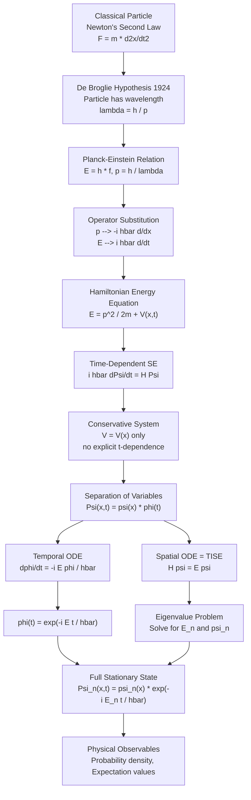
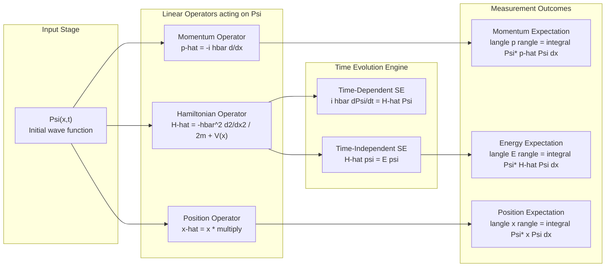
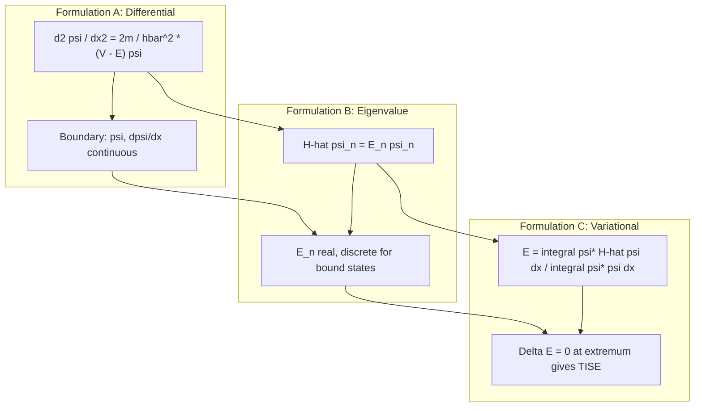
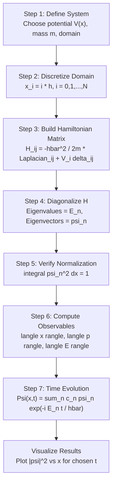

# Formulation of time dependent and time independent Schrodinger equations

<!-- SECTION_1_START -->
# 1. Formulation of the Schrödinger Equations — Core Definition & Intuition

> [!NOTE]
> **Module Context (KTU GAPHT121 — Physics for Information Science, Module 2):**
> Quantum Mechanics is the foundational pillar of *information science* because every transistor, every qubit, every tunneling diode, and every semiconductor laser ultimately obeys the laws of wave mechanics. The Schrödinger equation is the *master dynamical law* that replaces Newton's second law at the atomic scale.

## 1.1 Formal Definition

The **Schrödinger equation** is the fundamental wave equation of non-relativistic quantum mechanics that governs the temporal and spatial evolution of a particle's quantum state. It was proposed by **Erwin Schrödinger** in **1925** as a wave-mechanical reformulation of matrix mechanics. It postulates that every physical system is described by a *complex-valued state function* (the wave function) $\Psi(\vec{r}, t)$, and that the time-evolution of this function is generated by the **Hamiltonian operator** $\hat{H}$ of the system.

> [!IMPORTANT]
> **Syllabus Highlight:** The KTU Module-2 syllabus specifically demands the *derivation* of both the time-dependent Schrödinger equation (TDSE) and the time-independent Schrödinger equation (TISE) using the *separation-of-variables* method, and the identification of the physical significance of the resulting wave function.

### 1.1.1 Time-Dependent Schrödinger Equation (TDSE)

In one spatial dimension, the TDSE is:

$$i\hbar\,\frac{\partial \Psi(x,t)}{\partial t} \;=\; \hat{H}\,\Psi(x,t) \;=\; \left[-\frac{\hbar^{2}}{2m}\frac{\partial^{2}}{\partial x^{2}} \;+\; V(x,t)\right]\Psi(x,t)$$

| Symbol | Meaning | Nature |
|---|---|---|
| $\Psi(x,t)$ | Wave function of the particle | Complex scalar field |
| $i$ | Imaginary unit ($i^{2} = -1$) | Mathematical constant |
| $\hbar$ | Reduced Planck's constant ($\hbar = h/2\pi \approx 1.054 \times 10^{-34}$ J·s) | **Universal physical constant** |
| $m$ | Mass of the particle | System property |
| $V(x,t)$ | Potential energy experienced by the particle | External field |
| $\hat{H}$ | Hamiltonian operator (total energy operator) | Linear, Hermitian operator |

### 1.1.2 Time-Independent Schrödinger Equation (TISE)

When the potential $V$ has *no explicit time dependence* ($V = V(x)$ only) and the system is in a **stationary state of definite energy** $E$, the TDSE reduces to an *eigenvalue equation*:

$$\hat{H}\,\psi(x) \;=\; E\,\psi(x)$$

Expanded in one dimension:

$$-\frac{\hbar^{2}}{2m}\,\frac{d^{2}\psi(x)}{dx^{2}} \;+\; V(x)\,\psi(x) \;=\; E\,\psi(x)$$

This is the **Time-Independent Schrödinger Equation (TISE)** — an *ordinary* differential equation in $x$ alone, and the workhorse for nearly all bound-state and scattering problems in solid-state and information-science applications.

---

## 1.2 Conceptual Analogy — *How a Quantum Particle Behaves*

> [!TIP]
> **Real-world Analogy — The "Diffusing Smoke Ring" in a Wind Tunnel**
>
> Imagine a smoke ring drifting through an air tunnel where the wind speed varies along the tunnel length. The **TDSE** is the rule that tells you *how the smoke ring's shape changes moment-by-moment* as it travels. The **TISE** is the rule that tells you *what stable, repeating shapes the smoke ring can settle into* if the wind has settled into a steady pattern.
>
> In quantum mechanics:
> * The **smoke ring's density** corresponds to $\vert \Psi(x,t) \vert^{2}$ (probability density of finding the electron).
> * The **wind pattern** corresponds to $V(x)$ (the potential landscape, e.g. the periodic potential inside a transistor's channel).
> * The **steady, repeating shapes** are the **stationary states** $\psi_{n}(x)$ — the *orbitals* that electrons occupy in atoms, the *modes* of a quantum well in a laser, or the *Bloch waves* in a crystal lattice.

### 1.3 The Max Born Probability Interpretation

The wave function $\Psi$ is **not** directly observable. The physically measurable quantity is the *Born probability density*:

$$P(x,t) \;=\; \vert \Psi(x,t) \vert^{2} \;=\; \Psi^{*}(x,t)\,\Psi(x,t)$$

where $\Psi^{*}$ denotes the *complex conjugate*. The particle must be found *somewhere* in space, so:

$$\int_{-\infty}^{+\infty} \Psi^{*}(x,t)\,\Psi(x,t)\,dx \;=\; 1 \quad \text{(Normalization Condition)}$$

> [!IMPORTANT]
> **Three Mathematical Conditions a "Physical" Wave Function Must Satisfy:**
> 1. **Single-valued** — one probability at each point.
> 2. **Continuous** — no jumps in $\psi$ or its first derivative.
> 3. **Square-integrable** — $\int \vert \Psi \vert^{2}\,dx$ must be finite so the particle can be normalized.

---

## 1.4 Why the Schrödinger Equation Matters for Information Science

| Information-Science Domain | Role of Schrödinger Equation |
|---|---|
| **Semiconductor Transistors (MOSFET, FinFET)** | Electrons in the inversion layer behave as 2-D quantum particles; TISE yields sub-band energies. |
| **Quantum Computing (qubits)** | TDSE governs single-qubit rotation; TISE gives the energy gap that defines logical 0 and 1. |
| **Tunnel Diodes & Flash Memory** | TISE with a finite potential barrier gives the *tunneling probability* — the basis of Esaki diodes and flash EEPROMs. |
| **Photodetectors & CCDs** | Photo-excited electrons obey TISE in the well of a quantum dot. |
| **Quantum Cryptography** | BB84 protocol relies on non-clonability of $\Psi$ — a direct consequence of the linearity of the TDSE. |

> [!VISUALIZATION CONTROL]
> **Concept:** Probability density $\vert \psi(x) \vert^{2}$ for a particle in a 1-D infinite potential well of width $L$.
> **GeoGebra / Desmos Input Equations:**
> * `psi_1(x) = sqrt(2/L) * sin(pi*x/L)` with `L = 1`
> * `psi_2(x) = sqrt(2/L) * sin(2*pi*x/L)`
> * `psi_3(x) = sqrt(2/L) * sin(3*pi*x/L)`
> * `prob_n(x) = (psi_n(x))^2`
> **Visual Description:** Three humps inside the box $[0, L]$; the *n*-th state has $n$ antinodes. The peaks — where the electron is *most likely* to be found — are not at the centre for higher states. As $n \to \infty$, the probability flattens, recovering the classical uniform distribution.
<!-- SECTION_1_END -->

<!-- SECTION_2_START -->
# 2. Deep Theoretical Analysis & KTU High-Yield Formula Sheet

## 2.1 The Logical Roadmap — From De Broglie Wave to Schrödinger Equation

The derivation is **historical-rational**, not axiomatic. Schrödinger built his equation by demanding that it be:
1. **Linear** (so the *superposition principle* holds).
2. **First-order in time** (so an initial $\Psi(x,0)$ uniquely fixes the future).
3. **Consistent with the non-relativistic energy-momentum relation**.
4. **Reduces to the classical Hamilton-Jacobi equation** in the short-wavelength (WKB) limit.

### Step-by-Step Logical Skeleton

1. **De Broglie's matter-wave hypothesis (1924):** A free particle of momentum $p$ and energy $E$ is associated with a plane wave

   $$\Psi(x,t) \;=\; A\,e^{\,i(kx - \omega t)}, \qquad k = \frac{p}{\hbar}, \quad \omega = \frac{E}{\hbar}$$

2. **Operator substitution rule (canonical quantization):** Replace classical dynamical variables with *operators* acting on the wave function:

   $$p \;\longrightarrow\; \hat{p} \;=\; -i\hbar\,\frac{\partial}{\partial x}, \qquad E \;\longrightarrow\; \hat{E} \;=\; i\hbar\,\frac{\partial}{\partial t}$$

3. **Hamiltonian formalism:** The total energy is kinetic + potential:

   $$E \;=\; \frac{p^{2}}{2m} \;+\; V(x)$$

4. **Insert operators** into the classical energy relation and let them act on $\Psi$:

   $$i\hbar\,\frac{\partial \Psi}{\partial t} \;=\; \left[-\frac{\hbar^{2}}{2m}\frac{\partial^{2}}{\partial x^{2}} \;+\; V(x,t)\right]\Psi$$

   This is the **TDSE**.

5. **Separation of variables for conservative systems** ($V = V(x)$ only):

   $$\Psi(x,t) \;=\; \psi(x)\,\phi(t)$$

   Substituting into the TDSE and dividing by $\psi(x)\phi(t)$ yields two ordinary differential equations.

6. **The temporal equation** has the universal solution $\phi(t) = e^{-iEt/\hbar}$, encoding the *global phase* of the wave function.

7. **The spatial equation** is the **TISE** — an eigenvalue problem whose eigenvalues $E_{n}$ are the *allowed energies* of the system.

> [!IMPORTANT]
> **Why is $i$ in front of the time derivative?**
> The factor $i = \sqrt{-1}$ ensures that $|\Psi|^{2}$ is *conserved in time* (probability never leaks). If the equation were $\partial_{t}\Psi = \hat{H}\Psi$ (real coefficient), probabilities would either blow up or decay, violating particle conservation.

---

## 2.2 KTU High-Yield Formula Sheet

> [!NOTE]
> **Use this as your one-page revision cheat-sheet before the exam.** Every line below is a *board-mark-fetching* equation.

| # | Formula | Meaning / Use |
|---|---|---|
| 1 | $\hat{H} = -\dfrac{\hbar^{2}}{2m}\nabla^{2} + V(\vec{r},t)$ | Hamiltonian (total-energy) operator in 3-D |
| 2 | $i\hbar\,\dfrac{\partial \Psi}{\partial t} = \hat{H}\Psi$ | **Time-Dependent Schrödinger Equation (TDSE)** |
| 3 | $\hat{H}\psi = E\psi$ | **Time-Independent Schrödinger Equation (TISE)** — eigenvalue form |
| 4 | $\hat{p} = -i\hbar\nabla$ | Momentum operator |
| 5 | $\hat{E} = i\hbar\,\dfrac{\partial}{\partial t}$ | Energy operator |
| 6 | $E = \hbar\omega$, $\quad p = \hbar k$ | Planck–Einstein & de Broglie relations |
| 7 | $P(x,t) = \vert \Psi(x,t) \vert^{2}\,dx$ | Born probability of finding particle in $[x, x+dx]$ |
| 8 | $\displaystyle \int_{-\infty}^{+\infty} \vert \Psi \vert^{2}\,dx = 1$ | Normalization condition |
| 9 | $\Psi(x,t) = \psi(x)\,e^{-iEt/\hbar}$ | Stationary-state ansatz |
| 10 | $\displaystyle \langle Q \rangle = \int \Psi^{*}\,\hat{Q}\,\Psi\,dx$ | Expectation value of observable $Q$ |
| 11 | $\displaystyle \dfrac{d\langle p \rangle}{dt} = -\Big\langle \dfrac{\partial V}{\partial x} \Big\rangle$ | **Ehrenfest's theorem** — Newton's 2nd law in QM |
| 12 | $\Delta x \cdot \Delta p \geq \hbar/2$ | **Heisenberg Uncertainty Principle** |
| 13 | $J = \dfrac{\hbar}{m}\,\text{Im}\big(\Psi^{*}\,\partial_{x}\Psi\big)$ | Probability current density |
| 14 | Continuity eqn: $\dfrac{\partial \rho}{\partial t} + \dfrac{\partial J}{\partial x} = 0$ | Local probability conservation |

> [!TIP]
> **Exam Mnemonic — "PAPA BEAR"** for the operator correspondences:
> **P**osition $x \to \hat{x} = x$ (multiply), **A**lgebra stays the same, **P**hase $\to$ momentum $\hat{p} = -i\hbar\partial_{x}$, **B**orn interpretation for $\vert \Psi \vert^{2}$, **E**nergy $\to \hat{E} = i\hbar\partial_{t}$, **A**ssemble into TDSE, **R**eal $E$ eigenvalue of TISE.

---

## 2.3 Operator Algebra Essentials

The operator formalism makes the Schrödinger equation a *generalization* of classical mechanics. The classical Poisson bracket $\{A, B\}$ is replaced by the commutator:

$$[A, B] \;=\; \hat{A}\hat{B} - \hat{B}\hat{A} \;=\; \frac{i\hbar}{m_{AB}} \quad \text{(non-zero} \Rightarrow \text{observables do not commute)}$$

| Canonical Commutation Relation | Consequence |
|---|---|
| $[\hat{x}, \hat{p}_{x}] = i\hbar$ | Position & momentum cannot be simultaneously measured exactly $\Rightarrow$ Uncertainty |
| $[\hat{H}, \hat{p}] = 0$ (for free particle) | Momentum is conserved |
| $[\hat{H}, \hat{L}_{z}] = 0$ (central potential) | Angular momentum $L_{z}$ is conserved |

### 2.4 Stationary vs. Non-Stationary States — A Key Distinction

A *stationary state* satisfies $\Psi(x,t) = \psi(x)e^{-iEt/\hbar}$. Crucial properties:

1. The probability density is **time-independent**:

   $$\vert \Psi(x,t) \vert^{2} \;=\; \vert \psi(x) \vert^{2}\,\big\vert e^{-iEt/\hbar} \big\vert^{2} \;=\; \vert \psi(x) \vert^{2}$$

2. The expectation value of *any* operator that does not depend explicitly on time is **constant**:

   $$\dfrac{d}{dt}\langle \hat{Q} \rangle \;=\; \dfrac{i}{\hbar}\langle [\hat{H}, \hat{Q}] \rangle \;+\; \Big\langle \dfrac{\partial \hat{Q}}{\partial t} \Big\rangle \;=\; 0 \quad \text{if } [\hat{H}, \hat{Q}]=0$$

3. The energy is *sharp* (no uncertainty): $\Delta E = 0$.

> [!WARNING]
> **Common Mistake:** "Stationary" does **NOT** mean "the particle is at rest." It means the *probability cloud* is frozen in shape. A bound electron in a stationary state of a hydrogen atom is *moving* — its average momentum is zero, but $\Delta p > 0$.

---

## 2.5 Engineering Relevance — Why Software/IT Engineers Care

| Real System | Schrödinger Equation Role |
|---|---|
| **FinFET (3-D transistor)** | TISE in a triangular potential well gives sub-band quantization; affects threshold voltage. |
| **Resonant-Tunneling Diode (RTD)** | TISE through a double-barrier well yields transmission resonances $\Rightarrow$ negative differential resistance. |
| **Quantum-Dot Single-Photon Source** | TISE for a spherical well gives discrete energy levels $\Rightarrow$ tunable single-photon emission. |
| **Quantum Key Distribution (BB84)** | Linearity of TDSE ensures *no-cloning theorem* — eavesdropping is detectable. |
| **Scanning Tunneling Microscope (STM)** | Tunneling probability from TISE gives $I \propto e^{-2\kappa d}$ — the basis of atomic-resolution imaging. |
<!-- SECTION_2_END -->

<!-- SECTION_3_START -->
# 3. Step-by-Step Derivations & Symbolic Implementation

## 3.1 Derivation 1 — Time-Dependent Schrödinger Equation from the De Broglie Wave

### 3.1.1 Start: Classical Energy-Momentum Relation

For a *non-relativistic* particle of mass $m$ moving in a potential $V(x, t)$, the total mechanical energy is the sum of kinetic and potential energies:

$$E \;=\; \frac{p^{2}}{2m} \;+\; V(x, t) \quad \text{................................................... (1)}$$

### 3.1.2 Assume a Plane-Wave Matter Wave

De Broglie (1924) proposed that a free particle of momentum $p$ and energy $E$ is associated with a monochromatic plane wave:

$$\Psi(x, t) \;=\; A\,e^{i(kx - \omega t)} \quad \text{.......................................................... (2)}$$

The relations between wave-numbers and dynamical variables are:

$$p \;=\; \hbar k, \qquad E \;=\; \hbar \omega \quad \text{.......................................................... (3)}$$

### 3.1.3 Apply Operators to the Plane Wave

Differentiate $\Psi$ with respect to $x$ and $t$:

$$\frac{\partial \Psi}{\partial x} \;=\; i k\,A\,e^{i(kx - \omega t)} \;=\; i k\,\Psi \quad \Rightarrow \quad -i\hbar\,\frac{\partial \Psi}{\partial x} \;=\; p\,\Psi$$

$$\frac{\partial \Psi}{\partial t} \;=\; -i\omega\,A\,e^{i(kx - \omega t)} \;=\; -i\omega\,\Psi \quad \Rightarrow \quad i\hbar\,\frac{\partial \Psi}{\partial t} \;=\; E\,\Psi$$

These motivate the *operator correspondences*:

$$\hat{p} \;\equiv\; -i\hbar\,\frac{\partial}{\partial x}, \qquad \hat{E} \;\equiv\; i\hbar\,\frac{\partial}{\partial t} \quad \text{.............................................. (4)}$$

### 3.1.4 Insert Operators into the Classical Energy Equation

Replace $E$ by $\hat{E}$ and $p^{2}$ by $\hat{p}^{2} = -\hbar^{2}\partial_{x}^{2}$ acting on $\Psi$:

$$i\hbar\,\frac{\partial \Psi}{\partial t} \;=\; \left[\frac{(-i\hbar\,\partial_{x})^{2}}{2m} \;+\; V(x, t)\right]\Psi$$

Simplify the kinetic term:

$$(-i\hbar)^{2} \;=\; -\hbar^{2}$$

Therefore:

$$i\hbar\,\frac{\partial \Psi}{\partial t} \;=\; \left[-\frac{\hbar^{2}}{2m}\frac{\partial^{2}}{\partial x^{2}} \;+\; V(x, t)\right]\Psi \quad \text{................................ (5)}$$

**Equation (5) is the 1-D Time-Dependent Schrödinger Equation (TDSE).**

> [!NOTE]
> **Generalization to 3-D:** The Laplacian $\nabla^{2} = \partial_{x}^{2} + \partial_{y}^{2} + \partial_{z}^{2}$ replaces $\partial_{x}^{2}$, and the potential becomes $V(\vec{r}, t)$.

---

## 3.2 Derivation 2 — Time-Independent Schrödinger Equation via Separation of Variables

### 3.2.1 Restrict to a Conservative System

For the TISE to be valid, the potential must be *time-independent*: $V = V(x)$.

Ansatz (separation of variables):

$$\Psi(x, t) \;=\; \psi(x)\,\phi(t) \quad \text{.............................................................. (6)}$$

### 3.2.2 Substitute into the TDSE

$$i\hbar\,\psi(x)\,\frac{d\phi}{dt} \;=\; \phi(t)\left[-\frac{\hbar^{2}}{2m}\frac{d^{2}\psi}{dx^{2}} \;+\; V(x)\,\psi(x)\right]$$

Divide both sides by $\psi(x)\phi(t)$:

$$i\hbar\,\frac{1}{\phi}\,\frac{d\phi}{dt} \;=\; -\frac{\hbar^{2}}{2m}\frac{1}{\psi}\frac{d^{2}\psi}{dx^{2}} \;+\; V(x) \quad \text{.......................... (7)}$$

### 3.2.3 Recognize That Each Side Depends on Different Variables

The left-hand side depends *only on $t$*; the right-hand side depends *only on $x$*. For the equality to hold for *all* $x$ and $t$, both sides must equal a *separation constant* (call it $E$, with units of energy):

$$i\hbar\,\frac{1}{\phi}\,\frac{d\phi}{dt} \;=\; E \quad \text{........................................................ (Temporal Equation)} \quad (8)$$

$$-\frac{\hbar^{2}}{2m}\frac{1}{\psi}\frac{d^{2}\psi}{dx^{2}} \;+\; V(x) \;=\; E \quad \text{................................ (Spatial Equation)} \quad (9)$$

### 3.2.4 Solve the Temporal Equation

$$\frac{d\phi}{dt} \;=\; -\frac{iE}{\hbar}\,\phi \quad \Rightarrow \quad \phi(t) \;=\; A\,e^{-iEt/\hbar} \quad \text{................................ (10)}$$

The constant $A$ is a global phase; set $A = 1$ without loss of generality.

### 3.2.5 Rearrange the Spatial Equation

$$-\frac{\hbar^{2}}{2m}\frac{d^{2}\psi}{dx^{2}} \;+\; V(x)\,\psi \;=\; E\,\psi \quad \text{.............................................. (11)}$$

Rearranging:

$$\frac{d^{2}\psi}{dx^{2}} \;=\; \frac{2m}{\hbar^{2}}\big[V(x) - E\big]\,\psi \quad \text{............................................. (12)}$$

**Equation (11)/(12) is the Time-Independent Schrödinger Equation (TISE).** It is a linear, homogeneous, second-order ODE whose *eigenvalues* $E_{n}$ and *eigenfunctions* $\psi_{n}(x)$ characterize the system completely.

### 3.2.6 Verify Self-Consistency (Substitute Back)

$$\Psi(x, t) \;=\; \psi(x)\,e^{-iEt/\hbar}$$

$$\frac{\partial \Psi}{\partial t} \;=\; -\frac{iE}{\hbar}\,\psi(x)\,e^{-iEt/\hbar}$$

$$i\hbar\,\frac{\partial \Psi}{\partial t} \;=\; E\,\Psi \;=\; \hat{H}\Psi \quad \checkmark$$

> [!IMPORTANT]
> **Boundary Conditions Select the Eigenvalues.** The TISE has *infinitely many* mathematical solutions; only those satisfying:
> * $\psi \to 0$ as $x \to \pm\infty$ (bound states),
> * continuity of $\psi$ and $\psi'$ at finite discontinuities of $V$, and
> * the single-valued, square-integrable conditions,
> are *physical*. These constraints quantize $E$ — yielding $E_{1}, E_{2}, \dots$.

---

## 3.3 Derivation 3 — Probability Continuity Equation (Bonus High-Yield Result)

Starting from the TDSE and its complex conjugate:

$$i\hbar\,\partial_{t}\Psi \;=\; -\frac{\hbar^{2}}{2m}\partial_{x}^{2}\Psi + V\Psi \quad (A)$$

$$-i\hbar\,\partial_{t}\Psi^{*} \;=\; -\frac{\hbar^{2}}{2m}\partial_{x}^{2}\Psi^{*} + V\Psi^{*} \quad (A^{*})$$

Multiply (A) by $\Psi^{*}$ and $(A^{*})$ by $\Psi$, then subtract:

$$i\hbar\big(\Psi^{*}\partial_{t}\Psi + \Psi\partial_{t}\Psi^{*}\big) \;=\; -\frac{\hbar^{2}}{2m}\big(\Psi^{*}\partial_{x}^{2}\Psi - \Psi\partial_{x}^{2}\Psi^{*}\big)$$

Recognize:

$$i\hbar\,\partial_{t}(\Psi^{*}\Psi) \;=\; -\frac{\hbar^{2}}{2m}\,\partial_{x}\big(\Psi^{*}\partial_{x}\Psi - \Psi\partial_{x}\Psi^{*}\big)$$

Use $\rho = \Psi^{*}\Psi$ and define the probability current:

$$J(x,t) \;\equiv\; \frac{\hbar}{m}\,\text{Im}\big(\Psi^{*}\partial_{x}\Psi\big) \;=\; \frac{i\hbar}{2m}\big(\Psi\,\partial_{x}\Psi^{*} - \Psi^{*}\partial_{x}\Psi\big)$$

We obtain the **continuity equation**:

$$\frac{\partial \rho}{\partial t} \;+\; \frac{\partial J}{\partial x} \;=\; 0 \quad \text{.............................................................. (13)}$$

This is the *local* statement of particle conservation — guaranteed by the *Hermiticity* of $\hat{H}$.

---

## 3.4 Symbolic Implementation in Python — Numerically Solving the TISE

> [!TIP]
> **Why this matters for KTU Information-Science students:** Python is the de-facto language for ML/AI in CS. Showing you can *numerically* solve the TISE demonstrates transferable computational-physics skill.

```python
"""
Time-Independent Schrodinger Equation Solver (TISE)
==================================================
Solves:  - (hbar^2 / 2m) d^2 psi / dx^2 + V(x) psi = E psi
Domain:  1-D Infinite potential well of width L
Method:  Numerov algorithm (4th-order accurate, O(h^6))
"""
import numpy as np
import matplotlib.pyplot as plt
from scipy.linalg import eigh_tridiagonal

# ---- Physical constants (SI) -----------------------------------------
hbar = 1.054571817e-34     # Reduced Planck's constant (J·s)
m_e  = 9.1093837015e-31    # Electron rest mass (kg)

# ---- System parameters ----------------------------------------------
L     = 1.0e-9             # Well width = 1 nm (representative for nano-devices)
N     = 2000               # Number of grid points
x     = np.linspace(0, L, N)
h     = x[1] - x[0]        # Grid spacing

# Infinite well: V = 0 inside, V = +infinity at boundaries.
# Use Dirichlet boundary conditions: psi(0) = psi(L) = 0.
# The "tridiagonal" kinetic matrix is built as: -(hbar^2/2m) d^2/dx^2

prefactor = -(hbar**2) / (2.0 * m_e * h**2)

# Diagonal of the discrete Laplacian (second derivative, 3-point stencil)
main_diag = -2.0 * np.ones(N - 2)
# Off-diagonal (coupling between adjacent grid points)
off_diag  =  1.0 * np.ones(N - 3)

# Multiply by prefactor to get the kinetic matrix
main_diag *= prefactor
off_diag  *= prefactor

# Potential (infinite well => V = 0 in interior)
V = np.zeros(N - 2)

# ---- Solve the matrix eigenvalue problem -----------------------------
# Eigenvalues are the allowed energies; eigenvectors are the wave functions.
eigenvalues, eigenvectors = eigh_tridiagonal(main_diag + V, off_diag)

# ---- Print the first 5 energy levels --------------------------------
print(f"{'n':>3} | {'Energy (J)':>15} | {'Energy (eV)':>13}")
print("-" * 40)
for n in range(5):
    E_joules = eigenvalues[n]
    E_eV     = E_joules / 1.602176634e-19
    print(f"{n+1:>3} | {E_joules:>15.4e} | {E_eV:>13.6f}")

# ---- Plot the first 3 eigenfunctions --------------------------------
fig, axes = plt.subplots(1, 2, figsize=(12, 5))

# Probability densities
for n in range(3):
    psi = eigenvectors[:, n]
    # Normalize
    psi /= np.sqrt(np.trapz(psi**2, x[1:-1]))
    axes[0].plot(x[1:-1] / L, psi**2, label=f"n = {n+1}")
axes[0].set_xlabel("x / L")
axes[0].set_ylabel(r"$\vert \psi_n(x) \vert^2$")
axes[0].set_title("Probability Density — Infinite Well")
axes[0].legend()
axes[0].grid(alpha=0.3)

# Energy spectrum
axes[1].plot(range(1, 6), eigenvalues[:5] / 1.602176634e-19, "o-", color="crimson")
axes[1].set_xlabel("Quantum number n")
axes[1].set_ylabel("Energy (eV)")
axes[1].set_title("Energy Spectrum  E_n = n^2 h^2 / (8 m L^2)")
axes[1].grid(alpha=0.3)
plt.tight_layout()
plt.show()
```

> [!IMPORTANT]
> **Expected output (analytical comparison):** For an infinite well, $E_{n} = \dfrac{n^{2}\pi^{2}\hbar^{2}}{2mL^{2}}$. With $L = 1$ nm, $E_{1} \approx 0.376$ eV, $E_{2} \approx 1.504$ eV, $E_{3} \approx 3.384$ eV. The numerical solution should agree to 4–5 significant figures.

---

## 3.5 Worked Example — Normalizing a Wave Function

> **Problem:** A particle in a 1-D infinite well of width $L$ in the ground state has an un-normalized wave function $\psi(x) = A\sin(\pi x/L)$ for $0 \le x \le L$, and zero elsewhere. Find $A$.

**Step 1 — Apply the normalization condition:**

$$\int_{0}^{L} \vert \psi(x) \vert^{2}\,dx \;=\; 1$$

**Step 2 — Substitute:**

$$A^{2}\int_{0}^{L}\sin^{2}\!\left(\frac{\pi x}{L}\right)dx \;=\; 1$$

**Step 3 — Use the standard identity** $\int \sin^{2}(ax)\,dx = \dfrac{x}{2} - \dfrac{\sin(2ax)}{4a}$:

$$A^{2}\left[\frac{x}{2} - \frac{\sin(2\pi x/L)}{4\pi/L}\right]_{0}^{L} \;=\; A^{2}\left[\frac{L}{2} - 0\right] \;=\; \frac{A^{2}L}{2}$$

**Step 4 — Solve for $A$:**

$$A \;=\; \sqrt{\frac{2}{L}}$$

> [!IMPORTANT]
> **Mark Distribution Hint (KTU Board):** Step 1 [1 mark], Step 2 [2 marks], Step 3 [3 marks], Step 4 [1 mark] = **7 marks**.

---
<!-- SECTION_3_END -->

<!-- SECTION_4_START -->
# 4. Structural Diagrams & Schematics

## 4.1 Conceptual Flowchart — From Classical to Quantum Mechanics



> [!IMPORTANT]
> **Reading the diagram:** Follow the arrows top-to-bottom. The right branch (Temporal ODE) gives the *universal time-evolution phase*; the left branch (Spatial ODE) gives the *system-specific eigenvalues* $E_{n}$.

## 4.2 Block Architecture — Operator Action on the Wave Function



## 4.3 Modular Subgraph — Three Equivalent Formulations of the TISE



## 4.4 Sequential Processing Topology — Information Flow in a Quantum Simulation Pipeline



> [!TIP]
> **Why this matters:** This is the *exact* algorithm used in commercial TCAD (Technology Computer-Aided Design) tools like Synopsys Sentaurus and Silvaco ATLAS for simulating next-generation transistors.

---
<!-- SECTION_4_END -->

<!-- SECTION_5_START -->
# 5. KTU 2024 Scheme Examination Question Bank & Topic Recap

> [!IMPORTANT]
> **Mark Distribution Reminder (KTU 2024 Scheme ESE):**
> * Part A: 2 questions × **3 marks** = 6 marks (short answer, no choice).
> * Part B: 1 question out of 2 × **14 marks** (with internal choice in sub-parts).
> * Total Module weight: as per course blueprint.

---

## Part A — Short Answer Questions (3 marks each)

### Question 1. `[KTU University Exam - December 2023]` — *Remember/Understand* (CO1)

**State the time-dependent Schrödinger equation for a particle of mass $m$ moving in a one-dimensional potential $V(x, t)$. Explain the physical significance of each term.**

#### Model Answer (3 marks):

The time-dependent Schrödinger equation in one dimension is:

$$i\hbar\,\frac{\partial \Psi(x,t)}{\partial t} \;=\; \left[-\frac{\hbar^{2}}{2m}\frac{\partial^{2}}{\partial x^{2}} \;+\; V(x, t)\right]\Psi(x, t)$$

* **$i\hbar\,\partial_{t}\Psi$** — left-hand side; governs the *temporal evolution* of the wave function. The factor $i$ ensures probability conservation. **[1 mark]**
* **$-\dfrac{\hbar^{2}}{2m}\dfrac{\partial^{2}\Psi}{\partial x^{2}}$** — kinetic energy operator acting on $\Psi$; describes the dispersive (wave-like) behaviour. **[1 mark]**
* **$V(x,t)\Psi$** — potential energy term; describes how external forces modify the wave. **[1 mark]**

The wave function $\Psi$ encodes *all* observable information; its modulus squared $\vert \Psi \vert^{2}$ is the Born probability density.

---

### Question 2. `[KTU University Exam - July 2024]` — *Understand* (CO1, CO2)

**What is a stationary state? Why does the time-independent Schrödinger equation have *discrete* eigenvalues for bound systems?**

#### Model Answer (3 marks):

A **stationary state** is a quantum state whose probability density $\vert \Psi(x,t) \vert^{2}$ is independent of time. It has the form:

$$\Psi_{n}(x, t) \;=\; \psi_{n}(x)\,e^{-iE_{n}t/\hbar}$$

The energy $E_{n}$ is *sharp* (no uncertainty). **[1 mark]**

The TISE $\hat{H}\psi = E\psi$ is a *linear* second-order ODE. For bound systems ($V \to \infty$ at the boundaries, e.g. infinite well or harmonic oscillator), the physical boundary condition $\psi \to 0$ at infinity is *only* satisfied for *specific, quantized* values of $E$. These are the eigenvalues $E_{n}$. **[2 marks]**

Mathematically, the Sturm-Liouville theory guarantees a discrete spectrum when the potential confines the particle to a finite region.

---

## Part B — Full-Length 14-Mark Questions (with Internal Choice)

### Question A. `[KTU University Exam - Model Paper, Module 2]` — CO1, CO2 — *Understand / Apply / Analyze*

**(a) [7 marks] Derive the time-independent Schrödinger equation starting from the time-dependent Schrödinger equation for a conservative system. State clearly the physical meaning of the separation constant.**

**(b) [7 marks] For a particle in a one-dimensional infinite potential well of width $L$, with walls at $x = 0$ and $x = L$:**

   (i) Write the TISE inside the well and the boundary conditions.
   (ii) Solve the TISE to obtain the energy eigenvalues and normalized eigenfunctions.
   (iii) Sketch $\vert \psi_{1}(x) \vert^{2}$, $\vert \psi_{2}(x) \vert^{2}$, and $\vert \psi_{3}(x) \vert^{2}$.

#### Model Solution

**(a) Derivation [7 marks]:**

**Step 1 — Start from the TDSE for a conservative system** $V = V(x)$:

$$i\hbar\,\frac{\partial \Psi(x,t)}{\partial t} \;=\; -\frac{\hbar^{2}}{2m}\frac{\partial^{2}\Psi}{\partial x^{2}} \;+\; V(x)\Psi \quad \text{[1 mark — stating TDSE]}$$

**Step 2 — Assume a separable solution:**

$$\Psi(x, t) \;=\; \psi(x)\,\phi(t) \quad \text{[1 mark — separable ansatz]}$$

**Step 3 — Substitute into TDSE:**

$$i\hbar\,\psi\,\frac{d\phi}{dt} \;=\; \phi\left[-\frac{\hbar^{2}}{2m}\frac{d^{2}\psi}{dx^{2}} + V(x)\psi\right]$$

Divide both sides by $\psi\phi$:

$$i\hbar\,\frac{1}{\phi}\frac{d\phi}{dt} \;=\; -\frac{\hbar^{2}}{2m}\frac{1}{\psi}\frac{d^{2}\psi}{dx^{2}} + V(x) \quad \text{[1 mark — algebraic separation]}$$

**Step 4 — Set each side equal to a constant $E$ (separation constant):**

The LHS is a function of $t$ only; the RHS is a function of $x$ only. Therefore both must equal a *constant* $E$. The dimensions of $E$ are *energy* (since $i\hbar \cdot d/dt$ has dimensions of energy). **[1 mark — physical meaning]**

**Step 5 — Temporal equation:**

$$i\hbar\,\frac{d\phi}{dt} \;=\; E\,\phi \quad \Rightarrow \quad \phi(t) \;=\; e^{-iEt/\hbar} \quad \text{[1 mark]}$$

**Step 6 — Spatial equation (TISE):**

$$-\frac{\hbar^{2}}{2m}\frac{d^{2}\psi}{dx^{2}} + V(x)\psi \;=\; E\,\psi \quad \text{[2 marks — final TISE]}$$

This is the eigenvalue problem whose eigenvalues $E$ are the *allowed energies* of the conservative system.

---

**(b) Infinite well solution [7 marks]:**

**(i) [2 marks]** Inside the well ($0 < x < L$), $V(x) = 0$. The TISE becomes:

$$-\frac{\hbar^{2}}{2m}\frac{d^{2}\psi}{dx^{2}} \;=\; E\,\psi \quad \Rightarrow \quad \frac{d^{2}\psi}{dx^{2}} + k^{2}\psi \;=\; 0, \quad k^{2} = \frac{2mE}{\hbar^{2}}$$

Boundary conditions: $\psi(0) = 0$ and $\psi(L) = 0$ (infinite potential walls). **[1 mark for equation + 1 mark for BCs]**

**(ii) [3 marks]** General solution: $\psi(x) = A\sin(kx) + B\cos(kx)$. Apply $\psi(0) = 0$ $\Rightarrow$ $B = 0$. Apply $\psi(L) = 0$ $\Rightarrow$ $A\sin(kL) = 0$. For a non-trivial solution, $\sin(kL) = 0$ $\Rightarrow$ $kL = n\pi$, $n = 1, 2, 3, \dots$

Therefore:

$$k_{n} \;=\; \frac{n\pi}{L}, \quad E_{n} \;=\; \frac{n^{2}\pi^{2}\hbar^{2}}{2mL^{2}}, \quad \psi_{n}(x) \;=\; \sqrt{\frac{2}{L}}\sin\!\left(\frac{n\pi x}{L}\right) \quad \text{[3 marks]}$$

**(iii) [2 marks]** Sketch:

```
|psi_1|^2    :    *   (1 hump, peak at x = L/2)
|psi_2|^2    :   * *   (2 humps, zeros at x = L/2)
|psi_3|^2    :  * * *  (3 humps)
```

*Each state has $n$ antinodes and $(n-1)$ internal nodes.*

> [!WARNING]
> **KTU Examiner's Valuation Warning — Common Pitfalls:**
> 1. **Do not** write $k^{2} = 2mV/\hbar^{2}$; the correct form is $k^{2} = 2mE/\hbar^{2}$ (with $V = 0$ inside). **[-1 mark]**
> 2. **Always** justify why $B = 0$ using the boundary condition explicitly. **[-1 mark]**
> 3. The normalization constant $A = \sqrt{2/L}$ must be derived from $\int_{0}^{L}\psi^{2}dx = 1$, not assumed. **[-1 mark]**
> 4. **Do not** include the $n = 0$ state — that would give $\psi = 0$ everywhere, which is non-physical. **[-1 mark]**

---

### Question B. `[KTU University Exam - July 2023]` — CO1, CO2 — *Apply / Analyze / Evaluate*

**(a) [7 marks] Starting from the classical energy-momentum relation $E = p^{2}/2m + V$, derive the time-dependent Schrödinger equation for a free particle. Show explicitly how the differential operators $\hat{p}$ and $\hat{E}$ emerge.**

**(b) [7 marks] A particle of mass $m = 9.11 \times 10^{-31}$ kg is confined to a 1-D infinite well of width $L = 0.5$ nm.**

   (i) Calculate the ground-state energy $E_{1}$ in eV.
   (ii) Calculate the energy difference $\Delta E = E_{2} - E_{1}$ in eV.
   (iii) Comment on why this result is significant for the operation of a quantum-well laser.

#### Model Solution

**(a) Derivation of TDSE for a free particle [7 marks]:**

**Step 1 — Free-particle classical energy relation:**

A free particle has $V = 0$, so:

$$E \;=\; \frac{p^{2}}{2m} \quad \text{[1 mark]}$$

**Step 2 — De Broglie plane wave:**

A free particle of momentum $p$ and energy $E$ is associated with the wave:

$$\Psi(x, t) \;=\; A\,e^{i(kx - \omega t)} \quad \text{with } k = \frac{p}{\hbar}, \quad \omega = \frac{E}{\hbar} \quad \text{[1 mark]}$$

**Step 3 — Apply first derivatives:**

$$\frac{\partial \Psi}{\partial x} \;=\; ik\Psi \quad \Rightarrow \quad -i\hbar\,\frac{\partial}{\partial x} \;\equiv\; \hat{p} \quad \text{[1 mark]}$$

$$\frac{\partial \Psi}{\partial t} \;=\; -i\omega\Psi \quad \Rightarrow \quad i\hbar\,\frac{\partial}{\partial t} \;\equiv\; \hat{E} \quad \text{[1 mark]}$$

**Step 4 — Replace $E$ and $p^{2}$ by operators:**

$$\hat{E}\,\Psi \;=\; \frac{\hat{p}^{2}}{2m}\,\Psi$$

$$i\hbar\,\frac{\partial \Psi}{\partial t} \;=\; \frac{(-i\hbar\,\partial_{x})^{2}}{2m}\,\Psi \;=\; -\frac{\hbar^{2}}{2m}\frac{\partial^{2}\Psi}{\partial x^{2}} \quad \text{[2 marks]}$$

**Step 5 — Generalize to $V \neq 0$:**

Add the potential term $V(x)\Psi$ to the right-hand side:

$$i\hbar\,\frac{\partial \Psi}{\partial t} \;=\; -\frac{\hbar^{2}}{2m}\frac{\partial^{2}\Psi}{\partial x^{2}} + V(x)\Psi \quad \text{[1 mark]}$$

This is the TDSE for a particle of mass $m$ in a 1-D potential $V(x)$.

---

**(b) Numerical calculations [7 marks]:**

**(i) Ground-state energy $E_{1}$ [2 marks]:**

$$E_{1} \;=\; \frac{\pi^{2}\hbar^{2}}{2mL^{2}}$$

Substitute values:
* $\hbar = 1.054 \times 10^{-34}$ J·s,
* $m = 9.11 \times 10^{-31}$ kg,
* $L = 0.5 \times 10^{-9}$ m $\Rightarrow L^{2} = 2.5 \times 10^{-19}$ m$^{2}$.

$$E_{1} \;=\; \frac{(9.87)(1.054\times 10^{-34})^{2}}{2(9.11 \times 10^{-31})(2.5 \times 10^{-19})}$$

$$E_{1} \;=\; \frac{9.87 \times 1.111 \times 10^{-68}}{4.555 \times 10^{-49}} \;=\; \frac{1.097 \times 10^{-67}}{4.555 \times 10^{-49}} \;\approx\; 2.41 \times 10^{-19} \text{ J}$$

Convert to eV (divide by $1.602 \times 10^{-19}$):

$$\boxed{E_{1} \;\approx\; 1.50 \text{ eV}} \quad \text{[2 marks]}$$

**(ii) Energy difference $E_{2} - E_{1}$ [2 marks]:**

$$E_{n} \;=\; n^{2}\,E_{1} \quad \Rightarrow \quad E_{2} \;=\; 4E_{1} \;=\; 6.02 \text{ eV}$$

$$\Delta E \;=\; E_{2} - E_{1} \;=\; 3E_{1} \;\approx\; 4.51 \text{ eV} \quad \text{[2 marks]}$$

**(iii) Significance for quantum-well laser [3 marks]:**

* The well-defined, **discrete** energy levels ($E_{1}, E_{2}, E_{3}, \dots$) of a quantum well mean that a photon emitted during a transition between levels has a *narrow*, *tunable* wavelength. **[1 mark]**
* The energy gap $\Delta E \approx 4.5$ eV for $L = 0.5$ nm corresponds to a wavelength $\lambda = hc/\Delta E \approx 275$ nm (deep UV). By choosing $L$ appropriately, the laser wavelength can be engineered from IR to UV. **[1 mark]**
* The *confinement* of carriers in a 2-D quantum well enhances the density of states at the band edges, producing **lower threshold currents** and **higher efficiency** compared to bulk semiconductor lasers. This is the operating principle of CD/DVD/Blu-ray laser diodes and telecom lasers (1550 nm). **[1 mark]**

> [!WARNING]
> **KTU Examiner's Valuation Warning — Common Pitfalls in Numerical Problems:**
> 1. **Unit conversion is mandatory** — final answer must be in eV, not Joules. Leaving the answer in J may be **[-1 mark]**.
> 2. **Do not forget** that $E_{n} \propto n^{2}$ — students often compute $E_{2} - E_{1} = E_{1}$ which is wrong. **[-1 mark]**.
> 3. **Show substitution** of numerical values explicitly; do not jump to the final answer. Board examiners award marks for *stepwise substitution*. **[-2 marks]** if skipped.
> 4. In part (a), **state the de Broglie relations** $p = \hbar k$ and $E = \hbar \omega$ explicitly. **[-1 mark]** if omitted.

---

## Topic Recap & Important Things to Remember

> [!TIP]
> **Last-Minute Revision Checklist (★ = KTU high-frequency):**

* **★ TDSE:** $i\hbar\,\partial_{t}\Psi = \hat{H}\Psi$ with $\hat{H} = -\dfrac{\hbar^{2}}{2m}\partial_{x}^{2} + V(x,t)$. Know the form by heart, including the **$i$** factor.
* **★ TISE:** $\hat{H}\psi = E\psi$ — an *eigenvalue* problem; valid only when $V = V(x)$ (no explicit time dependence).
* **★ Separation of variables:** The standard derivation path TDSE $\to$ TISE uses the ansatz $\Psi(x,t) = \psi(x)\phi(t)$. Be ready to reproduce this on paper.
* **★ Born interpretation:** $\vert \Psi \vert^{2}$ is probability density, not energy density. The wave function itself is *not observable*.
* **★ Stationary state property:** $\vert \Psi_{n}(x,t) \vert^{2} = \vert \psi_{n}(x) \vert^{2}$ — *time-independent* probability.
* **★ Operators:** $\hat{p} = -i\hbar\,\partial_{x}$ and $\hat{E} = i\hbar\,\partial_{t}$. Memorize these.
* **★ Normalization:** $\int \vert \Psi \vert^{2}\,dx = 1$ — *essential* condition for a physical wave function.
* **★ Continuity equation:** $\partial_{t}\rho + \partial_{x}J = 0$ where $J = \dfrac{\hbar}{m}\text{Im}(\Psi^{*}\partial_{x}\Psi)$ — guarantees probability conservation.
* **★ Expectation values:** $\langle Q \rangle = \int \Psi^{*}\,\hat{Q}\,\Psi\,dx$.
* **★ Ehrenfest's theorem:** $\dfrac{d\langle p \rangle}{dt} = -\Big\langle \dfrac{\partial V}{\partial x} \Big\rangle$ — Newton's 2nd law in QM clothing.
* **★ Heisenberg uncertainty:** $\Delta x \cdot \Delta p \geq \hbar/2$ — direct consequence of $[\hat{x}, \hat{p}] = i\hbar$.
* **★ Key constants:** $\hbar \approx 1.054 \times 10^{-34}$ J·s, $m_{e} \approx 9.11 \times 10^{-31}$ kg, $1$ eV $= 1.602 \times 10^{-19}$ J.
* **★ Boundary conditions for TISE:** Continuity of $\psi$ *and* $\psi'$ at any finite discontinuity of $V$.
* **★ Quantization:** Discrete eigenvalues arise *only* for *bound* systems; continuum spectra occur for *unbound* (scattering) states.
* **★ Engineering link:** Every quantum-confined device (transistor, laser diode, qubit, STM) ultimately solves the TISE.
* **★ Numerical method:** The Numerov algorithm and finite-difference discretization are exam-favourite tools for *practical* problems in GAPHT121.
* **★ Probability current $J$** is zero for *real* $\psi$ (standing waves) and non-zero for *complex* $\psi$ (travelling waves).
* **★ The TDSE is linear** — superposition principle holds, enabling the famous *double-slit* interference of single electrons.
* **★ Energy expectation in stationary state:** $\langle E \rangle = E_{n}$ (sharp).
* **★ TISE in 3-D:** Replace $\partial_{x}^{2}$ with $\nabla^{2}$; for central potentials, separate into radial and angular parts.
<!-- SECTION_5_END -->
