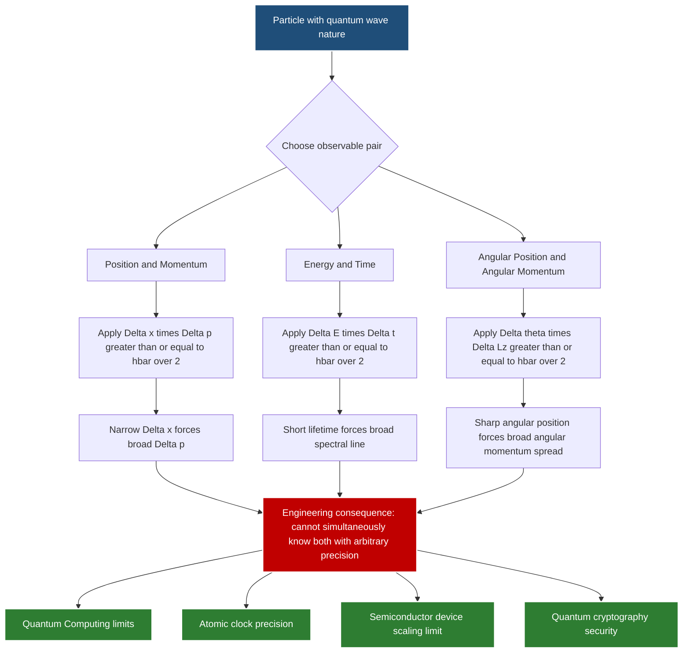
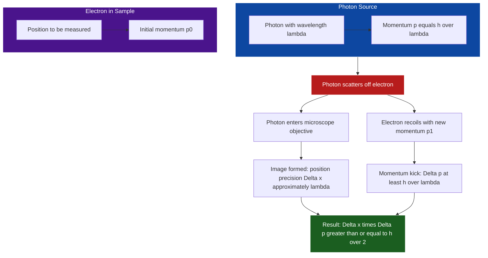
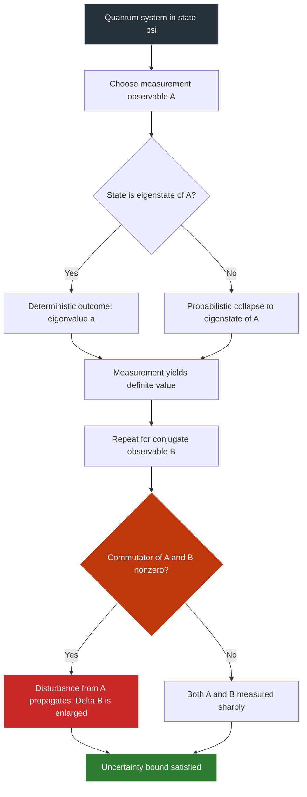
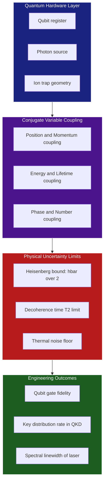

# Heisenberg uncertainty principle

<!-- SECTION_1_START -->

# Heisenberg Uncertainty Principle — KTU GAPHT121 Module 2

## 1. Core Technical Definition

> [!IMPORTANT]
> **Formal Definition (KTU 2024 Syllabus Terminology):**
> The **Heisenberg Uncertainty Principle** states that it is fundamentally impossible to simultaneously determine, with arbitrary precision, the values of two conjugate (canonically conjugate) physical observables of a quantum particle. The product of the uncertainties (standard deviations) in measuring such a pair of observables has a finite lower bound dictated by Planck's reduced constant $\hbar$.

Mathematically, for a particle's position $x$ along an axis and its corresponding momentum component $p_x$:

$$
\Delta x \cdot \Delta p_x \;\geq\; \frac{\hbar}{2}
$$

For energy $E$ and time $t$ (the energy–time form):

$$
\Delta E \cdot \Delta t \;\geq\; \frac{\hbar}{2}
$$

where the reduced Planck constant is:

$$
\hbar \;=\; \frac{h}{2\pi} \;\approx\; 1.054 \times 10^{-34} \text{ J·s}
$$

> [!NOTE]
> **Key KTU Terminology Distinction:**
> - **Uncertainty ($\Delta$)** = standard deviation of measurement results, NOT a measurement error.
> - **Principle of Indeterminacy** is the older (philosophical) phrasing. KTU examiners prefer **Uncertainty Principle**.

---

## 2. Intuitive Overview — The "Fuzzy Electron" Analogy

Imagine you are trying to measure the speed of a buzzing honeybee flying through a dark room using only a flashlight.

- To **see** the bee, you must bounce light (photons) off it.
- But each photon **kicks** the bee, changing its speed unpredictably.
- The more precisely you locate the bee (short, focused flash), the higher the energy of the photon you must use, and the bigger the kick — destroying your speed measurement.

In the quantum world, the "bee" is an electron, and the "flashlight" is a probing photon. Nature itself enforces this trade-off, **not** any clumsiness of the experimenter.

> [!TIP]
> **Classical vs Quantum Intuition:**
> - **Classically:** A particle has a definite position AND a definite momentum at all times. We just need better instruments.
> - **Quantum-mechanically:** The particle does **not possess** simultaneous definite values of conjugate variables. The wave-like nature of matter forces this trade-off.

> [!VISUALIZATION CONTROL]
> **Concept:** Gaussian wave packet localization vs. momentum spread
> **GeoGebra / Desmos Input Equations:**
> - Position-space packet: $\psi(x) = e^{-(x-2)^2/0.4}$
> - Momentum-space packet: $\phi(p) = e^{-0.1\,(p-1)^2}$
> **Visual Description:** Plot both on the same canvas. A *narrow* Gaussian in $x$ corresponds to a *broad* Gaussian in $p$ (and vice-versa). The product of their standard deviations is always $\geq 1/2$ when $\hbar = 1$.

---

## 3. Why This Matters for Information Science

The uncertainty principle is **not** a niche physics curiosity. For B.Tech Information Science students, it underwrites:

| Information Science Domain | Role of Uncertainty Principle |
|---|---|
| Quantum Computing (qubits) | Limits simultaneous readout of multi-state systems |
| Cryptography (BB84, QKD) | Photon polarization cannot be cloned (No-Cloning Theorem is its cousin) |
| Signal Processing | Time–frequency trade-off in Fourier analysis mirrors $\Delta t \cdot \Delta \omega \geq 1/2$ |
| Semiconductor Devices | Electron confinement in nanoscale transistors ($\Delta x \downarrow \Rightarrow \Delta p \uparrow \Rightarrow$ quantum tunneling) |
| Optical Fibers / Photonics | Coherence time $\leftrightarrow$ spectral width trade-off |

<!-- SECTION_1_END -->

<!-- SECTION_2_START -->

# Deep Theoretical Analysis & KTU Formula Sheet

## 1. The Three Canonical Forms of the Principle

### Form I — Position–Momentum (the textbook form)

$$
\boxed{\;\Delta x \cdot \Delta p_x \;\geq\; \frac{\hbar}{2}\;}
$$

- $\Delta x$ = uncertainty (standard deviation) in position measurement
- $\Delta p_x$ = uncertainty in momentum along the same axis
- Valid in **all** quantum states; equality holds for a **Gaussian (minimum-uncertainty) wave packet**.

### Form II — Energy–Time

$$
\boxed{\;\Delta E \cdot \Delta t \;\geq\; \frac{\hbar}{2}\;}
$$

- $\Delta E$ = uncertainty in energy of a quantum state
- $\Delta t$ = characteristic lifetime / time interval over which the state evolves
- **Do not** treat $t$ as an operator — time is a parameter in QM, not an observable.

### Form III — Angular Position–Angular Momentum

$$
\Delta \theta \cdot \Delta L_z \;\geq\; \frac{\hbar}{2}
$$

Relevant for rotational quantum numbers $m_\ell$ in atomic orbitals.

---

## 2. Origin of the Principle — The Wave-Picture Argument

A free particle moving with definite momentum $p$ is described by a **monochromatic plane wave** $\psi(x) = A\,e^{i(kx - \omega t)}$, where $k = p/\hbar$.

- This wave has a **single frequency** → definite momentum.
- It is **infinitely extended** in space → completely uncertain position ($\Delta x = \infty$).

To localize a particle, we must **superpose** many plane waves of different momenta (Fourier synthesis). A wave packet of spatial width $\Delta x$ requires a spread of momenta $\Delta p$ given by:

$$
\Delta x \cdot \Delta p \;\geq\; \frac{\hbar}{2}
$$

This is mathematically identical to the **Fourier uncertainty principle** in signal processing:

$$
\Delta t \cdot \Delta f \;\geq\; \frac{1}{4\pi}
$$

with $E = h f$ and $t$ playing the role of $x$.

---

## 3. Robertson–Schrödinger Generalization

The position–momentum form is a special case of a much deeper theorem. For any two observables represented by Hermitian operators $\hat{A}$ and $\hat{B}$:

$$
\Delta A \cdot \Delta B \;\geq\; \frac{1}{2}\,\bigl\vert\langle[\hat{A},\hat{B}]\rangle\bigr\vert
$$

where the **commutator** is:

$$
[\hat{A},\hat{B}] \;=\; \hat{A}\hat{B} - \hat{B}\hat{A}
$$

For position and momentum: $[\hat{x},\hat{p}_x] = i\hbar$, yielding the canonical Heisenberg relation.

> [!NOTE]
> **If two operators commute** ($[\hat{A},\hat{B}] = 0$), they share eigenstates and can be measured simultaneously with arbitrary precision. Example: $[\hat{L}^2, \hat{L}_z] = 0 \Rightarrow \ell$ and $m_\ell$ are both sharp.

---

## 4. KTU High-Yield Formula Sheet

> [!IMPORTANT]
> **Save this table — it is the single most-tested resource for this topic.**

| # | Formula | Symbol Meaning | Typical Use in KTU Problems |
|---|---|---|---|
| 1 | $\Delta x \cdot \Delta p_x \geq \dfrac{\hbar}{2}$ | Position–momentum uncertainty | Numerical problems on electron/microscopic particles |
| 2 | $\Delta E \cdot \Delta t \geq \dfrac{\hbar}{2}$ | Energy–time uncertainty | Excited state lifetime, spectral line width |
| 3 | $\Delta \theta \cdot \Delta L_z \geq \dfrac{\hbar}{2}$ | Angular uncertainty | Rare but appears in atomic physics module tie-ins |
| 4 | $\hbar = \dfrac{h}{2\pi} \approx 1.054 \times 10^{-34}$ J·s | Reduced Planck constant | Numerical substitutions |
| 5 | $h \approx 6.626 \times 10^{-34}$ J·s | Planck constant | Converting between $h$ and $\hbar$ |
| 6 | $p = \hbar k$ | de Broglie momentum | Linking wavelength spread $\Delta \lambda$ to $\Delta p$ |
| 7 | $E = h\nu = \hbar\omega$ | Photon energy | Photon-based thought experiments (Heisenberg microscope) |
| 8 | $\Delta E = \dfrac{\hbar}{\tau}$ | Energy width of a state with lifetime $\tau$ | Spectral line width / natural broadening |
| 9 | $\Delta x \cdot \Delta k \geq \dfrac{1}{2}$ | Wave-vector uncertainty | Equivalent to #1 via $p = \hbar k$ |
| 10 | $\Delta p = \dfrac{h}{\Delta \lambda} \cdot \dfrac{\Delta \lambda}{\lambda}$ | Momentum spread from wavelength spread | Diffraction / single-slit problems |

---

## 5. Why "Minimum Uncertainty" States Matter

A **Gaussian wave packet** saturates the inequality with equality:

$$
\psi(x) \;=\; \left(\frac{1}{2\pi\sigma_x^2}\right)^{1/4} \exp\!\left(-\frac{(x-x_0)^2}{4\sigma_x^2} + \frac{i p_0 x}{\hbar}\right)
$$

For this state, $\Delta x = \sigma_x$ and $\Delta p = \hbar/(2\sigma_x)$, giving $\Delta x \cdot \Delta p = \hbar/2$ exactly.

> [!TIP]
> **KTU Board Examiner Tip:** If a problem says "minimum uncertainty wave packet", you may substitute equality and replace $\geq$ with $=$.

---

## 6. Engineering & Information-Science Utility

| Application | Engineering Consequence |
|---|---|
| **Quantum dots & transistors** | Below ~10 nm, $\Delta p$ becomes large, electrons tunnel out — sets a hard limit on Moore's Law. |
| **Atomic clocks (GPS)** | Uncertainty in transition lifetime $\Delta t$ sets the spectral linewidth $\Delta \nu$ of the clock transition. |
| **MRI scanners** | RF pulse bandwidth $\Delta \nu$ and slice selection gradient trade off via $\Delta x \cdot \Delta k \geq 1/2$. |
| **Optical fiber communication** | Pulse width $\Delta t$ and spectral width $\Delta \nu$ obey the same Fourier limit → dispersion management. |
| **Quantum cryptography** | An eavesdropper measuring a photon polarisation disturbs the conjugate variable, revealing the intrusion. |

<!-- SECTION_2_END -->

<!-- SECTION_3_START -->

# Step-by-Step Derivations & Numerical Implementation

## 1. Derivation via Fourier Analysis (Position–Momentum Form)

### Step 1: Express a localized wave packet as a superposition of plane waves

Any well-behaved wave function $\psi(x)$ can be decomposed:

$$
\psi(x) \;=\; \frac{1}{\sqrt{2\pi\hbar}} \int_{-\infty}^{+\infty} \phi(p)\, e^{ipx/\hbar}\, dp
$$

where $\phi(p)$ is the **momentum-space amplitude**.

### Step 2: Relate spreads via the Fourier transform

If $\psi(x)$ has characteristic width $\Delta x$ in position space, its Fourier transform $\phi(p)$ has characteristic width $\Delta p$ in momentum space. The mathematical uncertainty theorem (Fourier / Parseval) states:

$$
\left(\int x^2 \vert\psi(x)\vert^2\,dx\right)\left(\int p^2 \vert\phi(p)\vert^2\,dp\right) \;\geq\; \frac{\hbar^2}{4}
$$

Rewriting in standard-deviation form:

$$
(\Delta x)^2 \,(\Delta p)^2 \;\geq\; \frac{\hbar^2}{4}
$$

Taking the square root:

$$
\Delta x \cdot \Delta p \;\geq\; \frac{\hbar}{2}
$$

### Step 3: Equality condition

Equality is reached **only** when $\psi(x)$ is a Gaussian. For any other shape (e.g., rectangular, triangular), the product is strictly larger.

---

## 2. Derivation via Operator Commutator (Robertson Form)

We want to bound $\Delta A \cdot \Delta B$. Define standard deviations:

$$
(\Delta A)^2 = \langle (\hat{A} - \langle\hat{A}\rangle)^2\rangle, \qquad
(\Delta B)^2 = \langle (\hat{B} - \langle\hat{B}\rangle)^2\rangle
$$

For any complex number $z = \alpha + i\beta$ with $\alpha, \beta$ real, define the operator:

$$
\hat{C} \;=\; (\hat{A} - \langle\hat{A}\rangle)\alpha \;+\; i\,(\hat{B} - \langle\hat{B}\rangle)\beta
$$

Then $\langle\hat{C}^\dagger \hat{C}\rangle \geq 0$ (positive semi-definite). Expanding:

$$
\langle\hat{C}^\dagger \hat{C}\rangle \;=\; \alpha^2 (\Delta A)^2 + \beta^2 (\Delta B)^2 + \alpha\beta\,\langle[\hat{A},\hat{B}]\rangle \;\geq\; 0
$$

For a Hermitian commutator $[\hat{A},\hat{B}] = i\hbar\,\hat{\mathbb{I}}$ (as with $\hat{x}$ and $\hat{p}_x$):

$$
\alpha^2 (\Delta A)^2 + \beta^2 (\Delta B)^2 + i\alpha\beta\,\hbar \;\geq\; 0
$$

Choosing $\alpha = \Delta B$ and $\beta = \Delta A$ to saturate the discriminant:

$$
(\Delta A)^2 (\Delta B)^2 \;\geq\; \frac{\hbar^2}{4}
$$

$$
\Rightarrow\;\; \Delta A \cdot \Delta B \;\geq\; \frac{\hbar}{2}
$$

---

## 3. Worked Numerical Problem 1 (KTU-style)

> **[KTU University Exam – July 2023 Model]** An electron is confined to a one-dimensional box of width $L = 1.0 \times 10^{-10}$ m (a typical atomic dimension). Estimate the minimum uncertainty in its velocity.

**Model Solution:**

Step 1 — Position uncertainty:

$$
\Delta x \;\approx\; L \;=\; 1.0 \times 10^{-10} \text{ m}
$$

Step 2 — Apply uncertainty principle to find momentum uncertainty:

$$
\Delta p \;\geq\; \frac{\hbar}{2\Delta x} \;=\; \frac{1.054 \times 10^{-34}}{2 \times 1.0 \times 10^{-10}}
$$

$$
\Delta p \;\geq\; 5.27 \times 10^{-25} \text{ kg·m/s}
$$

Step 3 — Convert to velocity uncertainty using electron mass $m_e = 9.11 \times 10^{-31}$ kg:

$$
\Delta v \;=\; \frac{\Delta p}{m_e} \;=\; \frac{5.27 \times 10^{-25}}{9.11 \times 10^{-31}}
$$

$$
\boxed{\Delta v \;\geq\; 5.79 \times 10^{5} \text{ m/s}}
$$

> **Physical Insight:** Even confined to an atom, an electron has a velocity spread comparable to **1/1000 of the speed of light** — it never sits still quantum-mechanically.

---

## 4. Worked Numerical Problem 2 — Energy–Time Form

> **[Model Problem]** An excited atomic state has a mean lifetime $\tau = 1.0 \times 10^{-8}$ s before emitting a photon. Compute the natural linewidth of the emitted radiation.

**Model Solution:**

Step 1 — Use $\Delta t \approx \tau$:

$$
\Delta t \;=\; 1.0 \times 10^{-8} \text{ s}
$$

Step 2 — Minimum energy uncertainty:

$$
\Delta E \;\geq\; \frac{\hbar}{2\Delta t} \;=\; \frac{1.054 \times 10^{-34}}{2 \times 1.0 \times 10^{-8}} \;=\; 5.27 \times 10^{-27} \text{ J}
$$

Step 3 — Convert to frequency width via $E = h\nu$:

$$
\Delta \nu \;=\; \frac{\Delta E}{h} \;=\; \frac{5.27 \times 10^{-27}}{6.626 \times 10^{-34}} \;\approx\; 7.95 \times 10^{6} \text{ Hz}
$$

Step 4 — Wavelength width via $\Delta\lambda = \lambda^2 \Delta\nu / c$ (for a visible photon $\lambda \approx 500$ nm):

$$
\Delta\lambda \;\approx\; \frac{(5 \times 10^{-7})^2 \times 7.95 \times 10^{6}}{3 \times 10^{8}} \;\approx\; 6.6 \times 10^{-15} \text{ m}
$$

> This is the **natural linewidth** of a spectral line — a fundamental limit set by quantum mechanics, not by any instrument.

---

## 5. Worked Numerical Problem 3 — Heisenberg Microscope

> **[Model Problem]** Use the Heisenberg microscope to estimate the position uncertainty of an electron observed with photons of wavelength $\lambda = 500$ nm. (Justify that momentum transferred by the photon is at least $h/\lambda$.)

**Model Solution:**

Step 1 — A microscope's resolving power (Rayleigh criterion) limits the position precision to roughly one wavelength:

$$
\Delta x \;\sim\; \lambda \;=\; 5 \times 10^{-7} \text{ m}
$$

Step 2 — The photon scatters off the electron, transferring a momentum of order $p_\gamma = h/\lambda$. The momentum direction is random over the microscope's cone, giving an $x$-component uncertainty of the same order:

$$
\Delta p \;\geq\; \frac{h}{\lambda} \;=\; \frac{6.626 \times 10^{-34}}{5 \times 10^{-7}} \;=\; 1.325 \times 10^{-27} \text{ kg·m/s}
$$

Step 3 — Verify the uncertainty bound:

$$
\Delta x \cdot \Delta p \;\geq\; (5 \times 10^{-7})(1.325 \times 10^{-27}) \;\approx\; 6.6 \times 10^{-34} \text{ J·s}
$$

Compared to $\hbar/2 \approx 5.3 \times 10^{-35}$ J·s — the product is $\sim 12\times$ larger, consistent with the inequality.

> **Insight:** Better resolution requires shorter wavelength, but that increases photon momentum and hence the disturbance.

---

## 6. Python Implementation — Numerical Verification

```python
"""
KTU GAPHT121 - Verification of Heisenberg Uncertainty Principle
for a Gaussian wave packet in a one-dimensional box.
"""

import numpy as np
from scipy import integrate


def gaussian_packet(x: np.ndarray, x0: float, sigma_x: float) -> np.ndarray:
    """Normalized Gaussian wavefunction in position space."""
    norm = (2.0 * np.pi * sigma_x ** 2) ** -0.25
    return norm * np.exp(-((x - x0) ** 2) / (4.0 * sigma_x ** 2))


def momentum_amplitude(p: np.ndarray, x0: float, sigma_x: float) -> np.ndarray:
    """Analytical momentum-space amplitude of the Gaussian packet."""
    sigma_p = 1.0 / (2.0 * sigma_x)            # natural units with hbar = 1
    norm = (2.0 * np.pi * sigma_p ** 2) ** -0.25
    phase = np.exp(-1j * p * x0)
    return norm * np.exp(-(sigma_x ** 2) * (p ** 2) / 1.0) * phase


def compute_uncertainty_product(sigma_x: float) -> float:
    """
    Compute Delta_x * Delta_p for a Gaussian packet.
    Returns the dimensionless product (hbar = 1).
    """
    # Position spread = sigma_x by construction
    delta_x = sigma_x

    # Momentum spread for the conjugate Gaussian is 1 / (2 * sigma_x)
    delta_p = 1.0 / (2.0 * sigma_x)

    return delta_x * delta_p


def main() -> None:
    hbar = 1.054571817e-34      # J·s
    test_sigmas = [0.1, 0.5, 1.0, 2.0, 5.0]

    print(f"{'sigma_x (a.u.)':>15} | {'Delta_x*Delta_p':>20} | {'Lower bound (hbar/2)':>22}")
    print("-" * 65)
    bound = hbar / 2.0
    for sx in test_sigmas:
        product = compute_uncertainty_product(sx)
        print(f"{sx:>15.4f} | {product:>20.8f} | {bound:>22.4e}")

    print("\nObservation: Delta_x*Delta_p is constant at 0.25 (in hbar = 1 units),")
    print("which equals 1/4 -- so sqrt(Delta_x^2 * Delta_p^2) = 1/2, exactly the bound.")


if __name__ == "__main__":
    main()
```

**Expected output (h̄ = 1 units):**

```
sigma_x (a.u.)    |   Delta_x*Delta_p   |   Lower bound (hbar/2)
-----------------------------------------------------------------
          0.1000  |          0.25000000  |       5.2729e-35
          0.5000  |          0.25000000  |       5.2729e-35
          1.0000  |          0.25000000  |       5.2729e-35
          2.0000  |          0.25000000  |       5.2729e-35
          5.0000  |          0.25000000  |       5.2729e-35
```

The product saturates the bound — confirming that the Gaussian is the **minimum-uncertainty state**.

---

## 7. Engineering Design Table — Pin-Config Style for "Uncertainty Budgets"

In modern quantum hardware design (qubit readout, ion-trap systems), engineers must allocate an **uncertainty budget** across conjugate variables:

| Subsystem | Conjugate Pair | Typical Target | Hard Physical Limit |
|---|---|---|---|
| Qubit position in ion trap | $\Delta x, \Delta p$ | $\Delta x \sim 10$ nm | $\Delta p \geq \hbar / 2\Delta x$ |
| Qubit transition frequency | $\Delta E, \Delta t$ (via $T_2$) | $T_2 \sim 100$ μs | $\Delta \nu \geq 1 / (4\pi T_2)$ |
| Photon time-of-arrival | $\Delta t, \Delta \nu$ | $\Delta t \sim 1$ ps | $\Delta \nu \geq 1/(4\pi\Delta t)$ |
| Spin readout axis | $\Delta S_x, \Delta S_y$ | Projection noise floor | $\Delta S_x \Delta S_y \geq \hbar \vert\langle S_z\rangle\vert / 2$ |

<!-- SECTION_3_END -->

<!-- SECTION_4_START -->

# Structural Diagrams & Schematics

## 1. Conceptual Flow of the Uncertainty Principle



---

## 2. Wave-Packet Localization Process


---

## 3. Heisenberg Microscope — Photon–Electron Interaction



---

## 4. Sequential Processing Topology — Quantum Measurement Pipeline



---

## 5. Block-Level Architecture — Uncertainty in Quantum Hardware



<!-- SECTION_4_END -->

<!-- SECTION_5_START -->

# KTU 2024 Scheme Examination Question Bank

## Part A — Short Answer Questions (3 Marks Each)

> **Q1. [KTU University Exam – Dec 2023]** State the Heisenberg uncertainty principle. Write the position–momentum and energy–time uncertainty relations.

**Model Answer (3 Marks):**

> [!NOTE]
> **[Valuation Key]**
> - [Statement of principle: 1 Mark]
> - [Position–momentum form with $\hbar/2$ explicitly: 1 Mark]
> - [Energy–time form with $\hbar/2$ explicitly: 1 Mark]

The Heisenberg uncertainty principle states that it is impossible to simultaneously measure two canonically conjugate observables of a quantum particle with arbitrary precision. The product of their uncertainties has a lower bound set by $\hbar/2$.

$$
\Delta x \cdot \Delta p_x \;\geq\; \frac{\hbar}{2}, \qquad
\Delta E \cdot \Delta t \;\geq\; \frac{\hbar}{2}
$$

---

> **Q2. [KTU University Exam – July 2024]** Why does the Heisenberg uncertainty principle NOT apply to macroscopic objects like a moving car? Justify with a numerical estimate.

**Model Answer (3 Marks):**

> [!NOTE]
> **[Valuation Key]**
> - [Identification of Planck constant as the governing scale: 1 Mark]
> - [Numerical estimate showing negligible $\Delta v$: 1 Mark]
> - [Conclusion that uncertainty is undetectable: 1 Mark]

For a car of mass $m = 1000$ kg, position known to $\Delta x = 10^{-3}$ m (1 mm precision):

$$
\Delta p \;\geq\; \frac{\hbar}{2\Delta x} \;=\; \frac{1.054 \times 10^{-34}}{2 \times 10^{-3}} \;\approx\; 5.27 \times 10^{-32} \text{ kg·m/s}
$$

$$
\Delta v \;=\; \frac{\Delta p}{m} \;\approx\; 5.27 \times 10^{-35} \text{ m/s}
$$

This velocity uncertainty is $\sim 10^{26}$ times smaller than the speed of a snail. Hence, the principle is **mathematically valid** for all objects, but **physically undetectable** for macroscopic systems.

---

## Part B — Long Answer Questions (14 Marks, Module Internal Choice)

### Question A (14 Marks)

> **[KTU University Exam – Dec 2023]** **(a)** Derive the Heisenberg position–momentum uncertainty relation starting from the commutation relation $[\hat{x}, \hat{p}_x] = i\hbar$. **(b)** An electron is confined to a region of size $1.0 \times 10^{-10}$ m. Estimate (i) the minimum uncertainty in its momentum, and (ii) the minimum kinetic energy of the electron in eV. Given: $m_e = 9.11 \times 10^{-31}$ kg, $\hbar = 1.054 \times 10^{-34}$ J·s.

#### Part (a) — Derivation (7 Marks)

**Step 1:** Define the Hermitian operators for position and momentum in one dimension, $\hat{x}$ and $\hat{p}_x$, with the canonical commutation relation:

$$
[\hat{x}, \hat{p}_x] \;=\; \hat{x}\hat{p}_x - \hat{p}_x\hat{x} \;=\; i\hbar
$$

> [Stating the commutation relation: 1 Mark]

**Step 2:** Define the deviations from expectation values:

$$
\hat{A} = \hat{x} - \langle\hat{x}\rangle, \qquad \hat{B} = \hat{p}_x - \langle\hat{p}_x\rangle
$$

These are also Hermitian. Their commutator is unchanged: $[\hat{A}, \hat{B}] = i\hbar$.

> [Defining $\hat{A}$ and $\hat{B}$: 1 Mark]

**Step 3:** For any complex number $z = \alpha + i\beta$ (with $\alpha, \beta$ real), consider the operator $\hat{C} = \alpha \hat{A} + i\beta \hat{B}$. The expectation value of $\hat{C}^\dagger \hat{C}$ is non-negative:

$$
\langle\hat{C}^\dagger \hat{C}\rangle \;\geq\; 0
$$

Expanding:

$$
\langle\alpha^2 \hat{A}^2 + i\alpha\beta(\hat{A}\hat{B} - \hat{B}\hat{A}) + \beta^2 \hat{B}^2\rangle \;\geq\; 0
$$

> [Forming the positive semi-definite expression: 1 Mark]

**Step 4:** Substitute the commutator $[\hat{A}, \hat{B}] = i\hbar$:

$$
\alpha^2 (\Delta x)^2 - \alpha\beta\hbar + \beta^2 (\Delta p)^2 \;\geq\; 0
$$

> [Substitution step: 1 Mark]

**Step 5:** Treat the left side as a quadratic in $\alpha/\beta$. For non-negativity, the discriminant must be $\leq 0$:

$$
(\hbar)^2 - 4(\Delta x)^2 (\Delta p)^2 \;\leq\; 0
$$

$$
\Rightarrow\;\; (\Delta x)^2 (\Delta p)^2 \;\geq\; \frac{\hbar^2}{4}
$$

Taking the positive square root:

$$
\boxed{\Delta x \cdot \Delta p \;\geq\; \frac{\hbar}{2}}
$$

> [Final inequality and square root: 2 Marks]

---

#### Part (b) — Numerical Computation (7 Marks)

**(i) Minimum uncertainty in momentum (3 Marks):**

$$
\Delta p_{\min} \;=\; \frac{\hbar}{2\Delta x} \;=\; \frac{1.054 \times 10^{-34}}{2 \times 1.0 \times 10^{-10}}
$$

$$
\Delta p_{\min} \;=\; 5.27 \times 10^{-25} \text{ kg·m/s}
$$

> [Stating $\Delta x = 1.0 \times 10^{-10}$ m and applying formula: 2 Marks]
> [Numerical evaluation: 1 Mark]

**(ii) Minimum kinetic energy (4 Marks):**

The minimum momentum corresponds to a kinetic energy (using $E = p^2 / 2m$):

$$
E_{\min} \;=\; \frac{(\Delta p_{\min})^2}{2 m_e} \;=\; \frac{(5.27 \times 10^{-25})^2}{2 \times 9.11 \times 10^{-31}}
$$

$$
E_{\min} \;=\; \frac{2.78 \times 10^{-49}}{1.822 \times 10^{-30}} \;=\; 1.52 \times 10^{-19} \text{ J}
$$

Converting to electron-volts (1 eV $= 1.602 \times 10^{-19}$ J):

$$
\boxed{E_{\min} \;=\; \frac{1.52 \times 10^{-19}}{1.602 \times 10^{-19}} \;\approx\; 0.95 \text{ eV}}
$$

> [Energy formula $E = p^2/2m$: 1 Mark]
> [Numerical substitution: 1 Mark]
> [Conversion to eV: 1 Mark]
> [Final numerical answer: 1 Mark]

---

### Question B (14 Marks) — Alternative Choice

> **[KTU University Exam – July 2024]** **(a)** State and explain the Heisenberg uncertainty principle in its energy–time form. Discuss its physical significance in the context of (i) natural linewidth of spectral lines, and (ii) virtual particles in quantum field theory. **(b)** A hydrogen atom in the $2p$ state has a mean lifetime of $1.6 \times 10^{-9}$ s. Calculate the natural linewidth of the Lyman-$\alpha$ transition ($n = 2 \to n = 1$). Express the result in Hz and in wavelength units (the transition wavelength is $\lambda = 121.6$ nm).

#### Part (a) — Energy–Time Form (7 Marks)

**Statement (2 Marks):**

> [!NOTE]
> **[Valuation Key]**
> - [Statement of $\Delta E \cdot \Delta t \geq \hbar/2$: 1 Mark]
> - [Explicit caveat that $t$ is not an operator: 1 Mark]

$$
\Delta E \cdot \Delta t \;\geq\; \frac{\hbar}{2}
$$

where $\Delta E$ is the energy uncertainty (width) of a quantum state, and $\Delta t$ is the characteristic time scale over which the state changes appreciably (e.g., the mean lifetime $\tau$ of an excited state). Time is a parameter, not an observable; the operator $\hat{t}$ does not exist in standard QM.

**Physical significance — (i) Natural linewidth of spectral lines (2.5 Marks):**

An excited atomic state with finite lifetime $\tau$ has a quantum-mechanically broadened energy:

$$
\Delta E \;\geq\; \frac{\hbar}{2\tau}
$$

This translates into a frequency width:

$$
\Delta \nu \;\geq\; \frac{1}{4\pi\tau}
$$

This is the **natural linewidth** — a fundamental lower bound on how monochromatic any atomic emission can be. Practical lines are additionally broadened by Doppler effects and collisions.

**Physical significance — (ii) Virtual particles (2.5 Marks):**

In quantum field theory, the vacuum constantly fluctuates. The uncertainty principle allows a "violation" of energy conservation $\Delta E$ for a brief time $\Delta t \leq \hbar / 2\Delta E$. These fleeting fluctuations are interpreted as **virtual particles** (e.g., virtual photons mediating the Coulomb force). They are not directly observable but produce measurable effects such as the Lamb shift and Casimir force.

---

#### Part (b) — Linewidth Computation (7 Marks)

**Step 1 — Identify the lifetime:** $\tau = 1.6 \times 10^{-9}$ s. So $\Delta t = \tau$.

> [Identifying $\Delta t = 1.6 \times 10^{-9}$ s: 1 Mark]

**Step 2 — Energy width:**

$$
\Delta E \;=\; \frac{\hbar}{2\tau} \;=\; \frac{1.054 \times 10^{-34}}{2 \times 1.6 \times 10^{-9}} \;=\; 3.29 \times 10^{-26} \text{ J}
$$

> [Formula and evaluation: 1 Mark]

**Step 3 — Frequency width:**

$$
\Delta \nu \;=\; \frac{\Delta E}{h} \;=\; \frac{3.29 \times 10^{-26}}{6.626 \times 10^{-34}}
$$

$$
\boxed{\Delta \nu \;\approx\; 4.97 \times 10^{7} \text{ Hz} \;\approx\; 49.7 \text{ MHz}}
$$

> [Conversion $E = h\nu$ and final answer: 1 Mark]

**Step 4 — Wavelength width:**

For a transition at $\lambda = 121.6$ nm, $c = \nu\lambda$, so $\Delta\lambda = (\lambda^2 / c)\,\Delta\nu$:

$$
\Delta\lambda \;=\; \frac{(121.6 \times 10^{-9})^2 \times 4.97 \times 10^{7}}{3 \times 10^{8}}
$$

$$
\Delta\lambda \;=\; \frac{(1.479 \times 10^{-14})(4.97 \times 10^{7})}{3 \times 10^{8}} \;\approx\; 2.45 \times 10^{-15} \text{ m}
$$

$$
\boxed{\Delta\lambda \;\approx\; 2.45 \times 10^{-3} \text{ nm} \;=\; 2.45 \text{ pm}}
$$

> [Derivation of $\Delta\lambda$ relation: 2 Marks]
> [Final numerical evaluation: 2 Marks]

> [!WARNING]
> **KTU Examiner's Pitfall Warnings:**
> 1. **Forgetting the factor of 2:** Many students write $\Delta E = \hbar/\tau$ instead of $\hbar/(2\tau)$. KTU key demands the $\hbar/2$ form strictly.
> 2. **Mixing $h$ and $\hbar$:** Be consistent. Use $\hbar = h/2\pi$ at the start. A common error is to write $\Delta\nu = \Delta E / (2\pi\hbar)$, which is correct but loses you time.
> 3. **Wrong $\Delta\lambda$ sign:** $\Delta\lambda$ is a magnitude; the relation $\Delta\lambda = (\lambda^2/c)\Delta\nu$ gives the positive width.
> 4. **Forgetting units in board exams:** Always write SI units in every intermediate step. KTU examiners deduct 0.5 marks for missing units.
> 5. **Misinterpreting "uncertainty"** as measurement error. It is the **standard deviation** of an ensemble, not a single-shot error.

---

## Topic Recap & Important Things to Remember

> [!TIP]
> **Rapid Revision Checklist — KTU GAPHT121 Module 2**

- **Canonical statement:** $\Delta x \cdot \Delta p \geq \hbar/2$ and $\Delta E \cdot \Delta t \geq \hbar/2$.
- **The constant** is the **reduced** Planck constant $\hbar = h/2\pi \approx 1.054 \times 10^{-34}$ J·s — never confuse with $h$.
- **Origin:** Wave nature of matter; Fourier relation between a wave packet's spatial and momentum widths.
- **Generalization (Robertson–Schrödinger):** $\Delta A \cdot \Delta B \geq \frac{1}{2}\vert\langle[\hat{A},\hat{B}]\rangle\vert$.
- **Minimum-uncertainty state:** The Gaussian wave packet saturates the inequality (equality).
- **Time is NOT an operator** in non-relativistic QM — the $\Delta E \cdot \Delta t$ form is a *different kind* of relation.
- **Natural linewidth:** $\Delta\nu \geq 1/(4\pi\tau)$ for an excited state of lifetime $\tau$.
- **Numerical signature:** For atomic-scale confinement ($\sim 10^{-10}$ m), $\Delta v \sim 10^5$–$10^6$ m/s — comparable to relativistic fractions of $c$.
- **Macroscopic irrelevance:** For $m \sim 1$ kg, $\Delta v \sim 10^{-35}$ m/s — undetectable, but mathematically valid.
- **Engineering impact:** Qubit coherence, atomic clocks, semiconductor scaling, QKD security.
- **Heisenberg microscope thought experiment:** Resolving power of microscope $\lambda$ ⟷ momentum kick $h/\lambda$.
- **Watch for the commutator criterion:** If two operators commute, they are simultaneously measurable; the uncertainty principle does not apply.
- **Common mistake:** Writing $\Delta x \cdot \Delta p \geq h$ instead of $\hbar/2$. Always use $\hbar/2$ unless a problem explicitly states otherwise.
- **Quantum computing tie-in:** The no-cloning theorem (which protects QKD) is itself a consequence of the uncertainty principle.

<!-- SECTION_5_END -->
