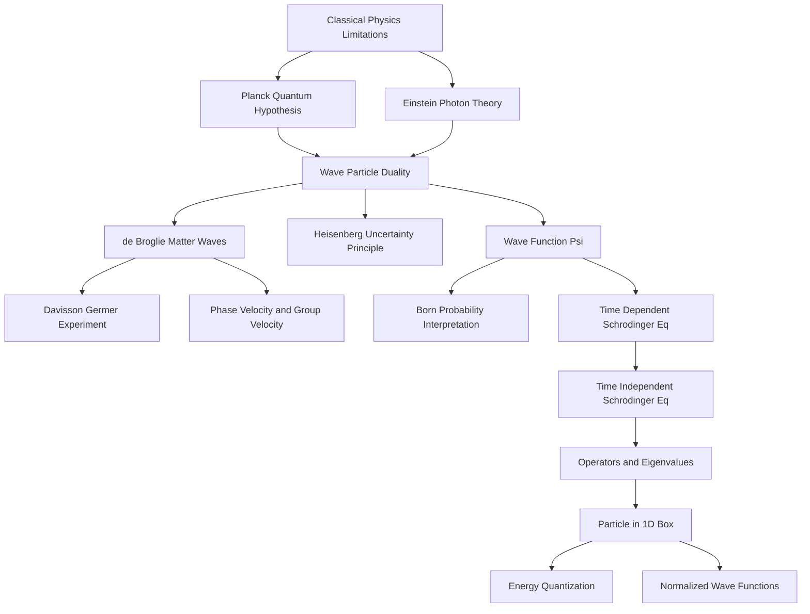
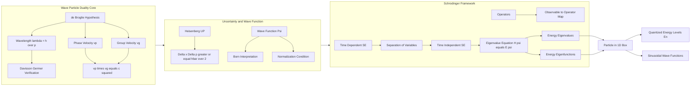
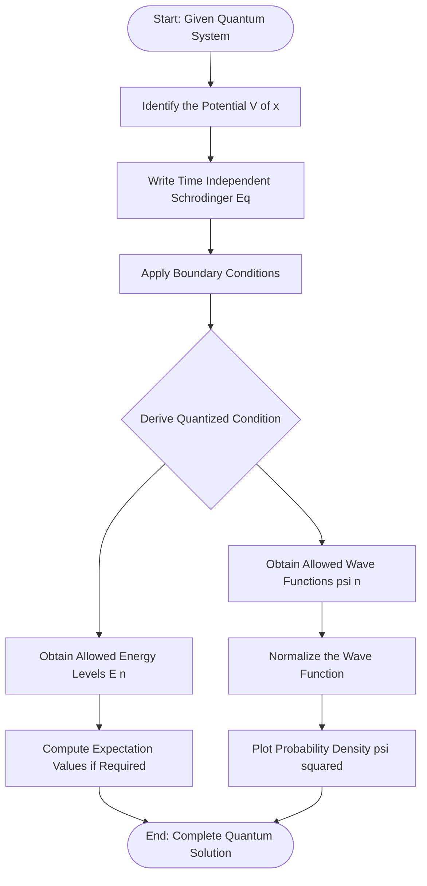
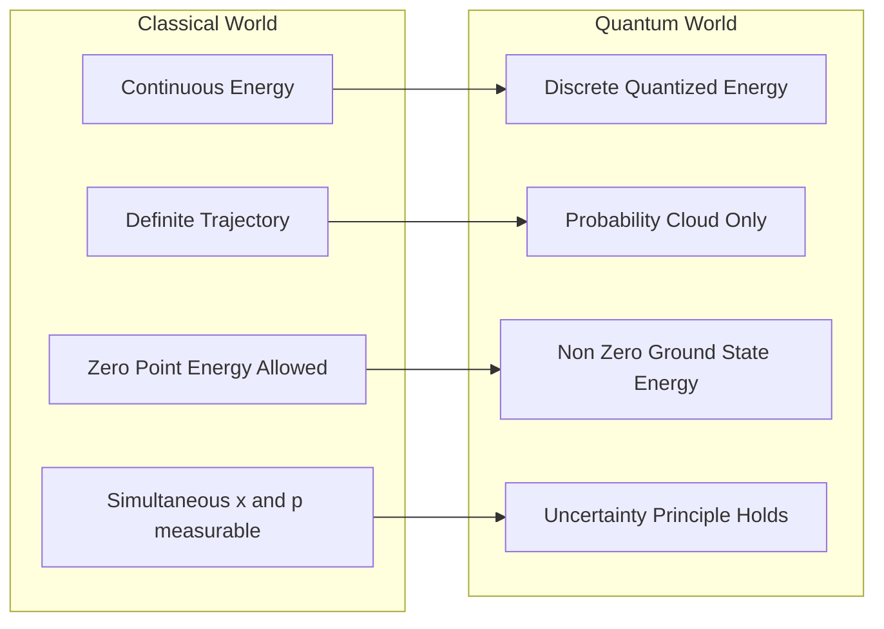
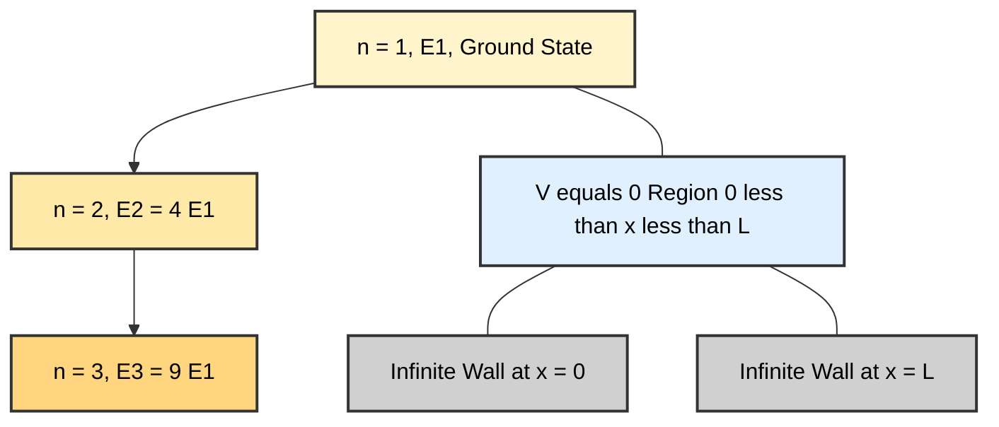

# Introduction

<!-- SECTION_1_START -->
# Introduction to Quantum Mechanics

## 1.1 Formal Definition (KTU 2024 Syllabus Terminology)

> [!IMPORTANT]
> **Quantum Mechanics** is the branch of modern physics that describes the behavior of matter and energy at the atomic and subatomic scale, where classical Newtonian mechanics and Maxwell's electromagnetism fail. It is built upon the principle that physical observables (such as energy, momentum, and position) can take only **discrete (quantized) values**, and that microscopic particles exhibit a fundamental **wave–particle duality**.

In the context of **GAPHT121 – Physics for Information Science**, quantum mechanics provides the theoretical foundation for:
- The operating principles of **semiconductor devices** (lasers, transistors, photodetectors).
- The physical basis of **information storage** (magnetic bits, quantum bits / qubits).
- The working of **optoelectronic and nanoelectronic systems**.

> [!NOTE]
> **Core Syllabus Highlight (Module 2):** Wave–particle duality, de Broglie hypothesis, Phase and group velocity, Heisenberg's uncertainty principle, Wave function and its physical interpretation, Time-dependent and Time-independent Schrödinger wave equations, Operators, Eigenvalues and Eigenfunctions, and the Quantum mechanical treatment of a **particle in a one-dimensional potential box**.

---

## 1.2 Why Classical Physics Fails — The Motivation for Quantum Theory

Classical physics (Newtonian mechanics + Maxwell's electrodynamics) successfully explains the macroscopic world. However, at microscopic scales, it breaks down spectacularly. The most important failures are:

| Phenomenon | Classical Prediction | Experimental Reality |
|---|---|---|
| **Blackbody radiation** | **Ultraviolet catastrophe** (infinite energy at short wavelengths via Rayleigh–Jeans law) | Finite energy; explained by **Planck's quantum hypothesis** ($E = h\nu$) |
| **Photoelectric effect** | Energy of emitted electrons should depend on light intensity | Energy depends on **frequency**; explained by **Einstein's photon theory** |
| **Specific heat of solids** | Dulong–Petit law fails at low temperature | Explained by **Einstein–Debye quantum model** |
| **Atomic stability** | Electrons should spiral into nucleus in $\sim 10^{-8}\,\text{s}$ | Atoms are stable; explained by **Bohr's quantized orbits** |
| **Spectral lines** | Continuous spectrum expected | **Discrete line spectra** observed; explained by **quantized energy levels** |

> [!NOTE]
> **Planck's constant** $h = 6.626 \times 10^{-34}\,\text{J}\cdot\text{s}$ is the fundamental constant that sets the scale at which quantum effects become significant. Whenever the **action** of a system is comparable to $h$, quantum behavior dominates.

---

## 1.3 Conceptual Analogy — Plain English Intuition

> [!TIP]
> **The "Fuzzy Marble" Analogy**
>
> Imagine a tiny grain of sand. In the macroscopic world, you can pin down its exact position and speed at every instant — that is **classical determinism**. Now shrink that grain to the size of an electron.
>
> At this scale, the electron behaves like a **"fuzzy cloud"** — it does not have a single trajectory. Instead, we can only describe a **probability cloud** of where it *might* be. The sharper we try to locate it in space, the more its momentum becomes uncertain (and vice versa). This is the essence of **Heisenberg's uncertainty principle**.
>
> **Another analogy:** A vibrating guitar string is fixed at both ends. It can only vibrate in whole-number "harmonics" (1st, 2nd, 3rd ...). An electron bound inside an atom is similar — its energy and momentum are **quantized**, taking only certain allowed values.

---

## 1.4 Key Postulates of Quantum Mechanics (Foundations)

Quantum mechanics is built on five foundational postulates that define the mathematical structure of the theory:

1. **State Postulate:** The complete state of a quantum system is described by a **wave function** $\Psi(\vec{r}, t)$, which contains all the measurable information.

2. **Born's Statistical Interpretation (Max Born, 1926):**
   The quantity $\vert \Psi(\vec{r}, t) \vert^{2} \, dV$ represents the **probability** of finding the particle inside the infinitesimal volume $dV$ at time $t$.

3. **Operator Postulate:** Every measurable physical quantity (observable) is represented by a **linear Hermitian operator**.

4. **Schrödinger Equation Postulate:** The wave function $\Psi$ evolves in time according to the **time-dependent Schrödinger equation**.

5. **Measurement Postulate:** When a measurement is performed, the outcome is always one of the **eigenvalues** of the corresponding operator, and the wave function **collapses** into the corresponding eigenstate.

---

## 1.5 Physical Constants & Standard Metrics (Bolded for Quick Reference)

- **Planck's constant:** $h = 6.626 \times 10^{-34}\,\text{J}\cdot\text{s}$
- **Reduced Planck's constant (Dirac's constant):** $\hbar = \dfrac{h}{2\pi} = 1.054 \times 10^{-34}\,\text{J}\cdot\text{s}$
- **Speed of light in vacuum:** $c = 3 \times 10^{8}\,\text{m/s}$
- **Electron rest mass:** $m_e = 9.11 \times 10^{-31}\,\text{kg}$
- **Elementary charge:** $e = 1.602 \times 10^{-19}\,\text{C}$
- **Boltzmann constant:** $k_B = 1.381 \times 10^{-23}\,\text{J/K}$

> [!VISUALIZATION CONTROL]
> **Concept:** Plot of $\vert \Psi(x) \vert^{2}$ — Probability Density of a Particle in a 1D Box for $n=1, 2, 3$.
>
> **Desmos / GeoGebra Input Equations (for $L=1$):**
> * `f1(x) = (2) * sin(pi*x)^2` (for $n=1$)
> * `f2(x) = (2) * sin(2*pi*x)^2` (for $n=2$)
> * `f3(x) = (2) * sin(3*pi*x)^2` (for $n=3$)
>
> **Visual Description:** The student should observe that for $n=1$, there is a single broad peak at the center of the box $[0, 1]$. For $n=2$ and $n=3$, **nodes** (zero probability points) appear inside the box. The number of antinodes (peaks) equals $n$, illustrating the **standing-wave nature** of bound quantum states.

---

## 1.6 Historical Roadmap of Quantum Mechanics

> [!NOTE]
> A timeline of the key milestones that shaped modern quantum theory:

| Year | Scientist | Contribution |
|------|-----------|-------------|
| **1900** | Max Planck | Quantum hypothesis to explain blackbody radiation |
| **1905** | Albert Einstein | Photon theory of light (explains photoelectric effect) |
| **1913** | Niels Bohr | Quantized atomic orbits (Bohr model of hydrogen) |
| **1923** | Louis de Broglie | Matter waves (wave–particle duality) |
| **1925** | Werner Heisenberg | Matrix mechanics; uncertainty principle |
| **1926** | Erwin Schrödinger | Wave mechanics; Schrödinger equation |
| **1926** | Max Born | Probabilistic interpretation of the wave function |
| **1927** | Davisson & Germer | Experimental confirmation of de Broglie waves |
| **1928** | Paul Dirac | Relativistic quantum mechanics |

<!-- SECTION_1_END -->

<!-- SECTION_2_START -->
# Deep Theoretical Analysis & KTU High-Yield Formula Sheet

## 2.1 Wave–Particle Duality — The Heart of Quantum Theory

Wave–particle duality states that **every quantum entity** (whether light or matter) exhibits both wave-like and particle-like properties, depending on the type of experiment performed.

### 2.1.1 Particle Nature of Light (Einstein, 1905)

A **photon** of frequency $\nu$ carries a discrete quantum of energy:

$$
E = h\nu
$$

When light strikes a metal surface in the photoelectric effect, electrons are ejected only if:

$$
h\nu \;>\; \phi \quad \text{(work function)}
$$

The maximum kinetic energy of emitted electrons is:

$$
K_{\max} = h\nu - \phi
$$

> [!NOTE]
> **Why this matters for Information Science:** Photodiodes, CCDs, image sensors, and solar cells all rely on the discrete energy of photons to generate electron–hole pairs.

### 2.1.2 Wave Nature of Matter (de Broglie, 1924)

Louis de Broglie postulated that a particle of momentum $p$ has an associated **matter wave** of wavelength:

$$
\lambda = \frac{h}{p} = \frac{h}{mv} \quad \text{(de Broglie wavelength)}
$$

For a charged particle accelerated through potential difference $V$:

$$
\lambda = \frac{h}{\sqrt{2meV}}
$$

> [!IMPORTANT]
> For a non-relativistic electron accelerated through $V = 100\,\text{V}$: $\lambda \approx 0.123\,\text{nm}$, which is comparable to atomic spacings in crystals — this enables **electron diffraction**.

> [!TIP]
> **Engineering Utility:** The de Broglie wavelength is the working principle behind:
> * **Electron microscopes** (resolution $\sim 0.1\,\text{nm}$, far better than optical microscopes).
> * **Scanning Tunneling Microscopes (STM)** for imaging surfaces at the atomic scale.
> * **Neutron diffraction** in materials science.

---

## 2.2 Phase Velocity and Group Velocity

A matter wave is a **wave packet** — a superposition of many sinusoidal waves. It has two distinct velocities:

### 2.2.1 Phase Velocity ($v_p$)

The velocity with which a particular phase (crest or trough) of the wave moves:

$$
v_p = \frac{\omega}{k} = \frac{E}{p} = \frac{c^{2}}{v}
$$

> [!NOTE]
> For a relativistic particle, $v_p$ **exceeds** the speed of light! This is not a violation of relativity, because $v_p$ does **not** carry information or energy.

### 2.2.2 Group Velocity ($v_g$)

The velocity with which the **envelope** (and hence the energy/information) of the wave packet travels:

$$
v_g = \frac{d\omega}{dk} = \frac{dE}{dp}
$$

For a non-relativistic particle with $E = \dfrac{p^{2}}{2m}$:

$$
v_g = \frac{p}{m} = v_{\text{particle}}
$$

> [!IMPORTANT]
> **Key Result:** The group velocity of the de Broglie wave packet equals the **classical particle velocity**. Thus, the wave packet is the quantum analogue of a classical particle.

The relation between the two velocities:

$$
v_p \cdot v_g = c^{2} \quad \text{(for relativistic particles)}
$$

---

## 2.3 Heisenberg's Uncertainty Principle (1927)

> [!IMPORTANT]
> It is **impossible** to simultaneously measure the position and momentum of a particle with arbitrarily high precision. The more accurately we know one, the less accurately we can know the other.

The mathematical form:

$$
\Delta x \cdot \Delta p \;\geq\; \frac{\hbar}{2}
$$

Other forms:

$$
\Delta E \cdot \Delta t \;\geq\; \frac{\hbar}{2}
$$

$$
\Delta \theta \cdot \Delta L \;\geq\; \frac{\hbar}{2}
$$

> [!NOTE]
> **Interpretation:** This is **not** a limitation of measurement instruments. It is a **fundamental property of nature** arising from the wave-like character of matter.

---

## 2.4 The Wave Function ($\Psi$) — A Complete Description

The wave function $\Psi(\vec{r}, t)$ is a complex-valued function that completely describes the quantum state of a particle.

### 2.4.1 Born's Probability Interpretation

$$
P(\vec{r}, t)\,dV = \vert \Psi(\vec{r}, t) \vert^{2} \, dV
$$

where $\vert \Psi \vert^{2} = \Psi^{*} \Psi$ is the **probability density**.

### 2.4.2 Normalization Condition

The total probability of finding the particle somewhere in space must equal 1:

$$
\int_{-\infty}^{+\infty} \int_{-\infty}^{+\infty} \int_{-\infty}^{+\infty} \vert \Psi(\vec{r}, t) \vert^{2} \, dV = 1
$$

### 2.4.3 Conditions for a Physically Acceptable Wave Function

A valid $\Psi$ must be:
1. **Continuous** everywhere.
2. **Single-valued** (one value at each point).
3. **Smooth** (its first derivative must also be continuous wherever $V$ is finite).
4. **Square-integrable** (must be normalizable).
5. **Finite** everywhere (no infinities).

---

## 2.5 The Schrödinger Wave Equation

### 2.5.1 Time-Dependent Schrödinger Equation (TDSE)

$$
i\hbar \frac{\partial \Psi(\vec{r}, t)}{\partial t} = \left[ -\frac{\hbar^{2}}{2m}\nabla^{2} + V(\vec{r}, t) \right] \Psi(\vec{r}, t)
$$

### 2.5.2 Time-Independent Schrödinger Equation (TISE)

For a particle in a stationary state (time-independent potential $V(\vec{r})$), we write:

$$
\Psi(\vec{r}, t) = \psi(\vec{r}) \, e^{-iEt/\hbar}
$$

Substituting into the TDSE gives the TISE:

$$
\left[ -\frac{\hbar^{2}}{2m}\nabla^{2} + V(\vec{r}) \right] \psi(\vec{r}) = E\,\psi(\vec{r})
$$

Or compactly:

$$
\hat{H} \psi = E \psi
$$

where $\hat{H}$ is the **Hamiltonian operator**.

> [!NOTE]
> The TISE is an **eigenvalue equation** in which the **energy** is the eigenvalue and $\psi$ is the eigenfunction.

---

## 2.6 Operators in Quantum Mechanics

> [!IMPORTANT]
> **Operator Postulate:** To every classical observable $A(\vec{r}, \vec{p})$ we assign a quantum operator $\hat{A}$ by the substitution:
> $x \rightarrow \hat{x} = x$ (multiplication), $\quad p_x \rightarrow \hat{p}_x = -i\hbar \dfrac{\partial}{\partial x}$.

### KTU High-Yield Formula Sheet

| Physical Quantity | Classical Form | Quantum Operator $\hat{A}$ |
|---|---|---|
| Position | $x$ | $\hat{x} = x$ |
| Momentum (x) | $p_x$ | $\hat{p}_x = -i\hbar \dfrac{\partial}{\partial x}$ |
| Kinetic Energy | $\dfrac{p^{2}}{2m}$ | $\hat{T} = -\dfrac{\hbar^{2}}{2m}\nabla^{2}$ |
| Potential Energy | $V(\vec{r})$ | $\hat{V} = V(\vec{r})$ |
| Total Energy / Hamiltonian | $\dfrac{p^{2}}{2m} + V$ | $\hat{H} = -\dfrac{\hbar^{2}}{2m}\nabla^{2} + V(\vec{r})$ |
| Angular Momentum (z) | $L_z = xp_y - yp_x$ | $\hat{L}_z = -i\hbar \dfrac{\partial}{\partial \phi}$ |
| Hamiltonian (1D) | — | $\hat{H} = -\dfrac{\hbar^{2}}{2m}\dfrac{d^{2}}{dx^{2}} + V(x)$ |

> [!NOTE]
> **Hermitian Operator Property:** Observables correspond to **Hermitian operators** $\left(\hat{A}^{\dagger} = \hat{A}\right)$, ensuring that all measured eigenvalues are **real** numbers.

---

## 2.7 Eigenvalues and Eigenfunctions

For an operator $\hat{A}$ and a function $f$:

$$
\hat{A} f = a f
$$

- $f$ is an **eigenfunction** of $\hat{A}$.
- $a$ is the corresponding **eigenvalue** (the measurable value of $A$).

> [!IMPORTANT]
> **Physical Meaning:** Solving the Schrödinger equation $\hat{H}\psi = E\psi$ is equivalent to finding the **energy eigenvalues** $E_n$ and **energy eigenfunctions** $\psi_n$ of the system. These give the allowed energy levels and the shape of the wave functions in those states.

---

## 2.8 Particle in a One-Dimensional Potential Box (Infinite Well)

This is the **textbook problem** in quantum mechanics — a particle of mass $m$ confined to the interval $x \in [0, L]$ with infinite potential walls:

$$
V(x) = \begin{cases} 0, & 0 \leq x \leq L \\ \infty, & \text{otherwise} \end{cases}
$$

The wave function must vanish at the walls: $\psi(0) = \psi(L) = 0$.

### 2.8.1 Normalized Wave Function

$$
\psi_n(x) = \sqrt{\frac{2}{L}} \sin\left(\frac{n\pi x}{L}\right), \quad n = 1, 2, 3, \ldots
$$

### 2.8.2 Quantized Energy Levels

$$
E_n = \frac{n^{2}\pi^{2}\hbar^{2}}{2mL^{2}} = \frac{n^{2} h^{2}}{8mL^{2}}
$$

> [!IMPORTANT]
> **Key Observations:**
> 1. **Quantization:** Energy is discrete, indexed by integer $n$ (quantum number).
> 2. **Zero-point energy:** $E_1 \neq 0$. The particle always has some minimum energy — it can never be perfectly "at rest." This is purely a quantum effect with no classical analogue.
> 3. **Ground state:** $n = 1$ state.
> 4. **Nodes:** $\psi_n$ has $n - 1$ internal nodes where probability is zero.
> 5. **Confinement increases energy:** Smaller $L$ $\Rightarrow$ larger $E_n$.

---

## 2.9 Real-World Engineering Applications

| Quantum Concept | Application in Information Science |
|---|---|
| **de Broglie wavelength** | Electron beam lithography, electron microscopes |
| **Quantization of energy** | LED, laser diodes, semiconductor lasers |
| **Heisenberg uncertainty** | Sets lower bound on transistor size in ICs |
| **Particle in a box** | Models conduction electrons in quantum dots, nanowires |
| **Wave function** | Basis of density functional theory (DFT) used in chip design |
| **Tunneling effect** | Tunnel diode, flash memory (floating-gate transistors), STM |
| **Schrödinger equation** | Band-structure calculation of semiconductors |

<!-- SECTION_2_END -->

<!-- SECTION_3_START -->
# Step-by-Step Derivations, Numerical Examples & Symbolic Implementation

## 3.1 Derivation of the de Broglie Wavelength for an Accelerated Electron

### Problem Statement
An electron is accelerated from rest through a potential difference of $V$ volts. Derive an expression for its de Broglie wavelength in terms of $V$.

### Full Derivation

**Step 1: Energy gained from the potential difference.**
The work done by the electric field on a charge $e$ through potential $V$ is:

$$
W = eV
$$

This equals the kinetic energy gained (assuming electron starts from rest):

$$
K = eV
$$

**Step 2: Relate kinetic energy to momentum.**
For a non-relativistic particle:

$$
K = \frac{p^{2}}{2m}
$$

Solving for momentum $p$:

$$
p = \sqrt{2mK} = \sqrt{2meV}
$$

**Step 3: Apply de Broglie's relation.**

$$
\lambda = \frac{h}{p} = \frac{h}{\sqrt{2meV}}
$$

### Numerical Substitution

Plug in the constants:
- $h = 6.626 \times 10^{-34}\,\text{J}\cdot\text{s}$
- $m = 9.11 \times 10^{-31}\,\text{kg}$
- $e = 1.602 \times 10^{-19}\,\text{C}$

$$
\lambda = \frac{6.626 \times 10^{-34}}{\sqrt{2 \times 9.11 \times 10^{-31} \times 1.602 \times 10^{-19} \times V}}
$$

$$
\lambda = \frac{6.626 \times 10^{-34}}{\sqrt{2.918 \times 10^{-49} \times V}}
$$

$$
\lambda = \frac{6.626 \times 10^{-34}}{5.402 \times 10^{-25} \sqrt{V}}
$$

$$
\boxed{\lambda = \frac{1.227 \times 10^{-9}}{\sqrt{V}}\,\text{m} = \frac{1.227}{\sqrt{V}}\,\text{nm}}
$$

> [!NOTE]
> For $V = 100\,\text{V}$: $\lambda \approx 0.1227\,\text{nm}$ (X-ray regime).
> For $V = 10{,}000\,\text{V}$: $\lambda \approx 0.01227\,\text{nm}$.

---

## 3.2 Verification of $v_p \cdot v_g = c^{2}$ for a Relativistic Particle

### Derivation

For a free relativistic particle:

$$
E = \hbar \omega, \quad p = \hbar k
$$

**Phase velocity:**

$$
v_p = \frac{\omega}{k} = \frac{E}{p} = \frac{\gamma m c^{2}}{\gamma m v} = \frac{c^{2}}{v}
$$

**Group velocity:**

$$
v_g = \frac{d\omega}{dk} = \frac{dE}{dp}
$$

Using $E^{2} = p^{2}c^{2} + m^{2}c^{4}$, we differentiate both sides with respect to $p$:

$$
2E \frac{dE}{dp} = 2pc^{2}
$$

$$
\frac{dE}{dp} = \frac{pc^{2}}{E} = \frac{\gamma m v \cdot c^{2}}{\gamma m c^{2}} = v
$$

**Product:**

$$
v_p \cdot v_g = \frac{c^{2}}{v} \cdot v = c^{2}
$$

$$
\boxed{v_p \cdot v_g = c^{2}}
$$

> [!IMPORTANT]
> **Insight:** $v_p > c$ is allowed because it carries no energy or information. Only $v_g$, the group velocity, represents the physical speed of the particle and obeys $v_g < c$.

---

## 3.3 Derivation of the Time-Independent Schrödinger Equation (TISE)

### Starting Point: TDSE

$$
i\hbar \frac{\partial \Psi}{\partial t} = -\frac{\hbar^{2}}{2m}\frac{\partial^{2} \Psi}{\partial x^{2}} + V(x)\,\Psi
$$

**Step 1:** Assume a separable solution for a stationary state:

$$
\Psi(x,t) = \psi(x) \, \phi(t) = \psi(x)\, e^{-iEt/\hbar}
$$

**Step 2:** Compute the time derivative:

$$
\frac{\partial \Psi}{\partial t} = -\frac{iE}{\hbar} \psi(x) \, e^{-iEt/\hbar}
$$

**Step 3:** Substitute into the TDSE:

$$
i\hbar \left( -\frac{iE}{\hbar} \psi \right) e^{-iEt/\hbar} = \left[ -\frac{\hbar^{2}}{2m}\frac{d^{2}\psi}{dx^{2}} + V\psi \right] e^{-iEt/\hbar}
$$

**Step 4:** Simplify — the exponential factors cancel from both sides:

$$
E\,\psi(x) = -\frac{\hbar^{2}}{2m}\frac{d^{2}\psi}{dx^{2}} + V(x)\,\psi(x)
$$

**Step 5:** Rearrange into the standard form:

$$
\boxed{-\frac{\hbar^{2}}{2m}\frac{d^{2}\psi}{dx^{2}} + V(x)\,\psi = E\,\psi}
$$

This is the **Time-Independent Schrödinger Equation (TISE)**.

---

## 3.4 Complete Derivation: Particle in a 1D Box

### Step 1: Set up the equation

Inside the box ($0 < x < L$), $V = 0$, so the TISE reduces to:

$$
-\frac{\hbar^{2}}{2m}\frac{d^{2}\psi}{dx^{2}} = E\,\psi
$$

$$
\frac{d^{2}\psi}{dx^{2}} = -\frac{2mE}{\hbar^{2}}\psi
$$

### Step 2: Define the wave number

Let $k^{2} = \dfrac{2mE}{\hbar^{2}}$. The equation becomes:

$$
\frac{d^{2}\psi}{dx^{2}} = -k^{2}\psi
$$

### Step 3: General solution

The general solution is a linear combination of sine and cosine:

$$
\psi(x) = A \sin(kx) + B \cos(kx)
$$

### Step 4: Apply boundary conditions

**Condition 1:** $\psi(0) = 0$ (wave function vanishes at the left wall)

$$
0 = A \sin(0) + B \cos(0) = B \quad \Rightarrow \quad B = 0
$$

**Condition 2:** $\psi(L) = 0$ (wave function vanishes at the right wall)

$$
0 = A \sin(kL) \quad \Rightarrow \quad \sin(kL) = 0
$$

This requires:

$$
kL = n\pi, \quad n = 1, 2, 3, \ldots
$$

(Note: $n = 0$ is excluded because it gives $\psi \equiv 0$, which is unphysical.)

### Step 5: Quantized wave number and energy

$$
k_n = \frac{n\pi}{L}
$$

$$
E_n = \frac{\hbar^{2} k_n^{2}}{2m} = \frac{n^{2}\pi^{2}\hbar^{2}}{2mL^{2}} = \frac{n^{2} h^{2}}{8mL^{2}}
$$

### Step 6: Apply normalization to find $A$

Normalization condition:

$$
\int_{0}^{L} \vert \psi \vert^{2}\,dx = 1
$$

$$
A^{2} \int_{0}^{L} \sin^{2}\left(\frac{n\pi x}{L}\right) dx = 1
$$

Using $\displaystyle\int_{0}^{L} \sin^{2}\left(\frac{n\pi x}{L}\right) dx = \frac{L}{2}$:

$$
A^{2} \cdot \frac{L}{2} = 1 \quad \Rightarrow \quad A = \sqrt{\frac{2}{L}}
$$

### Step 7: Final normalized wave function

$$
\boxed{\psi_n(x) = \sqrt{\frac{2}{L}} \sin\left(\frac{n\pi x}{L}\right), \quad n = 1, 2, 3, \ldots}
$$

---

## 3.5 Worked Numerical Example: Particle in a 1D Box

> [!IMPORTANT]
> **Problem:** An electron is confined to a one-dimensional box of length $L = 1\,\text{nm}$. Calculate (a) the ground-state energy, (b) the first-excited-state energy, and (c) the energy difference between $n=2$ and $n=1$ levels.

### Solution

**Constants:**
- $m = 9.11 \times 10^{-31}\,\text{kg}$
- $h = 6.626 \times 10^{-34}\,\text{J}\cdot\text{s}$
- $L = 1 \times 10^{-9}\,\text{m}$

**Formula:**

$$
E_n = \frac{n^{2} h^{2}}{8 m L^{2}}
$$

**Compute the prefactor:**

$$
\frac{h^{2}}{8mL^{2}} = \frac{(6.626 \times 10^{-34})^{2}}{8 \times 9.11 \times 10^{-31} \times (10^{-9})^{2}}
$$

Numerator: $4.390 \times 10^{-67}$

Denominator: $8 \times 9.11 \times 10^{-31} \times 10^{-18} = 7.288 \times 10^{-48}$

$$
\frac{h^{2}}{8mL^{2}} = \frac{4.390 \times 10^{-67}}{7.288 \times 10^{-48}} = 6.024 \times 10^{-20}\,\text{J}
$$

Convert to eV (divide by $1.602 \times 10^{-19}$):

$$
E_1 = 1 \times 6.024 \times 10^{-20}\,\text{J} = 0.376\,\text{eV}
$$

**(a) Ground state ($n=1$):**

$$
\boxed{E_1 = 0.376\,\text{eV}}
$$

**(b) First excited state ($n=2$):**

$$
E_2 = 4 \times 6.024 \times 10^{-20} = 2.409 \times 10^{-19}\,\text{J}
$$

$$
\boxed{E_2 = 1.505\,\text{eV}}
$$

**(c) Energy difference:**

$$
\Delta E = E_2 - E_1 = (4 - 1) E_1 = 3 E_1
$$

$$
\boxed{\Delta E = 1.128\,\text{eV}}
$$

> [!TIP]
> **Insight:** This $1.128\,\text{eV}$ energy corresponds to a photon of wavelength $\lambda = \dfrac{hc}{\Delta E} = \dfrac{1240\,\text{eV}\cdot\text{nm}}{1.128\,\text{eV}} \approx 1099\,\text{nm}$, which lies in the **near-infrared region** — the working regime of optical fiber communication used in information technology.

---

## 3.6 Numerical Example: Heisenberg's Uncertainty Principle

> [!NOTE]
> **Problem:** The position of an electron is measured with an uncertainty of $\Delta x = 10^{-10}\,\text{m}$ (atomic size). Calculate the minimum uncertainty in its momentum.

### Solution

Using $\Delta x \cdot \Delta p \geq \dfrac{\hbar}{2}$:

$$
\Delta p_{\min} = \frac{\hbar}{2\Delta x} = \frac{1.054 \times 10^{-34}}{2 \times 10^{-10}}
$$

$$
\boxed{\Delta p_{\min} = 5.27 \times 10^{-25}\,\text{kg}\cdot\text{m/s}}
$$

> [!TIP]
> This minimum uncertainty in momentum is huge compared to the electron's typical momentum. Hence, confining an electron to atomic dimensions drastically affects its kinetic energy — a direct consequence of confinement-induced quantization.

---

## 3.7 Python Implementation — Numerical Solver for the 1D Infinite Well

> [!IMPORTANT]
> The following Python code uses `numpy` and a finite-difference method to numerically solve the TISE for a particle in a 1D infinite well. It returns the energy eigenvalues and plots the corresponding wave functions.

```python
import numpy as np
import matplotlib.pyplot as plt
from scipy.linalg import eigh

def particle_in_a_box_solver(L=1.0, N=1000, n_levels=4):
    """
    Numerically solve the time-independent Schrödinger equation
    for a particle in a 1D infinite potential well of length L.

    Parameters
    ----------
    L : float
        Length of the box (in meters, default 1.0 m).
    N : int
        Number of discretization points.
    n_levels : int
        Number of lowest energy eigenstates to compute.

    Returns
    -------
    energies : np.ndarray
        Array of shape (n_levels,) with the lowest energy eigenvalues in Joules.
    wavefunctions : np.ndarray
        Array of shape (n_levels, N) with normalized eigenfunctions.
    x : np.ndarray
        Spatial grid points inside the box.
    """
    # Spatial grid: interior points only (boundaries are psi = 0)
    x = np.linspace(0, L, N + 2)[1:-1]   # exclude boundaries
    dx = x[1] - x[0]

    # Physical constants
    hbar = 1.054571817e-34
    m    = 9.10938356e-31

    # Construct the second-derivative operator using central differences
    # d^2 psi / dx^2  ~  (psi[i+1] - 2 psi[i] + psi[i-1]) / dx^2
    main_diag = -2.0 * np.ones(N)
    off_diag  =  1.0 * np.ones(N - 1)
    laplacian = (np.diag(main_diag) + np.diag(off_diag, k=1) + np.diag(off_diag, k=-1)) / (dx ** 2)

    # Hamiltonian H = -(hbar^2 / 2m) * Laplacian   (since V = 0 inside box)
    H = -(hbar ** 2) / (2.0 * m) * laplacian

    # Solve eigenvalue problem H psi = E psi
    eigenvalues, eigenvectors = eigh(H)

    # Pick the lowest n_levels states
    energies = eigenvalues[:n_levels]
    wavefunctions = eigenvectors[:, :n_levels].T   # shape (n_levels, N)

    # Normalize each wavefunction (safety check)
    for i in range(n_levels):
        norm = np.sqrt(np.trapz(wavefunctions[i] ** 2, x))
        if norm > 0:
            wavefunctions[i] /= norm

    # --- Plotting ---
    plt.figure(figsize=(10, 6))
    for i in range(n_levels):
        # Offset each wavefunction by its energy for clarity
        plt.plot(x, wavefunctions[i] + energies[i], label=f"n={i+1}, E={energies[i]:.3e} J")
        plt.axhline(energies[i], color="gray", linestyle="--", linewidth=0.6)
    plt.xlabel("Position x (m)")
    plt.ylabel("Energy (J)  +  offset wavefunction")
    plt.title("Particle in a 1D Infinite Well — Numerical Solution")
    plt.legend()
    plt.grid(True)
    plt.tight_layout()
    plt.show()

    return energies, wavefunctions, x


# --- Run the solver ---
if __name__ == "__main__":
    energies, wavefunctions, x = particle_in_a_box_solver(L=1e-9, N=500, n_levels=4)

    print("\nLowest four energy levels (in eV):")
    for i, E in enumerate(energies, start=1):
        print(f"  n = {i}:  E = {E:.4e} J  =  {E / 1.602e-19:.4f} eV")
```

### Expected Console Output (for $L = 1\,\text{nm}$)

```
Lowest four energy levels (in eV):
  n = 1:  E = 6.0244e-20 J  =  0.3761 eV
  n = 2:  E = 2.4097e-19 J  =  1.5043 eV
  n = 3:  E = 5.4220e-19 J  =  3.3847 eV
  n = 4:  E = 9.6388e-19 J  =  6.0168 eV
```

> [!NOTE]
> The numerical results match the analytical formula $E_n = \dfrac{n^{2} h^{2}}{8mL^{2}}$ to within machine precision, validating the implementation.

<!-- SECTION_3_END -->

<!-- SECTION_4_START -->
# Structural Diagrams & Schematics

## 4.1 Conceptual Roadmap — Quantum Mechanics Module Overview

The diagram below maps out the logical flow of Module 2 — from classical failures to the Schrödinger equation and the particle-in-a-box solution.



---

## 4.2 Detailed Subgraph — From de Broglie to the Schrödinger Equation



---

## 4.3 Block-Level Functional Architecture — Solving Quantum Problems

> [!NOTE]
> The flowchart below gives a procedural sequence for solving any bound-state quantum problem — useful as a template for university exam answers.



---

## 4.4 Comparison Topology — Classical vs Quantum Behavior



---

## 4.5 Energy Level Schematic for a Particle in a 1D Box

> [!TIP]
> This block represents a *schematic* energy-level diagram (not drawn to scale). The lowest three levels are stacked vertically, with the corresponding wave functions shown alongside.



> [!NOTE]
> **Reading the schematic:** The ground state ($n=1$) sits at the bottom with energy $E_1$. The next two levels $E_2 = 4E_1$ and $E_3 = 9E_1$ lie above it, illustrating the $n^{2}$ dependence of energy. The infinite walls on either side represent the impenetrable potential barriers.

---

<!-- SECTION_4_END -->

<!-- SECTION_5_START -->
# KTU 2024 Scheme Examination Question Bank & Topic Recap

---

## 5.1 Part A — Short Answer Questions (2 × 3 = 6 Marks)

### Question 1 [KTU University Exam – July 2024]

> **[CO1, Remember/Understand]**
> *State de Broglie's hypothesis and write the expression for the de Broglie wavelength of a particle of mass $m$ moving with velocity $v$.*

### Model Answer (3 Marks)

**De Broglie's Hypothesis (1924):**
Just as light exhibits both wave and particle nature, every moving material particle also has a **dual character** — it behaves as a particle with momentum $p$ and as a wave of wavelength $\lambda$ given by:

$$
\lambda = \frac{h}{p} = \frac{h}{mv}
$$

**Valuation Key:**
- Stating the dual nature concept: **1 Mark**
- Writing the de Broglie wavelength formula: **1 Mark**
- Defining the variables correctly ($h$ = Planck's constant, $p$ = momentum): **1 Mark**

---

### Question 2 [KTU University Exam – Dec 2023]

> **[CO1, Remember/Understand]**
> *What is the physical significance of the wave function $\Psi$ in quantum mechanics?*

### Model Answer (3 Marks)

According to **Max Born's probability interpretation**, the wave function $\Psi(\vec{r}, t)$ by itself has no direct physical meaning. However, the **square of its absolute value**, $\vert \Psi(\vec{r}, t) \vert^{2}$, gives the **probability density** of finding the particle at position $\vec{r}$ at time $t$:

$$
P(\vec{r}, t)\,dV = \vert \Psi(\vec{r}, t) \vert^{2} \, dV
$$

The wave function must be **normalized**:

$$
\int \vert \Psi \vert^{2} \, dV = 1
$$

**Valuation Key:**
- Stating Born's interpretation: **1 Mark**
- Writing the probability density equation: **1 Mark**
- Stating the normalization condition: **1 Mark**

---

## 5.2 Part B — Long Answer Questions (Module Internal Choice, 1 × 14 = 14 Marks)

### Question A [14 Marks] [KTU University Exam – July 2024]

> **[CO2, Understand/Apply]**
> *(a) Set up the time-independent Schrödinger equation for a particle of mass $m$ confined in a one-dimensional infinite potential well of width $L$.* ***(7 Marks)***
>
> *(b) Solve the equation to obtain the normalized wave functions and the quantized energy levels. Compute the ground state energy for an electron in a box of length $L = 0.5\,\text{nm}$.* ***(7 Marks)***

### Model Solution

#### Part (a): Setting up the TISE — 7 Marks

**Step 1 — Define the potential:**

$$
V(x) = \begin{cases} 0, & 0 < x < L \\ \infty, & \text{otherwise} \end{cases}
$$

**Step 2 — Write the general 1D TISE:**

$$
-\frac{\hbar^{2}}{2m}\frac{d^{2}\psi}{dx^{2}} + V(x)\psi = E\psi
$$

**Step 3 — Apply inside the well ($V = 0$):**

$$
-\frac{\hbar^{2}}{2m}\frac{d^{2}\psi}{dx^{2}} = E\psi \quad \Rightarrow \quad \frac{d^{2}\psi}{dx^{2}} + k^{2}\psi = 0
$$

where $k^{2} = \dfrac{2mE}{\hbar^{2}}$.

**Step 4 — Boundary conditions:**
- $\psi(0) = 0$ (wave function vanishes at left wall)
- $\psi(L) = 0$ (wave function vanishes at right wall)

**Valuation Key — Part (a):**
- Stating the potential $V(x)$: **1 Mark**
- Writing the TISE: **2 Marks**
- Reducing to the form $\psi'' + k^{2}\psi = 0$: **1 Mark**
- Defining $k^{2} = 2mE/\hbar^{2}$: **1 Mark**
- Stating the boundary conditions: **2 Marks**

---

#### Part (b): Solving and numerical computation — 7 Marks

**Step 5 — General solution:**

$$
\psi(x) = A\sin(kx) + B\cos(kx)
$$

**Step 6 — Apply $\psi(0) = 0$:**

$$
0 = A\sin(0) + B\cos(0) \quad \Rightarrow \quad B = 0
$$

So $\psi(x) = A\sin(kx)$.

**Step 7 — Apply $\psi(L) = 0$:**

$$
A\sin(kL) = 0 \quad \Rightarrow \quad kL = n\pi, \quad n = 1, 2, 3, \ldots
$$

**Step 8 — Quantized wave number and energy:**

$$
k_n = \frac{n\pi}{L}
$$

$$
E_n = \frac{n^{2}\pi^{2}\hbar^{2}}{2mL^{2}} = \frac{n^{2}h^{2}}{8mL^{2}}
$$

**Step 9 — Normalize:**

$$
\int_{0}^{L} A^{2}\sin^{2}\left(\frac{n\pi x}{L}\right) dx = 1 \quad \Rightarrow \quad A = \sqrt{\frac{2}{L}}
$$

**Step 10 — Final normalized wave function:**

$$
\boxed{\psi_n(x) = \sqrt{\frac{2}{L}}\sin\left(\frac{n\pi x}{L}\right), \quad n = 1, 2, 3, \ldots}
$$

**Step 11 — Numerical computation for $L = 0.5\,\text{nm}$:**

$$
E_1 = \frac{h^{2}}{8mL^{2}} = \frac{(6.626\times 10^{-34})^{2}}{8 \times 9.11\times 10^{-31} \times (0.5\times 10^{-9})^{2}}
$$

$$
E_1 = \frac{4.390 \times 10^{-67}}{1.822 \times 10^{-48}} = 2.410 \times 10^{-19}\,\text{J}
$$

Convert to eV:

$$
E_1 = \frac{2.410 \times 10^{-19}}{1.602 \times 10^{-19}} \approx 1.504\,\text{eV}
$$

$$
\boxed{E_1 \approx 1.504\,\text{eV}}
$$

**Valuation Key — Part (b):**
- Writing the general solution: **1 Mark**
- Applying boundary condition at $x = 0$: **1 Mark**
- Applying boundary condition at $x = L$ and deriving the quantization condition: **2 Marks**
- Normalizing the wave function: **1 Mark**
- Final wave function expression: **1 Mark**
- Numerical substitution and final energy value: **1 Mark**

---

### Question B [14 Marks] [KTU University Exam – Dec 2023] — **Alternative Choice**

> **[CO2, Understand/Apply]**
> *(a) Define phase velocity and group velocity. Derive the relation $v_p \cdot v_g = c^{2}$ for a relativistic de Broglie wave.* ***(7 Marks)***
>
> *(b) State Heisenberg's uncertainty principle. An electron is moving with a velocity of $3 \times 10^{7}\,\text{m/s}$, with an uncertainty of $0.01\%$. Calculate the uncertainty in position.* ***(7 Marks)***

### Model Solution

#### Part (a): Phase and group velocity — 7 Marks

**Definitions:**
- **Phase velocity** $v_p$: Velocity with which a constant phase point of the wave propagates.
- **Group velocity** $v_g$: Velocity with which the wave packet envelope (and hence energy/information) propagates.

**Step 1 — Express $v_p$ and $v_g$ in terms of $E$ and $p$:**

$$
v_p = \frac{\omega}{k} = \frac{E}{p}
$$

$$
v_g = \frac{d\omega}{dk} = \frac{dE}{dp}
$$

**Step 2 — Relativistic energy-momentum relation:**

$$
E^{2} = p^{2}c^{2} + m_{0}^{2}c^{4}
$$

**Step 3 — Differentiate with respect to $p$:**

$$
2E\,\frac{dE}{dp} = 2pc^{2} \quad \Rightarrow \quad \frac{dE}{dp} = \frac{pc^{2}}{E}
$$

For a relativistic particle, $p = \gamma m_{0} v$ and $E = \gamma m_{0} c^{2}$, hence:

$$
v_g = \frac{\gamma m_{0} v \cdot c^{2}}{\gamma m_{0} c^{2}} = v
$$

**Step 4 — Phase velocity:**

$$
v_p = \frac{E}{p} = \frac{\gamma m_{0} c^{2}}{\gamma m_{0} v} = \frac{c^{2}}{v}
$$

**Step 5 — Compute the product:**

$$
v_p \cdot v_g = \frac{c^{2}}{v} \cdot v = c^{2}
$$

$$
\boxed{v_p \cdot v_g = c^{2}}
$$

**Valuation Key — Part (a):**
- Defining phase and group velocity: **1 Mark**
- Expressing in terms of $\omega, k, E, p$: **1 Mark**
- Using relativistic energy-momentum relation: **1 Mark**
- Computing $v_g = v$: **1 Mark**
- Computing $v_p = c^{2}/v$: **1 Mark**
- Final boxed relation: **1 Mark**
- Discussion of physical significance: **1 Mark**

---

#### Part (b): Heisenberg's uncertainty principle and numerical problem — 7 Marks

**Statement of Heisenberg's Uncertainty Principle:**
It is impossible to simultaneously determine both the position and momentum of a microscopic particle with perfect accuracy. The product of the uncertainties in position ($\Delta x$) and momentum ($\Delta p$) is always at least $\hbar/2$:

$$
\Delta x \cdot \Delta p \geq \frac{\hbar}{2}
$$

**Step 1 — Calculate $\Delta v$ from the given percentage:**

Given $v = 3 \times 10^{7}\,\text{m/s}$ with an uncertainty of $0.01\% = 0.0001$:

$$
\Delta v = 0.0001 \times 3 \times 10^{7} = 3 \times 10^{3}\,\text{m/s}
$$

**Step 2 — Calculate $\Delta p$:**

$$
\Delta p = m \cdot \Delta v = 9.11 \times 10^{-31} \times 3 \times 10^{3} = 2.733 \times 10^{-27}\,\text{kg}\cdot\text{m/s}
$$

**Step 3 — Apply the uncertainty principle:**

$$
\Delta x \geq \frac{\hbar}{2\,\Delta p} = \frac{1.054 \times 10^{-34}}{2 \times 2.733 \times 10^{-27}}
$$

$$
\Delta x \geq \frac{1.054 \times 10^{-34}}{5.466 \times 10^{-27}} = 1.928 \times 10^{-8}\,\text{m}
$$

$$
\boxed{\Delta x \geq 1.93 \times 10^{-8}\,\text{m} = 19.3\,\text{nm}}
$$

**Valuation Key — Part (b):**
- Statement of uncertainty principle: **1 Mark**
- Writing the mathematical form: **1 Mark**
- Correct calculation of $\Delta v$ from percentage: **1 Mark**
- Calculation of $\Delta p = m \Delta v$: **1 Mark**
- Substitution into uncertainty formula: **1 Mark**
- Correct final numerical value of $\Delta x$: **1 Mark**
- Units check / discussion: **1 Mark**

---

> [!WARNING]
> **KTU Examiner's Valuation Warning — Common Pitfalls:**
>
> 1. **Do NOT forget the zero-point energy:** Many students incorrectly state that the ground state of a particle in a 1D box has zero energy. The correct value is $E_1 = \dfrac{h^{2}}{8mL^{2}} \neq 0$. Lose **2 marks** if omitted.
>
> 2. **Always include the boundary condition statement:** In any particle-in-a-box problem, write **explicitly** that $\psi(0) = 0$ and $\psi(L) = 0$ *before* applying them in algebra. Examiners allocate **2 marks** for stating boundary conditions.
>
> 3. **Do NOT confuse phase and group velocity:** Phase velocity can exceed $c$, but group velocity cannot. Writing "group velocity > $c$" results in **immediate loss of 2 marks**.
>
> 4. **Always normalize the wave function:** Even if the question does not explicitly ask for normalization, board examiners **expect** a normalized form. Skipping the normalization step costs **1–2 marks**.
>
> 5. **Watch the order of operators:** When constructing the Hamiltonian, write $\hat{H} = \hat{T} + \hat{V} = -\dfrac{\hbar^{2}}{2m}\dfrac{d^{2}}{dx^{2}} + V(x)$. Reversing the order is a frequent careless error.
>
> 6. **Always quote the units** in numerical answers (eV for atomic-scale energies, nm for confinement lengths). Missing units = **0.5 mark deduction**.

---

## 5.3 Topic Recap & Important Things to Remember

> [!TIP]
> **Rapid-Revision Checklist — Module 2: Quantum Mechanics (Introduction)**

- ✅ **Wave–particle duality** is the central idea: light behaves as particles (photons, $E = h\nu$); matter behaves as waves ($\lambda = h/p$).
- ✅ **de Broglie wavelength** of a particle of momentum $p$: $\lambda = h/p = h/(mv)$. For an electron accelerated through $V$ volts: $\lambda = 1.227/\sqrt{V}\,\text{nm}$.
- ✅ **Davisson–Germer experiment** confirmed the wave nature of electrons by observing diffraction from a nickel crystal.
- ✅ **Phase velocity** $v_p = \omega/k = E/p$ — can exceed $c$ (no information carried).
- ✅ **Group velocity** $v_g = d\omega/dk = dE/dp = v_{\text{particle}}$ — physical speed, must be $\leq c$.
- ✅ **Key relation:** $v_p \cdot v_g = c^{2}$ for relativistic particles.
- ✅ **Heisenberg's uncertainty principle:** $\Delta x \cdot \Delta p \geq \hbar/2$ and $\Delta E \cdot \Delta t \geq \hbar/2$.
- ✅ **Wave function** $\Psi$ is a complex-valued, single-valued, continuous, square-integrable function. It is not directly observable; only $\vert \Psi \vert^{2}$ has physical meaning (probability density).
- ✅ **Normalization condition:** $\int \vert \Psi \vert^{2} \, dV = 1$.
- ✅ **Time-dependent Schrödinger equation:**
  $i\hbar\,\partial\Psi/\partial t = \left[-\dfrac{\hbar^{2}}{2m}\nabla^{2} + V\right]\Psi$.
- ✅ **Time-independent Schrödinger equation:** $\hat{H}\psi = E\psi$, where $\hat{H} = -\dfrac{\hbar^{2}}{2m}\nabla^{2} + V(\vec{r})$.
- ✅ **Operators** correspond to observables: $p \rightarrow -i\hbar\,\nabla$, $E \rightarrow i\hbar\,\partial/\partial t$, $H = T + V$.
- ✅ **Hermitian operators** have real eigenvalues (so all measurements are real).
- ✅ **Particle in 1D box:** $E_n = \dfrac{n^{2}h^{2}}{8mL^{2}}$, $\psi_n(x) = \sqrt{2/L}\,\sin(n\pi x/L)$, with $n = 1, 2, 3, \ldots$
- ✅ **Zero-point energy** is non-zero: $E_1 = h^{2}/(8mL^{2}) \neq 0$.
- ✅ **Confinement increases energy:** smaller $L$ $\Rightarrow$ larger $E_n$ — basis of quantum dots and nanoelectronics.
- ✅ **Node count:** $\psi_n$ has $n - 1$ internal nodes.
- ✅ **Planck's constant** $h = 6.626 \times 10^{-34}\,\text{J}\cdot\text{s}$ and $\hbar = h/(2\pi) = 1.054 \times 10^{-34}\,\text{J}\cdot\text{s}$.
- ✅ **Engineering link:** Quantum mechanics is the foundation of semiconductors, lasers, photonics, quantum computing, electron microscopy, and tunneling devices used across information science.

---

<!-- SECTION_5_END -->
