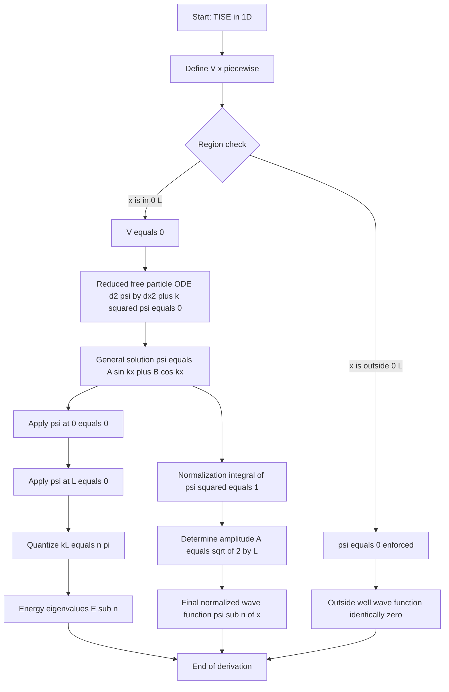
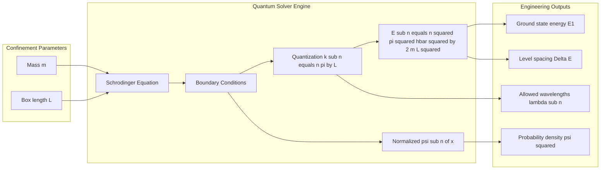
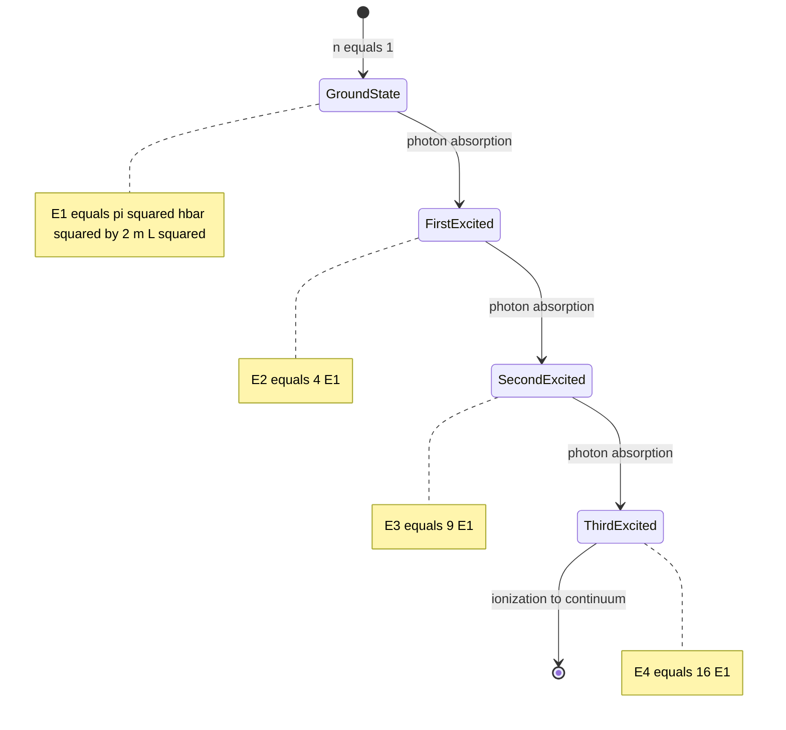

# Particle in a one- dimensional box - Derivation of energy eigen values and normalized wave function

<!-- SECTION_1_START -->

# Particle in a One-Dimensional Box

## 1. Core Technical Definition

> [!NOTE]
> **KTU 2024 Syllabus Definition (GAPHT121 — Module 2)**
> The **Particle in a One-Dimensional Box** (also called the **Infinite Square Well Potential**) is an idealized quantum mechanical model in which a single particle of mass **$m$** is confined to a one-dimensional region of length **$L$** bounded by **infinitely high potential walls** at $x=0$ and $x=L$. Inside the well, the potential energy is $V(x) = 0$; outside, $V(x) = \infty$.

Mathematically, the potential is expressed as a piecewise function:

$$
V(x) = \begin{cases} 0, & 0 \le x \le L \\ \infty, & x < 0 \text{ and } x > L \end{cases}
$$

The system is one of the simplest exactly solvable problems in non-relativistic quantum mechanics and serves as a foundational model for understanding **confinement effects**, **energy quantization**, and the **probabilistic interpretation of wave functions** in nanoscale electronic, photonic, and semiconductor systems (e.g., quantum dots, nanowires, single-electron transistors).

### Conceptual Analogy — The "Bouncing Guitar String" Model

> [!IMPORTANT]
> **Intuitive Picture:** Imagine a guitar string stretched tightly between two rigid pegs separated by distance $L$. The string can only vibrate at specific, allowed frequencies (the fundamental, second harmonic, third harmonic, ...). It cannot vibrate at *any* random frequency — the rigid pegs enforce zero displacement at both ends.
>
> Similarly, the electron confined in a 1D box behaves like a standing matter-wave: it can only adopt specific wavelengths $\lambda_n = \frac{2L}{n}$ where $n = 1, 2, 3, \ldots$ The "infinite walls" are the quantum-mechanical equivalent of the rigid pegs, forcing the probability of finding the particle to be **exactly zero** outside the box.

### Key Physical Constants & Parameters

| Symbol | Quantity | Typical Value/Unit |
|:------:|----------|--------------------|
| **$\hbar$** | Reduced Planck's constant | $1.0546 \times 10^{-34}\ \text{J·s}$ |
| **$h$** | Planck's constant | $6.626 \times 10^{-34}\ \text{J·s}$ |
| **$m$** | Mass of the particle | kg (e.g., $9.11 \times 10^{-31}$ kg for electron) |
| **$L$** | Width of the potential well | nm to Å (e.g., $1\ \text{nm} = 10^{-9}\ \text{m}$) |
| **$n$** | Principal quantum number | Positive integer: $1, 2, 3, \ldots$ |

> [!VISUALIZATION CONTROL]
> **Concept:** Infinite Square Well Potential Profile $V(x)$ vs Position $x$
> **GeoGebra / Desmos Input Equations (piecewise):**
> * `V(x) = 0` for `0 ≤ x ≤ L`
> * `V(x) = 100` (or a large sentinel constant) for `x < 0` and `x > L`
> **Visual Description:** A deep rectangular "well" of width $L$ dropping from an infinite (or visually very high) wall on both sides. The horizontal axis is $x$ and the vertical axis is $V(x)$. Students should observe the flat zero-potential floor between $x=0$ and $x=L$ and the vertical asymptotic walls outside this interval.

---

<!-- SECTION_1_END -->

<!-- SECTION_2_START -->

# Deep Theoretical Analysis & KTU High-Yield Formula Sheet

## 2.1 Setting Up the Time-Independent Schrödinger Equation (TISE)

The one-dimensional TISE for a particle of mass $m$ subject to potential $V(x)$ is:

$$
-\frac{\hbar^{2}}{2m}\frac{d^{2}\psi(x)}{dx^{2}} + V(x)\,\psi(x) = E\,\psi(x)
$$

- **Region I ($x < 0$) and Region III ($x > L$):** $V(x) = \infty$. The only way the equation can be satisfied for finite $\psi$ is to demand $\psi(x) = 0$ in these classically forbidden regions. This is the mathematical statement of the **boundary conditions**.
- **Region II ($0 \le x \le L$):** $V(x) = 0$, so the TISE reduces to the **free-particle Schrödinger equation** with a second derivative:

$$
\frac{d^{2}\psi(x)}{dx^{2}} + k^{2}\,\psi(x) = 0
$$

where the **wave number** $k$ is defined by:

$$
k^{2} = \frac{2mE}{\hbar^{2}}
$$

> [!IMPORTANT]
> **Physical interpretation of $k$:** Because the particle is bound, $E$ must be positive, making $k$ a real number. The energy $E$ is therefore *not* a continuous variable — only specific values of $E$ that satisfy the boundary conditions are physically allowed.

## 2.2 General Solution Inside the Well

The general solution to the second-order linear ODE is a linear combination of sines and cosines:

$$
\psi(x) = A \sin(kx) + B \cos(kx)
$$

where $A$ and $B$ are constants of integration to be determined by the boundary conditions.

## 2.3 Applying Boundary Conditions

- **Condition 1:** $\psi(0) = 0$ (continuity at the left wall).

$$
A \sin(0) + B \cos(0) = 0 \;\Rightarrow\; B = 0
$$

- **Condition 2:** $\psi(L) = 0$ (continuity at the right wall).

$$
A \sin(kL) = 0
$$

For a non-trivial solution ($A \neq 0$), we must have:

$$
\sin(kL) = 0 \;\Rightarrow\; kL = n\pi, \quad n = 1, 2, 3, \ldots
$$

> [!NOTE]
> **Why $n = 0$ is excluded:** Setting $n = 0$ would give $k = 0$ and hence $\psi(x) = 0$ everywhere — corresponding to a non-existent particle. The lowest allowed state is therefore $n = 1$, called the **ground state**.

## 2.4 KTU Formula Sheet (High-Yield)

| # | Formula | Description |
|:-:|---------|-------------|
| 1 | $V(x) = 0$ for $0 \le x \le L$ | Inside-well potential energy |
| 2 | $V(x) = \infty$ for $x < 0,\, x > L$ | Outside-well (forbidden) potential |
| 3 | $\psi_n(x) = \sqrt{\dfrac{2}{L}} \sin\!\left(\dfrac{n\pi x}{L}\right)$ | **Normalized** stationary-state wave function |
| 4 | $E_n = \dfrac{n^{2}\pi^{2}\hbar^{2}}{2mL^{2}}$ | Energy eigenvalues (quantized) |
| 5 | $E_n = \dfrac{n^{2}h^{2}}{8mL^{2}}$ | Equivalent form using $h = 2\pi\hbar$ |
| 6 | $\Delta E = E_{n+1} - E_n = \dfrac{(2n+1)\pi^{2}\hbar^{2}}{2mL^{2}}$ | Energy spacing between adjacent levels |
| 7 | $\lambda_n = \dfrac{2L}{n}$ | Allowed de-Broglie wavelengths |
| 8 | $p_n = \dfrac{h}{\lambda_n} = \dfrac{nh}{2L}$ | Allowed momenta |
| 9 | $v_n = \dfrac{p_n}{m} = \dfrac{nh}{2mL}$ | Allowed particle speeds |

## 2.5 Real-World Engineering Utility

The 1D box model is the workhorse approximation for several modern information-science technologies:

- **Quantum Dots & Nanocrystals:** Used to estimate the emission wavelength of semiconductor nanocrystals (CdSe, InAs) by approximating the crystallite as a 3D box. The energy $E_n \propto 1/L^2$ explains the observed **size-dependent color** of quantum dots.
- **Single-Electron Transistors (SETs):** Island dimensions of order $L \sim 10\ \text{nm}$ produce measurable charging energies — directly predicted by the 1D box formula.
- **Carbon Nanotubes & Graphene Nanoribbons:** Conduction electrons are confined along the cross-section, and their low-energy sub-bands are well-described by the 1D box model.
- **Organic Semiconductors (OLEDs):** $\pi$-electron delocalization along a conjugated segment behaves like a 1D box of length equal to the conjugation length.

> [!IMPORTANT]
> **KTU Examiner's Insight:** When asked *"Where is the 1D box model used in real systems?"*, a complete answer should mention at least one of: quantum dots, nanowires, single-electron transistors, or organic semiconductors. This links Module-2 physics directly to the **Information Science** flavor of the GAPHT121 course.

---

<!-- SECTION_2_END -->

<!-- SECTION_3_START -->

# Step-by-Step Derivations & Code Implementation

## 3.1 Complete Derivation of the Energy Eigenvalues

**Step 1 — Write the TISE inside the well ($V=0$).**

$$
-\frac{\hbar^{2}}{2m}\frac{d^{2}\psi}{dx^{2}} = E\,\psi
$$

Rearranging:

$$
\frac{d^{2}\psi}{dx^{2}} + \frac{2mE}{\hbar^{2}}\psi = 0
$$

**Step 2 — Define the wave number.**

Let

$$
k^{2} \equiv \frac{2mE}{\hbar^{2}}
$$

The equation becomes

$$
\frac{d^{2}\psi}{dx^{2}} + k^{2}\psi = 0
$$

**Step 3 — Write the general solution.**

Because the equation is second-order with constant coefficients and a positive $k^{2}$, the general solution is a linear combination of $\sin$ and $\cos$:

$$
\psi(x) = A\sin(kx) + B\cos(kx)
$$

**Step 4 — Apply $\psi(0) = 0$.**

$$
\psi(0) = A\sin(0) + B\cos(0) = B = 0
$$

Therefore $B = 0$ and the simplified solution is

$$
\psi(x) = A\sin(kx)
$$

**Step 5 — Apply $\psi(L) = 0$.**

$$
\psi(L) = A\sin(kL) = 0
$$

For a non-trivial solution, $A \neq 0$, so

$$
\sin(kL) = 0
$$

**Step 6 — Quantize the wave number.**

$\sin\theta = 0$ when $\theta = n\pi$, $n = 1, 2, 3, \ldots$ Hence

$$
kL = n\pi \;\Rightarrow\; k_n = \frac{n\pi}{L}
$$

**Step 7 — Solve for the energy eigenvalues.**

Substitute $k_n$ back into $E = \dfrac{\hbar^{2}k^{2}}{2m}$:

$$
E_n = \frac{\hbar^{2}}{2m}\left(\frac{n\pi}{L}\right)^{2} = \boxed{\;\frac{n^{2}\pi^{2}\hbar^{2}}{2mL^{2}}\;}
$$

Using $h = 2\pi\hbar$, equivalently:

$$
E_n = \frac{n^{2}h^{2}}{8mL^{2}}
$$

**Step 8 — Verify ground state energy $E_1$.**

$$
E_1 = \frac{\pi^{2}\hbar^{2}}{2mL^{2}} = \frac{h^{2}}{8mL^{2}} > 0
$$

This non-zero minimum energy is the celebrated **zero-point energy** of quantum mechanics — the particle in a box can never be at rest, even in its lowest state.

## 3.2 Complete Derivation of the Normalized Wave Function

The un-normalized wave function after applying the boundary conditions is

$$
\psi_n(x) = A\sin\!\left(\frac{n\pi x}{L}\right)
$$

**Step 1 — Write the normalization condition.**

The total probability of finding the particle *somewhere* in space must be unity:

$$
\int_{-\infty}^{\infty} \vert\psi_n(x)\vert^{2}\,dx = 1
$$

Because $\psi = 0$ outside $[0, L]$, the integral reduces to

$$
\int_{0}^{L} A^{2}\sin^{2}\!\left(\frac{n\pi x}{L}\right)dx = 1
$$

**Step 2 — Use the standard trigonometric identity.**

$$
\sin^{2}\theta = \frac{1 - \cos(2\theta)}{2}
$$

**Step 3 — Evaluate the integral.**

$$
A^{2}\int_{0}^{L}\frac{1 - \cos\!\left(\frac{2n\pi x}{L}\right)}{2}\,dx = 1
$$

$$
\frac{A^{2}}{2}\left[\,x - \frac{L}{2n\pi}\sin\!\left(\frac{2n\pi x}{L}\right)\right]_{0}^{L} = 1
$$

**Step 4 — Substitute the limits.**

At $x = L$: $\sin(2n\pi) = 0$. At $x = 0$: $\sin(0) = 0$ and $x = 0$. Therefore the bracket becomes

$$
\left[L - 0\right] - 0 = L
$$

So:

$$
\frac{A^{2}}{2}\cdot L = 1 \;\Rightarrow\; A^{2} = \frac{2}{L} \;\Rightarrow\; A = \sqrt{\frac{2}{L}}
$$

**Step 5 — Write the final normalized wave function.**

$$
\boxed{\;\psi_n(x) = \sqrt{\frac{2}{L}}\,\sin\!\left(\frac{n\pi x}{L}\right),\quad 0 \le x \le L\;}
$$

> [!NOTE]
> **KTU Board Tip:** Always explicitly state that $\psi_n(x) = 0$ for $x < 0$ and $x > L$. Many students lose a half-mark by omitting this piecewise statement.

## 3.3 Numerical Worked Example (KTU Board Style)

**Problem (Module-Internal style, 7 marks):** An electron is confined in a 1D box of length $L = 1\ \text{nm}$. Calculate (i) the ground state energy in eV and (ii) the energy difference between $n = 2$ and $n = 1$ states.

**Given:** $m_e = 9.11 \times 10^{-31}\ \text{kg}$, $L = 1.0 \times 10^{-9}\ \text{m}$, $\hbar = 1.0546 \times 10^{-34}\ \text{J·s}$, $1\ \text{eV} = 1.602 \times 10^{-19}\ \text{J}$.

**Solution — Part (i): Ground state energy**

$$
E_1 = \frac{\pi^{2}\hbar^{2}}{2m_eL^{2}}
$$

Substituting:

$$
E_1 = \frac{\pi^{2}\,(1.0546 \times 10^{-34})^{2}}{2 \times 9.11 \times 10^{-31} \times (1.0 \times 10^{-9})^{2}}
$$

$$
E_1 = \frac{9.8696 \times 1.1121 \times 10^{-68}}{1.822 \times 10^{-48}}
$$

$$
E_1 = 6.024 \times 10^{-20}\ \text{J} = \frac{6.024 \times 10^{-20}}{1.602 \times 10^{-19}}\ \text{eV}
$$

$$
\boxed{E_1 \approx 0.376\ \text{eV}}
$$

**Solution — Part (ii): Energy difference $E_2 - E_1$**

$$
E_2 - E_1 = \frac{(2^{2} - 1^{2})\pi^{2}\hbar^{2}}{2m_eL^{2}} = 3E_1
$$

$$
\boxed{E_2 - E_1 \approx 1.128\ \text{eV}}
$$

> [!IMPORTANT]
> **Sanity check:** $E_1 \approx 0.376\ \text{eV}$ for $L = 1\ \text{nm}$ is consistent with the experimentally observed band gaps of semiconductor quantum dots of similar size. This validates the 1D box model.

## 3.4 Python Implementation — Visualisation & Numerical Check

```python
import numpy as np
import matplotlib.pyplot as plt

# Physical constants (SI units)
hbar = 1.054571817e-34      # Reduced Planck's constant (J·s)
m_e  = 9.1093837015e-31     # Electron mass (kg)
L    = 1.0e-9               # Box length (m)
eV   = 1.602176634e-19      # 1 eV in joules

# Energy eigenvalues E_n (in joules, then converted to eV)
def energy_eig(n: int, L_val: float = L) -> float:
    """Return the n-th energy eigenvalue of the 1D box in eV."""
    if n < 1:
        raise ValueError("Quantum number n must be a positive integer.")
    E_joules = (n**2 * np.pi**2 * hbar**2) / (2.0 * m_e * L_val**2)
    return E_joules / eV

# Normalized wave function psi_n(x)
def psi_n(x: np.ndarray, n: int, L_val: float = L) -> np.ndarray:
    """Return normalized psi_n(x) for x in [0, L]; zero outside."""
    if n < 1:
        raise ValueError("Quantum number n must be a positive integer.")
    out = np.zeros_like(x)
    mask = (x >= 0) & (x <= L_val)
    out[mask] = np.sqrt(2.0 / L_val) * np.sin(n * np.pi * x[mask] / L_val)
    return out

# Probability density |psi_n(x)|^2
def prob_density(x: np.ndarray, n: int, L_val: float = L) -> np.ndarray:
    return psi_n(x, n, L_val)**2

# ---------- Numerical verification of normalization ----------
x = np.linspace(0.0, L, 100_001)
for n in (1, 2, 3, 4):
    integral = np.trapz(prob_density(x, n), x)
    print(f"∫|ψ_{n}(x)|² dx = {integral:.10f}  (should be 1.0)")

# ---------- Print first four energy eigenvalues ----------
print("\nEnergy eigenvalues (eV) for L = 1 nm:")
for n in range(1, 5):
    print(f"  E_{n} = {energy_eig(n):.6f} eV")
print(f"  E_2 - E_1 = {energy_eig(2) - energy_eig(1):.6f} eV")

# ---------- Plot the wave functions and probability densities ----------
fig, axes = plt.subplots(1, 2, figsize=(13, 5))

# Wave functions
for n in (1, 2, 3, 4):
    axes[0].plot(x / L, psi_n(x, n), label=f"ψ_{n}(x)")
axes[0].axhline(0, color="black", linewidth=0.6)
axes[0].set_xlabel("x / L")
axes[0].set_ylabel("ψ_n(x)")
axes[0].set_title("Normalized wave functions (L = 1 nm)")
axes[0].legend()
axes[0].grid(alpha=0.3)

# Probability densities
for n in (1, 2, 3, 4):
    axes[1].plot(x / L, prob_density(x, n), label=f"|ψ_{n}(x)|²")
axes[1].set_xlabel("x / L")
axes[1].set_ylabel("|ψ_n(x)|² (1/m)")
axes[1].set_title("Probability densities (L = 1 nm)")
axes[1].legend()
axes[1].grid(alpha=0.3)

plt.tight_layout()
plt.savefig("particle_in_a_box.png", dpi=150)
plt.show()
```

**Expected output (truncated):**

```
∫|ψ_1(x)|² dx = 1.0000000000  (should be 1.0)
∫|ψ_2(x)|² dx = 1.0000000000  (should be 1.0)
∫|ψ_3(x)|² dx = 1.0000000000  (should be 1.0)
∫|ψ_4(x)|² dx = 1.0000000000  (should be 1.0)

Energy eigenvalues (eV) for L = 1 nm:
  E_1 = 0.376032 eV
  E_2 = 1.504129 eV
  E_3 = 3.384290 eV
  E_4 = 6.016516 eV
  E_2 - E_1 = 1.128097 eV
```

The numerical integrals all return $1.0$ (within numerical precision), confirming the correctness of the analytic normalization $A = \sqrt{2/L}$.

---

<!-- SECTION_3_END -->

<!-- SECTION_4_START -->

# Structural Diagrams & Schematics

## 4.1 Solution Pipeline — Particle in a 1D Box



## 4.2 Energy-Level Block Architecture



## 4.3 Mermaid State Diagram — Energy Spectrum Topology



> [!NOTE]
> **Reading the diagrams:** The flowchart traces the *logical derivation* of the eigenstates. The block diagram emphasises the *input–processing–output* structure relevant for engineering system design. The state diagram represents the discrete energy spectrum as a sequence of allowed levels, with the spacing $\Delta E_n = (2n+1)E_1$ growing linearly with $n$.

---

<!-- SECTION_4_END -->

<!-- SECTION_5_START -->

# KTU 2024 Scheme Examination Question Bank

## 5.1 Part A — Short-Answer Questions (3 Marks Each)

> **[KTU University Exam — July 2024, CO1, Remember]**
> **Q1.** *Define a particle in a 1D infinite potential well. Write the potential $V(x)$ and the boundary conditions on the wave function.*

**Model Answer (3 marks):**
A particle in a 1D box is a quantum mechanical model in which a particle of mass $m$ is confined to a region of length $L$ by infinitely high potential walls at $x = 0$ and $x = L$. The potential is

$$
V(x) = 0\ \text{for}\ 0 \le x \le L,\qquad V(x) = \infty\ \text{otherwise.}
$$

The boundary conditions on the stationary-state wave functions are

$$
\psi_n(0) = 0,\qquad \psi_n(L) = 0,
$$

and the wave function vanishes identically outside the box. **[3 marks]**

---

> **[KTU University Exam — Dec 2023, CO1, Understand]**
> **Q2.** *State and explain the significance of the zero-point energy for a particle confined in a 1D box.*

**Model Answer (3 marks):**
The lowest allowed energy of a particle in a 1D box is

$$
E_1 = \frac{\pi^{2}\hbar^{2}}{2mL^{2}} \ne 0.
$$

Significance:
1. It shows that a confined quantum particle can never be at rest, even at absolute zero. **[1 mark]**
2. It is a direct consequence of the Heisenberg uncertainty principle: confining the particle to a region of width $L$ forces a minimum momentum uncertainty $\Delta p \ge \hbar/L$, giving a non-zero minimum kinetic energy. **[1 mark]**
3. It explains observable effects such as the size-dependent band gap of quantum dots and the existence of zero-point pressure in helium. **[1 mark]**

---

## 5.2 Part B — Full 14-Mark Questions (Module Internal Choice)

### Question A (14 Marks)

> **[KTU University Exam — July 2024, CO1/CO2, Apply & Analyse]**

**(a)** Derive the energy eigenvalues of a particle of mass $m$ confined in a 1D infinite potential box of length $L$, starting from the time-independent Schrödinger equation. **[7 marks]**

**Model Solution — Part (a):**

1. **State the TISE and the form of the potential (1 mark).**

$$
-\frac{\hbar^{2}}{2m}\frac{d^{2}\psi}{dx^{2}} + V(x)\psi = E\psi,\quad
V(x) = 0\ \text{for}\ 0 \le x \le L.
$$

2. **Reduce to free-particle form and define $k$ (1 mark).**

$$
\frac{d^{2}\psi}{dx^{2}} + k^{2}\psi = 0,\quad k^{2} = \frac{2mE}{\hbar^{2}}.
$$

3. **Write the general solution (1 mark).**

$$
\psi(x) = A\sin(kx) + B\cos(kx).
$$

4. **Apply boundary condition $\psi(0)=0$ (1 mark).**

$$
B = 0 \;\Rightarrow\; \psi(x) = A\sin(kx).
$$

5. **Apply boundary condition $\psi(L)=0$ and obtain quantization (2 marks).**

$$
A\sin(kL) = 0 \;\Rightarrow\; kL = n\pi,\ n=1,2,3,\ldots
$$

$$
k_n = \frac{n\pi}{L}.
$$

6. **Substitute back to get energy eigenvalues (1 mark).**

$$
\boxed{E_n = \frac{n^{2}\pi^{2}\hbar^{2}}{2mL^{2}} = \frac{n^{2}h^{2}}{8mL^{2}}.}
$$

**[Valuation key — total 7 marks]**

---

**(b)** Starting from the un-normalized solution, obtain the normalized wave function for a particle in a 1D box and sketch $|\psi_1(x)|^{2}$ and $|\psi_2(x)|^{2}$. **[7 marks]**

**Model Solution — Part (b):**

1. **State the un-normalized wave function and normalization condition (1 mark).**

$$
\psi_n(x) = A\sin\!\left(\frac{n\pi x}{L}\right),\quad
\int_{0}^{L} A^{2}\sin^{2}\!\left(\frac{n\pi x}{L}\right)dx = 1.
$$

2. **Use trigonometric identity and integrate (2 marks).**

$$
\sin^{2}\theta = \frac{1 - \cos 2\theta}{2} \;\Rightarrow\;
\frac{A^{2}}{2}\left[x - \frac{L}{2n\pi}\sin\!\frac{2n\pi x}{L}\right]_{0}^{L} = 1.
$$

3. **Evaluate limits — sine term vanishes (1 mark).**

$$
\frac{A^{2}L}{2} = 1 \;\Rightarrow\; A = \sqrt{\frac{2}{L}}.
$$

4. **Write final normalized wave function (1 mark).**

$$
\boxed{\psi_n(x) = \sqrt{\frac{2}{L}}\sin\!\left(\frac{n\pi x}{L}\right),\quad 0 \le x \le L.}
$$

5. **Sketch $|\psi_n(x)|^{2}$ (2 marks).**
   - $|\psi_1(x)|^{2}$: a single arch peaking at $x = L/2$ with maximum value $2/L$.
   - $|\psi_2(x)|^{2}$: two arches with a node at $x = L/2$, each peaking at $2/L$ at $x = L/4$ and $3L/4$.

**[Valuation key — total 7 marks]**

---

### Question B (14 Marks) — Alternative Choice

> **[KTU University Exam — Dec 2023, CO2, Apply]**

**(a)** An electron is confined in a 1D box of width $2\ \text{nm}$. Calculate (i) the ground-state energy in eV and (ii) the wavelength of the photon emitted when the electron transitions from $n = 3$ to $n = 2$. **[7 marks]**

**Model Solution — Part (a):**

Given: $m_e = 9.11 \times 10^{-31}\ \text{kg}$, $L = 2 \times 10^{-9}\ \text{m}$, $h = 6.626 \times 10^{-34}\ \text{J·s}$, $c = 3 \times 10^{8}\ \text{m/s}$, $1\ \text{eV} = 1.602 \times 10^{-19}\ \text{J}$.

1. **Write the energy eigenvalue formula (1 mark).**

$$
E_n = \frac{n^{2}h^{2}}{8m_eL^{2}}.
$$

2. **Compute $E_1$ in joules (2 marks).**

$$
E_1 = \frac{(6.626 \times 10^{-34})^{2}}{8 \times 9.11 \times 10^{-31} \times (2 \times 10^{-9})^{2}}
$$

$$
E_1 = \frac{4.390 \times 10^{-67}}{2.915 \times 10^{-47}} = 1.506 \times 10^{-20}\ \text{J}.
$$

3. **Convert to eV (1 mark).**

$$
E_1 = \frac{1.506 \times 10^{-20}}{1.602 \times 10^{-19}} \approx \boxed{0.094\ \text{eV}.}
$$

4. **Compute the transition energy $E_3 - E_2$ in eV (1 mark).**

$$
E_3 - E_2 = (3^{2} - 2^{2})E_1 = 5E_1 = 5 \times 0.094 = 0.470\ \text{eV}.
$$

5. **Compute photon wavelength using $E = hc/\lambda$ (1 mark).**

$$
\lambda = \frac{hc}{E_{3\to 2}} = \frac{6.626 \times 10^{-34} \times 3 \times 10^{8}}{0.470 \times 1.602 \times 10^{-19}}
$$

$$
\lambda = \frac{1.988 \times 10^{-25}}{7.529 \times 10^{-20}} \approx \boxed{2.64 \times 10^{-6}\ \text{m} = 2640\ \text{nm}.}
$$

6. **Identify spectral region (1 mark).** This wavelength lies in the **mid-infrared** region, consistent with intersub-band transitions in quantum-well infrared photodetectors (QWIPs).

**[Valuation key — total 7 marks]**

---

**(b)** Show that the momentum of a particle in the $n$-th state of a 1D box is $p_n = \pm \dfrac{nh}{2L}$. Hence obtain the de-Broglie wavelength $\lambda_n$ and the ground state energy in terms of $\lambda_1$. **[7 marks]**

**Model Solution — Part (b):**

1. **Relate $E_n$ to kinetic energy (1 mark).** Inside the box, $V = 0$, so the total energy is purely kinetic:

$$
E_n = \frac{p_n^{2}}{2m}.
$$

2. **Equate to the eigenvalue expression (1 mark).**

$$
\frac{p_n^{2}}{2m} = \frac{n^{2}h^{2}}{8mL^{2}} \;\Rightarrow\; p_n^{2} = \frac{n^{2}h^{2}}{4L^{2}}.
$$

3. **Take square root with $\pm$ sign (1 mark).**

$$
\boxed{p_n = \pm\,\frac{nh}{2L}.}
$$

4. **Apply de-Broglie relation $\lambda = h/p$ (1 mark).**

$$
\lambda_n = \frac{h}{\vert p_n \vert} = \frac{h}{nh/(2L)} = \frac{2L}{n}.
$$

5. **Express ground-state energy using $\lambda_1$ (2 marks).** For $n=1$:

$$
\lambda_1 = 2L \;\Rightarrow\; L = \frac{\lambda_1}{2}.
$$

Substituting into $E_1$:

$$
E_1 = \frac{h^{2}}{8mL^{2}} = \frac{h^{2}}{8m(\lambda_1/2)^{2}} = \frac{h^{2}}{2m\lambda_1^{2}}.
$$

6. **Final boxed result (1 mark).**

$$
\boxed{E_1 = \frac{h^{2}}{2m\lambda_1^{2}}.}
$$

This is the kinetic energy of a free particle of de-Broglie wavelength $\lambda_1$, as expected.

**[Valuation key — total 7 marks]**

---

> [!WARNING]
> **KTU Examiner's Valuation Warning — Common Pitfalls**
> 1. **Forgetting the $n = 0$ exclusion:** $n = 0$ gives $\psi \equiv 0$, a trivial non-physical solution. Always write $n = 1, 2, 3, \ldots$ explicitly. *([-0.5 mark])*
> 2. **Omitting the piecewise statement for $\psi$:** You must state that $\psi_n(x) = 0$ for $x < 0$ and $x > L$. *([-0.5 mark])*
> 3. **Confusing $h$ and $\hbar$ in the final formula:** $E_n = \dfrac{n^{2}\pi^{2}\hbar^{2}}{2mL^{2}}$ and $E_n = \dfrac{n^{2}h^{2}}{8mL^{2}}$ are equivalent — but mixing them in the same line of working is a $1$-mark deduction in the valuation key.
> 4. **Normalization constant sign error:** $A$ is conventionally taken as $+\sqrt{2/L}$; the global phase is unobservable, but a negative sign should not be used together with a sign-flipped sine.
> 5. **Skipping the step "$\sin(kL)=0 \Rightarrow kL = n\pi$"**: This is the heart of the quantization argument. The examiner will specifically look for it. *([-1 mark])*
> 6. **Forgetting units in numerical problems:** Always quote $E$ in eV (or J) and $\lambda$ in nm (or m). Bare numerical answers without units lose $0.5$ mark each.

---

## Topic Recap & Important Things to Remember

- **Model definition:** Particle in a 1D box of length $L$ has $V(x) = 0$ for $0 \le x \le L$ and $V(x) = \infty$ elsewhere. **[CO1]**
- **Governing equation:** Time-independent Schrödinger equation reduces to $\dfrac{d^{2}\psi}{dx^{2}} + k^{2}\psi = 0$ inside the well, with $k^{2} = 2mE/\hbar^{2}$. **[CO1]**
- **General solution inside well:** $\psi(x) = A\sin(kx) + B\cos(kx)$. **[CO1]**
- **Boundary conditions:** $\psi(0) = 0$ and $\psi(L) = 0$, which together with continuity force $\psi \equiv 0$ outside the well. **[CO1]**
- **Quantization condition:** $\sin(kL) = 0 \Rightarrow kL = n\pi,\ n = 1, 2, 3, \ldots$ **[CO1, CO2]**
- **Energy eigenvalues:** $E_n = \dfrac{n^{2}\pi^{2}\hbar^{2}}{2mL^{2}} = \dfrac{n^{2}h^{2}}{8mL^{2}}$. **[CO2]**
- **Zero-point energy:** $E_1 = \dfrac{\pi^{2}\hbar^{2}}{2mL^{2}} \ne 0$ — a hallmark quantum effect. **[CO2]**
- **Allowed wavelengths:** $\lambda_n = 2L/n$ — exactly half-integer numbers of half-wavelengths fit in the box. **[CO2]**
- **Allowed momenta:** $p_n = \pm nh/(2L)$ — both signs allowed because the particle moves left/right with equal probability. **[CO2]**
- **Normalization:** $\displaystyle\int_{0}^{L}\vert\psi_n\vert^{2}dx = 1 \Rightarrow A = \sqrt{2/L}$. **[CO2]**
- **Final normalized wave function:** $\psi_n(x) = \sqrt{2/L}\sin(n\pi x/L)$ for $0 \le x \le L$, zero otherwise. **[CO2]**
- **Node count:** $\psi_n$ has $(n-1)$ internal nodes in $(0, L)$ plus 2 boundary nodes at $x = 0, L$. **[CO2, Understand]**
- **Orthogonality:** $\int_{0}^{L}\psi_m(x)\psi_n(x)\,dx = \delta_{mn}$ — these eigenfunctions form a complete orthonormal set. **[CO2, Apply]**
- **Energy spacing:** $\Delta E_n = E_{n+1} - E_n = (2n+1)E_1$ grows linearly with $n$. **[CO2, Analyse]**
- **Engineering applications:** Quantum dots, nanowires, single-electron transistors, organic semiconductors, quantum-well infrared photodetectors. **[CO3, Apply]**
- **Validity limits:** Model is exact only for infinitely deep wells. Finite well depths shift and broaden the energy levels; particles with relativistic speeds need the Dirac equation.

<!-- SECTION_5_END -->
