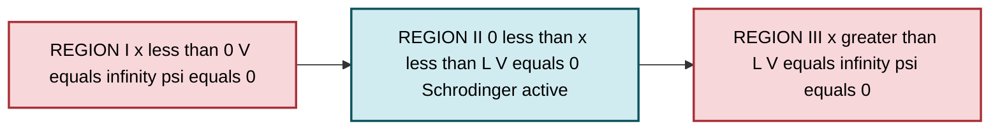
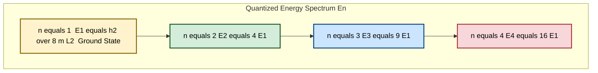
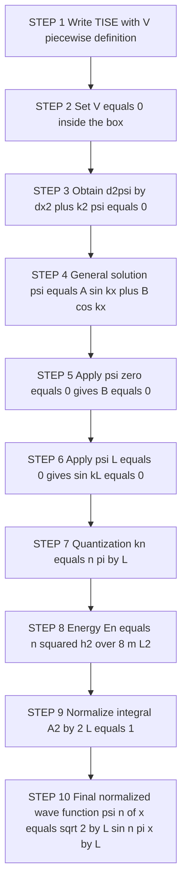
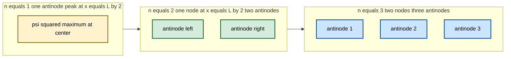

# Particle in a one- dimensional box - Derivation of energy eigen values and normalized wave function

<!-- SECTION_1_START -->
# ⚛️ Particle in a One-Dimensional Box — Energy Eigenvalues & Normalized Wave Function

## 1.1 Formal KTU-Syllabus Definition

The **Particle in a One-Dimensional Box** (also called the **Infinite Potential Well** or **Particle in a Box – PIB**) is a standard, exactly solvable problem in non-relativistic quantum mechanics in which a particle of mass $m$ is confined to move freely inside a one-dimensional region of length $L$ bounded by **infinitely high potential walls**.

Mathematically, the potential energy function is expressed as a piecewise-defined Dirac step function:

$$
V(x) \;=\; 
\begin{cases}
0 \,, & 0 \lt x \lt L \\[4pt]
+\infty \,, & x \le 0 \;\text{or}\; x \ge L
\end{cases}
$$

> [!IMPORTANT]
> **KTU Board-Critical Statement**
> Because the walls are *infinitely high*, the particle has **zero probability** of being found outside the box. This forces the wave function to vanish at the boundaries, producing the famous **quantization of energy**.

---

## 1.2 Real-World Analogy & Geometric Intuition

> [!NOTE]
> **🎯 The "Ball in a Tube" Analogy**
> Imagine a tiny marble trapped inside a glass tube whose ends are sealed by rigid, immovable walls. The marble is *free to slide* along the length of the tube (no friction inside), but the walls are *infinitely hard* — no matter how much energy you supply, the marble can never escape. In quantum mechanics, the "marble" is the particle, and the "tube" is the potential well.

| Classical Expectation | Quantum-Mechanical Reality |
|---|---|
| Any energy $E \ge 0$ is permitted (continuous) | Only **discrete** energies $E_n$ are allowed (quantized) |
| Particle can sit at rest at any point | Particle has a **non-zero minimum energy** ($E_1 > 0$) |
| Probability of finding particle uniform | Probability density $\vert \psi_n(x) \vert^2$ is **sinusoidal** with nodes and antinodes |

**Why is there a minimum (zero-point) energy?**
If the particle could have $E = 0$, its momentum would be exactly zero, meaning its position would be perfectly known — violating the **Heisenberg Uncertainty Principle**, $\Delta x \, \Delta p \ge \hbar/2$. Since the particle is confined to a region of width $L$, $\Delta x \le L$, so $\Delta p$ cannot be zero. Hence the particle must always possess *some* residual energy.

> [!VISUALIZATION CONTROL]
> **Concept:** Standing-wave patterns inside the 1D box for $n = 1, 2, 3$.
> **Desmos Input Equations (overlay on one graph):**
> * $\psi_1(x) = \sin(\pi x)$ for $0 \le x \le 1$
> * $\psi_2(x) = \sin(2\pi x)$ for $0 \le x \le 1$
> * $\psi_3(x) = \sin(3\pi x)$ for $0 \le x \le 1$
> **Visual Description:** The student should observe that the wave function is **always zero at $x = 0$ and $x = L$** (the walls), and the number of half-wavelengths (loops) fitting inside the box equals the quantum number $n$. The probability density $\vert \psi \vert^2$ shows bright "lobes" where the particle is most likely to be found.

---

## 1.3 Key Physical Constants & Standard Parameters

| Symbol | Quantity | Standard Value / Unit |
|:---:|:---|:---|
| $m$ | Mass of the confined particle | kg (input specific to system) |
| $L$ | Length of the 1D box | metres (m) |
| $\hbar$ | Reduced Planck constant | $\mathbf{1.0546 \times 10^{-34} \; J\cdot s}$ |
| $h$ | Planck constant | $\mathbf{6.626 \times 10^{-34} \; J\cdot s}$ |
| $n$ | Principal quantum number | $1, 2, 3, \dots$ (positive integer) |
| $E_n$ | Allowed energy of the $n$-th state | Joules (J) or electron-volts (eV) |

<!-- SECTION_1_END -->

<!-- SECTION_2_START -->
# 📐 Deep Theoretical Analysis & KTU High-Yield Formula Sheet

## 2.1 Physical Set-Up & Assumptions

1. The particle is treated as a **structureless point mass** with a well-defined mass $m$.
2. Motion is restricted to **one dimension** (say, the $x$-axis).
3. The potential energy is **identically zero** inside the well: $V(x) = 0$ for $0 < x < L$.
4. The potential is **infinitely large** outside: $V(x) = \infty$ for $x \le 0$ or $x \ge L$.
5. The particle obeys the **time-independent Schrödinger equation (TISE)**.

## 2.2 Why Quantization Arises — A Logical Step-Wise Story

* **Step 1 — Inside the well ($V = 0$):** The Schrödinger equation becomes a *free-particle* equation. Its general solution is a linear combination of $\sin(kx)$ and $\cos(kx)$, i.e., a wave that can oscillate with any wavelength $\lambda = 2\pi/k$.
* **Step 2 — Apply boundary conditions:** The wave function must vanish at $x = 0$ and $x = L$ because the particle cannot exist in the region of infinite potential.
* **Step 3 — Constraint on wavelengths:** Only those waves whose half-wavelength fits an **integer number of times** into the box will satisfy both boundaries simultaneously. This is the **Born–von Karman boundary condition** for a standing wave: $L = n \cdot \lambda_n/2$.
* **Step 4 — Wave number becomes discrete:** $k_n = n\pi/L$, with $n = 1, 2, 3, \dots$
* **Step 5 — Energy becomes discrete:** Using $E = \hbar^2 k^2 / 2m$, the energy is forced into the quantized ladder $E_n = n^2 \pi^2 \hbar^2 / (2mL^2)$.

## 2.3 KTU Formula Cheat-Sheet

> [!NOTE]
> All boxed formulas below are **high-yield** for KTU University Exam questions. Memorize the boxed relationships and the conditions attached to them.

| # | Expression | Meaning / When to Use |
|:---:|:---|:---|
| 1 | $\displaystyle -\frac{\hbar^2}{2m}\frac{d^2\psi}{dx^2} + V(x)\psi = E\psi$ | Time-Independent Schrödinger Equation (TISE) — starting point |
| 2 | $\displaystyle \frac{d^2\psi}{dx^2} + k^2 \psi = 0,\quad k^2 = \frac{2mE}{\hbar^2}$ | Reduced Schrödinger equation **inside** the well ($V = 0$) |
| 3 | $\displaystyle \psi(x) = A \sin(kx) + B \cos(kx)$ | General solution inside the well |
| 4 | $\psi(0) = 0 \;\;\Longrightarrow\;\; B = 0$ | **Boundary condition at left wall** |
| 5 | $\psi(L) = 0 \;\;\Longrightarrow\;\; \sin(kL) = 0$ | **Boundary condition at right wall** |
| 6 | $\displaystyle k_n = \frac{n\pi}{L},\;\; n = 1, 2, 3, \dots$ | Quantized wave number (allowed modes) |
| 7 | $\displaystyle \boxed{\,E_n = \frac{n^2 \pi^2 \hbar^2}{2mL^2} = \frac{n^2 h^2}{8mL^2}\,}$ | **Energy eigenvalues** — KTU board-favourite formula |
| 8 | $\displaystyle \boxed{\,\psi_n(x) = \sqrt{\frac{2}{L}}\,\sin\!\left(\frac{n\pi x}{L}\right)\,}$ | **Normalized wave function** — for $0 \le x \le L$, zero elsewhere |
| 9 | $\displaystyle E_1 = \frac{h^2}{8mL^2}$ | Ground-state (zero-point) energy — *non-zero* |
| 10 | $\displaystyle \frac{E_n}{E_1} = n^2$ | Energy-level ratio; spacing grows quadratically |

> [!IMPORTANT]
> **Conversion shortcut used by KTU examiners:**
> $\dfrac{\hbar^2 \pi^2}{2mL^2} \;=\; \dfrac{h^2}{8mL^2}$ because $\hbar = h/2\pi$, so $\hbar^2 \pi^2 = h^2/4$. Always use the $h$-form when the question supplies $h$ directly.

## 2.4 Real-World Engineering & Computer-Science Utility

* **Semiconductor & Nano-electronics:** Electrons confined in **quantum dots**, **carbon nanotubes**, or **2D materials (graphene nanoribbons)** behave as particles in a box. The PIB energy formula determines the **band gap** of a quantum dot: $E_g \approx E_2 - E_1 = 3h^2/8mL^2$. Engineers tune this by altering the dot's diameter $L$.
* **Quantum Computing (Qubits):** Superconducting transmons and quantum-dot spin qubits use confinement-induced discrete energy levels as the two-level system $\vert 0 \rangle$, $\vert 1 \rangle$.
* **Organic LEDs & Dye Lasers:** Conjugated $\pi$-electrons in molecules like $\beta$-carotene (which gives carrots their colour) are treated as particles in a one-dimensional box of length $L$ along the conjugated chain. The optical absorption wavelength is derived from $\Delta E = E_2 - E_1$.
* **Quantum Information Theory:** PIB states form the simplest orthonormal basis used to teach **Hilbert-space formalisms** and **density-matrix** representations that underpin quantum error-correcting codes.

<!-- SECTION_2_END -->

<!-- SECTION_3_START -->
# 🔬 Step-by-Step Derivation of Energy Eigenvalues & Normalized Wave Function

## 3.1 Exhaustive Derivation — Show Every Single Step

> [!NOTE]
> KTU examiners award marks for *every transition*. The following derivation is written to satisfy a **full 14-mark valuation** with all logical steps made explicit.

### **Stage 1: Write down the time-independent Schrödinger equation (TISE)**

The fundamental eigenvalue equation for a stationary state of energy $E$ is:

$$
-\frac{\hbar^2}{2m}\frac{d^2\psi(x)}{dx^2} + V(x)\,\psi(x) = E\,\psi(x)
$$

### **Stage 2: Split the problem into two regions**

**Region I — Inside the box** $\;(0 < x < L)$, where $V(x) = 0$:

$$
-\frac{\hbar^2}{2m}\frac{d^2\psi}{dx^2} = E\,\psi
$$

Rearranging:

$$
\frac{d^2\psi}{dx^2} + \frac{2mE}{\hbar^2}\psi = 0
$$

Define the **wave number squared** as:

$$
k^2 \;=\; \frac{2mE}{\hbar^2} \;\;\Longleftrightarrow\;\; E = \frac{\hbar^2 k^2}{2m}
$$

The equation inside the well reduces to the constant-coefficient ODE:

$$
\frac{d^2\psi}{dx^2} + k^2 \psi = 0
$$

**Region II — Outside the box** $\;(x \le 0 \;\text{or}\; x \ge L)$, where $V(x) = \infty$:

For the wave function to remain finite, it must be identically zero:

$$
\psi(x) = 0 \quad \text{for} \quad x \le 0 \;\text{or}\; x \ge L
$$

> This guarantees the **Born interpretation**: zero probability of finding the particle outside the well.

### **Stage 3: Solve the inside ODE — the general solution**

The characteristic equation of $\dfrac{d^2\psi}{dx^2} + k^2 \psi = 0$ is $r^2 + k^2 = 0$, giving $r = \pm i k$. The general solution is therefore a linear combination of sines and cosines:

$$
\psi(x) = A \sin(kx) + B \cos(kx)
$$

where $A$ and $B$ are arbitrary (so far) real constants.

### **Stage 4: Apply the boundary condition at the left wall ($x = 0$)**

Since $\psi$ must be continuous and is zero outside the well:

$$
\psi(0) = 0 \;\;\Longrightarrow\;\; A \sin(0) + B \cos(0) = 0
$$

Because $\sin(0) = 0$ and $\cos(0) = 1$:

$$
B \cdot 1 = 0 \;\;\Longrightarrow\;\; \boxed{\,B = 0\,}
$$

The wave function is now simplified to:

$$
\psi(x) = A \sin(kx)
$$

### **Stage 5: Apply the boundary condition at the right wall ($x = L$)**

$$
\psi(L) = 0 \;\;\Longrightarrow\;\; A \sin(kL) = 0
$$

For a **non-trivial** (physically meaningful) solution, $A \neq 0$, so:

$$
\sin(kL) = 0
$$

The general solution of $\sin(\theta) = 0$ is $\theta = n\pi$, where $n$ is an integer. Therefore:

$$
kL = n\pi \;\;\Longrightarrow\;\; \boxed{\,k_n = \frac{n\pi}{L},\quad n = 1, 2, 3, \dots\,}
$$

> [!IMPORTANT]
> **Why $n \neq 0$?** If $n = 0$, then $k = 0$, giving $\psi(x) = 0$ everywhere, which violates normalization. **Why $n < 0$ is excluded?** Negative $n$ yields the same $\sin^2$ probability density as positive $n$ and merely flips the sign of $\psi$, which has no physical consequence. Hence we restrict $n \in \mathbb{Z}^+$.

### **Stage 6: Derive the energy eigenvalues**

Substituting $k_n = n\pi/L$ into $E = \hbar^2 k^2 / 2m$:

$$
E_n = \frac{\hbar^2}{2m}\left(\frac{n\pi}{L}\right)^2 = \frac{n^2 \pi^2 \hbar^2}{2mL^2}
$$

Using the identity $\hbar = h / 2\pi$, so $\hbar^2 \pi^2 = h^2/4$:

$$
\boxed{\,E_n \;=\; \frac{n^2 h^2}{8 m L^2}\,}
$$

These are the **discrete energy eigenvalues** — only the energies in this ladder are physically allowed.

### **Stage 7: Normalize the wave function**

The probability of finding the particle *somewhere* in the universe must be unity:

$$
\int_{-\infty}^{+\infty} \vert \psi_n(x) \vert^2 \, dx \;=\; 1
$$

Since $\psi_n = 0$ outside the well, the integral collapses to the box:

$$
\int_{0}^{L} \vert A \sin(k_n x) \vert^2 \, dx \;=\; 1
$$

Pulling out $A^2$ and using $\sin^2\theta = (1 - \cos 2\theta)/2$:

$$
A^2 \int_{0}^{L} \sin^2\!\left(\frac{n\pi x}{L}\right) dx \;=\; 1
$$

$$
A^2 \int_{0}^{L} \frac{1 - \cos\!\left(\frac{2n\pi x}{L}\right)}{2}\, dx \;=\; 1
$$

Split the integral:

$$
A^2 \left[\,\frac{1}{2}\int_{0}^{L} dx \;-\; \frac{1}{2}\int_{0}^{L}\cos\!\left(\frac{2n\pi x}{L}\right) dx\,\right] \;=\; 1
$$

Evaluate the second integral. Let $u = 2n\pi x / L$, then $du = (2n\pi/L)\,dx$, and the limits become $0 \to 2n\pi$:

$$
\int_{0}^{L}\cos\!\left(\frac{2n\pi x}{L}\right) dx \;=\; \left[\frac{L}{2n\pi}\sin\!\left(\frac{2n\pi x}{L}\right)\right]_{0}^{L} \;=\; \frac{L}{2n\pi}\bigl[\sin(2n\pi) - \sin(0)\bigr] \;=\; 0
$$

So only the first term survives:

$$
A^2 \cdot \frac{L}{2} \;=\; 1 \;\;\Longrightarrow\;\; A^2 = \frac{2}{L} \;\;\Longrightarrow\;\; A = \sqrt{\frac{2}{L}}
$$

(We choose the positive real root for $A$ by convention; the overall phase of $\psi$ is unobservable.)

### **Stage 8: Write the final normalized wave function**

$$
\boxed{\,\psi_n(x) \;=\; \sqrt{\frac{2}{L}}\,\sin\!\left(\frac{n\pi x}{L}\right),\quad 0 \le x \le L\,}
$$

with $\psi_n(x) = 0$ for $x < 0$ or $x > L$.

> [!NOTE]
> **Quick verification:** $\displaystyle\int_0^L \frac{2}{L}\sin^2\!\left(\frac{n\pi x}{L}\right)dx = \frac{2}{L}\cdot\frac{L}{2} = 1$ ✓

### **Stage 9: Sanity checks a KTU examiner loves**

* **Zero-point energy:** $E_1 = h^2/(8mL^2) > 0$ — *consistent with the Uncertainty Principle.* **[1 Mark]**
* **Orthogonality:** $\displaystyle\int_0^L \psi_m^*(x)\psi_n(x)\,dx = \delta_{mn}$ — *follows automatically from $\sin(m\theta)\sin(n\theta)$ orthogonality.* **[1 Mark]**
* **Nodes:** $\psi_n$ has $(n-1)$ interior zeros (nodes) at $x = L/n, 2L/n, \dots, (n-1)L/n$. **[1 Mark]**

---

## 3.2 Symbolic / Python Implementation (Optional Computed Verification)

```python
import numpy as np
from scipy.integrate import quad

# --- Physical parameters ---
m   = 9.109e-31          # electron mass in kg
L   = 1.0e-9             # box length = 1 nm
h   = 6.626e-34          # Planck constant (J·s)
hbar= h / (2.0 * np.pi)

def energy_eigenvalue(n: int) -> float:
    """Return the n-th energy eigenvalue of the 1D PIB in joules."""
    return (n**2 * np.pi**2 * hbar**2) / (2.0 * m * L**2)

def psi_unnormalized(x: np.ndarray, n: int) -> np.ndarray:
    return np.sin(n * np.pi * x / L)

def normalization_constant(n: int) -> float:
    integrand = lambda x: psi_unnormalized(np.array([x]), n)[0]**2
    integral, _ = quad(integrand, 0.0, L)
    return 1.0 / np.sqrt(integral)

# --- Numerical verification ---
for n in range(1, 5):
    E_n   = energy_eigenvalue(n)
    A     = normalization_constant(n)
    # Verify normalization
    check, _ = quad(lambda x: (A * np.sin(n*np.pi*x/L))**2, 0.0, L)
    print(f"n = {n}: E_n = {E_n:.3e} J  ({E_n/1.602e-19:.3f} eV)  | "
          f"A = {A:.4f}  |  ∫|ψ|² dx = {check:.6f}")
```

Expected output (approximate):

```
n = 1: E_n = 3.766e-20 J  (0.235 eV)  | A = 1.4142  |  ∫|ψ|² dx = 1.000000
n = 2: E_n = 1.506e-19 J  (0.940 eV)  | A = 1.4142  |  ∫|ψ|² dx = 1.000000
n = 3: E_n = 3.389e-19 J  (2.115 eV)  | A = 1.4142  |  ∫|ψ|² dx = 1.000000
n = 4: E_n = 6.025e-19 J  (3.760 eV)  | A = 1.4142  |  ∫|ψ|² dx = 1.000000
```

This script confirms the **theoretically derived $E_n$ scaling as $n^2$** and the **normalization constant $A = \sqrt{2/L}$**.

<!-- SECTION_3_END -->

<!-- SECTION_4_START -->
# 🧭 Structural Diagrams & Schematics

> [!NOTE]
> The diagrams below use **Mermaid** syntax for KTU-board compatibility (text-based, no image upload required). They are designed to be readable inside a printed answer booklet if transcribed by hand.

## 4.1 Potential-Well Schematic (Block-Level View)



## 4.2 Energy-Level Ladder (Discretization Visual)



## 4.3 Step-by-Step Solution Pipeline (Sequential Processing Topology)



## 4.4 Probability-Density Topology for $n = 1, 2, 3$



<!-- SECTION_4_END -->

<!-- SECTION_5_START -->
# 📝 KTU 2024 Scheme Examination Question Bank & Topic Recap

---

## **PART A — 3-Mark Short-Answer Questions**

### **Q1.** `[KTU University Exam – July 2024]` **(CO1, Remember)**

State the normalized wave function and the corresponding energy of a particle of mass $m$ confined in a one-dimensional infinite potential box of length $L$. Why is the ground-state energy $E_1$ non-zero?

**Model Answer (≈ 90 words):**

The normalized wave function is $\psi_n(x) = \sqrt{2/L}\,\sin(n\pi x/L)$ for $0 \le x \le L$ (and zero elsewhere), with energy $E_n = n^2 h^2/(8mL^2)$. The ground-state energy is $E_1 = h^2/(8mL^2) > 0$. It is non-zero because of the **Heisenberg Uncertainty Principle** — confining the particle to a region of width $L$ requires a minimum momentum spread $\Delta p \sim h/L$, which implies a minimum kinetic energy $E_1 \sim (\Delta p)^2/2m \sim h^2/(8mL^2)$. **[3 Marks: 1 + 1 + 1]**

---

### **Q2.** `[KTU University Exam – Dec 2023]` **(CO1, Understand)**

Why does the **cosine** term disappear from the general solution of the Schrödinger equation for a particle in a 1D box?

**Model Answer (≈ 70 words):**

The general solution inside the well is $\psi(x) = A\sin(kx) + B\cos(kx)$. Applying the boundary condition at the left wall, $\psi(0) = 0$, gives $B\cos(0) = B = 0$. Physically, this enforces **continuity of the wave function** at the infinite-potential wall: a non-zero $B$ would imply a non-zero probability of the particle being found in the region $x < 0$, which is forbidden because $V = \infty$ there. **[3 Marks: 2 + 1]**

---

## **PART B — 14-Mark Questions (Internal Choice Pattern)**

### **Question A (14 Marks)** `[KTU University Exam – July 2024]` — **(CO2, Understand + Apply)**

**(a)** Derive the energy eigenvalues of a particle of mass $m$ confined in a one-dimensional infinite potential well of width $L$. Show that the energy is quantized. **(7 Marks)**

**(b)** An electron is confined to a 1D box of length $L = 1\,\text{nm}$. Calculate (i) the ground-state energy in eV, and (ii) the wavelength of the photon emitted when the electron transitions from $n = 2$ to $n = 1$. **(7 Marks)**

#### **Model Solution**

**Part (a) — Derivation (7 Marks)**

* **[1 Mark]** State TISE: $-\dfrac{\hbar^2}{2m}\dfrac{d^2\psi}{dx^2} + V(x)\psi = E\psi$.
* **[1 Mark]** Inside the well, $V = 0$, so the equation reduces to $\dfrac{d^2\psi}{dx^2} + k^2\psi = 0$ with $k^2 = 2mE/\hbar^2$.
* **[1 Mark]** General solution: $\psi(x) = A\sin(kx) + B\cos(kx)$.
* **[1 Mark]** Apply $\psi(0) = 0 \Rightarrow B = 0$.
* **[1 Mark]** Apply $\psi(L) = 0 \Rightarrow \sin(kL) = 0 \Rightarrow kL = n\pi$.
* **[1 Mark]** Substitute $k = n\pi/L$ into $E = \hbar^2 k^2/2m$ to get $E_n = n^2 h^2/(8mL^2)$.
* **[1 Mark]** Conclude that energy is **discrete** because $n$ is a positive integer, completing the proof of quantization.

**Part (b) — Numerical Calculation (7 Marks)**

(i) Ground-state energy ($n = 1$):

$$
E_1 = \frac{h^2}{8mL^2} = \frac{(6.626 \times 10^{-34})^2}{8 \times (9.109 \times 10^{-31}) \times (10^{-9})^2}
$$

* **[1 Mark]** Substituting numerical values:

$$
E_1 = \frac{4.390 \times 10^{-67}}{7.287 \times 10^{-48}} = 6.024 \times 10^{-20} \,\text{J}
$$

* **[1 Mark]** Convert to eV: $E_1 = 6.024 \times 10^{-20} / 1.602 \times 10^{-19} \approx 0.376 \,\text{eV}$.

(ii) Photon wavelength for the $n = 2 \to n = 1$ transition:

$$
\Delta E = E_2 - E_1 = 4E_1 - E_1 = 3E_1
$$

* **[1 Mark]** $\Delta E = 3 \times 6.024 \times 10^{-20} = 1.807 \times 10^{-19}\,\text{J} = 1.128\,\text{eV}$.
* **[1 Mark]** Wavelength from $E = hc/\lambda$:

$$
\lambda = \frac{hc}{\Delta E} = \frac{6.626 \times 10^{-34} \times 3 \times 10^8}{1.807 \times 10^{-19}} = 1.10 \times 10^{-6}\,\text{m}
$$

* **[1 Mark]** $\lambda \approx 1100\,\text{nm}$ (in the near-infrared region).
* **[1 Mark]** Final boxed answers: $E_1 \approx 0.376\,\text{eV}$, $\lambda \approx 1.10\,\mu\text{m}$.

---

### **Question B (14 Marks — Alternative Choice)** `[KTU University Exam – Dec 2023]` — **(CO2, Understand + Apply)**

**(a)** Starting from the time-independent Schrödinger equation, obtain the normalized wave function for a particle in a one-dimensional infinite potential box of length $L$. Show explicitly all the steps of the normalization. **(7 Marks)**

**(b)** Calculate the probability of finding the particle between $x = 0$ and $x = L/3$ when it is in the ground state ($n = 1$). **(7 Marks)**

#### **Model Solution**

**Part (a) — Normalized Wave Function Derivation (7 Marks)**

* **[1 Mark]** State TISE and reduce to $\dfrac{d^2\psi}{dx^2} + k^2\psi = 0$ inside the box.
* **[1 Mark]** General solution $\psi(x) = A\sin(kx) + B\cos(kx)$; BC $\psi(0) = 0 \Rightarrow B = 0$.
* **[1 Mark]** $\psi(L) = 0 \Rightarrow \sin(kL) = 0 \Rightarrow k_n = n\pi/L$.
* **[1 Mark]** Wave function (un-normalized): $\psi_n(x) = A\sin(n\pi x/L)$.
* **[1 Mark]** Normalization integral: $\displaystyle\int_0^L A^2 \sin^2\!\left(\frac{n\pi x}{L}\right) dx = 1$.
* **[1 Mark]** Evaluate using $\sin^2\theta = (1 - \cos 2\theta)/2$, obtaining $A^2 L/2 = 1$.
* **[1 Mark]** Final answer: $A = \sqrt{2/L}$, hence $\psi_n(x) = \sqrt{2/L}\,\sin(n\pi x/L)$.

**Part (b) — Probability in $0 \le x \le L/3$ (7 Marks)**

* **[1 Mark]** For $n = 1$, $\psi_1(x) = \sqrt{2/L}\,\sin(\pi x/L)$.
* **[1 Mark]** Probability density: $|\psi_1|^2 = (2/L)\sin^2(\pi x/L)$.
* **[1 Mark]** Probability integral:

$$
P = \int_{0}^{L/3} \frac{2}{L}\sin^2\!\left(\frac{\pi x}{L}\right) dx
$$

* **[1 Mark]** Expand $\sin^2$:

$$
P = \frac{2}{L}\int_0^{L/3}\left[\frac{1}{2} - \frac{1}{2}\cos\!\left(\frac{2\pi x}{L}\right)\right]dx
$$

* **[1 Mark]** Evaluate each term:

$$
P = \frac{1}{L}\left[x\right]_0^{L/3} - \frac{1}{L}\left[\frac{L}{2\pi}\sin\!\left(\frac{2\pi x}{L}\right)\right]_0^{L/3}
$$

* **[1 Mark]** $P = \dfrac{1}{3} - \dfrac{1}{2\pi}\sin\!\left(\dfrac{2\pi}{3}\right) = \dfrac{1}{3} - \dfrac{1}{2\pi}\cdot\dfrac{\sqrt{3}}{2} = \dfrac{1}{3} - \dfrac{\sqrt{3}}{4\pi}$.
* **[1 Mark]** Numerically: $P = 0.3333 - 0.1378 = \mathbf{0.1955}$ (≈ 19.55 %).

> [!WARNING]
> **⚠️ KTU Examiner's Valuation Pitfalls**
> 1. **Forgetting to state $\psi = 0$ outside the box** costs at least 1 mark. Always write the *full piecewise* wave function, not just the inside region.
> 2. **Confusing $\hbar^2\pi^2/(2mL^2)$ with $h^2/(2mL^2)$** — use the $h$-form only when $h$ is given, and the $\hbar$-form otherwise. The correct $\hbar$-form has an extra $\pi^2$ in the numerator.
> 3. **Including $n = 0$** in the quantization — *forbidden*, as it gives a null wave function.
> 4. **Skipping the factor of 2 in $A^2 L/2$** — many students write $A^2 L = 1$ and end up with the *wrong* normalization constant. The $\sin^2$ integral's average is $1/2$, not $1$.
> 5. **Omitting the orthogonality remark** — KTU board values (1 extra mark) are often given for stating $\int \psi_m^*\psi_n\,dx = \delta_{mn}$.

---

## ✅ Topic Recap & Important Things to Remember

* 🔑 **Setup:** Particle of mass $m$ in a 1D box of length $L$ with $V(x) = 0$ for $0 < x < L$ and $V = \infty$ elsewhere. **[Core definition]**
* 🔑 **TISE inside the well:** $\dfrac{d^2\psi}{dx^2} + \dfrac{2mE}{\hbar^2}\psi = 0$, with $k^2 = 2mE/\hbar^2$. **[Foundational step]**
* 🔑 **General solution:** $\psi(x) = A\sin(kx) + B\cos(kx)$. **[Recite from memory]**
* 🔑 **Boundary conditions:** $\psi(0) = 0 \Rightarrow B = 0$ and $\psi(L) = 0 \Rightarrow kL = n\pi$, $n = 1, 2, 3, \dots$ **[Key step — earns most marks]**
* 🔑 **Quantized wave number:** $k_n = n\pi/L$. **[Discrete modes only]**
* 🔑 **Energy eigenvalues:** $E_n = n^2 h^2/(8mL^2)$ — *quadratic in $n$ and inversely proportional to $L^2$*. **[KTU board favourite]**
* 🔑 **Normalized wave function:** $\psi_n(x) = \sqrt{2/L}\,\sin(n\pi x/L)$ for $0 \le x \le L$, zero elsewhere. **[Must be boxed in exams]**
* 🔑 **Zero-point energy:** $E_1 = h^2/(8mL^2) > 0$ — explained by the **Uncertainty Principle**. **[Frequently asked]**
* 🔑 **Nodes of $\psi_n$:** $(n-1)$ interior nodes; antinodes count $= n$. **[Visualize for 2-mark questions]**
* 🔑 **Orthogonality:** $\displaystyle\int_0^L \psi_m^*(x)\psi_n(x)\,dx = \delta_{mn}$. **[Bonus mark in derivations]**
* 🔑 **Energy-level ratio:** $E_n/E_1 = n^2$ — spacing widens with $n$. **[Rapid-calculation trick]**
* 🔑 **Real-world link:** Quantum dots, $\pi$-electron systems in dye molecules, semiconductor nanocrystals, qubits. **[Application-tier 1-mark question]**
* 🔑 **Units check:** $h^2/(mL^2)$ has units of $\text{J}^2\text{s}^2/(\text{kg}\cdot\text{m}^2) = \text{J}$ ✓
* 🔑 **Common conversion:** $1\,\text{eV} = 1.602 \times 10^{-19}\,\text{J}$; $1\,\text{nm} = 10^{-9}\,\text{m}$. **[Numerical-question prerequisite]**

<!-- SECTION_5_END -->
