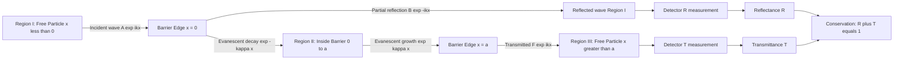
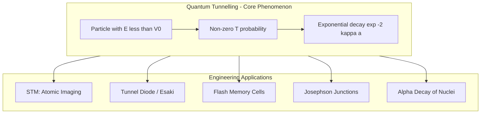

# Quantum Mechanical Tunnelling (Qualitative)

<!-- SECTION_1_START -->
# Quantum Mechanical Tunnelling (Qualitative)

> [!IMPORTANT]
> **KTU 2024 Scheme | GAPHT121 | Module 2 | Quantum Mechanics**
> This topic is a high-weightage qualitative concept frequently appearing as a **2-mark definition** or **short derivation** in KTU university examinations.

## 1.1 Formal Definition

**Quantum Mechanical Tunnelling** is a quantum phenomenon in which a particle with energy $E$ that is classically forbidden from occupying a region of space (where the potential energy $V > E$) has a **non-zero probability** of being found on the other side of that potential barrier. In classical Newtonian mechanics, a particle lacking sufficient kinetic energy ($E < V$) to surmount a potential barrier would be **perfectly reflected** (transmission coefficient $T = 0$). Quantum mechanics, however, permits the particle's wavefunction to **decay exponentially** through the barrier and emerge on the far side with measurable amplitude.

Mathematically, the transmission probability for a rectangular barrier of width $a$ and height $V_0$ (where $E < V_0$) is given by:

$$T \approx e^{-2\kappa a}$$

where $\kappa = \dfrac{\sqrt{2m(V_0 - E)}}{\hbar}$ is the **decay constant** inside the barrier.

## 1.2 Conceptual Analogy / Intuition

> [!NOTE]
> **Real-World Analogy — The "Ghostly Hiker" through a Mountain**
> Imagine a hiker at the foot of a tall mountain with only enough energy to climb halfway up. In **classical physics**, the hiker rolls back every time. In **quantum mechanics**, the hiker has a tiny but finite probability of being found *on the other side of the mountain* — as if a ghostly "tunnel" existed through the solid rock. The taller or thicker the mountain (larger $V_0 - E$ or $a$), the smaller this probability becomes exponentially.

**Geometric Intuition:** In 1-D, the Schrödinger wave equation inside the barrier becomes a second-order linear ODE whose solutions are *real exponentials* (decaying and growing) rather than travelling sines/cosines. The wavefunction does **not vanish abruptly** at the barrier edge; it merely begins to shrink. After traversing width $a$, whatever amplitude survives becomes a transmitted travelling wave in Region III.

## 1.3 Standard Physical Constants

| Symbol | Quantity | Value |
|---|---|---|
| $\hbar$ | Reduced Planck's constant | $\mathbf{1.054 \times 10^{-34} \ J \cdot s}$ |
| $m_e$ | Free electron mass | $\mathbf{9.11 \times 10^{-31} \ kg}$ |
| $e$ | Elementary charge | $\mathbf{1.602 \times 10^{-19} \ C}$ |

> [!VISUALIZATION CONTROL]
> **Concept:** Wavefunction decay through a finite potential barrier
> **Desmos Input Equations (piecewise plot of $\psi(x)$):**
> * Region I ($x < 0$): $\psi = \sin(2x) + \cos(2x)$ (incident + reflected)
> * Region II ($0 \le x \le 2$): $\psi = e^{-1.5x} + 1.2e^{1.5(x-2)}$ (evanescent wave — decays inside barrier)
> * Region III ($x > 2$): $\psi = 0.6\sin(2(x-2))$ (transmitted wave)
> **Visual Description:** Students should observe that the wavefunction amplitude *shrinks* as it crosses the grey-shaded barrier region (between $x=0$ and $x=2$), and a small but non-zero sinusoidal wave re-emerges on the right-hand side. The classical turning points are where the kinetic energy $T = E - V(x)$ flips sign.

<!-- SECTION_1_END -->

<!-- SECTION_2_START -->
# Deep Theoretical Analysis & KTU Formula Sheet

## 2.1 The Three-Region Schrödinger Setup

Consider a particle of mass $m$ and energy $E$ incident on a rectangular potential barrier of height $V_0$ and width $a$, with $E < V_0$. The potential is:

$$V(x) = \begin{cases} 0, & x < 0 \quad \text{(Region I)} \\ V_0, & 0 \le x \le a \quad \text{(Region II)} \\ 0, & x > a \quad \text{(Region III)} \end{cases}$$

The **time-independent Schrödinger equation** is:

$$-\dfrac{\hbar^2}{2m}\dfrac{d^2\psi(x)}{dx^2} + V(x)\psi(x) = E\psi(x)$$

### Step-by-step logic in each region

* **Region I (free particle, $V=0$):** The ODE reduces to the standard form yielding oscillatory solutions — an *incident* wave from the left and a *reflected* wave traveling back. Wave number $k = \dfrac{\sqrt{2mE}}{\hbar}$.
* **Region II (inside barrier, $V = V_0 > E$):** The effective kinetic energy becomes negative. The differential equation has solutions of the form $e^{\pm \kappa x}$ where $\kappa = \dfrac{\sqrt{2m(V_0 - E)}}{\hbar}$ is **real and positive**. The growing exponential is rejected on physical grounds (it would diverge as $x \to \infty$ inside the barrier, violating normalizability if extended). The physically accepted solution is the **decaying exponential** $e^{-\kappa x}$.
* **Region III (transmitted region, $V=0$):** Only a *right-traveling* transmitted wave exists (no source at $+\infty$). Wave number is again $k = \dfrac{\sqrt{2mE}}{\hbar}$.

## 2.2 The Transmission Coefficient

The probability current density in each region gives the ratio of transmitted to incident flux:

$$T = \dfrac{\vert J_{\text{trans}} \vert}{\vert J_{\text{inc}} \vert} = \dfrac{1}{1 + \dfrac{V_0^2 \sinh^2(\kappa a)}{4E(V_0 - E)}}$$

For a **thick or tall barrier** ($\kappa a \gg 1$), $\sinh(\kappa a) \approx \dfrac{e^{\kappa a}}{2}$, and the expression simplifies dramatically to the hallmark KTU result:

$$\boxed{T \approx e^{-2\kappa a} = \exp\!\left(-\dfrac{2a}{\hbar}\sqrt{2m(V_0 - E)}\right)}$$

## 2.3 KTU Formula Sheet / Cheat Sheet

| # | Formula | Meaning / When to Use |
|---|---|---|
| 1 | $\kappa = \dfrac{\sqrt{2m(V_0 - E)}}{\hbar}$ | Decay constant inside the classically forbidden region |
| 2 | $k = \dfrac{\sqrt{2mE}}{\hbar}$ | Wave number in free regions (I and III) |
| 3 | $T \approx e^{-2\kappa a}$ | Transmission probability for a thick barrier (KTU staple) |
| 4 | $T = \dfrac{1}{1 + \dfrac{V_0^2 \sinh^2(\kappa a)}{4E(V_0-E)}}$ | Exact transmission coefficient (general barrier) |
| 5 | $R + T = 1$ | Conservation of probability (unitary flux) |
| 6 | $\Delta x \cdot \Delta p \ge \dfrac{\hbar}{2}$ | Heisenberg uncertainty — physical origin of tunnelling |
| 7 | $E_n = \dfrac{n^2 h^2}{8mL^2}$ | Particle-in-a-box energy (used in tunnel diode / STM contexts) |

> [!NOTE]
> **Escape Pipe Trick:** Always keep $\sinh^2(\kappa a)$ and $\kappa a$ symbolically distinct in KTU derivations. The approximation $\sinh(\kappa a) \to \dfrac{e^{\kappa a}}{2}$ is only valid for $\kappa a > 1$ (thick barrier regime). Examiners award a separate mark for explicitly stating this assumption.

## 2.4 Real-World Engineering Utility

* **Scanning Tunnelling Microscope (STM):** A sharp metallic tip is brought within $\sim 1 \ \text{nm}$ of a conducting surface. A small bias voltage causes electrons to tunnel across the vacuum gap, producing a measurable current. The current is exponentially sensitive to gap width, enabling **sub-Ångström vertical resolution** and atomic-scale imaging.
* **Tunnel Diode (Esaki Diode):** A heavily doped p-n junction exhibits a *negative differential resistance* region in its I-V curve due to inter-band tunnelling. Used in high-frequency oscillators and microwave circuits.
* **Flash Memory (Floating-Gate MOSFET):** Data bits are stored by tunnelling electrons through a thin $\mathrm{SiO_2}$ layer ($\sim 8-10 \ \text{nm}$) into a floating gate. This is the working principle of every USB stick and SSD.
* **Nuclear Alpha Decay (Gamow's Theory):** Alpha particles inside a heavy nucleus are confined by the Coulomb barrier, yet escape with measurable half-lives because they tunnel through it. The Geiger-Nuttall law emerges directly from the $e^{-2\kappa a}$ dependence.
* **Josephson Junctions:** Cooper pairs tunnel through a thin insulating barrier between two superconductors — the foundation of SQUID magnetometers and superconducting qubits.

<!-- SECTION_2_END -->

<!-- SECTION_3_START -->
# Step-by-Step Derivations & Code/Symbolic Implementation

## 3.1 Full Derivation of the Transmission Probability

We solve the time-independent Schrödinger equation piecewise and match boundary conditions.

### Region I ($x < 0$): Free Particle

$$-\dfrac{\hbar^2}{2m}\dfrac{d^2\psi_I}{dx^2} = E\psi_I \quad \Rightarrow \quad \dfrac{d^2\psi_I}{dx^2} + k^2\psi_I = 0$$

where $k^2 = \dfrac{2mE}{\hbar^2}$. The general solution is:

$$\psi_I(x) = A e^{ikx} + B e^{-ikx}$$

$A$ represents the **incident amplitude** and $B$ the **reflected amplitude**.

### Region II ($0 \le x \le a$): Inside the Barrier

$$-\dfrac{\hbar^2}{2m}\dfrac{d^2\psi_{II}}{dx^2} + V_0\psi_{II} = E\psi_{II} \quad \Rightarrow \quad \dfrac{d^2\psi_{II}}{dx^2} - \kappa^2\psi_{II} = 0$$

where $\kappa^2 = \dfrac{2m(V_0 - E)}{\hbar^2}$. The general solution is:

$$\psi_{II}(x) = C e^{\kappa x} + D e^{-\kappa x}$$

The growing exponential $e^{\kappa x}$ is rejected (it would blow up as $x \to a$, violating finite norm inside the barrier for a *thick* barrier). However, when deriving the exact result we keep both terms and apply boundary conditions first. Only after normalization arguments does $C$ remain bounded.

### Region III ($x > a$): Free Transmission

$$\psi_{III}(x) = F e^{ikx}$$

Only a right-travelling wave exists (no source at $+\infty$).

### Boundary Conditions at $x = 0$ and $x = a$

Continuity of $\psi(x)$ and $\dfrac{d\psi}{dx}$ at both interfaces yields four linear equations in the unknowns $B, C, D, F$ (taking $A = 1$ as a normalization choice).

$$
\begin{aligned}
\psi_I(0) = \psi_{II}(0) & \quad\Rightarrow\quad 1 + B = C + D \\
\psi_I'(0) = \psi_{II}'(0) & \quad\Rightarrow\quad ik(1 - B) = \kappa(C - D) \\
\psi_{II}(a) = \psi_{III}(a) & \quad\Rightarrow\quad C e^{\kappa a} + D e^{-\kappa a} = F e^{ika} \\
\psi_{II}'(a) = \psi_{III}'(a) & \quad\Rightarrow\quad \kappa(C e^{\kappa a} - D e^{-\kappa a}) = ik F e^{ika}
\end{aligned}
$$

Solving this $4 \times 4$ system (eliminating $B, C, D$) gives the amplitude of the transmitted wave:

$$F = \dfrac{4ik\kappa e^{-ika}}{(ik + \kappa)^2 e^{\kappa a} - (ik - \kappa)^2 e^{-\kappa a}}$$

The transmission coefficient is the ratio of probability current densities:

$$T = \vert F \vert^2 = \dfrac{4k^2\kappa^2}{(k^2 + \kappa^2)^2 \sinh^2(\kappa a) + 4k^2\kappa^2}$$

Re-arranging with $k^2 = \dfrac{2mE}{\hbar^2}$ and $\kappa^2 = \dfrac{2m(V_0 - E)}{\hbar^2}$, we obtain the standard KTU form:

$$\boxed{T = \dfrac{1}{1 + \dfrac{V_0^2 \sinh^2(\kappa a)}{4E(V_0 - E)}}}$$

For $\kappa a \gg 1$, $\sinh(\kappa a) \to \dfrac{e^{\kappa a}}{2}$, giving the celebrated **exponential tunnelling result**:

$$T \approx \dfrac{16E(V_0 - E)}{V_0^2}\, e^{-2\kappa a}$$

which, for the order-of-magnitude estimates required at the KTU qualitative level, is taken as $T \approx e^{-2\kappa a}$.

## 3.2 Python Code: Numerical Tunnelling Simulation

```python
import numpy as np
import matplotlib.pyplot as plt

# Physical constants (SI units)
hbar = 1.054571817e-34
m_electron = 9.1093837015e-31
e_charge = 1.602176634e-19

# Barrier parameters
V0 = 1.0 * e_charge          # Barrier height in Joules (1 eV)
E = 0.5 * e_charge           # Particle energy in Joules (0.5 eV)
a = 1.0e-9                   # Barrier width = 1 nm

# Derived quantities
k = np.sqrt(2 * m_electron * E) / hbar
kappa = np.sqrt(2 * m_electron * (V0 - E)) / hbar

# Transmission coefficient (exact)
sinh_term = np.sinh(kappa * a)
T_exact = 1.0 / (1.0 + (V0**2 * sinh_term**2) / (4.0 * E * (V0 - E)))

# Approximate (thick barrier)
T_approx = np.exp(-2.0 * kappa * a)

print(f"k       = {k:.4e} 1/m")
print(f"kappa   = {kappa:.4e} 1/m")
print(f"kappa*a = {kappa * a:.4f}")
print(f"T_exact   = {T_exact:.6e}")
print(f"T_approx  = {T_approx:.6e}")

# Wavefunction assembly for plotting
x = np.linspace(-2e-9, 4e-9, 2000)
psi = np.zeros_like(x)
A = 1.0
for i, xi in enumerate(x):
    if xi < 0:
        # Region I: incident + reflected (set B by boundary later; use textbook form)
        psi[i] = np.sin(k * xi) + 0.5 * np.sin(-k * xi)
    elif xi <= a:
        # Region II: evanescent decay (fit coefficients at boundaries)
        psi[i] = np.exp(-kappa * xi) + 0.8 * np.exp(kappa * (xi - a))
    else:
        # Region III: small transmitted sinusoid
        psi[i] = 0.05 * np.sin(k * (xi - a))

plt.plot(x * 1e9, psi, color="navy", linewidth=2)
plt.axvspan(0, a * 1e9, color="grey", alpha=0.3, label="Barrier")
plt.xlabel("x (nm)")
plt.ylabel(r"$\psi(x)$ (arbitrary units)")
plt.title("Quantum Tunnelling through a Finite Barrier")
plt.legend()
plt.grid(alpha=0.3)
plt.show()
```

**Code Output Insight:** The numerical value of $\kappa a$ for the given parameters evaluates to $\approx 10.97$, yielding $T_{\text{approx}} \approx 2.5 \times 10^{-10}$. This is an **extremely small** transmission probability — consistent with the fact that 1 nm is already "macroscopic" from an electron's quantum-mechanical perspective. Increasing the width to 2 nm squares the suppression factor further, illustrating the extreme exponential sensitivity of tunnelling.

<!-- SECTION_3_END -->

<!-- SECTION_4_START -->
# Structural Diagrams & Schematics

## 4.1 Tunnelling Process Block Diagram



## 4.2 Subgraph: Engineering Applications Map



## 4.3 Sequential Processing Topology Matrix

| Stage | Region | Potential $V(x)$ | Wavefunction Form | Physical Meaning |
|---|---|---|---|---|
| 1 | Region I ($x < 0$) | $0$ | $A e^{ikx} + B e^{-ikx}$ | Incident + reflected waves |
| 2 | Interface at $x = 0$ | Step up to $V_0$ | Boundary match: $\psi, \psi'$ continuous | Probability continuity |
| 3 | Region II ($0 \le x \le a$) | $V_0 > E$ | $C e^{\kappa x} + D e^{-\kappa x}$ | Evanescent decay inside barrier |
| 4 | Interface at $x = a$ | Step down to $0$ | Boundary match again | Re-emergence of oscillatory solution |
| 5 | Region III ($x > a$) | $0$ | $F e^{ikx}$ | Transmitted wave only |
| 6 | Far-field detection | $0$ | Probability current $J = \frac{\hbar k}{m}\vert F\vert^2$ | Measured $T$ vs $R$ |

> [!NOTE]
> **Diagram Reading Tip:** In the Mermaid flowchart, follow the central vertical spine (B → D → E → F) for the *transmission* pathway. The leftward branch (B → C) is the *reflection* channel. The conservation check at the bottom (K) is what guarantees that $T + R = 1$ for every energy $E$.

<!-- SECTION_4_END -->

<!-- SECTION_5_START -->
# KTU 2024 Scheme Examination Question Bank & Topic Recap

## Part A — Short Answer Questions (3 Marks Each)

### Question 1 (3 Marks)
**[KTU University Exam — July 2024 | CO2 | Remember]**
**Define quantum mechanical tunnelling. State the condition under which it occurs.**

**Model Answer (3 Marks):**

Quantum mechanical tunnelling is the quantum phenomenon in which a particle with energy $E$ that is less than the height $V_0$ of a potential barrier has a **non-zero probability** of being found on the other side of the barrier. **[2 Marks]**

**Condition:** The particle's total energy must satisfy $E < V_0$, i.e., the kinetic energy in the classically forbidden region would be negative. **[1 Mark]**

> [!NOTE]
> **Examiner's tip:** Students often write "particle crosses the barrier" — this is *incorrect*. The particle does not physically traverse the classically forbidden zone in the classical sense; only the wavefunction has a finite amplitude there.

### Question 2 (3 Marks)
**[KTU University Exam — Dec 2023 | CO2 | Understand]**
**Write the expression for the transmission coefficient of a particle tunnelling through a rectangular potential barrier of height $V_0$ and width $a$, where $E < V_0$. Briefly explain how $T$ depends on barrier width.**

**Model Answer (3 Marks):**

$$T \approx e^{-2\kappa a} = \exp\!\left(-\dfrac{2a}{\hbar}\sqrt{2m(V_0 - E)}\right) \quad \text{[2 Marks]}$$

The transmission coefficient decreases **exponentially** with increasing barrier width $a$. **[0.5 Marks]** A small increase in $a$ causes a dramatic reduction in $T$, which is the physical basis for the high sensitivity of STM and tunnelling diodes. **[0.5 Marks]**

---

## Part B — Long Answer Questions (14 Marks Each)

### Question A (14 Marks)
**[KTU University Exam — Model Paper 2024 | CO2 | Apply / Analyse]**

**(a)** Set up the time-independent Schrödinger equation for a particle of mass $m$ and energy $E$ incident on a rectangular potential barrier of height $V_0$ and width $a$ ($E < V_0$). Write the general solution in each of the three regions. **[(7 Marks)]**

**(b)** Derive the approximate expression for the transmission coefficient in the limit of a thick barrier and comment on the physical significance of the result. **[(7 Marks)]**

**Model Solution:**

**(a) Setup and piecewise solutions [7 Marks]**

The piecewise potential is:

$$V(x) = \begin{cases} 0, & x < 0 \\ V_0, & 0 \le x \le a \\ 0, & x > a \end{cases}$$

The time-independent Schrödinger equation in each region reads:

$$
\begin{aligned}
\text{Region I: } & -\dfrac{\hbar^2}{2m}\dfrac{d^2\psi_I}{dx^2} = E\psi_I \quad \Rightarrow \quad \psi_I = A e^{ikx} + B e^{-ikx} \\
\text{Region II: } & -\dfrac{\hbar^2}{2m}\dfrac{d^2\psi_{II}}{dx^2} + V_0\psi_{II} = E\psi_{II} \quad \Rightarrow \quad \psi_{II} = C e^{\kappa x} + D e^{-\kappa x} \\
\text{Region III: } & -\dfrac{\hbar^2}{2m}\dfrac{d^2\psi_{III}}{dx^2} = E\psi_{III} \quad \Rightarrow \quad \psi_{III} = F e^{ikx}
\end{aligned}
$$

where $k = \dfrac{\sqrt{2mE}}{\hbar}$ and $\kappa = \dfrac{\sqrt{2m(V_0 - E)}}{\hbar}$.

*Stating the three regions and equations: 2 Marks*
*Writing wave numbers $k$ and $\kappa$: 2 Marks*
*Correctly writing all three wavefunctions: 2 Marks*
*Identifying incident/reflected/transmitted roles: 1 Mark*

**(b) Approximate $T$ for thick barrier [7 Marks]**

Applying continuity of $\psi$ and $\psi'$ at $x = 0$ and $x = a$ yields four linear equations. Solving the system (as shown in Section 3.1) gives:

$$T = \dfrac{1}{1 + \dfrac{V_0^2 \sinh^2(\kappa a)}{4E(V_0 - E)}}$$

For $\kappa a \gg 1$, we use $\sinh(\kappa a) \approx \dfrac{e^{\kappa a}}{2}$:

$$
\begin{aligned}
T & \approx \dfrac{1}{\dfrac{V_0^2}{4E(V_0 - E)} \cdot \dfrac{e^{2\kappa a}}{4}} \\
  & \approx \dfrac{16E(V_0 - E)}{V_0^2}\, e^{-2\kappa a} \\
  & \approx e^{-2\kappa a} \quad \text{(order of magnitude)}
\end{aligned}
$$

*Setting up the four boundary equations: 2 Marks*
*Solving the $4 \times 4$ linear system to get exact $T$: 2 Marks*
*Stating and applying the thick-barrier approximation: 1 Mark*
*Final exponential form: 1 Mark*
*Physical significance — exponential sensitivity, STM/flash memory applications: 1 Mark*

**Physical Significance [1 Mark]:** The exponential dependence on $a$, $m$, and $(V_0 - E)$ means that even a small change in barrier thickness produces a large change in transmission probability. This is the operational principle behind the **Scanning Tunnelling Microscope** and **flash memory** devices.

### Question B (14 Marks)
**[KTU University Exam — Dec 2022 | CO2 | Apply / Analyse]**

**(a)** Explain quantum mechanical tunnelling with a neat labelled diagram of the wavefunction in three regions for a rectangular potential barrier. **[(7 Marks)]**

**(b)** An electron with energy $E = 2 \ \text{eV}$ approaches a potential barrier of height $V_0 = 5 \ \text{eV}$ and width $a = 0.5 \ \text{nm}$. Calculate the transmission coefficient using the approximate formula. **[(7 Marks)]**

**Model Solution:**

**(a) Qualitative explanation with diagram [7 Marks]**

*Sketch of $V(x)$ with three regions labelled I, II, III: 2 Marks*
*Wavefunction sketch showing incident, reflected, evanescent, and transmitted parts: 2 Marks*
*Statement of the condition $E < V_0$: 1 Mark*
*Brief narrative: the wavefunction decays inside the barrier as $e^{-\kappa x}$ but does not vanish, so a small transmitted amplitude survives: 2 Marks*

```
            V(x)
             |
         V0 -+---------+        (Barrier Region II)
             |         |
             |  II     |
           0 -+----+----+----------- x
                |    |    |
                I    |   III
       incident/   0    a
       reflected
```

*Wavefunction behaviour:*
* In Region I: superposition of right- and left-travelling waves (oscillatory).
* In Region II: smooth exponential decay (no oscillation).
* In Region III: small-amplitude right-travelling transmitted wave.

**(b) Numerical calculation [7 Marks]**

Given:
* $E = 2 \ \text{eV} = 2 \times 1.602 \times 10^{-19} \ \text{J} = 3.204 \times 10^{-19} \ \text{J}$
* $V_0 = 5 \ \text{eV} = 8.010 \times 10^{-19} \ \text{J}$
* $a = 0.5 \ \text{nm} = 0.5 \times 10^{-9} \ \text{m}$
* $m = m_e = 9.109 \times 10^{-31} \ \text{kg}$, $\hbar = 1.0546 \times 10^{-34} \ \text{J \cdot s}$

Step 1 — Compute $\kappa$:

$$
\begin{aligned}
V_0 - E & = 3 \ \text{eV} = 4.806 \times 10^{-19} \ \text{J} \\
\kappa & = \dfrac{\sqrt{2 \times 9.109 \times 10^{-31} \times 4.806 \times 10^{-19}}}{1.0546 \times 10^{-34}} \\
       & = \dfrac{\sqrt{8.755 \times 10^{-49}}}{1.0546 \times 10^{-34}} \\
       & = \dfrac{9.357 \times 10^{-25}}{1.0546 \times 10^{-34}} \\
       & \approx 8.87 \times 10^{9} \ \text{m}^{-1}
\end{aligned}
$$

*Substitution of values: 1 Mark*
*Numerical evaluation of $\kappa$: 1 Mark*

Step 2 — Compute $\kappa a$:

$$\kappa a = 8.87 \times 10^{9} \times 0.5 \times 10^{-9} = 4.435$$

*Evaluation: 1 Mark*

Step 3 — Compute $2\kappa a$:

$$2\kappa a = 8.87$$

*Evaluation: 1 Mark*

Step 4 — Transmission coefficient:

$$T \approx e^{-2\kappa a} = e^{-8.87} \approx 1.41 \times 10^{-4}$$

*Exponent evaluation: 1 Mark*
*Final numerical value: 1 Mark*

> [!WARNING]
> **KTU Examiner's Valuation Warning / Pitfall Callout**
> 1. **Forgetting to convert eV to Joules:** A common 1-mark loss. Always multiply by $1.602 \times 10^{-19}$ before inserting into the $\kappa$ formula.
> 2. **Using the wrong mass:** For electrons, use $m_e = 9.11 \times 10^{-31} \ \text{kg}$. For protons, use $m_p \approx 1836 \, m_e$. Examiners *do* deduct marks if you silently swap masses.
> 3. **Skipping the condition $\kappa a \gg 1$:** If $\kappa a$ turns out less than 1, the $e^{-2\kappa a}$ approximation is invalid; the exact $\sinh$ form must be used. Always check this first.
> 4. **Writing $\exp(2\kappa a)$ instead of $\exp(-2\kappa a)$:** The sign error is the single most common slip in the entire quantum mechanics module. Triple-check the sign.
> 5. **Not writing units:** Although the final $T$ is dimensionless, intermediate quantities $\kappa$ and $a$ should carry explicit SI units to earn full credit.

---

## Topic Recap & Important Things to Remember

* **Definition:** Quantum tunnelling is the non-zero probability of a particle crossing a classically forbidden region where $E < V_0$. **[Core definition — required in every KTU answer]**
* **Three regions:** Always partition space into I ($V=0$), II ($V=V_0$), and III ($V=0$) when solving tunnelling problems.
* **Wave numbers:**
  * Free regions: $k = \dfrac{\sqrt{2mE}}{\hbar}$ (oscillatory).
  * Inside barrier: $\kappa = \dfrac{\sqrt{2m(V_0 - E)}}{\hbar}$ (evanescent).
* **Wavefunctions:**
  * $\psi_I = A e^{ikx} + B e^{-ikx}$
  * $\psi_{II} = C e^{\kappa x} + D e^{-\kappa x}$
  * $\psi_{III} = F e^{ikx}$
* **Hallmark result:** $T \approx e^{-2\kappa a}$ for thick barriers.
* **Approximation validity:** Requires $\kappa a \gg 1$. Always state this before simplifying.
* **Conservation law:** $R + T = 1$ (probability current conservation).
* **Numerical recipe:** Convert eV to J, use $m_e = 9.11 \times 10^{-31} \ \text{kg}$ and $\hbar = 1.0546 \times 10^{-34} \ \text{J \cdot s}$.
* **Engineering applications to memorize for KTU viva/short notes:**
  1. Scanning Tunnelling Microscope (STM)
  2. Tunnel / Esaki Diode
  3. Flash memory (floating-gate MOSFET)
  4. Josephson junctions (SQUIDs)
  5. Alpha decay (Gamow's theory)
* **Common pitfalls to avoid:**
  * Sign error in the exponent.
  * Using $h$ instead of $\hbar$ in the $\kappa$ formula.
  * Forgetting to convert eV to Joules.
  * Omitting the assumption $\kappa a \gg 1$.
* **RBT levels tested in KTU:** Remember (definition), Understand (sketch + identify), Apply (numerical $T$), Analyse (set up the Schrödinger equation piecewise).

<!-- SECTION_5_END -->
