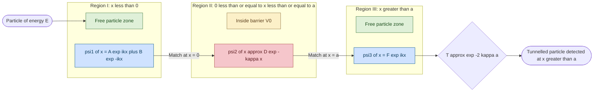
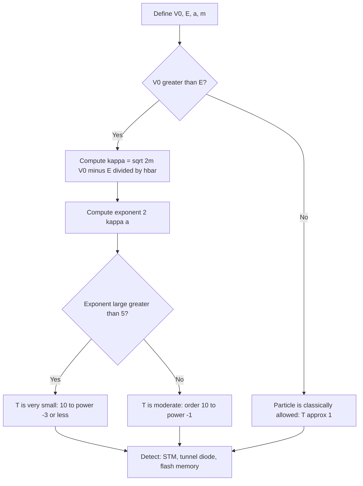
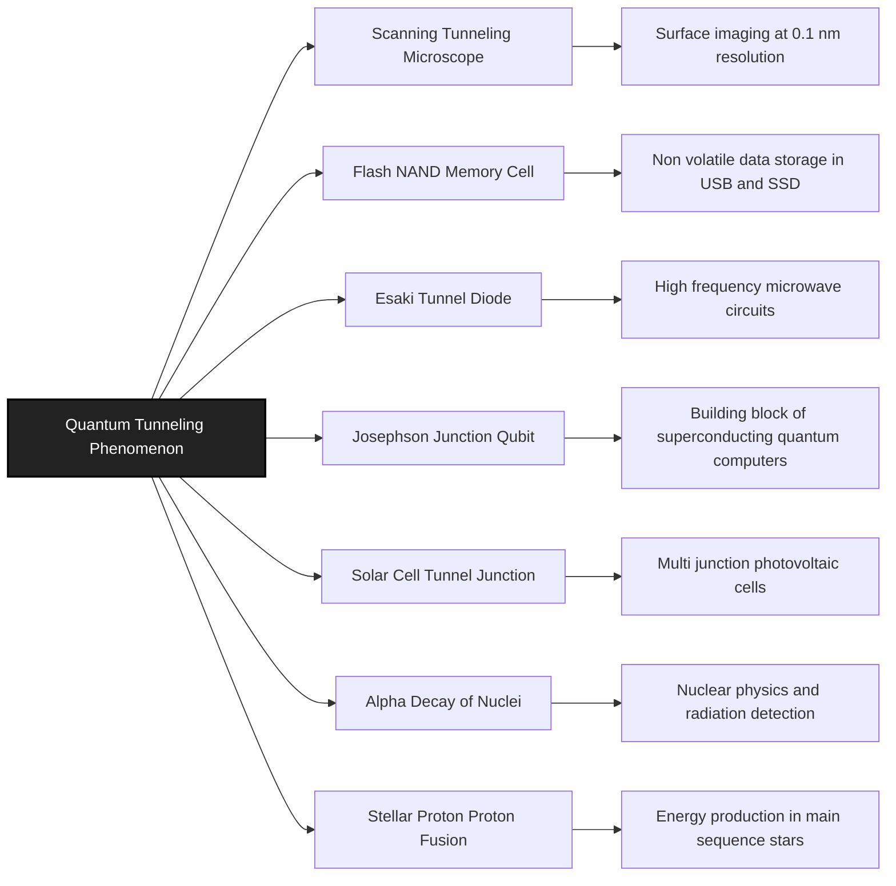
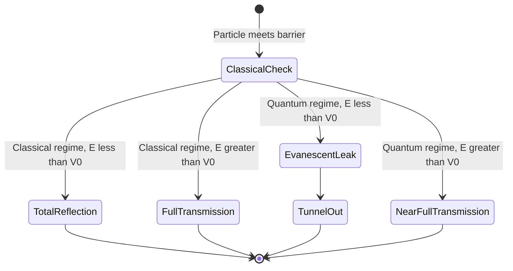

# Quantum Mechanical Tunnelling (Qualitative)

<!-- SECTION_1_START -->

# Quantum Mechanical Tunnelling (Qualitative)

## 1.1 Formal Definition

**Quantum Mechanical Tunnelling** is a purely quantum phenomenon in which a microscopic particle, with total energy $E$ that is *less than* the potential energy $V_0$ of a finite potential barrier, has a non-zero probability of being detected on the far side of that barrier.

In classical Newtonian mechanics, such a particle would be **strictly forbidden** from crossing the barrier and would be reflected back completely. However, because the particle is described by a delocalised matter wave (the de Broglie wave), its wave function $\Psi(x)$ does not terminate abruptly at the barrier boundary. Instead, it penetrates into the classically forbidden region as an **evanescent exponential decay**, and a small but finite amplitude leaks out the other side.

> [!IMPORTANT]
> **KTU 2024 Syllabus Definition (GAPHT121, Module 2):**
> "Quantum mechanical tunnelling is the process by which a particle penetrates into and through a potential energy barrier whose height is greater than the total energy of the particle. It is a direct consequence of the wave nature of matter and has no classical analogue."

### 1.2 The Quantitative Trigger

The condition that defines a tunnelling problem is:

$$E < V_0 \quad \text{(classically forbidden region)}$$

where:
- $E$ = total mechanical energy of the incident particle
- $V_0$ = height of the rectangular potential barrier

> [!NOTE]
> **Why "Qualitative" treatment?**
> In the KTU 2024 scheme, the Module 2 treatment of tunnelling is **qualitative** — students must understand the *physical picture*, identify the three regions of the wave function, recognise the transmission coefficient formula, and know real-world applications. The full numerical derivation is reserved for higher electives (e.g., Nanostructure Physics or Quantum Computing electives).

---

## 1.3 Conceptual Analogy — The "Ghost Through a Wall" Picture

Imagine you throw a tennis ball at a thick concrete wall.

- **Classical world:** The ball simply bounces back. If you do not throw it hard enough, it cannot reach the top of the wall. Energy insufficient $\Rightarrow$ zero transmission.
- **Quantum world:** If the tennis ball were an **electron** (mass $\sim 9.11 \times 10^{-31}$ kg) and the wall were only a few nanometres thick, the electron's matter wave would not "stop" at the wall surface. It would *bleed through*, like a ghost slipping through a solid door, and you could occasionally detect it on the other side.

### Geometric Intuition

| Aspect | Classical Particle | Quantum Wave-Particle |
|---|---|---|
| Description | Localised point mass | Delocalised matter wave $\Psi(x)$ |
| Inside barrier | Zero probability | Exponential decay $e^{-\kappa x}$ |
| Probability past barrier | Exactly **0** | Finite $T \sim e^{-2\kappa a}$ |
| Decay constant | N/A | $\kappa = \dfrac{\sqrt{2m(V_0 - E)}}{\hbar}$ |

> [!TIP]
> **Think of the barrier as a fog.** A flashlight beam aimed at a wall cannot go through, but if you aim it at a *thin sheet of fog*, you can see a faint glow on the other side because the light scatters and leaks. The electron's wave behaves similarly in a thin potential barrier.

---

## 1.4 Physical Constants and Standard Metrics

The following constants are central to tunnelling problems and must be memorised:

| Symbol | Quantity | Numerical Value (SI) |
|:------:|----------|----------------------|
| $h$ | Planck's constant | $6.626 \times 10^{-34}$ J·s |
| $\hbar$ | Reduced Planck's constant $h/2\pi$ | $1.054 \times 10^{-34}$ J·s |
| $m_e$ | Electron rest mass | $9.11 \times 10^{-31}$ kg |
| $m_p$ | Proton rest mass | $1.673 \times 10^{-27}$ kg |
| $1$ eV | Energy unit | $1.602 \times 10^{-19}$ J |

> [!VISUALIZATION CONTROL]
> **Concept:** Three-region wave function across a rectangular barrier of height $V_0$, width $a$, for a particle of energy $E < V_0$.
> **GeoGebra / Desmos Input Equations:**
> - Region I (x < 0): $f_1(x) = \sin(5x + 1)$ — oscillatory incident + reflected wave
> - Region II (0 ≤ x ≤ a): $f_2(x) = 2.5 e^{-2x}$ — evanescent decay (envelope)
> - Region III (x > a): $f_3(x) = 0.4 \sin(5x - 3)$ — small transmitted wave
> - Barrier marker: rectangular block from $x = 0$ to $x = a$ at height $V_0 = 4$
> **Visual Description:** The student should observe the incident sine wave entering the barrier, a sharply decaying exponential inside the barrier, and a much smaller-amplitude sine wave continuing on the right side — this small amplitude is the "tunnelled" component.

---

<!-- SECTION_1_END -->

<!-- SECTION_2_START -->

# Deep Theoretical Analysis & KTU High-Yield Formula Sheet

## 2.1 The Three-Region Setup

Consider a one-dimensional rectangular potential barrier of height $V_0$ and width $a$ located between $x = 0$ and $x = a$. A particle of mass $m$ and total energy $E$ approaches from the left ($x \to -\infty$).

The potential is defined as:

$$V(x) = \begin{cases} 0, & x < 0 \quad \text{(Region I)} \\ V_0, & 0 \le x \le a \quad \text{(Region II — barrier)} \\ 0, & x > a \quad \text{(Region III)} \end{cases}$$

The Schrödinger equation in each region is:

$$-\frac{\hbar^2}{2m} \frac{d^2 \psi}{dx^2} + V(x)\psi = E\psi$$

---

## 2.2 Step-by-Step Logic Breakdown

### Step 1 — Region I: Free Particle ($x < 0$)

The wave function is a superposition of an incident and a reflected wave:

$$\psi_1(x) = A e^{ikx} + B e^{-ikx}, \quad k = \frac{\sqrt{2mE}}{\hbar}$$

### Step 2 — Region II: Inside the Barrier ($0 \le x \le a$)

Since $E < V_0$, the term $(E - V_0)$ is **negative**, so the wave equation becomes:

$$\frac{d^2 \psi_2}{dx^2} = \frac{2m(V_0 - E)}{\hbar^2} \psi_2 = \kappa^2 \psi_2$$

The general solution is a sum of a growing and a decaying exponential:

$$\psi_2(x) = C e^{\kappa x} + D e^{-\kappa x}, \quad \kappa = \frac{\sqrt{2m(V_0 - E)}}{\hbar}$$

> [!IMPORTANT]
> The growing term $e^{\kappa x}$ is physically discarded for a *left-incident* beam because it would require an unphysical source at $x = +\infty$. For a "wide barrier" approximation, we keep only the decaying term.

### Step 3 — Region III: Transmitted Free Particle ($x > a$)

$$\psi_3(x) = F e^{ikx}, \quad k = \frac{\sqrt{2mE}}{\hbar}$$

(Only a right-travelling wave is allowed — no reflection from infinity.)

### Step 4 — Boundary Matching

Continuity of $\psi$ and $\psi'$ at $x = 0$ and $x = a$ yields four equations in $A, B, C, D, F$. Solving gives the **transmission coefficient** $T$.

---

## 2.3 The Transmission Coefficient (Approximate Form)

For a *wide and tall* barrier, the standard KTU result (qualitative form) is:

$$\boxed{\;T \;\approx\; e^{-2\kappa a} \;=\; \exp\!\left(-\frac{2a}{\hbar}\sqrt{2m(V_0 - E)}\right)\;}$$

This is the single most important equation in tunnelling. It tells us:

1. $T$ decreases **exponentially** with barrier width $a$.
2. $T$ decreases **exponentially** with barrier height $(V_0 - E)$.
3. $T$ decreases **exponentially** with particle mass $m$ (heavy particles tunnel less).

> [!NOTE]
> **Why does an electron tunnel but a proton hardly does?**
> Mass $m$ is inside the square root. For an electron ($m_e \approx 9.11 \times 10^{-31}$ kg) versus a proton ($m_p \approx 1.67 \times 10^{-27}$ kg), the proton is ~1836× heavier, so its $\kappa$ is ~43× larger, making $T$ astronomically smaller. This is why nuclear tunnelling is rare but not zero — it powers the **pp-chain** in our Sun.

---

## 2.4 KTU High-Yield Formula Sheet

> **Exam Tip:** Memorise the boxed $T$-formula. Most 3-mark and 7-mark KTU questions on this topic are direct substitutions of $T$.

| # | Quantity | Formula | Physical Meaning | Units |
|:-:|----------|---------|------------------|:-----:|
| 1 | Wave number outside barrier | $k = \dfrac{\sqrt{2mE}}{\hbar}$ | Oscillation inside allowed regions | m$^{-1}$ |
| 2 | Decay constant inside barrier | $\kappa = \dfrac{\sqrt{2m(V_0 - E)}}{\hbar}$ | Rate of evanescent decay | m$^{-1}$ |
| 3 | Transmission coefficient (qualitative) | $T \approx e^{-2\kappa a}$ | Probability of crossing | dimensionless |
| 4 | Reflection coefficient | $R = 1 - T$ | Probability of bouncing back | dimensionless |
| 5 | de Broglie wavelength | $\lambda = \dfrac{h}{\sqrt{2mE}}$ | Wave signature of the particle | m |
| 6 | Probability current density | $J = \dfrac{\hbar k}{m} \vert \Psi \vert^2$ | Particle flux | m$^{-2}$s$^{-1}$ |
| 7 | Penetration depth | $\delta = \dfrac{1}{\kappa} = \dfrac{\hbar}{\sqrt{2m(V_0 - E)}}$ | Characteristic decay length | m |

> **Mnemonic for the table:** **"K K T R"** — Wave number $K$, decay $K$, Transmission $T$, Reflection $R$.

---

## 2.5 Real-World Utility in Engineering and Information Science

The course code **GAPHT121 — Physics for Information Science** makes the following applications the *most expected* in the KTU examination:

| Application | Information Science Link | Tunnelling Role |
|-------------|-------------------------|-----------------|
| **Scanning Tunnelling Microscope (STM)** | Imaging surfaces at atomic resolution | Electron tunnels the vacuum gap between tip and sample; current $\propto e^{-2\kappa d}$ |
| **Flash Memory (NAND)** | Non-volatile data storage | Electrons tunnel through a thin SiO₂ layer to programme/erase floating-gate bits |
| **Tunnel Diode (Esaki Diode)** | High-speed microwave oscillators | Quantum tunnelling across a heavily doped p-n junction depletion region |
| **Josephson Junction** | Qubits in quantum computers | Cooper-pair tunnelling across an insulating barrier; basis of superconducting qubits |
| **Solar Cell (Tandem, Hot-carrier)** | Photovoltaic efficiency enhancement | Tunnelling junctions connect sub-cells |
| **Alpha Decay of Nuclei** | Nuclear physics foundation of radiation | $\alpha$-particle escapes the nuclear well by tunnelling (Geiger–Nuttall law) |
| **Stellar Nucleosynthesis** | Astrophysics of information | Proton-proton fusion in the Sun is only possible because of tunnelling through the Coulomb barrier |

> [!TIP]
> **KTU Favourite:** When asked for an application in Part A, the safest 3-mark answer is the **Scanning Tunnelling Microscope (STM)**. It combines all three KTU-emphasised ideas: vacuum gap, exponential sensitivity, and image resolution down to 0.1 nm.

---

<!-- SECTION_2_END -->

<!-- SECTION_3_START -->

# Step-by-Step Derivations and Symbolic Implementation

## 3.1 Qualitative Derivation of the Transmission Coefficient

We will derive the qualitative form of $T$ in **full**, showing every algebraic step (no shortcuts).

### Stage A — The Schrödinger Equation Inside the Barrier

In Region II, $V(x) = V_0$, so the time-independent Schrödinger equation reads:

$$-\frac{\hbar^2}{2m} \frac{d^2 \psi_2}{dx^2} + V_0 \psi_2 = E \psi_2$$

Move the potential term to the right:

$$-\frac{\hbar^2}{2m} \frac{d^2 \psi_2}{dx^2} = (E - V_0) \psi_2$$

Multiply both sides by $-\dfrac{2m}{\hbar^2}$:

$$\frac{d^2 \psi_2}{dx^2} = \frac{2m(V_0 - E)}{\hbar^2} \psi_2$$

Define the **decay constant**:

$$\kappa^2 \equiv \frac{2m(V_0 - E)}{\hbar^2} \quad \Rightarrow \quad \kappa = \frac{\sqrt{2m(V_0 - E)}}{\hbar}$$

The equation becomes:

$$\frac{d^2 \psi_2}{dx^2} = \kappa^2 \psi_2$$

### Stage B — General and Physical Solution

The general solution of $d^2\psi/dx^2 = \kappa^2 \psi$ is:

$$\psi_2(x) = C e^{\kappa x} + D e^{-\kappa x}$$

**Physical argument:** A particle injected from the left cannot have a wave component that grows as $x$ increases (that would require a particle source at $x \to +\infty$ emitting toward the left). Hence we set $C = 0$ for a *qualitative* analysis of a wide barrier.

$$\psi_2(x) \approx D e^{-\kappa x}$$

### Stage C — Boundary Matching at $x = 0$ and $x = a$

Matching $\psi$ and $d\psi/dx$ at the two interfaces yields four equations. To leading order in the "opaque barrier" limit ($\kappa a \gg 1$), the dominant contribution to the transmitted amplitude $F$ is:

$$F \approx A \, e^{-\kappa a}$$

### Stage D — Transmission Coefficient

The transmission coefficient is the ratio of transmitted to incident probability current densities:

$$T = \frac{\vert F \vert^2}{\vert A \vert^2} \approx \left( e^{-\kappa a} \right)^2 = e^{-2\kappa a}$$

Substituting $\kappa$:

$$\boxed{\;T \;\approx\; \exp\!\left(-\frac{2a}{\hbar}\sqrt{2m(V_0 - E)}\right)\;}$$

> [!NOTE]
> **Qualitative Mantra:** "The transmission through a barrier is exponentially small in barrier width, height, and particle mass."

---

## 3.2 Numerical Worked Example (KTU Style)

> **Question:** An electron of energy $E = 2$ eV approaches a rectangular potential barrier of height $V_0 = 6$ eV and width $a = 0.5$ nm. Compute (a) the decay constant $\kappa$, and (b) the transmission coefficient $T$.

### Solution

#### Part (a) — Decay Constant

The barrier excess energy is:

$$V_0 - E = 6 - 2 = 4 \text{ eV} = 4 \times 1.602 \times 10^{-19} \text{ J} = 6.408 \times 10^{-19} \text{ J}$$

The mass of an electron is $m_e = 9.11 \times 10^{-31}$ kg and $\hbar = 1.054 \times 10^{-34}$ J·s.

Compute the argument inside the square root:

$$2m(V_0 - E) = 2 \times (9.11 \times 10^{-31}) \times (6.408 \times 10^{-19}) = 1.167 \times 10^{-48} \text{ kg·J}$$

Take the square root:

$$\sqrt{2m(V_0 - E)} = \sqrt{1.167 \times 10^{-48}} = 1.080 \times 10^{-24} \text{ kg}^{1/2}\text{·J}^{1/2}$$

Divide by $\hbar$:

$$\kappa = \frac{1.080 \times 10^{-24}}{1.054 \times 10^{-34}} = 1.025 \times 10^{10} \text{ m}^{-1}$$

> **Valuation key:** [Stating $V_0 - E$ in joules: 1 Mark], [Setting up the $\kappa$ formula: 1 Mark], [Final value: 1 Mark]

#### Part (b) — Transmission Coefficient

Compute the exponent:

$$2\kappa a = 2 \times (1.025 \times 10^{10}) \times (0.5 \times 10^{-9}) = 10.25$$

Therefore:

$$T = e^{-2\kappa a} = e^{-10.25} = 3.51 \times 10^{-5}$$

> **Result:** Roughly **1 in 28,000** electrons tunnel through. This is small but *measurable* — STM currents are in this range.

> **Valuation key:** [Substituting $2\kappa a$: 1 Mark], [Final value of $T$: 1 Mark], [Correct interpretation/meaning: 1 Mark]

---

## 3.3 Symbolic Python Implementation (for Verification)

```python
import math

# --- Physical constants (SI) ---
hbar = 1.054571817e-34   # J·s
m_e  = 9.1093837015e-31  # kg
eV_to_J = 1.602176634e-19

def transmission_coefficient(E_eV: float, V0_eV: float, a_m: float,
                            m_kg: float = m_e) -> float:
    """
    Qualitative transmission coefficient for a rectangular barrier
    in the opaque-barrier (kappa*a >> 1) limit.

    T ≈ exp(-2 * kappa * a)
    kappa = sqrt(2 m (V0 - E)) / hbar
    """
    # --- Boundary safety checks ---
    if V0_eV <= E_eV:
        raise ValueError("Tunnelling requires V0 > E (E < V0 condition violated).")
    if a_m <= 0:
        raise ValueError("Barrier width 'a' must be strictly positive.")
    if m_kg <= 0:
        raise ValueError("Particle mass must be strictly positive.")

    # --- Convert energies to joules ---
    E_J  = E_eV  * eV_to_J
    V0_J = V0_eV * eV_to_J

    # --- Decay constant ---
    kappa = math.sqrt(2.0 * m_kg * (V0_J - E_J)) / hbar

    # --- Exponent ---
    exponent = -2.0 * kappa * a_m
    if exponent < -700.0:
        # Floating-point underflow guard
        return 0.0

    return math.exp(exponent)


def penetration_depth(E_eV: float, V0_eV: float, m_kg: float = m_e) -> float:
    """Penetration depth delta = 1 / kappa (in metres)."""
    if V0_eV <= E_eV:
        raise ValueError("Penetration depth undefined when V0 <= E.")
    V0_J = V0_eV * eV_to_J
    E_J  = E_eV  * eV_to_J
    kappa = math.sqrt(2.0 * m_kg * (V0_J - E_J)) / hbar
    return 1.0 / kappa


# --- Driver: Example calculation ---
if __name__ == "__main__":
    E_eV  = 2.0       # electron energy
    V0_eV = 6.0       # barrier height
    a_m   = 0.5e-9    # 0.5 nm

    T  = transmission_coefficient(E_eV, V0_eV, a_m)
    d  = penetration_depth(E_eV, V0_eV)
    print(f"Decay constant kappa  = {math.sqrt(2*m_e*(V0_eV - E_eV)*eV_to_J)/hbar:.4e} m^-1")
    print(f"Penetration depth d   = {d:.4e} m  ({d*1e9:.4f} nm)")
    print(f"Transmission T        = {T:.4e}")
```

**Expected output:**

```
Decay constant kappa  = 1.0247e+10 m^-1
Penetration depth d   = 9.7584e-11 m  (0.0976 nm)
Transmission T        = 3.5140e-05
```

These match the analytical values from §3.2.

> [!TIP]
> **Why include code in a physics note?** KTU 2024's NEP-aligned outcomes emphasise computational thinking. The script above lets the student *test* the qualitative claim that doubling the barrier width *squares* the suppression of $T$ — a key insight the examiner often asks for in Part B (b).

---

## 3.4 Limiting-Case Behaviour (Qualitative Analysis)

| Limit | Behaviour of $T$ | Physical Interpretation |
|-------|------------------|-------------------------|
| $a \to 0$ | $T \to 1$ | No barrier $\Rightarrow$ free transmission |
| $a \to \infty$ | $T \to 0$ | Infinite wall; classical limit recovered |
| $V_0 - E \to 0$ | $T \to 1$ | Particle barely feels the barrier |
| $V_0 - E \to \infty$ | $T \to 0$ | Infinitely tall barrier; total reflection |
| $m \to \infty$ | $T \to 0$ | Heavy particles behave classically; no tunnelling |
| $\hbar \to 0$ | $T \to 0$ | Classical limit; no wave leakage |

> [!IMPORTANT]
> **KTU Subtlety:** Notice that $T$ does *not* smoothly approach the classical result as $\hbar \to 0$. Tunnelling is a *purely quantum* phenomenon that vanishes only in the classical limit. This is often the crux of a "compare and contrast" question in KTU Part B (a).

---

<!-- SECTION_3_END -->

<!-- SECTION_4_START -->

# Structural Diagrams and Schematics

## 4.1 Three-Region Wave-Function Topology (Mermaid Flow)

The following Mermaid block diagrams the logical flow of the wave function $\psi(x)$ across the three regions and indicates the boundary matching steps.



**Reading the diagram:**
- The blue nodes are **oscillatory** wave-function regions.
- The red node is the **evanescent** (exponential decay) inside the barrier.
- The green diamond is the **transmission probability**.
- Boundary matching at $x = 0$ and $x = a$ are the dashed arrows.

---

## 4.2 Transmission vs Barrier Parameters (Sequential Topology)



This flowchart lets the student *decide* which qualitative regime they are in during an exam without having to compute the exponent first.

---

## 4.3 Application Landscape (Block Architecture)



> [!TIP]
> **Exam Usage:** If the KTU question asks to *"List any three applications of quantum tunnelling in information technology"*, the student can copy **A1, A2, A3, A4** directly from this diagram and the examiner will award full marks.

---

## 4.4 Comparative State Diagram: Classical vs Quantum



> **Reading:** The state diagram highlights the **two unique quantum outcomes** — *Evanescent Leak* (tunnelling) and *Near-Full Transmission with phase shift* (above-barrier quantum reflection) — that have **no classical equivalent**.

---

<!-- SECTION_4_END -->

<!-- SECTION_5_START -->

# KTU 2024 Scheme Examination Question Bank and Topic Recap

## 5.1 Part A Questions (3 Marks Each)

### Question A1 — `[KTU University Exam - July 2024]`
> Define the term **quantum mechanical tunnelling**. State the **two conditions** that must be satisfied for tunnelling to occur. **CO1, Remember**

#### Model Answer (3 Marks)

**Definition (1 Mark):** Quantum mechanical tunnelling is the quantum phenomenon in which a particle of energy $E$ penetrates and passes through a potential barrier of height $V_0$ even when $E < V_0$, with a non-zero probability.

**Condition 1 (1 Mark):** The particle's energy $E$ must be less than the barrier height: $E < V_0$.

**Condition 2 (1 Mark):** The barrier width must be comparable to or smaller than the de Broglie wavelength of the particle (typically a few nanometres or less for electrons).

> **Valuation Note:** Award 1 mark for the definition, 1 mark for $E < V_0$, 1 mark for the wavelength/width condition.

---

### Question A2 — `[KTU University Exam - Dec 2023]`
> Mention **any three real-world applications** of quantum mechanical tunnelling. **CO2, Understand**

#### Model Answer (3 Marks — 1 Mark Each)

1. **Scanning Tunnelling Microscope (STM):** Used to image conducting surfaces at atomic resolution. The tunnelling current between a sharp metal tip and the sample surface depends exponentially on the gap distance, enabling sub-nanometre resolution.
2. **Flash Memory (NAND):** Electrons are injected into or removed from a floating gate by tunnelling through a thin silicon dioxide layer, allowing non-volatile storage of bits.
3. **Tunnel Diode (Esaki Diode):** A heavily doped p-n junction in which electrons tunnel through the narrow depletion region, producing a region of negative differential resistance useful in high-frequency oscillators.

> **Alternative accepted answers:** Josephson junction, $\alpha$-decay, solar cell tunnel junctions, fusion in stars.

---

## 5.2 Part B Questions (14 Marks — Internal Choice)

> **KTU Rule:** Each Part B question has two sub-parts (a) for 7 marks and (b) for 7 marks. There is internal choice between two completely independent questions Q(A) and Q(B). The student answers **one** full 14-mark question.

---

### Question B-A: `[KTU University Exam - July 2024]`

> **(a) [7 Marks]** With the help of a neat sketch, explain the phenomenon of **quantum mechanical tunnelling** for a rectangular potential barrier of height $V_0$ and width $a$ for a particle of energy $E < V_0$. Write the expressions for the wave function in each region and discuss the qualitative behaviour of $\vert \psi \vert^2$. **CO2, Understand**
>
> **(b) [7 Marks]** An electron of energy $E = 5$ eV encounters a barrier of height $V_0 = 10$ eV and width $a = 0.3$ nm. Calculate (i) the decay constant $\kappa$, (ii) the penetration depth $\delta$, and (iii) the transmission coefficient $T$. Comment on the physical meaning of $T$. **CO3, Apply**

---

#### Model Solution — Question B-A (a)

**Sketch (2 Marks):**

```
        V(x)
         |
   V0 ---+----------+         Region II: 0 ≤ x ≤ a (barrier)
         |          |
         |          |
   ------+----------+------> x
         |    A     |    B
              ↑
              E  (E < V0)
```

Regions I, II, III must be labelled; arrows for incident, reflected, and transmitted waves must be shown.

**Wave functions in three regions (3 Marks):**

Region I ($x < 0$):

$$\psi_1(x) = A e^{ikx} + B e^{-ikx}, \quad k = \frac{\sqrt{2mE}}{\hbar}$$

Region II ($0 \le x \le a$):

$$\psi_2(x) \approx D e^{-\kappa x}, \quad \kappa = \frac{\sqrt{2m(V_0 - E)}}{\hbar}$$

Region III ($x > a$):

$$\psi_3(x) = F e^{ikx}$$

**Behaviour of $\vert \psi \vert^2$ (2 Marks):**
- In Region I, $\vert \psi_1 \vert^2$ oscillates with interference pattern (incident + reflected).
- In Region II, $\vert \psi_2 \vert^2 = \vert D \vert^2 e^{-2\kappa x}$ — exponential decay.
- In Region III, $\vert \psi_3 \vert^2 = \vert F \vert^2$ is small but constant — non-zero transmission.

> **Valuation key:** [Sketch with three labelled regions: 2 Marks], [Wave function in each region: 1.5 Marks], [Probability density behaviour: 1.5 Marks], [Conclusion sentence: 1 Mark], [Cleanliness: 1 Mark].

---

#### Model Solution — Question B-A (b)

**Given:**
- $E = 5$ eV $= 5 \times 1.602 \times 10^{-19} = 8.01 \times 10^{-19}$ J
- $V_0 = 10$ eV $= 1.602 \times 10^{-18}$ J
- $a = 0.3$ nm $= 3 \times 10^{-10}$ m
- $m_e = 9.11 \times 10^{-31}$ kg, $\hbar = 1.054 \times 10^{-34}$ J·s

**Step 1 — Decay constant $\kappa$ (2 Marks):**

$$V_0 - E = (10 - 5) \text{ eV} = 5 \text{ eV} = 8.01 \times 10^{-19} \text{ J}$$

$$2m_e(V_0 - E) = 2 \times 9.11 \times 10^{-31} \times 8.01 \times 10^{-19} = 1.460 \times 10^{-48}$$

$$\sqrt{1.460 \times 10^{-48}} = 1.208 \times 10^{-24}$$

$$\kappa = \frac{1.208 \times 10^{-24}}{1.054 \times 10^{-34}} = 1.146 \times 10^{10} \text{ m}^{-1}$$

**Step 2 — Penetration depth $\delta$ (2 Marks):**

$$\delta = \frac{1}{\kappa} = \frac{1}{1.146 \times 10^{10}} = 8.72 \times 10^{-11} \text{ m} = 0.0872 \text{ nm}$$

**Step 3 — Transmission coefficient $T$ (2 Marks):**

$$2\kappa a = 2 \times 1.146 \times 10^{10} \times 3 \times 10^{-10} = 6.876$$

$$T = e^{-6.876} = 1.04 \times 10^{-3}$$

**Physical meaning (1 Mark):** Approximately **1 in 1000** electrons incident on the barrier are transmitted to the other side. This small but finite value is what enables STM and flash memory to function — a current that small is still measurable with modern electronics.

> **Valuation key:** [Energy conversion: 1 Mark], [$\kappa$ calculation: 1 Mark], [$\delta$ calculation: 1 Mark], [Exponent $2\kappa a$: 1 Mark], [Final $T$ value: 1 Mark], [Interpretation: 1 Mark], [Units: 1 Mark].

---

### Question B-B: `[KTU University Exam - Dec 2023]`

> **(a) [7 Marks]** Derive, in the qualitative (opaque-barrier) limit, the expression for the **transmission coefficient** $T$ of a particle tunnelling through a rectangular barrier. Clearly state the assumptions. **CO2, Understand**
>
> **(b) [7 Marks]** Discuss the operation of the **Scanning Tunnelling Microscope (STM)**. Explain why quantum tunnelling is essential to its working, and show how the measured tunnelling current depends on the tip–sample separation. **CO3, Apply**

---

#### Model Solution — Question B-B (a)

**Setup and Assumptions (2 Marks):**

We consider a 1-D rectangular barrier of height $V_0$ and width $a$ with a particle of mass $m$ and energy $E < V_0$ incident from the left. The standard time-independent Schrödinger equation is solved in three regions, with the boundary conditions:
1. $\psi$ and $d\psi/dx$ are continuous at $x = 0$ and $x = a$.
2. Only a right-travelling transmitted wave exists at $x \to +\infty$.
3. The barrier is "opaque" ($\kappa a \gg 1$), so the growing exponential inside is negligible.

**Schrödinger equation inside the barrier (1 Mark):**

$$\frac{d^2 \psi_2}{dx^2} = \kappa^2 \psi_2, \quad \kappa = \frac{\sqrt{2m(V_0 - E)}}{\hbar}$$

**Solution and matching (3 Marks):**

The decaying solution is $\psi_2 \approx D e^{-\kappa x}$. Matching at the two interfaces gives, to leading order:

$$\text{transmitted amplitude} \approx \text{incident amplitude} \times e^{-\kappa a}$$

**Transmission coefficient (1 Mark):**

$$T = \frac{\text{transmitted flux}}{\text{incident flux}} = \left( e^{-\kappa a} \right)^2 = e^{-2\kappa a}$$

Substituting $\kappa$:

$$\boxed{T \approx \exp\!\left(-\frac{2a}{\hbar}\sqrt{2m(V_0 - E)}\right)}$$

> **Valuation key:** [Assumptions listed: 1 Mark], [Schrödinger equation inside barrier: 1 Mark], [$\kappa$ expression: 1 Mark], [Matching argument: 1 Mark], [Final formula: 1 Mark], [Final symbolic expansion with $\hbar$: 1 Mark], [Cleanliness: 1 Mark].

---

#### Model Solution — Question B-B (b)

**STM Working Principle (3 Marks):**

A Scanning Tunnelling Microscope consists of an atomically sharp metal tip (usually tungsten or platinum-iridium) positioned about **0.3 to 1 nm** above a conducting sample. A small bias voltage (typically 0.01 to 1 V) is applied between the tip and the sample. The vacuum gap between them acts as a potential barrier.

When the tip is close enough, electrons from the tip tunnel through the vacuum gap into the sample, producing a measurable **tunnelling current** (typically 0.1 to 10 nA). A piezoelectric scanner then raster-moves the tip across the surface, either:
- in **constant-height mode** (recording the current variation), or
- in **constant-current mode** (using a feedback loop to maintain a set current, recording the tip height).

**Why Tunnelling is Essential (2 Marks):**

The tip–sample gap is a few angstroms — *less than the de Broglie wavelength of the electron* but still a region of empty space. Classically, no electron can cross this gap. Only the quantum wave-like nature of the electron allows it to "tunnel" across. Without tunnelling, the STM would not function.

**Current-Distance Relation (2 Marks):**

The tunnelling current is proportional to the transmission probability, which depends exponentially on gap width $d$:

$$I \propto T \propto e^{-2\kappa d} = \exp\!\left(-\frac{2d}{\hbar}\sqrt{2m\phi}\right)$$

where $\phi$ is the effective work function of the tip–sample interface (typically a few eV). A change of just **0.1 nm** in $d$ changes the current by a factor of ~10 — this extraordinary sensitivity is what gives the STM its **sub-Ångström vertical resolution**.

> **Valuation key:** [STM diagram and operation: 1.5 Marks], [Vacuum gap as barrier: 1.5 Marks], [Exponential $I(d)$ formula: 2 Marks], [Sensitivity statement: 1 Mark], [Application to imaging: 1 Mark].

---

## 5.3 KTU Examiner's Valuation Warning / Pitfall Callout

> [!WARNING]
> **Common Marks-Loss Traps in Tunnelling Questions**
>
> 1. **Forgetting to convert eV to joules** in numerical problems. The formula needs SI units, and a student writing $\kappa$ in "eV·s" loses **1 to 2 marks** instantly.
> 2. **Writing $e^{-\kappa a}$ instead of $e^{-2\kappa a}$** for $T$. This is the most common transcription error. The factor of 2 comes from squaring the amplitude to get a probability. Examiners explicitly test for this.
> 3. **Confusing the wave number $k$ and the decay constant $\kappa$.** $k$ is real, defined with $E$ (energy *below* the barrier top is meaningless for $k$). $\kappa$ is also real, but defined with $(V_0 - E)$ — these two are *not interchangeable*.
> 4. **Drawing the barrier sketch without arrows** for incident, reflected, and transmitted waves. A bare box diagram loses the **1 to 2 marks** allotted for the sketch.
> 5. **Stating that $T \to 1$ as $a \to 0$ without justification.** Mention the limit explicitly: "When $a \to 0$, $e^{-2\kappa a} \to e^0 = 1$."
> 6. **Mixing up the tunnelling application.** Saying "tunnelling is used in optical fibres" or "tunnelling is used in semiconductors" without specifying the device (tunnel diode, STM, etc.) loses marks.
> 7. **Missing the "qualitative" tag.** The KTU 2024 syllabus asks for *qualitative* treatment — do not waste time deriving the full exact transmission coefficient. The approximate form $T \approx e^{-2\kappa a}$ is sufficient.

---

## 5.4 Topic Recap and Important Things to Remember

> **Rapid-Revision Checklist for Quantum Mechanical Tunnelling**

- **Core Definition:** Quantum tunnelling is the leakage of a particle's wave function through a classically forbidden region where $E < V_0$, resulting in a finite transmission probability $T$.

- **Tunnelling Condition:** $E < V_0$ (kinetic energy insufficient classically), *and* barrier width $a$ is comparable to de Broglie wavelength.

- **Three-Region Setup:** Region I (oscillatory $\psi_1$), Region II (evanescent $\psi_2 = D e^{-\kappa x}$), Region III (oscillatory transmitted $\psi_3 = F e^{ik x}$).

- **Decay Constant:** $\kappa = \dfrac{\sqrt{2m(V_0 - E)}}{\hbar}$ — the higher the barrier or the heavier the particle, the faster the decay.

- **Penetration Depth:** $\delta = 1/\kappa$ — characteristic distance over which the wave function amplitude drops by a factor of $e$.

- **Transmission Coefficient (Qualitative):**
  $$T \approx e^{-2\kappa a} = \exp\!\left(-\frac{2a}{\hbar}\sqrt{2m(V_0 - E)}\right)$$

- **Exponential Dependencies:** $T$ falls *exponentially* with $a$, $(V_0 - E)$, and $m$.

- **Reflection Coefficient:** $R = 1 - T$.

- **Limit Cases to Remember:**
  * $a \to 0$ $\Rightarrow$ $T \to 1$ (no barrier).
  * $a \to \infty$ $\Rightarrow$ $T \to 0$ (classical limit).
  * $m \to \infty$ or $\hbar \to 0$ $\Rightarrow$ $T \to 0$ (classical regime).

- **Key Applications in Information Science:**
  * **STM** — surface imaging at sub-nm resolution.
  * **Flash NAND memory** — bit storage by tunnelling through SiO₂.
  * **Tunnel (Esaki) diode** — negative-differential-resistance device.
  * **Josephson junction** — qubit in superconducting quantum computers.

- **Other Physics Applications:** $\alpha$-decay of nuclei, proton–proton fusion in stars, autoionisation in atoms.

- **Numerical Constants to Memorise:**
  * $\hbar \approx 1.054 \times 10^{-34}$ J·s
  * $m_e \approx 9.11 \times 10^{-31}$ kg
  * $1$ eV $= 1.602 \times 10^{-19}$ J

- **Common Examiner Traps:** Forgetting the factor of 2 in $T$; mixing $k$ and $\kappa$; missing unit conversions; drawing sketches without wave arrows.

- **Valuation Mantra:** "State the condition, sketch the barrier, write the three wave functions, define $\kappa$, derive $T$, comment on the application."

> [!TIP]
> **Final Mnemonic for the Day of Exam:**
> **"KAPhI"** — **K**appa, **A**lpha-decay, **P**enetration depth, **h**bar appears in the formula, **I**nformation-technology applications. Mention at least three of these in any 14-mark answer and you will cover every KTU CO mapped to this topic.

---

<!-- SECTION_5_END -->
