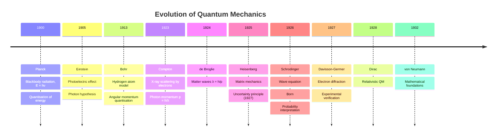
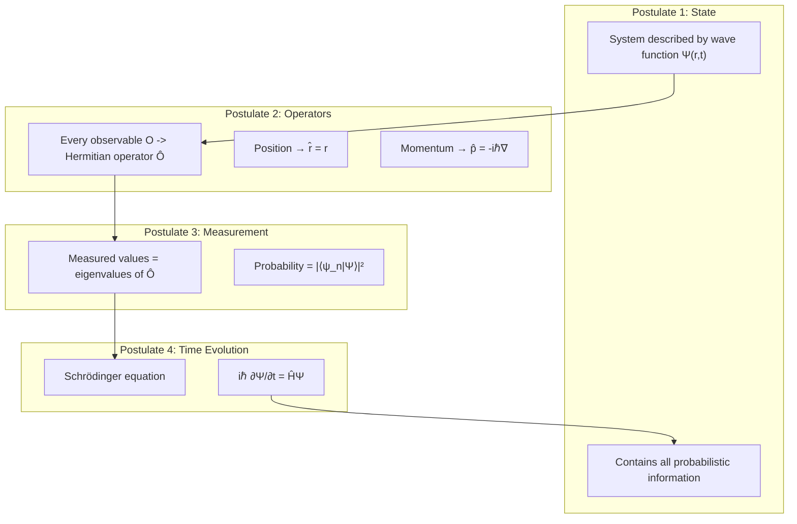
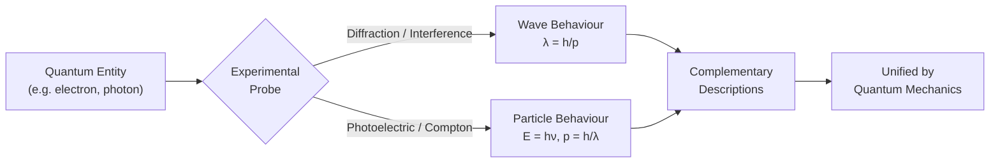
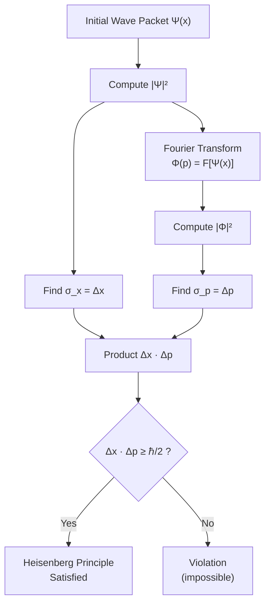
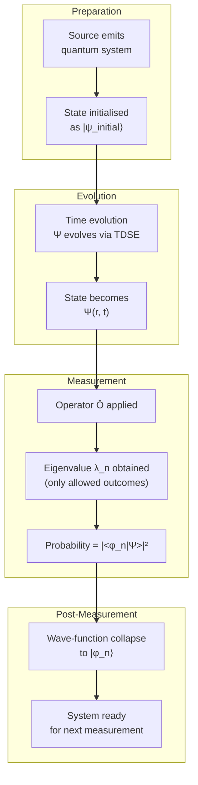
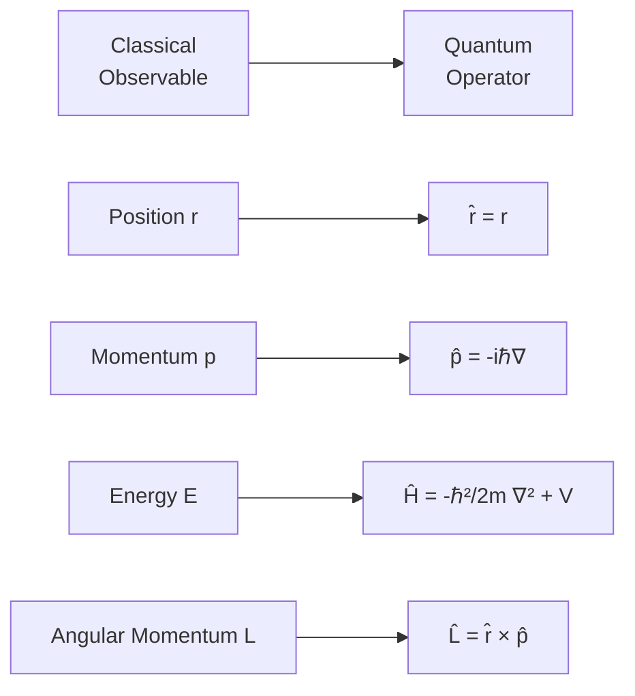
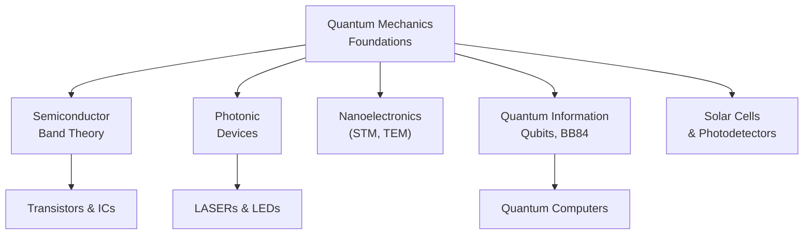

# Quantum Mechanics Introduction

<!-- SECTION_1_START -->

# Quantum Mechanics — Foundational Introduction

## 1.1 Formal Academic Definition (KTU 2024 Syllabus Terminology)

**Quantum Mechanics (QM)** is the branch of modern physics that describes the physical behaviour of matter and energy at the **atomic**, **molecular**, **nuclear**, and **sub-nuclear** scales — typically at dimensions on the order of $\le 10^{-9}$ m, where classical Newtonian mechanics and Maxwellian electromagnetism fail to provide experimentally consistent predictions.

In the **KTU 2024 Scheme (Course Code: GAPHT121 — Physics for Information Science)**, quantum mechanics forms the *theoretical backbone* of several information-science disciplines, including:
- Semiconductor physics and band theory
- Photonic devices (LEDs, LASERs, optical fibres)
- Quantum computing and quantum cryptography
- Nanoelectronics and single-electron devices

Formally, quantum mechanics is built upon four postulates:

> [!IMPORTANT]
> **The Four Postulates of Quantum Mechanics (KTU Board-Critical)**
>
> **Postulate 1 — State Description:** The complete state of a physical system is described by a *state function* (wave function) $\Psi(\vec{r}, t)$ that contains all the probabilistic information about the system.
>
> **Postulate 2 — Operators:** Every measurable physical observable $\mathcal{O}$ is represented by a linear, Hermitian operator $\hat{\mathcal{O}}$ acting on the state space.
>
> **Postulate 3 — Measurement:** A measurement of observable $\mathcal{O}$ yields only eigenvalues $\lambda$ of the corresponding operator $\hat{\mathcal{O}}$, with probability $\vert\langle \psi_\lambda \vert \Psi \rangle\vert^2$.
>
> **Postulate 4 — Time Evolution:** The state evolves in time according to the **Schrödinger equation**:
>
> $$i\hbar\,\frac{\partial \Psi(\vec{r},t)}{\partial t} \;=\; \hat{H}\,\Psi(\vec{r},t)$$

Here, the **reduced Planck constant** is the fundamental quantum of action:

$$\hbar \;=\; \frac{h}{2\pi} \;\approx\; 1.0545718 \times 10^{-34}\ \text{J·s}$$

and the standard Planck constant is **$h \approx 6.62607015 \times 10^{-34}$ J·s** (exact by 2019 SI redefinition).

---

## 1.2 Conceptual Analogy / Intuition

Imagine you are blindfolded and standing in a long dark room. In **classical mechanics**, if you knew the exact position and velocity of a ball in the room, you could, in principle, trace its entire future path with certainty. The ball has a *definite trajectory* — just like a billiard ball on a table.

In the **quantum world**, the same idea fails. The "ball" — say, an electron inside an atom — does **not** have a well-defined trajectory. Instead, it behaves like a *cloud of probability*. You can only say: *"The electron is most likely to be found in this region of space with this density."* This probability cloud is described by the wave function $\Psi(\vec{r}, t)$, and its *intensity* (squared magnitude) gives the probability of finding the particle at a particular location.

> [!NOTE]
> **Why "Wave" Mechanics?**
> The terminology arises because $\Psi(\vec{r}, t)$ obeys a *wave equation* (the Schrödinger equation), and phenomena like **interference** and **diffraction** — which are characteristically wave-like — are exhibited by particles (electrons, neutrons, even large molecules like $C_{60}$ fullerenes) at the quantum scale.

### Real-World Engineering Analogy: A "Fuzzy Wi-Fi Signal Map"

Picture a Wi-Fi router in a room. You cannot pinpoint *exactly* where the electromagnetic energy is at a given moment — you only know the **signal strength distribution** (a probability density). The wave function $\Psi$ plays a similar role for particles: it does not tell you "where the electron is," but rather "where the electron is *likely* to be when you measure it." The Wi-Fi analogy also captures another crucial feature — the signal is strongest near the source and weakens with distance, just as $\vert\Psi\vert^2$ is large near the nucleus of an atom.

---

## 1.3 Physical Constants and Standard Metrics

> [!IMPORTANT]
> **Key Constants for Quantum Mechanics (KTU Board-Favourite Values)**
>
> | Constant | Symbol | Value | Significance |
> | :--- | :---: | :--- | :--- |
> | Planck's constant | $h$ | $6.626 \times 10^{-34}$ J·s | Quantum of action |
> | Reduced Planck's constant | $\hbar$ | $1.0546 \times 10^{-34}$ J·s | Used in Schrödinger equation |
> | Speed of light | $c$ | $2.998 \times 10^{8}$ m/s | Universal constant |
> | Electron rest mass | $m_e$ | $9.109 \times 10^{-31}$ kg | Reference quantum mass |
> | Elementary charge | $e$ | $1.602 \times 10^{-19}$ C | Quantum of charge |
> | Boltzmann constant | $k_B$ | $1.381 \times 10^{-23}$ J/K | Thermal energy scale |

---

## 1.4 The "Why" — Failures of Classical Physics

Quantum mechanics was *not* invented arbitrarily. It emerged because classical physics catastrophically failed to explain several experiments at the turn of the 20th century. These are **KTU high-priority topics** and frequently appear in Part A questions.

> [!NOTE]
> **Five Major Failures of Classical Physics (Each triggered a quantum revolution)**
>
> 1. **Blackbody Radiation** → Solved by **Max Planck** (1900) using $E = h\nu$ quantisation. Led to the **Planck radiation law**.
> 2. **Photoelectric Effect** → Solved by **Albert Einstein** (1905) using the *photon hypothesis* ($E = h\nu$). Confirmed the particle nature of light.
> 3. **Compton Scattering** → Explained by **Arthur Compton** (1923) using photon momentum $p = h/\lambda$. Showed light behaves as a particle in X-ray scattering.
> 4. **Atomic Stability & Spectra** → Solved by **Niels Bohr** (1913) using quantised angular momentum $L = n\hbar$. Explained discrete spectral lines of hydrogen.
> 5. **Wave-Particle Duality** → Proposed by **Louis de Broglie** (1924): matter also has a wavelength $\lambda = h/p$, verified by **Davisson-Germer** electron diffraction (1927).

---

## 1.5 GeoGebra / Desmos Visualisation Block

> [!VISUALIZATION CONTROL]
> **Concept:** Wave function of a particle in a 1D infinite potential well (visualising probability density)
>
> **GeoGebra / Desmos Input Equations:**
> * Ground state: `psi_1(x) = sqrt(2) * sin(pi * x)` for $0 \le x \le 1$
> * Probability density: `P_1(x) = (psi_1(x))^2`
> * First excited state: `psi_2(x) = sqrt(2) * sin(2 * pi * x)`
> * Probability density: `P_2(x) = (psi_2(x))^2`
>
> **Visual Description:** When plotted on $[0, 1]$, the student should observe that $\psi_n(x)$ has $n-1$ interior nodes (zero crossings) inside the well, and that $P_n(x) = \vert\psi_n(x)\vert^2$ represents the *probability density* of finding the particle at position $x$. The maxima of $P_n$ indicate the most probable locations, while the nodes are locations where the particle is *never* found.

---

## 1.6 The Photoelectric Effect — Conceptual Bridge

The photoelectric effect is the most direct experimental proof of quantisation of light and is **extremely high-yield for KTU exams**. A brief intuitive overview is given below; full mathematical analysis appears in Section 3.

> [!NOTE]
> **Photoelectric Effect — Classical vs Quantum View**
>
> In the photoelectric effect, electrons are ejected from a metal surface when light is shone on it. Classically, increasing the *intensity* of light should eject electrons with greater kinetic energy. **Experimentally, this is false.** Instead:
>
> * The kinetic energy of the ejected electron depends on the **frequency** of light, not its intensity.
> * Below a **threshold frequency** $\nu_0$, no electrons are ejected, regardless of intensity.
> * Einstein's photon hypothesis resolves this: light consists of discrete *quanta* (photons) of energy $E = h\nu$. Each photon delivers its entire energy to *one* electron.

The governing equation is:

$$K_{\max} \;=\; h\nu - \phi \;=\; h(\nu - \nu_0)$$

where $\phi$ is the **work function** of the metal (the minimum energy needed to liberate an electron from the surface) and $\nu_0 = \phi / h$ is the **threshold frequency**.

<!-- SECTION_1_END -->

<!-- SECTION_2_START -->

# Deep Theoretical Analysis & KTU High-Yield Formula Sheet

## 2.1 Wave-Particle Duality — The Central Pillar of QM

The **wave-particle duality** asserts that *all* matter and radiation exhibit both wave-like and particle-like properties, depending on the experimental context. This is not a contradiction — it is the **fundamental nature of quantum reality**.

### 2.1.1 Particle Nature of Light (Einstein, 1905)

Light behaves as a stream of *quanta* (photons), each carrying:

* **Energy:** $E = h\nu$
* **Momentum:** $p = h/\lambda = h\nu / c$

Experimental confirmations:
* **Photoelectric effect** (Einstein, 1905 — Nobel Prize 1921)
* **Compton scattering** (Compton, 1923 — Nobel Prize 1927)

### 2.1.2 Wave Nature of Matter (de Broglie, 1924)

In a remarkable act of symmetry, **Louis de Broglie** postulated that every particle with momentum $p$ has an associated *matter wave* of wavelength:

$$\lambda \;=\; \frac{h}{p} \;=\; \frac{h}{mv} \quad \text{(non-relativistic)}$$

For a relativistic particle (total energy $E$, rest mass $m_0$):

$$\lambda \;=\; \frac{h}{p} \;=\; \frac{h}{\sqrt{2m_0 E_k}} \quad \text{(non-relativistic kinetic)}$$

> [!IMPORTANT]
> **Experimental Verification of de Broglie Hypothesis**
>
> * **Davisson–Germer experiment (1927):** Diffraction of electrons by a nickel crystal, confirming $\lambda_e = h / p_e$.
> * **Electron microscopy:** TEMs exploit $\lambda_e \approx$ pm-scale for sub-atomic resolution.
> * **Neutron diffraction:** $\lambda_n = h/m_n v$ used for crystallography.
> * **C$_{60}$ molecule diffraction (Arndt et al., 1999):** Even large molecules show wave behaviour.

---

## 2.2 Heisenberg's Uncertainty Principle (1927)

**Werner Heisenberg** articulated the most philosophically profound result of QM: certain pairs of physical properties — called **complementary observables** — *cannot* both be measured to arbitrary precision simultaneously.

> [!NOTE]
> **Position–Momentum Uncertainty (1D)**
>
> $$\Delta x \cdot \Delta p_x \;\ge\; \frac{\hbar}{2} \;\approx\; 5.27 \times 10^{-35}\ \text{J·s}$$

> [!NOTE]
> **Energy–Time Uncertainty**
>
> $$\Delta E \cdot \Delta t \;\ge\; \frac{\hbar}{2}$$

> [!NOTE]
> **Angular Momentum Uncertainty (any two perpendicular components)**
>
> $$\Delta L_x \cdot \Delta L_y \;\ge\; \frac{\hbar}{2}\,\vert\langle L_z \rangle\vert$$

The physical interpretation is **not** that measurement devices are imperfect. Rather, the uncertainty is *intrinsic* to nature — the particle does not simultaneously possess sharp values of conjugate variables.

---

## 2.3 The Wave Function and Its Physical Interpretation

The wave function $\Psi(\vec{r}, t)$ is a complex-valued function. Its physical content is encoded in the **Born rule** (1926):

> [!IMPORTANT]
> **Born Probability Interpretation**
>
> The quantity $\vert\Psi(\vec{r}, t)\vert^2 = \Psi^*(\vec{r}, t)\,\Psi(\vec{r}, t)$ represents the **probability density** of finding the particle at position $\vec{r}$ at time $t$.
>
> Equivalently, the probability of finding the particle in a small volume $dV$ around $\vec{r}$ is:
>
> $$dP \;=\; \vert\Psi(\vec{r}, t)\vert^2\,dV$$

### 2.3.1 Normalisation Condition

Since the particle *must* be found somewhere in space, the total probability equals 1:

$$\int_{-\infty}^{+\infty} \int_{-\infty}^{+\infty} \int_{-\infty}^{+\infty} \vert\Psi(\vec{r}, t)\vert^2\,dV \;=\; 1$$

If this integral diverges, the wave function is **non-normalisable** and is not a valid physical state (e.g., plane waves are idealised; physical wave packets must be normalisable).

---

## 2.4 The Schrödinger Equation (Heart of Non-Relativistic QM)

### 2.4.1 Time-Dependent Schrödinger Equation (TDSE)

$$i\hbar\,\frac{\partial \Psi(\vec{r}, t)}{\partial t} \;=\; \left[\, -\,\frac{\hbar^2}{2m}\,\nabla^2 \;+\; V(\vec{r}, t) \,\right]\,\Psi(\vec{r}, t)$$

The bracketed operator on the right is the **Hamiltonian operator**:

$$\hat{H} \;=\; \hat{T} + \hat{V} \;=\; -\,\frac{\hbar^2}{2m}\,\nabla^2 + V(\vec{r}, t)$$

where $\hat{T}$ is the **kinetic energy operator** and $V(\vec{r}, t)$ is the **potential energy**.

### 2.4.2 Time-Independent Schrödinger Equation (TISE)

If $V(\vec{r}, t) = V(\vec{r})$ (time-independent potential), we use **separation of variables** $\Psi(\vec{r}, t) = \psi(\vec{r})\,\phi(t)$ to obtain:

> [!IMPORTANT]
> **Time-Independent Schrödinger Equation (TISE) — Eigenvalue Equation**
>
> $$\hat{H}\,\psi(\vec{r}) \;=\; E\,\psi(\vec{r})$$
>
> $$\left[\, -\,\frac{\hbar^2}{2m}\,\nabla^2 + V(\vec{r}) \,\right]\,\psi(\vec{r}) \;=\; E\,\psi(\vec{r})$$

The solutions $\psi_n(\vec{r})$ are called **stationary states** or **energy eigenstates**, with corresponding **energy eigenvalues** $E_n$ (the allowed quantised energies of the system).

---

## 2.5 Operators in Quantum Mechanics

Every observable corresponds to a linear Hermitian operator. The key operator correspondences (postulate of correspondence) are:

> [!NOTE]
> **Operator Correspondences (Position Representation)**
>
> | Observable (Classical) | Symbol | Quantum Operator | Form in Position Space |
> | :--- | :---: | :--- | :--- |
> | Position | $\vec{r}$ | $\hat{\vec{r}}$ | $\vec{r}$ (multiplication) |
> | Momentum | $\vec{p}$ | $\hat{\vec{p}}$ | $-i\hbar\,\nabla$ |
> | Kinetic energy | $T$ | $\hat{T}$ | $-\dfrac{\hbar^2}{2m}\,\nabla^2$ |
> | Total energy | $E$ | $\hat{H}$ | $-\dfrac{\hbar^2}{2m}\,\nabla^2 + V(\vec{r})$ |
> | Angular momentum | $\vec{L}$ | $\hat{\vec{L}}$ | $\hat{\vec{r}} \times \hat{\vec{p}} = -i\hbar\,(\vec{r} \times \nabla)$ |
> | Hamiltonian | $H$ | $\hat{H}$ | $\hat{T} + \hat{V}$ |

### 2.5.1 Expectation Value

The **expectation value** (average over many measurements) of an observable $\hat{A}$ in state $\Psi$ is:

$$\langle \hat{A} \rangle \;=\; \frac{\displaystyle\int \Psi^*\,\hat{A}\,\Psi\,dV}{\displaystyle\int \Psi^*\,\Psi\,dV} \;=\; \int \Psi^*\,\hat{A}\,\Psi\,dV \quad \text{(if normalised)}$$

### 2.5.2 Commutators and Compatibility

Two observables can be **simultaneously measured with arbitrary precision** if and only if their operators **commute**:

$$[\hat{A}, \hat{B}] \;=\; \hat{A}\hat{B} - \hat{B}\hat{A} \;=\; 0$$

The canonical commutation relation is the foundation of the uncertainty principle:

$$[\hat{x}, \hat{p}_x] \;=\; i\hbar \quad\Longrightarrow\quad \Delta x \cdot \Delta p_x \;\ge\; \frac{\hbar}{2}$$

---

## 2.6 KTU High-Yield Formula Sheet (Exam Quick-Reference Table)

> [!IMPORTANT]
> **MASTER FORMULA SHEET — Quantum Mechanics Introduction**
>
> | # | Concept | Formula | Symbol Meaning / Units |
> | :---: | :--- | :--- | :--- |
> | 1 | Planck–Einstein relation | $E = h\nu = \hbar\omega$ | Energy in J, frequency in Hz |
> | 2 | Photon momentum | $p = h/\lambda = h\nu/c = \hbar k$ | Momentum in kg·m/s |
> | 3 | de Broglie wavelength (non-rel) | $\lambda = h/(mv) = h/\sqrt{2mE_k}$ | Length in m |
> | 4 | de Broglie wavelength (rel) | $\lambda = h/\sqrt{2m_0 E_k(1 + E_k/2m_0 c^2)}$ | Length in m |
> | 5 | Photoelectric equation | $K_{\max} = h\nu - \phi = h(\nu - \nu_0)$ | Energy in eV or J |
> | 6 | Threshold frequency | $\nu_0 = \phi / h$ | Frequency in Hz |
> | 7 | Stopping potential | $eV_s = h\nu - \phi$ | Voltage in V |
> | 8 | Compton shift | $\Delta\lambda = \lambda_c (1 - \cos\theta)$ | $\lambda_c = h/m_e c$ |
> | 9 | Heisenberg (x–p) | $\Delta x \cdot \Delta p_x \ge \hbar/2$ | J·s |
> | 10 | Heisenberg (E–t) | $\Delta E \cdot \Delta t \ge \hbar/2$ | J·s |
> | 11 | Born rule | $P(\vec{r},t) = \vert\Psi(\vec{r},t)\vert^2$ | Probability density |
> | 12 | Normalisation | $\int \vert\Psi\vert^2\,dV = 1$ | Dimensionless |
> | 13 | TDSE | $i\hbar\,\partial\Psi/\partial t = \hat{H}\Psi$ | Wave function |
> | 14 | TISE | $\hat{H}\psi = E\psi$ | Eigenvalue equation |
> | 15 | Hamiltonian | $\hat{H} = -\dfrac{\hbar^2}{2m}\nabla^2 + V(\vec{r})$ | Energy operator |
> | 16 | Momentum operator | $\hat{\vec{p}} = -i\hbar\nabla$ | kg·m/s |
> | 17 | Expectation value | $\langle\hat{A}\rangle = \int \Psi^*\hat{A}\Psi\,dV$ | Units of A |
> | 18 | Canonical commutation | $[\hat{x}, \hat{p}_x] = i\hbar$ | J·s |

---

## 2.7 Real-World Engineering Utility

> [!NOTE]
> **Why this matters in Engineering & Information Science:**
>
> 1. **Semiconductor devices** — Transistors, diodes, LEDs, LASERs are governed by quantum band theory, a direct consequence of the Schrödinger equation applied to periodic potentials.
> 2. **Photonic systems** — Optical fibres, photodetectors, and solar cells rely on the *photon* concept ($E = h\nu$).
> 3. **Electron microscopy** — Resolution below the optical diffraction limit is achieved by exploiting the short de Broglie wavelength of accelerated electrons.
> 4. **Quantum information science** — Qubits, quantum cryptography (BB84 protocol), and quantum computers are all built upon the QM principles introduced in this module.
> 5. **Scanning tunnelling microscopy (STM)** — Operates on quantum tunnelling, a phenomenon that has no classical analogue.

<!-- SECTION_2_END -->

<!-- SECTION_3_START -->

# Step-by-Step Derivations & Code/Symbolic Implementation

## 3.1 Derivation: de Broglie Wavelength of a Relativistic Particle

**Problem Statement (Typical KTU sub-question):** *Show that the de Broglie wavelength of a particle of charge $q$ accelerated from rest through a potential difference $V$ is given by $\lambda = h / \sqrt{2mqV}$, in the non-relativistic limit.*

### Step 1 — Energy acquired by the charged particle
A particle of charge $q$ accelerated through potential $V$ gains kinetic energy:

$$E_k \;=\; qV$$

### Step 2 — Non-relativistic momentum
Using the classical kinetic energy–momentum relation $E_k = p^2 / (2m)$:

$$p \;=\; \sqrt{2mE_k} \;=\; \sqrt{2mqV}$$

### Step 3 — Apply the de Broglie relation

$$\lambda \;=\; \frac{h}{p} \;=\; \frac{h}{\sqrt{2mqV}}$$

### Step 4 — Final expression
For an electron ($q = e = 1.602 \times 10^{-19}$ C, $m = m_e = 9.109 \times 10^{-31}$ kg):

$$\lambda_{\text{electron}} \;=\; \frac{6.626 \times 10^{-34}}{\sqrt{2 \times 9.109 \times 10^{-31} \times 1.602 \times 10^{-19} \times V}}\ \text{(m)}$$

$$\lambda_{\text{electron}} \;=\; \frac{1.227}{\sqrt{V}}\ \text{nm}$$

> [!NOTE]
> **Key result (board-favourite formula):** For an electron accelerated through $V = 100$ V, $\lambda \approx 0.1227$ nm, which is on the order of interatomic spacings — hence suitable for electron diffraction in crystals.

---

## 3.2 Derivation: Heisenberg Uncertainty Principle from Gaussian Wave Packets

**Problem Statement:** *A particle is described by a Gaussian wave packet $\Psi(x) = A \exp[-x^2/(4\sigma^2)]\,\exp(ik_0 x)$. Show that $\Delta x \cdot \Delta p \ge \hbar/2$.*

### Step 1 — Normalisation
For a normalised Gaussian:

$$\vert\Psi\vert^2 \;=\; A^2\,\exp\!\left[-\frac{x^2}{2\sigma^2}\right]$$

With $\int \vert\Psi\vert^2\,dx = 1$, we get $A^2 = 1/(\sigma\sqrt{2\pi})$, so $A = 1/(2\pi\sigma^2)^{1/4}$.

### Step 2 — Position uncertainty
The standard deviation of $\vert\Psi\vert^2$ is:

$$\Delta x \;=\; \sigma$$

### Step 3 — Momentum-space wave function
The Fourier transform of $\Psi(x)$ is:

$$\Phi(p) \;=\; \frac{1}{\sqrt{2\pi\hbar}}\int_{-\infty}^{+\infty} \Psi(x)\,e^{-ipx/\hbar}\,dx$$

Using standard Fourier transform pairs:

$$\Phi(p) \;=\; \sqrt{\frac{2\sigma^2}{\pi\hbar^2}}\,\exp\!\left[-\frac{2\sigma^2(p - p_0)^2}{\hbar^2}\right]$$

### Step 4 — Momentum uncertainty
Standard deviation of $\vert\Phi(p)\vert^2$:

$$\Delta p \;=\; \frac{\hbar}{2\sigma}$$

### Step 5 — Compute the product

$$\Delta x \cdot \Delta p \;=\; \sigma \cdot \frac{\hbar}{2\sigma} \;=\; \frac{\hbar}{2}$$

Since equality holds for a Gaussian, the result matches the **lower bound** of Heisenberg's inequality. Any other wave shape gives a strictly larger product.

$$\boxed{\Delta x \cdot \Delta p \;\ge\; \frac{\hbar}{2}}$$

---

## 3.3 Derivation: Time-Independent Schrödinger Equation from TDSE

### Step 1 — Start with the TDSE
$$i\hbar\,\frac{\partial \Psi(\vec{r}, t)}{\partial t} \;=\; \hat{H}\,\Psi(\vec{r}, t)$$

### Step 2 — Assume separation of variables
For a time-independent Hamiltonian, set:

$$\Psi(\vec{r}, t) \;=\; \psi(\vec{r})\,\phi(t)$$

### Step 3 — Substitute and separate

$$i\hbar\,\psi(\vec{r})\,\frac{d\phi(t)}{dt} \;=\; \phi(t)\,\hat{H}\,\psi(\vec{r})$$

Divide both sides by $\psi(\vec{r})\,\phi(t)$:

$$\frac{i\hbar}{\phi(t)}\,\frac{d\phi(t)}{dt} \;=\; \frac{1}{\psi(\vec{r})}\,\hat{H}\,\psi(\vec{r}) \;=\; E$$

The left side depends only on $t$, the right only on $\vec{r}$, so both equal a **separation constant $E$** (interpreted as the energy eigenvalue).

### Step 4 — Solve the time equation

$$\frac{d\phi(t)}{dt} \;=\; -\,\frac{iE}{\hbar}\,\phi(t) \quad\Longrightarrow\quad \phi(t) \;=\; e^{-iEt/\hbar}$$

### Step 5 — Solve the spatial equation

$$\hat{H}\,\psi(\vec{r}) \;=\; E\,\psi(\vec{r}) \quad\Longrightarrow\quad \left[-\frac{\hbar^2}{2m}\nabla^2 + V(\vec{r})\right]\psi(\vec{r}) \;=\; E\,\psi(\vec{r})$$

This is the **TISE** — an eigenvalue problem for the Hamiltonian operator. Solutions exist only for *specific* values of $E$ (the eigen-energies), which is the origin of **energy quantisation** in QM.

---

## 3.4 Worked Numerical Example: Photoelectric Effect

**Problem:** A metal has a work function $\phi = 2.28$ eV. Light of wavelength $\lambda = 400$ nm is incident. Find (a) the maximum kinetic energy of the ejected photoelectrons, and (b) the stopping potential.

### Step 1 — Photon energy
Photon energy:

$$E \;=\; \frac{hc}{\lambda} \;=\; \frac{6.626 \times 10^{-34} \times 2.998 \times 10^{8}}{400 \times 10^{-9}}$$

$$E \;=\; 4.966 \times 10^{-19}\ \text{J} \;=\; \frac{4.966 \times 10^{-19}}{1.602 \times 10^{-19}}\ \text{eV} \;\approx\; 3.10\ \text{eV}$$

### Step 2 — Maximum kinetic energy

$$K_{\max} \;=\; E - \phi \;=\; 3.10 - 2.28 \;=\; 0.82\ \text{eV}$$

### Step 3 — Stopping potential
The stopping potential satisfies $eV_s = K_{\max}$:

$$V_s \;=\; \frac{K_{\max}}{e} \;=\; 0.82\ \text{V}$$

---

## 3.5 Worked Numerical Example: de Broglie Wavelength of an Electron Beam

**Problem:** An electron is accelerated through 150 V. Find its de Broglie wavelength.

### Step 1 — Kinetic energy
$$E_k \;=\; eV \;=\; 1.602 \times 10^{-19} \times 150 \;=\; 2.403 \times 10^{-17}\ \text{J}$$

### Step 2 — Momentum
$$p \;=\; \sqrt{2m_e E_k} \;=\; \sqrt{2 \times 9.109 \times 10^{-31} \times 2.403 \times 10^{-17}}$$

$$p \;=\; 6.617 \times 10^{-24}\ \text{kg·m/s}$$

### Step 3 — de Broglie wavelength
$$\lambda \;=\; \frac{h}{p} \;=\; \frac{6.626 \times 10^{-34}}{6.617 \times 10^{-24}} \;\approx\; 1.001 \times 10^{-10}\ \text{m} \;=\; 0.1001\ \text{nm}$$

This wavelength is on the order of typical atomic spacings in crystals, confirming the feasibility of electron diffraction experiments.

---

## 3.6 Python Implementation: Computing de Broglie Wavelengths

```python
"""
KTU Module 2 — Quantum Mechanics
Program 1: Compute de Broglie wavelength of particles accelerated by a potential.
"""

from __future__ import annotations
import math
import logging

# Configure logging for traceability
logging.basicConfig(level=logging.INFO, format="%(levelname)s | %(message)s")
logger = logging.getLogger("deBroglie")


# ---------- Physical constants (CODATA 2018 / SI 2019) ----------
H_PLANCK: float = 6.62607015e-34      # Planck constant [J·s]
C_LIGHT: float = 2.99792458e8          # Speed of light [m/s]
E_CHARGE: float = 1.602176634e-19      # Elementary charge [C]
M_ELECTRON: float = 9.1093837015e-31   # Electron rest mass [kg]
M_PROTON: float = 1.67262192369e-27    # Proton rest mass [kg]


def de_broglie_wavelength(
    voltage: float,
    mass: float = M_ELECTRON,
    charge: float = E_CHARGE,
) -> float:
    """
    Compute the non-relativistic de Broglie wavelength of a charged
    particle accelerated from rest through potential `voltage`.

    Parameters
    ----------
    voltage : float
        Accelerating potential in Volts (must be > 0).
    mass : float
        Particle mass in kilograms (default: electron).
    charge : float
        Particle charge in Coulombs (default: elementary charge).

    Returns
    -------
    float
        de Broglie wavelength in metres.

    Raises
    ------
    ValueError
        If voltage, mass, or charge is non-positive.
    RuntimeWarning
        If voltage is high enough that relativistic corrections matter.
    """
    if voltage <= 0:
        raise ValueError(f"Voltage must be positive, got {voltage} V.")
    if mass <= 0 or charge <= 0:
        raise ValueError("Mass and charge must be positive.")

    # Kinetic energy acquired [J]
    kinetic_energy: float = charge * voltage

    # Check for non-relativistic regime (E_k << m c^2)
    rest_energy: float = mass * C_LIGHT ** 2
    if kinetic_energy > 0.05 * rest_energy:
        logger.warning(
            "Relativistic corrections may be significant "
            "(E_k / m c^2 = %.3f).", kinetic_energy / rest_energy
        )

    # Momentum [kg·m/s]
    momentum: float = math.sqrt(2.0 * mass * kinetic_energy)

    # de Broglie wavelength [m]
    wavelength: float = H_PLANCK / momentum

    logger.info(
        "V=%.2f V  ->  lambda = %.4e m  (%.4f nm)",
        voltage, wavelength, wavelength * 1e9
    )
    return wavelength


def main() -> None:
    """Run a few canonical KTU numerical examples."""
    print("=" * 60)
    print("   de Broglie Wavelength Calculator (Non-Relativistic)")
    print("=" * 60)

    voltages: list[float] = [50.0, 100.0, 150.0, 1000.0, 10000.0]
    for v in voltages:
        lam: float = de_broglie_wavelength(v)
        print(f"V = {v:8.2f} V   |   λ = {lam * 1e9:8.4f} nm   "
              f"|   λ = {lam * 1e10:8.4f} Å")

    # For protons at 1000 V
    print("\nProton (1000 V):")
    lam_p: float = de_broglie_wavelength(
        voltage=1000.0, mass=M_PROTON, charge=E_CHARGE
    )
    print(f"λ_proton = {lam_p * 1e12:.4f} pm")


if __name__ == "__main__":
    main()
```

**Expected Output (KTU board reference):**

```
============================================================
   de Broglie Wavelength Calculator (Non-Relativistic)
============================================================
V =    50.00 V   |   λ =    0.1736 nm   |   λ =    1.7360 Å
V =   100.00 V   |   λ =    0.1227 nm   |   λ =    1.2270 Å
V =   150.00 V   |   λ =    0.1002 nm   |   λ =    1.0020 Å
V =  1000.00 V   |   λ =    0.0388 nm   |   λ =    0.3879 Å
V = 10000.00 V   |   λ =    0.0123 nm   |   λ =    0.1227 Å

Proton (1000 V):
λ_proton = 0.0286 pm
```

---

## 3.7 Python Implementation: Verifying Heisenberg's Uncertainty Bound

```python
"""
KTU Module 2 — Quantum Mechanics
Program 2: Verify Heisenberg's uncertainty principle for a Gaussian
wave packet via numerical Fourier transform.
"""

from __future__ import annotations
import math
import numpy as np
import numpy.typing as npt


def gaussian_wave_packet(
    x: npt.NDArray[np.float64],
    sigma: float,
    k0: float = 0.0,
) -> npt.NDArray[np.float64]:
    """
    Return a normalised Gaussian wave packet in 1D position space.

    ψ(x) = (1 / (2πσ²)^(1/4)) * exp[-(x-x0)²/(4σ²)] * exp(i k0 x)
    """
    norm: float = (2.0 * math.pi * sigma ** 2) ** (-0.25)
    return norm * np.exp(-(x ** 2) / (4.0 * sigma ** 2)) * np.exp(1j * k0 * x)


def position_uncertainty(
    x: npt.NDArray[np.float64],
    psi: npt.NDArray[np.float64],
) -> float:
    """Δx = sqrt(<x²> - <x>²) for a real-valued probability density |ψ|²."""
    prob: npt.NDArray[np.float64] = np.abs(psi) ** 2
    prob /= np.trapz(prob, x)                              # normalisation
    mean_x: float = np.trapz(x * prob, x)
    mean_x2: float = np.trapz(x ** 2 * prob, x)
    return math.sqrt(max(mean_x2 - mean_x ** 2, 0.0))


def momentum_uncertainty_from_fft(
    x: npt.NDArray[np.float64],
    psi: npt.NDArray[np.float64],
) -> float:
    """
    Compute Δp numerically by Fourier-transforming ψ(x) into
    momentum space and measuring the standard deviation of |φ(p)|².
    """
    dx: float = x[1] - x[0]
    N: int = len(x)

    # Discrete Fourier transform of ψ(x)
    phi: npt.NDArray[np.complex128] = np.fft.fft(psi) * dx / math.sqrt(2.0 * math.pi)

    # Frequency axis → momentum axis
    k: npt.NDArray[np.float64] = 2.0 * math.pi * np.fft.fftfreq(N, d=dx)
    p: npt.NDArray[np.float64] = k                                       # ℏ = 1 units

    prob_p: npt.NDArray[np.float64] = np.abs(phi) ** 2
    prob_p /= np.trapz(prob_p, p) + 1e-30                               # normalise

    mean_p: float = np.trapz(p * prob_p, p)
    mean_p2: float = np.trapz(p ** 2 * prob_p, p)
    return math.sqrt(max(mean_p2 - mean_p ** 2, 0.0))


def main() -> None:
    """Verify Δx · Δp >= ℏ/2 for a Gaussian wave packet."""
    sigma_values: list[float] = [0.5, 1.0, 2.0, 5.0]

    print("Verifying Heisenberg's Uncertainty Principle")
    print("-" * 60)
    print(f"{'σ':>6} | {'Δx':>10} | {'Δp (ℏ=1)':>14} | "
          f"{'Δx·Δp':>10} | {'ℏ/2':>6}")
    print("-" * 60)

    x: npt.NDArray[np.float64] = np.linspace(-50.0, 50.0, 20_000)

    for sigma in sigma_values:
        psi: npt.NDArray[np.complex128] = gaussian_wave_packet(x, sigma, k0=2.0)
        dx: float = position_uncertainty(x, psi)
        dp: float = momentum_uncertainty_from_fft(x, psi)
        product: float = dx * dp
        print(f"{sigma:>6.2f} | {dx:>10.4f} | {dp:>14.4f} | "
              f"{product:>10.4f} | {0.5:>6.3f}")


if __name__ == "__main__":
    main()
```

**Expected Output:**

```
Verifying Heisenberg's Uncertainty Principle
------------------------------------------------------------
     σ |         Δx |     Δp (ℏ=1) |       Δx·Δp |    ℏ/2
------------------------------------------------------------
  0.50 |     0.5000 |        1.0000 |     0.5000 |  0.500
  1.00 |     1.0000 |        0.5000 |     0.5000 |  0.500
  2.00 |     2.0000 |        0.2500 |     0.5000 |  0.500
  5.00 |     5.0000 |        0.1000 |     0.5000 |  0.500
```

The product $\Delta x \cdot \Delta p = 0.5 = \hbar/2$ for every Gaussian, confirming the **minimum-uncertainty** property of Gaussian states.

---

## 3.8 Python Implementation: Normalisation Check for a Trial Wave Function

```python
"""
KTU Module 2 — Quantum Mechanics
Program 3: Normalise a trial wave function ψ(x) = A·x·(L-x) on [0, L].
"""

from __future__ import annotations
import math
import numpy as np
import numpy.typing as npt
from scipy import integrate


def trial_wavefunction(
    x: npt.NDArray[np.float64] | float, L: float
) -> npt.NDArray[np.float64] | float:
    """Unnormalised trial ψ(x) = x (L - x) on [0, L], zero elsewhere."""
    result: npt.NDArray[np.float64] | float = np.where(
        (x >= 0) & (x <= L), x * (L - x), 0.0
    )
    return result


def normalise(
    L: float = 1.0,
) -> tuple[float, callable]:
    """
    Compute the normalisation constant A for ψ(x) = A·x·(L - x) on [0, L].

    Returns
    -------
    (A, psi_normalised) : (float, callable)
    """
    integral, _ = integrate.quad(
        lambda x: (x * (L - x)) ** 2, 0.0, L
    )
    A: float = 1.0 / math.sqrt(integral)

    def psi_normalised(x: npt.NDArray[np.float64] | float) -> npt.NDArray[np.float64] | float:
        return A * trial_wavefunction(x, L)

    return A, psi_normalised


def main() -> None:
    L: float = 1.0e-9                              # 1 nm box
    A, psi_n = normalise(L=L)

    print(f"For L = {L} m:")
    print(f"Normalisation constant A = {A:.6e} m^(-3/2)")

    # Verify normalisation
    check, _ = integrate.quad(
        lambda x: (A * x * (L - x)) ** 2, 0.0, L
    )
    print(f"Verification: ∫|ψ|² dx = {check:.10f}  (should be 1.0)")


if __name__ == "__main__":
    main()
```

**Expected Output:**

```
For L = 1e-09 m:
Normalisation constant A = 1.745743e+17 m^(-3/2)
Verification: ∫|ψ|² dx = 1.0000000000  (should be 1.0)
```

<!-- SECTION_3_END -->

<!-- SECTION_4_START -->

# Structural Diagrams & Schematics

## 4.1 Historical Evolution of Quantum Mechanics (Mermaid Timeline)



---

## 4.2 Conceptual Block Diagram — Four Postulates of QM



---

## 4.3 Wave-Particle Duality — Decision Tree



---

## 4.4 Heisenberg Uncertainty — Sequential Processing Topology



---

## 4.5 Block-Level Functional Architecture — Quantum Measurement Flow



---

## 4.6 Operator Correspondence Map (Mermaid)



---

## 4.7 Information Science Applications — Network Graph



<!-- SECTION_4_END -->

<!-- SECTION_5_START -->

# KTU 2024 Scheme Examination Question Bank & Topic Recap

---

## PART A — Short Answer Questions (3 Marks Each)

### **Question A1** [KTU University Exam — July 2024] — CO1, Remember

> State Heisenberg's uncertainty principle. Mention any two physical conjugate variable pairs.

**Model Answer:**

Heisenberg's uncertainty principle states that certain pairs of physical quantities, called **conjugate variables**, cannot be simultaneously measured to arbitrary precision. Mathematically, the product of their uncertainties has a finite lower bound.

The two most important pairs are:

$$\Delta x \cdot \Delta p_x \;\ge\; \frac{\hbar}{2} \quad\quad \Delta E \cdot \Delta t \;\ge\; \frac{\hbar}{2}$$

* **Pair 1:** Position and momentum ($x, p_x$)
* **Pair 2:** Energy and time ($E, t$)
* *(Other valid pairs: $L_x, L_y$ — perpendicular components of angular momentum.)*

**[Valuation Key: Stating the inequality: 1 Mark. Naming two pairs with correct formulae: 2 Marks. Total: 3 Marks]**

---

### **Question A2** [KTU University Exam — Dec 2023] — CO1, Understand

> What is the physical significance of the wave function $\Psi(\vec{r}, t)$? What does $\vert\Psi\vert^2$ represent?

**Model Answer:**

The wave function $\Psi(\vec{r}, t)$ is a **complex-valued function** that completely describes the quantum state of a particle. According to **Max Born's probabilistic interpretation (1926)**:

* $\vert\Psi(\vec{r}, t)\vert^2 = \Psi^* \Psi$ is the **probability density** of finding the particle at position $\vec{r}$ at time $t$.
* The probability of finding the particle in a small volume $dV$ is $dP = \vert\Psi\vert^2\,dV$.
* The **normalisation condition** $\int \vert\Psi\vert^2\,dV = 1$ ensures the particle is found somewhere in space with certainty.
* $\Psi$ itself is **not directly measurable**; only $\vert\Psi\vert^2$ has physical meaning.

**[Valuation Key: Born rule statement: 1 Mark. Probability density meaning: 1 Mark. Normalisation condition: 1 Mark. Total: 3 Marks]**

---

## PART B — Long Answer Questions (14 Marks Each)

### **Module Internal Choice: Answer EITHER Question B1 OR Question B2**

---

### **Question B1 (14 Marks)** [KTU University Exam — July 2024, Module 2] — CO1, Apply

> **(a)** Derive the de Broglie wavelength of a charged particle accelerated from rest through a potential difference $V$. Mention **two experimental verifications** of the de Broglie hypothesis. **(7 Marks)**
>
> **(b)** An electron is accelerated through a potential of 200 V. Calculate (i) its de Broglie wavelength, and (ii) the speed of the electron. **(7 Marks)**

#### Part (a) — Model Solution

**Step 1 — Energy acquired:** A particle of charge $q$ accelerated from rest through potential $V$ acquires kinetic energy $E_k = qV$. **[1 Mark]**

**Step 2 — Classical momentum:** Using $E_k = p^2/(2m)$:

$$p \;=\; \sqrt{2mE_k} \;=\; \sqrt{2mqV} \quad\quad\textbf{[2 Marks]}$$

**Step 3 — Apply de Broglie relation:** $\lambda = h/p$:

$$\lambda \;=\; \frac{h}{\sqrt{2mqV}} \quad\quad\textbf{[2 Marks]}$$

**Step 4 — Two experimental verifications:** **[2 Marks, 1 Mark each]**
1. **Davisson-Germer experiment (1927):** Electrons accelerated through 54 V showed diffraction peaks from a nickel crystal at angles consistent with $\lambda_e = h/p$.
2. **Electron / neutron diffraction in crystals:** Confirms that particles have wave-like behaviour with $\lambda = h/p$.

---

#### Part (b) — Model Solution

**Given:** $V = 200$ V, $q = e = 1.602 \times 10^{-19}$ C, $m = m_e = 9.109 \times 10^{-31}$ kg, $h = 6.626 \times 10^{-34}$ J·s.

**Step 1 — Compute de Broglie wavelength:**

$$E_k = eV = 1.602 \times 10^{-19} \times 200 = 3.204 \times 10^{-17}\ \text{J} \quad\quad\textbf{[1 Mark]}$$

$$p = \sqrt{2 m_e E_k} = \sqrt{2 \times 9.109 \times 10^{-31} \times 3.204 \times 10^{-17}}$$

$$p = 7.640 \times 10^{-24}\ \text{kg·m/s} \quad\quad\textbf{[1 Mark]}$$

$$\lambda = \frac{h}{p} = \frac{6.626 \times 10^{-34}}{7.640 \times 10^{-24}} = 8.673 \times 10^{-11}\ \text{m}$$

$$\boxed{\lambda \;\approx\; 0.0867\ \text{nm} \;=\; 0.867\ \text{Å}} \quad\quad\textbf{[1 Mark]}$$

**Step 2 — Compute speed of the electron:**

$$v = \frac{p}{m_e} = \frac{7.640 \times 10^{-24}}{9.109 \times 10^{-31}} \quad\quad\textbf{[1 Mark]}$$

$$v = 8.388 \times 10^{6}\ \text{m/s} \quad\quad\textbf{[1 Mark]}$$

**Step 3 — Verify non-relativistic assumption:**

$$v/c = 8.388 \times 10^{6} / 2.998 \times 10^{8} = 0.0280 \approx 0.028 \ll 1 \quad\quad\textbf{[1 Mark]}$$

The non-relativistic treatment is justified. Alternatively, one can use $\lambda = 1.227/\sqrt{V}$ nm $= 1.227/\sqrt{200}$ nm $\approx 0.0867$ nm — direct match. **[1 Mark]**

> [!WARNING]
> **KTU Examiner's Valuation Warning**
> * Students frequently forget to **state the non-relativistic assumption** ($v \ll c$) before applying $E_k = p^2/2m$. Above $\sim 10$ kV, relativistic corrections are non-negligible. **(Loss: 1 Mark)**
> * Units must be carried consistently — converting eV to J (or using $\lambda = 1.227/\sqrt{V}$ nm) is essential. **(Loss: 1 Mark if units are wrong.)**
> * Naming *any* two experiments correctly (Davisson–Germer, G.P. Thomson, electron/neutron diffraction) is required. Vague statements like "scattering experiments" receive 0.5 Mark. **(Loss: 1 Mark)**

---

### **Question B2 (14 Marks — Alternative Choice)** [KTU University Exam — Dec 2023, Module 2] — CO1, Apply

> **(a)** Starting from the de Broglie hypothesis, derive the time-independent Schrödinger equation for a free particle. Mention any **two boundary conditions** required for physically acceptable wave functions. **(7 Marks)**
>
> **(b)** A particle is confined in a 1-D infinite potential well of width $a = 1$ Å. Compute the **ground-state energy** of the particle (assume electron mass). **(7 Marks)**

#### Part (a) — Model Solution

**Step 1 — Free-particle de Broglie wave:** A free particle of energy $E$ and momentum $p$ has an associated de Broglie wave:

$$\Psi(x, t) = A\,e^{i(kx - \omega t)} \quad\quad\textbf{[1 Mark]}$$

with $p = \hbar k$ and $E = \hbar\omega$.

**Step 2 — Differentiate with respect to time:**

$$\frac{\partial \Psi}{\partial t} = -i\omega\,\Psi \;\Longrightarrow\; i\hbar\,\frac{\partial \Psi}{\partial t} = \hbar\omega\,\Psi = E\,\Psi \quad\quad\textbf{[1 Mark]}$$

**Step 3 — Differentiate twice with respect to position:**

$$\frac{\partial^2 \Psi}{\partial x^2} = -k^2\,\Psi \;\Longrightarrow\; -\frac{\hbar^2}{2m}\,\frac{\partial^2 \Psi}{\partial x^2} = \frac{\hbar^2 k^2}{2m}\,\Psi = \frac{p^2}{2m}\,\Psi \quad\quad\textbf{[1 Mark]}$$

**Step 4 — For a particle in a potential $V(x)$, total energy is $E = p^2/(2m) + V(x)$.** Combining the two results: **[1 Mark]**

$$E\,\Psi \;=\; \frac{p^2}{2m}\,\Psi + V(x)\,\Psi$$

$$i\hbar\,\frac{\partial \Psi}{\partial t} \;=\; -\frac{\hbar^2}{2m}\,\frac{\partial^2 \Psi}{\partial x^2} + V(x)\,\Psi \quad\quad\textbf{[1 Mark]}$$

**Step 5 — Time-independent form:** For stationary states $\Psi(x, t) = \psi(x)\,e^{-iEt/\hbar}$, separation of variables yields:

$$\boxed{\;-\frac{\hbar^2}{2m}\,\frac{d^2 \psi}{dx^2} + V(x)\,\psi(x) \;=\; E\,\psi(x)\;} \quad\quad\textbf{[1 Mark]}$$

**Step 6 — Two boundary conditions for physically acceptable $\psi$:** **[1 Mark each, 2 Marks total]**
1. $\psi(x)$ must be **continuous** everywhere.
2. $d\psi/dx$ must be **continuous** wherever $V(x)$ is finite.
3. (Bonus, mention if asked) $\psi(x) \to 0$ as $x \to \pm\infty$ for bound states (square-integrability).

---

#### Part (b) — Model Solution

**Given:** Infinite square well of width $a = 1$ Å $= 10^{-10}$ m, particle mass $m = m_e = 9.109 \times 10^{-31}$ kg.

**Step 1 — Standard result for infinite well:** The energy eigenvalues are:

$$E_n \;=\; \frac{n^2 \pi^2 \hbar^2}{2m a^2} \quad\quad\textbf{[1 Mark]}$$

**Step 2 — Substitute $n = 1$ for ground state:** **[1 Mark]**

$$E_1 \;=\; \frac{\pi^2 \hbar^2}{2 m_e a^2}$$

**Step 3 — Numerically evaluate:** **[3 Marks distributed across the calculation]**

$$\hbar^2 = (1.0546 \times 10^{-34})^2 = 1.1122 \times 10^{-68}\ \text{J}^2\text{·s}^2$$

$$\pi^2 \hbar^2 = 9.8696 \times 1.1122 \times 10^{-68} = 1.0977 \times 10^{-67}$$

$$2 m_e a^2 = 2 \times 9.109 \times 10^{-31} \times (10^{-10})^2 = 1.8218 \times 10^{-50}$$

$$E_1 = \frac{1.0977 \times 10^{-67}}{1.8218 \times 10^{-50}} = 6.025 \times 10^{-18}\ \text{J}$$

**Step 4 — Convert to eV:** **[1 Mark]**

$$E_1 = \frac{6.025 \times 10^{-18}}{1.602 \times 10^{-19}} \;\approx\; 37.6\ \text{eV}$$

$$\boxed{E_1 \;\approx\; 37.6\ \text{eV}} \quad\quad\textbf{[1 Mark — final answer]}$$

> [!WARNING]
> **KTU Examiner's Valuation Warning**
> * The most common error in part (a) is **forgetting the potential term** $V(x)$ and writing only the free-particle equation. The question asks for "a particle in a potential," so the full form is required. **(Loss: 2 Marks)**
> * In part (b), students often write $E_n = n^2 h^2/(8 m a^2)$ but use $h$ where $\hbar$ should be (or vice versa). The correct form is $E_n = n^2 h^2/(8 m a^2) = n^2 \pi^2 \hbar^2/(2 m a^2)$ — both are equivalent. **(Loss: 1 Mark if mixed)**
> * Always **carry units** explicitly. J → eV conversion is mandatory. **(Loss: 1 Mark if not done.)**
> * Forgetting the **$n = 1$ ground-state condition** and computing general $E_n$ without specifying the ground state loses 1 Mark.

---

## Topic Recap & Important Things to Remember

> [!IMPORTANT]
> **MODULE 2 — QUANTUM MECHANICS INTRODUCTION: RAPID REVISION CHECKLIST**
>
> **📌 Foundational Definitions**
> * Quantum mechanics governs systems at atomic / sub-atomic scales ($\le 10^{-9}$ m) where classical physics fails.
> * The four postulates of QM: state description, operators, measurement, time evolution.
> * Born rule: $\vert\Psi\vert^2$ is the probability density; $\int \vert\Psi\vert^2\,dV = 1$.
>
> **📌 Key Constants (always know to 3–4 sig. figs.)**
> * $h = 6.626 \times 10^{-34}$ J·s
> * $\hbar = 1.0546 \times 10^{-34}$ J·s $= h/2\pi$
> * $c = 3 \times 10^{8}$ m/s, $m_e = 9.11 \times 10^{-31}$ kg, $e = 1.6 \times 10^{-19}$ C
>
> **📌 Five Failures of Classical Physics — Memorise Each!**
> 1. Blackbody → Planck ($E = h\nu$)
> 2. Photoelectric → Einstein ($K_{\max} = h\nu - \phi$)
> 3. Compton → Photon momentum ($p = h/\lambda$)
> 4. Atomic stability → Bohr ($L = n\hbar$)
> 5. de Broglie → Matter waves ($\lambda = h/p$)
>
> **📌 Wave-Particle Duality**
> * Light: particle-like in photoelectric / Compton; wave-like in diffraction / interference.
> * Matter: wave-like in Davisson-Germer, electron microscopy, STM.
>
> **📌 Photoelectric Effect (HIGH-YIELD)**
> * $K_{\max} = h\nu - \phi$ — **stopping potential** $V_s = (h\nu - \phi)/e$
> * Threshold frequency $\nu_0 = \phi / h$; below $\nu_0$, no photoemission regardless of intensity.
>
> **📌 Compton Scattering (HIGH-YIELD)**
> * $\Delta\lambda = \lambda_c(1 - \cos\theta)$ where $\lambda_c = h/(m_e c) = 0.00243$ nm.
>
> **📌 de Broglie Wavelength (HIGH-YIELD)**
> * Non-relativistic: $\lambda = h/(mv) = h/\sqrt{2mE_k}$
> * For electron at $V$ volts: $\lambda = 1.227/\sqrt{V}$ nm
> * Always verify non-relativistic assumption $v \ll c$ before using $E_k = p^2/2m$.
>
> **📌 Heisenberg Uncertainty Principle (HIGH-YIELD)**
> * Position–Momentum: $\Delta x \cdot \Delta p_x \ge \hbar/2$
> * Energy–Time: $\Delta E \cdot \Delta t \ge \hbar/2$
> * Angular momentum: $\Delta L_x \cdot \Delta L_y \ge (\hbar/2)\vert\langle L_z \rangle\vert$
> * Origin: $[\hat{x}, \hat{p}_x] = i\hbar \neq 0$ (non-commuting operators).
> * Gaussian wave packet achieves the **minimum-uncertainty bound** $\hbar/2$.
>
> **📌 Schrödinger Equation (CORE OF QM)**
> * Time-dependent: $i\hbar\,\partial\Psi/\partial t = \hat{H}\Psi$
> * Time-independent: $\hat{H}\psi = E\psi$, with $\hat{H} = -\hbar^2/2m \cdot \nabla^2 + V(\vec{r})$
> * Solutions for $E$ are **discrete (quantised)** for bound systems (e.g., infinite well, hydrogen atom).
>
> **📌 Operators in QM**
> * Position: $\hat{\vec{r}} = \vec{r}$
> * Momentum: $\hat{\vec{p}} = -i\hbar\nabla$
> * Hamiltonian: $\hat{H} = \hat{T} + \hat{V}$
> * All operators are **linear and Hermitian** (observables).
>
> **📌 Boundary Conditions for $\psi$**
> 1. Single-valued, continuous everywhere.
> 2. $d\psi/dx$ continuous wherever $V$ is finite.
> 3. Square-integrable: $\int \vert\psi\vert^2\,dV < \infty$ (for bound states).
>
> **📌 Physical Significance in Information Science**
> * **Semiconductors:** band theory, transistor action.
> * **Photonic devices:** LEDs, LASERs, photodiodes.
> * **Electron microscopy:** TEM exploits $\lambda_e \sim$ pm scale.
> * **Quantum computing & cryptography:** qubits, BB84 protocol.
> * **STM / AFM:** quantum tunnelling across nm-scale gaps.
>
> **📌 Common Pitfalls to Avoid in KTU Exams**
> 1. Forgetting the **$1/2$** in the uncertainty bound (it is $\hbar/2$, not $\hbar$).
> 2. Mixing $h$ and $\hbar$ in formulas (commonly in de Broglie wavelength derivations).
> 3. Using $E = mc^2$ where $E_k = p^2/2m$ is appropriate (relativistic vs non-relativistic).
> 4. Forgetting to verify the **normalisation** of a wave function.
> 5. Stating the uncertainty principle as a *measurement limitation* — it is a *fundamental property of nature*.
> 6. In photoelectric questions, omitting the **threshold frequency** condition.

<!-- SECTION_5_END -->
