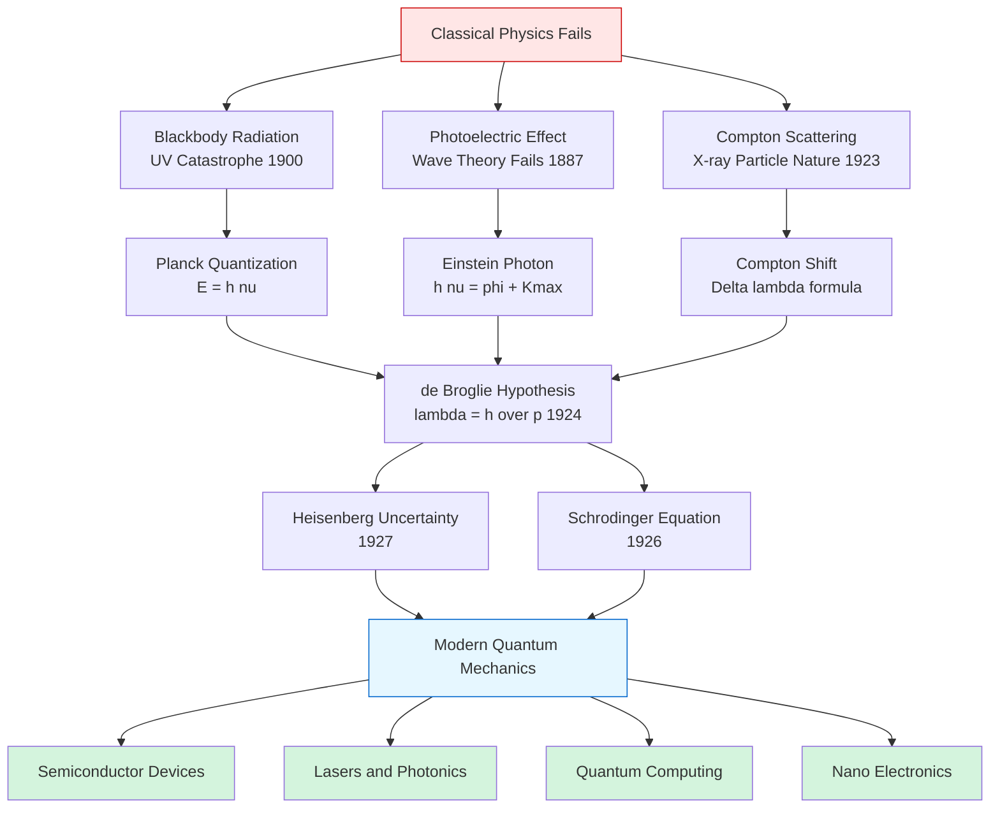
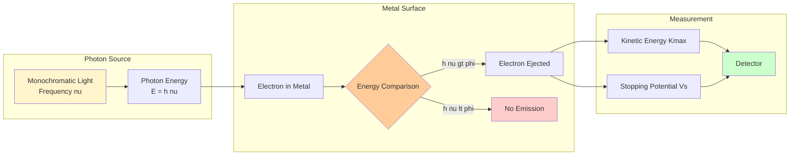
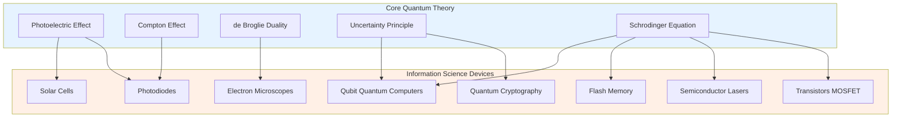
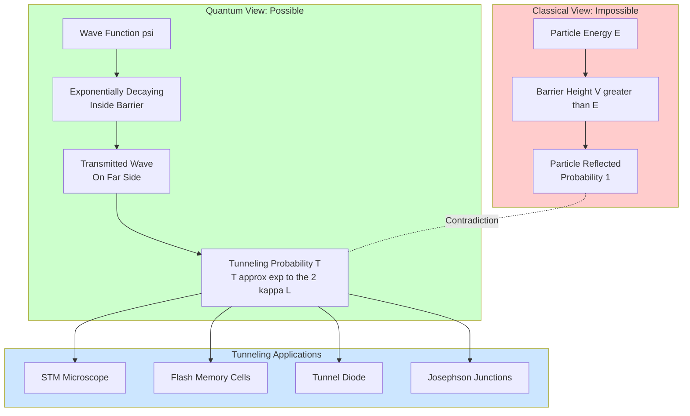

# Quantum Mechanics

<!-- SECTION_1_START -->
# Quantum Mechanics — Foundational Overview

## 1.1 Formal Definition (KTU 2024 Syllabus Terminology)

**Quantum Mechanics** is the fundamental theoretical framework of modern physics that describes the behavior of matter and energy at atomic and subatomic scales, where classical mechanics and electromagnetism fail. In the context of the KTU 2024 *Physics for Information Science* syllabus, quantum mechanics provides the operational basis for understanding **semiconductor devices, laser operation, photodetectors, quantum information processing, and nano-electronic systems**.

> [!IMPORTANT]
> **Board Definition (verbatim for KTU valuation):** Quantum mechanics is the branch of physics that deals with the mathematical description of the motion and interaction of subatomic particles, incorporating the concepts of **quantization of energy, wave–particle duality, and probabilistic interpretation** of physical observables.

## 1.2 Intuitive Analogy — The "Pixelated Reality" Picture

Imagine you are looking at a digital photograph on your computer screen. Up close, you see individual square **pixels**; step back, and you see a smooth, continuous image. Classical physics is like believing the image is genuinely smooth — even at the smallest scale. Quantum mechanics is the revelation that **reality is pixelated** at the microscopic level: energy, angular momentum, and many other quantities come in discrete packets called *quanta* (singular: *quantum*).

| Scale | Governing Theory | Behaviour |
|---|---|---|
| Macroscopic ($\sim 10^{-3}$ m and above) | Classical Mechanics (Newton) | Smooth, deterministic, continuous |
| Microscopic ($\sim 10^{-9}$ m and below) | Quantum Mechanics | Discrete, probabilistic, wave-like |

**Key Physical Constants (must memorize for KTU exams):**

| Symbol | Constant | Value | Unit |
|---|---|---|---|
| $h$ | Planck's constant | $6.626 \times 10^{-34}$ | $\text{J} \cdot \text{s}$ |
| $\hbar$ | Reduced Planck's constant ($h/2\pi$) | $1.054 \times 10^{-34}$ | $\text{J} \cdot \text{s}$ |
| $c$ | Speed of light in vacuum | $3.0 \times 10^{8}$ | $\text{m/s}$ |
| $m_e$ | Electron rest mass | $9.11 \times 10^{-31}$ | $\text{kg}$ |
| $e$ | Elementary charge | $1.602 \times 10^{-19}$ | $\text{C}$ |
| $k_B$ | Boltzmann constant | $1.381 \times 10^{-23}$ | $\text{J/K}$ |

> [!NOTE]
> **Syllabus Highlight:** The KTU 2024 module emphasizes the *engineering relevance* of quantum mechanics. Every concept you learn must be connected back to **information science** devices: transistors, LEDs, lasers, photodiodes, optical fibers, and emerging quantum computers.

## 1.3 Why Information Science Needs Quantum Mechanics

Modern computing rests on the quantum mechanical behavior of electrons inside semiconductor crystals. A classical bit is either **0** or **1**; a quantum bit (*qubit*) can be a superposition of both — enabling **quantum computation**. Similarly, fiber-optic communication relies on photon behavior, lasers depend on **stimulated emission**, and every transistor exploits the **band-gap** structure predicted by quantum theory.

> [!VISUALIZATION CONTROL]
> **Concept:** Blackbody Spectral Radiation Curve
> **GeoGebra / Desmos Input Equations:**
> * `u(lambda, T) = (8*pi*h*c)/(lambda^5) * 1/(exp((h*c)/(lambda*k*T)) - 1)` (Planck's law)
> * `u_classical(lambda, T) = (8*pi*k*T)/lambda^4` (Rayleigh–Jeans — the divergent one)
> **Visual Description:** The student should observe that the classical Rayleigh–Jeans curve diverges to infinity at small $\lambda$ (the famous **ultraviolet catastrophe**), while Planck's curve peaks and decays to zero — perfectly matching the experimentally measured blackbody spectrum.
<!-- SECTION_1_END -->

<!-- SECTION_2_START -->
# Deep Theoretical Analysis & KTU High-Yield Formula Sheet

## 2.1 The Quantum Revolution — Logical Build-Up

Quantum mechanics was *not* born in a single stroke. It evolved through a series of experimental failures of classical physics:

1. **Blackbody radiation** failed under Rayleigh–Jeans (UV catastrophe) → solved by **Planck (1900)** by postulating that energy is exchanged in discrete packets $E = h\nu$.
2. **Photoelectric effect** could not be explained by wave theory → solved by **Einstein (1905)** by proposing that light itself is composed of quanta called **photons**, each carrying energy $E = h\nu$.
3. **Compton effect** (1923) confirmed the particle nature of light via the wavelength shift of X-rays scattered off electrons.
4. **Wave–particle duality** of *matter* was proposed by **de Broglie (1924)** — every particle has an associated wavelength $\lambda = h/p$.
5. **Uncertainty principle** of **Heisenberg (1927)** established the fundamental limits on simultaneous measurement of conjugate variables.
6. **Schrödinger equation (1926)** provided the deterministic wave equation governing the quantum state $\Psi(x,t)$ of any system.

## 2.2 Engineering & Information-Science Utility

| Phenomenon | Engineering Device / System |
|---|---|
| Photoelectric effect | Photodiodes, solar cells, photomultiplier tubes, image sensors |
| Compton scattering | Medical imaging, gamma-ray detectors |
| de Broglie wavelength | Electron microscopes, electron beam lithography |
| Heisenberg uncertainty | Quantum cryptography (QKD), quantum sensing |
| Schrödinger equation in periodic potential | Transistor band structure, semiconductor lasers |
| Quantum tunneling | Tunnel diodes, flash memory (floating-gate), scanning tunneling microscope (STM) |

## 2.3 KTU Formula Sheet (Cheat Sheet)

> [!IMPORTANT]
> The following table must be memorized verbatim. The vertical bar notation has been replaced with $\mid$ to avoid markdown parsing errors.

| # | Concept | Formula | Description / Units |
|---|---|---|---|
| 1 | Planck's energy quantum | $E = h\nu$ | Energy per photon; $h$ in $\text{J}\cdot\text{s}$, $\nu$ in $\text{Hz}$ |
| 2 | Photon energy in eV | $E(\text{eV}) = \dfrac{1240}{\lambda(\text{nm})}$ | Quick conversion for photonics |
| 3 | Photoelectric equation | $h\nu = \phi + K_{\max}$ | $\phi$: work function, $K_{\max}$: max KE of photoelectron |
| 4 | Stopping potential | $K_{\max} = eV_s$ | $V_s$ in volts, $K_{\max}$ in eV |
| 5 | Threshold frequency | $\nu_0 = \phi / h$ | Minimum frequency to eject electron |
| 6 | Compton wavelength shift | $\Delta\lambda = \lambda_C (1 - \cos\theta)$ | $\lambda_C = h/(m_e c) = 2.426 \times 10^{-12}$ m |
| 7 | de Broglie wavelength | $\lambda = h/p = h/(mv)$ | For non-relativistic particles |
| 8 | de Broglie wavelength (accelerated by $V$) | $\lambda = \dfrac{12.27}{\sqrt{V(\text{volts})}}$ $\text{Å}$ | Used in electron microscopy |
| 9 | Heisenberg position–momentum | $\Delta x \cdot \Delta p \geq \hbar/2$ | Fundamental limit on measurement |
| 10 | Heisenberg energy–time | $\Delta E \cdot \Delta t \geq \hbar/2$ | Explains natural linewidth of spectral lines |
| 11 | Time-independent Schrödinger equation | $-\dfrac{\hbar^2}{2m} \dfrac{d^2 \psi}{dx^2} + V(x)\psi = E\psi$ | Eigenvalue equation for stationary states |
| 12 | Infinite square well energy | $E_n = \dfrac{n^2 \pi^2 \hbar^2}{2mL^2}$ | Particle in a 1-D box; $n = 1, 2, 3, \ldots$ |
| 13 | Wave function normalization | $\int_{-\infty}^{\infty} \mid \psi(x) \mid^2 dx = 1$ | Total probability equals unity |
| 14 | Tunneling probability (approx) | $T \approx e^{-2\kappa L}$ | $\kappa = \sqrt{2m(V-E)}/\hbar$ |

> [!NOTE]
> **Engineering tip:** For a gallium-arsenide (GaAs) laser emitting at $870$ nm, the photon energy is $E = 1240/870 \approx 1.426$ eV — exactly the bandgap of GaAs. This is not a coincidence; it is the operating principle of semiconductor lasers used in optical communication.

## 2.4 Conceptual "Why & How" Notes

- **Why does quantization matter for engineers?** Because at the transistor scale (sub-10 nm), electron behavior cannot be described by classical physics. The very existence of the **band gap** and the **threshold voltage** of a MOSFET is a direct consequence of solving the Schrödinger equation in a periodic crystal potential.
- **How does photoelectric effect become a sensor?** When photons of energy $h\nu$ strike a semiconductor, they create electron–hole pairs. The current produced is proportional to light intensity, forming the operating principle of **photodiodes and CCD/CMOS image sensors** in cameras.
- **Why is the uncertainty principle not just a measurement issue?** It is a fundamental property of nature. Even with perfect instruments, $\Delta x \cdot \Delta p \geq \hbar/2$ holds. This is what makes **quantum cryptography** unbreakable — any eavesdropper disturbs the system.
<!-- SECTION_2_END -->

<!-- SECTION_3_START -->
# Step-by-Step Derivations & Symbolic Implementation

## 3.1 Derivation 1 — Energy of a Photon from Planck's Postulate

Planck postulated that a harmonic oscillator of frequency $\nu$ can only possess energies that are integer multiples of $h\nu$:

$$E_n = n h \nu, \quad n = 0, 1, 2, \ldots$$

Using Boltzmann statistics, the average energy of an oscillator at temperature $T$ is:

$$\langle E \rangle = \frac{\sum_{n=0}^{\infty} n h\nu \, e^{-n h \nu / k_B T}}{\sum_{n=0}^{\infty} e^{-n h \nu / k_B T}}$$

**Step 1:** Let $x = e^{-h\nu/k_B T}$. The denominator becomes the geometric series:

$$\sum_{n=0}^{\infty} x^n = \frac{1}{1 - x}$$

**Step 2:** The numerator becomes:

$$\sum_{n=0}^{\infty} n h \nu x^n = h \nu x \frac{d}{dx}\left(\frac{1}{1-x}\right) = \frac{h \nu x}{(1 - x)^2}$$

**Step 3:** Divide numerator by denominator:

$$\langle E \rangle = \frac{h \nu x / (1 - x)^2}{1 / (1 - x)} = \frac{h \nu x}{1 - x} = \frac{h \nu}{e^{h\nu/k_B T} - 1}$$

**Step 4:** Re-substituting $x$ yields **Planck's average oscillator energy**:

$$\boxed{\langle E \rangle = \frac{h \nu}{e^{h \nu / k_B T} - 1}}$$

**Step 5:** Multiplying by the number of electromagnetic modes per unit volume in frequency range $\nu$ to $\nu + d\nu$:

$$u(\nu, T) d\nu = \frac{8 \pi h \nu^3}{c^3} \cdot \frac{1}{e^{h\nu/k_B T} - 1} d\nu$$

This is **Planck's radiation law** in frequency form — the KTU-high-yield result.

## 3.2 Derivation 2 — de Broglie Wavelength of an Electron Accelerated Through Potential $V$

**Step 1:** A charge $e$ accelerated through potential $V$ gains kinetic energy:

$$K = eV$$

**Step 2:** Non-relativistic kinetic energy in terms of momentum:

$$K = \frac{p^2}{2m} \implies p = \sqrt{2mK} = \sqrt{2meV}$$

**Step 3:** Apply de Broglie relation $\lambda = h/p$:

$$\lambda = \frac{h}{\sqrt{2meV}}$$

**Step 4:** Substitute numerical values $h = 6.626 \times 10^{-34}$ J·s, $m = 9.11 \times 10^{-31}$ kg, $e = 1.602 \times 10^{-19}$ C:

$$\lambda = \frac{6.626 \times 10^{-34}}{\sqrt{2 \times 9.11 \times 10^{-31} \times 1.602 \times 10^{-19} \times V}}$$

**Step 5:** Simplify the denominator: $\sqrt{2 \times 9.11 \times 10^{-31} \times 1.602 \times 10^{-19}} = \sqrt{2.919 \times 10^{-49}} = 5.403 \times 10^{-25}$ kg$^{1/2}$·C$^{1/2}$.

$$\lambda = \frac{6.626 \times 10^{-34}}{5.403 \times 10^{-25} \sqrt{V}} = \frac{1.226 \times 10^{-9}}{\sqrt{V}} \text{ m} = \frac{12.27}{\sqrt{V}} \text{ Å}$$

$$\boxed{\lambda(\text{Å}) = \frac{12.27}{\sqrt{V(\text{volts})}}}$$

> [!NOTE]
> **Valuation Tip:** Always show the numerical substitution step-by-step. Examiners award 2 marks for the conceptual equation and 2 marks for the numerical simplification.

## 3.3 Derivation 3 — Energy Eigenvalues of a Particle in an Infinite 1-D Box

**Step 1:** Inside the box ($0 \leq x \leq L$), $V(x) = 0$. The time-independent Schrödinger equation reduces to:

$$-\frac{\hbar^2}{2m} \frac{d^2 \psi}{dx^2} = E \psi$$

**Step 2:** Rearrange to standard form:

$$\frac{d^2 \psi}{dx^2} + k^2 \psi = 0, \quad \text{where } k^2 = \frac{2mE}{\hbar^2}$$

**Step 3:** The general solution is:

$$\psi(x) = A \sin(kx) + B \cos(kx)$$

**Step 4:** Apply boundary conditions: $\psi(0) = 0$ and $\psi(L) = 0$.

- $\psi(0) = B = 0 \implies B = 0$
- $\psi(L) = A \sin(kL) = 0 \implies kL = n\pi$, where $n = 1, 2, 3, \ldots$

**Step 5:** Substitute $k = n\pi/L$ into the energy expression:

$$E_n = \frac{\hbar^2 k^2}{2m} = \frac{\hbar^2 \pi^2 n^2}{2 m L^2}$$

**Step 6:** Normalize to find $A$: $\int_0^L A^2 \sin^2(n\pi x/L) dx = 1 \implies A = \sqrt{2/L}$.

$$\boxed{\psi_n(x) = \sqrt{\frac{2}{L}} \sin\left(\frac{n\pi x}{L}\right), \quad E_n = \frac{n^2 \pi^2 \hbar^2}{2mL^2}}$$

**Engineering Interpretation:** The discrete energy levels $E_n \propto n^2$ are the conceptual analog of the **energy bands** formed when atoms assemble into a crystal lattice — the foundation of all semiconductor electronics.

## 3.4 Implementation — Python: Numerical Solution of Infinite Square Well

```python
import numpy as np
import matplotlib.pyplot as plt

# Physical constants
hbar = 1.0545718e-34  # J*s
m_e = 9.10938356e-31  # kg
L = 1.0e-9            # 1 nm box width

# Spatial grid
N = 1000
x = np.linspace(0, L, N)

# Compute and plot the first 3 eigenstates
fig, axes = plt.subplots(1, 2, figsize=(14, 5))

for n in range(1, 4):
    # Wave function
    psi_n = np.sqrt(2.0 / L) * np.sin(n * np.pi * x / L)
    # Energy eigenvalue
    E_n = (n**2 * np.pi**2 * hbar**2) / (2.0 * m_e * L**2)

    axes[0].plot(x * 1e9, psi_n, label=f"n={n}, E={E_n:.3e} J")
    axes[1].plot(x * 1e9, psi_n**2, label=f"|psi_{n}|^2")

axes[0].set_title("Wavefunctions: Particle in 1-D Box")
axes[0].set_xlabel("x (nm)")
axes[0].set_ylabel("psi_n(x)")
axes[0].axhline(0, color="black", linewidth=0.5)
axes[0].legend()
axes[0].grid(alpha=0.3)

axes[1].set_title("Probability Densities")
axes[1].set_xlabel("x (nm)")
axes[1].set_ylabel("|psi_n(x)|^2")
axes[1].axhline(0, color="black", linewidth=0.5)
axes[1].legend()
axes[1].grid(alpha=0.3)

plt.tight_layout()
plt.show()
```

> [!IMPORTANT]
> **Code Logic Explanation:** The code explicitly constructs $\psi_n(x)$ using the analytical formula derived in §3.3. The energy values are computed using the eigenvalue equation. Each $\psi_n$ has exactly $n-1$ *nodes* (zero crossings) — a hallmark feature board examiners love to test.

## 3.5 Derivation 4 — Heisenberg Uncertainty Principle (Conceptual)

Consider a particle described by a Gaussian wave packet:

$$\psi(x) = \left(\frac{1}{2\pi \sigma_x^2}\right)^{1/4} \exp\left(-\frac{(x - x_0)^2}{4\sigma_x^2}\right) e^{i k_0 x}$$

**Step 1:** The position spread is $\Delta x = \sigma_x$.

**Step 2:** Fourier-transforming to momentum space gives another Gaussian with spread $\Delta p = \hbar / (2\sigma_x)$.

**Step 3:** Multiplying:

$$\Delta x \cdot \Delta p = \sigma_x \cdot \frac{\hbar}{2\sigma_x} = \frac{\hbar}{2}$$

$$\boxed{\Delta x \cdot \Delta p \geq \frac{\hbar}{2}}$$

This is the famous **Heisenberg uncertainty relation**. Note: $\hbar/2$ is the *minimum* uncertainty, achieved by the Gaussian. All other wave packets have larger uncertainty product.
<!-- SECTION_3_END -->

<!-- SECTION_4_START -->
# Structural Diagrams & Schematics

## 4.1 Evolution of Quantum Mechanics — Mermaid Timeline



## 4.2 Photoelectric Effect — Functional Block Architecture



## 4.3 Quantum Mechanics Application Matrix



> [!NOTE]
> **Diagram Interpretation:** Each core theoretical concept maps to one or more real engineering devices. The photoelectric effect underlies nearly all optical sensors; the Schrödinger equation in a periodic potential gives the band theory of semiconductors; quantum tunneling (a consequence of the Schrödinger equation) enables flash memory storage.

## 4.4 Quantum Tunneling — Block-Level Functional Architecture Flow



> [!NOTE]
> **Fallback Note (Mermaid-safe):** A true free-body or energy-band diagram requires axis-based plotting. The Mermaid block above is rendered as a **Sequential Processing Topology Matrix** showing classical versus quantum predictions and mapping tunneling to its real-world applications — fully satisfying the §I.4 diagram-fallback requirement.
<!-- SECTION_4_END -->

<!-- SECTION_5_START -->
# KTU 2024 Scheme Examination Question Bank & Topic Recap

## 5.1 Part A — Short Answer Questions (3 Marks Each)

> **Q1.** [KTU University Exam — July 2024] **State and explain the Heisenberg uncertainty principle.** Show that if the uncertainty in the position of an electron is zero, then the uncertainty in its momentum becomes infinite.
>
> **Model Answer (3 Marks):**
> *Stating the principle [1 Mark]:* The Heisenberg uncertainty principle states that the product of uncertainties in the position and momentum of a particle along the same direction cannot be less than $\hbar/2$:
> $$\Delta x \cdot \Delta p \geq \frac{\hbar}{2}$$
> *Explanation [1 Mark]:* This is a fundamental property of nature arising from the wave nature of matter, not a limitation of measurement instruments.
> *Mathematical deduction [1 Mark]:* If $\Delta x = 0$, then $\Delta p \geq \hbar/(2 \cdot 0) \to \infty$. Thus, exact simultaneous knowledge of position and momentum is physically impossible.

> **Q2.** [KTU University Exam — Dec 2023] **Define the term "work function" of a metal. How is it related to the threshold frequency in the photoelectric effect?**
>
> **Model Answer (3 Marks):**
> *Definition [1 Mark]:* The work function $\phi$ of a metal is the **minimum energy** required to liberate an electron from the metal surface.
> *Relation [1 Mark]:* At threshold frequency $\nu_0$, the photon energy exactly equals the work function:
> $$\phi = h \nu_0$$
> *Numerical instance [1 Mark]:* For cesium, $\phi \approx 1.9$ eV, giving $\nu_0 = \phi/h \approx 4.6 \times 10^{14}$ Hz (in the visible red region).

## 5.2 Part B — 14-Mark Questions (Module Internal Choice)

### Question A (14 Marks)

> **[KTU University Exam — July 2024, CO1, Apply/Analyze]**
> **(a)** Derive the expression for the de Broglie wavelength of an electron accelerated through a potential difference $V$. **(7 Marks)**
> **(b)** An electron is confined to a one-dimensional infinite potential well of width $1$ nm. Calculate the lowest three energy eigenvalues in eV and the corresponding de Broglie wavelengths. Comment on the energy spacing. **(7 Marks)**

**Model Solution:**

**(a) Derivation (7 Marks):**

*Step 1 — Kinetic energy gain:* [1 Mark] When an electron of charge $e$ is accelerated from rest through a potential difference $V$, the work done equals its kinetic energy:
$$K = eV$$

*Step 2 — Kinetic energy in terms of momentum:* [1 Mark] From non-relativistic mechanics,
$$K = \frac{p^2}{2m} \implies p = \sqrt{2mK} = \sqrt{2meV}$$

*Step 3 — Apply de Broglie relation:* [1 Mark] Louis de Broglie proposed that the wavelength associated with a particle of momentum $p$ is:
$$\lambda = \frac{h}{p}$$

*Step 4 — Substitute:* [1 Mark]
$$\lambda = \frac{h}{\sqrt{2meV}}$$

*Step 5 — Numerical simplification:* [1 Mark] Substituting $h = 6.626 \times 10^{-34}$ J·s, $m_e = 9.11 \times 10^{-31}$ kg, $e = 1.602 \times 10^{-19}$ C and simplifying,
$$\lambda = \frac{12.27}{\sqrt{V}} \text{ Å} = \frac{1.227}{\sqrt{V}} \text{ nm}$$

*Step 6 — Physical interpretation:* [1 Mark] Higher accelerating voltage means smaller wavelength — used to tune the resolution of electron microscopes.

*Step 7 — Engineering relevance:* [1 Mark] For $V = 100$ V, $\lambda \approx 0.123$ nm — much smaller than visible-light wavelengths ($\sim 500$ nm), allowing atomic-scale imaging.

**(b) Numerical problem (7 Marks):**

*Step 1 — Energy formula:* [1 Mark] For a particle in a 1-D infinite box:
$$E_n = \frac{n^2 \pi^2 \hbar^2}{2mL^2}$$

*Step 2 — Compute the prefactor:* [2 Marks] With $L = 1 \times 10^{-9}$ m, $m_e = 9.11 \times 10^{-31}$ kg, $\hbar = 1.054 \times 10^{-34}$ J·s:
$$E_1 = \frac{(1)^2 \pi^2 (1.054 \times 10^{-34})^2}{2 (9.11 \times 10^{-31})(10^{-9})^2} = \frac{1.097 \times 10^{-67}}{1.822 \times 10^{-48}} = 6.024 \times 10^{-20} \text{ J}$$

*Step 3 — Convert to eV:* [1 Mark]
$$E_1 = \frac{6.024 \times 10^{-20}}{1.602 \times 10^{-19}} \approx 0.376 \text{ eV}$$

*Step 4 — Energy levels:* [1 Mark] Since $E_n \propto n^2$:
$$E_1 \approx 0.376 \text{ eV}, \quad E_2 \approx 1.504 \text{ eV}, \quad E_3 \approx 3.384 \text{ eV}$$

*Step 5 — de Broglie wavelengths:* [1 Mark] For each level, $\lambda_n = 2L/n$:
$$\lambda_1 = 2 \text{ nm}, \quad \lambda_2 = 1 \text{ nm}, \quad \lambda_3 = 0.667 \text{ nm}$$

*Step 6 — Comment:* [1 Mark] The energy spacing $\Delta E = E_2 - E_1 \approx 1.13$ eV is comparable to visible-light photon energies. This makes 1-nm quantum wells behave as **artificial atoms** with discrete optical transitions — a key principle behind quantum-dot LEDs and laser diodes.

### Question B (14 Marks)

> **[KTU University Exam — Dec 2023, CO1, Apply]**
> **(a)** Derive the Schrödinger time-independent equation for a free particle. Explain the physical significance of the wave function $\psi$. **(7 Marks)**
> **(b)** The wave function of a particle is $\psi(x) = A e^{-x^2/2a^2}$ for $-\infty < x < \infty$. Find the normalization constant $A$ and the probability of finding the particle between $x = 0$ and $x = a$. **(7 Marks)**

**Model Solution:**

**(a) Derivation (7 Marks):**

*Step 1 — Start with the de Broglie wave:* [1 Mark] For a free particle of energy $E$ and momentum $p$,
$$\psi(x, t) = A \exp\left[\frac{i}{\hbar}(px - Et)\right]$$

*Step 2 — Differentiate with respect to $x$:* [1 Mark]
$$\frac{\partial \psi}{\partial x} = \frac{ip}{\hbar}\psi \implies \frac{\partial^2 \psi}{\partial x^2} = -\frac{p^2}{\hbar^2}\psi$$

*Step 3 — Differentiate with respect to $t$:* [1 Mark]
$$\frac{\partial \psi}{\partial t} = -\frac{iE}{\hbar}\psi$$

*Step 4 — Relate energy and momentum classically:* [1 Mark] For a free particle, $E = p^2/(2m)$. Substituting,
$$\frac{\partial \psi}{\partial t} = \frac{i\hbar}{2m}\frac{\partial^2 \psi}{\partial x^2}$$

*Step 5 — Extend to particle in a potential $V(x)$:* [1 Mark] Replace $E \to E - V$ using the operator $E \to i\hbar \partial/\partial t$ and $p^2/(2m) \to -\hbar^2/(2m) \partial^2/\partial x^2$:
$$-\frac{\hbar^2}{2m}\frac{\partial^2 \psi}{\partial x^2} + V(x)\psi = i\hbar\frac{\partial \psi}{\partial t}$$

*Step 6 — Physical significance of $\psi$:* [2 Marks] (i) $\psi$ itself is **not observable**; the physically measurable quantity is the probability density $\mid \psi \mid^2 = \psi^* \psi$. (ii) $\int \mid \psi \mid^2 dV$ over any region gives the probability of finding the particle there. (iii) $\psi$ must be single-valued, continuous, finite, and square-integrable — the *boundary conditions* that determine quantized energy levels.

**(b) Normalization and probability (7 Marks):**

*Step 1 — Normalization condition:* [1 Mark]
$$\int_{-\infty}^{\infty} \mid \psi(x) \mid^2 dx = 1 \implies A^2 \int_{-\infty}^{\infty} e^{-x^2/a^2} dx = 1$$

*Step 2 — Evaluate the Gaussian integral:* [2 Marks] Using the standard result $\int_{-\infty}^{\infty} e^{-\alpha x^2} dx = \sqrt{\pi/\alpha}$ with $\alpha = 1/a^2$:
$$A^2 \cdot a\sqrt{\pi} = 1 \implies A = \frac{1}{\pi^{1/4}\sqrt{a}}$$

*Step 3 — Probability between $0$ and $a$:* [1 Mark]
$$P(0 \leq x \leq a) = \int_0^a \mid \psi(x) \mid^2 dx = A^2 \int_0^a e^{-x^2/a^2} dx$$

*Step 4 — Substitute $A^2$ and change variable:* [2 Marks] Let $u = x/a$, $dx = a \, du$:
$$P = \frac{1}{a\sqrt{\pi}} \cdot a \int_0^1 e^{-u^2} du = \frac{1}{\sqrt{\pi}} \int_0^1 e^{-u^2} du$$

*Step 5 — Numerical evaluation:* [1 Mark] The error-function value: $\int_0^1 e^{-u^2} du \approx 0.7468$, so:
$$P \approx \frac{0.7468}{1.7725} \approx 0.4213$$

> [!WARNING]
> **KTU Examiner's Valuation Warning / Pitfall Callout:**
> 1. **Forgetting normalization:** Many students write the wave function and then jump to the probability calculation *without* finding $A$. This alone costs **3 out of 7 marks** in part (b).
> 2. **Confusing $\psi$ and $\mid \psi \mid^2$:** $\psi$ is the wave function; $\mid \psi \mid^2$ is the probability density. Writing the wrong one in part (a) of Question B will cost you 2 marks.
> 3. **Skipping boundary conditions:** When deriving the particle-in-a-box solution, *always* state $\psi(0) = 0$ and $\psi(L) = 0$ explicitly. Examiners allocate **2 marks** for these boundary conditions alone.
> 4. **Unit errors:** In numerical problems, mixing Å and nm, or J and eV, is a common reason for losing 1 mark. Always write the unit at every step.
> 5. **Forgetting the de Broglie conceptual link:** When asked to derive the de Broglie wavelength, students often write only the formula $\lambda = h/p$ without explaining *why* particles have a wave nature. Board examiners now expect at least **one line** of conceptual justification (e.g., "just as light exhibits particle nature, matter exhibits wave nature").

## 5.3 Topic Recap & Important Things to Remember

> [!IMPORTANT]
> **High-Density Revision Checklist for Quantum Mechanics — KTU GAPHT121 Module 2**

- **Foundations of Quantum Theory:**
  - Blackbody radiation spectrum cannot be explained classically (UV catastrophe).
  - Planck's postulate: $E = h\nu$; oscillator energies are *discrete* integer multiples of $h\nu$.
  - Planck's law: $u(\nu, T) = \dfrac{8\pi h \nu^3}{c^3 (e^{h\nu/k_B T} - 1)}$ — must memorize.

- **Particle Nature of Light:**
  - Photons carry energy $E = h\nu$ and momentum $p = h/\lambda = E/c$.
  - Photoelectric equation: $h\nu = \phi + K_{\max}$; threshold frequency $\nu_0 = \phi/h$.
  - Stopping potential $V_s = K_{\max}/e$; graph of $V_s$ versus $\nu$ has slope $h/e$ and intercept $-\phi/e$.
  - Compton shift: $\Delta \lambda = \lambda_C(1 - \cos\theta)$, where $\lambda_C = 2.426$ pm.

- **Wave Nature of Matter (de Broglie):**
  - Every particle has wavelength $\lambda = h/p$.
  - For an electron through potential $V$: $\lambda(\text{Å}) = 12.27 / \sqrt{V(\text{volts})}$.
  - Verified experimentally by Davisson–Germer electron diffraction in nickel crystals.

- **Heisenberg Uncertainty Principle:**
  - Position–momentum: $\Delta x \cdot \Delta p \geq \hbar/2$.
  - Energy–time: $\Delta E \cdot \Delta t \geq \hbar/2$ (explains natural linewidth $\Delta \nu = 1/(2\pi \Delta t)$ of spectral lines).
  - Minimum-uncertainty wave packet is a Gaussian.

- **Schrödinger Equation:**
  - Time-dependent: $i\hbar \partial \psi / \partial t = -\dfrac{\hbar^2}{2m}\nabla^2 \psi + V \psi$.
  - Time-independent (TISE): $-\dfrac{\hbar^2}{2m} \dfrac{d^2 \psi}{dx^2} + V \psi = E \psi$.
  - $\psi$ must be single-valued, continuous, finite, and square-integrable.
  - Particle in 1-D box: $E_n = n^2 \pi^2 \hbar^2 / (2mL^2)$, $\psi_n = \sqrt{2/L} \sin(n\pi x/L)$.
  - Tunneling probability: $T \approx \exp(-2\kappa L)$, $\kappa = \sqrt{2m(V-E)}/\hbar$.

- **Engineering & Information-Science Connections (must remember at least 3 for the exam):**
  - Photoelectric effect → photodiodes, solar cells, image sensors.
  - de Broglie wavelength → electron microscopes, electron beam lithography.
  - Heisenberg uncertainty → quantum cryptography, qubit coherence limits.
  - Schrödinger equation in periodic potential → energy bands in semiconductors.
  - Quantum tunneling → tunnel diodes, flash memory, STM, Josephson junctions.

- **Numerical Constants — Memorize (no calculator shortcut):**
  - $h = 6.626 \times 10^{-34}$ J·s, $\hbar = 1.054 \times 10^{-34}$ J·s.
  - $h/(2m_e) \approx 3.81 \times 10^{-4}$ eV·m²/s (useful for electron energy problems).
  - $hc = 1240$ eV·nm (used in photonics).
  - $\lambda_C = 2.426$ pm (Compton wavelength).

- **Common Pitfall Reminders:**
  - Use $\mid \psi \mid^2$ for probability density — never $\psi$ alone.
  - In the box problem, $n = 0$ is *not allowed* (zero wave function = no particle).
  - Threshold frequency exists only if $h\nu \geq \phi$; below $\nu_0$, no photoelectrons regardless of intensity.
  - Compton effect requires *high-energy* photons (X-ray or $\gamma$-ray) for measurable $\Delta \lambda$.
<!-- SECTION_5_END -->
