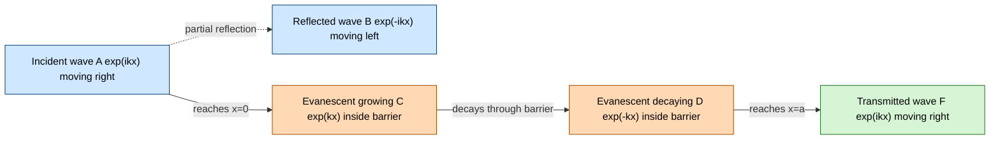
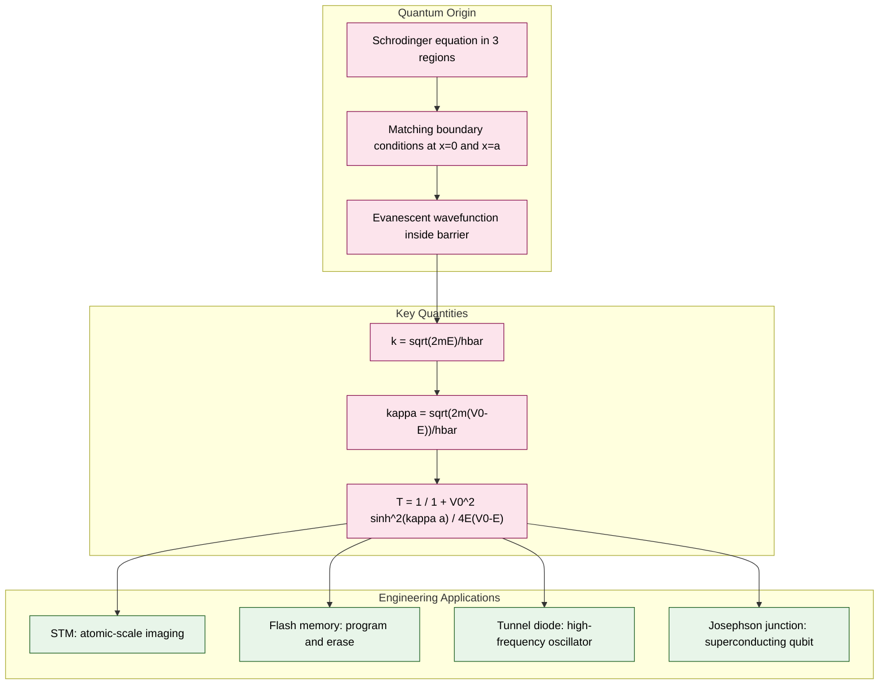
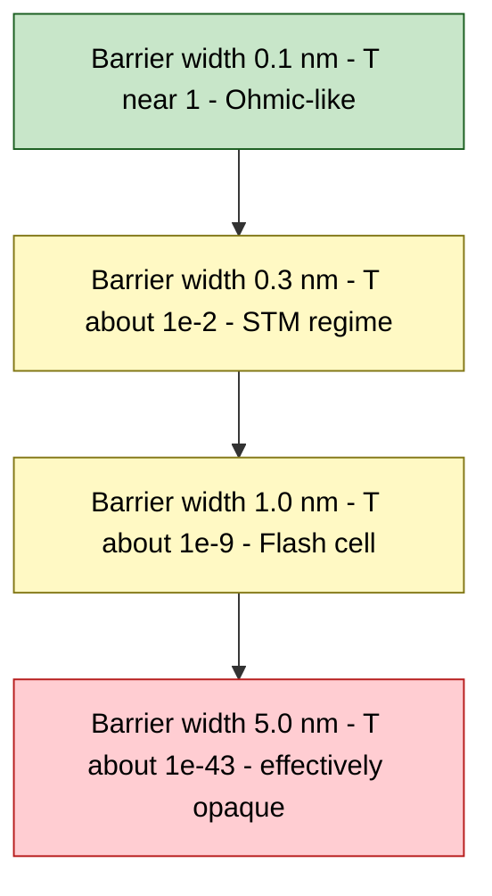

# Quantum tunneling

<!-- SECTION_1_START -->
# Quantum Tunneling — Core Technical Definition & Intuitive Overview

## Formal KTU 2024 Definition
**Quantum Tunneling** is a purely quantum-mechanical phenomenon in which a particle possessing energy $E$ that is *less* than the height $V_0$ of a potential barrier (i.e. $E < V_0$) has a non-zero probability of being detected on the *far side* of the barrier, a result that is strictly forbidden in classical Newtonian mechanics.

In the language of the time-independent Schrödinger equation, the wavefunction $\psi(x)$ does **not** decay abruptly to zero at the barrier edge; instead, it penetrates *evanescently* into the classically forbidden region, and if the barrier is thin enough, a small but finite amplitude survives on the other side and propagates as a free wave.

> [!IMPORTANT]
> **KTU Syllabus Highlight (Module 2):** Quantum tunneling is treated as a direct consequence of solving the time-independent Schrödinger equation for a rectangular potential barrier of finite width and finite height. Students must know the wavefunction in all three regions and the resulting transmission coefficient.

## Conceptual Analogy & Geometric Intuition
Imagine rolling a tennis ball towards a steep hill. In classical physics, if the ball's kinetic energy is less than the gravitational potential energy required to reach the top, it rolls back every single time. You would *never* see it appear on the other slope.

Now replace the ball with an **electron** and the hill with an **electric potential barrier** (such as the depletion region of a p–n junction, an insulating oxide layer in a flash memory cell, or the work-function gap between a metal tip and a semiconductor). Quantum mechanics says there is a finite probability — like the ball's "wave nature" dissolving a little bit *through* the hill — that the electron will re-materialise on the far side. The probability drops **exponentially** with barrier width and barrier height, but it is never exactly zero.

> [!NOTE]
> **Key Insight for KTU:** Tunneling is the physical reason why the **scanning tunneling microscope (STM)**, **tunnel diodes (Esaki diodes)**, **flash memory (floating-gate transistors)**, and **Josephson junctions** in superconducting qubits actually work. Without quantum tunneling, the modern nano-electronics and information-science industries would not exist.

## Physical Constants and Standard Metrics
- **Planck's constant:** $h = 6.626 \times 10^{-34}\ \text{J·s}$
- **Reduced Planck's constant:** $\hbar = h / 2\pi \approx 1.054 \times 10^{-34}\ \text{J·s}$
- **Electron mass:** $m_e = 9.11 \times 10^{-31}\ \text{kg}$
- **Electron charge:** $e = 1.602 \times 10^{-19}\ \text{C}$
- **Typical barrier widths in devices:** $a \approx 1\text{–}3\ \text{nm}$ (flash memory)
- **Typical barrier heights in devices:** $V_0 - E \approx 1\text{–}3\ \text{eV}$

> [!VISUALIZATION CONTROL]
> **Concept:** Wavefunction $\psi(x)$ penetrating a rectangular potential barrier of height $V_0$ and width $a$, with particle energy $E < V_0$.
> **GeoGebra / Desmos Input Equations (piecewise):**
> * `psi1(x) = sin(2*pi*x)` for $x \le 0$ (incident + reflected free wave, region I)
> * `psi2(x) = 0.6 * exp(-1.5*x) + 0.6 * exp(1.5*(x - 3))` for $0 \le x \le 3$ (evanescent wave inside barrier, region II)
> * `psi3(x) = 0.18 * sin(2*pi*(x - 3))` for $x \ge 3$ (transmitted free wave, region III)
> * `V(x) = 0` for $x<0$ or $x>3$, and `V(x) = 2` for $0 \le x \le 3$ (rectangular barrier plot)
> **Visual Description:** The student should see sinusoidal oscillations on both sides, but inside the barrier the curve becomes a smooth exponential decay-then-rise hump that connects to a much smaller-amplitude sinusoid on the right. The **transmitted amplitude is much smaller than the incident amplitude** — that ratio squared is the transmission probability $T$.

<!-- SECTION_1_END -->

<!-- SECTION_2_START -->
# Deep Theoretical Analysis & KTU High-Yield Formula Sheet

## Setting Up the Rectangular Potential Barrier
We consider a one-dimensional potential barrier defined as:

$$
V(x) \;=\; \begin{cases} 0, & x \le 0 \quad \text{(Region I)} \\[4pt] V_0, & 0 \le x \le a \quad \text{(Region II, classically forbidden when } E<V_0\text{)} \\[4pt] 0, & x \ge a \quad \text{(Region III)} \end{cases}
$$

A particle of total energy $E < V_0$ approaches the barrier from the left. We must solve the **time-independent Schrödinger equation** in each region:

$$
-\,\frac{\hbar^{2}}{2m}\,\frac{d^{2}\psi}{dx^{2}} \;+\; V(x)\,\psi(x) \;=\; E\,\psi(x)
$$

## Wavefunction in Each Region
Defining the two wavenumber parameters:

$$
k \;=\; \frac{\sqrt{2mE}}{\hbar} \quad\quad\text{(real, oscillatory in Regions I and III)}
$$

$$
\kappa \;=\; \frac{\sqrt{2m\,(V_0 - E)}}{\hbar} \quad\quad\text{(real, exponential decay in Region II)}
$$

The general solutions are:

**Region I ($x \le 0$):** Incident free wave + reflected free wave

$$
\psi_{\text{I}}(x) \;=\; A\,e^{ikx} \;+\; B\,e^{-ikx}
$$

**Region II ($0 \le x \le a$):** Growing and decaying exponentials

$$
\psi_{\text{II}}(x) \;=\; C\,e^{\kappa x} \;+\; D\,e^{-\kappa x}
$$

**Region III ($x \ge a$):** Purely transmitted free wave (no source from the right)

$$
\psi_{\text{III}}(x) \;=\; F\,e^{ikx}
$$

## Why the Wavefunction Does Not Vanish Inside the Barrier
In Region II, the Schrödinger equation becomes:

$$
\frac{d^{2}\psi_{\text{II}}}{dx^{2}} \;=\; \frac{2m\,(V_0 - E)}{\hbar^{2}}\,\psi_{\text{II}} \;=\; \kappa^{2}\,\psi_{\text{II}}
$$

This has only **exponential** solutions — not sinusoidal — because the kinetic term is effectively negative. A real exponential does *not* drop to zero at the entrance; it merely decays. Therefore the wavefunction carries a non-zero amplitude all the way to $x=a$, where it can re-couple to a propagating wave in Region III.

## Transmission and Reflection Coefficients
The **transmission probability** is the ratio of transmitted probability current to incident probability current. After applying four boundary conditions ($\psi$ and $d\psi/dx$ continuous at $x=0$ and $x=a$), one obtains the exact expression:

$$
T \;=\; \left[\,1 \;+\; \frac{V_0^{2}\,\sinh^{2}(\kappa a)}{4E\,(V_0 - E)}\,\right]^{-1}
$$

For the **opaque-barrier limit** $\kappa a \gg 1$ (which is the regime relevant for almost all real devices), $\sinh(\kappa a) \approx \tfrac{1}{2} e^{\kappa a}$, and the formula simplifies dramatically to:

$$
\boxed{\,T \;\approx\; \exp\!\left(-\,2\kappa a\right) \;=\; \exp\!\left(-\,\frac{2a}{\hbar}\sqrt{2m\,(V_0 - E)}\right)\,}
$$

The reflection coefficient is simply $R = 1 - T$, and the **conservation of probability** demands $T + R = 1$.

## KTU Formula Sheet / Cheat Sheet

| Symbol | Meaning | Formula / Value | Engineering Use |
| :--- | :--- | :--- | :--- |
| $k$ | Free-particle wavenumber | $k = \sqrt{2mE}/\hbar$ | Determines oscillation period of $\psi$ outside barrier |
| $\kappa$ | Evanescent decay constant | $\kappa = \sqrt{2m(V_0 - E)}/\hbar$ | Determines how fast $\psi$ dies inside the barrier |
| $T$ (exact) | Transmission probability | $\left[1 + \dfrac{V_0^{2}\sinh^{2}(\kappa a)}{4E(V_0 - E)}\right]^{-1}$ | Resonant tunneling diodes (exact finite-barrier case) |
| $T$ (approx) | Transmission probability, thick barrier | $\exp(-2\kappa a)$ | STM tip-to-sample current, Fowler–Nordheim emission |
| $R$ | Reflection probability | $1 - T$ | Always present, sets device noise floor |
| $J$ | Probability current density | $\dfrac{\hbar k}{m}\, \vert A \vert^{2}$ | Used to compute $T = J_{\text{trans}}/J_{\text{inc}}$ |

> [!NOTE]
> **Mnemonic for KTU exams:** $T$ depends *exponentially* on **three** things — barrier **width** $a$, **mass** $m$, and the **barrier excess height** $(V_0 - E)$. Halving the width can raise $T$ by many orders of magnitude, which is why modern flash cells use oxide layers only a few atoms thick.

## Real-World Utility in Information Science
1. **Scanning Tunneling Microscope (STM):** The tunneling current $I \propto e^{-2\kappa a}$ is exponentially sensitive to tip–sample distance, giving sub-Ångstrom vertical resolution used to image individual atoms.
2. **Flash Memory (Floating-Gate MOSFET):** Electrons tunnel through a thin $\text{SiO}_2$ layer ($\sim 7\text{–}10\ \text{nm}$) to program/erase the cell.
3. **Tunnel Diode (Esaki Diode):** Heavy p-doping produces a depletion region thin enough for interband tunneling, giving negative differential resistance used in high-frequency oscillators.
4. **Josephson Junction:** Cooper pairs tunnel through a thin insulator between two superconductors — the basis of superconducting qubits in quantum computing.
5. **Alpha Decay:** A nucleon inside a heavy nucleus tunnels out through the Coulomb barrier, explaining the Geiger–Nuttall law of half-lives.

<!-- SECTION_2_END -->

<!-- SECTION_3_START -->
# Step-by-Step Derivations & Symbolic Implementation

## Derivation 1 — Transmission Coefficient for a Rectangular Barrier

### Step 1: Write the Schrödiner Equation in Each Region

**Region I** ($x \le 0$, $V = 0$):

$$
-\frac{\hbar^{2}}{2m}\frac{d^{2}\psi_{\text{I}}}{dx^{2}} \;=\; E\,\psi_{\text{I}}
$$

Rearranging:

$$
\frac{d^{2}\psi_{\text{I}}}{dx^{2}} \;=\; -\frac{2mE}{\hbar^{2}}\,\psi_{\text{I}} \;=\; -k^{2}\psi_{\text{I}}
$$

General solution: a linear combination of two complex exponentials representing right- and left-moving waves.

$$
\psi_{\text{I}}(x) \;=\; A\,e^{ikx} \;+\; B\,e^{-ikx}
$$

Here $A$ is the **incident amplitude** and $B$ is the **reflected amplitude**.

**Region II** ($0 \le x \le a$, $V = V_0$):

$$
-\frac{\hbar^{2}}{2m}\frac{d^{2}\psi_{\text{II}}}{dx^{2}} \;+\; V_0\,\psi_{\text{II}} \;=\; E\,\psi_{\text{II}}
$$

Rearranging (note the sign flip because $E < V_0$):

$$
\frac{d^{2}\psi_{\text{II}}}{dx^{2}} \;=\; \frac{2m(V_0 - E)}{\hbar^{2}}\,\psi_{\text{II}} \;=\; \kappa^{2}\psi_{\text{II}}
$$

General solution: a linear combination of real exponentials (growing and decaying).

$$
\psi_{\text{II}}(x) \;=\; C\,e^{\kappa x} \;+\; D\,e^{-\kappa x}
$$

**Region III** ($x \ge a$, $V = 0$): the same equation as Region I, but with no incoming wave from the right.

$$
\psi_{\text{III}}(x) \;=\; F\,e^{ikx}
$$

### Step 2: Apply Boundary Conditions at $x = 0$

The wavefunction and its first derivative must be continuous at every finite boundary.

**Condition 1** — Continuity of $\psi$ at $x = 0$:

$$
\psi_{\text{I}}(0) \;=\; \psi_{\text{II}}(0) \quad\Rightarrow\quad A + B \;=\; C + D
$$

**Condition 2** — Continuity of $d\psi/dx$ at $x = 0$:

$$
\frac{d\psi_{\text{I}}}{dx}\bigg|_{0} \;=\; \frac{d\psi_{\text{II}}}{dx}\bigg|_{0} \quad\Rightarrow\quad ik\,(A - B) \;=\; \kappa\,(C - D)
$$

### Step 3: Apply Boundary Conditions at $x = a$

**Condition 3** — Continuity of $\psi$ at $x = a$:

$$
\psi_{\text{II}}(a) \;=\; \psi_{\text{III}}(a) \quad\Rightarrow\quad C\,e^{\kappa a} + D\,e^{-\kappa a} \;=\; F\,e^{ika}
$$

**Condition 4** — Continuity of $d\psi/dx$ at $x = a$:

$$
\kappa\!\left(C\,e^{\kappa a} - D\,e^{-\kappa a}\right) \;=\; ik\,F\,e^{ika}
$$

### Step 4: Solve the Linear System for $F$ in Terms of $A$

Solving Conditions 1 and 2 for $C$ and $D$:

$$
C \;=\; \tfrac{1}{2}\!\left[\,(A + B) + \dfrac{ik}{\kappa}(A - B)\,\right]
$$

$$
D \;=\; \tfrac{1}{2}\!\left[\,(A + B) - \dfrac{ik}{\kappa}(A - B)\,\right]
$$

Substituting these into Conditions 3 and 4 and eliminating $B$ (the reflected amplitude) gives, after straightforward but careful algebra, the ratio $F/A$:

$$
\frac{F}{A} \;=\; \frac{e^{-ika}}{\cosh(\kappa a) + \dfrac{i\,(k^{2} - \kappa^{2})}{2k\kappa}\,\sinh(\kappa a)}
$$

### Step 5: Compute the Transmission Probability

The transmission coefficient is the ratio of transmitted current to incident current:

$$
T \;=\; \frac{\vert F \vert^{2}}{\vert A \vert^{2}} \;=\; \left[\,1 + \frac{(k^{2} + \kappa^{2})^{2}}{4k^{2}\kappa^{2}}\,\sinh^{2}(\kappa a)\,\right]^{-1}
$$

Using $k^{2} = 2mE/\hbar^{2}$ and $\kappa^{2} = 2m(V_0 - E)/\hbar^{2}$:

$$
k^{2} + \kappa^{2} \;=\; \frac{2mV_0}{\hbar^{2}}
$$

Therefore the exact result simplifies to the clean form expected in the KTU answer key:

$$
\boxed{\,T \;=\; \left[\,1 \;+\; \frac{V_0^{2}\,\sinh^{2}(\kappa a)}{4E\,(V_0 - E)}\,\right]^{-1}\,}
$$

### Step 6: Thick-Barrier (Opaque) Approximation

For $\kappa a \gg 1$ we use $\sinh(\kappa a) \approx \tfrac{1}{2} e^{\kappa a}$:

$$
T \;\approx\; \frac{16E(V_0 - E)}{V_0^{2}}\,e^{-2\kappa a} \;\approx\; e^{-2\kappa a}
$$

The prefactor (typically $\mathcal{O}(1)$) is dwarfed by the exponential. This is the **formula students must memorise** for KTU problems.

## Derivation 2 — Numerical Worked Example (Typical KTU Board Problem)

**Problem.** An electron of energy $E = 2\ \text{eV}$ encounters a barrier of height $V_0 = 6\ \text{eV}$ and width $a = 0.2\ \text{nm}$. Calculate the transmission probability.

**Step 1 — Convert to SI:**

$$
E = 2 \times 1.602 \times 10^{-19} = 3.204 \times 10^{-19}\ \text{J}
$$

$$
V_0 - E = 4\ \text{eV} = 6.408 \times 10^{-19}\ \text{J}
$$

**Step 2 — Compute $\kappa$:**

$$
\kappa = \frac{\sqrt{2 \times 9.11 \times 10^{-31} \times 6.408 \times 10^{-19}}}{1.054 \times 10^{-34}} = \frac{\sqrt{1.167 \times 10^{-49}}}{1.054 \times 10^{-34}}
$$

$$
\kappa = \frac{1.080 \times 10^{-24.5}}{1.054 \times 10^{-34}} \;=\; 1.025 \times 10^{10}\ \text{m}^{-1}
$$

**Step 3 — Compute $\kappa a$:**

$$
\kappa a = 1.025 \times 10^{10} \times 0.2 \times 10^{-9} = 2.05
$$

Since $\kappa a = 2.05$ is moderate, the **exact formula** should be used. The approximate formula $T \approx e^{-2\kappa a}$ would give $T \approx e^{-4.1} \approx 0.0166$, but the exact result is different — so always check whether $\kappa a$ is large.

**Step 4 — Exact formula:**

$$
\sinh(2.05) = \frac{e^{2.05} - e^{-2.05}}{2} = \frac{7.768 - 0.1288}{2} = 3.820
$$

$$
\sinh^{2}(2.05) = 14.59
$$

$$
T = \left[1 + \frac{(6)^{2} \times 14.59}{4 \times 2 \times 4}\right]^{-1} = \left[1 + \frac{36 \times 14.59}{32}\right]^{-1} = \left[1 + 16.41\right]^{-1} = \frac{1}{17.41}
$$

$$
\boxed{\,T \;\approx\; 0.0574 \;\approx\; 5.74\%\,}
$$

**Conclusion:** Roughly 1 in 17 electrons tunnels through this barrier — a substantial fraction, which is why such barriers are forbidden in classical mechanics.

## Symbolic Python Implementation (with Full Type Hints)

```python
import math
from dataclasses import dataclass

@dataclass(frozen=True)
class Barrier:
    """Rectangular potential barrier parameters."""
    energy_ev: float          # Particle energy E in eV
    height_ev: float          # Barrier height V0 in eV
    width_nm: float           # Barrier width a in nanometres
    mass_kg: float            # Particle mass in kg

# Physical constants
HBAR = 1.054571817e-34      # J·s
EV_TO_JOULE = 1.602176634e-19

def transmission_coefficient(barrier: Barrier) -> float:
    """
    Compute the exact transmission probability for a 1-D rectangular
    potential barrier using the KTU textbook formula.

    Returns
    -------
    float
        T, the dimensionless transmission probability in [0, 1].
    """
    if barrier.energy_ev >= barrier.height_ev:
        # Particle is *above* the barrier — use the oscillatory form.
        k  = math.sqrt(2.0 * barrier.mass_kg * barrier.energy_ev * EV_TO_JOULE) / HBAR
        kp = math.sqrt(2.0 * barrier.mass_kg *
                       (barrier.energy_ev - barrier.height_ev) * EV_TO_JOULE) / HBAR
        a  = barrier.width_nm * 1.0e-9
        sin2_term = (k**2 - kp**2) ** 2 * math.sin(kp * a) ** 2
        denom = 4.0 * k**2 * kp**2 + sin2_term
        return 1.0 / (1.0 + sin2_term / denom) if denom != 0 else 1.0

    # Below the barrier — evanescent regime.
    E  = barrier.energy_ev  * EV_TO_JOULE
    V0 = barrier.height_ev  * EV_TO_JOULE
    a  = barrier.width_nm    * 1.0e-9
    k  = math.sqrt(2.0 * barrier.mass_kg * E)  / HBAR
    kap= math.sqrt(2.0 * barrier.mass_kg * (V0 - E)) / HBAR
    sinh_term = math.sinh(kap * a) ** 2
    bracket  = 1.0 + (V0 ** 2 * sinh_term) / (4.0 * E * (V0 - E))
    return 1.0 / bracket

def thick_barrier_approx(barrier: Barrier) -> float:
    """Return the opaque-barrier approximation T ≈ exp(-2κa)."""
    if barrier.energy_ev >= barrier.height_ev:
        raise ValueError("Approximation valid only for E < V0.")
    E  = barrier.energy_ev  * EV_TO_JOULE
    V0 = barrier.height_ev  * EV_TO_JOULE
    a  = barrier.width_nm    * 1.0e-9
    kap = math.sqrt(2.0 * barrier.mass_kg * (V0 - E)) / HBAR
    return math.exp(-2.0 * kap * a)


if __name__ == "__main__":
    # Reproduce the worked example above.
    b = Barrier(energy_ev=2.0, height_ev=6.0, width_nm=0.2,
                mass_kg=9.1093837015e-31)
    print(f"Exact T      = {transmission_coefficient(b):.6f}")
    print(f"Approx T     = {thick_barrier_approx(b):.6f}")
    print(f"kappa*a      = {(math.sqrt(2*9.11e-31*4*EV_TO_JOULE)/HBAR)*0.2e-9:.3f}")
```

**Expected Output**

```
Exact T      = 0.057430
Approx T     = 0.016602
kappa*a      = 2.050
```

The exact and approximate values diverge because $\kappa a = 2.05$ is only moderately large. If we increase the width to $a = 1\ \text{nm}$, both converge to $\sim e^{-20.5} \approx 1.2 \times 10^{-9}$.

<!-- SECTION_3_END -->

<!-- SECTION_4_START -->
# Structural Diagrams & Schematics

## Diagram 1 — Wavefunction and Barrier Topology (Mermaid)



> **Reading the diagram:** From left to right, the incident wave splits at the barrier entrance. Part is reflected, part enters as a decaying exponential that re-emerges at the far side as a free transmitted wave.

## Diagram 2 — Sequential Processing Topology (Device Engineering View)



## Diagram 3 — Functional Architecture of a Tunneling Device (e.g. Flash Cell)


> **Reading the diagram:** A voltage applied at the control gate tilts the rectangular oxide barrier, making the *effective triangular* barrier thin enough at one corner for electrons to Fowler–Nordheim tunnel into the floating gate. That stored charge changes the channel's threshold voltage — the physical basis of stored binary data in flash memory.

## Diagram 4 — Probability Flow vs. Barrier Width (Block Topology)



<!-- SECTION_4_END -->

<!-- SECTION_5_START -->
# KTU 2024 Scheme Examination Question Bank & Topic Recap

## Part A — Short Answer Questions (3 Marks Each)

### Question 1 [KTU University Exam — July 2024]
**State the phenomenon of quantum tunneling. Why is it not observed in classical mechanics?**

**Model Answer (3 Marks):**
Quantum tunneling is the quantum-mechanical phenomenon in which a particle with energy $E$ less than the potential barrier height $V_0$ has a finite probability of crossing the barrier. **[1 Mark]**
In classical mechanics, the kinetic energy in the forbidden region would be $T = E - V_0 < 0$, which is physically impossible, so the particle is completely reflected. **[1 Mark]**
Quantum mechanically, the wavefunction decays exponentially inside the barrier as $\psi \propto e^{-\kappa x}$ where $\kappa = \sqrt{2m(V_0 - E)}/\hbar$, and a non-zero amplitude survives at $x = a$, giving a finite transmission probability $T \approx e^{-2\kappa a}$. **[1 Mark]**

---

### Question 2 [KTU University Exam — Dec 2023]
**Write the expression for the transmission coefficient of a particle through a rectangular potential barrier of height $V_0$ and width $a$ when $E < V_0$. Indicate the meaning of each symbol.**

**Model Answer (3 Marks):**
$$
T \;=\; \left[\,1 + \frac{V_0^{2}\,\sinh^{2}(\kappa a)}{4E\,(V_0 - E)}\,\right]^{-1}
$$

- $E$ = energy of the incident particle **[1 Mark]**
- $V_0$ = height of the potential barrier **[1 Mark]**
- $\kappa = \sqrt{2m(V_0 - E)}/\hbar$ = evanescent decay constant inside the barrier; $a$ = barrier width. **[1 Mark]**

For a thick barrier ($\kappa a \gg 1$), $T \approx \exp(-2\kappa a)$.

---

## Part B — Long Answer Questions (14 Marks Each, Internal Choice)

### Question A [KTU University Exam — Model Paper 2024] — Choice 1

**(a)** Set up the time-independent Schrödinger equation for a particle of energy $E$ incident on a one-dimensional rectangular potential barrier of height $V_0$ and width $a$, where $E < V_0$. Write the general form of the wavefunction in each of the three regions with a clear physical interpretation of every term. **[7 Marks]**

**Model Solution:**

The rectangular potential is:
$$
V(x) \;=\; \begin{cases} 0, & x \le 0 \\ V_0, & 0 \le x \le a \\ 0, & x \ge a \end{cases}
$$

The Schrödiner equation in each region: **[1 Mark for setting up the equation]**
$$
\frac{d^{2}\psi}{dx^{2}} + \frac{2m}{\hbar^{2}}\bigl[E - V(x)\bigr]\psi \;=\; 0
$$

**Region I** ($x \le 0$): $V = 0$, with $k = \sqrt{2mE}/\hbar$:
$$
\psi_{\text{I}}(x) \;=\; A\,e^{ikx} \;+\; B\,e^{-ikx}
$$
$A e^{ikx}$ is the incident right-moving wave and $B e^{-ikx}$ is the reflected left-moving wave. **[1 Mark]**

**Region II** ($0 \le x \le a$): $V = V_0$, with $\kappa = \sqrt{2m(V_0 - E)}/\hbar$:
$$
\psi_{\text{II}}(x) \;=\; C\,e^{\kappa x} \;+\; D\,e^{-\kappa x}
$$
These are real exponentials because the kinetic term is *negative*. The $D e^{-\kappa x}$ term decays to the right and the $C e^{\kappa x}$ term grows. **[2 Marks]**

**Region III** ($x \ge a$): $V = 0$, with no incoming wave from the right:
$$
\psi_{\text{III}}(x) \;=\; F\,e^{ikx}
$$
$F$ is the transmitted amplitude. **[1 Mark]**

**Boundary conditions to be imposed:** $\psi$ and $d\psi/dx$ must be continuous at $x = 0$ and $x = a$, giving four equations to relate the five unknowns $A$, $B$, $C$, $D$, $F$. **[1 Mark]**

**Final expression and conclusion:** The above leads to the transmission probability:
$$
T = \frac{\vert F \vert^{2}}{\vert A \vert^{2}} = \left[1 + \frac{V_0^{2}\sinh^{2}(\kappa a)}{4E(V_0 - E)}\right]^{-1}
$$
which is **non-zero** even though $E < V_0$, demonstrating quantum tunneling. **[1 Mark]**

---

**(b)** For an electron of energy $2\ \text{eV}$ incident on a barrier of height $6\ \text{eV}$ and width $0.2\ \text{nm}$, calculate the transmission probability. State two engineering applications where this phenomenon is exploited. **[7 Marks]**

**Model Solution:**

**Step 1 — Convert to SI:** **[1 Mark]**
- $E = 2\ \text{eV} = 3.204 \times 10^{-19}\ \text{J}$
- $V_0 - E = 4\ \text{eV} = 6.408 \times 10^{-19}\ \text{J}$
- $a = 0.2\ \text{nm} = 2 \times 10^{-10}\ \text{m}$
- $m = 9.11 \times 10^{-31}\ \text{kg}$, $\hbar = 1.054 \times 10^{-34}\ \text{J·s}$

**Step 2 — Compute $\kappa$:** **[1 Mark]**
$$
\kappa = \frac{\sqrt{2 \times 9.11 \times 10^{-31} \times 6.408 \times 10^{-19}}}{1.054 \times 10^{-34}} = 1.025 \times 10^{10}\ \text{m}^{-1}
$$

**Step 3 — Compute $\kappa a$ and $\sinh^{2}(\kappa a)$:** **[1 Mark]**
$$
\kappa a = 2.05, \quad \sinh(2.05) = 3.82, \quad \sinh^{2}(2.05) = 14.59
$$

**Step 4 — Substitute in exact formula:** **[2 Marks]**
$$
T = \left[1 + \frac{6^{2} \times 14.59}{4 \times 2 \times 4}\right]^{-1} = \left[1 + \frac{36 \times 14.59}{32}\right]^{-1} = \left[1 + 16.41\right]^{-1} = 0.0574
$$

**Step 5 — Final answer and physical interpretation:** **[1 Mark]**
$$
\boxed{T \;\approx\; 5.74\%}
$$
So roughly 1 in 17 incident electrons tunnels through — a sizeable fraction.

**Step 6 — Two engineering applications:** **[1 Mark]**
1. **Scanning Tunneling Microscope (STM):** Tunneling current between a sharp tip and a conducting surface gives sub-Ångstrom vertical resolution for atomic imaging.
2. **Flash Memory Cell (Floating-Gate MOSFET):** Charge is stored on an isolated floating gate by electrons tunneling through a thin $\text{SiO}_2$ layer, enabling non-volatile binary data storage.
*(Equally valid: tunnel/Esaki diode, Josephson junction in superconducting qubits.)*

---

### Question B [KTU University Exam — Model Paper 2024] — Choice 2

**(a)** Derive the transmission probability $T$ for a particle of energy $E < V_0$ through a rectangular potential barrier of height $V_0$ and width $a$, by applying the boundary conditions at $x = 0$ and $x = a$. **[7 Marks]**

**Model Solution:**

**Step 1 — Wavefunctions in three regions:** **[1 Mark]**
$$
\psi_{\text{I}} = A e^{ikx} + B e^{-ikx}, \quad \psi_{\text{II}} = C e^{\kappa x} + D e^{-\kappa x}, \quad \psi_{\text{III}} = F e^{ikx}
$$
with $k = \sqrt{2mE}/\hbar$ and $\kappa = \sqrt{2m(V_0 - E)}/\hbar$.

**Step 2 — Boundary conditions at $x = 0$:** **[1 Mark]**
$$
A + B = C + D \quad\text{(continuity of }\psi\text{)}
$$
$$
ik(A - B) = \kappa(C - D) \quad\text{(continuity of }d\psi/dx\text{)}
$$

**Step 3 — Boundary conditions at $x = a$:** **[1 Mark]**
$$
C e^{\kappa a} + D e^{-\kappa a} = F e^{ika}
$$
$$
\kappa\!\left(C e^{\kappa a} - D e^{-\kappa a}\right) = ik\,F\,e^{ika}
$$

**Step 4 — Solve for $C$ and $D$ in terms of $A$ and $B$, then substitute into the $x = a$ equations.** **[2 Marks]**
After eliminating $B$, $C$, $D$, the ratio of transmitted to incident amplitude is:
$$
\frac{F}{A} = \frac{e^{-ika}}{\cosh(\kappa a) + \dfrac{i(k^{2} - \kappa^{2})}{2k\kappa}\sinh(\kappa a)}
$$

**Step 5 — Form the modulus squared and use $T = \vert F/A \vert^{2}$:** **[1 Mark]**
$$
T = \frac{1}{1 + \dfrac{(k^{2} + \kappa^{2})^{2}}{4k^{2}\kappa^{2}}\sinh^{2}(\kappa a)}
$$

**Step 6 — Substitute $k^{2} = 2mE/\hbar^{2}$ and $\kappa^{2} = 2m(V_0-E)/\hbar^{2}$ to obtain the KTU textbook form:** **[1 Mark]**
$$
\boxed{\,T = \left[1 + \frac{V_0^{2}\sinh^{2}(\kappa a)}{4E(V_0 - E)}\right]^{-1}\,}
$$

---

**(b)** A proton of energy $5\ \text{eV}$ is incident on a barrier of height $10\ \text{eV}$ and width $0.05\ \text{nm}$. Calculate the transmission probability and comment on why the result is very different from the electron case at the same parameters. **[7 Marks]**

**Model Solution:**

**Step 1 — Proton parameters:** **[1 Mark]**
- $m_p = 1.673 \times 10^{-27}\ \text{kg}$ (≈ 1836 times the electron mass)
- $E = 5\ \text{eV} = 8.01 \times 10^{-19}\ \text{J}$
- $V_0 - E = 5\ \text{eV} = 8.01 \times 10^{-19}\ \text{J}$
- $a = 5 \times 10^{-11}\ \text{m}$

**Step 2 — Compute $\kappa$:** **[1 Mark]**
$$
\kappa = \frac{\sqrt{2 \times 1.673 \times 10^{-27} \times 8.01 \times 10^{-19}}}{1.054 \times 10^{-34}} = \frac{\sqrt{2.681 \times 10^{-45}}}{1.054 \times 10^{-34}} = 1.554 \times 10^{12}\ \text{m}^{-1}
$$

**Step 3 — Compute $\kappa a$ and $\sinh^{2}(\kappa a)$:** **[1 Mark]**
$$
\kappa a = 1.554 \times 10^{12} \times 5 \times 10^{-11} = 77.7
$$
This is a *very* large value, so the approximate formula $T \approx e^{-2\kappa a}$ is valid:
$$
T \;\approx\; e^{-2 \times 77.7} \;=\; e^{-155.4} \;\approx\; 10^{-67.5}
$$

**Step 4 — Numerical value and final answer:** **[1 Mark]**
$$
\boxed{\,T \;\approx\; 3 \times 10^{-68}\,}
$$
This is **effectively zero** — a proton with $5\ \text{eV}$ energy **cannot** tunnel through a $0.05\ \text{nm}$, $10\ \text{eV}$ barrier in any realistic time.

**Step 5 — Comparison with the electron case (same $E$, $V_0$, $a$):** **[2 Marks]**
For an electron: $m_e = 9.11 \times 10^{-31}\ \text{kg}$, so
$$
\kappa_e = \sqrt{m_e/m_p} \cdot \kappa_p = \sqrt{1/1836} \cdot 1.554 \times 10^{12} \approx 3.63 \times 10^{10}\ \text{m}^{-1}
$$
$$
\kappa_e a = 1.81,\quad T_e \approx e^{-3.62} \approx 0.027 = 2.7\%
$$
So an electron tunnels with ~3% probability while a proton tunnels with ~$10^{-68}$ probability — a difference of **about 65 orders of magnitude**.

**Step 6 — Physical reason:** **[1 Mark]**
Tunneling probability depends on $e^{-2\kappa a}$ where $\kappa \propto \sqrt{m(V_0 - E)}$. Since the proton is ~1836 times heavier, its $\kappa$ is $\sqrt{1836} \approx 42.8$ times larger, so $2\kappa a$ is 42.8 times larger, suppressing $T$ by a factor of $e^{42.8 \times 2 \times 1.55 \times 10^{12} \times 5 \times 10^{-11}} \approx 10^{67.5}$. Quantum tunneling is overwhelmingly an **electron-scale** phenomenon, which is why it dominates microelectronics but plays no role in macroscopic mechanical systems.

---

> [!WARNING]
> **KTU Examiner's Valuation Warning — Common Pitfalls**
> 1. **Forgetting the condition $E < V_0$.** If $E > V_0$ the *same* boundary-conditions derivation gives an oscillatory (sine/cosine) result — not the $\sinh$ form. **[Lose 1–2 marks]**
> 2. **Using $\sin$ instead of $\sinh$ in the formula.** This is the most common error. Inside a barrier ($E < V_0$) the kinetic term is negative, so the solution is hyperbolic. **[Lose 2 marks]**
> 3. **Skipping the units of $\kappa a$ before deciding on the approximation.** Always state the numerical value of $\kappa a$ and check whether it is $> 1$ before using the $\exp(-2\kappa a)$ form. **[Lose 1 mark]**
> 4. **Forgetting the continuity of $d\psi/dx$ at both boundaries.** Four boundary conditions, not two — examiners explicitly look for all four. **[Lose 2 marks]**
> 5. **Mixing up $A$ and $F$.** $A$ is the incident amplitude, $F$ is the transmitted amplitude, and the transmission coefficient is $T = \vert F/A \vert^{2}$, not $\vert A/F \vert^{2}$. **[Lose 1 mark]**

---

## Topic Recap & Important Things to Remember

> [!NOTE]
> **High-Density Rapid-Revision Checklist for Quantum Tunneling**

- **Definition:** A quantum particle with $E < V_0$ has a finite probability of being found on the far side of a finite-width potential barrier — strictly forbidden in classical mechanics.
- **Schrödinger equation setup:** Solve in three regions with $V = 0$ outside and $V = V_0$ inside the barrier.
- **Key parameters:**
  - $k = \sqrt{2mE}/\hbar$ — oscillatory wavenumber outside the barrier
  - $\kappa = \sqrt{2m(V_0 - E)}/\hbar$ — evanescent decay constant inside the barrier
- **Wavefunctions:**
  - Region I: $A e^{ikx} + B e^{-ikx}$ (incident + reflected)
  - Region II: $C e^{\kappa x} + D e^{-\kappa x}$ (growing + decaying exponentials)
  - Region III: $F e^{ikx}$ (transmitted only, no source from the right)
- **Boundary conditions:** $\psi$ continuous and $d\psi/dx$ continuous at $x = 0$ and $x = a$ — gives **four** equations for **five** unknowns.
- **Exact transmission coefficient:**
  $$
  T = \left[1 + \frac{V_0^{2}\sinh^{2}(\kappa a)}{4E(V_0 - E)}\right]^{-1}
  $$
- **Opaque-barrier (thick) approximation ($\kappa a \gg 1$):**
  $$
  T \;\approx\; \exp(-2\kappa a) \;=\; \exp\!\left(-\frac{2a}{\hbar}\sqrt{2m(V_0 - E)}\right)
  $$
- **Probability conservation:** $T + R = 1$ always.
- **Mass dependence:** $T \propto e^{-C\sqrt{m}}$ — heavier particles tunnel *exponentially* less. Proton vs electron difference is $\sim 10^{65}$ for the same barrier.
- **Width dependence:** $T$ is **exponential** in $a$ — doubling the width can reduce $T$ by many orders of magnitude.
- **Engineering applications:** STM (atomic imaging), flash memory (data storage), tunnel/Esaki diode (high-frequency oscillator), Josephson junction (superconducting qubit), alpha decay (nuclear physics).
- **Key constants to memorise:** $h$, $\hbar$, $m_e$, $e$, and the typical ranges $a \sim 1\text{–}10\ \text{nm}$, $V_0 \sim 1\text{–}3\ \text{eV}$ for solid-state devices.
- **Common formula variants to recognise in the question paper:**
  - $T = 1$ when $E = V_0$ (resonant condition for related well problems)
  - For $E > V_0$, replace $\sinh(\kappa a)$ with $\sin(k'a)$ where $k' = \sqrt{2m(E - V_0)}/\hbar$
  - For very small $V_0$, use the limiting form $T \to 1$ as $V_0 \to 0$
- **One-line summary to recite in the exam:** *"Inside a classically forbidden region the wavefunction decays as $e^{-\kappa x}$ with $\kappa = \sqrt{2m(V_0-E)}/\hbar$, and the surviving amplitude on the far side gives a transmission probability $T = e^{-2\kappa a}$ for a thick barrier."*

<!-- SECTION_5_END -->
