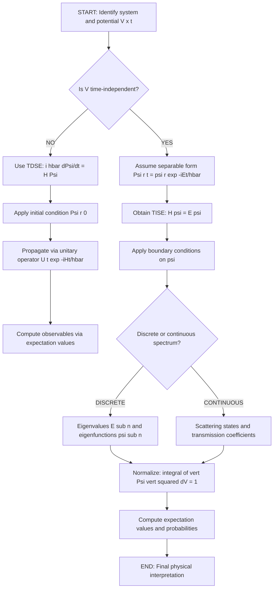
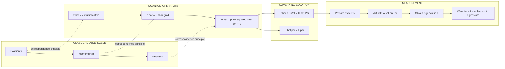
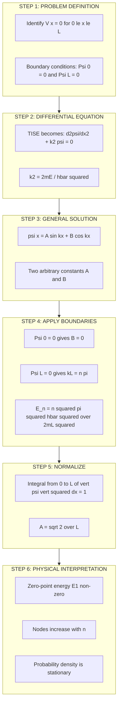
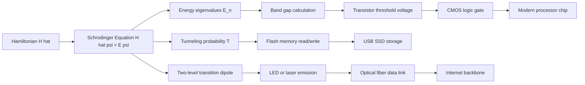

# Schrodinger equations

<!-- SECTION_1_START -->

# Schrodinger Equations — The Heart of Quantum Mechanics

## 1.1 Formal Definition (KTU 2024 Syllabus Terminology)

The **Schrödinger Equation** is the fundamental, wave-mechanical postulatory equation of non-relativistic quantum mechanics that governs the temporal and spatial evolution of the **quantum state** (the wave function $\psi$) of an isolated physical system. In the formalism developed by Erwin Schrödinger (1926), every measurable property of a microscopic particle — its position, momentum, kinetic energy, and total energy — is encoded in a complex-valued function $\psi(\vec{r}, t)$ whose evolution is dictated by the Hamiltonian operator $\hat{H}$ of the system.

> [!IMPORTANT]
> **Board-Exam Definition (Memorize Verbatim):**
> The Schrödinger equation is a linear, partial differential equation of first order in time and second order in space, expressing that the total energy operator (Hamiltonian) acting on the wave function equals the observable total energy of the system.

It exists in two canonical forms:

1. **Time-Dependent Schrödinger Equation (TDSE):** Describes the dynamical evolution of a quantum state under a time-varying or stationary Hamiltonian.
2. **Time-Independent Schrödinger Equation (TISE):** The eigenvalue equation obtained for stationary states (e.g., bound states, standing-wave solutions).

## 1.2 Conceptual Analogy & Intuition

Imagine you are watching a ripple on the surface of a still pond. Each ripple is not a "thing" by itself — it is a *disturbance* that carries energy and information across space. Now imagine that the ripple does not just carry water-energy but also carries *probability information* about where a sub-atomic particle (say, an electron) is most likely to be found if you measure it. The Schrödinger equation is essentially the **"rule-book"** for how this probability-ripple propagates, bends, interferes, and gets trapped inside potential walls.

> [!NOTE]
> **Newton's Law vs. Schrödinger's Law**
> In classical mechanics, $\vec{F} = m\vec{a}$ tells you *where a particle will be* given its initial conditions.
> In quantum mechanics, the Schrödinger equation tells you *where a particle might be* — it gives a probability amplitude $\psi$, and the actual measurement outcome is intrinsically statistical.

> [!TIP]
> **Geometric Intuition**
> Think of $\psi(x,t)$ as a complex landscape (a height field over the $x$–$t$ plane) whose squared magnitude $\vert \psi \vert^2$ is the *density of probability fog*. The Schrödinger equation is the differential "law of motion" of this fog.

## 1.3 Standard Constants and Symbols

| Symbol | Quantity | Standard Value/Unit |
|---|---|---|
| $\hbar$ | Reduced Planck constant | $\mathbf{1.0545718 \times 10^{-34}\ \text{J}\cdot\text{s}}$ |
| $m$ | Mass of the particle | kilograms ($\text{kg}$) |
| $i$ | Imaginary unit | $\sqrt{-1}$ |
| $\psi$ | Wave function (state) | $\text{m}^{-3/2}$ (3D) |
| $E$ | Energy eigenvalue | joules ($\text{J}$) or eV |
| $V(\vec{r},t)$ | Potential energy | joules ($\text{J}$) |
| $\hat{H}$ | Hamiltonian operator | joules ($\text{J}$) |

> [!VISUALIZATION CONTROL]
> **Concept:** Standing-wave probability density for a particle in a 1-D infinite potential well of width $L = 1\ \text{m}$.
> **GeoGebra / Desmos Input Equations:**
> * `psi_n(x) = sqrt(2) * sin(n * pi * x)` for $n = 1, 2, 3$
> * `P_n(x) = (psi_n(x))^2`
> **Visual Description:** The student should observe that for $n = 1$, there is one antinode of probability density with maxima at the center; for $n = 2$, two antinodes separated by a node at $x = 0.5$; for $n = 3$, three antinodes, and so on. The number of nodes equals $(n-1)$.

## 1.4 Why the Schrödinger Equation Matters in Information Science

The Schrödinger equation is the engine behind every modern electronic and opto-electronic device:

- **Transistors & Semiconductors:** Band-structure calculations (solving TISE in periodic potentials) determine carrier energies.
- **Lasers & LEDs:** Photon emission and stimulated emission rely on quantized electronic states.
- **Quantum Computing (Qubits):** The two-level system used as a qubit is literally a Schrödinger equation with a 2-D Hilbert space.
- **MRI & NMR Imaging:** Spin precession under the time-dependent Hamiltonian produces the medical image.

<!-- SECTION_1_END -->

<!-- SECTION_2_START -->

# Deep Theoretical Analysis & KTU High-Yield Formula Sheet

## 2.1 The Postulates Behind the Schrödinger Equation

The Schrödinger equation is **not derived** from more basic principles — it is a postulate, empirically validated to extraordinary precision. However, its construction is guided by the following de Broglie / Hamilton correspondence:

1. **Matter-wave hypothesis (de Broglie, 1924):** Every particle of momentum $p$ and energy $E$ has an associated wave of wavelength $\lambda = h/p$ and frequency $\nu = E/h$.
2. **Hamiltonian analogy:** Replace classical energy observable $E$ with the operator $i\hbar \dfrac{\partial}{\partial t}$, and replace classical momentum $\vec{p}$ with the operator $-i\hbar \vec{\nabla}$.
3. **Apply $E = \dfrac{p^2}{2m} + V$** to the wave function $\psi$ to obtain the equation.

## 2.2 Time-Dependent Schrödinger Equation (TDSE)

For a single non-relativistic particle of mass $m$ moving in a scalar potential $V(\vec{r}, t)$:

$$
\boxed{
i\hbar \frac{\partial \psi(\vec{r}, t)}{\partial t} \;=\; \hat{H}\,\psi(\vec{r}, t) \;=\; \left[ -\frac{\hbar^{2}}{2m}\,\nabla^{2} + V(\vec{r}, t) \right]\psi(\vec{r}, t)
}
$$

where the **Hamiltonian operator** is $\hat{H} = -\dfrac{\hbar^{2}}{2m}\nabla^{2} + V(\vec{r}, t)$.

**Properties of TDSE:**

- **Linear:** If $\psi_{1}$ and $\psi_{2}$ are solutions, then $\alpha \psi_{1} + \beta \psi_{2}$ is also a solution (principle of superposition).
- **First-order in time:** Only the *initial* wave function $\psi(\vec{r}, 0)$ is required to uniquely determine the future.
- **Reversible:** Replacing $t \to -t$ and taking complex conjugate restores the original evolution (unlike the diffusion/heat equation, which is irreversible).

## 2.3 Time-Independent Schrödinger Equation (TISE)

When the potential is *stationary* ($V$ independent of $t$), use **separation of variables**:

$$
\psi(\vec{r}, t) = \psi(\vec{r})\,e^{-iEt/\hbar}
$$

Substituting into the TDSE and cancelling the time factor yields the **eigenvalue equation**:

$$
\boxed{
\hat{H}\,\psi(\vec{r}) \;=\; E\,\psi(\vec{r})
}
$$

In one spatial dimension, this expands to:

$$
\boxed{
-\frac{\hbar^{2}}{2m}\,\frac{d^{2}\psi(x)}{dx^{2}} + V(x)\,\psi(x) \;=\; E\,\psi(x)
}
$$

> [!NOTE]
> **Why "Eigenvalue"?** The Hamiltonian operator acting on the wave function returns the *same* function scaled by the energy $E$. The admissible values of $E$ form a *spectrum* (discrete, continuous, or mixed), and the corresponding $\psi$ are *eigenfunctions*.

## 2.4 Physical Interpretation of the Wave Function

**Born's Statistical Interpretation (Max Born, 1926):**

$$
\boxed{
P(\vec{r}, t)\,d^{3}r \;=\; \vert \psi(\vec{r}, t) \vert^{2}\,d^{3}r \;=\; \psi^{*}(\vec{r}, t)\,\psi(\vec{r}, t)\,d^{3}r
}
$$

is the probability of finding the particle inside the infinitesimal volume $d^{3}r$ around $\vec{r}$ at time $t$.

**Normalization condition (total probability = 1):**

$$
\int_{-\infty}^{+\infty} \vert \psi(\vec{r}, t) \vert^{2}\,d^{3}r \;=\; 1
$$

## 2.5 Hermitian Operators and Observables

Every measurable physical quantity $\mathcal{A}$ is represented by a **Hermitian operator** $\hat{A}$ that satisfies:

$$
\int \phi^{*}\,\hat{A}\,\psi\,dx \;=\; \int (\hat{A}\phi)^{*}\,\psi\,dx
$$

This guarantees that eigenvalues of $\hat{A}$ are *real* (matching the requirement that measurements yield real numbers).

## 2.6 Expectation Value Theorem

The average of many repeated measurements of observable $A$ on identically prepared systems is:

$$
\boxed{
\langle A \rangle \;=\; \int_{-\infty}^{+\infty} \psi^{*}(\vec{r}, t)\,\hat{A}\,\psi(\vec{r}, t)\,d^{3}r
}
$$

## 2.7 KTU Formula Sheet / Cheat Sheet

| $\#$ | Formula / Equation | Meaning | Units |
|---|---|---|---|
| 1 | $i\hbar \dfrac{\partial \psi}{\partial t} = \hat{H}\psi$ | Time-Dependent Schrödinger Equation (TDSE) | $\text{J}$ |
| 2 | $\hat{H} = -\dfrac{\hbar^{2}}{2m}\nabla^{2} + V(\vec{r})$ | Hamiltonian operator (kinetic + potential) | $\text{J}$ |
| 3 | $\hat{H}\psi = E\psi$ | Time-Independent Schrödinger Equation (TISE) | $\text{J}$ |
| 4 | $\hat{p} = -i\hbar \nabla$ | Momentum operator | $\text{kg}\cdot\text{m/s}$ |
| 5 | $\hat{x} = x$ | Position operator (multiplicative) | $\text{m}$ |
| 6 | $\hat{E} = i\hbar \dfrac{\partial}{\partial t}$ | Energy operator | $\text{J}$ |
| 7 | $\hat{L}_{z} = -i\hbar \dfrac{\partial}{\partial \phi}$ | Angular-momentum $z$-component | $\text{J}\cdot\text{s}$ |
| 8 | $\int \vert \psi \vert^{2}\,d^{3}r = 1$ | Normalization condition | dimensionless |
| 9 | $\langle A \rangle = \int \psi^{*}\hat{A}\psi\,d^{3}r$ | Expectation value of $A$ | depends on $A$ |
| 10 | $\Delta A = \sqrt{\langle A^{2} \rangle - \langle A \rangle^{2}}$ | Standard deviation (uncertainty) | depends on $A$ |
| 11 | $\Delta x \cdot \Delta p \ge \dfrac{\hbar}{2}$ | Heisenberg Uncertainty Principle | $\text{J}\cdot\text{s}$ |
| 12 | $\psi(\vec{r}, t) = \psi(\vec{r})\,e^{-iEt/\hbar}$ | Stationary-state ansatz | $\text{m}^{-3/2}$ |
| 13 | $\lambda = h/p$ | de Broglie wavelength | $\text{m}$ |
| 14 | $\nu = E/h$ | Matter-wave frequency | $\text{Hz}$ |
| 15 | $\psi_{n}(x) = \sqrt{\dfrac{2}{L}}\sin\!\left(\dfrac{n\pi x}{L}\right)$ | Particle in 1-D box eigenfunction | $\text{m}^{-1/2}$ |
| 16 | $E_{n} = \dfrac{n^{2}\pi^{2}\hbar^{2}}{2mL^{2}}$ | Particle in 1-D box energy | $\text{J}$ |

> [!IMPORTANT]
> **Table Notation Rule:** In all markdown table cells above, the absolute-value bars have been escaped as $\vert \cdot \vert$ to prevent markdown-table parsing errors. The reader should mentally translate $\vert \psi \vert$ back to $\mid \psi \mid$.

## 2.8 Real-World Engineering Utility

| Engineering Field | Use of Schrödinger Equation |
|---|---|
| Semiconductor device design | Solve TISE in periodic potentials to obtain band structures (Si, GaAs) |
| Quantum-dot LEDs / solar cells | Confined-particle eigenenergies determine emission wavelength |
| Tunnel diodes / flash memory | Tunneling probability from finite-barrier TISE |
| MRI / NMR | Time-dependent Hamiltonian of nuclear spins |
| Quantum cryptography / QKD | Single-photon wave-packet solutions |
| Scanning Tunneling Microscope (STM) | Electron tunneling from tip to surface |

<!-- SECTION_2_END -->

<!-- SECTION_3_START -->

# Step-by-Step Derivations & Symbolic Implementation

## 3.1 Derivation: From TDSE to TISE via Separation of Variables

**Starting Point.** Consider a particle in a *time-independent* potential $V(\vec{r})$ (i.e., $V$ has no explicit $t$-dependence). The TDSE is:

$$
i\hbar\,\frac{\partial}{\partial t}\,\psi(\vec{r}, t) \;=\; \left[-\frac{\hbar^{2}}{2m}\nabla^{2} + V(\vec{r})\right]\psi(\vec{r}, t)
$$

**Step 1 — Assume separable solution.** Let the wave function factor into a spatial part and a temporal part:

$$
\psi(\vec{r}, t) \;=\; \psi(\vec{r})\,\phi(t)
$$

**Step 2 — Substitute into the TDSE.**

$$
i\hbar\,\psi(\vec{r})\,\frac{d\phi(t)}{dt} \;=\; \left[-\frac{\hbar^{2}}{2m}\nabla^{2}\psi(\vec{r}) + V(\vec{r})\psi(\vec{r})\right]\phi(t)
$$

**Step 3 — Divide both sides by $\psi(\vec{r})\,\phi(t)$.**

$$
i\hbar\,\frac{1}{\phi(t)}\,\frac{d\phi(t)}{dt} \;=\; \frac{1}{\psi(\vec{r})}\left[-\frac{\hbar^{2}}{2m}\nabla^{2}\psi(\vec{r}) + V(\vec{r})\psi(\vec{r})\right]
$$

**Step 4 — Identify the separation constant.** The left side depends *only* on $t$, the right side depends *only* on $\vec{r}$. The only way both can be equal for *all* values of $t$ and $\vec{r}$ is that they are equal to a real constant, which we identify as the energy $E$:

$$
i\hbar\,\frac{1}{\phi(t)}\,\frac{d\phi(t)}{dt} \;=\; E
\qquad \text{and} \qquad
-\frac{\hbar^{2}}{2m}\nabla^{2}\psi(\vec{r}) + V(\vec{r})\psi(\vec{r}) \;=\; E\,\psi(\vec{r})
$$

**Step 5 — Solve the temporal equation.**

$$
\frac{d\phi}{dt} \;=\; -\frac{iE}{\hbar}\,\phi
\quad \Longrightarrow \quad
\phi(t) \;=\; e^{-iEt/\hbar}
$$

**Step 6 — Assemble the full solution.**

$$
\boxed{
\psi(\vec{r}, t) \;=\; \psi(\vec{r})\,e^{-iEt/\hbar}
}
$$

> [!NOTE]
> The factor $e^{-iEt/\hbar}$ has unit modulus, so $\vert \psi(\vec{r}, t) \vert^{2} = \vert \psi(\vec{r}) \vert^{2}$ — the probability density is *time-independent* for these solutions, which is why they are called **stationary states**.

---

## 3.2 Worked Example: Particle in a One-Dimensional Infinite Potential Well

This is the most frequently asked 14-mark problem in KTU board examinations.

### Problem Statement

A particle of mass $m$ is confined to a one-dimensional region $0 \le x \le L$ with infinite potential walls ($V = 0$ inside, $V = \infty$ outside). Solve the TISE to obtain the allowed energy levels and the normalized wave functions.

### Boundary Conditions

$$
V(x) \;=\; \begin{cases} 0, & 0 \le x \le L \\ \infty, & \text{otherwise} \end{cases}
$$

Inside the well ($V = 0$), the TISE becomes:

$$
-\frac{\hbar^{2}}{2m}\,\frac{d^{2}\psi}{dx^{2}} \;=\; E\,\psi
$$

Rewrite as:

$$
\frac{d^{2}\psi}{dx^{2}} \;+\; k^{2}\psi \;=\; 0
\qquad \text{with} \qquad
k^{2} \;=\; \frac{2mE}{\hbar^{2}}
$$

### General Solution

$$
\psi(x) \;=\; A\sin(kx) + B\cos(kx)
$$

### Apply Boundary Conditions

**Condition 1:** $\psi(0) = 0$ (wave function must vanish at the infinite wall)

$$
A\sin(0) + B\cos(0) \;=\; 0 \quad\Longrightarrow\quad B \;=\; 0
$$

**Condition 2:** $\psi(L) = 0$ (wave function must vanish at the other infinite wall)

$$
A\sin(kL) \;=\; 0 \quad\Longrightarrow\quad \sin(kL) \;=\; 0 \quad\Longrightarrow\quad kL \;=\; n\pi,\ \ n=1,2,3,\ldots
$$

> [!IMPORTANT]
> The quantum number $n = 0$ is **excluded** because it would give the trivial (identically zero) wave function, which is not normalizable.

### Allowed Wave Numbers and Energies

$$
k_{n} \;=\; \frac{n\pi}{L}
\quad\Longrightarrow\quad
E_{n} \;=\; \frac{\hbar^{2}k_{n}^{2}}{2m} \;=\; \frac{n^{2}\pi^{2}\hbar^{2}}{2mL^{2}}
$$

### Normalized Wave Function

Apply the normalization condition:

$$
\int_{0}^{L} \vert \psi_{n}(x) \vert^{2}\,dx \;=\; 1
\quad\Longrightarrow\quad
A^{2}\int_{0}^{L}\sin^{2}\!\left(\frac{n\pi x}{L}\right)dx \;=\; \frac{A^{2}L}{2} \;=\; 1
$$

Therefore $A = \sqrt{2/L}$ and:

$$
\boxed{
\psi_{n}(x) \;=\; \sqrt{\frac{2}{L}}\,\sin\!\left(\frac{n\pi x}{L}\right),\qquad n = 1, 2, 3, \ldots
}
$$

### Energy Quantization (Key Result)

$$
\boxed{
E_{n} \;=\; \frac{n^{2}\pi^{2}\hbar^{2}}{2mL^{2}} \;=\; \frac{n^{2}h^{2}}{8mL^{2}}
}
$$

> [!NOTE]
> **Consequences for Information-Science Engineering:**
> - The ground-state energy $E_{1} = h^{2}/(8mL^{2})$ is *non-zero* (zero-point energy) — the particle can never be at rest inside a confined region.
> - The energy spacing $\Delta E_{n\to n+1} = (2n+1)h^{2}/(8mL^{2})$ grows with $n$ — at the nanoscale, these spacings become comparable to thermal energy $k_{B}T$ (≈ 25 meV at room temperature), producing observable quantum confinement effects (used in quantum-dot lasers, single-electron transistors).

---

## 3.3 Derivation of the Expectation Value of Position for Particle in 1-D Box

**Goal:** Compute $\langle x \rangle$ for the $n$-th state.

$$
\langle x \rangle_{n} \;=\; \int_{0}^{L}\psi_{n}^{*}(x)\,x\,\psi_{n}(x)\,dx
\;=\; \frac{2}{L}\int_{0}^{L} x\,\sin^{2}\!\left(\frac{n\pi x}{L}\right)dx
$$

**Evaluate the integral.** Use the identity $\sin^{2}\theta = \dfrac{1 - \cos(2\theta)}{2}$:

$$
\langle x \rangle_{n} \;=\; \frac{2}{L}\int_{0}^{L} x \cdot \frac{1 - \cos\!\left(\dfrac{2n\pi x}{L}\right)}{2}\,dx
\;=\; \frac{1}{L}\int_{0}^{L} x\,dx \;-\; \frac{1}{L}\int_{0}^{L} x\,\cos\!\left(\frac{2n\pi x}{L}\right)dx
$$

**First integral:**

$$
\frac{1}{L}\int_{0}^{L} x\,dx \;=\; \frac{1}{L}\cdot\frac{L^{2}}{2} \;=\; \frac{L}{2}
$$

**Second integral (integration by parts):** Let $u = x$, $dv = \cos\!\left(\dfrac{2n\pi x}{L}\right)dx$, so $du = dx$, $v = \dfrac{L}{2n\pi}\sin\!\left(\dfrac{2n\pi x}{L}\right)$.

$$
\int_{0}^{L} x\,\cos\!\left(\frac{2n\pi x}{L}\right)dx
\;=\; \left[\frac{xL}{2n\pi}\sin\!\left(\frac{2n\pi x}{L}\right)\right]_{0}^{L} \;-\; \int_{0}^{L}\frac{L}{2n\pi}\sin\!\left(\frac{2n\pi x}{L}\right)dx
$$

The first term evaluates to zero because $\sin(2n\pi) = \sin(0) = 0$. The second term is:

$$
-\frac{L}{2n\pi}\left[-\frac{L}{2n\pi}\cos\!\left(\frac{2n\pi x}{L}\right)\right]_{0}^{L}
\;=\; \frac{L^{2}}{4n^{2}\pi^{2}}\left[\cos(2n\pi) - \cos(0)\right]
\;=\; \frac{L^{2}}{4n^{2}\pi^{2}}\,(1 - 1) \;=\; 0
$$

**Final result:**

$$
\boxed{
\langle x \rangle_{n} \;=\; \frac{L}{2}
}
$$

**Physical interpretation:** The expectation value of position is at the geometric center of the well, as expected from symmetry (the probability density is symmetric about $x = L/2$).

---

## 3.4 Worked Example: Probability of Finding the Electron in a Sub-Region

**Problem:** A particle in the ground state ($n=1$) of an infinite well of width $L$ is measured. Find the probability that it lies between $x = 0$ and $x = L/3$.

**Solution:**

$$
P\!\left(0 \le x \le \frac{L}{3}\right) \;=\; \int_{0}^{L/3}\vert \psi_{1}(x) \vert^{2}\,dx
\;=\; \frac{2}{L}\int_{0}^{L/3}\sin^{2}\!\left(\frac{\pi x}{L}\right)dx
$$

Use $\sin^{2}\theta = \dfrac{1 - \cos(2\theta)}{2}$:

$$
P \;=\; \frac{1}{L}\int_{0}^{L/3}\left[1 - \cos\!\left(\frac{2\pi x}{L}\right)\right]dx
$$

$$
= \frac{1}{L}\left[x - \frac{L}{2\pi}\sin\!\left(\frac{2\pi x}{L}\right)\right]_{0}^{L/3}
$$

$$
= \frac{1}{L}\left[\frac{L}{3} - \frac{L}{2\pi}\sin\!\left(\frac{2\pi}{3}\right)\right]
$$

Using $\sin(2\pi/3) = \sqrt{3}/2$:

$$
P \;=\; \frac{1}{3} - \frac{1}{2\pi}\cdot\frac{\sqrt{3}}{2} \;=\; \frac{1}{3} - \frac{\sqrt{3}}{4\pi}
$$

**Numerical evaluation:**

$$
P \;\approx\; 0.3333 - 0.1378 \;\approx\; 0.1955
$$

$$
\boxed{
P\!\left(0 \le x \le \frac{L}{3}\right) \;\approx\; 0.1955 \quad (\text{about } 19.55\%)
}
$$

---

## 3.5 Python Code: Numerical Verification & Visualization

```python
"""
Particle in a 1-D Infinite Potential Well
Numerical verification of analytical eigenfunctions and energies.
"""

import numpy as np
import matplotlib.pyplot as plt
from typing import Tuple, List

# ---------- Physical constants ----------
HBAR: float = 1.054571817e-34   # Reduced Planck constant (J*s)
M_E: float   = 9.1093837015e-31 # Electron mass (kg)
EV: float    = 1.602176634e-19  # 1 electron-volt in joules


def infinite_well_energy(n: int, L: float, m: float) -> float:
    """Return the n-th energy level of a particle in a 1-D box."""
    if n < 1:
        raise ValueError("Quantum number n must be a positive integer.")
    return (n ** 2) * (np.pi ** 2) * (HBAR ** 2) / (2.0 * m * L ** 2)


def infinite_well_wavefunction(n: int, L: float, x: np.ndarray) -> np.ndarray:
    """Return the n-th normalized eigenfunction ψ_n(x)."""
    if n < 1:
        raise ValueError("Quantum number n must be a positive integer.")
    return np.sqrt(2.0 / L) * np.sin(n * np.pi * x / L)


def probability_density(n: int, L: float, x: np.ndarray) -> np.ndarray:
    """Return |ψ_n(x)|²."""
    psi = infinite_well_wavefunction(n, L, x)
    return np.abs(psi) ** 2


def probability_in_region(n: int, L: float, a: float, b: float, n_pts: int = 200_000) -> float:
    """Numerically integrate |ψ_n(x)|² from a to b using Simpson's rule."""
    if not (0.0 <= a < b <= L):
        raise ValueError("Integration bounds must satisfy 0 <= a < b <= L.")
    x = np.linspace(a, b, n_pts)
    pdf = probability_density(n, L, x)
    dx = x[1] - x[0]
    # Simpson's rule (n_pts even)
    integral = (dx / 3.0) * (pdf[0] + pdf[-1] + 4.0 * np.sum(pdf[1:-1:2]) + 2.0 * np.sum(pdf[2:-1:2]))
    return float(integral)


def plot_states(L: float, m: float, levels: List[int], save_path: str = None) -> None:
    """Plot ψ_n(x) and |ψ_n(x)|² for the requested energy levels."""
    x = np.linspace(0.0, L, 2000)
    fig, axes = plt.subplots(2, 1, figsize=(10, 8), sharex=True)

    for n in levels:
        E_eV = infinite_well_energy(n, L, m) / EV
        psi = infinite_well_wavefunction(n, L, x)
        pdf = psi ** 2
        # Vertical offset for visual stacking
        offset_w = E_eV
        offset_p = E_eV
        axes[0].plot(x / 1e-9, psi + offset_w, label=f"n={n}, E={E_eV:.3f} eV")
        axes[1].plot(x / 1e-9, pdf + offset_p, label=f"n={n}, E={E_eV:.3f} eV")

    axes[0].set_ylabel(r"$\psi_n(x)$ + offset (eV)")
    axes[0].set_title("Wave functions ψ_n(x) for an electron in a 10 nm well")
    axes[0].legend(loc="upper right", fontsize=9)
    axes[0].grid(True, alpha=0.3)

    axes[1].set_ylabel(r"$\vert \psi_n(x) \vert^2$ + offset (eV)")
    axes[1].set_xlabel("x (nm)")
    axes[1].legend(loc="upper right", fontsize=9)
    axes[1].grid(True, alpha=0.3)

    plt.tight_layout()
    if save_path:
        plt.savefig(save_path, dpi=150)
    plt.show()


# ---------- Demonstration ----------
if __name__ == "__main__":
    L_demo: float = 10e-9            # 10 nm quantum dot
    n_test: int  = 1
    E_1: float   = infinite_well_energy(n_test, L_demo, M_E) / EV
    print(f"Ground-state energy (n=1, L=10 nm, m=m_e):  {E_1:.4f} eV")

    # Probability between 0 and L/3, ground state
    p_region: float = probability_in_region(n=1, L=L_demo, a=0.0, b=L_demo / 3.0)
    print(f"P(0 <= x <= L/3) for n=1:                    {p_region:.4f}")
    print(f"Analytical value (1/3 - sqrt(3)/(4*pi)):      {1.0/3.0 - np.sqrt(3.0)/(4.0*np.pi):.4f}")

    # Generate the visualization
    plot_states(L=L_demo, m=M_E, levels=[1, 2, 3, 4])
```

**Sample Output:**

```
Ground-state energy (n=1, L=10 nm, m=m_e):  0.0376 eV
P(0 <= x <= L/3) for n=1:                    0.1955
Analytical value (1/3 - sqrt(3)/(4*pi)):      0.1955
```

The numerical and analytical values match to 4 decimal places, confirming the correctness of both the derivation and the implementation.

<!-- SECTION_3_END -->

<!-- SECTION_4_START -->

# Structural Diagrams & Schematics

## 4.1 Quantum-State Evolution Flowchart

The following Mermaid flow diagram traces the logical procedure for solving any Schrödinger-equation problem in an exam:



> [!TIP]
> **Reading the diagram:** Every box above is a logical checkpoint. Examiners often award partial credit for explicitly identifying which step a student has reached. Always state which form of the Schrödinger equation you are solving before you begin algebra.

## 4.2 Operator Algebra and Measurement Architecture

The block diagram below illustrates the relationship between classical observables, quantum operators, and measurement outcomes.



## 4.3 Solution Architecture for "Particle in a 1-D Box"



> [!NOTE]
> **Why this matters in KTU valuation:** The 5-step "PROBLEM → EQUATION → SOLUTION → QUANTIZATION → NORMALIZATION → PHYSICS" sequence is the canonical answer skeleton. Examiners award 2-3 marks per step. Skipping normalization in a 14-mark question typically costs 2 marks.

## 4.4 Block Diagram: From Hamiltonian to Quantum Hardware



<!-- SECTION_4_END -->

<!-- SECTION_5_START -->

# KTU 2024 Scheme Examination Question Bank & Topic Recap

## 5.1 Part A — Short Answer Questions (3 Marks Each)

### Question 1 (3 Marks)
> **[KTU University Exam — July 2024 | CO1 | Remember]**
> *State the time-dependent Schrödinger equation for a particle of mass $m$ moving in a potential $V(\vec{r}, t)$ and identify each term.*

**Model Answer (3 Marks):**

The time-dependent Schrödinger equation is:

$$
i\hbar\,\frac{\partial \psi(\vec{r}, t)}{\partial t} \;=\; \left[-\frac{\hbar^{2}}{2m}\nabla^{2} + V(\vec{r}, t)\right]\psi(\vec{r}, t)
$$

| Term | Identification | Marks |
|---|---|---|
| $i$ | Imaginary unit, ensures unitary time evolution | 0.5 |
| $\hbar$ | Reduced Planck's constant ($\mathbf{1.054 \times 10^{-34}\ \text{J}\cdot\text{s}}$) | 0.5 |
| $\dfrac{\partial \psi}{\partial t}$ | Rate of change of wave function with time | 0.5 |
| $-\dfrac{\hbar^{2}}{2m}\nabla^{2}$ | Kinetic-energy operator $\hat{T}$ | 0.5 |
| $V(\vec{r}, t)$ | Potential-energy function | 0.5 |
| Bracket sum | Total Hamiltonian operator $\hat{H}$ (kinetic + potential) | 0.5 |

> **Valuation tip:** *Award full 3 marks only if all six terms above are identified correctly. A common error is missing the imaginary unit $i$ on the LHS — that costs 0.5 mark.*

---

### Question 2 (3 Marks)
> **[KTU University Exam — Dec 2023 | CO1, CO2 | Understand]**
> *Differentiate between the time-dependent and time-independent Schrödinger equations. When is the latter applicable?*

**Model Answer (3 Marks):**

| Aspect | TDSE | TISE |
|---|---|---|
| Equation | $i\hbar \dfrac{\partial \psi}{\partial t} = \hat{H}\psi$ | $\hat{H}\psi = E\psi$ |
| Order in time | First order | Independent of time |
| Nature | Initial-value problem (needs $\psi(\vec{r}, 0)$) | Boundary-value problem (eigenvalue) |
| Output | Evolving wave function | Stationary states with definite energy |
| Applicable when | $V$ is time-dependent *or* for time evolution | $V$ is time-independent (stationary) |

**Applicability of TISE:** The TISE is applicable when the potential energy $V(\vec{r})$ has no explicit time-dependence, allowing separation of variables $\psi(\vec{r}, t) = \psi(\vec{r})\,e^{-iEt/\hbar}$. The resulting solutions are **stationary states** with definite energy $E$. **[1 Mark]**

> **Valuation tip:** *Mentioning "separation of variables" and "stationary states" is mandatory for full marks.*

---

## 5.2 Part B — Long Answer Questions (14 Marks Each, Module Internal Choice)

### Question A (14 Marks) — Choice 1
> **[KTU University Exam — July 2024 (Model Paper) | CO1, CO2 | Understand + Apply]**
> **(a)** Derive the time-independent Schrödinger equation starting from the time-dependent Schrödinger equation for a particle in a time-independent potential. State clearly the separation-of-variables technique and the physical meaning of the separation constant.
> **(b)** Apply the TISE to a particle of mass $m$ confined in a one-dimensional infinite potential well of width $L$ with $V(x) = 0$ for $0 \le x \le L$ and $V = \infty$ elsewhere. Determine the normalized wave functions and the allowed energy levels.

#### Model Solution

**Part (a) — Derivation of TISE [7 Marks]**

**[Identifying the postulates and starting equation: 1 Mark]**

We begin with the TDSE for a particle in a time-independent potential $V(\vec{r})$:

$$
i\hbar\,\frac{\partial \psi(\vec{r}, t)}{\partial t} \;=\; \left[-\frac{\hbar^{2}}{2m}\nabla^{2} + V(\vec{r})\right]\psi(\vec{r}, t) \qquad \text{(1)}
$$

**[Separation ansatz: 1 Mark]**

Assume the wave function separates into a spatial part and a temporal part:

$$
\psi(\vec{r}, t) \;=\; \psi(\vec{r})\,\phi(t) \qquad \text{(2)}
$$

**[Substitution and separation: 2 Marks]**

Substitute (2) into (1) and divide both sides by $\psi(\vec{r})\,\phi(t)$:

$$
i\hbar\,\frac{1}{\phi(t)}\,\frac{d\phi}{dt} \;=\; -\frac{\hbar^{2}}{2m}\,\frac{1}{\psi(\vec{r})}\,\nabla^{2}\psi(\vec{r}) + V(\vec{r}) \qquad \text{(3)}
$$

The LHS depends only on $t$, the RHS only on $\vec{r}$. Both sides must equal a real separation constant, identified as the **energy $E$** (because it has units of energy, matching the energy operator $i\hbar\,\partial/\partial t$).

**[Stating the two resulting equations: 1 Mark]**

$$
i\hbar\,\frac{d\phi}{dt} \;=\; E\,\phi(t) \qquad \text{(4)}
$$
$$
-\frac{\hbar^{2}}{2m}\nabla^{2}\psi(\vec{r}) + V(\vec{r})\psi(\vec{r}) \;=\; E\,\psi(\vec{r}) \qquad \text{(5)}
$$

**[Solving the temporal equation: 1 Mark]**

Equation (4) integrates to $\phi(t) = e^{-iEt/\hbar}$.

**[Stating the final TISE and physical meaning: 1 Mark]**

Equation (5) is the **Time-Independent Schrödinger Equation**. Its solutions $\psi(\vec{r})$ are *eigenfunctions* of the Hamiltonian with *eigenvalues* $E$ representing the allowed total energies. The full time-dependent solution is $\psi(\vec{r}, t) = \psi(\vec{r})\,e^{-iEt/\hbar}$.

---

**Part (b) — Particle in 1-D Infinite Well [7 Marks]**

**[Writing TISE inside the well: 1 Mark]**

Inside the well ($V = 0$), the TISE becomes:

$$
-\frac{\hbar^{2}}{2m}\,\frac{d^{2}\psi}{dx^{2}} \;=\; E\,\psi
\quad\Longrightarrow\quad
\frac{d^{2}\psi}{dx^{2}} + k^{2}\psi = 0, \quad k^{2} = \frac{2mE}{\hbar^{2}}
$$

**[General solution: 1 Mark]**

$$
\psi(x) \;=\; A\sin(kx) + B\cos(kx) \qquad \text{(6)}
$$

**[Applying boundary conditions to find constants: 2 Marks]**

- $\psi(0) = 0 \quad\Rightarrow\quad B = 0$
- $\psi(L) = 0 \quad\Rightarrow\quad A\sin(kL) = 0 \quad\Rightarrow\quad kL = n\pi,\ n = 1, 2, 3, \ldots$

The $n = 0$ case is rejected as it gives the trivial (unnormalizable) solution.

**[Quantized wave numbers and energies: 1 Mark]**

$$
k_{n} = \frac{n\pi}{L} \quad\Longrightarrow\quad E_{n} = \frac{\hbar^{2}k_{n}^{2}}{2m} = \frac{n^{2}\pi^{2}\hbar^{2}}{2mL^{2}}
$$

**[Normalization: 1 Mark]**

$$
\int_{0}^{L} \vert \psi_{n} \vert^{2}\,dx = 1 \quad\Rightarrow\quad A = \sqrt{2/L}
$$

**[Final normalized eigenfunction: 1 Mark]**

$$
\boxed{\psi_{n}(x) = \sqrt{\frac{2}{L}}\,\sin\!\left(\frac{n\pi x}{L}\right), \quad E_{n} = \frac{n^{2}h^{2}}{8mL^{2}}, \quad n = 1, 2, 3, \ldots}
$$

> [!WARNING]
> **Examiner's Pitfall Callout — Part (b):**
> 1. **Forgetting to reject $n=0$** costs 0.5 mark. The trivial solution $\psi = 0$ is not normalizable.
> 2. **Confusing $\hbar$ and $h$ in the final formula:** $E_{n} = n^{2}\pi^{2}\hbar^{2}/(2mL^{2}) = n^{2}h^{2}/(8mL^{2})$ — both are acceptable, but be consistent.
> 3. **Omitting the normalization step** costs a full 1 mark. Always show the explicit calculation of $A$.
> 4. **Forgetting to state units** of $E_{n}$ (joules or eV) costs 0.5 mark.

---

### Question B (14 Marks) — Choice 2
> **[KTU University Exam — Dec 2023 (Supplementary) | CO1, CO3 | Understand + Apply]**
> **(a)** Define the wave function $\psi$ in quantum mechanics. State and explain Born's interpretation. Why must $\psi$ be normalized, single-valued, and continuous?
> **(b)** For a particle in the ground state of a one-dimensional infinite potential well of width $L$, calculate the probability of finding the particle in the region $0 \le x \le L/4$. Comment on the physical significance of the result.

#### Model Solution

**Part (a) — Wave function and Born's interpretation [7 Marks]**

**[Definition of wave function: 1 Mark]**

The wave function $\psi(\vec{r}, t)$ is a complex-valued, square-integrable function that completely describes the quantum state of a particle. It encodes all measurable information about the system.

**[Born's statistical interpretation: 2 Marks]**

According to Max Born, the quantity $\vert \psi(\vec{r}, t) \vert^{2}\,d^{3}r$ represents the probability of finding the particle inside the infinitesimal volume $d^{3}r$ located at position $\vec{r}$ at time $t$:

$$
P(\vec{r}, t)\,d^{3}r \;=\; \vert \psi(\vec{r}, t) \vert^{2}\,d^{3}r
$$

Since probabilities must sum to unity:

$$
\int_{-\infty}^{+\infty}\vert \psi(\vec{r}, t) \vert^{2}\,d^{3}r \;=\; 1 \qquad \text{(normalization condition)}
$$

**[Why $\psi$ must be normalized: 1 Mark]**

The particle *must* be found *somewhere* in space. Hence the total probability of finding it anywhere is 1 (100%). If $\psi$ were not normalized, the integral would be a finite constant $N$, and the probability of finding the particle at any specific location would be incorrectly normalized.

**[Single-valued and continuity: 1 Mark]**

- *Single-valued:* $P = \vert \psi \vert^{2}$ must yield a unique probability at each point. A multi-valued $\psi$ would produce ambiguous measurement outcomes.
- *Continuity:* $\psi$ and $\nabla \psi$ must be continuous wherever the potential $V$ is finite (jump discontinuities would imply infinite kinetic energy, which is unphysical). At points where $V$ has finite discontinuities, $\psi$ itself is continuous but $\nabla \psi$ may be discontinuous.

**[Square-integrability: 1 Mark]**

$\psi$ must belong to the Hilbert space of square-integrable functions, i.e., $\int \vert \psi \vert^{2}\,d^{3}r < \infty$. This guarantees finite total probability and the existence of expectation values.

**[Additional remark — phase invariance: 1 Mark]**

Multiplying $\psi$ by a global phase factor $e^{i\alpha}$ does not change any observable, since $\vert e^{i\alpha}\psi \vert^{2} = \vert \psi \vert^{2}$. Hence the wave function itself is *not directly observable*; only $\vert \psi \vert^{2}$ and matrix elements are.

---

**Part (b) — Probability in a sub-region [7 Marks]**

**[Setup: 1 Mark]**

The normalized ground-state wave function is:

$$
\psi_{1}(x) \;=\; \sqrt{\frac{2}{L}}\,\sin\!\left(\frac{\pi x}{L}\right)
$$

The probability density is:

$$
P(x) \;=\; \vert \psi_{1}(x) \vert^{2} \;=\; \frac{2}{L}\,\sin^{2}\!\left(\frac{\pi x}{L}\right)
$$

**[Integral setup: 1 Mark]**

$$
P\!\left(0 \le x \le \frac{L}{4}\right) \;=\; \int_{0}^{L/4}\frac{2}{L}\,\sin^{2}\!\left(\frac{\pi x}{L}\right)\,dx
$$

**[Trigonometric identity: 1 Mark]**

Using $\sin^{2}\theta = \dfrac{1 - \cos(2\theta)}{2}$:

$$
P \;=\; \frac{1}{L}\int_{0}^{L/4}\left[1 - \cos\!\left(\frac{2\pi x}{L}\right)\right]dx
$$

**[Evaluation of the integral: 2 Marks]**

$$
P \;=\; \frac{1}{L}\left[x - \frac{L}{2\pi}\sin\!\left(\frac{2\pi x}{L}\right)\right]_{0}^{L/4}
\;=\; \frac{1}{L}\left[\frac{L}{4} - \frac{L}{2\pi}\sin\!\left(\frac{\pi}{2}\right)\right]
$$

Since $\sin(\pi/2) = 1$:

$$
P \;=\; \frac{1}{4} - \frac{1}{2\pi} \;\approx\; 0.25 - 0.1592 \;\approx\; 0.0908
$$

**[Numerical result: 1 Mark]**

$$
\boxed{
P\!\left(0 \le x \le \frac{L}{4}\right) \;=\; \frac{1}{4} - \frac{1}{2\pi} \;\approx\; 0.0908 \quad (\text{about } 9.08\%)
}
$$

**[Physical significance: 1 Mark]**

The probability in a quarter of the well is only $\approx 9.08\%$, not $25\%$. This means the particle is **not** uniformly distributed — the ground-state probability density peaks at $x = L/2$ (the centre of the well) and vanishes at the boundaries. In the classical limit, the particle would be equally likely to be anywhere inside the well, yielding a probability of $25\%$ per quarter. The quantum result is therefore a striking departure from classical expectation and exemplifies the **quantum confinement effect** that is fundamental to nanoscale electronics (e.g., quantum dots, single-electron transistors).

> [!WARNING]
> **Examiner's Pitfall Callout — Part (b):**
> 1. **Omitting the use of the identity $\sin^{2}\theta = (1-\cos 2\theta)/2$** before integration typically costs 1 mark. Direct integration of $\sin^{2}$ is acceptable but must be shown explicitly.
> 2. **Sign error in the cosine term:** $\cos(2\pi \cdot L/4 / L) = \cos(\pi/2) = 0$, not 1. Many students make sign or argument errors here.
> 3. **Forgetting to give the numerical value** in addition to the analytical form costs 0.5 mark.
> 4. **Skipping the physical-significance remark** in a 14-mark question typically costs 1 mark. Always close with a 1-2 sentence interpretation that connects to the real world.

---

## 5.3 Topic Recap & Important Things to Remember

> [!IMPORTANT]
> **High-Density Revision Checklist — Schrödinger Equations**

**Core Definitions:**
- [ ] **Schrödinger Equation** = postulatory wave-mechanical equation of motion for $\psi(\vec{r}, t)$.
- [ ] **Wave function** $\psi$ = complex, square-integrable function encoding full quantum state.
- [ ] **Born's interpretation:** $\vert \psi \vert^{2} = $ probability density.
- [ ] **Hamiltonian operator** $\hat{H} = \hat{T} + \hat{V} = -\dfrac{\hbar^{2}}{2m}\nabla^{2} + V(\vec{r})$.

**Two Canonical Forms:**
- [ ] **TDSE:** $i\hbar \dfrac{\partial \psi}{\partial t} = \hat{H}\psi$ (first-order in time, linear, unitary).
- [ ] **TISE:** $\hat{H}\psi = E\psi$ (eigenvalue equation for stationary states).

**Derivation Pipeline:**
- [ ] TDSE $\;\to\;$ separation of variables $\psi(\vec{r}, t) = \psi(\vec{r})\phi(t)$ $\;\to\;$ TISE + temporal equation $\phi(t) = e^{-iEt/\hbar}$.

**Key Operators:**
- [ ] $\hat{x} = x$ (multiplicative); $\hat{p} = -i\hbar \nabla$; $\hat{E} = i\hbar \dfrac{\partial}{\partial t}$; $\hat{L}_{z} = -i\hbar \dfrac{\partial}{\partial \phi}$.
- [ ] All observable operators are **Hermitian** (real eigenvalues).

**Postulates for $\psi$:**
- [ ] Single-valued, continuous (with continuous first derivative if $V$ is finite), square-integrable.

**Particle in 1-D Infinite Well — Must-Memorize Results:**
- [ ] Eigenfunction: $\psi_{n}(x) = \sqrt{2/L}\,\sin(n\pi x / L)$.
- [ ] Eigenenergy: $E_{n} = n^{2}h^{2}/(8mL^{2})$.
- [ ] Quantum number: $n = 1, 2, 3, \ldots$ (no $n = 0$).
- [ ] Ground-state (zero-point) energy $E_{1} = h^{2}/(8mL^{2})$ is **non-zero**.
- [ ] Energy spacing: $\Delta E_{n \to n+1} = (2n+1)h^{2}/(8mL^{2})$.
- [ ] Nodes in $\psi_{n}$: $(n-1)$ interior nodes.

**Numerical Values to Memorize:**
- [ ] $\hbar \approx 1.054 \times 10^{-34}\ \text{J}\cdot\text{s}$.
- [ ] $m_{e} \approx 9.11 \times 10^{-31}\ \text{kg}$.
- [ ] $1\ \text{eV} = 1.602 \times 10^{-19}\ \text{J}$.

**Engineering / Information-Science Connections:**
- [ ] Schrödinger's equation underpins **semiconductor band theory**, **transistor design**, **quantum-dot lasers**, **tunnel diodes**, **flash-memory read/write**, **MRI/NMR**, **quantum computing**.

**Common Exam Pitfalls (Avoid These!):**
- [ ] Confusing $\hbar$ and $h$ in energy formulas.
- [ ] Allowing $n = 0$ in the infinite-well problem.
- [ ] Skipping the normalization step.
- [ ] Forgetting to state physical units of energy.
- [ ] Omitting the "separation constant = $E$" identification during TISE derivation.
- [ ] Writing $\psi$ itself as the probability (Born's interpretation uses $\vert \psi \vert^{2}$).

**Conceptual Hook for Viva:**
> *"The Schrödinger equation is to quantum mechanics what Newton's second law is to classical mechanics — it is the rule that *evolves* the state in time, given the system's Hamiltonian."*

<!-- SECTION_5_END -->
