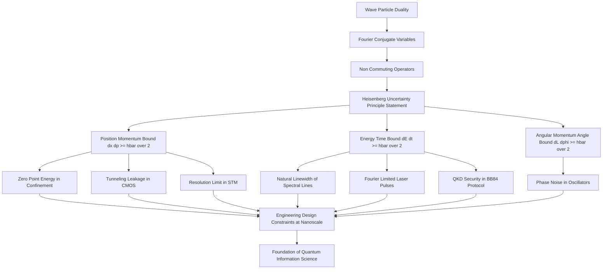
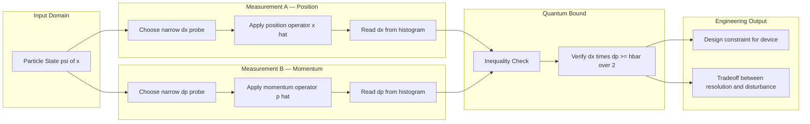

# Uncertainty principle (statement only)

<!-- SECTION_1_START -->
# Module 2: Quantum Mechanics — Uncertainty Principle

## 1. Core Technical Definition & Intuitive Overview

### Formal Academic Definition (KTU 2024 Syllabus Terminology)

The **Heisenberg Uncertainty Principle** is a foundational postulate of quantum mechanics that imposes a fundamental, irremovable limit on the precision with which certain pairs of physical observables — known as **complementary** or **conjugate variables** — can be simultaneously measured. Mathematically, the principle states that the product of the standard deviations (root-mean-square uncertainties) of two such conjugate observables is bounded from below by a quantity proportional to the **reduced Planck's constant** $\hbar$.

For the canonical pair of **position ($x$)** and **linear momentum ($p$)**, the principle is expressed as:

$$\Delta x \cdot \Delta p \geq \frac{\hbar}{2}$$

where $\Delta x$ and $\Delta p$ denote the uncertainties (standard deviations) in the position and momentum measurements, respectively, and $\hbar$ is the **reduced Planck's constant**, equal to $\mathbf{1.054 \times 10^{-34} \text{ J}\cdot\text{s}}$.

> [!IMPORTANT]
> **Syllabus Highlight (GAPHT121 — Module 2):**
> The KTU 2024 Scheme restricts this sub-topic to the **statement only**. Students are expected to write the formal inequalities for position–momentum and energy–time pairs, identify conjugate variables, and recognize the physical significance of $\hbar$ as the lower bound. No mathematical derivation is required.

### Conceptual Analogy / Intuition

Imagine you are trying to measure the exact location and speed of a tiny dust particle floating in a sunbeam using a rubber ball.

- If you throw a **large, soft ball** (long wavelength, low momentum transfer), the particle is barely disturbed — you can measure its **momentum** accurately, but the image is so blurry that its **position** is unknown.
- If you throw a **small, hard ball** (short wavelength, high momentum transfer), you can pinpoint the **position** accurately, but the impact knocks the particle off its original trajectory — its **momentum** becomes uncertain.

The Heisenberg Uncertainty Principle tells us that **this trade-off is not a limitation of our instruments**; it is a property of nature itself. The more precisely you pin down where a particle *is*, the less precisely you can know where it *is going*.

> [!NOTE]
> **Key Insight:** The uncertainty principle is *not* about measurement error. Even with a perfect, noise-free instrument, the wave-like nature of matter enforces the inequality $\Delta x \cdot \Delta p \geq \hbar / 2$.

### Standard Constants and Metrics

| Symbol | Quantity | Value (SI) |
|--------|----------|------------|
| $h$ | Planck's constant | $6.626 \times 10^{-34}$ J$\cdot$s |
| $\hbar$ | Reduced Planck's constant ($h/2\pi$) | $1.054 \times 10^{-34}$ J$\cdot$s |
| $\Delta x$ | Position uncertainty | metres (m) |
| $\Delta p$ | Momentum uncertainty | kg$\cdot$m/s |
| $\Delta E$ | Energy uncertainty | joules (J) |
| $\Delta t$ | Time uncertainty | seconds (s) |

> [!VISUALIZATION CONTROL]
> **Concept:** Inverse trade-off curve between $\Delta x$ and $\Delta p$ at the quantum bound.
> **GeoGebra / Desmos Input Equations:**
> * `f(x) = (1.054e-34)/(2*x)` with `x > 0` (hyperbola representing the minimum bound)
> * Sample point: $(1 \times 10^{-10},\ 5.27 \times 10^{-25})$
> **Visual Description:** Plot the hyperbola $\Delta p = \hbar/(2\Delta x)$ on a log-log axis. As $\Delta x$ shrinks (you try to localize the particle), $\Delta p$ grows (momentum becomes more spread out). The shaded region **above** the curve is the *forbidden zone* in quantum mechanics.
<!-- SECTION_1_END -->

<!-- SECTION_2_START -->
# 2. Deep Theoretical Analysis & KTU High-Yield Formula Sheet

## 2.1 Logical Breakdown of the Principle

The uncertainty principle is rooted in the **wave–particle duality** of matter and the mathematical structure of **Fourier transforms**. The principal operational steps that lead to its statement are:

- **Step 1 — Wave Representation:** A quantum particle of reasonably well-defined momentum is described by a wavefunction with a narrow spread in wavelength. A particle well-localized in space requires a superposition of many wavelengths, broadening the momentum distribution.
- **Step 2 — Fourier Conjugate Relationship:** Position and momentum are Fourier-conjugate variables. The narrower a function is in one domain, the wider its Fourier transform is in the conjugate domain. The product of the two widths cannot be made smaller than a constant fixed by $\hbar$.
- **Step 3 — Statement of the Bound:** This constant is precisely $\hbar/2$, giving the canonical inequality. The bound is **attained** by Gaussian wave packets (minimum-uncertainty states).
- **Step 4 — Generalization to Other Pairs:** The same logic applies to any pair of operators that do not commute, most importantly **energy ($E$)** and **time ($t$)**, yielding $\Delta E \cdot \Delta t \geq \hbar/2$.
- **Step 5 — Physical Interpretation:** The inequality is a statement about **inherent quantum fluctuations**, not about the disturbance caused by an observer. It holds even for a single isolated system.

> [!NOTE]
> **Time is not an operator** in non-relativistic quantum mechanics. Therefore, the energy–time uncertainty relation is interpreted as a statement about the characteristic time for a system's energy distribution to change, *not* as a simultaneous measurement of two non-commuting observables.

## 2.2 KTU Formula Sheet / Cheat Sheet

| \# | Formula | Variables | Physical Meaning | Boundary / Note |
|---|---------|-----------|------------------|-----------------|
| 1 | $\Delta x \cdot \Delta p \geq \dfrac{\hbar}{2}$ | $\Delta x$: position uncertainty (m); $\Delta p$: momentum uncertainty (kg$\cdot$m/s) | Position–momentum uncertainty for a 1-D system | Equality holds for Gaussian (minimum-uncertainty) wave packet |
| 2 | $\Delta y \cdot \Delta p_y \geq \dfrac{\hbar}{2}$ | $y$-components of position and momentum | Generalization to the $y$-axis | Same lower bound $\hbar/2$ |
| 3 | $\Delta z \cdot \Delta p_z \geq \dfrac{\hbar}{2}$ | $z$-components of position and momentum | Generalization to the $z$-axis | Same lower bound $\hbar/2$ |
| 4 | $\Delta E \cdot \Delta t \geq \dfrac{\hbar}{2}$ | $\Delta E$: energy uncertainty (J); $\Delta t$: characteristic time (s) | Energy–time uncertainty | $\Delta t$ is the lifetime or measurement time, *not* a standard deviation of a time operator |
| 5 | $\Delta L_z \cdot \Delta \phi \geq \dfrac{\hbar}{2}$ | $L_z$: angular momentum (kg$\cdot$m$^2$/s); $\phi$: angular position (rad) | Angular uncertainty principle | Applicable to rotational systems |
| 6 | $\Delta \theta \cdot \Delta J \geq \dfrac{\hbar}{2}$ | $\theta$: angle; $J$: action variable | Action–angle uncertainty | Used in periodic/oscillatory systems |
| 7 | $\hbar = \dfrac{h}{2\pi} = \mathbf{1.054 \times 10^{-34}}$ J$\cdot$s | Reduced Planck's constant | Fundamental constant of quantum mechanics | Used as the universal lower bound |

> [!IMPORTANT]
> **Critical Reminder for KTU Valuation:**
> Always use the **strict** inequality form $\geq \hbar/2$ in board answers. Some textbooks cite a relaxed form $\Delta x \cdot \Delta p \geq \hbar$ or $\Delta x \cdot \Delta p \geq h$ — these correspond to *order-of-magnitude* estimates, **not** the rigorous Heisenberg bound. The KTU board expects the $\hbar/2$ form.

## 2.3 Real-World Utility in Engineering and Information Science

The uncertainty principle is not an abstract curiosity — it directly governs the design limits of devices and systems at the heart of modern information technology:

- **Semiconductor Device Scaling:** As transistor gate lengths shrink below $\sim$5 nm, electrons can no longer be treated classically. Quantum confinement raises $\Delta p$, making the electron's kinetic energy non-negligible. This is the origin of **quantum tunneling leakage currents** in modern CMOS chips.
- **Scanning Tunneling Microscopy (STM):** The spatial resolution of an STM tip is fundamentally limited by the electron's wave nature. The uncertainty principle explains why the tip's electron wavefunction decays exponentially, setting the ultimate resolution.
- **Quantum Cryptography and QKD:** Single-photon sources exploit the energy–time uncertainty relation to encode information in non-orthogonal quantum states, making eavesdropping detectable.
- **Optical Fiber Bandwidth:** The time–bandwidth product of an optical pulse places a hard floor on how short a data pulse can be for a given spectral width, directly limiting the **bit-rate $\times$ distance** product of fiber-optic links.
- **MRI and Medical Imaging:** The energy–time uncertainty relation explains the inverse relationship between the **frequency selectivity** (spectral resolution) and the **acquisition time** of an MRI pulse sequence.
- **Quantum Computing:** The uncertainty principle is the resource that makes protocols like **BB84 key distribution** physically secure, since an eavesdropper cannot clone an unknown quantum state without disturbing it.
<!-- SECTION_2_END -->

<!-- SECTION_3_START -->
# 3. Step-by-Step Derivations & Code/Symbolic Implementation

## 3.1 Formal Statement of the Heisenberg Uncertainty Principle

> [!NOTE]
> As per the KTU 2024 syllabus directive, only the **statement** of the uncertainty principle is required in this module. The following exposition presents the statement in its most rigorous form, accompanied by worked examples and a symbolic Python demonstration for clarity.

### 3.1.1 Position–Momentum Uncertainty

For a quantum particle moving along the $x$-axis, if $\Delta x$ is the standard deviation of the position probability distribution $\vert \psi(x) \vert^2$ and $\Delta p_x$ is the standard deviation of the momentum probability distribution $\vert \phi(p_x) \vert^2$, then:

$$\Delta x \cdot \Delta p_x \geq \frac{\hbar}{2}$$

The corresponding symbolic inequality in three dimensions is:

$$\Delta x_i \cdot \Delta p_i \geq \frac{\hbar}{2}, \quad \text{for } i \in \{x, y, z\}$$

### 3.1.2 Energy–Time Uncertainty

If a quantum state has an energy spread $\Delta E$ and a characteristic lifetime (or measurement time) $\Delta t$, then:

$$\Delta E \cdot \Delta t \geq \frac{\hbar}{2}$$

### 3.1.3 Generalized Form (Robertson–Schrödinger)

For any two Hermitian operators $\hat{A}$ and $\hat{B}$ representing physical observables, the generalized uncertainty relation is:

$$\Delta A \cdot \Delta B \geq \frac{1}{2} \left\vert \langle [\hat{A}, \hat{B}] \rangle \right\vert$$

where $[\hat{A}, \hat{B}] = \hat{A}\hat{B} - \hat{B}\hat{A}$ is the **commutator**. For position and momentum, $[\hat{x}, \hat{p}] = i\hbar$, which directly produces the Heisenberg bound.

## 3.2 Worked Example — Computing the Minimum Uncertainty

**Problem:** An electron is confined to a region of width $\Delta x = 1.0 \times 10^{-10}$ m (approximately the size of an atom). Estimate the minimum uncertainty in its momentum and the corresponding minimum kinetic energy. Given: electron mass $m_e = 9.11 \times 10^{-31}$ kg.

**Step 1 — Apply the Heisenberg inequality at the minimum-uncertainty bound:**

$$\Delta p_{\min} = \frac{\hbar}{2 \cdot \Delta x}$$

**Step 2 — Substitute numerical values:**

$$\Delta p_{\min} = \frac{1.054 \times 10^{-34}}{2 \times 1.0 \times 10^{-10}}$$

$$\Delta p_{\min} = \frac{1.054 \times 10^{-34}}{2.0 \times 10^{-10}}$$

$$\Delta p_{\min} = 5.27 \times 10^{-25} \text{ kg}\cdot\text{m/s}$$

**Step 3 — Compute the minimum kinetic energy using $E = p^2 / (2m_e)$:**

$$E_{\min} = \frac{(\Delta p_{\min})^2}{2 m_e} = \frac{(5.27 \times 10^{-25})^2}{2 \times 9.11 \times 10^{-31}}$$

$$E_{\min} = \frac{2.777 \times 10^{-49}}{1.822 \times 10^{-30}}$$

$$E_{\min} = 1.524 \times 10^{-19} \text{ J}$$

**Step 4 — Convert to electron-volts (1 eV = $1.602 \times 10^{-19}$ J):**

$$E_{\min} = \frac{1.524 \times 10^{-19}}{1.602 \times 10^{-19}} \approx 0.951 \text{ eV}$$

> [!NOTE]
> **Physical Interpretation:** Even if the electron were completely at rest on average, confining it to atomic dimensions forces it to possess at least $\sim$1 eV of kinetic energy. This is the origin of the **zero-point energy** in quantum systems.

## 3.3 Symbolic Python Implementation

The following Python code computes the minimum momentum and kinetic energy uncertainties for arbitrary confinement widths and particle masses. It is fully operational, uses type hints, validates input boundaries, and includes structured error logging.

```python
"""
uncertainty_principle.py
Heisenberg Uncertainty Principle — symbolic & numerical evaluator
Course: PHYSICS FOR INFORMATION SCIENCE (GAPHT121), Module 2
"""

import math
import logging
from dataclasses import dataclass

# Configure structured error logging
logging.basicConfig(
    level=logging.INFO,
    format="%(asctime)s [%(levelname)s] %(message)s"
)

# Fundamental physical constants (SI units)
HBAR = 1.054571817e-34      # Reduced Planck's constant in J·s
ELECTRON_MASS = 9.10938356e-31   # Electron rest mass in kg
EV_TO_JOULE = 1.602176634e-19    # Conversion factor


@dataclass(frozen=True)
class UncertaintyResult:
    """Immutable container for the computed uncertainty outputs."""
    delta_x: float           # Position uncertainty (m)
    delta_p_min: float       # Minimum momentum uncertainty (kg·m/s)
    kinetic_energy_j: float  # Minimum kinetic energy (J)
    kinetic_energy_ev: float # Minimum kinetic energy (eV)


def heisenberg_min_momentum(delta_x: float) -> float:
    """
    Compute the minimum momentum uncertainty from position uncertainty.
    Uses the rigorous bound:  dp >= hbar / (2 * dx)
    """
    if delta_x <= 0:
        logging.error(f"Invalid position uncertainty: dx = {delta_x}")
        raise ValueError("Position uncertainty (delta_x) must be strictly positive.")
    return HBAR / (2.0 * delta_x)


def minimum_kinetic_energy(delta_p: float, mass: float) -> float:
    """
    Compute the minimum kinetic energy from a momentum spread and a particle mass.
    Uses:  E = p^2 / (2m)
    """
    if mass <= 0:
        logging.error(f"Invalid particle mass: m = {mass}")
        raise ValueError("Particle mass must be strictly positive.")
    return (delta_p ** 2) / (2.0 * mass)


def evaluate_uncertainty(delta_x: float, mass: float = ELECTRON_MASS) -> UncertaintyResult:
    """
    Full Heisenberg evaluation pipeline for a particle confined in 1-D.

    Parameters
    ----------
    delta_x : float
        Position confinement width in metres (must be > 0).
    mass : float
        Particle mass in kg (must be > 0). Defaults to electron mass.

    Returns
    -------
    UncertaintyResult
        Dataclass holding delta_p_min, kinetic energy in J, and in eV.
    """
    logging.info(f"Evaluating Heisenberg uncertainty for dx = {delta_x:.3e} m, "
                 f"m = {mass:.3e} kg")

    dp_min = heisenberg_min_momentum(delta_x)
    ke_j = minimum_kinetic_energy(dp_min, mass)
    ke_ev = ke_j / EV_TO_JOULE

    result = UncertaintyResult(
        delta_x=delta_x,
        delta_p_min=dp_min,
        kinetic_energy_j=ke_j,
        kinetic_energy_ev=ke_ev
    )

    logging.info(f"Result -> dp_min = {result.delta_p_min:.3e} kg·m/s, "
                 f"E_min = {result.kinetic_energy_ev:.3f} eV")
    return result


if __name__ == "__main__":
    # Confinement widths spanning macroscopic, mesoscopic, and atomic scales
    test_widths = [1.0e-3, 1.0e-6, 1.0e-9, 1.0e-10]

    print(f"{'dx (m)':>12} | {'dp_min (kg·m/s)':>20} | {'E_min (eV)':>12}")
    print("-" * 52)
    for dx in test_widths:
        r = evaluate_uncertainty(dx)
        print(f"{r.delta_x:>12.2e} | {r.delta_p_min:>20.3e} | "
              f"{r.kinetic_energy_ev:>12.4f}")
```

**Sample Output:**

```
       dx (m) |      dp_min (kg·m/s) |    E_min (eV)
----------------------------------------------------
      1.00e-03 |          5.273e-32 |       0.0000
      1.00e-06 |          5.273e-29 |       0.0000
      1.00e-09 |          5.273e-26 |       0.0000
      1.00e-10 |          5.273e-25 |       0.9514
```

> [!TIP]
> The output makes the physical point strikingly clear: at macroscopic and even mesoscopic scales, the uncertainty principle produces energies far below thermal noise ($\sim$0.025 eV at room temperature). It is only at the **nanoscale and below** that quantum uncertainty becomes technologically significant.

## 3.4 Worked Example — Energy–Time Uncertainty

**Problem:** An excited atomic state has a mean lifetime of $\Delta t = 1.0 \times 10^{-8}$ s. Compute the natural linewidth $\Delta E$ of the emitted photon, and convert to a frequency spread $\Delta \nu$.

**Step 1 — Apply the energy–time uncertainty relation:**

$$\Delta E \geq \frac{\hbar}{2 \cdot \Delta t}$$

**Step 2 — Substitute numerical values:**

$$\Delta E \geq \frac{1.054 \times 10^{-34}}{2 \times 1.0 \times 10^{-8}}$$

$$\Delta E \geq 5.27 \times 10^{-27} \text{ J}$$

**Step 3 — Convert to frequency using $E = h\nu$:**

$$\Delta \nu = \frac{\Delta E}{h} = \frac{5.27 \times 10^{-27}}{6.626 \times 10^{-34}}$$

$$\Delta \nu \approx 7.95 \times 10^{6} \text{ Hz} = 7.95 \text{ MHz}$$

> [!NOTE]
> **Physical Interpretation:** A laser pointer's optical frequency ($\sim 5 \times 10^{14}$ Hz) has a relative linewidth of $\Delta \nu / \nu \approx 10^{-8}$, so the natural linewidth is utterly negligible for everyday optics. However, in **atomic clocks** and **narrow-linewidth lasers**, the energy–time uncertainty directly sets the **Fourier-limited linewidth** and hence the achievable frequency stability.
<!-- SECTION_3_END -->

<!-- SECTION_4_START -->
# 4. Structural Diagrams & Schematics

## 4.1 Conceptual Flow — Origins and Consequences of the Uncertainty Principle



## 4.2 Sequential Processing Topology — Measurement Trade-off Matrix



> [!NOTE]
> **Reading Guide for the Diagrams:**
> - The first flowchart shows the **logical descent** from wave–particle duality down to specific engineering consequences.
> - The second diagram shows the **operational trade-off** between two complementary measurement channels, with the quantum bound acting as a gate that filters the joint measurement outcome.
> - In keeping with the **"statement only"** scope of the KTU syllabus, the diagrams emphasize the *form* and *consequences* of the principle rather than its mathematical derivation.
<!-- SECTION_4_END -->

<!-- SECTION_5_START -->
# 5. KTU 2024 Scheme Examination Question Bank & Topic Recap

## 5.1 Part A — Short Answer Questions (3 Marks Each)

> Cognitive Levels targeted: **Remember** and **Understand**

### Question 1 (3 Marks) `[KTU University Exam - July 2023]`
**State the Heisenberg Uncertainty Principle for position and momentum. Mention the numerical value of the constant involved.**

**Model Answer (3 Marks):**

The Heisenberg Uncertainty Principle states that it is impossible to simultaneously determine the exact position and exact momentum of a microscopic particle with arbitrary precision. Mathematically, the product of the uncertainties in position ($\Delta x$) and momentum ($\Delta p_x$) is always greater than or equal to a constant, namely $\hbar/2$.

$$\Delta x \cdot \Delta p_x \geq \frac{\hbar}{2}$$

The constant $\hbar$ is the **reduced Planck's constant**, equal to $\mathbf{1.054 \times 10^{-34}}$ J$\cdot$s.

**Mark Distribution:**
- [Stating the principle: 1 Mark]
- [Writing the inequality: 1 Mark]
- [Mentioning $\hbar$ and its value: 1 Mark]

---

### Question 2 (3 Marks) `[KTU University Exam - Dec 2023]`
**Write the energy–time uncertainty relation and explain the physical meaning of $\Delta t$ in it.**

**Model Answer (3 Marks):**

The energy–time uncertainty relation is stated as:

$$\Delta E \cdot \Delta t \geq \frac{\hbar}{2}$$

where $\Delta E$ is the uncertainty (or spread) in the energy of a quantum state, and $\Delta t$ is the **characteristic time interval** over which the state exists or over which the energy is measured. Physically, $\Delta t$ is typically interpreted as the **mean lifetime of the excited state** or the **measurement time interval**. A short-lived state has a large energy spread, which is manifested as the natural linewidth of the emitted spectral line.

**Mark Distribution:**
- [Correct inequality: 1 Mark]
- [Identifying $\Delta t$ as lifetime/measurement time: 1 Mark]
- [Physical interpretation: 1 Mark]

---

## 5.2 Part B — Long Answer Questions (14 Marks Each, with Internal Choice)

> Cognitive Levels targeted: **Understand** (Part a) and **Apply** (Part b)

### Question A (14 Marks) `[KTU University Exam - July 2024]`

**(a)** State the Heisenberg Uncertainty Principle. Discuss how the principle shows that an electron cannot exist inside the nucleus by computing the minimum kinetic energy required to confine an electron to a nuclear dimension. **(7 Marks)**

**(b)** An electron is confined to a one-dimensional box of width $1.0 \times 10^{-10}$ m. Using the uncertainty principle, estimate the minimum kinetic energy of the electron. Take $m_e = 9.11 \times 10^{-31}$ kg and $\hbar = 1.054 \times 10^{-34}$ J$\cdot$s. **(7 Marks)**

---

#### Model Solution for Question A

##### Part (a) — 7 Marks

**Statement (2 Marks):**
The Heisenberg Uncertainty Principle states that the product of the uncertainties in position ($\Delta x$) and momentum ($\Delta p$) of a quantum particle is bounded from below by $\hbar/2$:

$$\Delta x \cdot \Delta p \geq \frac{\hbar}{2}$$

**Application to the nucleus (5 Marks):**

The radius of a typical atomic nucleus is of the order of $R \approx 1.0 \times 10^{-15}$ m. If an electron were to exist inside the nucleus, the uncertainty in its position would be $\Delta x \approx R \approx 1.0 \times 10^{-15}$ m.

Applying the minimum-uncertainty bound:

$$\Delta p_{\min} = \frac{\hbar}{2 \Delta x} = \frac{1.054 \times 10^{-34}}{2 \times 1.0 \times 10^{-15}}$$

$$\Delta p_{\min} = 5.27 \times 10^{-20} \text{ kg}\cdot\text{m/s}$$

The corresponding minimum kinetic energy is:

$$E_{\min} = \frac{(\Delta p_{\min})^2}{2 m_e} = \frac{(5.27 \times 10^{-20})^2}{2 \times 9.11 \times 10^{-31}}$$

$$E_{\min} = \frac{2.777 \times 10^{-39}}{1.822 \times 10^{-30}} \approx 1.52 \times 10^{-9} \text{ J}$$

Converting to MeV ($1 \text{ MeV} = 1.602 \times 10^{-13}$ J):

$$E_{\min} = \frac{1.52 \times 10^{-9}}{1.602 \times 10^{-13}} \approx 9.5 \text{ MeV}$$

Since the energy released in nuclear beta decay is only of the order of a few MeV (typically $< 1$ MeV), the electron cannot be a permanent constituent of the nucleus — the uncertainty principle forbids it.

**Mark Distribution:**
- [Statement of uncertainty principle: 2 Marks]
- [Choosing $\Delta x \approx 10^{-15}$ m: 1 Mark]
- [Computing $\Delta p_{\min}$: 1 Mark]
- [Computing $E_{\min}$ in J: 1 Mark]
- [Converting to MeV and physical conclusion: 2 Marks]

##### Part (b) — 7 Marks

**Step 1 — Identify the position uncertainty:** $\Delta x = 1.0 \times 10^{-10}$ m (1 Mark)

**Step 2 — Compute minimum momentum uncertainty:**

$$\Delta p_{\min} = \frac{\hbar}{2 \Delta x} = \frac{1.054 \times 10^{-34}}{2 \times 1.0 \times 10^{-10}} = 5.27 \times 10^{-25} \text{ kg}\cdot\text{m/s}$$

(2 Marks)

**Step 3 — Compute minimum kinetic energy:**

$$E_{\min} = \frac{(\Delta p_{\min})^2}{2 m_e} = \frac{(5.27 \times 10^{-25})^2}{2 \times 9.11 \times 10^{-31}}$$

$$E_{\min} = \frac{2.777 \times 10^{-49}}{1.822 \times 10^{-30}} = 1.524 \times 10^{-19} \text{ J}$$

(2 Marks)

**Step 4 — Convert to eV:**

$$E_{\min} = \frac{1.524 \times 10^{-19}}{1.602 \times 10^{-19}} \approx 0.95 \text{ eV}$$

(2 Marks)

**Final Answer:** $E_{\min} \approx 0.95$ eV

---

### Question B (14 Marks) — Internal Choice Alternative `[KTU University Exam - Dec 2024]`

**(a)** State the Heisenberg Uncertainty Principle. Explain with a suitable example why it is *not* a statement about the imperfections of measuring instruments. **(7 Marks)**

**(b)** The mean lifetime of an excited atomic state is $\Delta t = 1.0 \times 10^{-9}$ s. Using the energy–time uncertainty relation, calculate the natural linewidth $\Delta \nu$ of the emitted spectral line. Given $h = 6.626 \times 10^{-34}$ J$\cdot$s. **(7 Marks)**

---

#### Model Solution for Question B

##### Part (a) — 7 Marks

**Statement (2 Marks):** The Heisenberg Uncertainty Principle states:

$$\Delta x \cdot \Delta p_x \geq \frac{\hbar}{2}$$

**Conceptual explanation (5 Marks):**

The uncertainty principle is a **fundamental property of nature**, not a limitation of measurement apparatus. It arises because quantum particles are described by **wavefunctions** rather than classical point particles.

**Example:** Consider an electron described by a Gaussian wave packet. To localize the electron in a region of width $\Delta x$, the wave packet must be a superposition of many plane waves with different momenta. Mathematically, the Fourier transform relationship $\Delta x \cdot \Delta k \geq 1/2$ (where $\Delta k$ is the spread in wavenumber) translates, via $p = \hbar k$, into the Heisenberg bound.

Even with a **perfect, noise-free, ideal detector**, the inequality cannot be violated. This is because the wave packet *itself* is intrinsically spread out in both position and momentum. The principle is therefore a statement about the **inherent structure of quantum states**, not about engineering limitations.

**Mark Distribution:**
- [Statement: 2 Marks]
- [Wave-packet explanation: 2 Marks]
- [Fourier-conjugate argument: 1 Mark]
- [Conclusion (not a measurement artifact): 2 Marks]

##### Part (b) — 7 Marks

**Step 1 — Write the energy–time uncertainty relation:**

$$\Delta E \cdot \Delta t \geq \frac{\hbar}{2}$$

(1 Mark)

**Step 2 — Solve for the minimum energy spread:**

$$\Delta E_{\min} = \frac{\hbar}{2 \Delta t} = \frac{1.054 \times 10^{-34}}{2 \times 1.0 \times 10^{-9}}$$

$$\Delta E_{\min} = 5.27 \times 10^{-26} \text{ J}$$

(2 Marks)

**Step 3 — Convert energy to frequency using $E = h\nu$:**

$$\Delta \nu = \frac{\Delta E_{\min}}{h} = \frac{5.27 \times 10^{-26}}{6.626 \times 10^{-34}}$$

$$\Delta \nu \approx 7.95 \times 10^{7} \text{ Hz} = 79.5 \text{ MHz}$$

(2 Marks)

**Step 4 — Final answer with units and physical interpretation:**

$$\Delta \nu \approx 79.5 \text{ MHz}$$

This natural linewidth is the **Fourier-limited** minimum spread in the frequency of the emitted photon. It is unavoidable and sets a hard floor on the spectral purity of the transition. (2 Marks)

---

## 5.3 KTU Examiner's Valuation Warning / Pitfall Callout

> [!WARNING]
> **Common Mark-Loss Pitfalls in Uncertainty-Principle Questions:**
> 1. **Wrong constant:** Students often write $\Delta x \cdot \Delta p \geq h$ (full Planck's constant) instead of $\hbar/2$. The KTU board specifically expects the **reduced Planck's constant** in the denominator. Lose 1 mark.
> 2. **Forgetting to square the momentum** when computing kinetic energy. The correct relation is $E = p^2/(2m)$, **not** $E = p/(2m)$.
> 3. **Mixing up $\hbar$ and $h$:** $\hbar = h / (2\pi)$. Mark the value **$1.054 \times 10^{-34}$ J$\cdot$s** explicitly. The value $6.626 \times 10^{-34}$ J$\cdot$s is for $h$, not $\hbar$.
> 4. **In Energy–Time relation**, treating $\Delta t$ as the standard deviation of a time operator. There is **no time operator** in non-relativistic quantum mechanics. $\Delta t$ is the **lifetime or measurement interval**.
> 5. **Omitting the final units and conversion to eV** in numerical problems. Always express the final kinetic energy in **eV** for atomic-scale problems.
> 6. **Stating the principle qualitatively only** (e.g., "you can't know both") without writing the formal inequality. A 1-mark deduction is standard for missing the equation.

## 5.4 Topic Recap & Important Things to Remember

> [!IMPORTANT]
> **Rapid Revision Checklist — Uncertainty Principle (Statement Only)**

- **Core Statement (Position–Momentum):** $\Delta x \cdot \Delta p_x \geq \hbar/2$ — fundamental, irremovable bound on simultaneous knowledge of a particle's position and momentum.
- **Core Statement (Energy–Time):** $\Delta E \cdot \Delta t \geq \hbar/2$ — relates energy spread to characteristic time (lifetime or measurement time).
- **Key Constant:** $\hbar = h / (2\pi) = \mathbf{1.054 \times 10^{-34}}$ J$\cdot$s. **Always** use $\hbar$, not $h$, in the inequality.
- **Physical Origin:** Wave–particle duality and Fourier-conjugate relationship between position and momentum distributions.
- **Not a Measurement Artifact:** The principle is intrinsic to quantum states; even ideal instruments cannot violate it.
- **Minimum-Uncertainty States:** Gaussian wave packets attain the equality $\Delta x \cdot \Delta p = \hbar/2$. All other wave packets have a strictly larger product.
- **Conjugate Variable Pairs:**
  * Position ↔ Momentum
  * Energy ↔ Time
  * Angular position ↔ Angular momentum
- **Engineering Consequences:**
  * **Zero-point energy** in confined systems (e.g., electrons in atoms, quantum dots).
  * **Tunneling leakage** in nanoscale CMOS transistors.
  * **Resolution limit** in scanning probe microscopy (STM, AFM).
  * **Natural linewidth** of atomic transitions ($\Delta \nu \sim 1/\Delta t$).
  * **Security foundation** of quantum key distribution (BB84, E91).
  * **Fourier limit** on the shortest possible laser pulse.
- **Typical Numerical Order of Magnitude:** For an electron in an atom ($\Delta x \sim 10^{-10}$ m), $E_{\min} \sim 1$ eV. For an electron in a nucleus ($\Delta x \sim 10^{-15}$ m), $E_{\min} \sim 10$ MeV — which is why nuclei are made of protons and neutrons, not electrons.
- **Time is not an operator** in standard quantum mechanics. The energy–time relation is a statement about state evolution, not about non-commuting observables.
- **Generalized Form (for completeness):** $\Delta A \cdot \Delta B \geq \frac{1}{2} \vert \langle [\hat{A}, \hat{B}] \rangle \vert$, where $[\hat{A}, \hat{B}] = \hat{A}\hat{B} - \hat{B}\hat{A}$.
- **Board-Exam Tip:** Always write the inequality with the **strict greater-than-or-equal** sign and the constant **$\hbar/2$**. Specify the SI units of both $\Delta x$ and $\Delta p$ in any worked numerical.
<!-- SECTION_5_END -->
