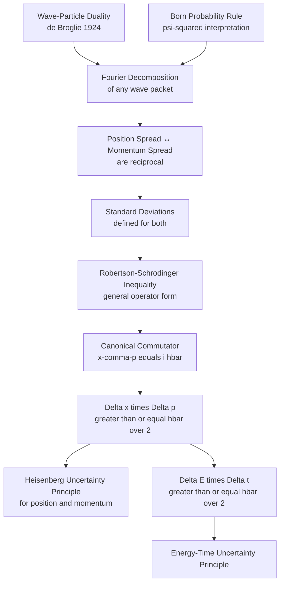
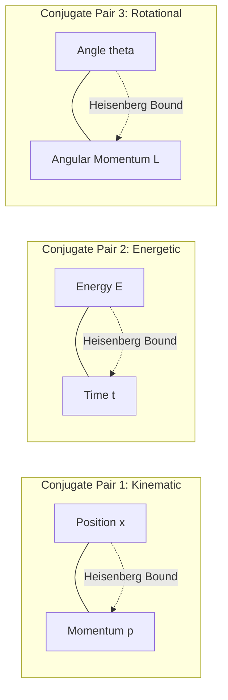
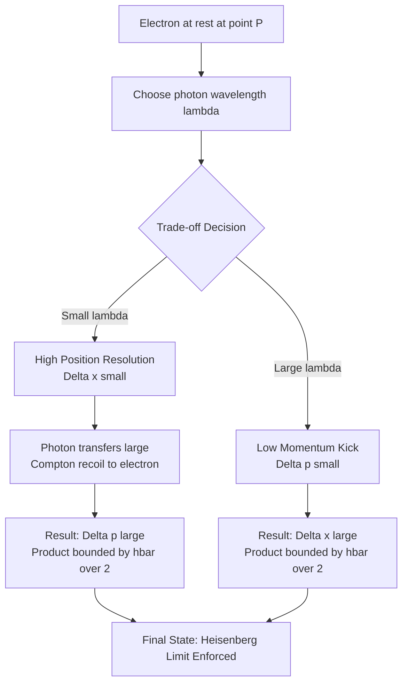

# Uncertainty principle (statement only)

<!-- SECTION_1_START -->
# Heisenberg's Uncertainty Principle — Core Definition & Intuitive Overview

## Formal Definition (KTU 2024 Syllabus Terminology)

> [!IMPORTANT]
> **Heisenberg's Uncertainty Principle (1927):** It is fundamentally impossible to simultaneously measure two canonically conjugate physical variables of a microscopic particle — such as **position ($x$)** and **momentum ($p$)**, or **energy ($E$)** and **time ($t$)** — with arbitrary precision. The product of the uncertainties in such conjugate pairs has an absolute lower bound governed by **reduced Planck's constant ($\hbar$)**.

The principle is not a statement about experimental imperfection or instrument quality; it is an **intrinsic, ontological property of nature** at the quantum scale, arising directly from the **wave-particle duality** of matter and the statistical (probabilistic) interpretation of the wavefunction $\psi(x,t)$.

## Mathematical Statement

For a particle described by a wavefunction $\psi(x,t)$:

$$
\Delta x \cdot \Delta p \geq \frac{\hbar}{2} = \frac{h}{4\pi}
$$

For energy and time:

$$
\Delta E \cdot \Delta t \geq \frac{\hbar}{2}
$$

Where:
- $\Delta x$ = uncertainty in position
- $\Delta p$ = uncertainty in momentum
- $\Delta E$ = uncertainty in energy
- $\Delta t$ = uncertainty in time (or lifetime of the state)
- $h$ = Planck's constant $= 6.626 \times 10^{-34}\ \text{J}\cdot\text{s}$
- $\hbar$ = reduced Planck's constant $= \dfrac{h}{2\pi} \approx 1.0546 \times 10^{-34}\ \text{J}\cdot\text{s}$

> [!NOTE]
> **Canonical Conjugate Pairs:** The uncertainty principle applies to pairs of variables that are linked by the commutation relation $[A, B] \neq 0$. The most relevant pairs for the GAPHT121 syllabus are $(x, p_x)$ and $(E, t)$.

## Conceptual Analogy — "The Blurry Photograph"

> [!TIP]
> **Intuitive Picture (Plain English):**
> Imagine trying to take a sharp photograph of a hummingbird's wing using a very slow-shutter camera. The wing is in **many positions** during the exposure — so the picture is **blurry in space** (large $\Delta x$). But the blur itself tells you the wing was **moving fast**, so its **velocity (momentum) is uncertain** (large $\Delta p$).
> If you switch to a super-fast shutter (small $\Delta x$), you freeze the wing, but to *see* it you must flood it with light — and that light kicks the wing, disturbing its momentum.
> **You can never have a picture that is BOTH perfectly sharp in position AND perfectly sharp in momentum.** Nature imposes a trade-off.

This trade-off becomes negligible for macroscopic objects (like a cricket ball) because their masses are enormous, making $\hbar$ vanishingly small compared to typical $(x, p)$ products.

## Where the Constant Comes From

> [!IMPORTANT]
> The numerical floor of the uncertainty product is fixed by the **reduced Planck's constant $\hbar \approx 1.0546 \times 10^{-34}\ \text{J}\cdot\text{s}$**.
> This is the same constant that appears in the de Broglie relation ($p = h/\lambda$) and the Schrödinger equation. It is the **fundamental quantum of action** — the smallest meaningful "chunk" of phase-space volume a particle can occupy.

## Why It Matters in Information Science

In information technology and computing:
- **Quantum bits (qubits)** in quantum computers have unavoidable $\Delta E$ noise, setting decoherence times.
- **Semiconductor devices** (transistors below ~5 nm) hit the uncertainty limit — electron position inside the channel becomes intrinsically uncertain.
- **Scanning Tunneling Microscopes (STM)** achieve atomic resolution precisely because they exploit the electron's wave nature and the $\Delta x$–$\Delta p$ trade-off.

> [!VISUALIZATION CONTROL]
> **Concept:** Gaussian Wave Packet — Position vs. Momentum Distribution
> **GeoGebra Input Equations:**
> * `f(x) = exp(-(x)^2 / (2 * 0.5^2)) / (0.5 * sqrt(2*pi))`  (narrow Gaussian in position, $\sigma_x = 0.5$)
> * `g(p) = exp(-(p)^2 * 0.5^2 / 2) / ((1/0.5) * sqrt(2*pi))`  (corresponding wide Gaussian in momentum)
> **Visual Description:** Observe that the *narrower* the position-space Gaussian (peaked at $x=0$), the *wider* the momentum-space Gaussian. This is the Fourier-transform embodiment of $\Delta x \cdot \Delta p \geq \hbar/2$. Try replacing $0.5$ with $0.2$ in `f` and $0.5$ with $5$ in `g`'s denominator to see the reciprocal spread.
<!-- SECTION_1_END -->

<!-- SECTION_2_START -->
# Deep Theoretical Analysis & KTU High-Yield Formula Sheet

## Conceptual Logic Flow — Why Uncertainty Must Exist

The uncertainty principle is **not** an assumption; it emerges logically from three prior postulates. Understanding this chain is critical for KTU answers.

1. **Wave–Particle Duality (de Broglie, 1924):** Every particle of momentum $p$ has an associated wavelength $\lambda = h/p$. A *purely localized* particle (zero position uncertainty) would require a single point in space, which corresponds to a wave of *infinite* extent in momentum space.

2. **Fourier Decomposition:** Any wavefunction $\psi(x)$ can be decomposed into a superposition of plane waves $e^{ikx}$. A wavefunction that is *narrow* in $x$ requires a *broad* spread of wavenumbers $k$. Since $p = \hbar k$, broad $k$ means broad $p$.

3. **Statistical Interpretation (Born, 1926):** $|\psi(x)|^2$ and $|\phi(p)|^2$ are probability densities. Their standard deviations $\Delta x$ and $\Delta p$ are *intrinsic* spreads — not measurement errors.

> [!NOTE]
> **Logical Chain:** Wave–Particle Duality + Fourier Mathematics + Born's Probability Rule $\Rightarrow$ Heisenberg Uncertainty Principle.

## Interpretation of the Inequality

The inequality $\Delta x \cdot \Delta p \geq \hbar/2$ admits two distinct readings, both acceptable in KTU answers:

| Interpretation | Meaning |
|---|---|
| **Strong (ontological)** | The particle *itself* does not possess simultaneously sharp values of $x$ and $p$. Both are smeared in reality. |
| **Operational (epistemic)** | No measurement scheme, no matter how clever, can prepare or determine both $x$ and $p$ to within the bound. |

> [!TIP]
> The **strong interpretation** is the modern (Copenhagen/standard) view. The **operational interpretation** is what Heisenberg originally argued using his γ-ray microscope thought experiment.

## The Energy–Time Form: $\Delta E \cdot \Delta t \geq \hbar/2$

This is **not** a commutation-relation inequality (time is a parameter, not an operator in non-relativistic QM). Its correct interpretation:

- $\Delta t$ = the **characteristic time interval** over which the system's energy is measured, *or* the **lifetime** of a quasi-stationary state.
- $\Delta E$ = the spread (or natural linewidth) of the energy level.

**Key Application:** Excited atomic states of mean lifetime $\tau$ emit photons with a frequency spread (natural linewidth):

$$
\Delta \nu \geq \frac{1}{4\pi \tau} \quad \Rightarrow \quad \Delta E \geq \frac{\hbar}{2\tau}
$$

## KTU Formula Sheet / Cheat Sheet

| # | Formula | Physical Meaning | Units | KTU Frequency |
|---|---|---|---|---|
| 1 | $\Delta x \cdot \Delta p \geq \dfrac{\hbar}{2}$ | Position–momentum uncertainty | $\text{m} \cdot \text{kg}\cdot\text{m/s}$ | ⭐⭐⭐⭐⭐ |
| 2 | $\Delta x \cdot \Delta p \geq \dfrac{h}{4\pi}$ | Equivalent form using $h$ | $\text{J}\cdot\text{s}$ | ⭐⭐⭐⭐⭐ |
| 3 | $\Delta E \cdot \Delta t \geq \dfrac{\hbar}{2}$ | Energy–time uncertainty | $\text{J}\cdot\text{s}$ | ⭐⭐⭐⭐ |
| 4 | $p = \dfrac{h}{\lambda}$ | de Broglie relation | $\text{kg}\cdot\text{m/s}$ | ⭐⭐⭐⭐⭐ |
| 5 | $h = 6.626 \times 10^{-34}\ \text{J}\cdot\text{s}$ | Planck's constant | $\text{J}\cdot\text{s}$ | ⭐⭐⭐⭐⭐ |
| 6 | $\hbar = \dfrac{h}{2\pi} \approx 1.0546 \times 10^{-34}\ \text{J}\cdot\text{s}$ | Reduced Planck's constant | $\text{J}\cdot\text{s}$ | ⭐⭐⭐⭐⭐ |
| 7 | $\Delta \nu \cdot \Delta t \geq \dfrac{1}{4\pi}$ | Frequency–time form | $\text{Hz}\cdot\text{s}$ | ⭐⭐⭐ |
| 8 | $\Delta x \geq \dfrac{\lambda}{4\pi \sin\theta}$ | Single-slit diffraction form | $\text{m}$ | ⭐⭐⭐⭐ |

## Engineering & Information-Science Applications

- **Quantum Computing:** Heisenberg's bound $\Delta E \cdot \Delta t \geq \hbar/2$ limits the coherence time of a qubit; a qubit with energy splitting $\Delta E$ cannot remain in a definite state longer than $\sim \hbar/(2\Delta E)$.
- **Data Storage (Hard Disk):** Bit cells smaller than the uncertainty-limited volume cannot be read reliably — the "magnetic grain" of a hard disk has a minimum size set by $\Delta x$–$\Delta p$ trade-offs.
- **Tunnel Diode & Flash Memory:** Electron tunneling through a barrier exploits the wave-nature inherent in $\Delta x \cdot \Delta p \geq \hbar/2$.
- **GPS & Atomic Clocks:** Cesium clocks' accuracy is bounded by $\Delta E \cdot \Delta t$ — the 9.19 GHz hyperfine transition linewidth directly sets the clock's tick precision.
<!-- SECTION_2_END -->

<!-- SECTION_3_START -->
# Step-by-Step Derivations, Thought Experiments & Worked Examples

## 3.1 The Single-Slit Diffraction Argument (Heisenberg's Original Derivation)

This derivation shows how a *measurement* of position to precision $\Delta x$ *necessarily* disturbs momentum by at least $\hbar/2$.

**Setup:** A beam of particles (electrons) of momentum $p_0$ is directed at a slit of width $\Delta x$. The particles emerge and form a diffraction pattern on a screen.

**Step 1 — Position measurement:** A particle passing through the slit has its $x$-coordinate constrained to within the slit width. So:

$$
\Delta x = a
$$

where $a$ is the slit width.

**Step 2 — Momentum disturbance from diffraction:** The slit imposes a diffraction pattern on the emerging beam. The first minimum of the single-slit diffraction pattern occurs at an angle $\theta$ given by:

$$
a \sin\theta = \lambda
$$

So the uncertainty in the transverse momentum of the emerging particle is:

$$
\Delta p_x = p_0 \sin\theta
$$

**Step 3 — Combine using de Broglie:** With $p_0 = h/\lambda$:

$$
\Delta p_x = \frac{h}{\lambda} \cdot \sin\theta = \frac{h}{\lambda} \cdot \frac{\lambda}{a} = \frac{h}{a}
$$

**Step 4 — Form the product:**

$$
\Delta x \cdot \Delta p_x = a \cdot \frac{h}{a} = h
$$

**Step 5 — Refine with the factor of $4\pi$:** A more rigorous Fourier analysis (using the full width at half-maximum and standard deviations rather than first-minimum estimates) yields:

$$
\Delta x \cdot \Delta p_x \geq \frac{h}{4\pi} = \frac{\hbar}{2}
$$

> [!IMPORTANT]
> **Key Insight:** Notice that the product is a **constant** ($h$ in the rough derivation, $\hbar/2$ in the rigorous form). It does **not** depend on slit width, particle mass, energy, or any property of the experimentalist. This independence is what elevates the relation from a measurement artifact to a fundamental law.

## 3.2 The Fourier-Transform Argument (Modern, Rigorous)

For any square-integrable wavefunction $\psi(x)$, define its momentum-space amplitude:

$$
\phi(p) = \frac{1}{\sqrt{2\pi\hbar}} \int_{-\infty}^{\infty} \psi(x)\, e^{-ipx/\hbar}\, dx
$$

The **uncertainty** in position and momentum are the standard deviations:

$$
(\Delta x)^2 = \langle x^2 \rangle - \langle x \rangle^2
$$

$$
(\Delta p)^2 = \langle p^2 \rangle - \langle p \rangle^2
$$

The **Robertson–Schrödinger inequality** (general form) states that for any two Hermitian operators $\hat{A}$ and $\hat{B}$:

$$
\Delta A \cdot \Delta B \geq \frac{1}{2} \vert \langle [\hat{A}, \hat{B}] \rangle \vert
$$

For position and momentum, the canonical commutation relation is:

$$
[\hat{x}, \hat{p}] = i\hbar
$$

Substituting:

$$
\Delta x \cdot \Delta p \geq \frac{1}{2} \vert \langle i\hbar \rangle \vert = \frac{\hbar}{2}
$$

> [!NOTE]
> **Why the inequality is strict ($\geq$, not $=$):** Equality holds **only** for Gaussian wave packets $\psi(x) = A e^{-(x-x_0)^2/4\sigma^2} e^{ip_0 x/\hbar}$. This is the **minimum-uncertainty state**. All other wave packets have a strictly larger $\Delta x \cdot \Delta p$ product.

## 3.3 Worked Numerical Example (Typical KTU Style)

> **Problem:** An electron is confined to a region of size $\Delta x = 1.0 \times 10^{-10}\ \text{m}$ (typical atomic diameter). Estimate the minimum uncertainty in its velocity. Given: $m_e = 9.11 \times 10^{-31}\ \text{kg}$, $h = 6.626 \times 10^{-34}\ \text{J}\cdot\text{s}$.

**Step 1 — Write the uncertainty relation:**

$$
\Delta x \cdot \Delta p \geq \frac{h}{4\pi}
$$

**Step 2 — Solve for $\Delta p$ (minimum case uses equality):**

$$
\Delta p_{\min} = \frac{h}{4\pi \cdot \Delta x}
$$

**Step 3 — Substitute numbers:**

$$
\Delta p_{\min} = \frac{6.626 \times 10^{-34}}{4 \times 3.1416 \times 1.0 \times 10^{-10}}
$$

$$
\Delta p_{\min} = \frac{6.626 \times 10^{-34}}{1.2566 \times 10^{-9}}
$$

$$
\Delta p_{\min} = 5.27 \times 10^{-25}\ \text{kg}\cdot\text{m/s}
$$

**Step 4 — Convert to velocity uncertainty using $\Delta p = m \Delta v$:**

$$
\Delta v_{\min} = \frac{\Delta p_{\min}}{m_e} = \frac{5.27 \times 10^{-25}}{9.11 \times 10^{-31}}
$$

$$
\Delta v_{\min} = 5.78 \times 10^{5}\ \text{m/s}
$$

**Step 5 — Physical interpretation:** This is roughly **0.2% of the speed of light**. The electron cannot be "at rest" when confined to atomic dimensions — its minimum uncertainty velocity is enormous. **This is why electron energies in atoms are quantized and non-zero (the basis of the Bohr model and orbital stability).**

> [!TIP]
> **Examiner's Note:** When solving numerical problems, always carry the unit $\text{J}\cdot\text{s}$ for $h$ and $\hbar$ explicitly. Converting $h/(4\pi)$ directly to SI momentum units keeps arithmetic clean.

## 3.4 The γ-Ray Microscope Thought Experiment (Heisenberg, 1927)

Heisenberg's iconic illustration of why the *measurement act* itself creates the uncertainty.

**Setup:** A free electron sits at point P. We aim to "see" it by bouncing a photon off it and detecting the scattered photon through a microscope.

**Step 1 — Position precision from the microscope:** The Rayleigh criterion for a microscope of numerical aperture $\sin\alpha$ gives:

$$
\Delta x \approx \frac{\lambda}{2 \sin\alpha}
$$

So shorter wavelength (higher-energy photon) = better position resolution.

**Step 2 — Momentum transferred by the photon:** The scattered photon undergoes Compton scattering, transferring a momentum to the electron of order:

$$
\Delta p \approx \frac{h}{\lambda} \sin\alpha
$$

**Step 3 — Product of uncertainties:**

$$
\Delta x \cdot \Delta p \approx \frac{\lambda}{2\sin\alpha} \cdot \frac{h\sin\alpha}{\lambda} = \frac{h}{2}
$$

**Step 4 — Refinement:** Including numerical prefactors and rigorous QED treatment gives $\Delta x \cdot \Delta p \geq \hbar/2$.

> [!IMPORTANT]
> **The Paradox Resolved:** The act of measuring position with extreme precision ($\Delta x \to 0$, requiring $\lambda \to 0$) forces the photon energy to be enormous, which then *kicks* the electron unpredictably ($\Delta p \to \infty$). The product is bounded — you cannot win on both fronts.

## 3.5 Why Macroscopic Objects Seem Definite

For a cricket ball of mass $m = 0.15\ \text{kg}$, position uncertainty $\Delta x = 10^{-6}\ \text{m}$ (1 μm):

$$
\Delta p_{\min} = \frac{6.626 \times 10^{-34}}{4\pi \times 10^{-6}} \approx 5.27 \times 10^{-29}\ \text{kg}\cdot\text{m/s}
$$

$$
\Delta v_{\min} = \frac{5.27 \times 10^{-29}}{0.15} \approx 3.5 \times 10^{-28}\ \text{m/s}
$$

This is **completely undetectable** by any macroscopic instrument. Hence classical mechanics emerges as the macroscopic limit $\hbar \to 0$.
<!-- SECTION_3_END -->

<!-- SECTION_4_START -->
# Structural Diagrams & Schematics

## 4.1 Conceptual Flow — How Uncertainty Arises from Postulates

This block diagram traces the logical genesis of the uncertainty principle from foundational postulates, useful for KTU "Explain" type questions.

## 4.2 Conjugate Variable Pairs & Their Physical Domains

## 4.3 Measurement–Disturbance Trade-off (γ-Ray Microscope Process Map)

## 4.4 Sequential Processing Topology — Uncertainty Cascade in a Quantum System

| Stage | Process | Uncertainty Quantity Affected | Bound |
|---|---|---|---|
| 1 | Initial wave packet preparation | $\Delta x_0$, $\Delta p_0$ | $\Delta x_0 \cdot \Delta p_0 \geq \hbar/2$ |
| 2 | Free evolution (time $T$) | $\Delta x$ grows as $\hbar T / m \Delta x_0$ | Position spreads, momentum stays |
| 3 | Measurement of $x$ to precision $\Delta x_{\text{meas}}$ | Collapses wave packet | $\Delta p_{\text{after}} \geq \hbar/(2\Delta x_{\text{meas}})$ |
| 4 | Energy measurement | $\Delta E$ determined | $\Delta t \geq \hbar/(2\Delta E)$ |
| 5 | Output | Quantum state information | Bounded by all above |
<!-- SECTION_4_END -->

<!-- SECTION_5_START -->
# KTU 2024 Scheme Examination Question Bank & Topic Recap

## Part A — Short Answer Questions (3 Marks Each)

### **Q1. [KTU University Exam — July 2024]** State Heisenberg's Uncertainty Principle. Mention the value of the fundamental constant involved.

**Model Answer (3 Marks):**

> [!NOTE]
> **Heisenberg's Uncertainty Principle:** *"It is impossible to simultaneously determine the exact position and exact momentum of a microscopic particle with absolute precision. The product of the uncertainties in position ($\Delta x$) and momentum ($\Delta p$) is always greater than or equal to a fixed minimum value."*
>
> **Mathematical Statement:**
>
> $$\Delta x \cdot \Delta p \geq \frac{\hbar}{2} = \frac{h}{4\pi}$$
>
> **Fundamental Constant:** Planck's constant $h = 6.626 \times 10^{-34}\ \text{J}\cdot\text{s}$ and the reduced Planck's constant $\hbar = h/(2\pi) = 1.0546 \times 10^{-34}\ \text{J}\cdot\text{s}$.

**Valuation Key:**
- [Correct verbal statement: 1 Mark]
- [Mathematical form: 1 Mark]
- [Value of $h$ and $\hbar$: 1 Mark]

---

### **Q2. [KTU University Exam — Dec 2023]** Distinguish between the position–momentum uncertainty relation and the energy–time uncertainty relation.

**Model Answer (3 Marks):**

| Feature | Position–Momentum | Energy–Time |
|---|---|---|
| Relation | $\Delta x \cdot \Delta p \geq \hbar/2$ | $\Delta E \cdot \Delta t \geq \hbar/2$ |
| Origin | Non-commuting Hermitian operators $[\hat{x}, \hat{p}] = i\hbar$ | Lifetime / characteristic time of a quasi-stationary state |
| Nature of $\Delta t$ | — | Not an operator; it's a duration parameter |
| Application | Electron in atom, particle in box | Spectral linewidth, decay of excited state |

> Both relations arise from the same Fourier-spreading principle but $\Delta t$ is a *parameter*, not a conjugate operator to $E$ in the non-relativistic Schrödinger picture.

**Valuation Key:**
- [Two formulas stated: 1 Mark]
- [Origin of each: 1 Mark]
- [Correct distinction about time: 1 Mark]

---

## Part B — Long Answer Questions (14 Marks Each, with Internal Choice)

### **Question A (14 Marks) — [KTU University Exam — July 2024]**

**(a)** Derive Heisenberg's uncertainty relation from the single-slit diffraction experiment. **(7 Marks)**

**(b)** An electron is confined within a nucleus of diameter $1.0 \times 10^{-14}\ \text{m}$. Estimate the minimum uncertainty in its kinetic energy. Use $h = 6.626 \times 10^{-34}\ \text{J}\cdot\text{s}$ and $m_e = 9.11 \times 10^{-31}\ \text{kg}$. **(7 Marks)**

---

#### Model Solution — Part (a) (7 Marks)

**Step 1 — Setup [1 Mark]:** Consider a parallel beam of electrons of momentum $p_0$ incident on a slit of width $a$. After passing the slit, the $x$-coordinate of any electron is known only within the slit width, so $\Delta x = a$.

**Step 2 — Diffraction emerges [1 Mark]:** The slit acts as a source of secondary wavelets, producing a single-slit diffraction pattern. The first diffraction minimum occurs at angle $\theta$ satisfying $a \sin\theta = \lambda$.

**Step 3 — Momentum spread [1 Mark]:** Electrons reaching the first minimum have a transverse momentum component $\Delta p_x = p_0 \sin\theta = (h/\lambda) \cdot (\lambda/a) = h/a$.

**Step 4 — Product [1 Mark]:** $\Delta x \cdot \Delta p_x = a \cdot (h/a) = h$.

**Step 5 — Rigorous refinement [1 Mark]:** Using standard deviations (Gaussian analysis) and full Fourier mathematics gives the sharper bound $\Delta x \cdot \Delta p_x \geq h/(4\pi) = \hbar/2$.

**Step 6 — Conclusion [2 Marks]:** The product is a *constant of nature* — independent of slit width, particle energy, or apparatus. It follows that the *act of confining* a particle in space necessarily *disturbs* its momentum by at least $\hbar/2$. This is the physical content of Heisenberg's Uncertainty Principle.

---

#### Model Solution — Part (b) (7 Marks)

**Step 1 — Identify the given data [1 Mark]:**
- $\Delta x = 1.0 \times 10^{-14}\ \text{m}$ (nuclear diameter)
- $m_e = 9.11 \times 10^{-31}\ \text{kg}$
- $h = 6.626 \times 10^{-34}\ \text{J}\cdot\text{s}$

**Step 2 — Apply uncertainty principle [1 Mark]:**

$$
\Delta p_{\min} = \frac{h}{4\pi \cdot \Delta x}
$$

**Step 3 — Compute $\Delta p_{\min}$ [1 Mark]:**

$$
\Delta p_{\min} = \frac{6.626 \times 10^{-34}}{4 \times 3.1416 \times 1.0 \times 10^{-14}} = \frac{6.626 \times 10^{-34}}{1.2566 \times 10^{-13}} = 5.27 \times 10^{-21}\ \text{kg}\cdot\text{m/s}
$$

**Step 4 — Relate momentum to kinetic energy [1 Mark]:** For a non-relativistic electron, $E_k = p^2/(2m)$. The minimum kinetic energy corresponds to taking $p = \Delta p_{\min}$ (assuming the electron's nominal momentum is zero):

$$
E_{k,\min} = \frac{(\Delta p_{\min})^2}{2m_e}
$$

**Step 5 — Substitute and compute [1 Mark]:**

$$
E_{k,\min} = \frac{(5.27 \times 10^{-21})^2}{2 \times 9.11 \times 10^{-31}} = \frac{2.777 \times 10^{-41}}{1.822 \times 10^{-30}}
$$

$$
E_{k,\min} = 1.524 \times 10^{-11}\ \text{J}
$$

**Step 6 — Convert to MeV [1 Mark]:** Using $1\ \text{eV} = 1.6 \times 10^{-19}\ \text{J}$ and $1\ \text{MeV} = 10^6\ \text{eV}$:

$$
E_{k,\min} = \frac{1.524 \times 10^{-11}}{1.6 \times 10^{-19}} = 9.52 \times 10^{7}\ \text{eV} \approx 95.2\ \text{MeV}
$$

**Step 7 — Physical interpretation [1 Mark]:** This is enormous — far exceeding typical nuclear binding energies per nucleon (~8 MeV). It shows why confining an electron to the nucleus is energetically impossible; electrons cannot exist inside nuclei. (This is one of the key arguments against the proton–electron model of the nucleus.)

> [!WARNING]
> **KTU Examiner's Valuation Pitfall — DO NOT:**
> - Confuse $\hbar/2$ with $h/2$ — the factor is **$4\pi$** in the denominator, not $2$.
> - Forget to convert J to eV/MeV in the final answer — KTU answers must show the conversion explicitly.
> - Skip writing the assumption that the electron's nominal momentum is zero (the minimum uncertainty case).

---

### **Question B (14 Marks) — Alternative Choice [KTU University Exam — Dec 2023]**

**(a)** Explain the physical significance of Heisenberg's Uncertainty Principle. Why does it not contradict the existence of definite trajectories for macroscopic objects? **(7 Marks)**

**(b)** A ball of mass $50\ \text{g}$ is moving with a velocity of $20\ \text{m/s}$. If the uncertainty in its position is $10^{-5}\ \text{m}$, calculate the uncertainty in its velocity. Comment on the result. **(7 Marks)**

---

#### Model Solution — Part (a) (7 Marks)

**Step 1 — Statement [1 Mark]:** $\Delta x \cdot \Delta p \geq \hbar/2 = h/(4\pi)$.

**Step 2 — Physical significance I — fundamental limit [1 Mark]:** It establishes a *fundamental* limit on the simultaneous measurability of conjugate variables. The limit is set by nature, not by the quality of the measuring instrument.

**Step 3 — Physical significance II — wave nature [1 Mark]:** It is a direct consequence of the wave nature of matter. A localized particle requires superposition of many plane waves of different momenta, hence momentum is necessarily uncertain.

**Step 4 — Physical significance III — particle-like behavior [1 Mark]:** It rules out the classical concept of a particle having simultaneously well-defined position and momentum — i.e., a classical trajectory at the quantum scale.

**Step 5 — Macroscopic limit [1 Mark]:** For a macroscopic object, the quantity $\hbar$ is vanishingly small relative to typical values of $\Delta x \cdot \Delta p$. The fractional uncertainty $\Delta v/v$ becomes immeasurably tiny. Hence classical mechanics remains an excellent approximation.

**Step 6 — Quantitative argument [1 Mark]:** For a $0.15\ \text{kg}$ cricket ball with $\Delta x = 10^{-6}\ \text{m}$:

$$
\Delta v \approx \frac{h}{4\pi m \Delta x} = \frac{6.626 \times 10^{-34}}{4\pi \times 0.15 \times 10^{-6}} \approx 3.5 \times 10^{-28}\ \text{m/s}
$$

This is many orders of magnitude below any measurable velocity — well within classical determinism.

**Step 7 — Conclusion [1 Mark]:** The uncertainty principle is universal but its practical consequences vanish for macroscopic systems, preserving the validity of classical mechanics in everyday life.

---

#### Model Solution — Part (b) (7 Marks)

**Step 1 — Given data [1 Mark]:**
- $m = 50\ \text{g} = 0.05\ \text{kg}$
- $v = 20\ \text{m/s}$
- $\Delta x = 10^{-5}\ \text{m}$
- $h = 6.626 \times 10^{-34}\ \text{J}\cdot\text{s}$

**Step 2 — Apply uncertainty relation [1 Mark]:**

$$
\Delta x \cdot m \cdot \Delta v \geq \frac{h}{4\pi}
$$

**Step 3 — Solve for $\Delta v$ [1 Mark]:**

$$
\Delta v_{\min} = \frac{h}{4\pi m \Delta x}
$$

**Step 4 — Substitute numerical values [1 Mark]:**

$$
\Delta v_{\min} = \frac{6.626 \times 10^{-34}}{4 \times 3.1416 \times 0.05 \times 10^{-5}}
$$

**Step 5 — Compute denominator [1 Mark]:**

$$
4 \times 3.1416 \times 0.05 \times 10^{-5} = 6.2832 \times 0.05 \times 10^{-5} = 3.1416 \times 10^{-6}
$$

**Step 6 — Final division [1 Mark]:**

$$
\Delta v_{\min} = \frac{6.626 \times 10^{-34}}{3.1416 \times 10^{-6}} = 2.11 \times 10^{-28}\ \text{m/s}
$$

**Step 7 — Comment [1 Mark]:** The fractional uncertainty is $\Delta v / v = 2.11 \times 10^{-28} / 20 \approx 1.06 \times 10^{-29}$ — utterly negligible. Hence the ball's trajectory is effectively well-defined, and classical mechanics applies with extraordinary precision. This confirms that the uncertainty principle, though universal, is operationally invisible at macroscopic scales.

> [!WARNING]
> **KTU Examiner's Valuation Pitfall — DO NOT:**
> - Forget to convert grams to kilograms before substituting into the formula.
> - Drop the comment/discussion step — KTU **always** awards 1 mark for the qualitative conclusion in numerical problems.
> - Use $h/2$ instead of $h/(4\pi)$ — this is the most common formula-error in KTU scripts.

---

## Topic Recap & Important Things to Remember

> [!IMPORTANT]
> **High-Density Rapid Revision Checklist**

- ✅ **Statement (verbatim):** *"The product of uncertainties in position and momentum of a microscopic particle is always greater than or equal to $\hbar/2$."*
- ✅ **Mathematical Form:** $\Delta x \cdot \Delta p \geq \dfrac{\hbar}{2} = \dfrac{h}{4\pi}$
- ✅ **Energy-Time Form:** $\Delta E \cdot \Delta t \geq \dfrac{\hbar}{2}$
- ✅ **Reduced Planck's Constant:** $\hbar = \dfrac{h}{2\pi} \approx 1.0546 \times 10^{-34}\ \text{J}\cdot\text{s}$
- ✅ **Planck's Constant:** $h = 6.626 \times 10^{-34}\ \text{J}\cdot\text{s}$
- ✅ **Origin:** Wave–particle duality + Fourier decomposition + Born's probability rule.
- ✅ **Operator Origin:** Canonical commutation $[\hat{x}, \hat{p}] = i\hbar$ leads (via Robertson–Schrödinger inequality) to the bound.
- ✅ **Minimum-Uncertainty State:** Gaussian wave packet (gives equality).
- ✅ **Thought Experiments:** Single-slit diffraction (kinematic) and γ-ray microscope (measurement disturbance).
- ✅ **Single-Slit Result:** $\Delta x \cdot \Delta p_x \approx h$ (rough) or $\geq h/(4\pi)$ (rigorous).
- ✅ **Macroscopic Limit:** $\hbar$ is negligibly small → classical determinism restored.
- ✅ **Conjugate Pairs:** $(x, p)$, $(E, t)$, $(\theta, L_z)$ — all obey the same uncertainty structure.
- ✅ **Common KTU Pitfall:** Use $h/(4\pi)$ — *never* $h/2$.
- ✅ **Unit Discipline:** $h$ has units of $\text{J}\cdot\text{s}$ (action). Momentum is $\text{kg}\cdot\text{m/s}$. The product $\Delta x \cdot \Delta p$ has units of $\text{J}\cdot\text{s}$ — the same as $h$.
- ✅ **Applications in Information Science:** Qubit coherence, semiconductor miniaturization limits, atomic clocks, magnetic storage density, STM imaging.
<!-- SECTION_5_END -->
