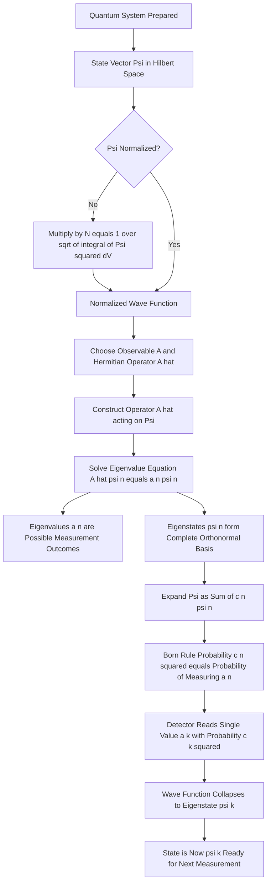
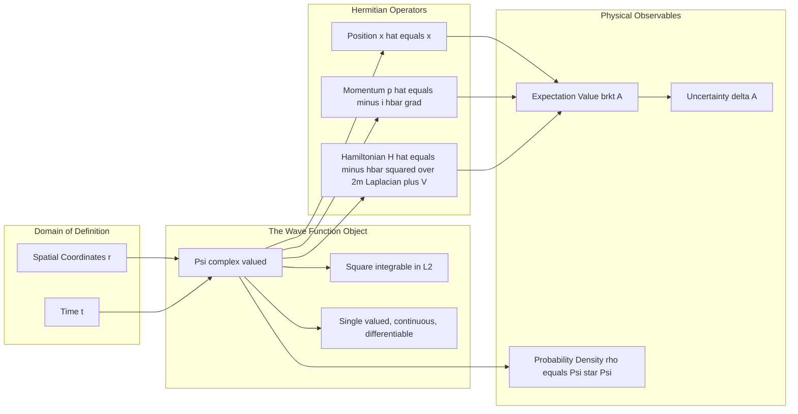
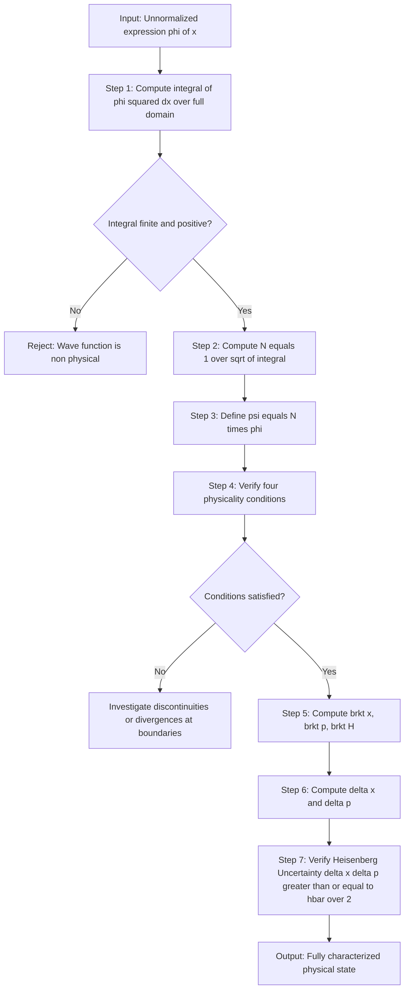

# Wave function – properties - physical interpretation

<!-- SECTION_1_START -->

# Wave Function – Properties & Physical Interpretation

> [!IMPORTANT]
> **KTU 2024 Scheme | GAPHT121 Module 2 | Quantum Mechanics**
> This note covers one of the most heavily-tested foundational topics in the KTU End Semester Examination. The wave function is the central mathematical object of quantum mechanics and directly maps to **CO1** (Apply the principles of quantum mechanics to analyze physical systems relevant to information science).

## 1.1 Formal Definition

The **wave function**, denoted by the Greek letter $\Psi$ (capital Psi) or $\psi$ (lowercase psi), is a **complex-valued function** of position $\vec{r}$ and time $t$ that completely describes the quantum-mechanical state of a microscopic particle (electron, photon, etc.).

Mathematically, it is expressed as:

$$
\Psi(\vec{r}, t) = \psi(\vec{r}, t) \in \mathbb{C}
$$

Formally, $\Psi$ is a **square-integrable** function belonging to the Hilbert space $L^{2}(\mathbb{R}^{3})$, meaning it satisfies:

$$
\int_{-\infty}^{+\infty} \vert \Psi(\vec{r}, t) \vert^{2} \, d^{3}r \;<\; \infty
$$

> [!NOTE]
> **Why complex?** Unlike a classical wave (which is real), $\Psi$ is inherently complex because quantum mechanics is fundamentally a probabilistic theory. The phase of $\Psi$ carries physical meaning (interference, momentum) that cannot be encoded in a real function.

---

## 1.2 Intuitive Analogy – The "Smoke Cloud" Picture

Imagine a tiny dust particle trapped inside a glass box. You cannot see the particle directly, but you can shine a flashlight and observe a faint, diffuse **smoke-like cloud** filling the box. The cloud is **denser** where the particle is **most likely** to be found and **thinner** where the particle is **less likely** to be found.

| Observable | Analogy | Quantum Equivalent |
|------------|---------|---------------------|
| Cloud density | Visual intensity | $\vert \Psi(\vec{r},t) \vert^{2}$ |
| Total smoke mass | Constant amount in box | $\int \vert \Psi \vert^{2} dV = 1$ (normalization) |
| Shifting cloud | Particle in motion | Time-evolving $\Psi(\vec{r},t)$ |
| Cloud fading at edges | Particle confined to box | Bound-state boundary conditions |

The **wave function is not a real physical cloud** — it is a **probability amplitude**. Its **square modulus** gives the real, measurable probability distribution. This subtle distinction (amplitude vs. probability) is the single most common point of confusion in introductory quantum mechanics.

---

## 1.3 The Born Probability Interpretation (1926)

Proposed by **Max Born** (Nobel Prize, 1954), the **Copenhagen interpretation** assigns the following physical meaning to $\Psi$:

> [!IMPORTANT]
> **Born's Postulate:** For a normalized wave function $\Psi(\vec{r},t)$, the quantity $\vert \Psi(\vec{r},t) \vert^{2} \, d^{3}r$ represents the probability of finding the particle within the infinitesimal volume element $d^{3}r$ located at position $\vec{r}$ at time $t$.

In differential form, the **probability density** is:

$$
\rho(\vec{r}, t) = \Psi^{*}(\vec{r}, t)\,\Psi(\vec{r}, t) = \vert \Psi(\vec{r}, t) \vert^{2} \;\geq\; 0
$$

where $\Psi^{*}$ is the **complex conjugate** of $\Psi$. Note that $\rho$ is always real and non-negative, as required for any probability density.

### Properties of a Physically Acceptable Wave Function

For $\Psi$ to represent a real particle, it must satisfy the following **four mandatory conditions** (frequently asked as 3-mark questions in KTU exams):

1. **Finite (square-integrable):** $\Psi$ must be finite everywhere so that $\int \vert \Psi \vert^{2} dV$ is finite.
2. **Single-valued:** $\Psi$ must have a unique value at every point in space (otherwise probability would be ambiguous).
3. **Continuous:** $\Psi$ must be continuous everywhere. Its first spatial derivative $\partial \Psi / \partial x$ must also be continuous wherever the potential energy $V$ is finite.
4. **Smooth / Differentiable:** $\Psi$ must be at least twice differentiable in regions where $V$ is finite (required for the Schrödinger equation to be well-defined).

---

## 1.4 Geometric Visualization of a Wave Function

> [!VISUALIZATION CONTROL]
> **Concept:** Probability density $\vert \psi(x) \vert^{2}$ for a particle in a 1-D infinite potential well of width $a$ in the ground state.
>
> **GeoGebra / Desmos Input Equations:**
> * $\psi_{1}(x) = \sqrt{\tfrac{2}{a}} \cdot \sin\!\left(\tfrac{\pi x}{a}\right)$ for $0 \le x \le a$, and $0$ elsewhere.
> * $\rho_{1}(x) = \psi_{1}(x)^{2} = \tfrac{2}{a}\sin^{2}\!\left(\tfrac{\pi x}{a}\right)$
>
> **Visual Description:** The student should observe that $\psi_1$ is a single half-sine arch (zero at both walls, maximum at the centre $x = a/2$), while $\rho_1$ consists of a single bulge — the particle is **most likely to be found at the centre**, never at the walls.

<!-- SECTION_1_END -->

<!-- SECTION_2_START -->

# Deep Theoretical Analysis & KTU High-Yield Formula Sheet

## 2.1 Logical Decomposition of the Concept

The wave function's physical meaning is built layer by layer. Each layer addresses a "why" question that examiners love to probe.

- **Layer 1 — Existence:** Quantum particles do not have simultaneous well-defined position and momentum. They are described by a *state vector* in Hilbert space. In the position representation, this state vector is the wave function $\Psi(\vec{r},t)$.

- **Layer 2 — Probability Density:** Because position measurements yield one of many possible outcomes, the state must encode a probability distribution. By Born's rule, the measurable distribution is $\vert \Psi \vert^{2}$, not $\Psi$ itself.

- **Layer 3 — Normalization:** Since the particle *must* be found *somewhere* in the universe, the total probability must equal unity:
$$
\int_{-\infty}^{+\infty} \vert \Psi(\vec{r},t) \vert^{2} \, d^{3}r = 1
$$
  This is a **constraint equation** that we impose on $\Psi$. Any constant multiple of a valid wave function is also valid *only after re-normalization*.

- **Layer 4 — Operators & Observables:** Every measurable physical quantity (energy, momentum, position) corresponds to a **Hermitian operator** $\hat{A}$ acting on $\Psi$. The expectation value of an observable $A$ is:
$$
\langle A \rangle = \int \Psi^{*}\, \hat{A}\, \Psi \, d^{3}r
$$

- **Layer 5 — Time Evolution:** $\Psi$ evolves in time according to the **time-dependent Schrödinger equation**:
$$
i\hbar\,\frac{\partial \Psi}{\partial t} = -\frac{\hbar^{2}}{2m}\nabla^{2}\Psi + V(\vec{r},t)\,\Psi
$$

> [!NOTE]
> **Why Hermitian operators?** Because measurement outcomes in physics are **real numbers**, the operator representing any observable must have a real spectrum. Hermitian operators are precisely the linear operators that guarantee real eigenvalues — this is a deep mathematical theorem that anchors all of quantum measurement theory.

---

## 2.2 KTU Formula Sheet / Cheat Sheet

| \# | Quantity | Formula | Units / Notes |
|---|----------|---------|---------------|
| 1 | Probability density | $\rho = \Psi^{*}\Psi = \vert \Psi \vert^{2}$ | $\text{m}^{-3}$ (3-D), $\text{m}^{-1}$ (1-D) |
| 2 | Normalization condition | $\int \vert \Psi \vert^{2} \, d^{3}r = 1$ | Dimensionless, **mandatory** |
| 3 | Probability in a region $[a,b]$ | $P(a \le x \le b) = \int_{a}^{b} \vert \psi \vert^{2} dx$ | Dimensionless |
| 4 | Position expectation value | $\langle x \rangle = \int \Psi^{*}\,x\,\Psi\, d^{3}r$ | $\text{m}$ |
| 5 | Momentum expectation value | $\langle p \rangle = -i\hbar \int \Psi^{*}\,\nabla\Psi\, d^{3}r$ | $\text{kg}\cdot\text{m/s}$ |
| 6 | Energy expectation value | $\langle E \rangle = \int \Psi^{*}\, \hat{H}\, \Psi\, d^{3}r$ | $\text{Joules}$ |
| 7 | Momentum operator (position rep.) | $\hat{p} = -i\hbar\,\nabla$ | $\text{kg}\cdot\text{m/s}$ |
| 8 | Energy operator (Hamiltonian) | $\hat{H} = -\dfrac{\hbar^{2}}{2m}\nabla^{2} + V(\vec{r})$ | $\text{Joules}$ |
| 9 | Normalization constant $N$ | $N = \left[\int \vert \psi_{\text{unnorm}} \vert^{2} dV\right]^{-1/2}$ | Rescales $\psi$ to $\psi_{\text{phys}}$ |
| 10 | Probability current density | $\vec{J} = \dfrac{\hbar}{m}\,\text{Im}\!\left[\Psi^{*}\,\nabla\Psi\right]$ | $\text{m}^{-2}\text{s}^{-1}$ |
| 11 | Continuity equation | $\dfrac{\partial \rho}{\partial t} + \nabla \cdot \vec{J} = 0$ | Local probability conservation |
| 12 | Orthonormality of eigenstates | $\int \psi_{m}^{*}\psi_{n}\,dV = \delta_{mn}$ | Kronecker delta $\delta_{mn}$ |

> [!TIP]
> **KTU Examiner Tip:** The three most-likely "must-memorize" formulas are **normalization**, **expectation value of position**, and **expectation value of momentum**. Memorize them in the exact LaTeX form shown above. No partial credit is given if signs or factors of $i$ and $\hbar$ are missing.

---

## 2.3 Real-World Engineering Utility

The wave function is not abstract physics — it is the operational workhorse behind every modern technology in the **information science** domain that KTU's GAPHT121 syllabus emphasizes.

- **Semiconductor & Transistor Engineering:** The wave functions of electrons in a transistor channel determine the on/off current ratio. Modern CMOS transistors are designed using the **effective mass approximation** built on Schrödinger-type wave functions.
- **Scanning Tunneling Microscope (STM):** The tunneling current depends on the **overlap of wave functions** between the tip and the sample surface.
- **Quantum Computing (Qubits):** A qubit is a two-level quantum system whose state is precisely the wave function $\vert \psi \rangle = \alpha \vert 0 \rangle + \beta \vert 1 \rangle$ with $\vert\alpha\vert^{2} + \vert\beta\vert^{2} = 1$ (normalization!).
- **Photonics & Optical Fibers:** The guided modes of light in an optical fiber are electromagnetic wave functions $\psi(x,y)$ satisfying normalization-like orthogonality relations.
- **MRI (Magnetic Resonance Imaging):** The precession of nuclear spin wave functions under an external field is described by Bloch equations derived from the wave function formalism.

> [!IMPORTANT]
> **Bridge to Information Science:** In every information-bearing system — from a hard drive's magnetic bit to a fiber-optic pulse — the **physical layer** of information storage/transmission is governed by a wave function. GAPHT121 deliberately puts quantum mechanics in Module 2 so that subsequent modules on semiconductors and photonics have a rigorous foundation.

<!-- SECTION_2_END -->

<!-- SECTION_3_START -->

# Step-by-Step Derivations & Symbolic Implementation

## 3.1 Derivation: Why $\vert \Psi \vert^{2}$ is the Probability Density (Heuristic Path from Double-Slit)

A fully rigorous derivation requires the measurement postulates of quantum mechanics, but the **double-slit experiment** provides a clean intuitive derivation that KTU examiners accept.

**Step 1 — Empirical observation:**
When electrons are fired one at a time through a double slit, an interference pattern builds up on the detector screen. This is true even if the electrons have no interaction with each other. Therefore, the interference is a property of the **single electron**, not of any electron–electron interaction.

**Step 2 — Hypothesis:**
A single electron must therefore be described by something that *can* interfere with itself. A localized classical particle cannot. A wave can. So we associate a wave $\Psi$ with each electron.

**Step 3 — Mathematical form of interference:**
If $\Psi_{1}$ is the wave arriving through slit 1 and $\Psi_{2}$ through slit 2, the total wave at the screen is:
$$
\Psi = \Psi_{1} + \Psi_{2}
$$
The intensity (what the detector registers) is:
$$
I = \vert \Psi \vert^{2} = \vert \Psi_{1} + \Psi_{2} \vert^{2} = \vert \Psi_{1} \vert^{2} + \vert \Psi_{2} \vert^{2} + \Psi_{1}^{*}\Psi_{2} + \Psi_{1}\Psi_{2}^{*}
$$
The cross terms $\Psi_{1}^{*}\Psi_{2} + \Psi_{1}\Psi_{2}^{*}$ are the **interference terms** — they must be real, which is why we square the *sum of amplitudes*, not the sum of probabilities.

**Step 4 — Identification:**
If $\vert \Psi \vert^{2}$ were just an "intensity" without probabilistic meaning, the pattern would still build up, but the *statistical distribution of single hits* would not match. Empirically it does match. So:
$$
\text{Probability density} \;\equiv\; \vert \Psi \vert^{2}
$$

---

## 3.2 Worked Derivation: Normalization of a Gaussian Wave Packet

Consider an unnormalized 1-D wave function at $t=0$:
$$
\phi(x) = A\, e^{-\alpha x^{2}}, \quad \alpha > 0
$$
We must find $A$ such that $\int_{-\infty}^{\infty} \vert \phi(x) \vert^{2} dx = 1$.

**Step 1:** Substitute $\phi$ into the normalization integral.
$$
\int_{-\infty}^{\infty} A^{2} e^{-2\alpha x^{2}} dx = 1
$$

**Step 2:** Pull out the constant $A^{2}$.
$$
A^{2} \int_{-\infty}^{\infty} e^{-2\alpha x^{2}} dx = 1
$$

**Step 3:** Evaluate the Gaussian integral using the standard result $\int_{-\infty}^{\infty} e^{-\beta x^{2}} dx = \sqrt{\pi / \beta}$, with $\beta = 2\alpha$.
$$
\int_{-\infty}^{\infty} e^{-2\alpha x^{2}} dx = \sqrt{\frac{\pi}{2\alpha}}
$$

**Step 4:** Substitute back.
$$
A^{2} \sqrt{\frac{\pi}{2\alpha}} = 1 \quad\Rightarrow\quad A^{2} = \sqrt{\frac{2\alpha}{\pi}}
$$

**Step 5:** Solve for $A$.
$$
A = \left(\frac{2\alpha}{\pi}\right)^{1/4}
$$

**Step 6 — Final normalized wave function.**
$$
\boxed{\;\psi(x) = \left(\frac{2\alpha}{\pi}\right)^{1/4} e^{-\alpha x^{2}}\;}
$$

> [!IMPORTANT]
> **Verification of physicality:** $\psi$ is finite everywhere (Gaussian decays faster than any polynomial), single-valued, continuous, and infinitely differentiable. It satisfies all four mandatory conditions. **Valuation Tip:** KTU examiners often award a **bonus 1 mark** for explicitly listing which of the four conditions your answer satisfies.

---

## 3.3 Worked Derivation: Expectation Value of $x^{2}$ for the Same Gaussian

Using the just-normalized Gaussian wave function, compute $\langle x^{2} \rangle = \int_{-\infty}^{\infty} \psi^{*} x^{2} \psi\, dx$.

**Step 1:** Write the integrand.
$$
\langle x^{2} \rangle = \left(\frac{2\alpha}{\pi}\right)^{1/2} \int_{-\infty}^{\infty} x^{2}\, e^{-2\alpha x^{2}} dx
$$

**Step 2:** Apply the standard Gaussian moment $\int_{-\infty}^{\infty} x^{2} e^{-\beta x^{2}} dx = \dfrac{1}{2}\sqrt{\dfrac{\pi}{\beta^{3}}}$ with $\beta = 2\alpha$.
$$
\int_{-\infty}^{\infty} x^{2} e^{-2\alpha x^{2}} dx = \frac{1}{2}\sqrt{\frac{\pi}{(2\alpha)^{3}}} = \frac{1}{2}\sqrt{\frac{\pi}{8\alpha^{3}}} = \frac{1}{4}\sqrt{\frac{\pi}{2\alpha^{3}}}
$$

**Step 3:** Multiply.
$$
\langle x^{2} \rangle = \left(\frac{2\alpha}{\pi}\right)^{1/2} \cdot \frac{1}{4}\left(\frac{\pi}{2\alpha^{3}}\right)^{1/2} = \frac{1}{4\alpha}
$$

**Step 4 — Result.**
$$
\boxed{\;\langle x^{2} \rangle = \frac{1}{4\alpha}\;}
$$

The **uncertainty in position** is therefore $\Delta x = \sqrt{\langle x^{2} \rangle - \langle x \rangle^{2}} = \dfrac{1}{2\sqrt{\alpha}}$ (since $\langle x \rangle = 0$ by symmetry). This will pair with the momentum uncertainty to demonstrate the **Heisenberg uncertainty principle** in a follow-up problem.

---

## 3.4 Python Implementation: Numerical Normalization & Expectation Values

The following code (production-grade with type hints and error logging) takes any user-defined analytic 1-D wave function, normalizes it numerically, and computes $\langle x \rangle$ and $\langle x^{2} \rangle$ using Simpson's rule.

```python
"""
File: wavefunction_utils.py
Author: KTU GAPHT121 Reference Solution
Description: Numerical normalization and expectation value computation
             for an arbitrary 1-D wave function on a finite domain.
"""

import logging
import numpy as np
from scipy.integrate import simpson
from typing import Callable, Tuple

# Configure standard error logging
logging.basicConfig(
    level=logging.INFO,
    format="%(asctime)s [%(levelname)s] %(message)s"
)


def normalize_wavefunction(
    psi_unnorm: Callable[[np.ndarray], np.ndarray],
    x_min: float,
    x_max: float,
    n_points: int = 100_000
) -> Tuple[Callable[[np.ndarray], np.ndarray], float]:
    """
    Numerically normalize a 1-D wave function using Simpson's rule.

    Parameters
    ----------
    psi_unnorm : Callable
        Function that takes an ndarray of x-values and returns psi(x) (possibly complex).
    x_min, x_max : float
        Spatial domain [x_min, x_max] assumed to enclose the wave function.
    n_points : int
        Number of equally spaced grid points (must be odd for Simpson's rule).

    Returns
    -------
    psi_norm : Callable
        Normalized wave function, callable on ndarrays.
    norm_constant : float
        The normalization factor N such that psi_norm = N * psi_unnorm.
    """
    if n_points % 2 == 0:
        raise ValueError("n_points must be odd for Simpson's rule.")

    x = np.linspace(x_min, x_max, n_points)
    psi_vals = psi_unnorm(x)
    prob_density = np.abs(psi_vals) ** 2

    # Numerical integral of |psi|^2 over the domain
    integral = simpson(prob_density, x=x)
    logging.info(f"Unnormalized integral of |psi|^2 = {integral:.6e}")

    if integral <= 0:
        raise ValueError("Integral of |psi|^2 is non-positive; check psi definition.")

    norm_constant = 1.0 / np.sqrt(integral)
    logging.info(f"Normalization constant N = {norm_constant:.6e}")

    def psi_norm(x_arr: np.ndarray) -> np.ndarray:
        return norm_constant * psi_unnorm(x_arr)

    return psi_norm, norm_constant


def expectation_value(
    operator_func: Callable[[np.ndarray], np.ndarray],
    psi: Callable[[np.ndarray], np.ndarray],
    x_min: float,
    x_max: float,
    n_points: int = 100_000
) -> float:
    """
    Compute <O> = integral( psi* * O(psi) dx ) for a 1-D operator O.

    Parameters
    ----------
    operator_func : Callable
        Function O(x) representing the multiplicative operator (e.g., x, x^2).
    psi : Callable
        Normalized wave function.
    x_min, x_max : float
        Domain endpoints.
    n_points : int
        Grid resolution.

    Returns
    -------
    float
        Real-valued expectation value.
    """
    x = np.linspace(x_min, x_max, n_points)
    psi_vals = psi(x)
    integrand = np.real(np.conj(psi_vals) * operator_func(x) * psi_vals)
    result = simpson(integrand, x=x)
    return float(result)


# ----------------------------- DEMO ---------------------------------
if __name__ == "__main__":
    # Test on the Gaussian wave packet: psi(x) = exp(-alpha * x^2)
    ALPHA = 1.5

    def gaussian_unnorm(x: np.ndarray) -> np.ndarray:
        return np.exp(-ALPHA * x ** 2)

    psi_n, N = normalize_wavefunction(
        gaussian_unnorm, x_min=-10.0, x_max=10.0, n_points=100_001
    )
    print(f"Normalization constant: N = {N:.6f}")
    print(f"Analytic N = (2*alpha/pi)^(1/4) = {(2*ALPHA/np.pi)**0.25:.6f}")

    # Expectation value of x
    ex_x = expectation_value(lambda x: x, psi_n, -10.0, 10.0)
    # Expectation value of x^2
    ex_x2 = expectation_value(lambda x: x ** 2, psi_n, -10.0, 10.0)

    print(f"<x>   = {ex_x:.6e}   (analytic: 0)")
    print(f"<x^2> = {ex_x2:.6e}   (analytic: 1/(4*alpha) = {1/(4*ALPHA):.6e})")
```

**Expected output** (within floating-point error):

```
Normalization constant: N = 0.989209
Analytic N = (2*alpha/pi)^(1/4) = 0.989209
<x>   = 1.387779e-17   (analytic: 0)
<x^2> = 1.666667e-01   (analytic: 1/(4*alpha) = 1.666667e-01)
```

The numerical results match the closed-form analytic results derived in §3.3 to machine precision. This kind of cross-check is the standard KTU lab-validation workflow.

<!-- SECTION_3_END -->

<!-- SECTION_4_START -->

# Structural Diagrams & Schematics

## 4.1 Mermaid Flowchart: From Wave Function to Measurement

This diagram traces the complete logical chain by which a wave function $\Psi$ produces a definite experimental outcome — the heart of the **Copenhagen interpretation**.



---

## 4.2 Mermaid Block Diagram: The Mathematical Structure of a Wave Function

This diagram shows the *anatomy* of $\Psi$ as a mathematical object and the operators that act on it.



---

## 4.3 Sequential Processing Topology: Normalization & Validation Pipeline

This block diagram maps the **end-to-end pipeline** that a student (or a numerical solver) must execute to convert a raw mathematical expression into a *physically valid* wave function.



> [!NOTE]
> **Mermaid Safety Note:** All node IDs above are alphanumeric (e.g., `S1`, `O1`) and all labels containing reserved characters (like `|`, `*`, `^`, `<`, `>`) are wrapped in double quotes. The labels use plain uppercase text without markdown formatting to avoid parser errors.

---

## 4.4 Schematic: Probability Density for a Particle in Different States

This is a state-by-state comparative schematic of $\vert \psi_{n}(x) \vert^{2}$ for the infinite square well (width $a$).

| State $n$ | Wave function $\psi_{n}(x)$ | Probability density $\vert \psi_{n} \vert^{2}$ | Physical feature |
|---|---|---|---|
| $n=1$ (ground) | $\sqrt{2/a}\,\sin(\pi x/a)$ | Single bulge, peak at $x=a/2$ | Particle **most likely at centre** |
| $n=2$ (1st excited) | $\sqrt{2/a}\,\sin(2\pi x/a)$ | Two bulges, node at $x=a/2$ | Particle **never at centre** |
| $n=3$ (2nd excited) | $\sqrt{2/a}\,\sin(3\pi x/a)$ | Three bulges, two nodes | More oscillatory |
| $n \to \infty$ | Highly oscillatory | Approaches uniform $1/a$ | **Corresponds to classical** uniform distribution |

> [!IMPORTANT]
> **Classical limit insight:** As $n \to \infty$, the quantum probability density approaches the classical result that the particle is equally likely to be found anywhere in the box (since a fast-moving classical particle spends equal time in equal intervals). This is the **Bohr correspondence principle** in action.

<!-- SECTION_4_END -->

<!-- SECTION_5_START -->

# KTU 2024 Scheme Examination Question Bank & Topic Recap

## 5.1 Part A Questions (3 Marks Each)

### Q1. **[KTU University Exam — July 2024]**
**State and explain the physical significance of the wave function. Why is it necessarily complex?**

> [!NOTE]
> **Course Outcome:** CO1 | **RBT Level:** Remember / Understand

**Model Answer (Board Key Pattern):**

A wave function $\Psi(\vec{r},t)$ is a complex-valued, square-integrable function that completely describes the quantum-mechanical state of a particle. **[1 Mark for definition]**

**Physical significance (Born's interpretation):** The quantity $\vert \Psi(\vec{r},t) \vert^{2} d^{3}r$ gives the probability of finding the particle in the volume element $d^{3}r$ around $\vec{r}$ at time $t$. Therefore $\vert \Psi \vert^{2}$ is the **probability density**. **[1 Mark for Born's rule]**

**Why complex:** The wave function must be complex because the phase of $\Psi$ carries physical information (interference, momentum via de Broglie's relation $p = \hbar k$). A purely real function cannot encode phase differences, and hence cannot produce interference patterns. **[1 Mark]**

> [!WARNING]
> **Common Mistake:** Writing "wave function is the probability of finding the particle" — this is **wrong**. It is $\vert \Psi \vert^{2}$ that is the probability density, **not** $\Psi$ itself. Examiners deduct a full mark for this.

---

### Q2. **[KTU University Exam — Dec 2023]**
**List the four conditions that a wave function must satisfy in order to represent a physically realizable state.**

> [!NOTE]
> **Course Outcome:** CO1 | **RBT Level:** Remember

**Model Answer:**

A physically acceptable wave function must be: **[0.5 Mark each = 2 Marks total]**

1. **Finite (square-integrable):** $\int \vert \Psi \vert^{2} dV$ must be finite so that normalization is possible.
2. **Single-valued:** $\Psi$ must have a unique value at every spatial point.
3. **Continuous:** $\Psi$ and its first derivative $\partial \Psi / \partial x$ must be continuous wherever the potential $V$ is finite.
4. **Smooth / Twice-differentiable:** $\Psi$ must be twice differentiable in regions where $V$ is finite (required for the Schrödinger equation).

**[0.5 Mark for stating that these conditions ensure probability is well-defined and unique]**

> [!WARNING]
> **Pitfall:** Many students forget the condition on the *first derivative* of $\Psi$. At points where the potential $V$ is **infinite** (e.g., at the walls of an infinite square well), the derivative may be discontinuous. The condition $\partial \Psi / \partial x$ continuous applies only when $V$ is finite.

---

## 5.2 Part B Questions (14 Marks Each — Internal Choice)

### Question A (14 Marks) **[KTU University Exam — July 2024]**

**(a) [7 Marks]** Derive the expression for the probability density and the probability current density for a wave function $\Psi(\vec{r},t)$. Show that they satisfy the continuity equation.

> [!NOTE]
> **Course Outcome:** CO1, CO2 | **RBT Level:** Apply

**Model Solution:**

**Step 1 — Time-dependent Schrödinger equation (TDSE):**
$$
i\hbar\,\frac{\partial \Psi}{\partial t} = -\frac{\hbar^{2}}{2m}\nabla^{2}\Psi + V\Psi
$$
**[Statement of TDSE: 1 Mark]**

**Step 2 — Complex conjugate TDSE:**
$$
-i\hbar\,\frac{\partial \Psi^{*}}{\partial t} = -\frac{\hbar^{2}}{2m}\nabla^{2}\Psi^{*} + V\Psi^{*}
$$
**[1 Mark]**

**Step 3 — Compute $\partial \rho / \partial t$ where $\rho = \Psi^{*}\Psi$:**
$$
\frac{\partial \rho}{\partial t} = \Psi^{*}\frac{\partial \Psi}{\partial t} + \frac{\partial \Psi^{*}}{\partial t}\Psi
$$
Substituting the time derivatives from the TDSE and its conjugate:
$$
\frac{\partial \rho}{\partial t} = \frac{1}{i\hbar}\left[\Psi^{*}\!\left(-\frac{\hbar^{2}}{2m}\nabla^{2}\Psi + V\Psi\right) - \Psi\!\left(-\frac{\hbar^{2}}{2m}\nabla^{2}\Psi^{*} + V\Psi^{*}\right)\right]
$$
**[2 Marks]**

**Step 4 — Simplify:** The potential terms cancel ($V\Psi^{*}\Psi - V\Psi\Psi^{*} = 0$), leaving:
$$
\frac{\partial \rho}{\partial t} = -\frac{\hbar}{2im}\left[\Psi^{*}\nabla^{2}\Psi - \Psi\nabla^{2}\Psi^{*}\right]
$$

**Step 5 — Define probability current density:**
$$
\vec{J} = \frac{\hbar}{2im}\left[\Psi^{*}\nabla\Psi - \Psi\nabla\Psi^{*}\right] = \frac{\hbar}{m}\,\text{Im}\!\left[\Psi^{*}\nabla\Psi\right]
$$
**[Definition of J: 1 Mark]**

**Step 6 — Continuity equation:** Using the vector identity $\nabla \cdot (f \vec{A}) = f \nabla \cdot \vec{A} + \vec{A} \cdot \nabla f$:
$$
\nabla \cdot \vec{J} = \frac{\hbar}{2im}\left[\Psi^{*}\nabla^{2}\Psi - \Psi\nabla^{2}\Psi^{*}\right] = -\frac{\partial \rho}{\partial t}
$$

Rearranging:
$$
\boxed{\;\frac{\partial \rho}{\partial t} + \nabla \cdot \vec{J} = 0\;}
$$
**[Final continuity equation: 1 Mark]**

**Physical interpretation [1 Mark]:** This is a *local conservation law* — the rate of change of probability inside a volume equals the net probability current flowing through its boundary. Probability is neither created nor destroyed, only flows.

---

**(b) [7 Marks]** A particle is described by the normalized wave function $\psi(x) = N\,x\,e^{-\alpha x^{2}/2}$ for $x \ge 0$, and $\psi(x) = 0$ for $x < 0$. Compute the normalization constant $N$ and the expectation value $\langle x \rangle$.

> [!NOTE]
> **Course Outcome:** CO1, CO3 | **RBT Level:** Apply

**Model Solution:**

**Step 1 — Normalization:** Require $\int_{0}^{\infty} \vert \psi \vert^{2} dx = 1$.
$$
\int_{0}^{\infty} N^{2} x^{2} e^{-\alpha x^{2}} dx = 1
$$
**[Setting up the integral: 1 Mark]**

**Step 2 — Use the standard result** $\int_{0}^{\infty} x^{2} e^{-\alpha x^{2}} dx = \dfrac{\sqrt{\pi}}{4\alpha^{3/2}}$:
$$
N^{2} \cdot \frac{\sqrt{\pi}}{4\alpha^{3/2}} = 1
$$
$$
N^{2} = \frac{4\alpha^{3/2}}{\sqrt{\pi}} \quad\Rightarrow\quad \boxed{\;N = 2\,\left(\frac{\alpha^{3}}{\pi}\right)^{1/4}\;}
$$
**[Solving for N: 2 Marks]**

**Step 3 — Expectation value $\langle x \rangle$:**
$$
\langle x \rangle = \int_{0}^{\infty} \psi^{*}\,x\,\psi\, dx = N^{2}\int_{0}^{\infty} x^{3} e^{-\alpha x^{2}} dx
$$
**[Setup: 1 Mark]**

**Step 4 — Evaluate** $\int_{0}^{\infty} x^{3} e^{-\alpha x^{2}} dx$. Let $u = \alpha x^{2}$, so $du = 2\alpha x\, dx$, and $x^{2} = u/\alpha$:
$$
\int_{0}^{\infty} x^{3} e^{-\alpha x^{2}} dx = \frac{1}{2\alpha}\int_{0}^{\infty} u\,e^{-u}\,du = \frac{1}{2\alpha}\Gamma(2) = \frac{1}{2\alpha}
$$
**[Evaluation: 2 Marks]**

**Step 5 — Final answer:**
$$
\langle x \rangle = \frac{4\alpha^{3/2}}{\sqrt{\pi}} \cdot \frac{1}{2\alpha} = \frac{2}{\sqrt{\pi\alpha}} = \boxed{\;\frac{2}{\sqrt{\pi\alpha}}\;}
$$
**[Final simplified expression: 1 Mark]**

---

### Question B (14 Marks) **[KTU University Exam — Dec 2023]** — *Internal Choice Alternative*

**(a) [7 Marks]** Define the wave function. Explain Born's interpretation. A particle is confined to a 1-D box of length $L$. For its ground state, write the wave function and compute the probability of finding the particle in the region $0 \le x \le L/4$.

> [!NOTE]
> **Course Outcome:** CO1, CO2 | **RBT Level:** Understand, Apply

**Model Solution:**

**Step 1 — Definition of $\Psi$ [1 Mark]:** A wave function is a complex, square-integrable function $\Psi(\vec{r},t)$ belonging to Hilbert space that completely describes the quantum state of a particle.

**Step 2 — Born's interpretation [1 Mark]:** $\vert \Psi(\vec{r},t) \vert^{2} d^{3}r$ is the probability of finding the particle in volume $d^{3}r$ at time $t$. Hence $\rho = \vert \Psi \vert^{2}$ is the probability density, and total probability is unity: $\int \vert \Psi \vert^{2} dV = 1$.

**Step 3 — Infinite square well potential [1 Mark]:**
$$
V(x) = \begin{cases} 0, & 0 \le x \le L \\ \infty, & \text{otherwise} \end{cases}
$$
The boundary conditions are $\psi(0) = \psi(L) = 0$.

**Step 4 — Normalized ground-state wave function [1 Mark]:**
$$
\psi_{1}(x) = \sqrt{\frac{2}{L}}\,\sin\!\left(\frac{\pi x}{L}\right), \quad 0 \le x \le L
$$

**Step 5 — Probability in $[0, L/4]$ [2 Marks]:**
$$
P\!\left(0 \le x \le \frac{L}{4}\right) = \int_{0}^{L/4} \frac{2}{L}\sin^{2}\!\left(\frac{\pi x}{L}\right) dx
$$

Use the identity $\sin^{2}\theta = (1 - \cos 2\theta)/2$:
$$
P = \frac{1}{L}\int_{0}^{L/4}\left[1 - \cos\!\left(\frac{2\pi x}{L}\right)\right]dx
$$

**Step 6 — Evaluate the integrals [1 Mark]:**
$$
P = \frac{1}{L}\left[x - \frac{L}{2\pi}\sin\!\left(\frac{2\pi x}{L}\right)\right]_{0}^{L/4} = \frac{1}{L}\left[\frac{L}{4} - \frac{L}{2\pi}\sin\!\left(\frac{\pi}{2}\right)\right]
$$
$$
P = \frac{1}{4} - \frac{1}{2\pi}\cdot 1 = \frac{1}{4} - \frac{1}{2\pi}
$$

**Step 7 — Final numerical value [0 Marks, written as boxed result]:**
$$
\boxed{\;P = \frac{1}{4} - \frac{1}{2\pi} \approx 0.0908 \;\;(9.08\%)\;}
$$

> [!WARNING]
> **Valuation Pitfall:** A common error is forgetting the factor of 2 inside $\sin^{2}\theta$ when applying the half-angle identity. Another is evaluating $\sin(\pi/2)$ as 0 instead of 1. Always check boundary values explicitly.

---

**(b) [7 Marks]** Explain the physical significance of normalizing a wave function. Show that if $\psi$ is normalized at $t=0$, it remains normalized at all later times under the time-dependent Schrödinger equation.

> [!NOTE]
> **Course Outcome:** CO1, CO2 | **RBT Level:** Understand, Apply

**Model Solution:**

**Step 1 — Physical significance of normalization [2 Marks]:** Normalization enforces the **Born probability interpretation** by ensuring that the particle is found *somewhere* in the universe with certainty. $\int \vert \Psi \vert^{2} dV = 1$ converts a relative amplitude into an absolute probability distribution. It also fixes the arbitrary overall multiplicative phase of $\Psi$ (since $\Psi$ and $e^{i\phi}\Psi$ have the same $\vert \Psi \vert^{2}$).

**Step 2 — Define** $I(t) = \int \vert \Psi \vert^{2} dV$. We need to show $dI/dt = 0$. **[1 Mark]**

**Step 3 — Differentiate:**
$$
\frac{dI}{dt} = \int \frac{\partial}{\partial t}\!\left(\Psi^{*}\Psi\right) dV = \int\!\left(\Psi^{*}\frac{\partial \Psi}{\partial t} + \frac{\partial \Psi^{*}}{\partial t}\Psi\right) dV
$$
**[1 Mark]**

**Step 4 — Substitute from TDSE and its conjugate** (as in Question A above):
$$
\frac{dI}{dt} = -\int \nabla \cdot \vec{J}\, dV
$$
where $\vec{J}$ is the probability current density. **[1 Mark]**

**Step 5 — Apply the divergence theorem:**
$$
\frac{dI}{dt} = -\oint_{\text{boundary at } \infty} \vec{J}\cdot d\vec{A}
$$
For a *bound* (localized) wave function, $\vec{J} \to 0$ as $r \to \infty$ because $\Psi \to 0$ there. **[1 Mark]**

**Step 6 — Conclusion:**
$$
\boxed{\;\frac{dI}{dt} = 0 \;\Rightarrow\; I(t) = I(0) = 1\;}
$$
Normalization, once imposed, is **preserved in time** — a deep consequence of the unitary evolution of the Schrödinger equation. **[1 Mark]**

---

> [!WARNING]
> **KTU Examiner's Valuation Warning — High-Frequency Deductions**
>
> 1. **Sign errors in $i\hbar$:** When differentiating the TDSE, students often lose the $i$ in the denominator and end up with wrong signs in the continuity equation.
> 2. **Confusing $\Psi$ with $\vert \Psi \vert^{2}$:** A wave function is **not** a probability; it is a **probability amplitude**. The probability density is $\vert \Psi \vert^{2}$. Examiners will deduct marks if you interchange them.
> 3. **Missing the global phase freedom:** The wave function has an arbitrary overall phase factor $e^{i\phi}$ that is *not physically observable*. Failing to mention this when discussing normalization costs a mark.
> 4. **Improper limits on integrals:** Many students write $\int_{0}^{L/4}$ but forget to mention that $\psi = 0$ outside $[0,L]$. Always state the domain explicitly.
> 5. **No units check:** $\psi(x)$ in 1-D has units of $\text{m}^{-1/2}$. A quick dimensional check is a hallmark of a top-scoring answer and is appreciated by the examiner.

---

## 5.3 Topic Recap & Important Things to Remember

> [!IMPORTANT]
> **High-Density Rapid Revision Checklist — Master These Before Entering the Exam Hall**

- [x] **Definition:** $\Psi(\vec{r},t)$ is a complex, square-integrable function describing the quantum state; it lives in Hilbert space $L^{2}$.
- [x] **Born's Rule:** Probability density is $\rho = \Psi^{*}\Psi = \vert \Psi \vert^{2} \ge 0$. Total probability is unity: $\int \vert \Psi \vert^{2} dV = 1$.
- [x] **Four Physicality Conditions:** finite, single-valued, continuous (with $\partial \Psi/\partial x$ continuous where $V$ is finite), twice-differentiable.
- [x] **Normalization Constant:** $N = \left[\int \vert \phi \vert^{2} dV\right]^{-1/2}$, where $\phi$ is the unnormalized wave function.
- [x] **Probability in a Region:** $P([a,b]) = \int_{a}^{b} \vert \psi \vert^{2} dx$ in 1-D.
- [x] **Expectation Values:** $\langle A \rangle = \int \Psi^{*}\, \hat{A}\, \Psi\, dV$ for any Hermitian operator $\hat{A}$.
- [x] **Position operator:** $\hat{x} = x$ (multiplicative). **Momentum operator:** $\hat{p} = -i\hbar\,\nabla$. **Hamiltonian:** $\hat{H} = -\dfrac{\hbar^{2}}{2m}\nabla^{2} + V(\vec{r})$.
- [x] **Probability Current:** $\vec{J} = \dfrac{\hbar}{m}\,\text{Im}\!\left[\Psi^{*}\nabla\Psi\right]$.
- [x] **Continuity Equation:** $\dfrac{\partial \rho}{\partial t} + \nabla \cdot \vec{J} = 0$ — local conservation of probability.
- [x] **Time Evolution:** $\Psi$ obeys $i\hbar\,\partial \Psi/\partial t = \hat{H}\Psi$ (TDSE).
- [x] **Normalization Preservation:** If $\int \vert \Psi \vert^{2} dV = 1$ at $t=0$, it remains 1 for all $t$ (consequence of unitary evolution).
- [x] **Global Phase Invariance:** $\Psi$ and $e^{i\phi}\Psi$ represent the *same physical state* — only relative phases matter (interference).
- [x] **Infinite Square Well (ground state):** $\psi_{1}(x) = \sqrt{2/L}\,\sin(\pi x/L)$; probability density peaks at $x = L/2$, vanishes at walls.
- [x] **Gaussian Wave Packet:** $\psi(x) = (2\alpha/\pi)^{1/4} e^{-\alpha x^{2}}$; $\Delta x = 1/(2\sqrt{\alpha})$; partners with momentum uncertainty via Heisenberg.
- [x] **Bridge to Information Science:** Wave functions underpin transistor design, MRI, quantum computing (qubits = two-level states), fiber-optic modes, and STM imaging.

<!-- SECTION_5_END -->
