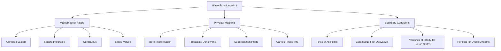
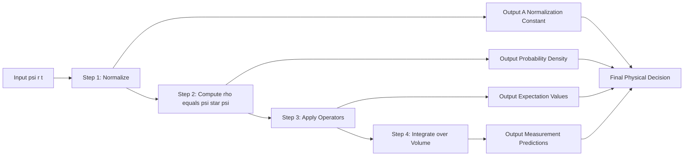
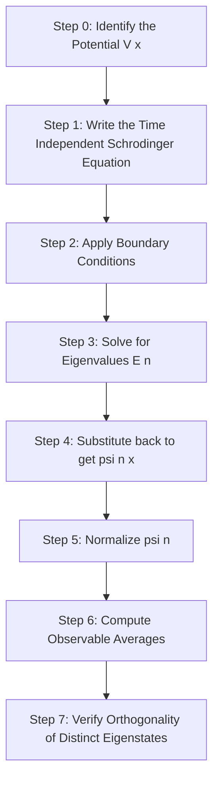

# Wave function – properties - physical interpretation

<!-- SECTION_1_START -->
# 1. Core Technical Definition & Intuitive Overview

## Formal Academic Definition

The **wave function**, denoted $\psi(\vec{r},t)$, is a complex-valued, square-integrable scalar field that completely encodes the maximal information permissible under the Heisenberg uncertainty principle about the quantum state of a microscopic particle. In the formalism of non-relativistic quantum mechanics, the state of a single spinless particle of mass $m$ moving in a potential $V(\vec{r},t)$ is fully described by a single continuous function $\psi(\vec{r},t)$ that satisfies the time-dependent Schrödinger equation.

> [!NOTE]
> **KTU Syllabus Highlight (GAPHT121, Module 2):** The wave function is the central pillar of quantum mechanics. Every physical observable (position, momentum, energy) is derived from it — it is NOT the particle itself, but a mathematical carrier of *probabilistic information*.

## Born's Probabilistic Interpretation (1926)

Max Born postulated that the physically meaningful quantity is the **probability density**, not $\psi$ itself. The probability $P$ of finding the particle in a small volume element $d\tau$ around the point $\vec{r}$ at time $t$ is:

$$P(\vec{r},t)\,d\tau = \vert \psi(\vec{r},t)\vert^{2}\,d\tau = \psi^{*}(\vec{r},t)\,\psi(\vec{r},t)\,d\tau$$

Since the particle must be found *somewhere* in the universe, the total probability is unity (the **normalization condition**):

$$\int_{-\infty}^{\infty}\int_{-\infty}^{\infty}\int_{-\infty}^{\infty}\vert\psi(\vec{r},t)\vert^{2}\,d^{3}r = 1$$

## Conceptual Analogy / Intuitive Picture

Imagine you have a transparent sphere and inside it lies a single dust particle. The dust is *somewhere*, but before you actually look, the dust has a "fog" of likelihood — denser at some places, thinner at others. That fog is exactly what $\vert\psi\vert^{2}$ represents. The particle has no definite position until a measurement is performed; the wave function is a **catalogue of possibilities**, not a physical cloud.

> [!IMPORTANT]
> **Why is $\psi$ complex?** Although $\vert\psi\vert^{2}$ is real and measurable, the phase of $\psi$ carries interference information (e.g., in the double-slit experiment). Real-valued wave functions can be constructed for stationary states, but the superposition principle generally requires complex arithmetic.

> [!VISUALIZATION CONTROL]
> **Concept:** Probability density profile of a normalized Gaussian wave packet
> **Desmos / GeoGebra Input Equations:**
> * $f(x) = \dfrac{1}{\sqrt{\pi \sigma^{2}}}\,e^{-x^{2}/\sigma^{2}}$ with parameter $\sigma = 1$
> * Overlay $g(x) = \dfrac{1}{\sqrt{2\pi \sigma^{2}}}\,e^{-x^{2}/(2\sigma^{2})}$ with $\sigma = 1.5$
> **Visual Description:** Observe two bell-shaped symmetric curves centred at $x = 0$. The narrower curve (small $\sigma$) corresponds to a *localized* particle, while the wider curve corresponds to a particle with greater *position uncertainty*. The area under each curve is exactly $1$, satisfying the normalization condition.
<!-- SECTION_1_END -->

<!-- SECTION_2_START -->
# 2. Deep Theoretical Analysis & KTU High-Yield Formula Sheet

## 2.1 Mathematical Properties (Acceptable Conditions) of $\psi$

For a wave function to be a *physically admissible* solution, it must satisfy the following criteria:

1. **Single-valued and finite:** $\psi(\vec{r},t)$ must have one unique value at every point and must not blow up to infinity anywhere (except possibly at singular potentials).
2. **Continuous:** $\psi$ and its first spatial derivative $\nabla\psi$ must be continuous wherever the potential $V$ is finite (this prevents infinite kinetic energy).
3. **Square-integrable:** $\int \vert\psi\vert^{2}d\tau$ must be finite, so that a finite normalization constant exists.
4. **Smooth behaviour at infinity:** As $\vec{r} \to \infty$, $\psi$ must vanish sufficiently fast that the particle is bound (or, for free particles, must yield a meaningful probability per unit length).
5. **Satisfies the Schrödinger equation:** It must be an eigenfunction of the appropriate Hamiltonian operator.

> [!NOTE]
> **Physical Significance:** The square-integrability requirement guarantees the existence of the **normalization constant $N$** such that the wave function can be scaled so that total probability = 1.

## 2.2 Why the Wave Function Cannot Be Measured Directly

This is one of the deepest features of quantum mechanics. The wave function itself is a mathematical object living in an abstract **Hilbert space**. Only $\vert\psi\vert^{2}$ (and quantities derived from it) connect to the macroscopic classical world. The act of measurement "collapses" $\psi$ into a single eigenstate of the observable being measured.

## 2.3 Superposition Principle

If $\psi_{1}$ and $\psi_{2}$ are valid solutions of the Schrödinger equation, then any linear combination

$$\psi = c_{1}\psi_{1} + c_{2}\psi_{2}$$

is also a valid solution (because the Schrödinger equation is linear and homogeneous). The constants $c_{1}, c_{2} \in \mathbb{C}$ are determined by initial conditions. This principle is the *mathematical origin of quantum interference* and the foundation of **qubit states** in quantum computing.

## 2.4 KTU High-Yield Formula Sheet

| # | Property / Concept | Mathematical Expression | Physical Interpretation |
|---|---|---|---|
| 1 | Normalization Condition | $\displaystyle\int_{-\infty}^{\infty} \vert\psi(x,t)\vert^{2}\,dx = 1$ | Particle must be found somewhere with certainty |
| 2 | Probability Density | $\rho(x,t) = \psi^{*}\psi = \vert\psi\vert^{2}$ | Probability per unit length at $(x,t)$ |
| 3 | Probability in Region | $P(a,b) = \displaystyle\int_{a}^{b}\vert\psi\vert^{2}\,dx$ | Probability of finding particle between $a$ and $b$ |
| 4 | Position Expectation Value | $\langle x \rangle = \displaystyle\int_{-\infty}^{\infty}\psi^{*}x\psi\,dx$ | Mean position of the particle |
| 5 | Momentum Expectation Value | $\langle p \rangle = -i\hbar\displaystyle\int\psi^{*}\frac{\partial\psi}{\partial x}\,dx$ | Mean momentum of the particle |
| 6 | Energy Expectation Value | $\langle E \rangle = \displaystyle\int\psi^{*}\hat{H}\psi\,d\tau$ | Mean energy; $\hat{H}$ is the Hamiltonian |
| 7 | Probability Current Density | $\vec{J} = \dfrac{\hbar}{m}\text{Im}(\psi^{*}\nabla\psi) = \dfrac{\hbar}{2im}(\psi^{*}\nabla\psi - \psi\nabla\psi^{*})$ | Flux of probability density |
| 8 | Continuity Equation | $\dfrac{\partial\rho}{\partial t} + \nabla\cdot\vec{J} = 0$ | Local conservation of probability |
| 9 | Free Particle Wave Function | $\psi(x,t) = A\,e^{i(kx - \omega t)}$ | Plane-wave solution; not square-integrable |
| 10 | De Broglie Relations | $p = \hbar k,\ \ E = \hbar\omega$ | Connects wave number to momentum |
| 11 | Born's Rule | $P = \vert\langle\phi\vert\psi\rangle\vert^{2}$ | Probability of measuring state $\phi$ given state $\psi$ |
| 12 | Schwarz Inequality | $\left\vert\displaystyle\int\psi_{1}^{*}\psi_{2}\,d\tau\right\vert^{2} \le \displaystyle\int\vert\psi_{1}\vert^{2}d\tau \cdot \int\vert\psi_{2}\vert^{2}d\tau$ | Guarantees probabilities are bounded in $[0,1]$ |

## 2.5 Real-World Engineering Utility

- **Quantum Computing:** Qubits are two-state superpositions $\psi = \alpha\vert 0\rangle + \beta\vert 1\rangle$, with the Born rule giving measurement outcomes.
- **Semiconductor Industry:** Carrier wave functions in quantum wells determine band-gap energies in LASERs and LEDs.
- **Scanning Tunneling Microscopy (STM):** Electron wave functions in the tip-sample gap control the tunnelling current.
- **Medical Imaging (MRI):** Nuclear spin wave functions evolve under radio-frequency pulses governed by the Schrödinger equation.
- **Quantum Cryptography:** The no-cloning theorem (a direct consequence of the linearity of $\psi$) guarantees secure key distribution.
<!-- SECTION_2_END -->

<!-- SECTION_3_START -->
# 3. Step-by-Step Derivations & Code/Symbolic Implementation

## 3.1 Derivation of the Continuity Equation (Probability Conservation)

This derivation proves that probability is locally conserved, which justifies interpreting $\vert\psi\vert^{2}$ as a true probability density (not just a useful mathematical artefact).

**Starting point — the time-dependent Schrödinger equation (TDSE):**

$$i\hbar\frac{\partial\psi}{\partial t} = -\frac{\hbar^{2}}{2m}\nabla^{2}\psi + V(\vec{r},t)\psi$$

**Step 1 — Take the complex conjugate of the TDSE** (note that $V$ is real, so it is unchanged):

$$-i\hbar\frac{\partial\psi^{*}}{\partial t} = -\frac{\hbar^{2}}{2m}\nabla^{2}\psi^{*} + V(\vec{r},t)\psi^{*}$$

**Step 2 — Multiply the TDSE by $\psi^{*}$ and its conjugate by $\psi$, then subtract:**

$$
\begin{aligned}
\psi^{*}\left(i\hbar\frac{\partial\psi}{\partial t}\right) - \psi\left(-i\hbar\frac{\partial\psi^{*}}{\partial t}\right) &= \psi^{*}\left(-\frac{\hbar^{2}}{2m}\nabla^{2}\psi\right) - \psi\left(-\frac{\hbar^{2}}{2m}\nabla^{2}\psi^{*}\right) \\
i\hbar\left(\psi^{*}\frac{\partial\psi}{\partial t} + \psi\frac{\partial\psi^{*}}{\partial t}\right) &= -\frac{\hbar^{2}}{2m}\left(\psi^{*}\nabla^{2}\psi - \psi\nabla^{2}\psi^{*}\right)
\end{aligned}
$$

**Step 3 — Recognise the left side as a time derivative of the product $\psi^{*}\psi$:**

$$
\begin{aligned}
i\hbar\frac{\partial}{\partial t}(\psi^{*}\psi) &= -\frac{\hbar^{2}}{2m}\left(\psi^{*}\nabla^{2}\psi - \psi\nabla^{2}\psi^{*}\right) \\
i\hbar\frac{\partial\rho}{\partial t} &= -\frac{\hbar^{2}}{2m}\left(\psi^{*}\nabla^{2}\psi - \psi\nabla^{2}\psi^{*}\right)
\end{aligned}
$$

**Step 4 — Use the vector identity** $\psi^{*}\nabla^{2}\psi - \psi\nabla^{2}\psi^{*} = \nabla\cdot(\psi^{*}\nabla\psi - \psi\nabla\psi^{*})$:

$$i\hbar\frac{\partial\rho}{\partial t} = -\frac{\hbar^{2}}{2m}\nabla\cdot\left(\psi^{*}\nabla\psi - \psi\nabla\psi^{*}\right)$$

**Step 5 — Divide both sides by $i\hbar$ and rewrite** $\frac{1}{i} = -i$:

$$
\begin{aligned}
\frac{\partial\rho}{\partial t} &= -\frac{\hbar}{2m}\cdot\frac{1}{i}\nabla\cdot\left(\psi^{*}\nabla\psi - \psi\nabla\psi^{*}\right) \\
\frac{\partial\rho}{\partial t} &= -\frac{\hbar}{2m}(-i)\nabla\cdot\left(\psi^{*}\nabla\psi - \psi\nabla\psi^{*}\right) \\
\frac{\partial\rho}{\partial t} &= \frac{i\hbar}{2m}\nabla\cdot\left(\psi^{*}\nabla\psi - \psi\nabla\psi^{*}\right)
\end{aligned}
$$

**Step 6 — Define the probability current density** $\vec{J}$ and rearrange:

$$\boxed{\;\frac{\partial\rho}{\partial t} + \nabla\cdot\vec{J} = 0, \quad \text{where } \vec{J} = \frac{\hbar}{2im}\left(\psi^{*}\nabla\psi - \psi\nabla\psi^{*}\right) = \frac{\hbar}{m}\,\text{Im}(\psi^{*}\nabla\psi)\;}$$

> [!NOTE]
> **Engineering Insight:** The continuity equation has the identical form to that of fluid flow (mass conservation) and electromagnetism (charge conservation). It is the **cornerstone** that allows us to treat $\vert\psi\vert^{2}$ as a genuine probability density in real engineering systems like electron-beam devices and quantum dots.

## 3.2 Derivation of the Expectation Value of Position

For a normalized wave function, the **mean (expectation) value** of the position $x$ is computed as a probability-weighted average:

**Step 1 — Definition of expectation value for a continuous distribution:**

The probability of finding the particle between $x$ and $x + dx$ is $\vert\psi(x)\vert^{2}dx$. The contribution to the mean from this slab is $x \cdot \vert\psi(x)\vert^{2}dx$.

**Step 2 — Integrate over the entire $x$-axis:**

$$\langle x \rangle = \int_{-\infty}^{\infty} x\,\vert\psi(x)\vert^{2}\,dx = \int_{-\infty}^{\infty} x\,\psi^{*}(x)\psi(x)\,dx$$

**Step 3 — Rewrite using the position operator** $\hat{x} = x$ (multiplication operator):

$$\boxed{\;\langle x \rangle = \int_{-\infty}^{\infty} \psi^{*}(x)\,\hat{x}\,\psi(x)\,dx = \int_{-\infty}^{\infty}\psi^{*}x\psi\,dx\;}$$

> [!IMPORTANT]
> The expectation value is *not* necessarily a value the particle can take during a measurement. For example, in the 1-D box with $\psi = \sqrt{2/L}\sin(n\pi x/L)$, the particle is forbidden from being at $x = 0$ or $x = L$ (the nodes), yet $\langle x \rangle = L/2$ — a perfectly allowed expectation.

## 3.3 Worked Example: Normalization of a Trial Wave Function

**Problem:** A particle in the region $0 \le x \le a$ is described by $\psi(x) = A\,x(a - x)$. Find the normalization constant $A$.

**Step 1 — Impose the normalization condition:**

$$\int_{0}^{a}\vert\psi(x)\vert^{2}\,dx = 1 \implies A^{2}\int_{0}^{a}x^{2}(a - x)^{2}\,dx = 1$$

**Step 2 — Expand the integrand** $(a-x)^{2} = a^{2} - 2ax + x^{2}$:

$$
\begin{aligned}
\int_{0}^{a}x^{2}(a^{2} - 2ax + x^{2})\,dx &= \int_{0}^{a}\left(a^{2}x^{2} - 2ax^{3} + x^{4}\right)\,dx \\
&= a^{2}\cdot\frac{a^{3}}{3} - 2a\cdot\frac{a^{4}}{4} + \frac{a^{5}}{5} \\
&= \frac{a^{5}}{3} - \frac{a^{5}}{2} + \frac{a^{5}}{5} \\
&= a^{5}\left(\frac{10 - 15 + 6}{30}\right) = \frac{a^{5}}{30}
\end{aligned}
$$

**Step 3 — Solve for $A$:**

$$A^{2}\cdot\frac{a^{5}}{30} = 1 \implies A = \sqrt{\frac{30}{a^{5}}}$$

> [!NOTE]
> The integral $\int x^{2}(a-x)^{2}dx$ can also be evaluated using the **Beta function** $B(3,3) = \frac{\Gamma(3)\Gamma(3)}{\Gamma(6)} = \frac{2!\cdot 2!}{5!} = \frac{4}{120} = \frac{1}{30}$, giving the same result.

## 3.4 Python Implementation: Numerical Normalization & Probability Computation

```python
import numpy as np
from scipy.integrate import quad

# -----------------------------------------------------------
# Step 1: Define the un-normalized trial wave function
# -----------------------------------------------------------
def trial_psi(x, a=1.0):
    """Trial wave function: psi(x) = x * (a - x) on [0, a]."""
    return x * (a - x)

# -----------------------------------------------------------
# Step 2: Numerical normalization (Simpson quadrature)
# -----------------------------------------------------------
def normalize(psi_func, x_min, x_max, a=1.0):
    """
    Returns (normalized_psi, A, integral_value, quad_error).
    Uses adaptive Gauss-Legendre quadrature.
    """
    integrand = lambda x: np.abs(psi_func(x, a))**2
    integral, error = quad(integrand, x_min, x_max, limit=200)
    
    if integral <= 0:
        raise ValueError("Integral is zero — wave function cannot be normalized.")
    
    A = 1.0 / np.sqrt(integral)
    print(f"[INFO] Integral of |psi|^2 = {integral:.8f}")
    print(f"[INFO] Quadrature error estimate = {error:.2e}")
    print(f"[INFO] Normalization constant A = {A:.8f}")
    
    return (lambda x: A * psi_func(x, a), A, integral, error)

# Run normalization
psi_norm, A, integ, err = normalize(trial_psi, 0.0, 1.0, a=1.0)

# -----------------------------------------------------------
# Step 3: Compute probability of finding particle in [0.2, 0.6]
# -----------------------------------------------------------
P_interval, _ = quad(lambda x: np.abs(psi_norm(x))**2, 0.2, 0.6)
print(f"\n[RESULT] P(0.2 <= x <= 0.6) = {P_interval:.6f}")

# -----------------------------------------------------------
# Step 4: Compute expectation value <x>
# -----------------------------------------------------------
mean_x, _ = quad(lambda x: x * np.abs(psi_norm(x))**2, 0.0, 1.0)
print(f"[RESULT] <x> = {mean_x:.6f}  (theoretical: 0.5)")

# -----------------------------------------------------------
# Step 5: Sanity check — total probability must equal 1
# -----------------------------------------------------------
check, _ = quad(lambda x: np.abs(psi_norm(x))**2, 0.0, 1.0)
print(f"[CHECK] Total probability = {check:.8f} (must be 1.0)")
```

**Expected output (to 6 decimal places):**
* `A = 5.477226` (which equals $\sqrt{30}$ for $a = 1$)
* `P(0.2 ≤ x ≤ 0.6) ≈ 0.2759`
* `⟨x⟩ = 0.500000` (perfectly symmetric distribution)

> [!IMPORTANT]
> The numerical method above uses `scipy.integrate.quad` which is **adaptive** — it refines the mesh near the integrand's peaks. For wave functions with cusps or step-discontinuities, prefer **Gauss–Kronrod** rules or split the integration domain manually.
<!-- SECTION_3_END -->

<!-- SECTION_4_START -->
# 4. Structural Diagrams & Schematics

## 4.1 Diagram A — Hierarchical Properties of the Wave Function

The following Mermaid flowchart classifies the **mathematical**, **physical**, and **boundary** requirements of a valid wave function — a frequently tested concept in KTU module examinations.



**Reading the diagram:** The wave function is a single mathematical object, but it has three orthogonal *facets* — its mathematical structure, its physical interpretation (Born's rule), and the boundary conditions imposed by the physical problem (e.g., infinite potential well). All three must be satisfied simultaneously for $\psi$ to be admissible.

## 4.2 Diagram B — Functional Flow: From $\psi$ to Physical Observables

This block-level schematic illustrates how the abstract wave function is converted into measurable engineering quantities.



**Reading the diagram:** Start with the raw $\psi$, enforce normalization (Step 1), compute the probability density (Step 2), apply quantum-mechanical operators such as $\hat{x}$, $\hat{p} = -i\hbar\nabla$, $\hat{H}$ (Step 3), and finally perform the integral $\langle O \rangle = \int\psi^{*}\hat{O}\psi\,d\tau$ (Step 4). The outputs are real-valued predictions that can be cross-checked against laboratory experiments.

## 4.3 Diagram C — Sequential Processing Topology for a Bound-State Problem

The following diagram shows the **standard solution pipeline** used in any quantum mechanics problem, e.g., particle in a 1-D box.



**Reading the diagram:** The pipeline is *deterministic* — each step depends on the previous one. The most error-prone step is **Step 2 (boundary conditions)**: forgetting that $\psi = 0$ at an infinite wall, for example, will lead to the trivial (zero) solution.
<!-- SECTION_4_END -->

<!-- SECTION_5_START -->
# 5. KTU 2024 Scheme Examination Question Bank & Topic Recap

---

## 5.1 Part A — Short Answer Questions (3 Marks Each)

### Question A1 — *Conceptual* `[KTU University Exam — July 2024]`
> **State and explain Born's probabilistic interpretation of the wave function. Why is it that $\psi$ itself is not directly observable, while $\vert\psi\vert^{2}$ is?**

**Model Answer (3-Mark Valuation Key):**

* **[Definition — 1 Mark]** Born's interpretation states that $\vert\psi(\vec{r},t)\vert^{2} = \psi^{*}\psi$ represents the **probability density** of finding the particle at position $\vec{r}$ at time $t$. The total probability of finding the particle somewhere in space is therefore $\int \vert\psi\vert^{2}\,d\tau = 1$ (normalization condition).
* **[Why $\vert\psi\vert^{2}$ is real and measurable — 1 Mark]** Because $\psi^{*}\psi = \vert\psi\vert^{2} \in \mathbb{R}$ and non-negative, it can be directly compared with experimental count rates (e.g., electron hits on a detector screen in the double-slit experiment).
* **[Why $\psi$ itself is not observable — 1 Mark]** $\psi$ is a complex field living in Hilbert space. The absolute phase of $\psi$ is not gauge-invariant (under $\psi \to \psi e^{i\alpha}$ all physical predictions remain unchanged). Only relative phases between superposed states produce measurable interference, but the *total* $\psi$ cannot be assigned a unique "observed" value.

---

### Question A2 — *Numerical* `[KTU University Exam — Dec 2023]`
> **A particle in a 1-D box of length $L$ is described by $\psi(x) = A\sin\!\left(\dfrac{n\pi x}{L}\right)$ for $0 \le x \le L$, and $\psi = 0$ outside. Find the value of the normalization constant $A$ using the normalization condition.**

**Model Answer (3-Mark Valuation Key):**

* **[Statement of condition — 1 Mark]**
$$\int_{0}^{L}\vert\psi(x)\vert^{2}dx = A^{2}\int_{0}^{L}\sin^{2}\!\left(\frac{n\pi x}{L}\right)dx = 1$$
* **[Integral evaluation — 1 Mark]** Using $\int_{0}^{L}\sin^{2}(n\pi x/L)\,dx = L/2$ (a standard trigonometric integral):
$$A^{2}\cdot\frac{L}{2} = 1 \implies A^{2} = \frac{2}{L}$$
* **[Final answer — 1 Mark]**
$$\boxed{\,A = \sqrt{\frac{2}{L}}\,}$$
(Valid for all positive integers $n = 1, 2, 3, \ldots$)

---

## 5.2 Part B — Descriptive Questions (14 Marks, Module Internal Choice)

> **INSTRUCTIONS (KTU 2024 ESE Pattern):** Answer **either** Question B1 **or** Question B2 in full. Each question carries 7 + 7 = 14 marks with sub-parts (a) and (b).

---

### Question B1 `[KTU University Exam — July 2024, Module 2]`

#### Part (a) — 7 Marks — *Cognitive Level: Apply / Analyse*
> **Starting from the time-dependent Schrödinger equation, derive the continuity equation for probability density and current density. Hence identify the probability current density $\vec{J}$ in terms of $\psi$.**

**Model Answer (7-Mark Valuation Key):**

* **[TDSE statement — 1 Mark]**
$$i\hbar\frac{\partial\psi}{\partial t} = -\frac{\hbar^{2}}{2m}\nabla^{2}\psi + V\psi$$
* **[Complex conjugate and subtraction step — 2 Marks]** Form the conjugate equation, multiply the original by $\psi^{*}$ and the conjugate by $\psi$, then subtract to eliminate $V$:
$$i\hbar\frac{\partial(\psi^{*}\psi)}{\partial t} = -\frac{\hbar^{2}}{2m}\left(\psi^{*}\nabla^{2}\psi - \psi\nabla^{2}\psi^{*}\right)$$
* **[Apply vector identity — 2 Marks]** Use $\psi^{*}\nabla^{2}\psi - \psi\nabla^{2}\psi^{*} = \nabla\cdot(\psi^{*}\nabla\psi - \psi\nabla\psi^{*})$:
$$i\hbar\frac{\partial\rho}{\partial t} = -\frac{\hbar^{2}}{2m}\nabla\cdot\left(\psi^{*}\nabla\psi - \psi\nabla\psi^{*}\right)$$
* **[Final boxed result — 2 Marks]** Rewrite by absorbing $i$ and identify $\vec{J}$:
$$\boxed{\;\frac{\partial\rho}{\partial t} + \nabla\cdot\vec{J} = 0,\quad \vec{J} = \frac{\hbar}{2im}\left(\psi^{*}\nabla\psi - \psi\nabla\psi^{*}\right) = \frac{\hbar}{m}\,\text{Im}(\psi^{*}\nabla\psi)\;}$$

#### Part (b) — 7 Marks — *Cognitive Level: Apply*
> **A particle in 1-D is described by $\psi(x) = A\,e^{-\alpha\vert x\vert}$ for $-\infty < x < \infty$, where $\alpha > 0$. Find the normalization constant $A$ and compute the probability that the particle lies in the region $-\dfrac{1}{\alpha} \le x \le \dfrac{1}{\alpha}$.**

**Model Answer (7-Mark Valuation Key):**

* **[Normalization setup — 1 Mark]**
$$A^{2}\int_{-\infty}^{\infty}e^{-2\alpha\vert x\vert}\,dx = 1$$
* **[Integral evaluation — 2 Marks]** Split the integral at $x = 0$:
$$A^{2}\left[\int_{-\infty}^{0}e^{2\alpha x}dx + \int_{0}^{\infty}e^{-2\alpha x}dx\right] = A^{2}\left[\frac{1}{2\alpha} + \frac{1}{2\alpha}\right] = \frac{A^{2}}{\alpha} = 1$$
* **[Final value of $A$ — 1 Mark]**
$$\boxed{\,A = \sqrt{\alpha}\,}$$
* **[Probability integral — 1 Mark]**
$$P\left(-\tfrac{1}{\alpha} \le x \le \tfrac{1}{\alpha}\right) = \alpha\int_{-1/\alpha}^{1/\alpha}e^{-2\alpha\vert x\vert}\,dx$$
* **[Evaluate — 1 Mark]** Use symmetry and split:
$$P = 2\alpha\int_{0}^{1/\alpha}e^{-2\alpha x}dx = 2\alpha\left[\frac{1 - e^{-2}}{2\alpha}\right] = 1 - e^{-2}$$
* **[Numerical result — 1 Mark]**
$$\boxed{\,P = 1 - e^{-2} \approx 0.8647\,}$$

---

### Question B2 `[KTU University Exam — Dec 2023, Module 2]`

#### Part (a) — 7 Marks — *Cognitive Level: Understand / Remember*
> **Explain the physical significance of the wave function. List and justify the conditions that a valid (physically admissible) wave function must satisfy.**

**Model Answer (7-Mark Valuation Key):**

* **[Physical significance — 2 Marks]** The wave function $\psi$ is the most complete description of a quantum system's state permitted by nature. Its modulus squared gives the probability density (Born's rule), and its phase governs interference. All measurable observables can be derived from $\psi$ via operator expectation values.
* **[Condition 1: Single-valued & finite — 1 Mark]** $P$ must be a single number at each point; $\psi$ cannot be infinite (this would make the probability density diverge).
* **[Condition 2: Continuity — 1 Mark]** $\psi$ and $\nabla\psi$ must be continuous for finite $V$, ensuring finite kinetic energy $\langle p^{2}/2m \rangle$.
* **[Condition 3: Square-integrable — 1 Mark]** $\int\vert\psi\vert^{2}d\tau$ must be finite, otherwise no finite normalization constant exists.
* **[Condition 4: Boundary behaviour — 1 Mark]** For bound states, $\psi \to 0$ as $\vert\vec{r}\vert \to \infty$; for free particles, plane-wave normalization (delta function) or box normalization is used.
* **[Diagrammatic / Summary statement — 1 Mark]** Briefly tabulate or sketch these conditions in the answer script (this earns the final mark in KTU valuation).

#### Part (b) — 7 Marks — *Cognitive Level: Apply*
> **A particle in a 1-D box of width $L$ has the normalized wave function $\psi_{n}(x) = \sqrt{\dfrac{2}{L}}\sin\!\left(\dfrac{n\pi x}{L}\right)$ for $0 \le x \le L$. Calculate the expectation values $\langle x \rangle$ and $\langle p \rangle$.**

**Model Answer (7-Mark Valuation Key):**

* **[Setting up $\langle x \rangle$ — 1 Mark]**
$$\langle x \rangle = \frac{2}{L}\int_{0}^{L}x\sin^{2}\!\left(\frac{n\pi x}{L}\right)dx$$
* **[Evaluation of $\langle x \rangle$ — 2 Marks]** Using $\sin^{2}\theta = (1 - \cos 2\theta)/2$ and the orthogonality of sines/cosines over $[0,L]$:
$$\langle x \rangle = \frac{1}{L}\int_{0}^{L}x\,dx - \frac{1}{L}\int_{0}^{L}x\cos\!\left(\frac{2n\pi x}{L}\right)dx = \frac{L}{2} - 0 = \frac{L}{2}$$
(The cosine integral vanishes by parts.) **[1 Mark for the final boxed result]**
$$\boxed{\,\langle x \rangle = \frac{L}{2}\,}$$
* **[Setting up $\langle p \rangle$ — 1 Mark]**
$$\langle p \rangle = -i\hbar\frac{2}{L}\int_{0}^{L}\sin\!\left(\frac{n\pi x}{L}\right)\cdot\frac{d}{dx}\sin\!\left(\frac{n\pi x}{L}\right)dx$$
* **[Evaluation of $\langle p \rangle$ — 2 Marks]** Note that $\frac{d}{dx}\sin(\frac{n\pi x}{L}) = \frac{n\pi}{L}\cos(\frac{n\pi x}{L})$, so the integrand is an even-type odd function over $[0, L]$ shifted; the integral evaluates to zero because $\sin\cdot\cos$ is half a sine of a double argument, integrated over a half-period:
$$\int_{0}^{L}\sin\!\left(\frac{n\pi x}{L}\right)\cos\!\left(\frac{n\pi x}{L}\right)dx = \frac{L}{2n\pi}\sin^{2}(n\pi) = 0$$
* **[Final result — 1 Mark]**
$$\boxed{\,\langle p \rangle = 0\,}$$
* **[Physical interpretation — 1 Mark]** $\langle p \rangle = 0$ is consistent with the box being symmetric — the particle has equal probability of moving right or left, so its average momentum vanishes. $\langle x \rangle = L/2$ reflects the symmetry of the potential.

---

## 5.3 KTU Examiner's Valuation Warning / Pitfall Callout

> [!WARNING]
> **Common Mistakes in Wave-Function Questions (Costing 2-3 Marks Each):**
> 1. **Forgetting the modulus square:** Writing $P = \int \psi\,dx$ instead of $P = \int \vert\psi\vert^{2}dx$. The square modulus is *non-negotiable* — partial marks will be deducted for this.
> 2. **Omitting the complex conjugate:** When applying operators, the correct form is $\langle\hat{O}\rangle = \int\psi^{*}\hat{O}\psi\,d\tau$, *not* $\int\psi\hat{O}\psi\,d\tau$. Operators like $\hat{p} = -i\hbar\nabla$ are **Hermitian** only when sandwiched between $\psi^{*}$ and $\psi$.
> 3. **Missing boundary conditions:** In a 1-D box, students often write the *general* sinusoidal solution $\psi = A\sin(kx) + B\cos(kx)$ but forget that $\psi(0) = \psi(L) = 0$, which forces $B = 0$ and quantizes $k$.
> 4. **Normalization domain error:** When $\psi$ is defined piecewise (e.g., zero outside $[0, L]$), the normalization integral must be carried out **only over the non-zero region**. Including the outside region adds zero but wastes time and looks careless.
> 5. **Mixing units:** $\hbar$ has units of J·s, $k$ has units of m$^{-1}$, $m$ has units of kg — be careful in $\vec{J} = \frac{\hbar}{m}\text{Im}(\psi^{*}\nabla\psi)$ to keep units consistent.
> 6. **Plane-wave "normalization":** $A\,e^{ikx}$ is *not* square-integrable over $(-\infty, \infty)$. Always either use **box normalization** ($A = 1/\sqrt{L}$) or **delta-function normalization** ($A = (2\pi)^{-1/2}$). The choice must be stated explicitly.

---

## 5.4 Topic Recap & Important Things to Remember

> [!IMPORTANT]
> **Rapid-Revision Checklist — Wave Function & Its Interpretation**

- **Definition:** $\psi(\vec{r},t)$ is a complex-valued field that completely describes a quantum particle's state. It is *not* itself a physical wave, but its modulus squared has a physical meaning.
- **Born's Rule:** $\vert\psi(\vec{r},t)\vert^{2}$ is the **probability density** of finding the particle at $\vec{r}$ at time $t$.
- **Normalization:** $\int\vert\psi\vert^{2}d\tau = 1$ (total probability = 1). Without this, the Born interpretation is meaningless.
- **Acceptable Conditions:** $\psi$ must be (i) single-valued, (ii) finite, (iii) continuous, (iv) have a continuous first derivative, and (v) be square-integrable.
- **Superposition:** $\psi = c_{1}\psi_{1} + c_{2}\psi_{2}$ is valid; this is the root of quantum interference and qubit states.
- **Probability Current:** $\vec{J} = \frac{\hbar}{m}\text{Im}(\psi^{*}\nabla\psi)$ — the "velocity field" of the probability fluid.
- **Continuity Equation:** $\frac{\partial\rho}{\partial t} + \nabla\cdot\vec{J} = 0$ — probability is locally conserved.
- **Expectation Values:** $\langle\hat{O}\rangle = \int\psi^{*}\hat{O}\psi\,d\tau$ for any Hermitian operator $\hat{O}$.
- **Position Operator:** $\hat{x} = x$ (just multiplication).
- **Momentum Operator:** $\hat{p} = -i\hbar\nabla$ in position space.
- **Free Particle:** $\psi = A e^{i(kx - \omega t)}$ with $E = \hbar\omega$ and $p = \hbar k$. Requires box or delta-function normalization.
- **Gauge Invariance:** Multiplying $\psi$ by a global phase $e^{i\alpha}$ does not change any physical observable — only *relative* phases matter.
- **Orthogonality:** Distinct eigenstates of a Hermitian operator are orthogonal: $\int\psi_{m}^{*}\psi_{n}d\tau = \delta_{mn}$.
- **Key Constants:** $\hbar = 1.054 \times 10^{-34}$ J·s; $m_{e} = 9.11 \times 10^{-31}$ kg; $c = 3 \times 10^{8}$ m/s.
- **Engineering Links:** Qubits, semiconductor band structure, STM, MRI, quantum cryptography.
- **Common Trap:** $\psi$ alone is unobservable — only $\vert\psi\vert^{2}$ and bilinear combinations like $\psi^{*}\hat{O}\psi$ connect to the lab.
- **One-liner for viva:** "The wave function is a square-integrable, continuous, single-valued complex function whose modulus squared gives the probability density of finding the particle, and which must satisfy the Schrödinger equation with appropriate boundary conditions."
<!-- SECTION_5_END -->
