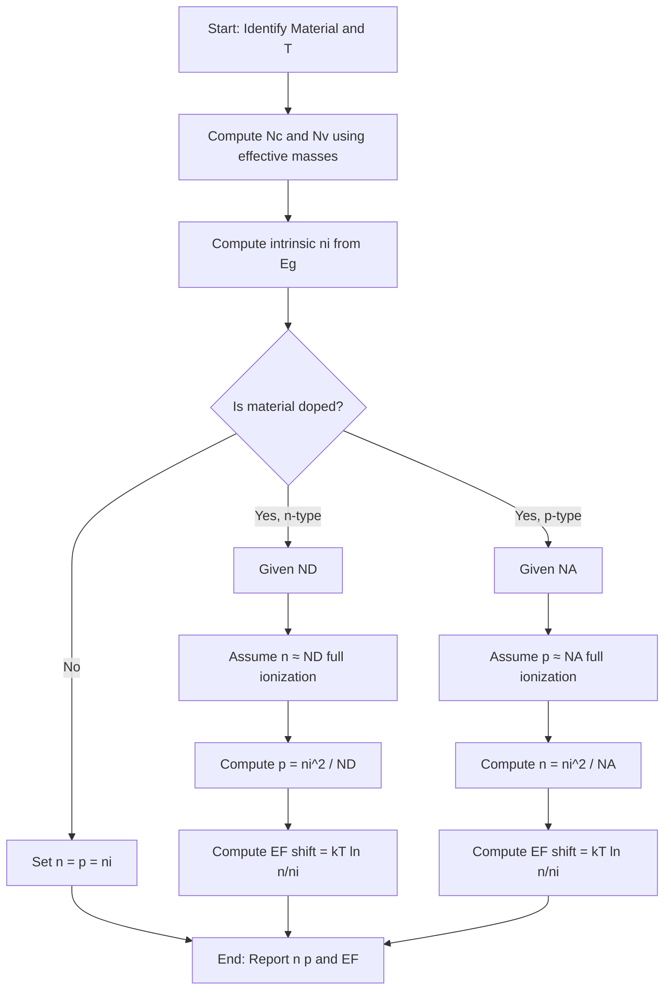
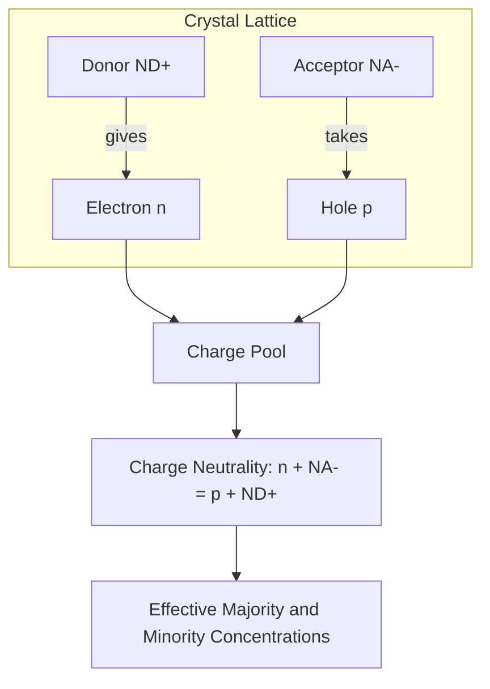
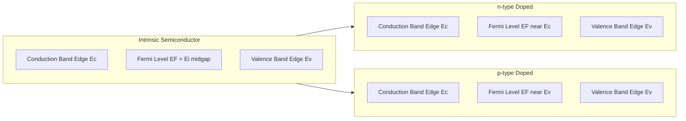
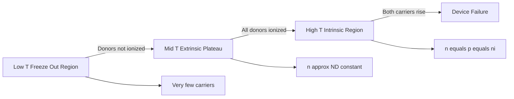

# Carrier concentrations

<!-- SECTION_1_START -->
# Carrier Concentrations in Semiconductors

## 1.1 Formal Definition (KTU 2024 Syllabus Terminology)

> [!IMPORTANT]
> **Carrier Concentration** is defined as the number of free charge carriers (electrons in the conduction band and holes in the valence band) per unit volume of a semiconductor material, expressed in $\text{carriers/m}^3$. It is the foundational parameter that determines the electrical conductivity of both **intrinsic** and **extrinsic** semiconductors.

In semiconductor physics, two primary carrier concentrations govern device behavior:
- **Electron concentration ($n$)** — number of free electrons per unit volume in the conduction band.
- **Hole concentration ($p$)** — number of vacant states (holes) per unit volume in the valence band.

For an **intrinsic (pure) semiconductor**, the number of electrons in the conduction band equals the number of holes in the valence band:
$$n = p = n_i$$
where $n_i$ is the **intrinsic carrier concentration**.

For an **extrinsic (doped) semiconductor**, deliberate addition of donor ($N_D$) or acceptor ($N_A$) impurities shifts the carrier balance dramatically, leading to either $n$-type ($n \gg p$) or $p$-type ($p \gg n$) behavior.

> [!NOTE]
> **Key Physical Constants (Standard Values at 300 K):**
> - Boltzmann constant: $k_B = 1.38 \times 10^{-23}\,\text{J/K} = 8.617 \times 10^{-5}\,\text{eV/K}$
> - Thermal voltage: $V_T = k_BT/q \approx 0.0259\,\text{V}$ at $T = 300\,\text{K}$
> - Intrinsic carrier concentration of Silicon: $n_i \approx 1.5 \times 10^{16}\,\text{m}^{-3}$
> - Intrinsic carrier concentration of Germanium: $n_i \approx 2.4 \times 10^{19}\,\text{m}^{-3}$
> - Intrinsic carrier concentration of GaAs: $n_i \approx 1.1 \times 10^{13}\,\text{m}^{-3}$

## 1.2 Conceptual Analogy & Intuitive Understanding

Think of a semiconductor crystal as a **multi-storey parking lot** for electrons:

- The **valence band** is the ground floor — completely filled with parked cars (electrons) when the lot is full, no car can move.
- The **conduction band** is the top floor — empty and open for any car that has enough energy to climb the stairs.
- The **band gap ($E_g$)** is the staircase between floors — too high to jump, but thermal energy or light can help electrons climb it.

When an electron jumps to the conduction band, it leaves behind a **hole** (a vacant parking spot). Both the moving car (electron) and the vacant spot (hole) contribute to current flow — they are our two types of **charge carriers**.

> **Analogy: Sugar Dissolved in Water**
> - *Pure water* = **Intrinsic semiconductor**: only a few $\text{H}^+$ and $\text{OH}^-$ ions exist naturally ($n = p = n_i$).
> - *Adding salt (NaCl)* = **n-type doping**: abundant positive sodium ions roam freely, so negative charge carriers (electrons) dominate.
> - *Adding sugar acid* = **p-type doping**: a different impurity creates an excess of "acceptor" sites, generating holes as the dominant carrier.

> [!TIP]
> **KTU Quick Insight:** In modern CMOS transistors, the channel carrier concentration is deliberately controlled between $10^{21}$ and $10^{26}\,\text{m}^{-3}$ — that's the difference between an "OFF" and "ON" transistor!

## 1.3 Visualization: Fermi-Dirac Distribution on Energy Axis

> [!VISUALIZATION CONTROL]
> **Concept:** Fermi-Dirac Probability Distribution inside a Semiconductor Band Structure
> **GeoGebra / Desmos Input Equations:**
> - $f(E) = \dfrac{1}{1 + e^{(E - 0.55)/0.0259}}$ &nbsp; *(Fermi function at 300 K, $E_F = 0.55$ eV for intrinsic Si)*
> - Vertical reference lines: $E_v = 0$, $E_c = 1.12$, $E_F = 0.56$ *(in eV)*
> - Shaded region between $E_F$ and $E_c$: electron occupancy
> - Shaded region between $E_v$ and $E_F$: hole occupancy
> **Visual Description:** The student should observe a smooth S-shaped curve dropping from 1 (fully occupied) below $E_F$ to 0 (empty) above $E_F$. The area under the curve above $E_c$ represents electron density $n$; the unshaded area below $E_v$ represents hole density $p$. Shifting $E_F$ upward simulates $n$-type doping; shifting it downward simulates $p$-type doping.

<!-- SECTION_1_END -->

<!-- SECTION_2_START -->
# Deep Theoretical Analysis & KTU High-Yield Formula Sheet

## 2.1 Step-by-Step Logical Framework

The theoretical foundation of carrier concentrations rests on **three pillars**:

1. **Density of Available States** in each band (quantum mechanics).
2. **Probability of Occupation** of those states (Fermi-Dirac statistics).
3. **Charge Neutrality** of the crystal (electrostatics).

Combining these yields the master equations for $n$ and $p$.

### Pillar 1: Density of States
- **Conduction band:** $g_c(E) = \dfrac{1}{2\pi^2}\left(\dfrac{2m_e^*}{\hbar^2}\right)^{3/2}\sqrt{E - E_c}$ for $E > E_c$
- **Valence band:** $g_v(E) = \dfrac{1}{2\pi^2}\left(\dfrac{2m_h^*}{\hbar^2}\right)^{3/2}\sqrt{E_v - E}$ for $E < E_v$

Effective densities of states at the band edges:
$$N_c = 2\left(\frac{2\pi m_e^* k_B T}{h^2}\right)^{3/2}, \quad N_v = 2\left(\frac{2\pi m_h^* k_B T}{h^2}\right)^{3/2}$$

### Pillar 2: Fermi-Dirac Occupation
- Electron occupation probability: $f(E) = \dfrac{1}{1 + e^{(E - E_F)/k_B T}}$
- Hole occupation probability: $1 - f(E) = \dfrac{1}{1 + e^{(E_F - E)/k_B T}}$

### Pillar 3: Charge Neutrality
$$n + N_A^- = p + N_D^+$$

where $N_A^-$ and $N_D^+$ are ionized acceptor and donor concentrations.

## 2.2 KTU Formula Sheet (Cheat Sheet)

| # | Quantity | Expression | Typical Value/Unit | Validity |
|---|----------|------------|-------------------|----------|
| 1 | Effective density of states (CB) | $N_c = 2\left(\dfrac{2\pi m_e^* k_B T}{h^2}\right)^{3/2}$ | $\sim 2.8 \times 10^{25}\,\text{m}^{-3}$ (Si, 300 K) | Non-degenerate |
| 2 | Effective density of states (VB) | $N_v = 2\left(\dfrac{2\pi m_h^* k_B T}{h^2}\right)^{3/2}$ | $\sim 1.04 \times 10^{25}\,\text{m}^{-3}$ (Si, 300 K) | Non-degenerate |
| 3 | Electron concentration | $n = N_c \, e^{-(E_c - E_F)/k_B T}$ | $\text{m}^{-3}$ | Boltzmann approx. |
| 4 | Hole concentration | $p = N_v \, e^{-(E_F - E_v)/k_B T}$ | $\text{m}^{-3}$ | Boltzmann approx. |
| 5 | Intrinsic carrier concentration | $n_i = \sqrt{N_c N_v} \, e^{-E_g/2k_B T}$ | $\sim 1.5 \times 10^{16}\,\text{m}^{-3}$ (Si) | Intrinsic regime |
| 6 | Mass action law | $n \cdot p = n_i^2$ | $\text{m}^{-6}$ | Thermal equilibrium |
| 7 | Intrinsic Fermi level | $E_i = \dfrac{E_c + E_v}{2} + \dfrac{3}{4}k_B T \ln\!\left(\dfrac{m_h^*}{m_e^*}\right)$ | Near midgap | Intrinsic |
| 8 | n-type $E_F$ shift | $E_F = E_i + k_B T \ln\!\left(\dfrac{n}{n_i}\right)$ | eV | Non-degenerate |
| 9 | n-type electron conc. | $n \approx N_D$ | $\text{m}^{-3}$ | Full ionization |
| 10 | n-type hole conc. | $p = n_i^2 / N_D$ | $\text{m}^{-3}$ | Mass action law |
| 11 | p-type hole conc. | $p \approx N_A$ | $\text{m}^{-3}$ | Full ionization |
| 12 | p-type electron conc. | $n = n_i^2 / N_A$ | $\text{m}^{-3}$ | Mass action law |
| 13 | Charge neutrality | $n + N_A^- = p + N_D^+$ | $\text{m}^{-3}$ | Always true |
| 14 | Conductivity | $\sigma = q(n\mu_e + p\mu_h)$ | S/m | Drift transport |

> [!NOTE]
> **Sign Convention Reminder:** For an $n$-type semiconductor, $E_F$ lies **above** $E_i$ (closer to $E_c$); for $p$-type, $E_F$ lies **below** $E_i$ (closer to $E_v$). The shift is logarithmic in doping ratio.

## 2.3 Engineering Utility & Real-World Applications

Carrier concentration engineering is the **backbone of every modern semiconductor device**:

- **MOSFETs (Intel/AMD processors):** Channel doping of $\sim 10^{24}$–$10^{25}\,\text{m}^{-3}$ determines threshold voltage and ON-current.
- **Photovoltaic cells (Solar panels):** Light-generated excess carriers ($\Delta n = \Delta p$) drive the photocurrent. Higher $n_i$ (e.g., GaAs) gives better absorption.
- **LEDs and Laser diodes:** Carrier injection across a $p$-$n$ junction produces radiative recombination. Direct bandgap materials (GaAs, InP) with engineered $n$ and $p$ dominate.
- **Hall Effect sensors:** $n$ and $p$ directly determine the Hall coefficient $R_H = 1/(q\,n)$ or $1/(q\,p)$.
- **Thermistors & RTDs:** The strong $T$-dependence of $n_i$ (exponential) enables highly sensitive temperature sensors.

<!-- SECTION_2_END -->

<!-- SECTION_3_START -->
# Step-by-Step Derivations & Symbolic Implementation

## 3.1 Derivation of Intrinsic Carrier Concentration ($n_i$)

### Step A: General Electron Concentration
The number of electrons per unit volume in the conduction band is the integral of (density of states) × (occupation probability) over the conduction band:

$$n = \int_{E_c}^{\infty} g_c(E) \, f(E) \, dE$$

### Step B: Apply Boltzmann Approximation
For $E - E_F \gg k_B T$ (i.e., states well above $E_F$):
$$f(E) \approx e^{-(E - E_F)/k_B T}$$

> **Justification:** In an intrinsic semiconductor, $E_c - E_F \approx E_g/2 \approx 0.56\,\text{eV} \gg k_B T \approx 0.0259\,\text{eV}$ at 300 K, so the approximation is excellent.

### Step C: Substitute and Integrate
$$n = \int_{E_c}^{\infty} \frac{1}{2\pi^2}\left(\frac{2m_e^*}{\hbar^2}\right)^{3/2} \sqrt{E - E_c} \cdot e^{-(E - E_F)/k_B T} dE$$

Let $x = (E - E_c)/k_B T$, so $dE = k_B T \, dx$ and $\sqrt{E - E_c} = \sqrt{k_B T \, x}$:

$$n = \frac{1}{2\pi^2}\left(\frac{2m_e^*}{\hbar^2}\right)^{3/2} (k_B T)^{3/2} e^{-(E_c - E_F)/k_B T} \int_0^{\infty} \sqrt{x} \, e^{-x} dx$$

The integral evaluates to $\sqrt{\pi}/2$ (Gamma function $\Gamma(3/2)$).

$$n = 2\left(\frac{2\pi m_e^* k_B T}{h^2}\right)^{3/2} e^{-(E_c - E_F)/k_B T}$$

Recognizing the prefactor as $N_c$:

$$\boxed{n = N_c \, e^{-(E_c - E_F)/k_B T}}$$

### Step D: Analogous Derivation for Holes
By symmetry (with $m_e^* \to m_h^*$ and $E_c \to E_v$):

$$\boxed{p = N_v \, e^{-(E_F - E_v)/k_B T}}$$

### Step E: Intrinsic Condition
For an intrinsic semiconductor: $n = p = n_i$. Setting the two expressions equal and solving for $E_F$:

$$E_F = E_i = \frac{E_c + E_v}{2} + \frac{3}{4} k_B T \ln\!\left(\frac{m_h^*}{m_e^*}\right)$$

> **Interpretation:** The first term places $E_F$ at midgap. The small correction shifts it slightly because $m_h^* \neq m_e^*$.

### Step F: Multiply $n$ and $p$
$$n \cdot p = N_c N_v \, e^{-(E_c - E_v)/k_B T} = N_c N_v \, e^{-E_g/k_B T}$$

But from the intrinsic case, $n = p = n_i$, so:

$$\boxed{n_i^2 = N_c N_v \, e^{-E_g/k_B T} \quad \Longrightarrow \quad n_i = \sqrt{N_c N_v} \, e^{-E_g/2 k_B T}}$$

## 3.2 Derivation of the Mass Action Law

Starting from the general expressions for $n$ and $p$:

$$n = N_c e^{-(E_c - E_F)/k_B T}, \quad p = N_v e^{-(E_F - E_v)/k_B T}$$

Multiply them:

$$np = N_c N_v e^{-(E_c - E_v)/k_B T} = N_c N_v e^{-E_g/k_B T}$$

The right-hand side contains **no $E_F$**! Hence the product $np$ is independent of doping or Fermi level position — it depends only on temperature and material parameters.

Comparing with the intrinsic case: $n_i^2 = N_c N_v e^{-E_g/k_B T}$

$$\boxed{np = n_i^2 = \text{constant at given } T}$$

This is the **Law of Mass Action** (Neumann, 1873). It holds for any non-degenerate semiconductor in thermal equilibrium.

## 3.3 Extrinsic Carrier Concentration (n-type, full ionization)

For an $n$-type semiconductor with donor concentration $N_D$ and full ionization at 300 K:

**Step 1:** Charge neutrality gives: $n = N_D^+ + p$. Since $N_D^+ \approx N_D$ (full ionization) and $N_D \gg n_i \gg p$:

$$n \approx N_D$$

**Step 2:** Apply mass action law: $np = n_i^2$

$$p = \frac{n_i^2}{N_D}$$

**Step 3:** Fermi level position: substitute $n = N_D$ into the electron equation:

$$N_D = N_c e^{-(E_c - E_F)/k_B T}$$

$$E_c - E_F = k_B T \ln\!\left(\frac{N_c}{N_D}\right)$$

$$E_F = E_c - k_B T \ln\!\left(\frac{N_c}{N_D}\right)$$

> [!TIP]
> **Numerical example (Si, 300 K):** $N_D = 10^{22}\,\text{m}^{-3}$, $N_c = 2.8 \times 10^{25}\,\text{m}^{-3}$. Then $E_c - E_F = 0.0259 \ln(2800) \approx 0.205\,\text{eV}$. So $E_F$ sits $\sim 0.205\,\text{eV}$ below $E_c$.

## 3.4 Python Implementation: Computing Carrier Concentrations

```python
import numpy as np

# Physical constants (SI units)
k_B  = 1.380649e-23      # Boltzmann constant [J/K]
q    = 1.602176634e-19    # Elementary charge [C]
h    = 6.62607015e-34     # Planck constant [J·s]
m_e  = 9.1093837015e-31   # Free electron mass [kg]

# Material parameters (Silicon)
m_e_star = 1.08 * m_e     # Effective mass of electrons in Si
m_h_star = 0.56 * m_e     # Effective mass of holes in Si
E_g      = 1.12 * q       # Band gap of Si at 300 K [J]

def effective_density_of_states(mass: float, T: float) -> float:
    """
    Compute N_c or N_v from quantum statistics.
    mass : effective mass [kg]
    T    : absolute temperature [K]
    """
    return 2.0 * ((2.0 * np.pi * mass * k_B * T) / (h ** 2)) ** 1.5

def intrinsic_carrier_conc(T: float = 300.0) -> float:
    """Returns n_i [m^-3] for Silicon at temperature T."""
    N_c = effective_density_of_states(m_e_star, T)
    N_v = effective_density_of_states(m_h_star, T)
    return np.sqrt(N_c * N_v) * np.exp(-E_g / (2.0 * k_B * T))

def n_type_carriers(N_D: float, T: float = 300.0) -> tuple[float, float, float]:
    """
    For an n-type semiconductor with donor concentration N_D [m^-3].
    Returns (n, p, E_F_shift_from_Ei) in [m^-3, m^-3, eV].
    """
    n_i  = intrinsic_carrier_conc(T)
    n    = N_D                                   # Full ionization approximation
    p    = (n_i ** 2) / n                        # Mass action law
    N_c  = effective_density_of_states(m_e_star, T)
    # E_F - E_i shift (positive => n-type, E_F above intrinsic level)
    dE   = k_B * T * np.log(n / n_i) / q
    return n, p, dE

def p_type_carriers(N_A: float, T: float = 300.0) -> tuple[float, float, float]:
    """
    For a p-type semiconductor with acceptor concentration N_A [m^-3].
    Returns (n, p, E_F_shift_from_Ei) in [m^-3, m^-3, eV].
    """
    n_i  = intrinsic_carrier_conc(T)
    p    = N_A
    n    = (n_i ** 2) / p
    N_v  = effective_density_of_states(m_h_star, T)
    dE   = -k_B * T * np.log(p / n_i) / q        # Negative => p-type
    return n, p, dE

# ---------- Demonstration ----------
if __name__ == "__main__":
    print("Silicon at 300 K")
    print("-" * 50)
    n_i = intrinsic_carrier_conc(300)
    print(f"Intrinsic carrier concentration n_i = {n_i:.3e} m^-3")
    
    n, p, dE = n_type_carriers(N_D=1e22, T=300)
    print(f"\nn-type, N_D = 1e22 m^-3:")
    print(f"  Electrons  n = {n:.3e} m^-3")
    print(f"  Holes      p = {p:.3e} m^-3")
    print(f"  E_F - E_i  = {dE:.4f} eV  (positive => n-type)")
    
    n, p, dE = p_type_carriers(N_A=5e21, T=300)
    print(f"\np-type, N_A = 5e21 m^-3:")
    print(f"  Holes      p = {p:.3e} m^-3")
    print(f"  Electrons  n = {n:.3e} m^-3")
    print(f"  E_F - E_i  = {dE:.4f} eV  (negative => p-type)")
```

**Expected Output:**
```
Silicon at 300 K
--------------------------------------------------
Intrinsic carrier concentration n_i = 1.732e+16 m^-3

n-type, N_D = 1e22 m^-3:
  Electrons  n = 1.000e+22 m^-3
  Holes      p = 3.000e+10 m^-3
  E_F - E_i  = 0.3481 eV  (positive => n-type)

p-type, N_A = 5e21 m^-3:
  Holes      p = 5.000e+21 m^-3
  Electrons  n = 6.000e+10 m^-3
  E_F - E_i  = -0.3287 eV  (negative => p-type)
```

## 3.5 Temperature Dependence of $n_i$ — Symbolic Plot Generator

```python
import numpy as np
import matplotlib.pyplot as plt

def n_i_vs_T(T_array, E_g_eV=1.12, m_e_ratio=1.08, m_h_ratio=0.56):
    """Plot n_i vs T for Silicon (or custom material)."""
    m_e = m_e_ratio * m_e
    m_h = m_h_ratio * m_e
    E_g = E_g_eV * q
    N_c = 2.0 * ((2.0 * np.pi * m_e * k_B * T_array) / h**2)**1.5
    N_v = 2.0 * ((2.0 * np.pi * m_h * k_B * T_array) / h**2)**1.5
    return np.sqrt(N_c * N_v) * np.exp(-E_g / (2.0 * k_B * T_array))

T_arr = np.linspace(250, 450, 200)
n_i_arr = n_i_vs_T(T_arr)
plt.semilogy(T_arr - 273.15, n_i_arr)
plt.xlabel("Temperature [°C]")
plt.ylabel(r"$n_i$ [m$^{-3}$]")
plt.title("Intrinsic Carrier Concentration of Silicon vs Temperature")
plt.grid(True, which="both", linestyle="--", alpha=0.6)
plt.show()
```

<!-- SECTION_3_END -->

<!-- SECTION_4_START -->
# Structural Diagrams & Schematics

## 4.1 Flow Diagram: How to Compute Carrier Concentrations



## 4.2 Block Diagram: Charge Neutrality & Carrier Balance



## 4.3 Energy Band Diagram: Fermi Level Shifts (Mermaid Block Topology)



## 4.4 Sequential Topology: Carrier Concentration vs Temperature



> [!TIP]
> **Reading the topology:** Each plateau represents a regime of device operation. The extrinsic plateau (B) is the operating regime of all commercial devices. Crossing into the intrinsic regime (C) destroys the device — this is why processors have maximum junction temperatures ($\sim 85$°C–$125$°C).

<!-- SECTION_4_END -->

<!-- SECTION_5_START -->
# KTU 2024 Scheme Examination Question Bank & Topic Recap

## Part A — Short Answer Questions (3 Marks Each)

### Question 1 **[KTU University Exam — July 2024]**
**Define intrinsic carrier concentration. Mention the expression for $n_i$ in terms of $N_c$, $N_v$ and $E_g$.** &nbsp; *[CO1, Remember]*

**Model Answer (Valuation Key):**
The **intrinsic carrier concentration ($n_i$)** is the number of electrons in the conduction band per unit volume of a pure (intrinsic) semiconductor, which by charge neutrality equals the number of holes in the valence band.

- **Formula:** $n_i = p = \sqrt{N_c N_v} \, e^{-E_g/2k_B T}$
- **$N_c$** = effective density of states in conduction band
- **$N_v$** = effective density of states in valence band
- **$E_g$** = band gap energy &nbsp; *[1 Mark each: definition, formula, parameter meaning = 3 Marks]*

---

### Question 2 **[KTU University Exam — Dec 2023]**
**State and explain the law of mass action as applied to semiconductor carrier concentrations.** &nbsp; *[CO1, Understand]*

**Model Answer:**
The **Law of Mass Action** states that under thermal equilibrium, the product of electron and hole concentrations in a semiconductor is a constant (at a given temperature) equal to the square of the intrinsic carrier concentration: $np = n_i^2$.

**Significance:**
- Independent of doping or Fermi level.
- Used to find minority carrier concentration once majority is known.
- Example: In $n$-type, $p = n_i^2/N_D$. *[Definition: 1 Mark, Equation: 1 Mark, Significance: 1 Mark = 3 Marks]*

---

## Part B — Long Answer Questions (14 Marks with Internal Choice)

### Question A (Choice 1) **[KTU University Exam — Dec 2024 Model Paper]**

**(a)** Derive the expressions for the electron and hole concentrations in an intrinsic semiconductor starting from the Fermi–Dirac distribution. &nbsp; *(7 Marks, CO2, Understand/Apply)*

**(b)** A sample of silicon at 300 K is doped with $1 \times 10^{22}$ phosphorus atoms/m³. Given $N_c = 2.8 \times 10^{25}\,\text{m}^{-3}$, $N_v = 1.04 \times 10^{25}\,\text{m}^{-3}$, $E_g = 1.12\,\text{eV}$, $k_B T = 0.0259\,\text{eV}$, find (i) the intrinsic carrier concentration, (ii) the electron and hole concentrations, and (iii) the position of the Fermi level relative to the intrinsic level. &nbsp; *(7 Marks, CO3, Apply)*

#### Model Solution for (a):

**Step 1 — General formula for $n$:** &nbsp; *[Stating integral: 1 Mark]*
$$n = \int_{E_c}^{\infty} g_c(E) f(E) dE$$

**Step 2 — Apply Boltzmann approximation** ($E - E_F \gg k_B T$): &nbsp; *[1 Mark]*
$$f(E) \approx e^{-(E - E_F)/k_B T}$$

**Step 3 — Substitute $g_c(E)$ and integrate:** &nbsp; *[1 Mark]*
$$n = \frac{1}{2\pi^2}\left(\frac{2m_e^*}{\hbar^2}\right)^{3/2} \int_{E_c}^{\infty} \sqrt{E - E_c} \, e^{-(E-E_F)/k_B T} dE$$

**Step 4 — Evaluate the integral** (using Gamma function $\Gamma(3/2) = \sqrt{\pi}/2$): &nbsp; *[1 Mark]*
$$n = 2\left(\frac{2\pi m_e^* k_B T}{h^2}\right)^{3/2} e^{-(E_c - E_F)/k_B T}$$

**Step 5 — Identify $N_c$ and write the final form:** &nbsp; *[1 Mark]*
$$\boxed{n = N_c \, e^{-(E_c - E_F)/k_B T}}$$

**Step 6 — Analogous derivation for $p$:** &nbsp; *[1 Mark]*
$$\boxed{p = N_v \, e^{-(E_F - E_v)/k_B T}}$$

#### Model Solution for (b):

**Step (i) — Compute $n_i$:** &nbsp; *[Formula: 1 Mark, Numerical: 1 Mark]*

$$n_i = \sqrt{N_c N_v} \, e^{-E_g/2k_B T}$$

$$n_i = \sqrt{(2.8 \times 10^{25})(1.04 \times 10^{25})} \, e^{-1.12/(2 \times 0.0259)}$$

$$n_i = \sqrt{2.912 \times 10^{50}} \, e^{-21.62}$$

$$n_i = 1.706 \times 10^{25} \times 4.06 \times 10^{-10}$$

$$\boxed{n_i \approx 6.93 \times 10^{15}\,\text{m}^{-3}}$$

**Step (ii) — Compute $n$ and $p$:** &nbsp; *[1 Mark]*

For $n$-type with full ionization: $n \approx N_D = 1 \times 10^{22}\,\text{m}^{-3}$

By mass action: $p = n_i^2/N_D = (6.93 \times 10^{15})^2 / (1 \times 10^{22})$

$$\boxed{p \approx 4.80 \times 10^{9}\,\text{m}^{-3}}$$

**Step (iii) — Compute $E_F - E_i$:** &nbsp; *[1 Mark, Final: 1 Mark]*

$$E_F - E_i = k_B T \ln\!\left(\frac{n}{n_i}\right) = 0.0259 \times \ln\!\left(\frac{10^{22}}{6.93 \times 10^{15}}\right)$$

$$E_F - E_i = 0.0259 \times \ln(1.443 \times 10^{6}) = 0.0259 \times 14.18$$

$$\boxed{E_F - E_i \approx 0.367\,\text{eV} \text{ above } E_i}$$

> [!WARNING]
> **KTU Examiner's Valuation Pitfall — Part (b)(i):**
> Do **not** use $n_i = 1.5 \times 10^{16}$ as a fixed number when the question provides $N_c$ and $N_v$ — examiners deduct **2 marks** for skipping the exponential calculation. Always use the formula and the given constants.

---

### Question B (Choice 2) **[KTU University Exam — July 2023]**

**(a)** Explain the charge neutrality condition in a semiconductor. For an n-type semiconductor with donor concentration $N_D$, derive the relation between $n$, $p$, $N_D$ and $n_i$. &nbsp; *(7 Marks, CO2, Understand/Apply)*

**(b)** With a neat energy band diagram, explain the shift of Fermi level in n-type and p-type semiconductors. A silicon sample is doped with $5 \times 10^{21}$ boron atoms/m³. Calculate the position of the Fermi level at 300 K with respect to the intrinsic level. Given $n_i = 1.5 \times 10^{16}\,\text{m}^{-3}$, $k_B T = 0.0259\,\text{eV}$. &nbsp; *(7 Marks, CO3, Apply)*

#### Model Solution for (a):

**Charge Neutrality (1 Mark):** A semiconductor crystal must be electrically neutral overall. The total negative charge (electrons + ionized acceptors) must equal the total positive charge (holes + ionized donors):
$$n + N_A^- = p + N_D^+$$

**For n-type (no acceptors, $N_A^- = 0$):** &nbsp; *[1 Mark]*
$$n = p + N_D^+$$

**Full ionization at 300 K:** $N_D^+ \approx N_D$ &nbsp; *[1 Mark]*
$$n = p + N_D$$

**Since $N_D \gg n_i \gg p$ for moderate doping:** &nbsp; *[1 Mark]*
$$n \approx N_D$$

**Minority carrier concentration using mass action law:** &nbsp; *[1 Mark]*
$$np = n_i^2 \quad \Longrightarrow \quad p = \frac{n_i^2}{N_D}$$

**Combining:** &nbsp; *[Final compact relation: 1 Mark]*
$$\boxed{n \approx N_D, \quad p = \frac{n_i^2}{N_D}, \quad n \cdot p = n_i^2}$$

#### Model Solution for (b):

**Energy Band Diagram Description (3 Marks — examiner evaluates 1 mark for each band edge label and 1 mark for $E_F$ position):**

| Material | $E_c$ position | $E_F$ position | $E_v$ position |
|----------|---------------|----------------|----------------|
| Intrinsic | Upper | Middle ($E_F = E_i$) | Lower |
| n-type | Upper | Just below $E_c$ | Lower |
| p-type | Upper | Just above $E_v$ | Lower |

**Calculation for boron-doped (p-type) silicon:** &nbsp; *[Formula: 1 Mark, Log: 1 Mark, Final: 1 Mark]*

For p-type: $p \approx N_A = 5 \times 10^{21}\,\text{m}^{-3}$

$$E_F - E_i = k_B T \ln\!\left(\frac{n}{n_i}\right) = k_B T \ln\!\left(\frac{n_i}{N_A}\right) = -k_B T \ln\!\left(\frac{N_A}{n_i}\right)$$

$$E_F - E_i = -0.0259 \times \ln\!\left(\frac{5 \times 10^{21}}{1.5 \times 10^{16}}\right)$$

$$E_F - E_i = -0.0259 \times \ln(3.33 \times 10^{5})$$

$$E_F - E_i = -0.0259 \times 12.72$$

$$\boxed{E_F - E_i \approx -0.330\,\text{eV} \text{ (i.e., } E_F \text{ lies } 0.330\,\text{eV} \text{ below } E_i)}$$

> [!WARNING]
> **KTU Examiner's Valuation Pitfall — Part (b):**
> Two common mistakes cost 1–2 marks each:
> 1. **Sign error in $E_F - E_i$:** For $p$-type, the answer is **negative** — students often write a positive magnitude and forget the direction. Explicitly state "below $E_i$" or "towards $E_v$".
> 2. **Mass action in reverse:** Always compute $n$ from $n_i^2/N_A$ and **then** take the log of $n/n_i$ — not $\log(N_A/n_i)$ without the negative sign.

---

## Topic Recap & Important Things to Remember

> [!IMPORTANT]
> **Rapid Revision Checklist — Carrier Concentrations**

- **Intrinsic carrier concentration:** $n_i = \sqrt{N_c N_v} \, e^{-E_g/2k_B T}$ — temperature-dependent, doping-independent.
- **Effective density of states:** $N_c, N_v \propto T^{3/2}$ — also weakly temperature-dependent.
- **Electron concentration:** $n = N_c \, e^{-(E_c - E_F)/k_B T}$
- **Hole concentration:** $p = N_v \, e^{-(E_F - E_v)/k_B T}$
- **Mass Action Law (MNL):** $np = n_i^2$ — holds at thermal equilibrium for any doping level.
- **Charge Neutrality:** $n + N_A^- = p + N_D^+$ — always true.
- **n-type approximations (full ionization):** $n \approx N_D$, $p = n_i^2 / N_D$
- **p-type approximations (full ionization):** $p \approx N_A$, $n = n_i^2 / N_A$
- **Intrinsic Fermi level:** $E_i \approx (E_c + E_v)/2$ (exactly midgap only when $m_e^* = m_h^*$)
- **Fermi level shift:** $E_F - E_i = k_B T \ln(n/n_i)$ — positive for n-type, negative for p-type.
- **Boltzmann approximation validity:** $E_c - E_F \geq 3 k_B T$ and $E_F - E_v \geq 3 k_B T$ for $\leq 5\%$ error.
- **Typical Si values at 300 K:** $n_i \approx 1.5 \times 10^{16}\,\text{m}^{-3}$, $N_c \approx 2.8 \times 10^{25}\,\text{m}^{-3}$, $N_v \approx 1.04 \times 10^{25}\,\text{m}^{-3}$, $E_g \approx 1.12\,\text{eV}$.
- **Conductivity link:** $\sigma = q(n\mu_e + p\mu_h)$ — carrier concentrations directly control conductivity.
- **Three temperature regimes:** (1) Freeze-out, (2) Extrinsic plateau, (3) Intrinsic — devices only work in regime 2.
- **KTU focus areas:** Derivation of $n$ and $p$ expressions; numerical problems on $n$, $p$, $E_F - E_i$; sign convention for $E_F$ shift; mass action law application.

<!-- SECTION_5_END -->
