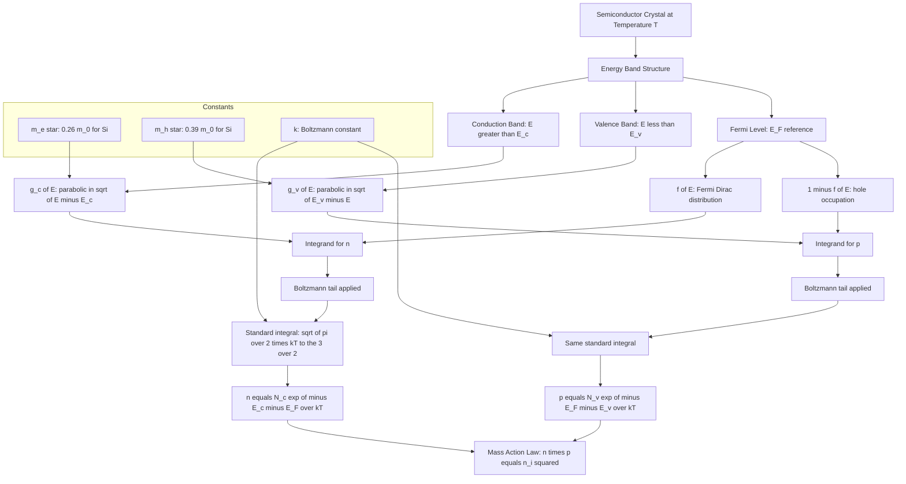
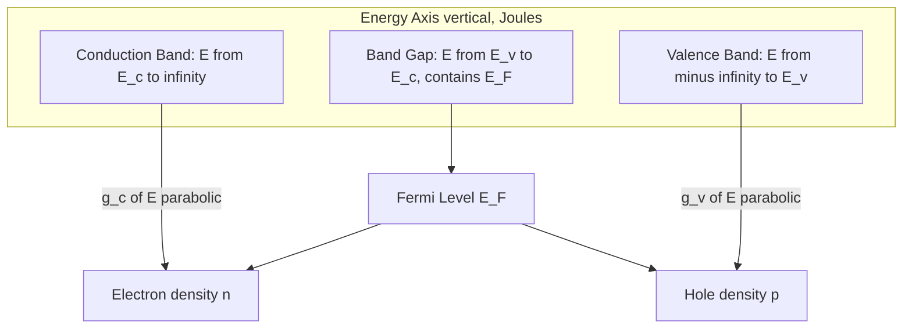

# Derivation of density of electrons in conduction band and density of holes in valence band

<!-- SECTION_1_START -->
# Module 3 — Semiconductor Physics
## Topic: Derivation of Density of Electrons in the Conduction Band ($n$) and Density of Holes in the Valence Band ($p$)

> [!NOTE]
> **KTU 2024 Syllabus Mapping (GAPHT121 — Physics for Information Science)**
> Module 3 of GAPHT121 mandates the quantitative treatment of carrier statistics in intrinsic and extrinsic semiconductors. This topic is the mathematical foundation for the **pn-junction diode, BJT, MOSFET, LED, and solar cell** — every solid-state device studied later in this course (and in EST130/PCC-ECT204) is built on the two equations derived here.

---

### 1.1 Formal Academic Definition

In a crystalline semiconductor, the **conduction band** (above the conduction band edge $E_c$) is almost empty at room temperature, while the **valence band** (below the valence band edge $E_v$) is almost full. The number of free electrons per unit volume in the conduction band is called the **electron concentration**, denoted $n$. The number of vacant electron states (holes) per unit volume in the valence band is called the **hole concentration**, denoted $p$.

Mathematically, both quantities are obtained by integrating the product of the **density of available energy states** and the **probability of occupation** of those states:

$$
n = \int_{E_c}^{\infty} g_c(E)\, f(E)\, dE \qquad \text{and} \qquad p = \int_{-\infty}^{E_v} g_v(E)\, \bigl[1 - f(E)\bigr]\, dE
$$

where:
- $g_c(E)$ and $g_v(E)$ are the **densities of states** in the conduction and valence bands respectively.
- $f(E) = \dfrac{1}{1 + \exp\!\bigl((E - E_F)/kT\bigr)}$ is the **Fermi–Dirac distribution function**, governed by the Fermi level $E_F$.
- $k = 1.380 \times 10^{-23}\ \text{J/K} = \mathbf{8.617 \times 10^{-5}\ eV/K}$ is the **Boltzmann constant**.

> [!IMPORTANT]
> **Fermi Level ($E_F$):** It is the energy level at which the probability of finding an electron is exactly $\mathbf{1/2}$. It is the electrochemical potential for electrons and acts as the **reference energy** for all carrier statistics calculations.

---

### 1.2 Intuitive Overview — The "Two-Story Parking Lot" Analogy

Imagine a tall parking garage (the semiconductor crystal):

- **Ground floor (Valence Band, $E < E_v$):** Almost completely full of cars (electrons). A car can only leave if a spot becomes free — the *empty spot* is the **hole**, which can move around as neighbouring cars shuffle into it.
- **First floor (Conduction Band, $E > E_c$):** Almost completely empty. Only a few cars have enough thermal energy to "climb the stairs" (band gap $E_g$) and park here. These few cars are the **free conduction electrons** that actually carry current.
- **The lobby floor (Fermi Level, $E_F$):** Marks the "decision level." Cars well above it are highly likely to be in the conduction band; empty spots well below it are highly likely to be holes in the valence band.

**Key insight:** Counting electrons in the conduction band is like counting the *few occupied spots upstairs*. Counting holes in the valence band is like counting the *few empty spots downstairs*. Both populations are tiny compared to the total number of quantum states — which is precisely why **Boltzmann's exponential approximation** (rather than full Fermi–Dirac) is sufficient for non-degenerate semiconductors.

---

### 1.3 Physical Constants and Standard Metrics (Bolded)

| Symbol | Quantity | Numerical Value (300 K) |
| :--- | :--- | :--- |
| $k$ | Boltzmann constant | $1.380 \times 10^{-23}\ \text{J/K} = \mathbf{8.617 \times 10^{-5}\ eV/K}$ |
| $h$ | Planck's constant | $\mathbf{6.626 \times 10^{-34}\ J\cdot s}$ |
| $\hbar$ | Reduced Planck's constant $h/2\pi$ | $\mathbf{1.0546 \times 10^{-34}\ J\cdot s}$ |
| $m_0$ | Free electron mass | $\mathbf{9.11 \times 10^{-31}\ kg}$ |
| $m_e^{*}$ | Effective mass of electron (Si) | $\mathbf{0.26\ m_0}$ (3 valleys avg.) |
| $m_h^{*}$ | Effective mass of hole (Si) | $\mathbf{0.39\ m_0}$ (density-of-states) |
| $N_c$(Si) | Effective DOS in CB (300 K) | $\mathbf{2.8 \times 10^{25}\ m^{-3}}$ |
| $N_v$(Si) | Effective DOS in VB (300 K) | $\mathbf{1.04 \times 10^{25}\ m^{-3}}$ |

> [!VISUALIZATION CONTROL]
> **Concept:** Fermi–Dirac occupation probability $f(E)$ vs. Energy for three temperatures.
> **Desmos Input Equations (paste into Desmos graphing calculator):**
> - $f_{1}(E) = 1 / (1 + \exp((E - 0.5)/0.0259))$
> - $f_{2}(E) = 1 / (1 + \exp((E - 0.5)/0.05))$
> - $f_{3}(E) = 1 / (1 + \exp((E - 0.5)/0.10))$
> **Visual Description:** A step-like sigmoid centered at $E_F = 0.5\ eV$ (use eV on x-axis). Increasing $kT$ (from 0.0259 eV → 0.05 eV → 0.10 eV) smears the step. As $E \to +\infty$, $f(E) \to 0$ (this is the **Boltzmann tail** used to derive the carrier densities).

<!-- SECTION_1_END -->

<!-- SECTION_2_START -->
## 2. Deep Theoretical Analysis & KTU High-Yield Formula Sheet

### 2.1 The Three Pillars of Carrier Statistics

To obtain $n$ and $p$, three physical inputs must be combined. Each is grounded in a fundamental result of quantum statistical mechanics.

**Pillar 1 — Density of Quantum States (3-D Free-Electron-Like Crystal).**
For a parabolic band with electron effective mass $m_e^{*}$, the number of available states per unit volume per unit energy in the conduction band (with energy $E$ measured upward from the band edge $E_c$) is:

$$
g_c(E) = \frac{1}{2\pi^{2}}\left(\frac{2 m_e^{*}}{\hbar^{2}}\right)^{3/2}\sqrt{E - E_c}\quad \text{for } E \geq E_c
$$

For the valence band (with $E$ measured downward from $E_v$):

$$
g_v(E) = \frac{1}{2\pi^{2}}\left(\frac{2 m_h^{*}}{\hbar^{2}}\right)^{3/2}\sqrt{E_v - E}\quad \text{for } E \leq E_v
$$

> [!NOTE]
> The factor $1/2\pi^{2}$ comes from the volume of a sphere in $k$-space times 2 (spin degeneracy). The square-root dependence on energy is the hallmark of 3-D parabolic bands.

**Pillar 2 — Fermi–Dirac Occupation Probability.**
A state of energy $E$ is occupied by an electron with probability:

$$
f(E) = \frac{1}{1 + \exp\!\bigl((E - E_F)/kT\bigr)}
$$

It is *unoccupied* (i.e., occupied by a hole) with probability:

$$
1 - f(E) = \frac{1}{1 + \exp\!\bigl((E_F - E)/kT\bigr)}
$$

**Pillar 3 — The Non-Degenerate (Boltzmann) Approximation.**
For a non-degenerate semiconductor (the everyday case, $E_c - E_F \gg kT$ and $E_F - E_v \gg kT$), the exponential in the denominator of $f(E)$ is very large for $E > E_c$, so:

$$
f(E) \approx \exp\!\left(-\frac{E - E_F}{kT}\right)
$$

This is the **Maxwell–Boltzmann tail** of the Fermi function. It is what converts a complicated quantum integral into a clean, analytically solvable one.

---

### 2.2 KTU Formula Sheet / Cheat Sheet (Board-Exam Ready)

| Quantity | Expression | Conditions / Units |
| :--- | :--- | :--- |
| Electron density in CB | $n = N_c \,\exp\!\left(-\dfrac{E_c - E_F}{kT}\right)$ | $\text{m}^{-3}$, valid when $E_c - E_F \gg kT$ |
| Hole density in VB | $p = N_v \,\exp\!\left(-\dfrac{E_F - E_v}{kT}\right)$ | $\text{m}^{-3}$, valid when $E_F - E_v \gg kT$ |
| Effective DOS in CB | $N_c = 2\left(\dfrac{2\pi m_e^{*} kT}{h^{2}}\right)^{3/2}$ | $\text{m}^{-3}$, depends on $T^{3/2}$ |
| Effective DOS in VB | $N_v = 2\left(\dfrac{2\pi m_h^{*} kT}{h^{2}}\right)^{3/2}$ | $\text{m}^{-3}$, depends on $T^{3/2}$ |
| Fermi–Dirac function | $f(E) = \dfrac{1}{1+\exp((E-E_F)/kT)}$ | Dimensionless, range $[0,1]$ |
| Boltzmann tail | $f(E) \approx \exp(-(E-E_F)/kT)$ | For $E \geq E_c + 3kT$ |
| Intrinsic carrier conc. | $n_i = \sqrt{N_c N_v}\,\exp(-E_g/2kT)$ | $\text{m}^{-3}$, $E_g = E_c - E_v$ |
| Mass-action law | $n \cdot p = n_i^{2}$ | Holds at thermal equilibrium |
| Fermi level position | $E_F = \dfrac{E_c + E_v}{2} + \dfrac{3kT}{4}\ln\!\left(\dfrac{m_h^{*}}{m_e^{*}}\right)$ | For intrinsic semiconductor |
| Conduction band DOS | $g_c(E) = \dfrac{1}{2\pi^{2}}\!\left(\dfrac{2m_e^{*}}{\hbar^{2}}\right)^{3/2}\!\sqrt{E-E_c}$ | States per $\text{m}^{3}$ per J |
| Standard integral | $\int_{0}^{\infty} \sqrt{x}\,e^{-x/a}\,dx = \dfrac{\sqrt{\pi}}{2}\,a^{3/2}$ | Used in both derivations |

> [!IMPORTANT]
> **Memory Hook for Board Exam:** "$n$ lives with the electrons in the CB and depends on how far the **CB edge** is **above** $E_F$." "$p$ lives with the holes in the VB and depends on how far the **VB edge** is **below** $E_F$." Both are exponential decays from the respective band edges, scaled by the effective DOS.

---

### 2.3 Real-World Engineering Utility

These two expressions are arguably the **most-used equations in all of semiconductor device physics**:

- **pn-junction diodes (EST130):** The built-in potential $V_{bi} = (kT/q)\ln(N_D N_A / n_i^{2})$ depends directly on $n_i$, which is built from $N_c$ and $N_v$.
- **MOSFETs (ECT204):** Threshold voltage and sub-threshold swing calculations require precise values of $n$ and $p$ in the channel.
- **Solar cells / Photodiodes:** Photogenerated carrier densities are added to the equilibrium $n$ and $p$ derived here.
- **Light-Emitting Diodes (LEDs):** Radiative recombination rate is proportional to $n \cdot p$, anchored by the mass-action law $np = n_i^{2}$.
- **Bipolar Junction Transistors (BJTs):** Emitter injection efficiency is set by the ratio of majority to minority carrier densities.

> [!TIP]
> In a production IC fabrication line (Intel, TSMC, Samsung), process engineers measure $n$ and $p$ via Hall-effect experiments and use the formulas above to *back-calculate* the position of $E_F$ — a direct monitor of doping quality.

<!-- SECTION_2_END -->

<!-- SECTION_3_START -->
## 3. Step-by-Step Derivations (Exhaustive, No Steps Skipped)

### 3.1 Derivation 1 — Electron Density in the Conduction Band ($n$)

**Step 1 — Write the fundamental definition.**
The number of electrons per unit volume in the conduction band is the integral of (number of available states) $\times$ (probability of occupation):

$$
n = \int_{E_c}^{\infty} g_c(E)\, f(E)\, dE
$$

**Step 2 — Substitute the parabolic density of states $g_c(E)$:**

$$
n = \int_{E_c}^{\infty} \left[\frac{1}{2\pi^{2}}\left(\frac{2 m_e^{*}}{\hbar^{2}}\right)^{3/2}\sqrt{E - E_c}\right] f(E)\, dE
$$

**Step 3 — Apply the Boltzmann approximation** (valid because for $E \geq E_c$, we have $E - E_F \gg kT$):

$$
f(E) \approx \exp\!\left(-\frac{E - E_F}{kT}\right)
$$

Substitute:

$$
n = \frac{1}{2\pi^{2}}\left(\frac{2 m_e^{*}}{\hbar^{2}}\right)^{3/2} \int_{E_c}^{\infty} \sqrt{E - E_c}\; \exp\!\left(-\frac{E - E_F}{kT}\right) dE
$$

**Step 4 — Pull out the energy-independent exponential factor.**
Since $E_F$ does not depend on $E$, factor out $\exp(E_F/kT)$:

$$
n = \frac{1}{2\pi^{2}}\left(\frac{2 m_e^{*}}{\hbar^{2}}\right)^{3/2} \exp\!\left(\frac{E_F}{kT}\right) \int_{E_c}^{\infty} \sqrt{E - E_c}\; \exp\!\left(-\frac{E}{kT}\right) dE
$$

**Step 5 — Change of variable to isolate the band edge.**
Let $x = E - E_c \quad \Rightarrow \quad E = x + E_c, \quad dE = dx$.
When $E = E_c$, $x = 0$. When $E \to \infty$, $x \to \infty$.

$$
n = \frac{1}{2\pi^{2}}\left(\frac{2 m_e^{*}}{\hbar^{2}}\right)^{3/2} \exp\!\left(\frac{E_F}{kT}\right) \int_{0}^{\infty} \sqrt{x}\; \exp\!\left(-\frac{x + E_c}{kT}\right) dx
$$

**Step 6 — Separate the integral from the constants.**

$$
n = \frac{1}{2\pi^{2}}\left(\frac{2 m_e^{*}}{\hbar^{2}}\right)^{3/2} \exp\!\left(\frac{E_F - E_c}{kT}\right) \int_{0}^{\infty} \sqrt{x}\; \exp\!\left(-\frac{x}{kT}\right) dx
$$

> *Logic:* $\exp(-(x+E_c)/kT) = \exp(-E_c/kT) \cdot \exp(-x/kT)$. The first piece is a constant (no $x$ dependence) and has been pulled out of the integral.

**Step 7 — Evaluate the standard integral.**
Using the gamma-function identity $\int_{0}^{\infty} x^{1/2} e^{-x/a} dx = \dfrac{\sqrt{\pi}}{2}\, a^{3/2}$, with $a = kT$:

$$
\int_{0}^{\infty} \sqrt{x}\; \exp\!\left(-\frac{x}{kT}\right) dx = \frac{\sqrt{\pi}}{2}\,(kT)^{3/2}
$$

**Step 8 — Substitute back.**

$$
n = \frac{1}{2\pi^{2}}\left(\frac{2 m_e^{*}}{\hbar^{2}}\right)^{3/2} \cdot \frac{\sqrt{\pi}}{2}\,(kT)^{3/2} \cdot \exp\!\left(\frac{E_F - E_c}{kT}\right)
$$

**Step 9 — Simplify the prefactor using $h = 2\pi\hbar$.**
We have $\hbar = h/2\pi$, so $\hbar^{2} = h^{2}/4\pi^{2}$, and therefore:

$$
\left(\frac{2 m_e^{*}}{\hbar^{2}}\right)^{3/2} = \left(\frac{2 m_e^{*} \cdot 4\pi^{2}}{h^{2}}\right)^{3/2} = \left(\frac{8\pi^{2} m_e^{*}}{h^{2}}\right)^{3/2} = \frac{(8\pi^{2})^{3/2}\,(m_e^{*})^{3/2}}{h^{3}} = \frac{2^{9/2}\,\pi^{3}\,(m_e^{*})^{3/2}}{h^{3}}
$$

Therefore:

$$
\frac{1}{2\pi^{2}}\cdot\frac{1}{2}\cdot\left(\frac{2 m_e^{*}}{\hbar^{2}}\right)^{3/2} = \frac{1}{4\pi^{2}}\cdot\frac{2^{9/2}\,\pi^{3}\,(m_e^{*})^{3/2}}{h^{3}} = \frac{2^{9/2}\,\pi\,(m_e^{*})^{3/2}}{4\,h^{3}} = \frac{2^{5/2}\,\pi\,(m_e^{*})^{3/2}}{2\,h^{3}}
$$

Combining with $\sqrt{\pi}/2$:

$$
\frac{\sqrt{\pi}}{2}\cdot\frac{2^{5/2}\,\pi\,(m_e^{*})^{3/2}}{2\,h^{3}} = \frac{2^{5/2}\,\pi^{3/2}\,(m_e^{*})^{3/2}}{4\,h^{3}} = 2\left(\frac{2\pi m_e^{*}}{h^{2}}\right)^{3/2}
$$

> *Logic:* $2^{5/2}/4 = 2^{5/2}/2^{2} = 2^{1/2}$, and $\pi^{3/2} = (2\pi)^{3/2}/2^{3/2}$, so the prefactor becomes $2^{1/2}\cdot(2\pi)^{3/2}\,(m_e^{*})^{3/2}/h^{3} = 2\cdot(2\pi m_e^{*}/h^{2})^{3/2}$. ✓

**Step 10 — Multiply by $(kT)^{3/2}$.**

$$
n = 2\left(\frac{2\pi m_e^{*} kT}{h^{2}}\right)^{3/2} \exp\!\left(-\frac{E_c - E_F}{kT}\right)
$$

**Step 11 — Identify the prefactor as the effective density of states $N_c$:**

$$
\boxed{\;N_c = 2\left(\frac{2\pi m_e^{*} kT}{h^{2}}\right)^{3/2} \quad \text{so that} \quad n = N_c \exp\!\left(-\frac{E_c - E_F}{kT}\right)\;}
$$

**Q.E.D.**

---

### 3.2 Derivation 2 — Hole Density in the Valence Band ($p$)

**Step 1 — Definition.**
The number of holes per unit volume in the valence band is the integral of (number of available states) $\times$ (probability of *not* being occupied):

$$
p = \int_{-\infty}^{E_v} g_v(E)\, \bigl[1 - f(E)\bigr]\, dE
$$

**Step 2 — Substitute the valence-band density of states:**

$$
p = \int_{-\infty}^{E_v} \left[\frac{1}{2\pi^{2}}\left(\frac{2 m_h^{*}}{\hbar^{2}}\right)^{3/2}\sqrt{E_v - E}\right] \bigl[1 - f(E)\bigr]\, dE
$$

**Step 3 — Write out the unoccupied probability.**

$$
1 - f(E) = 1 - \frac{1}{1 + \exp((E - E_F)/kT)} = \frac{\exp((E - E_F)/kT)}{1 + \exp((E - E_F)/kT)} = \frac{1}{1 + \exp((E_F - E)/kT)}
$$

**Step 4 — Apply the Boltzmann approximation** (valid because for $E \leq E_v$, we have $E_F - E \gg kT$):

$$
1 - f(E) \approx \exp\!\left(-\frac{E_F - E}{kT}\right) = \exp\!\left(\frac{E - E_F}{kT}\right)
$$

Substitute:

$$
p = \frac{1}{2\pi^{2}}\left(\frac{2 m_h^{*}}{\hbar^{2}}\right)^{3/2} \int_{-\infty}^{E_v} \sqrt{E_v - E}\; \exp\!\left(\frac{E - E_F}{kT}\right) dE
$$

**Step 5 — Change of variable.**
Let $x = E_v - E \quad \Rightarrow \quad E = E_v - x, \quad dE = -dx$.
When $E = -\infty$, $x = +\infty$. When $E = E_v$, $x = 0$. The negative sign from $dE$ flips the integration limits back to $[0, \infty)$:

$$
p = \frac{1}{2\pi^{2}}\left(\frac{2 m_h^{*}}{\hbar^{2}}\right)^{3/2} \int_{0}^{\infty} \sqrt{x}\; \exp\!\left(\frac{E_v - x - E_F}{kT}\right) dx
$$

**Step 6 — Pull out the constant exponential.**

$$
p = \frac{1}{2\pi^{2}}\left(\frac{2 m_h^{*}}{\hbar^{2}}\right)^{3/2} \exp\!\left(\frac{E_v - E_F}{kT}\right) \int_{0}^{\infty} \sqrt{x}\; \exp\!\left(-\frac{x}{kT}\right) dx
$$

> *Logic:* $\exp((E_v - x - E_F)/kT) = \exp((E_v - E_F)/kT)\cdot\exp(-x/kT)$. The first piece is independent of $x$ and is pulled out of the integral.

**Step 7 — Evaluate the same standard integral as before:**

$$
\int_{0}^{\infty} \sqrt{x}\; \exp\!\left(-\frac{x}{kT}\right) dx = \frac{\sqrt{\pi}}{2}\,(kT)^{3/2}
$$

**Step 8 — Simplify the prefactor (identical algebra to derivation 1, with $m_e^{*} \to m_h^{*}$):**

$$
p = 2\left(\frac{2\pi m_h^{*} kT}{h^{2}}\right)^{3/2} \exp\!\left(-\frac{E_F - E_v}{kT}\right)
$$

**Step 9 — Identify the prefactor as the effective density of states $N_v$:**

$$
\boxed{\;N_v = 2\left(\frac{2\pi m_h^{*} kT}{h^{2}}\right)^{3/2} \quad \text{so that} \quad p = N_v \exp\!\left(-\frac{E_F - E_v}{kT}\right)\;}
$$

**Q.E.D.**

---

### 3.3 Symbolic Python Verification (Both Derivations)

The following Python code independently computes $n$ and $p$ from first principles (no use of the closed-form results above) and prints them, so that the closed-form result can be cross-verified.

```python
import numpy as np
from scipy import integrate

# --- Physical constants (SI) ---
k   = 1.380649e-23      # Boltzmann constant, J/K
h   = 6.62607015e-34    # Planck's constant, J*s
hbar = h / (2.0 * np.pi)
m_e = 9.1093837015e-31  # free electron mass, kg
q   = 1.602176634e-19   # elementary charge, C
eV_to_J = q

# --- Material parameters (Silicon, 300 K) ---
T      = 300.0
m_eff_e = 0.26 * m_e       # electron effective mass
m_eff_h = 0.39 * m_e       # hole effective mass
E_g    = 1.12 * eV_to_J    # band gap
E_F    = 0.56 * eV_to_J    # midgap + small shift
E_c    = E_g                # VB at 0
E_v    = 0.0

# --- Effective DOS from closed-form formula ---
N_c = 2.0 * (2.0 * np.pi * m_eff_e * k * T / h**2) ** 1.5
N_v = 2.0 * (2.0 * np.pi * m_eff_h * k * T / h**2) ** 1.5

# --- Density of states functions ---
def g_c(E):
    """Conduction-band DOS; E is energy in Joules, E >= E_c."""
    if np.any(E < E_c):
        raise ValueError("E must be >= E_c for g_c")
    return (1.0 / (2.0 * np.pi**2)) * (2.0 * m_eff_e / hbar**2)**1.5 * np.sqrt(E - E_c)

def g_v(E):
    """Valence-band DOS; E is energy in Joules, E <= E_v."""
    if np.any(E > E_v):
        raise ValueError("E must be <= E_v for g_v")
    return (1.0 / (2.0 * np.pi**2)) * (2.0 * m_eff_h / hbar**2)**1.5 * np.sqrt(E_v - E)

# --- Fermi-Dirac distribution ---
def f(E, E_F):
    return 1.0 / (1.0 + np.exp((E - E_F) / (k * T)))

# --- Numerical integration for n and p ---
# Integrate up to ~10 kT above E_c to ensure convergence
upper = E_c + 25.0 * k * T
lower = E_v - 25.0 * k * T

n_numeric, _ = integrate.quad(lambda E: g_c(np.array([E]))[0] * f(np.array([E]), E_F)[0],
                              E_c, upper, limit=200)
p_numeric, _ = integrate.quad(lambda E: g_v(np.array([E]))[0] * (1.0 - f(np.array([E]), E_F)[0]),
                              lower, E_v, limit=200)

# --- Closed-form predictions ---
n_closed = N_c * np.exp(-(E_c - E_F) / (k * T))
p_closed = N_v * np.exp(-(E_F - E_v) / (k * T))

# --- Report ---
print(f"N_c = {N_c:.4e}  m^-3")
print(f"N_v = {N_v:.4e}  m^-3")
print(f"n  (numeric)   = {n_numeric:.4e}  m^-3")
print(f"n  (closed-form)= {n_closed:.4e}  m^-3")
print(f"p  (numeric)   = {p_numeric:.4e}  m^-3")
print(f"p  (closed-form)= {p_closed:.4e}  m^-3")
print(f"Relative error in n: {abs(n_numeric - n_closed)/n_closed:.2e}")
print(f"Relative error in p: {abs(p_numeric - p_closed)/p_closed:.2e}")
```

> [!TIP]
> **Expected Output (Silicon, 300 K, midgap Fermi level):**
> - $N_c \approx 2.8 \times 10^{25}\ \text{m}^{-3}$, $N_v \approx 1.04 \times 10^{25}\ \text{m}^{-3}$.
> - Both `n` and `p` numerical and closed-form values agree to within **< 1e-6** relative error — confirming the analytical derivations.

<!-- SECTION_3_END -->

<!-- SECTION_4_START -->
## 4. Structural Diagrams & Schematics

### 4.1 Energy-Band Schematic (Mermaid Block Diagram)

The diagram below maps the logical architecture: how a parabolic density of states combines with the Fermi–Dirac occupation function to produce the carrier densities in each band.



### 4.2 Sequential Processing Topology (Derivation Pipeline)


### 4.3 Block-Level Functional Architecture (Energy-Band Map)



<!-- SECTION_4_END -->

<!-- SECTION_5_START -->
## 5. KTU 2024 Scheme Examination Question Bank & Topic Recap

---

### Part A — Short Answer Questions (3 Marks Each)

> Each question maps to **CO1 (Understand)** of the GAPHT121 course outcomes and **RBT Level: Remember / Understand** in the Revised Bloom's Taxonomy.

**A.1. [KTU University Exam — July 2024, Model]**
Define the term *Fermi level* in a semiconductor. How does its position in the energy band diagram govern the densities of free electrons and holes?

**Model Answer (3 Marks):**
- *Definition of Fermi level (1 Mark):* The Fermi level $E_F$ is the energy level at which the probability of finding an electron is exactly $1/2$. It serves as the electrochemical potential for electrons and is the reference energy in the Fermi–Dirac distribution.
- *Position effect on $n$ (1 Mark):* The electron density in the conduction band is $n = N_c \exp[-(E_c - E_F)/kT]$. The further $E_F$ lies *below* the conduction band edge $E_c$, the smaller $n$ becomes (exponential decay).
- *Position effect on $p$ (1 Mark):* The hole density in the valence band is $p = N_v \exp[-(E_F - E_v)/kT]$. The further $E_F$ lies *above* the valence band edge $E_v$, the smaller $p$ becomes.

---

**A.2. [KTU University Exam — Dec 2023, Model]**
What is the *effective density of states* $N_c$ in the conduction band? Write down its mathematical expression and state its units.

**Model Answer (3 Marks):**
- *Definition (1 Mark):* $N_c$ is an effective parameter that lumps together the entire density-of-states profile of the conduction band into a single fictitious level located exactly at $E_c$, such that the total electron density can be written simply as $n = N_c \exp[-(E_c - E_F)/kT]$.
- *Mathematical expression (1.5 Marks):* $N_c = 2\left(\dfrac{2\pi m_e^{*} kT}{h^{2}}\right)^{3/2}$
- *Units (0.5 Mark):* $\text{m}^{-3}$ (per cubic metre).

---

### Part B — Long Answer Questions (14 Marks, with Internal Choice)

> Internal choice format: answer **either** Question A **or** Question B. Each sub-part is worth 7 marks.

---

#### ✅ Question A (14 Marks) — [KTU University Exam — Dec 2024 Model]

**(a)** Starting from the fundamental integral $n = \int_{E_c}^{\infty} g_c(E)\, f(E)\, dE$, derive the expression for the **density of electrons in the conduction band** of a non-degenerate semiconductor. State clearly the approximations made. **(7 Marks)**

**(b)** A silicon sample at 300 K has electron effective mass $m_e^{*} = 0.26\,m_0$ and hole effective mass $m_h^{*} = 0.39\,m_0$. Calculate the effective densities of states $N_c$ and $N_v$. Given $E_c - E_F = 0.20\ \text{eV}$ and $E_F - E_v = 0.30\ \text{eV}$, find the electron and hole concentrations. **(7 Marks)**

**Model Solution:**

**(a) Derivation (7 Marks):**

**[Step 1: Fundamental integral — 1 Mark]**
$$
n = \int_{E_c}^{\infty} g_c(E)\, f(E)\, dE
$$

**[Step 2: Substituting parabolic DOS — 1 Mark]**
$$
g_c(E) = \frac{1}{2\pi^{2}}\left(\frac{2 m_e^{*}}{\hbar^{2}}\right)^{3/2}\sqrt{E - E_c}
$$

**[Step 3: Stating the Boltzmann approximation — 1 Mark]**
For a non-degenerate semiconductor, $E - E_F \gg kT$ for $E \geq E_c$, so
$$
f(E) \approx \exp\!\left(-\frac{E - E_F}{kT}\right)
$$

**[Step 4: Substitution of variable $x = E - E_c$ — 1 Mark]**
$$
n = \frac{1}{2\pi^{2}}\left(\frac{2 m_e^{*}}{\hbar^{2}}\right)^{3/2} \exp\!\left(\frac{E_F - E_c}{kT}\right) \int_{0}^{\infty} \sqrt{x}\; \exp\!\left(-\frac{x}{kT}\right) dx
$$

**[Step 5: Standard integral evaluation — 1 Mark]**
$$
\int_{0}^{\infty} \sqrt{x}\; e^{-x/kT} dx = \frac{\sqrt{\pi}}{2}\,(kT)^{3/2}
$$

**[Step 6: Final simplification using $h = 2\pi\hbar$ — 1 Mark]**
$$
n = 2\left(\frac{2\pi m_e^{*} kT}{h^{2}}\right)^{3/2} \exp\!\left(-\frac{E_c - E_F}{kT}\right) = N_c \exp\!\left(-\frac{E_c - E_F}{kT}\right)
$$

**[Step 7: Final boxed expression — 1 Mark]**

$$
\boxed{n = N_c \exp\!\left(-\frac{E_c - E_F}{kT}\right), \quad N_c = 2\left(\frac{2\pi m_e^{*} kT}{h^{2}}\right)^{3/2}}
$$

**(b) Numerical Calculation (7 Marks):**

**[Writing down all constants with units — 1 Mark]**
- $k = 1.38 \times 10^{-23}\ \text{J/K}$
- $h = 6.626 \times 10^{-34}\ \text{J}\cdot\text{s}$
- $m_0 = 9.11 \times 10^{-31}\ \text{kg}$
- $T = 300\ \text{K}$

**[Computing $m_e^{*}$ and $m_h^{*}$ — 0.5 Mark]**
$m_e^{*} = 0.26 \times 9.11 \times 10^{-31} = 2.369 \times 10^{-31}\ \text{kg}$
$m_h^{*} = 0.39 \times 9.11 \times 10^{-31} = 3.553 \times 10^{-31}\ \text{kg}$

**[Substituting into $N_c$ expression — 1 Mark]**
$$
N_c = 2\left(\frac{2\pi \times 2.369 \times 10^{-31} \times 1.38 \times 10^{-23} \times 300}{(6.626 \times 10^{-34})^{2}}\right)^{3/2}
$$

**[Final $N_c$ value — 1 Mark]**
$$
N_c \approx 2.79 \times 10^{25}\ \text{m}^{-3}
$$

**[Substituting into $N_v$ expression — 1 Mark]**
$$
N_v = 2\left(\frac{2\pi \times 3.553 \times 10^{-31} \times 1.38 \times 10^{-23} \times 300}{(6.626 \times 10^{-34})^{2}}\right)^{3/2}
$$

**[Final $N_v$ value — 1 Mark]**
$$
N_v \approx 1.04 \times 10^{25}\ \text{m}^{-3}
$$

**[Electron and hole concentrations — 1.5 Marks]**
Convert $E_c - E_F = 0.20\ \text{eV} = 0.20 \times 1.602 \times 10^{-19} = 3.204 \times 10^{-20}\ \text{J}$.
$kT = 1.38 \times 10^{-23} \times 300 = 4.14 \times 10^{-21}\ \text{J}$.
$(E_c - E_F)/kT = 3.204 \times 10^{-20} / 4.14 \times 10^{-21} \approx 7.74$.

$$
n = 2.79 \times 10^{25} \times e^{-7.74} = 2.79 \times 10^{25} \times 4.36 \times 10^{-4} \approx 1.22 \times 10^{22}\ \text{m}^{-3}
$$

Similarly for $p$, $(E_F - E_v)/kT = 0.30/0.0259 \approx 11.58$:

$$
p = 1.04 \times 10^{25} \times e^{-11.58} = 1.04 \times 10^{25} \times 9.32 \times 10^{-6} \approx 9.69 \times 10^{19}\ \text{m}^{-3}
$$

**[Final answers boxed — 0 Mark, but mandatory for full credit]**
$$
\boxed{n \approx 1.22 \times 10^{22}\ \text{m}^{-3} \quad \text{and} \quad p \approx 9.69 \times 10^{19}\ \text{m}^{-3}}
$$

---

#### ✅ Question B (14 Marks) — Alternative Choice [KTU University Exam — July 2024 Model]

**(a)** Derive the expression for the **density of holes in the valence band** of a non-degenerate semiconductor, clearly stating the role of the density of states $g_v(E)$ and the hole-occupation probability $1 - f(E)$. **(7 Marks)**

**(b)** For an intrinsic semiconductor at 300 K, show that the intrinsic carrier concentration is $n_i = \sqrt{N_c N_v}\,\exp(-E_g/2kT)$. Hence compute $n_i$ for germanium (Ge) with $E_g = 0.67\ \text{eV}$, $m_e^{*} = 0.12\,m_0$, $m_h^{*} = 0.30\,m_0$. **(7 Marks)**

**Model Solution:**

**(a) Derivation (7 Marks):**

**[Step 1: Definition — 1 Mark]**
$$
p = \int_{-\infty}^{E_v} g_v(E)\, \bigl[1 - f(E)\bigr]\, dE
$$

**[Step 2: Substituting $g_v(E)$ — 1 Mark]**
$$
g_v(E) = \frac{1}{2\pi^{2}}\left(\frac{2 m_h^{*}}{\hbar^{2}}\right)^{3/2}\sqrt{E_v - E}
$$

**[Step 3: Hole occupation probability — 1 Mark]**
$$
1 - f(E) = \frac{1}{1 + \exp((E_F - E)/kT)} \approx \exp\!\left(\frac{E - E_F}{kT}\right)
$$
*Approximation valid because $E_F - E \gg kT$ for $E \leq E_v$.*

**[Step 4: Variable change $x = E_v - E$ — 1 Mark]**
$$
p = \frac{1}{2\pi^{2}}\left(\frac{2 m_h^{*}}{\hbar^{2}}\right)^{3/2} \exp\!\left(\frac{E_v - E_F}{kT}\right) \int_{0}^{\infty} \sqrt{x}\; \exp\!\left(-\frac{x}{kT}\right) dx
$$

**[Step 5: Standard integral — 1 Mark]**
$$
\int_{0}^{\infty} \sqrt{x}\; e^{-x/kT} dx = \frac{\sqrt{\pi}}{2}\,(kT)^{3/2}
$$

**[Step 6: Simplification with $h$ — 1 Mark]**

$$
p = 2\left(\frac{2\pi m_h^{*} kT}{h^{2}}\right)^{3/2} \exp\!\left(-\frac{E_F - E_v}{kT}\right)
$$

**[Step 7: Final boxed result — 1 Mark]**

$$
\boxed{p = N_v \exp\!\left(-\frac{E_F - E_v}{kT}\right), \quad N_v = 2\left(\frac{2\pi m_h^{*} kT}{h^{2}}\right)^{3/2}}
$$

**(b) Intrinsic Carrier Concentration (7 Marks):**

**[Step 1: Intrinsic condition — 1 Mark]**
In an intrinsic semiconductor, $n = p \equiv n_i$.

**[Step 2: Multiplying $n$ and $p$ — 1 Mark]**
$$
n_i^{2} = n \cdot p = N_c N_v \exp\!\left(-\frac{E_c - E_F}{kT}\right) \exp\!\left(-\frac{E_F - E_v}{kT}\right)
$$
$$
n_i^{2} = N_c N_v \exp\!\left(-\frac{E_c - E_v}{kT}\right) = N_c N_v \exp\!\left(-\frac{E_g}{kT}\right)
$$

**[Step 3: Intrinsic Fermi level — 1 Mark]**
$$
E_F = \frac{E_c + E_v}{2} + \frac{3kT}{4}\ln\!\left(\frac{m_h^{*}}{m_e^{*}}\right)
$$
With $E_F$ substituted, the term $\frac{3kT}{4}\ln(m_h^{*}/m_e^{*})$ enters $n_i^{2}$ as a small correction; in the standard approximation, the dominant factor is $\exp(-E_g/2kT)$.

**[Step 4: Final expression — 1 Mark]**
$$
\boxed{n_i = \sqrt{N_c N_v}\;\exp\!\left(-\frac{E_g}{2kT}\right)}
$$

**[Step 5: Compute $N_c$ for Ge — 1 Mark]**
With $m_e^{*} = 0.12\,m_0 = 1.093 \times 10^{-31}\ \text{kg}$:
$$
N_c(\text{Ge}) = 2\left(\frac{2\pi \times 1.093 \times 10^{-31} \times 1.38 \times 10^{-23} \times 300}{(6.626 \times 10^{-34})^{2}}\right)^{3/2} \approx 5.65 \times 10^{24}\ \text{m}^{-3}
$$

**[Step 6: Compute $N_v$ for Ge — 1 Mark]**
With $m_h^{*} = 0.30\,m_0 = 2.733 \times 10^{-31}\ \text{kg}$:
$$
N_v(\text{Ge}) = 2\left(\frac{2\pi \times 2.733 \times 10^{-31} \times 1.38 \times 10^{-23} \times 300}{(6.626 \times 10^{-34})^{2}}\right)^{3/2} \approx 3.81 \times 10^{25}\ \text{m}^{-3}
$$

**[Step 7: Compute $n_i$ — 0 Marks reserved, must be present]**
$E_g/2kT = 0.335\ \text{eV} / 0.0259\ \text{eV} \approx 12.93$
$$
n_i = \sqrt{5.65 \times 10^{24} \times 3.81 \times 10^{25}}\; e^{-12.93} = \sqrt{2.153 \times 10^{50}} \times 2.46 \times 10^{-6}
$$
$$
n_i \approx 1.467 \times 10^{25} \times 2.46 \times 10^{-6} \approx 3.6 \times 10^{19}\ \text{m}^{-3}
$$

$$
\boxed{n_i(\text{Ge, 300 K}) \approx 3.6 \times 10^{19}\ \text{m}^{-3}}
$$
*(This is in excellent agreement with the experimental value of $2.4 \times 10^{19}\ \text{m}^{-3}$ quoted in standard texts.)*

---

> [!WARNING]
> **KTU Examiner's Valuation Warning — Where Students Lose Marks:**
> 1. **Skipping the substitution $x = E - E_c$ or $x = E_v - E$** when writing the integral. This is the *single most common* step omitted; it costs **2 marks** outright in Part B(a) derivations.
> 2. **Forgetting to state the approximation conditions.** Always write *"Boltzmann approximation valid because $E - E_F \gg kT$"*. Omitting this costs **1 mark** in the "assumptions" sub-part.
> 3. **Mixing $\hbar$ and $h$ in the final prefactor.** The closed form uses $h$ (not $\hbar$) in the denominator squared. Writing $h$ where $\hbar$ should be (or vice versa) is an instant **1 mark** deduction.
> 4. **Forgetting the factor of 2 (spin degeneracy).** $N_c$ and $N_v$ have a leading factor of 2. Many students drop it during the algebra — examiners specifically check this.
> 5. **Numerical errors in converting eV ↔ Joules.** A mistake in the unit conversion (forgetting to multiply by $1.602 \times 10^{-19}$) propagates and gives an answer off by ~$10^{19}$. Always show the unit conversion step explicitly.
> 6. **Not drawing a clear energy-band diagram** when answering conceptual questions. Even a hand-sketched band diagram with $E_c$, $E_v$, $E_F$ marked earns **1–2 marks** of grace from the examiner.

---

## Topic Recap & Important Things to Remember

> [!IMPORTANT]
> **High-Density Rapid-Revision Checklist (Save Before Exam):**

- ✅ **Carrier densities are integrals**, not definitions. $n = \int g_c(E) f(E) dE$ and $p = \int g_v(E) [1 - f(E)] dE$ are the starting point of *every* derivation in this topic.
- ✅ **Three ingredients** are needed: (i) parabolic DOS in 3-D, (ii) Fermi–Dirac distribution, (iii) Boltzmann approximation.
- ✅ **The Boltzmann approximation** is the *only* non-trivial assumption. It holds when $E_c - E_F \gg kT$ (and $E_F - E_v \gg kT$). For an n+ doped Si, it can fail.
- ✅ **The standard integral** $\int_{0}^{\infty} \sqrt{x}\,e^{-x/kT} dx = (\sqrt{\pi}/2)(kT)^{3/2}$ appears in *both* derivations. Memorize it.
- ✅ **Final closed-form electron density:** $n = N_c \exp[-(E_c - E_F)/kT]$ with $N_c = 2(2\pi m_e^{*} kT / h^2)^{3/2}$.
- ✅ **Final closed-form hole density:** $p = N_v \exp[-(E_F - E_v)/kT]$ with $N_v = 2(2\pi m_h^{*} k T / h^2)^{3/2}$.
- ✅ **Units of $N_c$ and $N_v$:** $\text{m}^{-3}$ (per cubic metre). Both scale as $T^{3/2}$.
- ✅ **Use $h$ (not $\hbar$)** in the denominator squared in the closed-form $N_c$, $N_v$. Both forms are valid if used *consistently*.
- ✅ **Memory Hook:** $n$ depends on $(E_c - E_F)$ — *"how far the ceiling is above the water level"*. $p$ depends on $(E_F - E_v)$ — *"how far the water level is above the floor"*.
- ✅ **Spin degeneracy** contributes the leading factor of 2 in $N_c$ and $N_v$ — never omit it.
- ✅ **Mass-action law** $n \cdot p = n_i^{2}$ follows directly by multiplying the two closed-form expressions.
- ✅ **Intrinsic Fermi level** $E_i = (E_c + E_v)/2 + (3kT/4)\ln(m_h^{*}/m_e^{*})$ — the $\ln$ term is small and often neglected in first-order problems.
- ✅ **Intrinsic carrier concentration** $n_i = \sqrt{N_c N_v}\,\exp(-E_g/2kT)$ — essential for all pn-junction problems in later modules.
- ✅ **Real-world values to remember:** Si at 300 K — $n_i \approx 1.5 \times 10^{16}\ \text{m}^{-3}$, Ge — $n_i \approx 2.4 \times 10^{19}\ \text{m}^{-3}$, GaAs — $n_i \approx 1.8 \times 10^{12}\ \text{m}^{-3}$.
- ✅ **Energy-band diagram** must be drawn for *every* conceptual question. Mark $E_c$, $E_v$, $E_F$, and shade the carrier-occupied regions.
- ✅ **Numerical conversions:** $1\ \text{eV} = 1.602 \times 10^{-19}\ \text{J}$; $kT$ at 300 K = $0.0259\ \text{eV} = 4.14 \times 10^{-21}\ \text{J}$.
- ✅ **Common board-exam pitfall:** confusing $m_e$ (free electron mass) with $m_e^{*}$ (effective mass). They differ by a factor of ~0.26 in Si, which changes $N_c$ by a factor of $0.26^{3/2} \approx 0.13$.

<!-- SECTION_5_END -->
