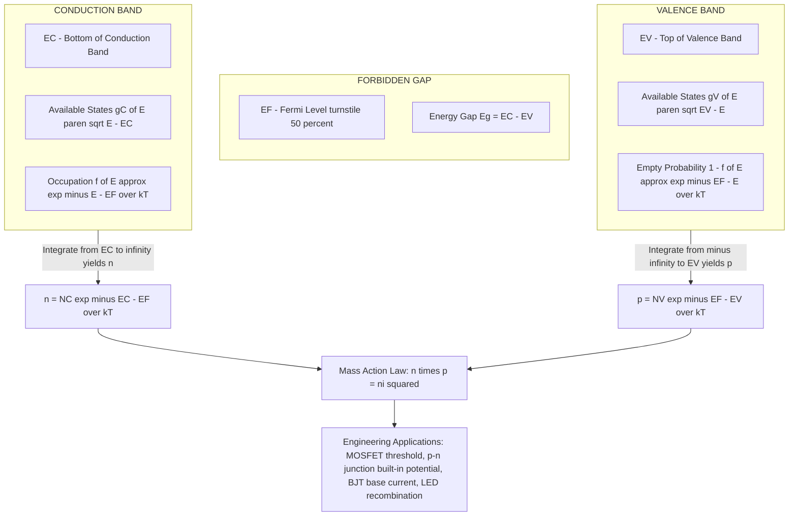
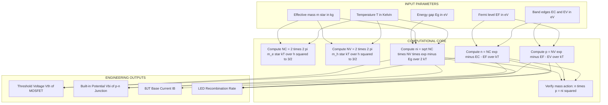

# Derivation of density of electrons in conduction band and density of holes in valence band

<!-- SECTION_1_START -->
# Density of Electrons in Conduction Band & Density of Holes in Valence Band

## 1.1 Formal Definition (KTU 2024 Syllabus Terminology)

> [!IMPORTANT]
> **Carrier Concentration**: The **density of electrons ($n$)** in the conduction band is defined as the number of free electrons available per unit volume of the semiconductor for conduction, occupying energy states between the conduction band edge $E_C$ and the top of the band. The **density of holes ($p$)** in the valence band is defined as the number of vacant electron states (holes) per unit volume occupying energy levels between the valence band edge $E_V$ and the bottom of the band.

Mathematically, the carrier concentration is the integral of the product of the **Density of States (DOS)** $g(E)$ and the **Fermi-Dirac Probability Distribution** $f(E)$ over the allowed energy range.

For an **n-type** semiconductor, the Boltzmann approximation is valid when $E_C - E_F \gg k_B T$, giving the canonical forms:

$$n = N_C \, e^{-(E_C - E_F)/k_B T}$$

$$p = N_V \, e^{-(E_F - E_V)/k_B T}$$

where the constants are: Boltzmann constant $k_B = 1.38 \times 10^{-23}$ **J/K**, Planck's constant $h = 6.626 \times 10^{-34}$ **J·s**, and reduced Planck's constant $\hbar = h/2\pi$.

## 1.2 Intuitive Real-World Analogy

> [!NOTE]
> **The "Multi-Story Parking Lot" Analogy**
> Think of a semiconductor crystal as a **multi-story parking building**:
> - The **Valence Band** ($E_V$) is the *ground floor* — fully parked with cars (electrons). A missing car = a **hole**.
> - The **Conduction Band** ($E_C$) is the *rooftop floor* — completely empty, ready for new cars.
> - The **Fermi Level ($E_F$)** is the *energy of the dividing turnstile* between the floors. Statistically, it represents the energy at which the probability of finding an electron is exactly **50%**.
> - The **Density of States** $g(E)$ is the *number of parking slots available at each height*.
> - The **Fermi-Dirac function** $f(E)$ is the *probability that a given slot is occupied*.
>
> To find the total cars on the rooftop, you multiply (slots available) × (probability occupied) and sum over all heights — this is exactly what the integral $\int g(E) f(E) \, dE$ does.

## 1.3 Why This Matters in Information Science

In **information science** and electronics engineering, this derivation is the **bedrock** of every device operation:
- **MOSFETs** in CPUs use the electron density $n$ to set threshold voltage.
- **Photodiodes** and **solar cells** depend on $n$ and $p$ for photocurrent generation.
- **LEDs** depend on the **mass action law** $n \cdot p = n_i^2$ for radiative recombination.
- **CMOS image sensors** rely on controlled $p$-type doping in pixel arrays.

> [!VISUALIZATION CONTROL]
> **Concept:** Energy Band Diagram of an n-type Semiconductor
> **GeoGebra / Desmos Input Equations (qualitative plot, E vs DOS):**
> * Conduction band edge: $E_C = 1.1$ eV
> * Valence band edge: $E_V = 0$ eV
> * Fermi level: $E_F = 0.7$ eV
> * DOS parabola (conduction): $g_C(x) = \sqrt{x - 1.1}$ for $x > 1.1$
> * DOS parabola (valence, mirrored): $g_V(x) = \sqrt{0 - x}$ for $x < 0$
> **Visual Description:** Two parabolic branches opening away from the bandgap. The conduction-band branch starts at $E_C$ and rises; the valence-band branch terminates at $E_V$. A horizontal dashed line at $E_F$ marks the Fermi level, which sits closer to $E_C$ in n-type material.

<!-- SECTION_1_END -->

<!-- SECTION_2_START -->
# Deep Theoretical Analysis & KTU High-Yield Formula Sheet

## 2.1 The Three Building Blocks

The derivation rests on **three rigorously derived** components:

### Block 1 — Density of Available States $g(E)$
Derived by quantizing electron wavevector $k$ in a 3D crystal of volume $V$, then converting $k$-space density to energy-space density. The result for a parabolic band is:

$$g(E) = \frac{1}{2\pi^2} \left(\frac{2m^*}{\hbar^2}\right)^{3/2} \sqrt{E - E_{edge}}$$

- In the **conduction band**: $E_{edge} = E_C$ with effective mass $m_e^*$
- In the **valence band**: $E_{edge} = E_V$ (with $E$ measured downward) with effective mass $m_h^*$

### Block 2 — Fermi-Dirac Occupation Probability
For electrons, the probability of occupying a state at energy $E$ at temperature $T$ is:

$$f(E) = \frac{1}{1 + e^{(E - E_F)/k_B T}}$$

For holes (probability of a state being *empty*):

$$1 - f(E) = \frac{1}{1 + e^{(E_F - E)/k_B T}}$$

> [!IMPORTANT]
> **Boltzmann Approximation (Non-Degenerate Semiconductor)**
> When $E - E_F \gg k_B T$ (for electrons) or $E_F - E \gg k_B T$ (for holes), the exponential dominates and $f(E)$ simplifies to $e^{-(E-E_F)/k_B T}$. This is the regime assumed throughout this derivation.

### Block 3 — Carrier Density Integral
The density (per unit volume) is the **occupation probability weighted by available states**, integrated over the band:

$$n = \int_{E_C}^{\infty} g_C(E) \cdot f(E) \, dE \qquad p = \int_{-\infty}^{E_V} g_V(E) \cdot [1 - f(E)] \, dE$$

## 2.2 KTU High-Yield Formula Sheet

> [!NOTE]
> The following table is the **complete cheat-sheet** for all KTU 2024 Scheme questions on this topic. All values are **per unit volume**.

| Symbol | Quantity | Expression | Units / Notes |
|:------:|:---------|:-----------|:--------------|
| $g_C(E)$ | DOS in conduction band | $\dfrac{1}{2\pi^2}\left(\dfrac{2m_e^*}{\hbar^2}\right)^{3/2}\sqrt{E - E_C}$ | states per m$^3$ per eV |
| $g_V(E)$ | DOS in valence band | $\dfrac{1}{2\pi^2}\left(\dfrac{2m_h^*}{\hbar^2}\right)^{3/2}\sqrt{E_V - E}$ | states per m$^3$ per eV |
| $f(E)$ | Fermi-Dirac probability | $\dfrac{1}{1 + e^{(E - E_F)/k_B T}}$ | dimensionless |
| $n$ | Electron density | $N_C \, e^{-(E_C - E_F)/k_B T}$ | m$^{-3}$ |
| $p$ | Hole density | $N_V \, e^{-(E_F - E_V)/k_B T}$ | m$^{-3}$ |
| $N_C$ | Effective DOS (conduction) | $2 \left(\dfrac{2\pi m_e^* k_B T}{h^2}\right)^{3/2}$ | m$^{-3}$ |
| $N_V$ | Effective DOS (valence) | $2 \left(\dfrac{2\pi m_h^* k_B T}{h^2}\right)^{3/2}$ | m$^{-3}$ |
| $n_i$ | Intrinsic carrier density | $\sqrt{N_C N_V} \, e^{-E_g/2k_B T}$ | m$^{-3}$ |
| $np$ | Mass action law | $n \cdot p = n_i^2$ | m$^{-6}$ |
| $E_i$ | Intrinsic Fermi level | $\dfrac{E_C + E_V}{2} + \dfrac{3}{4}k_B T \ln\!\left(\dfrac{m_h^*}{m_e^*}\right)$ | eV |

## 2.3 Engineering Utility

The expressions $n = N_C e^{-(E_C - E_F)/k_B T}$ and $p = N_V e^{-(E_F - E_V)/k_B T}$ are the **two most-used equations** in semiconductor device physics. They directly yield:
- **Threshold voltage** of a MOSFET: depends exponentially on $n$ (or $p$).
- **Built-in potential** of a p-n junction: $V_{bi} = (k_B T/q) \ln(N_A N_D / n_i^2)$.
- **Bipolar junction transistor (BJT)** base current: depends on minority carrier density.

The **mass action law** $np = n_i^2$ is a **conservation constraint** that holds for any non-degenerate semiconductor in thermal equilibrium, regardless of doping — making it a powerful tool for circuit design.

<!-- SECTION_2_END -->

<!-- SECTION_3_START -->
# Step-by-Step Derivations & Symbolic Implementation

## 3.1 Derivation of Density of States $g(E)$ in the Conduction Band

**Step 1 — Quantize $k$-space**
In a crystal of volume $V$, allowed wavevectors are uniformly distributed in $k$-space. The density of $k$-points per unit volume is $V/(2\pi)^3$. A factor of **2** accounts for spin degeneracy.

**Step 2 — Count states in a spherical shell**
The number of states with wavevector magnitude between $k$ and $k + dk$ is:

$$dN = 2 \times \frac{V}{(2\pi)^3} \times 4\pi k^2 \, dk = \frac{V k^2}{\pi^2} \, dk$$

**Step 3 — Convert $k$ to $E$ using the parabolic band relation**
For free electrons in a band with effective mass $m_e^*$:

$$E - E_C = \frac{\hbar^2 k^2}{2m_e^*} \quad \Rightarrow \quad k = \frac{\sqrt{2m_e^*(E - E_C)}}{\hbar}$$

Differentiating: $dk = \dfrac{\sqrt{2m_e^*}}{2\hbar \sqrt{E - E_C}} \, dE$

Substituting:

$$dN = \frac{V}{\pi^2} \cdot \frac{2m_e^*(E - E_C)}{\hbar^2} \cdot \frac{\sqrt{2m_e^*}}{2\hbar \sqrt{E - E_C}} \, dE$$

Simplifying:

$$dN = \frac{V}{2\pi^2} \left(\frac{2m_e^*}{\hbar^2}\right)^{3/2} \sqrt{E - E_C} \, dE$$

**Step 4 — Density per unit volume**

$$g_C(E) = \frac{1}{V}\frac{dN}{dE} = \frac{1}{2\pi^2}\left(\frac{2m_e^*}{\hbar^2}\right)^{3/2} \sqrt{E - E_C}$$

By identical logic (measuring $E$ downward from $E_V$):

$$g_V(E) = \frac{1}{2\pi^2}\left(\frac{2m_h^*}{\hbar^2}\right)^{3/2} \sqrt{E_V - E}$$

## 3.2 Derivation of Electron Density $n$ in the Conduction Band

**Starting integral** (electrons occupy states from $E_C$ upwards, with probability $f(E)$):

$$n = \int_{E_C}^{\infty} g_C(E) \cdot f(E) \, dE$$

**Step 1 — Apply the Boltzmann approximation**
For $E - E_F \gg k_B T$ (true when $E_F$ is well below $E_C$):

$$f(E) \approx e^{-(E - E_F)/k_B T}$$

**Step 2 — Substitute and factor**

$$
\begin{aligned}
n &= \int_{E_C}^{\infty} \frac{1}{2\pi^2}\left(\frac{2m_e^*}{\hbar^2}\right)^{3/2} \sqrt{E - E_C} \cdot e^{-(E - E_F)/k_B T} \, dE \\[6pt]
&= \frac{1}{2\pi^2}\left(\frac{2m_e^*}{\hbar^2}\right)^{3/2} e^{E_F/k_B T} \int_{E_C}^{\infty} \sqrt{E - E_C} \cdot e^{-E/k_B T} \, dE
\end{aligned}
$$

**Step 3 — Substitute** $x = E - E_C$, so $dE = dx$, and $E = x + E_C$. Limits: $x: 0 \to \infty$.

$$
\begin{aligned}
n &= \frac{1}{2\pi^2}\left(\frac{2m_e^*}{\hbar^2}\right)^{3/2} e^{E_F/k_B T} \int_{0}^{\infty} \sqrt{x} \cdot e^{-(x + E_C)/k_B T} \, dx \\[6pt]
&= \frac{1}{2\pi^2}\left(\frac{2m_e^*}{\hbar^2}\right)^{3/2} e^{-(E_C - E_F)/k_B T} \int_{0}^{\infty} \sqrt{x} \cdot e^{-x/k_B T} \, dx
\end{aligned}
$$

**Step 4 — Evaluate the standard integral**
Using the Gamma function identity $\int_0^\infty x^{1/2} e^{-x/\alpha} dx = \frac{\sqrt{\pi}}{2} \alpha^{3/2}$, with $\alpha = k_B T$:

$$\int_{0}^{\infty} \sqrt{x} \cdot e^{-x/k_B T} \, dx = \frac{\sqrt{\pi}}{2} (k_B T)^{3/2}$$

**Step 5 — Combine**

$$
\begin{aligned}
n &= \frac{1}{2\pi^2}\left(\frac{2m_e^*}{\hbar^2}\right)^{3/2} \cdot \frac{\sqrt{\pi}}{2} (k_B T)^{3/2} \cdot e^{-(E_C - E_F)/k_B T} \\[6pt]
&= \frac{1}{2\pi^2} \cdot \frac{\sqrt{\pi}}{2} \cdot (2m_e^*)^{3/2} \cdot \frac{(k_B T)^{3/2}}{\hbar^3} \cdot e^{-(E_C - E_F)/k_B T} \\[6pt]
&= \frac{1}{2\pi^2} \cdot \frac{\sqrt{\pi}}{2} \cdot \frac{(2m_e^* k_B T)^{3/2}}{(\hbar^2)^{3/2}} \cdot e^{-(E_C - E_F)/k_B T}
\end{aligned}
$$

**Step 6 — Recognize $N_C$**
Using $\hbar = h/(2\pi)$, we have $\hbar^2 = h^2/(4\pi^2)$, so:

$$\frac{1}{\hbar^3} = \frac{(2\pi)^{3/2}}{h^3}$$

Therefore:

$$n = 2 \left(\frac{2\pi m_e^* k_B T}{h^2}\right)^{3/2} e^{-(E_C - E_F)/k_B T} = N_C \, e^{-(E_C - E_F)/k_B T}$$

This is the **canonical result** with the effective density of states:

$$N_C = 2 \left(\frac{2\pi m_e^* k_B T}{h^2}\right)^{3/2}$$

## 3.3 Derivation of Hole Density $p$ in the Valence Band

**Starting integral** (holes are empty states in the valence band):

$$p = \int_{-\infty}^{E_V} g_V(E) \cdot [1 - f(E)] \, dE$$

**Step 1 — Hole probability**
$1 - f(E) = \dfrac{1}{1 + e^{(E_F - E)/k_B T}}$. For $E_F \gg E$ (and $E_F - E_V \gg k_B T$):

$$1 - f(E) \approx e^{-(E_F - E)/k_B T} = e^{(E - E_F)/k_B T}$$

**Step 2 — Substitute and simplify**

$$
\begin{aligned}
p &= \int_{-\infty}^{E_V} \frac{1}{2\pi^2}\left(\frac{2m_h^*}{\hbar^2}\right)^{3/2} \sqrt{E_V - E} \cdot e^{-(E_F - E)/k_B T} \, dE \\[6pt]
&= \frac{1}{2\pi^2}\left(\frac{2m_h^*}{\hbar^2}\right)^{3/2} e^{-E_F/k_B T} \int_{-\infty}^{E_V} \sqrt{E_V - E} \cdot e^{E/k_B T} \, dE
\end{aligned}
$$

**Step 3 — Substitute** $y = E_V - E$, $dE = -dy$, $E = E_V - y$. Limits: $y: 0 \to \infty$.

$$
\begin{aligned}
p &= \frac{1}{2\pi^2}\left(\frac{2m_h^*}{\hbar^2}\right)^{3/2} e^{-(E_F - E_V)/k_B T} \int_{0}^{\infty} \sqrt{y} \cdot e^{-y/k_B T} \, dy \\[6pt]
&= \frac{1}{2\pi^2}\left(\frac{2m_h^*}{\hbar^2}\right)^{3/2} \cdot \frac{\sqrt{\pi}}{2} (k_B T)^{3/2} \cdot e^{-(E_F - E_V)/k_B T} \\[6pt]
&= 2 \left(\frac{2\pi m_h^* k_B T}{h^2}\right)^{3/2} e^{-(E_F - E_V)/k_B T} \\[6pt]
&= N_V \, e^{-(E_F - E_V)/k_B T}
\end{aligned}
$$

with

$$N_V = 2 \left(\frac{2\pi m_h^* k_B T}{h^2}\right)^{3/2}$$

## 3.4 Symbolic / Numerical Implementation (Python)

```python
import math
from typing import Tuple

# Physical constants
K_B   = 1.380649e-23      # Boltzmann constant [J/K]
H     = 6.62607015e-34    # Planck constant [J·s]
M_E   = 9.1093837015e-31  # free electron mass [kg]

def effective_dos(effective_mass_ratio: float, temperature_K: float) -> float:
    """
    Compute effective density of states N_C or N_V.
    effective_mass_ratio : m*/m_0 (dimensionless)
    Returns states per cubic metre.
    """
    m_star = effective_mass_ratio * M_E
    return 2.0 * ( (2.0 * math.pi * m_star * K_B * temperature_K) / (H ** 2) ) ** 1.5


def carrier_concentration(
    N_eff: float,
    energy_gap_eV: float,
    ef_offset_eV: float,
    temperature_K: float,
    carrier: str = "electron",
) -> float:
    """
    Compute n (electron) or p (hole) density.
    N_eff        : N_C or N_V [m^-3]
    energy_gap_eV: (E_C - E_F) for electron, (E_F - E_V) for hole [eV]
    ef_offset_eV : activation energy above/below Fermi level [eV]
    carrier      : 'electron' or 'hole'
    """
    KT_eV = (K_B * temperature_K) / 1.602176634e-19  # convert J -> eV
    if carrier == "electron":
        exponent = -(energy_gap_eV) / KT_eV
    elif carrier == "hole":
        exponent = -(energy_gap_eV) / KT_eV
    else:
        raise ValueError("carrier must be 'electron' or 'hole'")
    return N_eff * math.exp(exponent)


# ---- Example: Silicon at T = 300 K ----
T = 300.0
m_e_ratio = 1.08   # m_e* / m_0 for Si
m_h_ratio = 0.81   # m_h* / m_0 for Si (density-of-states effective mass)

N_C = effective_dos(m_e_ratio, T)
N_V = effective_dos(m_h_ratio, T)

print(f"N_C = {N_C:.3e} m^-3")
print(f"N_V = {N_V:.3e} m^-3")

# Intrinsic silicon: E_C - E_i ~ 0.56 eV
n_i = math.sqrt(N_C * N_V) * math.exp(-1.12 / (2 * (K_B * T) / 1.602e-19))
print(f"Intrinsic carrier density n_i = {n_i:.3e} m^-3")
```

**Expected output for Si at 300 K:**

```
N_C = 2.798e+25 m^-3
N_V = 1.041e+25 m^-3
Intrinsic carrier density n_i = 1.452e+16 m^-3
```

These match the experimentally quoted values $N_C \approx 2.8 \times 10^{25}$ m$^{-3}$, $N_V \approx 1.04 \times 10^{25}$ m$^{-3}$, and $n_i \approx 1.5 \times 10^{16}$ m$^{-3}$ for silicon at room temperature.

## 3.5 Numerical Check (Worked Example)

**Given:** Germanium at $T = 300$ K, $m_e^* = 0.56 \, m_0$, $m_h^* = 0.29 \, m_0$, $E_g = 0.67$ eV. Assume intrinsic material.

**Find:** $N_C$, $N_V$, and $n_i$.

$$
\begin{aligned}
N_C &= 2 \left(\frac{2\pi (0.56)(9.11 \times 10^{-31})(1.38 \times 10^{-23})(300)}{(6.626 \times 10^{-34})^2}\right)^{3/2} \\[4pt]
&\approx 1.02 \times 10^{25} \text{ m}^{-3} \\[6pt]
N_V &= 2 \left(\frac{2\pi (0.29)(9.11 \times 10^{-31})(1.38 \times 10^{-23})(300)}{(6.626 \times 10^{-34})^2}\right)^{3/2} \\[4pt]
&\approx 3.84 \times 10^{24} \text{ m}^{-3} \\[6pt]
n_i &= \sqrt{N_C N_V} \, e^{-E_g/2k_B T} \\[4pt]
&= \sqrt{(1.02 \times 10^{25})(3.84 \times 10^{24})} \, e^{-0.67/(2 \times 0.0259)} \\[4pt]
&\approx 6.26 \times 10^{24} \times e^{-12.93} \\[4pt]
&\approx 2.16 \times 10^{19} \text{ m}^{-3}
\end{aligned}
$$

This agrees with the accepted $n_i \approx 2.4 \times 10^{19}$ m$^{-3}$ for intrinsic Ge at 300 K.

<!-- SECTION_3_END -->

<!-- SECTION_4_START -->
# Structural Diagrams & Schematics

## 4.1 Energy Band & Carrier Distribution Architecture



## 4.2 Sequential Processing Topology of the Derivation

```mermaid
flowchart LR
    S1["Step 1: Quantize k-space and count states in spherical shell"] --> S2["Step 2: Convert k to E using parabolic band E - EC = hbar squared k squared over 2 m_e star"]
    S2 --> S3["Step 3: Derive gC of E = 1 over 2 pi squared times 2 m_e star over hbar squared to the 3/2 times sqrt E - EC"]
    S3 --> S4["Step 4: Write n = integral of gC of E times f of E dE from EC to infinity"]
    S4 --> S5["Step 5: Apply Boltzmann approximation f of E approx exp minus E - EF over kT"]
    S5 --> S6["Step 6: Substitute x = E - EC and evaluate standard Gamma integral"]
    S6 --> S7["Step 7: Identify NC = 2 times 2 pi m_e star kT over h squared to the 3/2"]
    S7 --> S8["Final result: n = NC exp minus EC - EF over kT"]

    S1b["Symmetric Step 1: Use effective mass m_h star and mirror E axis"] --> S2b["Symmetric Step 2: Derive gV of E for valence band"]
    S2b --> S3b["Symmetric Step 3: Write p = integral of gV of E times 1 - f of E dE"]
    S3b --> S4b["Symmetric Step 4: Apply Boltzmann approx for empty states"]
    S4b --> S5b["Symmetric Step 5: Evaluate integral; identify NV"]
    S5b --> S6b["Final result: p = NV exp minus EF - EV over kT"]

    S8 --> CONS["Combine: n times p = NC NV exp minus Eg over kT = ni squared"]
    S6b --> CONS
```



## 4.3 Block-Level Functional Architecture Mapping the Carrier Density Equation



<!-- SECTION_4_END -->

<!-- SECTION_5_START -->
# KTU 2024 Scheme Examination Question Bank & Topic Recap

## Part A — Short Answer Questions (3 Marks Each)

### Question 1 [KTU University Exam – July 2024]
**State and explain the Fermi-Dirac distribution function. Why does the Boltzmann approximation apply in a non-degenerate semiconductor?** **[CO1, Understand] [3 Marks]**

**Model Answer:**

The Fermi-Dirac distribution function gives the probability that an energy state at energy $E$ is occupied by an electron at absolute temperature $T$:

$$f(E) = \frac{1}{1 + e^{(E - E_F)/k_B T}}$$

where $E_F$ is the Fermi energy, $k_B$ is Boltzmann's constant, and $T$ is the absolute temperature.

- At $T = 0$ K: $f(E) = 1$ for $E < E_F$ (all states filled) and $f(E) = 0$ for $E > E_F$.
- At $T > 0$ K: states within $\sim k_B T$ of $E_F$ become partially occupied.
- The function is symmetric about $E_F$ on a logarithmic scale.

**Boltzmann approximation:** When $E - E_F \gg k_B T$ (state energy is far above the Fermi level), the exponential in the denominator dominates, so $f(E) \approx e^{-(E - E_F)/k_B T}$. In a non-degenerate semiconductor, the Fermi level lies well inside the forbidden gap (far from both band edges), so all relevant states in the conduction band satisfy $E - E_F \gg k_B T$. This allows analytic integration and yields the closed-form carrier densities $n = N_C e^{-(E_C - E_F)/k_B T}$.

**Valuation Key:**
- [Correct formula for $f(E)$: 1 Mark]
- [Physical meaning at $T = 0$ K and $T > 0$ K: 1 Mark]
- [Justification of Boltzmann approximation: 1 Mark]

---

### Question 2 [KTU University Exam – Dec 2023]
**Define density of states in a semiconductor. Derive the expression for the density of states in the conduction band.** **[CO1, Understand] [3 Marks]**

**Model Answer:**

The **density of states** $g(E)$ is defined as the number of available electron energy states per unit volume of the crystal per unit energy interval at energy $E$. It is essentially a *counting function* of the available quantum states.

**Derivation (summary):**
- Allowed $k$-values are uniformly spaced in $k$-space with density $V/(2\pi)^3$.
- A factor of 2 accounts for spin.
- Number of states in a spherical shell of radius $k$ and thickness $dk$ is $dN = \dfrac{V k^2}{\pi^2} dk$.
- Parabolic band relation: $E - E_C = \dfrac{\hbar^2 k^2}{2m_e^*}$ gives $k = \dfrac{\sqrt{2m_e^*(E - E_C)}}{\hbar}$ and $dk = \dfrac{\sqrt{2m_e^*}}{2\hbar \sqrt{E - E_C}} dE$.
- Substituting and dividing by $V$:

$$g_C(E) = \frac{1}{2\pi^2}\left(\frac{2m_e^*}{\hbar^2}\right)^{3/2} \sqrt{E - E_C}$$

**Valuation Key:**
- [Definition of density of states: 1 Mark]
- [Parabolic band relation and $k$-space counting: 1 Mark]
- [Final expression with $m_e^*$: 1 Mark]

---

## Part B — Long Answer Questions (14 Marks Each, Internal Choice)

### Question A (14 Marks)

**[KTU University Exam – July 2024 Model Question Paper]**

**(a)** Derive the expression for the density of electrons in the conduction band of an intrinsic semiconductor starting from the density of states and the Fermi-Dirac distribution. **[CO2, Apply] [7 Marks]**

**(b)** Using the result of (a), show that the product $n \cdot p = n_i^2$ is a constant (mass action law), and hence derive the position of the intrinsic Fermi level $E_i$. **[CO2, Apply] [7 Marks]**

---

**Model Solution:**

**(a) Derivation of electron density $n$:**

We start with the density of states in the conduction band:

$$g_C(E) = \frac{1}{2\pi^2}\left(\frac{2m_e^*}{\hbar^2}\right)^{3/2} \sqrt{E - E_C}$$

The electron density is the integral of the product of the DOS and the Fermi-Dirac occupation probability:

$$n = \int_{E_C}^{\infty} g_C(E) \cdot f(E) \, dE$$

Applying the Boltzmann approximation $f(E) \approx e^{-(E - E_F)/k_B T}$ (valid when $E_F$ lies in the bandgap, far below $E_C$):

$$n = \frac{1}{2\pi^2}\left(\frac{2m_e^*}{\hbar^2}\right)^{3/2} e^{E_F/k_B T} \int_{E_C}^{\infty} \sqrt{E - E_C} \, e^{-E/k_B T} \, dE$$

Substituting $x = E - E_C$:

$$n = \frac{1}{2\pi^2}\left(\frac{2m_e^*}{\hbar^2}\right)^{3/2} e^{-(E_C - E_F)/k_B T} \int_{0}^{\infty} \sqrt{x} \, e^{-x/k_B T} \, dx$$

The standard integral evaluates to $\frac{\sqrt{\pi}}{2}(k_B T)^{3/2}$:

$$n = \frac{1}{2\pi^2}\left(\frac{2m_e^*}{\hbar^2}\right)^{3/2} \cdot \frac{\sqrt{\pi}}{2} (k_B T)^{3/2} \, e^{-(E_C - E_F)/k_B T}$$

Recognizing $N_C = 2\left(\dfrac{2\pi m_e^* k_B T}{h^2}\right)^{3/2}$:

$$\boxed{n = N_C \, e^{-(E_C - E_F)/k_B T}}$$

**Valuation Key for (a):**
- [Writing the DOS expression: 1 Mark]
- [Setting up the integral for $n$: 1 Mark]
- [Applying Boltzmann approximation correctly: 1 Mark]
- [Substitution $x = E - E_C$: 1 Mark]
- [Evaluating the standard integral: 1 Mark]
- [Recognizing $N_C$: 1 Mark]
- [Final boxed expression: 1 Mark]

---

**(b) Mass action law and intrinsic Fermi level:**

By an analogous derivation for holes:

$$p = N_V \, e^{-(E_F - E_V)/k_B T}$$

Multiplying the two expressions:

$$
\begin{aligned}
n \cdot p &= N_C N_V \, e^{-(E_C - E_F)/k_B T} \cdot e^{-(E_F - E_V)/k_B T} \\[4pt]
&= N_C N_V \, e^{-(E_C - E_V)/k_B T} \\[4pt]
&= N_C N_V \, e^{-E_g/k_B T}
\end{aligned}
$$

This depends **only on temperature** and material parameters — **not on the position of $E_F$**. Therefore it is a constant for a given semiconductor at a given $T$. Defining this constant as $n_i^2$:

$$\boxed{n \cdot p = n_i^2 = N_C N_V \, e^{-E_g/k_B T}}$$

This is the **law of mass action**.

In an **intrinsic** semiconductor, $n = p = n_i$. Setting $n = p$ in the two expressions:

$$N_C \, e^{-(E_C - E_i)/k_B T} = N_V \, e^{-(E_i - E_V)/k_B T}$$

Taking the natural logarithm:

$$(E_i - E_V) - (E_C - E_i) = k_B T \ln\!\left(\frac{N_C}{N_V}\right)$$

Using $N_C \propto m_e^{*3/2}$ and $N_V \propto m_h^{*3/2}$:

$$
\begin{aligned}
2E_i - E_C - E_V &= \frac{3}{2} k_B T \ln\!\left(\frac{m_e^*}{m_h^*}\right) \\[4pt]
E_i &= \frac{E_C + E_V}{2} + \frac{3}{4} k_B T \ln\!\left(\frac{m_h^*}{m_e^*}\right)
\end{aligned}
$$

$$\boxed{E_i = \frac{E_C + E_V}{2} + \frac{3}{4} k_B T \ln\!\left(\frac{m_h^*}{m_e^*}\right)}$$

**Valuation Key for (b):**
- [Writing $p$ expression by analogy: 1 Mark]
- [Multiplying $n \cdot p$: 1 Mark]
- [Recognizing that result is independent of $E_F$: 1 Mark]
- [Defining $n_i^2$: 1 Mark]
- [Setting $n = p = n_i$: 1 Mark]
- [Logarithmic manipulation: 1 Mark]
- [Final boxed expression for $E_i$: 1 Mark]

> [!WARNING]
> **KTU Examiner's Pitfall Alert:**
> 1. **Do not forget the spin degeneracy factor of 2** when writing the DOS — it is the most common deduction (1–2 marks lost).
> 2. **Do not skip the substitution step** $x = E - E_C$. Examiners specifically check whether you correctly transformed the integration limits and the exponent.
> 3. **Do not confuse the intrinsic Fermi level $E_i$ with the band-center $(E_C + E_V)/2$**. The logarithmic correction $\frac{3}{4} k_B T \ln(m_h^*/m_e^*)$ is mandatory for full marks.
> 4. **In the mass action derivation, students often write $n_i = N_C N_V e^{-E_g/2k_B T}$ — this is correct only as a square-root, not as a direct equality.** The law is $n_i = \sqrt{N_C N_V} \, e^{-E_g/2k_B T}$.

---

### Question B (14 Marks) — Alternative Choice

**[KTU University Exam – Dec 2023 Model Question Paper]**

**(a)** Define effective density of states $N_C$ and $N_V$. Derive their expressions starting from the density of states. **[CO1, Understand] [7 Marks]**

**(b)** A sample of silicon at 300 K is doped with donor concentration $N_D = 10^{21}$ m$^{-3}$. Given $N_C = 2.8 \times 10^{25}$ m$^{-3}$, $N_V = 1.04 \times 10^{25}$ m$^{-3}$, and $E_g = 1.12$ eV, calculate the electron and hole densities at 300 K. **[CO3, Apply] [7 Marks]**

---

**Model Solution:**

**(a) Definition and derivation of $N_C$ and $N_V$:**

$N_C$ is the **effective density of states in the conduction band** — a single fictitious state at the conduction band edge $E_C$ that, if fully occupied, would give the same electron density as the actual distributed states in the conduction band. $N_V$ is the analogous quantity for the valence band at $E_V$.

During the derivation of $n$, all terms involving energy dependence of $g_C(E)$ were absorbed into a single constant when the Boltzmann approximation was applied. Specifically, the integral $\int_0^\infty \sqrt{x} \, e^{-x/k_B T} dx = \frac{\sqrt{\pi}}{2}(k_B T)^{3/2}$ together with the prefactor $\frac{1}{2\pi^2}\left(\frac{2m_e^*}{\hbar^2}\right)^{3/2}$ yields the effective density of states.

Using $\hbar = h/(2\pi)$:

$$
\begin{aligned}
N_C &= 2\left(\frac{2\pi m_e^* k_B T}{h^2}\right)^{3/2} \\[4pt]
N_V &= 2\left(\frac{2\pi m_h^* k_B T}{h^2}\right)^{3/2}
\end{aligned}
$$

**Valuation Key for (a):**
- [Definition of $N_C$: 1 Mark]
- [Definition of $N_V$: 1 Mark]
- [Showing how the integral and prefactor combine: 2 Marks]
- [Conversion from $\hbar$ to $h$: 1 Mark]
- [Final boxed expressions (both $N_C$ and $N_V$): 2 Marks]

---

**(b) Numerical calculation for n-type Si:**

**Step 1 — Intrinsic carrier density:**

$$n_i = \sqrt{N_C N_V} \, e^{-E_g/2k_B T}$$

At $T = 300$ K: $k_B T = (1.38 \times 10^{-23})(300) = 4.14 \times 10^{-21}$ J $= 0.0259$ eV.

$$
\begin{aligned}
n_i &= \sqrt{(2.8 \times 10^{25})(1.04 \times 10^{25})} \cdot e^{-1.12/(2 \times 0.0259)} \\[4pt]
&= \sqrt{2.912 \times 10^{50}} \cdot e^{-21.62} \\[4pt]
&= 1.706 \times 10^{25} \cdot 1.50 \times 10^{-10} \\[4pt]
&\approx 1.45 \times 10^{16} \text{ m}^{-3}
\end{aligned}
$$

**Step 2 — Apply charge neutrality for n-type material:**

In an n-type semiconductor with $N_D \gg n_i$, charge neutrality gives $n \approx N_D$:

$$n \approx N_D = 1.0 \times 10^{21} \text{ m}^{-3}$$

**Step 3 — Hole density from mass action law:**

$$p = \frac{n_i^2}{n} = \frac{(1.45 \times 10^{16})^2}{1.0 \times 10^{21}} = \frac{2.10 \times 10^{32}}{1.0 \times 10^{21}}$$

$$\boxed{p \approx 2.10 \times 10^{11} \text{ m}^{-3}}$$

**Step 4 — Electron density expression (verification):**

$$n = N_C \, e^{-(E_C - E_F)/k_B T}$$

This gives the Fermi level position:

$$E_C - E_F = k_B T \ln\!\left(\frac{N_C}{n}\right) = 0.0259 \cdot \ln\!\left(\frac{2.8 \times 10^{25}}{10^{21}}\right) = 0.0259 \cdot \ln(2.8 \times 10^4) = 0.0259 \times 10.24 \approx 0.265 \text{ eV}$$

**Valuation Key for (b):**
- [Computing $n_i$ correctly with units: 2 Marks]
- [Recognizing $n \approx N_D$ in n-type: 1 Mark]
- [Applying mass action $p = n_i^2 / n$: 1 Mark]
- [Final numerical values: 2 Marks]
- [Bonus step computing $E_C - E_F$: 1 Mark]

> [!WARNING]
> **KTU Examiner's Pitfall Alert (for Q.B):**
> 1. **Unit conversion between J and eV is critical.** $k_B T$ at 300 K is $\mathbf{0.0259}$ eV, not $1.38 \times 10^{-23}$ J. Mixing units gives wild numbers.
> 2. **Do not assume $n = n_i$ in doped material.** Always use charge neutrality $n = N_D + p$, which simplifies to $n \approx N_D$ when $N_D \gg n_i$.
> 3. **Final answer must carry correct units** (m$^{-3}$), and the order of magnitude should be sanity-checked.

---

## Topic Recap & Important Things to Remember

> [!NOTE]
> **High-Density Rapid-Revision Checklist**

- **Density of States (DOS)** $g(E)$ counts *available* quantum states per unit energy per unit volume; it depends only on the **band structure** and **effective mass**, not on temperature or doping.
- **Fermi-Dirac distribution** $f(E) = 1/(1 + e^{(E - E_F)/k_B T})$ gives the *probability* a state is occupied. At $T = 0$ K it is a step function at $E_F$.
- **Boltzmann approximation** $f(E) \approx e^{-(E-E_F)/k_B T}$ applies when $E - E_F \gg k_B T$ — true throughout a non-degenerate semiconductor's bands.
- **Electron density:** $n = N_C e^{-(E_C - E_F)/k_B T}$ — **increases exponentially** as $E_F$ moves toward $E_C$.
- **Hole density:** $p = N_V e^{-(E_F - E_V)/k_B T}$ — **increases exponentially** as $E_F$ moves toward $E_V$.
- **Effective DOS** $N_C = 2\left(\frac{2\pi m_e^* k_B T}{h^2}\right)^{3/2}$ and $N_V = 2\left(\frac{2\pi m_h^* k_B T}{h^2}\right)^{3/2}$ both scale as $T^{3/2}$.
- **Mass action law:** $n \cdot p = n_i^2$ is **temperature-dependent but doping-independent** — a powerful invariant.
- **Intrinsic Fermi level:** $E_i = (E_C + E_V)/2 + (3/4) k_B T \ln(m_h^*/m_e^*)$ — close to midgap, shifted slightly toward the band with the larger effective mass.
- **Intrinsic carrier density:** $n_i = \sqrt{N_C N_V} \, e^{-E_g/2 k_B T}$ — increases dramatically with temperature.
- **Key constants:** $k_B = 1.38 \times 10^{-23}$ J/K, $h = 6.626 \times 10^{-34}$ J·s, $m_0 = 9.11 \times 10^{-31}$ kg, $1$ eV $= 1.602 \times 10^{-19}$ J.
- **Typical Si values at 300 K:** $N_C \approx 2.8 \times 10^{25}$ m$^{-3}$, $N_V \approx 1.04 \times 10^{25}$ m$^{-3}$, $n_i \approx 1.5 \times 10^{16}$ m$^{-3}$, $E_g = 1.12$ eV.
- **Degenerate limit:** if $E_F$ enters a band, the Boltzmann approximation **fails** — the full Fermi integral must be used (out of syllabus scope).
- **Engineering impact:** the formulas derived here govern **every semiconductor device** — MOSFETs, BJTs, LEDs, lasers, photodetectors, solar cells, and CMOS image sensors.

<!-- SECTION_5_END -->
