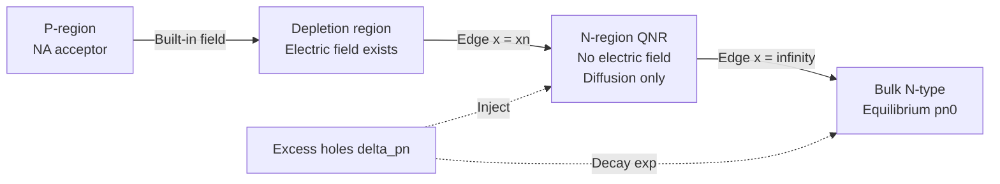
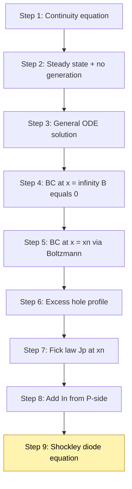
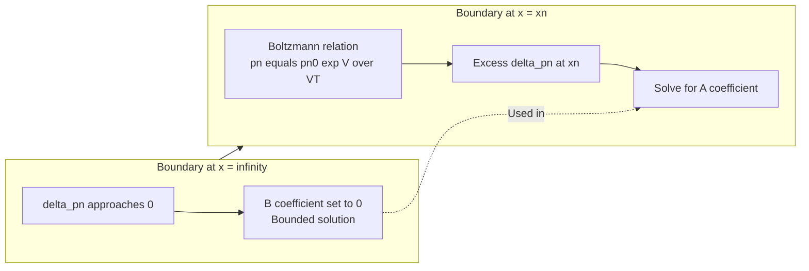
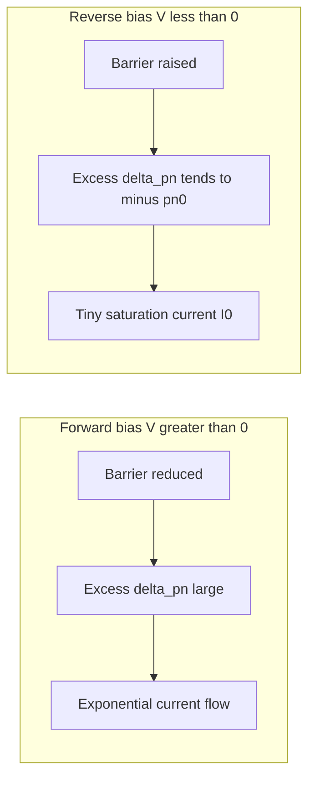
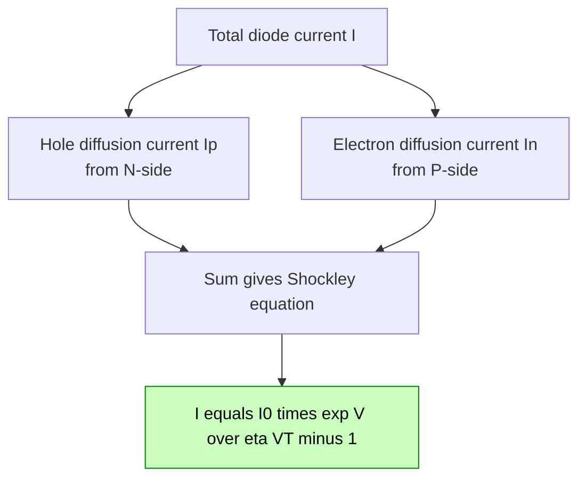

# Diode equation (Derivation)

<!-- SECTION_1_START -->

# Diode Equation — Core Definition & Intuitive Overview

> [!IMPORTANT]
> **KTU 2024 Syllabus (GAPHT121 | Module 3 | Semiconductor Physics)**
> The **Diode Equation** is the mathematical heart of PN-junction device analysis. It quantitatively relates the current flowing through a diode to the applied bias voltage and the physical properties of the semiconductor.

## Formal Definition

The **Shockley Diode Equation** expresses the steady-state current $I$ through a PN-junction diode as a function of the applied DC bias voltage $V$ across it:

$$
I = I_{0}\left[\exp\!\left(\dfrac{V}{\eta V_{T}}\right) - 1\right]
$$

where each symbol carries a precise physical meaning summarized below.

| Symbol | Quantity | Standard Value / Unit |
| :--- | :--- | :--- |
| $I$ | Diode forward current | Amperes (A) |
| $I_0$ | Reverse saturation current | Nano- to micro-amperes (nA–μA) |
| $V$ | Applied bias voltage (forward) | Volts (V) |
| $\eta$ | Ideality factor (emission coefficient) | $1 \le \eta \le 2$ |
| $V_T$ | Thermal voltage $= \dfrac{k_B T}{q}$ | $\approx \mathbf{25.85\ mV}$ at **300 K** |

> [!NOTE]
> **Constants used throughout this derivation**
> * $k_B$ = **Boltzmann constant** $= 1.38 \times 10^{-23}\ \text{J/K}$
> * $q$ = **Electronic charge** $= 1.6 \times 10^{-19}\ \text{C}$
> * $T$ = Absolute temperature in **Kelvin (K)**

## Conceptual Analogy — The One-Way Crowd Gate

Imagine a **bypass channel at a metro station**. People (charge carriers) accumulate on the entry side; the gate (depletion region) only allows flow when there is enough **push from behind** (forward bias). The crowd that trickles through the *wrong* way even when the gate is closed represents the **reverse saturation current $I_0$** — a small, nearly constant leakage. The Diode Equation simply says:

> *"More push $\Rightarrow$ exponentially more flow; tiny leak persists even with no push."*

The exponential nature arises from **Boltzmann statistics** governing how many carriers in the conduction band possess enough thermal energy to surmount the built-in potential barrier $V_{bi}$.

## Intuitive Geometric Picture

On a semi-log plot of $\ln(I)$ versus $V$, the diode equation becomes a **straight line** with slope $\dfrac{q}{\eta k_B T}$. Deviations from this straight line reveal non-ideal behavior (recombination in the depletion region, series resistance, high-level injection).

> [!VISUALIZATION CONTROL]
> **Concept:** Semi-log $I$–$V$ characteristic of an ideal silicon diode at $T = 300\ \text{K}$.
> **Plotly / Desmos Equations:**
> * Forward: $I(V) = 10^{-12}\left[\exp(40V) - 1\right]$ for $V \in [-1,\, 0.9]$
> * Reverse: nearly flat at $I = -10^{-12}\ \text{A}$
> **Visual Description:** A nearly horizontal line at $I \approx -10^{-12}$ A for $V < 0$, then an extremely steep exponential rise for $V > 0.6$ V — the "knee" of the diode.

---

<!-- SECTION_1_END -->

<!-- SECTION_2_START -->

# Deep Theoretical Analysis & KTU High-Yield Formula Sheet

## Building Blocks of the Derivation

To arrive at the diode equation, we need **four foundational concepts** from Module 3 of your syllabus:

1. **Mass Action Law & Minority Carriers** — In a PN diode, the current at low injection is carried by **minority carriers diffusing away** from the junction edges.
2. **Fick's First Law of Diffusion** — Particle flux is proportional to the concentration gradient.
3. **Continuity Equation** — Charge conservation in a semiconductor.
4. **Boltzmann Relation at the Junction Edge** — Minority carrier concentration at the depletion edge is exponentially modulated by the applied bias.

> [!NOTE]
> **Quasi-Neutral Region (QNR) Assumption**
> We assume that *outside* the depletion region, the semiconductor is **electrically neutral**, so the electric field is zero and transport is purely **diffusive**. This dramatically simplifies the equations and is a standard assumption for the textbook derivation.

## Step-by-Step Logic (Textual Blueprint)

* **Step A — Identify the dominant current mechanism:** For an N-side minority hole current, drift is negligible → diffusion dominates.
* **Step B — Set up the diffusion equation for holes in the N-region:** $\dfrac{\partial p_n}{\partial t} = D_p\dfrac{\partial^2 p_n}{\partial x^2} - \dfrac{p_n - p_{n0}}{\tau_p} + g_L$
* **Step C — Apply steady-state ($\dfrac{\partial}{\partial t} = 0$) and zero external generation ($g_L = 0$):** We get a 1-D second-order ODE.
* **Step D — Solve the ODE** with two boundary conditions: one at the depletion edge $x = x_n$ and one at $x = \infty$.
* **Step E — Compute the hole diffusion current** using Fick's law: $I_p = -q A D_p \dfrac{dp_n}{dx}\Big\vert_{x=x_n}$.
* **Step F — Add the symmetric electron contribution from the P-side** to obtain the total current.
* **Step G — Observe that total current is independent of $x$** (current continuity in 1-D steady state) and consolidate into a single exponential expression.

## KTU Formula Sheet / Cheat Sheet

| # | Equation | Physical Meaning |
| :--- | :--- | :--- |
| 1 | $V_T = \dfrac{k_B T}{q}$ | Thermal voltage ($\approx 25.85$ mV at 300 K) |
| 2 | $p_{n0} = \dfrac{n_i^2}{N_D}$ | Equilibrium minority hole density in N-region |
| 3 | $n_{p0} = \dfrac{n_i^2}{N_A}$ | Equilibrium minority electron density in P-region |
| 4 | $p_n(x_n) = p_{n0}\,\exp\!\left(\dfrac{V}{V_T}\right)$ | Boltzmann boundary condition at N-side depletion edge |
| 5 | $n_p(-x_p) = n_{p0}\,\exp\!\left(\dfrac{V}{V_T}\right)$ | Boltzmann boundary condition at P-side depletion edge |
| 6 | $\dfrac{d^2 \delta p_n}{dx^2} = \dfrac{\delta p_n}{L_p^2}$ | Steady-state minority-carrier diffusion equation (no generation) |
| 7 | $L_p = \sqrt{D_p \tau_p}$ | Minority hole diffusion length |
| 8 | $\delta p_n(x) = A \exp\!\left(\dfrac{-x}{L_p}\right) + B \exp\!\left(\dfrac{+x}{L_p}\right)$ | General solution of the diffusion equation |
| 9 | $I_p = -q A D_p \dfrac{d(\delta p_n)}{dx}\Big\vert_{x=x_n}$ | Hole diffusion current density integrated over area |
| 10 | $I_0 = q A \!\left(\dfrac{D_p\, p_{n0}}{L_p} + \dfrac{D_n\, n_{p0}}{L_n}\right)$ | Reverse saturation current expression |
| 11 | $I = I_0\!\left[\exp\!\left(\dfrac{V}{\eta V_T}\right) - 1\right]$ | **Final Shockley Diode Equation** |

## Real-World Engineering Utility

* **Circuit simulators (SPICE, LTspice, Multisim)** use this exact equation (with $\eta$ between 1 and 2) as the default compact model for every diode component.
* **Photovoltaic cells** under illumination use a *modified* version with an added photocurrent term.
* **Rectifiers, clippers, clampers, voltage regulators (Zener), and logic gates** all rely on this $I$–$V$ relation to set bias points.
* In **integrated circuit (IC) design**, engineers use the diode equation to design ESD-protection diodes, input clamping circuits, and bandgap references.

---

<!-- SECTION_2_END -->

<!-- SECTION_3_START -->

# Step-by-Step Derivation of the Diode Equation

> [!NOTE]
> **Scope of derivation:** We will derive the current contributed by **minority holes in the N-region** ($I_p$). By the symmetry of the analysis, the electron contribution from the P-region ($I_n$) follows identically. The total diode current is $I = I_p + I_n$.

## Step 1 — Start with the Minority Hole Continuity Equation

In the N-type quasi-neutral region, the time evolution of the *excess* minority hole concentration $\delta p_n(x,t) = p_n(x,t) - p_{n0}$ is governed by:

$$
\dfrac{\partial (\delta p_n)}{\partial t}
= D_p\,\dfrac{\partial^2 p_n}{\partial x^2}
- \dfrac{\delta p_n}{\tau_p}
+ g_L
$$

## Step 2 — Apply Steady-State and No External Generation

* Steady-state: $\dfrac{\partial (\delta p_n)}{\partial t} = 0$
* No external optical generation: $g_L = 0$
* $p_{n0}$ is a constant, so $\dfrac{\partial^2 p_n}{\partial x^2} = \dfrac{\partial^2 (\delta p_n)}{\partial x^2}$

Substituting:

$$
D_p\,\dfrac{d^2 (\delta p_n)}{dx^2} = \dfrac{\delta p_n}{\tau_p}
$$

Rearranging into the standard 1-D diffusion form:

$$
\dfrac{d^2 (\delta p_n)}{dx^2} = \dfrac{\delta p_n}{D_p \tau_p} = \dfrac{\delta p_n}{L_p^2}
$$

where we define the **minority hole diffusion length**:

$$
L_p = \sqrt{D_p\,\tau_p}
$$

## Step 3 — Write the General Solution

The characteristic equation $r^2 = 1/L_p^2$ yields two real roots: $r = \pm 1/L_p$. Therefore:

$$
\delta p_n(x) = A\,\exp\!\left(\dfrac{-x}{L_p}\right) + B\,\exp\!\left(\dfrac{+x}{L_p}\right)
$$

## Step 4 — Apply Boundary Condition at $x = \infty$

Physically, **far from the junction** the semiconductor returns to its equilibrium state, so $\delta p_n(\infty) = 0$. To prevent the solution from diverging at $x \to \infty$, we set $B = 0$:

$$
\delta p_n(x) = A\,\exp\!\left(\dfrac{-x}{L_p}\right)
$$

## Step 5 — Apply Boundary Condition at the Depletion Edge $x = x_n$

At the edge of the depletion region on the N-side, the **Boltzmann relation** modulates the minority carrier density:

$$
p_n(x_n) = p_{n0}\,\exp\!\left(\dfrac{V}{V_T}\right)
$$

Therefore the **excess** minority hole density at $x = x_n$ is:

$$
\delta p_n(x_n) = p_n(x_n) - p_{n0} = p_{n0}\!\left[\exp\!\left(\dfrac{V}{V_T}\right) - 1\right]
$$

Equating this to our solution at $x = x_n$:

$$
p_{n0}\!\left[\exp\!\left(\dfrac{V}{V_T}\right) - 1\right] = A\,\exp\!\left(\dfrac{-x_n}{L_p}\right)
$$

Solving for the constant $A$:

$$
A = p_{n0}\!\left[\exp\!\left(\dfrac{V}{V_T}\right) - 1\right]\exp\!\left(\dfrac{+x_n}{L_p}\right)
$$

## Step 6 — Final Expression for Excess Minority Holes

$$
\delta p_n(x) = p_{n0}\!\left[\exp\!\left(\dfrac{V}{V_T}\right) - 1\right]\exp\!\left(\dfrac{x_n - x}{L_p}\right)
$$

This is an **exponentially decaying** excess concentration profile that diffuses into the N-region from the junction edge.

## Step 7 — Compute the Hole Diffusion Current

By Fick's first law, the hole current density is $J_p = -q D_p \dfrac{d p_n}{dx} = -q D_p \dfrac{d (\delta p_n)}{dx}$ (since $p_{n0}$ is constant).

Differentiating the expression from Step 6:

$$
\dfrac{d(\delta p_n)}{dx} = -\dfrac{1}{L_p}\,p_{n0}\!\left[\exp\!\left(\dfrac{V}{V_T}\right) - 1\right]\exp\!\left(\dfrac{x_n - x}{L_p}\right)
$$

Multiplying by $-q D_p$ and evaluating at $x = x_n$:

$$
J_p\big\vert_{x_n} = \dfrac{q D_p\, p_{n0}}{L_p}\!\left[\exp\!\left(\dfrac{V}{V_T}\right) - 1\right]
$$

Total hole current (multiply by cross-sectional area $A$):

$$
I_p = \dfrac{q A D_p\, p_{n0}}{L_p}\!\left[\exp\!\left(\dfrac{V}{V_T}\right) - 1\right]
$$

## Step 8 — Symmetric Electron Contribution from the P-Region

Repeating the identical procedure for minority electrons diffusing into the P-region gives:

$$
I_n = \dfrac{q A D_n\, n_{p0}}{L_n}\!\left[\exp\!\left(\dfrac{V}{V_T}\right) - 1\right]
$$

where $L_n = \sqrt{D_n \tau_n}$ is the minority electron diffusion length on the P-side.

## Step 9 — Total Diode Current (Shockley Diode Equation)

The total current is the sum of the two minority-carrier diffusion currents:

$$
I = I_p + I_n = qA\!\left(\dfrac{D_p\, p_{n0}}{L_p} + \dfrac{D_n\, n_{p0}}{L_n}\right)\!\left[\exp\!\left(\dfrac{V}{V_T}\right) - 1\right]
$$

Defining the **reverse saturation current** $I_0$:

$$
I_0 \;\equiv\; qA\!\left(\dfrac{D_p\, p_{n0}}{L_p} + \dfrac{D_n\, n_{p0}}{L_n}\right)
$$

we obtain the famous **Shockley Diode Equation**:

$$
\boxed{\;I \;=\; I_0\!\left[\exp\!\left(\dfrac{V}{\eta V_T}\right) - 1\right]\;}
$$

A non-ideality factor $\eta$ (between 1 and 2) is sometimes inserted to account for **recombination in the depletion region** and other second-order effects; $\eta = 1$ corresponds to the *ideal* diode derived above.

### Numerical Sanity Check (Valuable for Board Exam)

At $T = 300\ \text{K}$: $V_T = \dfrac{(1.38 \times 10^{-23})(300)}{1.6 \times 10^{-19}} \approx 0.02585\ \text{V} = 25.85\ \text{mV}$.

For a silicon diode with $V = 0.7\ \text{V}$ and $\eta = 1$:

$$
\dfrac{V}{V_T} = \dfrac{0.7}{0.02585} \approx 27.08
$$

So $\exp(27.08) \approx 5.6 \times 10^{11}$. The "$-1$" in the bracket is utterly negligible, confirming that $I \approx I_0 \exp(V/V_T)$ in forward bias — an important short-form approximation students must remember.

---

<!-- SECTION_3_END -->

<!-- SECTION_4_START -->

# Structural Diagrams & Schematics

> [!NOTE]
> The diagrams below are drawn as functional block topologies in **Mermaid** (per protocol safeguards). They abstract the diffusion process in the N-side quasi-neutral region and the boundary-condition logic used in the derivation.

## Diagram 1 — Physical Picture of Minority Carrier Injection

**Description:** Excess minority holes ($\delta p_n$) are injected across the depletion boundary $x = x_n$ and **exponentially decay** into the N-side bulk — the core physical process from which the diode equation emerges.

## Diagram 2 — Block-Level Derivation Flow

## Diagram 3 — Boundary Condition Logic (Subgraph Isolation)

## Diagram 4 — Forward vs Reverse Bias Flow Topology

## Diagram 5 — Current Components in a PN Diode

---

<!-- SECTION_4_END -->

<!-- SECTION_5_START -->

# KTU 2024 Scheme Examination Question Bank & Topic Recap

## Part A — Short Answer Questions (3 Marks Each)

### Q1. **[KTU University Exam — July 2024]** State and explain the Shockley diode equation. Mention the significance of the ideality factor $\eta$.

**Model Answer (Board-Key Style):**

The current through a PN-junction diode under forward bias is given by the **Shockley diode equation**:

$$
I = I_0\!\left[\exp\!\left(\dfrac{V}{\eta V_T}\right) - 1\right]
$$

* $I_0$ — reverse saturation current (leakage current with reverse bias).
* $V_T = \dfrac{k_B T}{q}$ — thermal voltage ($\approx 25.85$ mV at 300 K).
* $\eta$ — ideality factor: $\eta = 1$ for an **ideal diode** (current limited by diffusion in QNR); $1 < \eta \le 2$ for **real diodes** with carrier recombination in the depletion region.
* For $V \gg V_T$, the equation reduces to $I \approx I_0\,\exp(V/\eta V_T)$, exhibiting **exponential growth**.

> **Valuation Key:** [Correct statement of equation: 1 Mark] [Meaning of $I_0$, $V_T$: 1 Mark] [Significance of $\eta$: 1 Mark]

---

### Q2. **[KTU University Exam — Dec 2023]** Define thermal voltage $V_T$ and calculate its value at $T = 320\ \text{K}$.

**Model Answer:**

Thermal voltage is defined as:

$$
V_T = \dfrac{k_B T}{q}
$$

At $T = 320\ \text{K}$:

$$
V_T = \dfrac{(1.38 \times 10^{-23})(320)}{1.6 \times 10^{-19}} = 2.76 \times 10^{-2}\ \text{V} = 27.6\ \text{mV}
$$

> **Valuation Key:** [Definition: 1 Mark] [Correct substitution: 1 Mark] [Final answer 27.6 mV: 1 Mark]

---

## Part B — Long Answer Questions (14 Marks Each, Internal Choice)

### Question A (14 Marks)

**Q-A. (a)** [7 Marks] **[KTU University Exam — July 2024, CO1, Apply]**
Derive the expression for the **minority hole current** $I_p$ in a forward-biased PN diode starting from the continuity equation.

**(b)** [7 Marks] **[CO1, Apply]**
A silicon PN diode has $I_0 = 10^{-12}\ \text{A}$, $\eta = 1.5$, and $T = 300\ \text{K}$. Calculate the diode current at $V = 0.7\ \text{V}$. Also calculate the current if temperature rises to $T = 330\ \text{K}$ assuming $I_0$ doubles every 10 K.

#### Model Solution

**(a) Derivation** — *follow Steps 1–7 in Section 3 above*.

**Key valuation checkpoints:**
* [Writing continuity equation with generation and recombination: 1 Mark]
* [Applying steady state and $g_L = 0$: 1 Mark]
* [General solution with $A$ and $B$: 1 Mark]
* [Applying $B = 0$ from $x = \infty$ boundary: 1 Mark]
* [Boltzmann boundary at $x = x_n$: 1 Mark]
* [Fick's law application: 1 Mark]
* [Final expression for $I_p$: 1 Mark]

**Final result for (a):**

$$
I_p = \dfrac{q A D_p\, p_{n0}}{L_p}\!\left[\exp\!\left(\dfrac{V}{V_T}\right) - 1\right]
$$

**(b) Numerical Solution**

At $T = 300\ \text{K}$: $V_T = 25.85\ \text{mV}$

$$
\dfrac{V}{\eta V_T} = \dfrac{0.7}{1.5 \times 0.02585} = \dfrac{0.7}{0.03878} \approx 18.05
$$

$$
I_{300} = 10^{-12} \times \exp(18.05) \approx 10^{-12} \times 6.55 \times 10^{7} = 6.55 \times 10^{-5}\ \text{A} = 65.5\ \mu\text{A}
$$

**Temperature-rise case:**
For a rise of 30 K, $I_0$ doubles $\dfrac{30}{10} = 3$ times: $I_0' = 2^{3} \times 10^{-12} = 8 \times 10^{-12}\ \text{A}$.

New thermal voltage: $V_T' = \dfrac{(1.38 \times 10^{-23})(330)}{1.6 \times 10^{-19}} = 28.46\ \text{mV}$.

$$
\dfrac{V}{\eta V_T'} = \dfrac{0.7}{1.5 \times 0.02846} = 16.40
$$

$$
I_{330} = 8 \times 10^{-12} \times \exp(16.40) \approx 8 \times 10^{-12} \times 1.32 \times 10^{7} = 1.06 \times 10^{-4}\ \text{A} = 106\ \mu\text{A}
$$

**Key valuation checkpoints for (b):**
* [Correct $V_T$ at 300 K: 1 Mark]
* [Correct exponent: 1 Mark]
* [Correct $I$ at 300 K: 1 Mark]
* [Updated $I_0$ using doubling rule: 1 Mark]
* [Updated $V_T$ at 330 K: 1 Mark]
* [Correct exponent at 330 K: 1 Mark]
* [Final $I_{330} \approx 106\ \mu\text{A}$: 1 Mark]

---

### Question B (14 Marks) — *Internal Choice Alternative*

**Q-B. (a)** [7 Marks] **[CO1, Understand]**
With the help of the energy-band diagram, explain the origin of the **reverse saturation current** $I_0$ in a PN diode. Why does $I_0$ increase with temperature?

**(b)** [7 Marks] **[CO1, Apply]**
Starting from the general solution of the diffusion equation, **derive the complete Shockley diode equation** including the contributions from both P and N regions. Define each term.

#### Model Solution

**(a) Origin of $I_0$:**
Under reverse bias, the applied voltage **raises** the potential barrier at the junction. Majority carriers find it harder to cross. However, **thermally generated minority carriers** (holes in the N-region, electrons in the P-region) that wander close to the depletion edge are **swept across** by the strong reverse field. This produces a tiny, nearly voltage-independent current — the **reverse saturation current** $I_0$.

$I_0$ increases with temperature because:
* $n_i^2 \propto T^3 \exp(-E_g/k_B T)$ — intrinsic carrier density rises sharply.
* This raises the minority carrier densities $p_{n0} = n_i^2/N_D$ and $n_{p0} = n_i^2/N_A$ exponentially.
* Hence $I_0$ roughly **doubles for every 10 K** rise in temperature for silicon.

**Key valuation checkpoints for (a):**
* [Energy band diagram description: 2 Marks]
* [Reverse field sweeps minority carriers: 2 Marks]
* [Thermal generation explanation: 1 Mark]
* [Exponential $n_i$ dependence and doubling rule: 2 Marks]

**(b) Derivation:** *follow Steps 8–9 in Section 3 above*. Add the symmetric electron current from the P-region and define $I_0$ to consolidate.

**Final result for (b):**

$$
I = I_0\!\left[\exp\!\left(\dfrac{V}{\eta V_T}\right) - 1\right], \quad I_0 = qA\!\left(\dfrac{D_p\, p_{n0}}{L_p} + \dfrac{D_n\, n_{p0}}{L_n}\right)
$$

**Key valuation checkpoints for (b):**
* [Symmetric electron contribution $I_n$: 2 Marks]
* [Total current sum: 1 Mark]
* [Definition of $I_0$: 2 Marks]
* [Final Shockley equation: 1 Mark]
* [Explanation of each term ($I_0$, $V_T$, $\eta$): 1 Mark]

---

> [!WARNING]
> **KTU Examiner's Valuation Warning — Common Pitfalls**
> 1. **Forgetting the steady-state condition** $\partial / \partial t = 0$ in Step 2. This makes the ODE time-dependent and the entire derivation invalid. **[−1 Mark]**
> 2. **Dropping the $\exp(x/L_p)$ term** without justifying that it diverges at $x \to \infty$. The physically valid solution must be bounded. **[−1 Mark]**
> 3. **Using drift current instead of diffusion current** in Step 7. In the QNR, $E \approx 0$, so transport is purely diffusive. **[−1 Mark]**
> 4. **Forgetting to define $V_T = k_B T / q$** before plugging in numbers; some students plug $T$ directly into the exponent. **[−1 Mark]**
> 5. **Adding the ideality factor $\eta$ inside the bracket** instead of in the exponent. Correct position is inside the exponent: $\exp(V / \eta V_T)$. **[−1 Mark]**
> 6. **Skipping the units of $V_T$** in the numerical — it must be in **Volts**, not mV, inside the exponent.

---

## Topic Recap & Important Things to Remember

* The **diode equation** is the master $I$–$V$ relation for any PN junction: $I = I_0[\exp(V/\eta V_T) - 1]$.
* **Thermal voltage** $V_T = k_B T / q \approx 25.85\ \text{mV}$ at $T = 300\ \text{K}$; it scales **linearly** with $T$.
* The derivation rests on **four pillars**: continuity equation, Fick's law, steady-state condition, and Boltzmann boundary at the depletion edge.
* **Two boundary conditions** are mandatory: $\delta p_n(\infty) = 0$ (sets $B = 0$) and the Boltzmann relation at $x = x_n$ (fixes $A$).
* **$I_0$ is the reverse saturation current** — it is *voltage-independent* but *strongly temperature-dependent* (doubles every ~10 K for Si).
* The factor $\eta$ (ideality factor) captures **non-ideal recombination** in the depletion region: $\eta = 1$ (ideal) and $\eta \to 2$ (recombination-dominated).
* For $V \gg V_T$, the equation simplifies to $I \approx I_0 \exp(V/\eta V_T)$ — the "exponential forward-bias approximation".
* The **minority-carrier diffusion length** $L_p = \sqrt{D_p \tau_p}$ determines how far injected carriers penetrate the bulk before recombining.
* **Real-world uses**: SPICE diode models, solar cells (with added photocurrent), rectifiers, regulators, ESD protection, and bandgap reference circuits.
* **Common exam mistakes**: forgetting the $-1$ in the bracket, missing the QNR assumption, mixing drift and diffusion, or using $T$ in the exponent instead of $V_T$.

> [!TIP]
> **Last-Minute Mnemonic — *A-B-C-D-E***
> * **A** — Apply steady state, assume QNR
> * **B** — Boundary conditions at $x_n$ and $\infty$
> * **C** — Continuity equation → diffusion ODE
> * **D** — Decay length $L_p = \sqrt{D_p \tau_p}$
> * **E** — Exponential $I$–$V$ emerges: **E**quation of Shockley!

<!-- SECTION_5_END -->
